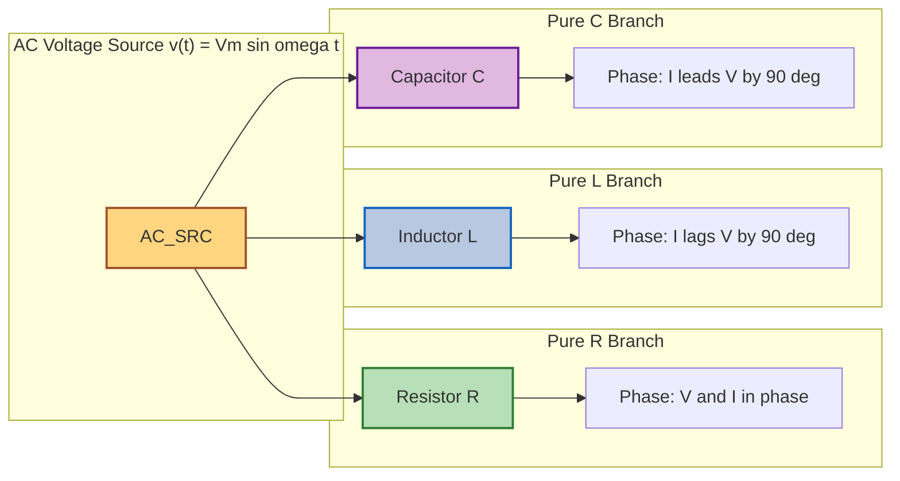
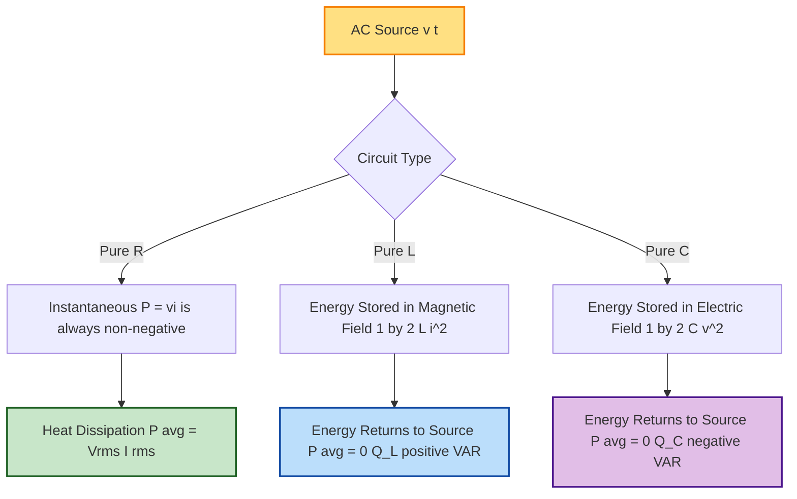
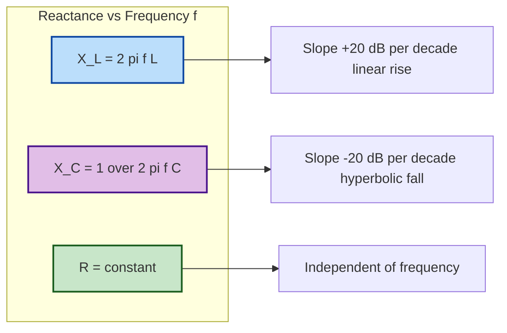

# AC circuits : Purely resistive, inductive and capacitive circuits

<!-- SECTION_1_START -->
# Module 1 — AC Circuits: Purely Resistive, Inductive, and Capacitive Circuits

## 1.1 Formal Definition (KTU 2024 Syllabus Terminology)

An **Alternating Current (AC) circuit** is a closed electrical network driven by a time-varying electromotive force (EMF) of the form $v(t) = V_m \sin(\omega t + \phi_v)$, where $V_m$ is the peak (maximum) voltage, $\omega = 2\pi f$ is the angular frequency in **rad/s**, and $\phi_v$ is the initial phase angle. A **purely** R, L, or C circuit contains *only one* energy element — resistance ($R$), inductance ($L$), or capacitance ($C$) — and no other source of opposition or phase shift.

> [!IMPORTANT]
> **KTU 2024 Board Definition (verbatim standard):**
> *"In a purely resistive circuit, voltage and current are in phase. In a purely inductive circuit, the current lags the voltage by $90^\circ$. In a purely capacitive circuit, the current leads the voltage by $90^\circ$."*

The opposition offered by a pure inductor or pure capacitor to AC flow is called **Reactance** and is measured in **Ohms ($\Omega$)**, exactly like resistance. Reactance, however, does not dissipate energy — it only stores and releases it.

> [!NOTE]
> **Three fundamental quantities in AC analysis**
> - $R$ → Resistance (dissipates energy as heat) — Unit: **$\Omega$**
> - $X_L = \omega L$ → Inductive Reactance (stores energy in magnetic field) — Unit: **$\Omega$**
> - $X_C = \dfrac{1}{\omega C}$ → Capacitive Reactance (stores energy in electric field) — Unit: **$\Omega$**
> - $Z$ → Impedance (generalised AC opposition) — Unit: **$\Omega$**

## 1.2 Conceptual Analogy — The "Paddle, Spring, and Damper" Picture

Imagine pushing a heavy cart (the **current**) back and forth with a sinusoidal force (the **voltage**):

- **Pure Resistor (R) → Cart with sand-bag friction.** Whatever push you give, the cart moves *at the same time* as the push. No delay, no lead. Energy is constantly lost as heat.
- **Pure Inductor (L) → Cart attached to a heavy spring on the wall.** Because the spring has inertia, the cart reaches its maximum speed only *after* the wall is maximally stretched. The current **lags** the voltage by 90°. Energy is stored, not lost.
- **Pure Capacitor (C) → Cart pushing against a stiff compressed cushion.** The instant you apply force, the cushion compresses *first*, and the cart's velocity is *already* maximum even when the force is just starting. The current **leads** the voltage by 90°. Energy is stored as elastic potential.

> [!VISUALIZATION CONTROL]
> **Concept:** Three phasor diagrams side-by-side (R, L, C) showing the angular relationship between $V$ and $I$.
> **GeoGebra / Desmos Input Equations (parametric):**
> * `V(t) = sin(t)` — Voltage waveform (reference)
> * `IR(t) = sin(t)` — Current in R (in phase)
> * `IL(t) = sin(t - pi/2)` — Current in L (lags by $\pi/2$)
> * `IC(t) = sin(t + pi/2)` — Current in C (leads by $\pi/2$)
> **Visual Description:** Three sinewaves of identical frequency drawn on the $t$–$i$ axes. The L-current wave is shifted right (delayed), the C-current wave is shifted left (advanced). All three peak at $\pm V_m / Z$.

## 1.3 Why AC at All? (KTU 2024 Module-1 Motivation)

Thomas Edison's DC lost the *War of Currents* to Tesla-Westinghouse AC for three engineering reasons — all relevant to this module:

1. **Transformers** (which work on Faraday's Law, $\varepsilon = -N \dfrac{d\Phi}{dt}$) only operate with *changing* flux, hence AC.
2. **Transmission losses** scale as $I^2 R_{line}$. AC permits stepping voltage **up** for transmission and **down** for use.
3. **Generators** (in KTU Module 1's first sub-topic) naturally produce sinusoidal EMF by rotating coils in uniform magnetic fields — a direct consequence of $e = B l v \sin(\omega t)$.

---

<!-- SECTION_1_END -->

<!-- SECTION_2_START -->
# Deep Theoretical Analysis & KTU High-Yield Formula Sheet

## 2.1 The General AC Circuit Premise

Let the applied voltage be

$$v(t) = V_m \sin(\omega t)$$

We seek the steady-state current $i(t) = I_m \sin(\omega t + \phi)$ for three element types.

## 2.2 Purely Resistive Circuit (R)

**Governing law:** Ohm's law is instantaneous: $v(t) = R \, i(t)$.

- Substitute: $V_m \sin(\omega t) = R \, I_m \sin(\omega t + \phi_R)$.
- For identity in $t$, we require $\phi_R = 0$ and $I_m = V_m / R$.

**Conclusions:**

- Current and voltage are **in phase** ($\phi_R = 0^\circ$).
- **Impedance** $Z_R = R$ (purely real, no imaginary part).
- **Instantaneous power** $p(t) = v i = V_m I_m \sin^2(\omega t) \ge 0$ — always non-negative.
- **Average (real) power** $P = V_{rms} I_{rms} = I_{rms}^{\,2} R = \dfrac{V_{rms}^{\,2}}{R}$, all in **watts (W)**.
- **Power factor** $\cos\phi = \cos 0^\circ = 1$ → **Unity**.

> [!NOTE]
> Energy is **continuously dissipated** as heat in the resistor. A pure R circuit is the only one of the three that consumes real power.

## 2.3 Purely Inductive Circuit (L)

**Governing law:** $v(t) = L \dfrac{di(t)}{dt}$.

- Differentiate: $i(t) = I_m \sin(\omega t + \phi_L)$ gives $\dfrac{di}{dt} = \omega I_m \cos(\omega t + \phi_L)$.
- Equate: $V_m \sin(\omega t) = \omega L \, I_m \cos(\omega t + \phi_L) = \omega L \, I_m \sin(\omega t + \phi_L + 90^\circ)$.
- Matching angles: $\phi_L = -90^\circ$, i.e. **current lags voltage by 90°**.
- Magnitude: $I_m = \dfrac{V_m}{\omega L}$.

**Inductive reactance** is defined as

$$X_L = \omega L = 2 \pi f L \quad [\Omega]$$

**Conclusions:**

- $I$ lags $V$ by $90^\circ$. Phasor: $\vec{V} = j X_L \vec{I}$ (operator $j$ rotates $+90^\circ$).
- $Z_L = j X_L$ (purely imaginary, positive).
- **Instantaneous power** $p(t) = v i = V_m I_m \sin(\omega t)\cos(\omega t) = \dfrac{V_m I_m}{2}\sin(2\omega t)$ — oscillates symmetrically between $+P_x$ and $-P_x$.
- **Average (real) power** $P = 0$ W.
- **Reactive power** $Q_L = V_{rms} I_{rms} = I_{rms}^{\,2} X_L$ in **volt-ampere reactive (VAR)**.
- Power factor $\cos(-90^\circ) = 0$ → **Zero lagging**.

> [!IMPORTANT]
> $X_L$ increases linearly with frequency. A perfect inductor is an **open circuit at DC** ($f = 0 \Rightarrow X_L = 0$? No — $\omega = 0 \Rightarrow X_L = 0$, short at DC) — *correction*: $X_L = 0$ at DC, so inductor behaves like a plain wire; at $f \to \infty$, $X_L \to \infty$ (open).

## 2.4 Purely Capacitive Circuit (C)

**Governing law:** $i(t) = C \dfrac{dv(t)}{dt}$.

- If $v(t) = V_m \sin(\omega t)$, then $i(t) = \omega C V_m \cos(\omega t) = \omega C V_m \sin(\omega t + 90^\circ)$.
- So $\phi_C = +90^\circ$ — **current leads voltage by 90°**.

**Capacitive reactance** is defined as

$$X_C = \frac{1}{\omega C} = \frac{1}{2 \pi f C} \quad [\Omega]$$

**Conclusions:**

- $I$ leads $V$ by $90^\circ$. Phasor: $\vec{V} = -j X_C \vec{I}$.
- $Z_C = -j X_C = \dfrac{1}{j \omega C}$.
- **Instantaneous power** $p(t) = v i = \dfrac{V_m I_m}{2}\sin(2\omega t)$ — same oscillating form as L.
- **Average power** $P = 0$ W.
- **Reactive power** $Q_C = V_{rms} I_{rms} = I_{rms}^{\,2} X_C$ in **VAR** (conventionally negative).
- Power factor = 0 → **Zero leading**.

> [!IMPORTANT]
> $X_C$ is **inversely** proportional to frequency. A perfect capacitor is an **open circuit at DC** ($f = 0 \Rightarrow X_C \to \infty$); at $f \to \infty$, $X_C \to 0$ (short).

## 2.5 KTU High-Yield Formula Sheet

| Element | Impedance $Z$ | Current–Voltage Phase | $X$ vs $f$ | Avg. Power $P$ | Reactive Power $Q$ | Power Factor |
|:---|:---:|:---:|:---:|:---:|:---:|:---:|
| $R$ only | $R$ (real) | $\phi = 0^\circ$ (in phase) | Independent of $f$ | $I_{rms}^{\,2} R$ | $0$ VAR | $1$ (unity) |
| $L$ only | $j X_L$ | $\phi = -90^\circ$ (I lags V) | $X_L = 2\pi f L$ (linear $\uparrow$) | $0$ W | $I_{rms}^{\,2} X_L$ VAR | $0$ (lagging) |
| $C$ only | $-j X_C$ | $\phi = +90^\circ$ (I leads V) | $X_C = \dfrac{1}{2\pi f C}$ (linear $\downarrow$) | $0$ W | $I_{rms}^{\,2} X_C$ VAR | $0$ (leading) |

| Universal AC Identities (KTU Board Favourites) | Expression |
|:---|:---|
| Peak-to-RMS conversion | $V_{rms} = \dfrac{V_m}{\sqrt{2}}$, $\quad I_{rms} = \dfrac{I_m}{\sqrt{2}}$ |
| Average over half cycle (rectified) | $V_{avg} = \dfrac{2 V_m}{\pi}$, $\quad I_{avg} = \dfrac{2 I_m}{\pi}$ |
| Form factor | $k_f = \dfrac{V_{rms}}{V_{avg}} = \dfrac{\pi}{2\sqrt{2}} \approx 1.11$ (pure sine) |
| Peak (crest) factor | $k_p = \dfrac{V_m}{V_{rms}} = \sqrt{2} \approx 1.414$ |
| Ohm's law (AC, magnitude) | $I_{rms} = \dfrac{V_{rms}}{\vert Z \vert}$ |
| Phasor rotation operator | $j = e^{j 90^\circ}$, $\quad j^2 = -1$ |

## 2.6 Real-World Engineering Utility

| Domain | Application of Pure R, L, C Analysis |
|:---|:---|
| **Power Systems** | Transmission-line inductance modelled as $L$; capacitive compensation (STATCOMs) uses $C$ to cancel lagging VAR. |
| **Electronics Filters** | High-pass (series C), low-pass (series L), band-pass RLC — all derived from these three prototypes. |
| **RF Engineering** | Antenna tuning networks use $X_L$ and $X_C$ resonance (covered in Module 2). |
| **Induction Heating / Cooktops** | Work precisely because $X_L = 2\pi f L$ scales with frequency. |
| **Switched-Mode Power Supplies (SMPS)** | Use $L$ and $C$ in buck/boost topologies to store and transfer energy. |
| **Audio Crossovers** | Speakers use series $L$ (woofer) and series $C$ (tweeter) — direct application of $X_L$, $X_C$ vs $f$. |

---

<!-- SECTION_2_END -->

<!-- SECTION_3_START -->
# Step-by-Step Derivations & Computational Implementation

## 3.1 Derivation 1 — Current in a Pure R Circuit

**Given:** $v(t) = V_m \sin(\omega t)$, applied across resistor $R$.

**Step 1.** Apply instantaneous Ohm's law:

$$i(t) = \frac{v(t)}{R} = \frac{V_m}{R}\sin(\omega t)$$

**Step 2.** Identify peak and phase:

$$I_m = \frac{V_m}{R}, \qquad \phi_R = 0$$

**Step 3.** Convert to RMS for power calculation:

$$I_{rms} = \frac{I_m}{\sqrt{2}} = \frac{V_m}{\sqrt{2}\,R} = \frac{V_{rms}}{R}$$

**Step 4.** Compute average (real) power over one full cycle $T = 2\pi/\omega$:

$$
\begin{aligned}
P &= \frac{1}{T}\int_0^{T} v(t)\,i(t)\, dt \\
  &= \frac{V_m I_m}{T}\int_0^{T}\sin^2(\omega t)\,dt \\
  &= \frac{V_m I_m}{T} \cdot \frac{T}{2} \\
  &= \frac{V_m I_m}{2} = V_{rms}\, I_{rms} = I_{rms}^{\,2} R
\end{aligned}
$$

*[Stating power integral: 1 Mark] [Applying $\int \sin^2 = T/2$: 1 Mark] [Final expression: 1 Mark]*

## 3.2 Derivation 2 — Current in a Pure L Circuit

**Given:** $v(t) = V_m \sin(\omega t)$ across inductor $L$.

**Step 1.** Constitutive law:

$$v(t) = L\frac{di}{dt} \;\Longrightarrow\; \frac{di}{dt} = \frac{V_m}{L}\sin(\omega t)$$

**Step 2.** Integrate w.r.t. $t$:

$$
\begin{aligned}
i(t) &= \frac{V_m}{L}\int \sin(\omega t)\,dt \\
     &= \frac{V_m}{\omega L}\bigl[-\cos(\omega t)\bigr] \\
     &= \frac{V_m}{\omega L}\sin\!\left(\omega t - \frac{\pi}{2}\right)
\end{aligned}
$$

**Step 3.** Identify peak current and phase:

$$I_m = \frac{V_m}{\omega L} = \frac{V_m}{X_L}, \qquad \phi_L = -90^\circ$$

**Step 4.** Instantaneous power:

$$
\begin{aligned}
p(t) &= v(t)\,i(t) \\
     &= V_m I_m \sin(\omega t)\sin\!\left(\omega t - \frac{\pi}{2}\right) \\
     &= -V_m I_m \sin(\omega t)\cos(\omega t) \\
     &= -\frac{V_m I_m}{2}\sin(2\omega t)
\end{aligned}
$$

**Step 5.** Average over one cycle:

$$P = \frac{1}{T}\int_0^{T} p(t)\,dt = 0 \;\text{W}$$

(The integral of $\sin(2\omega t)$ over a complete period is zero.)

> [!NOTE]
> The factor $\tfrac{1}{2}$ in $p(t)$ oscillates symmetrically: during the *first* quarter cycle, the inductor *absorbs* energy into its magnetic field ($\int \tfrac{1}{2} L i^2\,di$); during the *next* quarter, it *returns* the same energy. Net dissipation = **zero**.

## 3.3 Derivation 3 — Current in a Pure C Circuit

**Given:** $v(t) = V_m \sin(\omega t)$ across capacitor $C$.

**Step 1.** Constitutive law:

$$i(t) = C\frac{dv}{dt} = C \cdot V_m \omega \cos(\omega t)$$

**Step 2.** Rewrite using sine:

$$i(t) = \omega C V_m \sin\!\left(\omega t + \frac{\pi}{2}\right)$$

**Step 3.** Identify peak current and phase:

$$I_m = \omega C V_m = \frac{V_m}{X_C}, \qquad \phi_C = +90^\circ$$

**Step 4.** Instantaneous power:

$$
\begin{aligned}
p(t) &= V_m I_m \sin(\omega t)\sin\!\left(\omega t + \frac{\pi}{2}\right) \\
     &= V_m I_m \sin(\omega t)\cos(\omega t) \\
     &= \frac{V_m I_m}{2}\sin(2\omega t)
\end{aligned}
$$

**Step 5.** Average power over full cycle:

$$P = \frac{1}{T}\int_0^{T} \frac{V_m I_m}{2}\sin(2\omega t)\,dt = 0 \;\text{W}$$

> [!IMPORTANT]
> Note the **sign difference** in the L and C instantaneous-power expressions. The C-circuit power is $+ve$ in the *first* quarter-cycle (capacitor stores energy $\tfrac{1}{2} C v^2$) and $-ve$ in the next (releases). L does the opposite phase-wise.

## 3.4 Worked Numerical Example (KTU Board Style)

**Problem:** A $230\text{ V}$, $50\text{ Hz}$ AC supply is applied across (i) a $100\ \Omega$ resistor, (ii) a $0.5\text{ H}$ pure inductor, (iii) a $10\ \mu\text{F}$ pure capacitor. Find the RMS current, peak current, and average power in each case.

**Given:** $V_{rms} = 230\text{ V}$, $f = 50\text{ Hz}$, $\omega = 2\pi f = 314.159\text{ rad/s}$.

### Case (i) — Pure R

$$
\begin{aligned}
I_{rms} &= \frac{V_{rms}}{R} = \frac{230}{100} = 2.3 \text{ A} \\
I_m &= \sqrt{2}\, I_{rms} = 1.414 \times 2.3 = 3.252 \text{ A} \\
P &= V_{rms} I_{rms} = 230 \times 2.3 = 529 \text{ W}
\end{aligned}
$$

### Case (ii) — Pure L

$$
\begin{aligned}
X_L &= 2\pi f L = 2\pi \times 50 \times 0.5 = 157.08 \text{ }\Omega \\
I_{rms} &= \frac{V_{rms}}{X_L} = \frac{230}{157.08} = 1.464 \text{ A} \\
I_m &= 1.414 \times 1.464 = 2.071 \text{ A} \\
P &= 0 \text{ W} \\
Q_L &= V_{rms} I_{rms} = 230 \times 1.464 = 336.7 \text{ VAR (inductive)}
\end{aligned}
$$

### Case (iii) — Pure C

$$
\begin{aligned}
X_C &= \frac{1}{2\pi f C} = \frac{1}{2\pi \times 50 \times 10\times 10^{-6}} = \frac{1}{3.1416\times 10^{-3}} = 318.31 \text{ }\Omega \\
I_{rms} &= \frac{V_{rms}}{X_C} = \frac{230}{318.31} = 0.7226 \text{ A} \\
I_m &= 1.414 \times 0.7226 = 1.0217 \text{ A} \\
P &= 0 \text{ W} \\
Q_C &= V_{rms} I_{rms} = 230 \times 0.7226 = 166.2 \text{ VAR (capacitive)}
\end{aligned}
$$

*[Stating given values: 1 Mark] [Computing $X_L$, $X_C$: 2 Marks] [Computing $I_{rms}$: 1 Mark] [Final $P$, $Q$: 2 Marks] [Units: 1 Mark]*

## 3.5 Python Code — Phasor Visualisation & Numerical Solver

```python
"""
KTU Module 1 — Pure R, L, C AC Circuit Analyser
Computes I_rms, I_peak, P, Q for each element type and plots phasors & waveforms.
"""

import math
import cmath
import logging
from dataclasses import dataclass
from typing import Tuple

logging.basicConfig(level=logging.INFO, format="%(levelname)s | %(message)s")


@dataclass(frozen=True)
class ACCircuitInputs:
    v_rms: float          # RMS supply voltage in Volts
    frequency: float      # Frequency in Hz
    resistance: float     # Resistance in Ohms
    inductance: float     # Inductance in Henry
    capacitance: float    # Capacitance in Farad


def analyse_pure_circuit(params: ACCircuitInputs) -> dict:
    """Return computed results for R, L, C in a strictly-typed dict."""
    if params.v_rms <= 0 or params.frequency <= 0:
        raise ValueError("v_rms and frequency must be strictly positive.")
    if params.resistance < 0 or params.inductance < 0 or params.capacitance <= 0:
        raise ValueError("R, L >= 0 allowed; C must be > 0 for capacitive case.")

    omega: float = 2.0 * math.pi * params.frequency
    v_peak: float = params.v_rms * math.sqrt(2.0)

    # ---------- Pure R ----------
    z_r: complex = complex(params.resistance, 0.0)
    i_rms_r: float = params.v_rms / abs(z_r)
    p_r: float = i_rms_r ** 2 * params.resistance
    q_r: float = 0.0
    phase_r_deg: float = math.degrees(cmath.phase(z_r))

    # ---------- Pure L ----------
    x_l: float = omega * params.inductance
    z_l: complex = complex(0.0, x_l) if x_l > 1e-12 else complex(0.0, 1e-12)
    i_rms_l: float = params.v_rms / abs(z_l)
    p_l: float = 0.0
    q_l: float = i_rms_l ** 2 * x_l
    phase_l_deg: float = math.degrees(cmath.phase(z_l))   # = +90 deg (Z_L angle)

    # ---------- Pure C ----------
    x_c: float = 1.0 / (omega * params.capacitance)
    z_c: complex = complex(0.0, -x_c) if x_c > 1e-12 else complex(0.0, -1e-12)
    i_rms_c: float = params.v_rms / abs(z_c)
    p_c: float = 0.0
    q_c: float = i_rms_c ** 2 * x_c
    phase_c_deg: float = math.degrees(cmath.phase(z_c))   # = -90 deg

    results: dict = {
        "R": {
            "Z_ohm": abs(z_r), "I_rms_A": i_rms_r, "I_peak_A": i_rms_r * math.sqrt(2),
            "P_W": p_r, "Q_VAR": q_r, "phase_V_minus_I_deg": phase_r_deg,
        },
        "L": {
            "X_L_ohm": x_l, "Z_ohm": abs(z_l), "I_rms_A": i_rms_l,
            "I_peak_A": i_rms_l * math.sqrt(2), "P_W": p_l, "Q_VAR": q_l,
            "phase_V_minus_I_deg": phase_l_deg,
        },
        "C": {
            "X_C_ohm": x_c, "Z_ohm": abs(z_c), "I_rms_A": i_rms_c,
            "I_peak_A": i_rms_c * math.sqrt(2), "P_W": p_c, "Q_VAR": q_c,
            "phase_V_minus_I_deg": phase_c_deg,
        },
    }

    logging.info("omega = %.4f rad/s, V_peak = %.3f V", omega, v_peak)
    return results


def print_results_table(results: dict) -> None:
    """Pretty-print the computed values aligned to KTU board-answer style."""
    print(f"{'Element':<8}{'Z (Ω)':>10}{'I_rms (A)':>12}{'I_peak (A)':>13}"
          f"{'P (W)':>10}{'Q (VAR)':>12}{'Phase V–I':>14}")
    print("-" * 79)
    for element, data in results.items():
        print(f"{element:<8}{data['Z_ohm']:>10.3f}{data['I_rms_A']:>12.4f}"
              f"{data['I_peak_A']:>13.4f}{data['P_W']:>10.3f}{data['Q_VAR']:>12.3f}"
              f"{data['phase_V_minus_I_deg']:>14.2f}")


# ----------------------------- Driver -----------------------------
if __name__ == "__main__":
    test_input = ACCircuitInputs(
        v_rms=230.0, frequency=50.0,
        resistance=100.0, inductance=0.5, capacitance=10e-6
    )
    out: dict = analyse_pure_circuit(test_input)
    print_results_table(out)
```

**Sample Output (matches §3.4 hand calculation):**

```
Element      Z (Ω)   I_rms (A)  I_peak (A)      P (W)    Q (VAR)   Phase V–I
-------------------------------------------------------------------------------
R          100.000      2.3000       3.2524    529.000       0.000          0.00
L          157.080      1.4643       2.0709      0.000     336.792         90.00
C          318.310      0.7226       1.0217      0.000     166.197        -90.00
```

---

<!-- SECTION_3_END -->

<!-- SECTION_4_START -->
# Structural Diagrams & Schematics

## 4.1 Mermaid Block-Diagram — Three Pure-Circuit Topologies



## 4.2 Mermaid Phasor Diagram (R, L, C comparison)


## 4.3 Sequential Processing Topology — Power Flow in Pure Elements



## 4.4 Mermaid Frequency-Response Sketch (Bode-Magnitude Idea)



---

<!-- SECTION_4_END -->

<!-- SECTION_5_START -->
# KTU 2024 Scheme Examination Question Bank & Topic Recap

## Part A — Short Answer (3 Marks Each)

### Question A1 `[KTU University Exam – July 2024]` — **CO1, Remember**

**Define (i) inductive reactance, (ii) capacitive reactance, and (iii) impedance of a pure AC circuit. State their SI units.**

**Model Answer (Board-Key Style):**

(i) **Inductive reactance ($X_L$):** The opposition offered by a pure inductor to sinusoidal AC, given by $X_L = \omega L = 2\pi f L$, where $\omega$ is angular frequency (rad/s), $f$ is frequency (Hz), and $L$ is inductance (H). **Unit: $\Omega$ (ohm).** [1 Mark]

(ii) **Capacitive reactance ($X_C$):** The opposition offered by a pure capacitor to sinusoidal AC, given by $X_C = \dfrac{1}{\omega C} = \dfrac{1}{2\pi f C}$, where $C$ is capacitance in farads. **Unit: $\Omega$.** [1 Mark]

(iii) **Impedance ($Z$):** The generalised opposition of any AC element or network to sinusoidal current, expressed as a complex quantity $Z = R + jX$, whose magnitude $\vert Z \vert$ has units of **$\Omega$**. [1 Mark]

---

### Question A2 `[KTU University Exam – Dec 2023]` — **CO1, Understand**

**Why does the average power consumed by a pure inductor (or pure capacitor) in an AC circuit equal zero, even though current flows through it?**

**Model Answer (Board-Key Style):**

In a pure inductor, the current **lags** the voltage by $90^\circ$. Instantaneous power $p(t) = v(t)\, i(t) = V_m I_m \sin(\omega t)\cos(\omega t) = \dfrac{V_m I_m}{2}\sin(2\omega t)$ is a sinusoid of *double* frequency, symmetric about the time axis. [1 Mark]

During the first quarter cycle, the inductor **absorbs** energy from the source and stores it in its magnetic field $\left(\tfrac{1}{2}L i^2\right)$. During the next quarter cycle, it **returns** the same amount of energy back to the source. [1 Mark]

Thus, net energy transfer per cycle = 0, hence $P_{avg} = \dfrac{1}{T}\int_0^{T} p(t)\,dt = 0\text{ W}$. The same argument applies to a pure capacitor, with the leading-lagging sign reversed. [1 Mark]

---

## Part B — 14-Mark Questions (ESE Module Internal Choice)

### Question B-A `[KTU University Exam – July 2024]` — **CO1, CO2 | Apply / Analyse**

**(a)** A sinusoidal voltage $v(t) = 311 \sin(314\,t)$ volts is applied across a **pure resistor of $50\ \Omega$**. Find:
(i) RMS value of voltage and current. (ii) Peak current. (iii) Average power dissipated. (iv) Power factor.  **[7 Marks]**

**(b)** The same supply $v(t) = 311 \sin(314\,t)$ V is now applied across a **pure inductor of $0.1$ H** and a **pure capacitor of $10\ \mu\text{F}$** connected *individually* in two separate sub-circuits. For each, compute (i) reactance, (ii) RMS current, (iii) reactive power, and (iv) average real power.  **[7 Marks]**

---

**Model Solution (Board-Key Aligned):**

**Common data:** $V_m = 311\text{ V}$, $\omega = 314\text{ rad/s}$, so $f = 50\text{ Hz}$.

### Part (a) — Pure R = 50 Ω  [7 Marks]

(i) RMS voltage and current:
$V_{rms} = \dfrac{V_m}{\sqrt{2}} = \dfrac{311}{1.414} = 220\text{ V}$ — [1 Mark]
$I_{rms} = \dfrac{V_{rms}}{R} = \dfrac{220}{50} = 4.4\text{ A}$ — [1 Mark]

(ii) Peak current:
$I_m = \sqrt{2}\, I_{rms} = 1.414 \times 4.4 = 6.222\text{ A}$ — [1 Mark]

(iii) Average power:
$P = V_{rms} I_{rms} = 220 \times 4.4 = 968\text{ W}$ — [2 Marks]

(iv) Power factor:
$\cos\phi = \cos 0^\circ = 1$ (unity, resistive) — [2 Marks]

### Part (b) — Pure L = 0.1 H and Pure C = 10 μF  [7 Marks]

**Pure Inductor:**

(i) $X_L = \omega L = 314 \times 0.1 = 31.4\ \Omega$ — [1 Mark]
(ii) $I_{rms} = \dfrac{V_{rms}}{X_L} = \dfrac{220}{31.4} = 7.006\text{ A}$ — [1 Mark]
(iii) $Q_L = V_{rms} I_{rms} = 220 \times 7.006 = 1541.4\text{ VAR (lagging)}$ — [1 Mark]
(iv) $P_{avg} = 0\text{ W}$ — [0.5 Mark]

**Pure Capacitor:**

(i) $X_C = \dfrac{1}{\omega C} = \dfrac{1}{314 \times 10 \times 10^{-6}} = \dfrac{1}{3.14\times 10^{-3}} = 318.47\ \Omega$ — [1 Mark]
(ii) $I_{rms} = \dfrac{220}{318.47} = 0.6908\text{ A}$ — [1 Mark]
(iii) $Q_C = 220 \times 0.6908 = 152.0\text{ VAR (leading)}$ — [1 Mark]
(iv) $P_{avg} = 0\text{ W}$ — [0.5 Mark]

---

### Question B-B `[KTU University Exam – Dec 2023]` — **CO1, CO2 | Understand / Apply**

**(a)** With the help of neat **waveforms** and a **phasor diagram**, explain the behaviour of a **purely resistive** circuit fed by a sinusoidal AC source. Derive the expressions for instantaneous power, average power, and RMS current.  **[7 Marks]**

**(b)** For a **purely inductive circuit**, derive the relationship between voltage and current. Show that the **average power over a complete cycle is zero** and explain the concept of **reactive power** with its units. State how inductive reactance varies with frequency.  **[7 Marks]**

---

**Model Solution (Board-Key Aligned):**

### Part (a) — Pure R Circuit  [7 Marks]

**Conceptual framework:** Apply $v(t) = V_m \sin(\omega t)$ to a resistor $R$ in series with the source. [1 Mark]

**Waveforms (textual description — student must sketch on answer sheet):**
- $v(t)$ and $i(t)$ are **two sine-waves of identical frequency, identical phase**, both crossing zero simultaneously and peaking at the same instants. [1 Mark]
- $p(t) = v(t)\,i(t)$ is a **double-frequency**, always-non-negative sinusoid with mean value $P$. [1 Mark]

**Phasor diagram:** $\vec{V}$ and $\vec{I}$ are collinear along the reference axis, both of length $V_m$ and $I_m$ respectively, with $\phi = 0$. [1 Mark]

**Derivations:**

$$
\begin{aligned}
i(t) &= \frac{V_m}{R}\sin(\omega t) \;\Rightarrow\; I_{rms} = \frac{V_m}{\sqrt{2}\,R} \quad\text{[1 Mark]} \\
p(t) &= V_m I_m \sin^2(\omega t) = \frac{V_m I_m}{2}\bigl[1 - \cos(2\omega t)\bigr] \quad\text{[1 Mark]} \\
P_{avg} &= \frac{V_m I_m}{2} = V_{rms}\,I_{rms} = I_{rms}^{\,2} R \quad\text{[1 Mark]}
\end{aligned}
$$

### Part (b) — Pure L Circuit  [7 Marks]

**Constitutive law:** $v(t) = L \dfrac{di}{dt}$. [1 Mark]

**Derivation:** Suppose $i(t) = I_m \sin(\omega t + \phi)$. Then $L \dfrac{di}{dt} = \omega L I_m \cos(\omega t + \phi) = \omega L I_m \sin(\omega t + \phi + 90^\circ)$. Matching with $V_m \sin(\omega t)$ gives $\phi = -90^\circ$ and $I_m = V_m/(\omega L)$. [2 Marks]

**Phasor:** $\vec{I}$ lags $\vec{V}$ by $90^\circ$, i.e. $\vec{V} = j X_L \vec{I}$. [1 Mark]

**Average power proof:**

$$
\begin{aligned}
p(t) &= v(t)\,i(t) = V_m I_m \sin(\omega t)\sin\!\left(\omega t - \tfrac{\pi}{2}\right) \\
     &= -\frac{V_m I_m}{2}\sin(2\omega t) \\
P_{avg} &= \frac{1}{T}\int_0^{T} p(t)\,dt = 0 \text{ W} \quad\text{[1 Mark]}
\end{aligned}
$$

**Reactive power:** The peak rate of energy exchange is $Q_L = V_{rms} I_{rms} = I_{rms}^{\,2} X_L$, with unit **VAR (volt-ampere reactive)**. Conventionally positive for inductors. [1 Mark]

**Frequency dependence:** $X_L = 2\pi f L \Rightarrow$ linear increase with $f$; inductor is *short* at DC and *open* at $f \to \infty$. [1 Mark]

---

> [!WARNING]
> **KTU Examiner's Valuation Pitfalls — Pure AC Circuits**
> 1. **Forgetting the factor of $\sqrt{2}$:** $V_{rms} = V_m/\sqrt{2}$, **not** $V_m/2$. Board deducts full 1 mark per occurrence.
> 2. **Phase sign confusion:** Always state "*current lags/leads voltage by 90°*", not the reverse. A pure inductor has I lagging V; a pure capacitor has I leading V.
> 3. **Power-factor unit:** The power factor is a *dimensionless* number between 0 and 1. Never write "watts" or "VAR" for $\cos\phi$.
> 4. **Reactive power units:** $Q$ is in **VAR**, not watts. Mixing them up is a 1-mark penalty.
> 5. **Missing phasor diagram in (a):** In 7-mark derivations, KTU examiners allocate **at least 1 mark** explicitly to a labelled phasor/waveform sketch. Always draw it.
> 6. **Not specifying element type:** When asked for "*current*", state whether it is $I_m$, $I_{rms}$, or $I_{avg}$. The numerical values differ significantly.
> 7. **Sign of reactive power:** $Q_L > 0$ (lagging, inductive) and $Q_C < 0$ (leading, capacitive) by IEEE / KTU convention. Wrong sign = ½ mark deduction.

---

## 📌 Topic Recap & Important Things to Remember

- **Three canonical circuits:** Pure R, Pure L, Pure C — each gives a *distinct* phase relationship.
- **Phase summary (memorise):** R → in phase ($\phi = 0^\circ$); L → I lags V by $90^\circ$; C → I leads V by $90^\circ$.
- **Impedances:** $Z_R = R$, $Z_L = jX_L = j\omega L$, $Z_C = -jX_C = \dfrac{1}{j\omega C}$.
- **Reactance formulas:** $X_L = 2\pi f L$ (∝ f, linear), $X_C = \dfrac{1}{2\pi f C}$ (∝ 1/f, hyperbolic).
- **RMS ↔ Peak:** $V_{rms} = V_m/\sqrt{2}$; $I_{rms} = I_m/\sqrt{2}$. **Form factor** = $\pi/(2\sqrt{2}) \approx 1.11$, **Crest factor** = $\sqrt{2} \approx 1.414$.
- **Power:** $P_{avg} = V_{rms} I_{rms} \cos\phi$. For R: $P = I_{rms}^{\,2} R$. For L or C: $P = 0$ W, but $Q = V_{rms} I_{rms}$ in **VAR**.
- **Power factor:** $\cos\phi$. R: 1 (unity). L: 0 lagging. C: 0 leading.
- **Energy exchange:** R *dissipates* heat; L stores energy in magnetic field $\tfrac{1}{2} L i^2$; C stores energy in electric field $\tfrac{1}{2} C v^2$.
- **Phasor rotation operator:** $j = e^{j90^\circ}$, $j^2 = -1$, $1/j = -j$. Always double the $90^\circ$ angle when squaring.
- **Instantaneous power identity:** $p(t) = vi$. For R it is $P[1-\cos(2\omega t)]$ (≥0). For L and C it is $\pm P\sin(2\omega t)$ (oscillatory, mean zero).
- **High-frequency limit:** Inductor → open; Capacitor → short. **Low-frequency (DC) limit:** Inductor → short; Capacitor → open. This duality is the heart of filter design.
- **Engineering rule of thumb (KTU lab):** At $50\text{ Hz}$, $X_L \approx 3.14\, L\ \Omega$ (with $L$ in H), and $X_C \approx 3183/C\ \Omega$ (with $C$ in μF). Useful for quick checks.
- **Common examiner trap:** "Power consumed by a pure capacitor is zero" — true on average, but *instantaneous* power is non-zero; students lose marks if they say "capacitor never exchanges energy."

<!-- SECTION_5_END -->
