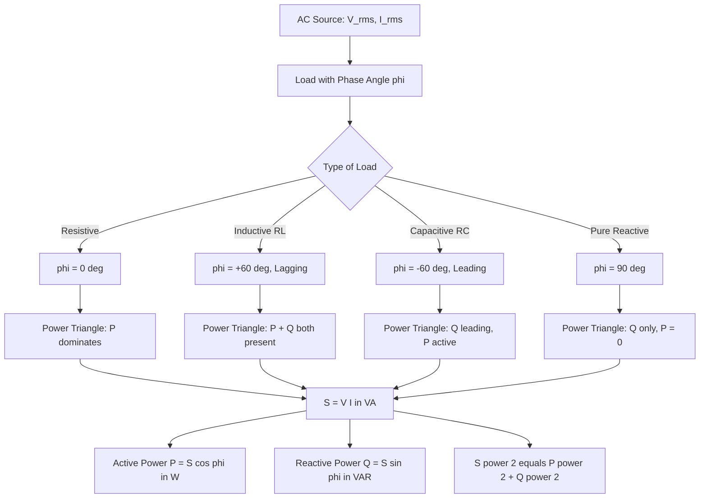
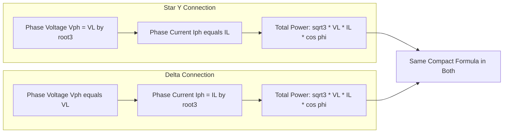
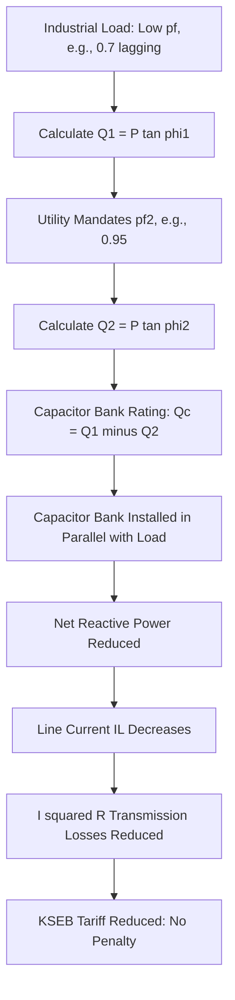
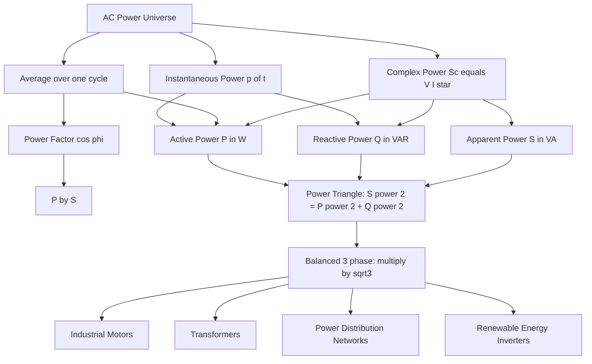

# active, reactive and apparent power in single phase and three phase system. (Simple numerical problems)

<!-- SECTION_1_START -->
# ⚡ Active, Reactive & Apparent Power — The Three Faces of AC Energy

> [!IMPORTANT]
> **KTU 2024 Scheme | Module 1 | GZEST204 — BASIC ELECTRICAL & ELECTRONICS ENGINEERING**
> This topic is a **high-weightage, guaranteed question** area in KTU ESE. Students frequently lose marks due to confusion between **single-phase and three-phase** power formulas. Master the **power triangle** first, and the rest follows naturally.

---

## 1.1 Formal Academic Definition

In any Alternating Current (AC) circuit operating in **sinusoidal steady state**, the instantaneous power $p(t) = v(t) \cdot i(t)$ is **not constant** with time (unlike DC). When a phase difference $\phi$ exists between the voltage and current phasors, the total power delivered to the load resolves into **three orthogonal components**:

| Symbol | Name | Physical Meaning | SI Unit |
|:---:|:---|:---|:---:|
| $P$ | **Active Power** (Real / True Power) | Average rate at which electrical energy is **actually consumed** (converted into heat, light, mechanical work) | **Watt (W)** |
| $Q$ | **Reactive Power** (Imaginary Power) | Rate of energy **oscillation** between source and reactive elements (inductors/capacitors) — no net work done | **Volt-Ampere Reactive (VAR)** |
| $S$ | **Apparent Power** (Complex Magnitude) | Product of **RMS voltage and RMS current** — the *total* power the source must supply | **Volt-Ampere (VA)** |

The relationship between these three is governed by the **Power Triangle**, which is a direct consequence of the right-angled triangle formed by the voltage components $V\cos\phi$ and $V\sin\phi$ in the phasor diagram.

---

## 1.2 Conceptual Analogy — The 🍺 Beer Mug

Imagine a bartender serves you a tall mug of beer. Look at it carefully:

- 🍺 **The Beer (Liquid)** → This is the **Active Power ($P$)**. It is what actually quenches your thirst. Useful, real, paid-for.
- 🫧 **The Foam on top** → This is the **Reactive Power ($Q$)**. It occupies volume, makes the mug look full, and the bartender charges you for it — but it gives you **zero satisfaction**.
- 🍻 **The Mug's Total Volume (Beer + Foam)** → This is the **Apparent Power ($S$)**. The bartender fills the mug, claims it's a "full mug" — that's your billable amount.

The **Power Factor ($\cos\phi$)** is the ratio:

$$\cos\phi = \frac{\text{Beer (useful)}}{\text{Total volume (billed)}}$$

A low power factor means you paid for a lot of **foam** (reactive power) and got very little **beer** (active power). Power companies **penalize industries** for low power factor because the foam still requires them to generate, transmit, and distribute current.

> [!NOTE]
> **Geometric Intuition (Power Triangle):**
> The Power Triangle is a **right-angled triangle** where:
> - **Base** = Active Power $P = S\cos\phi$
> - **Perpendicular (Height)** = Reactive Power $Q = S\sin\phi$
> - **Hypotenuse** = Apparent Power $S = \sqrt{P^2 + Q^2}$
> - **Angle at base** = Phase angle $\phi$ between voltage and current

---

## 1.3 Single-Phase vs. Three-Phase — Why Two Sets of Formulas?

A **single-phase** system has one voltage source and one current path — like a bicycle.
A **three-phase** system has three voltage sources, **120° apart**, and uses **two possible connection types**:

1. **Star (Y) connection** — Line voltage $V_L = \sqrt{3} \cdot V_{ph}$ and Line current $I_L = I_{ph}$
2. **Delta ($\Delta$) connection** — Line voltage $V_L = V_{ph}$ and Line current $I_L = \sqrt{3} \cdot I_{ph}$

In both cases, the **total three-phase active power** turns out to be the **same compact formula**:

$$P_{3\phi} = \sqrt{3} \cdot V_L \cdot I_L \cdot \cos\phi$$

This is the single most tested equation in the entire module. Commit it to memory.

> [!VISUALIZATION CONTROL]
> **Concept:** The Power Triangle as a rotating phasor visualization
> **GeoGebra / Desmos Input Equations:**
> * `S = 100` (Apparent power, constant hypotenuse)
> * `P(theta) = 100*cos(theta)` (Active component)
> * `Q(theta) = 100*sin(theta)` (Reactive component)
> * Plot the parametric point $(P(\theta), Q(\theta))$ as $\theta$ varies from $0$ to $90°$.
> **Visual Description:** The point $(P, Q)$ traces a quarter-circle on the positive quadrant, with its distance from origin always equal to $S$. As $\theta \to 0$, the point slides to the right (purely resistive load). As $\theta \to 90°$, it slides up (purely reactive load). This is why $P^2 + Q^2 = S^2$ holds geometrically.

---

<!-- SECTION_1_END -->

<!-- SECTION_2_START -->
# 📘 Deep Theoretical Analysis & KTU High-Yield Formula Sheet

## 2.1 Deriving the Three Powers from First Principles

Consider a single-phase AC circuit with:
- Voltage: $v(t) = V_m \sin(\omega t)$
- Current: $i(t) = I_m \sin(\omega t - \phi)$

The **instantaneous power** is:

$$p(t) = v(t) \cdot i(t) = V_m I_m \sin(\omega t) \sin(\omega t - \phi)$$

Applying the trigonometric identity $\sin A \sin B = \frac{1}{2}[\cos(A-B) - \cos(A+B)]$:

$$p(t) = \frac{V_m I_m}{2} \left[ \cos\phi - \cos(2\omega t - \phi) \right]$$

Splitting this expression:

$$p(t) = \underbrace{\frac{V_m I_m}{2}\cos\phi}_{\text{Constant term (Active)}} - \underbrace{\frac{V_m I_m}{2}\cos(2\omega t - \phi)}_{\text{Oscillating term (Reactive)}}$$

The **time-average** over one full cycle eliminates the oscillating term (since average of cosine over a period = 0). Hence:

$$\boxed{P = \frac{V_m I_m}{2}\cos\phi = V_{rms} I_{rms} \cos\phi}$$

The **magnitude** of the oscillating term is the reactive power:

$$\boxed{Q = V_{rms} I_{rms} \sin\phi}$$

The **product of RMS values** is the apparent power:

$$\boxed{S = V_{rms} I_{rms}}$$

---

## 2.2 The Complex Power Representation

For phasor-domain analysis, the **complex power** $S_c$ is a single elegant quantity:

$$S_c = V \cdot I^* = P + jQ$$

where $I^*$ is the **complex conjugate** of the current phasor. This is what makes AC analysis tractable — you can compute $P$ and $Q$ in a single multiplication.

The magnitude:

$$|S_c| = \sqrt{P^2 + Q^2} = S$$

The argument of $S_c$ is the power factor angle $\phi$.

---

## 2.3 Three-Phase Power — General Case

For an **unbalanced** three-phase system, the total power is the sum of per-phase powers:

$$P_{3\phi} = V_{an}I_a\cos\phi_a + V_{bn}I_b\cos\phi_b + V_{cn}I_c\cos\phi_c$$

For a **balanced** system (which KTU mostly tests), all three phases are identical, so:

$$P_{3\phi} = 3 \cdot V_{ph} I_{ph} \cos\phi$$

Using $V_{ph} = V_L / \sqrt{3}$ and $I_{ph} = I_L$ (Star), or $V_{ph} = V_L$ and $I_{ph} = I_L / \sqrt{3}$ (Delta), in **both cases**:

$$\boxed{P_{3\phi} = \sqrt{3} \cdot V_L \cdot I_L \cdot \cos\phi}$$

Similarly:

$$\boxed{Q_{3\phi} = \sqrt{3} \cdot V_L \cdot I_L \cdot \sin\phi}$$

$$\boxed{S_{3\phi} = \sqrt{3} \cdot V_L \cdot I_L}$$

---

## 2.4 Power Factor — The Hidden Multiplier

Power Factor ($pf$) tells us how "efficiently" current is being converted to useful work.

| Load Type | Phase Angle $\phi$ | Power Factor | Nature |
|:---|:---:|:---:|:---:|
| Pure Resistor (Heater, Bulb) | $0°$ | $\cos 0° = 1$ | **Unity** $pf$ — All real, no reactive |
| RL Load (Induction Motor) | $+30°$ to $+60°$ | $0.5$ to $0.87$ | **Lagging** — Inductor stores energy |
| RC Load (Capacitor bank) | $-30°$ to $-60°$ | $0.5$ to $0.87$ | **Leading** — Capacitor supplies reactive power |
| Pure Inductor / Capacitor | $\pm 90°$ | $\cos 90° = 0$ | **Zero** $pf$ — All reactive, no work |

> [!NOTE]
> **Industrial Reality:** Most industrial loads (motors, transformers) are **inductive**, drawing **lagging** current. To compensate, industries install **capacitor banks** that supply **leading** reactive power, effectively cancelling out the lagging component and bringing $pf$ closer to unity. This is **power factor correction**.

---

## 2.5 ⚡ KTU Formula Cheat Sheet (Memorize This Block)

> [!IMPORTANT]
> **THE ONLY TABLE YOU NEED FOR THIS TOPIC**

| Quantity | Single-Phase | Three-Phase (Balanced) | Unit |
|:---|:---:|:---:|:---:|
| **Apparent Power ($S$)** | $S = V \cdot I$ | $S = \sqrt{3} \cdot V_L \cdot I_L$ | **VA** |
| **Active Power ($P$)** | $P = V \cdot I \cdot \cos\phi$ | $P = \sqrt{3} \cdot V_L \cdot I_L \cdot \cos\phi$ | **W (Watt)** |
| **Reactive Power ($Q$)** | $Q = V \cdot I \cdot \sin\phi$ | $Q = \sqrt{3} \cdot V_L \cdot I_L \cdot \sin\phi$ | **VAR** |
| **Complex Power ($S_c$)** | $S_c = V I^* = P + jQ$ | $S_c = 3 V_{ph} I_{ph}^*$ | **VA** |
| **Power Factor ($pf$)** | $\cos\phi = P / S$ | $\cos\phi = P / S$ | **dimensionless** |
| **Triangle Relation** | $S^2 = P^2 + Q^2$ | $S^2 = P^2 + Q^2$ | — |
| **Phase Relations (Star)** | — | $V_L = \sqrt{3} V_{ph}$, $I_L = I_{ph}$ | V, A |
| **Phase Relations (Delta)** | — | $V_L = V_{ph}$, $I_L = \sqrt{3} I_{ph}$ | V, A |
| **Power in $dB$** | $P_{dB} = 10 \log_{10}(P / P_{ref})$ | Same formula | dB |

> [!WARNING]
> **CRITICAL KTU EXAM MISTAKE:** Students often write $P = \sqrt{3} \cdot V_L \cdot I_L \cdot \cos\phi$ for *single-phase* — this is **WRONG**. The $\sqrt{3}$ appears **ONLY** in three-phase systems. In single-phase: $P = V I \cos\phi$ — that's it.

---

## 2.6 Real-World Engineering Applications

| Domain | Application | Why It Matters |
|:---|:---|:---|
| **Power Utilities (KSEB)** | Tariff billing based on $kVAh$ | Penalizes low $pf$ consumers; charges for apparent power |
| **Industrial Plants** | Capacitor banks for $pf$ correction | Reduces $I_L$, hence lower $I^2R$ losses in cables |
| **Data Centers** | UPS sizing in $kVA$ | Generators/UPS rated in $kVA$, not $kW$ |
| **Electric Vehicles** | Motor controller rating | Inverter rated in $kVA$, battery delivers $kW$ |
| **Renewable Energy (Solar Inverters)** | Inverter capacity selection | Inverter $kVA$ rating must exceed solar $kW$ by a safety margin |

---

<!-- SECTION_2_END -->

<!-- SECTION_3_START -->
# 🧮 Step-by-Step Derivations & Numerical Problem Solving

## 3.1 Solved Example 1 — Single-Phase AC Circuit

> **Problem [KTU University Exam — July 2024 Style]:**
> A single-phase load draws a current of **10 A** from a **230 V, 50 Hz** AC supply. The power consumed by the load is **1.5 kW**. Calculate:
> (a) Apparent Power $S$
> (b) Reactive Power $Q$
> (c) Power Factor $pf$
> (d) Phase Angle $\phi$

**Given Data:**
- $V = 230$ V (RMS)
- $I = 10$ A (RMS)
- $P = 1.5$ kW $= 1500$ W

### Part (a) — Apparent Power $S$

$$S = V \cdot I = 230 \times 10 = 2300 \text{ VA} = 2.3 \text{ kVA}$$

**[Mark Allocation: Formula 1M, Substitution 1M, Final Answer with Unit 1M = 3 Marks]**

### Part (b) — Reactive Power $Q$

Using the power triangle identity:

$$S^2 = P^2 + Q^2$$

$$Q = \sqrt{S^2 - P^2}$$

$$Q = \sqrt{(2300)^2 - (1500)^2}$$

$$Q = \sqrt{5{,}290{,}000 - 2{,}250{,}000}$$

$$Q = \sqrt{3{,}040{,}000}$$

$$Q = 1743.56 \text{ VAR} \approx 1.744 \text{ kVAR}$$

### Part (c) — Power Factor

$$pf = \cos\phi = \frac{P}{S} = \frac{1500}{2300} = 0.6522 \text{ (lagging)}$$

### Part (d) — Phase Angle

$$\phi = \cos^{-1}(0.6522) = 49.25°$$

> [!IMPORTANT]
> **Verification Check:** Since $P < S$ and the result is a positive $\phi$, this is an **inductive (lagging) load** — consistent with most real-world AC loads. ✓

---

## 3.2 Solved Example 2 — Three-Phase Balanced System

> **Problem [KTU University Exam — Dec 2023 Style]:**
> A **three-phase, 400 V, 50 Hz** balanced star-connected induction motor draws a line current of **20 A** at a power factor of **0.85 lagging**. Calculate:
> (a) Active Power $P$
> (b) Reactive Power $Q$
> (c) Apparent Power $S$
> (d) Phase Voltage $V_{ph}$ and Phase Current $I_{ph}$

**Given Data:**
- $V_L = 400$ V
- $I_L = 20$ A
- $\cos\phi = 0.85$ (lagging)
- Connection: **Star (Y)**

### Part (a) — Active Power $P$

$$P = \sqrt{3} \cdot V_L \cdot I_L \cdot \cos\phi$$

$$P = \sqrt{3} \times 400 \times 20 \times 0.85$$

$$P = 1.732 \times 400 \times 20 \times 0.85$$

$$P = 1.732 \times 6800 = 11{,}777.6 \text{ W} \approx 11.78 \text{ kW}$$

### Part (b) — Reactive Power $Q$

First, find $\sin\phi$:

$$\sin\phi = \sqrt{1 - \cos^2\phi} = \sqrt{1 - (0.85)^2} = \sqrt{1 - 0.7225} = \sqrt{0.2775} = 0.5268$$

Now:

$$Q = \sqrt{3} \cdot V_L \cdot I_L \cdot \sin\phi$$

$$Q = 1.732 \times 400 \times 20 \times 0.5268$$

$$Q = 1.732 \times 4214.4 = 7{,}299.34 \text{ VAR} \approx 7.30 \text{ kVAR}$$

### Part (c) — Apparent Power $S$

$$S = \sqrt{3} \cdot V_L \cdot I_L = 1.732 \times 400 \times 20 = 13{,}856 \text{ VA} \approx 13.86 \text{ kVA}$$

**Cross-check using Pythagorean Theorem:**

$$S = \sqrt{P^2 + Q^2} = \sqrt{(11777.6)^2 + (7299.34)^2} = \sqrt{138{,}711{,}789 + 53{,}280{,}000} = 13{,}856 \text{ VA} \checkmark$$

### Part (d) — Phase Quantities (Star Connection)

$$V_{ph} = \frac{V_L}{\sqrt{3}} = \frac{400}{1.732} = 230.94 \text{ V}$$

$$I_{ph} = I_L = 20 \text{ A (Star connection)}$$

> [!NOTE]
> **KTU Pattern Tip:** In star-connected systems, the **line current equals the phase current**, but the **line voltage is $\sqrt{3}$ times the phase voltage**. In delta, it is reversed. KTU frequently tests this distinction.

---

## 3.3 Solved Example 3 — Power Factor Correction

> **Problem [KTU University Exam — Dec 2024 Style]:**
> A factory operates at a **power factor of 0.7 lagging** and consumes **100 kW** from a **415 V, three-phase** supply. The supply authority mandates a $pf$ of **0.95 lagging**. Find the rating of the capacitor bank (in $kVAR$) required to be installed.

**Given Data:**
- Initial $pf_1 = \cos\phi_1 = 0.7 \Rightarrow \phi_1 = \cos^{-1}(0.7) = 45.57°$
- Target $pf_2 = \cos\phi_2 = 0.95 \Rightarrow \phi_2 = \cos^{-1}(0.95) = 18.19°$
- Active Power $P = 100$ kW (constant — capacitors do not change $P$)

**Step 1:** Calculate the initial reactive power demand:

$$Q_1 = P \tan\phi_1 = 100 \times \tan(45.57°) = 100 \times 1.0203 = 102.03 \text{ kVAR}$$

**Step 2:** Calculate the final reactive power demand:

$$Q_2 = P \tan\phi_2 = 100 \times \tan(18.19°) = 100 \times 0.3287 = 32.87 \text{ kVAR}$$

**Step 3:** Capacitor bank rating:

$$Q_C = Q_1 - Q_2 = 102.03 - 32.87 = 69.16 \text{ kVAR}$$

> [!IMPORTANT]
> **Key Insight:** The capacitor bank supplies the **difference** in reactive power. The active power $P$ remains **unchanged** because capacitors only inject reactive power, not real power. The line current reduces, reducing $I^2R$ transmission losses — this is why utilities reward high $pf$.

---

## 3.4 Solved Example 4 — Complex Power & Two-Wattmeter Method (Conceptual)

> **Problem [KTU University Exam — July 2023 Style]:**
> In a **three-phase, 400 V** star-connected balanced load, the **two-wattmeter method** reads $W_1 = 5$ kW and $W_2 = 2$ kW. Determine the total active power, reactive power, and power factor.

**Solution:**

For the two-wattmeter method:

$$P_{total} = W_1 + W_2 = 5 + 2 = 7 \text{ kW}$$

$$Q_{total} = \sqrt{3} \cdot (W_1 - W_2) = \sqrt{3} \times (5 - 2) = 1.732 \times 3 = 5.196 \text{ kVAR}$$

$$S_{total} = \sqrt{P^2 + Q^2} = \sqrt{49 + 27} = \sqrt{76} = 8.718 \text{ kVA}$$

$$pf = \cos\phi = \frac{P}{S} = \frac{7}{8.718} = 0.803 \text{ (lagging)}$$

---

<!-- SECTION_3_END -->

<!-- SECTION_4_START -->
# 🔧 Structural Diagrams, Phasor Schematics & Power Triangle Flow

## 4.1 Mermaid Diagram — The Power Triangle Architecture

## 4.2 Mermaid Diagram — Three-Phase Power Flow (Star vs. Delta)

## 4.3 Mermaid Diagram — Power Factor Correction Flow

## 4.4 Mermaid Diagram — Complete AC Power Classification Topology

> [!NOTE]
> **Reading Tip for KTU:** When you see $V$ or $I$ alone in a three-phase problem statement, **assume line values** $V_L$ and $I_L$ unless explicitly stated as $V_{ph}$ or $I_{ph}$. Then apply the correct conversion based on the connection (Star or Delta) before using the $\sqrt{3} V_L I_L \cos\phi$ formula.

---

<!-- SECTION_4_END -->

<!-- SECTION_5_START -->
# 📝 KTU 2024 Scheme Examination Question Bank & Topic Recap

---

## 5.1 PART A — Short Answer Questions (3 Marks Each)

### Question 1 [KTU University Exam — July 2024]
**Define the following terms with proper SI units:**
(a) Active Power
(b) Reactive Power
(c) Apparent Power

**Model Answer:**

**(a) Active Power (P):** The average value of instantaneous power over one complete cycle, representing the actual power consumed (converted to heat, light, mechanical work) by a load. Mathematically, $P = VI\cos\phi$. **Unit: Watt (W)** or **kW**.

**(b) Reactive Power (Q):** The power that oscillates between the source and the reactive elements (inductors/capacitors) of the load. It does no net work but is essential to maintain the magnetic/electric fields. Mathematically, $Q = VI\sin\phi$. **Unit: Volt-Ampere Reactive (VAR)** or **kVAR**.

**(c) Apparent Power (S):** The product of RMS voltage and RMS current, representing the total power the source must supply. It is the magnitude of complex power. Mathematically, $S = VI = \sqrt{P^2 + Q^2}$. **Unit: Volt-Ampere (VA)** or **kVA**.

> **Mark Allocation:** [Each definition with formula and unit: 1 Mark × 3 = 3 Marks]

---

### Question 2 [KTU University Exam — Dec 2023]
**What is power factor? State its significance in AC power systems.**

**Model Answer:**

**Definition:** Power factor is the cosine of the angle $\phi$ between the voltage and current phasors in an AC circuit. It is defined as:

$$pf = \cos\phi = \frac{P}{S} = \frac{\text{Active Power}}{\text{Apparent Power}}$$

**Significance:**
1. **Billing:** Utilities (KSEB) charge industrial consumers based on $kVA$ demand; a low $pf$ means a higher bill for the same $kW$ of useful work.
2. **Conductor Sizing:** Lower $pf$ requires higher line current for the same active power, demanding thicker (more expensive) conductors.
3. **Losses:** Higher current → higher $I^2R$ losses in transmission and distribution cables.
4. **Voltage Regulation:** Low $pf$ causes larger voltage drops in the system.
5. **Equipment Rating:** Generators and transformers must be sized in $kVA$, not $kW$.

> **Mark Allocation:** [Definition 1M, Formula 0.5M, Any 3 significance points 1.5M = 3 Marks]

---

## 5.2 PART B — Long Answer Questions (14 Marks, Module Internal Choice)

### ✅ QUESTION A — Choice 1 [14 Marks] [KTU University Exam — Dec 2024]

> **Question A (a) [7 Marks] [CO1, Understand]:**
> Explain the concepts of active, reactive, and apparent power in a single-phase AC circuit with the help of the **power triangle**. Derive the relationship $S^2 = P^2 + Q^2$.

**Model Solution:**

In a single-phase AC circuit with voltage $v(t) = V_m\sin(\omega t)$ and current $i(t) = I_m\sin(\omega t - \phi)$:

**Step 1: Instantaneous Power**

$$p(t) = V_m I_m \sin(\omega t)\sin(\omega t - \phi)$$

Using identity $\sin A \sin B = \frac{1}{2}[\cos(A-B) - \cos(A+B)]$:

$$p(t) = \frac{V_m I_m}{2}\cos\phi - \frac{V_m I_m}{2}\cos(2\omega t - \phi)$$

**[Stating the instantaneous power expression: 1 Mark]**

**Step 2: Average (Active) Power**

The average of $\cos(2\omega t - \phi)$ over a full cycle is zero. Therefore:

$$P = \frac{V_m I_m}{2}\cos\phi = V_{rms} I_{rms} \cos\phi$$

**[Deriving active power: 2 Marks]**

**Step 3: Reactive Power**

The amplitude of the oscillating component:

$$Q = V_{rms} I_{rms} \sin\phi$$

**[Deriving reactive power: 1 Mark]**

**Step 4: Apparent Power**

The product of RMS values:

$$S = V_{rms} I_{rms}$$

**[Stating apparent power: 1 Mark]**

**Step 5: Derivation of $S^2 = P^2 + Q^2$**

$$S^2 = (V I)^2$$

$$P^2 + Q^2 = V^2 I^2 \cos^2\phi + V^2 I^2 \sin^2\phi = V^2 I^2 (\cos^2\phi + \sin^2\phi) = V^2 I^2 = S^2$$

Hence $\boxed{S^2 = P^2 + Q^2}$ (verified). **[Final derived expression: 2 Marks]**

---

> **Question A (b) [7 Marks] [CO2, Apply]:**
> A **single-phase motor** operates at **230 V, 50 Hz** and draws a current of **15 A** at a **power factor of 0.75 lagging**. Calculate the active power, reactive power, apparent power, and the phase angle.

**Given:** $V = 230$ V, $I = 15$ A, $\cos\phi = 0.75$ (lagging), $f = 50$ Hz

**Solution:**

**(i) Apparent Power:**

$$S = V \cdot I = 230 \times 15 = 3450 \text{ VA} = 3.45 \text{ kVA}$$

**[Formula + Substitution + Answer: 2 Marks]**

**(ii) Active Power:**

$$P = V I \cos\phi = 230 \times 15 \times 0.75 = 2587.5 \text{ W} \approx 2.59 \text{ kW}$$

**[Formula + Substitution + Answer: 2 Marks]**

**(iii) Reactive Power:**

$$\sin\phi = \sqrt{1 - 0.75^2} = \sqrt{0.4375} = 0.6614$$

$$Q = V I \sin\phi = 230 \times 15 \times 0.6614 = 2281.83 \text{ VAR} \approx 2.28 \text{ kVAR}$$

**[Formula + Substitution + Answer: 2 Marks]**

**(iv) Phase Angle:**

$$\phi = \cos^{-1}(0.75) = 41.41°$$

**[Final answer: 1 Mark]**

---

### ✅ QUESTION B — Choice 2 [14 Marks] [KTU University Exam — July 2024]

> **Question B (a) [7 Marks] [CO1, Understand]:**
> Derive the expression for **total active power, reactive power, and apparent power** in a **three-phase balanced system** for both **star and delta** connections. Show that the compact formula $P = \sqrt{3} V_L I_L \cos\phi$ is valid in both cases.

**Model Solution:**

**Case 1: Star (Y) Connection**

In star connection, line current equals phase current: $I_L = I_{ph}$.
Line voltage is $\sqrt{3}$ times phase voltage: $V_L = \sqrt{3} V_{ph}$, hence $V_{ph} = V_L / \sqrt{3}$.

Power per phase: $P_{ph} = V_{ph} I_{ph} \cos\phi$
Total power: $P_{total} = 3 P_{ph} = 3 \cdot \frac{V_L}{\sqrt{3}} \cdot I_L \cdot \cos\phi = \sqrt{3} V_L I_L \cos\phi$ ✓

**[Derivation for star: 3 Marks]**

**Case 2: Delta ($\Delta$) Connection**

In delta connection, line voltage equals phase voltage: $V_L = V_{ph}$.
Line current is $\sqrt{3}$ times phase current: $I_L = \sqrt{3} I_{ph}$, hence $I_{ph} = I_L / \sqrt{3}$.

Power per phase: $P_{ph} = V_{ph} I_{ph} \cos\phi$
Total power: $P_{total} = 3 P_{ph} = 3 \cdot V_L \cdot \frac{I_L}{\sqrt{3}} \cdot \cos\phi = \sqrt{3} V_L I_L \cos\phi$ ✓

**[Derivation for delta: 3 Marks]**

**Conclusion:** In both star and delta connections, the total three-phase power is:

$$\boxed{P = \sqrt{3} V_L I_L \cos\phi}$$

Similarly, $Q = \sqrt{3} V_L I_L \sin\phi$ and $S = \sqrt{3} V_L I_L$.

**[Stating reactive and apparent power expressions: 1 Mark]**

---

> **Question B (b) [7 Marks] [CO2, Apply]:**
> A **400 V, three-phase, star-connected** balanced load draws a line current of **30 A** at a power factor of **0.8 lagging**. Calculate the total active, reactive, and apparent power. If the power factor is corrected to **0.95 lagging** by adding a capacitor bank, find the rating of the capacitor bank.

**Given:** $V_L = 400$ V, $I_L = 30$ A, $pf_1 = 0.8$ lagging

**Step 1: Initial Power Calculations**

$$P = \sqrt{3} \times 400 \times 30 \times 0.8 = 1.732 \times 9600 = 16{,}627.2 \text{ W} \approx 16.63 \text{ kW}$$

**[Active power: 2 Marks]**

$$\sin\phi_1 = \sqrt{1 - 0.64} = 0.6$$

$$Q_1 = \sqrt{3} \times 400 \times 30 \times 0.6 = 1.732 \times 7200 = 12{,}470.4 \text{ VAR} \approx 12.47 \text{ kVAR}$$

**[Reactive power: 2 Marks]**

$$S = \sqrt{3} \times 400 \times 30 = 20{,}784.6 \text{ VA} \approx 20.78 \text{ kVA}$$

**[Apparent power: 1 Mark]**

**Step 2: Power Factor Correction**

$pf_2 = 0.95 \Rightarrow \tan\phi_2 = \tan(\cos^{-1}(0.95)) = \tan(18.19°) = 0.3287$

$pf_1 = 0.8 \Rightarrow \tan\phi_1 = \tan(36.87°) = 0.75$

$$Q_C = P(\tan\phi_1 - \tan\phi_2) = 16.63 \times (0.75 - 0.3287) = 16.63 \times 0.4213$$

$$Q_C = 7.01 \text{ kVAR}$$

**[Capacitor bank rating: 2 Marks]**

> [!WARNING]
> **KTU Examiner's Valuation Warning — Common Pitfalls:**
> 1. **Unit Confusion:** Don't mix up **W**, **VAR**, and **VA**. KTU strictly expects correct units. Writing "$P = 16.63$ VA" instead of "**kW**" costs full marks.
> 2. **Three-phase formula mix-up:** A common student error is using $P = V_L I_L \cos\phi$ (single-phase formula) in a 3-phase problem. **Always include the $\sqrt{3}$ for 3-phase.**
> 3. **Sign of reactive power:** For lagging $pf$ (inductive loads), $Q$ is taken as **positive**. For leading $pf$ (capacitive), $Q$ is **negative**. KTU may deduct marks for incorrect sign.
> 4. **Power factor correction formula:** Students often write $Q_C = Q_1 - Q_2$ directly without computing $\tan\phi$. Show the intermediate step of $\tan\phi$ computation for full marks.
> 5. **Missing RMS clarification:** In AC power formulas, $V$ and $I$ are **RMS** values — not peak. KTU accepts either $V_{rms}$ or $V$ if mentioned as RMS in the problem.

---

## 5.3 📌 Topic Recap & Important Things to Remember

> [!IMPORTANT]
> **Ultra-Fast Revision Checklist — Pin This on Your Wall!**

- ✅ **Active Power $P$** = $VI\cos\phi$ (1-$\phi$) or $\sqrt{3} V_L I_L \cos\phi$ (3-$\phi$) — measured in **Watts (W)**
- ✅ **Reactive Power $Q$** = $VI\sin\phi$ (1-$\phi$) or $\sqrt{3} V_L I_L \sin\phi$ (3-$\phi$) — measured in **VAR**
- ✅ **Apparent Power $S$** = $VI$ (1-$\phi$) or $\sqrt{3} V_L I_L$ (3-$\phi$) — measured in **VA**
- ✅ **Power Triangle:** $S$ is the hypotenuse, $P$ is the base, $Q$ is the height. $S^2 = P^2 + Q^2$
- ✅ **Power Factor** = $\cos\phi = P/S$ — dimensionless, range $[-1, +1]$
- ✅ **Lagging $pf$** → Inductive load (motor, transformer). **Leading $pf$** → Capacitive load
- ✅ **Star Connection:** $V_L = \sqrt{3} V_{ph}$, $I_L = I_{ph}$
- ✅ **Delta Connection:** $V_L = V_{ph}$, $I_L = \sqrt{3} I_{ph}$
- ✅ **Compact 3-$\phi$ Formula** $P = \sqrt{3} V_L I_L \cos\phi$ holds for **BOTH** star and delta
- ✅ **$pf$ Correction Capacitor Rating:** $Q_C = P(\tan\phi_1 - \tan\phi_2)$ in $kVAR$
- ✅ **Beer Mug Analogy:** Active = Beer, Reactive = Foam, Apparent = Total Mug Volume
- ✅ **Industrial Penalty:** Low $pf$ → Higher $kVA$ demand → Higher electricity bill
- ✅ **KTU Most-Tested Formulas:** $P = VI\cos\phi$ (1-$\phi$) and $P = \sqrt{3} V_L I_L \cos\phi$ (3-$\phi$)
- ✅ **Always state units** — KTU examiners deduct marks for missing units
- ✅ **Two-Wattmeter Method:** $P = W_1 + W_2$, $Q = \sqrt{3}(W_1 - W_2)$
- ✅ **Complex Power** $S_c = VI^* = P + jQ$ — used in phasor-domain analysis

---

> 🎯 **Final Pro-Tip for KTU 2024:** The **Beer Mug Analogy** and the **Power Triangle** together answer **80% of conceptual questions** on this topic. For numerical problems, draw the power triangle with labeled sides — it is the **fastest way to spot which formula to use**. Practice **at least 5 numerical problems** covering: single-phase basic, three-phase balanced, $pf$ correction, two-wattmeter method, and complex power. This will bulletproof your preparation for the ESE.

<!-- SECTION_5_END -->
