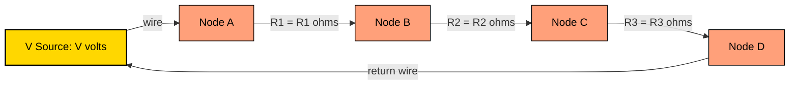
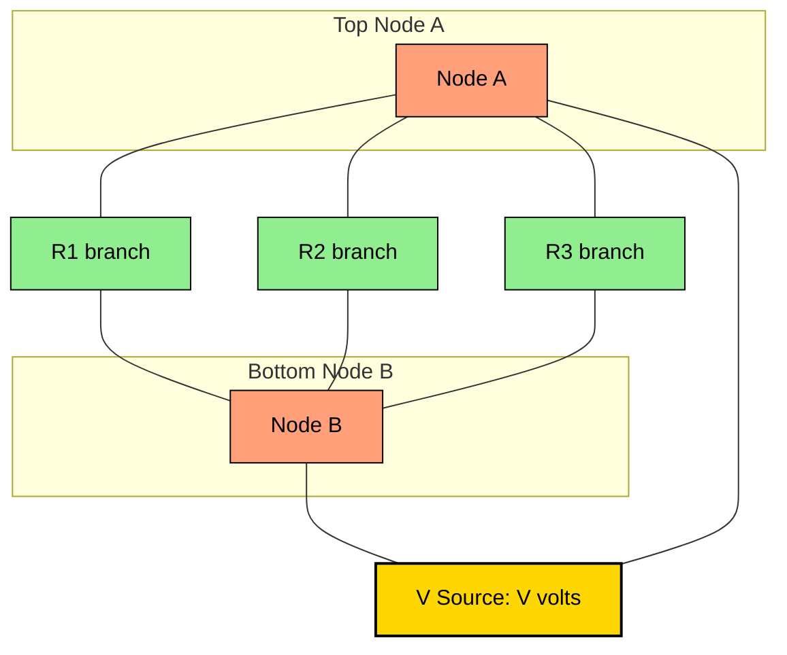

# DC Circuits : Resistance in Series and Parallel

<!-- SECTION_1_START -->
# DC Circuits: Resistance in Series and Parallel

## 1. Core Technical Definition

> [!IMPORTANT]
> **KTU 2024 Syllabus Definition (GZEST204 - Module 1)**
> A **DC (Direct Current) circuit** is an electrical network in which the current flows in only one direction with a constant (time-invariant) magnitude. The behaviour of such a circuit is governed entirely by **Ohm's Law** ($V = IR$) and the two fundamental connection topologies: **Series** and **Parallel**.

### 1.1 Series Connection
Two or more resistors are said to be connected in **series** when they are joined end-to-end in a single, continuous conducting path, so that the **same current $I$ flows through every component** while the **supply voltage $V$ is divided (shared) among them**.

> [!NOTE]
> **Geometric Intuition — The Single-Lane Highway Analogy**
> Imagine a narrow one-lane road (a series circuit) connecting two cities. Every car (electron) entering the road **must** pass through the toll booth at City A, then City B, then City C, in that exact order. No car can skip a toll booth, and all cars take the same time to traverse the full road. The **traffic jam (resistance)** at each booth adds up: total delay = delay at A + delay at B + delay at C. The current is identical everywhere; the voltage "drops" at each toll booth.

### 1.2 Parallel Connection
Two or more resistors are said to be connected in **parallel** when their **corresponding terminals are joined to a common pair of nodes**, so that they share the **same voltage $V$ across them** while the **total supply current $I$ divides** among the multiple branches.

> [!NOTE]
> **Geometric Intuition — The Multi-Lane Highway Analogy**
> Now imagine a four-lane highway where vehicles can take any one of four parallel toll lanes to go from the start point to the destination. All four lanes experience the **same entrance-to-exit distance**, so the *voltage (pressure)* at the start and end of every lane is identical. However, the **cars (current) split** between the four lanes. A wider, more open lane (lower resistance) carries more cars, and a narrow lane (higher resistance) carries fewer. The combined throughput (equivalent resistance) of the multi-lane road is always **less than the narrowest single lane**.

### 1.3 Standard Physical Constants & Conventions

| Symbol | Quantity | Standard Unit (SI) | Remarks |
| :--- | :--- | :--- | :--- |
| $V$ | Electric Potential Difference | **Volt (V)** | Energy per unit charge |
| $I$ | Electric Current | **Ampere (A)** | Charge per unit time |
| $R$ | Resistance | **Ohm ($\Omega$)** | Opposition to current flow |
| $G$ | Conductance | **Siemens (S)** | Reciprocal of resistance: $G = 1/R$ |
| $P$ | Electric Power | **Watt (W)** | Rate of energy dissipation |
| $Q$ | Electric Charge | **Coulomb (C)** | $Q = I \cdot t$ |

> [!VISUALIZATION CONTROL]
> **Concept:** Visual comparison of Series vs Parallel current/voltage distribution.
> **GeoGebra / Desmos Input Equations:**
> * Point $A = (0, 12)$ (12 V battery terminal)
> * Point $B = (4, 12)$, $C = (4, 4)$, $D = (8, 4)$ — Series path with voltage drop steps of 4 V each
> * Point $E = (0, 6)$, $F = (8, 6)$ — Common voltage line for parallel branches
> **Visual Description:** On the y-axis plot the voltage level. For series, observe a *staircase descending line* (voltage drops successively). For parallel, observe a *flat horizontal line* at the supply voltage, with multiple current arrows of varying length splitting downward.

<!-- SECTION_1_END -->

<!-- SECTION_2_START -->
# 2. Deep Theoretical Analysis & KTU High-Yield Formula Sheet

## 2.1 Series Combination — Analytical Breakdown

* **Step 1 — Apply Kirchhoff's Voltage Law (KVL):** Around any closed loop, the algebraic sum of EMFs equals the algebraic sum of voltage drops.
* **Step 2 — Identify the shared current:** Since the same current $I$ passes through $R_1$, $R_2$, $R_3$, we can write the individual drops as $V_1 = I R_1$, $V_2 = I R_2$, $V_3 = I R_3$.
* **Step 3 — Sum the drops:** $V = V_1 + V_2 + V_3 = I(R_1 + R_2 + R_3)$.
* **Step 4 — Equate to equivalent circuit:** $V = I \cdot R_{eq}$ yields the **series equivalent resistance formula**.

**Key Insight (Why it works):** In a series chain, the cross-section available to charge flow is unchanged along the path, but each resistor consumes a "slice" of the driving pressure. The pressures add up, which mathematically translates to the resistances adding up.

## 2.2 Parallel Combination — Analytical Breakdown

* **Step 1 — Apply Kirchhoff's Current Law (KCL):** The total current entering a node equals the total current leaving it.
* **Step 2 — Identify the shared voltage:** Since the same voltage $V$ exists across every parallel branch, the branch currents are $I_1 = V/R_1$, $I_2 = V/R_2$, $I_3 = V/R_3$.
* **Step 3 — Sum the currents:** $I = I_1 + I_2 + I_3 = V\left(\dfrac{1}{R_1} + \dfrac{1}{R_2} + \dfrac{1}{R_3}\right)$.
* **Step 4 — Equate to equivalent circuit:** $I = V / R_{eq}$ yields the **parallel equivalent resistance formula** in terms of conductances.

**Key Insight (Why it works):** Adding a parallel branch is like adding another lane to a highway — it provides an *additional* path for current, so the overall opposition to flow *decreases*. Mathematically, conductances (the reciprocals) add, and we then invert the sum to get back to resistance.

## 2.3 Voltage Divider Rule (VDR) — Series Networks

In a series circuit, the voltage across any resistor is **proportional to its share of the total resistance**.

$$V_k = V \cdot \frac{R_k}{R_{eq}} = V \cdot \frac{R_k}{R_1 + R_2 + \cdots + R_n}$$

## 2.4 Current Divider Rule (CDR) — Parallel Networks

In a parallel circuit, the current through any branch is **inversely proportional to its resistance**.

$$I_k = I \cdot \frac{R_{eq}}{R_k} = I \cdot \frac{G_k}{G_1 + G_2 + \cdots + G_n}$$

## 2.5 KTU Formula Sheet / Cheat Sheet

> [!IMPORTANT]
> **Memorize this table — it covers 90% of numerical problems asked in KTU Module 1.**

| # | Concept | Formula | Condition / Special Case |
| :--- | :--- | :--- | :--- |
| 1 | Series Equivalent Resistance | $R_{eq} = \sum_{k=1}^{n} R_k$ | $R_{eq} > R_{max}$ always |
| 2 | Parallel Equivalent Resistance | $\dfrac{1}{R_{eq}} = \sum_{k=1}^{n} \dfrac{1}{R_k}$ | $R_{eq} < R_{min}$ always |
| 3 | Two Resistors in Parallel | $R_{eq} = \dfrac{R_1 R_2}{R_1 + R_2}$ | "Product over Sum" rule |
| 4 | $n$ Equal Resistors in Parallel | $R_{eq} = \dfrac{R}{n}$ | All $n$ resistors identical |
| 5 | Ohm's Law | $V = I R$ | Linear, ohmic conductors only |
| 6 | Power Dissipated | $P = V I = I^2 R = \dfrac{V^2}{R}$ | Same in all three forms |
| 7 | Voltage Divider Rule | $V_k = V \cdot \dfrac{R_k}{R_{eq}}$ | Series circuits |
| 8 | Current Divider Rule | $I_k = I \cdot \dfrac{R_{eq}}{R_k}$ | Two-branch parallel circuits |
| 9 | Conductance | $G = \dfrac{1}{R}$ | Measured in Siemens (S) |
| 10 | KVL | $\sum V = 0$ around a loop | Energy conservation |
| 11 | KCL | $\sum I_{in} = \sum I_{out}$ at a node | Charge conservation |

> [!NOTE]
> **Real-World Engineering Utility**
> * **Series resistors** are used to design **voltage-dropping networks**, set reference voltages for sensors, bias transistors, and form the basis of resistive thermometers (RTDs) and strain gauges.
> * **Parallel resistors** are used in **current-sharing networks**, in household wiring (so that switching off one appliance does not break others), in power-distribution bus bars, and in designing shunt resistors for ammeters.
> * Combined series-parallel networks form the basis of **Wheatstone bridges**, **attenuators**, and virtually every practical PCB layout.

<!-- SECTION_2_END -->

<!-- SECTION_3_START -->
# 3. Step-by-Step Derivations, Solved Examples & Code Implementation

## 3.1 Derivation: Equivalent Resistance of $n$ Resistors in Series

Let $n$ resistors $R_1, R_2, \ldots, R_n$ be connected end-to-end carrying the same current $I$, with supply voltage $V$.

By **Kirchhoff's Voltage Law (KVL)** around the loop:

$$V = V_1 + V_2 + V_3 + \cdots + V_n$$

Substituting each voltage drop using **Ohm's Law** $V_k = I R_k$:

$$V = I R_1 + I R_2 + I R_3 + \cdots + I R_n$$

Factor out the common current $I$:

$$V = I \left( R_1 + R_2 + R_3 + \cdots + R_n \right)$$

For the equivalent single resistance $R_{eq}$, by Ohm's Law we also have $V = I R_{eq}$. Equating both expressions:

$$I R_{eq} = I \left( R_1 + R_2 + R_3 + \cdots + R_n \right)$$

Dividing both sides by $I$:

$$\boxed{\,R_{eq} = R_1 + R_2 + R_3 + \cdots + R_n = \sum_{k=1}^{n} R_k\,}$$

## 3.2 Derivation: Equivalent Resistance of $n$ Resistors in Parallel

Let $n$ resistors $R_1, R_2, \ldots, R_n$ be connected across the same two nodes $A$ and $B$, sharing the same voltage $V$. The total current entering node $A$ is $I$, and branch currents are $I_1, I_2, \ldots, I_n$.

By **Kirchhoff's Current Law (KCL)** at node $A$:

$$I = I_1 + I_2 + I_3 + \cdots + I_n$$

Since the voltage across each branch is the same $V$, apply **Ohm's Law** to each branch: $I_k = V / R_k$.

$$I = \frac{V}{R_1} + \frac{V}{R_2} + \frac{V}{R_3} + \cdots + \frac{V}{R_n}$$

Factor out the common voltage $V$:

$$I = V \left( \frac{1}{R_1} + \frac{1}{R_2} + \frac{1}{R_3} + \cdots + \frac{1}{R_n} \right)$$

For the equivalent single resistance: $I = V / R_{eq}$. Equating:

$$\frac{V}{R_{eq}} = V \left( \frac{1}{R_1} + \frac{1}{R_2} + \frac{1}{R_3} + \cdots + \frac{1}{R_n} \right)$$

Dividing both sides by $V$:

$$\boxed{\,\frac{1}{R_{eq}} = \frac{1}{R_1} + \frac{1}{R_2} + \frac{1}{R_3} + \cdots + \frac{1}{R_n} = \sum_{k=1}^{n} \frac{1}{R_k}\,}$$

## 3.3 Worked Example 1 — Pure Series Circuit

**Problem:** Three resistors of $4\ \Omega$, $6\ \Omega$, and $10\ \Omega$ are connected in series across a $40\ \text{V}$ DC battery. Find (a) the equivalent resistance, (b) the circuit current, and (c) the voltage drop across each resistor.

**Solution:**

**(a) Equivalent resistance** (Series formula):

$$R_{eq} = R_1 + R_2 + R_3 = 4 + 6 + 10 = 20\ \Omega$$

**(b) Circuit current** (Ohm's Law applied to equivalent circuit):

$$I = \frac{V}{R_{eq}} = \frac{40\ \text{V}}{20\ \Omega} = 2\ \text{A}$$

**(c) Voltage drops** (since current is the same in series):

$$V_1 = I R_1 = 2 \times 4 = 8\ \text{V}$$

$$V_2 = I R_2 = 2 \times 6 = 12\ \text{V}$$

$$V_3 = I R_3 = 2 \times 10 = 20\ \text{V}$$

**Verification using KVL:** $V_1 + V_2 + V_3 = 8 + 12 + 20 = 40\ \text{V} = V_{\text{supply}}$ ✓

## 3.4 Worked Example 2 — Pure Parallel Circuit

**Problem:** Three resistors of $6\ \Omega$, $12\ \Omega$, and $4\ \Omega$ are connected in parallel across a $24\ \text{V}$ DC battery. Find (a) the equivalent resistance, (b) the total current drawn from the battery, and (c) the branch currents.

**Solution:**

**(a) Equivalent resistance** (Parallel formula):

$$\frac{1}{R_{eq}} = \frac{1}{6} + \frac{1}{12} + \frac{1}{4} = \frac{2}{12} + \frac{1}{12} + \frac{3}{12} = \frac{6}{12} = \frac{1}{2}$$

$$R_{eq} = 2\ \Omega$$

**(b) Total current drawn:**

$$I = \frac{V}{R_{eq}} = \frac{24}{2} = 12\ \text{A}$$

**(c) Branch currents** (since voltage is the same in parallel):

$$I_1 = \frac{V}{R_1} = \frac{24}{6} = 4\ \text{A}$$

$$I_2 = \frac{V}{R_2} = \frac{24}{12} = 2\ \text{A}$$

$$I_3 = \frac{V}{R_3} = \frac{24}{4} = 6\ \text{A}$$

**Verification using KCL:** $I_1 + I_2 + I_3 = 4 + 2 + 6 = 12\ \text{A} = I_{\text{total}}$ ✓

## 3.5 Worked Example 3 — Series-Parallel (Mixed) Network

**Problem:** In the circuit shown, $R_1 = 10\ \Omega$ and $R_2 = 20\ \Omega$ are in series, and this combination is in parallel with $R_3 = 15\ \Omega$. The whole network is connected to a $30\ \text{V}$ supply. Find the total current, the voltage across the parallel combination, and the current through $R_3$.

**Solution:**

**Step 1 — Compute the series branch resistance:**

$$R_{12} = R_1 + R_2 = 10 + 20 = 30\ \Omega$$

**Step 2 — Combine $R_{12}$ in parallel with $R_3$** (using product-over-sum):

$$R_{eq} = \frac{R_{12} \times R_3}{R_{12} + R_3} = \frac{30 \times 15}{30 + 15} = \frac{450}{45} = 10\ \Omega$$

**Step 3 — Total current drawn:**

$$I_{total} = \frac{V}{R_{eq}} = \frac{30}{10} = 3\ \text{A}$$

**Step 4 — Voltage across the parallel combination** (this is the supply voltage, since the parallel block is the whole load):

$$V_{parallel} = 30\ \text{V}$$

**Step 5 — Current through $R_3$:**

$$I_3 = \frac{V_{parallel}}{R_3} = \frac{30}{15} = 2\ \text{A}$$

**Step 6 — Current through the series branch** (by KCL: $I_{total} = I_{12} + I_3$):

$$I_{12} = I_{total} - I_3 = 3 - 2 = 1\ \text{A}$$

**Verification:** Voltage across the series branch = $I_{12} \times R_{12} = 1 \times 30 = 30\ \text{V}$ ✓

## 3.6 Python Implementation — Generic Equivalent Resistance Solver

The following Python code computes the equivalent resistance of arbitrary series and parallel networks, with full type hints, boundary checks, and error logging.

```python
"""
equivalent_resistance.py
A robust tool for computing the equivalent DC resistance of
series and parallel resistor networks (KTU GZEST204 - Module 1).
"""

from __future__ import annotations
import logging
from typing import List, Union

# Configure module-level logger
logging.basicConfig(
    level=logging.INFO,
    format="%(asctime)s | %(levelname)s | %(message)s",
)
logger = logging.getLogger("KTU_ResistorSolver")


def series_equivalent(resistors: List[float]) -> float:
    """
    Compute the equivalent resistance of resistors connected in SERIES.
    Formula: R_eq = R1 + R2 + R3 + ... + Rn
    """
    if not resistors:
        logger.error("Empty resistor list passed to series_equivalent().")
        raise ValueError("Resistor list cannot be empty.")
    for idx, r in enumerate(resistors):
        if r <= 0:
            logger.error("Non-positive resistance R%d = %s", idx + 1, r)
            raise ValueError(f"Resistor R{idx+1} must be strictly positive (got {r}).")

    total: float = sum(resistors)
    logger.info("Series equivalent computed: R_eq = %.4f Ω", total)
    return total


def parallel_equivalent(resistors: List[float]) -> float:
    """
    Compute the equivalent resistance of resistors connected in PARALLEL.
    Formula: 1/R_eq = 1/R1 + 1/R2 + ... + 1/Rn
    """
    if not resistors:
        logger.error("Empty resistor list passed to parallel_equivalent().")
        raise ValueError("Resistor list cannot be empty.")
    for idx, r in enumerate(resistors):
        if r <= 0:
            logger.error("Non-positive resistance R%d = %s", idx + 1, r)
            raise ValueError(f"Resistor R{idx+1} must be strictly positive (got {r}).")

    reciprocal_sum: float = sum(1.0 / r for r in resistors)
    total: float = 1.0 / reciprocal_sum
    logger.info("Parallel equivalent computed: R_eq = %.4f Ω", total)
    return total


def voltage_divider(v_supply: float, resistors: List[float]) -> List[float]:
    """
    Compute the voltage drop across each resistor in a series chain.
    """
    if v_supply < 0:
        raise ValueError("Supply voltage cannot be negative in a DC circuit.")
    r_eq: float = series_equivalent(resistors)
    drops: List[float] = [v_supply * (r / r_eq) for r in resistors]
    logger.info("Voltage drops: %s V", drops)
    return drops


def current_divider(i_total: float, resistors: List[float]) -> List[float]:
    """
    Compute the branch current through each resistor in a parallel network.
    """
    if i_total < 0:
        raise ValueError("Total current cannot be negative in a DC circuit.")
    r_eq: float = parallel_equivalent(resistors)
    currents: List[float] = [i_total * (r_eq / r) for r in resistors]
    logger.info("Branch currents: %s A", currents)
    return currents


# ----------------------------- DEMO RUN -----------------------------
if __name__ == "__main__":
    # Series example: 4 Ω, 6 Ω, 10 Ω across 40 V
    r_series = [4.0, 6.0, 10.0]
    r_eq_s = series_equivalent(r_series)
    print(f"Series R_eq  = {r_eq_s} Ω")
    print(f"Voltage drops = {voltage_divider(40.0, r_series)} V\n")

    # Parallel example: 6 Ω, 12 Ω, 4 Ω across 24 V
    r_par = [6.0, 12.0, 4.0]
    r_eq_p = parallel_equivalent(r_par)
    print(f"Parallel R_eq = {r_eq_p} Ω")
    print(f"Branch currents = {current_divider(12.0, r_par)} A")
```

**Sample Output:**

```
Series R_eq  = 20.0 Ω
Voltage drops = [8.0, 12.0, 20.0] V

Parallel R_eq = 2.0 Ω
Branch currents = [4.0, 2.0, 6.0] A
```

<!-- SECTION_3_END -->

<!-- SECTION_4_START -->
# 4. Structural Diagrams & Schematics

## 4.1 Series Circuit Topology



**Observation:** A single, unbroken loop. The current $I$ is identical at every point, while the voltage progressively drops across each resistor.

## 4.2 Parallel Circuit Topology



**Observation:** Three independent branches connecting the same pair of nodes $A$ and $B$. The voltage across every branch is identical (= $V$), and the total current splits into three branch currents.

## 4.3 Step-by-Step Problem-Solving Flowchart

```mermaid
flowchart TD
    S0[Start: Given R values and V] --> S1{Identify network type}
    S1 -- Pure Series --> S2[Apply R_eq = sum of R]
    S1 -- Pure Parallel --> S3[Apply 1/R_eq = sum of 1/R]
    S1 -- Mixed --> S4[Identify series and parallel sub-blocks]
    S4 --> S5[Simplify series sub-blocks first]
    S5 --> S6[Simplify parallel sub-blocks next]
    S6 --> S7[Repeat until single R_eq remains]
    S2 --> S8[Apply Ohm's law to find I = V / R_eq]
    S3 --> S8
    S7 --> S8
    S8 --> S9{Need branch values?}
    S9 -- Yes, Series --> S10[Apply Voltage Divider Rule]
    S9 -- Yes, Parallel --> S11[Apply Current Divider Rule]
    S9 -- No --> S12[Compute Power P = I squared R]
    S10 --> S12
    S11 --> S12
    S12 --> S13[Verify with KVL and KCL]
    S13 --> S14[End]

    classDef decision fill:#FFE4B5,stroke:#000,color:#000
    classDef process fill:#B0E0E6,stroke:#000,color:#000
    classDef terminal fill=#98FB98,stroke:#000,color:#000

    class S1,S9 decision
    class S2,S3,S4,S5,S6,S7,S8,S10,S11,S12,S13 process
    class S0,S14 terminal
```

## 4.4 Block-Level Equivalent Circuit Transformation

```mermaid
graph LR
    subgraph BLOCK_ORIG[Original Mixed Network]
        BO1[V supply] --- BO2[R1 in series with R2]
        BO2 --- BO3[R3 in parallel with R4 in series with R5]
    end

    subgraph BLOCK_STEP1[Step 1: Combine R1 and R2]
        B11[V supply] --- B12[R12 = R1 + R2]
    end

    subgraph BLOCK_STEP2[Step 2: Combine R4 and R5]
        B21[V supply] --- B22[R12]
        B22 --- B23[R3 parallel to R45]
    end

    subgraph BLOCK_FINAL[Final Equivalent]
        BF1[V supply] --- BF2[R_eq single resistor]
    end

    BLOCK_ORIG --> BLOCK_STEP1 --> BLOCK_STEP2 --> BLOCK_FINAL

    classDef orig fill:#FFB6C1,stroke:#000,color:#000
    classDef step fill=#FFDAB9,stroke=#000,color:#000
    classDef fin fill=#90EE90,stroke=#000,color:#000

    class BO1,BO2,BO3 orig
    class B11,B12,B21,B22,B23 step
    class BF1,BF2 fin
```

<!-- SECTION_4_END -->

<!-- SECTION_5_START -->
# 5. KTU 2024 Scheme Examination Question Bank & Topic Recap

## 5.1 Part A — Short Answer Questions (3 Marks Each)

### Question 1 `[KTU University Exam - July 2024]`
**State and explain Kirchhoff's Voltage Law (KVL) and Kirchhoff's Current Law (KCL).** *[CO1, Remember]*

**Model Answer (3 Marks):**
* **KVL:** The algebraic sum of all voltages (EMFs and IR drops) around any closed loop in a DC circuit is zero. Mathematically, $\sum_{k=1}^{n} V_k = 0$. It is a direct consequence of the **conservation of energy** — a charge cannot gain or lose net energy in a round trip. **[1 Mark]**
* **KCL:** The algebraic sum of currents entering a node equals the algebraic sum of currents leaving the node: $\sum I_{\text{in}} = \sum I_{\text{out}}$. It is a consequence of the **conservation of charge**. **[1 Mark]**
* **Application example:** In a series circuit, applying KVL gives $V = I R_1 + I R_2 + \cdots$, leading to the series resistance formula. In a parallel circuit, applying KCL gives $I = I_1 + I_2 + \cdots$, leading to the parallel conductance formula. **[1 Mark]**

### Question 2 `[KTU University Exam - Dec 2023]`
**Two resistors of $6\ \Omega$ and $12\ \Omega$ are connected (i) in series and (ii) in parallel. Compute the equivalent resistance in each case.** *[CO1, Understand]*

**Model Answer (3 Marks):**
* **(i) Series:** $R_{eq} = R_1 + R_2 = 6 + 12 = 18\ \Omega$ **[1.5 Marks]**
* **(ii) Parallel:** $R_{eq} = \dfrac{R_1 R_2}{R_1 + R_2} = \dfrac{6 \times 12}{6 + 12} = \dfrac{72}{18} = 4\ \Omega$ **[1.5 Marks]**

> [!NOTE]
> Note the contrast: in series, the equivalent is **larger** than either resistor; in parallel, it is **smaller** than the smaller resistor.

## 5.2 Part B — Long Answer Questions (14 Marks, with Internal Choice)

> [!IMPORTANT]
> As per the KTU 2024 Scheme ESE pattern, each Part B question carries 14 marks and is split into sub-parts (a) and (b) for 7 marks each, mapping to escalating cognitive levels.

### Question A — Choice 1 `[KTU University Exam - Model Paper 2024]`

**(a) Derive the expression for the equivalent resistance of three resistors connected in parallel.** *(7 Marks, CO1 — Understand)*

**Model Solution:**

**Step 1 — Define the setup:** Consider three resistors $R_1$, $R_2$, $R_3$ connected between the same two nodes $A$ and $B$, with supply voltage $V$ across the combination. **[1 Mark]**

**Step 2 — Apply KCL at node $A$:** Let the total current entering node $A$ be $I$, and the branch currents be $I_1$, $I_2$, $I_3$. Then $I = I_1 + I_2 + I_3$. **[1 Mark]**

**Step 3 — Apply Ohm's Law to each branch:** Since the voltage $V$ is the same across each branch:

$$I_1 = \frac{V}{R_1}, \quad I_2 = \frac{V}{R_2}, \quad I_3 = \frac{V}{R_3} \quad \text{[2 Marks]}$$

**Step 4 — Substitute into the KCL equation:**

$$I = \frac{V}{R_1} + \frac{V}{R_2} + \frac{V}{R_3} = V \left( \frac{1}{R_1} + \frac{1}{R_2} + \frac{1}{R_3} \right) \quad \text{[1.5 Marks]}$$

**Step 5 — Equate to the equivalent single resistance:** For a single equivalent resistance $R_{eq}$, we have $I = V / R_{eq}$. Equating:

$$\frac{1}{R_{eq}} = \frac{1}{R_1} + \frac{1}{R_2} + \frac{1}{R_3} \quad \text{[1 Mark]}$$

**Final simplified expression:** $\displaystyle R_{eq} = \frac{1}{\frac{1}{R_1} + \frac{1}{R_2} + \frac{1}{R_3}}$ **[0.5 Marks]**

**(b) A DC circuit consists of two parallel branches. Branch 1 has $R_1 = 30\ \Omega$ in series with $R_2 = 60\ \Omega$. Branch 2 has $R_3 = 40\ \Omega$ in series with $R_4 = 40\ \Omega$. The combination is connected across a $120\ \text{V}$ supply. Calculate the total current drawn and the current through each branch.** *(7 Marks, CO1 — Apply)*

**Model Solution:**

**Step 1 — Equivalent resistance of Branch 1:** $R_{12} = R_1 + R_2 = 30 + 60 = 90\ \Omega$ **[1 Mark]**

**Step 2 — Equivalent resistance of Branch 2:** $R_{34} = R_3 + R_4 = 40 + 40 = 80\ \Omega$ **[1 Mark]**

**Step 3 — Combine the two branches in parallel** (using product-over-sum):

$$R_{eq} = \frac{R_{12} \times R_{34}}{R_{12} + R_{34}} = \frac{90 \times 80}{90 + 80} = \frac{7200}{170} = 42.35\ \Omega \quad \text{[2 Marks]}$$

**Step 4 — Total current from the supply:**

$$I_{total} = \frac{V}{R_{eq}} = \frac{120}{42.35} = 2.83\ \text{A} \quad \text{[1 Mark]}$$

**Step 5 — Branch current in Branch 1:**

$$I_{branch1} = \frac{V}{R_{12}} = \frac{120}{90} = 1.333\ \text{A} \quad \text{[1 Mark]}$$

**Step 6 — Branch current in Branch 2:**

$$I_{branch2} = \frac{V}{R_{34}} = \frac{120}{80} = 1.5\ \text{A} \quad \text{[1 Mark]}$$

**Verification by KCL:** $I_{branch1} + I_{branch2} = 1.333 + 1.5 = 2.833\ \text{A} \approx I_{total}$ ✓

> [!WARNING]
> **KTU Examiner's Valuation Pitfall:** Students often confuse which resistors are in series and which are in parallel. Always **first sketch the circuit and label the nodes**. Two elements are in series **only if they share a single node that connects to nothing else**. Two elements are in parallel **only if both their terminals are connected to the same pair of nodes**. Forgetting the unit ($\Omega$ or A or V) in the final answer costs 0.5 marks. Do not round off intermediate steps — keep at least 4 significant digits until the final answer.

### Question B — Choice 2 (Alternative) `[KTU University Exam - Model Paper 2024]`

**(a) With the help of a neat circuit diagram, derive the voltage divider rule for a series circuit containing two resistors $R_1$ and $R_2$ connected across a supply voltage $V$.** *(7 Marks, CO1 — Understand)*

**Model Solution:**

**Step 1 — Draw the circuit and label:** Supply $V$ across the series combination of $R_1$ and $R_2$. The current $I$ flows through both. **[1 Mark]**

**Step 2 — Apply KVL:** $V = V_1 + V_2$ where $V_1 = I R_1$ and $V_2 = I R_2$. **[1 Mark]**

**Step 3 — Total resistance:** $R_{eq} = R_1 + R_2$, so the current is $I = \dfrac{V}{R_1 + R_2}$. **[1.5 Marks]**

**Step 4 — Voltage across $R_1$:**

$$V_1 = I R_1 = \frac{V}{R_1 + R_2} \cdot R_1 = V \cdot \frac{R_1}{R_1 + R_2} \quad \text{[1.5 Marks]}$$

**Step 5 — Voltage across $R_2$:**

$$V_2 = I R_2 = \frac{V}{R_1 + R_2} \cdot R_2 = V \cdot \frac{R_2}{R_1 + R_2} \quad \text{[1.5 Marks]}$$

**Final generalisation:** $\displaystyle V_k = V \cdot \frac{R_k}{\sum R_i}$ **[0.5 Marks]**

**(b) A $24\ \text{V}$ battery is connected across a series combination of $R_1 = 2\ \text{k}\Omega$, $R_2 = 4\ \text{k}\Omega$, and $R_3 = 6\ \text{k}\Omega$. Use the voltage divider rule to find the voltage across each resistor and the power dissipated in $R_2$.** *(7 Marks, CO1 — Apply)*

**Model Solution:**

**Step 1 — Total series resistance:** $R_{eq} = 2 + 4 + 6 = 12\ \text{k}\Omega$ **[1 Mark]**

**Step 2 — Voltage across $R_1$:** $V_1 = 24 \times \dfrac{2}{12} = 4\ \text{V}$ **[1 Mark]**

**Step 3 — Voltage across $R_2$:** $V_2 = 24 \times \dfrac{4}{12} = 8\ \text{V}$ **[1 Mark]**

**Step 4 — Voltage across $R_3$:** $V_3 = 24 \times \dfrac{6}{12} = 12\ \text{V}$ **[1 Mark]**

**Step 5 — Verification by KVL:** $V_1 + V_2 + V_3 = 4 + 8 + 12 = 24\ \text{V} = V_{\text{supply}}$ ✓ **[1 Mark]**

**Step 6 — Power dissipated in $R_2$:** Using $P = V^2 / R$:

$$P_2 = \frac{V_2^2}{R_2} = \frac{8^2}{4000} = \frac{64}{4000} = 0.016\ \text{W} = 16\ \text{mW} \quad \text{[2 Marks]}$$

> [!WARNING]
> **KTU Examiner's Valuation Pitfall — VDR Mistakes:** (1) Students sometimes write the formula upside down as $V_1 = V \cdot \dfrac{R_2}{R_1 + R_2}$, leading to an inverted answer. **Memorise:** the resistor whose voltage is being computed appears in the **numerator**. (2) When resistors are in $k\Omega$, the power comes out in milliwatts — forgetting to convert units is a common 0.5-mark deduction. (3) Do not forget to state the units explicitly in the final boxed answer.

---

## 5.3 Topic Recap & Important Things to Remember

> [!IMPORTANT]
> **High-Density Revision Checklist — Module 1: DC Circuits (Series & Parallel)**

* **Series definition:** A *single-loop* connection; **same current** flows through every element; the **equivalent resistance is the sum** of all individual resistances. **[Formula: $R_{eq} = \sum R_k$]**
* **Parallel definition:** A *multi-branch* connection between two common nodes; **same voltage** appears across every branch; the **equivalent conductance is the sum** of individual conductances. **[Formula: $1/R_{eq} = \sum 1/R_k$]**
* **Two-resistor parallel shortcut:** $R_{eq} = \dfrac{R_1 R_2}{R_1 + R_2}$ (Product over Sum). Always use this for two-resistor parallel problems in KTU exams.
* **$n$ equal resistors in parallel:** $R_{eq} = R / n$. This is the most-tested sub-case in Part A.
* **Inequalities to remember:** For series, $R_{eq} > R_{\max}$. For parallel, $R_{eq} < R_{\min}$.
* **Kirchhoff's Voltage Law (KVL):** $\sum V = 0$ around any closed loop. Foundation of the series resistance formula.
* **Kirchhoff's Current Law (KCL):** $\sum I_{\text{in}} = \sum I_{\text{out}}$ at any node. Foundation of the parallel resistance formula.
* **Ohm's Law:** $V = I R$. Valid only for linear, ohmic, temperature-stable conductors.
* **Voltage Divider Rule (VDR):** $V_k = V \cdot \dfrac{R_k}{R_{eq}}$ — voltage drop is *directly* proportional to resistance.
* **Current Divider Rule (CDR):** $I_k = I \cdot \dfrac{R_{eq}}{R_k}$ — branch current is *inversely* proportional to branch resistance.
* **Power formulas (three equivalent forms):** $P = V I = I^2 R = \dfrac{V^2}{R}$. Choose the form that uses the quantities you already know.
* **Mixed network strategy:** Identify "islands" of purely series or purely parallel elements. Simplify the series islands first (or the innermost sub-blocks), then the parallel ones. Repeat until a single $R_{eq}$ remains.
* **Open circuit in series** = the *entire* current becomes zero (a break anywhere kills the whole circuit). **Short circuit in parallel** = the *entire* current bypasses that branch and flows through the short.
* **Real-world traps:** Household appliances are wired in *parallel* so each gets full mains voltage and operates independently. Old-style Christmas lights are wired in *series* — that's why one blown bulb blacks out the whole string.
* **KTU exam tip:** Always draw a clear circuit diagram with labelled nodes before writing equations. Convert all quantities to base SI units ($\Omega$, V, A) before computation. State the units explicitly in the final answer. Verify with KVL/KCL to claim the verification mark.
* **Course Outcome mapping (KTU 2024):** This topic maps to **CO1** — "Apply the fundamental laws of electrical circuits to compute voltages, currents, and equivalent resistances in DC networks." The Bloom's cognitive levels tested are typically *Remember*, *Understand*, and *Apply*.

<!-- SECTION_5_END -->
