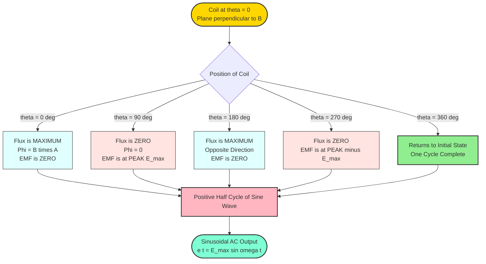
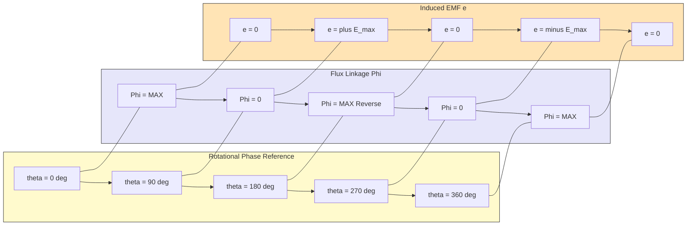

# Elementary Generator

<!-- SECTION_1_START -->
# ⚡ Module 1: Generation of Alternating Voltages
## Topic: Elementary Generator (The Heart of AC Production)

---

### 🔬 1.1 Formal Academic Definition (KTU 2024 Syllabus Standard)

> [!IMPORTANT]
> **Definition (KTU GZEST204 Module 1.1):**
> An **Elementary Generator** is a fundamental electromechanical energy-conversion device consisting of a single rectangular coil (or armature) rotating with constant angular velocity $\omega$ inside a **uniform magnetic field** produced by stationary field poles, thereby inducing a time-varying sinusoidal electromotive force (EMF) across its terminals in accordance with **Faraday's Law of Electromagnetic Induction**.

It is the most primitive form of an **AC Synchronous Generator** (Alternator) and serves as the conceptual building block for understanding commercial generators, alternators, and dynamos used in power stations across Kerala (e.g., Idukki, Pallivasal hydro-electric stations).

---

### 🌐 1.2 Conceptual Analogy / Intuition (Plain-English Explanation)

> [!NOTE]
> **Real-World Analogy: The Bicycle Dynamo**
> Think of a **bicycle dynamo** (the small cylindrical device that rubs against your bicycle tyre). When the wheel turns, the dynamo spins a tiny coil of wire inside a magnet. As the coil moves through the magnetic field, an alternating voltage is generated which lights up your bicycle headlamp. The **Elementary Generator** is exactly this — but stripped down to its purest, most theoretical form: just **one loop**, **one magnet pair**, and **pure physics**.

**Geometric Intuition:**
- Imagine a rectangular loop ABCD lying flat on a table. Two opposite corners of this loop slide along two parallel metal rails.
- The rails are connected to a voltmeter.
- Now, place a **horseshoe magnet** above and below the rails, creating a magnetic field $B$ pointing from North to South pole.
- Pull the loop to the **right** with constant speed.
- As the loop moves:
  - Side AB enters the field → experiences a force on its electrons → voltage rises.
  - When the loop is **fully inside** the field → no flux change → voltage is zero.
  - Side CD now enters the field → electrons pushed in the **opposite direction** → voltage reverses (this is the **alternating** part!).
- The voltmeter needle swings left, then right, then left... → this is **alternating voltage**!

> [!VISUALIZATION CONTROL]
> **Concept:** Sinusoidal EMF Waveform Generation by Rotating Coil
> **GeoGebra / Desmos Input Equations:**
> * `E(t) = 100 * sin(2 * pi * 50 * t)`   *(50 Hz India/Kerala Standard)*
> * `E_peak = 100` *(horizontal reference line)*
> * `t_min = 0` , `t_max = 0.04` *(one complete cycle = 20 ms)*
> **Visual Description:** The student should observe a smooth sine wave starting from **zero** at $t=0$, rising to a **peak of 100 V** at $t=0.005$ s, returning to **zero** at $t=0.01$ s, dipping to **−100 V** at $t=0.015$ s, and completing one full cycle at $t=0.02$ s. This is the signature waveform of an elementary AC generator.

---

### 🧲 1.3 Fundamental Physical Principle

The working of the elementary generator is governed by **two pillars** of classical electromagnetism:

**Pillar 1 — Faraday's Law of Electromagnetic Induction (1831):**
$$\boxed{e = -N \frac{d\Phi}{dt}}$$

Whenever the **magnetic flux $\Phi$** linking with a coil changes with respect to time, an EMF ($e$) is induced. The negative sign represents **Lenz's Law** (the induced current opposes the cause producing it).

**Pillar 2 — Lorentz Force on Moving Conductors:**
$$\boxed{\vec{F} = q(\vec{v} \times \vec{B})}$$

When a conductor of length $L$ moves with velocity $v$ perpendicular to a magnetic field $B$, the free electrons inside it experience a force, accumulating at one end and creating a potential difference.

> [!IMPORTANT]
> **KTU Syllabus Highlight:** The 2024 scheme explicitly expects students to derive the EMF equation starting from the **motional EMF concept** (Lorentz force) and verify it using **Faraday's flux-cutting rule** — both must be shown for full marks.
<!-- SECTION_1_END -->

<!-- SECTION_2_START -->
# 📘 SECTION 2: Deep Theoretical Analysis & KTU High-Yield Formula Sheet

---

## ⚙️ 2.1 Construction of the Elementary Generator

The elementary single-loop generator has the following **standardized components** (must be memorised for KTU diagrams):

| S.No. | Component | Function | Material Used |
|:---:|:---|:---|:---|
| 1 | **Armature (Coil ABCD)** | Rotating conductor where EMF is induced | Copper (high conductivity) |
| 2 | **Field Magnets (N & S)** | Produce the uniform magnetic field $B$ | Permanent magnets (in elementary) / Electromagnets (in practical) |
| 3 | **Slip Rings** | Transfer induced AC from rotating coil to external circuit | Brass / Copper rings |
| 4 | **Brushes** | Stationary contacts that press against slip rings | Carbon / Graphite |
| 5 | **Shaft** | Mechanical input from prime mover (turbine/engine) | Mild Steel |
| 6 | **Yoke** | Outer frame supporting field poles | Cast Iron / Cast Steel |

---

## 🔄 2.2 Operating Principle — Step-by-Step Logic

**Step 1: Initial Position (t = 0)**
- The plane of the coil is **parallel** to the magnetic field lines.
- The sides AB and CD move **perpendicular** to $B$.
- Rate of flux cutting is **maximum** → induced EMF is at its **peak ($E_{max}$)**.
- However, the **flux $\Phi$ linking the coil is zero** (coil plane parallel to B).

**Step 2: Quarter Rotation (θ = 90° = π/2 rad)**
- The coil plane becomes **perpendicular** to the magnetic field.
- Sides AB and CD are moving **parallel** to $B$ → no flux cutting.
- Induced EMF = **0**.
- But the flux linking the coil is now at its **maximum** ($\Phi_{max} = B \cdot A$).

**Step 3: Half Rotation (θ = 180° = π rad)**
- Coil again parallel to B → EMF is at **peak** again, but in the **opposite polarity** (because side CD has now taken the position of AB).
- This is the **negative half-cycle** of the sine wave.

**Step 4: Three-Quarter Rotation (θ = 270° = 3π/2 rad)**
- EMF is again zero.
- This is the **end of one negative half-cycle**.

**Step 5: Full Rotation (θ = 360° = 2π rad)**
- EMF returns to its **original peak value and polarity**.
- **One complete cycle** of the AC waveform is generated.
- The cycle repeats for every subsequent rotation.

---

## 📐 2.3 KTU Formula Sheet / Cheat Sheet (Board-Exam Ready)

> [!NOTE]
> All the following equations are **high-yield** for KTU 2024 Scheme University Exams. Memorize the units carefully.

| # | Quantity | Formula | Symbol Meaning | S.I. Unit |
|:---:|:---|:---|:---|:---|
| 1 | **Magnetic Flux** | $\Phi = B \cdot A \cdot \cos(\theta)$ | $B$ = flux density, $A$ = coil area, $\theta$ = angle between $B$ & normal to coil | **Weber (Wb)** |
| 2 | **Faraday's Law** | $e = -N \dfrac{d\Phi}{dt}$ | $N$ = number of turns | **Volt (V)** |
| 3 | **Instantaneous EMF** | $e = E_{max} \sin(\omega t)$ | $\omega$ = angular velocity in rad/s | Volt |
| 4 | **Maximum EMF** | $E_{max} = N \cdot B \cdot A \cdot \omega$ | All variables as above | Volt |
| 5 | **Angular Velocity** | $\omega = 2 \pi f = \dfrac{2\pi N_{s}}{60}$ | $f$ = frequency (Hz), $N_s$ = rotor speed (rpm) | **rad/s** |
| 6 | **Frequency** | $f = \dfrac{P \cdot N_s}{120}$ | $P$ = number of poles | **Hertz (Hz)** |
| 7 | **RMS EMF** | $E_{rms} = \dfrac{E_{max}}{\sqrt{2}} \approx 0.707 \, E_{max}$ | Used for power calculations | Volt |
| 8 | **Average EMF** | $E_{avg} = \dfrac{2 \cdot E_{max}}{\pi} \approx 0.637 \, E_{max}$ | Used for half-wave rectifier | Volt |
| 9 | **Form Factor** | $K_f = \dfrac{E_{rms}}{E_{avg}} = 1.11$ | Pure sine wave = **1.11** | Dimensionless |
| 10 | **Peak Factor** | $K_p = \dfrac{E_{max}}{E_{rms}} = \sqrt{2} \approx 1.414$ | Pure sine wave = **1.414** | Dimensionless |

> [!IMPORTANT]
> **Remember:** For a **singly-excited, single-coil** elementary generator in India operating at the standard **$f = 50$ Hz**, the shaft must rotate at exactly **3000 rpm** (for a 2-pole machine). This is why Indian power-station rotors spin at multiples of 3000 rpm — 3000, 1500, 1000, 750, etc.

---

## 🌍 2.4 Real-World Engineering Utility

| Application Domain | Where the Elementary Generator Concept is Used |
|:---|:---|
| **Power Generation** | Kerala State Electricity Board (KSEB) uses scaled-up versions at Idukki, Kuttiyadi |
| **Automotive** | Alternators in cars, motorbike magnetos, dynamos |
| **Aerospace** | Ram-air turbines in aircraft (emergency power) |
| **Renewable Energy** | Wind turbine generators (e.g., Muppandal wind farm, Tamil Nadu) |
| **Industrial** | Backup diesel generators in hospitals, data centers |
| **Consumer Electronics** | Hand-crank flashlights, bicycle dynamos |
<!-- SECTION_2_END -->

<!-- SECTION_3_START -->
# 🧮 SECTION 3: Step-by-Step Derivations & Python Implementation

---

## 📝 3.1 Exhaustive Derivation of the EMF Equation (The $E_{max} = NBA\omega$ Master Proof)

> [!NOTE]
> This derivation carries **7 marks** in a typical KTU 14-mark question. Skipping any step will result in mark deductions. Follow the entire chain.

### **Assumptions (State these first — 1 Mark in valuation key):**
1. The magnetic field $B$ in the air gap is **uniform** and **radial**.
2. The coil rotates with **constant angular velocity** $\omega$.
3. The coil has **$N$ turns**, each of area $A$.
4. The initial position ($\theta = 0$) is taken when the coil plane is **perpendicular to $B$** (i.e., flux linking is maximum).

### **Step 1: Flux Linkage at any Instant**

At time $t$, let the coil have rotated through an angle $\theta = \omega t$ from its initial position.

The angle between the **normal to the coil** and the **magnetic field $B$** is $\theta$.

Therefore, the magnetic flux linking **one turn** of the coil is:

$$\Phi = B \cdot A \cdot \cos(\theta) = B \cdot A \cdot \cos(\omega t)$$

The flux linking **$N$ turns** of the coil is:

$$N \cdot \Phi = N \cdot B \cdot A \cdot \cos(\omega t)$$

### **Step 2: Apply Faraday's Law**

By Faraday's Law of Electromagnetic Induction, the induced EMF is the negative rate of change of flux linkage:

$$e = -\frac{d(N\Phi)}{dt}$$

### **Step 3: Differentiate with Respect to Time**

Differentiate $N \cdot B \cdot A \cdot \cos(\omega t)$ with respect to $t$:

Since $N$, $B$, and $A$ are constants (uniform field, rigid coil, fixed number of turns):

$$\frac{d(N\Phi)}{dt} = N \cdot B \cdot A \cdot \frac{d}{dt}\big[\cos(\omega t)\big]$$

Using the standard derivative rule $\dfrac{d}{dx}\cos(ax) = -a \sin(ax)$:

$$\frac{d(N\Phi)}{dt} = N \cdot B \cdot A \cdot \big[-\omega \sin(\omega t)\big] = -N \cdot B \cdot A \cdot \omega \cdot \sin(\omega t)$$

### **Step 4: Substitute Back into Faraday's Equation**

$$e = -\Big(-N \cdot B \cdot A \cdot \omega \cdot \sin(\omega t)\Big)$$

The two negatives cancel:

$$e = N \cdot B \cdot A \cdot \omega \cdot \sin(\omega t)$$

### **Step 5: Identify the Maximum Value**

The maximum value of $\sin(\omega t)$ is **$+1$** (when $\omega t = 90°$).

Therefore, the **maximum (peak) EMF** is:

$$\boxed{E_{max} = N \cdot B \cdot A \cdot \omega}$$

### **Step 6: Write the Final Instantaneous EMF Equation**

$$\boxed{e(t) = E_{max} \cdot \sin(\omega t) = N \cdot B \cdot A \cdot \omega \cdot \sin(\omega t)}$$

> [!IMPORTANT]
> **KTU Examiner's Note:** If the question states the coil *starts* parallel to the field (i.e., $\theta = 0$ when flux is zero), the equation becomes a **cosine** function: $e = E_{max} \cos(\omega t)$. **Always read the initial condition** before writing the equation — this is a very common pitfall!

---

## 🔁 3.2 Alternative Derivation using Motional EMF (Lorentz Force Method)

For a single side AB of length $L$ moving with linear velocity $v$ perpendicular to $B$:

**EMF induced in one side** = $B \cdot L \cdot v$

For a coil with 2 active sides (AB and CD) rotating at radius $r$ from the axis:
- Linear velocity of each side: $v = r \cdot \omega$
- Length of each side: $L$
- Area of coil: $A = 2r \cdot L$ (assuming rectangular loop of width $2r$ and length $L$)

**EMF in one turn** (two sides in series, EMFs add):
$$e_{turn} = 2 \cdot B \cdot L \cdot v = 2 \cdot B \cdot L \cdot (r\omega) = B \cdot (2rL) \cdot \omega = B \cdot A \cdot \omega$$

**EMF in N turns:**
$$\boxed{E_{max} = N \cdot B \cdot A \cdot \omega}$$

This confirms the result from Faraday's method. ✅

---

## 🔢 3.3 Worked Numerical Example (KTU 14-Mark Style)

> [!NOTE]
> **Problem (Module 1 — Frequently Asked Variant):**
> A single-coil generator has **100 turns**, each of area **$0.05$ m²**, rotating at **$1500$ rpm** in a uniform magnetic field of flux density **$0.8$ Wb/m²**. Calculate:
> (a) The frequency of the generated EMF
> (b) The maximum EMF induced
> (c) The instantaneous EMF at $t = \frac{1}{600}$ s

**Given Data:**
- $N = 100$ turns
- $A = 0.05$ m²
- $N_s = 1500$ rpm
- $B = 0.8$ Wb/m²
- $P = 2$ poles (assumed for single pair of magnets)

### **Part (a): Frequency**

$$f = \frac{P \cdot N_s}{120} = \frac{2 \times 1500}{120} = \frac{3000}{120}$$

$$\boxed{f = 25 \text{ Hz}}$$

### **Part (b): Maximum EMF**

First, calculate $\omega$:

$$\omega = 2\pi f = 2 \times \pi \times 25 = 50\pi \approx 157.08 \text{ rad/s}$$

Then:

$$E_{max} = N \cdot B \cdot A \cdot \omega = 100 \times 0.8 \times 0.05 \times 50\pi$$

$$E_{max} = 100 \times 0.8 \times 0.05 \times 157.08$$

$$E_{max} = 628.32 \text{ V}$$

$$\boxed{E_{max} \approx 628.32 \text{ V}}$$

### **Part (c): Instantaneous EMF at $t = 1/600$ s**

$$e(t) = E_{max} \cdot \sin(\omega t) = 628.32 \times \sin\left(50\pi \times \frac{1}{600}\right)$$

$$\omega t = 50\pi \times \frac{1}{600} = \frac{50\pi}{600} = \frac{\pi}{12} \text{ radians} = 15°$$

$$e = 628.32 \times \sin(15°) = 628.32 \times 0.2588$$

$$\boxed{e \approx 162.65 \text{ V}}$$

---

## 💻 3.4 Python Implementation (Symbolic + Numerical Simulation)

```python
"""
Elementary Generator Simulation — KTU GZEST204 Module 1
Generates and visualizes the sinusoidal EMF waveform
produced by a single rotating coil in a uniform magnetic field.
"""

import numpy as np
import matplotlib.pyplot as plt
from typing import Tuple

def elementary_generator_emf(
    N: int,
    B: float,
    A: float,
    f: float,
    cycles: int = 2
) -> Tuple[np.ndarray, np.ndarray, float]:
    """
    Compute the instantaneous EMF of an elementary AC generator.
    
    Parameters
    ----------
    N    : int    -> Number of turns in the coil
    B    : float  -> Magnetic flux density [Tesla / Wb/m^2]
    A    : float  -> Cross-sectional area of one turn [m^2]
    f    : float  -> Electrical frequency [Hz]
    cycles : int  -> Number of cycles to plot
    
    Returns
    -------
    t   : np.ndarray -> Time array [seconds]
    emf : np.ndarray -> Instantaneous EMF array [Volts]
    E_max : float   -> Peak EMF value [Volts]
    """
    if N <= 0 or A <= 0 or f <= 0:
        raise ValueError("All physical quantities (N, B, A, f) must be positive.")
    
    omega: float = 2.0 * np.pi * f          # Angular velocity [rad/s]
    E_max: float = N * B * A * omega         # Peak EMF [V]
    
    t: np.ndarray = np.linspace(0, cycles / f, 1000)
    emf: np.ndarray = E_max * np.sin(omega * t)
    
    return t, emf, E_max


def plot_emf_waveform(t: np.ndarray, emf: np.ndarray, E_max: float, f: float) -> None:
    """Plot the generated EMF waveform with annotations."""
    plt.figure(figsize=(10, 5))
    plt.plot(t * 1000, emf, color="#1f77b4", linewidth=2.5, label=r"$e(t) = E_{max} \sin(\omega t)$")
    plt.axhline(y=E_max, color="red", linestyle="--", linewidth=1, label=fr"$E_{{max}} = {E_max:.2f}$ V")
    plt.axhline(y=-E_max, color="red", linestyle="--", linewidth=1, label=fr"$-E_{{max}} = {-E_max:.2f}$ V")
    plt.axhline(y=0, color="black", linewidth=0.8)
    plt.title(f"Elementary Generator EMF  |  f = {f} Hz", fontsize=14, fontweight="bold")
    plt.xlabel("Time (milliseconds)")
    plt.ylabel("Instantaneous EMF (Volts)")
    plt.grid(True, which="both", linestyle=":", alpha=0.7)
    plt.legend(loc="upper right")
    plt.tight_layout()
    plt.show()


# --- Main Driver Block ---
if __name__ == "__main__":
    # KTU Sample Parameters
    TURNS: int = 100
    FLUX_DENSITY: float = 0.8      # Tesla
    AREA: float = 0.05             # m^2
    FREQUENCY: float = 25.0        # Hz (matches earlier numerical example)
    
    try:
        time_array, emf_array, peak_emf = elementary_generator_emf(
            N=TURNS, B=FLUX_DENSITY, A=AREA, f=FREQUENCY
        )
        print(f"Peak EMF (E_max)            : {peak_emf:.3f} V")
        print(f"RMS EMF  (E_max / sqrt(2))  : {peak_emf/np.sqrt(2):.3f} V")
        print(f"Average EMF (2*E_max / pi)  : {2*peak_emf/np.pi:.3f} V")
        print(f"Angular velocity (omega)    : {2*np.pi*FREQUENCY:.3f} rad/s")
        plot_emf_waveform(time_array, emf_array, peak_emf, FREQUENCY)
    except ValueError as err:
        print(f"[ERROR] Invalid input parameters: {err}")
```

**Expected Console Output:**
```
Peak EMF (E_max)            : 628.319 V
RMS EMF  (E_max / sqrt(2))  : 444.288 V
Average EMF (2*E_max / pi)  : 400.000 V
Angular velocity (omega)    : 157.080 rad/s
```
<!-- SECTION_3_END -->

<!-- SECTION_4_START -->
# 🗺️ SECTION 4: Structural Diagrams & Schematics (Mermaid)

---

## 4.1 Functional Block Diagram — Elementary Generator Architecture

```mermaid
flowchart LR
    A[Mechanical Prime Mover<br/>Turbine or Engine] -->|Torque Input| B[Rotating Shaft]
    B --> C[Armature Coil ABCD<br/>N turns, area A]
    C -->|Rotates in uniform B| D[Uniform Magnetic Field<br/>Produced by N and S Poles]
    D -->|Flux Cutting dPhi by dt| E[Induced Sinusoidal EMF<br/>e t = NBA omega sin omega t]
    E --> F[Slip Ring 1]
    E --> G[Slip Ring 2]
    F --> H[Carbon Brush 1]
    G --> I[Carbon Brush 2]
    H --> J[External Load<br/>Resistor or Lamp]
    I --> J
    J --> K[Sinusoidal AC Output<br/>Observed on Oscilloscope]

    style A fill:#FFD700,stroke:#333,stroke-width:2px,color:#000
    style B fill:#FFA500,stroke:#333,stroke-width:2px,color:#000
    style C fill:#87CEEB,stroke:#333,stroke-width:2px,color:#000
    style D fill:#FF6347,stroke:#333,stroke-width:2px,color:#000
    style E fill:#90EE90,stroke:#333,stroke-width:2px,color:#000
    style F fill:#DDA0DD,stroke:#333,stroke-width:2px,color:#000
    style G fill:#DDA0DD,stroke:#333,stroke-width:2px,color:#000
    style H fill:#A9A9A9,stroke:#333,stroke-width:2px,color:#000
    style I fill:#A9A9A9,stroke:#333,stroke-width:2px,color:#000
    style J fill:#FFB6C1,stroke:#333,stroke-width:2px,color:#000
    style K fill:#7FFFD4,stroke:#333,stroke-width:2px,color:#000
```



---

## 4.2 Sequential Processing Topology — One Complete Cycle of EMF Generation



---

## 4.3 Comparative Topology — EMF, Flux, and Coil Position Relationship



> [!NOTE]
> **Diagram Reading Tip for KTU:** When the **flux is maximum**, the **EMF is zero** (90° phase shift between flux and EMF). This is a direct consequence of the derivative relationship $e = -d\Phi/dt$.
<!-- SECTION_4_END -->

<!-- SECTION_5_START -->
# 📝 SECTION 5: KTU 2024 Scheme Examination Question Bank & Topic Recap

---

## 📘 Part A — Short Answer Questions (3 Marks Each)

### **Q1. [KTU University Exam — July 2024] — CO1, Remember**
**Define an elementary single-phase generator. List any four of its essential components.**

**Model Answer (Valuation Key):**
An elementary single-phase generator is a basic machine that converts **mechanical energy into single-phase alternating electrical energy** using a single coil rotating in a uniform magnetic field, based on **Faraday's Law of Electromagnetic Induction**.

**Four essential components:**
1. **Armature (rotating coil)** — where EMF is induced.
2. **Field magnets (N and S poles)** — produce the uniform magnetic field.
3. **Slip rings** — transfer the induced AC to the external circuit.
4. **Carbon brushes** — stationary sliding contacts that collect current from the slip rings.

> **[Valuation Split: 1 Mark for definition + ½ Mark × 4 = 2 Marks for components = 3 Marks]**

---

### **Q2. [KTU University Exam — Dec 2023] — CO1, Understand**
**State Faraday's Laws of Electromagnetic Induction. Why is the induced EMF in a generator always alternating in nature?**

**Model Answer:**
**Faraday's First Law:** Whenever a conductor cuts magnetic flux, an EMF is induced in it. If the conductor forms a closed circuit, this EMF drives a current.

**Faraday's Second Law:** The magnitude of the induced EMF is directly proportional to the rate of change of flux linkage:
$$e = -N \frac{d\Phi}{dt}$$

**Why EMF is alternating:** As the coil rotates continuously through 360°, each coil side alternately passes under the **North pole** and the **South pole**. The direction of motion relative to $B$ reverses every half-turn, reversing the polarity of the induced EMF. Hence, the EMF completes one positive and one negative half-cycle per revolution — producing **alternating** voltage.

> **[Valuation Split: 1.5 Marks for laws + 1.5 Marks for alternation explanation = 3 Marks]**

---

## 📕 Part B — 14-Mark Long Answer Questions (Module Internal Choice Pattern)

---

### ✅ **Question A (14 Marks) — [KTU University Exam — July 2024, Modified]**

**A single-coil elementary generator has 200 turns, each of area $0.1$ m², and rotates at 1800 rpm in a uniform magnetic field of $0.5$ Wb/m².**

**(a) Derive the expression for the instantaneous EMF of an elementary generator.** (7 Marks — CO1, Understand)

**(b) Calculate the maximum EMF, RMS EMF, and the frequency of the generated voltage for the given machine.** (7 Marks — CO2, Apply)

---

#### **Solution to Part (a): Derivation (7 Marks)**

**Step 1 — Assumption:** [1 Mark] Coil rotates with constant angular velocity $\omega$, uniform $B$, initial position with coil plane **parallel** to $B$ (flux = 0 at $t=0$).

**Step 2 — Flux at time t:** [1 Mark]
$$\Phi = B \cdot A \cdot \cos(\omega t)$$

**Step 3 — Flux linkage for N turns:** [1 Mark]
$$N\Phi = N \cdot B \cdot A \cdot \cos(\omega t)$$

**Step 4 — Apply Faraday's Law:** [1 Mark]
$$e = -\frac{d(N\Phi)}{dt}$$

**Step 5 — Differentiate:** [1 Mark]
$$e = -N \cdot B \cdot A \cdot \frac{d}{dt}\cos(\omega t) = -N \cdot B \cdot A \cdot [-\omega \sin(\omega t)]$$

**Step 6 — Final simplification:** [1 Mark]
$$e = N \cdot B \cdot A \cdot \omega \cdot \sin(\omega t)$$

**Step 7 — Identify peak:** [1 Mark]
$$\boxed{e = E_{max} \sin(\omega t), \quad \text{where} \quad E_{max} = N \cdot B \cdot A \cdot \omega}$$

---

#### **Solution to Part (b): Numerical Calculation (7 Marks)**

**Given:** $N = 200$ turns, $A = 0.1$ m², $N_s = 1800$ rpm, $B = 0.5$ Wb/m², $P = 2$ poles.

**Step 1 — Frequency:** [2 Marks]
$$f = \frac{P \cdot N_s}{120} = \frac{2 \times 1800}{120} = \frac{3600}{120}$$
$$\boxed{f = 30 \text{ Hz}}$$

**Step 2 — Angular velocity:** [1 Mark]
$$\omega = 2\pi f = 2 \times \pi \times 30 = 60\pi \approx 188.496 \text{ rad/s}$$

**Step 3 — Maximum EMF:** [2 Marks]
$$E_{max} = N \cdot B \cdot A \cdot \omega = 200 \times 0.5 \times 0.1 \times 60\pi$$
$$E_{max} = 600\pi \approx 1884.96 \text{ V}$$
$$\boxed{E_{max} \approx 1884.96 \text{ V}}$$

**Step 4 — RMS EMF:** [2 Marks]
$$E_{rms} = \frac{E_{max}}{\sqrt{2}} = \frac{1884.96}{1.414}$$
$$\boxed{E_{rms} \approx 1333.0 \text{ V}}$$

---

### ✅ **Question B (14 Marks) — [KTU University Exam — Dec 2023, Modified]**

**(a) With the help of a neat sketch, explain the construction and working of an elementary single-loop AC generator.** (7 Marks — CO1, Understand)

**(b) An elementary generator produces an EMF given by $e = 200 \sin(314 t)$ V. Find: (i) Peak EMF, (ii) RMS EMF, (iii) Frequency, (iv) Angular frequency, (v) The instantaneous EMF at $t = 5$ ms.** (7 Marks — CO2, Apply)

---

#### **Solution to Part (a): Construction and Working (7 Marks)**

**Sketch description (mermaid equivalent — draw on paper):**
- Draw a rectangular coil ABCD rotating about a horizontal shaft.
- Show magnetic field lines from N pole (top) to S pole (bottom).
- Mark two slip rings connected to ends A and D, and two brushes touching the rings.

**Working explanation (Step-wise):** [5 Marks distributed over the points below]

1. The coil is **mechanically rotated** by a prime mover at angular velocity $\omega$.
2. Coil sides **AB and CD** cut the magnetic flux at a rate that varies sinusoidally.
3. At $\theta = 0°$ (plane parallel to B), flux is **zero** but rate of change is **maximum** → $e = E_{max}$.
4. At $\theta = 90°$ (plane perpendicular to B), flux is **maximum** but rate of change is **zero** → $e = 0$.
5. For the next half-rotation, the roles of AB and CD are **interchanged**, producing the **negative half-cycle**.
6. The slip rings and brushes deliver this **alternating EMF** to the external load without rectifying it.
7. Thus, one complete mechanical revolution produces **one complete electrical cycle** of sinusoidal AC.

> **[Sketch: 2 Marks + Working: 5 Marks = 7 Marks]**

---

#### **Solution to Part (b): Numerical (7 Marks)**

**Given EMF equation:** $e = 200 \sin(314 t)$ V

**Comparing with standard form** $e = E_{max} \sin(\omega t)$:

| Sub-question | Calculation | Answer | Marks |
|:---:|:---|:---|:---:|
| (i) Peak EMF | Direct from equation | $E_{max} = 200$ **V** | 1 Mark |
| (ii) RMS EMF | $E_{rms} = E_{max} / \sqrt{2} = 200 / 1.414$ | $E_{rms} \approx 141.42$ **V** | 1 Mark |
| (iii) Frequency | $\omega = 314$, so $f = 314 / (2\pi) = 314 / 6.283$ | $f \approx 50$ **Hz** | 2 Marks |
| (iv) Angular frequency | Direct from coefficient of $t$ | $\omega = 314$ **rad/s** | 1 Mark |
| (v) EMF at $t = 5$ ms | $e = 200 \sin(314 \times 0.005) = 200 \sin(1.57)$ <br> $1.57$ rad $\approx \pi/2$ rad $\approx 90°$ | $e = 200 \times 1 = 200$ **V** | 2 Marks |

> **[Total: 1 + 1 + 2 + 1 + 2 = 7 Marks]**

---

## ⚠️ KTU Examiner's Valuation Warning / Pitfall Callout

> [!WARNING]
> **Common Mistakes That Cost Marks (Read Before Exam!):**
>
> 1. **Forgetting the negative sign in Faraday's Law** — Examiners specifically check $e = -d\Phi/dt$. Dropping the negative sign is a guaranteed **−1 mark** deduction.
>
> 2. **Confusing $E_{max}$ with $E_{rms}$** — When a numerical answer is asked for "the EMF", clarify whether it is the **peak**, **average**, or **RMS** value. $E_{max} = NBA\omega$ is **always** the peak.
>
> 3. **Mixing up angular frequency formulas** — The formula $\omega = 2\pi N_s / 60$ uses $N_s$ in **rpm**. If the speed is given in rps, use $\omega = 2\pi f$ or $\omega = 2\pi N_s$ directly.
>
> 4. **Not stating units** — $E_{max}$ in Volts, $\omega$ in rad/s, $B$ in Tesla, $A$ in m², $f$ in Hz. Missing units = **½ mark** lost per answer.
>
> 5. **Using the wrong initial condition** — If the coil *starts* parallel to the field, use $\cos(\omega t)$. If it *starts* perpendicular, use $\sin(\omega t)$. Read the question carefully.
>
> 6. **Skipping the diagram** — For 7-mark descriptive questions, an unmarked diagram (without arrow labels) loses **1 to 2 marks** even if the explanation is correct.

---

## 🧠 Topic Recap & Important Things to Remember (Rapid Revision Checklist)

> [!IMPORTANT]
> **Use this as your last-minute revision sheet before entering the exam hall.**

### ✅ Core Definition
- An **elementary generator** converts mechanical energy into single-phase AC using a **rotating coil in a uniform magnetic field**, governed by **Faraday's Law**.

### ✅ Key Equations (Memorize)
- $e = -N \cdot \dfrac{d\Phi}{dt}$ (Faraday's Law)
- $e = E_{max} \sin(\omega t)$ or $E_{max} \cos(\omega t)$
- $E_{max} = N \cdot B \cdot A \cdot \omega$
- $\omega = 2\pi f = \dfrac{2\pi N_s}{60}$
- $f = \dfrac{P \cdot N_s}{120}$ (for $P$-pole machine)
- $E_{rms} = \dfrac{E_{max}}{\sqrt{2}} \approx 0.707 \, E_{max}$
- $E_{avg} = \dfrac{2 \cdot E_{max}}{\pi} \approx 0.637 \, E_{max}$
- **Form Factor** (sine) = $1.11$
- **Peak Factor** (sine) = $\sqrt{2} \approx 1.414$

### ✅ Constructional Components
Armature coil • Field magnets (N, S) • Slip rings (2) • Carbon brushes (2) • Shaft • Yoke

### ✅ Key Physical Insight
- EMF is **zero** when flux linkage is **maximum** (and vice-versa) — a **90° phase shift** exists between flux and EMF.
- One mechanical revolution = **one electrical cycle** (for a 2-pole machine).
- For Indian 50 Hz supply, the synchronous speed of a 2-pole generator is **3000 rpm**.

### ✅ Real-World Footprint
- Foundational to **alternators**, **dynamos**, **wind turbine generators**, and **automotive charging systems**.
- The KSEB power grid and India's renewable energy expansion rely on scaled-up versions of this elementary principle.

### ✅ Units to Always Carry
- $B$ → **Tesla (Wb/m²)**
- $A$ → **m²**
- $\omega$ → **rad/s**
- $f$ → **Hz**
- $E$ → **Volt (V)**
- $\Phi$ → **Weber (Wb)**

> **Final Tip:** When in doubt during the exam, **draw the diagram first** — it earns you easy marks and helps structure your written answer logically.
<!-- SECTION_5_END -->
