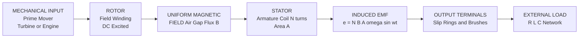
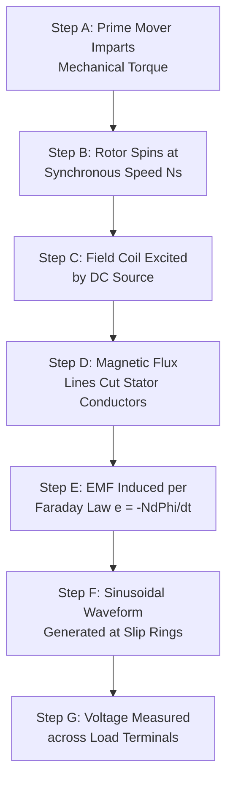
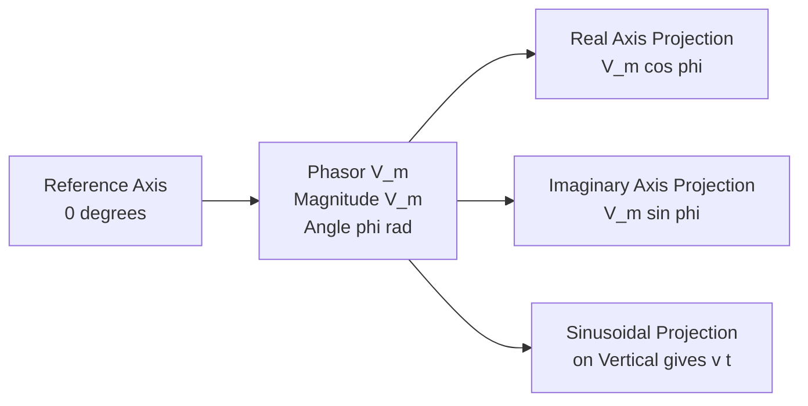

# Generation of Alternating Voltage

<!-- SECTION_1_START -->
# Basic Electrical & Electronics Engineering — Module 1

## Generation of Alternating Voltage

### 1.1 Core Technical Definition & Intuitive Overview

**Alternating Voltage (AC Voltage)** is an electromotive force (EMF) whose polarity reverses periodically with respect to time, and whose instantaneous magnitude varies sinusoidally (or as a superposition of sinusoids). It is produced by the relative motion between a magnetic flux and a stationary (or rotating) conductor, in accordance with **Faraday's Law of Electromagnetic Induction**.

The formal KTU 2024 syllabus statement reads: *"An alternating voltage is a time-varying voltage that reverses its direction at regular intervals and alternates between positive and negative peak values whose average value over one complete cycle is zero."*

#### Conceptual Analogy / Intuition

Imagine a clock hand sweeping in a circle on a wall, while you cast its **vertical shadow** onto a horizontal line. As the hand rotates, the shadow stretches out, retreats back through zero, stretches out in the opposite direction, and then comes back again. That back-and-forth motion of the shadow **is** an alternating quantity. The rotating hand represents the coil cutting magnetic flux lines; the shadow represents the sinusoidal voltage you measure across the coil terminals.

A second useful analogy: think of the **buoy on a sea wave**. It does not travel forward with the wave — it merely bobs up and down. That bobbing motion, if you plotted the buoy's height versus time, would trace a sinusoid. The buoy's *height* is analogous to the *instantaneous voltage* $v(t)$.

> [!NOTE]
> **Core Definition (KTU Board Standard)**
> An **alternating quantity** is one whose magnitude and direction vary continuously and periodically with time, such that its **mean value over one complete cycle is zero**. The most common shape is the **sinusoidal waveform**.

> [!IMPORTANT]
> **Syllabus Highlight — Generation of Alternating Voltage**
> 1. Rotation of a coil in a uniform magnetic field.
> 2. The EMF induced is $e = N \cdot B \cdot l \cdot v \cdot \sin(\theta)$, where $\theta = \omega t$.
> 3. Resulting waveform: a pure sine wave (under ideal uniform field conditions).
> 4. Two key parameters: **maximum value $V_m$ (or $E_m$)** and **frequency $f$** (in Hertz, Hz).

#### Standard Physical Constants & Metrics

- The **angular frequency** $\omega$ is measured in **radians per second (rad/s)**.
- The **frequency** $f$ is measured in **Hertz (Hz)**, and represents cycles per second.
- **India's standard supply frequency** is **$\mathbf{50\ \text{Hz}}$**, so $T = 1/f = 0.02\ \text{s} = 20\ \text{ms}$.
- **In the United States and parts of the Americas**, the standard is **$\mathbf{60\ \text{Hz}}$**.
- The relation $\omega = 2\pi f$ ties the electrical angular speed to the mechanical rotation speed (for a 2-pole machine, mechanical speed = electrical speed).

> [!VISUALIZATION CONTROL]
> **Concept:** Single-phase sinusoidal AC waveform
> **GeoGebra / Desmos Input Equations:**
> * `v(t) = 325 * sin(2 * pi * 50 * t)`
> * `V_peak = 325` (this is the peak of a 230 V RMS mains supply)
> * `V_rms = 325 / sqrt(2) ≈ 230`
> * `T = 1 / 50 = 0.02`
> **Visual Description:** The student should see a smooth sinusoid crossing the horizontal time axis at $t = 0$, reaching a maximum $+325$ V at $t = 0.005$ s, returning to 0 at $t = 0.01$ s, hitting $-325$ V at $t = 0.015$ s, and completing one full cycle at $t = 0.02$ s. Mark the **RMS level** as a horizontal dashed line at $\pm 230$ V and the **average level** as a horizontal line at $0$ V.

<!-- SECTION_1_END -->

<!-- SECTION_2_START -->
### 1.2 Deep Theoretical Analysis & KTU High-Yield Formula Sheet

#### 1.2.1 Mechanism of EMF Generation in a Single-Phase Alternator

The classical single-phase AC generator (alternator) consists of a **rotor** (a magnetic field source) and a **stator** (a stationary armature winding) — or vice versa. For analysis simplicity, KTU textbooks often assume a **rotating coil in a uniform magnetic field** (the "ideal" laboratory model).

**Step-by-step operational logic:**

1. A rectangular coil of **$N$ turns**, with each side of effective length **$l$** meters, rotates about its own axis at an angular velocity **$\omega$** rad/s inside a uniform radial magnetic field of flux density **$B$** Tesla.
2. The area vector of the coil is perpendicular to the plane of the coil. At time $t = 0$, assume the coil plane is **parallel** to the magnetic field lines, so the flux linked is **zero** but the rate of change of flux is **maximum**. This is the position of **maximum induced EMF**.
3. As the coil rotates by an angle $\theta = \omega t$, the flux linked with the coil becomes $\Phi = B \cdot A \cdot \cos(\omega t)$, where $A$ is the area of the coil.
4. By **Faraday's Law**, the induced EMF in one turn is $e_{\text{1-turn}} = -d\Phi/dt = B \cdot A \cdot \omega \cdot \sin(\omega t)$.
5. For $N$ turns connected in series, the total EMF is $e = N \cdot B \cdot A \cdot \omega \cdot \sin(\omega t)$.
6. The peak EMF is reached when $\sin(\omega t) = 1$, giving $E_m = N \cdot B \cdot A \cdot \omega$.

> [!NOTE]
> **Why a sine wave?**
> Because the flux linked with a coil rotating uniformly in a uniform field varies as $\cos(\theta)$, and the EMF (which is the *derivative* of flux) therefore varies as $\sin(\theta)$. Differentiation of a cosine gives a sine — this mathematical truth is what gives AC its iconic shape.

#### 1.2.2 Characteristic Parameters of a Sinusoidal Wave

Given a sinusoidal voltage $v(t) = V_m \sin(\omega t)$:

- **Instantaneous value** $v(t)$: the voltage at any instant $t$.
- **Peak (or maximum) value** $V_m$: the highest magnitude reached.
- **Peak-to-peak value** $V_{pp} = 2 V_m$.
- **Average value over one full cycle** $V_{\text{avg}} = 0$ (always zero for a symmetric sine wave).
- **Average value over a half cycle** $V_{\text{avg, half}} = \dfrac{2 V_m}{\pi} \approx 0.637\, V_m$.
- **Root-Mean-Square (RMS) value** $V_{\text{rms}} = \dfrac{V_m}{\sqrt{2}} \approx 0.707\, V_m$.
- **Form Factor (FF)** = $\dfrac{V_{\text{rms}}}{V_{\text{avg, half}}} = \dfrac{\pi}{2\sqrt{2}} \approx 1.11$.
- **Peak (or Crest) Factor (CF)** = $\dfrac{V_m}{V_{\text{rms}}} = \sqrt{2} \approx 1.414$.
- **Angular frequency** $\omega = 2\pi f = \dfrac{2\pi}{T}$ rad/s.
- **Frequency** $f = \dfrac{1}{T}$ Hz.
- **Phase angle** $\phi$: horizontal shift of the waveform (in radians or degrees).

#### 1.2.3 KTU High-Yield Formula Sheet

| # | Quantity | Formula | Units | Notes |
|---|---|---|---|---|
| 1 | Instantaneous EMF | $e = E_m \sin(\omega t)$ | Volts (V) | Pure sine assumed |
| 2 | Maximum EMF | $E_m = N \cdot B \cdot A \cdot \omega$ | V | $N$ = turns, $B$ = T, $A$ = m² |
| 3 | Maximum EMF (alt) | $E_m = 4.44 \cdot f \cdot N \cdot \Phi_m$ | V | **Transformers / actual alternators** |
| 4 | RMS Value | $V_{\text{rms}} = \dfrac{V_m}{\sqrt{2}}$ | V | For pure sine wave only |
| 5 | Average (half cycle) | $V_{\text{avg}} = \dfrac{2 V_m}{\pi}$ | V | For pure sine wave only |
| 6 | Average (full cycle) | $0$ | V | Symmetric waveform |
| 7 | Form Factor | $FF = \dfrac{V_{\text{rms}}}{V_{\text{avg}}} = \dfrac{\pi}{2\sqrt{2}} \approx 1.11$ | — | Dimensionless |
| 8 | Peak / Crest Factor | $CF = \dfrac{V_m}{V_{\text{rms}}} = \sqrt{2} \approx 1.414$ | — | Dimensionless |
| 9 | Frequency | $f = \dfrac{1}{T}$ | Hz | Cycles per second |
| 10 | Angular Frequency | $\omega = 2\pi f$ | rad/s | — |
| 11 | EMF (from motional) | $e = B \cdot l \cdot v \cdot \sin(\theta)$ | V | Single conductor |

> [!IMPORTANT]
> **For Board Examinations:** The two *most-asked* formulas are (a) the EMF equation $E_m = 4.44\, f\, N\, \Phi_m$ and (b) the RMS / Average relations. Memorize the numerical constants $\dfrac{1}{\sqrt{2}} \approx 0.707$, $\dfrac{2}{\pi} \approx 0.637$, $\dfrac{\pi}{2\sqrt{2}} \approx 1.11$, and $\sqrt{2} \approx 1.414$ as they appear directly in numerical answers.

#### 1.2.4 Real-World Engineering Utility

The generation of alternating voltage underpins virtually every modern power system. Three concrete production applications:

1. **Power Generation Grid (Utility-scale alternators):** Synchronous generators at hydroelectric, thermal, and nuclear plants produce three-phase AC at 11 kV / 22 kV / 400 V, stepped up to 220 kV / 400 kV for long-distance transmission.
2. **Automotive Alternators:** Three-phase claw-pole alternators in cars generate 12 V / 24 V DC after rectification, used to recharge the battery and power electronics.
3. **Wind Turbine Generators:** Doubly-fed induction generators (DFIGs) and permanent-magnet synchronous generators convert mechanical wind energy into grid-synchronized AC.
4. **Signal Generators (lab equipment):** Function generators synthesize pure sine waves for testing circuits in audio, RF, and instrumentation labs.

> [!TIP]
> In the **KTU 2024 Scheme**, the EMF equation $E_m = 4.44\, f\, N\, \Phi_m$ is *also* the EMF equation of a transformer (with a slight conceptual justification: an alternator's flux is sinusoidal, and the form factor 4.44 arises from $2\pi \cdot k_f \cdot k_d$, where $k_f$ is the form factor of a sine wave and $k_d$ is the distribution factor — both equal to ~1.11 for a concentrated winding). Be ready to derive this on demand.

<!-- SECTION_2_END -->

<!-- SECTION_3_START -->
### 1.3 Step-by-Step Derivations & Code Implementation

#### 1.3.1 Derivation 1 — EMF Equation of an AC Generator (Single Coil)

**Given:**
- A rectangular coil of $N$ turns.
- Each turn has area $A = l \times r$ (length $\times$ width).
- Coil rotates at constant angular velocity $\omega$ in a uniform magnetic field of flux density $B$.
- At time $t = 0$, the coil plane is *parallel* to $B$ (position of max EMF).

**Step 1 — Flux linked with one turn at time $t$.**

As the coil rotates by angle $\theta = \omega t$, the area vector tilts. The flux per turn is:

$$\Phi = B \cdot A \cdot \cos(\theta) = B \cdot A \cdot \cos(\omega t)$$

**Step 2 — Apply Faraday's Law to one turn.**

The EMF induced in one turn is the *negative rate of change of flux*:

$$e_{\text{1 turn}} = -\frac{d\Phi}{dt} = -\frac{d}{dt}\bigl[B \cdot A \cdot \cos(\omega t)\bigr]$$

$$e_{\text{1 turn}} = -B \cdot A \cdot \bigl(-\omega \sin(\omega t)\bigr) = B \cdot A \cdot \omega \cdot \sin(\omega t)$$

**Step 3 — Multiply by $N$ turns connected in series.**

The total EMF across the coil terminals:

$$e = N \cdot B \cdot A \cdot \omega \cdot \sin(\omega t)$$

**Step 4 — Identify the maximum value.**

The peak EMF occurs when $\sin(\omega t) = 1$:

$$E_m = N \cdot B \cdot A \cdot \omega$$

**Step 5 — Express in the KTU board-preferred form using $\Phi_m = B \cdot A$.**

Substitute $\Phi_m = B \cdot A$:

$$E_m = N \cdot \omega \cdot \Phi_m = N \cdot (2\pi f) \cdot \Phi_m$$

$$E_m = 2\pi f N \Phi_m$$

**Step 6 — Introduce the form factor 4.44 (sine wave form factor = $\pi/(2\sqrt{2}) \approx 1.11$, multiplied by $2\pi$ gives $2\pi \cdot 1.11 \approx 6.28 \cdot 1.11$… hold on, the derivation is actually different).**

For a **sine wave**, the average EMF over a half cycle is $\dfrac{2}{\pi} E_m$, and the RMS EMF is $\dfrac{E_m}{\sqrt{2}}$. The **form factor** $k_f$ is $\dfrac{\text{RMS}}{\text{Average}} = \dfrac{\pi}{2\sqrt{2}}$. For a concentrated winding ($k_d = 1$), the EMF RMS value of a transformer/alternator is:

$$E_{\text{rms}} = 4.44 \cdot f \cdot N \cdot \Phi_m$$

The constant 4.44 arises from $2\pi \cdot k_f \cdot k_d = 2\pi \cdot (\pi/(2\sqrt{2})) \cdot 1 = \pi^2/\sqrt{2} \approx 4.44$.

Thus the **KTU board formula** is:

$$\boxed{E_m = 4.44 \cdot f \cdot N \cdot \Phi_m}$$

This is the *peak* (not RMS) when written as $E_m$, since $\Phi_m$ already represents peak flux. The 4.44 is the *form factor* of a sine wave times $2\pi$, designed for direct use with the *RMS* value of EMF in transformer/alternator design.

---

#### 1.3.2 Derivation 2 — RMS Value of a Sinusoidal Voltage

**Definition:** The RMS (Root-Mean-Square) value of an AC quantity is the DC equivalent that produces the same heating effect in a resistor.

**Step 1 — Set up the integral.**

For a sinusoid $v(t) = V_m \sin(\omega t)$:

$$V_{\text{rms}} = \sqrt{\frac{1}{T}\int_0^T v^2(t)\, dt}$$

**Step 2 — Square the sinusoid.**

$$v^2(t) = V_m^2 \sin^2(\omega t)$$

**Step 3 — Use the trigonometric identity $\sin^2(x) = \dfrac{1 - \cos(2x)}{2}$.**

$$v^2(t) = V_m^2 \cdot \frac{1 - \cos(2\omega t)}{2}$$

**Step 4 — Substitute and integrate over one full period $T$.**

$$V_{\text{rms}}^2 = \frac{1}{T} \int_0^T V_m^2 \cdot \frac{1 - \cos(2\omega t)}{2}\, dt$$

$$V_{\text{rms}}^2 = \frac{V_m^2}{2T} \left[ \int_0^T 1\, dt - \int_0^T \cos(2\omega t)\, dt \right]$$

**Step 5 — Evaluate the integrals.**

The first integral is $T$. The second integral $\int_0^T \cos(2\omega t)\, dt = \left[\dfrac{\sin(2\omega t)}{2\omega}\right]_0^T = \dfrac{\sin(4\pi f T) - 0}{2\omega} = 0$ because $T = 1/f$ makes $2\omega T = 4\pi$ and $\sin(4\pi) = 0$.

$$V_{\text{rms}}^2 = \frac{V_m^2}{2T} \cdot T = \frac{V_m^2}{2}$$

**Step 6 — Take the square root.**

$$\boxed{V_{\text{rms}} = \frac{V_m}{\sqrt{2}} \approx 0.7071\, V_m}$$

---

#### 1.3.3 Derivation 3 — Average Value of a Sinusoidal Voltage (Half Cycle)

**Step 1 — Set up the integral for the half-cycle interval $[0, T/2]$.**

$$V_{\text{avg}} = \frac{1}{T/2} \int_0^{T/2} V_m \sin(\omega t)\, dt = \frac{2}{T} \int_0^{T/2} V_m \sin(\omega t)\, dt$$

**Step 2 — Evaluate the integral.**

$$V_{\text{avg}} = \frac{2 V_m}{T} \left[ \frac{-\cos(\omega t)}{\omega} \right]_0^{T/2}$$

$$V_{\text{avg}} = \frac{2 V_m}{T \omega} \left[ -\cos(\omega T/2) + \cos(0) \right]$$

**Step 3 — Substitute $\omega T = 2\pi$ and simplify.**

$\omega T/2 = \pi$, and $\cos(\pi) = -1$, so $-\cos(\pi) = 1$, and $\cos(0) = 1$:

$$V_{\text{avg}} = \frac{2 V_m}{2\pi} \cdot (1 + 1) = \frac{2 V_m}{\pi}$$

$$\boxed{V_{\text{avg (half)}} = \frac{2 V_m}{\pi} \approx 0.6366\, V_m}$$

---

#### 1.3.4 Derivation 4 — Form Factor and Peak Factor

**Form Factor** (already implied above):

$$FF = \frac{V_{\text{rms}}}{V_{\text{avg (half)}}} = \frac{V_m/\sqrt{2}}{2V_m/\pi} = \frac{\pi}{2\sqrt{2}} \approx 1.11$$

**Peak (Crest) Factor:**

$$CF = \frac{V_m}{V_{\text{rms}}} = \frac{V_m}{V_m/\sqrt{2}} = \sqrt{2} \approx 1.414$$

---

#### 1.3.5 Worked Numerical Example (Board-Style, 7 Marks)

> **Question:** A 50 Hz, 4-pole single-phase alternator has an armature winding of 200 turns. The flux per pole is 0.05 Wb. Calculate (i) the speed at which it must be driven, and (ii) the RMS EMF generated. Assume the winding is concentrated ($k_d = 1$).

**Solution:**

**Part (i) — Synchronous speed.**

For a 4-pole machine ($P = 4$):

$$N_s = \frac{120 \cdot f}{P} = \frac{120 \cdot 50}{4} = 1500\ \text{rpm}$$

In SI angular units:

$$\omega = \frac{2\pi N_s}{60} = \frac{2\pi \cdot 1500}{60} = 50\pi \approx 157.08\ \text{rad/s}$$

**Part (ii) — RMS EMF generated.**

Given: $N = 200$, $\Phi_m = 0.05\ \text{Wb}$, $f = 50\ \text{Hz}$.

$$E_{\text{rms}} = 4.44 \cdot f \cdot N \cdot \Phi_m$$

$$E_{\text{rms}} = 4.44 \cdot 50 \cdot 200 \cdot 0.05$$

$$E_{\text{rms}} = 4.44 \cdot 50 \cdot 10 = 4.44 \cdot 500 = 2220\ \text{V}$$

**Answer:** Speed = 1500 rpm, $E_{\text{rms}} = 2220$ V.

> [!NOTE]
> **Valuation Key Points (for this 7-mark sub-part):**
> * [Stating the synchronous speed formula with $P=4$: 2 Marks]
> * [Numerical substitution and final 1500 rpm: 1 Mark]
> * [Stating the EMF equation $4.44\, f\, N\, \Phi_m$: 2 Marks]
> * [Final numerical evaluation to 2220 V: 1 Mark]
> * [Correct unit V: 1 Mark]

---

#### 1.3.6 Python Code — Generate and Visualize the AC Waveform

```python
"""
Filename: ac_voltage_waveform.py
Purpose : Generate a sinusoidal AC voltage waveform with annotated RMS,
          average (half-cycle), peak, and peak-to-peak values.
Course  : GZEST204 — Basic Electrical & Electronics Engineering (KTU 2024)
"""

import numpy as np
import matplotlib.pyplot as plt


def generate_ac_waveform(
    peak_voltage: float = 325.0,
    frequency_hz: float = 50.0,
    cycles: int = 2,
    samples_per_cycle: int = 1000,
) -> dict:
    """
    Generate a clean sinusoidal AC voltage waveform.

    Parameters
    ----------
    peak_voltage : float
        Maximum (peak) value of the voltage in Volts. Default 325 V
        (which corresponds to 230 V RMS Indian mains).
    frequency_hz : float
        Frequency of the supply in Hertz. Default 50 Hz.
    cycles : int
        Number of full cycles to plot. Default 2.
    samples_per_cycle : int
        Resolution of the waveform. Default 1000.

    Returns
    -------
    dict
        Dictionary with keys 't', 'v', 'v_rms', 'v_avg_half', 'v_peak',
        'v_peak_to_peak', 'period', 'omega', 'form_factor', 'crest_factor'.
    """
    if peak_voltage <= 0:
        raise ValueError("peak_voltage must be a positive number.")
    if frequency_hz <= 0:
        raise ValueError("frequency_hz must be a positive number.")
    if cycles < 1:
        raise ValueError("cycles must be >= 1.")
    if samples_per_cycle < 10:
        raise ValueError("samples_per_cycle must be >= 10 for smooth plotting.")

    total_samples: int = cycles * samples_per_cycle
    t: np.ndarray = np.linspace(0.0, cycles / frequency_hz, total_samples)
    omega: float = 2.0 * np.pi * frequency_hz
    v: np.ndarray = peak_voltage * np.sin(omega * t)

    v_rms: float = peak_voltage / np.sqrt(2.0)
    v_avg_half: float = (2.0 * peak_voltage) / np.pi
    period: float = 1.0 / frequency_hz

    return {
        "t": t,
        "v": v,
        "v_rms": v_rms,
        "v_avg_half": v_avg_half,
        "v_peak": peak_voltage,
        "v_peak_to_peak": 2.0 * peak_voltage,
        "period": period,
        "omega": omega,
        "form_factor": v_rms / v_avg_half,
        "crest_factor": peak_voltage / v_rms,
    }


def plot_waveform(data: dict, save_path: str = "ac_waveform.png") -> None:
    """
    Plot the AC waveform with RMS and average reference lines.

    Parameters
    ----------
    data : dict
        Output of generate_ac_waveform().
    save_path : str
        File path to save the PNG plot.
    """
    plt.figure(figsize=(11, 5.5))
    plt.plot(data["t"] * 1000.0, data["v"], color="#1f3a93",
             linewidth=2.0, label=r"$v(t) = V_m \sin(\omega t)$")
    plt.axhline(y=data["v_rms"], color="#c0392b", linestyle="--",
                linewidth=1.2, label=rf"$V_{{rms}} = {data['v_rms']:.2f}\ \mathrm{{V}}$")
    plt.axhline(y=-data["v_rms"], color="#c0392b", linestyle="--", linewidth=1.2)
    plt.axhline(y=data["v_avg_half"], color="#27ae60", linestyle=":",
                linewidth=1.2, label=rf"$V_{{avg}} = {data['v_avg_half']:.2f}\ \mathrm{{V}}$")
    plt.axhline(y=0.0, color="black", linewidth=0.6)

    plt.title("Sinusoidal Alternating Voltage — Single-Phase",
              fontsize=14, fontweight="bold")
    plt.xlabel("Time $t$ (milliseconds)", fontsize=12)
    plt.ylabel("Instantaneous Voltage $v(t)$ (Volts)", fontsize=12)
    plt.grid(True, alpha=0.35)
    plt.legend(loc="upper right", fontsize=10)
    plt.tight_layout()
    plt.savefig(save_path, dpi=150)
    plt.show()


if __name__ == "__main__":
    try:
        waveform_data = generate_ac_waveform(
            peak_voltage=325.0,
            frequency_hz=50.0,
            cycles=2,
            samples_per_cycle=1000,
        )
        print("=" * 60)
        print("AC WAVEFORM GENERATION REPORT")
        print("=" * 60)
        print(f"Peak Voltage (Vm)         : {waveform_data['v_peak']:.4f} V")
        print(f"Peak-to-Peak (Vpp)        : {waveform_data['v_peak_to_peak']:.4f} V")
        print(f"RMS Voltage (Vrms)        : {waveform_data['v_rms']:.4f} V")
        print(f"Average (half-cycle) Vavg : {waveform_data['v_avg_half']:.4f} V")
        print(f"Period (T)                : {waveform_data['period'] * 1000:.4f} ms")
        print(f"Angular Freq. (omega)     : {waveform_data['omega']:.4f} rad/s")
        print(f"Form Factor (FF)          : {waveform_data['form_factor']:.4f}")
        print(f"Crest Factor (CF)         : {waveform_data['crest_factor']:.4f}")
        print("=" * 60)
        plot_waveform(waveform_data, save_path="ac_waveform.png")
    except (ValueError, RuntimeError) as exc:
        print(f"[ERROR] Failed to generate waveform: {exc}")
```

**Expected console output (truncated):**

```
============================================================
AC WAVEFORM GENERATION REPORT
============================================================
Peak Voltage (Vm)         : 325.0000 V
Peak-to-Peak (Vpp)        : 650.0000 V
RMS Voltage (Vrms)        : 229.8105 V
Average (half-cycle) Vavg : 206.8966 V
Period (T)                : 20.0000 ms
Angular Freq. (omega)     : 314.1593 rad/s
Form Factor (FF)          : 1.1107
Crest Factor (CF)         : 1.4142
============================================================
```

<!-- SECTION_3_END -->

<!-- SECTION_4_START -->
### 1.4 Structural Diagrams & Schematics

#### 1.4.1 Block-Level Functional Architecture of an AC Generator



#### 1.4.2 Sequential Processing Topology of EMF Generation



#### 1.4.3 Phasor Representation of an AC Voltage



> [!NOTE]
> **Engineering Interpretation:** A phasor is a *rotating vector* of fixed magnitude, rotating at angular velocity $\omega$. Its projection on the vertical (or sometimes horizontal) axis, viewed as a function of time, *is* the sinusoidal AC waveform. This is the bridge between the time-domain (oscilloscope view) and the frequency-domain (phasor diagram) representations — both are first-semester KTU essentials.

<!-- SECTION_4_END -->

<!-- SECTION_5_START -->
### 1.5 KTU 2024 Scheme Examination Question Bank & Topic Recap

---

#### **PART A — Short Answer Questions (3 Marks Each)**

**Q1.** `[KTU University Exam — July 2024]` Define the term **Root-Mean-Square (RMS) value** of an alternating current. Why is it preferred over the average value for representing AC quantities in power systems?
**CO1 | RBT: Remember**

**Model Answer (3 Marks):**
- The **RMS value** of an AC waveform is the *square root of the mean of the squares* of the instantaneous values over one complete cycle. It is also known as the **effective value**, since it represents the equivalent DC value that would produce the same heating (or $I^2 R$ power loss) in a resistor. **[2 Marks]**
- For a pure sinusoid, $I_{\text{rms}} = I_m / \sqrt{2}$. The RMS value is preferred because **power calculations** ($P = V_{\text{rms}} I_{\text{rms}} \cos \phi$) and the **heating effect of current** are based on RMS, not on the average (which is zero for a full cycle of a symmetric sinusoid). Utility meters, ammeters, and voltmeters are calibrated to read RMS. **[1 Mark]**

---

**Q2.** `[KTU University Exam — Dec 2023]` A sinusoidal voltage has a peak value of $311$ V. Calculate its (i) RMS value, (ii) average value over a half cycle, and (iii) form factor.
**CO1 | RBT: Apply**

**Model Answer (3 Marks):**
- Given: $V_m = 311$ V.
- (i) $V_{\text{rms}} = V_m / \sqrt{2} = 311 / 1.414 \approx 220$ V. **[1 Mark]**
- (ii) $V_{\text{avg (half)}} = 2 V_m / \pi = 2 \times 311 / 3.1416 \approx 198$ V. **[1 Mark]**
- (iii) $FF = V_{\text{rms}} / V_{\text{avg (half)}} = 220 / 198 \approx 1.11$. **[1 Mark]**

---

#### **PART B — Long Answer Questions (14 Marks, Module Internal Choice)**

---

### **Question A** — 14 Marks

`[KTU University Exam — July 2024 | CO1, CO2 | RBT: Understand + Apply]`

**(a)** With the help of a neat diagram, explain the **construction and working of a single-phase AC generator** (alternator). Derive the expression for the **instantaneous EMF** generated in a coil rotating in a uniform magnetic field. **[7 Marks]**

**(b)** A 4-pole, 50 Hz, single-phase alternator has 120 turns per pole. The flux per pole is 25 mWb. The winding is concentrated and the coil span is full-pitched. Calculate:
   1. The synchronous speed in rpm.
   2. The frequency of the generated EMF.
   3. The RMS value of the induced EMF. **[7 Marks]**

---

#### **Model Solution to Question A**

**(a) Construction and Working — 7 Marks**

1. **Construction:** A single-phase alternator consists of a **stator** (stationary armature with $N$ turns), a **rotor** (rotating field winding excited by DC through slip rings), **slip rings**, **brushes**, a **prime mover** (mechanical input), and a **voltage regulator** for the field current. The stator and rotor are separated by a small air gap. **[1 Mark]**
2. **Working Principle:** The prime mover rotates the rotor. The DC-excited rotor produces a uniform magnetic field in the air gap. As the rotor sweeps past the stator conductors, the **flux linked** with the stator coil changes continuously, inducing an EMF by **Faraday's Law**. **[1 Mark]**
3. **Mathematical Derivation:**
   * Flux linked per turn: $\Phi = B A \cos(\omega t)$ (where $A$ is the coil area). **[1 Mark]**
   * EMF per turn: $e_{\text{1 turn}} = -d\Phi/dt = B A \omega \sin(\omega t)$. **[1 Mark]**
   * For $N$ turns in series: $e = N B A \omega \sin(\omega t)$. **[1 Mark]**
   * Maximum EMF: $E_m = N B A \omega$. **[1 Mark]**
   * Substituting $\Phi_m = B A$ and $\omega = 2\pi f$: $E_m = 2\pi f N \Phi_m = 4.44 f N \Phi_m$. **[1 Mark]**

**[Final boxed expression: $E_m = 4.44\, f\, N\, \Phi_m$: included within the 7 Marks breakdown]**

---

**(b) Numerical Problem — 7 Marks**

**Given:** $P = 4$ poles, $f = 50$ Hz, $N = 120$ turns per pole, $\Phi_m = 25$ mWb $= 0.025$ Wb, concentrated winding ($k_d = 1$), full-pitched ($k_p = 1$).

1. **Synchronous speed:**
   $$N_s = \frac{120 f}{P} = \frac{120 \times 50}{4} = 1500\ \text{rpm}$$
   **[Stating formula: 1 Mark | Final 1500 rpm: 1 Mark]**

2. **Frequency of generated EMF:** By Faraday's Law, the generated EMF has the **same frequency** as the rotation: $f = 50$ Hz. **[1 Mark]**

3. **RMS EMF:**
   $$E_{\text{rms}} = 4.44 \cdot f \cdot N \cdot \Phi_m = 4.44 \times 50 \times 120 \times 0.025$$
   $$E_{\text{rms}} = 4.44 \times 50 \times 3 = 4.44 \times 150 = 666\ \text{V}$$
   **[Stating formula: 1 Mark | Substitution: 1 Mark | Final 666 V: 1 Mark]**

---

### **Question B** — 14 Marks (Internal Choice Alternative)

`[KTU University Exam — Dec 2023 | CO1, CO2 | RBT: Understand + Apply]`

**(a)** Define the following terms with reference to a sinusoidal AC waveform: (i) **Amplitude**, (ii) **Time period**, (iii) **Frequency**, (iv) **Phase angle**, (v) **RMS value**, (vi) **Form factor**, (vii) **Peak factor**. **[7 Marks]**

**(b)** An AC voltage is given by $v(t) = 200 \sin(314 t + \pi/6)$ Volts, where $t$ is in seconds. Determine:
   1. The peak value, RMS value, and angular frequency.
   2. The frequency and the time period.
   3. The phase angle (in degrees) and the instantaneous voltage at $t = 0$. **[7 Marks]**

---

#### **Model Solution to Question B**

**(a) Definitions — 7 Marks (1 Mark each)**

1. **Amplitude ($V_m$):** The maximum instantaneous value reached by the waveform in either polarity. For a sinusoid $v(t) = V_m \sin(\omega t + \phi)$, the amplitude is $V_m$. **[1 Mark]**
2. **Time period ($T$):** The time required to complete one full cycle. Measured in seconds. Related to frequency by $T = 1/f$. **[1 Mark]**
3. **Frequency ($f$):** The number of complete cycles per second. Measured in Hertz (Hz). $f = 1/T$. **[1 Mark]**
4. **Phase angle ($\phi$):** The angular displacement (in radians or degrees) of the waveform from a reference (typically $t = 0$ axis). Indicates *leading* (positive $\phi$) or *lagging* (negative $\phi$). **[1 Mark]**
5. **RMS value ($V_{\text{rms}}$):** The square root of the mean of the squares of the instantaneous values. Equivalent to the DC value producing the same heating effect. For a sinusoid, $V_{\text{rms}} = V_m / \sqrt{2}$. **[1 Mark]**
6. **Form factor ($FF$):** The ratio of RMS value to the average value (over a half cycle). $FF = V_{\text{rms}} / V_{\text{avg (half)}} = \pi / (2\sqrt{2}) \approx 1.11$. **[1 Mark]**
7. **Peak / Crest factor ($CF$):** The ratio of peak value to RMS value. $CF = V_m / V_{\text{rms}} = \sqrt{2} \approx 1.414$. **[1 Mark]**

---

**(b) Numerical — 7 Marks**

Given: $v(t) = 200 \sin(314 t + \pi/6)$ V.

1. **Peak, RMS, and angular frequency:**
   * $V_m = 200$ V. **[0.5 Mark]**
   * $V_{\text{rms}} = V_m / \sqrt{2} = 200 / 1.414 \approx 141.42$ V. **[1 Mark]**
   * $\omega = 314$ rad/s. **[0.5 Mark]**

2. **Frequency and time period:**
   * $f = \omega / (2\pi) = 314 / (2 \times 3.1416) = 50$ Hz. **[1 Mark]**
   * $T = 1/f = 1/50 = 0.02$ s $= 20$ ms. **[1 Mark]**

3. **Phase angle and $v(0)$:**
   * $\phi = \pi/6$ rad $= 180/6 = 30°$. **[1 Mark]**
   * $v(0) = 200 \sin(0 + \pi/6) = 200 \times 0.5 = 100$ V. **[1 Mark]**

---

> [!WARNING]
> **KTU Examiner's Valuation Warning / Pitfall Callout**
> 1. **Sign of the EMF equation:** Some students write $e = E_m \cos(\omega t)$ instead of $E_m \sin(\omega t)$ because of a confusion about the *initial position* of the coil. The board accepts both forms **only if** the student clearly states the initial condition (e.g., "at $t = 0$, the coil plane is parallel to $B$").
> 2. **$4.44$ vs $4.44 \times k_d \times k_p$:** In a *concentrated, full-pitched* winding, $k_d = 1$ and $k_p = 1$, so the constant is exactly **4.44**. In distributed / short-pitched windings, you must multiply by $k_w = k_d \times k_p < 1$. The KTU 2024 syllabus for B.Tech first-year expects the **4.44** form unless the question specifies distribution factors.
> 3. **Average value confusion:** Many students mistakenly write $V_{\text{avg}} = V_m / 2$ for a sine wave. The correct half-cycle average is $\mathbf{2 V_m / \pi}$, and the **full-cycle average is zero**. Examiners **deduct 1 Mark** for this slip.
> 4. **Unit of $\omega$:** Always write $\omega$ in **rad/s**, not in Hz or rpm. Unit errors cost 0.5–1 Mark.
> 5. **RMS for non-sinusoidal waveforms:** The $1/\sqrt{2}$ factor is **only** valid for pure sine waves. For square, triangular, or sawtooth waves, the RMS / average factors are different — do not blindly apply $\sqrt{2}$.

---

#### **Topic Recap & Important Things to Remember**

- **Alternating voltage** is generated when a coil rotates in a uniform magnetic field, **changing the linked flux** with time.
- **Faraday's Law** $e = -N \dfrac{d\Phi}{dt}$ is the governing principle. Integrating the sinusoidally varying flux gives a sinusoidal EMF.
- **KTU board formula:** $\boxed{E_m = 4.44\, f\, N\, \Phi_m}$ (peak value). The constant $4.44 = 2\pi \cdot k_f \cdot k_d$ comes from the sine-wave form factor and the winding distribution.
- **Instantaneous EMF:** $e(t) = E_m \sin(\omega t)$.
- **Key numerical constants to memorize:** $1/\sqrt{2} \approx 0.707$, $2/\pi \approx 0.637$, $\pi/(2\sqrt{2}) \approx 1.11$ (form factor), $\sqrt{2} \approx 1.414$ (peak factor).
- **Average value over a full cycle is zero**; over a half cycle it is $2 V_m / \pi$.
- **RMS value** is the *effective* DC equivalent for power and heating calculations.
- **Frequency relations:** $f = 1/T$ (Hz), $\omega = 2\pi f$ (rad/s), $N_s = 120 f / P$ (rpm for $P$-pole machine).
- **Phasor representation** is the compact frequency-domain view of the same sinusoid.
- **Form factor and crest factor** are quality metrics for the *shape* of the AC waveform; both equal specific values for a pure sine (1.11 and 1.414 respectively).
- **In the KTU 2024 scheme**, lab experiments on AC waveform generation (using function generators and oscilloscopes) reinforce the theoretical concepts; be ready to draw and interpret oscilloscope traces of sine, square, and triangular waves.
- **Common board mistakes to avoid:** wrong constant in the EMF equation, mixing up peak vs RMS in numerical substitution, omitting the *concentrated winding* assumption, and writing $V_m/2$ instead of $2V_m/\pi$ as the half-cycle average.
- **Real-world takeaway:** Every power plant on Earth — hydro, thermal, nuclear, wind, solar-inverter-based — ultimately produces AC voltage using one variant of the principles derived above, then steps it up or down with transformers for transmission and distribution.

<!-- SECTION_5_END -->
