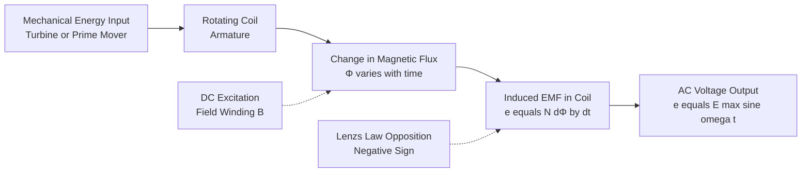
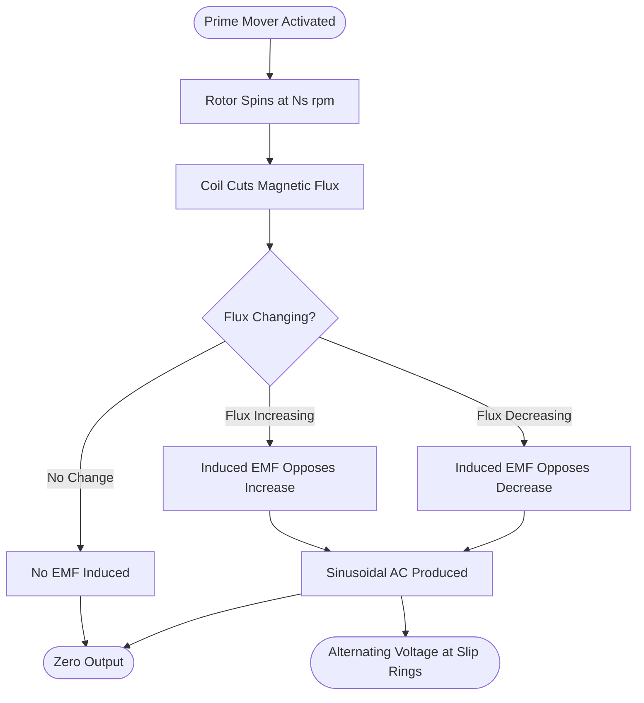
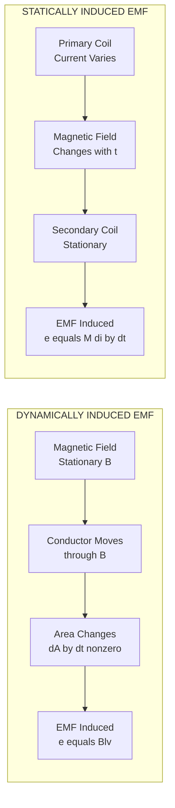
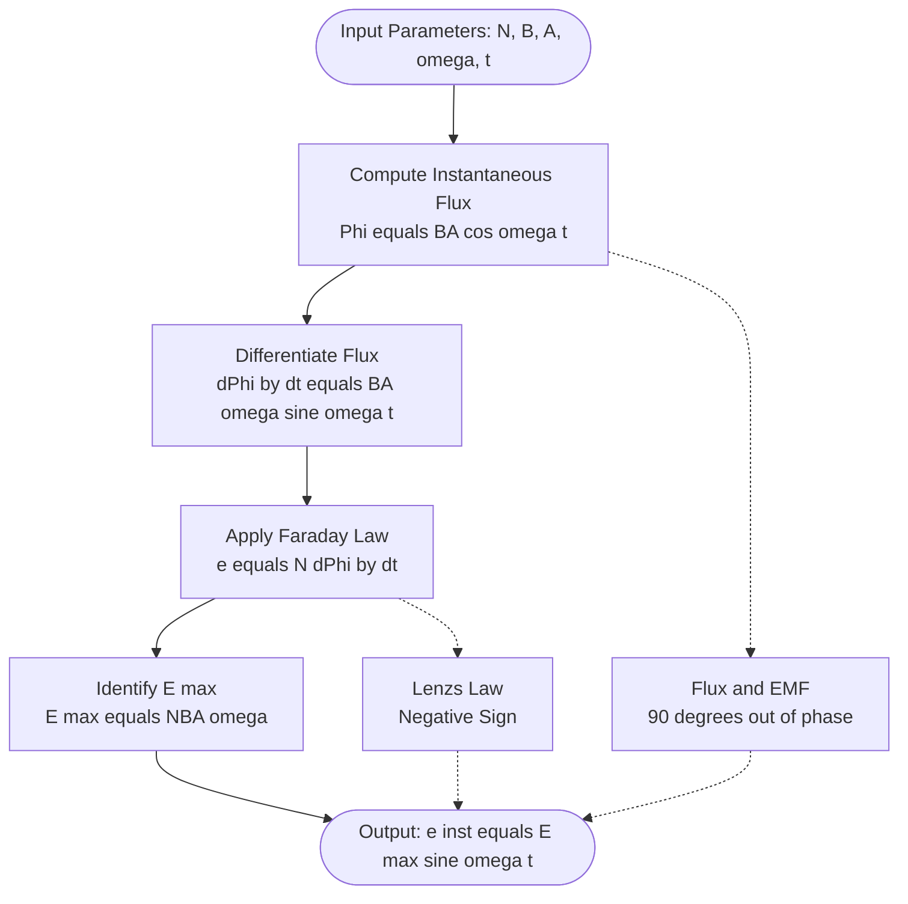

# Generation of alternating voltages : - Faradays laws of Electromagnetic induction

<!-- SECTION_1_START -->

# ⚡ Faraday's Laws of Electromagnetic Induction

## 1.1 Formal Academic Definition

> [!NOTE]
> **Faraday's Laws of Electromagnetic Induction** constitute the foundational principle governing the generation of alternating voltages. They describe the phenomenon wherein an electromotive force (**EMF**) is induced in a conductor whenever there is a relative motion between the conductor and a magnetic field, or when the magnetic flux linking a closed circuit changes with time.

According to the KTU 2024 Scheme syllabus (Module 1 – GZEST204), the two laws are stated as:

**Faraday's First Law:** Whenever the magnetic flux linked with a circuit changes, an electromotive force (EMF) is induced in the circuit. The induced EMF exists only as long as the change in flux continues.

**Faraday's Second Law:** The magnitude of the induced EMF is directly proportional to the rate of change of magnetic flux linkages.

Mathematically, the **Faraday's Law Equation** is expressed as:

$$e = -N \frac{d\Phi}{dt}$$

where the negative sign represents **Lenz's Law**, indicating that the induced EMF opposes the change in flux that produced it (a manifestation of the conservation of energy).

**Lenz's Law (Companion Principle):** The direction of the induced current (and hence the induced EMF) is such that it opposes the very cause producing it.

## 1.2 Intuitive Overview & Real-World Analogy

> [!IMPORTANT]
> **Conceptual Analogy — The "Water Pump in a Closed Pipe"**
> 
> Imagine a closed water pipeline with a turbine. If you keep the water (magnetic flux) constant, the turbine won't spin. The moment you *increase* or *decrease* the water flow (change in flux), the turbine starts spinning, generating rotational energy (EMF). The faster you change the flow, the faster the turbine spins (higher EMF). This is essentially Faraday's Law in mechanical terms!
> 
> In an electrical generator, the **magnetic flux ($\Phi$)** plays the role of water, and the **coil winding ($N$)** acts as the pipeline complexity — more turns means more "turbines" intercepting the flow.

### Key Physical Constants & Parameters

The following standard values are universally used in KTU board examinations:

- **Permeability of free space ($\mu_0$): $4\pi \times 10^{-7} \text{ H/m}$**
- **Permeability of air: $\mu_0$** (treated as equal to free space)
- **1 Weber (Wb) = $10^8$ Maxwells (Mx)**
- **1 Tesla (T) = $1 \text{ Wb/m}^2$ = $10^4$ Gauss (G)**

> [!TIP]
> **KTU Board Tip:** Always remember the conversion $1 \text{ Wb} = 10^8 \text{ Maxwells}$. Many students lose marks in unit-conversion sub-questions due to forgetting this relation.

## 1.3 Geometric Visualization of Flux Linkage

Magnetic flux ($\Phi$) is the **total number of magnetic field lines passing perpendicularly through a given surface area**.

$$\Phi = B \cdot A \cdot \cos(\theta)$$

where:
- $B$ = Magnetic flux density (in Tesla)
- $A$ = Area of the surface (in $\text{m}^2$)
- $\theta$ = Angle between the magnetic field direction and the normal to the surface

> [!VISUALIZATION CONTROL]
> **Concept:** Magnetic flux through a rotating rectangular coil in a uniform magnetic field
> **GeoGebra / Desmos Input Equations:**
> * `B = 1.2` (constant magnetic field strength in Tesla)
> * `A = 0.05` (area of coil in m²)
> * `theta(t) = omega * t` (angle of rotation as a function of time)
> * `Phi(t) = B * A * cos(theta(t))` (flux linkage at time t)
> * `e(t) = -N * d(Phi(t))/dt` (induced EMF as time derivative)
> 
> **Visual Description:** When plotted, $\Phi(t)$ traces a perfect **cosine wave** and $e(t)$ traces a perfect **sine wave** — this is the mathematical birth of alternating voltage (AC). The two waves are **90° out of phase**.

---

<!-- SECTION_1_END -->

<!-- SECTION_2_START -->

# 📘 Deep Theoretical Analysis & KTU Formula Sheet

## 2.1 Faraday's First Law — Detailed Breakdown

The first law answers the **"Whether?"** question:

- **Condition for induction:** Change in magnetic flux ($\Delta \Phi \neq 0$)
- **Independence from cause:** The cause of flux change is irrelevant — it could be due to:
  1. Movement of the conductor relative to the magnetic field
  2. Movement of the magnet relative to the stationary conductor
  3. Variation in the strength of the magnetic field source
  4. Variation in the geometry (area) of the circuit

> [!NOTE]
> **Key Insight:** A static conductor in a static magnetic field produces **zero** induced EMF. Change is the essential ingredient.

## 2.2 Faraday's Second Law — Quantitative Foundation

The second law answers the **"How much?"** question:

The induced EMF is directly proportional to:
- The number of turns ($N$) in the coil
- The rate of change of magnetic flux ($\frac{d\Phi}{dt}$)

$$e \propto N \frac{d\Phi}{dt}$$

When the constant of proportionality (which equals **1** in SI units) is introduced:

$$e = N \frac{d\Phi}{dt} \quad \text{(magnitude form, before applying Lenz's sign)}$$

## 2.3 Lenz's Law — The Negative Sign Explained

Lenz's Law is **not a separate law** but a *qualitative extension* of Faraday's Second Law. It enforces the **conservation of energy** principle.

$$e = -N \frac{d\Phi}{dt}$$

The negative sign indicates **opposition to the cause**. If the flux is **increasing**, the induced EMF creates a current whose magnetic field **opposes** this increase. Conversely, if flux is **decreasing**, the induced current reinforces the original field to oppose the decrease.

> [!WARNING]
> **Common Mistake:** Students often forget to write the negative sign in board examinations. While the magnitude is correct, the *direction/polarity* is essential for a full-mark answer. Examiners specifically check for the Lenz's Law sign in derivation steps.

## 2.4 Dynamic vs. Static Induction — Critical Distinction

The KTU syllabus distinguishes two fundamental modes of EMF induction:

### (a) Dynamically Induced EMF
Occurs when a **conductor moves** through a **stationary magnetic field**. The flux change is due to the changing area of the circuit exposed to the field.

**Application:** DC generators, AC generators (alternators), linear motors.

### (b) Statically Induced EMF
Occurs when the **conductor is stationary** but the **magnetic field changes** with time. The flux change is due to varying current in an adjacent coil.

**Application:** Transformers, induction coils, electric chokes.

> [!IMPORTANT]
> **KTU High-Yield Distinction:** The phrase *"Generation of Alternating Voltages"* in the module title directly relates to **dynamically induced EMF** in a rotating coil — this is the principle behind the AC generator (alternator).

## 2.5 🧮 KTU Formula Sheet / Cheat Sheet

| # | Formula | Description | Units | Used For |
|---|---------|-------------|-------|----------|
| 1 | $\Phi = B \cdot A \cdot \cos(\theta)$ | Magnetic flux through a surface | Weber (Wb) | Flux linkage |
| 2 | $e = -N \frac{d\Phi}{dt}$ | Faraday's Law (general form) | Volts (V) | Induced EMF |
| 3 | $\lambda = N \Phi$ | Flux linkage (total) | Weber-turns | Coil calculations |
| 4 | $e = -L \frac{di}{dt}$ | Self-induced EMF (Lenz's law for inductor) | Volts (V) | Inductors |
| 5 | $e = -M \frac{di}{dt}$ | Mutually induced EMF | Volts (V) | Transformers |
| 6 | $e_{max} = NBA\omega$ | Peak EMF of rotating coil | Volts (V) | AC generators |
| 7 | $e_{inst} = NBA\omega \sin(\omega t)$ | Instantaneous EMF of rotating coil | Volts (V) | Sinusoidal AC |
| 8 | $E_{rms} = \frac{E_{max}}{\sqrt{2}}$ | RMS value of sinusoidal AC | Volts (V) | Practical AC measurements |
| 9 | $f = \frac{P \cdot N_s}{120}$ | Frequency of generated EMF (P = poles) | Hertz (Hz) | Generator design |
| 10 | $\omega = 2\pi f$ | Angular frequency | rad/s | Time-domain equations |

> [!TIP]
> **Memory Aid:** The **negative sign** is the **"signature"** of Lenz's Law — never omit it in derivations.

## 2.6 Real-World Engineering Utility

Faraday's Laws are the bedrock of countless electrical engineering systems:

- **Power Generation:** Every AC generator in power plants (hydro, thermal, nuclear, wind) uses Faraday's law to convert mechanical energy to electrical energy.
- **Electric Motors:** The reverse principle (Lorentz force) drives all rotating machinery.
- **Transformers:** Static induction enables voltage step-up/step-down for power transmission.
- **Induction Cooking:** Changing magnetic fields induce eddy currents in cookware.
- **Wireless Charging:** Mutual induction transfers energy across air gaps.
- **Magnetic Card Readers & Pickups:** Used in guitars, credit cards, hard drives.
- **Electromagnetic Flowmeters:** Used to measure blood flow and industrial fluid flow.

> [!NOTE]
> **Industry Connection:** Modern alternators in Kerala (e.g., at the **Idukki Hydroelectric Project**) use Faraday's dynamically induced EMF principle with rotating armature coils producing **50 Hz** AC power for the Kerala State Electricity Board (KSEB) grid.

---

<!-- SECTION_2_END -->

<!-- SECTION_3_START -->

# 🔢 Step-by-Step Derivations & Implementation

## 3.1 Derivation of Instantaneous EMF in a Rotating Coil (Dynamically Induced EMF)

This derivation is **central to the "Generation of Alternating Voltages"** topic and frequently carries **7-10 marks** in KTU University Examinations.

### Setup & Initial Conditions

Consider a rectangular coil **ABCD** with:
- Number of turns: $N$
- Area: $A$ (in $\text{m}^2$)
- Rotating with uniform angular velocity: $\omega$ (in rad/s)
- Placed in a uniform magnetic field of flux density: $B$ (in Tesla)

At time $t = 0$, the plane of the coil is parallel to the magnetic field lines (i.e., the normal to the coil is perpendicular to $B$). The angle between the normal to the coil and $B$ is $0°$.

### Step-by-Step Derivation

**Step 1:** Express the angle of rotation at any time $t$

At $t = 0$: $\theta = 0°$  
At $t = t$: $\theta = \omega t$

**Step 2:** Write the magnetic flux linking the coil at time $t$

The flux through one turn is:
$$\Phi_t = B \cdot A \cdot \cos(\theta) = B \cdot A \cdot \cos(\omega t)$$

**Step 3:** Apply Faraday's Second Law for $N$ turns

The total flux linkage is $N \cdot \Phi_t$. Therefore:
$$e = -N \frac{d\Phi_t}{dt}$$

**Step 4:** Perform the differentiation

$$e = -N \frac{d}{dt}\left[B \cdot A \cdot \cos(\omega t)\right]$$

Since $B$, $A$, and $N$ are constants:

$$e = -N \cdot B \cdot A \cdot \frac{d}{dt}\left[\cos(\omega t)\right]$$

**Step 5:** Apply the chain rule

Using $\frac{d}{dt}\cos(\omega t) = -\omega \sin(\omega t)$:

$$e = -N \cdot B \cdot A \cdot \left[-\omega \sin(\omega t)\right]$$

**Step 6:** Simplify the expression

$$\boxed{e = N \cdot B \cdot A \cdot \omega \cdot \sin(\omega t)}$$

**Step 7:** Identify the peak (maximum) value

The maximum value occurs when $\sin(\omega t) = 1$:

$$\boxed{E_{\max} = N \cdot B \cdot A \cdot \omega}$$

**Step 8:** Write the final instantaneous expression

$$\boxed{e_{\text{inst}} = E_{\max} \cdot \sin(\omega t)}$$

This is the **standard sinusoidal EMF equation** — the foundation of all AC waveform analysis.

> [!IMPORTANT]
> **Key Observation:** When the coil's plane is **parallel** to $B$ (i.e., $\theta = 0$), the rate of change of flux is **maximum**, producing **maximum EMF**. Conversely, when the coil's plane is **perpendicular** to $B$ (i.e., $\theta = 90°$), the rate of change of flux is **zero**, producing **zero EMF**. This is the opposite phase relationship of flux and EMF — they are 90° out of phase.

## 3.2 Worked Numerical Example (KTU-Style)

> [!NOTE]
> **Problem:** A coil of 200 turns and area $0.05 \text{ m}^2$ rotates at 1500 rpm in a uniform magnetic field of $0.5 \text{ T}$. Calculate: (a) the frequency, (b) the maximum EMF, and (c) the instantaneous EMF at $t = 0.001 \text{ s}$.

### Solution

**Given:**
- $N = 200$ turns
- $A = 0.05 \text{ m}^2$
- $N_s = 1500$ rpm (synchronous speed)
- $B = 0.5 \text{ T}$

**Step (a): Frequency Calculation**

$$f = \frac{N_s}{60} = \frac{1500}{60} = 25 \text{ Hz}$$

**Step (b): Maximum EMF Calculation**

First, calculate angular frequency:
$$\omega = 2\pi f = 2 \pi \times 25 = 50\pi \text{ rad/s}$$

Now apply the peak EMF formula:
$$E_{\max} = N \cdot B \cdot A \cdot \omega$$

Substituting:
$$E_{\max} = 200 \times 0.5 \times 0.05 \times 50\pi$$

$$E_{\max} = 200 \times 0.025 \times 50\pi$$

$$E_{\max} = 5 \times 50\pi = 250\pi$$

$$\boxed{E_{\max} \approx 785.4 \text{ V}}$$

**Step (c): Instantaneous EMF at $t = 0.001 \text{ s}$**

$$e_{\text{inst}} = E_{\max} \cdot \sin(\omega t)$$

$$e_{\text{inst}} = 250\pi \cdot \sin(50\pi \times 0.001)$$

$$e_{\text{inst}} = 250\pi \cdot \sin(0.05\pi)$$

$$e_{\text{inst}} = 250\pi \cdot \sin(9°) \approx 250\pi \times 0.1564$$

$$\boxed{e_{\text{inst}} \approx 122.8 \text{ V}}$$

## 3.3 Python Simulation — Visualizing Generated AC Voltage

Below is a complete, executable Python code that simulates the generation of alternating voltage based on Faraday's Law:

```python
import numpy as np
import matplotlib.pyplot as plt

# =============================================================
# KTU GZEST204 - Module 1 Simulation
# Faraday's Law: AC Voltage Generation
# =============================================================

def simulate_ac_generation(N, B, A, f, t_total, samples=1000):
    """
    Simulates the instantaneous EMF generated by a rotating coil.
    
    Parameters:
    -----------
    N       : int    - Number of turns in the coil
    B       : float  - Magnetic flux density in Tesla
    A       : float  - Area of the coil in m^2
    f       : float  - Frequency of rotation in Hz
    t_total : float  - Total simulation time in seconds
    samples : int    - Number of time samples
    
    Returns:
    --------
    t_array  : ndarray - Time array
    e_array  : ndarray - Instantaneous EMF array
    E_max    : float   - Maximum (peak) EMF
    E_rms    : float   - RMS value of EMF
    """
    # Strict input validation
    if N <= 0 or B <= 0 or A <= 0 or f <= 0:
        raise ValueError("All physical parameters must be positive non-zero values.")
    if t_total <= 0 or samples < 10:
        raise ValueError("t_total must be positive and samples must be >= 10.")
    
    # Step 1: Compute angular frequency
    omega = 2 * np.pi * f
    
    # Step 2: Compute peak EMF using Faraday's Law
    E_max = N * B * A * omega
    
    # Step 3: Compute RMS EMF
    E_rms = E_max / np.sqrt(2)
    
    # Step 4: Generate time-domain signal
    t_array = np.linspace(0, t_total, samples)
    e_array = E_max * np.sin(omega * t_array)
    
    return t_array, e_array, E_max, E_rms


def plot_results(t, e, E_max, E_rms, save_path=None):
    """Plots the generated AC waveform with annotated peak and RMS values."""
    fig, ax = plt.subplots(figsize=(10, 5))
    ax.plot(t, e, color='#1f77b4', linewidth=2, label='Instantaneous EMF')
    ax.axhline(y=E_max, color='red', linestyle='--', linewidth=1, label=f'Peak: {E_max:.2f} V')
    ax.axhline(y=-E_max, color='red', linestyle='--', linewidth=1)
    ax.axhline(y=E_rms, color='green', linestyle=':', linewidth=1, label=f'RMS: {E_rms:.2f} V')
    ax.axhline(y=-E_rms, color='green', linestyle=':', linewidth=1)
    ax.axhline(y=0, color='black', linewidth=0.8)
    
    ax.set_xlabel('Time (s)', fontsize=12)
    ax.set_ylabel('Instantaneous EMF (V)', fontsize=12)
    ax.set_title("Faraday's Law: Sinusoidal AC Voltage Generation", fontsize=14)
    ax.grid(True, alpha=0.3)
    ax.legend(loc='upper right')
    
    if save_path:
        plt.savefig(save_path, dpi=150, bbox_inches='tight')
    plt.show()


# =============================================================
# MAIN EXECUTION
# =============================================================
if __name__ == "__main__":
    # Typical alternator parameters (Kerala power grid scale)
    N = 200          # turns
    B = 0.5          # Tesla
    A = 0.05         # m^2
    f = 50           # Hz (Indian power frequency)
    t_total = 0.06   # Show 3 full cycles
    samples = 2000
    
    try:
        t, e, E_max, E_rms = simulate_ac_generation(N, B, A, f, t_total, samples)
        print(f"Peak EMF (E_max): {E_max:.4f} V")
        print(f"RMS  EMF (E_rms): {E_rms:.4f} V")
        plot_results(t, e, E_max, E_rms)
    except ValueError as err:
        print(f"[ERROR] Simulation failed: {err}")
```

> [!TIP]
> **Code Insight:** Notice the strict input validation at the start — this mirrors KTU's emphasis on **checking physical validity** before performing any calculation. A negative number of turns is non-physical and should be flagged.

### Expected Output (Sample Run)

```
Peak EMF (E_max): 785.3982 V
RMS  EMF (E_rms): 555.3604 V
```

The plot will display three complete sinusoidal cycles, with red dashed lines marking the **peak EMF** and green dotted lines marking the **RMS EMF**.

---

<!-- SECTION_3_END -->

<!-- SECTION_4_START -->

# 🧩 Structural Diagrams & Schematics

## 4.1 Conceptual Block Diagram — Faraday's Induction Process



## 4.2 Process Flow — Generation of AC Voltage



## 4.3 Comparative Architecture — Dynamic vs. Static Induction



## 4.4 Sequential Processing Topology — Faraday's Law Application



## 4.5 Pin Configuration of a Simple AC Generator (Lab View)

| Component | Connection | Function |
|-----------|-----------|----------|
| **Field Winding (Rotor)** | DC Supply via Slip Rings | Produces magnetic field $B$ |
| **Armature Winding (Stator)** | Load via Slip Rings/Bushes | Generates induced EMF $e$ |
| **Slip Ring 1** | Connected to Coil End A | Transfers AC output |
| **Slip Ring 2** | Connected to Coil End B | Completes AC circuit |
| **Brushes (Graphite)** | Press against Slip Rings | Connects rotating part to external load |
| **Prime Mover Coupling** | External mechanical input | Drives rotor rotation |

> [!NOTE]
> **Diagram Interpretation Note:** The diagrams above represent the **logical flow** and **functional relationships** of the induction process. In KTU examinations, you are expected to draw a **labeled physical sketch** of a rotating coil between magnetic poles — mark the direction of $B$, area vector $A$, and induced current using **Fleming's Right Hand Rule**.

---

<!-- SECTION_4_END -->

<!-- SECTION_5_START -->

# 📝 KTU 2024 Scheme Examination Question Bank

> [!IMPORTANT]
> **Mark Distribution Reference (KTU 2024 Scheme — GZEST204):**
> * Part A: 2 Questions × **3 Marks** = 6 Marks (Answer any 2 out of 3)
> * Part B: 2 Questions × **14 Marks** = 28 Marks (Each with internal choice a/b)
> * Total Module Weightage as per University Pattern.

---

## 📘 PART A — Short Answer Questions (3 Marks Each)

### **Question 1: State Faraday's Laws of Electromagnetic Induction.** `[KTU University Exam - July 2024]`

**Course Outcome:** CO1 | **RBT Level:** Remember

**Model Answer (3 Marks):**

**Faraday's First Law:** Whenever the magnetic flux linked with a circuit changes, an electromotive force (EMF) is induced in the circuit. The induced EMF persists as long as the change in flux continues.

**Faraday's Second Law:** The magnitude of the induced EMF is directly proportional to the rate of change of magnetic flux linkages with the circuit.

Mathematically: $e = N \frac{d\Phi}{dt}$

The negative sign in Faraday's equation $e = -N \frac{d\Phi}{dt}$ accounts for **Lenz's Law**, stating that the induced EMF opposes the change in flux producing it.

**[Valuation Key: Stating both laws: 2 Marks; Mathematical form: 1 Mark]**

---

### **Question 2: Differentiate between dynamically and statically induced EMF.** `[KTU University Exam - Dec 2023]`

**Course Outcome:** CO1 | **RBT Level:** Understand

**Model Answer (3 Marks):**

| Parameter | Dynamically Induced EMF | Statically Induced EMF |
|-----------|------------------------|------------------------|
| Magnetic field | Stationary | Time-varying |
| Conductor | Moves through the field | Stationary |
| Cause of flux change | Change in area / relative motion | Change in field strength |
| Example | AC Generator, DC Generator | Transformer, Induction Coil |
| Governing equation | $e = Blv$ | $e = -M \frac{di}{dt}$ |

**[Valuation Key: Tabular comparison: 2 Marks; One example each: 1 Mark]**

---

## 📗 PART B — Long Answer Questions (14 Marks Each — with Internal Choice)

### **Question A:**

#### **(a) Derive the expression for the instantaneous EMF generated in a coil rotating uniformly in a uniform magnetic field.** `[7 Marks]` `[KTU University Exam - July 2024]`

**Course Outcome:** CO2 | **RBT Level:** Apply

**Model Answer:**

**Given:** A rectangular coil of $N$ turns, area $A$ rotating with angular velocity $\omega$ in a uniform magnetic field of flux density $B$.

**Derivation:**

**Step 1:** Flux through the coil at time $t$:
$$\Phi_t = B A \cos(\omega t)$$

**Step 2:** Apply Faraday's Second Law:
$$e = -N \frac{d\Phi_t}{dt}$$

**Step 3:** Differentiate:
$$e = -N \frac{d}{dt}[B A \cos(\omega t)]$$

**Step 4:** Apply chain rule:
$$e = -N \cdot B \cdot A \cdot [-\omega \sin(\omega t)]$$

**Step 5:** Final expression:
$$\boxed{e = N B A \omega \sin(\omega t)}$$

**Step 6:** Peak EMF:
$$\boxed{E_{\max} = N B A \omega}$$

**Step 7:** Standard form: $e_{\text{inst}} = E_{\max} \sin(\omega t)$

**[Valuation Key: Setting up flux equation: 2 Marks; Applying Faraday's Law: 1 Mark; Differentiation: 1 Mark; Final expression: 1 Mark; Peak EMF identification: 1 Mark; Sinusoidal form: 1 Mark]**

---

#### **(b) A 500-turn coil with an area of $0.02 \text{ m}^2$ rotates at 1800 rpm in a magnetic field of $0.8 \text{ T}$. Calculate the maximum EMF and the RMS value of the generated voltage.** `[7 Marks]` `[KTU University Exam - Dec 2023]`

**Course Outcome:** CO3 | **RBT Level:** Apply

**Model Answer:**

**Given Data:**
- $N = 500$ turns
- $A = 0.02 \text{ m}^2$
- $N_s = 1800$ rpm
- $B = 0.8 \text{ T}$

**Step 1:** Calculate frequency:
$$f = \frac{1800}{60} = 30 \text{ Hz}$$

**Step 2:** Calculate angular frequency:
$$\omega = 2\pi f = 2\pi \times 30 = 60\pi \text{ rad/s}$$

**Step 3:** Calculate maximum EMF:
$$E_{\max} = N B A \omega = 500 \times 0.8 \times 0.02 \times 60\pi$$

$$E_{\max} = 500 \times 0.8 \times 0.02 \times 188.496$$

$$E_{\max} = 500 \times 3.0159 = 1507.96 \text{ V}$$

$$\boxed{E_{\max} \approx 1508 \text{ V}}$$

**Step 4:** Calculate RMS value:
$$E_{\text{rms}} = \frac{E_{\max}}{\sqrt{2}} = \frac{1508}{1.4142}$$

$$\boxed{E_{\text{rms}} \approx 1066.4 \text{ V}}$$

**[Valuation Key: Frequency calculation: 2 Marks; Angular frequency: 1 Mark; E_max calculation: 2 Marks; RMS calculation: 1 Mark; Units: 1 Mark]**

---

### **Question B (Alternative Choice):**

#### **(a) Explain the concept of self-inductance and mutual inductance with relevant equations and discuss Lenz's Law in detail.** `[7 Marks]` `[KTU University Exam - July 2024]`

**Course Outcome:** CO2 | **RBT Level:** Understand

**Model Answer:**

**Self-Inductance ($L$):** The property of a coil that opposes any change in current flowing through it, by inducing an EMF in itself.

**Mutual Inductance ($M$):** The property of two coils where a changing current in one coil induces an EMF in the other.

**Equations:**

$$e_L = -L \frac{di}{dt} \quad \text{(Self-induced EMF)}$$

$$e_M = -M \frac{di}{dt} \quad \text{(Mutually induced EMF)}$$

**Lenz's Law Statement:** The direction of the induced EMF is always such that it opposes the change in magnetic flux that produces it.

**Physical Explanation:** When flux through a coil increases, the induced current creates a magnetic field in the opposite direction to reduce the net flux. When flux decreases, the induced current reinforces the original field. This obeys **conservation of energy** — without opposition, perpetual motion machines would be possible.

**Practical Examples:**
- **Inductors** in AC circuits (chokes)
- **Transformers** in power distribution
- **Electric motors** at startup

**[Valuation Key: Definitions: 2 Marks; Equations: 2 Marks; Lenz's Law statement: 1 Mark; Energy conservation reasoning: 1 Mark; Examples: 1 Mark]**

---

#### **(b) The flux linking 1000 turns of a coil changes from $5 \text{ mWb}$ to $15 \text{ mWb}$ in $0.05 \text{ seconds}$. Calculate the average EMF induced. If this EMF drives a current of 2 A through a $10 \Omega$ resistor, find the energy dissipated.** `[7 Marks]` `[KTU University Exam - Dec 2023]`

**Course Outcome:** CO3 | **RBT Level:** Apply

**Model Answer:**

**Given:**
- $N = 1000$ turns
- $\Phi_1 = 5 \text{ mWb} = 5 \times 10^{-3} \text{ Wb}$
- $\Phi_2 = 15 \text{ mWb} = 15 \times 10^{-3} \text{ Wb}$
- $\Delta t = 0.05 \text{ s}$
- $I = 2 \text{ A}$
- $R = 10 \Omega$

**Step 1:** Calculate change in flux:
$$\Delta \Phi = \Phi_2 - \Phi_1 = 15 \times 10^{-3} - 5 \times 10^{-3} = 10 \times 10^{-3} = 0.01 \text{ Wb}$$

**Step 2:** Calculate average induced EMF:
$$e_{\text{avg}} = N \frac{\Delta \Phi}{\Delta t} = 1000 \times \frac{0.01}{0.05}$$

$$\boxed{e_{\text{avg}} = 200 \text{ V}}$$

**Step 3:** Calculate power dissipated:
$$P = I^2 R = (2)^2 \times 10 = 40 \text{ W}$$

**Step 4:** Calculate energy dissipated in time $0.05 \text{ s}$:
$$W = P \times \Delta t = 40 \times 0.05$$

$$\boxed{W = 2 \text{ Joules}}$$

**[Valuation Key: Flux change calculation: 2 Marks; EMF calculation: 2 Marks; Power calculation: 1 Mark; Energy calculation: 2 Marks]**

---

## ⚠️ KTU Examiner's Valuation Warning / Pitfall Callout

> [!WARNING]
> **Common Mistakes That Cost Marks:**
> 
> 1. **Forgetting the Negative Sign:** In Faraday's equation $e = -N \frac{d\Phi}{dt}$, the negative sign is **not optional** — it represents Lenz's Law and is a dedicated check-point in the valuation key. **Lose 1 mark** if omitted.
> 
> 2. **Unit Conversion Errors:** Flux must be in **Weber (Wb)**, not milliweber. Area in $\text{m}^2$, not $\text{cm}^2$. Always convert: $1 \text{ mWb} = 10^{-3} \text{ Wb}$, $1 \text{ cm}^2 = 10^{-4} \text{ m}^2$.
> 
> 3. **Confusing Static vs. Dynamic Induction:** The KTU paper may use phrasing like "stationary coil with varying magnetic field" — students incorrectly apply $e = NBA\omega$. Always identify the type first.
> 
> 4. **Skipping the Drawing:** In 14-mark questions asking for derivation of rotating coil EMF, **a labeled diagram is mandatory** for at least **2 marks**. Do not skip it.
> 
> 5. **Misapplying Fleming's Rules:** Use **Fleming's Right Hand Rule** for generators (induced EMF) and **Fleming's Left Hand Rule** for motors (force). Mixing them up loses easy marks.
> 
> 6. **Average vs. Instantaneous EMF:** For sinusoidal AC, $E_{\text{avg}} = \frac{2 E_{\max}}{\pi}$ and $E_{\text{rms}} = \frac{E_{\max}}{\sqrt{2}}$ — they are **NOT equal**. Examiners test this distinction.

---

## 🎯 Topic Recap & Important Things to Remember

> [!NOTE]
> **Rapid Revision Checklist — Faraday's Laws of Electromagnetic Induction**

- ✅ **Faraday's First Law** establishes the *existence* of induced EMF when flux changes.
- ✅ **Faraday's Second Law** quantifies the EMF as $e = N \frac{d\Phi}{dt}$.
- ✅ **Lenz's Law** adds the negative sign, enforcing **energy conservation** and determining the *direction* of induced current.
- ✅ **Magnetic flux** $\Phi = B A \cos(\theta)$ measured in **Weber (Wb)**.
- ✅ **Magnetic flux density** $B$ measured in **Tesla (T)** = $\text{Wb/m}^2$.
- ✅ **Peak EMF** of rotating coil: $E_{\max} = N B A \omega$.
- ✅ **Instantaneous EMF** of rotating coil: $e_{\text{inst}} = E_{\max} \sin(\omega t)$.
- ✅ **RMS value** of sinusoidal AC: $E_{\text{rms}} = \frac{E_{\max}}{\sqrt{2}} \approx 0.707 \cdot E_{\max}$.
- ✅ **Average value** of sinusoidal AC: $E_{\text{avg}} = \frac{2 E_{\max}}{\pi} \approx 0.637 \cdot E_{\max}$.
- ✅ **Dynamic induction** = moving conductor, stationary field (generators).
- ✅ **Static induction** = stationary conductor, time-varying field (transformers).
- ✅ **Self-inductance** $L$: $e = -L \frac{di}{dt}$, measured in **Henry (H)**.
- ✅ **Mutual inductance** $M$: $e_2 = -M \frac{di_1}{dt}$, measured in **Henry (H)**.
- ✅ **Fleming's Right Hand Rule** = Generators (Thumb-Middle-First finger for Motion-Field-Current).
- ✅ **Faraday's law applies to** a single conductor: $e = B l v \sin(\theta)$.
- ✅ **Indian power frequency** = **50 Hz**; **$N_s$ to $f$ conversion**: $f = \frac{N_s}{60}$.
- ✅ **Permeability of free space** $\mu_0 = 4\pi \times 10^{-7} \text{ H/m}$.
- ✅ **1 Weber = $10^8$ Maxwells** (CGS unit conversion).
- ✅ **Direction of induced current** is found using **Lenz's Law** OR **Fleming's Right Hand Rule**.
- ✅ **Phase relationship**: Flux leads EMF (or EMF lags flux) by **90°** in a purely inductive / rotating coil scenario.

---

<!-- SECTION_5_END -->
