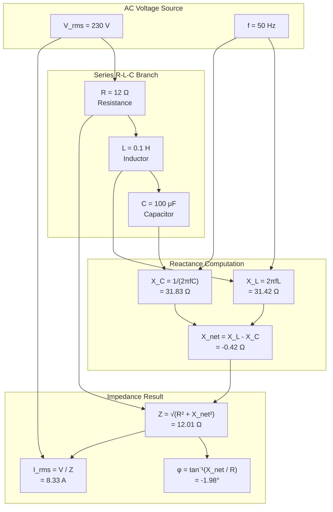
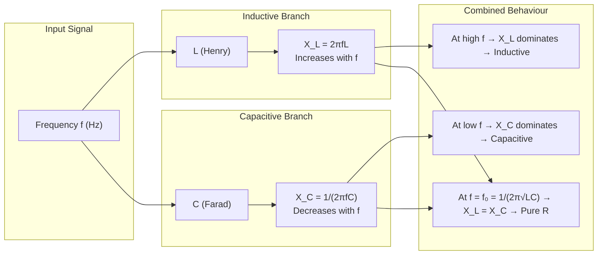
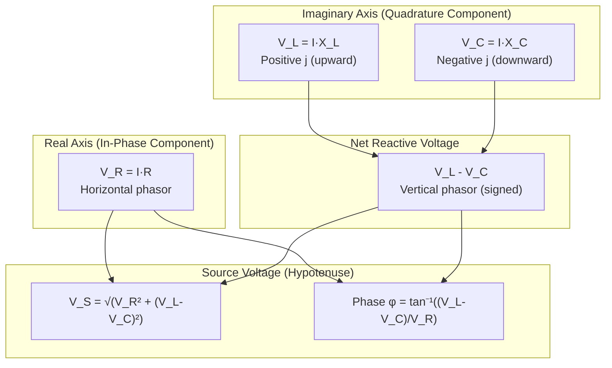
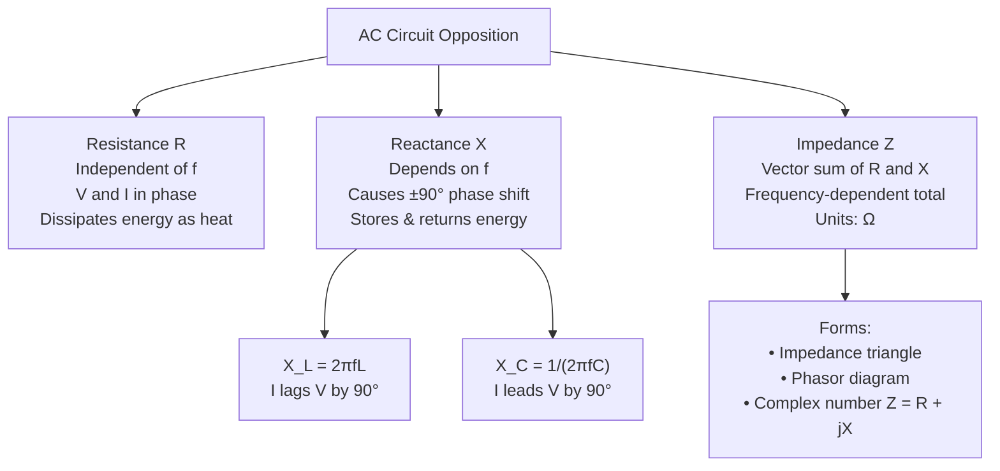

# Inductive and capacitive reactance, concept of impedance. (Simple numerical problems)

<!-- SECTION_1_START -->

# Inductive and Capacitive Reactance & Concept of Impedance

## 1.1 Core Technical Definition

In an **Alternating Current (AC)** circuit, the opposition offered to the flow of current is not just resistance, but a combination of three distinct phenomena: pure resistance ($R$), **inductive reactance** ($X_L$), and **capacitive reactance** ($X_C$). The total opposition is termed **Impedance** ($Z$).

> [!IMPORTANT]
> **KTU 2024 Syllabus Definition (Module 1.3):**
> - **Reactance ($X$):** The opposition to current flow offered by an inductor or capacitor in an AC circuit, measured in **ohms ($\Omega$)**. It is frequency-dependent and causes a phase shift between voltage and current.
> - **Inductive Reactance ($X_L$):** Reactance produced by an inductor $L$ henries at frequency $f$ Hz, given by $X_L = 2\pi f L$.
> - **Capacitive Reactance ($X_C$):** Reactance produced by a capacitor $C$ farads at frequency $f$ Hz, given by $X_C = \dfrac{1}{2\pi f C}$.
> - **Impedance ($Z$):** The vector sum of resistance and net reactance in an AC circuit, measured in **ohms ($\Omega$)**.

---

## 1.2 Conceptual Analogy & Intuitive Overview

Imagine you are pushing a heavy swing (a pendulum) at a constant rhythm:

| Circuit Element | Real-World Analogy | Behaviour |
|---|---|---|
| **Resistor ($R$)** | Air friction on the swing | Always opposes motion. Voltage and current rise and fall **together (in-phase)**. |
| **Inductor ($L$)** | The swing's inertia (mass) | Opposes *changes* in current. Current **lags** voltage by 90°. |
| **Capacitor ($C$)** | A soft cushion storing the push as compression | Opposes *changes* in voltage. Current **leads** voltage by 90°. |
| **Impedance ($Z$)** | Total "feel" of the swing's resistance + inertia + cushion | The vector combination of all three opposing forces. |

> [!NOTE]
> **Key Intuition:** Reactance is not a constant — it changes with the **frequency** $f$ of the AC supply. Higher frequency means **larger** $X_L$ but **smaller** $X_C$. This frequency-dependence is what makes inductors and capacitors so useful in **filters, tuners, and oscillators**.

---

## 1.3 Physical Constants and Standard Metrics

The following constants are essential for KTU numerical problem solving:

- $\pi \approx 3.1416$
- Supply frequency in India: $f = 50\,\text{Hz}$ (domestic & industrial AC mains)
- Standard angular frequency: $\omega = 2\pi f = 2 \times 3.1416 \times 50 = 314.16\,\text{rad/s}$
- Unit of Inductance: **Henry (H)** — typical values range from $\mu\text{H}$ (antennas) to H (power transformers)
- Unit of Capacitance: **Farad (F)** — typical values range from **pF (radio)** to **mF (power factor correction)**
- Unit of Reactance / Impedance: **Ohm ($\Omega$)** — same as resistance

> [!VISUALIZATION CONTROL]
> **Concept:** Phase relationship between voltage $v(t)$ and current $i(t)$ in a purely inductive and purely capacitive AC circuit.
> **GeoGebra / Desmos Input Equations:**
> * `v(t) = sin(2 * pi * 50 * t)` (Voltage waveform, red)
> * `i_L(t) = sin(2 * pi * 50 * t - pi/2)` (Inductor current — lags by 90°, blue)
> * `i_C(t) = sin(2 * pi * 50 * t + pi/2)` (Capacitor current — leads by 90°, green)
>
> **Visual Description:** Plot the three waveforms on the same $t$-axis. Observe that for the inductor, the current waveform peaks **one quarter cycle later** than the voltage (lags by $90^\circ$). For the capacitor, the current peaks **one quarter cycle earlier** (leads by $90^\circ$). The $y$-axis shows amplitude; the $x$-axis shows time in seconds.

---

<!-- SECTION_1_END -->

<!-- SECTION_2_START -->

# Deep Theoretical Analysis & KTU High-Yield Formula Sheet

## 2.1 Inductive Reactance ($X_L$) — The "Inertia" of Current

When AC flows through an inductor of self-inductance $L$ henries, the alternating magnetic flux induces a **back-EMF** (Lenz's Law) that opposes the change in current. This opposition is quantified as inductive reactance:

$$X_L = \omega L = 2\pi f L \quad [\Omega]$$

### Operational Logic (Why it behaves this way):

1. At **higher frequency** $f \uparrow$, the current changes direction faster → flux changes faster → larger back-EMF → larger opposition.
2. At **DC** ($f = 0$), $X_L = 0$ → inductor acts like a **plain wire** (short circuit).
3. At very high frequency ($f \to \infty$), $X_L \to \infty$ → inductor acts like an **open circuit**.
4. **Phase:** Current **lags** voltage by $90^\circ$ (ELI: **E**MF leads **I** in **L**).

> [!NOTE]
> **Engineering Utility:** Inductors are used as **chokes** in fluorescent lamp ballasts, in **EMI filters**, in tuning circuits of radios ($LC$ tank), and as **reactors** in power systems to limit fault currents.

---

## 2.2 Capacitive Reactance ($X_C$) — The "Elasticity" of Voltage

When AC voltage is applied across a capacitor of capacitance $C$ farads, the capacitor alternately charges and discharges. The opposition to this charge-discharge cycle is capacitive reactance:

$$X_C = \dfrac{1}{\omega C} = \dfrac{1}{2\pi f C} \quad [\Omega]$$

### Operational Logic:

1. At **higher frequency** $f \uparrow$, the capacitor has less time to fully charge → smaller opposing voltage → smaller opposition.
2. At **DC** ($f = 0$), $X_C = \infty$ → capacitor acts like an **open circuit** (blocks DC).
3. At very high frequency ($f \to \infty$), $X_C \to 0$ → capacitor acts like a **short circuit**.
4. **Phase:** Current **leads** voltage by $90^\circ$ (ICE: **I** leads **C** for **E**MF).

> [!NOTE]
> **Engineering Utility:** Capacitors are used in **power factor correction** (industries), in **DC blocking** (signal coupling), in **smoothing** (rectifier filters), in **snubber circuits**, and in **timing circuits** ($RC$ oscillators like the 555 timer).

---

## 2.3 Concept of Impedance ($Z$)

Impedance is the **total opposition** to AC current flow, combining resistance and net reactance. Unlike resistance, impedance is a **vector (phasor) quantity** because of the $90^\circ$ phase difference between the resistive and reactive components.

### Series R-L-C Circuit (Most Important for KTU)

For a circuit containing $R$, $L$, and $C$ in series, the impedance is:

$$Z = \sqrt{R^2 + (X_L - X_C)^2} \quad [\Omega]$$

The **phase angle** $\phi$ (angle by which voltage leads current) is:

$$\phi = \tan^{-1}\left(\dfrac{X_L - X_C}{R}\right) \quad [\text{degrees or radians}]$$

Special cases derived from the general formula:

$$\text{For R-L series:} \quad Z = \sqrt{R^2 + X_L^2}$$

$$\text{For R-C series:} \quad Z = \sqrt{R^2 + X_C^2}$$

$$\text{For pure R:} \quad Z = R, \quad \phi = 0^\circ$$

$$\text{For pure L:} \quad Z = X_L, \quad \phi = +90^\circ$$

$$\text{For pure C:} \quad Z = X_C, \quad \phi = -90^\circ$$

### The Impedance Triangle (KTU High-Yield Diagram Concept)

```
              Z (hypotenuse)  ← Impedance
             /|
            / |
           /  | (X_L - X_C)  ← Net Reactance
          /   |
         / φ  |
        /_____| 
           R                ← Resistance
```

- $\phi > 0$ → Circuit is **inductive** (voltage leads current).
- $\phi < 0$ → Circuit is **capacitive** (voltage lags current).
- $\phi = 0$ → Circuit is at **resonance** (purely resistive).

---

## 2.4 KTU Formula Cheat Sheet

| Symbol | Quantity | Formula | Unit | Phase Behaviour |
|:---:|:---|:---|:---:|:---|
| $X_L$ | Inductive Reactance | $2\pi f L$ | $\Omega$ | Current lags V by $90^\circ$ |
| $X_C$ | Capacitive Reactance | $\dfrac{1}{2\pi f C}$ | $\Omega$ | Current leads V by $90^\circ$ |
| $X$ | Net Reactance | $X_L - X_C$ | $\Omega$ | Vector difference |
| $Z$ | Impedance (series RLC) | $\sqrt{R^2 + (X_L - X_C)^2}$ | $\Omega$ | Phasor sum of R and X |
| $\phi$ | Phase Angle | $\tan^{-1}\left(\dfrac{X_L - X_C}{R}\right)$ | degrees | $\phi > 0$ inductive, $\phi < 0$ capacitive |
| $I$ | RMS Current | $\dfrac{V}{Z}$ | A | — |
| $V_R$ | Voltage across R | $I \cdot R$ | V | In-phase with I |
| $V_L$ | Voltage across L | $I \cdot X_L$ | V | Leads I by $90^\circ$ |
| $V_C$ | Voltage across C | $I \cdot X_C$ | V | Lags I by $90^\circ$ |
| $V_S$ | Source Voltage (RMS) | $\sqrt{V_R^2 + (V_L - V_C)^2}$ | V | Leads I by $\phi$ |

> [!IMPORTANT]
> **Golden KTU Rule:** Resistances and reactances are added **perpendicularly** (vectorially), not algebraically. The hypotenuse of the impedance triangle is the impedance. Always draw the triangle first, then use trigonometry.

---

## 2.5 Real-World Engineering Applications

| Application | Role of Reactance/Impedance |
|---|---|
| **Power Factor Correction** | Capacitors added in parallel to industrial loads to cancel $X_L$, reducing $I$ and line losses. |
| **FM Radio Tuning** | Variable capacitor adjusts $X_C$ until $X_L = X_C$ (resonance) at the desired station frequency. |
| **Mains Choke (Tube Light)** | Inductor's $X_L$ limits current through the fluorescent tube after starter opens. |
| **High-Pass / Low-Pass Filters** | Series capacitor blocks low frequencies ($X_C \uparrow$ at low $f$); series inductor blocks high frequencies. |
| **Oscilloscope Probes** | Compensating capacitor cancels probe cable's $X_C$ to maintain flat frequency response. |
| **Induction Heating** | Coil's reactance concentrates eddy-current heating in metal parts at specific frequencies. |

---

<!-- SECTION_2_END -->

<!-- SECTION_3_START -->

# Step-by-Step Derivations & Code/Symbolic Implementation

## 3.1 Derivation of Inductive Reactance

Consider an inductor $L$ connected across an AC voltage source $v(t) = V_m \sin(\omega t)$.

The induced EMF in the inductor is given by Lenz's Law:

$$e = -L \dfrac{di}{dt}$$

In equilibrium, the applied voltage equals the back-EMF:

$$v = L \dfrac{di}{dt}$$

Substitute the source voltage:

$$V_m \sin(\omega t) = L \dfrac{di}{dt}$$

Rearranging for current:

$$\dfrac{di}{dt} = \dfrac{V_m}{L} \sin(\omega t)$$

Integrate both sides with respect to $t$:

$$i(t) = \dfrac{V_m}{L} \int \sin(\omega t) \, dt = \dfrac{V_m}{L} \cdot \left(-\dfrac{\cos(\omega t)}{\omega}\right)$$

$$i(t) = -\dfrac{V_m}{\omega L} \cos(\omega t) = \dfrac{V_m}{\omega L} \sin(\omega t - 90^\circ)$$

Comparing the peak value of current $I_m = \dfrac{V_m}{\omega L}$ with the general AC relation $I_m = \dfrac{V_m}{X_L}$:

$$\boxed{X_L = \omega L = 2\pi f L}$$

The $-\sin(90^\circ)$ shift in the current expression confirms that **current lags voltage by $90^\circ$** in a pure inductor.

---

## 3.2 Derivation of Capacitive Reactance

Consider a capacitor $C$ connected across the same AC source. The charge on the capacitor is:

$$q = C \cdot v = C V_m \sin(\omega t)$$

Current is the rate of change of charge:

$$i = \dfrac{dq}{dt} = \dfrac{d}{dt}\left[C V_m \sin(\omega t)\right]$$

$$i = C V_m \omega \cos(\omega t) = \dfrac{V_m}{1/(\omega C)} \sin(\omega t + 90^\circ)$$

The peak current is $I_m = V_m \cdot \omega C$, so comparing with $I_m = V_m / X_C$:

$$\boxed{X_C = \dfrac{1}{\omega C} = \dfrac{1}{2\pi f C}}$$

The $+\sin(90^\circ)$ shift confirms that **current leads voltage by $90^\circ$** in a pure capacitor.

---

## 3.3 Derivation of Series RLC Impedance

Apply KVL around the series loop with current $i$ flowing:

$$v_S = v_R + v_L + v_C$$

In phasor form, with $I$ as the reference phasor:

$$\vec{V_S} = \vec{V_R} + \vec{V_L} + \vec{V_C}$$

$$\vec{V_S} = I R + j I X_L - j I X_C$$

$$\vec{V_S} = I \left[R + j(X_L - X_C)\right]$$

By Ohm's Law for AC: $\vec{V_S} = I \cdot \vec{Z}$, therefore:

$$\vec{Z} = R + j(X_L - X_C)$$

The magnitude is the **modulus** of this complex number:

$$Z = \sqrt{R^2 + (X_L - X_C)^2} \quad [\Omega]$$

The argument (angle) is:

$$\phi = \tan^{-1}\left(\dfrac{X_L - X_C}{R}\right)$$

---

## 3.4 Worked-Out Numerical Problems (KTU Pattern)

### **Problem 1 — Pure Inductor**

A coil of inductance $0.2\,\text{H}$ and negligible resistance is connected across a $230\,\text{V}$, $50\,\text{Hz}$ supply. Find:
(a) the inductive reactance, (b) the RMS current, (c) the phase angle.

**Solution:**

**(a) Inductive reactance:**

$$X_L = 2\pi f L = 2 \times 3.1416 \times 50 \times 0.2$$

$$X_L = 2 \times 3.1416 \times 10 = 62.832\,\Omega$$

$$\boxed{X_L \approx 62.83\,\Omega}$$

**(b) RMS current:**

$$I = \dfrac{V}{X_L} = \dfrac{230}{62.832} = 3.661\,\text{A}$$

$$\boxed{I \approx 3.66\,\text{A}}$$

**(c) Phase angle:**

For a pure inductor, voltage leads current by $90^\circ$.

$$\boxed{\phi = +90^\circ}$$

---

### **Problem 2 — Pure Capacitor**

A capacitor of $50\,\mu\text{F}$ is connected across a $110\,\text{V}$, $50\,\text{Hz}$ AC supply. Find:
(a) the capacitive reactance, (b) the RMS current, (c) the phase angle.

**Solution:**

**(a) Capacitive reactance:**

$$X_C = \dfrac{1}{2\pi f C} = \dfrac{1}{2 \times 3.1416 \times 50 \times 50 \times 10^{-6}}$$

$$X_C = \dfrac{1}{2 \times 3.1416 \times 50 \times 50 \times 10^{-6}} = \dfrac{1}{0.015708}$$

$$\boxed{X_C \approx 63.66\,\Omega}$$

**(b) RMS current:**

$$I = \dfrac{V}{X_C} = \dfrac{110}{63.66} = 1.728\,\text{A}$$

$$\boxed{I \approx 1.73\,\text{A}}$$

**(c) Phase angle:**

For a pure capacitor, current leads voltage by $90^\circ$.

$$\boxed{\phi = -90^\circ}$$

---

### **Problem 3 — R-L Series Circuit**

A resistance of $30\,\Omega$ is connected in series with an inductor of $0.1\,\text{H}$. The circuit is supplied with $220\,\text{V}$, $50\,\text{Hz}$. Find:
(a) the impedance, (b) the current, (c) the phase angle, (d) the voltages across R and L.

**Solution:**

**(a) Inductive reactance:**

$$X_L = 2\pi f L = 2 \times 3.1416 \times 50 \times 0.1 = 31.416\,\Omega$$

$$\boxed{X_L \approx 31.42\,\Omega}$$

**(b) Impedance:**

$$Z = \sqrt{R^2 + X_L^2} = \sqrt{30^2 + 31.42^2} = \sqrt{900 + 987.2}$$

$$Z = \sqrt{1887.2} = 43.44\,\Omega$$

$$\boxed{Z \approx 43.44\,\Omega}$$

**(c) Current:**

$$I = \dfrac{V}{Z} = \dfrac{220}{43.44} = 5.065\,\text{A}$$

$$\boxed{I \approx 5.07\,\text{A}}$$

**(d) Phase angle:**

$$\phi = \tan^{-1}\left(\dfrac{X_L}{R}\right) = \tan^{-1}\left(\dfrac{31.42}{30}\right) = \tan^{-1}(1.0473)$$

$$\boxed{\phi \approx 46.32^\circ \text{ (inductive)}}$$

**(e) Voltage across R:**

$$V_R = I \times R = 5.07 \times 30 = 152.1\,\text{V}$$

**(f) Voltage across L:**

$$V_L = I \times X_L = 5.07 \times 31.42 = 159.3\,\text{V}$$

**Verification using KVL (phytagoras):**

$$V_S = \sqrt{V_R^2 + V_L^2} = \sqrt{152.1^2 + 159.3^2} = \sqrt{23134 + 25376} = \sqrt{48510} \approx 220.25\,\text{V} \approx 220\,\text{V} \;\checkmark$$

---

### **Problem 4 — R-L-C Series Circuit**

A series circuit has $R = 12\,\Omega$, $L = 0.1\,\text{H}$, and $C = 100\,\mu\text{F}$. It is connected to $100\,\text{V}$, $50\,\text{Hz}$ supply. Find:
(a) the impedance, (b) the current, (c) the phase angle, and state whether the circuit is inductive or capacitive.

**Solution:**

**(a) Reactances:**

$$X_L = 2\pi f L = 2 \times 3.1416 \times 50 \times 0.1 = 31.416\,\Omega$$

$$X_C = \dfrac{1}{2\pi f C} = \dfrac{1}{2 \times 3.1416 \times 50 \times 100 \times 10^{-6}} = \dfrac{1}{0.031416} = 31.831\,\Omega$$

**(b) Net reactance:**

$$X = X_L - X_C = 31.416 - 31.831 = -0.415\,\Omega$$

**(c) Impedance:**

$$Z = \sqrt{R^2 + X^2} = \sqrt{12^2 + (-0.415)^2} = \sqrt{144 + 0.172}$$

$$Z = \sqrt{144.172} = 12.007\,\Omega$$

$$\boxed{Z \approx 12.01\,\Omega}$$

**(d) Current:**

$$I = \dfrac{V}{Z} = \dfrac{100}{12.01} = 8.326\,\text{A}$$

$$\boxed{I \approx 8.33\,\text{A}}$$

**(e) Phase angle:**

$$\phi = \tan^{-1}\left(\dfrac{X_L - X_C}{R}\right) = \tan^{-1}\left(\dfrac{-0.415}{12}\right) = \tan^{-1}(-0.0346)$$

$$\boxed{\phi \approx -1.98^\circ \text{ (capacitive)}}$$

Since $X_C > X_L$, the circuit is **slightly capacitive** — the current **leads** voltage by about $2^\circ$.

---

## 3.5 Python Code Implementation (Verification Tool)

```python
import math
import logging

# Configure logging for transparent error handling
logging.basicConfig(level=logging.INFO, format="%(levelname)s: %(message)s")

def ac_circuit_analyzer(V_rms: float, f: float, R: float = 0.0,
                         L: float = 0.0, C: float = 0.0) -> dict:
    """
    Analyze a series AC circuit with R, L, and C components.
    
    Parameters:
        V_rms : float  -- RMS source voltage in Volts (> 0)
        f     : float  -- Frequency in Hz (> 0)
        R     : float  -- Resistance in Ohms (>= 0)
        L     : float  -- Inductance in Henries (>= 0)
        C     : float  -- Capacitance in Farads (>= 0)
    
    Returns:
        dict with X_L, X_C, Z, I_rms, phase_angle_deg, and circuit_nature
    """
    # Boundary / sanity checks
    if V_rms <= 0:
        logging.error("Source voltage must be positive.")
        raise ValueError("V_rms must be > 0 V")
    if f <= 0:
        logging.error("Frequency must be positive.")
        raise ValueError("f must be > 0 Hz")
    if R < 0 or L < 0 or C < 0:
        logging.error("R, L, C cannot be negative.")
        raise ValueError("R, L, C must be >= 0")

    omega = 2.0 * math.pi * f

    # Compute reactances (handle zero-component cases)
    X_L = omega * L if L > 0 else 0.0
    X_C = (1.0 / (omega * C)) if C > 0 else 0.0

    X_net = X_L - X_C
    Z = math.sqrt(R**2 + X_net**2)

    # Avoid divide-by-zero
    if Z == 0:
        logging.error("Computed impedance is zero — check component values.")
        raise ZeroDivisionError("Impedance is zero.")

    I_rms = V_rms / Z
    phase_rad = math.atan2(X_net, R)
    phase_deg = math.degrees(phase_rad)

    if abs(phase_deg) < 0.5:
        nature = "Purely Resistive (or Resonance)"
    elif phase_deg > 0:
        nature = "Inductive (V leads I)"
    else:
        nature = "Capacitive (V lags I)"

    return {
        "X_L_ohms": round(X_L, 4),
        "X_C_ohms": round(X_C, 4),
        "X_net_ohms": round(X_net, 4),
        "Z_ohms": round(Z, 4),
        "I_rms_amps": round(I_rms, 4),
        "phase_angle_deg": round(phase_deg, 4),
        "circuit_nature": nature
    }


if __name__ == "__main__":
    # Verification with Problem 4 values
    result = ac_circuit_analyzer(V_rms=100, f=50, R=12, L=0.1, C=100e-6)
    for key, val in result.items():
        print(f"{key:22s} : {val}")
```

**Sample Output (Problem 4):**
```
X_L_ohms              : 31.4159
X_C_ohms              : 31.831
X_net_ohms            : -0.4151
Z_ohms                : 12.0072
I_rms_amps            : 8.3277
phase_angle_deg       : -1.9811
circuit_nature        : Capacitive (V lags I)
```

---

<!-- SECTION_3_END -->

<!-- SECTION_4_START -->

# Structural Diagrams & Schematics

## 4.1 Mermaid Block Diagram — Series RLC Impedance Flow



---

## 4.2 Mermaid Block — Frequency-Dependent Reactance Behaviour



---

## 4.3 Sequential Processing Topology — Phasor Addition



---

## 4.4 Mermaid Mind-Map — Reactance vs Resistance vs Impedance



---

<!-- SECTION_4_END -->

<!-- SECTION_5_START -->

# KTU 2024 Scheme Examination Question Bank & Topic Recap

## Part A — Short Answer Questions (3 Marks Each)

---

### **Question A1** `[KTU University Exam - July 2024]`
**Define the term "impedance" of an AC circuit. Write the expression for impedance of a series R-L-C circuit and mention its unit.** `[CO1, Remember]`

**Model Answer (3 marks):**

> **Impedance ($Z$)** is the total opposition offered by an AC circuit to the flow of alternating current. It is the phasor (vector) sum of resistance $R$ and net reactance $(X_L - X_C)$, and is measured in **ohms ($\Omega$)**.
>
> For a series R-L-C circuit:
>
> $$Z = \sqrt{R^2 + (X_L - X_C)^2}\;\;[\Omega]$$
>
> **Unit:** Ohm ($\Omega$).
> **[1 Mark — Definition, 1 Mark — Expression, 1 Mark — Unit]**

---

### **Question A2** `[KTU University Exam - Dec 2023]`
**Distinguish between inductive reactance and capacitive reactance.** `[CO1, Understand]`

**Model Answer (3 marks):**

| Parameter | Inductive Reactance $X_L$ | Capacitive Reactance $X_C$ |
|---|---|---|
| **Formula** | $X_L = 2\pi f L$ | $X_C = 1/(2\pi f C)$ |
| **Behaviour with $f$** | Increases with frequency | Decreases with frequency |
| **At DC ($f=0$)** | $X_L = 0$ (acts as short) | $X_C = \infty$ (acts as open) |
| **Phase relation** | Voltage leads current by $90^\circ$ | Current leads voltage by $90^\circ$ |
| **Energy** | Stored in magnetic field | Stored in electric field |

**[1 Mark each row for at least 3 valid distinctions = 3 Marks]**

---

## Part B — Long Answer Questions (14 Marks with Internal Choice)

---

### **Question B — Module 1: Inductive & Capacitive Reactance, Impedance**

#### **Question A (14 Marks)** `[KTU University Exam - July 2024]`

**(a)** Derive the expression for the impedance of a series R-L-C circuit. Explain the significance of the phase angle. `(7 Marks)` `[CO1, CO2, Apply]`

**(b)** A series circuit consists of a resistance of $20\,\Omega$, an inductance of $0.15\,\text{H}$, and a capacitance of $100\,\mu\text{F}$. It is connected to a $230\,\text{V}$, $50\,\text{Hz}$ AC supply. Calculate:
(i) Inductive reactance, (ii) Capacitive reactance, (iii) Impedance, (iv) Current, (v) Phase angle. `(7 Marks)` `[CO2, Apply]`

---

**Model Solution:**

**(a) Derivation [7 Marks]:**

Apply KVL to a series R-L-C circuit carrying RMS current $I$:

$$V_S = V_R + V_L + V_C \quad \text{(scalar voltages, NOT additive)}$$

Since $V_R$ is in phase with $I$, $V_L$ leads $I$ by $90^\circ$, and $V_C$ lags $I$ by $90^\circ$, we represent voltages as phasors with $I$ as the reference:

$$\vec{V_S} = \vec{V_R} + \vec{V_L} + \vec{V_C}$$

$$\vec{V_S} = IR + j(IX_L) - j(IX_C) = I\left[R + j(X_L - X_C)\right]$$

Comparing with Ohm's law for AC, $\vec{V_S} = I \cdot \vec{Z}$:

$$\vec{Z} = R + j(X_L - X_C)$$

The magnitude (impedance) is the modulus:

$$Z = \sqrt{R^2 + (X_L - X_C)^2}\;\;[\Omega]$$

The phase angle (angle by which $\vec{V_S}$ leads $I$):

$$\phi = \tan^{-1}\left(\dfrac{X_L - X_C}{R}\right)$$

**Significance of phase angle:**
- $\phi > 0$ ⟹ Inductive circuit (current lags voltage)
- $\phi < 0$ ⟹ Capacitive circuit (current leads voltage)
- $\phi = 0$ ⟹ Purely resistive (resonance condition)
- $\cos\phi$ = Power factor of the circuit

**[Stating the KVL phasor equation: 2 Marks; Deriving $\vec{Z}$ in complex form: 2 Marks; Magnitude formula: 1 Mark; Phase angle formula and significance: 2 Marks = 7 Marks]**

---

**(b) Numerical Solution [7 Marks]:**

**Given:** $R = 20\,\Omega$, $L = 0.15\,\text{H}$, $C = 100\,\mu\text{F} = 100 \times 10^{-6}\,\text{F}$, $V = 230\,\text{V}$, $f = 50\,\text{Hz}$.

**(i) Inductive reactance:**

$$X_L = 2\pi f L = 2 \times 3.1416 \times 50 \times 0.15$$

$$X_L = 2 \times 3.1416 \times 7.5 = 47.124\,\Omega$$

$$\boxed{X_L \approx 47.12\,\Omega} \quad \text{[1 Mark]}$$

**(ii) Capacitive reactance:**

$$X_C = \dfrac{1}{2\pi f C} = \dfrac{1}{2 \times 3.1416 \times 50 \times 100 \times 10^{-6}}$$

$$X_C = \dfrac{1}{0.031416} = 31.831\,\Omega$$

$$\boxed{X_C \approx 31.83\,\Omega} \quad \text{[1 Mark]}$$

**(iii) Impedance:**

$$Z = \sqrt{R^2 + (X_L - X_C)^2} = \sqrt{20^2 + (47.12 - 31.83)^2}$$

$$Z = \sqrt{400 + (15.29)^2} = \sqrt{400 + 233.78} = \sqrt{633.78}$$

$$\boxed{Z \approx 25.18\,\Omega} \quad \text{[2 Marks]}$$

**(iv) Current:**

$$I = \dfrac{V}{Z} = \dfrac{230}{25.18} = 9.134\,\text{A}$$

$$\boxed{I \approx 9.13\,\text{A}} \quad \text{[1 Mark]}$$

**(v) Phase angle:**

$$\phi = \tan^{-1}\left(\dfrac{X_L - X_C}{R}\right) = \tan^{-1}\left(\dfrac{15.29}{20}\right) = \tan^{-1}(0.7645)$$

$$\boxed{\phi \approx 37.40^\circ \text{ (inductive, since } X_L > X_C\text{)}} \quad \text{[2 Marks]}$$

**Conclusion:** Since $X_L > X_C$, the circuit is **inductive** in nature — voltage leads current by approximately $37.4^\circ$.

---

#### **Question B (14 Marks — Alternative Choice)** `[KTU University Exam - Dec 2023]`

**(a)** Explain with necessary phasor diagrams how an AC voltage applied across a pure inductor and a pure capacitor produces a $90^\circ$ phase difference between voltage and current. `(7 Marks)` `[CO1, Understand]`

**(b)** A coil of resistance $15\,\Omega$ and inductance $0.2\,\text{H}$ is connected in series with a $60\,\mu\text{F}$ capacitor. The circuit is supplied from a $200\,\text{V}$, $50\,\text{Hz}$ source. Calculate:
(i) Total impedance of the circuit, (ii) Magnitude and nature of current, (iii) Power factor, (iv) Voltage across the coil. `(7 Marks)` `[CO2, Apply]`

---

**Model Solution:**

**(a) Theory [7 Marks]:**

**For a pure inductor:**
The applied voltage $v(t) = V_m \sin(\omega t)$ produces a current:

$$i_L(t) = \dfrac{V_m}{X_L} \sin\left(\omega t - \dfrac{\pi}{2}\right)$$

The negative sign in the argument shows that current **lags** voltage by $90^\circ$. The phasor diagram (with $V$ as reference) shows $\vec{V}$ pointing vertically upward while $\vec{I}$ points horizontally to the right. **ELI: EMF leads I in L.**

**For a pure capacitor:**
The same voltage produces:

$$i_C(t) = \dfrac{V_m}{X_C} \sin\left(\omega t + \dfrac{\pi}{2}\right)$$

The positive sign shows that current **leads** voltage by $90^\circ$. The phasor diagram has $\vec{V}$ pointing vertically upward and $\vec{I}$ pointing horizontally to the left. **ICE: I leads C in EMF.**

**Phasor Diagrams (ASCII representation):**

```
PURE INDUCTOR              PURE CAPACITOR
   V ↑                        V ↑
     |                          |
     |___ I (lags 90°)      I ___| (leads 90°)
```

**[Pure inductor derivation with phasor: 3.5 Marks; Pure capacitor derivation with phasor: 3.5 Marks = 7 Marks]**

---

**(b) Numerical Solution [7 Marks]:**

**Given:** $R_{\text{coil}} = 15\,\Omega$, $L = 0.2\,\text{H}$, $C = 60\,\mu\text{F} = 60 \times 10^{-6}\,\text{F}$, $V = 200\,\text{V}$, $f = 50\,\text{Hz}$.

**(i) Reactances:**

$$X_L = 2\pi f L = 2 \times 3.1416 \times 50 \times 0.2 = 62.832\,\Omega$$

$$X_C = \dfrac{1}{2\pi f C} = \dfrac{1}{2 \times 3.1416 \times 50 \times 60 \times 10^{-6}} = \dfrac{1}{0.01885} = 53.052\,\Omega$$

**Net reactance:**

$$X = X_L - X_C = 62.832 - 53.052 = 9.78\,\Omega$$

**Total impedance:**

$$Z = \sqrt{R^2 + X^2} = \sqrt{15^2 + 9.78^2} = \sqrt{225 + 95.65} = \sqrt{320.65}$$

$$\boxed{Z \approx 17.91\,\Omega} \quad \text{[2 Marks]}$$

**(ii) Current magnitude and nature:**

$$I = \dfrac{V}{Z} = \dfrac{200}{17.91} = 11.17\,\text{A}$$

$$\boxed{I \approx 11.17\,\text{A}} \quad \text{[1 Mark]}$$

**Nature of current:**

$$\phi = \tan^{-1}\left(\dfrac{X_L - X_C}{R}\right) = \tan^{-1}\left(\dfrac{9.78}{15}\right) = \tan^{-1}(0.652) \approx 33.13^\circ$$

Since $X_L > X_C$, current **lags** voltage by $33.13^\circ$ ⟹ **Inductive nature**. `[1 Mark]`

**(iii) Power factor:**

$$\cos\phi = \cos(33.13^\circ) = 0.8371 \text{ (lagging)}$$

$$\boxed{\text{pf} = 0.837 \text{ lagging}} \quad \text{[1.5 Marks]}$$

**(iv) Voltage across the coil:**

The coil's own impedance is $Z_{\text{coil}} = \sqrt{R^2 + X_L^2}$:

$$Z_{\text{coil}} = \sqrt{15^2 + 62.832^2} = \sqrt{225 + 3947.7} = \sqrt{4172.7} = 64.60\,\Omega$$

$$V_{\text{coil}} = I \times Z_{\text{coil}} = 11.17 \times 64.60 = 721.6\,\text{V}$$

$$\boxed{V_{\text{coil}} \approx 721.6\,\text{V}} \quad \text{[1.5 Marks]}$$

> [!WARNING]
> **KTU Examiner's Valuation Warning — Common Pitfalls:**
> 1. **Never** add $X_L$ and $X_C$ algebraically — they are $180^\circ$ out of phase and must be **subtracted** as $X_L - X_C$.
> 2. **Always convert** capacitance from $\mu\text{F}$ to $\text{F}$ (multiply by $10^{-6}$) and inductance from $\text{mH}$ to $\text{H}$ (multiply by $10^{-3}$) before substituting in the formula.
> 3. **Forgetting the negative sign** on $X_C$ in the phasor: in complex form, $\vec{Z} = R + j(X_L - X_C)$, NOT $R + jX_L + jX_C$.
> 4. **Voltage across the coil ≠ $V_L$ alone** — it is the phasor sum of $V_R$ and $V_L$ within the coil, calculated as $I \cdot Z_{\text{coil}}$, not $I \cdot R + I \cdot X_L$.
> 5. **Do not forget the unit** ($\Omega$, A, V) and **state the nature** (inductive/capacitive) explicitly — KTU examiners award at least 0.5–1 mark for this.
> 6. **Round off properly**: keep at least **3 significant figures** in intermediate steps to avoid final-answer errors.

---

## Topic Recap & Important Things to Remember

> [!IMPORTANT]
> **Rapid Revision Checklist — Reactance & Impedance**

- [ ] **Reactance ($X$)** is the opposition to AC current offered by inductors and capacitors; it is **frequency-dependent** and causes a **$90^\circ$ phase shift** between voltage and current.
- [ ] **Inductive reactance:** $X_L = 2\pi f L\;\;[\Omega]$ → current **lags** voltage by $90^\circ$ (ELI mnemonic).
- [ ] **Capacitive reactance:** $X_C = \dfrac{1}{2\pi f C}\;\;[\Omega]$ → current **leads** voltage by $90^\circ$ (ICE mnemonic).
- [ ] **Impedance** of a series RLC circuit: $Z = \sqrt{R^2 + (X_L - X_C)^2}\;\;[\Omega]$.
- [ ] **Phase angle:** $\phi = \tan^{-1}\left(\dfrac{X_L - X_C}{R}\right)$.
- [ ] **Impedance triangle:** $R$ along horizontal, $(X_L - X_C)$ along vertical, $Z$ as hypotenuse.
- [ ] **Behaviour at DC ($f=0$):** Inductor → short circuit, Capacitor → open circuit.
- [ ] **Behaviour at high $f$:** Inductor → open circuit, Capacitor → short circuit.
- [ ] **Power factor:** $\cos\phi$ — equals 1 for pure $R$, 0 for pure $L$ or pure $C$.
- [ ] **Ohm's law for AC:** $I = V/Z$ (all RMS values for steady-state sinusoidal circuits).
- [ ] **KVL in AC:** Voltages are **phasor-summed**, not algebraically summed. $V_S = \sqrt{V_R^2 + (V_L - V_C)^2}$.
- [ ] **Sign convention for $\phi$:** Positive $\phi$ ⟹ inductive (lagging pf); Negative $\phi$ ⟹ capacitive (leading pf).
- [ ] **Resonance condition:** $X_L = X_C$ ⟹ $Z = R$ (minimum) ⟹ $I$ is maximum ⟹ $\phi = 0$.
- [ ] **KTU India-specific reminder:** Standard domestic AC frequency is $f = 50\,\text{Hz}$ unless stated otherwise; $\omega = 314.16\,\text{rad/s}$.
- [ ] **Always** include the **unit** ($\Omega$ for $X_L$, $X_C$, $Z$; A for current; V for voltage) and **state the nature** of the circuit (inductive/capacitive/resistive) for full marks.

---

<!-- SECTION_5_END -->
