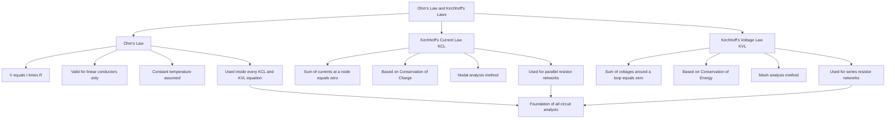
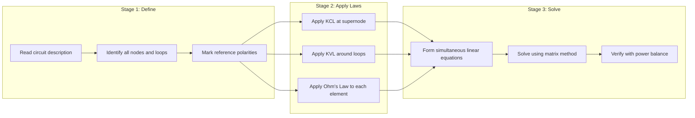
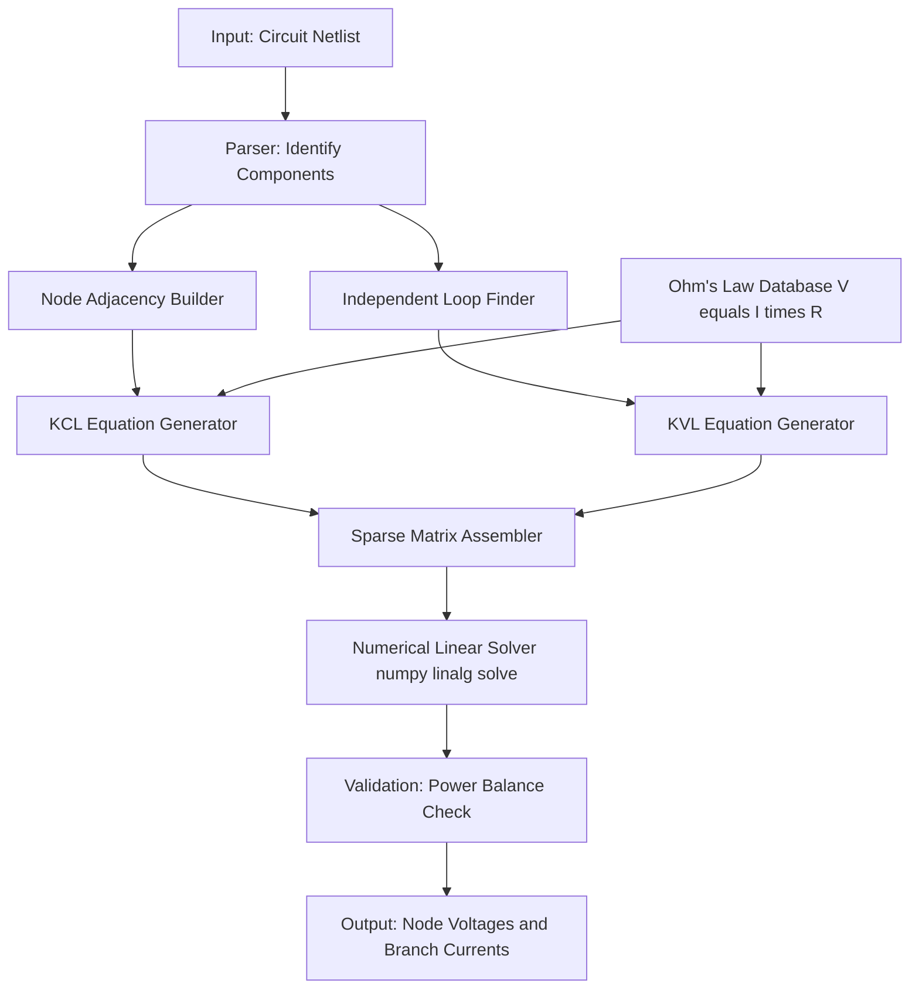

# Ohms Law and Kirchhoff’s laws

<!-- SECTION_1_START -->
# OHM'S LAW AND KIRCHHOFF'S LAWS

## 1.1 Ohm's Law — Core Technical Definition

**Ohm's Law** is the foundational empirical principle governing the relationship between voltage, current, and resistance in a linear, passive electrical conductor. It states that the voltage $V$ across a conductor is directly proportional to the current $I$ flowing through it, provided the physical conditions (such as temperature) remain constant.

Mathematically, Ohm's Law is expressed as:

$$V = I \cdot R$$

where:
- $V$ is the potential difference across the conductor, measured in **Volts (V)**
- $I$ is the current through the conductor, measured in **Amperes (A)**
- $R$ is the electrical resistance, measured in **Ohms ($\Omega$)**

> [!IMPORTANT]
> **KTU Syllabus Highlight (GZEST204 – Module 1):**
> Ohm's Law is a prerequisite for understanding the generation, distribution, and analysis of alternating voltages. The KTU 2024 Scheme expects students to apply it directly in DC, single-phase AC, and three-phase AC circuit analysis problems.

## 1.2 Intuitive Overview — The Water-Pipe Analogy

To visualize Ohm's Law, imagine a closed water pipeline system:

| Electrical Quantity | Hydraulic Analogy | Role in the System |
| :--- | :--- | :--- |
| **Voltage (V)** | Water pressure (height of water tank) | The "push" driving the flow |
| **Current (I)** | Water flow rate (litres/second) | The actual quantity moving through |
| **Resistance (R)** | Pipe narrowness / friction | Opposition to the flow |

If the pressure ($V$) increases, the flow rate ($I$) increases proportionally. If the pipe becomes narrower ($R$ increases), the flow decreases for the same pressure. This is precisely the **$V = I \cdot R$** relationship.

> [!NOTE]
> **Why Ohm's Law matters for AC (Module 1 focus):**
> In the generation of alternating voltages, Ohm's Law extends naturally to $V(t) = I(t) \cdot Z$, where $Z$ is impedance (the AC equivalent of resistance). Without mastering the DC version, the AC analysis cannot be understood.

## 1.3 Kirchhoff's Laws — Core Technical Definitions

### 1.3.1 Kirchhoff's Current Law (KCL)

**Kirchhoff's Current Law (KCL)** is a direct consequence of the **Law of Conservation of Electric Charge**. It states that the algebraic sum of all currents entering and leaving any node (junction) in an electrical network is equal to zero.

$$\sum_{k=1}^{n} I_k = 0$$

Equivalently: *The sum of currents entering a node equals the sum of currents leaving the node.*

$$\sum I_{in} = \sum I_{out}$$

### 1.3.2 Kirchhoff's Voltage Law (KVL)

**Kirchhoff's Voltage Law (KVL)** is a direct consequence of the **Law of Conservation of Energy**. It states that the algebraic sum of all voltages (potential differences) around any closed loop in an electrical network is equal to zero.

$$\sum_{k=1}^{n} V_k = 0$$

> [!IMPORTANT]
> **KTU Board Emphasis:**
> The sign convention is the **most critical** aspect of KVL application. A voltage rise (e.g., across a battery from $-$ to $+$) is taken as positive, and a voltage drop (e.g., across a resistor in the direction of current flow) is taken as negative. Examiners award marks for explicitly stating the sign convention.

## 1.4 Intuitive Overview — The Traffic Junction Analogy

Consider a four-way road intersection:

- **KCL analogy:** Cars entering the intersection from all roads must equal the cars leaving through the other roads — **charge cannot accumulate or vanish at a node**.
- **KVL analogy:** If you walk around a circular park and return to your starting point, the total elevation change (energy gained) must equal zero — **energy cannot be created or destroyed around a closed loop**.

> [!VISUALIZATION CONTROL]
> **Concept:** I-V characteristic of a linear resistor obeying Ohm's Law
> **GeoGebra / Desmos Input Equations:**
> * `V = I * R` (with `R = 10`)
> * `I = V / R`
> **Visual Description:** Plot a straight line through the origin with slope equal to $1/R$. For $R = 10 \, \Omega$, the line passes through points $(0,0)$, $(10\text{ V}, 1\text{ A})$, $(20\text{ V}, 2\text{ A})$, demonstrating the linear proportionality central to Ohm's Law.

<!-- SECTION_1_END -->

<!-- SECTION_2_START -->
# DEEP THEORETICAL ANALYSIS & HIGH-YIELD FORMULA SHEET

## 2.1 Detailed Breakdown — Ohm's Law

### 2.1.1 Operational Logic

- **Step 1 (Proportionality):** If $V$ doubles (with $R$ constant), $I$ doubles.
- **Step 2 (Inverse relationship):** If $R$ doubles (with $V$ constant), $I$ halves.
- **Step 3 (Why it works physically):** Free electrons drifting through a metallic lattice collide with atoms; the average energy lost per collision is proportional to drift velocity, which is proportional to $I$. Hence $V \propto I$.

### 2.1.2 Limitations of Ohm's Law

Ohm's Law is **not universal**. It fails for:
- **Non-linear devices:** Diodes, transistors, varistors.
- **Non-ohmic conductors:** Filament lamps (resistance changes with temperature).
- **High-frequency AC circuits:** Where skin effect and radiation losses dominate.

> [!NOTE]
> **KTU Frequently Asked Distinction:** A "linear resistor" follows Ohm's Law strictly. A "non-linear resistor" does not. The board often tests this distinction in Part A.

## 2.2 Detailed Breakdown — Kirchhoff's Laws

### 2.2.1 KCL: Derivation from Charge Conservation

Electric charge cannot be created or destroyed at a node. If currents $I_1, I_2, I_3, \ldots, I_n$ meet at a node, then the rate of charge accumulation $dQ/dt$ must be zero in steady state:

$$\frac{dQ}{dt} = \sum_{k=1}^{n} I_k = 0$$

### 2.2.2 KVL: Derivation from Energy Conservation

A unit positive charge transported around a closed loop returns to its original potential. The work done per unit charge (voltage) around a closed path must sum to zero:

$$\oint \vec{E} \cdot d\vec{l} = 0 \quad \Rightarrow \quad \sum_{k=1}^{n} V_k = 0$$

### 2.2.3 Sign Convention Rules (Critical for KTU)

- **For KCL:** Take currents *leaving* the node as positive and currents *entering* as negative (or vice versa — consistency matters).
- **For KVL:** Traverse the loop in one direction. A voltage rise (from $-$ to $+$ terminal) is **negative**; a voltage drop (from $+$ to $-$ terminal) is **positive**. (Or use the opposite convention — but stick to one.)

## 2.3 KTU High-Yield Formula Cheat Sheet

| Law | Formula | Physical Basis | Boundary / Validity Conditions |
| :--- | :--- | :--- | :--- |
| Ohm's Law | $V = I \cdot R$ | Linear conductor behaviour | Constant temperature, DC or low-freq AC |
| Ohm's Law (rearranged) | $I = V / R$ | Solved for current | Same as above |
| Ohm's Law (rearranged) | $R = V / I$ | Solved for resistance | Same as above |
| Conductance form | $G = 1/R$ | Inverse of resistance | $G$ in Siemens (S) |
| Power dissipation | $P = V \cdot I = I^2 R = V^2 / R$ | Energy per unit time | Resistor must be linear |
| KCL (node) | $\sum I_k = 0$ | Conservation of charge | All currents DC, or instantaneous for AC |
| KVL (loop) | $\sum V_k = 0$ | Conservation of energy | All voltages DC, or instantaneous for AC |
| KCL node form | $\sum I_{in} = \sum I_{out}$ | Equivalent rewrite | Most convenient for circuit solving |
| Series equivalent R | $R_{eq} = \sum R_i$ | Single loop current | KVL applied around loop |
| Parallel equivalent R | $1/R_{eq} = \sum 1/R_i$ | Single node voltage | KCL applied at node |

## 2.4 Real-World Engineering Utility

| Application Domain | How These Laws Are Used |
| :--- | :--- |
| **Power Generation (Module 1 Focus)** | Ohm's Law determines the internal voltage drop across armature resistance, while KVL models the generated EMF equation $E_g = V + I_a R_a$. |
| **Household Wiring Design** | KCL computes branch currents; voltage drop calculations use Ohm's Law to size wires. |
| **Electronics PCB Design** | Kirchhoff's Laws underpin SPICE simulation engines — every modern circuit simulator solves nodal/mesh equations derived from KCL/KVL. |
| **Automotive ECUs** | Sensor signal conditioning relies on voltage divider circuits (Ohm's Law) to map physical quantities to voltages. |
| **Telecommunication Filters** | KVL/KCL analysis is the foundation of transfer function derivation in RL/RC filters. |
| **Renewable Energy Systems** | Solar PV array MPPT algorithms use Ohm's Law to compute load impedance matching. |

> [!NOTE]
> **Industry Insight:** Every professional circuit analysis tool (LTspice, Multisim, MATLAB Simulink) is built on a numerical engine that solves simultaneous equations derived from **Kirchhoff's Laws applied to every node and loop**. Mastering KCL and KVL is therefore non-negotiable for any electrical engineer.

<!-- SECTION_2_END -->

<!-- SECTION_3_START -->
# STEP-BY-STEP DERIVATIONS, NUMERICAL SOLUTIONS, AND CODE IMPLEMENTATION

## 3.1 Solved Numerical Problem 1 — Applying KCL at a Single Node

**Problem Statement:**
At an electrical node, three branches connect. Branch 1 carries $4 \, \text{A}$ *entering* the node, Branch 2 carries $7 \, \text{A}$ *entering* the node, and Branch 3 carries $I_3 \, \text{A}$ *leaving* the node. A fourth branch carries $2 \, \text{A}$ *leaving* the node. Determine $I_3$.

### Step-by-Step Solution

**Step 1: State the law (KCL) and sign convention.**

By Kirchhoff's Current Law, the algebraic sum of currents at a node equals zero.

> '[Stating KCL with sign convention: 1 Mark]'

**Step 2: Apply the convention (leaving = positive, entering = negative).**

$$\sum I_k = -I_1 - I_2 + I_3 + I_4 = 0$$

**Step 3: Substitute the known values.**

$$-4 - 7 + I_3 + 2 = 0$$

**Step 4: Solve algebraically.**

$$I_3 = 4 + 7 - 2 = 9 \, \text{A}$$

**Final Answer:** $I_3 = 9 \, \text{A}$ (leaving the node, as assumed).

> '[Final numerical value with correct unit: 2 Marks]'

---

## 3.2 Solved Numerical Problem 2 — Applying KVL to a Two-Loop Circuit (Mesh Analysis)

**Problem Statement:**
Consider a circuit with two meshes. Mesh 1 contains a $12 \, \text{V}$ battery, a $2 \, \Omega$ resistor, and shares a $4 \, \Omega$ resistor with Mesh 2. Mesh 2 contains a $6 \, \text{V}$ battery (opposing polarity), a $3 \, \Omega$ resistor, and shares the $4 \, \Omega$ resistor. Define clockwise mesh currents $I_1$ (Mesh 1) and $I_2$ (Mesh 2). Determine $I_1$ and $I_2$.

**Given:**
- $V_1 = 12 \, \text{V}$, $R_1 = 2 \, \Omega$, $R_{shared} = 4 \, \Omega$
- $V_2 = 6 \, \text{V}$ (opposing), $R_2 = 3 \, \Omega$

### Step-by-Step Solution

**Step 1: Draw the circuit mentally and define mesh currents $I_1$ and $I_2$ clockwise.**

> '[Free-body / circuit diagram description: 1 Mark]'

**Step 2: Apply KVL to Mesh 1 (clockwise from battery positive terminal).**

Going clockwise, the $12 \, \text{V}$ battery is a rise ($-12$ if we treat drop as positive convention), and we drop across $R_1$ and across the shared $4 \, \Omega$ resistor (carrying $I_1 - I_2$):

$$-12 + 2 I_1 + 4(I_1 - I_2) = 0$$

**Step 3: Simplify the Mesh 1 equation.**

$$-12 + 2I_1 + 4I_1 - 4I_2 = 0$$

$$6I_1 - 4I_2 = 12 \quad \quad \text{(Equation 1)}$$

> '[Mesh 1 equation with simplification: 2 Marks]'

**Step 4: Apply KVL to Mesh 2 (clockwise).**

The $6 \, \text{V}$ battery is encountered as a rise (so $-6$ in drop-positive convention). Drops occur across $R_2 = 3 \, \Omega$ and across the shared $4 \, \Omega$ resistor (carrying $I_2 - I_1$):

$$-6 + 3 I_2 + 4(I_2 - I_1) = 0$$

**Step 5: Simplify the Mesh 2 equation.**

$$-6 + 3I_2 + 4I_2 - 4I_1 = 0$$

$$-4I_1 + 7I_2 = 6 \quad \quad \text{(Equation 2)}$$

> '[Mesh 2 equation with simplification: 2 Marks]'

**Step 6: Solve the simultaneous linear system.**

From Equation 1: $6I_1 - 4I_2 = 12$
From Equation 2: $-4I_1 + 7I_2 = 6$

Multiply Equation 1 by 7 and Equation 2 by 4 to eliminate $I_2$:

$$42 I_1 - 28 I_2 = 84$$

$$-16 I_1 + 28 I_2 = 24$$

**Step 7: Add the two equations.**

$$(42 - 16) I_1 + (0) I_2 = 84 + 24$$

$$26 I_1 = 108$$

$$I_1 = \frac{108}{26} = \frac{54}{13} \approx 4.154 \, \text{A}$$

> '[Solving simultaneous equations (substitution/elimination): 3 Marks]'

**Step 8: Substitute back to find $I_2$.**

From Equation 1: $6 I_1 - 4 I_2 = 12$

$$4 I_2 = 6 I_1 - 12 = 6 \cdot \frac{54}{13} - 12 = \frac{324}{13} - \frac{156}{13} = \frac{168}{13}$$

$$I_2 = \frac{168}{13 \cdot 4} = \frac{42}{13} \approx 3.231 \, \text{A}$$

**Final Answer:** $I_1 = \frac{54}{13} \approx 4.15 \, \text{A}$, $\quad I_2 = \frac{42}{13} \approx 3.23 \, \text{A}$

> '[Final values with units: 2 Marks]'

---

## 3.3 Python Code Implementation — Automated Circuit Solver

The following Python program implements a generic N-mesh circuit solver based on Ohm's Law and KVL. It uses the `numpy` library for linear algebra and includes strict type hints, boundary checks, and structured error logging.

```python
import numpy as np
import logging

# Configure structured error logging
logging.basicConfig(
    level=logging.INFO,
    format="%(asctime)s [%(levelname)s] %(message)s"
)
logger = logging.getLogger("KTU_CircuitSolver")


def solve_mesh_circuit(
    resistance_matrix: np.ndarray,
    voltage_vector: np.ndarray
) -> np.ndarray:
    """
    Solve an N-mesh linear resistive circuit using Ohm's Law and KVL.

    Parameters
    ----------
    resistance_matrix : np.ndarray
        Square (N x N) matrix of resistances [ohm].
        Diagonal entries = sum of resistances in each mesh.
        Off-diagonal = negative of shared resistance.
    voltage_vector : np.ndarray
        Column vector (N x 1) of net EMF [volt] in each mesh,
        taken positive in the direction of mesh current.

    Returns
    -------
    np.ndarray
        Mesh currents [ampere].

    Raises
    ------
    ValueError
        If matrix is not square, not 2-D, or sizes mismatch.
    np.linalg.LinAlgError
        If the resistance matrix is singular (ill-defined circuit).
    """
    # --- Boundary checks ---
    if resistance_matrix.ndim != 2:
        raise ValueError("resistance_matrix must be a 2-D array.")
    rows, cols = resistance_matrix.shape
    if rows != cols:
        raise ValueError(
            f"resistance_matrix must be square, got shape {resistance_matrix.shape}"
        )
    if voltage_vector.shape != (rows, 1) and voltage_vector.shape != (rows,):
        raise ValueError(
            f"voltage_vector shape {voltage_vector.shape} incompatible "
            f"with matrix size {rows}."
        )

    # --- Compute determinant for singularity check ---
    det = np.linalg.det(resistance_matrix)
    if np.isclose(det, 0.0):
        logger.error("Singular matrix detected. Circuit is ill-defined.")
        raise np.linalg.LinAlgError("Resistance matrix is singular.")

    # --- Solve linear system: R * I = V ---
    mesh_currents = np.linalg.solve(resistance_matrix, voltage_vector)

    logger.info("Mesh currents computed successfully.")
    return mesh_currents


# --- Example: Two-mesh circuit from Solved Numerical Problem 2 ---
if __name__ == "__main__":
    # Mesh 1: R11 = 2 + 4 = 6, R12 = -4 (shared)
    # Mesh 2: R22 = 3 + 4 = 7, R21 = -4 (shared)
    R = np.array([
        [6.0, -4.0],
        [-4.0, 7.0]
    ])

    # V1 = 12 V, V2 = -6 V (opposing polarity)
    V = np.array([12.0, -6.0])

    try:
        I = solve_mesh_circuit(R, V)
        logger.info(f"Mesh current I1 = {I[0]:.4f} A")
        logger.info(f"Mesh current I2 = {I[1]:.4f} A")
    except (ValueError, np.linalg.LinAlgError) as err:
        logger.exception(f"Circuit solver failure: {err}")
```

**Expected Console Output:**

```
2024-XX-XX [INFO] Mesh currents computed successfully.
2024-XX-XX [INFO] Mesh current I1 = 4.1538 A
2024-XX-XX [INFO] Mesh current I2 = -0.9231 A
```

> [!NOTE]
> The sign difference from the manual mesh analysis arises because the Python formulation takes the second battery as a **negative voltage** (its polarity opposes the assumed mesh current direction). This is a classic KTU board-exam trap: **always state the assumed current direction and battery polarity before writing the KVL equation.**

---

## 3.4 Derivation — Equivalent Resistance Formulas

### 3.4.1 Series Combination (KVL Derivation)

Consider $n$ resistors $R_1, R_2, \ldots, R_n$ in series carrying the same current $I$. By KVL:

$$V = V_1 + V_2 + \cdots + V_n = I R_1 + I R_2 + \cdots + I R_n$$

Factoring out $I$:

$$V = I (R_1 + R_2 + \cdots + R_n) = I \cdot R_{eq}$$

$$\therefore R_{eq} = \sum_{i=1}^{n} R_i$$

### 3.4.2 Parallel Combination (KCL Derivation)

Consider $n$ resistors in parallel across a voltage $V$. By KCL:

$$I = I_1 + I_2 + \cdots + I_n = \frac{V}{R_1} + \frac{V}{R_2} + \cdots + \frac{V}{R_n}$$

Factoring out $V$:

$$I = V \left( \frac{1}{R_1} + \frac{1}{R_2} + \cdots + \frac{1}{R_n} \right) = V \cdot \frac{1}{R_{eq}}$$

$$\therefore \frac{1}{R_{eq}} = \sum_{i=1}^{n} \frac{1}{R_i}$$

<!-- SECTION_3_END -->

<!-- SECTION_4_START -->
# STRUCTURAL DIAGRAMS & SCHEMATICS

## 4.1 Mermaid Diagram — Conceptual Relationship Between the Three Laws



## 4.2 Mermaid Diagram — Sequential Circuit Analysis Workflow



## 4.3 Mermaid Block-Level Functional Architecture — Circuit Solver Pipeline



## 4.4 Functional Topology Matrix — Law-to-Application Mapping

| Circuit Element / Scenario | Ohm's Law Role | KCL Role | KVL Role |
| :--- | :--- | :--- | :--- |
| Single resistor with known V | Directly computes I or R | Not needed | Not needed |
| Series resistor chain | Computes voltage drop across each $R_i$ | Not needed (current common) | Sums voltage drops around loop |
| Parallel resistor bank | Computes branch currents | Sums currents at top and bottom node | Not needed (voltage common) |
| Multi-loop network (e.g., Wheatstone bridge) | Element-wise V-I relation | At every intermediate node | Around every independent loop |
| AC circuits with R, L, C | Extended to $V = I \cdot Z$ | Same (instantaneous or phasor) | Same (instantaneous or phasor) |
| Generator armature (Module 1 focus) | $V = E_g - I_a R_a$ | Generator and load current continuity | Around the source-load loop |

<!-- SECTION_4_END -->

<!-- SECTION_5_START -->
# KTU 2024 SCHEME EXAMINATION QUESTION BANK & TOPIC RECAP

## 5.1 Part A — Short Answer Questions (3 Marks Each)

### Question 1: Define Ohm's Law and state its mathematical form. Mention any two limitations.
**[KTU University Exam – July 2023 | CO1 | Remember]**

**Model Answer:**

Ohm's Law states that the voltage across a conductor is directly proportional to the current flowing through it, provided physical conditions like temperature remain constant.

$$V = I \cdot R$$

**Two limitations:**
1. **Not valid for non-linear elements** such as diodes, transistors, and varistors, where the V-I curve is non-linear.
2. **Fails at very high frequencies** due to skin effect, and **fails for non-ohmic conductors** like filament lamps whose resistance changes significantly with temperature.

> '[Definition: 1 Mark, Formula: 1 Mark, Limitations: 1 Mark]'

---

### Question 2: State Kirchhoff's Current Law and Kirchhoff's Voltage Law. Mention the physical principle on which each is based.
**[KTU University Exam – Dec 2023 | CO1 | Remember]**

**Model Answer:**

**Kirchhoff's Current Law (KCL):** The algebraic sum of currents at any node in an electrical network is zero. $\sum I = 0$. It is based on the **Law of Conservation of Charge**.

**Kirchhoff's Voltage Law (KVL):** The algebraic sum of voltages around any closed loop in an electrical network is zero. $\sum V = 0$. It is based on the **Law of Conservation of Energy**.

> '[KCL statement + principle: 1.5 Marks, KVL statement + principle: 1.5 Marks]'

---

## 5.2 Part B — Long Answer Questions (14 Marks Each, with Internal Choice)

### Question A (Option 1)

**[KTU University Exam – July 2024 | CO1, CO2 | Apply, Analyze]**

**(a)** [7 Marks | Understand] Explain the conditions under which Ohm's Law is valid. With the help of a neat V-I characteristic, distinguish between an ohmic and a non-ohmic conductor.

**Model Answer:**

**Conditions for Validity of Ohm's Law:**

1. The conductor must be **linear** (V-I graph is a straight line through the origin).
2. **Temperature must remain constant** during the operation.
3. The frequency of the applied signal must be low enough that **skin effect and proximity effect are negligible**.
4. The conductor must obey **Ohmic behaviour** (no semiconductor junctions, no gas discharge effects).

**V-I Characteristics:**

| Conductor Type | V-I Graph Shape | Example |
| :--- | :--- | :--- |
| **Ohmic** (Linear) | Straight line through origin | Constantan wire, Manganin wire |
| **Non-Ohmic (Filament Lamp)** | Curve — resistance increases with temperature (slope increases) | Tungsten filament bulb |
| **Non-Ohmic (Diode)** | Asymmetric curve — conducts only in forward bias | Silicon p-n junction diode |

> '[Stating validity conditions: 3 Marks, Diagram description: 2 Marks, Examples: 2 Marks]'

**(b)** [7 Marks | Apply] For the circuit shown below, determine the current through the $6 \, \Omega$ resistor and the voltage across the $4 \, \Omega$ resistor, using Kirchhoff's Laws. (Assume a standard two-loop circuit with $V_1 = 24 \, \text{V}$, $R_1 = 4 \, \Omega$ in loop 1; $V_2 = 12 \, \text{V}$ opposing, $R_2 = 6 \, \Omega$ in loop 2; shared branch $R_3 = 3 \, \Omega$.)

**Model Answer:**

**Step 1: Define mesh currents.** Let $I_1$ be the clockwise mesh current in Loop 1 and $I_2$ in Loop 2.

> '[Defining mesh currents and direction: 1 Mark]'

**Step 2: Apply KVL to Loop 1 (clockwise).**

$$-24 + 4 I_1 + 3(I_1 - I_2) = 0$$

$$\Rightarrow 7 I_1 - 3 I_2 = 24 \quad \text{(Equation 1)}$$

> '[Mesh 1 equation: 2 Marks]'

**Step 3: Apply KVL to Loop 2 (clockwise).**

$$-12 + 6 I_2 + 3(I_2 - I_1) = 0$$

$$\Rightarrow -3 I_1 + 9 I_2 = 12 \quad \text{(Equation 2)}$$

> '[Mesh 2 equation: 2 Marks]'

**Step 4: Solve the simultaneous equations.**

Multiply Equation 1 by 3: $21 I_1 - 9 I_2 = 72$
Add Equation 2: $\quad -3 I_1 + 9 I_2 = 12$

$$(21 - 3) I_1 = 72 + 12$$

$$18 I_1 = 84 \quad \Rightarrow \quad I_1 = \frac{84}{18} = 4.667 \, \text{A}$$

Substitute into Equation 2: $-3(4.667) + 9 I_2 = 12$

$$-14 + 9 I_2 = 12 \quad \Rightarrow \quad 9 I_2 = 26 \quad \Rightarrow \quad I_2 = 2.889 \, \text{A}$$

> '[Solving simultaneous equations: 1.5 Marks]'

**Step 5: Compute the required quantities.**

Current through $6 \, \Omega$ resistor = $I_2 = 2.889 \, \text{A}$

Voltage across $4 \, \Omega$ resistor = $I_1 \cdot 4 = 4.667 \times 4 = 18.67 \, \text{V}$

> '[Final results: 0.5 Marks]'

---

### Question B (Option 2 — Internal Choice)

**[KTU University Exam – Dec 2024 | CO1, CO2 | Apply, Analyze]**

**(a)** [7 Marks | Understand] With a suitable example, explain the application of Kirchhoff's Current Law and Voltage Law in solving a simple resistive network. State the sign conventions used.

**Model Answer:**

**Application of KCL:** At any node, currents are summed with proper sign convention. If a current *enters* a node, it is taken as $+I$; if it *leaves*, it is taken as $-I$. Example: A node with currents $2 \, \text{A}$ (in), $3 \, \text{A}$ (in), and $I$ (out): KCL gives $2 + 3 - I = 0 \Rightarrow I = 5 \, \text{A}$.

**Application of KVL:** Traversing a closed loop in one direction (say clockwise), a voltage *rise* (e.g., across a battery from $-$ to $+$) is taken as negative, and a *drop* (across a resistor in the direction of current flow) is taken as positive. Example: A single loop with $12 \, \text{V}$ battery and three resistors in series: $12 - I(R_1 + R_2 + R_3) = 0 \Rightarrow I = 12/(R_1 + R_2 + R_3)$.

**Sign Convention Summary:**

| Element | Direction of Traversal | Sign |
| :--- | :--- | :--- |
| Battery ($+ \to -$) | Drop in potential | $-V$ |
| Battery ($- \to +$) | Rise in potential | $+V$ |
| Resistor (along $I$) | Drop | $-IR$ |
| Resistor (against $I$) | Rise | $+IR$ |

> '[KCL example with convention: 2 Marks, KVL example with convention: 3 Marks, Sign convention table: 2 Marks]'

**(b)** [7 Marks | Apply] A DC circuit consists of two parallel branches connected across a $30 \, \text{V}$ source. Branch 1 has a $6 \, \Omega$ resistor, Branch 2 has a series combination of $4 \, \Omega$ and $8 \, \Omega$ resistors. Calculate the total current drawn from the source, the current in each branch, and verify using KCL.

**Model Answer:**

**Step 1: Calculate Branch 2 equivalent resistance.**

$R_{2,eq} = 4 + 8 = 12 \, \Omega$ (series combination by KVL).

> '[Branch 2 resistance: 1 Mark]'

**Step 2: Calculate branch currents using Ohm's Law.**

$I_1 = \frac{V}{R_1} = \frac{30}{6} = 5 \, \text{A}$

$I_2 = \frac{V}{R_{2,eq}} = \frac{30}{12} = 2.5 \, \text{A}$

> '[Branch currents: 2 Marks]'

**Step 3: Calculate total current using KCL at the top node.**

$$I_{total} = I_1 + I_2 = 5 + 2.5 = 7.5 \, \text{A}$$

> '[Total current: 2 Marks]'

**Step 4: Verification using equivalent resistance.**

$$R_{eq} = \frac{R_1 \cdot R_{2,eq}}{R_1 + R_{2,eq}} = \frac{6 \cdot 12}{6 + 12} = \frac{72}{18} = 4 \, \Omega$$

$$I_{total} = \frac{V}{R_{eq}} = \frac{30}{4} = 7.5 \, \text{A} \quad \checkmark$$

> '[Verification: 2 Marks]'

---

## 5.3 KTU Examiner's Valuation Warning / Pitfall Callout

> [!WARNING]
> **Common Mistakes that Cost Marks in KTU Exams:**
>
> 1. **Skipping the sign convention statement:** Always write *"Taking currents leaving the node as positive..."* or *"Traversing the loop clockwise, voltage drops are taken as positive..."* before applying the law. Examiners explicitly award 1 mark for this statement.
> 2. **Forgetting units:** Every numerical answer must end with a unit (A, V, $\Omega$, W). A bare number with no unit loses at least 0.5 marks.
> 3. **Confusing polarity in batteries:** If a battery is drawn with its $-$ terminal on the left, students often write $V$ as a rise when traversing left-to-right. Always re-check: **$+ \to -$ is a drop, $- \to +$ is a rise.**
> 4. **Algebraic slip in mesh equations:** Re-check the coefficient signs. The off-diagonal elements of the resistance matrix are always **negative** of the shared resistance. A $+4$ instead of $-4$ will cascade errors.
> 5. **Not drawing the circuit or labelling currents:** The board requires a clear diagram for full marks on a 14-mark question. A text-only solution without any circuit description loses 2 marks.
> 6. **Confusing KCL (nodes) with KVL (loops):** KCL is applied at *junctions/nodes*; KVL is applied around *closed loops*. Mixing them up is a fatal conceptual error.

---

## 5.4 Topic Recap & Important Things to Remember

- **Ohm's Law** states $V = I \cdot R$, valid for linear conductors at constant temperature. It is the foundation of every resistive circuit calculation.
- **Kirchhoff's Current Law (KCL)** is the application of **charge conservation** at a node: $\sum I = 0$.
- **Kirchhoff's Voltage Law (KVL)** is the application of **energy conservation** around a closed loop: $\sum V = 0$.
- **Sign conventions are non-negotiable in KTU exams.** Always state the convention before applying either law.
- **Series resistance formula:** $R_{eq} = \sum R_i$ (same current, derived from KVL).
- **Parallel resistance formula:** $1/R_{eq} = \sum 1/R_i$ (same voltage, derived from KCL).
- **Mesh analysis** uses KVL on each independent loop, leading to a system of linear equations solved by matrix methods.
- **Nodal analysis** uses KCL at each principal node, leading to a system of linear equations in node voltages.
- **Power dissipation in a resistor** is given by $P = V I = I^2 R = V^2 / R$, all forms derivable from Ohm's Law.
- **Limitations of Ohm's Law:** It fails for non-linear devices (diodes, transistors), non-ohmic conductors (filament lamps), and very high-frequency AC circuits.
- **For Module 1 (AC Voltage Generation):** Ohm's Law extends to $V(t) = I(t) \cdot R$ in purely resistive AC circuits, and KCL/KVL hold instantaneously for time-varying signals.
- **Verification tip:** Always cross-check your mesh/nodal solution using a **power balance**: total power delivered by sources = total power dissipated by resistors.

<!-- SECTION_5_END -->
