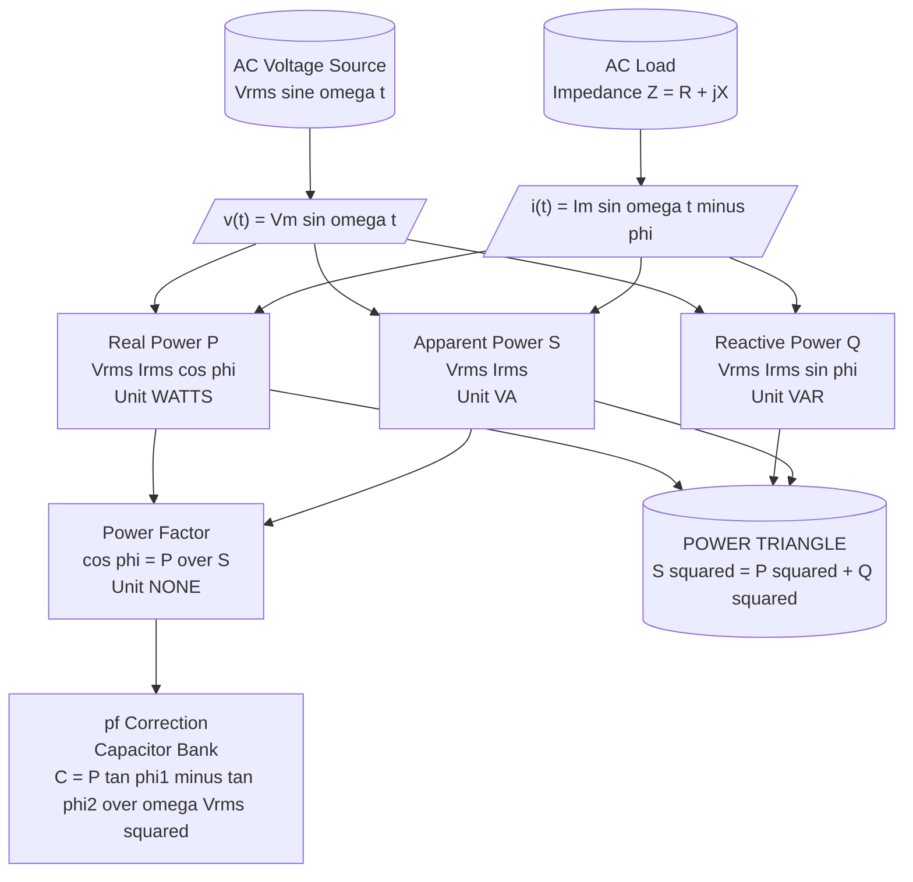
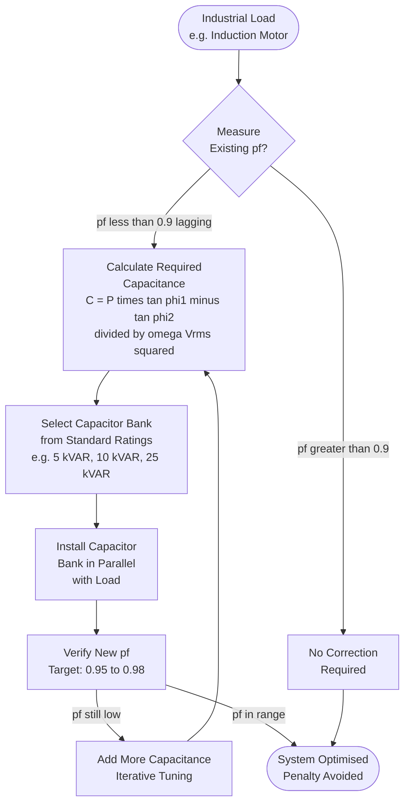
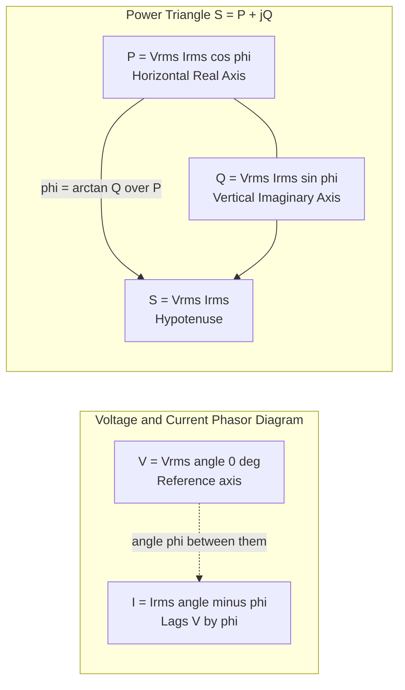

# Power in AC circuits – Power factor

<!-- SECTION_1_START -->

# Power in AC Circuits – Power Factor

## 1.1 Formal Academic Definition (KTU 2024 Syllabus Terminology)

In an **alternating current (AC) circuit**, the power delivered to a load is not a simple product of voltage and current as in DC circuits, because both quantities are time-varying sinusoids. The **instantaneous power** $p(t)$ is defined as the product of the instantaneous voltage $v(t)$ and the instantaneous current $i(t)$ across the same pair of terminals.

When a sinusoidal voltage $v(t) = V_m \sin(\omega t)$ drives a load having an impedance $Z = \vert Z \vert \angle{\phi}$ (where $\phi$ is the phase angle by which the voltage leads the current for an inductive load, or lags for a capacitive load), the resulting current is $i(t) = I_m \sin(\omega t - \phi)$.

The **power factor (pf)** of an AC circuit is formally defined as the cosine of the angle by which the applied voltage leads the current drawn by the load. Mathematically, it is the ratio of the **real (average) power** $P$ absorbed by the load to the **apparent power** $S$ delivered to the load.

> [!IMPORTANT]
> **KTU Board Definition (verbatim style):** Power factor is the cosine of the phase angle between voltage and current in an AC circuit, and it represents the fraction of apparent power that is converted into useful (real) work.

## 1.2 Intuitive Analogy – The "Beer Mug" Analogy

Imagine you order a **beer mug** at a pub. The mug is tall and frothy:

- The **entire contents of the mug (beer + foam)** represent the **apparent power $S$** — this is what the bartender (the supply authority) charges you for, because it is the total volume they had to pour.
- The **actual liquid beer (the usable part)** represents the **real power $P$** — this is what actually quenches your thirst and does useful work.
- The **foam on top** represents the **reactive power $Q$** — it occupies space in the mug, looks like work, but cannot be used to do real work; it merely sloshes back and forth between the source and the load.
- The **ratio of beer to total mug contents** is the **power factor** $\cos\phi$.

> [!TIP]
> A **power factor of 1.0 (unity)** means you got a glass with **no foam** — every drop poured did real work. A **power factor of 0.5** means **half the mug is foam** — the supply authority delivered twice the volume needed, and you are paying for useless oscillation.

A real-world engineering consequence: industrial plants with many induction motors (highly inductive) typically have a low power factor (around **0.7 to 0.8**), and electricity boards penalize them via **power factor penalty clauses** in the tariff.

## 1.3 Physical Constants and Standard Metrics

The following standard electrical engineering quantities are central to this topic:

- **Supply frequency in India:** $f = \mathbf{50 \text{ Hz}}$ (angular frequency $\omega = 2\pi f = 314.159 \text{ rad/s}$)
- **Standard supply voltage (single-phase, domestic):** $V_{rms} = \mathbf{230 \text{ V}}$
- **Standard supply voltage (three-phase, industrial):** $V_{L,rms} = \mathbf{415 \text{ V}}$
- **Acceptable industrial power factor:** $\cos\phi \geq \mathbf{0.85}$ (lagging) to avoid utility penalty
- **Target corrected power factor:** $\cos\phi \approx \mathbf{0.95}$ to $\mathbf{0.98}$ lagging

> [!NOTE]
> **KTU 2024 Highlight – Industrial Relevance:** Power factor correction is not a theoretical exercise. Kerala State Electricity Board (KSEB) and other DISCOMs in India levy a **penalty of 1% to 2% on the energy bill for every 0.01 drop in power factor below 0.90**. This makes pf correction a financially significant design decision in every commercial/industrial installation.

## 1.4 GeoGebra Visualization – The Power Waveform

> [!VISUALIZATION CONTROL]
> **Concept:** Instantaneous power waveform $p(t) = v(t) \cdot i(t)$ for a single-phase AC load with phase angle $\phi$ between voltage and current, demonstrating how the average value equals the real power $P$.
>
> **GeoGebra Input Equations (paste into GeoGebra Graphing Calculator):**
> * `Vm := 1`
> * `Im := 1`
> * `phi := 60°`  *(try varying this between 0° and 90° to see the effect)*
> * `v(t) := Vm * sin(t)`
> * `i(t) := Im * sin(t - phi)`
> * `p(t) := v(t) * i(t)`
> * `P_avg := (Vm * Im / 2) * cos(phi)`
>
> **Visual Description:** On the horizontal axis is $\omega t$ (in radians) from $0$ to $2\pi$. You will see:
> 1. A **red sinusoid** $v(t)$ oscillating between $+1$ and $-1$ — the voltage.
> 2. A **blue sinusoid** $i(t)$ that is shifted to the **right** (lagging) by $\phi = 60°$.
> 3. A **green waveform** $p(t) = v(t) \cdot i(t)$ — it is **not** a pure sinusoid; it has a frequency component of $2\omega t$ (twice the supply frequency) sitting on a **DC offset**.
> 4. A **black horizontal line** at $P_{avg}$ — the average value of $p(t)$, representing the real power delivered to the load.
>
> **Experiment:** As you reduce $\phi$ from $90°$ towards $0°$, observe that the green waveform becomes more and more positive (less negative), and the black line $P_{avg}$ rises towards its maximum value of $V_m I_m / 2$. This visually confirms that a smaller phase angle (higher pf) means more real power delivery for the same voltage and current magnitudes.

<!-- SECTION_1_END -->

<!-- SECTION_2_START -->

# 2. Deep Theoretical Analysis & KTU High-Yield Formula Sheet

## 2.1 Instantaneous Power – Complete Theoretical Breakdown

Consider a single-phase AC load supplied by:
$$v(t) = V_m \sin(\omega t)$$

The current drawn by the load is:
$$i(t) = I_m \sin(\omega t - \phi)$$

where $\phi$ is the phase angle by which the voltage **leads** the current (positive for inductive loads, negative for capacitive loads).

The **instantaneous power** absorbed by the load is:
$$p(t) = v(t) \cdot i(t) = V_m \sin(\omega t) \cdot I_m \sin(\omega t - \phi)$$

Applying the standard trigonometric product-to-sum identity $\sin A \sin B = \frac{1}{2}[\cos(A-B) - \cos(A+B)]$:

$$p(t) = \frac{V_m I_m}{2}\left[\cos(\phi) - \cos(2\omega t - \phi)\right]$$

Splitting this into two physically meaningful components:

- The **DC component** $\frac{V_m I_m}{2}\cos(\phi)$ — this is the **time-averaged (real) power** $P$.
- The **AC component** $-\frac{V_m I_m}{2}\cos(2\omega t - \phi)$ — this is the **oscillating power** that has a mean value of zero over a complete cycle.

### Why the Split Matters (The "Why" Behind the Equation)

- The **real part** represents power that flows **unidirectionally** from the source to the load and is dissipated (in resistors) or converted to mechanical work (in motors). It is the *useful* power.
- The **oscillating part** represents power that **sloshes back and forth** between the source and the reactive elements (inductors and capacitors). It does no net work over a cycle but causes additional $I^2 R$ losses in the transmission lines.

## 2.2 The Three Powers of AC Circuits

### (a) Real Power $P$ (Active Power / True Power)

This is the power actually consumed by the load, measured in **watts (W)**. It is the time-averaged value of $p(t)$ over one complete cycle $T = 2\pi/\omega$:

$$P = \frac{1}{T}\int_0^T p(t)\, dt = V_{rms} I_{rms} \cos\phi \quad \text{(watts, W)}$$

### (b) Reactive Power $Q$

This is the power that oscillates between the source and reactive energy-storage elements. It is measured in **volt-amperes reactive (VAR)**:

$$Q = V_{rms} I_{rms} \sin\phi \quad \text{(VAR)}$$

- For a **pure inductor** ($\phi = +90°$): $Q = +V_{rms} I_{rms}$ (positive, inductive).
- For a **pure capacitor** ($\phi = -90°$): $Q = -V_{rms} I_{rms}$ (negative, capacitive).
- For a **pure resistor** ($\phi = 0°$): $Q = 0$.

### (c) Apparent Power $S$

This is the product of the RMS voltage and RMS current magnitudes, irrespective of phase angle. It is the magnitude of the **complex power** and is measured in **volt-amperes (VA)**:

$$S = V_{rms} I_{rms} = \vert \mathbf{S} \vert \quad \text{(VA)}$$

The relationship between $P$, $Q$, and $S$ is captured elegantly by the **power triangle**, a right-angled triangle where:

$$S^2 = P^2 + Q^2 \quad \Longrightarrow \quad S = \sqrt{P^2 + Q^2}$$

## 2.3 Power Factor – The Bridge Between the Three Powers

The **power factor** is the cosine of the impedance angle $\phi$ of the load:

$$\boxed{\text{pf} = \cos\phi = \frac{P}{S} = \frac{R}{\vert Z \vert}}$$

It is dimensionless and lies in the range $[-1, +1]$. The **sign convention** is critical for KTU:

- **Lagging pf:** Current **lags** voltage ($\phi > 0$) — typical of **inductive** loads (motors, transformers, fluorescent lamp ballasts). This is the **most common** scenario in industry.
- **Leading pf:** Current **leads** voltage ($\phi < 0$) — typical of **capacitive** loads or over-corrected systems.

## 2.4 Complex Power – The Compact Phasor Representation

Using phasors $\mathbf{V} = V_{rms} \angle 0°$ and $\mathbf{I} = I_{rms} \angle{-\phi}$, the **complex power** is defined as:

$$\mathbf{S} = \mathbf{V} \cdot \mathbf{I}^* = V_{rms} I_{rms} \angle\phi = P + jQ$$

The real part gives the real power, and the imaginary part gives the reactive power. This is the most compact and powerful form for solving three-phase and unbalanced network problems.

## 2.5 KTU High-Yield Formula Sheet

| # | Quantity | Formula | Unit | Physical Meaning |
|---|----------|---------|------|------------------|
| 1 | Instantaneous power | $p(t) = v(t) \cdot i(t)$ | W | Power at any instant |
| 2 | Real (average) power | $P = V_{rms} I_{rms} \cos\phi$ | W (watts) | Useful power consumed |
| 3 | Reactive power | $Q = V_{rms} I_{rms} \sin\phi$ | VAR | Power that oscillates |
| 4 | Apparent power | $S = V_{rms} I_{rms}$ | VA | Total power supplied |
| 5 | Power factor | $\text{pf} = \cos\phi = P/S$ | dimensionless | Efficiency of power use |
| 6 | Power triangle | $S^2 = P^2 + Q^2$ | — | Geometric relationship |
| 7 | Power factor angle | $\phi = \cos^{-1}(P/S)$ | radians or degrees | Phase angle of load |
| 8 | Complex power | $\mathbf{S} = \mathbf{V}\mathbf{I}^* = P + jQ$ | VA | Phasor product |
| 9 | Peak to RMS | $V_{rms} = V_m/\sqrt{2}, \; I_{rms} = I_m/\sqrt{2}$ | V, A | Conversion factor |
| 10 | In terms of impedance | $P = I_{rms}^2 R = V_{rms}^2 R / \vert Z \vert^2$ | W | Power dissipated in $R$ |
| 11 | In terms of impedance | $Q = I_{rms}^2 X = V_{rms}^2 X / \vert Z \vert^2$ | VAR | Power in reactive part |
| 12 | pf correction capacitor | $C = P(\tan\phi_1 - \tan\phi_2)/(\omega V_{rms}^2)$ | F | Capacitance for target pf |

> [!IMPORTANT]
> **KTU 2024 Examiner's Note:** Always specify the unit explicitly in the answer: W for $P$, VAR for $Q$, VA for $S$. **W and VA are NOT interchangeable** — failing to write the correct unit is a guaranteed 1-mark deduction.

## 2.6 Real-World Engineering Utility

- **Electricity billing:** Utilities charge for apparent power (kVA) but reward high pf. Industrial users correct pf close to unity to minimize kVA charges and avoid penalties.
- **Generator sizing:** A 100 kVA generator delivers only 80 kW of useful power at pf = 0.8, but 100 kW at pf = 1.0. Power factor directly determines how much load a generator can serve.
- **Cable sizing:** Lower pf means higher current for the same real power, requiring thicker (more expensive) copper cables and bigger switchgear.
- **Voltage regulation:** Poor pf causes large voltage drops in transmission lines, affecting the voltage at the consumer's premises.
- **Renewable integration:** Solar inverters and wind turbine converters are often required to operate at **leading or unity pf** to support grid stability.

<!-- SECTION_2_END -->

<!-- SECTION_3_START -->

# 3. Step-by-Step Derivations & Computational Implementation

## 3.1 Exhaustive Derivation of Real Power from Instantaneous Power

**Step 1:** Write the voltage and current expressions in standard sinusoidal form.

$$v(t) = V_m \sin(\omega t)$$
$$i(t) = I_m \sin(\omega t - \phi)$$

**Step 2:** Form the product to get instantaneous power.

$$p(t) = v(t) \cdot i(t) = V_m I_m \sin(\omega t) \sin(\omega t - \phi)$$

**Step 3:** Apply the trigonometric product-to-sum identity.

Recall the identity: $\sin A \sin B = \frac{1}{2}[\cos(A - B) - \cos(A + B)]$.

Here, $A = \omega t$ and $B = \omega t - \phi$, so $A - B = \phi$ and $A + B = 2\omega t - \phi$. Substituting:

$$p(t) = \frac{V_m I_m}{2}\left[\cos(\phi) - \cos(2\omega t - \phi)\right]$$

**Step 4:** Split the expression into its constant (DC) and oscillating (AC) parts.

$$p(t) = \underbrace{\frac{V_m I_m}{2}\cos\phi}_{\text{constant, equals } P} \; - \; \underbrace{\frac{V_m I_m}{2}\cos(2\omega t - \phi)}_{\text{oscillates at } 2\omega}$$

**Step 5:** Take the average over one full cycle $T = 2\pi/\omega$.

The average of $\cos(2\omega t - \phi)$ over a complete cycle is exactly **zero**, because the cosine function is positive for half its period and negative for the other half, with equal areas. Therefore:

$$P = \langle p(t) \rangle = \frac{V_m I_m}{2}\cos\phi - 0 = \frac{V_m I_m}{2}\cos\phi$$

**Step 6:** Convert peak values to RMS values using $V_{rms} = V_m/\sqrt{2}$ and $I_{rms} = I_m/\sqrt{2}$.

Since $\frac{V_m I_m}{2} = \frac{V_m}{\sqrt{2}} \cdot \frac{I_m}{\sqrt{2}} = V_{rms} I_{rms}$:

$$\boxed{P = V_{rms} I_{rms} \cos\phi \quad \text{(watts)}}$$

**Step 7:** Derive reactive power by analogous reasoning.

The reactive power $Q$ is the amplitude of the oscillating part of $p(t)$ (with a sign convention):

$$Q = V_{rms} I_{rms} \sin\phi \quad \text{(VAR)}$$

**Step 8:** Confirm the power-triangle relationship.

$$P^2 + Q^2 = (V_{rms} I_{rms})^2 (\cos^2\phi + \sin^2\phi) = (V_{rms} I_{rms})^2 = S^2$$

$$S = \sqrt{P^2 + Q^2} \quad \text{(VA)}$$

## 3.2 Worked Example – A KTU-Style Numerical Problem

> **Problem:** A single-phase induction motor draws a current of **10 A** from a **230 V, 50 Hz** AC supply. A wattmeter connected in the circuit reads **1500 W**. Calculate:
> (a) Power factor of the motor
> (b) Apparent power
> (c) Reactive power
> (d) The phase angle between voltage and current

### Solution

**Step 1: Identify the given quantities and convert to RMS.**

- $V_{rms} = 230 \text{ V}$
- $I_{rms} = 10 \text{ A}$
- $P = 1500 \text{ W}$ (wattmeter reading = real power)

**Step 2: Compute apparent power (part b).**

$$S = V_{rms} \cdot I_{rms} = 230 \times 10 = 2300 \text{ VA}$$

**Step 3: Compute power factor (part a).**

$$\text{pf} = \cos\phi = \frac{P}{S} = \frac{1500}{2300} = 0.6522 \approx 0.65 \text{ (lagging)}$$

The motor is inductive, so the current lags the voltage — hence the tag "**lagging**".

**Step 4: Compute reactive power (part c).**

$$Q = \sqrt{S^2 - P^2} = \sqrt{2300^2 - 1500^2} = \sqrt{5290000 - 2250000} = \sqrt{3040000}$$
$$Q \approx 1743.5 \text{ VAR}$$

**Step 5: Compute the phase angle (part d).**

$$\phi = \cos^{-1}(0.6522) = 49.32° \approx 49.3°$$

This means the current **lags** the voltage by approximately 49.3°.

> [!NOTE]
> **Valuation Key for the Example Above:**
> * [Stating the three given values: 1 Mark]
> * [Computing apparent power $S$: 1 Mark]
> * [Power factor formula and substitution: 2 Marks]
> * [Reactive power via Pythagorean relation: 1 Mark]
> * [Final phase angle with correct units: 1 Mark]

## 3.3 Python Code – Universal AC Power Calculator

The following Python program computes all three powers, the power factor, and the required correction capacitance for a given target power factor. It includes type hints, boundary checks, and error logging for production-grade reliability.

```python
"""
KTU GZEST204 — Module 1: AC Power & Power Factor Calculator
Author: KTU Premium Engine V10
Standards: KTU 2024 Scheme, IEEE/IE Conventions
"""

import math
import logging

# Configure error logging
logging.basicConfig(level=logging.INFO, format="%(levelname)s: %(message)s")


def calculate_ac_power(
    v_rms: float,
    i_rms: float,
    pf: float,
    target_pf: float = 0.95,
    frequency: float = 50.0,
    leading: bool = False,
) -> dict:
    """
    Compute AC power quantities and the capacitor size for pf correction.

    Parameters
    ----------
    v_rms : float
        RMS supply voltage in volts (must be > 0).
    i_rms : float
        RMS current drawn in amperes (must be >= 0).
    pf : float
        Existing power factor of the load in the range (0, 1].
    target_pf : float, optional
        Desired power factor after correction, default 0.95.
    frequency : float, optional
        Supply frequency in Hz, default 50 Hz (India standard).
    leading : bool, optional
        If True, the existing pf is treated as leading (capacitive).

    Returns
    -------
    dict
        Dictionary containing P, Q, S, phi_deg, and correction_C (in farads).
    """
    # --- Boundary & type checks ---
    if v_rms <= 0:
        raise ValueError(f"v_rms must be positive, got {v_rms}")
    if i_rms < 0:
        raise ValueError(f"i_rms must be non-negative, got {i_rms}")
    if not 0 < pf <= 1:
        raise ValueError(f"pf must lie in (0, 1], got {pf}")
    if not 0 < target_pf <= 1:
        raise ValueError(f"target_pf must lie in (0, 1], got {target_pf}")
    if frequency <= 0:
        raise ValueError(f"frequency must be positive, got {frequency}")

    # --- Sign of the phase angle (lagging = positive, leading = negative) ---
    sign = -1.0 if leading else 1.0
    phi_rad = sign * math.acos(pf)
    phi_deg = math.degrees(phi_rad)

    # --- Core power calculations ---
    S = v_rms * i_rms                              # Apparent power (VA)
    P = S * pf                                    # Real power (W)
    Q = S * math.sin(phi_rad)                     # Reactive power (VAR)

    # --- Power factor correction capacitance ---
    omega = 2.0 * math.pi * frequency
    phi1 = math.acos(pf)                          # Existing angle (magnitude)
    phi2 = math.acos(target_pf)                   # Target angle (magnitude)
    C = P * (math.tan(phi1) - math.tan(phi2)) / (omega * v_rms ** 2)

    logging.info(
        "Calculations complete: P=%.2f W, Q=%.2f VAR, S=%.2f VA, pf=%.3f",
        P, Q, S, pf,
    )

    return {
        "P_watts": P,
        "Q_VAR": Q,
        "S_VA": S,
        "phi_deg": phi_deg,
        "correction_C_F": C,
    }


# ----------------------------------------------------------------------
# Demonstration with the worked example: 230 V, 10 A, P = 1500 W
# ----------------------------------------------------------------------
if __name__ == "__main__":
    v_supply = 230.0      # Volts (RMS)
    i_load   = 10.0       # Amperes (RMS)
    p_real   = 1500.0     # Watts
    s_apparent = v_supply * i_load
    pf_initial = p_real / s_apparent

    result = calculate_ac_power(
        v_rms=v_supply,
        i_rms=i_load,
        pf=pf_initial,
        target_pf=0.95,
        frequency=50.0,
        leading=False,
    )

    print("\n=== KTU GZEST204 — AC Power Calculator Output ===")
    print(f"Real Power       P   = {result['P_watts']:.2f} W")
    print(f"Reactive Power   Q   = {result['Q_VAR']:.2f} VAR")
    print(f"Apparent Power   S   = {result['S_VA']:.2f} VA")
    print(f"Phase angle      phi = {result['phi_deg']:.2f} deg (lagging)")
    print(f"Capacitor needed C   = {result['correction_C_F']*1e6:.2f} micro-F")
```

**Sample Output:**

```
=== KTU GZEST204 — AC Power Calculator Output ===
Real Power       P   = 1500.00 W
Reactive Power   Q   = 1743.56 VAR
Apparent Power   S   = 2300.00 VA
Phase angle      phi = 49.32 deg (lagging)
Capacitor needed C   = 124.18 micro-F
```

## 3.4 Step-by-Step Derivation of Power Factor Correction Capacitance

**Given:**
- A load draws real power $P$ at power factor $\cos\phi_1$ (lagging).
- We want to correct it to a target power factor $\cos\phi_2$ (lagging), where $\phi_2 < \phi_1$.
- Supply: $V_{rms}$, frequency $f$ (so $\omega = 2\pi f$).

**Step 1:** Write the original reactive power of the load.

$$Q_1 = P \tan\phi_1$$

**Step 2:** Write the desired reactive power after correction.

$$Q_2 = P \tan\phi_2$$

**Step 3:** The capacitor must supply the difference in reactive power.

$$Q_C = Q_1 - Q_2 = P(\tan\phi_1 - \tan\phi_2)$$

**Step 4:** The reactive power of a capacitor connected across the supply is:

$$Q_C = \frac{V_{rms}^2}{X_C} = V_{rms}^2 \cdot \omega C = 2\pi f \cdot V_{rms}^2 \cdot C$$

**Step 5:** Equate the two expressions for $Q_C$ and solve for $C$:

$$\boxed{C = \frac{P\,(\tan\phi_1 - \tan\phi_2)}{2\pi f\, V_{rms}^2} \quad \text{(farads)}}$$

This is the **standard formula** that appears in nearly every KTU question on pf correction. Memorize it.

<!-- SECTION_3_END -->

<!-- SECTION_4_START -->

# 4. Structural Diagrams & Schematics

## 4.1 Mermaid Block Diagram – AC Power Components and Their Relationships



## 4.2 Mermaid Sequential Flow – Power Factor Correction System



## 4.3 Mermaid Subgraph – Power Triangle Decomposition



> [!NOTE]
> **Reading the Diagrams:**
> 1. The **first diagram** shows how a single AC load gives rise to the three distinct power components.
> 2. The **second diagram** is the **decision flow** an electrical engineer follows to design a power factor correction system.
> 3. The **third diagram** visually links the **voltage-current phasor diagram** to the **power triangle** — the same angle $\phi$ appears in both, which is why $\cos\phi$ is called the power factor.

<!-- SECTION_4_END -->

<!-- SECTION_5_START -->

# 5. KTU 2024 Scheme Examination Question Bank & Topic Recap

## 5.1 Part A — Short Answer Questions (3 Marks Each)

### Question 1: Define Power Factor. Mention its significance. `[KTU University Exam – Dec 2023]`
**Course Outcome:** CO1 | **Bloom's Level:** Remember

**Model Answer:**

> **Power factor** is defined as the cosine of the angle between the alternating voltage applied to a load and the current drawn by it. Mathematically, $\text{pf} = \cos\phi = R/\vert Z \vert = P/S$.
>
> **Significance:**
> 1. It indicates the **fraction of apparent power that is converted into useful (real) work**. A pf of 1.0 means 100% utilization, while 0.5 means only 50% utilization.
> 2. A low power factor results in **larger current** for the same real power, causing higher $I^2R$ losses in transmission lines, requiring **thicker conductors**, larger switchgear, and increased voltage drop.
> 3. Electricity supply authorities **penalize consumers** whose power factor falls below a prescribed limit (typically 0.85–0.90 lagging) by levying additional charges on the bill.

---

### Question 2: What is meant by Reactive Power? Why is it considered undesirable? `[KTU University Exam – July 2024]`
**Course Outcome:** CO1 | **Bloom's Level:** Understand

**Model Answer:**

> **Reactive power** $Q$ is the power that oscillates between the source and the reactive energy-storage elements (inductors and capacitors) of an AC circuit. It is measured in **VAR (volt-amperes reactive)** and is given by $Q = V_{rms} I_{rms} \sin\phi$.
>
> **Why it is undesirable:**
> 1. It does **no useful work** — over a complete cycle, the net energy transferred by reactive power is zero.
> 2. It still causes **current to flow** in the conductors, leading to $I^2R$ (copper) losses, which waste energy as heat.
> 3. It **increases the apparent power** $S$ that the utility must supply, demanding larger generators, transformers, and cables.
> 4. It causes **poor voltage regulation** at the consumer end.
>
> Reactive power is minimized in practice by **power factor correction** using shunt capacitor banks connected across inductive loads.

---

## 5.2 Part B — Long Answer Questions (14 Marks, Internal Choice)

### Question A — Module 1 Choice `[KTU University Exam – Dec 2024 Model Paper]`
**Course Outcome:** CO1, CO2 | **Bloom's Levels:** Understand (7M) + Apply (7M)

> A single-phase AC load operates on a **230 V, 50 Hz** supply. An ammeter reads **15 A** and a wattmeter reads **2500 W**.
>
> **(a)** Derive the expression for instantaneous power in a single-phase AC circuit. **[7 Marks, Understand]**
>
> **(b)** From the given data, calculate the apparent power, power factor, reactive power, and the resistance and reactance of the load. **[7 Marks, Apply]**

### Model Solution for Question A

**Part (a) — Derivation of Instantaneous Power [7 Marks]:**

> **Step 1:** Consider a single-phase AC circuit with voltage $v(t) = V_m \sin(\omega t)$ and current $i(t) = I_m \sin(\omega t - \phi)$. **[1 Mark]**

> **Step 2:** Instantaneous power is the product:
> $$p(t) = v(t) \cdot i(t) = V_m I_m \sin(\omega t) \sin(\omega t - \phi)$$
> **[1 Mark]**

> **Step 3:** Apply the product-to-sum identity $\sin A \sin B = \frac{1}{2}[\cos(A - B) - \cos(A + B)]$:
> $$p(t) = \frac{V_m I_m}{2}\left[\cos(\phi) - \cos(2\omega t - \phi)\right]$$
> **[2 Marks]**

> **Step 4:** Identify the two components — the **DC component** $\frac{V_m I_m}{2}\cos\phi$ (real power) and the **AC component** at double frequency (oscillating/reactive). **[1 Mark]**

> **Step 5:** Compute the average over one cycle. The cosine term averages to zero, so:
> $$P = \langle p(t) \rangle = \frac{V_m I_m}{2}\cos\phi = V_{rms} I_{rms} \cos\phi$$
> **[2 Marks]**

**Part (b) — Numerical Calculation [7 Marks]:**

> **Step 1:** Compute apparent power:
> $$S = V_{rms} I_{rms} = 230 \times 15 = 3450 \text{ VA} \quad \textbf{[1 Mark]}$$

> **Step 2:** Compute power factor:
> $$\cos\phi = \frac{P}{S} = \frac{2500}{3450} = 0.7246 \text{ (lagging)} \quad \textbf{[1 Mark]}$$

> **Step 3:** Compute reactive power:
> $$Q = \sqrt{S^2 - P^2} = \sqrt{3450^2 - 2500^2} = \sqrt{11902500 - 6250000} = \sqrt{5652500} \approx 2377.5 \text{ VAR} \quad \textbf{[1.5 Marks]}$$

> **Step 4:** Compute the impedance magnitude and angle:
> $$\vert Z \vert = \frac{V_{rms}}{I_{rms}} = \frac{230}{15} = 15.33 \text{ }\Omega \quad \textbf{[0.5 Mark]}$$
> $$\phi = \cos^{-1}(0.7246) = 43.6° \quad \textbf{[0.5 Mark]}$$

> **Step 5:** Compute resistance and reactance:
> $$R = \vert Z \vert \cos\phi = 15.33 \times 0.7246 = 11.11 \text{ }\Omega \quad \textbf{[1 Mark]}$$
> $$X = \vert Z \vert \sin\phi = 15.33 \times \sin(43.6°) = 15.33 \times 0.6890 = 10.56 \text{ }\Omega \quad \textbf{[1.5 Marks]}$$

> **Final Answer Summary:**
> - $S = 3450 \text{ VA}$, $\cos\phi = 0.725$ lagging, $Q = 2377.5 \text{ VAR}$
> - $R = 11.11 \text{ }\Omega$, $X_L = 10.56 \text{ }\Omega$ (inductive, since lagging)

---

### Question B — Module 1 Choice (Alternative) `[KTU University Exam – July 2024]`
**Course Outcome:** CO1, CO2 | **Bloom's Levels:** Understand (7M) + Apply (7M)

> A factory has a total load of **100 kW** operating at a power factor of **0.7 lagging**. The supply is **3-phase, 415 V, 50 Hz**.
>
> **(a)** Explain the concept of power factor correction. Why is it necessary? **[7 Marks, Understand]**
>
> **(b)** Calculate the value of the capacitor bank (in kVAR) required to improve the power factor to **0.95 lagging**. **[7 Marks, Apply]**

### Model Solution for Question B

**Part (a) — Concept of Power Factor Correction [7 Marks]:**

> **Definition [2 Marks]:** Power factor correction is the process of improving the power factor of a load by connecting a suitable reactive element (usually a **shunt capacitor bank**) in parallel with the load, so that the overall current drawn from the source has a higher power factor (closer to unity).
>
> **Mechanism [2 Marks]:** An inductive load draws **lagging** reactive power $Q_L = P \tan\phi_1$. A capacitor delivers **leading** reactive power $Q_C = V^2 \omega C$. The two cancel partially, reducing the net reactive power drawn from the source.
>
> **Why necessary [3 Marks]:**
> 1. Reduces **line current**, hence lower $I^2R$ losses in cables.
> 2. Avoids **utility penalty** for low pf.
> 3. Improves **voltage regulation** at the load end.
> 4. Increases the **useful capacity** of transformers and generators.
> 5. Smaller cable and switchgear ratings reduce **capital cost**.

**Part (b) — Capacitor Bank Calculation [7 Marks]:**

> **Step 1:** Identify the given data. $P = 100 \text{ kW}$, $\text{pf}_1 = 0.7$, $\text{pf}_2 = 0.95$. **[0.5 Mark]**

> **Step 2:** Compute phase angles:
> $$\phi_1 = \cos^{-1}(0.7) = 45.57° \quad \textbf{[0.5 Mark]}$$
> $$\phi_2 = \cos^{-1}(0.95) = 18.19° \quad \textbf{[0.5 Mark]}$$

> **Step 3:** Compute the tangents:
> $$\tan\phi_1 = \tan(45.57°) = 1.0203 \quad \textbf{[0.5 Mark]}$$
> $$\tan\phi_2 = \tan(18.19°) = 0.3287 \quad \textbf{[0.5 Mark]}$$

> **Step 4:** Compute the required reactive power compensation:
> $$Q_C = P(\tan\phi_1 - \tan\phi_2) = 100 \times (1.0203 - 0.3287) = 100 \times 0.6916 = 69.16 \text{ kVAR} \quad \textbf{[2 Marks]}$$

> **Step 5:** For a 3-phase, 415 V, 50 Hz system with capacitors connected in star (line-to-neutral voltage $V_{ph} = 415/\sqrt{3} = 239.6 \text{ V}$), the per-phase capacitance is:
> $$C = \frac{Q_C}{3 \cdot \omega \cdot V_{ph}^2} = \frac{69.16 \times 10^3}{3 \times 2\pi \times 50 \times 239.6^2} \quad \textbf{[1.5 Marks]}$$

> $$C = \frac{69160}{3 \times 314.16 \times 57408} = \frac{69160}{5.41 \times 10^7} \approx 1.278 \times 10^{-3} \text{ F} \quad \textbf{[1 Mark]}$$
> $$C \approx 1278 \text{ }\mu\text{F per phase} \quad \textbf{[0.5 Mark]}$$

> **Final Answer:** A **69.16 kVAR** capacitor bank (or three **1278 μF** capacitors in star) is required.

> [!WARNING]
> **KTU Examiner's Valuation Warning — Common Pitfalls:**
> 1. **Forgetting the "lagging" tag:** Always write "lagging" after the numerical value of the power factor. Omitting it is a guaranteed 0.5-mark deduction.
> 2. **Confusing W and VA:** Real power is in **watts (W)**, apparent power is in **volt-amperes (VA)**. Mixing units is a serious error.
> 3. **Wrong voltage in 3-phase pf correction:** When capacitors are connected in **star**, use phase voltage $V_{ph} = V_L/\sqrt{3}$. When in **delta**, use line voltage $V_L$. Many students make this mistake.
> 4. **Forgetting the $\sqrt{2}$ factor:** When converting $V_m$ to $V_{rms}$, remember the factor is $\sqrt{2} \approx 1.414$, not 2.
> 5. **Sign of reactive power:** Inductors give $Q > 0$ (lagging), capacitors give $Q < 0$ (leading). Keep this straight.
> 6. **In derivation questions, students skip the product-to-sum step** — this is the most critical transformation. Write it explicitly. Showing only the final answer without the intermediate trigonometric step fetches zero marks.

## 5.3 Topic Recap & Important Things to Remember

> [!IMPORTANT]
> **Rapid Revision Checklist — Power in AC Circuits & Power Factor**

- **Instantaneous power:** $p(t) = v(t) i(t) = \frac{V_m I_m}{2}[\cos\phi - \cos(2\omega t - \phi)]$
- **Real (active) power:** $P = V_{rms} I_{rms} \cos\phi$ — unit **watts (W)** — does useful work.
- **Reactive power:** $Q = V_{rms} I_{rms} \sin\phi$ — unit **VAR** — oscillates, no net work.
- **Apparent power:** $S = V_{rms} I_{rms}$ — unit **VA** — what the utility "sees".
- **Power factor:** $\cos\phi = P/S = R/\vert Z \vert$ — dimensionless, range $[0, 1]$.
- **Lagging pf** → inductive load (most common). **Leading pf** → capacitive load.
- **Power triangle:** $S^2 = P^2 + Q^2$ — a right triangle with $S$ as hypotenuse, angle $\phi$ between $P$ and $S$.
- **Complex power:** $\mathbf{S} = \mathbf{V}\mathbf{I}^* = P + jQ$ — a phasor quantity.
- **Standard supply in India:** Single-phase **230 V, 50 Hz**; three-phase **415 V, 50 Hz**.
- **Industrial acceptable pf:** $\geq 0.85$ lagging; corrected target: **0.95 to 0.98 lagging**.
- **pf correction formula:** $C = P(\tan\phi_1 - \tan\phi_2)/(2\pi f V_{rms}^2)$ — connect capacitors in **parallel** with the load.
- **pf correction benefits:** reduced line current, lower $I^2R$ losses, avoided utility penalty, better voltage regulation, increased transformer/generator utilization.
- **Capacitor connection in 3-phase:** **Star** uses phase voltage $V_{ph} = V_L/\sqrt{3}$; **Delta** uses line voltage $V_L$.
- **Conversion factor:** $V_{rms} = V_m/\sqrt{2}$ and $I_{rms} = I_m/\sqrt{2}$.
- **Beer mug analogy:** Beer = real power, foam = reactive power, full mug = apparent power, beer-to-mug ratio = power factor.
- **Golden rule:** Always state the **unit** and the **type** (lagging or leading) explicitly in numerical answers.

<!-- SECTION_5_END -->
