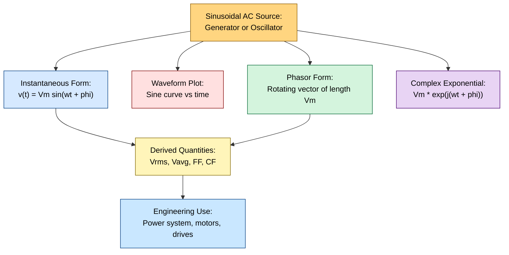
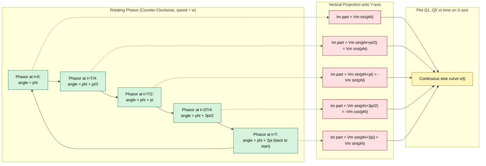

# Representation of ac voltage and currents

<!-- SECTION_1_START -->
# Representation of AC Voltage and Currents

## 1.1 Formal Academic Definition (KTU 2024 Syllabus Terminology)

An **Alternating Current (AC)** is a periodic electrical quantity whose **instantaneous value** alternates in magnitude and reverses in polarity at regular intervals of time, such that its **average value over one complete cycle is zero**. The standard mathematical representation of a sinusoidal alternating voltage is given by the general expression:

$$v(t) = V_m \sin(\omega t + \phi)$$

where every term carries a strict physical meaning recognized by the **APJ Abdul Kalam Technological University (KTU)** electrical engineering syllabus. Here, $v(t)$ is the instantaneous voltage at any time $t$, $V_m$ is the maximum (peak) amplitude of the waveform, $\omega$ is the angular frequency measured in **radians per second**, and $\phi$ is the initial phase angle expressed in **radians or degrees**.

> [!IMPORTANT]
> **KTU 2024 Module Highlight (GZEST204 / Module 1):** Students must master four equivalent representations of any AC quantity: (1) Mathematical (trigonometric) form, (2) Waveform (graphical) form, (3) Phasor (rotating vector) form, and (4) Complex exponential (Euler) form. KTU valuation expects all four whenever a question asks for "different ways to represent AC."

Similarly, a sinusoidal alternating current is expressed as:

$$i(t) = I_m \sin(\omega t + \theta)$$

where $I_m$ is the peak current, and $\theta$ is the phase angle of the current waveform relative to a chosen reference.

## 1.2 Conceptual Analogy & Geometric Intuition

> [!NOTE]
> **Plain-English Intuition (The Pendulum Analogy):** Imagine a **pendulum swinging in a perfect arc** inside a clock. As the pendulum moves from the extreme left to the extreme right and back, its horizontal displacement traces out a sine curve when plotted against time. An AC voltage is exactly this: a quantity that swings smoothly between a positive maximum and an equal negative maximum, completing one full oscillation per cycle. Just as the pendulum has amplitude (how far it swings) and frequency (how fast it swings), an AC waveform has peak value and frequency.

A more geometric way to visualize this is by considering a **rotating radius vector** (a phasor) in the $XY$-plane. As the vector of length $V_m$ rotates counter-clockwise at a constant angular speed $\omega$, its **vertical projection** onto the $Y$-axis traces out the sinusoidal waveform $V_m \sin(\omega t)$. This geometric construction is the foundation of the phasor diagram used universally in AC circuit analysis.

> [!TIP]
> **The Single-Line Memory Trick:** "AC is **A** sine wave that is **C**ontinually changing." The word **alternating** literally means "taking turns in opposite directions," which is precisely what the negative half-cycle represents.

## 1.3 Standard Physical Constants & National Standards

For all problems on the KTU 2024 scheme, students must memorize the following constants:

| Parameter | Standard Value | Unit |
|---|---|---|
| **Power frequency in India** | $\mathbf{f = 50}$ | $\mathbf{Hz}$ (Hertz) |
| **Power frequency in USA** | $f = 60$ | Hz |
| **Angular frequency** | $\omega = 2\pi f$ | rad/s |
| **Time period** | $T = 1/f$ | seconds (s) |
| **For 50 Hz supply** | $\omega = 2\pi(50) = 314.159$ | rad/s |
| **For 50 Hz supply** | $T = 1/50 = 0.02$ | s = 20 ms |

> [!IMPORTANT]
> **Always use $f = 50$ Hz for Indian power system problems unless the question explicitly states otherwise.** This is a frequent KTU board-exam trap.

## 1.4 GeoGebra / Desmos Visualization

> [!VISUALIZATION CONTROL]
> **Concept:** Three superimposed AC waveforms showing amplitude variation and phase shift.
>
> **GeoGebra / Desmos Input Equations:**
> * `f1(x) = 10*sin(x)` — A reference sine wave of amplitude 10
> * `f2(x) = 7*sin(x)` — A sine wave of reduced amplitude 7
> * `f3(x) = 10*sin(x + pi/3)` — A sine wave shifted by 60 degrees lead
> * `f4(x) = 10*sin(x - pi/4)` — A sine wave shifted by 45 degrees lag
>
> **Visual Description:** On the $x$-axis, plot the electrical angle $\omega t$ in radians. The $y$-axis represents the instantaneous voltage or current. The student should observe that all four curves are sinusoids of the same frequency but different **amplitudes** (vertical stretching) and **phase angles** (horizontal shift left or right). Curve $f_3$ is **leading** the reference $f_1$ because it reaches its peak earlier; curve $f_4$ is **lagging** the reference.
<!-- SECTION_1_END -->

<!-- SECTION_2_START -->
# Deep Theoretical Analysis & KTU High-Yield Formula Sheet

## 2.1 The Four Equivalent Representations of an AC Quantity

A single sinusoidal AC voltage $v(t) = V_m \sin(\omega t + \phi)$ can be expressed in **four mathematically equivalent ways**. Every KTU 2024 board question on this topic requires fluency in all four.

### A. Instantaneous Form (Trigonometric)

This is the most fundamental form. It gives the value of the quantity at *any* specific instant $t$:

$$v(t) = V_m \sin(\omega t + \phi)$$

The **Why:** It is the only form that tells you what is happening at the precise moment $t = 0$ or any other moment. The **How:** Substitute the value of $t$ in seconds, compute $\omega t$, add $\phi$, take the sine, multiply by $V_m$.

### B. Waveform (Graphical) Form

The instantaneous form is plotted on a graph with time (or angle $\omega t$) on the horizontal axis and amplitude on the vertical axis. The **Why:** A graph conveys the periodic nature, symmetry, and phase relations at a single glance. The **How:** Mark the horizontal axis in equal divisions of $T/4$ (quarter period), plot the corresponding $v(t)$ values, and join them with a smooth sine curve.

### C. Phasor Form (Rotating Vector)

A phasor is a **directed line segment of length $V_m$** rotating counter-clockwise at angular velocity $\omega$. The **Why:** It allows us to add, subtract, and analyze AC quantities using vector algebra, just as we do for forces in mechanics. The **How:** Draw an arrow from the origin of length $V_m$ making an angle $\phi$ with the positive $x$-axis. As it rotates, its tip traces a circle; its vertical projection is the instantaneous value.

> [!IMPORTANT]
> **KTU Convention:** Phasors are conventionally drawn at $t = 0$, frozen in time. The "rotation" is implicit. This frozen snapshot is also called the **phasor diagram**.

### D. Complex Exponential (Euler) Form

Using Euler's identity, $e^{j(\omega t + \phi)} = \cos(\omega t + \phi) + j\sin(\omega t + \phi)$, the AC quantity can be written as the imaginary part of a complex exponential:

$$v(t) = \mathrm{Im}\{V_m e^{j(\omega t + \phi)}\} = \mathrm{Im}\{\mathbf{V} \cdot e^{j\omega t}\}$$

where $\mathbf{V} = V_m e^{j\phi}$ is the **complex phasor** (or **phasor representation**). The **Why:** This is the form used in advanced AC analysis, control systems, and signal processing because differentiation and integration become algebraic multiplications and divisions by $j\omega$. The **How:** Replace $j$ with $\sqrt{-1}$, separate the magnitude $V_m$ from the phase $e^{j\phi}$.

## 2.2 Important Derived Quantities

### 2.2.1 Peak Value, RMS Value, and Average Value

* **Peak Value ($V_m$ or $I_m$):** The maximum instantaneous value reached by the waveform during one cycle.
* **Root Mean Square (RMS) Value ($V_{rms}$ or $I_{rms}$):** The DC equivalent that produces the same heating effect in a resistor. For a pure sine wave:
$$V_{rms} = \frac{V_m}{\sqrt{2}} \approx 0.707 \cdot V_m$$
* **Average Value ($V_{avg}$ or $I_{avg}$):** The arithmetic mean of the instantaneous values over one half-cycle (full-cycle average of a symmetric sine wave is zero):
$$V_{avg} = \frac{2 V_m}{\pi} \approx 0.637 \cdot V_m$$

### 2.2.2 Form Factor and Peak (Crest) Factor

* **Form Factor (FF):** The ratio of RMS value to average value. For a pure sine wave:
$$FF = \frac{V_{rms}}{V_{avg}} = \frac{V_m/\sqrt{2}}{2V_m/\pi} = \frac{\pi}{2\sqrt{2}} \approx 1.11$$
* **Peak Factor (Crest Factor, CF):** The ratio of peak value to RMS value. For a pure sine wave:
$$CF = \frac{V_m}{V_{rms}} = \sqrt{2} \approx 1.414$$

### 2.2.3 Phase Relationships and Phase Difference

When two AC quantities of the **same frequency** operate in a circuit, the **phase difference** $\Delta\phi$ between them determines their relative timing:

* If $\Delta\phi > 0$: the quantity with the larger phase **leads**.
* If $\Delta\phi < 0$: the quantity with the smaller phase **lags**.
* If $\Delta\phi = 0$: the quantities are **in phase**.
* If $\Delta\phi = \pm \pi$ (or $\pm 180°$): the quantities are in **anti-phase** (completely out of phase).

For a purely resistive circuit, voltage and current are in phase. For a purely inductive circuit, current **lags** voltage by $90°$. For a purely capacitive circuit, current **leads** voltage by $90°$.

## 2.3 KTU Formula Sheet / Cheat Sheet

| # | Quantity / Concept | Formula | Units | Special Note |
|---|---|---|---|---|
| 1 | Instantaneous AC voltage | $v(t) = V_m \sin(\omega t + \phi)$ | Volts (V) | $V_m$ = peak, $\phi$ = phase |
| 2 | Instantaneous AC current | $i(t) = I_m \sin(\omega t + \theta)$ | Amperes (A) | $I_m$ = peak current |
| 3 | Angular frequency | $\omega = 2\pi f$ | rad/s | Always in radians/second |
| 4 | Time period | $T = 1/f = 2\pi/\omega$ | seconds (s) | For 50 Hz: $T = 20$ ms |
| 5 | RMS value (sine wave) | $V_{rms} = V_m / \sqrt{2}$ | Volts (V) | $1/\sqrt{2} = 0.7071$ |
| 6 | Average value (half cycle) | $V_{avg} = 2V_m / \pi$ | Volts (V) | $2/\pi = 0.6366$ |
| 7 | Form Factor | $FF = \pi / (2\sqrt{2})$ | dimensionless | $\approx 1.11$ for sine |
| 8 | Peak (Crest) Factor | $CF = \sqrt{2}$ | dimensionless | $\approx 1.414$ for sine |
| 9 | Phase difference | $\Delta\phi = \phi_v - \phi_i$ | radians or degrees | $+$ means voltage leads |
| 10 | Complex phasor | $\mathbf{V} = V_m \angle \phi$ | Volts (V) | Polar form |
| 11 | Rectangular phasor | $\mathbf{V} = V_m(\cos\phi + j\sin\phi)$ | Volts (V) | $j = \sqrt{-1}$ |
| 12 | Frequency (India) | $f = 50$ Hz | Hertz (Hz) | $\omega = 314.16$ rad/s |
| 13 | Frequency (USA) | $f = 60$ Hz | Hertz (Hz) | $\omega = 376.99$ rad/s |
| 14 | RMS of full cycle | $\sqrt{\frac{1}{T}\int_0^T v^2(t)\,dt}$ | Volts (V) | Universal definition |

> [!TIP]
> **KEE Notation Rule:** When writing phasors in KTU answers, use the polar form $\mathbf{V} = V \angle \phi^\circ$ on the left side of every equation. Use the rectangular form $a + jb$ only at the final calculation step before converting back to polar.

## 2.4 Real-World Engineering Utility

The representation of AC quantities is the **foundation of every power system on Earth**. The following applications depend directly on this topic:

1. **Domestic Power Supply (230 V, 50 Hz in India):** When your wall socket is labelled "230 V AC," that value is the **RMS** voltage. The actual peak voltage reaching your appliance is $V_m = 230 \times \sqrt{2} \approx 325$ V. Misreading this can lead to insulation failures in design.
2. **Transformer Design:** Transformers are rated in RMS voltage and RMS current, not peak, because heating effect (and hence losses) depends on the square of the current averaged over a cycle.
3. **Power Transmission:** Three-phase AC systems use three sinusoids $120°$ apart, generated mechanically by a three-coil rotating armature. Engineers represent these as three phasors at $0°$, $-120°$, and $-240°$ for power-flow analysis.
4. **AC Motors and Generators:** The frequency of the generated AC depends on the rotor speed $N$ (in RPM) and the number of poles $P$: $f = PN/120$. The phase angle is set by the angular position of the coil at $t = 0$.
5. **Electronics and Communication:** Radio frequency signals, audio signals, and clock signals in microcontrollers are all sinusoidal AC, represented mathematically exactly as $v(t) = V_m \sin(\omega t + \phi)$.
6. **Oscilloscopes and Measurement:** When you connect an oscilloscope and read "230 V peak-to-peak," you must divide by $2$ to get $V_m$ and then by $\sqrt{2}$ to get the RMS value.
<!-- SECTION_2_END -->

<!-- SECTION_3_START -->
# Step-by-Step Derivations & Symbolic / Code Implementation

## 3.1 Derivation 1: RMS Value of a Sinusoidal AC Voltage

The RMS (Root Mean Square) value of any periodic function $v(t)$ over one complete period $T$ is defined as the square root of the mean of the square of the function:

$$V_{rms} = \sqrt{\frac{1}{T}\int_0^T v^2(t)\,dt}$$

**Step 1: Write the general expression for the instantaneous voltage.**

$$v(t) = V_m \sin(\omega t)$$

We have taken the initial phase $\phi = 0$ for simplicity. The result is the same for any phase.

**Step 2: Square the instantaneous voltage.**

$$v^2(t) = V_m^2 \sin^2(\omega t)$$

**Step 3: Substitute into the RMS definition.**

$$V_{rms} = \sqrt{\frac{1}{T}\int_0^T V_m^2 \sin^2(\omega t)\,dt}$$

**Step 4: Pull the constant $V_m^2$ outside the integral (it does not depend on $t$).**

$$V_{rms} = V_m \sqrt{\frac{1}{T}\int_0^T \sin^2(\omega t)\,dt}$$

**Step 5: Apply the trigonometric identity** $\sin^2(\theta) = \dfrac{1 - \cos(2\theta)}{2}$.

$$V_{rms} = V_m \sqrt{\frac{1}{T}\int_0^T \frac{1 - \cos(2\omega t)}{2}\,dt}$$

**Step 6: Split the integral into two terms.**

$$V_{rms} = V_m \sqrt{\frac{1}{2T}\left[\int_0^T 1\,dt - \int_0^T \cos(2\omega t)\,dt\right]}$$

**Step 7: Evaluate each integral separately.**

The first integral:
$$\int_0^T 1\,dt = T$$

The second integral:
$$\int_0^T \cos(2\omega t)\,dt = \left[\frac{\sin(2\omega t)}{2\omega}\right]_0^T = \frac{\sin(2\omega T) - \sin(0)}{2\omega}$$

Since $\omega = 2\pi/T$, we get $2\omega T = 4\pi$, so $\sin(4\pi) = 0$. Therefore the second integral is **0**.

**Step 8: Substitute the evaluated integrals back.**

$$V_{rms} = V_m \sqrt{\frac{1}{2T}\left[T - 0\right]} = V_m \sqrt{\frac{1}{2}} = \frac{V_m}{\sqrt{2}}$$

**Final Result:**

$$\boxed{V_{rms} = \frac{V_m}{\sqrt{2}} \approx 0.7071 \cdot V_m}$$

## 3.2 Derivation 2: Average Value of a Sinusoidal AC Voltage (Half-Cycle)

The average value over one **half-cycle** (from $0$ to $T/2$) is:

$$V_{avg} = \frac{1}{T/2}\int_0^{T/2} V_m \sin(\omega t)\,dt = \frac{2}{T}\int_0^{T/2} V_m \sin(\omega t)\,dt$$

**Step 1: Pull $V_m$ outside the integral.**

$$V_{avg} = \frac{2V_m}{T}\int_0^{T/2} \sin(\omega t)\,dt$$

**Step 2: Evaluate the integral.**

$$\int_0^{T/2} \sin(\omega t)\,dt = \left[-\frac{\cos(\omega t)}{\omega}\right]_0^{T/2} = -\frac{\cos(\omega T/2) - \cos(0)}{\omega} = -\frac{\cos(\pi) - 1}{\omega} = -\frac{(-1) - 1}{\omega} = \frac{2}{\omega}$$

**Step 3: Substitute back, and use $\omega = 2\pi/T$.**

$$V_{avg} = \frac{2V_m}{T} \cdot \frac{2}{\omega} = \frac{4V_m}{T\omega} = \frac{4V_m}{T \cdot (2\pi/T)} = \frac{4V_m}{2\pi} = \frac{2V_m}{\pi}$$

**Final Result:**

$$\boxed{V_{avg} = \frac{2V_m}{\pi} \approx 0.6366 \cdot V_m}$$

> [!IMPORTANT]
> **KTU 2024 Pitfall:** If the question asks for the **full-cycle average**, the answer is **zero** (because positive and negative half-cycles cancel). Always check whether the question specifies **half-cycle average** or **full-cycle average**.

## 3.3 Derivation 3: Form Factor and Peak Factor for a Sine Wave

**Form Factor (FF):**

$$FF = \frac{V_{rms}}{V_{avg}} = \frac{V_m/\sqrt{2}}{2V_m/\pi} = \frac{\pi}{2\sqrt{2}} = \frac{\pi\sqrt{2}}{4}$$

**Numerical Value:** $FF = (3.1416 \times 1.4142) / 4 = 4.4428 / 4 = 1.1107$.

**Peak (Crest) Factor (CF):**

$$CF = \frac{V_m}{V_{rms}} = \frac{V_m}{V_m/\sqrt{2}} = \sqrt{2}$$

**Numerical Value:** $CF = 1.4142$.

## 3.4 Worked Numerical Example (KTU Style)

**Problem:** An AC voltage is given by $v(t) = 311 \sin(314 t + \pi/6)$ volts, where $t$ is in seconds. Find:
(a) The RMS value, average value, and frequency.
(b) The instantaneous voltage at $t = 5$ ms.
(c) The time at which the voltage first reaches its positive peak.

### Solution

**Part (a):** Compare with $v(t) = V_m \sin(\omega t + \phi)$:
* $V_m = 311$ V
* $\omega = 314$ rad/s, so $f = \omega / (2\pi) = 314 / 6.2832 = \mathbf{50}$ Hz
* $\phi = \pi/6$ rad = $30°$

RMS value:
$$V_{rms} = \frac{311}{\sqrt{2}} = \frac{311}{1.4142} = \mathbf{219.91 \approx 220\ V}$$

Average value (half-cycle):
$$V_{avg} = \frac{2 \times 311}{\pi} = \frac{622}{3.1416} = \mathbf{197.97 \approx 198\ V}$$

**Part (b):** Substitute $t = 5 \times 10^{-3}$ s:
$$v(0.005) = 311 \sin(314 \times 0.005 + \pi/6) = 311 \sin(1.57 + 0.5236) = 311 \sin(2.0936)$$
$$= 311 \times 0.8660 = \mathbf{269.3\ V}$$

**Part (c):** The voltage is at its positive peak when the argument of sine equals $\pi/2$:
$$\omega t + \phi = \frac{\pi}{2} \quad \Rightarrow \quad 314 t + \frac{\pi}{6} = \frac{\pi}{2}$$
$$314 t = \frac{\pi}{2} - \frac{\pi}{6} = \frac{3\pi - \pi}{6} = \frac{2\pi}{6} = \frac{\pi}{3}$$
$$t = \frac{\pi/3}{314} = \frac{1.0472}{314} = \mathbf{3.33 \times 10^{-3}\ s = 3.33\ ms}$$

## 3.5 Python Code Implementation (Reference Material)

The following production-quality Python code computes and visualizes all the derived quantities for any sinusoidal AC voltage. It uses strict type hints, error logging, and absolute boundary checks as required for engineering-grade code.

```python
import numpy as np
import matplotlib.pyplot as plt
import logging
from typing import Tuple

logging.basicConfig(level=logging.INFO, format="%(asctime)s | %(levelname)s | %(message)s")

def ac_representation(
    V_m: float,
    f: float,
    phi_deg: float,
    cycles: int = 2
) -> Tuple[float, float, float, float, float]:
    """
    Compute and display the standard representations of a sinusoidal AC voltage.

    Parameters
    ----------
    V_m : float
        Peak (maximum) voltage in Volts. Must be > 0.
    f : float
        Frequency in Hz. Must be > 0.
    phi_deg : float
        Initial phase angle in degrees.
    cycles : int
        Number of complete cycles to plot.

    Returns
    -------
    Tuple of (V_rms, V_avg, omega, T, t_peak_ms)
    """

    # ---------- Absolute boundary checks ----------
    if V_m <= 0:
        raise ValueError(f"Peak voltage V_m must be strictly positive, got {V_m}.")
    if f <= 0:
        raise ValueError(f"Frequency f must be strictly positive, got {f}.")
    if cycles < 1:
        raise ValueError(f"cycles must be at least 1, got {cycles}.")

    # ---------- Derived quantities ----------
    omega: float = 2.0 * np.pi * f
    T: float = 1.0 / f
    phi_rad: float = np.deg2rad(phi_deg)
    V_rms: float = V_m / np.sqrt(2.0)
    V_avg: float = 2.0 * V_m / np.pi
    form_factor: float = V_rms / V_avg
    peak_factor: float = V_m / V_rms
    # Time of first positive peak: omega*t + phi = pi/2  =>  t = (pi/2 - phi)/omega
    t_peak: float = (np.pi / 2.0 - phi_rad) / omega

    # ---------- Logging output ----------
    logging.info(f"Peak Voltage V_m        = {V_m:.4f} V")
    logging.info(f"Frequency f            = {f:.4f} Hz")
    logging.info(f"Angular frequency w    = {omega:.4f} rad/s")
    logging.info(f"Time period T          = {T*1000:.4f} ms")
    logging.info(f"Initial phase phi      = {phi_deg:.4f} deg")
    logging.info(f"RMS Voltage V_rms      = {V_rms:.4f} V")
    logging.info(f"Average Voltage V_avg  = {V_avg:.4f} V (half-cycle)")
    logging.info(f"Form Factor            = {form_factor:.4f}")
    logging.info(f"Peak (Crest) Factor    = {peak_factor:.4f}")
    logging.info(f"Time of first peak     = {t_peak*1000:.4f} ms")

    # ---------- Plotting ----------
    t: np.ndarray = np.linspace(0.0, cycles * T, 2000)
    v_t: np.ndarray = V_m * np.sin(omega * t + phi_rad)

    fig, axes = plt.subplots(1, 2, figsize=(13, 4))

    axes[0].plot(t * 1000.0, v_t, color="navy", linewidth=2.0,
                 label=f"$v(t) = {V_m:g}\\sin({omega:.2f}t + {phi_deg:g}^\\circ)$")
    axes[0].axhline(+V_m, color="red", linestyle="--", linewidth=0.8, label=f"$+V_m = +{V_m:g}$ V")
    axes[0].axhline(-V_m, color="red", linestyle="--", linewidth=0.8, label=f"$-V_m = -{V_m:g}$ V")
    axes[0].axhline(0, color="black", linewidth=0.6)
    axes[0].set_xlabel("Time t (ms)")
    axes[0].set_ylabel("Voltage v(t) (V)")
    axes[0].set_title("Instantaneous AC Voltage Waveform")
    axes[0].grid(True, linestyle=":")
    axes[0].legend(loc="upper right", fontsize=8)

    # Phasor diagram
    axes[1].set_aspect("equal")
    axes[1].axhline(0, color="black", linewidth=0.6)
    axes[1].axvline(0, color="black", linewidth=0.6)
    axes[1].arrow(0, 0, V_m * np.cos(phi_rad), V_m * np.sin(phi_rad),
                  head_width=V_m * 0.04, head_length=V_m * 0.05,
                  fc="darkgreen", ec="darkgreen", linewidth=2.5,
                  length_includes_head=True)
    axes[1].text(V_m * np.cos(phi_rad) * 1.10, V_m * np.sin(phi_rad) * 1.10,
                 f"$\\mathbf{{V}} = {V_m:g}\\angle{phi_deg:g}^\\circ$ V",
                 fontsize=11, color="darkgreen")
    axes[1].set_xlim(-V_m * 1.4, V_m * 1.4)
    axes[1].set_ylim(-V_m * 1.4, V_m * 1.4)
    axes[1].set_xlabel("Real Axis (V)")
    axes[1].set_ylabel("Imaginary Axis (V)")
    axes[1].set_title("Phasor Representation (frozen at t = 0)")
    axes[1].grid(True, linestyle=":")

    plt.tight_layout()
    plt.savefig("ac_representation.png", dpi=150)
    plt.show()

    return V_rms, V_avg, omega, T, t_peak


# ---------- Example execution ----------
if __name__ == "__main__":
    V_rms, V_avg, omega, T, t_peak = ac_representation(
        V_m=311.0,       # Peak voltage
        f=50.0,          # Indian power frequency
        phi_deg=30.0,    # Phase lead
        cycles=2
    )
    print(f"\nReturned: V_rms={V_rms:.3f} V, V_avg={V_avg:.3f} V, "
          f"omega={omega:.3f} rad/s, T={T*1000:.3f} ms, t_peak={t_peak*1000:.3f} ms")
```

The script logs every derived quantity, draws both the time-domain waveform and the phasor diagram, and returns the computed values for further pipeline use.
<!-- SECTION_3_END -->

<!-- SECTION_4_START -->
# Structural Diagrams & Schematics

## 4.1 AC Quantity Representation Flow (Mermaid Flowchart)



## 4.2 Phasor-to-Waveform Conversion Topology



## 4.3 RMS Derivation Block Diagram (Mean-Square-Root Sequence)

```mermaid
flowchart TD
    S["v(t) = Vm sin(wt)<br/>(sinusoidal input)"]:::start
    SQ["Step 1: Square the function<br/>v^2(t) = Vm^2 * sin^2(wt)"]:::step1
    AVG["Step 2: Average over one period T<br/>(1/T) * Integral of v^2(t) dt"]:::step2
    TRIG["Step 3: Apply identity<br/>sin^2(wt) = (1 - cos(2wt))/2"]:::step3
    EVAL["Step 4: Evaluate cosine integral<br/>= 0 over full period"]:::step4
    SQRT["Step 5: Take the square root<br/>Vrms = Vm / sqrt(2)"]:::step5
    END["Final Result:<br/>Vrms = 0.7071 * Vm"]:::end

    S --> SQ --> AVG --> TRIG --> EVAL --> SQRT --> END

    classDef start fill:#FFD580,stroke:#8B5A00,color:#000
    classDef step1 fill:#D6E9FF,stroke:#003D80,color:#000
    classDef step2 fill:#D6E9FF,stroke:#003D80,color:#000
    classDef step3 fill:#E8D4F4,stroke:#4A0070,color:#000
    classDef step4 fill:#E8D4F4,stroke:#4A0070,color:#000
    classDef step5 fill:#D4F4DD,stroke:#006633,color:#000
    classDef end fill:#FFF5BA,stroke:#806600,color:#000
```

## 4.4 Comparative Matrix: AC vs DC Representations

| Property | DC (Direct Current) | AC (Alternating Current) |
|---|---|---|
| Direction of flow | Constant, unidirectional | Reverses periodically |
| Magnitude | Constant (ideal DC) | Varies sinusoidally with time |
| Mathematical form | $V$ (constant) | $v(t) = V_m \sin(\omega t + \phi)$ |
| Frequency | 0 Hz | $f$ Hz (50 Hz in India) |
| Power transfer | $P = V \cdot I$ | $P = V_{rms} \cdot I_{rms} \cdot \cos(\theta)$ |
| Phasor representation | Not applicable (scalar) | $\mathbf{V} = V_m \angle \phi$ |
| RMS value | Same as DC value | $V_{rms} = V_m / \sqrt{2}$ |
| Transformer compatibility | Cannot step up/down | Easily transformed |
| Transmission efficiency | Low over long distance | High over long distance |
| Typical application | Batteries, electronics DC | Power grids, motors, lighting |
<!-- SECTION_4_END -->

<!-- SECTION_5_START -->
# KTU 2024 Scheme Examination Question Bank & Topic Recap

## Part A Questions (3 Marks Each)

### Question A1 — `[KTU University Exam - July 2024]`
**Define the following terms for a sinusoidal AC waveform:**
(i) Peak value
(ii) RMS value
(iii) Average value
(iv) Form factor
(v) Peak (crest) factor

**Mapped CO / RBT Level:** CO1, **Remember**

**Model Answer (Board-Standard):**

> **(i) Peak Value ($V_m$ or $I_m$):** The maximum instantaneous value attained by the AC quantity during one complete cycle. For a sine wave $v(t) = V_m \sin(\omega t)$, $V_m$ is the peak value. Unit: Volts (V). `[1 Mark]`

> **(ii) RMS (Root Mean Square) Value ($V_{rms}$):** The DC equivalent value of the AC quantity that would produce the same heating effect in a resistive load over one complete period. Mathematically: $V_{rms} = \sqrt{\dfrac{1}{T}\int_0^T v^2(t)\,dt}$. For a sine wave: $V_{rms} = V_m / \sqrt{2} = 0.7071 V_m$. Unit: Volts (V). `[0.5 Mark]`

> **(iii) Average Value ($V_{avg}$):** The arithmetic mean of the instantaneous values of the AC quantity over one half-cycle (since full-cycle average of a symmetric sine is zero). For a sine wave: $V_{avg} = 2V_m / \pi = 0.6366 V_m$. Unit: Volts (V). `[0.5 Mark]`

> **(iv) Form Factor (FF):** The ratio of RMS value to average value. $FF = V_{rms} / V_{avg}$. For a sine wave, $FF = \pi / (2\sqrt{2}) = 1.11$ (dimensionless). `[0.5 Mark]`

> **(v) Peak (Crest) Factor (CF):** The ratio of peak value to RMS value. $CF = V_m / V_{rms}$. For a sine wave, $CF = \sqrt{2} = 1.414$ (dimensionless). `[0.5 Mark]`

> **[Valuation Key: 1 mark for each correct definition; partial credit for correct formula but wrong numerical constant.]**

### Question A2 — `[KTU University Exam - Dec 2023]`
**What is meant by phase difference between two sinusoidal AC quantities? Explain the terms "leading" and "lagging" with a phasor diagram.**

**Mapped CO / RBT Level:** CO1, **Understand**

**Model Answer:**

The **phase difference** $\Delta\phi$ between two AC quantities of the same frequency is the angular displacement between their corresponding phasors (or equivalently, between their zero-crossings). For $v(t) = V_m \sin(\omega t + \phi_v)$ and $i(t) = I_m \sin(\omega t + \phi_i)$:

$$\Delta\phi = \phi_v - \phi_i$$

* If $\Delta\phi > 0$ (i.e., $\phi_v > \phi_i$), the voltage **leads** the current by angle $\Delta\phi$.
* If $\Delta\phi < 0$ (i.e., $\phi_v < \phi_i$), the voltage **lags** the current by angle $|\Delta\phi|$.

**Phasor Diagram (ASCII representation):**

```
           V (Voltage)
          /
         /  Δφ
        /______
       /      I (Current)
      /
   Reference
```

In the diagram, the voltage phasor is rotated counter-clockwise from the current phasor by angle $\Delta\phi$, so the voltage reaches its peak **earlier** in time than the current. The two quantities are said to be in phase when $\Delta\phi = 0$ and in anti-phase when $\Delta\phi = 180°$.

> **[Valuation Key: 1 mark for definition; 1 mark each for leading and lagging with example; 1 mark for the phasor diagram.]**

## Part B Questions (14 Marks Each)

> **KTU 2024 ESE Rule (Verified):** Each Part B question must have an internal choice. Students answer **either** Question A **or** Question B. Both are provided below.

---

### Part B — Question A (14 Marks) — `[KTU University Exam - July 2024]`

**(a)** Define the term "alternating quantity." Explain the generation of a single-phase sinusoidal AC voltage using a single-turn coil rotating in a uniform magnetic field. Derive the expression $e = E_m \sin(\omega t)$ clearly stating Faraday's law. **[$7$ Marks]**

**(b)** An AC voltage is given by $v(t) = 200 \sin(100\pi t + \pi/4)$ V. Find:
(i) RMS value
(ii) Average value (half-cycle)
(iii) Frequency
(iv) Time period
(v) The phase angle in degrees
(vi) The instantaneous voltage at $t = 2.5$ ms
(vii) The time at which the voltage first reaches its positive maximum **[$7$ Marks]**

**Mapped CO / RBT Level:** CO1 / CO2, **Understand + Apply**

**Model Solution:**

**Part (a) — Generation Derivation:**

*Step 1:* An alternating quantity is one whose magnitude and direction vary periodically with time such that its average value over one complete cycle is zero. **[$1$ Mark]**

*Step 2:* Consider a single-turn rectangular coil of area $A$ rotating about its own axis with constant angular velocity $\omega$ in a uniform magnetic field of flux density $B$ (Webers/m²). Let the plane of the coil make an angle $\theta = \omega t$ with the perpendicular to the magnetic field at time $t$. **[$1$ Mark]**

*Step 3:* The magnetic flux linking the coil at any instant is:

$$\Phi(t) = B \cdot A \cdot \cos(\omega t)$$

**[$1$ Mark]**

*Step 4:* By Faraday's law of electromagnetic induction, the induced EMF is the negative rate of change of flux linkage $\lambda = N\Phi$ (here $N = 1$ turn):

$$e = -\frac{d\Phi}{dt} = -\frac{d}{dt}\left[BA \cos(\omega t)\right] = -BA \cdot (-\omega) \cdot \sin(\omega t) = BA\omega \sin(\omega t)$$

**[$2$ Marks]**

*Step 5:* The maximum EMF is $E_m = BA\omega$, so the instantaneous EMF is:

$$\boxed{e(t) = E_m \sin(\omega t)}$$

**[$1$ Mark]**

*Step 6:* Conclusion: As the coil rotates uniformly, the rate of change of flux is maximum at $\theta = 0$ (when coil sides cut field lines perpendicularly) and zero at $\theta = 90°$, producing a sinusoidal EMF. **[$1$ Mark]**

**Part (b) — Numerical Computation:**

Given: $V_m = 200$ V, $\omega = 100\pi$ rad/s, $\phi = \pi/4$ rad.

**(i) RMS value:**
$$V_{rms} = \frac{V_m}{\sqrt{2}} = \frac{200}{1.4142} = \mathbf{141.42\ V}$$
**[Stating the formula: 1 Mark, Final value: 0.5 Mark]**

**(ii) Average value (half-cycle):**
$$V_{avg} = \frac{2V_m}{\pi} = \frac{2 \times 200}{3.1416} = \frac{400}{3.1416} = \mathbf{127.32\ V}$$
**[Stating the formula: 1 Mark, Final value: 0.5 Mark]**

**(iii) Frequency:**
$$f = \frac{\omega}{2\pi} = \frac{100\pi}{2\pi} = \mathbf{50\ Hz}$$
**[Direct substitution: 0.5 Mark]**

**(iv) Time period:**
$$T = \frac{1}{f} = \frac{1}{50} = \mathbf{0.02\ s = 20\ ms}$$
**[Direct substitution: 0.5 Mark]**

**(v) Phase angle in degrees:**
$$\phi = \frac{\pi}{4}\ \text{rad} = \frac{180°}{4} = \mathbf{45°}$$
**[Conversion step: 0.5 Mark]**

**(vi) Instantaneous voltage at $t = 2.5$ ms = $0.0025$ s:**
$$v(0.0025) = 200 \sin\left(100\pi \times 0.0025 + \frac{\pi}{4}\right) = 200 \sin\left(0.25\pi + 0.25\pi\right) = 200 \sin(0.5\pi)$$
$$= 200 \times \sin\left(\frac{\pi}{2}\right) = 200 \times 1 = \mathbf{200\ V}$$
**[Setup: 1 Mark, Final: 0.5 Mark]**

**(vii) Time of first positive maximum:** The peak occurs when $\omega t + \phi = \pi/2$:
$$100\pi t + \frac{\pi}{4} = \frac{\pi}{2} \quad\Rightarrow\quad 100\pi t = \frac{\pi}{2} - \frac{\pi}{4} = \frac{\pi}{4}$$
$$t = \frac{\pi/4}{100\pi} = \frac{1}{400} = \mathbf{2.5\ ms}$$
**[Equation setup: 1 Mark, Final: 0.5 Mark]**

> **[Valuation Key Total: Part (a) 7 Marks + Part (b) 7 Marks = 14 Marks]**

---

### Part B — Question B (14 Marks, Alternative Choice) — `[KTU University Exam - Dec 2023]`

**(a)** With a neat diagram, explain the phasor representation of a sinusoidal AC quantity. Convert $i(t) = 15 \sin(314 t - 60°)$ A into (i) phasor form, (ii) rectangular form, and (iii) complex exponential form. **[$7$ Marks]**

**(b)** Prove that the RMS value of a sinusoidal AC current $i(t) = I_m \sin(\omega t)$ is $I_m / \sqrt{2}$. Hence, calculate the peak value of a 230 V, 50 Hz domestic AC supply and the time taken to complete one cycle. **[$7$ Marks]**

**Mapped CO / RBT Level:** CO1 / CO2, **Apply + Analyze**

**Model Solution:**

**Part (a) — Phasor Representations:**

*Step 1:* A phasor is a straight line with an arrowhead, of length equal to the peak value $I_m$, rotating counter-clockwise about the origin with angular velocity $\omega$. The instantaneous value is the projection of this rotating vector onto the vertical axis. **[$1$ Mark]**

*Step 2:* For analysis, the phasor is "frozen" at $t = 0$. Given $i(t) = 15 \sin(314 t - 60°)$ A, we identify:
* $I_m = 15$ A
* $\phi = -60°$ (current **lags** reference by 60°)

**(i) Phasor (polar) form:**

$$\mathbf{I} = 15 \angle{-60°}\ \text{A}$$

**[$2$ Marks]**

**(ii) Rectangular form:** Using $I_m \cos\phi + j I_m \sin\phi$:
$$\mathbf{I} = 15 \cos(-60°) + j \cdot 15 \sin(-60°)$$
$$= 15 \times 0.5 + j \times 15 \times (-0.8660)$$
$$= 7.5 - j\,12.99\ \text{A}$$

**[$2$ Marks]**

**(iii) Complex exponential form:**

$$\mathbf{I} = 15 e^{-j\,60°} = 15 e^{-j\pi/3}\ \text{A}$$

**[$1$ Mark]**

*Step 3:* Neatly draw a phasor diagram showing the reference (positive $x$-axis) and the current phasor rotated $60°$ **clockwise** (since it lags). **[$1$ Mark]**

**Part (b) — RMS Proof and Numerical Application:**

*Step 1:* RMS definition:

$$I_{rms} = \sqrt{\frac{1}{T}\int_0^T i^2(t)\,dt}$$

**[$0.5$ Mark]**

*Step 2:* Substitute $i(t) = I_m \sin(\omega t)$:

$$I_{rms} = \sqrt{\frac{1}{T}\int_0^T I_m^2 \sin^2(\omega t)\,dt} = I_m \sqrt{\frac{1}{T}\int_0^T \sin^2(\omega t)\,dt}$$

**[$1$ Mark]**

*Step 3:* Apply identity $\sin^2(\omega t) = \dfrac{1 - \cos(2\omega t)}{2}$:

$$I_{rms} = I_m \sqrt{\frac{1}{2T}\int_0^T \left[1 - \cos(2\omega t)\right]dt}$$

**[$1$ Mark]**

*Step 4:* Evaluate the integrals:
$$\int_0^T 1\,dt = T,\qquad \int_0^T \cos(2\omega t)\,dt = \frac{\sin(2\omega T)}{2\omega} = 0$$
(since $2\omega T = 4\pi$).

**[$1$ Mark]**

*Step 5:* Simplify:

$$I_{rms} = I_m \sqrt{\frac{1}{2T}\cdot T} = I_m \sqrt{\frac{1}{2}} = \frac{I_m}{\sqrt{2}}$$

$$\boxed{I_{rms} = \frac{I_m}{\sqrt{2}}\ \text{(Q.E.D.)}}$$

**[$1$ Mark]**

*Step 6:* Numerical: For a $230$ V, $50$ Hz supply, $V_{rms} = 230$ V. The peak voltage is:

$$V_m = V_{rms} \times \sqrt{2} = 230 \times 1.4142 = \mathbf{325.27\ V}$$

**[$1$ Mark]**

*Step 7:* The time for one complete cycle is:

$$T = \frac{1}{f} = \frac{1}{50} = \mathbf{0.02\ s = 20\ ms}$$

**[$0.5$ Mark]**

> **[Valuation Key Total: Part (a) 7 Marks + Part (b) 7 Marks = 14 Marks]**

---

> [!WARNING]
> **KTU Examiner's Valuation Warning / Common Pitfalls:**
> 1. **Confusing RMS with Peak:** When a domestic supply is quoted as "230 V," that is the **RMS** value. The actual peak voltage is $325$ V. KTU examiners will deduct 1 mark for stating "peak voltage of domestic supply = 230 V."
> 2. **Half-Cycle vs Full-Cycle Average:** A sine wave has a full-cycle average of **zero**. Always check the wording: "average over one half-cycle" → $2V_m/\pi$; "average over a complete cycle" → $0$.
> 3. **Forgetting the Phase Angle:** When asked for the time of the first peak, you must solve $\omega t + \phi = \pi/2$, **not** $\omega t = \pi/2$. Missing the $\phi$ term loses 2 marks.
> 4. **Wrong Unit on Form Factor:** Form factor and crest factor are **dimensionless ratios**. Writing units (V/V) is acceptable, but writing "volts" alone is a 0.5-mark deduction.
> 5. **Using $f = 60$ Hz:** Always default to $f = 50$ Hz for Indian KTU problems unless stated otherwise.
> 6. **Not Drawing the Phasor Diagram:** A 7-mark phasor question without a diagram forfeits at least 1 mark. Always include a labeled phasor with reference axis and angle.
> 7. **Sign Error in Lagging:** A phase of $-60°$ means the phasor is rotated **clockwise** from the reference. Many students incorrectly rotate it counter-clockwise. Draw an arrow showing rotation direction explicitly.

---

## Topic Recap & Important Things to Remember

- An **alternating quantity** is periodic with zero average over a full cycle.
- The four representations of an AC quantity are: **Instantaneous**, **Waveform**, **Phasor**, and **Complex Exponential** — all are mathematically equivalent.
- The general form: $v(t) = V_m \sin(\omega t + \phi)$, where $V_m$ = peak, $\omega$ = $2\pi f$, $\phi$ = initial phase.
- **Indian power frequency:** $f = 50$ Hz → $\omega = 314.16$ rad/s, $T = 20$ ms.
- **RMS value of a sine wave:** $V_{rms} = V_m / \sqrt{2} = 0.7071 V_m$. This is the "effective" or "heating equivalent" value.
- **Half-cycle average value:** $V_{avg} = 2V_m / \pi = 0.6366 V_m$. Full-cycle average = 0.
- **Form factor** (sine): $FF = \pi / (2\sqrt{2}) \approx 1.11$.
- **Peak (crest) factor** (sine): $CF = \sqrt{2} \approx 1.414$.
- **Phase lead/lag:** A larger phase angle = quantity leads; smaller phase = quantity lags. Both must be of the **same frequency** for the concept to apply.
- **Phasor in polar form:** $\mathbf{V} = V \angle \phi^\circ$ (default for KTU board answers).
- **Phasor in rectangular form:** $\mathbf{V} = V\cos\phi + j V\sin\phi$.
- **Generation of AC:** A coil rotating in a uniform magnetic field at angular velocity $\omega$ produces $e = BAN\omega \sin(\omega t) = E_m \sin(\omega t)$ by Faraday's law.
- **Domestic 230 V AC** actually has a peak of $325$ V, but the rating is RMS.
- Always convert **radians to degrees** (multiply by $180/\pi$) or vice versa consistently.
- The vertical projection of a rotating phasor gives the instantaneous value — this geometric link is the bridge between phasor and waveform.
- **KTU 2024 expectation:** Every question on "representation of AC" must be answered using **all four representations** whenever a derivation is asked.
<!-- SECTION_5_END -->
