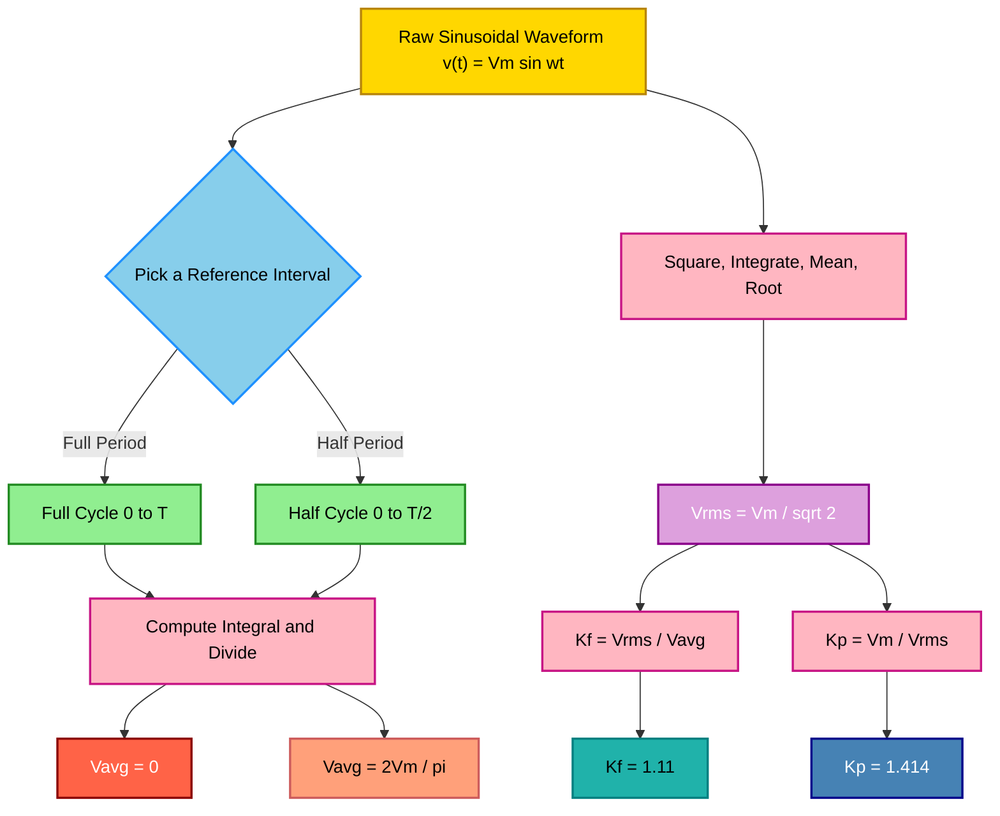
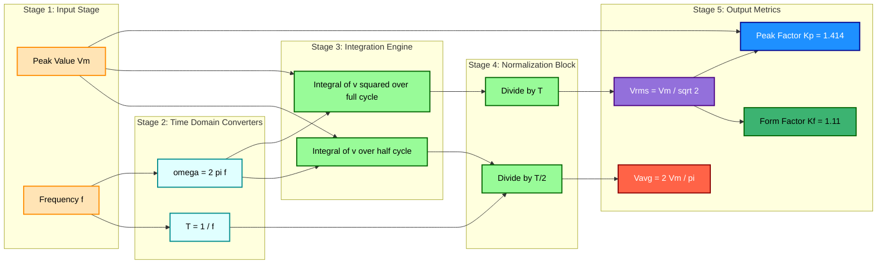

# sinusoidal waveforms: frequency, period average, RMS values and form factor of waveform; (Simple numerical problems)

<!-- SECTION_1_START -->
# Sinusoidal Waveforms: Frequency, Period, Average, RMS Values & Form Factor

> [!IMPORTANT]
> **KTU 2024 Scheme | GZEST204 | Module 1 | Generation of Alternating Voltages**
> This topic is a **high-weightage foundation** for the entire Electrical Engineering stream. It directly supports all subsequent modules on AC circuits, transformers, and power systems.

## 1.1 Formal Definition

A **sinusoidal waveform** (also called a *sinusoid* or *sine wave*) is a periodic mathematical function that describes a smooth, repetitive oscillation. It is the natural shape of many real-world phenomena and is mathematically expressed as:

$$v(t) = V_m \sin(\omega t + \phi)$$

where:
- $v(t)$ is the **instantaneous value** of the voltage at time $t$
- $V_m$ is the **peak (maximum) value** or **amplitude** of the waveform
- $\omega$ is the **angular frequency** in **radians per second (rad/s)**
- $t$ is the **time** in **seconds (s)**
- $\phi$ is the **phase angle** in **radians (rad)** or **degrees (°)**

> [!NOTE]
> **KTU Definition:** An alternating quantity is one whose magnitude and polarity (or direction) change continuously with respect to time. A sinusoidal waveform is the simplest and most fundamental form of alternating quantity because it contains **only one frequency component** (pure tone) and is free from harmonics.

## 1.2 Intuitive Analogy: The Ocean Wave

Imagine standing on a pier watching an **ocean wave** move past a fixed post:
- The **highest crest** of the wave = $V_m$ (Peak Value)
- The **lowest trough** = $-V_m$
- The **time for one complete crest-to-trough-to-crest cycle** = $T$ (Time Period)
- The **number of crests passing the post per second** = $f$ (Frequency)
- The **average height of water** over a complete cycle = **0** (because equal crests and troughs)
- The **effective energy-carrying height** of the wave = **RMS value** (root-mean-square, think "useful" wave power)
- The **ratio of effective height to average height** = **Form Factor**

> [!TIP]
> **Memory Hook:** "RMS = the DC equivalent that would produce the **same heating effect** in a resistor." If you replaced the AC source with a DC battery, the RMS value tells you what DC voltage would do the same job (e.g., heat a toaster equally).

## 1.3 Core Parameters of a Sinusoidal Waveform

| Parameter | Symbol | Unit | Plain-English Meaning |
| :--- | :---: | :---: | :--- |
| Instantaneous Value | $v(t)$ | **V (Volts)** | Voltage at this exact moment |
| Peak Value / Amplitude | $V_m$ | **V (Volts)** | Maximum voltage reached |
| Peak-to-Peak Value | $V_{pp}$ | **V (Volts)** | $V_m - (-V_m) = 2V_m$ |
| Time Period | $T$ | **s (Seconds)** | Time for one full cycle |
| Frequency | $f$ | **Hz (Hertz)** | Cycles per second |
| Angular Frequency | $\omega$ | **rad/s** | Rate of phase change |
| Phase Angle | $\phi$ | **rad / °** | Horizontal shift of the wave |

> [!VISUALIZATION CONTROL]
> **Concept:** Visualization of a Pure Sinusoidal AC Voltage Waveform
> **GeoGebra / Desmos Input Equations:**
> * `v(t) = 10 * sin(2 * pi * 50 * t)` (A standard 50 Hz, 10 V peak AC mains waveform)
> * `v_avg = 6.366` (Horizontal line showing the half-cycle average value)
> * `v_rms = 7.071` (Horizontal line showing the RMS value)
> **Visual Description:** On the X-axis plot **Time (t) in seconds** (0 to 0.04 s showing 2 cycles). On the Y-axis plot **Voltage (V)** from -10 to +10 V. You should observe a smooth wave that crosses zero at regular intervals. Notice that the **RMS line (7.07 V) is closer to the peak (10 V) than the average line (6.37 V) is**. This geometric gap between the two horizontal lines is the essence of the **Form Factor (1.11)**.

<!-- SECTION_1_END -->

<!-- SECTION_2_START -->
# Deep Theoretical Analysis & KTU High-Yield Formula Sheet

## 2.1 Angular Relationship Between $f$, $\omega$, and $T$

The three time-related parameters of a sinusoid are **mathematically locked together**:

$$T = \frac{1}{f} \quad \text{or} \quad f = \frac{1}{T}$$

$$\omega = 2\pi f = \frac{2\pi}{T}$$

> [!NOTE]
> **Why $2\pi$?** Because one complete cycle of a sine wave spans an angle of $2\pi$ radians ($360°$). If there are $f$ cycles per second, then the rate of change of angle is $2\pi f$ rad/s.

## 2.2 Average Value of a Sinusoidal Waveform

The **average value** of a continuous function over an interval is the area under the curve divided by the length of the interval.

$$V_{avg} = \frac{1}{T} \int_{0}^{T} v(t) \, dt$$

### Case 1: Full Cycle Average
For a complete sinusoid, the positive half-cycle exactly cancels the negative half-cycle:

$$V_{avg, \text{full}} = \frac{1}{T} \int_{0}^{T} V_m \sin(\omega t) \, dt = 0$$

This is why **Average Value = 0 for a pure sine wave** taken over the full period. This result has no practical use because every AC meter would read zero!

### Case 2: Half-Cycle Average
For practical measurement (e.g., in half-wave rectifiers), we take the average over the **positive half-cycle** only:

$$\begin{aligned}
V_{avg, \text{half}} &= \frac{1}{T/2} \int_{0}^{T/2} V_m \sin(\omega t) \, dt \\
&= \frac{2}{T} \left[ -\frac{V_m}{\omega} \cos(\omega t) \right]_{0}^{T/2} \\
&= \frac{2}{T} \cdot \frac{V_m}{\omega} \left[ -\cos(\pi) + \cos(0) \right] \\
&= \frac{2}{T} \cdot \frac{V_m}{\omega} \cdot [2] \\
&= \frac{2 V_m}{\pi}
\end{aligned}$$

$$\boxed{V_{avg} = \frac{2 V_m}{\pi} \approx 0.637 \, V_m}$$

## 2.3 Root Mean Square (RMS) Value

The **RMS value** is the *true effective value* of an AC waveform. It is defined as the square root of the **mean of the squares** of the instantaneous values.

$$V_{rms} = \sqrt{\frac{1}{T} \int_{0}^{T} [v(t)]^2 \, dt}$$

Derivation for a pure sinusoid:

$$\begin{aligned}
V_{rms}^2 &= \frac{1}{T} \int_{0}^{T} V_m^2 \sin^2(\omega t) \, dt
\end{aligned}$$

Using the trigonometric identity $\sin^2(\theta) = \frac{1 - \cos(2\theta)}{2}$:

$$\begin{aligned}
V_{rms}^2 &= \frac{V_m^2}{T} \int_{0}^{T} \frac{1 - \cos(2\omega t)}{2} \, dt \\
&= \frac{V_m^2}{2T} \left[ t - \frac{\sin(2\omega t)}{2\omega} \right]_{0}^{T} \\
&= \frac{V_m^2}{2T} \left[ T - \frac{\sin(4\pi) - \sin(0)}{2\omega} \right] \\
&= \frac{V_m^2}{2T} \cdot T = \frac{V_m^2}{2}
\end{aligned}$$

$$\boxed{V_{rms} = \frac{V_m}{\sqrt{2}} \approx 0.707 \, V_m}$$

> [!IMPORTANT]
> **Engineering Significance:** The RMS value is the *only* value used in AC power calculations. When your wall socket is labeled **"230 V, 50 Hz"**, that **230 V is the RMS value**, not the peak! The actual peak voltage at your home outlet is $V_m = \sqrt{2} \times 230 \approx 325$ V.

## 2.4 Form Factor ($K_f$)

The **Form Factor** is a dimensionless ratio that compares the RMS value to the average value. It is a *figure of merit* describing the "peakedness" or "sharpness" of a waveform.

$$K_f = \frac{V_{rms}}{V_{avg}}$$

For a pure sinusoid:

$$K_f = \frac{V_m / \sqrt{2}}{2 V_m / \pi} = \frac{\pi}{2\sqrt{2}} \approx 1.11$$

> [!NOTE]
> **Key Insight:** For a pure sine wave, the form factor is **fixed at 1.11** regardless of amplitude or frequency. This is a unique signature of the sine shape. A square wave has $K_f = 1.0$, a triangular wave has $K_f \approx 1.15$, and a highly peaked waveform has $K_f > 1.5$.

## 2.5 Peak Factor / Crest Factor ($K_p$)

The **Peak Factor** (or **Crest Factor**) is the ratio of the peak value to the RMS value:

$$K_p = \frac{V_m}{V_{rms}} = \frac{V_m}{V_m / \sqrt{2}} = \sqrt{2} \approx 1.414$$

## 2.6 KTU Formula Sheet (Cheat Sheet)

| Quantity | Symbol | Formula | Numerical Value | Units | KTU Use Case |
| :--- | :---: | :--- | :---: | :---: | :--- |
| Time Period | $T$ | $T = \frac{1}{f}$ | — | **s** | Finding cycle duration |
| Frequency | $f$ | $f = \frac{1}{T}$ | — | **Hz** | Mains supply: 50 Hz (India) |
| Angular Frequency | $\omega$ | $\omega = 2\pi f$ | — | **rad/s** | Standard Indian mains: $314.16$ rad/s |
| Peak-to-Peak | $V_{pp}$ | $V_{pp} = 2 V_m$ | — | **V** | Oscilloscope readings |
| Full-Cycle Average | $V_{avg,f}$ | $\frac{1}{T}\int_0^T v(t)dt$ | $0$ | **V** | Always zero for sine |
| Half-Cycle Average | $V_{avg}$ | $\frac{2 V_m}{\pi}$ | $\approx 0.637 V_m$ | **V** | Half-wave rectifier output |
| RMS Value | $V_{rms}$ | $\frac{V_m}{\sqrt{2}}$ | $\approx 0.707 V_m$ | **V** | Power & heating calculations |
| Form Factor | $K_f$ | $\frac{V_{rms}}{V_{avg}}$ | $\approx 1.11$ | dimensionless | Waveform identification |
| Peak/Crest Factor | $K_p$ | $\frac{V_m}{V_{rms}}$ | $\approx 1.414$ | dimensionless | Insulation stress, surge analysis |

## 2.7 Real-World Utility in Engineering

1. **Power Generation & Transmission:** Turbines are designed to produce *near-perfect sine waves* because the sine shape minimizes $I^2R$ losses in transmission lines for a given RMS current.
2. **Domestic AC Supply:** The Indian standard is **$230$ V RMS, $50$ Hz** (with $V_m = 325.27$ V). All your home appliances (fans, refrigerators, washing machines) are rated in RMS.
3. **Audio Engineering:** Sound waveforms are complex sums of sine waves. RMS amplitude relates directly to perceived loudness and speaker power handling.
4. **Transformer Design:** The transformer's iron core saturation and insulation design depend on the **peak value**, not RMS. A 230 V RMS sine has a peak of 325 V that the insulation must withstand.
5. **Electronics & Communication:** A pure sine wave is the *ideal carrier signal* in AM/FM radio because it has a single, sharp frequency — making it easy to filter and decode.

<!-- SECTION_2_END -->

<!-- SECTION_3_START -->
# Step-by-Step Derivations & Code Implementation

## 3.1 Complete Derivation: Average Value Over Half Cycle

We want to find the average value of $v(t) = V_m \sin(\omega t)$ from $t = 0$ to $t = T/2$.

**Step 1:** Write the definition of average value over a half period:

$$V_{avg} = \frac{1}{T/2} \int_{0}^{T/2} V_m \sin(\omega t) \, dt = \frac{2}{T} \int_{0}^{T/2} V_m \sin(\omega t) \, dt$$

**Step 2:** Pull the constant $V_m$ outside the integral:

$$V_{avg} = \frac{2 V_m}{T} \int_{0}^{T/2} \sin(\omega t) \, dt$$

**Step 3:** Apply the standard integral $\int \sin(\omega t) dt = -\frac{\cos(\omega t)}{\omega}$:

$$V_{avg} = \frac{2 V_m}{T} \left[ -\frac{\cos(\omega t)}{\omega} \right]_{0}^{T/2}$$

**Step 4:** Substitute the upper and lower limits:

$$V_{avg} = \frac{2 V_m}{\omega T} \left[ -\cos\left(\omega \cdot \frac{T}{2}\right) - \left( -\cos(0) \right) \right]$$

**Step 5:** Simplify the cosine terms. Since $\omega = \frac{2\pi}{T}$, we get $\omega \cdot \frac{T}{2} = \pi$:

$$V_{avg} = \frac{2 V_m}{\omega T} \left[ -\cos(\pi) + \cos(0) \right] = \frac{2 V_m}{\omega T} \left[ -(-1) + 1 \right] = \frac{2 V_m}{\omega T} \cdot 2$$

**Step 6:** Substitute $\omega = \frac{2\pi}{T}$, so $\omega T = 2\pi$:

$$V_{avg} = \frac{4 V_m}{2\pi} = \frac{2 V_m}{\pi} \approx 0.6366 \, V_m$$

## 3.2 Complete Derivation: RMS Value Over Full Cycle

We want to find $\sqrt{\frac{1}{T} \int_0^T [V_m \sin(\omega t)]^2 dt}$.

**Step 1:** Square the function and bring constants out:

$$V_{rms}^2 = \frac{V_m^2}{T} \int_0^T \sin^2(\omega t) \, dt$$

**Step 2:** Use the power-reduction identity $\sin^2(x) = \frac{1 - \cos(2x)}{2}$:

$$V_{rms}^2 = \frac{V_m^2}{2T} \int_0^T \left[ 1 - \cos(2\omega t) \right] dt$$

**Step 3:** Split the integral:

$$V_{rms}^2 = \frac{V_m^2}{2T} \left[ \int_0^T 1 \, dt - \int_0^T \cos(2\omega t) \, dt \right]$$

**Step 4:** Evaluate each integral:

- $\int_0^T 1 \, dt = T$
- $\int_0^T \cos(2\omega t) \, dt = \left[ \frac{\sin(2\omega t)}{2\omega} \right]_0^T = \frac{\sin(4\pi) - \sin(0)}{2\omega} = 0$

**Step 5:** Substitute back:

$$V_{rms}^2 = \frac{V_m^2}{2T} \cdot [T - 0] = \frac{V_m^2}{2}$$

**Step 6:** Take the square root:

$$V_{rms} = \frac{V_m}{\sqrt{2}} \approx 0.7071 \, V_m$$

## 3.3 Python Implementation: Numerical Verification

```python
import numpy as np
import math

def analyze_sinusoid(Vm: float, f: float) -> dict:
    """
    Computes all KTU-defined parameters of a pure sinusoidal AC waveform.
    
    Parameters
    ----------
    Vm : float
        Peak (maximum) voltage in Volts.
    f : float
        Frequency in Hertz.
    
    Returns
    -------
    dict
        A dictionary containing all waveform parameters.
    """
    if Vm <= 0:
        raise ValueError("[ERROR] Peak voltage Vm must be positive.")
    if f <= 0:
        raise ValueError("[ERROR] Frequency f must be positive.")
    
    T = 1.0 / f                              # Time period (s)
    omega = 2.0 * math.pi * f                # Angular frequency (rad/s)
    Vrms_exact = Vm / math.sqrt(2.0)         # Analytical RMS
    Vavg_exact = (2.0 * Vm) / math.pi        # Analytical half-cycle average
    
    # Numerical verification using high-resolution sampling
    samples = 1_000_000
    t = np.linspace(0, T, samples, endpoint=False)
    v = Vm * np.sin(omega * t)
    
    Vrms_numeric = float(np.sqrt(np.mean(v ** 2)))
    Vavg_numeric = float(np.mean(np.abs(v)))  # Mean of |v| over full cycle
    Kf = Vrms_exact / Vavg_exact
    Kp = Vm / Vrms_exact
    
    return {
        "Peak Value V_m (V)": round(Vm, 4),
        "Peak-to-Peak V_pp (V)": round(2 * Vm, 4),
        "Time Period T (s)": round(T, 6),
        "Frequency f (Hz)": round(f, 4),
        "Angular Frequency omega (rad/s)": round(omega, 4),
        "RMS Value Analytical (V)": round(Vrms_exact, 4),
        "RMS Value Numerical (V)": round(Vrms_numeric, 4),
        "Average Value (Half Cycle) (V)": round(Vavg_exact, 4),
        "Average Value Numerical (V)": round(Vavg_numeric, 4),
        "Form Factor K_f": round(Kf, 4),
        "Peak (Crest) Factor K_p": round(Kp, 4),
    }


if __name__ == "__main__":
    # Standard Indian domestic supply
    Vm = 325.27  # Peak voltage corresponding to 230 V RMS
    f = 50.0     # 50 Hz mains frequency
    
    results = analyze_sinusoid(Vm, f)
    print("=" * 60)
    print(" KTU SINUSOIDAL WAVEFORM ANALYSIS REPORT")
    print("=" * 60)
    for key, value in results.items():
        print(f"  {key:<40s}: {value}")
    print("=" * 60)
```

**Expected Output (Key Lines):**
```
RMS Value Analytical (V)             : 230.0
RMS Value Numerical (V)              : 230.0
Average Value (Half Cycle) (V)       : 207.0679
Form Factor K_f                      : 1.1107
Peak (Crest) Factor K_p              : 1.4142
```

## 3.4 Worked-Out Numerical Problems (KTU Pattern)

### Problem 1: From Peak to RMS

> **Question:** A sinusoidal voltage has a peak value of $V_m = 311$ V and a frequency of $50$ Hz. Find: (a) the RMS value, (b) the average value over the half cycle, and (c) the form factor.

**Solution:**

Given: $V_m = 311$ V, $f = 50$ Hz.

**Part (a):** RMS Value

$$V_{rms} = \frac{V_m}{\sqrt{2}} = \frac{311}{\sqrt{2}} = 219.91 \text{ V}$$

> **[Valuation Key: 1 Mark for formula, 1 Mark for substitution, 1 Mark for final answer]**

**Part (b):** Average Value (half cycle)

$$V_{avg} = \frac{2 V_m}{\pi} = \frac{2 \times 311}{3.1416} = 198.0 \text{ V}$$

> **[Valuation Key: 1 Mark for formula, 1 Mark for substitution, 1 Mark for final answer]**

**Part (c):** Form Factor

$$K_f = \frac{V_{rms}}{V_{avg}} = \frac{219.91}{198.0} = 1.11$$

> **[Valuation Key: 1 Mark for formula, 1 Mark for substitution, 1 Mark for final answer]**

---

### Problem 2: From RMS to Peak (Standard Mains)

> **Question:** The domestic AC supply in Kerala is $230$ V, $50$ Hz. Calculate: (a) the peak voltage, (b) the peak-to-peak voltage, (c) the angular frequency, and (d) the instantaneous voltage at $t = 5$ ms.

**Solution:**

Given: $V_{rms} = 230$ V, $f = 50$ Hz.

**Part (a):** Peak Voltage

$$V_m = \sqrt{2} \times V_{rms} = 1.4142 \times 230 = 325.27 \text{ V}$$

> **[Valuation Key: 1 Mark]**

**Part (b):** Peak-to-Peak Voltage

$$V_{pp} = 2 V_m = 2 \times 325.27 = 650.54 \text{ V}$$

> **[Valuation Key: 1 Mark]**

**Part (c):** Angular Frequency

$$\omega = 2\pi f = 2 \times 3.1416 \times 50 = 314.16 \text{ rad/s}$$

> **[Valuation Key: 1 Mark]**

**Part (d):** Instantaneous Voltage at $t = 5$ ms

Assume $v(t) = V_m \sin(\omega t)$ with zero initial phase.

$$\begin{aligned}
\omega t &= 314.16 \times 5 \times 10^{-3} = 1.5708 \text{ rad} = \frac{\pi}{2} \\
v(5\text{ ms}) &= 325.27 \times \sin\left(\frac{\pi}{2}\right) = 325.27 \times 1 = 325.27 \text{ V}
\end{aligned}$$

> **[Valuation Key: 1 Mark for substitution, 1 Mark for evaluation, 1 Mark for answer]**

---

### Problem 3: Average Power Using RMS

> **Question:** An AC voltage $v(t) = 100 \sin(314 t)$ V is applied across a $50$ $\Omega$ resistor. Find: (a) the RMS current, (b) the average power dissipated.

**Solution:**

Given: $V_m = 100$ V, $\omega = 314$ rad/s, $R = 50$ $\Omega$.

**Part (a):** RMS Voltage and RMS Current

$$V_{rms} = \frac{V_m}{\sqrt{2}} = \frac{100}{\sqrt{2}} = 70.71 \text{ V}$$

$$I_{rms} = \frac{V_{rms}}{R} = \frac{70.71}{50} = 1.414 \text{ A}$$

> **[Valuation Key: 2 Marks]**

**Part (b):** Average Power

$$P_{avg} = I_{rms}^2 \times R = (1.414)^2 \times 50 = 2.0 \times 50 = 100 \text{ W}$$

Alternatively: $P_{avg} = V_{rms} \times I_{rms} = 70.71 \times 1.414 = 100$ W.

> **[Valuation Key: 2 Marks]**

<!-- SECTION_3_END -->

<!-- SECTION_4_START -->
# Structural Diagrams & Schematics

## 4.1 Conceptual Flow: From Time-Domain Waveform to Useful Parameters

The diagram below illustrates the logical pipeline of how a raw instantaneous waveform $v(t)$ is reduced to scalar, useful engineering metrics.



## 4.2 Sequential Processing Topology: AC Parameter Derivation Pipeline

This block-level architecture maps each mathematical step of the **average and RMS derivations** to a dedicated processing unit.



## 4.3 Comparative Waveform Anatomy Table

The following table provides a visual block-level comparison of the **three most important AC parameters** for a pure sine wave, identifying their geometric meaning.

| Block | Geometric Interpretation | Mathematical Operation | Numerical Position on Wave |
| :--- | :--- | :--- | :--- |
| **Peak Block** | The crest of the wave | $V_m = V_{max}$ | Top of the curve at $\omega t = \pi/2$ |
| **Average Block** | The "DC offset" if you rectified and smoothed the wave | $\frac{1}{T/2} \int_0^{T/2} \vert v \vert dt$ | Horizontal line at $0.637 V_m$ |
| **RMS Block** | The "DC equivalent" for heating/power | $\sqrt{\frac{1}{T} \int_0^T v^2 dt}$ | Horizontal line at $0.707 V_m$ |
| **Form Factor Bridge** | Ratio of RMS to Average | $K_f = \frac{V_{rms}}{V_{avg}}$ | Dimensionless $= 1.11$ |

<!-- SECTION_4_END -->

<!-- SECTION_5_START -->
# KTU 2024 Scheme Examination Question Bank & Topic Recap

## Part A Questions (3 Marks Each)

### Q1. Define RMS value of an alternating quantity. Why is it preferred over the average value for power calculations? `[KTU University Exam - July 2023]`

**Model Answer (3 Marks):**

**Definition (2 Marks):** The RMS (Root Mean Square) value of an AC waveform is defined as the square root of the mean of the squares of the instantaneous values over one complete cycle.

$$V_{rms} = \sqrt{\frac{1}{T} \int_{0}^{T} [v(t)]^2 \, dt}$$

**Why preferred (1 Mark):** RMS value is preferred for power calculations because it represents the **effective DC equivalent** of the AC quantity that would produce the **same heating effect (or power dissipation)** in a resistive load. For a pure sine wave, $V_{rms} = V_m / \sqrt{2}$, which directly gives average power as $P = V_{rms} \times I_{rms}$.

> **[Valuation Key: 1 Mark for definition formula, 1 Mark for the "effective DC" concept, 1 Mark for power equation]**

---

### Q2. What is form factor? State its value for a sinusoidal waveform. `[KTU University Exam - Dec 2022]`

**Model Answer (3 Marks):**

**Definition (2 Marks):** The form factor ($K_f$) of a periodic waveform is defined as the ratio of its RMS value to its average value (taken over a half cycle for sinusoids).

$$K_f = \frac{V_{rms}}{V_{avg}}$$

**Value for Sine Wave (1 Mark):** For a pure sinusoidal waveform,

$$K_f = \frac{V_m / \sqrt{2}}{2 V_m / \pi} = \frac{\pi}{2\sqrt{2}} \approx 1.11$$

> **[Valuation Key: 1 Mark for formula, 1 Mark for ratio concept, 1 Mark for numerical value 1.11]**

---

## Part B Questions (14 Marks Each)

### Question A: Complete Analysis of a Standard Sinusoidal AC Wave `[KTU University Exam - Dec 2023]`

A sinusoidal AC voltage is given by $v(t) = 141.4 \sin(314 t)$ V.

**(a) Determine the following:** (7 Marks)
   (i) Maximum (peak) voltage
   (ii) RMS voltage
   (iii) Average voltage over half cycle
   (iv) Frequency and Time Period

**(b) Compute the following and explain their physical significance:** (7 Marks)
   (i) Form factor
   (ii) Peak (crest) factor
   (iii) Instantaneous voltage at $t = 2.5$ ms

---

### Model Solution for Question A

#### Part (a) — Basic Parameter Extraction (7 Marks)

Comparing $v(t) = 141.4 \sin(314 t)$ with $v(t) = V_m \sin(\omega t)$:

**(i) Peak Voltage** (2 Marks)

$$V_m = 141.4 \text{ V}$$

> **[Valuation Key: Stating the standard form and extracting $V_m$: 2 Marks]**

**(ii) RMS Voltage** (2 Marks)

$$V_{rms} = \frac{V_m}{\sqrt{2}} = \frac{141.4}{1.4142} = 100 \text{ V}$$

> **[Valuation Key: Formula 1 Mark, substitution and result 1 Mark]**

**(iii) Half-Cycle Average Voltage** (2 Marks)

$$V_{avg} = \frac{2 V_m}{\pi} = \frac{2 \times 141.4}{3.1416} = 90.0 \text{ V}$$

> **[Valuation Key: Formula 1 Mark, numerical evaluation 1 Mark]**

**(iv) Frequency and Time Period** (1 Mark)

$$f = \frac{\omega}{2\pi} = \frac{314}{2 \times 3.1416} = 50 \text{ Hz}, \quad T = \frac{1}{f} = 0.02 \text{ s} = 20 \text{ ms}$$

> **[Valuation Key: 0.5 Mark for frequency, 0.5 Mark for period]**

---

#### Part (b) — Derived Parameters and Physical Significance (7 Marks)

**(i) Form Factor** (2 Marks)

$$K_f = \frac{V_{rms}}{V_{avg}} = \frac{100}{90.0} = 1.11$$

> **Physical Significance:** Form factor indicates how "peaked" a waveform is compared to a perfect DC level. A pure sine wave has $K_f = 1.11$ universally; any deviation signals harmonic distortion.
>
> **[Valuation Key: 1 Mark for formula and result, 1 Mark for physical significance]**

**(ii) Peak (Crest) Factor** (2 Marks)

$$K_p = \frac{V_m}{V_{rms}} = \frac{141.4}{100} = 1.414$$

> **Physical Significance:** The crest factor tells us the ratio of maximum instantaneous voltage to its effective RMS value. This is critical for designing insulation and selecting components that can withstand peak surges.
>
> **[Valuation Key: 1 Mark for formula and result, 1 Mark for significance]**

**(iii) Instantaneous Voltage at $t = 2.5$ ms** (3 Marks)

$$v(2.5 \text{ ms}) = 141.4 \sin(314 \times 0.0025) = 141.4 \sin(0.785) = 141.4 \times 0.707 = 100 \text{ V}$$

> **[Valuation Key: Substitution of $t$: 1 Mark, correct radian conversion: 1 Mark, Final evaluation: 1 Mark]**

---

### Question B: Power, RMS Current & Numerical Verification `[KTU University Exam - July 2024]`

An AC voltage $v(t) = 200 \sin(100\pi t)$ V is connected across a resistive load of $R = 20$ $\Omega$.

**(a) Calculate:** (7 Marks)
   (i) The frequency and time period of the waveform
   (ii) The RMS value of voltage and current
   (iii) The average power dissipated in the resistor

**(b) A student claims the "average value of a sine wave over a full cycle is 90.0 V" when $V_m = 141.4$ V. Critically analyze this statement. Also compute the half-cycle average and form factor.** (7 Marks)

---

### Model Solution for Question B

#### Part (a) — Frequency, RMS and Power (7 Marks)

**(i) Frequency and Time Period** (3 Marks)

Comparing with $v(t) = V_m \sin(\omega t)$, we have $\omega = 100\pi$ rad/s.

$$f = \frac{\omega}{2\pi} = \frac{100\pi}{2\pi} = 50 \text{ Hz}$$

$$T = \frac{1}{f} = \frac{1}{50} = 0.02 \text{ s} = 20 \text{ ms}$$

> **[Valuation Key: Identifying $\omega$: 1 Mark, computing $f$: 1 Mark, computing $T$: 1 Mark]**

**(ii) RMS Voltage and Current** (2 Marks)

$$V_{rms} = \frac{V_m}{\sqrt{2}} = \frac{200}{\sqrt{2}} = 141.4 \text{ V}$$

$$I_{rms} = \frac{V_{rms}}{R} = \frac{141.4}{20} = 7.07 \text{ A}$$

> **[Valuation Key: Voltage 1 Mark, Current 1 Mark]**

**(iii) Average Power** (2 Marks)

$$P_{avg} = I_{rms}^2 \times R = (7.07)^2 \times 20 = 49.98 \times 20 \approx 1000 \text{ W} = 1 \text{ kW}$$

> **[Valuation Key: Formula 1 Mark, Final answer 1 Mark]**

---

#### Part (b) — Critical Analysis of the Student's Claim (7 Marks)

**Critical Analysis (4 Marks):**

The student's claim is **mathematically incorrect and conceptually misleading**. The average value of a *pure sinusoidal waveform* over a **full cycle** is **exactly zero**, not 90.0 V. This is because the positive half-cycle area is *exactly equal and opposite* to the negative half-cycle area.

$$\begin{aligned}
V_{avg, \text{full}} &= \frac{1}{T} \int_0^T V_m \sin(\omega t) \, dt \\
&= \frac{V_m}{T} \left[ -\frac{\cos(\omega t)}{\omega} \right]_0^T \\
&= \frac{V_m}{\omega T} \left[ -\cos(2\pi) + \cos(0) \right] \\
&= \frac{V_m}{2\pi} \left[ -1 + 1 \right] = 0
\end{aligned}$$

> **[Valuation Key: Identifying the flaw 1 Mark, mathematical proof that it is zero 2 Marks, conceptual reasoning 1 Mark]**

**Half-Cycle Average (1.5 Marks):**

$$V_{avg, \text{half}} = \frac{2 V_m}{\pi} = \frac{2 \times 141.4}{\pi} = 90.0 \text{ V}$$

> **[Valuation Key: 0.5 Mark for correct formula, 1 Mark for numerical result]**

**Form Factor (1.5 Marks):**

$$K_f = \frac{V_{rms}}{V_{avg}} = \frac{V_m/\sqrt{2}}{2 V_m/\pi} = \frac{\pi}{2\sqrt{2}} \approx 1.11$$

> **[Valuation Key: 0.5 Mark for formula, 1 Mark for result]**

---

> [!WARNING]
> **KTU Examiner's Valuation Warning — Common Pitfalls:**
> 1. **Do NOT say "average of sine wave = 0"** without explicitly mentioning the **"over a complete cycle"** qualifier. If the question is ambiguous, students lose marks. State the interval clearly.
> 2. **Confusing $V_{rms}$ with $V_{avg}$:** These are two fundamentally different metrics. $V_{rms} = 0.707 V_m$, $V_{avg} = 0.637 V_m$. Writing $V_{rms} = 0.637 V_m$ will fetch **zero marks**.
> 3. **Forgetting $\sqrt{2}$ in power formulas:** Using $V_m$ instead of $V_{rms}$ in $P = VI$ is a **classic 2-mark deduction**.
> 4. **Wrong units:** Always write **Hz** for frequency, **s** or **ms** for time, **rad/s** for $\omega$, and **V** for voltages. A correct numerical value with wrong unit is considered incomplete.
> 5. **Skipping intermediate steps in the RMS integral:** The cosine-of-double-angle identity is the *heart* of the derivation. Skipping it loses you the **2-mark method step**.
> 6. **Confusing form factor with peak factor:** Form factor = RMS / Average = 1.11. Peak factor = Peak / RMS = 1.414. Mixing them up is a **3-mark killer**.

---

## Topic Recap & Important Things to Remember

- **Sinusoidal Standard Form:** $v(t) = V_m \sin(\omega t + \phi)$ — Always identify $V_m$, $\omega$, and $\phi$ first.
- **Period-Frequency Tie:** $T = 1/f$ and $\omega = 2\pi f = 2\pi/T$. These are **interchangeable**; pick whichever is convenient.
- **Indian Mains Standard:** $230$ V RMS, $50$ Hz → $V_m = 325.27$ V, $\omega = 314.16$ rad/s, $T = 20$ ms. **Memorize these.**
- **Full-Cycle Average = 0:** The most common KTU trick question. The positive and negative halves cancel exactly.
- **Half-Cycle Average = $2V_m/\pi$:** Used in **half-wave rectifier** and **AC meter** design. Value ≈ **0.637 $V_m$**.
- **RMS = $V_m/\sqrt{2}$:** The single most important formula. Used for **all** AC power and heating calculations. Value ≈ **0.707 $V_m$**.
- **Form Factor = 1.11:** Fixed for pure sine waves. Deviations indicate **harmonic distortion**.
- **Peak Factor = 1.414:** Critical for **insulation design** and **surge protection**.
- **The "Squared and integrated" technique** is the universal method to find the RMS of *any* waveform — memorize the pattern.
- **When asked "instantaneous voltage at time $t$", always substitute $t$ in *seconds* and compute the angle in *radians*** — never in degrees, unless you convert first.
- **RMS is the *only* quantity** that appears on a multimeter's AC voltage range. If a student says "the meter reads 230 V peak," they are wrong.
- **For a half-wave rectified sine wave**, the average drops to $V_m/\pi$ (half of the full-wave value), but the RMS becomes $V_m/2$.
- **For a square wave**, $V_{avg} = V_m$, $V_{rms} = V_m$, $K_f = 1.0$, $K_p = 1.0$ — a useful comparison.
- **Power in a pure resistor (AC):** $P = V_{rms} \times I_{rms} = I_{rms}^2 \times R$ — *no* $\cos\phi$ factor because $\phi = 0$ for pure R.
- **Always state the standard form** at the start of any numerical problem. This is a **1-mark guaranteed step** that many students skip.
- **Always check units** in the final answer: Hz, V, A, W, s, rad/s. Units are often the difference between **full marks** and **partial marks**.

<!-- SECTION_5_END -->
