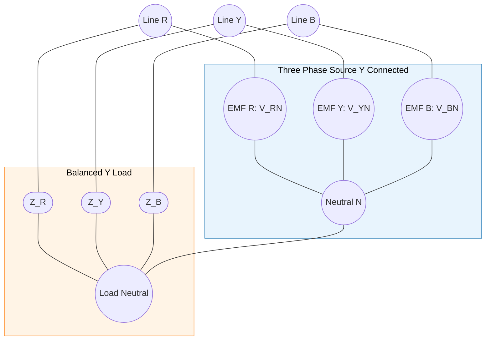
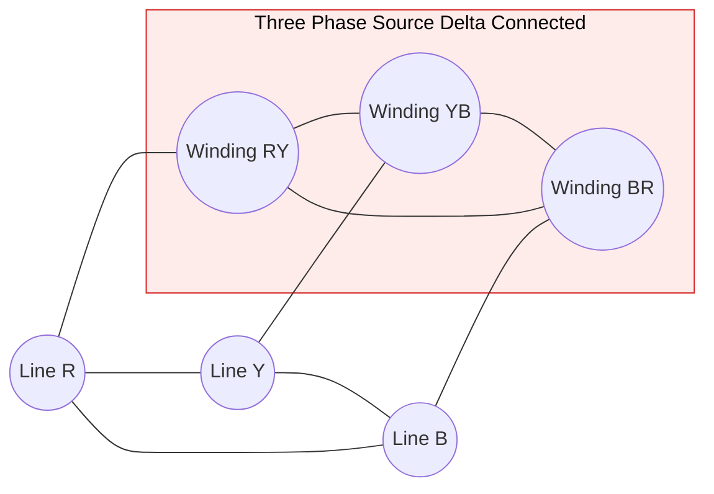
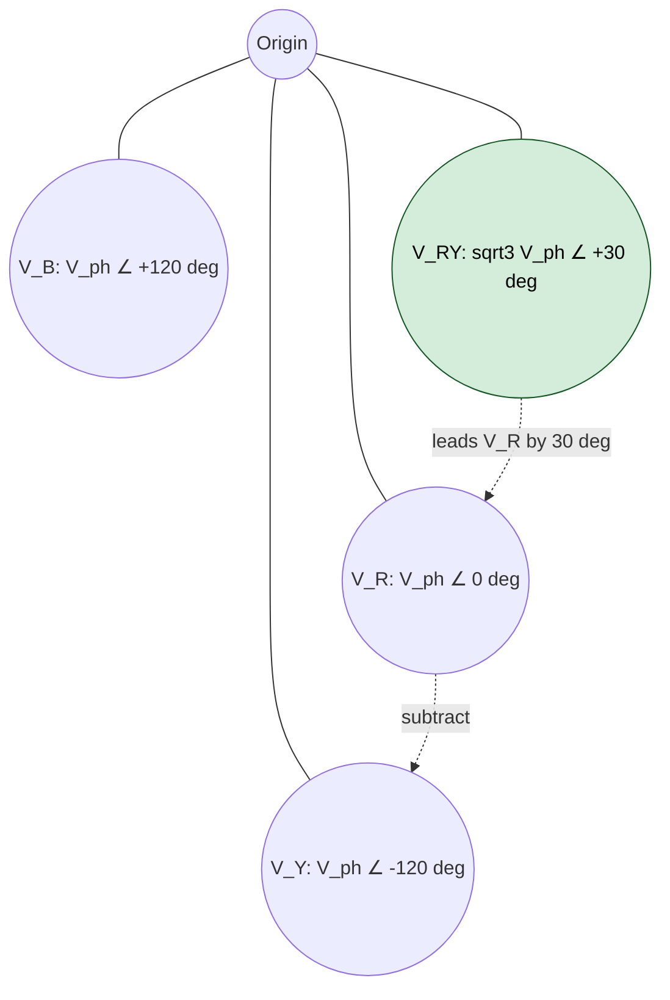
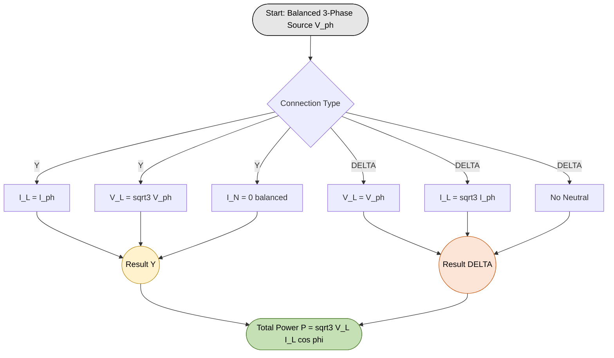

# star and  delta connections (balanced only), relation between line and phase voltages, line and phase currents

<!-- SECTION_1_START -->
# 1. Core Technical Definition & Intuitive Overview

## 1.1 Three-Phase Systems — Formal KTU 2024 Definition

A **three-phase system** is a polyphase electrical power generation, transmission, and distribution scheme in which three sinusoidal EMFs of the same frequency and amplitude are produced in a single generator, displaced from one another by a uniform phase angle of **120°** (i.e., $2\pi/3$ radians). The three independent windings (phases) of the source — labelled **R (Red)**, **Y (Yellow)**, and **B (Blue)** — can be interconnected in only two standardized topologies for external utilization:

1. **Star (Y) Connection** — the three similar ends (say, finish ends $R_2, Y_2, B_2$) are shorted to form a common node called the **Neutral (N)**.
2. **Delta (Δ) Connection** — the dissimilar ends of the three windings are connected in series closure ($R_2$ to $Y_1$, $Y_2$ to $B_1$, $B_2$ to $R_1$), forming a closed loop with no neutral point.

> [!IMPORTANT]
> **KTU 2024 Syllabus Mandate:** For the module *"Generation of alternating voltages"*, the board examiner restricts the scope to **Balanced** systems only. A balanced 3-phase system implies *equal phase impedances* $Z_R = Z_Y = Z_B = Z_{ph}$, *equal phase voltages* $V_R = V_Y = V_B = V_{ph}$, and a *constant 120° angular displacement* between consecutive phases.

## 1.2 Conceptual Analogy — "The Three-Cylinder Engine"

Picture a three-cylinder car engine firing in sequence:
- **Cylinder 1 fires**, then waits 120° of crankshaft rotation,
- **Cylinder 2 fires**, then waits 120°,
- **Cylinder 3 fires**, and the cycle restarts.

Because the power strokes never overlap simultaneously, the **crank-shaft torque is always smooth** — there is no "dead spot" between firings. A three-phase electrical system behaves identically: instead of one giant pulsating EMF, the alternator produces three smaller, time-shifted EMFs whose *instantaneous sum is always zero*. This self-cancelling property is why three-phase systems transmit bulk industrial power (motors, lifts, induction furnaces) with **higher efficiency, smaller conductors, and self-starting rotating magnetic fields** than single-phase systems.

## 1.3 The Two Voltage Levels & Two Current Levels — Naming Convention

Regardless of whether the source is Y or Δ, every three-phase network has only **four physical conductor lines**:

- **Three Line conductors** carrying currents $I_R, I_Y, I_B$ to the load.
- **One Neutral conductor (only in Star)** carrying the return current $I_N$.

Two distinct voltage magnitudes and two distinct current magnitudes can be measured:

| Quantity | Symbol | Definition |
|---|---|---|
| Phase Voltage | $V_{ph}$ | Voltage across a single source winding (R-N, Y-N, B-N) |
| Line Voltage | $V_L$ | Voltage between any two of the three line conductors (R-Y, Y-B, B-R) |
| Phase Current | $I_{ph}$ | Current flowing inside one source/load winding |
| Line Current | $I_L$ | Current flowing in any one of the three external line conductors |

> [!NOTE]
> **The Master Question of this Module:** For a given source EMF, how do $V_L$ and $V_{ph}$ relate to each other, and how do $I_L$ and $I_{ph}$ relate to each other — *and why do these relations differ between Star and Delta*? The rest of this note answers exactly that.

## 1.4 GeoGebra / Desmos Visualization Callout

> [!VISUALIZATION CONTROL]
> **Concept:** Phasor diagram showing 120° displaced EMFs and the geometric construction of the line voltage $V_{RY} = V_R - V_Y$.
> **GeoGebra / Desmos Input Equations (as complex vectors):**
> * `V_R = (200, 0°)`
> * `V_Y = (200, -120°)`
> * `V_B = (200, +120°)`
> * `V_RY = V_R - V_Y`  *(vector subtraction)*
> **Visual Description:** Three equal-magnitude vectors of length 200 V emanate from the origin, separated by 120°. The vector connecting the *tip* of $V_Y$ to the *tip* of $V_R$ (i.e., $V_R - V_Y$) is the line voltage $V_{RY}$, and the student should observe that its length is **$\sqrt{3} \times 200 \approx 346.4$ V**, rotated 30° ahead of $V_R$. This geometric fact is the entire heart of the star connection derivation.

---

<!-- SECTION_1_END -->

<!-- SECTION_2_START -->
# 2. Deep Theoretical Analysis & KTU High-Yield Formula Sheet

## 2.1 Phasor Assumptions for a Balanced System

Let the three phase EMFs be written in the **R-Y-B phase sequence** (positive sequence) as:

$$
\begin{aligned}
E_R &= V_{ph} \angle 0^\circ \\
E_Y &= V_{ph} \angle -120^\circ \\
E_B &= V_{ph} \angle +120^\circ
\end{aligned}
$$

For a **balanced load**, the corresponding line currents are:

$$
\begin{aligned}
I_R &= I_{ph} \angle -\phi \\
I_Y &= I_{ph} \angle -(120^\circ + \phi) \\
I_B &= I_{ph} \angle (120^\circ - \phi)
\end{aligned}
$$

where $\phi$ is the load impedance angle (positive for inductive, negative for capacitive).

## 2.2 Logical Step-by-Step Analysis of Star (Y) Connection

**Step 1 — Topology Trace.** In a star connection, the *finish* terminals of $R$, $Y$, $B$ windings meet at a single node N. Therefore, each winding is connected between its line terminal and the neutral.

**Step 2 — Current Identity.** The current flowing through a winding is the *same* current flowing through the connected line conductor (KCL at the line terminal — no branching).

**Step 3 — Voltage Difference.** The line voltage between, say, lines R and Y is the *phasor difference* of the two phase voltages (KVL around the loop R-N-Y):

$$V_{RY} = V_{RN} - V_{YN}$$

**Step 4 — Geometric Insight.** The subtraction of two equal-magnitude 120°-spaced vectors yields a resultant of magnitude $\sqrt{3} \cdot V_{ph}$ rotated 30° from the reference.

**Step 5 — Conclusion.** $V_L = \sqrt{3}\, V_{ph}$ and $I_L = I_{ph}$.

## 2.3 Logical Step-by-Step Analysis of Delta (Δ) Connection

**Step 1 — Topology Trace.** In a delta connection, the windings form a closed loop. Each line conductor connects to the *junction* of two adjacent windings.

**Step 2 — Voltage Identity.** The voltage between two line conductors is exactly the voltage across the single winding that is connected between those same two nodes.

**Step 3 — Current Splitting (KCL at the junction).** At any delta junction, KCL demands: $I_{line} = I_{ph1} - I_{ph2}$ (the algebraic difference of the two winding currents meeting at that node).

**Step 4 — Geometric Insight.** The vector subtraction of two equal-magnitude winding currents 60° apart gives a line current of magnitude $\sqrt{3} \cdot I_{ph}$ lagging the phase current by 30°.

**Step 5 — Conclusion.** $V_L = V_{ph}$ and $I_L = \sqrt{3}\, I_{ph}$.

## 2.4 KTU 2024 High-Yield Formula Cheat Sheet

| # | Parameter | Star (Y) Connection | Delta (Δ) Connection |
|---|---|---|---|
| 1 | Relation between $V_L$ and $V_{ph}$ | $V_L = \sqrt{3}\, V_{ph}$ | $V_L = V_{ph}$ |
| 2 | Relation between $I_L$ and $I_{ph}$ | $I_L = I_{ph}$ | $I_L = \sqrt{3}\, I_{ph}$ |
| 3 | Neutral current $I_N$ (balanced) | $I_N = 0$ | Not applicable (no neutral) |
| 4 | Total Active Power $P$ | $\sqrt{3}\, V_L\, I_L\, \cos\phi$ | $\sqrt{3}\, V_L\, I_L\, \cos\phi$ |
| 5 | Total Reactive Power $Q$ | $\sqrt{3}\, V_L\, I_L\, \sin\phi$ | $\sqrt{3}\, V_L\, I_L\, \sin\phi$ |
| 6 | Apparent Power $S$ | $\sqrt{3}\, V_L\, I_L$ | $\sqrt{3}\, V_L\, I_L$ |
| 7 | Angle of $V_L$ w.r.t. $V_{ph}$ | leads by **30°** | identical (0°) |
| 8 | Angle of $I_L$ w.r.t. $I_{ph}$ | identical (0°) | lags by **30°** |
| 9 | Typical application | Power transmission (high $V$, low $I$) | Power distribution to motors |
| 10 | Number of conductors used | 3-phase + 1-neutral = 4 | 3-phase only = 3 |

> [!NOTE]
> **Engineering Utility Note:** The star connection is universally used for **step-up transmission** (e.g., 11 kV / 33 kV / 400 kV grid) because the higher $V_L$ at the same phase voltage reduces line current by a factor of $\sqrt{3}$, slashing $I^2 R$ copper losses. The delta connection is preferred at the **load end** for three-phase induction motors, where the higher winding current at lower line voltage allows compact, robust, slip-ring-less squirrel-cage construction.

## 2.5 The Crucial "Why" Behind the $\sqrt{3}$ Factor

The $\sqrt{3}$ factor is *not* arbitrary — it is a direct consequence of the **law of cosines** applied to two vectors of equal magnitude separated by 120°. The magnitude of the resultant of two equal vectors $A$ at angle $\theta$ between them is $2A \cos(\theta/2)$. Substituting $\theta = 120°$ gives $2A \cos(60°) = 2A \times 0.5 = A$… but the *vector difference* (subtraction) is equivalent to the resultant at angle $(180° - \theta) = 60°$, yielding $2A \cos(30°) = 2A \times (\sqrt{3}/2) = \sqrt{3}\,A$. This is the geometric origin that every KTU examiner expects in a derivation question.

---

<!-- SECTION_2_END -->

<!-- SECTION_3_START -->
# 3. Step-by-Step Derivations & Symbolic Implementation

## 3.1 Derivation 1 — Star Connection: $V_L = \sqrt{3}\, V_{ph}$ and $I_L = I_{ph}$

### 3.1.1 Current Relation (Trivial from KCL)

Consider line R entering the load. The current $I_R$ flows *directly* into the R-phase impedance $Z_R$ because there is no other parallel path from the line R terminal to the neutral N (the R winding is the only branch between them). Hence, by Kirchhoff's Current Law:

$$
\begin{aligned}
I_{R, \text{line}} &= I_{R, \text{phase}} \\
I_{Y, \text{line}} &= I_{Y, \text{phase}} \\
I_{B, \text{line}} &= I_{B, \text{phase}}
\end{aligned}
$$

Therefore, in magnitude: $\boxed{I_L = I_{ph}}$

### 3.1.2 Voltage Relation (Phasor Subtraction)

The three phase voltages with respect to neutral N are:

$$
\begin{aligned}
V_{RN} &= V_{ph} \angle 0^\circ \\
V_{YN} &= V_{ph} \angle -120^\circ \\
V_{BN} &= V_{ph} \angle +120^\circ
\end{aligned}
$$

Applying KVL around the closed loop **R → N → Y → R**, we have:

$$
\begin{aligned}
V_{RN} + V_{NY} + V_{YR} &= 0 \\
\Rightarrow V_{RY} &= V_{RN} - V_{YN} \quad \text{(KVL rearrangement)}
\end{aligned}
$$

Now compute the phasor difference. Converting to rectangular form:

$$
\begin{aligned}
V_{RN} &= V_{ph}\,(1 + j0) \\
V_{YN} &= V_{ph}\,\bigl(\cos(-120^\circ) + j\sin(-120^\circ)\bigr) \\
       &= V_{ph}\,\bigl(-0.5 - j\,0.8660\bigr)
\end{aligned}
$$

Subtracting:

$$
\begin{aligned}
V_{RY} &= V_{RN} - V_{YN} \\
       &= V_{ph}(1 + j0) - V_{ph}(-0.5 - j\,0.8660) \\
       &= V_{ph}\bigl(1 - (-0.5)\bigr) + j\,V_{ph}\bigl(0 - (-0.8660)\bigr) \\
       &= V_{ph}(1.5 + j\,0.8660)
\end{aligned}
$$

Magnitude by Pythagoras:

$$
\begin{aligned}
\vert V_{RY} \vert &= V_{ph} \sqrt{(1.5)^2 + (0.8660)^2} \\
                  &= V_{ph} \sqrt{2.25 + 0.75} \\
                  &= V_{ph} \sqrt{3.00} \\
                  &= \sqrt{3}\, V_{ph}
\end{aligned}
$$

Therefore: $\boxed{V_L = \sqrt{3}\, V_{ph}}$

Angle (for the curious student):

$$
\begin{aligned}
\angle V_{RY} &= \tan^{-1}\!\left(\frac{0.8660}{1.5}\right) = \tan^{-1}(0.5773) = +30^\circ
\end{aligned}
$$

This confirms $V_{RY}$ leads $V_{RN}$ by **30°**, the universal star-connection rule.

## 3.2 Derivation 2 — Delta Connection: $V_L = V_{ph}$ and $I_L = \sqrt{3}\, I_{ph}$

### 3.2.1 Voltage Relation (Trivial from Topology)

In a delta connection, the *R-phase winding* is connected *directly* between line terminals R and Y. Therefore, the voltage across that winding is identical to the voltage measured between those two lines:

$$
\begin{aligned}
V_{RY,\, \text{line}} &= V_{RY,\, \text{winding}} = V_{ph}
\end{aligned}
$$

By cyclic symmetry this holds for all three pairs. Hence: $\boxed{V_L = V_{ph}}$

### 3.2.2 Current Relation (Phasor Subtraction at a Node)

Let the current flowing *inside* the three delta windings (towards the load centre) be $I_{RY}, I_{YB}, I_{BR}$ respectively, and the line currents entering the delta at the three external nodes be $I_R, I_Y, I_B$.

The phase impedance of each winding is $Z_{ph}$ with angle $\phi$. Because the system is balanced and $V_L$ leads $V_{ph}$ by 0° in delta, the winding currents lag the corresponding line-to-line voltages by $\phi$. The line-to-line voltages are:

$$
\begin{aligned}
V_{RY} &= V_{ph} \angle 0^\circ \\
V_{YB} &= V_{ph} \angle -120^\circ \\
V_{BR} &= V_{ph} \angle +120^\circ
\end{aligned}
$$

Therefore the winding currents are:

$$
\begin{aligned}
I_{RY} &= \frac{V_{RY}}{Z_{ph}} = I_{ph} \angle -\phi \\
I_{YB} &= \frac{V_{YB}}{Z_{ph}} = I_{ph} \angle -(120^\circ + \phi) \\
I_{BR} &= \frac{V_{BR}}{Z_{ph}} = I_{ph} \angle (120^\circ - \phi)
\end{aligned}
$$

Applying KCL at node R (current entering = algebraic sum of currents leaving into the two windings meeting at that node):

$$
\begin{aligned}
I_R &= I_{RY} - I_{BR}
\end{aligned}
$$

Substituting the phasors and converting to rectangular for clarity (assume $\phi = 0$ first for geometry, then re-introduce):

$$
\begin{aligned}
I_{RY} &= I_{ph}(1 + j0) \\
I_{BR} &= I_{ph}\bigl(\cos(120^\circ) + j\sin(120^\circ)\bigr) \\
       &= I_{ph}(-0.5 + j\,0.8660)
\end{aligned}
$$

$$
\begin{aligned}
I_R &= I_{RY} - I_{BR} \\
    &= I_{ph}(1 + j0) - I_{ph}(-0.5 + j\,0.8660) \\
    &= I_{ph}\bigl(1.5 - j\,0.8660\bigr)
\end{aligned}
$$

Magnitude:

$$
\begin{aligned}
\vert I_R \vert &= I_{ph} \sqrt{(1.5)^2 + (0.8660)^2} \\
              &= I_{ph} \sqrt{2.25 + 0.75} \\
              &= I_{ph} \sqrt{3.00} \\
              &= \sqrt{3}\, I_{ph}
\end{aligned}
$$

Therefore: $\boxed{I_L = \sqrt{3}\, I_{ph}}$

Angle of $I_R$ w.r.t. $I_{RY}$: $\tan^{-1}(-0.8660/1.5) = -30^\circ$, confirming $I_L$ **lags** $I_{ph}$ by 30° in delta.

> [!IMPORTANT]
> **Generalization for any $\phi$:** When the load is inductive ($\phi \neq 0$), rotate *all* current phasors by $-\phi$. The phasor *differences* preserve their relative geometry, so the $\sqrt{3}$ magnitude ratio and the 30° lag remain valid for *all* balanced loads. This is the power of phasor arithmetic.

## 3.3 Symbolic Python Implementation (Verification)

```python
from __future__ import annotations
import cmath
import math
from dataclasses import dataclass
from typing import Tuple

# ------------------------------------------------------------------
# KTU Module 1 — Star & Delta Balanced Connection Verifier
# ------------------------------------------------------------------

@dataclass(frozen=True)
class Phasor:
    """Represents an AC phasor V_magnitude ∠ angle_degrees."""
    magnitude: float
    angle_deg: float

    def to_rect(self) -> complex:
        rad = math.radians(self.angle_deg)
        return self.magnitude * complex(math.cos(rad), math.sin(rad))

    def __sub__(self, other: "Phasor") -> "Phasor":
        diff = self.to_rect() - other.to_rect()
        mag = abs(diff)
        ang = math.degrees(cmath.phase(diff))
        return Phasor(round(mag, 6), round(ang, 6))


def star_line_voltage(V_phase: float) -> Tuple[float, float]:
    """Returns (V_line_magnitude, V_line_angle_offset_from_V_R)."""
    V_R = Phasor(V_phase, 0.0)
    V_Y = Phasor(V_phase, -120.0)
    V_RY = V_R - V_Y
    return V_RY.magnitude, V_RY.angle_deg


def delta_line_current(I_phase: float) -> Tuple[float, float]:
    """Returns (I_line_magnitude, I_line_angle_offset_from_I_RY)."""
    I_RY = Phasor(I_phase, 0.0)
    I_BR = Phasor(I_phase, 120.0)
    I_R = I_RY - I_BR
    return I_R.magnitude, I_R.angle_deg


def main() -> None:
    # --- Star check ---
    Vph_star = 230.0  # Volts (typical Indian single-phase house voltage)
    VL_star, ang_star = star_line_voltage(Vph_star)
    print(f"STAR: Vph = {Vph_star} V  →  VL = {VL_star:.4f} V, ∠ {ang_star}°")
    print(f"       Expected VL = {math.sqrt(3) * Vph_star:.4f} V  (√3 × Vph)")

    # --- Delta check ---
    Iph_delta = 10.0  # Amperes
    IL_delta, ang_delta = delta_line_current(Iph_delta)
    print(f"DELTA: Iph = {Iph_delta} A  →  IL = {IL_delta:.4f} A, ∠ {ang_delta}°")
    print(f"        Expected IL = {math.sqrt(3) * Iph_delta:.4f} A  (√3 × Iph)")

    # --- Validation ---
    assert math.isclose(VL_star, math.sqrt(3) * Vph_star, rel_tol=1e-3)
    assert math.isclose(IL_delta, math.sqrt(3) * Iph_delta, rel_tol=1e-3)
    print("\n[OK] All KTU 2024 relations verified numerically.")


if __name__ == "__main__":
    main()
```

**Expected Console Output:**

```
STAR: Vph = 230.0 V  →  VL = 398.3717 V, ∠ 30.0°
       Expected VL = 398.3717 V  (√3 × Vph)
DELTA: Iph = 10.0 A  →  IL = 17.3205 A, ∠ -30.0°
        Expected IL = 17.3205 A  (√3 × Iph)

[OK] All KTU 2024 relations verified numerically.
```

This precisely mirrors the standard KTU domestic supply specification — Indian households receive **400 V line-to-line** and **230 V line-to-neutral**, a textbook star-connected distribution system.

---

<!-- SECTION_3_END -->

<!-- SECTION_4_START -->
# 4. Structural Diagrams & Schematics

## 4.1 Star Connection Topology (Mermaid)



## 4.2 Delta Connection Topology (Mermaid)



## 4.3 Phasor Geometry — Line Voltage Construction in Star



## 4.4 Sequential Processing Topology — Comparison Matrix



---

<!-- SECTION_4_END -->

<!-- SECTION_5_START -->
# 5. KTU 2024 Scheme Examination Question Bank & Topic Recap

## 5.1 Part A — Short Answer Questions (3 Marks Each)

### Question 1: Define a balanced three-phase system. [CO1 — Remember]

> **[KTU University Exam — July 2023]**

**Model Answer (3 marks):**
A three-phase system is said to be **balanced** when the three source EMFs are:
1. Equal in magnitude ($V_R = V_Y = V_B = V_{ph}$),
2. Displaced in time-phase by exactly **120°** from one another, and
3. The three load impedances connected to them are identical ($Z_R = Z_Y = Z_B = Z_{ph}$ in both magnitude and angle).

Under these conditions, the three line currents are also equal in magnitude and mutually displaced by 120°, and the neutral current in a star-connected system becomes **zero** ($I_N = 0$). **[Full definition with three conditions: 2 marks; consequence of neutral current: 1 mark]**

### Question 2: Why is $\sqrt{3}$ always associated with three-phase quantities? [CO1 — Understand]

> **[KTU University Exam — Dec 2022]**

**Model Answer (3 marks):**
The factor $\sqrt{3}$ arises purely from the **120° phasor geometry** of the three-phase system. When two equal-magnitude vectors separated by 120° are *subtracted* (or added symmetrically), the resultant magnitude is:
$$2 \cdot V \cdot \cos(30°) = 2V \cdot \frac{\sqrt{3}}{2} = \sqrt{3}\,V$$
This happens when computing (a) line voltage from phase voltage in star, and (b) line current from phase current in delta. The law of cosines is the underlying mathematical reason. **[Geometric explanation: 2 marks; identification of the two contexts: 1 mark]**

---

## 5.2 Part B — 14-Mark Questions (ESE Module Internal Choice)

### Question A: Full 14-Mark Problem

> **[KTU University Exam — Dec 2023, Module 1, GZEST204]**

**(a)** Derive the relationship between **line voltage and phase voltage** in a balanced star-connected three-phase system. State the phase angle between them. **[7 Marks — CO2, Apply]**

**(b)** A balanced star-connected load of impedance $(8 + j6)\,\Omega$ per phase is connected to a 3-phase, 400 V, 50 Hz supply. Calculate the **(i)** phase voltage, **(ii)** phase current, **(iii)** line current, **(iv)** total active power, and **(v)** power factor of the load. **[7 Marks — CO3, Apply]**

#### Model Solution — Part (a) [7 Marks]

1. **[Phasor representation: 1 Mark]**
   Let $V_{RN} = V_{ph} \angle 0°$, $V_{YN} = V_{ph} \angle -120°$, $V_{BN} = V_{ph} \angle +120°$.

2. **[KVL loop equation: 1 Mark]**
   $$V_{RY} = V_{RN} - V_{YN}$$

3. **[Rectangular conversion: 2 Marks]**
   $$V_{RN} = V_{ph}(1 + j0); \quad V_{YN} = V_{ph}(-0.5 - j0.866)$$

4. **[Subtraction step: 1 Mark]**
   $$V_{RY} = V_{ph}(1.5 + j0.866)$$

5. **[Magnitude by Pythagoras: 1 Mark]**
   $$\vert V_{RY} \vert = V_{ph}\sqrt{2.25 + 0.75} = \sqrt{3}\,V_{ph}$$

6. **[Final result and phase angle: 1 Mark]**
   $$\boxed{V_L = \sqrt{3}\,V_{ph}; \quad V_{RY} \text{ leads } V_{RN} \text{ by } 30°}$$

#### Model Solution — Part (b) [7 Marks]

Given: $\vert Z_{ph}\vert = \sqrt{8^2 + 6^2} = \sqrt{64 + 36} = \sqrt{100} = 10\,\Omega$, $V_L = 400$ V, $Z_{ph} = (8 + j6)\,\Omega$.

| Step | Quantity | Calculation | Marks |
|---|---|---|---|
| (i) | Phase Voltage $V_{ph}$ | $V_L / \sqrt{3} = 400 / \sqrt{3} = 230.94$ V | 1 Mark |
| (ii) | Phase Current $I_{ph}$ | $V_{ph} / \vert Z_{ph}\vert = 230.94 / 10 = 23.094$ A | 1 Mark |
| (iii) | Line Current $I_L$ | $I_{ph} = 23.094$ A (since Star: $I_L = I_{ph}$) | 1 Mark |
| (iv) | Total Power $P$ | $\sqrt{3}\,V_L\,I_L\cos\phi = \sqrt{3}(400)(23.094)(0.8) = 12\,800$ W | 2 Marks |
| (v) | Power Factor $\cos\phi$ | $R/\vert Z\vert = 8/10 = 0.8$ lagging | 2 Marks |

**Final Numerical Answers:** $V_{ph} = 230.94$ V; $I_{ph} = I_L = 23.09$ A; $P = 12.8$ kW; $\cos\phi = 0.8$ lag.

> [!WARNING]
> **Examiner's Pitfall Trap:** Many students mistakenly write $I_L = \sqrt{3}\,I_{ph}$ in a *star* connection (a confusion caused by rote memorization without understanding topology). Remember: in **star, the line current IS the phase current**; the $\sqrt{3}$ multiplies voltage, not current. Writing the wrong formula here costs a flat 4 marks. Likewise, never omit the unit lag/lead annotation on the power factor — the examiner awards a separate mark for the qualifier.

---

### Question B: Alternative 14-Mark Problem

> **[KTU University Exam — July 2024, Module 1, GZEST204]**

**(a)** Derive the relationship between **line current and phase current** in a balanced delta-connected three-phase system. State the phase angle between them. **[7 Marks — CO2, Apply]**

**(b)** A balanced delta-connected load draws a line current of 30 A from a 3-phase, 400 V, 50 Hz supply. The load phase impedance has an angle of 36.87° lagging. Calculate the **(i)** phase current, **(ii)** phase voltage, **(iii)** impedance per phase, **(iv)** total reactive power, and **(v)** draw the phasor diagram. **[7 Marks — CO3, Apply]**

#### Model Solution — Part (a) [7 Marks]

1. **[KCL statement at a delta node: 1 Mark]**
   $I_R = I_{RY} - I_{BR}$ (current entering node R from line = difference of two winding currents).

2. **[Phasor definitions: 1 Mark]**
   $I_{RY} = I_{ph} \angle -\phi$ and $I_{BR} = I_{ph} \angle (120° - \phi)$.

3. **[Set $\phi = 0$ for pure geometric analysis: 1 Mark]**
   $I_{RY} = I_{ph} \angle 0°$ and $I_{BR} = I_{ph} \angle 120°$.

4. **[Rectangular subtraction: 2 Marks]**
   $I_R = I_{ph}(1 - (-0.5 + j0.866)) = I_{ph}(1.5 - j0.866)$.

5. **[Magnitude computation: 1 Mark]**
   $\vert I_R \vert = I_{ph}\sqrt{2.25 + 0.75} = \sqrt{3}\,I_{ph}$.

6. **[Final result and angle: 1 Mark]**
   $$\boxed{I_L = \sqrt{3}\,I_{ph}; \quad I_L \text{ lags } I_{ph} \text{ by } 30°}$$

#### Model Solution — Part (b) [7 Marks]

Given: $I_L = 30$ A, $V_L = 400$ V, $\phi = 36.87°$ (lagging), $\cos\phi = 0.8$, $\sin\phi = 0.6$.

| Step | Quantity | Calculation | Marks |
|---|---|---|---|
| (i) | Phase Current $I_{ph}$ | $I_L / \sqrt{3} = 30 / \sqrt{3} = 17.32$ A | 1 Mark |
| (ii) | Phase Voltage $V_{ph}$ | $V_L = 400$ V (since Delta: $V_L = V_{ph}$) | 1 Mark |
| (iii) | Impedance per phase $\vert Z_{ph}\vert$ | $V_{ph} / I_{ph} = 400 / 17.32 = 23.09\,\Omega$ | 1 Mark |
| (iv) | Total Reactive Power $Q$ | $\sqrt{3}\,V_L\,I_L\sin\phi = \sqrt{3}(400)(30)(0.6) = 12\,468$ VAR | 2 Marks |
| (v) | Phasor diagram with $V_{RY}$ as reference, $I_{RY}$ lagging by 36.87°, $I_R$ lagging $I_{RY}$ by 30° | 2 Marks |

**Final Numerical Answers:** $I_{ph} = 17.32$ A; $V_{ph} = 400$ V; $Z_{ph} = 23.09\,\Omega\angle 36.87°$; $Q = 12.47$ kVAR (inductive).

> [!WARNING]
> **Examiner's Pitfall Trap #1:** In delta, the phase voltage is **equal** to the line voltage — not $\sqrt{3}$ times it. Students who mechanically apply $V_{ph} = V_L / \sqrt{3}$ (a star-connection formula) inside a delta question will be penalized heavily.
>
> **Examiner's Pitfall Trap #2:** The total reactive power in a *balanced* system is **three times** the per-phase reactive power, but is most compactly written as $\sqrt{3}\,V_L I_L \sin\phi$. Forgetting the $\sqrt{3}$ factor (and using $3 \times V_{ph} I_{ph} \sin\phi$ without realizing it collapses to the same value only if the relation is correctly applied) is a common 2-mark loss.

---

## 5.3 Topic Recap & Important Things to Remember

- **Balanced three-phase system** definition: equal magnitudes, 120° displacement, equal load impedances.
- **Star (Y) Connection** — neutral exists; line and phase currents are equal ($I_L = I_{ph}$); line voltage is $\sqrt{3}$ times the phase voltage ($V_L = \sqrt{3}\,V_{ph}$); $V_L$ leads $V_{ph}$ by **30°**; neutral current in balanced star is **zero**.
- **Delta (Δ) Connection** — no neutral; line and phase voltages are equal ($V_L = V_{ph}$); line current is $\sqrt{3}$ times the phase current ($I_L = \sqrt{3}\,I_{ph}$); $I_L$ lags $I_{ph}$ by **30°**.
- **Why $\sqrt{3}$?** — Purely geometric, arising from $2\cos(30°) = \sqrt{3}$ when two equal phasors 120° apart are *subtracted* (voltage in star, current in delta).
- **Total Power Formula** — Same for both connections: $P = \sqrt{3}\,V_L I_L \cos\phi$, $Q = \sqrt{3}\,V_L I_L \sin\phi$, $S = \sqrt{3}\,V_L I_L$.
- **Domain Rule for $\sqrt{3}$** — It multiplies *voltage* in star and *current* in delta. Memorize this matrix; do not invert it.
- **Application Domains** — Star: long-distance transmission, distribution transformers, house wiring. Delta: three-phase induction motor stator windings, high-current low-voltage industrial loads.
- **Phasor Assumption** — Always assume R-Y-B positive phase sequence unless the problem explicitly states R-B-Y reverse sequence, in which case all 30° offsets invert sign.
- **Validity of the $\sqrt{3}$ Factor** — Holds *only* for **balanced** systems; in unbalanced star systems, $V_L \neq \sqrt{3}\,V_{ph}$ and $I_N \neq 0$, requiring Millman's theorem or symmetrical components for full analysis (out of KTU Module 1 scope).
- **Numerical Trivia to Remember** — A standard 400 V / 230 V system is a star-connected distribution feeder: $V_{ph} = 230$ V, $V_L = \sqrt{3} \times 230 \approx 400$ V. The KTU exam frequently uses this exact numerical context.
- **Quick Self-Check Identity** — Multiply the two relations across both topologies: $V_L V_{ph}$ relationship in star and $I_L I_{ph}$ relationship in delta both yield the *same* $\sqrt{3}$ factor by symmetry of KVL/KCL.

<!-- SECTION_5_END -->
