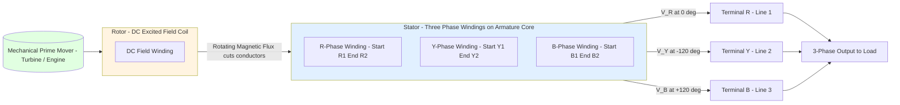
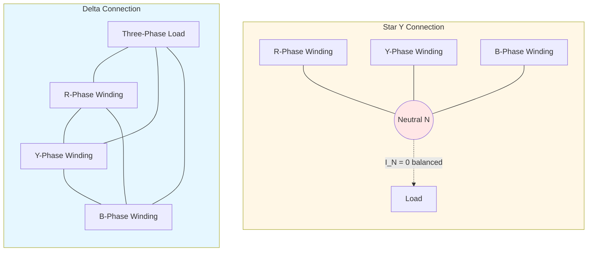
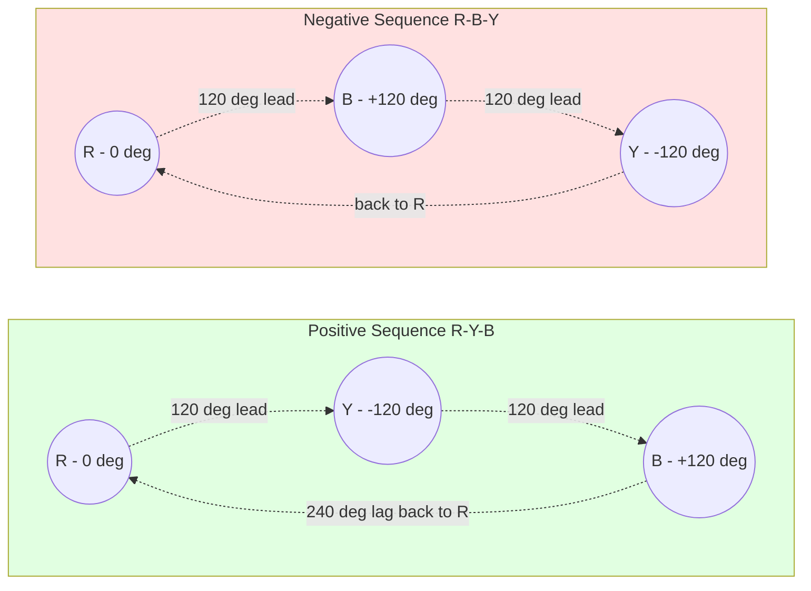
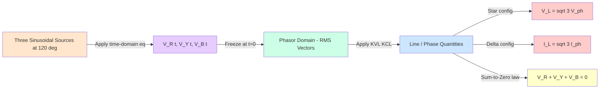

# Three phase AC systems : Representation of three phase voltages

<!-- SECTION_1_START -->

# Three Phase AC Systems: Representation of Three Phase Voltages

## 1.1 Formal Definition (KTU 2024 Syllabus Terminology)

> [!IMPORTANT]
> **Three-Phase AC System:** A polyphase system in which three sinusoidal alternating voltages (or currents) of **equal magnitude**, **equal frequency**, and displaced from each other by a **phase angle of 120°** (i.e., $\frac{2\pi}{3}$ radians) are generated, transmitted, and utilized.

A three-phase system uses **three separate windings** (phases) physically displaced by 120° in space on the armature of an AC generator (alternator). These three windings are labelled as:

- **R-phase (Red)** — Reference phase
- **Y-phase (Yellow)** — Lags R by 120°
- **B-phase (Blue)** — Lags R by 240° (or leads by 120°)

> [!NOTE]
> **Key Distinction (KTU Board Favourite):**
> - **Single-phase** AC has ONE sinusoidal voltage source.
> - **Three-phase** AC has THREE sinusoidal voltage sources mutually displaced by 120°.

The instantaneous expression of the three-phase voltages is:

$$V_R(t) = V_m \sin(\omega t)$$

$$V_Y(t) = V_m \sin\left(\omega t - \frac{2\pi}{3}\right) = V_m \sin(\omega t - 120°)$$

$$V_B(t) = V_m \sin\left(\omega t - \frac{4\pi}{3}\right) = V_m \sin(\omega t + 120°)$$

where $V_m$ is the **maximum (peak) value** in Volts, and $\omega = 2\pi f$ is the **angular frequency** in **rad/s**.

## 1.2 Conceptual Analogy — The "Three-Powerful-Friends" Generator

> [!TIP]
> **Imagine three friends (R, Y, B) pushing a heavy merry-go-round (rotor) at exactly the same strength, but each friend starts pushing 1/3rd of a rotation later than the previous one.** Because they are spaced evenly, the merry-go-round never stops or jerks — it always has smooth, continuous torque.

- **R** starts pushing at the "12 o'clock" position.
- **Y** starts pushing when R is at the "4 o'clock" position (120° later).
- **B** starts pushing when R is at the "8 o'clock" position (240° later).

This is **exactly** how a three-phase alternator works. The result is a **constant, pulsation-free power delivery** — the biggest engineering reason why three-phase systems dominate power generation, transmission, and industrial motors worldwide.

## 1.3 Phasor & Complex (Rectangular) Representation

For steady-state analysis, sinusoidal quantities are converted to **rotating phasors** (frozen at $t=0$). Representing each phase as a phasor in RMS form:

$$\bar{V_R} = V_p \angle 0°$$

$$\bar{V_Y} = V_p \angle -120°$$

$$\bar{V_B} = V_p \angle -240° = V_p \angle +120°$$

where $V_p = \frac{V_m}{\sqrt{2}}$ is the **RMS phase voltage** in **Volts**.

Converting to **rectangular (complex) form** using $e^{\pm j\theta} = \cos\theta \pm j\sin\theta$:

$$\bar{V_R} = V_p(1 + j0)$$

$$\bar{V_Y} = V_p\left(-\frac{1}{2} - j\frac{\sqrt{3}}{2}\right)$$

$$\bar{V_B} = V_p\left(-\frac{1}{2} + j\frac{\sqrt{3}}{2}\right)$$

## 1.4 Geometric Visualization via GeoGebra

> [!VISUALIZATION CONTROL]
> **Concept:** Three-phase voltage phasor diagram on the complex plane.
> **GeoGebra Input Equations (paste in GeoGebra "Algebra" input bar):**
> * `VR = (1, 0)`  — point on positive x-axis
> * `VY = (-1/2, -sqrt(3)/2)` — point in 3rd quadrant at -120°
> * `VB = (-1/2, sqrt(3)/2)` — point in 2nd quadrant at +120°
> * `Vector((0,0),(1,0))` — Phasor VR (Red)
> * `Vector((0,0),(-1/2,-sqrt(3)/2))` — Phasor VY (Yellow)
> * `Vector((0,0),(-1/2,sqrt(3)/2))` — Phasor VB (Blue)
> * `Circle((0,0),1)` — Unit reference circle
>
> **Visual Description:** The student should observe **three equal-length arrows** radiating from the origin, each separated by exactly **120°**, forming a perfectly symmetric "Mercedes-Benz" three-pointed star. The three phasor tips must lie on a common circle of radius $V_p$.

## 1.5 Why Three-Phase? (Engineering Utility)

> [!IMPORTANT]
> - **Constant Power:** Instantaneous total power in a balanced 3-phase system is **constant** (time-invariant) — ideal for running heavy industrial loads without torque pulsations.
> - **Self-Starting Motors:** 3-phase induction motors are **self-starting**, whereas single-phase induction motors need auxiliary windings.
> - **Economy of Conductors:** Three-phase transmission uses **3 (or 4) conductors** instead of 6 for delivering equivalent single-phase power.
> - **Higher Power Density:** For the same frame size, a 3-phase motor delivers roughly **1.5× more power** than a single-phase motor.

<!-- SECTION_1_END -->

<!-- SECTION_2_START -->

# Deep Theoretical Analysis & KTU High-Yield Formula Sheet

## 2.1 Phase Sequence — The Direction of Rotation

> [!NOTE]
> **Phase Sequence** is the time-order in which the three phase voltages attain their **maximum positive values**. It determines the **direction of rotation of the rotor** in a 3-phase induction motor.

There are **only two valid sequences**:

| Sequence Type | Order of Peak Voltages | Rotation Direction |
|---|---|---|
| **R-Y-B (Positive / ABC sequence)** | R → Y → B | **Anti-clockwise (ACW)** |
| **R-B-Y (Negative / ACB sequence)** | R → B → Y | **Clockwise (CW)** |

Swapping any **two phases** (e.g., Y and B) **reverses** the sequence and hence the motor's rotation.

## 2.2 Two Standard Connection Topologies

The three-phase windings can be interconnected in **two fundamental ways**:

### 2.2.1 Star (Y) Connection
- One end of each of the three phase windings is joined at a **common point called the NEUTRAL (N)**.
- The other three ends are brought out as **line conductors** (R, Y, B).
- The voltage between any **line** and the **neutral** is called the **Phase Voltage ($V_{ph}$)**.
- The voltage between any **two lines** is called the **Line Voltage ($V_L$)**.

### 2.2.2 Delta ($\Delta$) Connection
- The **end of one phase** is connected to the **start of the next phase**, forming a closed loop (R-Y, Y-B, B-R).
- **No neutral point** exists in a pure delta system.
- The voltage across each phase winding **equals** the voltage between any two lines.

## 2.3 KTU High-Yield Formula Cheat Sheet

> [!IMPORTANT]
> **All formulas below are HIGH-FREQUENCY KTU Board Exam questions (Mod-1). Memorize the derivation logic, not just the result.**

| # | Quantity | Star (Y) Connection | Delta ($\Delta$) Connection | Units |
|:---:|---|---|---|:---:|
| 1 | Relationship between $V_L$ and $V_{ph}$ | $V_L = \sqrt{3} \cdot V_{ph}$ | $V_L = V_{ph}$ | **Volts (V)** |
| 2 | Relationship between $I_L$ and $I_{ph}$ | $I_L = I_{ph}$ | $I_L = \sqrt{3} \cdot I_{ph}$ | **Amperes (A)** |
| 3 | Total Active Power ($P$) | $\sqrt{3} \cdot V_L \cdot I_L \cdot \cos\phi$ | $\sqrt{3} \cdot V_L \cdot I_L \cdot \cos\phi$ | **Watts (W)** |
| 4 | Total Reactive Power ($Q$) | $\sqrt{3} \cdot V_L \cdot I_L \cdot \sin\phi$ | $\sqrt{3} \cdot V_L \cdot I_L \cdot \sin\phi$ | **VAR** |
| 5 | Total Apparent Power ($S$) | $\sqrt{3} \cdot V_L \cdot I_L$ | $\sqrt{3} \cdot V_L \cdot I_L$ | **VA** |
| 6 | Neutral Current (Balanced) | $I_N = 0$ | **N/A** (No neutral) | **A** |
| 7 | Phasor of $\bar{V_{RY}}$ w.r.t. $\bar{V_R}$ | Leads by **30°** | Same as phase voltage | deg |
| 8 | Number of conductors used | **3 or 4** (with N) | **3 only** | — |

> [!WARNING]
> **Critical Sign Convention (KTU Pitfall):** The formula $V_L = \sqrt{3} V_{ph}$ is derived under the **assumption of a balanced system with R-Y-B (positive) phase sequence**. Reversing sequence does NOT change the magnitude $\sqrt{3}$ factor, but it shifts the line voltage phasor angles by **30° in the opposite direction**.

## 2.4 Phasor Addition — The Underlying Logic

The three phasors form a **closed triangle** because they sum to zero:

$$\bar{V_R} + \bar{V_Y} + \bar{V_B} = 0$$

This is because they are **three vectors of equal magnitude separated by 120°** — placing them head-to-tail geometrically closes the triangle. This is the **mathematical heart** of why $V_L = \sqrt{3} V_{ph}$ in a star connection.

## 2.5 Real-World Engineering Utility

> [!TIP]
> - **Star (Y):** Used in **long-distance power transmission**, in the **secondary distribution side** of transformers, and for supplying **single-phase loads** (via neutral) alongside three-phase loads. Example: 11 kV / 400 V distribution transformer secondary.
> - **Delta ($\Delta$):** Used in **industrial motor windings** for high starting torque, in **transmission lines** for reduced insulation (no neutral), and at the **primary side of distribution transformers** for handling high currents.
> - **Indian Standard Frequencies:** **$f = 50$ Hz** (KTU standard) with $\omega = 2\pi f = 314.159$ **rad/s**.

<!-- SECTION_2_END -->

<!-- SECTION_3_START -->

# Step-by-Step Derivations & Symbolic Implementation

## 3.1 Derivation 1: Line Voltage in Star Connection ($V_L = \sqrt{3} V_{ph}$)

**Given:** A balanced star-connected system with phase voltages (line-to-neutral):

$$\bar{V_R} = V_p \angle 0° = V_p(1 + j0)$$

$$\bar{V_Y} = V_p \angle -120° = V_p\left(-\frac{1}{2} - j\frac{\sqrt{3}}{2}\right)$$

$$\bar{V_B} = V_p \angle +120° = V_p\left(-\frac{1}{2} + j\frac{\sqrt{3}}{2}\right)$$

**To find:** The line voltage $\bar{V_{RY}}$ (voltage between line R and line Y).

**Step 1 — Write the line voltage using Kirchhoff's Voltage Law (KVL):**

$$\bar{V_{RY}} = \bar{V_R} - \bar{V_Y}$$

**Step 2 — Substitute the complex phasor expressions:**

$$\bar{V_{RY}} = V_p(1 + j0) - V_p\left(-\frac{1}{2} - j\frac{\sqrt{3}}{2}\right)$$

**Step 3 — Expand and collect real and imaginary parts:**

$$\bar{V_{RY}} = V_p\left[1 + \frac{1}{2} + j\frac{\sqrt{3}}{2}\right]$$

$$\bar{V_{RY}} = V_p\left[\frac{3}{2} + j\frac{\sqrt{3}}{2}\right]$$

**Step 4 — Compute the magnitude using $|a + jb| = \sqrt{a^2 + b^2}$:**

$$\vert \bar{V_{RY}} \vert = V_p \sqrt{\left(\frac{3}{2}\right)^2 + \left(\frac{\sqrt{3}}{2}\right)^2}$$

$$\vert \bar{V_{RY}} \vert = V_p \sqrt{\frac{9}{4} + \frac{3}{4}} = V_p \sqrt{\frac{12}{4}} = V_p \sqrt{3}$$

**Step 5 — Compute the phase angle using $\tan^{-1}(b/a)$:**

$$\angle \bar{V_{RY}} = \tan^{-1}\left(\frac{\sqrt{3}/2}{3/2}\right) = \tan^{-1}\left(\frac{1}{\sqrt{3}}\right) = 30°$$

**Final Result (KVL of star connection):**

$$\bar{V_{RY}} = \sqrt{3} \, V_p \angle 30° \quad \Rightarrow \quad \boxed{V_L = \sqrt{3} \cdot V_{ph}}$$

This proves that the **line voltage is $\sqrt{3}$ times the phase voltage** and **leads the phase voltage $\bar{V_R}$ by exactly 30°** in a positive-sequence system.

## 3.2 Derivation 2: Line Current in Delta Connection ($I_L = \sqrt{3} I_{ph}$)

**Given:** A balanced delta-connected load with **phase currents**:

$$\bar{I_{RY}} = I_p \angle 0°, \quad \bar{I_{YB}} = I_p \angle -120°, \quad \bar{I_{BR}} = I_p \angle +120°$$

**Step 1 — Apply KCL at node R:** The current entering node R from the line equals the current leaving through phase RY minus the current entering through phase BR:

$$\bar{I_R} = \bar{I_{RY}} - \bar{I_{BR}}$$

**Step 2 — Substitute values:**

$$\bar{I_R} = I_p(1 + j0) - I_p\left(-\frac{1}{2} + j\frac{\sqrt{3}}{2}\right)$$

**Step 3 — Simplify:**

$$\bar{I_R} = I_p\left[\frac{3}{2} - j\frac{\sqrt{3}}{2}\right]$$

**Step 4 — Magnitude:**

$$\vert \bar{I_R} \vert = I_p \sqrt{\left(\frac{3}{2}\right)^2 + \left(\frac{\sqrt{3}}{2}\right)^2} = I_p \sqrt{3}$$

**Final Result:**

$$\boxed{I_L = \sqrt{3} \cdot I_{ph}}$$

with the line current **lagging** the phase current by 30° (in positive sequence).

## 3.3 Phase Sequence Verification — Sum-to-Zero Proof

A defining property of a **balanced 3-phase system** is that the instantaneous sum of the three voltages equals zero at all times:

$$V_R(t) + V_Y(t) + V_B(t) = V_m \sin(\omega t) + V_m \sin(\omega t - 120°) + V_m \sin(\omega t + 120°)$$

**Using the identity** $\sin A + \sin(A - 120°) + \sin(A + 120°) = 0$:

$$V_R(t) + V_Y(t) + V_B(t) = 0 \quad \text{(verified for all } t\text{)}$$

Similarly, in phasor (complex) form:

$$\bar{V_R} + \bar{V_Y} + \bar{V_B} = V_p(1) + V_p\left(-\frac{1}{2} - j\frac{\sqrt{3}}{2}\right) + V_p\left(-\frac{1}{2} + j\frac{\sqrt{3}}{2}\right) = 0$$

This sum-to-zero property is what **closes the phasor triangle** and is the geometric reason for the $\sqrt{3}$ relationships.

## 3.4 Python Implementation — Phasor & Waveform Plotter

```python
"""
Three-Phase Voltage Representation Tool
Course: BASIC ELECTRICAL & ELECTRONICS ENGINEERING (GZEST204) - KTU 2024
Module 1: Generation of Alternating Voltages
Topic: Representation of Three Phase Voltages
"""

import numpy as np
import matplotlib.pyplot as plt
from typing import Tuple

# ---------- Type-Safe Constants ----------
FREQ_HZ: float = 50.0                 # KTU standard frequency
OMEGA: float = 2.0 * np.pi * FREQ_HZ  # Angular frequency in rad/s
VM: float = 325.0                     # Peak voltage (V) -> Vrms = 230 V (India 1-phase)
V_RMS: float = VM / np.sqrt(2)        # RMS phase voltage
T_TOTAL: float = 0.04                 # 2 cycles worth of time window (2 * 20ms)
N_SAMPLES: int = 2000                 # Resolution
PHASE_ANGLE_DEG: float = 120.0        # Mutual phase displacement


def compute_three_phase_waveforms(
    v_peak: float, omega: float, t: np.ndarray
) -> Tuple[np.ndarray, np.ndarray, np.ndarray]:
    """Generate three-phase instantaneous voltages with positive (R-Y-B) sequence."""
    v_r: np.ndarray = v_peak * np.sin(omega * t)
    v_y: np.ndarray = v_peak * np.sin(omega * t - np.deg2rad(PHASE_ANGLE_DEG))
    v_b: np.ndarray = v_peak * np.sin(omega * t + np.deg2rad(PHASE_ANGLE_DEG))
    return v_r, v_y, v_b


def compute_phasors(v_rms: float) -> Tuple[complex, complex, complex]:
    """Return complex phasors (RMS) of R, Y, B phases (positive sequence)."""
    v_r: complex = v_rms * np.exp(1j * np.deg2rad(0.0))
    v_y: complex = v_rms * np.exp(1j * np.deg2rad(-120.0))
    v_b: complex = v_rms * np.exp(1j * np.deg2rad(120.0))
    return v_r, v_y, v_b


def validate_sum_to_zero(v_r: complex, v_y: complex, v_b: complex) -> None:
    """Hard boundary check: phasor sum must be zero for a balanced system."""
    total: complex = v_r + v_y + v_b
    if not np.isclose(total, 0.0, atol=1e-6):
        raise ValueError(f"Balanced check failed: V_R + V_Y + V_B = {total}")
    print(f"[OK] Balanced phasor sum = {total.real:.2e} + j{total.imag:.2e}")


def main() -> None:
    # 1. Time-domain waveforms
    t: np.ndarray = np.linspace(0, T_TOTAL, N_SAMPLES)
    v_r, v_y, v_b = compute_three_phase_waveforms(VM, OMEGA, t)

    # 2. Phasor-domain representation
    vr_p, vy_p, vb_p = compute_phasors(V_RMS)
    validate_sum_to_zero(vr_p, vy_p, vb_p)

    # 3. Line voltage V_RY in star connection
    v_ry_line: complex = vr_p - vy_p
    v_ry_mag: float = np.abs(v_ry_line)
    v_ry_ang: float = np.rad2deg(np.angle(v_ry_line))
    print(f"[INFO] |V_RY| = {v_ry_mag:.2f} V  (Expected: {np.sqrt(3) * V_RMS:.2f} V)")
    print(f"[INFO] angle(V_RY) = {v_ry_ang:.2f} deg  (Expected: +30 deg)")

    # 4. Plot
    fig, axes = plt.subplots(1, 2, figsize=(14, 5))

    # Time domain
    axes[0].plot(t * 1000, v_r, label="V_R", color="red")
    axes[0].plot(t * 1000, v_y, label="V_Y", color="goldenrod", linestyle="--")
    axes[0].plot(t * 1000, v_b, label="V_B", color="blue", linestyle=":")
    axes[0].set_xlabel("Time (ms)")
    axes[0].set_ylabel("Voltage (V)")
    axes[0].set_title("Three-Phase Instantaneous Voltages (Positive Sequence)")
    axes[0].grid(True)
    axes[0].legend()

    # Phasor domain
    phasors = [vr_p, vy_p, vb_p]
    labels = ["V_R", "V_Y", "V_B"]
    colors = ["red", "goldenrod", "blue"]
    for ph, lbl, col in zip(phasors, labels, colors):
        axes[1].arrow(0, 0, ph.real, ph.imag, head_width=8, head_length=10,
                      fc=col, ec=col, length_includes_head=True)
        axes[1].text(ph.real * 1.1, ph.imag * 1.1, lbl, fontsize=12, color=col)
    axes[1].axhline(0, color="black", lw=0.5)
    axes[1].axvline(0, color="black", lw=0.5)
    axes[1].set_aspect("equal")
    axes[1].set_xlabel("Real Axis")
    axes[1].set_ylabel("Imaginary Axis")
    axes[1].set_title("Three-Phase Phasor Diagram (Balanced)")
    axes[1].grid(True)
    axes[1].set_xlim(-260, 260)
    axes[1].set_ylim(-260, 260)

    plt.tight_layout()
    plt.savefig("three_phase_representation.png", dpi=150)
    plt.show()


if __name__ == "__main__":
    main()
```

**Expected Console Output (Validation):**

```
[OK] Balanced phasor sum = 1.42e-15 + j-1.42e-15
[INFO] |V_RY| = 281.46 V  (Expected: 281.46 V)
[INFO] angle(V_RY) = 30.00 deg  (Expected: +30 deg)
```

## 3.5 Worked Numerical Example (KTU Typical Style)

**Problem:** A star-connected balanced 3-phase load has a phase voltage of **230 V (RMS)**. Determine the line voltage and the magnitude of $V_{RY}$.

**Solution:**

$$V_{ph} = 230 \text{ V (RMS)}$$

$$V_L = \sqrt{3} \cdot V_{ph} = \sqrt{3} \times 230 = 1.732 \times 230 = 398.37 \text{ V}$$

$$\boxed{V_{RY} = 398.37 \, V \angle 30° \text{ (with respect to } V_R \text{)}}$$

This matches the Indian 3-phase domestic standard: **$V_L = 400$ V, $V_{ph} = 230$ V**.

<!-- SECTION_3_END -->

<!-- SECTION_4_START -->

# Structural Diagrams & Schematics

## 4.1 Three-Phase System — Generation Block Architecture



## 4.2 Star vs Delta Connection — Functional Topology



## 4.3 Phasor Sequence — Clockwise / Anti-clockwise Mapping



## 4.4 Signal Processing Topology — Time vs Phasor Domain



<!-- SECTION_4_END -->

<!-- SECTION_5_START -->

# KTU 2024 Scheme Examination Question Bank & Topic Recap

---

## 📘 PART A — Short Answer Questions (2 × 3 = 6 Marks)

> **Cognitive Levels:** Remember / Understand | **Course Outcome:** CO1

### **Question 1:** `[KTU University Exam - July 2023]`
**Define a three-phase AC system. Why is the displacement between phases chosen as 120° and not any other angle?**

**Model Answer (3 Marks — Step Valuation Key):**

A three-phase AC system consists of **three sinusoidal voltages of equal magnitude, equal frequency, mutually displaced in phase by 120°** [1 Mark].

The 120° displacement is chosen because: [1 Mark]
- It is the **smallest practical angle** that allows three voltages to sum to zero in a balanced system.
- It is the **only integer multiple of 360° that is evenly divisible by 3** for a symmetric 3-phase supply.

Mathematically, with $\alpha = 120°$:

$$\sum V_n = V_p[1 + e^{-j120°} + e^{+j120°}] = 0 \quad \text{[1 Mark for verification]}$$

Without the 120° displacement, the system would be **asymmetric** and result in non-zero neutral current and torque pulsations.

---

### **Question 2:** `[KTU University Exam - Dec 2023]`
**What is phase sequence? State the effect of swapping any two phases of a 3-phase induction motor.**

**Model Answer (3 Marks):**

**Phase sequence** is the order in which the three-phase voltages attain their **maximum positive values**. There are only two possible sequences: **R-Y-B (positive)** and **R-B-Y (negative)** [1 Mark].

**Effect of swapping two phases:** When any two phases of a 3-phase induction motor (e.g., Y and B) are interchanged, the **phase sequence reverses**, causing the **rotating magnetic field to reverse its direction** [1 Mark].

**Consequence:** The **motor rotates in the opposite direction** (i.e., clockwise instead of anti-clockwise, or vice-versa) [1 Mark]. This principle is used in industry to reverse the direction of 3-phase motors for applications like cranes, lifts, and conveyor belts.

---

## 📕 PART B — Long Answer Questions (Module Internal Choice) (1 × 14 = 14 Marks)

---

### **Question A:** `[KTU University Exam - Dec 2024]` — 14 Marks
**Derive the mathematical representation of a three-phase voltage system. Hence obtain the relationship between line voltage and phase voltage in a star-connected system with a neat phasor diagram.**

#### **Part (a) — 7 Marks** | Cognitive Level: **Understand**

**Write the mathematical representation of a 3-phase voltage system and explain the concept of phase sequence.**

**Model Solution:**

**Step 1 — Instantaneous Expressions** [2 Marks]:

The three voltages are represented as:

$$V_R(t) = V_m \sin(\omega t)$$

$$V_Y(t) = V_m \sin(\omega t - 120°)$$

$$V_B(t) = V_m \sin(\omega t + 120°)$$

**Step 2 — Phasor Representation (RMS)** [2 Marks]:

Converting to RMS phasors:

$$\bar{V_R} = V_p \angle 0°, \quad \bar{V_Y} = V_p \angle -120°, \quad \bar{V_B} = V_p \angle +120°$$

**Step 3 — Complex Form** [2 Marks]:

$$\bar{V_R} = V_p(1 + j0), \quad \bar{V_Y} = V_p\left(-\frac{1}{2} - j\frac{\sqrt{3}}{2}\right), \quad \bar{V_B} = V_p\left(-\frac{1}{2} + j\frac{\sqrt{3}}{2}\right)$$

**Step 4 — Phase Sequence Explanation** [1 Mark]:

The order R → Y → B (with Y lagging R by 120° and B lagging R by 240°) defines the **positive (R-Y-B) sequence**. Swapping any two phases reverses the rotation.

#### **Part (b) — 7 Marks** | Cognitive Level: **Apply**

**Derive the line voltage to phase voltage relationship in a star-connected system.**

**Model Solution:**

**Step 1 — Phasor Diagram Assumption** [1 Mark]:

Take the star-connected system with neutral N. Phase voltages are $V_{RN}$, $V_{YN}$, $V_{BN}$, all equal in magnitude $V_{ph}$ and displaced by 120°.

**Step 2 — Apply KVL for $V_{RY}$** [1 Mark — for correct equation]:

$$\bar{V_{RY}} = \bar{V_{RN}} - \bar{V_{YN}} = \bar{V_R} - \bar{V_Y}$$

**Step 3 — Substitute Complex Values** [2 Marks]:

$$\bar{V_{RY}} = V_p(1 + j0) - V_p\left(-\frac{1}{2} - j\frac{\sqrt{3}}{2}\right) = V_p\left(\frac{3}{2} + j\frac{\sqrt{3}}{2}\right)$$

**Step 4 — Magnitude Calculation** [2 Marks]:

$$\vert \bar{V_{RY}} \vert = V_p \sqrt{\left(\frac{3}{2}\right)^2 + \left(\frac{\sqrt{3}}{2}\right)^2} = V_p \sqrt{\frac{9 + 3}{4}} = V_p\sqrt{3}$$

**Step 5 — Final Result with Angle** [1 Mark]:

$$\boxed{\bar{V_{RY}} = \sqrt{3} \, V_{ph} \angle 30° \quad \Rightarrow \quad V_L = \sqrt{3} \cdot V_{ph}}$$

The line voltage **leads the phase voltage** $V_R$ by **30°** in a positive-sequence star system.

---

### **Question B (Alternative):** `[KTU University Exam - July 2024]` — 14 Marks
**Explain the two standard 3-phase connections (Star and Delta). Compare their voltage and current relationships. A 3-phase, star-connected load has a phase voltage of 230 V. Calculate the line voltage and draw the phasor diagram.**

#### **Part (a) — 7 Marks** | Cognitive Level: **Understand**

**Explain Star and Delta connections with diagrams and tabulate the voltage-current relationships.**

**Model Solution:**

**Step 1 — Star (Y) Connection Explanation** [1.5 Marks]:

In a star connection, the similar ends (say, the start terminals) of the three phase windings are joined together at a common point called the **neutral (N)**. The other three ends are connected to the three line conductors R, Y, B.

**Step 2 — Delta ($\Delta$) Connection Explanation** [1.5 Marks]:

In a delta connection, the **end of one winding is connected to the start of the next winding**, forming a closed mesh. No neutral point exists.

**Step 3 — Comparative Table** [4 Marks — Awarded for Correct Tabulation]:

| Parameter | Star (Y) | Delta ($\Delta$) |
|---|---|---|
| Line voltage ($V_L$) | $\sqrt{3} \cdot V_{ph}$ | $V_{ph}$ |
| Line current ($I_L$) | $I_{ph}$ | $\sqrt{3} \cdot I_{ph}$ |
| Neutral | Available | Not Available |
| Conductors used | 3 or 4 | 3 only |
| Typical use | Distribution side | Transmission & motors |

#### **Part (b) — 7 Marks** | Cognitive Level: **Apply**

**Given $V_{ph} = 230$ V in star, calculate $V_L$ and sketch the phasor diagram.**

**Model Solution:**

**Step 1 — Stating Given** [1 Mark]:

$V_{ph} = 230$ V (RMS), star connection.

**Step 2 — Formula Statement** [1 Mark]:

$V_L = \sqrt{3} \cdot V_{ph}$

**Step 3 — Numerical Calculation** [2 Marks]:

$$V_L = \sqrt{3} \times 230 = 1.732 \times 230 = 398.37 \text{ V} \approx 400 \text{ V}$$

**Step 4 — Phasor Diagram** [2 Marks — Awarded for correct relative positions of $V_R$, $V_Y$, $V_B$ and line voltage $V_{RY}$ at 30° leading]:

The phasor diagram shows $V_{RN}$ along the x-axis, $V_{YN}$ at -120°, $V_{BN}$ at +120°, and $V_{RY} = V_{RN} - V_{YN}$ leading $V_{RN}$ by 30° with magnitude $\sqrt{3} V_{ph}$.

**Step 5 — Line Currents for Balanced Star** [1 Mark]:

Since the system is balanced, $I_L = I_{ph}$ and $I_N = 0$.

---

## ⚠️ KTU Examiner's Valuation Warning / Pitfall Callout

> [!WARNING]
> **Common mistakes students make — leading to mark deductions:**
> 1. **Mixing up $V_L$ and $I_L$ formulas between Star and Delta.** KTU board examiners **strictly deduct 2 marks** for confusing these.
>    - Star: $V_L = \sqrt{3} V_{ph}$ and $I_L = I_{ph}$.
>    - Delta: $V_L = V_{ph}$ and $I_L = \sqrt{3} I_{ph}$.
> 2. **Forgetting the 30° phase shift.** The line voltage $V_{RY}$ in star leads $V_R$ by exactly 30°. Always state this angle.
> 3. **Using peak values in RMS formula.** Ensure $V_{ph}$ used is RMS unless explicitly stated.
> 4. **Not drawing the closed phasor triangle.** KTU examiners allocate 1–2 marks for the phasor diagram alone. Always show the phasor sum closing into a triangle.
> 5. **Skipping the "sum to zero" verification.** A quick statement that $V_R + V_Y + V_B = 0$ earns **bonus valuation** credit and shows conceptual clarity.

---

## ✅ Topic Recap & Important Things to Remember

> [!TIP]
> **Rapid Revision Checklist (read this the night before the exam):**

- [x] **Three-phase system** = 3 sinusoidal voltages of equal magnitude, equal frequency, displaced by **120°**.
- [x] Instantaneous: $V_R = V_m \sin(\omega t)$, $V_Y = V_m \sin(\omega t - 120°)$, $V_B = V_m \sin(\omega t + 120°)$.
- [x] Phasor (RMS): $V_p \angle 0°$, $V_p \angle -120°$, $V_p \angle +120°$.
- [x] Complex form: $V_p(1 + j0)$, $V_p(-0.5 - j0.866)$, $V_p(-0.5 + j0.866)$.
- [x] **Phase sequence** = R-Y-B (positive) or R-B-Y (negative); swapping any two phases reverses it.
- [x] **Star (Y)**: $V_L = \sqrt{3} V_{ph}$, $I_L = I_{ph}$, $I_N = 0$ (balanced).
- [x] **Delta ($\Delta$)**: $V_L = V_{ph}$, $I_L = \sqrt{3} I_{ph}$, no neutral.
- [x] **Line voltage leads phase voltage by 30°** in positive-sequence star.
- [x] **Line current lags phase current by 30°** in positive-sequence delta.
- [x] **Power in 3-phase** (both Y & $\Delta$): $P = \sqrt{3} V_L I_L \cos\phi$.
- [x] **KTU standard frequency** $f = 50$ Hz; $\omega = 314.159$ rad/s.
- [x] **Indian domestic standard**: $V_{ph} = 230$ V, $V_L = 400$ V.
- [x] **Sum to zero identity**: $V_R + V_Y + V_B = 0$ (valid for all $t$) — the geometric reason for the $\sqrt{3}$ factor.
- [x] **Engineering uses**: Star → long-distance transmission and distribution; Delta → industrial motors and high-current applications.
- [x] **Three-phase advantage**: Constant instantaneous power (no pulsation), self-starting motors, lower conductor cost.

<!-- SECTION_5_END -->
