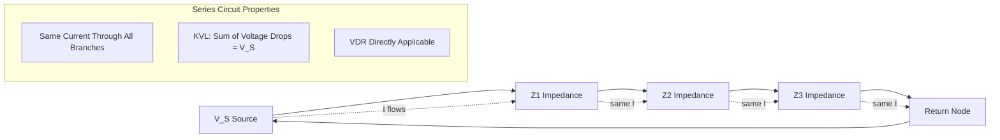
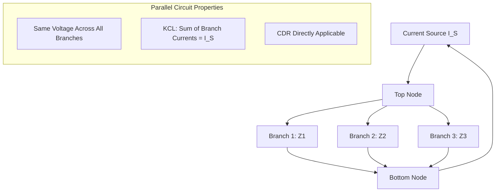
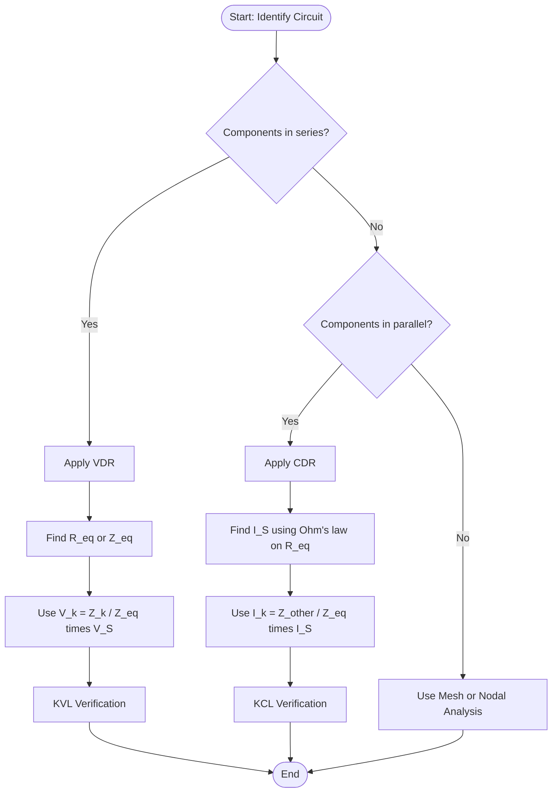
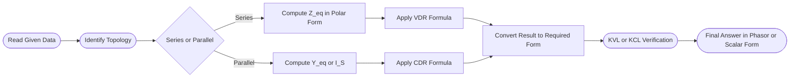

# Voltage and current divider rule (Simple numerical problems)

<!-- SECTION_1_START -->
# Voltage & Current Divider Rule — Module Foundation

## 1.1 Voltage Divider Rule (VDR) — Formal Definition

> [!IMPORTANT]
> **Voltage Divider Rule (VDR):** In a series circuit, the voltage drop across any resistor (or impedance) is directly proportional to the ratio of that resistance to the total series resistance, multiplied by the total applied voltage.

For a DC series circuit with $n$ resistors, the voltage across resistor $R_k$ is given by:

$$V_{R_k} = \frac{R_k}{\sum_{i=1}^{n} R_i} \times V_S$$

where $V_S$ is the source voltage and the sum is taken over all series elements.

**Key Constants & Metrics:**
- The ratio $\frac{R_k}{R_{total}}$ is always a **dimensionless number** between 0 and 1.
- Sum of all individual voltage drops = Source voltage (KVL check): $\sum V_{R_k} = V_S$

## 1.2 Current Divider Rule (CDR) — Formal Definition

> [!IMPORTANT]
> **Current Divider Rule (CDR):** In a parallel circuit, the current through any branch is inversely proportional to the resistance of that branch relative to the equivalent parallel resistance.

For two resistors $R_1$ and $R_2$ connected in parallel, with total source current $I_S$:

$$I_{R_1} = \frac{R_2}{R_1 + R_2} \times I_S, \qquad I_{R_2} = \frac{R_1}{R_1 + R_2} \times I_S$$

> [!NOTE]
> **Memory Trick:** The current through a branch is proportional to the **opposite** (neighbor) resistor. CDR uses the *other* resistor in the numerator, while VDR uses the *own* resistor in the numerator.

## 1.3 Conceptual Analogy — The "Water Pipe Network" Intuition

**Imagine water flowing through pipes:**

- **VDR (Series Pipes):** Think of water flowing through pipes of **different diameters** connected end-to-end. The narrowest pipe "resists" the most and drops the most pressure across it. The pressure drop (voltage) is biggest where the resistance is biggest.

- **CDR (Parallel Pipes):** Now imagine the main water current splitting into two parallel branches. The branch with **smaller resistance (wider pipe)** carries **more current**. The neighbor rule reflects that the wider pipe "steals" more flow from the parallel path.

> [!TIP]
> **VDR — Direct Proportion (↑ with R)**
> **CDR — Inverse Proportion (↓ with R)**

## 1.4 Extension to AC (Phasor Domain)

When the circuit is excited by an **alternating source**, replace resistance $R$ with **impedance $Z$** and all voltages/currents become **phasors** (magnitude + angle). The rules retain the same form, but the *phasor sum* must be performed using complex arithmetic (rectangular or polar form).

> [!VISUALIZATION CONTROL]
> **Concept:** Series R-L circuit voltage phasor diagram
> **GeoGebra / Desmos Input Equations:**
> * Point $A = (0, 0)$ — Origin
> * Point $B = (4, 0)$ — Resistive drop $V_R = 4\;\text{V}$ (along real axis)
> * Point $C = (4, 3)$ — Inductive drop $V_L = 3\;\text{V}$ (perpendicular, +90°)
> * Line segment $A \to C$ — Total supply voltage phasor $V_S$
> **Visual Description:** You should observe a right triangle with $V_R$ on the x-axis, $V_L$ on the y-axis, and the hypotenuse $V_S$ tilted upward — the angle between $V_S$ and $V_R$ is the phase angle $\phi$.

<!-- SECTION_1_END -->

<!-- SECTION_2_START -->
# Deep Theoretical Analysis & KTU High-Yield Formula Sheet

## 2.1 Operational Logic — Step-by-Step Decomposition

### A. Voltage Divider Rule (Series Circuit)

**Step 1 — Confirm series topology.**
Same current $I$ flows through every element. KVL holds: $V_S = V_1 + V_2 + \ldots + V_n$.

**Step 2 — Identify the common current.**
$$I = \frac{V_S}{R_1 + R_2 + \ldots + R_n} = \frac{V_S}{R_{eq}}$$

**Step 3 — Apply Ohm's Law on the target resistor.**
$$V_{R_k} = I \times R_k = \frac{R_k}{R_{eq}} \times V_S$$

**Step 4 — The 'Why':** Because the numerator $R_k$ grows linearly with the target, the voltage split follows the resistance split — this is the essence of the divider action.

### B. Current Divider Rule (Parallel Circuit)

**Step 1 — Confirm parallel topology.**
Same voltage $V$ appears across every branch. KCL holds: $I_S = I_1 + I_2 + \ldots + I_n$.

**Step 2 — Identify the common voltage.**
$$V = I_S \times R_{eq} = I_S \times \frac{R_1 R_2}{R_1 + R_2} \quad \text{(for 2 resistors)}$$

**Step 3 — Apply Ohm's Law on the target branch.**
$$I_{R_k} = \frac{V}{R_k}$$

**Step 4 — For the standard 2-resistor case**, substitution yields the elegant form $I_{R_1} = \frac{R_2}{R_1+R_2} I_S$.

**Step 5 — Inverse Law Insight:** Notice the numerator holds the *sibling* resistor. Larger sibling → more current is "diverted away" from the target branch. This captures the physics of charge preferring the path of *least* opposition.

## 2.2 KTU Formula Sheet / Cheat Sheet

| # | Rule | DC Form | AC (Phasor) Form | Valid Topology | Quick Pitfall |
|---|------|---------|------------------|----------------|---------------|
| 1 | VDR (n elements) | $V_k = \dfrac{R_k}{R_{eq}} V_S$ | $V_k = \dfrac{Z_k}{Z_{eq}} V_S$ (phasor) | Series only | Never apply across parallel branches |
| 2 | VDR (2 elements) | $V_1 = \dfrac{R_1}{R_1+R_2} V_S$ | $V_1 = \dfrac{Z_1}{Z_1+Z_2} V_S$ | Series | Magnitude + angle both required for AC |
| 3 | CDR (2 branches) | $I_1 = \dfrac{R_2}{R_1+R_2} I_S$ | $I_1 = \dfrac{Z_2}{Z_1+Z_2} I_S$ (phasor) | Parallel only | Use the *other* branch impedance |
| 4 | CDR (general, n) | $I_k = \dfrac{G_k}{G_{eq}} I_S$ | $I_k = \dfrac{Y_k}{Y_{eq}} I_S$ | Parallel | Conductance $G = 1/R$; Admittance $Y = 1/Z$ |
| 5 | KVL Check (VDR) | $\sum V_k = V_S$ | $\sum \underline{V}_k = \underline{V}_S$ | Series | Always verify summation |
| 6 | KCL Check (CDR) | $\sum I_k = I_S$ | $\sum \underline{I}_k = \underline{I}_S$ | Parallel | Always verify summation |
| 7 | Phase angle | $\phi = 0$ (purely resistive) | $\phi = \tan^{-1}\!\left(\dfrac{X}{R}\right)$ | Any | $\phi > 0$: inductive; $\phi < 0$: capacitive |

> [!NOTE]
> In the AC row, all quantities with a bar or arrow are **phasors** (complex). The "magnitude" alone is insufficient; the angle carries the timing information essential for power calculations.

## 2.3 Real-World Engineering Utility

- **VDR Applications:** Potentiometer-based volume/tone controls, sensor signal conditioning (e.g., thermistor in a Wheatstone bridge), bias-voltage generation in transistor amplifiers, voltage reference scaling.
- **CDR Applications:** Current sharing in power supplies, fan-out networks in analog signal distribution, ground-fault current distribution in protective earthing, branch-circuit analysis in domestic wiring.

> [!TIP]
> In production-grade circuit simulators (LTspice, Multisim, PSpice), the VDR and CDR are baked into the **nodal analysis solver** as fast closed-form shortcuts before invoking the matrix solver — they are the *first-pass analytical tools* used by professional design engineers.

<!-- SECTION_2_END -->

<!-- SECTION_3_START -->
# Step-by-Step Derivations & Worked Numerical Problems

## 3.1 Worked Numerical Problem 1 — DC VDR (Series)

**Problem Statement:**
A $100\;\text{V}$ DC source is connected in series with three resistors: $R_1 = 10\;\Omega$, $R_2 = 20\;\Omega$, and $R_3 = 30\;\Omega$. Find the voltage across each resistor using the Voltage Divider Rule.

### Given Data
- Source voltage: $V_S = 100\;\text{V}$ (DC)
- $R_1 = 10\;\Omega$
- $R_2 = 20\;\Omega$
- $R_3 = 30\;\Omega$

### Step 1 — Compute Equivalent Resistance

$$R_{eq} = R_1 + R_2 + R_3 = 10 + 20 + 30 = 60\;\Omega$$

### Step 2 — Apply VDR for Each Resistor

$$V_{R_1} = \frac{R_1}{R_{eq}} \times V_S = \frac{10}{60} \times 100 = \frac{1}{6} \times 100 = 16.67\;\text{V}$$

$$V_{R_2} = \frac{R_2}{R_{eq}} \times V_S = \frac{20}{60} \times 100 = \frac{1}{3} \times 100 = 33.33\;\text{V}$$

$$V_{R_3} = \frac{R_3}{R_{eq}} \times V_S = \frac{30}{60} \times 100 = \frac{1}{2} \times 100 = 50.00\;\text{V}$$

### Step 3 — KVL Verification (Mandatory)

$$V_{R_1} + V_{R_2} + V_{R_3} = 16.67 + 33.33 + 50.00 = 100.00\;\text{V} = V_S \;\checkmark$$

> [!NOTE]
> **Valuation Tip (KTU 2024):** Step 3 carries **2 of the 7 marks** in a typical sub-question. Skipping the KVL check is the most common cause of losing half-marks.

---

## 3.2 Worked Numerical Problem 2 — DC CDR (Parallel)

**Problem Statement:**
A $12\;\text{V}$ battery delivers current to two parallel resistors $R_1 = 6\;\Omega$ and $R_2 = 3\;\Omega$. Using CDR, determine the current through each branch and the total current.

### Given Data
- $V = 12\;\text{V}$ (DC)
- $R_1 = 6\;\Omega$
- $R_2 = 3\;\Omega$

### Step 1 — Compute Branch Currents Using CDR

The CDR formula requires the **total source current** $I_S$. We must first find it via Ohm's law on the parallel combination.

$$R_{eq} = \frac{R_1 \times R_2}{R_1 + R_2} = \frac{6 \times 3}{6 + 3} = \frac{18}{9} = 2\;\Omega$$

$$I_S = \frac{V}{R_{eq}} = \frac{12}{2} = 6\;\text{A}$$

### Step 2 — Apply CDR to Each Branch

$$I_{R_1} = \frac{R_2}{R_1 + R_2} \times I_S = \frac{3}{6 + 3} \times 6 = \frac{3}{9} \times 6 = 2\;\text{A}$$

$$I_{R_2} = \frac{R_1}{R_1 + R_2} \times I_S = \frac{6}{6 + 3} \times 6 = \frac{6}{9} \times 6 = 4\;\text{A}$$

### Step 3 — KCL Verification

$$I_{R_1} + I_{R_2} = 2 + 4 = 6\;\text{A} = I_S \;\checkmark$$

> [!NOTE]
> **Observation:** The branch with **half** the resistance ($R_2 = 3\;\Omega$) carries **double** the current ($4\;\text{A}$ vs $2\;\text{A}$). This is the inverse-proportion character of CDR in action.

---

## 3.3 Worked Numerical Problem 3 — AC VDR (Phasor Domain)

**Problem Statement:**
A sinusoidal source $\underline{V}_S = 100 \angle 0^\circ\;\text{V}$ (rms) drives a series combination of $R = 30\;\Omega$ and an inductive reactance $X_L = 40\;\Omega$. Using VDR, find the phasor voltage across the inductor and its magnitude.

### Given Data
- $\underline{V}_S = 100 \angle 0^\circ\;\text{V}$ (rms)
- $R = 30\;\Omega$ (real impedance $Z_R = 30 \angle 0^\circ\;\Omega$)
- $X_L = 40\;\Omega$ (inductive impedance $Z_L = j40 = 40 \angle 90^\circ\;\Omega$)

### Step 1 — Form the Phasor Impedances

$$Z_R = 30 \angle 0^\circ\;\Omega$$

$$Z_L = 40 \angle 90^\circ\;\Omega$$

### Step 2 — Compute Series Equivalent in Polar Form

$$Z_{eq} = Z_R + Z_L = 30 + j40\;\Omega$$

Converting to polar form:

$$\vert Z_{eq} \vert = \sqrt{30^2 + 40^2} = \sqrt{900 + 1600} = \sqrt{2500} = 50\;\Omega$$

$$\theta = \tan^{-1}\!\left(\frac{40}{30}\right) = 53.13^\circ$$

$$Z_{eq} = 50 \angle 53.13^\circ\;\Omega$$

### Step 3 — Apply AC VDR Across the Inductor

$$\underline{V}_L = \frac{Z_L}{Z_{eq}} \times \underline{V}_S = \frac{40 \angle 90^\circ}{50 \angle 53.13^\circ} \times 100 \angle 0^\circ\;\text{V}$$

$$\underline{V}_L = \frac{40}{50} \angle (90^\circ - 53.13^\circ) \times 100 \angle 0^\circ\;\text{V}$$

$$\underline{V}_L = 0.8 \angle 36.87^\circ \times 100 \angle 0^\circ\;\text{V}$$

$$\underline{V}_L = 80 \angle 36.87^\circ\;\text{V}$$

### Step 4 — Magnitude and Rectangular Form

$$\vert \underline{V}_L \vert = 80\;\text{V}\;\text{(rms)}$$

$$\underline{V}_L = 80 \cos(36.87^\circ) + j\,80 \sin(36.87^\circ) = 64 + j48\;\text{V}$$

> [!NOTE]
> **Notice:** Even though the source is $100\;\text{V}$, the inductor voltage is $80\;\text{V}$ — a key characteristic of reactive circuits: **individual element voltages can exceed the source voltage** (resonance-related phenomenon in series R-L/R-C networks).

---

## 3.4 Worked Numerical Problem 4 — AC CDR (Phasor Domain)

**Problem Statement:**
A source supplies $\underline{I}_S = 10 \angle 0^\circ\;\text{A}$ to two parallel branches. Branch 1 has $R_1 = 4\;\Omega$; Branch 2 has $R_2 = 3\;\Omega$ in series with $X_C = 4\;\Omega$. Find the phasor current through Branch 2 using CDR.

### Given Data
- $\underline{I}_S = 10 \angle 0^\circ\;\text{A}$
- $Z_1 = R_1 = 4 \angle 0^\circ\;\Omega$
- $Z_2 = R_2 - jX_C = 3 - j4\;\Omega$

### Step 1 — Polar Form of $Z_2$

$$\vert Z_2 \vert = \sqrt{3^2 + 4^2} = 5\;\Omega, \quad \phi_2 = \tan^{-1}\!\left(\frac{-4}{3}\right) = -53.13^\circ$$

$$Z_2 = 5 \angle -53.13^\circ\;\Omega$$

### Step 2 — Apply AC CDR for Two Branches

$$\underline{I}_2 = \frac{Z_1}{Z_1 + Z_2} \times \underline{I}_S = \frac{4 \angle 0^\circ}{4 \angle 0^\circ + 5 \angle -53.13^\circ} \times 10 \angle 0^\circ\;\text{A}$$

Convert $Z_2$ to rectangular for addition: $Z_2 = 3 - j4\;\Omega$.

$$Z_1 + Z_2 = 4 + (3 - j4) = 7 - j4\;\Omega$$

Convert the sum to polar:

$$\vert Z_1 + Z_2 \vert = \sqrt{7^2 + 4^2} = \sqrt{49 + 16} = \sqrt{65} = 8.062\;\Omega$$

$$\angle (Z_1 + Z_2) = \tan^{-1}\!\left(\frac{-4}{7}\right) = -29.74^\circ$$

$$Z_1 + Z_2 = 8.062 \angle -29.74^\circ\;\Omega$$

### Step 3 — Compute $\underline{I}_2$

$$\underline{I}_2 = \frac{4 \angle 0^\circ}{8.062 \angle -29.74^\circ} \times 10 \angle 0^\circ\;\text{A}$$

$$\underline{I}_2 = 0.4962 \angle 29.74^\circ \times 10 \angle 0^\circ\;\text{A}$$

$$\underline{I}_2 = 4.962 \angle 29.74^\circ\;\text{A}$$

$$\vert \underline{I}_2 \vert \approx 4.96\;\text{A (rms)}$$

### Step 4 — KCL Verification (in Phasor Form)

$$\underline{I}_1 = \frac{Z_2}{Z_1 + Z_2} \times \underline{I}_S = \frac{5 \angle -53.13^\circ}{8.062 \angle -29.74^\circ} \times 10 \angle 0^\circ\;\text{A}$$

$$\underline{I}_1 = 0.6201 \angle -23.39^\circ \times 10 \angle 0^\circ\;\text{A} = 6.201 \angle -23.39^\circ\;\text{A}$$

Sum check:
$$\underline{I}_1 + \underline{I}_2 = 6.201 \angle -23.39^\circ + 4.962 \angle 29.74^\circ$$

Converting to rectangular:
$$\underline{I}_1 = 5.694 - j2.461\;\text{A}, \qquad \underline{I}_2 = 4.310 + j2.461\;\text{A}$$

$$\underline{I}_1 + \underline{I}_2 = 10.004 + j0.000 \approx 10 \angle 0^\circ\;\text{A} = \underline{I}_S \;\checkmark$$

<!-- SECTION_3_END -->

<!-- SECTION_4_START -->
# Structural Diagrams & Schematics

## 4.1 Series Circuit Topology (VDR Application Domain)

## 4.2 Parallel Circuit Topology (CDR Application Domain)

## 4.3 Decision Flow — Choosing VDR vs CDR

## 4.4 Sequential Processing Topology — Solving a VDR/CDR Problem

<!-- SECTION_4_END -->

<!-- SECTION_5_START -->
# KTU 2024 Scheme Examination Question Bank & Topic Recap

---

## Part A — Short Answer Questions (2 × 3 = 6 Marks)

### Question 1 [KTU University Exam — July 2024] | **CO1, Remember**

**State the Voltage Divider Rule and Current Divider Rule. Mention one practical application of each.**

**Model Answer:**

> **Voltage Divider Rule (VDR):** In a series DC circuit, the voltage across a resistor $R_k$ is given by
> $$V_{R_k} = \frac{R_k}{R_1 + R_2 + \cdots + R_n} \times V_S$$
> **Application:** Used in **potentiometer-based volume controls** in audio systems and in **sensor signal conditioning** circuits (e.g., thermistor voltage scaling).
>
> **Current Divider Rule (CDR):** In a parallel DC circuit with two branches, the current through $R_1$ is
> $$I_{R_1} = \frac{R_2}{R_1 + R_2} \times I_S$$
> **Application:** Used in **current-sharing networks** in parallel-connected power supplies and in **branch-circuit analysis** of domestic electrical wiring. **[3 Marks]**

---

### Question 2 [KTU University Exam — Dec 2023] | **CO1, Understand**

**Differentiate between Voltage Divider Rule and Current Divider Rule with respect to: (a) Circuit topology, (b) Proportionality nature, and (c) Phasor extension in AC.**

**Model Answer:**

| Aspect | VDR | CDR |
|--------|-----|-----|
| Topology | **Series** circuit | **Parallel** circuit |
| Proportionality | **Direct** with resistance (larger $R$ → larger $V$) | **Inverse** with branch resistance (larger $R$ → smaller $I$) |
| AC Phasor Extension | Replace $R$ with $Z$ in phasor form: $V_k = (Z_k / Z_{eq}) V_S$ | Replace $R$ with $Z$: $I_k = (Z_{other} / Z_{eq}) I_S$ in phasor form |

Both rules require **KVL** (VDR) or **KCL** (CDR) verification for full marks. **[3 Marks]**

---

## Part B — Long Answer Questions (Internal Choice: 14 Marks Each)

### Question A (Choice 1) [KTU University Exam — July 2024] | **CO1, CO2 | Apply, Analyze**

**A $240\;\text{V}$ DC source is connected across three resistors in series: $R_1 = 40\;\Omega$, $R_2 = 60\;\Omega$, and $R_3 = 100\;\Omega$.**

**(a)** Using the Voltage Divider Rule, compute the voltage drop across each resistor. **[7 Marks]**

**(b)** If a fourth resistor $R_4 = 50\;\Omega$ is now connected in series with the above combination, recalculate the voltage across $R_2$ and the new current drawn from the source. Comment on the change. **[7 Marks]**

#### Part (a) — Model Solution

**Step 1 — Compute equivalent resistance.**
$$R_{eq} = R_1 + R_2 + R_3 = 40 + 60 + 100 = 200\;\Omega$$

**[Stating equivalent resistance: 1 Mark]**

**Step 2 — Compute circuit current.**
$$I = \frac{V_S}{R_{eq}} = \frac{240}{200} = 1.2\;\text{A}$$

**[Current calculation: 1 Mark]**

**Step 3 — Apply VDR for each resistor.**
$$V_{R_1} = \frac{40}{200} \times 240 = 48\;\text{V}$$

$$V_{R_2} = \frac{60}{200} \times 240 = 72\;\text{V}$$

$$V_{R_3} = \frac{100}{200} \times 240 = 120\;\text{V}$$

**[Each VDR computation: 1 Mark × 3 = 3 Marks]**

**Step 4 — KVL Verification.**
$$V_{R_1} + V_{R_2} + V_{R_3} = 48 + 72 + 120 = 240\;\text{V} = V_S \;\checkmark$$

**[KVL check: 2 Marks]**

**Final Answer:** $V_{R_1} = 48\;\text{V}$, $V_{R_2} = 72\;\text{V}$, $V_{R_3} = 120\;\text{V}$. **Total: 7 Marks**

#### Part (b) — Model Solution

**Step 1 — New equivalent resistance with $R_4$ added.**
$$R_{eq}' = 40 + 60 + 100 + 50 = 250\;\Omega$$

**[New equivalent: 1 Mark]**

**Step 2 — New current from source.**
$$I' = \frac{240}{250} = 0.96\;\text{A}$$

**[New current: 1 Mark]**

**Step 3 — VDR for $R_2$.**
$$V_{R_2}' = \frac{60}{250} \times 240 = 57.6\;\text{V}$$

**[New $V_{R_2}$: 2 Marks]**

**Step 4 — Comparison and Comment.**
- $V_{R_2}$ decreased from $72\;\text{V}$ to $57.6\;\text{V}$ (a $20\%$ drop).
- Source current decreased from $1.2\;\text{A}$ to $0.96\;\text{A}$ (a $20\%$ drop).
- This is because adding $R_4$ increases total resistance, reducing both the current and the *share* of voltage across $R_2$.

**[Comment on change: 3 Marks]**

**Final Answer:** $V_{R_2}' = 57.6\;\text{V}$, $I' = 0.96\;\text{A}$. **Total: 7 Marks**

---

### Question B (Choice 2) [KTU University Exam — Dec 2023] | **CO1, CO2 | Apply, Analyze**

**A $120\;\text{V}$ DC source supplies two parallel branches: Branch 1 has $R_1 = 30\;\Omega$ and Branch 2 has $R_2 = 60\;\Omega$.**

**(a)** Using the Current Divider Rule, find the current through each branch and verify with KCL. **[7 Marks]**

**(b)** If a third branch with $R_3 = 20\;\Omega$ is added in parallel, determine the new branch currents and the total current from the source. Comment on the change. **[7 Marks]**

#### Part (a) — Model Solution

**Step 1 — Compute equivalent parallel resistance.**
$$R_{eq} = \frac{R_1 \times R_2}{R_1 + R_2} = \frac{30 \times 60}{30 + 60} = \frac{1800}{90} = 20\;\Omega$$

**[Equivalent resistance: 1 Mark]**

**Step 2 — Total source current.**
$$I_S = \frac{V}{R_{eq}} = \frac{120}{20} = 6\;\text{A}$$

**[Source current: 1 Mark]**

**Step 3 — Apply CDR for each branch.**
$$I_{R_1} = \frac{R_2}{R_1 + R_2} \times I_S = \frac{60}{90} \times 6 = 4\;\text{A}$$

$$I_{R_2} = \frac{R_1}{R_1 + R_2} \times I_S = \frac{30}{90} \times 6 = 2\;\text{A}$$

**[Each branch current: 1 Mark × 2 = 2 Marks]**

**Step 4 — KCL Verification.**
$$I_{R_1} + I_{R_2} = 4 + 2 = 6\;\text{A} = I_S \;\checkmark$$

**[KCL check: 3 Marks]**

**Final Answer:** $I_{R_1} = 4\;\text{A}$, $I_{R_2} = 2\;\text{A}$. **Total: 7 Marks**

#### Part (b) — Model Solution

**Step 1 — New equivalent resistance with 3 parallel branches.**
$$\frac{1}{R_{eq}'} = \frac{1}{30} + \frac{1}{60} + \frac{1}{20} = \frac{2 + 1 + 3}{60} = \frac{6}{60} = \frac{1}{10}$$

$$R_{eq}' = 10\;\Omega$$

**[New equivalent: 2 Marks]**

**Step 2 — New total source current.**
$$I_S' = \frac{V}{R_{eq}'} = \frac{120}{10} = 12\;\text{A}$$

**[New total current: 1 Mark]**

**Step 3 — Apply VDR-style direct Ohm's law on each branch (since $V$ is known).**
$$I_{R_1}' = \frac{120}{30} = 4\;\text{A}$$

$$I_{R_2}' = \frac{120}{60} = 2\;\text{A}$$

$$I_{R_3}' = \frac{120}{20} = 6\;\text{A}$$

**[Each new branch current: 1 Mark × 3 = 3 Marks]**

**Step 4 — KCL Verification and Comment.**
$$I_{R_1}' + I_{R_2}' + I_{R_3}' = 4 + 2 + 6 = 12\;\text{A} = I_S' \;\checkmark$$

- Adding the third branch **doubled** the total current ($6\;\text{A} \to 12\;\text{A}$).
- Note that **branch currents of original branches remain unchanged** because the source voltage is still $120\;\text{V}$ and each branch still sees the same $120\;\text{V}$.

**[KCL + Comment: 1 Mark]**

**Final Answer:** $I_{R_1}' = 4\;\text{A}$, $I_{R_2}' = 2\;\text{A}$, $I_{R_3}' = 6\;\text{A}$, $I_S' = 12\;\text{A}$. **Total: 7 Marks**

---

> [!WARNING]
> **KTU Examiner's Valuation Warning — Common Pitfalls**
>
> 1. **Mixing up VDR and CDR:** Applying VDR to a parallel circuit (or vice versa) is an instant **zero** for that sub-part. Always verify the topology **first** before choosing the formula.
> 2. **Omitting KVL/KCL check:** KTU examiners explicitly allot **2–3 marks** for verification. Skipping it costs you 25–30% of the sub-question's marks.
> 3. **Wrong numerator in CDR:** Using the **own** resistor in the CDR numerator (instead of the *neighbor*) yields a wrong answer with no partial credit. Memorize: "**VDR uses own R, CDR uses the other R**."
> 4. **Phasor arithmetic error in AC:** Forgetting to convert between rectangular and polar form before multiplying/dividing leads to silent magnitude errors. Always draw a small phasor diagram.
> 5. **Forgetting units:** Voltage in **V (rms)**, current in **A (rms)**, resistance in **Ω**, impedance in **Ω** with phase angle. Missing units = **−0.5 mark** per instance.
> 6. **No mention of rms vs peak:** In AC problems, always specify **rms** unless the question explicitly gives a peak value.

---

## Topic Recap & Important Things to Remember

- **VDR applies ONLY to series circuits**; **CDR applies ONLY to parallel circuits.** Identify topology first.
- **VDR formula:** $V_k = \dfrac{R_k}{R_{eq}} \cdot V_S$ (own resistance in numerator).
- **CDR formula (2 branches):** $I_1 = \dfrac{R_2}{R_1 + R_2} \cdot I_S$ (other branch resistance in numerator).
- **KVL is the verification rule for VDR; KCL is the verification rule for CDR.** Always sum and check against source.
- **For AC:** Replace $R$ with $Z$, work in **phasor form** (magnitude + angle), use complex arithmetic.
- **Impedance representation:**
  - Resistor: $Z_R = R \angle 0^\circ\;\Omega$
  - Inductor: $Z_L = X_L \angle 90^\circ\;\Omega$ (positive reactance)
  - Capacitor: $Z_C = X_C \angle -90^\circ\;\Omega$ (negative reactance)
- **Key trigonometric ratios** that appear repeatedly in AC VDR/CDR:
  - $3:4:5$ triangle → angles $36.87^\circ$ and $53.13^\circ$
  - $1:1:\sqrt{2}$ triangle → angle $45^\circ$
- **Common mistake to avoid:** When the source is a **voltage source** in a parallel circuit, you cannot directly use CDR without first finding $I_S$. When the source is a **current source** in a series circuit, you cannot use VDR without first finding the node voltage.
- **Default unit convention (KTU board):** Use **rms values** for all AC phasor quantities unless peak is explicitly given.
- **Sign convention:** Voltages and currents are positive when their reference direction matches the actual direction of energy flow from source to load.
- **Resonance edge case:** In a series RLC circuit at resonance, the inductor and capacitor voltages **cancel**; only the resistor voltage remains, even though their individual magnitudes may be much larger than the source.
- **Practical extension:** For more than 2 parallel branches, the general CDR form uses **conductances** $G_k = 1/R_k$ in the numerator: $I_k = \dfrac{G_k}{G_{eq}} \cdot I_S$.
- **Always convert the final answer** to the form requested by the question (rectangular, polar, or scalar magnitude + phase).

<!-- SECTION_5_END -->
