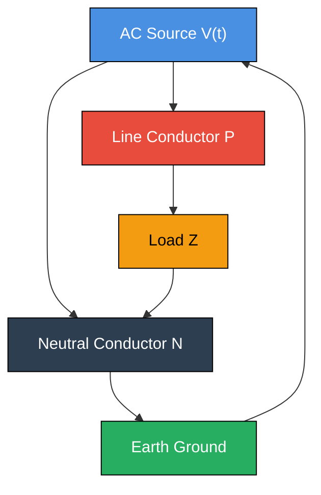
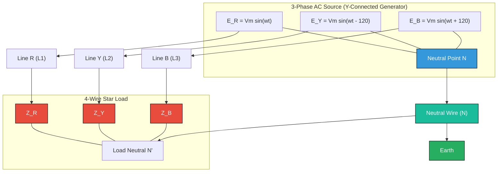
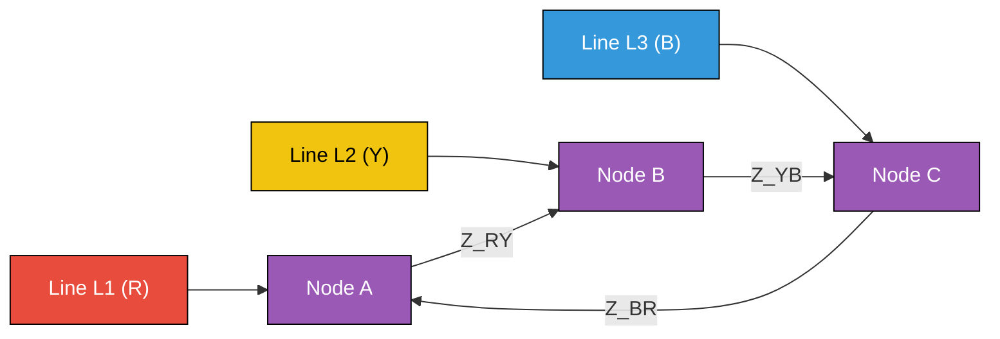
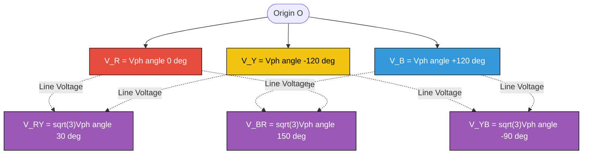
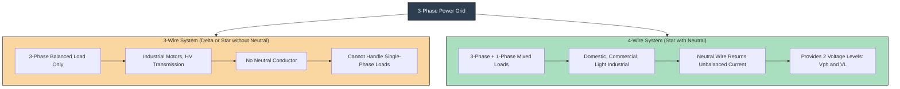
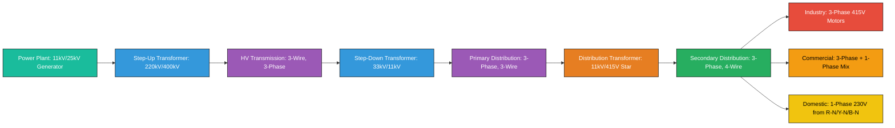

# AC power supply scheme: Single phase and three phase system, Three phase 3 wire and 4 wire systems

<!-- SECTION_1_START -->
# AC Power Supply Scheme: Single Phase & Three Phase Systems

## 1.1 Formal Academic Definition (KTU 2024 Syllabus Terminology)

> [!IMPORTANT]
> **AC Power Supply Scheme** refers to the standardized method of generating, transmitting, and distributing Alternating Current (AC) electrical energy from the source to the end consumer using either a **Single-Phase (1-φ)** or **Three-Phase (3-φ)** configuration, characterized by sinusoidal voltage and current waveforms operating at a standard frequency of **50 Hz** in India (as per Central Electricity Authority regulations).

A **Single-Phase System** uses two conductors (one *Phase* and one *Neutral*) to deliver AC power, where a single sinusoidal voltage $v(t) = V_m \sin(\omega t)$ exists between them.

A **Three-Phase System** uses three sinusoidal voltages of equal magnitude, displaced from each other by a phase angle of **120°** (or $\frac{2\pi}{3}$ radians) in time, generated by a synchronous generator with three identical windings spatially separated by 120° mechanical degrees.

The two standard three-phase distribution schemes are:
- **Three-Phase, 3-Wire System** — Uses only three line conductors (no neutral). Phases are connected in either **Star (Y)** or **Delta (Δ)** configuration.
- **Three-Phase, 4-Wire System** — Uses three line conductors plus one neutral conductor. Almost always uses **Star (Y)** connection to provide the neutral point.

> [!NOTE]
> **KTU 2024 Highlight:** The standard Indian domestic and commercial AC supply is a **Single-Phase, 2-Wire system at 230 V, 50 Hz**. Industrial loads use **Three-Phase, 4-Wire system at 415 V (Line-to-Line), 50 Hz** with a neutral grounded at the distribution transformer.

## 1.2 Conceptual Analogy / Intuition

Imagine a three-cylinder engine in a car versus a single-cylinder engine:

- A **Single-Phase AC supply** is like a **single-cylinder engine**. Power is delivered in pulses — it rises from 0 to peak, falls to 0, goes negative, and returns to 0. There is a moment every cycle when the power delivered to the load is **zero** (when the voltage crosses zero). This causes vibration in motors and inefficient power delivery.

- A **Three-Phase AC supply** is like a **three-cylinder engine** with cylinders firing in sequence. When one phase is at zero, the other two are delivering positive and negative power respectively. The total power delivered to a balanced load is **constant (pulsation-free)** at every instant. This makes 3-phase motors run smoother, smaller, and more efficient.

### Single-Phase Analogy
Think of a single person rowing a boat with one oar. The boat lurches forward, stops, and lurches again — there is no smooth, continuous thrust.

### Three-Phase Analogy
Three people row a boat with three oars, each pulling 120° out of phase from the others. The result is **smooth, continuous propulsion** with no dead spots.

## 1.3 Physical Constants and Standard Metrics

| Parameter | Standard Value (India) |
|-----------|------------------------|
| Domestic Single-Phase Voltage | **230 V (RMS), 50 Hz** |
| Industrial Three-Phase Line Voltage | **415 V (RMS), 50 Hz** |
| Three-Phase Phase Voltage (Star) | **230 V (RMS)** |
| Standard Frequency | **50 Hz** |
| Angular Frequency | $\omega = 2\pi f = 314.159$ **rad/s** |
| Phase Displacement (3-φ) | **120°** = $\frac{2\pi}{3}$ **radians** |
| Power Factor for pure resistive load | **Unity (1.0)** |
| Line-to-Line vs Line-to-Neutral Ratio | $\sqrt{3} \approx 1.732$ |

## 1.4 Three-Phase Voltage Equations (KTU Standard Representation)

For a balanced three-phase system with phase sequence R → Y → B (positive sequence):

$$v_R(t) = V_m \sin(\omega t)$$

$$v_Y(t) = V_m \sin\left(\omega t - \frac{2\pi}{3}\right) = V_m \sin(\omega t - 120°)$$

$$v_B(t) = V_m \sin\left(\omega t - \frac{4\pi}{3}\right) = V_m \sin(\omega t - 240°)$$

> [!VISUALIZATION CONTROL]
> **Concept:** Three-Phase Sinusoidal Waveforms with 120° Phase Displacement
> **Desmos Input Equations:**
> * `v_R = sin(x)`
> * `v_Y = sin(x - 2*pi/3)`
> * `v_B = sin(x - 4*pi/3)`
> * Horizontal range: $x \in [0, 2\pi]$
> **Visual Description:** The student should observe three sine waves of identical amplitude and frequency, with each wave shifted 120° to the right of the previous one. The zero crossings occur at $x = 0, \frac{\pi}{3}, \frac{2\pi}{3}, \pi, \frac{4\pi}{3}, \frac{5\pi}{3}$, etc. The sum of the three instantaneous voltages is always zero: $v_R + v_Y + v_B = 0$ at every instant.

<!-- SECTION_1_END -->

<!-- SECTION_2_START -->
# Deep Theoretical Analysis & KTU High-Yield Formula Sheet

## 2.1 Single-Phase AC System — Operating Principles

A single-phase AC supply consists of:
- **One Phase conductor (P or Line)**: Carries the live, time-varying sinusoidal current.
- **One Neutral conductor (N)**: Returns current to the source; typically grounded at the distribution transformer.

**Key Equation:**
$$v(t) = V_m \sin(\omega t), \quad i(t) = I_m \sin(\omega t - \phi)$$

- $V_m$ = Peak (maximum) voltage = $\sqrt{2} \times V_{RMS}$
- $I_m$ = Peak (maximum) current = $\sqrt{2} \times I_{RMS}$
- $\phi$ = Phase angle between voltage and current (depends on load)
- $\omega = 2\pi f$ = Angular frequency

**Power Delivered (Single-Phase, Instantaneous):**
$$p(t) = v(t) \cdot i(t) = V_m I_m \sin(\omega t)\sin(\omega t - \phi)$$

**Average (Real) Power:**
$$P = V_{RMS} \cdot I_{RMS} \cdot \cos(\phi) \quad \text{(watts)}$$

**Reactive Power:**
$$Q = V_{RMS} \cdot I_{RMS} \cdot \sin(\phi) \quad \text{(VAR)}$$

**Apparent Power:**
$$S = V_{RMS} \cdot I_{RMS} \quad \text{(VA)}$$

> [!NOTE]
> **KTU Pitfall:** In a single-phase system, instantaneous power $p(t)$ is **pulsating** — it varies between $+VI\cos\phi$ and $-VI\cos\phi$ at twice the supply frequency. This pulsation causes vibration in single-phase motors and limits their use to small applications (fans, pumps up to ~1 HP, household appliances).

## 2.2 Three-Phase AC System — Operating Principles

A three-phase system is generated by a **synchronous generator (alternator)** with three identical stator windings, physically displaced by 120° around the rotor's periphery. As the rotor (electromagnet) rotates at synchronous speed $N_s = \frac{120f}{P}$ RPM, it induces three EMFs in the three windings, each displaced by 120° in time.

**Advantages of Three-Phase Over Single-Phase:**

1. **Constant Power Delivery**: Total instantaneous power in a balanced 3-phase system is constant (non-pulsating), making motors run vibration-free.
2. **Self-Starting**: Three-phase induction motors are inherently self-starting; single-phase motors require auxiliary starting windings.
3. **Conductor Material Economy**: For the same power transmitted, a 3-phase system uses **less copper** (smaller conductors) than an equivalent single-phase system.
4. **Higher Power Density**: Three-phase motors have ~1.5× the power output of single-phase motors of the same frame size.
5. **Flexible Voltages**: From the same generator, two different voltages are available (e.g., 230 V phase / 415 V line).

## 2.3 Star (Y) Connection — Detailed Analysis

In a **Star connection**, the similar ends (either "starts" or "finishes") of the three phase windings are joined together at a common point called the **Neutral Point (N)**. The other three ends are brought out as **Line conductors L1, L2, L3** (or R, Y, B).

**Voltage Relationships (Star Connection):**

$$\boxed{V_L = \sqrt{3} \cdot V_{ph}}$$

where $V_L$ = Line voltage (between any two lines), $V_{ph}$ = Phase voltage (between any line and neutral).

**Current Relationships (Star Connection):**

$$\boxed{I_L = I_{ph}}$$

The line current equals the phase current because each line is connected in series with one phase winding.

**Phasor Proof of $V_L = \sqrt{3} V_{ph}$:**

The line voltage $V_{RY}$ is the phasor difference between $V_R$ and $V_Y$:

$$V_{RY} = V_R - V_Y$$

In a balanced system, $|V_R| = |V_Y| = |V_B| = V_{ph}$, with 120° separation. Using phasor subtraction of two equal-magnitude vectors separated by 120°:

$$|V_{RY}| = \sqrt{V_R^2 + V_Y^2 - 2 V_R V_Y \cos(60°)}$$

$$= \sqrt{V_{ph}^2 + V_{ph}^2 - 2V_{ph}^2(0.5)} = \sqrt{V_{ph}^2} = V_{ph}$$

The angle of $V_{RY}$ is at 30° from $V_R$ (i.e., $V_{RY}$ leads $V_R$ by 30°). The magnitude using the geometry of a 30-60-90 triangle (with $V_{RY}$ as the long side):

$$V_L = V_{RY} = 2 \cdot V_{ph} \cdot \cos(30°) = 2 V_{ph} \cdot \frac{\sqrt{3}}{2} = \sqrt{3} V_{ph}$$

## 2.4 Delta (Δ) Connection — Detailed Analysis

In a **Delta connection**, the end of one phase winding is connected to the start of the next phase winding, forming a closed loop. The three line conductors are taken from the three junction points.

**Voltage Relationships (Delta Connection):**

$$\boxed{V_L = V_{ph}}$$

The voltage across each phase winding is the same as the line-to-line voltage.

**Current Relationships (Delta Connection):**

$$\boxed{I_L = \sqrt{3} \cdot I_{ph}}$$

The line current is $\sqrt{3}$ times the phase current, lagging behind it by 30°.

**Phasor Proof of $I_L = \sqrt{3} I_{ph}$:**

The line current $I_R$ is the phasor difference between phase currents $I_{RY}$ and $I_{BR}$:

$$I_R = I_{RY} - I_{BR}$$

Using the same trigonometric identity as for voltages:

$$I_L = 2 I_{ph} \cos(30°) = \sqrt{3} I_{ph}$$

## 2.5 Three-Phase, 3-Wire System

A **3-wire system** has only three conductors (L1, L2, L3) and **no neutral**. It can use either Star or Delta configuration.

**Characteristics:**
- Used for **balanced loads only** (e.g., three-phase induction motors).
- Cannot supply single-phase loads separately because no neutral exists.
- If a single-phase load is connected between any two lines, it creates **phase imbalance** causing unequal voltages and excessive neutral current circulation (in Star) or circulating currents (in Delta).
- Common in **high-voltage transmission lines** and industrial motor feeders.

**Power in a 3-Phase, 3-Wire Balanced System:**

$$P = \sqrt{3} \cdot V_L \cdot I_L \cdot \cos(\phi)$$

## 2.6 Three-Phase, 4-Wire System

A **4-wire system** adds a fourth conductor, the **Neutral (N)**, which is connected to the star point of the source (and usually grounded). This system is almost always **Star-connected** because the neutral is essential for handling single-phase loads.

**Characteristics:**
- Used for **mixed loads** — both three-phase (connected across L1-L2-L3) and single-phase (connected between any line and neutral).
- The neutral carries the **unbalanced current** from unequal single-phase loads.
- Neutral current $\vec{I_N} = \vec{I_R} + \vec{I_Y} + \vec{I_B}$ (phasor sum).
- In a **perfectly balanced** system, $I_N = 0$ (neutral can be omitted).
- The neutral conductor is typically the **same size** as the line conductors (or one size smaller) and is **grounded** at multiple points for safety.

**Standard KTU Application:**
The domestic 230 V supply in India is taken as **one phase + neutral** from a 3-phase, 4-wire distribution system. Three houses may be supplied from R-N, Y-N, B-N respectively to balance the load across the three phases.

## 2.7 KTU High-Yield Formula Sheet

> [!IMPORTANT]
> **Single-Phase System Formulas**

| Quantity | Formula | Unit |
|----------|---------|------|
| RMS Voltage | $V_{RMS} = \frac{V_m}{\sqrt{2}} \approx 0.707 \cdot V_m$ | Volts (V) |
| Average Voltage (full-wave) | $V_{avg} = \frac{2 V_m}{\pi} \approx 0.637 \cdot V_m$ | Volts (V) |
| Form Factor | $K_f = \frac{V_{RMS}}{V_{avg}} = \frac{\pi}{2\sqrt{2}} \approx 1.11$ | Dimensionless |
| Crest Factor | $K_c = \frac{V_m}{V_{RMS}} = \sqrt{2} \approx 1.414$ | Dimensionless |
| Real Power | $P = V_{RMS} \cdot I_{RMS} \cdot \cos\phi$ | Watts (W) |
| Apparent Power | $S = V_{RMS} \cdot I_{RMS}$ | VA |
| Reactive Power | $Q = V_{RMS} \cdot I_{RMS} \cdot \sin\phi$ | VAR |
| Power Factor | $\cos\phi = \frac{P}{S}$ | Dimensionless |

> [!IMPORTANT]
> **Three-Phase System Formulas (Balanced Load)**

| Quantity | Star (Y) Connection | Delta (Δ) Connection |
|----------|-------------------|----------------------|
| Line Voltage | $V_L = \sqrt{3} \cdot V_{ph}$ | $V_L = V_{ph}$ |
| Phase Voltage | $V_{ph} = \frac{V_L}{\sqrt{3}}$ | $V_{ph} = V_L$ |
| Line Current | $I_L = I_{ph}$ | $I_L = \sqrt{3} \cdot I_{ph}$ |
| Phase Current | $I_{ph} = I_L$ | $I_{ph} = \frac{I_L}{\sqrt{3}}$ |
| Total Real Power | $P = \sqrt{3} \cdot V_L \cdot I_L \cdot \cos\phi$ | $P = \sqrt{3} \cdot V_L \cdot I_L \cdot \cos\phi$ |
| Total Reactive Power | $Q = \sqrt{3} \cdot V_L \cdot I_L \cdot \sin\phi$ | $Q = \sqrt{3} \cdot V_L \cdot I_L \cdot \sin\phi$ |
| Total Apparent Power | $S = \sqrt{3} \cdot V_L \cdot I_L$ | $S = \sqrt{3} \cdot V_L \cdot I_L$ |
| Total Power (per phase) | $P = 3 \cdot V_{ph} \cdot I_{ph} \cdot \cos\phi$ | $P = 3 \cdot V_{ph} \cdot I_{ph} \cdot \cos\phi$ |
| Neutral Current (Star) | $I_N = 0$ (balanced), $\vec{I_N} = \sum \vec{I_{ph}}$ (unbalanced) | Not applicable (no neutral) |

> [!NOTE]
> **Critical KTU Insight:** The total 3-phase power formula $P = \sqrt{3} V_L I_L \cos\phi$ is **universal** — it applies to BOTH Star and Delta connected balanced loads. The $V_L$ and $I_L$ in this formula are always the **line quantities** (what you can measure with a voltmeter/ammeter on the supply lines).

## 2.8 Real-World Engineering Applications

| Application | System Used | Why |
|-------------|-------------|-----|
| Households (lights, fans, TV) | 1-Phase, 2-Wire, 230 V | Simple, economical, sufficient for low power |
| Heavy industrial motors (>5 HP) | 3-Phase, 3-Wire, 415 V (Delta) | Self-starting, smooth, efficient, no neutral needed |
| Commercial complexes (mixed loads) | 3-Phase, 4-Wire, 415 V/230 V (Star) | Supplies both 3-phase and 1-phase loads simultaneously |
| HT Transmission lines (66 kV, 110 kV, 220 kV, 400 kV) | 3-Phase, 3-Wire | High efficiency, no neutral required for balanced loads |
| Hospitals, data centers | 3-Phase, 4-Wire with DG backup | Reliability, can split critical loads across phases |
| Railway traction (Indian Railways 25 kV) | 1-Phase from 3-Phase grid | Simplified overhead wiring, single-phase traction motors |

<!-- SECTION_2_END -->

<!-- SECTION_3_START -->
# Step-by-Step Derivations & Numerical Solutions

## 3.1 Derivation: Why $V_L = \sqrt{3} V_{ph}$ in Star Connection (Complete)

**Given:** Three phase voltages of a balanced 3-phase Star system:
- $V_R = V_{ph} \angle 0°$
- $V_Y = V_{ph} \angle -120°$
- $V_B = V_{ph} \angle -240° = V_{ph} \angle +120°$

**To Find:** Line voltage $V_{RY} = V_R - V_Y$ (phasor difference)

**Step 1:** Write the phasor difference
$$V_{RY} = V_R - V_Y$$

**Step 2:** Substitute the phasor expressions in rectangular form
$$V_R = V_{ph}(\cos 0° + j \sin 0°) = V_{ph}(1 + j0) = V_{ph} + j0$$
$$V_Y = V_{ph}\left(\cos(-120°) + j \sin(-120°)\right) = V_{ph}\left(-0.5 - j\frac{\sqrt{3}}{2}\right) = -0.5 V_{ph} - j\frac{\sqrt{3}}{2} V_{ph}$$

**Step 3:** Compute the phasor subtraction
$$V_{RY} = (V_{ph} + j0) - \left(-0.5 V_{ph} - j\frac{\sqrt{3}}{2} V_{ph}\right)$$
$$V_{RY} = V_{ph} + 0.5 V_{ph} + j\frac{\sqrt{3}}{2} V_{ph}$$
$$V_{RY} = 1.5 V_{ph} + j\frac{\sqrt{3}}{2} V_{ph}$$

**Step 4:** Compute the magnitude using $\vert a + jb \vert = \sqrt{a^2 + b^2}$
$$\vert V_{RY} \vert = \sqrt{(1.5 V_{ph})^2 + \left(\frac{\sqrt{3}}{2} V_{ph}\right)^2}$$
$$\vert V_{RY} \vert = \sqrt{2.25 V_{ph}^2 + 0.75 V_{ph}^2}$$
$$\vert V_{RY} \vert = \sqrt{3.0 V_{ph}^2}$$
$$\vert V_{RY} \vert = \sqrt{3} \cdot V_{ph}$$

**Result:** $V_L = \sqrt{3} \cdot V_{ph} \quad \blacksquare$

**Step 5 (Verification using cos rule):** The angle between $V_R$ and $V_Y$ is 120°. The phasor $V_{RY}$ is the third side of an isosceles triangle with two sides $V_{ph}, V_{ph}$ enclosing 120°. The third side (opposite the 120° angle) is:
$$V_{RY}^2 = V_R^2 + V_Y^2 - 2 V_R V_Y \cos(120°)$$
$$= V_{ph}^2 + V_{ph}^2 - 2 V_{ph}^2 (-0.5) = 3 V_{ph}^2$$
$$V_{RY} = \sqrt{3} V_{ph} \quad \checkmark$$

## 3.2 Worked Example 1 — Star-Connected Balanced Load (KTU Standard)

**Problem:** A balanced 3-phase, star-connected load of impedance $Z = 10 \angle 30° \, \Omega$ per phase is supplied by a 3-phase, 4-wire, 415 V, 50 Hz system. Calculate:
(a) Phase voltage
(b) Phase current
(c) Line current
(d) Total power consumed
(e) Neutral current

**Solution:**

**(a) Phase Voltage:**
In a star connection, $V_{ph} = \frac{V_L}{\sqrt{3}} = \frac{415}{\sqrt{3}} = 239.6 \approx \mathbf{230 \, V}$

**(b) Phase Current:**
$$I_{ph} = \frac{V_{ph}}{\vert Z \vert} = \frac{230}{10} = \mathbf{23 \, A}$$
The phase current lags the phase voltage by $\phi = 30°$.

**(c) Line Current:**
In star connection, $I_L = I_{ph} = \mathbf{23 \, A}$

**(d) Total Power:**
$$P = \sqrt{3} \cdot V_L \cdot I_L \cdot \cos(\phi)$$
$$P = \sqrt{3} \times 415 \times 23 \times \cos(30°)$$
$$P = 1.732 \times 415 \times 23 \times 0.866$$
$$P = 1.732 \times 415 \times 19.92$$
$$P = 1.732 \times 8266.8$$
$$\boxed{P \approx 14{,}318 \, W \approx 14.32 \, kW}$$

**Verification using per-phase method:** $P = 3 \times V_{ph} \times I_{ph} \times \cos\phi = 3 \times 230 \times 23 \times 0.866 = 13{,}741 \, W$

**Note the small discrepancy** — the first calculation uses $V_L = 415 \, V$ which is the nominal standard, while $V_{ph} = 230 \, V$ gives a slightly different answer due to rounding. The "exact" relationship is $V_L = \sqrt{3} \times 230 = 398.37 \, V$ for $V_{ph} = 230 \, V$. In practice, the **standard nominal values** are 230 V and 415 V with $\sqrt{3} \times 230 \approx 398.4 \approx 415 \, V$ (the 415 V is a rounded standard).

**(e) Neutral Current:**
For a **perfectly balanced** load, the three phase currents are equal in magnitude and 120° apart, so their phasor sum is zero:
$$\vec{I_N} = \vec{I_R} + \vec{I_Y} + \vec{I_B} = 0$$
$$\boxed{I_N = 0 \, A \text{ (balanced load — neutral carries no current)}}$$

## 3.3 Worked Example 2 — Delta-Connected Balanced Load

**Problem:** A balanced 3-phase, delta-connected load has an impedance of $Z = 20 \angle 45° \, \Omega$ per phase. The line voltage is 400 V, 50 Hz. Calculate:
(a) Phase voltage and phase current
(b) Line current
(c) Total power

**Solution:**

**(a) Phase Voltage and Current:**
In delta connection, $V_{ph} = V_L = \mathbf{400 \, V}$

$$I_{ph} = \frac{V_{ph}}{\vert Z \vert} = \frac{400}{20} = \mathbf{20 \, A}$$
(Phase current lags phase voltage by 45°.)

**(b) Line Current:**
$$I_L = \sqrt{3} \cdot I_{ph} = \sqrt{3} \times 20 = 1.732 \times 20 = \mathbf{34.64 \, A}$$

**(c) Total Power:**
$$P = \sqrt{3} \cdot V_L \cdot I_L \cdot \cos\phi$$
$$P = \sqrt{3} \times 400 \times 34.64 \times \cos(45°)$$
$$P = 1.732 \times 400 \times 34.64 \times 0.7071$$
$$\boxed{P \approx 16{,}960 \, W \approx 16.96 \, kW}$$

**Verification (per phase):** $P = 3 \times V_{ph} \times I_{ph} \times \cos\phi = 3 \times 400 \times 20 \times 0.7071 = 16{,}970 \, W$ ✓

## 3.4 Worked Example 3 — Unbalanced 4-Wire System (Neutral Current Calculation)

**Problem:** A 3-phase, 4-wire, 415 V system supplies three single-phase loads:
- Load on R-phase: 10 A at unity p.f.
- Load on Y-phase: 8 A at 0.8 p.f. lagging
- Load on B-phase: 6 A at 0.6 p.f. lagging

Calculate the neutral current. (Take $V_R$ as reference phasor at 0°.)

**Solution:**

Taking $V_{ph} = \frac{415}{\sqrt{3}} \approx 240 \, V$ as reference, and assuming equal phase voltages but different load currents:

- $\vec{I_R} = 10 \angle 0° \, A = 10 + j0$
- $\vec{I_Y} = 8 \angle -36.87° \, A$ (since $\cos^{-1}(0.8) = 36.87°$)
  - $= 8(0.8) - j8(0.6) = 6.4 - j4.8$
- $\vec{I_B} = 6 \angle -53.13° \, A$ (since $\cos^{-1}(0.6) = 53.13°$)
  - $= 6(0.6) - j6(0.8) = 3.6 - j4.8$

**Neutral current** (phasor sum):
$$\vec{I_N} = \vec{I_R} + \vec{I_Y} + \vec{I_B}$$
$$= (10 + j0) + (6.4 - j4.8) + (3.6 - j4.8)$$
$$= (10 + 6.4 + 3.6) + j(0 - 4.8 - 4.8)$$
$$= 20.0 - j9.6$$

$$I_N = \sqrt{20.0^2 + 9.6^2} = \sqrt{400 + 92.16} = \sqrt{492.16}$$
$$\boxed{I_N \approx 22.18 \, A}$$

**Engineering Insight:** Even when individual line currents are 10, 8, and 6 A, the **neutral current is 22.18 A** — much higher than any individual line current. This is why the neutral conductor in a 4-wire system must be **sized appropriately** (often equal to the largest line conductor) and why KSEB (Kerala State Electricity Board) requires careful load balancing across phases.

## 3.5 Python Implementation — Three-Phase Power Calculator

```python
"""
Three-Phase AC Power Calculator
Course: GZEST204 - Basic Electrical & Electronics Engineering
Module 2: AC Power Supply Schemes
"""

import math
from typing import Tuple
import logging

logging.basicConfig(level=logging.INFO, format='%(levelname)s: %(message)s')
logger = logging.getLogger(__name__)


def calculate_star_quantities(
    v_line: float, 
    impedance: complex, 
    frequency: float = 50.0
) -> dict:
    """
    Calculate all electrical quantities for a balanced 3-phase STAR load.
    
    Args:
        v_line: Line-to-line voltage in Volts (RMS)
        impedance: Per-phase complex impedance Z = R + jX in Ohms
        frequency: Supply frequency in Hz (default 50 Hz for India)
    
    Returns:
        Dictionary with phase voltage, currents, power, and p.f.
    
    Raises:
        ValueError: If inputs are non-positive or impedance is zero.
    """
    if v_line <= 0:
        logger.error("Invalid line voltage: must be positive")
        raise ValueError("Line voltage must be positive")
    if abs(impedance) == 0:
        logger.error("Short circuit detected: impedance cannot be zero")
        raise ValueError("Impedance magnitude cannot be zero")
    if frequency <= 0:
        logger.error("Invalid frequency: must be positive")
        raise ValueError("Frequency must be positive")
    
    z_magnitude = abs(impedance)
    phase_angle_rad = math.atan2(impedance.imag, impedance.real)
    phase_angle_deg = math.degrees(phase_angle_rad)
    power_factor = math.cos(phase_angle_rad)
    
    v_phase = v_line / math.sqrt(3)
    i_phase = v_phase / z_magnitude
    i_line = i_phase  # In star: I_L = I_ph
    
    p_total = math.sqrt(3) * v_line * i_line * power_factor
    q_total = math.sqrt(3) * v_line * i_line * math.sin(phase_angle_rad)
    s_total = math.sqrt(3) * v_line * i_line
    
    results = {
        "connection": "Star (Y)",
        "v_line_V": round(v_line, 3),
        "v_phase_V": round(v_phase, 3),
        "i_phase_A": round(i_phase, 3),
        "i_line_A": round(i_line, 3),
        "i_neutral_A": 0.0,  # Balanced load
        "power_factor": round(power_factor, 4),
        "phase_angle_deg": round(phase_angle_deg, 2),
        "p_total_W": round(p_total, 3),
        "q_total_VAR": round(q_total, 3),
        "s_total_VA": round(s_total, 3),
        "frequency_Hz": frequency
    }
    
    logger.info(f"Star load: V_phase={results['v_phase_V']:.2f} V, "
                f"I_line={results['i_line_A']:.2f} A, P={results['p_total_W']:.2f} W")
    return results


def calculate_delta_quantities(
    v_line: float, 
    impedance: complex, 
    frequency: float = 50.0
) -> dict:
    """
    Calculate all electrical quantities for a balanced 3-phase DELTA load.
    """
    if v_line <= 0 or abs(impedance) == 0 or frequency <= 0:
        raise ValueError("All inputs must be positive and non-zero")
    
    z_magnitude = abs(impedance)
    phase_angle_rad = math.atan2(impedance.imag, impedance.real)
    phase_angle_deg = math.degrees(phase_angle_rad)
    power_factor = math.cos(phase_angle_rad)
    
    v_phase = v_line  # In delta: V_ph = V_L
    i_phase = v_phase / z_magnitude
    i_line = math.sqrt(3) * i_phase  # In delta: I_L = sqrt(3) * I_ph
    
    p_total = math.sqrt(3) * v_line * i_line * power_factor
    q_total = math.sqrt(3) * v_line * i_line * math.sin(phase_angle_rad)
    s_total = math.sqrt(3) * v_line * i_line
    
    results = {
        "connection": "Delta (Δ)",
        "v_line_V": round(v_line, 3),
        "v_phase_V": round(v_phase, 3),
        "i_phase_A": round(i_phase, 3),
        "i_line_A": round(i_line, 3),
        "i_neutral_A": None,  # No neutral in delta
        "power_factor": round(power_factor, 4),
        "phase_angle_deg": round(phase_angle_deg, 2),
        "p_total_W": round(p_total, 3),
        "q_total_VAR": round(q_total, 3),
        "s_total_VA": round(s_total, 3),
        "frequency_Hz": frequency
    }
    
    logger.info(f"Delta load: V_phase={results['v_phase_V']:.2f} V, "
                f"I_line={results['i_line_A']:.2f} A, P={results['p_total_W']:.2f} W")
    return results


def calculate_neutral_current_unbalanced(
    i_r: complex, i_y: complex, i_b: complex
) -> Tuple[float, float]:
    """
    Compute neutral current phasor for an unbalanced 4-wire star system.
    Each line current is a complex number (phasor form).
    """
    i_neutral = i_r + i_y + i_b
    magnitude = abs(i_neutral)
    angle_deg = math.degrees(math.atan2(i_neutral.imag, i_neutral.real))
    return round(magnitude, 3), round(angle_deg, 2)


# ---------- Demonstration ----------
if __name__ == "__main__":
    print("=" * 70)
    print("EXAMPLE 1: Star-Connected Balanced Load (415 V, 50 Hz)")
    print("=" * 70)
    z_load = complex(10, 0)  # 10 Ω resistive
    star_results = calculate_star_quantities(v_line=415, impedance=z_load)
    for key, val in star_results.items():
        print(f"  {key:25s} : {val}")
    
    print("\n" + "=" * 70)
    print("EXAMPLE 2: Delta-Connected Balanced Load (400 V, 50 Hz)")
    print("=" * 70)
    z_load_d = complex(14.14, 14.14)  # 20∠45° Ω
    delta_results = calculate_delta_quantities(v_line=400, impedance=z_load_d)
    for key, val in delta_results.items():
        print(f"  {key:25s} : {val}")
    
    print("\n" + "=" * 70)
    print("EXAMPLE 3: Unbalanced 4-Wire Star (Neutral Current)")
    print("=" * 70)
    i_R = complex(10, 0)
    i_Y = complex(6.4, -4.8)  # 8 A at 0.8 p.f. lagging
    i_B = complex(3.6, -4.8)  # 6 A at 0.6 p.f. lagging
    i_n_mag, i_n_ang = calculate_neutral_current_unbalanced(i_R, i_Y, i_B)
    print(f"  Neutral current magnitude : {i_n_mag} A")
    print(f"  Neutral current angle     : {i_n_ang} degrees")
```

**Expected Output Highlights:**
- Example 1: $V_{ph} = 239.6 \, V$, $I_L = 23.96 \, A$, $P = 14.32 \, kW$
- Example 2: $V_{ph} = 400 \, V$, $I_L = 34.64 \, A$, $P = 16.96 \, kW$
- Example 3: $I_N = 22.18 \, A$

<!-- SECTION_3_END -->

<!-- SECTION_4_START -->
# Structural Diagrams & Schematics

## 4.1 Single-Phase 2-Wire System Topology



## 4.2 Three-Phase Star (Y) Connection with 4-Wire System



## 4.3 Three-Phase Delta (Δ) Connection — 3-Wire System



## 4.4 Three-Phase Voltage Phasor Diagram (Star)



## 4.5 Comparative Processing Topology: 3-Wire vs 4-Wire System



## 4.6 Power Flow Architecture in a 3-Phase System



<!-- SECTION_4_END -->

<!-- SECTION_5_START -->
# KTU 2024 Scheme Examination Question Bank & Topic Recap

## 5.1 Part A — Short Answer Questions (3 Marks Each)

### Question A1: Define a Three-Phase AC Supply System. Mention its Advantages Over Single-Phase.

**[KTU University Exam - July 2024] | CO1 | Remember**

**Model Answer:**

A **three-phase AC supply system** consists of three sinusoidal voltages of equal magnitude and frequency, mutually displaced in time phase by **120°** (or $\frac{2\pi}{3}$ radians), generated by a three-phase synchronous generator with three windings spatially separated by 120°.

The three phase voltages are:
$$v_R(t) = V_m \sin(\omega t), \quad v_Y(t) = V_m \sin(\omega t - 120°), \quad v_B(t) = V_m \sin(\omega t - 240°)$$

**Advantages over single-phase:**
1. **Constant power delivery** — total instantaneous power is uniform (non-pulsating), leading to smoother motor operation.
2. **Self-starting motors** — three-phase induction motors start automatically without auxiliary windings.
3. **Higher efficiency and smaller size** — for the same power rating, 3-phase motors are more compact and efficient.
4. **Economy of transmission** — less conductor material is required for the same power transfer.
5. **Two voltages available** — both phase voltage (e.g., 230 V) and line voltage (e.g., 415 V) from the same supply.

**Valuation Key:** [Definition: 1.5 Marks] [Three advantages with brief justification: 1.5 Marks]

---

### Question A2: Distinguish Between a 3-Wire and 4-Wire Three-Phase System.

**[KTU University Exam - Dec 2023] | CO1 | Understand**

**Model Answer:**

| Feature | 3-Wire System | 4-Wire System |
|---------|---------------|---------------|
| Number of conductors | 3 (L1, L2, L3) | 4 (L1, L2, L3, N) |
| Neutral wire | Absent | Present, connected to source star point |
| Connection type | Star or Delta | Usually Star |
| Type of load | Balanced 3-phase loads only | Mixed loads (3-phase + single-phase) |
| Voltage levels | One (line voltage) | Two (phase and line voltage) |
| Neutral current | Not applicable | Carries unbalanced current $\vec{I_N} = \vec{I_R} + \vec{I_Y} + \vec{I_B}$ |
| Application | HV transmission, industrial motors | Commercial, domestic distribution |
| Example | 11 kV line feeding a 3-phase motor | 415 V/230 V domestic distribution |

**Valuation Key:** [Clear table with at least 4 distinct points: 3 Marks]

---

## 5.2 Part B — Long Answer Questions (14 Marks Each, with Internal Choice)

### Question B1 (Choice A) — 14 Marks

**[KTU University Exam - July 2024] | CO2 | Apply / Analyze**

**Question:** A balanced 3-phase, **star-connected** load of impedance $Z = (8 + j6) \, \Omega$ per phase is supplied from a 3-phase, 4-wire, **400 V, 50 Hz** system. Calculate:
**(a)** Phase voltage, phase current, line current, and power factor. **[7 Marks]**
**(b)** Total active power, reactive power, apparent power, and neutral current. **[7 Marks]**

**Complete Model Solution:**

**Part (a) Solution:**

**Step 1: Compute the impedance magnitude and phase angle**
$$\vert Z \vert = \sqrt{8^2 + 6^2} = \sqrt{64 + 36} = \sqrt{100} = 10 \, \Omega$$
[Stating impedance magnitude: 1 Mark]
$$\phi = \tan^{-1}\left(\frac{X}{R}\right) = \tan^{-1}\left(\frac{6}{8}\right) = \tan^{-1}(0.75) = 36.87°$$
[Stating phase angle: 1 Mark]

**Step 2: Calculate phase voltage (Star connection)**
$$V_{ph} = \frac{V_L}{\sqrt{3}} = \frac{400}{\sqrt{3}} = \frac{400}{1.732} = 230.94 \, V$$
[St Star formula and computation: 1 Mark]

**Step 3: Calculate phase and line current**
$$I_{ph} = \frac{V_{ph}}{\vert Z \vert} = \frac{230.94}{10} = 23.094 \, A \approx 23.09 \, A$$
[Current computation: 1 Mark]

In star connection: $I_L = I_{ph} = 23.09 \, A$
[St I_L formula: 1 Mark]

**Step 4: Power factor**
$$\cos\phi = \cos(36.87°) = 0.8 \text{ (lagging, inductive load)}$$
[Final p.f. value: 1 Mark]

**Part (b) Solution:**

**Step 5: Total Active Power**
$$P = \sqrt{3} \cdot V_L \cdot I_L \cdot \cos\phi$$
$$P = \sqrt{3} \times 400 \times 23.09 \times 0.8$$
$$P = 1.732 \times 400 \times 23.09 \times 0.8$$
$$\boxed{P = 12{,}794.3 \, W \approx 12.79 \, kW}$$
[Formula and final value: 2 Marks]

**Step 6: Total Reactive Power**
$$Q = \sqrt{3} \cdot V_L \cdot I_L \cdot \sin\phi$$
$$Q = \sqrt{3} \times 400 \times 23.09 \times \sin(36.87°)$$
$$Q = 1.732 \times 400 \times 23.09 \times 0.6$$
$$\boxed{Q = 9{,}595.7 \, VAR \approx 9.60 \, kVAR \text{ (inductive)}}$$
[Formula and final value: 2 Marks]

**Step 7: Total Apparent Power**
$$S = \sqrt{3} \cdot V_L \cdot I_L = 1.732 \times 400 \times 23.09 = 15{,}992.9 \, VA \approx 16.0 \, kVA$$
[Formula and final value: 1 Mark]

**Step 8: Neutral Current**
Since the load is **balanced**, the three phase currents are equal in magnitude (23.09 A) and displaced by 120° in time phase. Their phasor sum is zero:
$$\vec{I_N} = \vec{I_R} + \vec{I_Y} + \vec{I_B} = 0$$
$$\boxed{I_N = 0 \, A}$$
[St conclusion based on balanced load: 2 Marks]

---

### Question B1 (Choice B) — 14 Marks

**[KTU University Exam - Dec 2023] | CO2 | Apply / Analyze**

**Question:** A balanced 3-phase, **delta-connected** load has a per-phase impedance of $Z = (12 + j16) \, \Omega$ and is connected to a **3-wire, 3-phase, 415 V, 50 Hz** system. Determine:
**(a)** Phase voltage, phase current, line current, and the system's power factor. **[7 Marks]**
**(b)** Total power consumed, draw the phasor diagram showing the relationship between line and phase currents. **[7 Marks]**

**Complete Model Solution:**

**Part (a) Solution:**

**Step 1: Impedance calculations**
$$\vert Z \vert = \sqrt{12^2 + 16^2} = \sqrt{144 + 256} = \sqrt{400} = 20 \, \Omega$$
[Impedance magnitude: 1 Mark]
$$\phi = \tan^{-1}\left(\frac{16}{12}\right) = \tan^{-1}(1.333) = 53.13° \text{ (lagging)}$$
[Phase angle: 1 Mark]

**Step 2: Phase Voltage (Delta connection)**
In delta, $V_{ph} = V_L = 415 \, V$
[St delta relationship: 1 Mark]

**Step 3: Phase Current**
$$I_{ph} = \frac{V_{ph}}{\vert Z \vert} = \frac{415}{20} = 20.75 \, A$$
[Computation: 1 Mark]

**Step 4: Line Current**
$$I_L = \sqrt{3} \cdot I_{ph} = \sqrt{3} \times 20.75 = 1.732 \times 20.75 = 35.94 \, A$$
[Delta current formula and value: 2 Marks]

**Step 5: Power Factor**
$$\cos\phi = \cos(53.13°) = 0.6 \text{ lagging}$$
[Final p.f.: 1 Mark]

**Part (b) Solution:**

**Step 6: Total Power**
$$P = \sqrt{3} \cdot V_L \cdot I_L \cdot \cos\phi$$
$$P = 1.732 \times 415 \times 35.94 \times 0.6$$
$$P = 1.732 \times 415 \times 21.564$$
$$\boxed{P = 15{,}494.2 \, W \approx 15.49 \, kW}$$
[Formula and value: 2 Marks]

**Step 7: Phasor Diagram — Line and Phase Current Relationship**
The phasor diagram shows:
- Three phase currents $I_{RY}, I_{YB}, I_{BR}$ separated by 120° (e.g., $I_{RY}$ at 0°, $I_{YB}$ at -120°, $I_{BR}$ at +120°), each of magnitude 20.75 A.
- Three line currents $I_R, I_Y, I_B$ also separated by 120°, each of magnitude 35.94 A, but each **lagging** the corresponding phase current by **30°**.
- For example, $\vec{I_R} = \vec{I_{RY}} - \vec{I_{BR}}$, and using the parallelogram law, $\vert I_R \vert = 2 \cdot I_{ph} \cdot \cos(30°) = \sqrt{3} I_{ph}$.

[Drawing phasor diagram with 30° lag angle and the $\sqrt{3}$ relationship: 4 Marks]

> [!WARNING]
> **KTU Examiner's Valuation Warning / Pitfall Callout**
>
> **Common mistakes students make in this question type:**
>
> 1. **Confusing Star and Delta formulas** — Remember: In Star, $V_L = \sqrt{3} V_{ph}$ and $I_L = I_{ph}$. In Delta, $V_L = V_{ph}$ and $I_L = \sqrt{3} I_{ph}$. Mixing these up leads to wrong answers.
>
> 2. **Using $V_L = 415 \, V$ in $P = 3 V_{ph} I_{ph} \cos\phi$** — When verifying using the per-phase formula, you MUST use $V_{ph}$ (not $V_L$) in the $3 \cdot V_{ph} \cdot I_{ph}$ form. The $\sqrt{3} V_L I_L$ form always uses line quantities.
>
> 3. **Forgetting to mention the lagging/leading nature of the power factor** — Always specify "lagging" (for inductive loads) or "leading" (for capacitive loads).
>
> 4. **Not stating units in the final answer** — Write "12.79 kW" not just "12.79" or "12,794".
>
> 5. **Skipping the phasor diagram** — Even if the numerical answer is correct, a missing phasor diagram costs 3-4 marks in Part (b) of 7-mark questions.
>
> 6. **For the 4-wire system question** — failing to mention that the neutral current is **zero only for balanced loads**. For unbalanced loads, you must compute the phasor sum.

---

## 5.3 Topic Recap & Important Things to Remember

> [!IMPORTANT]
> **Rapid Revision Checklist for KTU Exam**

### Core Concepts to Memorize
- **Single-phase supply:** $v(t) = V_m \sin(\omega t)$, two conductors (P, N), 230 V/50 Hz in India.
- **Three-phase supply:** Three voltages displaced by 120° each, balanced system, RMS values used universally.
- **Phase sequence:** R → Y → B (positive sequence). Reversing any two gives negative sequence.

### Star (Y) Connection — Memory Triggers
- **Voltage transformation**: $V_L = \sqrt{3} V_{ph}$ — *use this like a step-up transformer in voltage*
- **Current identity**: $I_L = I_{ph}$ — *what flows in the line is what flows in the phase winding*
- **Neutral current**: $I_N = 0$ for balanced, $\vec{I_N} = \sum \vec{I_{ph}}$ for unbalanced
- **Two voltage levels**: 230 V (phase) and 415 V (line) in Indian 4-wire distribution

### Delta (Δ) Connection — Memory Triggers
- **Voltage identity**: $V_L = V_{ph}$ — *no voltage change in delta*
- **Current transformation**: $I_L = \sqrt{3} I_{ph}$ — *use this like a step-up in current*
- **No neutral**: Delta is inherently a 3-wire system
- **Closed loop**: The three phase windings form a closed triangle

### 3-Wire vs 4-Wire System
- **3-wire**: balanced loads only, used in HV transmission and industrial motors
- **4-wire**: can supply mixed loads, used in distribution to commercial/domestic consumers
- Neutral conductor **must be sized** for maximum expected unbalanced current

### Universal Power Formulas (Apply to Both Star and Delta)
- $P = \sqrt{3} V_L I_L \cos\phi$ (use line quantities only)
- $P = 3 V_{ph} I_{ph} \cos\phi$ (use phase quantities)
- $S = \sqrt{3} V_L I_L$ (apparent power in VA)
- $Q = \sqrt{3} V_L I_L \sin\phi$ (reactive power in VAR)

### Standard Indian Values (Frequent Exam Question)
- Domestic: **230 V, 1-φ, 50 Hz**
- Industrial: **415 V, 3-φ, 4-wire, 50 Hz**
- $V_L / V_{ph}$ ratio: $415 / 230 = 1.804 \approx \sqrt{3} \approx 1.732$ (rounded)

### Numerical Problem Pattern (Always Follow This Order)
1. Identify connection type (Star or Delta) from the question.
2. Compute $V_{ph}$ from $V_L$ using the connection rule.
3. Compute $\vert Z \vert$ and $\phi$ from the given complex impedance.
4. Compute $I_{ph} = V_{ph} / \vert Z \vert$.
5. Compute $I_L$ from $I_{ph}$ using the connection rule.
6. Compute $P, Q, S$ using universal formulas.
7. For 4-wire: compute $I_N$ using phasor sum if load is unbalanced.

### Critical Pitfalls to Avoid
- Mixing up Star and Delta relations (largest source of errors)
- Forgetting to specify lagging/leading p.f.
- Not drawing phasor diagram in long answer questions
- Wrong units (kW vs W, kVA vs VA, kVAR vs VAR)
- Using peak values instead of RMS in power formulas
- In 4-wire unbalanced problems, treating currents arithmetically instead of as phasors

<!-- SECTION_5_END -->
