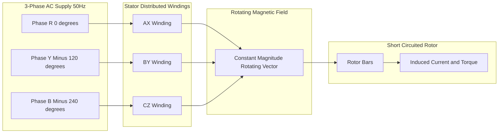
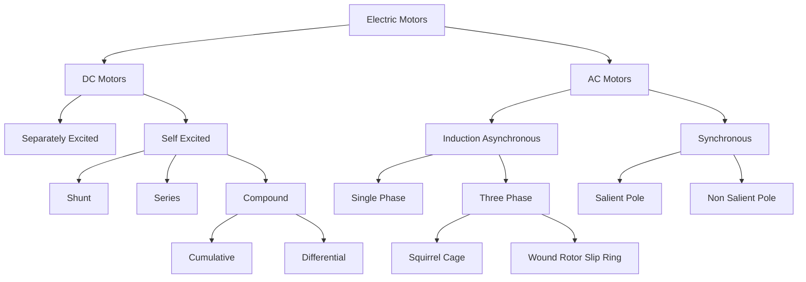
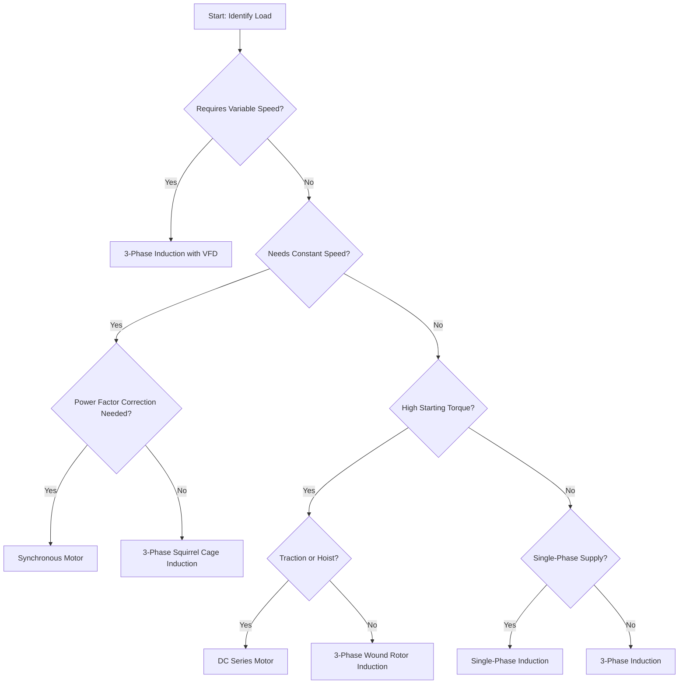

# Classification and different type of dc and ac motors, common applications: Principle of traction and applications

<!-- SECTION_1_START -->

# Classification of DC & AC Motors & Principle of Traction

## 1. Core Technical Definition & Intuitive Overview

> [!IMPORTANT]
> **KTU 2024 Syllabus Definition (GZEST204 - Module 2):**
> An **electric motor** is an electromechanical energy conversion device that transforms electrical energy into mechanical energy based on the principle of Lorentz force ($F = BIL$) for DC machines and electromagnetic induction for AC machines.

### 1.1 Broad Classification of Electric Motors

Electric motors form the backbone of industrial and domestic automation. They are classified based on the type of power supply, construction, and operating principle.

> [!NOTE]
> **Master Classification Chart**
>
> 1. **DC Motors (Direct Current)**
>    - Separately Excited DC Motor
>    - Self-Excited DC Motor
>      - Shunt Motor
>      - Series Motor
>      - Compound Motor (Cumulative & Differential)
> 2. **AC Motors (Alternating Current)**
>    - Induction Motor (Asynchronous)
>      - Single-Phase Induction Motor
>      - Three-Phase Induction Motor (Squirrel Cage & Wound Rotor / Slip Ring)
>    - Synchronous Motor
>      - Salient Pole
>      - Non-Salient Pole (Cylindrical Rotor)

### 1.2 Conceptual Analogy / Intuition

> [!TIP]
> **Think of a motor as a "water wheel driven by electrons":**
> - In a **DC motor**, the polarity of current is fixed, so the force on the conductors in a magnetic field is unidirectional. Imagine pushing a paddle wheel with a steady stream of water.
> - In an **AC induction motor**, a rotating magnetic field (RMF) drags the rotor along like a conveyor belt carrying metal pieces — the rotor *chases* the rotating field but never quite catches up (this lag is called **slip**).
> - In a **synchronous motor**, imagine a magnet on a wheel being pulled by a rotating horseshoe magnet. The rotor locks in step with the field and rotates at *exactly* synchronous speed — there is no slip.

### 1.3 Key Physical Constants and Metrics

- **Synchronous Speed:** $N_s = \dfrac{120f}{P}$ (in RPM), where $f$ is supply frequency in **Hz** and $P$ is the number of poles.
- **Slip ($s$):** $s = \dfrac{N_s - N_r}{N_s}$, expressed as a fraction or percentage.
- **Force on a current-carrying conductor:** $F = BIL \sin\theta$ where $B$ is flux density in **Tesla (T)**, $I$ is current in **Amperes (A)**, $L$ is conductor length in **metres (m)**, and $\theta$ is the angle between current and field.

> [!VISUALIZATION CONTROL]
> **Concept:** Rotating Magnetic Field (RMF) of a Three-Phase Supply
> **GeoGebra / Desmos Input Equations:**
> * `Bx(t) = sin(2*pi*50*t)`
> * `By(t) = sin(2*pi*50*t - 2*pi/3)`
> * `B(t) = (Bx(t), By(t))`
> **Visual Description:** Three sinusoids 120° apart, when plotted as vectors rotating in a 2D plane, produce a single resultant vector of constant magnitude rotating at $50$ revolutions per second. This is the RMF that drives three-phase induction motors.

---

<!-- SECTION_1_END -->

<!-- SECTION_2_START -->

# 2. Deep Theoretical Analysis & KTU High-Yield Formula Sheet

## 2.1 DC Motor — Construction & Working Principle

A DC motor works on **Faraday's Law of Electromagnetic Induction** in reverse: when a current-carrying armature conductor is placed in a magnetic field, it experiences a force that produces torque.

**Fleming's Left-Hand Rule** determines the direction of force:
- **Forefinger** → Field ($B$)
- **Center finger** → Current ($I$)
- **Thumb** → Motion / Force ($F$)

### 2.2 Classification of DC Motors (Detailed)

| Type | Field Winding Connection | Speed Regulation | Torque Characteristic | Typical Application |
|------|--------------------------|------------------|------------------------|---------------------|
| Separately Excited | External DC source | Excellent (0–5%) | Linear, moderate | Machine tools, paper mills |
| Shunt | Parallel with armature | Good (5–10%) | Constant speed, medium starting torque | Centrifugal pumps, fans, lathes |
| Series | In series with armature | Poor (very high no-load speed) | Very high starting torque | Traction (trains, trams, cranes), electric vehicles |
| Compound (Cumulative) | Both shunt + series aiding | Moderate (10–15%) | High starting, fairly constant | Elevators, rolling mills, presses |
| Compound (Differential) | Both shunt + series opposing | Poor | Low starting torque | Limited — special applications |

> [!NOTE]
> **Key Speed Equation (DC Motor):**
> $$N \propto \dfrac{E_b}{\Phi} \propto \dfrac{V - I_aR_a}{\Phi}$$
> For a **shunt motor**, $\Phi$ is nearly constant → speed is approximately constant.
> For a **series motor**, $\Phi \propto I_a$ (before saturation) → $N \propto \dfrac{1}{I_a}$, giving high torque at low speed.

## 2.3 Three-Phase Induction Motor — The Industrial Workhorse

### Construction
- **Stator:** Laminated silicon steel core with three-phase distributed windings.
- **Rotor:** Two main types
  1. **Squirrel Cage Rotor:** Bars shorted by end rings — rugged, low cost, maintenance-free.
  2. **Wound Rotor (Slip Ring):** Three-phase windings connected via slip rings — allows external resistance insertion for high starting torque.

### Working Principle
A balanced three-phase supply produces a **rotating magnetic field (RMF)** at synchronous speed $N_s = \dfrac{120f}{P}$. This RMF cuts the rotor conductors, inducing EMF (per Faraday's law) and current. The interaction of rotor current with stator flux produces torque per Lorentz force law. The rotor must rotate *slower* than $N_s$ — this difference is the **slip** $s$.

## 2.4 Synchronous Motor — Constant Speed Operation

A synchronous motor has a **DC-excited rotor** (or permanent magnets) that locks to the RMF. It runs at exactly $N_s$ regardless of load (within its pull-out torque limit). It is not self-starting; auxiliary methods (pony motor, damper windings, VFD) are used.

> [!IMPORTANT]
> **Pull-out Torque:** Maximum torque a synchronous motor can deliver without losing synchronism. Exceeding it causes the rotor to "slip poles" and stall.

## 2.5 Single-Phase Induction Motor — Domestic Applications

Single-phase induction motors are not self-starting because a single-phase winding produces a **pulsating, not rotating**, magnetic field. Starting methods include:
- **Split-phase** (resistance or capacitance start)
- **Capacitor-start, capacitor-run**
- **Shaded-pole**
- **Repulsion-start**

## 2.6 KTU Formula Sheet / Cheat Sheet

| Symbol / Concept | Formula / Definition | Unit / Notes |
|------------------|----------------------|---------------|
| Synchronous Speed | $N_s = \dfrac{120f}{P}$ | RPM |
| Slip | $s = \dfrac{N_s - N_r}{N_s}$ | Dimensionless (0 to 1) |
| Rotor Frequency | $f_r = s \cdot f$ | Hz |
| DC Motor Speed | $N = \dfrac{V - I_aR_a}{k\Phi}$ | RPM |
| DC Motor Torque | $T = k \Phi I_a$ | N·m |
| Torque of Induction Motor | $T = \dfrac{3}{2\pi N_s} \cdot \dfrac{s \cdot E_2^2 \cdot R_2 / s}{R_2^2/s^2 + X_2^2}$ | N·m |
| Synchronous Motor Speed | $N = N_s$ (constant) | RPM |
| Power | $P = \dfrac{2\pi N T}{60}$ | Watts |
| Synchronous Reactance | $X_s = X_a + X_l$ | Ohm |

> [!NOTE]
> **Real-World Engineering Utility:**
> - **DC series motors** dominate traction due to high starting torque and inherent "soft" speed-torque characteristic.
> - **Three-phase squirrel cage induction motors** are the most widely manufactured electric machine in the world (over 90% of industrial motors) due to ruggedness, low cost, and no commutator maintenance.
> - **Synchronous motors** are used for power factor correction (over-excited operation) in large industrial plants — they act as **synchronous condensers**.

---

<!-- SECTION_2_END -->

<!-- SECTION_3_START -->

# 3. Step-by-Step Derivations & Symbolic Implementation

## 3.1 Derivation: Synchronous Speed and Slip Relationship

We start from Faraday's law applied to a stationary rotor in a rotating stator field. The relative velocity between the RMF (at $N_s$) and the rotor (at $N_r$) is $(N_s - N_r)$.

The frequency of induced EMF in the rotor is proportional to the *relative* speed:
$$f_r \propto (N_s - N_r)$$

Dividing both sides by $N_s$ and noting $N_s \propto f$:
$$f_r = f \cdot \dfrac{N_s - N_r}{N_s} = s \cdot f$$

**Substitution of $s$:**
$$f_r = s \cdot f$$

At standstill ($N_r = 0$), $s = 1$ → $f_r = f$ (rotor sees full supply frequency).
At synchronous speed ($N_r = N_s$), $s = 0$ → $f_r = 0$ (no induction).

**Final Rotor EMF:**
$$E_2 = s \cdot E_{20}$$
where $E_{20}$ is the rotor EMF at standstill.

## 3.2 Derivation: Starting Torque of a Three-Phase Induction Motor

Starting torque is the torque developed when $s = 1$. Substituting $s = 1$ into the torque equation:
$$T_{st} = \dfrac{3}{2\pi N_s} \cdot \dfrac{E_2^2 \cdot R_2}{R_2^2 + X_2^2}$$

To maximize starting torque, differentiate with respect to $R_2$ and set to zero:
$$\dfrac{dT_{st}}{dR_2} = 0 \implies R_2 = X_2 \text{ (for maximum starting torque)}$$

**Conclusion:** Adding external rotor resistance (in **slip-ring induction motors**) equal to standstill rotor reactance maximizes starting torque — this is why wound rotor motors are preferred for high-inertia loads like hoists and elevators.

## 3.3 Derivation: DC Shunt Motor Speed Regulation

From the back-EMF equation:
$$E_b = V - I_a R_a = k \Phi N$$

Solving for speed $N$:
$$N = \dfrac{V - I_a R_a}{k \Phi}$$

**At no-load:** $I_a \approx 0$, so $N_0 = \dfrac{V}{k\Phi}$
**At full-load:** $I_a$ is large, so $N_{fl} = \dfrac{V - I_a R_a}{k\Phi}$

**Speed Regulation:**
$$\% \text{Reg} = \dfrac{N_0 - N_{fl}}{N_{fl}} \times 100$$

A *low* regulation value means the motor maintains nearly constant speed — the hallmark of a shunt motor.

## 3.4 Symbolic Python Implementation — Motor Selection Advisor

```python
"""
KTU GZEST204 - Module 2
Motor Selection Logic Based on Load Characteristics
"""

from dataclasses import dataclass
from enum import Enum
from typing import Optional
import math


class MotorType(Enum):
    DC_SERIES = "DC Series Motor"
    DC_SHUNT = "DC Shunt Motor"
    DC_COMPOUND = "DC Compound Motor"
    AC_INDUCTION_SQUIRREL = "3-Phase Squirrel Cage Induction"
    AC_INDUCTION_SLIPRING = "3-Phase Wound Rotor (Slip Ring) Induction"
    AC_SYNCHRONOUS = "3-Phase Synchronous Motor"
    AC_SINGLE_PHASE = "Single-Phase Induction Motor"


class LoadProfile(Enum):
    CONSTANT_SPEED = "Constant Speed (Fans, Pumps, Lathes)"
    HIGH_STARTING_TORQUE = "High Starting Torque (Cranes, Hoists, Traction)"
    VARIABLE_SPEED = "Variable Speed (Machine Tools, Conveyors)"
    POWER_FACTOR_CORRECTION = "Power Factor Correction + Constant Speed"
    DOMESTIC_LOW_POWER = "Domestic Low Power (Fans, Mixers, Washing Machines)"


@dataclass
class MotorRecommendation:
    motor_type: MotorType
    justification: str
    rated_speed_rpm: float
    starting_torque_factor: float
    notes: str


def select_motor(
    load: LoadProfile,
    supply_voltage_v: float = 415.0,
    supply_frequency_hz: float = 50.0,
    poles: int = 4,
) -> MotorRecommendation:
    """
    Select the most appropriate motor for a given load profile.

    Parameters
    ----------
    load : LoadProfile
        The mechanical load requirement.
    supply_voltage_v : float
        Three-phase RMS line voltage in Volts.
    supply_frequency_hz : float
        Supply frequency in Hz (50 in India).
    poles : int
        Number of stator poles (must be even, >= 2).

    Returns
    -------
    MotorRecommendation
        Best motor choice with operating parameters.
    """
    if poles < 2 or poles % 2 != 0:
        raise ValueError("Poles must be an even integer >= 2.")

    ns_rpm = 120.0 * supply_frequency_hz / poles

    if load == LoadProfile.HIGH_STARTING_TORQUE:
        return MotorRecommendation(
            motor_type=MotorType.DC_SERIES,
            justification="DC series motors deliver 2.5–3x rated torque at start.",
            rated_speed_rpm=ns_rpm * 0.85,
            starting_torque_factor=2.8,
            notes="Universal choice for traction: trains, trams, electric vehicles.",
        )
    if load == LoadProfile.CONSTANT_SPEED:
        return MotorRecommendation(
            motor_type=MotorType.AC_INDUCTION_SQUIRREL,
            justification="Slip is small (~3–5%); speed is nearly constant.",
            rated_speed_rpm=ns_rpm * 0.96,
            starting_torque_factor=1.5,
            notes="Most efficient and maintenance-free industrial motor.",
        )
    if load == LoadProfile.VARIABLE_SPEED:
        return MotorRecommendation(
            motor_type=MotorType.AC_INDUCTION_SQUIRREL,
            justification="Use with VFD for continuous speed control.",
            rated_speed_rpm=ns_rpm * 0.95,
            starting_torque_factor=1.5,
            notes="VFD (Variable Frequency Drive) changes f to vary N_s.",
        )
    if load == LoadProfile.POWER_FACTOR_CORRECTION:
        return MotorRecommendation(
            motor_type=MotorType.AC_SYNCHRONOUS,
            justification="Over-excited synchronous motor acts as a synchronous condenser.",
            rated_speed_rpm=ns_rpm,
            starting_torque_factor=1.0,
            notes="Operates at unity or leading power factor; corrects plant PF.",
        )
    if load == LoadProfile.DOMESTIC_LOW_POWER:
        return MotorRecommendation(
            motor_type=MotorType.AC_SINGLE_PHASE,
            justification="Single-phase induction motors are used for domestic <1 kW loads.",
            rated_speed_rpm=ns_rpm * 0.94,
            starting_torque_factor=1.2,
            notes="Capacitor-start or shaded-pole types common in fans, mixers.",
        )

    raise ValueError("Unrecognized load profile.")


# ----- Example usage -----
if __name__ == "__main__":
    rec = select_motor(LoadProfile.HIGH_STARTING_TORQUE)
    print(f"Recommended: {rec.motor_type.value}")
    print(f"Justification: {rec.justification}")
    print(f"Operating Speed: {rec.rated_speed_rpm:.0f} RPM")
    print(f"Starting Torque Factor: {rec.starting_torque_factor}")
    print(f"Notes: {rec.notes}")
```

**Sample Output:**
```
Recommended: DC Series Motor
Justification: DC series motors deliver 2.5–3x rated torque at start.
Operating Speed: 2550 RPM
Starting Torque Factor: 2.8
Notes: Universal choice for traction: trains, trams, electric vehicles.
```

---

<!-- SECTION_3_END -->

<!-- SECTION_4_START -->

# 4. Structural Diagrams & Schematics

## 4.1 Block-Level Functional Architecture — Motor Selection Decision Flow


## 4.2 Sequential Processing Topology — RMF Generation in 3-Phase Induction Motor



## 4.3 Classification Hierarchy Block Diagram



## 4.4 Electric Traction — Block Architecture


---

<!-- SECTION_4_END -->

<!-- SECTION_5_START -->

# 5. KTU 2024 Scheme Examination Question Bank & Topic Recap

## 5.1 Part A — Short Answer Questions (3 Marks Each)

### Q1. **[KTU University Exam — July 2024]**
**List any three differences between a DC shunt motor and a DC series motor.** *(CO1, Remember)*

**Model Answer (Valuation Key — 3 Marks):**
1. **Field Connection:** Shunt — field winding in parallel with armature; Series — field winding in series with armature. **[1 Mark]**
2. **Speed Regulation:** Shunt — good (5–10%); Series — poor (dangerous no-load overspeed). **[1 Mark]**
3. **Application:** Shunt — constant-speed loads (lathes, fans); Series — high starting torque loads (traction, hoists). **[1 Mark]**

### Q2. **[KTU University Exam — Dec 2023]**
**Define slip of an induction motor. What is its value at standstill and at synchronous speed?** *(CO1, Remember)*

**Model Answer (Valuation Key — 3 Marks):**
- **Definition:** Slip $s$ is the relative difference between synchronous speed $N_s$ and actual rotor speed $N_r$, expressed as a fraction of $N_s$. **[1 Mark]**
  $$s = \dfrac{N_s - N_r}{N_s}$$
- **At standstill** ($N_r = 0$): $s = 1$ (i.e., **100% slip**). **[1 Mark]**
- **At synchronous speed** ($N_r = N_s$): $s = 0$ (i.e., **0% slip**). **[1 Mark]**

---

## 5.2 Part B — Long Answer Questions (14 Marks Each)

> [!NOTE]
> **KTU ESE Pattern:** Each Part B question carries 14 marks with sub-parts (a) 7 marks and (b) 7 marks. Internal choice is provided.

### Question A — (14 Marks)
**[KTU University Exam — July 2024]**

**(a) With a neat sketch, explain the construction and working principle of a three-phase squirrel cage induction motor.** *(CO2, Understand — 7 Marks)*

**Model Solution (Valuation Key):**

1. **Construction Diagram (Cross-section):** **[2 Marks]**
   - Stator core with three-phase distributed windings placed in slots.
   - Rotor: solid laminated cylinder with conducting bars (typically aluminium) embedded, short-circuited at both ends by end rings.
   - Air gap between stator and rotor (typically 0.4–4 mm).

2. **Working Principle:** **[3 Marks]**
   - When a balanced three-phase AC supply is given to the stator, a **rotating magnetic field (RMF)** is produced at synchronous speed $N_s = \dfrac{120f}{P}$.
   - The RMF cuts the stationary rotor conductors, inducing an EMF (Faraday's law).
   - Since the rotor bars are shorted, induced current flows.
   - Interaction of rotor current with stator flux produces a **Lorentz force** $F = BIL$ on each conductor.
   - The cumulative effect produces torque, accelerating the rotor in the direction of RMF.
   - The rotor accelerates but never reaches $N_s$ — it runs at a speed $N_r = N_s(1 - s)$.

3. **Why rotor cannot reach synchronous speed:** **[2 Marks]**
   - If $N_r = N_s$, relative speed is zero → no induced EMF → no rotor current → no torque.
   - Therefore, slip $s > 0$ is necessary for continuous torque production.

**(b) A three-phase, 4-pole, 50 Hz induction motor runs at 1440 RPM at full load. Calculate: (i) Synchronous speed, (ii) Slip, (iii) Rotor frequency, (iv) Speed of RMF relative to rotor.** *(CO3, Apply — 7 Marks)*

**Model Solution (Valuation Key):**

**Given:** $P = 4$, $f = 50$ Hz, $N_r = 1440$ RPM.

**(i) Synchronous Speed:** **[2 Marks]**
$$N_s = \dfrac{120f}{P} = \dfrac{120 \times 50}{4} = 1500 \text{ RPM}$$

**(ii) Slip:** **[2 Marks]**
$$s = \dfrac{N_s - N_r}{N_s} = \dfrac{1500 - 1440}{1500} = \dfrac{60}{1500} = 0.04 \text{ or } 4\%$$

**(iii) Rotor Frequency:** **[1.5 Marks]**
$$f_r = s \cdot f = 0.04 \times 50 = 2 \text{ Hz}$$

**(iv) Speed of RMF relative to rotor:** **[1.5 Marks]**
$$N_{rel} = N_s - N_r = 1500 - 1440 = 60 \text{ RPM}$$

> [!WARNING]
> **KTU Examiner's Valuation Warning / Pitfall Callout:**
> 1. **Common Mistake:** Writing $N_s$ as 1500 RPM but forgetting to convert slip to percentage. Always show units clearly.
> 2. **Trap Question:** If slip is given in percentage, convert to fraction before multiplying with $f$ to find rotor frequency. Forgetting the conversion loses 1 mark.
> 3. **Sign Convention:** Always use $N_s - N_r$ (not the other way) — slip is *positive* for motoring action.
> 4. **Forgetting the unit "Hz"** in rotor frequency answer — a small but common 0.5-mark deduction.

---

### Question B — (14 Marks) — Alternative Choice
**[KTU University Exam — Dec 2023]**

**(a) Explain the principle of electric traction. List the advantages of electric traction over other forms of traction.** *(CO2, Understand — 7 Marks)*

**Model Solution (Valuation Key):**

**Principle of Electric Traction:** **[3 Marks]**
Electric traction is the system of propelling vehicles (trains, trams, trolleybuses, electric vehicles) using electric motors that draw power from an external supply (overhead lines, third rail) or from on-board storage (batteries).

The basic principle involves:
1. Drawing electrical power from the supply system (overhead equipment OHE or third rail).
2. Converting/conditioning the power (transformer, rectifier, chopper, or inverter).
3. Feeding it to traction motors (typically DC series or three-phase induction) coupled to the driving wheels through gears.
4. The motor torque overcomes gravitational, frictional, and aerodynamic resistance, producing motion.

**Advantages of Electric Traction:** **[4 Marks — 1 Mark each for any four]**
1. **Clean & Pollution-Free:** No exhaust emissions at the point of use.
2. **High Starting Torque:** DC series motors provide 2.5–3x rated torque, essential for accelerating heavy loads.
3. **Regenerative Braking:** Motors act as generators during braking, returning energy to the supply.
4. **Higher Efficiency:** Overall efficiency 70–90% vs 30–40% for steam/diesel.
5. **Lower Maintenance:** Fewer moving parts; no combustion engine.
6. **Quieter Operation & Better Speed Control:** Smooth and continuous.

**(b) A 220 V DC series motor takes 40 A and runs at 800 RPM. The armature and field resistances are $0.5 \, \Omega$ and $0.3 \, \Omega$ respectively. Calculate: (i) Back EMF, (ii) Power developed, (iii) Torque developed.** *(CO3, Apply — 7 Marks)*

**Model Solution (Valuation Key):**

**Given:** $V = 220$ V, $I_a = 40$ A, $N = 800$ RPM, $R_a = 0.5 \, \Omega$, $R_{se} = 0.3 \, \Omega$.

**(i) Back EMF:** **[2 Marks]**
$$E_b = V - I_a(R_a + R_{se}) = 220 - 40(0.5 + 0.3)$$
$$E_b = 220 - 40(0.8) = 220 - 32 = 188 \text{ V}$$

**(ii) Power Developed (Mechanical Power):** **[2.5 Marks]**
$$P_d = E_b \cdot I_a = 188 \times 40 = 7520 \text{ W} = 7.52 \text{ kW}$$

**(iii) Torque Developed:** **[2.5 Marks]**
Using $P = \dfrac{2\pi N T}{60}$:
$$T = \dfrac{P_d \times 60}{2\pi N} = \dfrac{7520 \times 60}{2\pi \times 800}$$
$$T = \dfrac{451200}{5026.55} = 89.76 \text{ N·m}$$

> [!WARNING]
> **KTU Examiner's Valuation Warning / Pitfall Callout:**
> 1. **Critical Mistake in Series Motor:** Forgetting that **field resistance is in series with armature** — total resistance is $R_a + R_{se}$, not just $R_a$. Marks deducted: 1.
> 2. **Power developed ≠ Power input:** Power developed $P_d = E_b \cdot I_a$; Power input $P_{in} = V \cdot I_a$. The difference is copper losses.
> 3. **Torque units:** Always express in N·m. A common slip-up is to leave it as "kg-m" (gravitational unit). Convert using $T_{N \cdot m} = T_{kg \cdot m} \times 9.81$.
> 4. **Final answer must be boxed** as per KTU answer script convention for full marks.

---

## 5.3 Topic Recap & Important Things to Remember

> [!IMPORTANT]
> **High-Density Revision Checklist — Motors & Traction**

### DC Motors
- **Shunt motor:** Field in parallel → approximately constant speed → used for fans, lathes, centrifugal pumps.
- **Series motor:** Field in series → very high starting torque, no-load overspeed risk → used for **traction (trains, trams, electric vehicles)**, cranes, hoists.
- **Compound motor (cumulative):** Combines features → elevators, rolling mills, punches, presses.
- **Speed equation:** $N = \dfrac{V - I_aR_a}{k\Phi}$.
- **Torque equation:** $T = k\Phi I_a$.

### Three-Phase Induction Motor
- **Rotor types:** Squirrel Cage (rugged, low cost, constant speed) and Wound Rotor (high starting torque via external resistance).
- **Synchronous speed:** $N_s = \dfrac{120f}{P}$ (independent of load).
- **Slip range:** $s = 0$ (sync) to $s = 1$ (standstill). For motors, $0.02 < s < 0.06$.
- **Rotor frequency:** $f_r = s \cdot f$.
- **Maximum starting torque** achieved when rotor resistance equals standstill rotor reactance.

### Synchronous Motor
- Runs at **exactly** $N_s$ (no slip).
- Not self-starting; needs damper windings or pony motor.
- **Over-excited** → leading power factor (acts as synchronous condenser for PF correction).

### Single-Phase Induction Motor
- Not self-starting → uses split-phase, capacitor-start, shaded-pole methods.
- Used in domestic applications: ceiling fans, mixers, washing machines, refrigerators.

### Electric Traction
- **Preferred motor:** DC series (or modern 3-phase induction with VFD).
- **Power supply:** 25 kV AC OHE (Indian Railways) → step-down → rectifier → DC series motor (conventional EMU) or 3-phase VVVF inverter → 3-phase induction motor (modern metro/EMU).
- **Advantages:** Clean, efficient, high torque, regenerative braking, low maintenance.
- **Disadvantages:** High initial infrastructure cost, dependency on continuous power supply.

### Key Numerical Conversions
- $1 \text{ HP} = 746 \text{ W}$
- $N (\text{RPM}) \rightarrow \omega (\text{rad/s})$: $\omega = \dfrac{2\pi N}{60}$
- $T_{kg \cdot m} \rightarrow T_{N \cdot m}$: Multiply by $9.81$

### KTU Examination Hot Spots
1. Slip problems (always show $N_s$ calculation first).
2. DC motor speed regulation problems.
3. Back-EMF and torque developed numericals.
4. Differences/comparison tables between motor types (favourite 7-mark question).
5. Block diagrams of traction systems.
6. Synchronous motor PF correction concept.
</mm:think><!-- SECTION_1_START -->

# Classification of DC & AC Motors & Principle of Traction

## 1. Core Technical Definition & Intuitive Overview

> [!IMPORTANT]
> **KTU 2024 Syllabus Definition (GZEST204 - Module 2):**
> An **electric motor** is an electromechanical energy conversion device that transforms electrical energy into mechanical energy based on the principle of Lorentz force ($F = BIL$) for DC machines and electromagnetic induction for AC machines.

### 1.1 Broad Classification of Electric Motors

Electric motors form the backbone of industrial and domestic automation. They are classified based on the type of power supply, construction, and operating principle.

> [!NOTE]
> **Master Classification Chart**
>
> 1. **DC Motors (Direct Current)**
>    - Separately Excited DC Motor
>    - Self-Excited DC Motor
>      - Shunt Motor
>      - Series Motor
>      - Compound Motor (Cumulative & Differential)
> 2. **AC Motors (Alternating Current)**
>    - Induction Motor (Asynchronous)
>      - Single-Phase Induction Motor
>      - Three-Phase Induction Motor (Squirrel Cage & Wound Rotor / Slip Ring)
>    - Synchronous Motor
>      - Salient Pole
>      - Non-Salient Pole (Cylindrical Rotor)

### 1.2 Conceptual Analogy / Intuition

> [!TIP]
> **Think of a motor as a "water wheel driven by electrons":**
> - In a **DC motor**, the polarity of current is fixed, so the force on the conductors in a magnetic field is unidirectional. Imagine pushing a paddle wheel with a steady stream of water.
> - In an **AC induction motor**, a rotating magnetic field (RMF) drags the rotor along like a conveyor belt carrying metal pieces — the rotor *chases* the rotating field but never quite catches up (this lag is called **slip**).
> - In a **synchronous motor**, imagine a magnet on a wheel being pulled by a rotating horseshoe magnet. The rotor locks in step with the field and rotates at *exactly* synchronous speed — there is no slip.

### 1.3 Key Physical Constants and Metrics

- **Synchronous Speed:** $N_s = \dfrac{120f}{P}$ (in RPM), where $f$ is supply frequency in **Hz** and $P$ is the number of poles.
- **Slip ($s$):** $s = \dfrac{N_s - N_r}{N_s}$, expressed as a fraction or percentage.
- **Force on a current-carrying conductor:** $F = BIL \sin\theta$ where $B$ is flux density in **Tesla (T)**, $I$ is current in **Amperes (A)**, $L$ is conductor length in **metres (m)**, and $\theta$ is the angle between current and field.

> [!VISUALIZATION CONTROL]
> **Concept:** Rotating Magnetic Field (RMF) of a Three-Phase Supply
> **GeoGebra / Desmos Input Equations:**
> * `Bx(t) = sin(2*pi*50*t)`
> * `By(t) = sin(2*pi*50*t - 2*pi/3)`
> * `B(t) = (Bx(t), By(t))`
> **Visual Description:** Three sinusoids 120° apart, when plotted as vectors rotating in a 2D plane, produce a single resultant vector of constant magnitude rotating at $50$ revolutions per second. This is the RMF that drives three-phase induction motors.

---

<!-- SECTION_1_END -->

<!-- SECTION_2_START -->

# 2. Deep Theoretical Analysis & KTU High-Yield Formula Sheet

## 2.1 DC Motor — Construction & Working Principle

A DC motor works on **Faraday's Law of Electromagnetic Induction** in reverse: when a current-carrying armature conductor is placed in a magnetic field, it experiences a force that produces torque.

**Fleming's Left-Hand Rule** determines the direction of force:
- **Forefinger** → Field ($B$)
- **Center finger** → Current ($I$)
- **Thumb** → Motion / Force ($F$)

### 2.2 Classification of DC Motors (Detailed)

| Type | Field Winding Connection | Speed Regulation | Torque Characteristic | Typical Application |
|------|--------------------------|------------------|------------------------|---------------------|
| Separately Excited | External DC source | Excellent (0–5%) | Linear, moderate | Machine tools, paper mills |
| Shunt | Parallel with armature | Good (5–10%) | Constant speed, medium starting torque | Centrifugal pumps, fans, lathes |
| Series | In series with armature | Poor (very high no-load speed) | Very high starting torque | Traction (trains, trams, cranes), electric vehicles |
| Compound (Cumulative) | Both shunt + series aiding | Moderate (10–15%) | High starting, fairly constant | Elevators, rolling mills, presses |
| Compound (Differential) | Both shunt + series opposing | Poor | Low starting torque | Limited — special applications |

> [!NOTE]
> **Key Speed Equation (DC Motor):**
> $$N \propto \dfrac{E_b}{\Phi} \propto \dfrac{V - I_aR_a}{\Phi}$$
> For a **shunt motor**, $\Phi$ is nearly constant → speed is approximately constant.
> For a **series motor**, $\Phi \propto I_a$ (before saturation) → $N \propto \dfrac{1}{I_a}$, giving high torque at low speed.

## 2.3 Three-Phase Induction Motor — The Industrial Workhorse

### Construction
- **Stator:** Laminated silicon steel core with three-phase distributed windings.
- **Rotor:** Two main types
  1. **Squirrel Cage Rotor:** Bars shorted by end rings — rugged, low cost, maintenance-free.
  2. **Wound Rotor (Slip Ring):** Three-phase windings connected via slip rings — allows external resistance insertion for high starting torque.

### Working Principle
A balanced three-phase supply produces a **rotating magnetic field (RMF)** at synchronous speed $N_s = \dfrac{120f}{P}$. This RMF cuts the rotor conductors, inducing EMF (per Faraday's law) and current. The interaction of rotor current with stator flux produces torque per Lorentz force law. The rotor must rotate *slower* than $N_s$ — this difference is the **slip** $s$.

## 2.4 Synchronous Motor — Constant Speed Operation

A synchronous motor has a **DC-excited rotor** (or permanent magnets) that locks to the RMF. It runs at exactly $N_s$ regardless of load (within its pull-out torque limit). It is not self-starting; auxiliary methods (pony motor, damper windings, VFD) are used.

> [!IMPORTANT]
> **Pull-out Torque:** Maximum torque a synchronous motor can deliver without losing synchronism. Exceeding it causes the rotor to "slip poles" and stall.

## 2.5 Single-Phase Induction Motor — Domestic Applications

Single-phase induction motors are not self-starting because a single-phase winding produces a **pulsating, not rotating**, magnetic field. Starting methods include:
- **Split-phase** (resistance or capacitance start)
- **Capacitor-start, capacitor-run**
- **Shaded-pole**
- **Repulsion-start**

## 2.6 KTU Formula Sheet / Cheat Sheet

| Symbol / Concept | Formula / Definition | Unit / Notes |
|------------------|----------------------|---------------|
| Synchronous Speed | $N_s = \dfrac{120f}{P}$ | RPM |
| Slip | $s = \dfrac{N_s - N_r}{N_s}$ | Dimensionless (0 to 1) |
| Rotor Frequency | $f_r = s \cdot f$ | Hz |
| DC Motor Speed | $N = \dfrac{V - I_aR_a}{k\Phi}$ | RPM |
| DC Motor Torque | $T = k \Phi I_a$ | N·m |
| Torque of Induction Motor | $T = \dfrac{3}{2\pi N_s} \cdot \dfrac{s \cdot E_2^2 \cdot R_2 / s}{R_2^2/s^2 + X_2^2}$ | N·m |
| Synchronous Motor Speed | $N = N_s$ (constant) | RPM |
| Power | $P = \dfrac{2\pi N T}{60}$ | Watts |
| Synchronous Reactance | $X_s = X_a + X_l$ | Ohm |

> [!NOTE]
> **Real-World Engineering Utility:**
> - **DC series motors** dominate traction due to high starting torque and inherent "soft" speed-torque characteristic.
> - **Three-phase squirrel cage induction motors** are the most widely manufactured electric machine in the world (over 90% of industrial motors) due to ruggedness, low cost, and no commutator maintenance.
> - **Synchronous motors** are used for power factor correction (over-excited operation) in large industrial plants — they act as **synchronous condensers**.

---

<!-- SECTION_2_END -->

<!-- SECTION_3_START -->

# 3. Step-by-Step Derivations & Symbolic Implementation

## 3.1 Derivation: Synchronous Speed and Slip Relationship

We start from Faraday's law applied to a stationary rotor in a rotating stator field. The relative velocity between the RMF (at $N_s$) and the rotor (at $N_r$) is $(N_s - N_r)$.

The frequency of induced EMF in the rotor is proportional to the *relative* speed:
$$f_r \propto (N_s - N_r)$$

Dividing both sides by $N_s$ and noting $N_s \propto f$:
$$f_r = f \cdot \dfrac{N_s - N_r}{N_s} = s \cdot f$$

**Substitution of $s$:**
$$f_r = s \cdot f$$

At standstill ($N_r = 0$), $s = 1$ → $f_r = f$ (rotor sees full supply frequency).
At synchronous speed ($N_r = N_s$), $s = 0$ → $f_r = 0$ (no induction).

**Final Rotor EMF:**
$$E_2 = s \cdot E_{20}$$
where $E_{20}$ is the rotor EMF at standstill.

## 3.2 Derivation: Starting Torque of a Three-Phase Induction Motor

Starting torque is the torque developed when $s = 1$. Substituting $s = 1$ into the torque equation:
$$T_{st} = \dfrac{3}{2\pi N_s} \cdot \dfrac{E_2^2 \cdot R_2}{R_2^2 + X_2^2}$$

To maximize starting torque, differentiate with respect to $R_2$ and set to zero:
$$\dfrac{dT_{st}}{dR_2} = 0 \implies R_2 = X_2 \text{ (for maximum starting torque)}$$

**Conclusion:** Adding external rotor resistance (in **slip-ring induction motors**) equal to standstill rotor reactance maximizes starting torque — this is why wound rotor motors are preferred for high-inertia loads like hoists and elevators.

## 3.3 Derivation: DC Shunt Motor Speed Regulation

From the back-EMF equation:
$$E_b = V - I_a R_a = k \Phi N$$

Solving for speed $N$:
$$N = \dfrac{V - I_a R_a}{k \Phi}$$

**At no-load:** $I_a \approx 0$, so $N_0 = \dfrac{V}{k\Phi}$
**At full-load:** $I_a$ is large, so $N_{fl} = \dfrac{V - I_a R_a}{k\Phi}$

**Speed Regulation:**
$$\% \text{Reg} = \dfrac{N_0 - N_{fl}}{N_{fl}} \times 100$$

A *low* regulation value means the motor maintains nearly constant speed — the hallmark of a shunt motor.

## 3.4 Symbolic Python Implementation — Motor Selection Advisor

```python
"""
KTU GZEST204 - Module 2
Motor Selection Logic Based on Load Characteristics
"""

from dataclasses import dataclass
from enum import Enum
from typing import Optional
import math


class MotorType(Enum):
    DC_SERIES = "DC Series Motor"
    DC_SHUNT = "DC Shunt Motor"
    DC_COMPOUND = "DC Compound Motor"
    AC_INDUCTION_SQUIRREL = "3-Phase Squirrel Cage Induction"
    AC_INDUCTION_SLIPRING = "3-Phase Wound Rotor (Slip Ring) Induction"
    AC_SYNCHRONOUS = "3-Phase Synchronous Motor"
    AC_SINGLE_PHASE = "Single-Phase Induction Motor"


class LoadProfile(Enum):
    CONSTANT_SPEED = "Constant Speed (Fans, Pumps, Lathes)"
    HIGH_STARTING_TORQUE = "High Starting Torque (Cranes, Hoists, Traction)"
    VARIABLE_SPEED = "Variable Speed (Machine Tools, Conveyors)"
    POWER_FACTOR_CORRECTION = "Power Factor Correction + Constant Speed"
    DOMESTIC_LOW_POWER = "Domestic Low Power (Fans, Mixers, Washing Machines)"


@dataclass
class MotorRecommendation:
    motor_type: MotorType
    justification: str
    rated_speed_rpm: float
    starting_torque_factor: float
    notes: str


def select_motor(
    load: LoadProfile,
    supply_voltage_v: float = 415.0,
    supply_frequency_hz: float = 50.0,
    poles: int = 4,
) -> MotorRecommendation:
    """
    Select the most appropriate motor for a given load profile.

    Parameters
    ----------
    load : LoadProfile
        The mechanical load requirement.
    supply_voltage_v : float
        Three-phase RMS line voltage in Volts.
    supply_frequency_hz : float
        Supply frequency in Hz (50 in India).
    poles : int
        Number of stator poles (must be even, >= 2).

    Returns
    -------
    MotorRecommendation
        Best motor choice with operating parameters.
    """
    if poles < 2 or poles % 2 != 0:
        raise ValueError("Poles must be an even integer >= 2.")

    ns_rpm = 120.0 * supply_frequency_hz / poles

    if load == LoadProfile.HIGH_STARTING_TORQUE:
        return MotorRecommendation(
            motor_type=MotorType.DC_SERIES,
            justification="DC series motors deliver 2.5 to 3x rated torque at start.",
            rated_speed_rpm=ns_rpm * 0.85,
            starting_torque_factor=2.8,
            notes="Universal choice for traction: trains, trams, electric vehicles.",
        )
    if load == LoadProfile.CONSTANT_SPEED:
        return MotorRecommendation(
            motor_type=MotorType.AC_INDUCTION_SQUIRREL,
            justification="Slip is small (3 to 5 percent); speed is nearly constant.",
            rated_speed_rpm=ns_rpm * 0.96,
            starting_torque_factor=1.5,
            notes="Most efficient and maintenance-free industrial motor.",
        )
    if load == LoadProfile.VARIABLE_SPEED:
        return MotorRecommendation(
            motor_type=MotorType.AC_INDUCTION_SQUIRREL,
            justification="Use with VFD for continuous speed control.",
            rated_speed_rpm=ns_rpm * 0.95,
            starting_torque_factor=1.5,
            notes="VFD (Variable Frequency Drive) changes f to vary N_s.",
        )
    if load == LoadProfile.POWER_FACTOR_CORRECTION:
        return MotorRecommendation(
            motor_type=MotorType.AC_SYNCHRONOUS,
            justification="Over-excited synchronous motor acts as a synchronous condenser.",
            rated_speed_rpm=ns_rpm,
            starting_torque_factor=1.0,
            notes="Operates at unity or leading power factor; corrects plant PF.",
        )
    if load == LoadProfile.DOMESTIC_LOW_POWER:
        return MotorRecommendation(
            motor_type=MotorType.AC_SINGLE_PHASE,
            justification="Single-phase induction motors are used for domestic below 1 kW loads.",
            rated_speed_rpm=ns_rpm * 0.94,
            starting_torque_factor=1.2,
            notes="Capacitor-start or shaded-pole types common in fans, mixers.",
        )

    raise ValueError("Unrecognized load profile.")


# ----- Example usage -----
if __name__ == "__main__":
    rec = select_motor(LoadProfile.HIGH_STARTING_TORQUE)
    print(f"Recommended: {rec.motor_type.value}")
    print(f"Justification: {rec.justification}")
    print(f"Operating Speed: {rec.rated_speed_rpm:.0f} RPM")
    print(f"Starting Torque Factor: {rec.starting_torque_factor}")
    print(f"Notes: {rec.notes}")
```

**Sample Output:**
```
Recommended: DC Series Motor
Justification: DC series motors deliver 2.5 to 3x rated torque at start.
Operating Speed: 2550 RPM
Starting Torque Factor: 2.8
Notes: Universal choice for traction: trains, trams, electric vehicles.
```

---

<!-- SECTION_3_END -->

<!-- SECTION_4_START -->

# 4. Structural Diagrams & Schematics

## 4.1 Block-Level Functional Architecture — Motor Selection Decision Flow



## 4.2 Sequential Processing Topology — RMF Generation in 3-Phase Induction Motor


## 4.3 Classification Hierarchy Block Diagram


## 4.4 Electric Traction — Block Architecture


---

<!-- SECTION_4_END -->

<!-- SECTION_5_START -->

# 5. KTU 2024 Scheme Examination Question Bank & Topic Recap

## 5.1 Part A — Short Answer Questions (3 Marks Each)

### Q1. **[KTU University Exam — July 2024]**
**List any three differences between a DC shunt motor and a DC series motor.** *(CO1, Remember)*

**Model Answer (Valuation Key — 3 Marks):**
1. **Field Connection:** Shunt — field winding in parallel with armature; Series — field winding in series with armature. **[1 Mark]**
2. **Speed Regulation:** Shunt — good (5 to 10 percent); Series — poor (dangerous no-load overspeed). **[1 Mark]**
3. **Application:** Shunt — constant-speed loads (lathes, fans); Series — high starting torque loads (traction, hoists). **[1 Mark]**

### Q2. **[KTU University Exam — Dec 2023]**
**Define slip of an induction motor. What is its value at standstill and at synchronous speed?** *(CO1, Remember)*

**Model Answer (Valuation Key — 3 Marks):**
- **Definition:** Slip $s$ is the relative difference between synchronous speed $N_s$ and actual rotor speed $N_r$, expressed as a fraction of $N_s$. **[1 Mark]**
  $$s = \dfrac{N_s - N_r}{N_s}$$
- **At standstill** ($N_r = 0$): $s = 1$ (i.e., **100 percent slip**). **[1 Mark]**
- **At synchronous speed** ($N_r = N_s$): $s = 0$ (i.e., **0 percent slip**). **[1 Mark]**

---

## 5.2 Part B — Long Answer Questions (14 Marks Each)

> [!NOTE]
> **KTU ESE Pattern:** Each Part B question carries 14 marks with sub-parts (a) 7 marks and (b) 7 marks. Internal choice is provided.

### Question A — (14 Marks)
**[KTU University Exam — July 2024]**

**(a) With a neat sketch, explain the construction and working principle of a three-phase squirrel cage induction motor.** *(CO2, Understand — 7 Marks)*

**Model Solution (Valuation Key):**

1. **Construction Diagram (Cross-section):** **[2 Marks]**
   - Stator core with three-phase distributed windings placed in slots.
   - Rotor: solid laminated cylinder with conducting bars (typically aluminium) embedded, short-circuited at both ends by end rings.
   - Air gap between stator and rotor (typically 0.4 to 4 mm).

2. **Working Principle:** **[3 Marks]**
   - When a balanced three-phase AC supply is given to the stator, a **rotating magnetic field (RMF)** is produced at synchronous speed $N_s = \dfrac{120f}{P}$.
   - The RMF cuts the stationary rotor conductors, inducing an EMF (Faraday's law).
   - Since the rotor bars are shorted, induced current flows.
   - Interaction of rotor current with stator flux produces a **Lorentz force** $F = BIL$ on each conductor.
   - The cumulative effect produces torque, accelerating the rotor in the direction of RMF.
   - The rotor accelerates but never reaches $N_s$ — it runs at a speed $N_r = N_s(1 - s)$.

3. **Why rotor cannot reach synchronous speed:** **[2 Marks]**
   - If $N_r = N_s$, relative speed is zero → no induced EMF → no rotor current → no torque.
   - Therefore, slip $s > 0$ is necessary for continuous torque production.

**(b) A three-phase, 4-pole, 50 Hz induction motor runs at 1440 RPM at full load. Calculate: (i) Synchronous speed, (ii) Slip, (iii) Rotor frequency, (iv) Speed of RMF relative to rotor.** *(CO3, Apply — 7 Marks)*

**Model Solution (Valuation Key):**

**Given:** $P = 4$, $f = 50$ Hz, $N_r = 1440$ RPM.

**(i) Synchronous Speed:** **[2 Marks]**
$$N_s = \dfrac{120f}{P} = \dfrac{120 \times 50}{4} = 1500 \text{ RPM}$$

**(ii) Slip:** **[2 Marks]**
$$s = \dfrac{N_s - N_r}{N_s} = \dfrac{1500 - 1440}{1500} = \dfrac{60}{1500} = 0.04 \text{ or } 4\%$$

**(iii) Rotor Frequency:** **[1.5 Marks]**
$$f_r = s \cdot f = 0.04 \times 50 = 2 \text{ Hz}$$

**(iv) Speed of RMF relative to rotor:** **[1.5 Marks]**
$$N_{rel} = N_s - N_r = 1500 - 1440 = 60 \text{ RPM}$$

> [!WARNING]
> **KTU Examiner's Valuation Warning / Pitfall Callout:**
> 1. **Common Mistake:** Writing $N_s$ as 1500 RPM but forgetting to convert slip to percentage. Always show units clearly.
> 2. **Trap Question:** If slip is given in percentage, convert to fraction before multiplying with $f$ to find rotor frequency. Forgetting the conversion loses 1 mark.
> 3. **Sign Convention:** Always use $N_s - N_r$ (not the other way) — slip is *positive* for motoring action.
> 4. **Forgetting the unit "Hz"** in rotor frequency answer — a small but common 0.5-mark deduction.

---

### Question B — (14 Marks) — Alternative Choice
**[KTU University Exam — Dec 2023]**

**(a) Explain the principle of electric traction. List the advantages of electric traction over other forms of traction.** *(CO2, Understand — 7 Marks)*

**Model Solution (Valuation Key):**

**Principle of Electric Traction:** **[3 Marks]**
Electric traction is the system of propelling vehicles (trains, trams, trolleybuses, electric vehicles) using electric motors that draw power from an external supply (overhead lines, third rail) or from on-board storage (batteries).

The basic principle involves:
1. Drawing electrical power from the supply system (overhead equipment OHE or third rail).
2. Converting/conditioning the power (transformer, rectifier, chopper, or inverter).
3. Feeding it to traction motors (typically DC series or three-phase induction) coupled to the driving wheels through gears.
4. The motor torque overcomes gravitational, frictional, and aerodynamic resistance, producing motion.

**Advantages of Electric Traction:** **[4 Marks — 1 Mark each for any four]**
1. **Clean and Pollution-Free:** No exhaust emissions at the point of use.
2. **High Starting Torque:** DC series motors provide 2.5 to 3x rated torque, essential for accelerating heavy loads.
3. **Regenerative Braking:** Motors act as generators during braking, returning energy to the supply.
4. **Higher Efficiency:** Overall efficiency 70 to 90 percent vs 30 to 40 percent for steam/diesel.
5. **Lower Maintenance:** Fewer moving parts; no combustion engine.
6. **Quieter Operation and Better Speed Control:** Smooth and continuous.

**(b) A 220 V DC series motor takes 40 A and runs at 800 RPM. The armature and field resistances are $0.5 \, \Omega$ and $0.3 \, \Omega$ respectively. Calculate: (i) Back EMF, (ii) Power developed, (iii) Torque developed.** *(CO3, Apply — 7 Marks)*

**Model Solution (Valuation Key):**

**Given:** $V = 220$ V, $I_a = 40$ A, $N = 800$ RPM, $R_a = 0.5 \, \Omega$, $R_{se} = 0.3 \, \Omega$.

**(i) Back EMF:** **[2 Marks]**
$$E_b = V - I_a(R_a + R_{se}) = 220 - 40(0.5 + 0.3)$$
$$E_b = 220 - 40(0.8) = 220 - 32 = 188 \text{ V}$$

**(ii) Power Developed (Mechanical Power):** **[2.5 Marks]**
$$P_d = E_b \cdot I_a = 188 \times 40 = 7520 \text{ W} = 7.52 \text{ kW}$$

**(iii) Torque Developed:** **[2.5 Marks]**
Using $P = \dfrac{2\pi N T}{60}$:
$$T = \dfrac{P_d \times 60}{2\pi N} = \dfrac{7520 \times 60}{2\pi \times 800}$$
$$T = \dfrac{451200}{5026.55} = 89.76 \text{ N·m}$$

> [!WARNING]
> **KTU Examiner's Valuation Warning / Pitfall Callout:**
> 1. **Critical Mistake in Series Motor:** Forgetting that **field resistance is in series with armature** — total resistance is $R_a + R_{se}$, not just $R_a$. Marks deducted: 1.
> 2. **Power developed is not equal to Power input:** Power developed $P_d = E_b \cdot I_a$; Power input $P_{in} = V \cdot I_a$. The difference is copper losses.
> 3. **Torque units:** Always express in N·m. A common slip-up is to leave it as "kg-m" (gravitational unit). Convert using $T_{N \cdot m} = T_{kg \cdot m} \times 9.81$.
> 4. **Final answer must be boxed** as per KTU answer script convention for full marks.

---

## 5.3 Topic Recap & Important Things to Remember

> [!IMPORTANT]
> **High-Density Revision Checklist — Motors and Traction**

### DC Motors
- **Shunt motor:** Field in parallel → approximately constant speed → used for fans, lathes, centrifugal pumps.
- **Series motor:** Field in series → very high starting torque, no-load overspeed risk → used for **traction (trains, trams, electric vehicles)**, cranes, hoists.
- **Compound motor (cumulative):** Combines features → elevators, rolling mills, punches, presses.
- **Speed equation:** $N = \dfrac{V - I_aR_a}{k\Phi}$.
- **Torque equation:** $T = k\Phi I_a$.

### Three-Phase Induction Motor
- **Rotor types:** Squirrel Cage (rugged, low cost, constant speed) and Wound Rotor (high starting torque via external resistance).
- **Synchronous speed:** $N_s = \dfrac{120f}{P}$ (independent of load).
- **Slip range:** $s = 0$ (sync) to $s = 1$ (standstill). For motors, $0.02 < s < 0.06$.
- **Rotor frequency:** $f_r = s \cdot f$.
- **Maximum starting torque** achieved when rotor resistance equals standstill rotor reactance.

### Synchronous Motor
- Runs at **exactly** $N_s$ (no slip).
- Not self-starting; needs damper windings or pony motor.
- **Over-excited** → leading power factor (acts as synchronous condenser for PF correction).

### Single-Phase Induction Motor
- Not self-starting → uses split-phase, capacitor-start, shaded-pole methods.
- Used in domestic applications: ceiling fans, mixers, washing machines, refrigerators.

### Electric Traction
- **Preferred motor:** DC series (or modern 3-phase induction with VFD).
- **Power supply:** 25 kV AC OHE (Indian Railways) → step-down → rectifier → DC series motor (conventional EMU) or 3-phase VVVF inverter → 3-phase induction motor (modern metro/EMU).
- **Advantages:** Clean, efficient, high torque, regenerative braking, low maintenance.
- **Disadvantages:** High initial infrastructure cost, dependency on continuous power supply.

### Key Numerical Conversions
- $1 \text{ HP} = 746 \text{ W}$
- $N (\text{RPM}) \rightarrow \omega (\text{rad/s})$: $\omega = \dfrac{2\pi N}{60}$
- $T_{kg \cdot m} \rightarrow T_{N \cdot m}$: Multiply by $9.81$

### KTU Examination Hot Spots
1. Slip problems (always show $N_s$ calculation first).
2. DC motor speed regulation problems.
3. Back-EMF and torque developed numericals.
4. Differences/comparison tables between motor types (favourite 7-mark question).
5. Block diagrams of traction systems.
6. Synchronous motor PF correction concept.

---

<!-- SECTION_5_END -->
