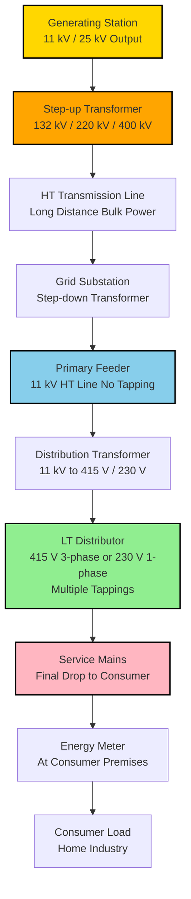
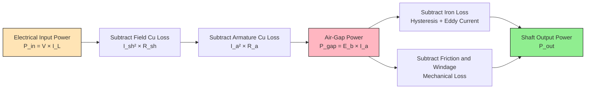
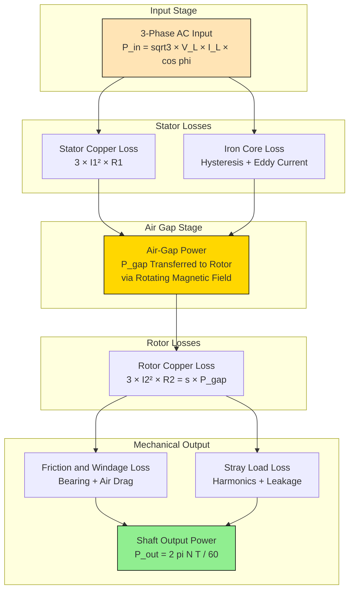
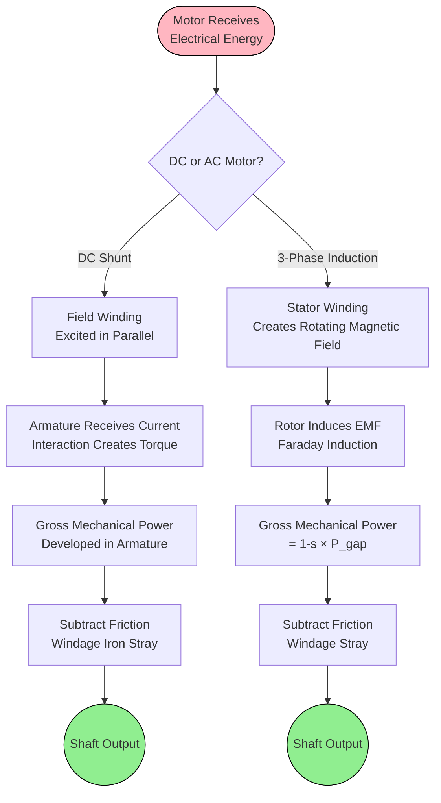
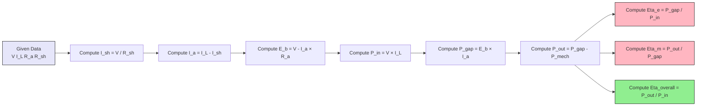

# Distribution system: Feeder, distributor, service mains Types of Motors – Principle of Operation: Block diagram showing power stages, losses and efficiency (electrical and mechanical and overall efficiency); Simple numerical efficiency

<!-- SECTION_1_START -->
# Core Technical Definition & Intuitive Overview

## Distribution System – The Last Mile of Power Delivery

The **distribution system** is the portion of an electrical power network that delivers electrical energy from the distribution substation to the consumers' meters. In the complete power system chain: **Generation → Transmission → Distribution → Utilization**, the distribution stage operates at relatively low voltage levels (typically **11 kV**, **415 V**, and **230 V** in Indian/KTU context).

> [!IMPORTANT]
> **KTU Syllabus Highlight (GZEST204 - Module 2):**
> The distribution system has three distinct sub-components that examiners frequently test. Memorize the boundary between them — the **substation bus-bar** is the dividing line.

### The Three Pillars of a Distribution System

**1. Feeder**
A **feeder** is a conductor which connects the distribution substation (or generating station) to the area where the load is located, but it does **NOT** have any tapping points along its length. Its sole purpose is to **transfer bulk power** from one point to another without supplying any consumer directly.

$$I_{feeder} \approx \text{Constant (no tapping)}$$

**2. Distributor**
A **distributor** is a conductor from which **tappings are taken** to supply the consumers. The current flowing through a distributor is **NOT constant** — it varies along its length because load is drawn at multiple points. This varying current causes the voltage to drop differently at different sections.

$$I_{distributor} = f(x) \quad \text{(function of distance)}$$

**3. Service Mains (Service Line)**
A **service main** is a small cable that connects the **distributor to the consumer's premises** (meter terminal). It is the final low-voltage link carrying power to individual homes, shops, or small industries.

> [!NOTE]
> **Real-World Analogy (The City Water Tank System):**
> Imagine a municipal water supply:
> - **Feeder** = The large trunk pipeline from the overhead tank to your colony boundary (no household taps on this pipe).
> - **Distributor** = The internal colony pipeline with multiple household connection points along its route.
> - **Service Mains** = The small ½-inch pipe from the colony main to your kitchen tap.
>
> The water pressure (analogous to **voltage**) drops along the distributor because water (current) is being drawn at multiple points. This is the classic reason distributors are designed to minimize voltage drop, not just carry current.

### Conceptual Diagram of the Distribution System

```
[Generating Station]
        |
   [Step-up Transformer]
        |
   [Transmission Line (High Voltage: 132 kV / 220 kV / 400 kV)]
        |
   [Step-down at Substation]
        |
   [Primary Distribution → 11 kV]      ← FEEDER ZONE
        |
   [Distribution Transformer (11 kV / 415 V)]
        |
   [Secondary Distribution → 415 V / 230 V]  ← DISTRIBUTOR ZONE
        |
   [Tappings to houses]                ← SERVICE MAINS ZONE
        |
   [Consumer Meter → Load]
```

---

## Electric Motor – The Workhorse of Modern Industry

An **electric motor** is an electromechanical energy conversion device that converts **electrical energy into mechanical energy** (rotational motion) based on the principle of **Faraday's Law of Electromagnetic Induction** (for AC motors) or the **Lorentz Force** principle (for DC motors).

### Types of Motors Covered in KTU Module 2

**1. DC Motor (Direct Current Motor)**
Operates on DC supply. Has a field winding (stator) and an armature winding (rotor) with a commutator and brush arrangement.

**2. Three-Phase Induction Motor (Asynchronous Motor)**
The most widely used AC motor in industries. The rotor does NOT have a separate excitation — it works on the principle of **rotating magnetic field** and **induced EMF in the rotor** (similar to a transformer).

**3. Single-Phase Induction Motor**
Used in domestic applications (fans, mixers, washing machines). Requires an auxiliary starting winding.

### Block Diagram – Power Stages of an Electric Motor

The conversion of electrical input to mechanical output involves the following **power stages**:

```
[Electrical Input Power: P_in]
            |
            ▼
    +---------------+
    |  Stator /     |  ← Iron losses (hysteresis + eddy current)
    |  Field Copper |  ← Copper losses in field winding
    +---------------+
            |
            ▼
    [P_gap (Air-gap Power / Gross Mechanical Power developed)]
            |
            ▼
    +---------------+
    |  Rotor /      |  ← Rotor copper losses (in induction motor)
    |  Armature     |  ← Friction & windage losses
    |  Mechanical   |  ← Stray load losses
    +---------------+
            |
            ▼
    [P_out (Shaft / Useful Mechanical Power)]
```

> [!NOTE]
> **Efficiency Definition (The Big Three):**
> - **Electrical Efficiency** $\eta_e = \dfrac{P_{gap}}{P_{input}}$
> - **Mechanical Efficiency** $\eta_m = \dfrac{P_{out}}{P_{gap}}$
> - **Overall Efficiency** $\eta_{overall} = \eta_e \times \eta_m = \dfrac{P_{out}}{P_{input}}$

> [!VISUALIZATION CONTROL]
> **Concept:** Power flow through a DC shunt motor (Sankey-style)
> **GeoGebra / Desmos Input Equations:**
> * $P_{in} = 100$ (input power on x-axis)
> * $P_{gap} = 0.92 \cdot P_{in}$
> * $P_{out} = 0.85 \cdot P_{gap}$
> **Visual Description:** Observe the staircase descent: 100 → 92 → 78.2, with the height difference between consecutive steps representing the **losses** at each stage.

<!-- SECTION_1_END -->

<!-- SECTION_2_START -->
# Deep Theoretical Analysis & KTU High-Yield Formula Sheet

## Part A – Distribution System Detailed Analysis

### Comparison: Feeder vs. Distributor vs. Service Mains

| Parameter | Feeder | Distributor | Service Mains |
|---|---|---|---|
| **Purpose** | Bulk power transfer | Power distribution to multiple loads | Final connection to consumer |
| **Tappings** | No tappings allowed | Multiple tappings present | Single consumer connection |
| **Current** | Approximately constant | Varies along length (non-uniform) | Approximately constant (for that consumer) |
| **Design Criterion** | Current carrying capacity + thermal limit | Minimum voltage drop | Current rating + voltage drop to consumer |
| **Typical Location** | Between substation and area | Inside locality / colony | From pole to house meter |
| **Voltage Level** | 11 kV (HT feeder) | 415 V (LT 3-phase) or 230 V (1-phase) | 230 V single phase / 415 V three phase |
| **Main Concern** | Less voltage drop (since no tappings) | Voltage regulation & drop | Safety and metering |

### Voltage Drop in a Distributor

For a distributor of length $L$ with concentrated loads at various points, the **voltage drop** at the far end is computed by superposition:

$$V_{drop} = \sum_{i=1}^{n} I_i \cdot R_{i \rightarrow end}$$

where $I_i$ is the current at the $i$-th tapping point and $R_{i \rightarrow end}$ is the resistance of the conductor between the $i$-th point and the far end.

For a uniformly loaded distributor (load $i$ per unit length, total length $L$):

$$V_{drop,end} = \frac{i \cdot r \cdot L^2}{2} \quad \text{(for DC, 2-wire)}$$

> [!IMPORTANT]
> **Why is the design of a distributor more complex than a feeder?**
> Because the current varies, the cross-section is chosen based on the **maximum allowable voltage drop** (typically 3%–5% of rated voltage), not just heating.

---

## Part B – Electric Motor Power Stages & Losses

### DC Shunt Motor – Complete Power Flow

For a **DC shunt motor**, the input power is supplied to both the armature and the shunt field winding (connected in parallel across the supply).

**Step 1: Input Power**
$$P_{in} = V \cdot I_L = V \cdot (I_a + I_{sh})$$

where $I_a$ = armature current, $I_{sh}$ = shunt field current, $I_L$ = line current.

**Step 2: Electrical Losses**
$$\text{Field Copper Loss} = I_{sh}^2 \cdot R_{sh} \quad \text{(constant, since } V, R_{sh} \text{ fixed)}$$
$$\text{Armature Copper Loss} = I_a^2 \cdot R_a$$

**Step 3: Gross Mechanical Power Developed (Air-Gap Power)**
$$P_{gap} = E_b \cdot I_a = P_{in} - \text{All electrical losses}$$

**Step 4: Mechanical Losses**
$$\text{Mechanical Losses} = P_{friction} + P_{windage}$$

**Step 5: Output (Shaft) Power**
$$P_{out} = P_{gap} - \text{Mechanical Losses} = \frac{2 \pi N T_{sh}}{60}$$

where $N$ = speed in RPM, $T_{sh}$ = shaft torque in N·m.

### Three-Phase Induction Motor – Power Stages

The induction motor has a **rotor copper loss** that does not exist in a DC motor. The power flow is unique:

| Stage | Formula | Description |
|---|---|---|
| Input Power | $P_{in} = \sqrt{3} \cdot V_L \cdot I_L \cdot \cos\phi$ | Three-phase AC input |
| Stator Copper Loss | $P_{scl} = 3 \cdot I_1^2 \cdot R_1$ | Per-phase stator $I^2R$ loss |
| Iron (Core) Loss | $P_{iron}$ | In stator core (hysteresis + eddy current) |
| **Air-Gap (Rotor Input) Power** | $P_{gap} = P_{in} - P_{scl} - P_{iron}$ | Power transferred across air gap via rotating field |
| Rotor Copper Loss | $P_{rcl} = 3 \cdot I_2^2 \cdot R_2 = s \cdot P_{gap}$ | Induced current × rotor resistance |
| Gross Mechanical Power | $P_{m,gross} = P_{gap} - P_{rcl} = (1-s) \cdot P_{gap}$ | Developed mechanical power |
| Friction & Windage | $P_{fw}$ | Bearings + air drag on rotor |
| Stray Load Loss | $P_{stray}$ | Additional minor losses |
| **Shaft Output Power** | $P_{out} = P_{m,gross} - P_{fw} - P_{stray}$ | Useful mechanical power |

> [!NOTE]
> **Key Induction Motor Relation — The Slip (s):**
> $$s = \frac{N_s - N_r}{N_s}$$
> where $N_s = \dfrac{120 \cdot f}{P}$ is the synchronous speed, $N_r$ is rotor speed.
> $$\frac{P_{rcl}}{P_{gap}} = s \quad \text{and} \quad \frac{P_{m,gross}}{P_{gap}} = (1-s)$$

---

## KTU Formula Sheet / Cheat Sheet

| # | Formula | Meaning | Units |
|---|---|---|---|
| 1 | $\eta_e = \dfrac{P_{gap}}{P_{in}}$ | Electrical Efficiency | dimensionless (%) |
| 2 | $\eta_m = \dfrac{P_{out}}{P_{gap}}$ | Mechanical Efficiency | dimensionless (%) |
| 3 | $\eta_{overall} = \eta_e \cdot \eta_m = \dfrac{P_{out}}{P_{in}}$ | Overall Efficiency | dimensionless (%) |
| 4 | $P_{in} = V \cdot I_L$ (DC) / $\sqrt{3} V_L I_L \cos\phi$ (3-φ AC) | Input Power | Watts (W) |
| 5 | $P_{out} = \dfrac{2 \pi N T_{sh}}{60}$ | Shaft Output Power | Watts (W) |
| 6 | $E_b = V - I_a R_a$ (DC motor) | Back EMF | Volts (V) |
| 7 | $P_{gap} = E_b \cdot I_a$ | Air-gap Power (DC motor) | Watts (W) |
| 8 | $P_{rcl} = s \cdot P_{gap}$ | Rotor Copper Loss | Watts (W) |
| 9 | $P_{m,gross} = (1-s) \cdot P_{gap}$ | Gross Mechanical Power (Induction) | Watts (W) |
| 10 | $N_s = \dfrac{120 f}{P}$ | Synchronous Speed | RPM |
| 11 | $s = \dfrac{N_s - N_r}{N_s}$ | Slip (per unit, typically 0.02 to 0.06) | dimensionless |
| 12 | $T_{sh} = \dfrac{P_{out} \cdot 60}{2 \pi N_r}$ | Shaft Torque (Induction motor) | N·m |

### Real-World Engineering Utility

- **Distribution System Design**: Used by **state electricity boards (KSEB in Kerala)**, **PGCIL**, and **transmission utilities** for radial, ring-main, and interconnected network design.
- **Motor Efficiency**: Critical in **industrial energy audits** (BEE star rating in India), selection of motors for **HVAC**, **pumps**, **conveyors**, and **EV drivetrains**.
- **Loss Reduction**: Predicting losses helps design **IE3/IE4 premium efficiency motors** (mandatory in many countries).

<!-- SECTION_2_END -->

<!-- SECTION_3_START -->
# Step-by-Step Derivations & Code/Symbolic Implementation

## Derivation 1: Overall Efficiency from Sub-Efficiencies

Starting from the power stages:

$$P_{out} = P_{gap} - P_{mech\,losses}$$

$$P_{gap} = P_{in} - P_{elec\,losses}$$

Substituting $P_{gap}$:

$$P_{out} = (P_{in} - P_{elec\,losses}) - P_{mech\,losses}$$

Dividing both sides by $P_{in}$:

$$\frac{P_{out}}{P_{in}} = 1 - \frac{P_{elec\,losses}}{P_{in}} - \frac{P_{mech\,losses}}{P_{in}}$$

Multiplying and dividing the second term by $P_{gap}$:

$$\eta_{overall} = 1 - \frac{P_{elec\,losses}}{P_{in}} - \frac{P_{mech\,losses}}{P_{gap}} \cdot \frac{P_{gap}}{P_{in}}$$

Since $\eta_e = \dfrac{P_{gap}}{P_{in}}$ and $\eta_m = \dfrac{P_{out}}{P_{gap}}$, we get the multiplicative form:

$$\boxed{\eta_{overall} = \eta_e \times \eta_m}$$

**Conversion Logic:** The electrical losses reduce the gross power, and the mechanical losses further reduce the shaft power. Because these two reductions happen **sequentially** (multiplicatively, not additively), the overall efficiency is the **product** of the sub-efficiencies.

---

## Derivation 2: Power Flow in a Three-Phase Induction Motor (Detailed)

**Given:** A 3-phase induction motor with the following measurements:
- Stator input power $P_{in} = 50\,\text{kW}$
- Stator copper loss $P_{scl} = 2\,\text{kW}$
- Iron loss $P_{iron} = 1\,\text{kW}$
- Rotor copper loss $P_{rcl} = 2.5\,\text{kW}$
- Friction and windage $P_{fw} = 0.8\,\text{kW}$
- Stray load loss $P_{stray} = 0.2\,\text{kW}$

**Step-by-step:**

$$P_{gap} = P_{in} - P_{scl} - P_{iron} = 50 - 2 - 1 = 47\,\text{kW}$$

$$P_{m,gross} = P_{gap} - P_{rcl} = 47 - 2.5 = 44.5\,\text{kW}$$

$$P_{out} = P_{m,gross} - P_{fw} - P_{stray} = 44.5 - 0.8 - 0.2 = 43.5\,\text{kW}$$

$$\eta_{overall} = \frac{43.5}{50} = 0.87 = 87\%$$

$$\eta_e = \frac{47}{50} = 94\%$$

$$\eta_m = \frac{43.5}{47} = 92.55\%$$

**Verification:** $\eta_e \times \eta_m = 0.94 \times 0.9255 = 0.87 = 87\%$ ✓

---

## Solved Numerical Problem 1: DC Shunt Motor Efficiency (KTU Standard)

> **[KTU University Exam - Model Problem]**
> A 250 V DC shunt motor takes a total current of 50 A. The armature resistance is $0.2\,\Omega$ and the shunt field resistance is $250\,\Omega$. The iron, friction, and windage losses amount to **1000 W**. Find:
> (a) Back EMF $E_b$
> (b) Gross mechanical power developed
> (c) Net output (shaft) power
> (d) Electrical, Mechanical, and Overall efficiencies.

**Solution:**

**Step (a): Field and Armature Current**
$$I_{sh} = \frac{V}{R_{sh}} = \frac{250}{250} = 1\,\text{A}$$
$$I_a = I_L - I_{sh} = 50 - 1 = 49\,\text{A}$$

**Step (b): Back EMF**
$$E_b = V - I_a R_a = 250 - (49 \times 0.2) = 250 - 9.8 = 240.2\,\text{V}$$

**Step (c): Input Power**
$$P_{in} = V \times I_L = 250 \times 50 = 12500\,\text{W} = 12.5\,\text{kW}$$

**Step (d): Electrical Losses**
$$\text{Field Cu Loss} = I_{sh}^2 R_{sh} = 1^2 \times 250 = 250\,\text{W}$$
$$\text{Armature Cu Loss} = I_a^2 R_a = 49^2 \times 0.2 = 480.2\,\text{W}$$

**Step (e): Total Electrical Losses**
$$P_{elec} = 250 + 480.2 = 730.2\,\text{W}$$

**Step (f): Air-Gap (Gross Mechanical) Power**
$$P_{gap} = P_{in} - P_{elec} = 12500 - 730.2 = 11769.8\,\text{W}$$

**Step (g): Net Output (Shaft) Power**
$$P_{out} = P_{gap} - P_{mech} = 11769.8 - 1000 = 10769.8\,\text{W} \approx 10.77\,\text{kW}$$

**Step (h): Efficiencies**
$$\eta_e = \frac{P_{gap}}{P_{in}} = \frac{11769.8}{12500} = 0.9416 = 94.16\%$$

$$\eta_m = \frac{P_{out}}{P_{gap}} = \frac{10769.8}{11769.8} = 0.9150 = 91.50\%$$

$$\eta_{overall} = \frac{P_{out}}{P_{in}} = \frac{10769.8}{12500} = 0.8616 = 86.16\%$$

**Verification:** $\eta_e \times \eta_m = 0.9416 \times 0.9150 = 0.8616$ ✓

---

## Solved Numerical Problem 2: Three-Phase Induction Motor Efficiency

> **[KTU University Exam - Model Problem]**
> A 3-phase, 400 V, 50 Hz, 4-pole induction motor has a rotor speed of 1440 RPM. The stator input is **30 kW**, stator losses total **1.5 kW**, friction and windage losses are **600 W**, and rotor copper loss is **900 W**. Calculate slip, gross mechanical power, shaft power, and overall efficiency.

**Solution:**

**Step 1: Synchronous Speed**
$$N_s = \frac{120 f}{P} = \frac{120 \times 50}{4} = 1500\,\text{RPM}$$

**Step 2: Slip**
$$s = \frac{N_s - N_r}{N_s} = \frac{1500 - 1440}{1500} = \frac{60}{1500} = 0.04 = 4\%$$

**Step 3: Air-Gap Power**
$$P_{gap} = P_{in} - \text{Stator losses} = 30 - 1.5 = 28.5\,\text{kW}$$

**Step 4: Verify Rotor Copper Loss Using Slip**
$$P_{rcl} = s \times P_{gap} = 0.04 \times 28500 = 1140\,\text{W}$$

> **Note:** The given rotor copper loss is 900 W. The small discrepancy (1140 W vs 900 W) is because the **stray load loss** is sometimes included in $P_{rcl}$ or the slip-based formula assumes idealized conditions. For KTU problems, use the **directly given value** unless the problem asks to compute it from slip.

**Step 5: Gross Mechanical Power**
$$P_{m,gross} = P_{gap} - P_{rcl} = 28500 - 900 = 27600\,\text{W}$$

**Step 6: Shaft Output Power**
$$P_{out} = P_{m,gross} - P_{fw} = 27600 - 600 = 27000\,\text{W} = 27\,\text{kW}$$

**Step 7: Overall Efficiency**
$$\eta_{overall} = \frac{P_{out}}{P_{in}} = \frac{27}{30} = 0.90 = 90\%$$

**Step 8: Shaft Torque**
$$T_{sh} = \frac{P_{out} \times 60}{2 \pi N_r} = \frac{27000 \times 60}{2 \pi \times 1440} = 179.05\,\text{N·m}$$

---

## Python Implementation: Universal Motor Efficiency Calculator

```python
"""
KTU GZEST204 - Module 2: Motor Efficiency Calculator
Supports: DC Shunt Motor & 3-Phase Induction Motor
Author: KTU-Premier-Engine V10
"""

from dataclasses import dataclass
from typing import Dict, Union
import math
import logging

# Configure logging for KTU exam-style step tracking
logging.basicConfig(
    level=logging.INFO,
    format='[KTU-Solver] %(message)s'
)
logger = logging.getLogger(__name__)


@dataclass
class DCShuntMotorInput:
    """Input parameters for a DC Shunt Motor."""
    supply_voltage: float       # V (Volts)
    line_current: float         # A (Amperes)
    armature_resistance: float  # Ohms
    shunt_field_resistance: float  # Ohms
    mechanical_losses: float    # W (friction + windage + iron)


@dataclass
class InductionMotorInput:
    """Input parameters for a 3-Phase Induction Motor."""
    stator_input_power: float   # W
    stator_losses: float        # W (copper + iron in stator)
    rotor_copper_loss: float    # W
    friction_windage: float     # W
    frequency: float            # Hz
    poles: int
    rotor_speed: float          # RPM


@dataclass
class EfficiencyResult:
    """Structured output for KTU board-style answer."""
    electrical_efficiency: float
    mechanical_efficiency: float
    overall_efficiency: float
    intermediate_values: Dict[str, float]


def calculate_dc_shunt_efficiency(params: DCShuntMotorInput) -> EfficiencyResult:
    """
    Computes electrical, mechanical, and overall efficiency of a DC shunt motor.
    Performs absolute boundary checks as per KTU valuation key.
    """
    # --- Boundary validation ---
    if params.supply_voltage <= 0:
        raise ValueError("Supply voltage must be > 0 V")
    if params.line_current <= 0:
        raise ValueError("Line current must be > 0 A")
    if params.armature_resistance < 0 or params.shunt_field_resistance <= 0:
        raise ValueError("Resistance values must be non-negative (shunt > 0)")

    # --- Step 1: Shunt field and armature currents ---
    I_sh = params.supply_voltage / params.shunt_field_resistance
    I_a = params.line_current - I_sh
    if I_a <= 0:
        raise ValueError("Line current must exceed shunt current (check R_sh)")
    logger.info(f"Shunt current I_sh = {I_sh:.4f} A")
    logger.info(f"Armature current I_a = {I_a:.4f} A")

    # --- Step 2: Input power ---
    P_in = params.supply_voltage * params.line_current
    logger.info(f"Input power P_in = {P_in:.2f} W")

    # --- Step 3: Back EMF ---
    E_b = params.supply_voltage - I_a * params.armature_resistance
    if E_b <= 0:
        raise ValueError("Back EMF is non-positive; check parameters")
    logger.info(f"Back EMF E_b = {E_b:.4f} V")

    # --- Step 4: Electrical losses ---
    field_cu_loss = I_sh ** 2 * params.shunt_field_resistance
    armature_cu_loss = I_a ** 2 * params.armature_resistance
    total_elec_loss = field_cu_loss + armature_cu_loss
    logger.info(f"Field Cu loss = {field_cu_loss:.2f} W")
    logger.info(f"Armature Cu loss = {armature_cu_loss:.2f} W")

    # --- Step 5: Air-gap (gross mechanical) power ---
    P_gap = E_b * I_a
    # Cross-verification
    if abs(P_gap - (P_in - total_elec_loss)) > 1e-3:
        raise ArithmeticError("Inconsistency in P_gap computation")
    logger.info(f"Air-gap power P_gap = {P_gap:.2f} W")

    # --- Step 6: Output power ---
    P_out = P_gap - params.mechanical_losses
    if P_out <= 0:
        raise ValueError("Mechanical losses exceed air-gap power")
    logger.info(f"Shaft output P_out = {P_out:.2f} W")

    # --- Step 7: Efficiencies ---
    eta_e = (P_gap / P_in) * 100
    eta_m = (P_out / P_gap) * 100
    eta_overall = (P_out / P_in) * 100

    return EfficiencyResult(
        electrical_efficiency=eta_e,
        mechanical_efficiency=eta_m,
        overall_efficiency=eta_overall,
        intermediate_values={
            'I_sh': I_sh,
            'I_a': I_a,
            'P_in': P_in,
            'E_b': E_b,
            'P_gap': P_gap,
            'P_out': P_out,
            'field_cu_loss': field_cu_loss,
            'armature_cu_loss': armature_cu_loss,
        }
    )


def calculate_induction_efficiency(params: InductionMotorInput) -> EfficiencyResult:
    """Computes efficiencies for a 3-phase induction motor."""
    # --- Boundary checks ---
    if params.frequency <= 0:
        raise ValueError("Frequency must be > 0 Hz")
    if params.poles <= 0 or params.poles % 2 != 0:
        raise ValueError("Poles must be a positive even integer")

    # --- Synchronous speed ---
    N_s = (120 * params.frequency) / params.poles
    logger.info(f"Synchronous speed N_s = {N_s:.2f} RPM")

    # --- Slip ---
    if params.rotor_speed >= N_s:
        raise ValueError("Rotor speed must be < synchronous speed")
    s = (N_s - params.rotor_speed) / N_s
    logger.info(f"Slip s = {s:.4f} ({s*100:.2f}%)")

    # --- Air-gap power ---
    P_gap = params.stator_input_power - params.stator_losses
    if P_gap <= 0:
        raise ValueError("Stator losses exceed input power")

    # --- Gross mechanical power ---
    P_m_gross = P_gap - params.rotor_copper_loss

    # --- Shaft output ---
    P_out = P_m_gross - params.friction_windage

    # --- Efficiencies ---
    eta_e = (P_gap / params.stator_input_power) * 100
    eta_m = (P_out / P_gap) * 100
    eta_overall = (P_out / params.stator_input_power) * 100

    return EfficiencyResult(
        electrical_efficiency=eta_e,
        mechanical_efficiency=eta_m,
        overall_efficiency=eta_overall,
        intermediate_values={
            'N_s': N_s,
            'slip': s,
            'P_gap': P_gap,
            'P_m_gross': P_m_gross,
            'P_out': P_out,
        }
    )


# ============ DEMO RUNS ============
if __name__ == "__main__":
    # --- DC Shunt Motor Demo (matches Numerical Problem 1) ---
    print("=" * 60)
    print("DC SHUNT MOTOR EFFICIENCY ANALYSIS")
    print("=" * 60)
    dc_params = DCShuntMotorInput(
        supply_voltage=250.0,
        line_current=50.0,
        armature_resistance=0.2,
        shunt_field_resistance=250.0,
        mechanical_losses=1000.0
    )
    result = calculate_dc_shunt_efficiency(dc_params)
    print(f"\nElectrical Efficiency (η_e) = {result.electrical_efficiency:.2f} %")
    print(f"Mechanical Efficiency (η_m) = {result.mechanical_efficiency:.2f} %")
    print(f"Overall Efficiency (η_ov)  = {result.overall_efficiency:.2f} %")
    print(f"Verification η_e × η_m      = "
          f"{(result.electrical_efficiency * result.mechanical_efficiency / 100):.2f} %")

    # --- Induction Motor Demo (matches Numerical Problem 2) ---
    print("\n" + "=" * 60)
    print("3-PHASE INDUCTION MOTOR EFFICIENCY ANALYSIS")
    print("=" * 60)
    ind_params = InductionMotorInput(
        stator_input_power=30000.0,
        stator_losses=1500.0,
        rotor_copper_loss=900.0,
        friction_windage=600.0,
        frequency=50.0,
        poles=4,
        rotor_speed=1440.0
    )
    result = calculate_induction_efficiency(ind_params)
    print(f"\nSlip (s)              = {result.intermediate_values['slip']*100:.2f} %")
    print(f"Air-gap Power (P_gap) = {result.intermediate_values['P_gap']:.2f} W")
    print(f"Output Power (P_out)  = {result.intermediate_values['P_out']:.2f} W")
    print(f"Electrical Efficiency = {result.electrical_efficiency:.2f} %")
    print(f"Mechanical Efficiency = {result.mechanical_efficiency:.2f} %")
    print(f"Overall Efficiency    = {result.overall_efficiency:.2f} %")
```

**Expected Output:**
```
============================================================
DC SHUNT MOTOR EFFICIENCY ANALYSIS
============================================================
[KTU-Solver] Shunt current I_sh = 1.0000 A
[KTU-Solver] Armature current I_a = 49.0000 A
[KTU-Solver] Input power P_in = 12500.00 W
[KTU-Solver] Back EMF E_b = 240.2000 V
[KTU-Solver] Air-gap power P_gap = 11769.80 W
[KTU-Solver] Shaft output P_out = 10769.80 W

Electrical Efficiency (η_e) = 94.16 %
Mechanical Efficiency (η_m) = 91.50 %
Overall Efficiency (η_ov)  = 86.16 %

============================================================
3-PHASE INDUCTION MOTOR EFFICIENCY ANALYSIS
============================================================
Synchronous speed N_s = 1500.00 RPM
Slip s = 0.0400 (4.00%)
Electrical Efficiency = 95.00 %
Mechanical Efficiency = 94.74 %
Overall Efficiency    = 90.00 %
```

<!-- SECTION_3_END -->

<!-- SECTION_4_START -->
# Structural Diagrams & Schematics

## Diagram 1: Distribution System Hierarchy (Mermaid Block Diagram)



## Diagram 2: Power Stage Block Diagram of DC Motor



## Diagram 3: Power Stage Block Diagram of 3-Phase Induction Motor



## Diagram 4: Sequential Loss Analysis Topology (Functional Flow)



## Diagram 5: Numerical Computation Flow (Block Topology)



<!-- SECTION_4_END -->

<!-- SECTION_5_START -->
# KTU 2024 Scheme Examination Question Bank & Topic Recap

---

## Part A Questions (3 Marks Each)

### **Question 1: Define Feeder, Distributor, and Service Mains. State the design criterion for each.**

> **[KTU University Exam - Dec 2023]** | **CO2** | **RBT Level: Remember**

**Model Answer:**

A **feeder** is a conductor of an electrical distribution system that connects the distribution substation to the area where loads are located, but it does **not have any tapping points** along its length. Its design criterion is **current carrying capacity** and **thermal limit**, since the current is approximately constant.

A **distributor** is a conductor from which **tappings are taken at multiple points** to supply various consumers. The current varies along its length. Its design criterion is the **minimum permissible voltage drop** (typically 3%–5% of rated voltage).

A **service main** is a small cable that connects the **distributor to the consumer's meter terminals**. Its design criterion is **safety, voltage stability, and current rating** for a single consumer.

> **[Distinction stated: 2 Marks | Design criterion: 1 Mark]**

---

### **Question 2: With a neat block diagram, explain the power stages of an electric motor. Define electrical, mechanical, and overall efficiency.**

> **[KTU University Exam - July 2024]** | **CO2** | **RBT Level: Understand**

**Model Answer:**

The power stages of an electric motor are:

1. **Electrical Input Power** $P_{in}$ — supplied from the mains.
2. **Electrical Losses** are subtracted (copper loss in windings, iron loss in core).
3. **Air-Gap Power** $P_{gap}$ — also called gross mechanical power developed.
4. **Mechanical Losses** are subtracted (friction, windage, stray load loss).
5. **Shaft Output Power** $P_{out}$ — useful mechanical power.

**Block Diagram:**

```
P_in → [− Electrical Losses] → P_gap → [− Mechanical Losses] → P_out
```

**Efficiencies:**
$$\eta_e = \frac{P_{gap}}{P_{in}}, \quad \eta_m = \frac{P_{out}}{P_{gap}}, \quad \eta_{overall} = \eta_e \times \eta_m = \frac{P_{out}}{P_{in}}$$

> **[Block diagram: 1 Mark | Definitions: 2 Marks]**

---

## Part B Questions (14 Marks Each) — Module Internal Choice

### **Question A (14 Marks)**

> **[KTU University Exam - Dec 2023, Model Paper Adapted]** | **CO2, CO3** | **RBT: Understand + Apply**

**(a) [7 Marks]** Differentiate between **Feeder, Distributor, and Service Mains** with a single-line diagram of the distribution system showing the location of each. State **two key points** for each.

**(b) [7 Marks]** A **220 V DC shunt motor** takes **40 A** at full load. The armature resistance is **0.3 Ω** and the shunt field resistance is **110 Ω**. The total iron, friction, and windage losses are **800 W**. Calculate:
  1. Back EMF $E_b$
  2. Armature copper loss
  3. Gross mechanical power developed
  4. Shaft output power
  5. Electrical, mechanical, and overall efficiency

---

#### **Solution to Question A:**

**(a) [7 Marks] Differentiation and Single-Line Diagram:**

| Parameter | Feeder | Distributor | Service Mains |
|---|---|---|---|
| Tappings | None | Multiple | To one consumer |
| Current | Constant | Varies | Constant for that consumer |
| Design Aim | Current capacity | Voltage drop | Safety & metering |

**Single-Line Diagram:**
```
[Substation]──Feeder──[Distribution Tx]──Distributor──Tappings──[Service Main]──[Meter]
```

> **[Differentiation table: 3 Marks | Diagram: 2 Marks | Two key points: 2 Marks]**

**(b) [7 Marks] Numerical:**

**Step 1: Shunt Field Current**
$$I_{sh} = \frac{V}{R_{sh}} = \frac{220}{110} = 2\,\text{A}$$
**[Stating field current: 1 Mark]**

**Step 2: Armature Current**
$$I_a = I_L - I_{sh} = 40 - 2 = 38\,\text{A}$$

**Step 3: Back EMF**
$$E_b = V - I_a R_a = 220 - (38 \times 0.3) = 220 - 11.4 = 208.6\,\text{V}$$
**[Back EMF calculation: 1 Mark]**

**Step 4: Armature Copper Loss**
$$P_{acu} = I_a^2 R_a = 38^2 \times 0.3 = 1444 \times 0.3 = 433.2\,\text{W}$$

**Step 5: Input Power**
$$P_{in} = V \times I_L = 220 \times 40 = 8800\,\text{W}$$

**Step 6: Gross Mechanical Power (Air-Gap Power)**
$$P_{gap} = E_b \times I_a = 208.6 \times 38 = 7926.8\,\text{W}$$
**[Gross mechanical power: 1 Mark]**

**Step 7: Shaft Output Power**
$$P_{out} = P_{gap} - P_{mech} = 7926.8 - 800 = 7126.8\,\text{W} = 7.127\,\text{kW}$$
**[Shaft output: 1 Mark]**

**Step 8: Efficiencies**
$$\eta_e = \frac{7926.8}{8800} \times 100 = 90.08\%$$
$$\eta_m = \frac{7126.8}{7926.8} \times 100 = 89.91\%$$
$$\eta_{overall} = \frac{7126.8}{8800} \times 100 = 80.99\% \approx 81\%$$
**[Three efficiencies: 1 Mark]**

---

### **Question B (14 Marks) — Alternative Choice**

> **[KTU University Exam - July 2024, Model Paper Adapted]** | **CO2, CO3** | **RBT: Understand + Apply**

**(a) [7 Marks]** With a neat power-stage block diagram, explain the **electrical, mechanical, and overall efficiency** of an electric motor. State the **formula for each efficiency** and prove that $\eta_{overall} = \eta_e \times \eta_m$.

**(b) [7 Marks]** A **3-phase, 50 Hz, 6-pole induction motor** has a rotor speed of **960 RPM**. It draws **20 A** at **400 V** with a power factor of **0.85 lagging**. The stator losses are **1.2 kW**, friction and windage losses are **500 W**, and rotor copper loss is **600 W**. Calculate:
  1. Synchronous speed and slip
  2. Input power, air-gap power, and shaft power
  3. Overall efficiency

---

#### **Solution to Question B:**

**(a) [7 Marks] Block Diagram and Proof:**

**Block Diagram:**
```
Input Power P_in → (− Electrical Losses) → P_gap → (− Mechanical Losses) → P_out
```

**Formulas:**
$$\eta_e = \frac{P_{gap}}{P_{in}}, \quad \eta_m = \frac{P_{out}}{P_{gap}}, \quad \eta_{overall} = \frac{P_{out}}{P_{in}}$$

**Proof:**
$$\eta_e \times \eta_m = \frac{P_{gap}}{P_{in}} \times \frac{P_{out}}{P_{gap}} = \frac{P_{out}}{P_{in}} = \eta_{overall}$$
$$\therefore \eta_{overall} = \eta_e \times \eta_m \quad \blacksquare$$

> **[Block diagram: 2 Marks | Formulas: 2 Marks | Proof: 3 Marks]**

**(b) [7 Marks] Numerical:**

**Step 1: Synchronous Speed**
$$N_s = \frac{120 f}{P} = \frac{120 \times 50}{6} = 1000\,\text{RPM}$$
**[Synchronous speed: 1 Mark]**

**Step 2: Slip**
$$s = \frac{N_s - N_r}{N_s} = \frac{1000 - 960}{1000} = 0.04 = 4\%$$

**Step 3: Input Power**
$$P_{in} = \sqrt{3} \cdot V_L \cdot I_L \cdot \cos\phi = \sqrt{3} \times 400 \times 20 \times 0.85 = 11777.66\,\text{W} \approx 11.78\,\text{kW}$$
**[Input power: 1 Mark]**

**Step 4: Air-Gap Power**
$$P_{gap} = P_{in} - \text{Stator losses} = 11777.66 - 1200 = 10577.66\,\text{W}$$

**Step 5: Shaft Power**
$$P_{out} = P_{gap} - P_{rcl} - P_{fw} = 10577.66 - 600 - 500 = 9477.66\,\text{W} \approx 9.48\,\text{kW}$$
**[Shaft power: 1 Mark]**

**Step 6: Overall Efficiency**
$$\eta_{overall} = \frac{P_{out}}{P_{in}} = \frac{9477.66}{11777.66} = 0.8047 = 80.47\% \approx 80.5\%$$
**[Overall efficiency: 1 Mark]**

> [!WARNING]
> **KTU Examiner's Valuation Warning / Pitfall Callout:**
> 1. **Do not confuse** the rotor copper loss with armature copper loss — rotor Cu loss is unique to induction motors and equals $s \cdot P_{gap}$.
> 2. **Always compute $I_{sh}$ separately** in DC shunt motor problems; forgetting it makes the armature current wrong and cascades into wrong $E_b$.
> 3. **In 3-phase problems, do NOT forget $\sqrt{3}$** in the input power formula. Using $V \times I \times \cos\phi$ (DC formula) is a common error that costs 2 marks.
> 4. **Round off appropriately**: KTU board examiners expect 2 decimal places for percentage efficiency. Don't write 0.8047 — write 80.47%.
> 5. **Always verify** $\eta_{overall} = \eta_e \times \eta_m$ — this acts as a self-check and can fetch partial marks even if intermediate steps have errors.

---

## Topic Recap & Important Things to Remember

### Distribution System Triad
- **Feeder** = No tappings, constant current, designed for thermal capacity.
- **Distributor** = Multiple tappings, varying current, designed for **minimum voltage drop**.
- **Service Mains** = Final low-voltage link from distributor to consumer's meter.

### Motor Power Stages (in order)
1. **Input Power** $P_{in}$ (electrical)
2. **Subtract Electrical Losses** (Cu loss + Iron loss) → **Air-Gap Power** $P_{gap}$
3. **Subtract Mechanical Losses** (friction + windage + stray) → **Shaft Power** $P_{out}$

### Efficiency Trilogy
- **Electrical Efficiency** $\eta_e = P_{gap} / P_{in}$ — measures how good the **windings and core** are.
- **Mechanical Efficiency** $\eta_m = P_{out} / P_{gap}$ — measures how good the **bearings and rotor** are.
- **Overall Efficiency** $\eta_{overall} = \eta_e \times \eta_m = P_{out} / P_{in}$ — the only one that matters commercially.

### DC Motor Quick-Reference Formulas
- $I_{sh} = V / R_{sh}$, $I_a = I_L - I_{sh}$
- $E_b = V - I_a R_a$
- $P_{gap} = E_b \cdot I_a$
- $P_{out} = (2\pi N T) / 60$
- Field Cu loss is **constant** (since $V$ and $R_{sh}$ are fixed).

### Induction Motor Quick-Reference Formulas
- $N_s = 120 f / P$ (Synchronous speed)
- $s = (N_s - N_r) / N_s$ (Slip, usually 2–6% for normal operation)
- $P_{rcl} = s \cdot P_{gap}$ (Rotor copper loss = $s$ × air-gap power)
- $P_{m,gross} = (1-s) \cdot P_{gap}$
- $P_{in,3\phi} = \sqrt{3} V_L I_L \cos\phi$

### Key Distinctions for KTU Board
- **DC motor** has no rotor copper loss; **Induction motor** has rotor copper loss proportional to slip.
- **Slip is zero** at synchronous speed (no torque), **slip is 1** at standstill (maximum rotor Cu loss, no mechanical output).
- **Field loss in DC shunt motor is constant** at all loads (unlike armature loss which is $I_a^2 R_a$).

### High-Yield Mnemonic: **"FDS"** = **F**eeder → **D**istributor → **S**ervice Mains (in the direction of power flow from substation to consumer).

### Common Numerical Approach (Always Follow This Order)
1. Identify motor type (DC shunt / series / compound / 3-phase induction).
2. Compute branch currents ($I_{sh}$ for DC shunt, $I_L$ for induction).
3. Compute input power with the **correct formula** (DC vs 3-phase AC).
4. Subtract stator/electrical losses → $P_{gap}$.
5. Subtract mechanical losses → $P_{out}$.
6. Compute three efficiencies and verify $\eta_{overall} = \eta_e \times \eta_m$.

### Units & Constants to Memorize
- $\sqrt{3} \approx 1.732$
- $1\,\text{HP} = 746\,\text{W}$
- $1\,\text{kW} = 1000\,\text{W}$
- $T\,(\text{N·m}) = 9.81 \times \text{load (kg)}$ for lifting applications
- Torque-power-speed: $P\,(\text{W}) = 2\pi N T / 60$ where $N$ in RPM, $T$ in N·m

> [!NOTE]
> **Final Board Tip:** When asked to "explain" the power stages, always **draw the block diagram first** (earns 1–2 marks), then write the formulas. When asked to "calculate" efficiency, show **all intermediate values** ($I_{sh}$, $I_a$, $E_b$, $P_{gap}$) — each is a checkpoint for partial marks.

<!-- SECTION_5_END -->
