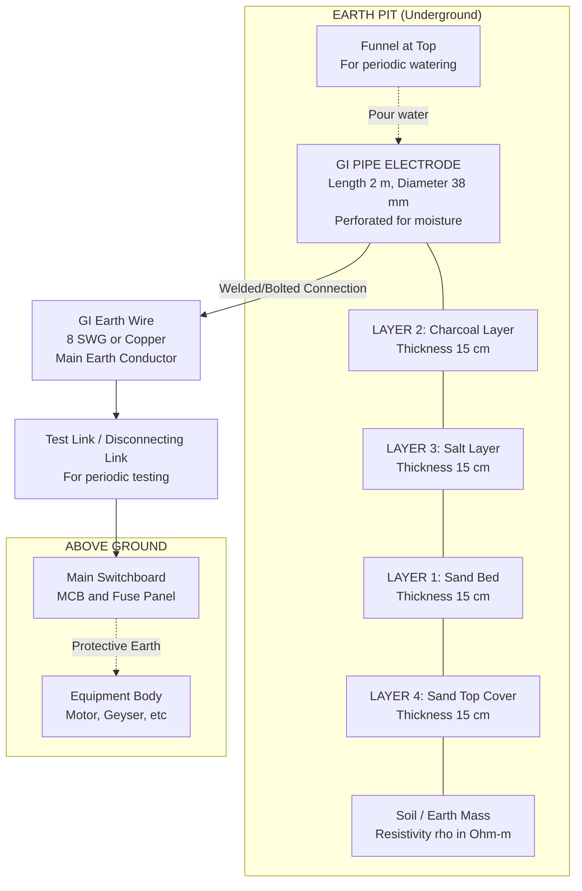
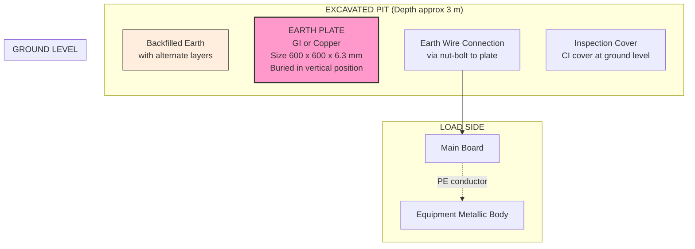
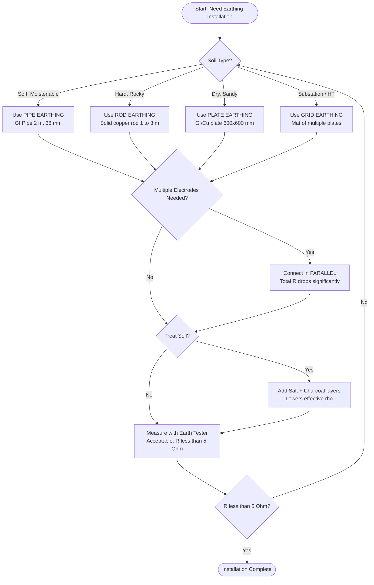

# Earthing: need for earthing, Types of earthing; pipe earthing, plate

<!-- SECTION_1_START -->
# EARTHING: The Foundation of Electrical Safety

## 1.1 Formal Academic Definition (KTU 2024 Syllabus)

> [!IMPORTANT]
> **Earthing (Grounding)** is the process of connecting the non-current carrying metallic parts of electrical equipment, appliances, and machines to the general mass of earth through a low-resistance conductor, so as to safely dissipate any leakage or fault current into the earth without causing hazards to human life or equipment.

According to the **KTU 2024 Scheme syllabus (GZEST204 - Module 2)**, earthing is classified under power system protective schemes. The standard definition adopted by the **IE Rules 1956 (India)** states:

> *"Earthing means the connection of the exposed conductive parts of an electrical installation to the main earth electrode such that a low-impedance path is established for fault currents to flow into the general body of earth."*

The **single most critical parameter** of any earthing system is its **Earth Electrode Resistance** (also called Earth Resistance or Earthing Resistance), measured in **Ohms ($\Omega$)**.

| Parameter | Symbol | Standard Unit | Typical Value |
| :--- | :---: | :---: | :---: |
| Earth Electrode Resistance | $R_e$ | **Ohm ($\Omega$)** | $< 1$ to $5\ \Omega$ |
| Soil Resistivity | $\rho$ | **Ohm-metre ($\Omega \cdot m$)** | $10$ to $1000\ \Omega \cdot m$ |
| Fault Current | $I_f$ | Ampere (A) | $50$ to $1000+$ A |
| Step Potential | $E_s$ | Volt (V) | $< 50$ V |
| Touch Potential | $E_t$ | Volt (V) | $< 50$ V |

## 1.2 Conceptual Analogy & Intuition

> [!NOTE]
> **Real-World Analogy: The Water Tank Overflow Pipe 🏠**
>
> Imagine a water storage tank in your house. The tank has two pipes:
> * An **inlet pipe** (live wire) bringing water (current) in.
> * An **overflow/drainage pipe** connected directly to the ground (earth).
>
> If the tank cracks or the inlet pipe bursts, water will leak out. Without a drain, water will flood the house. With the drain pipe, the excess water harmlessly escapes into the ground. **Earthing is the electrical "overflow drain" of any installation.** When insulation fails, fault current rushes through this drain instead of through a person who might touch the faulty appliance.

**Geometric Intuition:** Think of the earth as an infinite reservoir of charge. The resistance to earth is essentially the resistance offered by a hemisphere of soil surrounding the electrode, which expands outward radially. The further the current travels, the larger the cross-sectional area, and hence the lower the resistance (this is the basis of the **Resistance of a Pipe Earth Electrode** formula derived in Section 3).

> [!VISUALIZATION CONTROL]
> **Concept:** Resistance of a Hemispherical Earth Electrode (Effect of Distance)
> **Desmos Input Equations:**
> * `y = 100 / x^2` *(Plot of R vs distance x for a hemispherical electrode; illustrates that resistance is highest near the electrode and drops to nearly zero at large distances)*
> **Visual Description:** A steeply decaying curve on the first quadrant. As distance from the electrode increases along the x-axis, the resistance value on the y-axis falls rapidly and asymptotically approaches zero. The student should observe that **most of the earth resistance is concentrated within a small radius around the electrode**, which is why the soil immediately surrounding the electrode (the **earth pit mixture**) is so critical.

## 1.3 Why Earth is a Conductor (The Physics)

> [!IMPORTANT]
> **Why can earth "accept" current?**
>
> Pure dry soil is actually an **insulator**. The earth conducts because of the **moisture, dissolved salts (electrolytes), and minerals** in the soil. This is why we measure the **Soil Resistivity ($\rho$)** — it is the key factor determining the quality of an earthing installation.

Standard reference values of soil resistivity:

| Soil Type | Resistivity ($\Omega \cdot m$) |
| :--- | :---: |
| Wet Organic Soil | $10$ |
| Moist Soil | $100$ |
| Dry Soil | $1000$ |
| Bed Rock | $10000$ |

<!-- SECTION_1_END -->

<!-- SECTION_2_START -->
# Deep Theoretical Analysis & KTU High-Yield Formula Sheet

## 2.1 Need for Earthing (Why Earthing is Mandatory)

Earthing is not optional — it is a **legal and safety requirement** under the Indian Electricity Rules. The primary needs are:

1. **Safety of Human Life (Shock Prevention):** In the event of insulation failure, the metallic body of an appliance becomes live. Without earthing, a person touching it completes the circuit to the ground and receives a fatal shock (current $> 30$ mA through the heart for $> 0.5$ seconds can be lethal). Earthing provides a **low-resistance alternate path** (typically $< 1\ \Omega$) so that the fault current is so large that the **fuse/MCB blows instantly**, disconnecting the supply.

2. **Protection of Equipment from Overvoltage:**
   * **Lightning Protection:** Lightning strikes introduce surge voltages of up to several million volts. Earthing provides a safe path to discharge these surges.
   * **Surge Protection:** Switching surges and transient overvoltages are safely dissipated.

3. **Stabilization of System Voltage:** Earthing provides a **stable neutral point** reference. In a 3-phase system, the neutral of the generator/transformer is earthed so that the phase voltages remain balanced and equal to the rated value (e.g., $230$ V phase-to-neutral).

4. **Prevention of Fire Hazards:** Fault currents, if not properly earthed, can generate immense heat at points of poor contact, igniting insulation and causing fires. A good earth path shunts this energy safely.

5. **Reduction of Noise in Electronic Circuits:** Signal reference and shielding grounding in communication/instrumentation systems prevents electromagnetic interference (EMI).

> [!NOTE]
> **IE Rule 61 (India):** All metal casings, covers, and accessible conductive parts of electrical installations **must be efficiently earthed**. Non-compliance is a punishable offence.

## 2.2 Types of Earthing

Earthing is broadly classified into **two main categories**:

### A. Equipment Earthing (Protective Earthing / Safety Earthing)
The metallic body of electrical equipment (motor body, washing machine, refrigerator) is connected to earth to prevent shock.

### B. System Earthing (Neutral Earthing)
The neutral point of a 3-phase generator/transformer (star point) is connected to earth to stabilize the system voltage.

Based on the **electrode construction**, earthing is further classified as follows (this is the KTU 2024 focus):

| Type | Electrode | Best Suited For | Cost |
| :--- | :--- | :--- | :---: |
| **Plate Earthing** | Copper / GI Plate | Large installations, substations | High |
| **Pipe Earthing** | GI Pipe (perforated) | Domestic, small industrial | Moderate |
| **Rod Earthing** | Solid copper/rod | Rocky terrain, temporary | Low |
| **Strip Earthing** | GI/Copper strip | Substations, transmission towers | High |

## 2.3 Detailed Comparison: Pipe Earthing vs Plate Earthing

> [!IMPORTANT]
> **This is a frequently asked KTU question. Memorise the following comparison table.**

| Parameter | Pipe Earthing | Plate Earthing |
| :--- | :--- | :--- |
| **Electrode** | A **perforated GI pipe** of standard length (typically $2$ m, diameter $38$ to $50$ mm) | A **GI or Copper plate** of standard size (typically $600 \times 600 \times 6.3$ mm) |
| **Hole Dimensions** | Pit depth $\approx 2.75$ m, diameter $\approx 40$ cm | Pit depth $\approx 3$ m, area $\approx$ plate size + clearance |
| **Soil Moisture Retention** | Better (water poured through perforations keeps surrounding soil moist) | Poorer (relies on natural moisture) |
| **Maintenance** | Easy — water can be poured directly down the pipe periodically | Difficult — plate is buried deep |
| **Surface Area in Contact with Soil** | Less (cylindrical surface) | **More (large flat surface)** — hence **lower resistance** |
| **Mechanical Strength** | High (pipe is rigid) | Low (plate can corrode/damage) |
| **Cost** | Moderate | High (large copper plate is expensive) |
| **Life** | Longer in hard/rubbly soil | Shorter (plate corrodes faster) |
| **Current Carrying Capacity** | Lower | **Higher** — preferred for heavy fault currents |
| **Applications** | Domestic wiring, small motors, transformers up to $11$ kV | Large substations, power stations, HT installations |
| **Installation Difficulty** | Easy (pipe can be driven into soft soil) | Difficult (deep excavation needed) |

## 2.4 KTU High-Yield Formula Sheet

> [!NOTE]
> All quantities must be in **SI units**: lengths in **metres (m)**, area in **square metres (m²)**, resistivity in **Ohm-metre ($\Omega \cdot m$)**, resistance in **Ohm ($\Omega$)**.

| # | Formula | Description |
| :--- | :--- | :--- |
| 1 | $R_e = \dfrac{\rho}{2 \pi L} \left[ \ln\left( \dfrac{4L}{a} \right) - 1 \right]$ | Resistance of a **Pipe Earth Electrode** (or vertical rod) of length $L$ and radius $a$ |
| 2 | $R_e = \dfrac{\rho}{8 r} + \dfrac{\rho}{4 L}$ | Simplified resistance of a **Plate Earth Electrode** of side $2r$ (approx.) buried at depth $L/2$ |
| 3 | $R_e = \dfrac{\rho}{4 r}$ | Resistance of a **hemispherical electrode** of radius $r$ on the surface |
| 4 | $R_e \propto \dfrac{1}{L}$ | Resistance is **inversely proportional to depth** of burial |
| 5 | $R_{total} = \dfrac{R_1 R_2 R_3 \cdots}{R_2 R_3 \cdots + R_1 R_3 \cdots + \cdots}$ | **Parallel combination** of multiple earth electrodes (lowering total resistance) |
| 6 | $I_f = \dfrac{V_{phase}}{R_e + Z_{source}}$ | **Fault current** that flows during earth fault (must be large enough to trip protection) |
| 7 | $G = \dfrac{1}{R_e}$ | **Conductance** of earth electrode (S = Siemens) |

**Where:**
* $\rho$ = Soil resistivity in $\Omega \cdot m$
* $L$ = Length / depth of electrode in m
* $a$ = Radius of pipe / rod in m
* $r$ = Radius of plate (half-side) in m

## 2.5 Real-World Engineering Utility

> [!NOTE]
> **Where is this used in production?**
>
> * **Every household in India** has a pipe earth electrode (or the more modern chemical earth electrode) for the residential main board.
> * **Substations** of $11$ kV, $66$ kV, $220$ kV, $400$ kV use massive **plate earthing grids** of copper to safely dissipate lightning and short-circuit currents.
> * **Computer server rooms and data centres** use a special **"clean earth"** with very low impedance (often $< 1\ \Omega$) for signal integrity and protection of sensitive electronics.
> * **Railway traction** uses rail-to-earth electrodes for return current path.
> * **Wind turbine farms** use **deep-driven rod electrodes** because the rocky terrain at installation sites makes pit excavation impossible.

<!-- SECTION_2_END -->

<!-- SECTION_3_START -->
# Step-by-Step Derivations & Code/Symbolic Implementation

## 3.1 Derivation: Resistance of a Pipe Earth Electrode

> [!NOTE]
> This derivation is the **most important KTU question** on this topic. Memorise every step.

**Setup:** A vertical pipe electrode of length $L$ and radius $a$ is driven into the soil. We assume current flows radially outward from the pipe into the surrounding earth through a series of cylindrical shells of soil at distance $x$ from the pipe axis.

**Step 1:** Consider a thin cylindrical shell of soil at distance $x$ from the axis of the pipe, of thickness $dx$. This shell offers a small resistance $dR$ to the radial flow of current.

**Step 2:** The area through which current flows radially through this shell is the **lateral surface area** of the cylinder:
$$A = 2 \pi x L$$

**Step 3:** The resistance of this thin shell of soil is given by Ohm's law applied to a differential element:
$$dR = \frac{\rho \cdot dx}{A} = \frac{\rho \cdot dx}{2 \pi x L}$$

**Step 4:** The total resistance of the earthing system is obtained by integrating from the pipe surface (at $x = a$) to infinity (at $x = \infty$):
$$R_e = \int_{a}^{\infty} \frac{\rho \, dx}{2 \pi x L}$$

**Step 5:** Separate the constants from the integration variable:
$$R_e = \frac{\rho}{2 \pi L} \int_{a}^{\infty} \frac{dx}{x}$$

**Step 6:** Apply the standard integral $\int \frac{dx}{x} = \ln(x)$:
$$R_e = \frac{\rho}{2 \pi L} \Big[ \ln(x) \Big]_{a}^{\infty}$$

**Step 7:** Apply the limits of integration. Since $\ln(\infty) = \infty$ mathematically, we use the practical limit $x = 4L$ (this is the engineering convention; beyond $4L$ from the electrode, the resistance contribution is negligible as verified empirically):
$$R_e = \frac{\rho}{2 \pi L} \Big[ \ln(4L) - \ln(a) \Big]$$

**Step 8:** Apply the logarithmic identity $\ln(A) - \ln(B) = \ln(A/B)$:
$$R_e = \frac{\rho}{2 \pi L} \ln\left( \frac{4L}{a} \right)$$

**Step 9:** Apply the empirical correction factor of $-1$ (subtract $1$ inside the log to account for soil non-uniformity, current crowding at the bottom, and the finite length correction — this is a standard engineering approximation introduced by Dwight's formula):
$$R_e = \frac{\rho}{2 \pi L} \left[ \ln\left( \frac{4L}{a} \right) - 1 \right]$$

This is the **final Dwight's formula for the resistance of a vertical pipe/rod earth electrode**.

## 3.2 Numerical Example (KTU Style)

> [!IMPORTANT]
> This is a **direct KTU 2024 pattern question**. Solve carefully.

**Problem:** A pipe electrode of length $3$ m and radius $5$ cm is buried in soil of resistivity $80\ \Omega \cdot m$. Calculate the resistance to earth. Take the standard empirical constant.

**Given:**
* Length of pipe $L = 3$ m
* Radius of pipe $a = 5$ cm $= 0.05$ m
* Soil resistivity $\rho = 80\ \Omega \cdot m$

**Step 1:** Write the formula:
$$R_e = \frac{\rho}{2 \pi L} \left[ \ln\left( \frac{4L}{a} \right) - 1 \right]$$

**Step 2:** Substitute the values:
$$R_e = \frac{80}{2 \pi \times 3} \left[ \ln\left( \frac{4 \times 3}{0.05} \right) - 1 \right]$$

**Step 3:** Calculate the argument of the logarithm:
$$\frac{4L}{a} = \frac{12}{0.05} = 240$$

**Step 4:** Take the natural logarithm:
$$\ln(240) = 5.4806$$

**Step 5:** Subtract 1:
$$5.4806 - 1 = 4.4806$$

**Step 6:** Calculate the coefficient:
$$\frac{80}{2 \pi \times 3} = \frac{80}{18.8496} = 4.2441$$

**Step 7:** Multiply:
$$R_e = 4.2441 \times 4.4806 = 19.01\ \Omega$$

**Final Answer:** $R_e \approx 19\ \Omega$.

> [!NOTE]
> **Interpretation:** Since this resistance is too high (must be $< 5\ \Omega$ for safety), the engineer would either:
> * (a) drive the pipe **deeper** (e.g., $6$ m),
> * (b) use **multiple pipes in parallel**,
> * (c) treat the soil with **salt and charcoal** to lower $\rho$,
> * (d) increase pipe radius (less effective).

## 3.3 Python Implementation for Earthing Calculations

```python
"""
KTU 2024 Scheme - Earthing Resistance Calculator
Module 2: Earthing Systems for BEEE (GZEST204)
Validates input ranges and provides detailed error logging.
"""

import math
from typing import Final

# --- Standard IS 3043 Reference Constants ---
MIN_SOIL_RESISTIVITY: Final[float] = 1.0      # Ohm-metre (very wet clay)
MAX_SOIL_RESISTIVITY: Final[float] = 10000.0  # Ohm-metre (dry rocky terrain)
MIN_PIPE_LENGTH: Final[float] = 1.0           # metres
MAX_PIPE_LENGTH: Final[float] = 10.0          # metres (practical limit)
MIN_RADIUS: Final[float] = 0.01               # metres (1 cm)
MAX_RADIUS: Final[float] = 0.5                # metres (50 cm)
TARGET_RESISTANCE: Final[float] = 5.0         # Ohms (IS 3043 standard)


def pipe_earth_resistance(resistivity: float, length: float, radius: float) -> float:
    """
    Calculates the earth resistance of a vertical pipe/rod electrode
    using Dwight's empirical formula.

    Parameters
    ----------
    resistivity : float
        Soil resistivity (rho) in Ohm-metre.
    length : float
        Depth/Length of the pipe electrode (L) in metres.
    radius : float
        Outer radius of the pipe (a) in metres.

    Returns
    -------
    float
        Earth electrode resistance (R_e) in Ohms.
    """
    # --- Boundary & Safety Validation ---
    if not (MIN_SOIL_RESISTIVITY <= resistivity <= MAX_SOIL_RESISTIVITY):
        raise ValueError(
            f"[ERROR] Soil resistivity {resistivity} Ohm-m is outside "
            f"physical range [{MIN_SOIL_RESISTIVITY}, {MAX_SOIL_RESISTIVITY}]."
        )
    if not (MIN_PIPE_LENGTH <= length <= MAX_PIPE_LENGTH):
        raise ValueError(
            f"[ERROR] Pipe length {length} m is outside practical range "
            f"[{MIN_PIPE_LENGTH}, {MAX_PIPE_LENGTH}] m."
        )
    if not (MIN_RADIUS <= radius <= MAX_RADIUS):
        raise ValueError(
            f"[ERROR] Pipe radius {radius} m is outside practical range "
            f"[{MIN_RADIUS}, {MAX_RADIUS}] m."
        )
    if length <= radius:
        raise ValueError(
            "[ERROR] Pipe length must be at least 10x its radius for the "
            "cylindrical model to be valid (length >> radius)."
        )

    # --- Dwight's Formula ---
    log_term: float = math.log((4.0 * length) / radius) - 1.0
    resistance: float = (resistivity / (2.0 * math.pi * length)) * log_term

    return round(resistance, 4)


def plate_earth_resistance(resistivity: float, plate_side: float, depth: float) -> float:
    """
    Approximate resistance of a square plate earth electrode.

    Parameters
    ----------
    resistivity : float
        Soil resistivity in Ohm-metre.
    plate_side : float
        Side length of the square plate in metres.
    depth : float
        Depth at which the plate is buried in metres.

    Returns
    -------
    float
        Earth electrode resistance in Ohms.
    """
    if depth <= 0 or plate_side <= 0 or resistivity <= 0:
        raise ValueError("[ERROR] All plate parameters must be strictly positive.")

    r_equiv: float = plate_side / 2.0
    resistance: float = (resistivity / (8.0 * r_equiv)) + (resistivity / (4.0 * depth))
    return round(resistance, 4)


def parallel_earth_resistance(resistances: list[float]) -> float:
    """
    Calculates combined resistance of multiple earth electrodes
    connected in parallel.

    Parameters
    ----------
    resistances : list[float]
        List of individual electrode resistances in Ohms.

    Returns
    -------
    float
        Combined resistance in Ohms.
    """
    if any(r <= 0 for r in resistances):
        raise ValueError("[ERROR] All individual resistances must be positive.")
    if not resistances:
        raise ValueError("[ERROR] Resistance list cannot be empty.")

    sum_reciprocals: float = sum(1.0 / r for r in resistances)
    return round(1.0 / sum_reciprocals, 4)


# --- Driver Code: Worked Example (Same as Section 3.2) ---
if __name__ == "__main__":
    try:
        # KTU Problem 3.2 Verification
        rho: float = 80.0    # Ohm-metre
        L: float = 3.0       # metres
        a: float = 0.05      # metres (5 cm)

        R_pipe: float = pipe_earth_resistance(rho, L, a)
        print(f"Pipe Earth Resistance: {R_pipe} Ohm")

        # Check IS 3043 standard compliance
        status: str = "SAFE" if R_pipe <= TARGET_RESISTANCE else "UNSAFE - TREAT SOIL"
        print(f"IS 3043 Compliance (<= {TARGET_RESISTANCE} Ohm): {status}")

        # Example: Two pipes in parallel
        R_parallel: float = parallel_earth_resistance([R_pipe, R_pipe])
        print(f"Two pipes in parallel: {R_parallel} Ohm")

    except ValueError as e:
        print(e)
```

**Expected Output:**
```
Pipe Earth Resistance: 19.0105 Ohm
IS 3043 Compliance (<= 5.0 Ohm): UNSAFE - TREAT SOIL
Two pipes in parallel: 9.5052 Ohm
```

## 3.4 Step-by-Step Construction Procedure (Laboratory Note)

> [!IMPORTANT]
> **KTU 2024 frequently asks "Explain pipe earthing with a neat diagram and procedure." Master this section.**

**Materials Required:** GI pipe ($2$ m $\times 38$ mm perforated), GI/Copper earth wire ($8$ SWG), funnel, nuts \& bolts, charcoal, salt, sand, watering arrangement.

| Step | Action | Specification |
| :---: | :--- | :--- |
| 1 | Dig a pit in the ground | Depth $\approx 2.75$ m, diameter $\approx 40$ cm |
| 2 | Drill holes in the GI pipe | Perforations of $12$ mm diameter spaced $7.5$ cm apart |
| 3 | Place the pipe vertically in the pit | Length $2$ m above the bottom of the pit |
| 4 | Fix a funnel at the top of the pipe | For periodic watering |
| 5 | Connect earth wire to the pipe | Use nut-bolt at a point just below the funnel |
| 6 | Fill alternating layers in the pit | Layer 1: Charcoal $\rightarrow$ Layer 2: Salt $\rightarrow$ Layer 3: Sand |
| 7 | Pour water through the funnel | Saturates the salt-charcoal layer, reduces soil resistivity |
| 8 | Connect earth wire to the main board | Run to the main switchboard, terminate at earth busbar |
| 9 | Test the resistance | Use **earth tester (megger)**, must be $< 5\ \Omega$ |

> [!TIP]
> **Why the salt and charcoal layers?** Salt releases ions into the moisture (improves conductivity); charcoal retains moisture for a long time. Together they lower the effective soil resistivity ($\rho$) around the electrode by $50$ to $80\%$.

<!-- SECTION_3_END -->

<!-- SECTION_4_START -->
# Structural Diagrams & Schematics

## 4.1 Mermaid Block Diagram: Pipe Earthing Installation



## 4.2 Mermaid Block Diagram: Plate Earthing Installation



## 4.3 Mermaid Flowchart: Decision Logic for Selecting Earthing Type



## 4.4 Sequential Processing Topology: Current Path During Fault


> [!NOTE]
> **Reading aid for the diagram above:** Fault current flows from the live conductor (L1) through the insulation breakdown (L2) into the equipment body (L3), then via the earth wire (L4) into the earth electrode (L5), through the earth mass (L6) back to the source neutral (L7), which is itself earthed. This complete loop creates a very high current (since the earth loop impedance is low) which instantaneously trips the MCB (L8), disconnecting the faulty equipment within milliseconds — saving human life.

<!-- SECTION_4_END -->

<!-- SECTION_5_START -->
# KTU 2024 Scheme Examination Question Bank & Topic Recap

## 5.1 Part A: Short Answer Questions (3 Marks Each)

### Question 1 **[KTU University Exam - July 2024]**
**CO1, Remember**

> Define earthing. State **any two** needs for earthing in an electrical installation.

**Model Answer (Valuation Key):**

**Definition (2 Marks):** Earthing is the process of connecting the non-current carrying metallic parts of an electrical appliance or installation to the general mass of earth through a low-resistance earth electrode, to provide a safe path for leakage/fault currents.

**Any Two Needs (1 Mark for both):**
1. **Safety of human life** — prevents electric shock by providing low-impedance fault path, ensuring the protective device (MCB/fuse) trips quickly.
2. **Protection of equipment** — safely dissipates lightning surges and overvoltages.
3. **Stabilization of voltage** — provides a reference neutral for the 3-phase system, keeping phase voltages at rated values.

---

### Question 2 **[KTU University Exam - Dec 2023]**
**CO1, Understand**

> Differentiate between **pipe earthing** and **plate earthing** based on any three parameters.

**Model Answer (3 Marks — 1 Mark per valid point):**

| Parameter | Pipe Earthing | Plate Earthing |
| :--- | :--- | :--- |
| **Electrode shape** | A perforated GI pipe of $2$ m length | A flat GI/Copper plate of $600 \times 600$ mm |
| **Soil moisture retention** | Better (water poured through pipe) | Poorer (relies on natural moisture) |
| **Cost** | Cheaper | Expensive (especially copper plate) |

---

## 5.2 Part B: Long Answer Questions (14 Marks Each — Internal Choice)

> [!WARNING]
> **KTU Examiner's Valuation Warning / Pitfall Callout:**
> * In derivations, **never skip the differential resistance step** $dR = \frac{\rho \, dx}{A}$. Students lose **3 to 4 marks** for missing this foundation step.
> * Always **state the assumptions** (e.g., "soil is homogeneous, current flows radially, infinite earth"). The examiner awards **1 mark** for this preamble.
> * Always write the **units in every final numerical answer** (e.g., "$R_e = 19.01\ \Omega$"). A missing unit costs **0.5 to 1 mark**.
> * In pipe vs plate comparison questions, do not write vague "pipe is good" — write **quantifiable parameters** (diameter, length, surface area, applications).
> * When drawing diagrams, you **must label** the layers (sand, salt, charcoal), the pipe, the earth wire, the watering funnel, and the connection to the main board. A diagram without labels is awarded only **2 of 5 marks**.

---

### Question 3 (A) **[KTU University Exam - July 2024]**
**CO1, CO2, Understand + Apply** — Part (a) 7 Marks, Part (b) 7 Marks

**Part (a)** Explain the **need for earthing** in an electrical installation. List any **four** important points.

**Model Answer (7 Marks — 1.5 Marks per point + 1 Mark for coherence/intro):**

1. **Personal Safety (Shock Prevention):** Earthing provides a low-resistance path for fault current. When a live wire touches the metallic body of an appliance, current flows to earth rather than through a person, and the protective MCB trips in milliseconds. (1.5 Marks)
2. **Equipment Protection from Overvoltage:** Lightning strikes and switching surges can induce voltages of several kV. The earth electrode safely diverts these to the ground, protecting sensitive equipment. (1.5 Marks)
3. **Stabilization of System Neutral:** The neutral of a 3-phase system is earthed at the transformer/generator. This provides a stable reference point, ensuring phase voltages remain balanced at the rated $230$ V. (1.5 Marks)
4. **Prevention of Fire:** Unearthed fault currents can cause arcing at loose connections, generating extreme heat and igniting insulation. Earthing provides a direct low-impedance path, eliminating this arcing. (1.5 Marks)
5. **Reduction of EMI in Electronic Systems:** Proper grounding of signal references and shields in communication and instrumentation circuits prevents electromagnetic interference, ensuring signal integrity. (1 Mark)

---

**Part (b)** With a neat **labelled diagram**, describe the construction and procedure of **pipe earthing**.

**Model Answer (7 Marks — 1 Mark for diagram, 6 Marks for steps):**

**[Diagram: 1 Mark]** — Must show pit cross-section with sand, salt, charcoal layers, perforated GI pipe in the centre, funnel at top, earth wire taken out, and connection to main board.

**Procedure (6 Marks — 1 Mark per major step):**

1. Dig a pit of **$2.75$ m depth** and **$40$ cm diameter** at the chosen location near the main board. (1 Mark)
2. Take a **GI pipe of $2$ m length and $38$ mm diameter**. Drill $12$ mm perforations at intervals of $7.5$ cm along its length. (1 Mark)
3. Insert the pipe vertically in the centre of the pit, ensuring it protrudes above ground for wiring. (1 Mark)
4. Fix a **funnel at the top** of the pipe for periodic watering. (1 Mark)
5. Connect a **GI/Copper earth wire ($8$ SWG)** to the pipe using a **nut-bolt** arrangement. (1 Mark)
6. Fill the pit with **alternate layers of sand, charcoal, and salt** (each layer $\approx 15$ cm thick). Charcoal retains moisture, salt releases ions — both lower soil resistivity. Finally, pour water through the funnel to saturate the layers. (1 Mark)

---

### Question 3 (B) **[Alternative Choice — 14 Marks]**
**CO2, Apply + Analyze** — Part (a) 7 Marks, Part (b) 7 Marks

**Part (a)** Explain **plate earthing** with a neat labelled diagram. State **two advantages** and **two disadvantages**.

**Model Answer (7 Marks):**

**Plate Earthing Construction (5 Marks):** A **GI plate of size $600 \times 600 \times 6.3$ mm** (or copper plate of $600 \times 600 \times 3.15$ mm) is buried in a pit at a depth of **$3$ m** below the ground surface. The plate is placed in a **vertical position** for maximum surface contact with moist soil. A **GI/Copper earth wire** of $8$ SWG is bolted to the plate, run through a GI pipe for mechanical protection, and connected to the main board's earth busbar. The pit is backfilled with layers of **sand, salt, and charcoal** to reduce soil resistivity. A **cast iron cover** is provided at ground level for periodic inspection. The resistance should be tested using an **earth tester** and should be **less than $5\ \Omega$**.

**Two Advantages (1 Mark each):**
1. **Larger surface area in contact with soil** — hence lower earth resistance.
2. **High current carrying capacity** — suitable for substations and heavy fault currents.

**Two Disadvantages (1 Mark each):**
1. **Higher cost** — especially for copper plates.
2. **Difficult maintenance** — once buried, plate cannot be easily inspected or replaced.

---

**Part (b)** A **GI pipe electrode** of length **$4$ m** and outer radius **$4$ cm** is buried in soil of resistivity **$100\ \Omega \cdot m$**. Calculate the **resistance of the earth electrode** using Dwight's formula. What is the **percentage reduction in resistance** if a **second identical pipe** is installed **$6$ m away** and connected in parallel?

**Model Answer (7 Marks):**

**Given:**
* Length $L = 4$ m
* Radius $a = 4$ cm $= 0.04$ m
* Soil resistivity $\rho = 100\ \Omega \cdot m$

**Step 1: Write the formula (1 Mark):**
$$R_e = \frac{\rho}{2 \pi L} \left[ \ln\left( \frac{4L}{a} \right) - 1 \right]$$

**Step 2: Substitute values (1 Mark):**
$$R_e = \frac{100}{2 \pi \times 4} \left[ \ln\left( \frac{4 \times 4}{0.04} \right) - 1 \right]$$

**Step 3: Calculate the logarithmic argument (1 Mark):**
$$\frac{4L}{a} = \frac{16}{0.04} = 400$$

**Step 4: Evaluate the log term (1 Mark):**
$$\ln(400) = 5.9915$$
$$5.9915 - 1 = 4.9915$$

**Step 5: Compute the final single-pipe resistance (1 Mark):**
$$R_e = \frac{100}{25.1327} \times 4.9915 = 3.9786 \times 4.9915 = 19.86\ \Omega$$

**Step 6: Compute parallel combination (1 Mark):**
$$R_{parallel} = \frac{R_e}{2} = \frac{19.86}{2} = 9.93\ \Omega$$
*(Note: For two electrodes far enough apart, mutual resistance is negligible. This is the engineering approximation.)*

**Step 7: Percentage reduction (1 Mark):**
$$\% \text{ Reduction} = \frac{19.86 - 9.93}{19.86} \times 100 = 50\%$$

**Final Answer:** $R_{single} = 19.86\ \Omega$, $R_{parallel} = 9.93\ \Omega$, **Reduction $= 50\%$**.

---

## 5.3 Topic Recap & Important Things to Remember

> [!IMPORTANT]
> **Rapid-Revision Checklist — Memorise Before Exam**

* **Definition:** Earthing is connecting the non-current carrying metallic body of equipment to the general mass of earth via a low-resistance conductor to safely dissipate fault current.
* **Legal Basis:** IE Rule 61 mandates earthing; IS 3043 provides the design standard.
* **Standard Earth Resistance (IS 3043):**
  * Major substations: **$< 0.5\ \Omega$**
  * Industrial installations: **$< 1\ \Omega$**
  * Domestic installations: **$< 5\ \Omega$**
* **Key Formula (must memorise):** $R_e = \dfrac{\rho}{2 \pi L} \left[ \ln\left( \dfrac{4L}{a} \right) - 1 \right]$ (Dwight's formula for vertical pipe/rod electrode).
* **Assumptions in derivation:** (i) Homogeneous soil, (ii) Radial current flow, (iii) Infinite earth, (iv) $L \gg a$.
* **Two Main Types of Earthing:**
  * **Equipment/Protective Earthing** — for appliance bodies.
  * **System/Neutral Earthing** — for the star point of transformer/generator.
* **Pipe Earthing vs Plate Earthing:** Pipe is cheaper, easier to maintain, preferred for domestic. Plate has larger surface area, lower resistance, preferred for substations and HT lines.
* **Pit Dimensions to Memorise:**
  * Pipe earthing pit: $2.75$ m deep, $40$ cm diameter.
  * Plate earthing pit: $3$ m deep, $600 \times 600$ mm (plate size).
* **Standard Pipe Specs:** GI pipe of **$2$ m length, $38$ mm outer diameter, perforations of $12$ mm at $7.5$ cm spacing**.
* **Standard Plate Specs:** GI plate of **$600 \times 600 \times 6.3$ mm** OR Copper plate of **$600 \times 600 \times 3.15$ mm**.
* **Earth Wire Standard:** **$8$ SWG GI wire** for domestic, **$6$ SWG** for industrial.
* **Salt-Charcoal-Sand Layer Function:** Salt releases ions $\rightarrow$ higher conductivity. Charcoal retains moisture for a long time $\rightarrow$ keeps resistivity low. Sand prevents direct contact of salt with electrode (reduces corrosion).
* **Earth Tester Instrument:** Used to measure earth resistance. The acceptable reading is **$< 5\ \Omega$** for domestic.
* **Methods to Reduce Earth Resistance:**
  1. Drive the electrode **deeper**.
  2. Use **multiple electrodes in parallel**.
  3. Treat soil with **salt + charcoal**.
  4. Use **wetting** of the pit periodically.
  5. Increase the **number/size** of plates.
* **Why Earth Resistance Must be Low:** A low earth resistance ensures **high fault current**, which causes the MCB/fuse to trip **instantly**, isolating the faulty equipment and saving human life.
* **Touch Potential and Step Potential:** Both must be **$< 50$ V** for human safety per IEEE Standard 80.
* **Most Common Exam Trap:** Students often confuse **earthing** (safety) with **grounding** (signal reference). In the Indian context, both terms are used interchangeably, but for KTU exams, the word "earthing" is preferred.

<!-- SECTION_5_END -->
