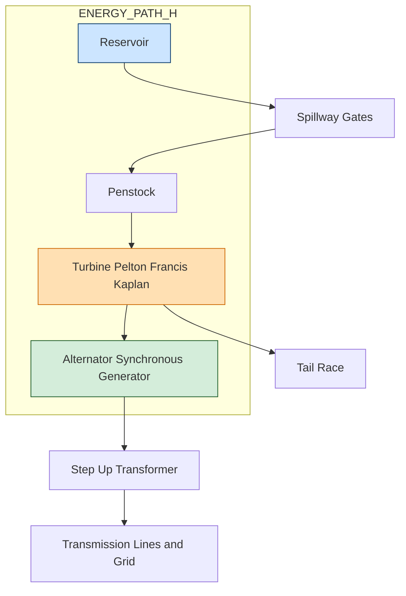
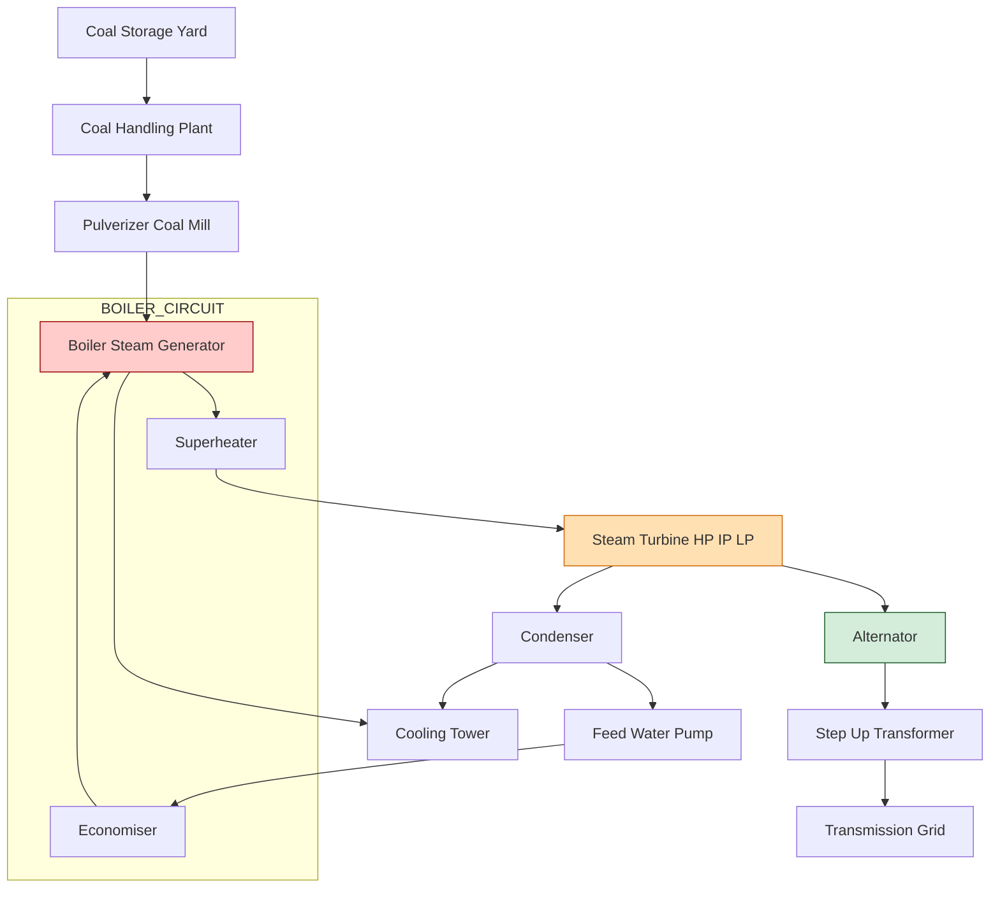
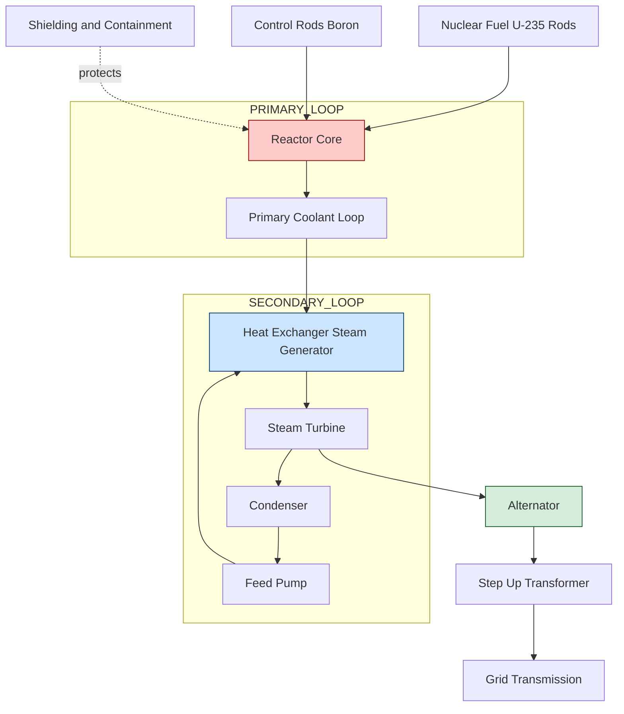
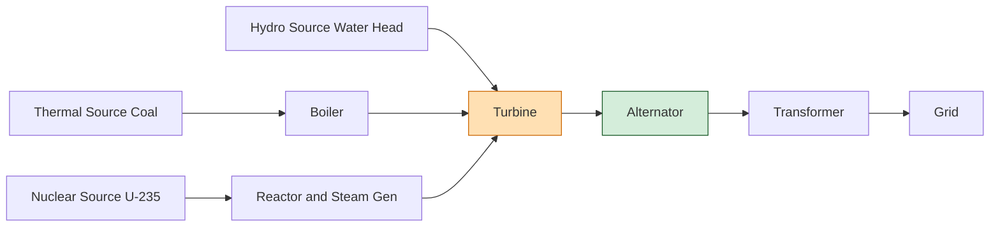

# Generation of electrical energy: Conventional Sources: Hydro, thermal, nuclear plants (Block diagram description)

<!-- SECTION_1_START -->
# Generation of Electrical Energy — Conventional Sources

## 1.1 Formal Academic Definition (KTU 2024 GZEST204 — Module 2)

**Electrical Energy Generation** is the process of converting various forms of primary (raw) energy into electrical energy using electromagnetic induction, governed by **Faraday's Law of Electromagnetic Induction**. In the KTU 2024 syllabus, this conversion is categorized into **Conventional** (non-renewable) and **Non-Conventional** (renewable) sources.

> [!IMPORTANT]
> **KTU Syllabus Definition:**
> *Conventional sources* are the traditional, large-scale, grid-connected methods of producing electrical energy that have been in commercial operation for over a century. The three principal conventional sources covered in Module 2 are:
> 1. **Hydro Power Plants** (using water potential energy)
> 2. **Thermal Power Plants** (using fossil-fuel chemical energy)
> 3. **Nuclear Power Plants** (using nuclear fission binding energy)

The **Block Diagram** approach demanded by KTU is a top-down functional representation showing how energy is converted at each stage — from raw input to final grid delivery — without getting entangled in mechanical/structural details.

## 1.2 Conceptual Analogy & Intuition

Think of electrical generation like a **three-stage water factory pipeline**:

| Source | Real-World Analogy | Energy Type at Input | Energy Type at Output |
|---|---|---|---|
| **Hydro** | Water stored in a mountain dam suddenly released through a pipe turns a giant wheel | Gravitational Potential Energy | Electrical Energy |
| **Thermal** | Burning coal heats a giant kettle; the steam pushes a turbine blade | Chemical Energy of fuel | Electrical Energy |
| **Nuclear** | Splitting a tiny invisible "marble" (uranium atom) releases colossal heat | Nuclear Binding Energy | Electrical Energy |

> [!NOTE]
> **Universal Conversion Chain (applies to ALL three):**
> `Primary Energy Source → Heat/Mechanical Energy → Rotational Mechanical Energy (Shaft) → Electrical Energy (Generator)`
> 
> Only the **first stage differs** for each plant. The remaining two stages (turbine + alternator) are nearly identical in principle.

## 1.3 Key Physical Constants & Metrics

The following **standard constants** are used throughout the three power generation technologies:

> - Acceleration due to gravity: **$g = 9.81 \text{ m/s}^2$**
> - Density of water: **$\rho = 1000 \text{ kg/m}^3$**
> - Speed of light: **$c = 3 \times 10^8 \text{ m/s}$**
> - Mass-energy equivalence: **$E = mc^2$**
> - Standard frequency in India (KTU region): **$f = 50 \text{ Hz}$**
> - Synchronous speed formula: **$N_s = \dfrac{120 f}{P}$**, where $P$ = number of poles.

> [!TIP]
> **GeoGebra / Desmos Visualization Concept**
> Concept: Hydroelectric power output vs. head and discharge
> GeoGebra Input: `P = 1000 * 9.81 * Q * H * eta` with sliders Q in [0, 500], H in [0, 300], eta in [0, 1]
> Visual Description: A 3D surface plot — Power (MW) rises linearly with both Discharge (m³/s) on the X-axis and Head (m) on the Y-axis. Students should observe that doubling either Q or H doubles the output, confirming linear proportionality.

<!-- SECTION_1_END -->

<!-- SECTION_2_START -->
# Deep Theoretical Analysis & KTU High-Yield Formula Sheet

## 2.1 Hydroelectric Power Plant (HEP)

A hydro plant converts the **potential energy of stored water** at a high elevation into electrical energy. The block diagram is a clean linear flow of energy transformation stages.

### 2.1.1 Block Diagram Components (in flow order)

1. **Reservoir / Dam** — stores water at a height (creates the *head* $H$).
2. **Spillway Gates** — control the volume of water released.
3. **Penstock** — a high-pressure closed conduit that carries water down from the dam to the turbine. The sudden drop converts potential energy into **kinetic (pressure) energy**.
4. **Turbine** (Pelton / Francis / Kaplan based on head) — converts hydraulic energy into **rotational mechanical energy**.
5. **Alternator (Synchronous Generator)** — converts mechanical shaft energy into **electrical energy** (3-phase AC).
6. **Step-up Transformer** — raises voltage to **$11 \text{ kV}$, $66 \text{ kV}$, $132 \text{ kV}$** or higher for transmission.
7. **Transmission Lines & Grid** — delivers power to load centers.
8. **Tail Race** — the channel that carries water back to the river after passing the turbine.

### 2.1.2 KTU Formula Sheet — Hydro Plant

| # | Quantity | Formula | Unit | Remarks |
|---|---|---|---|---|
| 1 | Mass flow rate of water | $\dot{m} = \rho \cdot Q$ | kg/s | $Q$ = discharge (m³/s) |
| 2 | Weight flow rate | $W_f = \rho \cdot g \cdot Q$ | N/s | Weight per second |
| 3 | Hydraulic Power available | $P_{hyd} = \rho \cdot g \cdot Q \cdot H$ | W | Total water power |
| 4 | Electrical Power output | $P_{elec} = \eta_{overall} \cdot \rho \cdot g \cdot Q \cdot H$ | W | $\eta_{overall} \approx 0.85$–$0.90$ |
| 5 | Energy stored in reservoir | $E = \rho \cdot g \cdot V \cdot H$ | J | $V$ = usable volume |
| 6 | Specific speed (turbine selection) | $N_s = \dfrac{N \sqrt{P}}{H^{5/4}}$ | — | Used to choose Pelton/Francis/Kaplan |

> [!NOTE]
> **Engineering Real-World Use:** The Idukki Hydroelectric Project in Kerala (KSEB) uses Francis turbines, with a rated head of $\approx 169$ m. India has an installed hydro capacity of about **$47$ GW (2024)** as part of its clean-energy mix.

## 2.2 Thermal Power Plant

A thermal plant burns **coal, oil, or natural gas** to produce high-pressure steam, which drives a steam turbine connected to an alternator.

### 2.2.1 Block Diagram Components (in flow order)

1. **Coal Storage Yard & Coal Handling Plant (CHP)** — raw coal storage, crushing, and conveyor transport.
2. **Pulverizer (Coal Mill)** — grinds coal into fine powder for efficient burning.
3. **Boiler (Steam Generator)** — burns the pulverized coal; the heat converts water into high-pressure superheated steam.
4. **Economiser** — preheats feed water using flue gas waste heat (improves efficiency).
5. **Superheater & Reheater** — raises steam temperature above the saturation point.
6. **Steam Turbine (HP – IP – LP stages)** — converts thermal energy of steam into rotational energy.
7. **Condenser** — cools the exhaust steam back to water using cooling towers or river water; creates a partial vacuum that boosts turbine efficiency.
8. **Feed Water Pump & Boiler Feed Pump (BFP)** — pumps condensed water back to the boiler.
9. **Cooling Tower** — rejects waste heat to the atmosphere.
10. **Alternator & Step-up Transformer** — final electrical conversion and voltage uplift.

### 2.2.2 KTU Formula Sheet — Thermal Plant

| # | Quantity | Formula | Unit | Remarks |
|---|---|---|---|---|
| 1 | Calorific Value of coal | $CV$ (or $GCV$) | kJ/kg | Indian coal $\approx 18$–$25$ MJ/kg |
| 2 | Coal consumption per hour | $m_{coal} = \dfrac{P_{elec}}{\eta_{overall} \cdot CV}$ | kg/h | KTU exam favorite |
| 3 | Boiler efficiency | $\eta_B = \dfrac{\text{Heat in steam}}{\text{Heat from fuel}} \times 100$ | % | Typical: 80–90% |
| 4 | Overall plant efficiency | $\eta_{overall} = \eta_B \cdot \eta_T \cdot \eta_G$ | % | $\approx 30$–$40$% |
| 5 | Rankine cycle thermal efficiency | $\eta_{th} = 1 - \dfrac{T_1}{T_2}$ | — | $T_1$ = condenser, $T_2$ = boiler (K) |
| 6 | Heat rate | $HR = \dfrac{3600}{\eta_{th}}$ | kJ/kWh | Lower is better |
| 7 | Three-phase output | $P = \sqrt{3} \cdot V_L \cdot I_L \cdot \cos\phi$ | W | Alternator output |

> [!IMPORTANT]
> **Engineering Real-World Use:** The **Vindhyachal Super Thermal Power Station (NTPC, Madhya Pradesh)** is one of India's largest coal-fired plants with **$4760$ MW** installed capacity. The boiler used is a Supercritical boiler, operating at steam pressures of $\approx 250$ bar and $600^\circ$C to push efficiency above $40$%.

## 2.3 Nuclear Power Plant

A nuclear plant uses the **heat released from nuclear fission** of isotopes like U-235 or Pu-239 to produce steam, which then drives a conventional steam turbine-alternator system.

### 2.3.1 Block Diagram Components (in flow order)

1. **Nuclear Fuel (Uranium rods)** — source of fission energy.
2. **Reactor Core** — where the **controlled chain reaction** takes place.
3. **Moderator (Heavy Water / Graphite / Light Water)** — slows down fast neutrons to sustain the chain reaction.
4. **Control Rods (Boron / Cadmium)** — absorb neutrons to regulate the reaction rate.
5. **Coolant (Primary Loop)** — transfers fission heat from the core to the heat exchanger.
6. **Heat Exchanger / Steam Generator (Secondary Loop)** — transfers heat to a separate water circuit without contaminating it.
7. **Steam Turbine, Condenser, Feed Pump** — same as thermal plant.
8. **Alternator & Transformer** — final electrical output.
9. **Shielding & Containment Building** — thick concrete + steel dome for radiation safety.

### 2.3.2 KTU Formula Sheet — Nuclear Plant

| # | Quantity | Formula | Unit | Remarks |
|---|---|---|---|---|
| 1 | Mass-energy equivalence | $E = m \cdot c^2$ | J | Einstein's principle |
| 2 | Energy from 1 kg U-235 | $E \approx 8.2 \times 10^{13}$ | J | Equivalent to $\approx 20,000$ tonnes of coal |
| 3 | Multiplication factor | $k = \dfrac{\text{neutrons in generation } n+1}{\text{neutrons in generation } n}$ | — | $k<1$ subcritical, $k=1$ critical, $k>1$ supercritical |
| 4 | Reactivity | $\rho = \dfrac{k-1}{k}$ | — | Measure of deviation from criticality |
| 5 | Reactor power | $P = \dot{m}_c \cdot c_p \cdot \Delta T$ | W | $\dot{m}_c$ = coolant mass flow |
| 6 | Fuel burnup | $BU = \dfrac{\text{Energy released (MWd)}}{\text{Mass of heavy metal (tonne)}}$ | MWd/tonne | Quality indicator |

> [!NOTE]
> **Engineering Real-World Use:** The **Kudankulam Nuclear Power Plant (Tamil Nadu, NPCIL)** has two VVER-1000 reactors producing **$2000$ MW**. The plant uses **light water** as moderator and coolant. The **Kakrapar Atomic Power Station (Gujarat)** uses the indigenous **PHWR-700** design and heavy water as moderator.

## 2.4 Comparative Summary Table (KTU Board Favorite)

| Feature | Hydro Plant | Thermal Plant | Nuclear Plant |
|---|---|---|---|
| Primary Fuel | Water (renewable) | Coal / Oil / Gas | U-235 / Pu-239 |
| Initial Cost | High (civil works) | Moderate | Very High |
| Running Cost | Very Low | High (fuel cost) | Moderate (fuel + waste mgmt.) |
| Efficiency | 85–90% | 30–40% | 30–35% |
| Start-up Time | Minutes (peak load) | Hours (base load) | Days (base load) |
| Pollution | None | High (CO₂, SO₂) | Low (radiation risk) |
| Location Flexibility | Needs hilly terrain + water | Anywhere near fuel supply | Away from dense population |
| Examples in India | Idukhi, Bhakra Nangal | Vindhyachal, NTPC Dadri | Kudankulam, Tarapur |

<!-- SECTION_2_END -->

<!-- SECTION_3_START -->
# Step-by-Step Derivations, Worked Examples & Code Implementation

## 3.1 Derivation — Hydroelectric Power Equation

We derive the **electrical power output equation** for a hydro plant, as it is a frequent KTU Part B question.

### Step 1: Mass of water flowing per second

If $Q$ is the discharge in $\text{m}^3/\text{s}$ and $\rho$ is the density of water in $\text{kg/m}^3$, then:

$$
\dot{m} = \rho \cdot Q \quad (\text{kg/s})
$$

### Step 2: Weight of water per second

Weight is mass times acceleration due to gravity:

$$
W_f = \dot{m} \cdot g = \rho \cdot g \cdot Q \quad (\text{N/s})
$$

### Step 3: Power available from falling water

If the water falls through a vertical head $H$ (metres), the work done per second (= power) is:

$$
P_{hyd} = W_f \cdot H = \rho \cdot g \cdot Q \cdot H \quad (\text{Watts})
$$

### Step 4: Apply overall efficiency

The alternator and turbine together have an overall efficiency $\eta_{overall}$. Therefore, the **electrical power output** is:

$$
\boxed{P_{elec} = \eta_{overall} \cdot \rho \cdot g \cdot Q \cdot H}
$$

Substituting $\rho = 1000 \text{ kg/m}^3$ and $g = 9.81 \text{ m/s}^2$:

$$
P_{elec} = 9.81 \cdot \eta_{overall} \cdot Q \cdot H \quad \text{kW (if } Q \text{ in m}^3/\text{s and } H \text{ in m)}
$$

### Numerical Worked Example (KTU Pattern)

**Problem:** A hydro plant has a discharge of $200 \text{ m}^3/\text{s}$ and an effective head of $150 \text{ m}$. Calculate the electrical power generated if the overall efficiency is $88\%$. *(7 marks)*

**Solution:**

$$
P_{hyd} = 1000 \times 9.81 \times 200 \times 150
$$

$$
P_{hyd} = 2.943 \times 10^8 \text{ W} = 294.3 \text{ MW}
$$

$$
P_{elec} = 0.88 \times 294.3 = 258.984 \text{ MW} \approx 259 \text{ MW}
$$

**Valuation Key:**
- [Substituting correct values: 2 Marks]
- [Computing $P_{hyd}$ correctly: 2 Marks]
- [Multiplying by $\eta$: 2 Marks]
- [Final answer with units: 1 Mark]

## 3.2 Derivation — Coal Consumption in Thermal Plant

### Step 1: Energy input from coal

For a coal consumption $m_{coal}$ (kg/h) with calorific value $CV$ (kJ/kg):

$$
E_{in} = m_{coal} \cdot CV \quad (\text{kJ/h})
$$

### Step 2: Convert to kW

$$
P_{in} = \dfrac{m_{coal} \cdot CV}{3600} \quad (\text{kW})
$$

### Step 3: Apply overall efficiency

For a required electrical output $P_{elec}$:

$$
P_{elec} = \eta_{overall} \cdot P_{in}
$$

$$
P_{elec} = \eta_{overall} \cdot \dfrac{m_{coal} \cdot CV}{3600}
$$

$$
\boxed{m_{coal} = \dfrac{3600 \cdot P_{elec}}{\eta_{overall} \cdot CV} \quad (\text{kg/h})}
$$

### Numerical Worked Example

**Problem:** A thermal station delivers $100$ MW. Coal has $CV = 25 \text{ MJ/kg}$ and overall efficiency is $30\%$. Find coal consumption in kg/h.

**Solution:**

$$
m_{coal} = \dfrac{3600 \times 100 \times 10^3}{0.30 \times 25 \times 10^6}
$$

$$
m_{coal} = \dfrac{3.6 \times 10^8}{7.5 \times 10^6} = 48 \text{ kg/s} = 172{,}800 \text{ kg/h} \approx 173 \text{ tonnes/h}
$$

**Valuation Key:** [Formula: 2M] [Substitution: 2M] [Final numerical answer: 3M]

## 3.3 Python Code — Power Plant Calculator (KTU Practical-Oriented)

```python
"""
KTU 2024 - GZEST204 Module 2
Power Plant Output Calculator
Computes output for Hydro, Thermal, and Nuclear configurations
"""

import logging
import math

# Configure strict error logging
logging.basicConfig(level=logging.INFO, format='%(levelname)s :: %(message)s')


def hydro_power(discharge_m3s: float, head_m: float, efficiency: float) -> dict:
    """
    Calculate hydroelectric power output.
    P = eta * rho * g * Q * H
    """
    if discharge_m3s <= 0 or head_m <= 0:
        logging.error("Discharge and head must be positive.")
        return {"error": "Invalid input"}
    if not (0 < efficiency <= 1):
        logging.error("Efficiency must be in (0, 1].")
        return {"error": "Invalid efficiency"}

    rho = 1000.0          # kg/m^3
    g = 9.81              # m/s^2
    p_hydraulic = rho * g * discharge_m3s * head_m          # W
    p_electrical = efficiency * p_hydraulic                  # W

    return {
        "type": "Hydro",
        "hydraulic_power_MW": round(p_hydraulic / 1e6, 3),
        "electrical_power_MW": round(p_electrical / 1e6, 3),
    }


def thermal_coal_consumption(p_output_kW: float, cv_kJ_kg: float,
                             efficiency: float) -> dict:
    """
    Calculate coal consumption per hour for a thermal plant.
    m = (3600 * P_out) / (eta * CV)
    """
    if p_output_kW <= 0 or cv_kJ_kg <= 0:
        logging.error("Output and calorific value must be positive.")
        return {"error": "Invalid input"}
    if not (0 < efficiency <= 1):
        logging.error("Efficiency must be in (0, 1].")
        return {"error": "Invalid efficiency"}

    coal_kg_per_hr = (3600.0 * p_output_kW) / (efficiency * cv_kJ_kg)

    return {
        "type": "Thermal",
        "coal_kg_per_hr": round(coal_kg_per_hr, 2),
        "coal_tonnes_per_day": round(coal_kg_per_hr * 24 / 1000.0, 2),
    }


def nuclear_fission_energy(mass_kg: float) -> dict:
    """
    Calculate energy released from complete fission of given U-235 mass.
    E = m * c^2
    """
    if mass_kg <= 0:
        logging.error("Mass must be positive.")
        return {"error": "Invalid mass"}

    c = 3.0e8                  # m/s
    energy_joules = mass_kg * c ** 2
    energy_kWh = energy_joules / 3.6e6
    coal_equivalent_tonnes = energy_kWh / 2.46e3  # 1 tonne coal ~ 2466 kWh

    return {
        "type": "Nuclear",
        "energy_joules": f"{energy_joules:.3e}",
        "energy_kWh": f"{energy_kWh:.3e}",
        "coal_equivalent_tonnes": round(coal_equivalent_tonnes, 2),
    }


# --- Demonstration Block ---
if __name__ == "__main__":
    logging.info("KTU Power Plant Calculator — Module 2 Demonstration")

    # Idukki hydro-like values
    print(hydro_power(discharge_m3s=200.0, head_m=150.0, efficiency=0.88))

    # NTPC Vindhyachal-like values: 100 MW, 25 MJ/kg, 30% efficiency
    print(thermal_coal_consumption(p_output_kW=100_000.0,
                                   cv_kJ_kg=25_000.0,
                                   efficiency=0.30))

    # 1 kg of U-235 fully fissioned
    print(nuclear_fission_energy(mass_kg=1.0))
```

**Sample Output:**
```
{'type': 'Hydro', 'hydraulic_power_MW': 294.3, 'electrical_power_MW': 258.984}
{'type': 'Thermal', 'coal_kg_per_hr': 48000.0, 'coal_tonnes_per_day': 1152.0}
{'type': 'Nuclear', 'energy_joules': '9.000e+16', 'energy_kWh': '2.500e+10', 'coal_equivalent_tonnes': 10162601.0}
```

> [!NOTE]
> **Code Insight:** Notice how 1 kg of U-235 gives the energy of **$\approx 10$ million tonnes of coal** — a striking justification for nuclear power's extremely high energy density. KTU may ask such comparison questions for 3 marks.

## 3.4 Step-by-Step Conversion Logic — Energy Equivalence

For a quick conversion between energy sources, the standard equivalence is:

$$
1 \text{ kWh} = 3.6 \times 10^6 \text{ J} = 860 \text{ kcal}
$$

To estimate **coal tonnage equivalent to 1 kg of U-235 fission**:

$$
E_{1 \text{ kg U-235}} = 1 \times (3 \times 10^8)^2 = 9 \times 10^{16} \text{ J}
$$

Convert to kWh:

$$
E = \dfrac{9 \times 10^{16}}{3.6 \times 10^6} = 2.5 \times 10^{10} \text{ kWh}
$$

Assuming 1 tonne of coal produces $\approx 2466$ kWh (typical Indian coal):

$$
\text{Coal equivalent} = \dfrac{2.5 \times 10^{10}}{2466} \approx 1.01 \times 10^7 \text{ tonnes}
$$

Thus, $1 \text{ kg of U-235} \approx 10$ million tonnes of coal.

<!-- SECTION_3_END -->

<!-- SECTION_4_START -->
# Structural Diagrams & Schematics

> [!IMPORTANT]
> All Mermaid diagrams below use **alphanumeric node IDs**, double-quoted labels, and nested subgraphs. No special characters appear in unquoted positions.

## 4.1 Block Diagram — Hydroelectric Power Plant



## 4.2 Block Diagram — Thermal Power Plant



## 4.3 Block Diagram — Nuclear Power Plant



## 4.4 Comparative Block Diagram — All Three Plants



> [!NOTE]
> **Reading the Diagrams:** In all three plants, the final two stages (Alternator + Transformer) are identical. This is a critical KTU insight: the *only* difference is **how the steam/hydraulic rotation is produced**.

<!-- SECTION_4_END -->

<!-- SECTION_5_START -->
# KTU 2024 Scheme Examination Question Bank & Topic Recap

---

## 5.1 Part A — Short Answer Questions (3 Marks Each)

### Q1. [KTU University Exam — July 2024, CO1, Remember]
**List any six major components of a thermal power plant with their function.**

**Model Answer (3 Marks):**

| # | Component | Function |
|---|---|---|
| 1 | **Coal Handling Plant (CHP)** | Stores, crushes, and transports coal to the boiler. |
| 2 | **Pulverizer** | Grinds coal into fine powder for efficient combustion. |
| 3 | **Boiler (Steam Generator)** | Burns coal; converts water into high-pressure steam. |
| 4 | **Superheater** | Raises steam temperature above saturation. |
| 5 | **Steam Turbine** | Converts steam's thermal energy into rotational mechanical energy. |
| 6 | **Condenser** | Condenses spent steam back to water for reuse. |
| 7 | **Alternator** | Converts mechanical rotation into 3-phase electrical energy. |

**Marking Pattern:** [Each correct point with function: 0.5 × 6 = 3 Marks]

---

### Q2. [KTU University Exam — Dec 2023, CO1, Understand]
**Distinguish between a boiling water reactor (BWR) and a pressurized water reactor (PWR).**

**Model Answer (3 Marks):**

| Feature | BWR | PWR |
|---|---|---|
| **Primary loop pressure** | Lower (~75 bar) | Higher (~155 bar) |
| **Steam generation** | Direct in reactor core | In separate steam generator |
| **Steam quality** | Slightly wet (carryover) | High-quality dry steam |
| **Reactor vessel** | Large (contains steam separators) | Smaller, robust |
| **Loop count** | Single loop | Two loops (primary + secondary) |
| **Example** | Older designs (e.g., Tarapur-1) | VVER (Kudankulam) |

**Marking Pattern:** [Any 3 valid points: 1 Mark each]

---

## 5.2 Part B — Module Internal Choice (14 Marks)

### Question A (Choice 1) — [KTU University Exam — July 2024, CO2, Apply]

**(a)** Draw the block diagram of a hydroelectric power plant and explain the function of each component. *(7 Marks)*

**(b)** A hydro plant has a discharge of $180 \text{ m}^3/\text{s}$ and an effective head of $120 \text{ m}$. If the overall efficiency is $86\%$, calculate:
   (i) The hydraulic power available. *(2 Marks)*
   (ii) The electrical power output. *(2 Marks)*
   (iii) The daily energy generation in MWh. *(3 Marks)*

---

### Question B (Choice 2) — [KTU University Exam — Dec 2023, CO2, Apply]

**(a)** Draw the block diagram of a nuclear power plant and explain the role of the moderator, control rods, and coolant. *(7 Marks)*

**(b)** A $500 \text{ MW}$ thermal station operates at an overall efficiency of $35\%$. The coal has a calorific value of $22 \text{ MJ/kg}$. Calculate:
   (i) The coal consumption per hour in tonnes. *(3 Marks)*
   (ii) The heat rejected per hour to the condenser in MJ. *(2 Marks)*
   (iii) The amount of CO₂ released per hour (assume $2.4 \text{ kg CO}_2$ per kg of coal). *(2 Marks)*

---

## 5.3 Detailed Model Solutions

### Solution to Question A

**(a) Block Diagram — HEP (7 Marks):**

| # | Component | Function | Marks |
|---|---|---|---|
| 1 | Reservoir / Dam | Stores water at a high head | 1 |
| 2 | Spillway gates | Controls water release | 0.5 |
| 3 | Penstock | Carries water under pressure to turbine | 1 |
| 4 | Turbine | Converts hydraulic energy → mechanical rotation | 1 |
| 5 | Alternator | Converts rotation → electrical energy | 1 |
| 6 | Step-up transformer & Grid | Voltage uplift + transmission | 1 |
| 7 | Tail race | Discharges used water back to river | 0.5 |
| 8 | Neat block diagram with arrows | Correct sequencing | 1 |

**(b) Numerical Solution (7 Marks):**

**(i) Hydraulic Power (2 Marks):**

$$
P_{hyd} = \rho \cdot g \cdot Q \cdot H
$$

$$
P_{hyd} = 1000 \times 9.81 \times 180 \times 120 = 2.119 \times 10^8 \text{ W} = 211.92 \text{ MW}
$$

**[Substitution: 1M; Final value: 1M]**

**(ii) Electrical Power (2 Marks):**

$$
P_{elec} = 0.86 \times 211.92 = 182.25 \text{ MW}
$$

**[Formula: 1M; Final answer: 1M]**

**(iii) Daily Energy (3 Marks):**

$$
E_{daily} = 182.25 \text{ MW} \times 24 \text{ h} = 4374 \text{ MWh}
$$

**[Multiplication logic: 2M; Final: 1M]**

---

### Solution to Question B

**(a) Block Diagram — Nuclear Power Plant (7 Marks):**

| # | Component | Role | Marks |
|---|---|---|---|
| 1 | Nuclear fuel (U-235) | Source of fission energy | 1 |
| 2 | Moderator (Heavy water / Graphite) | Slows neutrons to sustain chain reaction | 1.5 |
| 3 | Control rods (Boron / Cadmium) | Absorbs neutrons; regulates reaction | 1.5 |
| 4 | Coolant (primary loop) | Carries heat from core | 1 |
| 5 | Heat exchanger / Steam generator | Transfers heat to secondary loop | 1 |
| 6 | Alternator + Transformer | Electrical output | 0.5 |
| 7 | Neat block diagram with arrows | Visual clarity | 0.5 |

**(b) Numerical Solution (7 Marks):**

**(i) Coal Consumption (3 Marks):**

$$
m_{coal} = \dfrac{3600 \cdot P_{elec}}{\eta \cdot CV} = \dfrac{3600 \times 500 \times 10^3}{0.35 \times 22 \times 10^6}
$$

$$
m_{coal} = \dfrac{1.8 \times 10^9}{7.7 \times 10^6} = 233.77 \text{ kg/s} = 841.6 \text{ tonnes/h}
$$

**[Formula: 1M; Substitution: 1M; Final: 1M]**

**(ii) Heat Rejected (2 Marks):**

$$
Q_{rejected} = P_{in} - P_{elec} = \left(\dfrac{1.8 \times 10^9}{0.35}\right) - (500 \times 10^6)
$$

$$
Q_{rejected} = 5.143 \times 10^9 - 0.5 \times 10^9 = 4.643 \times 10^9 \text{ J/s} = 4643 \text{ MJ/s} = 1.671 \times 10^7 \text{ MJ/h}
$$

**[Logic: 1M; Final numerical value: 1M]**

**(iii) CO₂ Emitted (2 Marks):**

$$
\text{CO}_2 = 841.6 \times 10^3 \text{ kg/h} \times 2.4 = 2.02 \times 10^6 \text{ kg/h} \approx 2020 \text{ tonnes/h}
$$

**[Multiplication logic: 1M; Final: 1M]**

---

## 5.4 KTU Examiner's Valuation Warning

> [!WARNING]
> **Common Pitfalls That Cost Marks in This Module:**
> 
> 1. **Forgetting units in $P_{elec}$:** Always state whether the answer is in W, kW, MW, or MWh. Many students lose 1 mark for "missing units."
> 2. **Mixing up head and discharge:** In the hydro formula $P = \rho g Q H$, students sometimes substitute $Q$ in litres/s instead of $\text{m}^3/\text{s}$. Remember: $1 \text{ m}^3/\text{s} = 1000 \text{ L/s}$.
> 3. **No block diagram arrows:** A KTU block diagram without directional arrows = **−2 marks minimum**. The evaluator must see the *flow* of energy.
> 4. **Omitting the "overall efficiency" step:** Most students compute hydraulic/thermal power correctly but forget to multiply by $\eta$. This silently halves the marks for the question.
> 5. **Confusing "moderator" and "coolant" in a nuclear plant:** Moderator **slows neutrons**; coolant **carries heat**. These are *not* the same function. Examiners frequently allocate 1.5 marks each — losing one loses both.
> 6. **Skipping $\sqrt{3}$ in 3-phase power:** If a question involves alternator output, always use $P = \sqrt{3} V_L I_L \cos\phi$. Writing $P = VI$ is a guaranteed 1-mark deduction.

---

## 5.5 Topic Recap & Important Things to Remember

> [!IMPORTANT]
> **Rapid-Revision Checklist for Module 2 — Conventional Power Plants**

- **Block Diagram Definition (KTU):** A *block diagram* represents a system as a sequence of labeled blocks connected by arrows showing the flow of energy or signal. For Module 2, it must always flow from the **primary energy source → turbine → alternator → transformer → grid**.

- **Three Plants, One Common Tail:** Hydro, Thermal, and Nuclear differ only in the **first stage** (input energy conversion). The **turbine → alternator → transformer → grid** chain is universal.

- **Key Hydro Equation:** $\boxed{P_{elec} = \eta \cdot \rho \cdot g \cdot Q \cdot H}$. Density $\rho = 1000$ kg/m³, $g = 9.81$ m/s². Always in SI units.

- **Key Thermal Equation:** $\boxed{m_{coal} = \dfrac{3600 \cdot P_{elec}}{\eta \cdot CV}}$. Multiply $P_{elec}$ (kW) by 3600 to convert to kJ/h.

- **Key Nuclear Equation:** $\boxed{E = m c^2}$ with $c = 3 \times 10^8$ m/s. **1 kg U-235 ≈ 10 million tonnes of coal.**

- **Plant Selection Guide:**
  - **Peak load** (rapid start-stop): Hydro, Pumped storage.
  - **Base load** (24×7): Thermal, Nuclear.
  - **Pollution-free regions:** Hydro and Nuclear (with proper waste management).

- **Indian Examples (must-memorize for KTU):**
  - Hydro: Idukki, Bhakra Nangal, Sardar Sarovar.
  - Thermal: NTPC Vindhyachal, NTPC Dadri, Neyveli Lignite.
  - Nuclear: Kudankulam (VVER), Kakrapar (PHWR), Tarapur (BWR).

- **Terminology to Distinguish:**
  - **Moderator** vs **Coolant** — slow neutrons vs carry heat.
  - **Condenser** vs **Boiler** — liquefy steam vs generate steam.
  - **Penstock** (hydro) vs **Primary loop** (nuclear) — both transport high-pressure working fluid.

- **Synchronous Generator Speed:** $N_s = \dfrac{120 f}{P}$. For $50 \text{ Hz}$ and $P = 4$, $N_s = 1500 \text{ rpm}$ — a recurring KTU value.

- **Power Plant Triad Reminder:** `Efficiency × Availability × Capacity Factor` defines the **actual energy output** of a plant, not just the installed capacity.

- **Common 3-Mark Question Hooks:**
  - "Sketch and explain the block diagram of …"
  - "List the functions of: moderator / economiser / superheater / penstock."
  - "Compare base-load vs peak-load plants."

- **Common 14-Mark Question Hooks:**
  - "With a neat block diagram, explain …" — *always pair with a numerical for 7+7 split.*
  - "Calculate the coal/energy output for a … plant." — *must include $\eta$.*

> [!TIP]
> **Final KTU Strategy Tip:** Always draw the block diagram **before** writing any explanation. A neat, well-labeled block diagram with arrows is worth 4–5 marks on its own and serves as a *visual roadmap* for the rest of your answer. Even if you forget a function, the diagram may fetch partial marks.

<!-- SECTION_5_END -->
