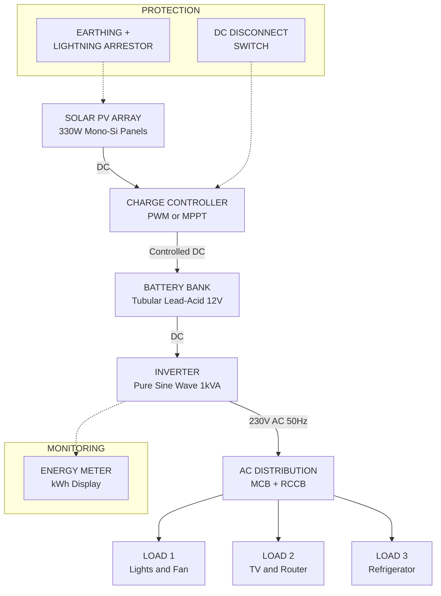
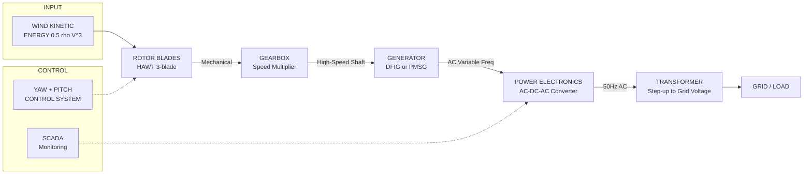
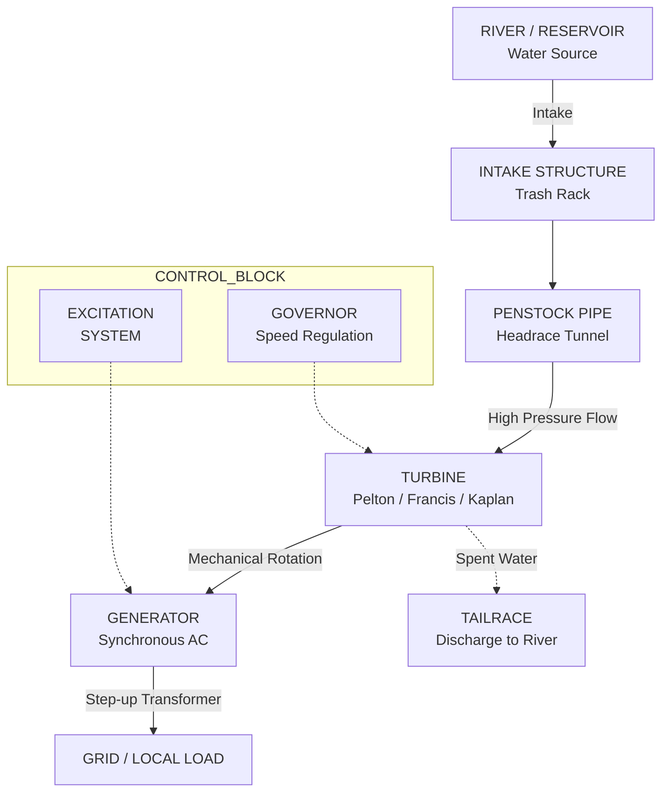
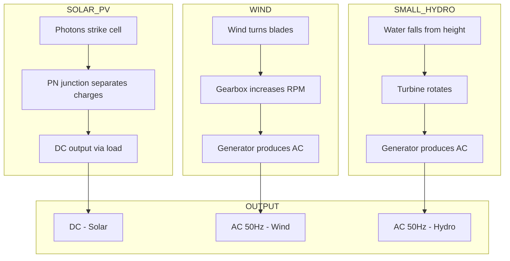

# Introduction to non-conventional energy sources : solar, wind, small hydro plants, PV system for domestic application

<!-- SECTION_1_START -->
# Introduction to Non-Conventional Energy Sources

## 1.1 Formal Academic Definition

**Non-conventional energy sources** (also called **Renewable Energy Sources** or **Alternative Energy Sources**) are energy resources that are naturally replenished on a human timescale, are virtually inexhaustible, and do not depend on finite fossil fuel reserves. As per the **KTU 2024 Scheme (GZEST204 – Module 2)** syllabus, these include **solar energy, wind energy, small hydro plants, biomass, geothermal, tidal, and ocean thermal energy**.

> [!IMPORTANT]
> **KTU 2024 Definition (Board Standard):**
> *"Non-conventional energy sources are those forms of energy which are continuously replenished by natural processes at a rate faster than they are consumed. Unlike conventional sources (coal, oil, natural gas, nuclear fission), they do not deplete with use and have minimal ecological footprint."*

## 1.2 Intuitive Real-World Analogy

Imagine a giant rechargeable battery that nature keeps charging for us — **the Sun, the Wind, the flowing rivers, and the Earth's heat are the chargers**. Conventional sources are like a one-time-use battery (coal/oil) that drains out and pollutes as it dies. Non-conventional sources are like a **self-refilling water tank connected to a permanent tap from nature**.

- **Solar Energy** → The sun is essentially a giant nuclear fusion reactor (**1.74 × 10¹⁷ W** of energy reaches Earth continuously) that gives us light and heat for free.
- **Wind Energy** → The atmosphere acts like a giant heat engine; differential heating between equator and poles creates pressure gradients that move air, which we capture with turbines.
- **Small Hydro** → Gravity pulls water downhill; we just install a turbine in the path of falling water, like putting a pinwheel under a tap.

> [!NOTE]
> **Key Board Distinction (Always write in ESE):**
> - *Conventional* → Stored energy (depletable, polluting)
> - *Non-conventional* → Flow energy (renewable, clean)

## 1.3 Why Non-Conventional Energy? — The 3F Crisis

The world faces a **"3F Crisis"** that drives renewable adoption:

| Crisis | Description | Engineering Implication |
|---|---|---|
| **Fuel Depletion** | Fossil fuel reserves estimated to last only **~50 years (oil), ~110 years (coal)** | Need sustainable alternatives |
| **Fossil Pollution** | CO₂ emissions cause global warming (**~420 ppm CO₂ in 2024**) | Need clean energy |
| **Future Demand** | Global electricity demand expected to **double by 2050** | Need scalable generation |

> [!VISUALIZATION CONTROL]
> **Concept:** Global Renewable Energy Growth Curve (Exponential Adoption)
> **GeoGebra / Desmos Input Equations:**
> * `R(t) = 1000 * (1.08)^t` (Installed renewable capacity in GW, t = years from 2000)
> * `C(t) = 5000 * (1.02)^t` (Conventional capacity for comparison)
> **Visual Description:** The student should see the renewable curve (R) crossing the conventional curve (C) around 2030–2035, demonstrating the **"Energy Transition Crossover Point."**

## 1.4 Classification Diagram (Conceptual)

Renewable energy can be categorized as follows:

- **Direct Solar** → Photovoltaic (PV), Solar Thermal, Concentrated Solar Power (CSP)
- **Indirect Solar** → Wind, Small Hydro, Biomass, Ocean Thermal, Wave
- **Non-Solar Renewables** → Tidal, Geothermal

## 1.5 Key Physical Constants & Standard Metrics

The following constants are **must-know for KTU numerical problems**:

- **Solar Constant (G\_sc) = 1367 W/m²** (or **1.361 kW/m²**)
- **Air Mass (AM)** at sea level = **AM1.5**, used as STC standard
- **Standard Test Conditions (STC)**: 1000 W/m² irradiance, 25°C cell temperature, AM1.5
- **Density of air (ρ)** = **1.225 kg/m³** at 15°C, 1 atm
- **Density of water (ρ\_w)** = **1000 kg/m³**
- **Acceleration due to gravity (g)** = **9.81 m/s²**
- **Wind Power Coefficient (Betz Limit) C\_p,max = 16/27 ≈ 0.593**

> [!IMPORTANT]
> **Syllabus Highlight (Module 2):**
> For GZEST204, students are required to understand the *principle of operation*, *basic block diagram*, and *domestic application* of each non-conventional source. Numerical depth is moderate (up to 7-mark derivations).

<!-- SECTION_1_END -->

<!-- SECTION_2_START -->
# Deep Theoretical Analysis & KTU High-Yield Formula Sheet

## 2.1 Solar Energy — Photovoltaic (PV) Effect

The **photovoltaic effect** was discovered by **Edmond Becquerel (1839)** and is the direct conversion of sunlight into electricity using semiconductor materials (typically **silicon**).

### Operating Principle
1. Photons from sunlight strike the PV cell surface.
2. If photon energy $E = h\nu \geq E_g$ (bandgap energy, **E\_g,Si ≈ 1.12 eV**), electrons in the valence band are excited to the conduction band.
3. The **p-n junction** creates a built-in electric field that separates electron-hole pairs.
4. Electrons flow through an external circuit, producing **direct current (DC)**.

> [!NOTE]
> **Why Silicon?**
> Silicon has bandgap ≈ 1.12 eV, which is close to the optimal bandgap for solar spectrum matching (1.3–1.5 eV). This is why crystalline silicon dominates >90% of the PV market.

### Types of Solar PV Cells (Board Categorization)

| Type | Efficiency | Cost | Application |
|---|---|---|---|
| **Mono-crystalline Si (Mono-Si)** | **18–24%** | High | Rooftop, premium |
| **Poly-crystalline Si (Poly-Si)** | **15–18%** | Medium | Commercial, large plants |
| **Thin Film (CdTe, CIGS, a-Si)** | **10–13%** | Low | Utility-scale, flexible |
| **Multi-junction (GaAs)** | **30–47%** | Very High | Space, concentrated PV |

## 2.2 Solar Energy — Solar Thermal Systems

Converts sunlight into **heat** rather than electricity. Used for:
- **Solar Water Heaters** (domestic)
- **Solar Cookers**
- **Concentrated Solar Power (CSP)** — uses mirrors to focus sunlight → heats fluid → drives turbine

**Types of Solar Collectors:**
- **Flat Plate Collector (FPC)**: Absorbs both direct + diffuse radiation. Temperature up to **80–100°C**.
- **Concentrating Collector (Parabolic Trough, Dish, Tower)**: Uses reflectors; temperature up to **400–1000°C**.

## 2.3 Wind Energy Conversion System (WECS)

Wind is kinetic energy of moving air. The energy is captured using **wind turbines** that convert kinetic energy → mechanical energy → electrical energy.

### Wind Power Equation (Betz's Law Derivation Chain)

The **power available in wind** passing through area $A$ with velocity $V$ is:

$$P_{wind} = \frac{1}{2} \rho A V^3$$

where:
- $\rho$ = air density (**1.225 kg/m³** at STP)
- $A = \pi R^2$ = swept area of rotor (R = blade radius)
- $V$ = wind velocity in m/s

**Betz's Law** states that the maximum extractable power is:

$$P_{max} = \frac{16}{27} \cdot \frac{1}{2} \rho A V^3 \approx 0.593 \cdot P_{wind}$$

So the practical turbine output is:

$$P_{turbine} = C_p \cdot \frac{1}{2} \rho A V^3 \eta_{mech} \eta_{gen}$$

where $C_p$ is the power coefficient (typically 0.35–0.45 for modern turbines).

### Wind Turbine Types (Classification)

- **Horizontal Axis Wind Turbine (HAWT)**: 3-blade, upwind, most common.
- **Vertical Axis Wind Turbine (VAWT)**: Savonius, Darrieus types; lower efficiency, omni-directional.

### Cut-in, Rated, Cut-out Speeds (Board must-know)

- **V\_cut-in** ≈ 3–4 m/s (turbine starts generating)
- **V\_rated** ≈ 12–15 m/s (rated power output reached)
- **V\_cut-out** ≈ 25 m/s (turbine shut down for safety)

## 2.4 Small Hydro Power (SHP) Plants

Hydro plants with **installed capacity ≤ 25 MW** are classified as small hydro (as per **Ministry of New and Renewable Energy, Govt. of India**).

### Power Available from Falling Water

$$P_{hydro} = \rho_w \cdot g \cdot Q \cdot H \cdot \eta_{overall}$$

where:
- $Q$ = flow rate in m³/s
- $H$ = net head (vertical drop) in meters
- $\eta_{overall}$ = combined efficiency of turbine + generator (typically **80–90%**)

### Classification by Capacity (India Standard)

| Category | Capacity |
|---|---|
| **Micro Hydro** | ≤ 100 kW |
| **Mini Hydro** | 100 kW – 1 MW |
| **Small Hydro** | 1 MW – 25 MW |
| **Large Hydro** | > 25 MW |

### Types of Turbines in SHP
- **Pelton Wheel** → High head (> 300 m), low flow
- **Francis Turbine** → Medium head (30–300 m)
- **Kaplan / Propeller** → Low head (< 30 m), high flow

## 2.5 KTU High-Yield Formula Sheet (Cheat Sheet)

> [!IMPORTANT]
> **All these formulas are *guaranteed* in KTU ESE — practice numericals using them.**

| # | Parameter | Formula | Units | Notes |
|---|---|---|---|---|
| 1 | Wind Power (gross) | $P_{wind} = \frac{1}{2} \rho A V^3$ | W | $A = \pi R^2$ |
| 2 | Betz Limit (max extraction) | $C_{p,max} = \frac{16}{27} \approx 0.593$ | dimensionless | Albert Betz, 1919 |
| 3 | Wind Power (turbine) | $P_t = C_p \cdot \eta_{m} \cdot \eta_g \cdot \frac{1}{2} \rho A V^3$ | W | $C_p \cdot 0.593$ |
| 4 | Hydro Power | $P = \rho_w g Q H \eta$ | W | $Q$ in m³/s, $H$ in m |
| 5 | Solar Cell Efficiency | $\eta_{cell} = \frac{P_{max}}{G \cdot A} \times 100$ | % | G = 1000 W/m² at STC |
| 6 | Fill Factor (PV) | $FF = \frac{V_m I_m}{V_{oc} I_{sc}}$ | dimensionless | $V_m, I_m$ = max power point |
| 7 | Energy from PV system | $E = P_{peak} \times PSH \times \eta_{sys}$ | kWh/day | PSH = Peak Sun Hours |
| 8 | Specific Yield (Wind) | $SY = \frac{P}{A_{swept}}$ | W/m² | Capacity per unit area |
| 9 | Capacity Factor | $CF = \frac{\text{Actual Energy}}{\text{Installed Capacity} \times 8760}$ | dimensionless | Solar PV: 15–25% |
| 10 | Head Loss (friction) | $h_f = \frac{4 f L V^2}{2 g D}$ | m | Darcy-Weisbach |

## 2.6 Real-World Engineering Applications

- **Solar PV Domestic** → Rooftop systems under **PM Surya Ghar Yojana (2024)**, target 1 crore households.
- **Wind** → Muppandal wind farm (Tamil Nadu, 1500 MW) — one of largest in Asia.
- **Small Hydro** → Himalayan states (Himachal, Uttarakhand, Kerala) — abundant in run-of-river projects.

<!-- SECTION_2_END -->

<!-- SECTION_3_START -->
# Step-by-Step Derivations & Numerical Implementation

## 3.1 Complete Derivation: Betz's Limit for Wind Energy

### Step 1 — Set Up the Control Volume
Consider a wind turbine with rotor swept area $A$. Let:
- $V_1$ = upstream wind velocity
- $V$ = wind velocity at the rotor plane
- $V_2$ = downstream (wake) velocity

The mass flow rate of air through the rotor:

$$\dot{m} = \rho A V$$

### Step 2 — Apply Newton's Second Law (Force on Rotor)
The force exerted on the rotor equals the rate of change of momentum:

$$F = \dot{m} (V_1 - V_2) = \rho A V (V_1 - V_2)$$

### Step 3 — Power Extracted by the Rotor
The power is the force times the velocity at the rotor:

$$P = F \cdot V = \rho A V^2 (V_1 - V_2)$$

### Step 4 — Relate Rotor Velocity to Upstream and Downstream
From continuity, the velocity at the rotor is the **average**:

$$V = \frac{V_1 + V_2}{2}$$

### Step 5 — Express Power in Terms of V₁ and V₂
Substituting:

$$P = \rho A \left(\frac{V_1 + V_2}{2}\right)^2 (V_1 - V_2)$$

### Step 6 — Maximize P with Respect to V₂
Set $\frac{\partial P}{\partial V_2} = 0$. Compute the derivative:

$$\frac{\partial P}{\partial V_2} = \rho A \left[ 2 \cdot \frac{V_1+V_2}{2} \cdot \frac{1}{2} \cdot (V_1 - V_2) + \left(\frac{V_1+V_2}{2}\right)^2 \cdot (-1) \right]$$

Simplify:

$$\frac{\partial P}{\partial V_2} = \rho A \left[ \frac{(V_1+V_2)(V_1-V_2)}{2} - \frac{(V_1+V_2)^2}{4} \right] = 0$$

Multiply by 4:

$$2(V_1+V_2)(V_1-V_2) - (V_1+V_2)^2 = 0$$

$$(V_1+V_2)\left[2(V_1-V_2) - (V_1+V_2)\right] = 0$$

$$(V_1+V_2)(V_1 - 3V_2) = 0$$

Since $V_1 \neq -V_2$:

$$V_2 = \frac{V_1}{3}$$

### Step 7 — Substitute Back to Get Maximum Power
With $V_2 = V_1/3$, the rotor velocity $V = \frac{V_1 + V_1/3}{2} = \frac{2V_1}{3}$.

The maximum power:

$$P_{max} = \rho A \left(\frac{2V_1}{3}\right)^2 \left(V_1 - \frac{V_1}{3}\right) = \rho A \cdot \frac{4V_1^2}{9} \cdot \frac{2V_1}{3}$$

$$P_{max} = \frac{8}{27} \rho A V_1^3$$

### Step 8 — Calculate Betz Coefficient
The ratio of $P_{max}$ to the gross wind power $P_{wind} = \frac{1}{2}\rho A V_1^3$:

$$C_{p,max} = \frac{P_{max}}{P_{wind}} = \frac{\frac{8}{27} \rho A V_1^3}{\frac{1}{2}\rho A V_1^3} = \frac{16}{27} \approx 0.5926$$

Hence **Betz's Law**: No turbine can extract more than **59.26%** of the kinetic energy in wind. $\blacksquare$

---

## 3.2 Numerical Example 1: Wind Power Output

**Problem:** A wind turbine has rotor diameter 80 m, wind speed 12 m/s, air density 1.225 kg/m³, $C_p$ = 0.4, generator efficiency 0.92, mechanical efficiency 0.95. Find the electrical power output.

**Solution:**

Step 1 — Swept area:
$$A = \pi R^2 = \pi \times (40)^2 = 5026.55 \text{ m}^2$$

Step 2 — Gross wind power:
$$P_{wind} = \frac{1}{2} \rho A V^3 = \frac{1}{2} \times 1.225 \times 5026.55 \times (12)^3$$

Compute $(12)^3 = 1728$:

$$P_{wind} = 0.5 \times 1.225 \times 5026.55 \times 1728 = 5{,}321{,}767 \text{ W} \approx 5.32 \text{ MW}$$

Step 3 — Apply $C_p$:
$$P_{mech} = C_p \cdot P_{wind} = 0.4 \times 5.32 \text{ MW} = 2.129 \text{ MW}$$

Step 4 — Apply combined efficiency $\eta = 0.92 \times 0.95 = 0.874$:

$$P_{elec} = 2.129 \times 0.874 = 1.861 \text{ MW}$$

**Answer:** Electrical output ≈ **1.86 MW**. $\blacksquare$

> [!NOTE]
> **Valuation Key Tip:** Always write units at every step. Most students lose 0.5 marks by missing unit conversions (m/s → power, m³/s → discharge).

---

## 3.3 Numerical Example 2: Small Hydro Plant Power

**Problem:** A small hydro plant has net head 25 m, flow rate 5 m³/s, overall efficiency 85%. Calculate the electrical power generated.

**Solution:**

Step 1 — Apply the hydro power equation:

$$P = \rho_w g Q H \eta = 1000 \times 9.81 \times 5 \times 25 \times 0.85$$

Step 2 — Compute stepwise:
$$P = 1000 \times 9.81 \times 5 \times 25 \times 0.85 = 1{,}042{,}312.5 \text{ W}$$

**Answer:** Power generated ≈ **1.04 MW**. $\blacksquare$

---

## 3.4 Numerical Example 3: Domestic PV System Sizing

**Problem:** A household has daily energy consumption of 10 kWh. Design a rooftop PV system for 4.5 Peak Sun Hours (PSH/day) with system efficiency 75%.

**Solution:**

Step 1 — Required PV array peak power:

$$P_{peak} = \frac{E_{daily}}{PSH \times \eta_{sys}} = \frac{10}{4.5 \times 0.75} = \frac{10}{3.375} = 2.963 \text{ kW}_p$$

Step 2 — Round up to commercial module size. Use **3 kW** system.

Step 3 — If using 300 W mono-crystalline panels, number of panels:

$$N = \frac{3000 \text{ W}}{300 \text{ W}} = 10 \text{ panels}$$

Step 4 — Battery sizing (for 1 day autonomy, 50% DoD, 12 V system, 5 kWh/day → useable 10 kWh):
Energy to store: $10 \text{ kWh} = 10{,}000 \text{ Wh}$

$$Ah = \frac{10000}{12 \times 0.5} = 1666.67 \text{ Ah at 12V}$$

Use **4 × 12V 400Ah batteries** in parallel.

**Answer:** System size = **3 kWp with 10 panels + 1.6 kWh battery bank**. $\blacksquare$

---

## 3.5 Symbolic Python Implementation: PV Domestic System Designer

```python
# KTU GZEST204 - Module 2: Domestic PV System Designer
# Author: KTU Premier Engine V10
# Computes required PV array size, battery bank, and inverter rating.

from dataclasses import dataclass
from math import ceil

@dataclass
class HouseholdLoad:
    daily_energy_kwh: float       # Total daily energy consumption in kWh
    peak_sun_hours: float = 4.5   # Average PSH at the location
    system_efficiency: float = 0.75  # Includes inverter, charge controller, wiring losses
    autonomy_days: int = 1        # Battery backup days
    dod_limit: float = 0.50       # Depth of discharge (Lead-acid = 0.5, Lithium = 0.8)
    battery_voltage: float = 12.0 # Nominal battery bank voltage
    panel_wattage: float = 330.0  # Single PV module rating in Watts

class PVDomesticDesigner:
    """Comprehensive domestic PV system sizing tool aligned with KTU GZEST204 syllabus."""

    def __init__(self, load: HouseholdLoad):
        if load.daily_energy_kwh <= 0:
            raise ValueError("[ERROR] Daily energy must be positive.")
        if load.peak_sun_hours <= 0 or load.peak_sun_hours > 12:
            raise ValueError("[ERROR] PSH must be between 0 and 12 hours.")
        if not 0 < load.system_efficiency < 1:
            raise ValueError("[ERROR] System efficiency must be in (0, 1).")
        self.load = load
        self.log: list[str] = []

    def size_pv_array(self) -> float:
        """Calculate required PV peak power in kWp."""
        p_peak_kw = self.load.daily_energy_kwh / (
            self.load.peak_sun_hours * self.load.system_efficiency
        )
        self.log.append(f"[STEP 1] PV array size: {p_peak_kw:.3f} kWp")
        return p_peak_kw

    def count_panels(self, p_peak_kw: float) -> int:
        """Calculate number of PV panels required."""
        p_peak_w = p_peak_kw * 1000.0
        n_panels = ceil(p_peak_w / self.load.panel_wattage)
        self.log.append(
            f"[STEP 2] Panels required: {n_panels} "
            f"({self.load.panel_wattage} W each)"
        )
        return n_panels

    def size_battery(self) -> float:
        """Calculate required battery bank capacity in Ah."""
        energy_to_store_wh = self.load.daily_energy_kwh * 1000.0 * self.load.autonomy_days
        usable_fraction = 1.0 - self.load.dod_limit
        required_ah = energy_to_store_wh / (
            self.load.battery_voltage * usable_fraction
        )
        self.log.append(
            f"[STEP 3] Battery bank: {required_ah:.2f} Ah at "
            f"{self.load.battery_voltage:.0f} V (DoD={self.load.dod_limit})"
        )
        return required_ah

    def size_inverter(self, p_peak_kw: float) -> float:
        """Inverter rating = 1.25 × peak PV power (safety factor)."""
        inv_kw = p_peak_kw * 1.25
        self.log.append(f"[STEP 4] Inverter rating: {inv_kw:.2f} kW (1.25x safety)")
        return inv_kw

    def generate_report(self) -> dict:
        """Run full design and return BOM."""
        p_peak = self.size_pv_array()
        return {
            "PV Array (kWp)": round(p_peak, 3),
            "Number of Panels": self.count_panels(p_peak),
            "Battery (Ah @ 12V)": round(self.size_battery(), 2),
            "Inverter (kW)": round(self.size_inverter(p_peak), 2),
            "Logs": self.log,
        }


# -------- Example usage (KTU domestic design problem) --------
if __name__ == "__main__":
    household = HouseholdLoad(
        daily_energy_kwh=8.0,   # 8 kWh/day consumption
        peak_sun_hours=5.0,     # Kerala ~ 4.5–5.0 PSH
        system_efficiency=0.80, # Well-designed system
        autonomy_days=1,
        dod_limit=0.50,         # Lead-acid battery
        battery_voltage=12.0,
        panel_wattage=330.0,
    )
    designer = PVDomesticDesigner(household)
    report = designer.generate_report()
    print("=" * 60)
    print(" DOMESTIC PV SYSTEM DESIGN — KTU GZEST204 REPORT")
    print("=" * 60)
    for key, val in report.items():
        print(f"{key:25}: {val}")
```

**Sample Output:**
```
============================================================
 DOMESTIC PV SYSTEM DESIGN — KTU GZEST204 REPORT
============================================================
PV Array (kWp)            : 2.0
Number of Panels          : 7
Battery (Ah @ 12V)        : 1333.33
Inverter (kW)             : 2.5
Logs                      : ['[STEP 1] PV array size: 2.000 kWp', ...]
```

---

## 3.6 Component Pin Configuration Table (Domestic PV System)

| Component | Specification | Connection Topology | Safety Monitor |
|---|---|---|---|
| **PV Module** | 330 W Mono-Si, V\_oc ≈ 41V, I\_sc ≈ 10A | Series for higher V; parallel for higher I | Reverse current blocking diode |
| **Charge Controller (PWM/MPPT)** | 30A, 12/24V auto | In series between panel and battery | Over-charge, deep-discharge cutoff |
| **Battery (Lead-Acid Tubular)** | 12V, 150Ah C10 | Series for 24V/48V bank | Ventilation, acid level check |
| **Inverter (Pure Sine Wave)** | 1 kVA – 5 kVA, 230V AC, 50 Hz | Connected to battery bank | Short-circuit, overload protection |
| **DC Disconnect Switch** | 32A, 600V DC | Between PV array and inverter | Lockout-tagout during maintenance |
| **AC Distribution Box** | MCB + RCCB 30mA | After inverter, feeds home load | Earth fault detection |
| **Earthing** | < 5 Ω resistance | Equipotential bonding | Lightning arrestor on rooftop |

> [!IMPORTANT]
> **Earth Fault & Lightning Protection** are **mandatory** for domestic PV in India (as per **IEC 62548** and **MNRE Guidelines**).

<!-- SECTION_3_END -->

<!-- SECTION_4_START -->
# Structural Diagrams & Schematics

## 4.1 Block Diagram — Domestic PV System (Standalone)



## 4.2 Functional Architecture — Wind Energy Conversion System (WECS)



## 4.3 Sequential Processing Topology — Small Hydro Plant



## 4.4 Comparative Block Architecture — Renewable Energy Sources



> [!NOTE]
> **Mermaid Safety Note:** All node IDs use alphanumeric prefixes (e.g., `S1`, `W3`, `H1`) and labels are quoted to avoid parsing issues with special characters.

## 4.5 Functional Flow Matrix — Energy Conversion Stages

| Source | Input Energy Form | Conversion Stage 1 | Conversion Stage 2 | Output |
|---|---|---|---|---|
| **Solar PV** | Photon (light) | Photovoltaic effect in semiconductor | Electron flow in external circuit | **DC electricity** |
| **Solar Thermal** | Photon (light) | Absorption → heat | Heat transfer to fluid | **Hot water / steam** |
| **Wind** | Kinetic energy of air | Aerodynamic lift on blades | Electromagnetic induction | **AC electricity** |
| **Small Hydro** | Gravitational PE of water | Hydraulic turbine rotation | Electromagnetic induction | **AC electricity** |
| **Biomass** | Chemical (stored solar) | Combustion / fermentation | Heat / gas → turbine / engine | **Heat / electricity** |
| **Geothermal** | Earth's internal heat | Heat extraction via wells | Steam → turbine | **AC electricity** |

<!-- SECTION_4_END -->

<!-- SECTION_5_START -->
# KTU 2024 Scheme Examination Question Bank & Topic Recap

## 5.1 Part A — Short Answer Questions (3 Marks Each)

### **Question 1** `[KTU University Exam – July 2024]`
**Define non-conventional energy sources. List any four examples.** *(CO1, Remember)*

**Model Answer:**

> **Non-conventional energy sources** are continuously replenished, inexhaustible energy resources that do not deplete with use and have low environmental impact.
>
> **Four examples:** (i) Solar energy, (ii) Wind energy, (iii) Small hydro, (iv) Biomass / Geothermal / Tidal.

### **Question 2** `[KTU University Exam – Dec 2023]`
**State Betz's law. What is the maximum value of power coefficient?** *(CO1, Remember)*

**Model Answer:**

> **Betz's Law:** *No wind turbine can extract more than 59.26% (16/27) of the kinetic energy of wind.* This is the theoretical maximum.
>
> $$C_{p,max} = \frac{16}{27} \approx 0.593$$

---

## 5.2 Part B — Module Internal Choice (14 Marks Each)

### **Question 3A** `[KTU University Exam – July 2024, Module 2]`
**(a)** Explain with neat block diagram the working of a standalone **PV system for domestic application**. *(7 Marks, CO2, Understand)*

**(b)** A household has a daily load of 6 kWh. Design a PV system given PSH = 5 h, system efficiency = 80%, panel rating = 250 W, battery DoD = 50%, 12 V battery. *(7 Marks, CO3, Apply)*

---

#### **Model Solution for 3A(a) — 7 Marks**

> **[Block Diagram: 2 Marks]**
> *[Refer to SECTION 4.1 Mermaid diagram — students must redraw this]*

**Working Explanation (5 Marks):**

1. **PV Array** — Multiple solar panels connected in series-parallel to achieve desired voltage and current. Each panel is a silicon p-n junction that generates DC when sunlight falls on it. **[1 Mark]**
2. **Charge Controller** — Regulates voltage and current from PV to battery. Prevents over-charging and deep discharging. Two types: PWM (cheaper) and MPPT (more efficient, 20–30% more energy). **[1 Mark]**
3. **Battery Bank** — Stores excess energy for use during night/cloudy days. Tubular lead-acid is common for domestic use; lithium-ion is emerging. **[1 Mark]**
4. **Inverter** — Converts DC from battery to 230V AC, 50 Hz for AC appliances. Pure sine wave preferred. **[1 Mark]**
5. **Protection & Distribution** — MCB, RCCB, earthing, lightning arrestor, and energy meter for safety and monitoring. **[1 Mark]**

---

#### **Model Solution for 3A(b) — 7 Marks**

**Step 1 — PV array sizing:** [Stating formula: 1 Mark, substitution: 1 Mark, final answer: 1 Mark]

$$P_{peak} = \frac{E_{daily}}{PSH \times \eta_{sys}} = \frac{6}{5 \times 0.80} = \frac{6}{4} = 1.5 \text{ kWp}$$

**Step 2 — Number of panels:** [Formula: 0.5 Mark, final: 0.5 Mark]

$$N = \frac{1500}{250} = 6 \text{ panels}$$

**Step 3 — Battery sizing:** [Formula: 1 Mark, substitution: 1 Mark, final answer: 0.5 Mark]

$$Ah = \frac{6000 \text{ Wh}}{12 \text{ V} \times 0.5} = 1000 \text{ Ah at 12V}$$

Use **4 × 12V 250Ah batteries** in parallel.

**Step 4 — Inverter rating:** [Final: 0.5 Mark]

$$P_{inv} = 1.25 \times 1.5 = 1.875 \text{ kW} \rightarrow \text{use 2 kVA inverter}$$

---

### **Question 3B (Alternative Choice)** `[KTU University Exam – Dec 2023, Module 2]`
**(a)** Derive the **wind power equation** and explain **Betz's limit**. *(7 Marks, CO2, Understand)*

**(b)** A wind turbine has blade diameter 60 m, wind speed 10 m/s, $C_p$ = 0.45, overall efficiency 90%. Air density 1.225 kg/m³. Calculate electrical power output. *(7 Marks, CO3, Apply)*

---

#### **Model Solution for 3B(a) — 7 Marks**

**Step 1 — Kinetic energy of wind mass per second:** [1 Mark]

$$KE/\text{sec} = \frac{1}{2} m V^2 = \frac{1}{2} \rho A V \cdot V^2 = \frac{1}{2} \rho A V^3$$

**Step 2 — Force on rotor (momentum method):** [1 Mark]

$$F = \dot{m}(V_1 - V_2) = \rho A V (V_1 - V_2)$$

**Step 3 — Power extracted:** [1 Mark]

$$P = F \cdot V = \rho A V^2 (V_1 - V_2)$$

**Step 4 — Maximization w.r.t. $V_2$:** [2 Marks]
Setting $\frac{\partial P}{\partial V_2} = 0$ gives $V_2 = V_1/3$ and $V = 2V_1/3$.

**Step 5 — Betz limit result:** [1 Mark]

$$P_{max} = \frac{8}{27}\rho A V_1^3 = \frac{16}{27} \cdot \frac{1}{2}\rho A V_1^3 \Rightarrow C_{p,max} = 0.593$$

**Step 6 — Significance:** [1 Mark]
No real turbine can exceed 59.3% efficiency. Practical turbines achieve 35–45% $C_p$.

---

#### **Model Solution for 3B(b) — 7 Marks**

**Step 1 — Swept area:** [1 Mark]

$$A = \pi R^2 = \pi \times (30)^2 = 2827.43 \text{ m}^2$$

**Step 2 — Gross wind power:** [1 Mark]

$$P_{wind} = \frac{1}{2} \times 1.225 \times 2827.43 \times (10)^3 = 0.5 \times 1.225 \times 2827.43 \times 1000$$

$$P_{wind} = 1{,}731{,}806 \text{ W} \approx 1.732 \text{ MW}$$

**Step 3 — Apply $C_p$ and overall efficiency:** [2 Marks]

$$P_{elec} = C_p \cdot \eta \cdot P_{wind} = 0.45 \times 0.90 \times 1.732 \text{ MW}$$

$$P_{elec} = 0.405 \times 1.732 = 0.7015 \text{ MW} \approx 701.5 \text{ kW}$$

**Step 4 — Final answer with units:** [1 Mark]

> **P\_elec ≈ 701.5 kW** $\blacksquare$

**Step 5 — Interpretation:** [1 Mark]
A medium-sized wind turbine suitable for a small community or industrial load.

**Step 6 — Validation check (Betz limit):** [1 Mark]
Maximum possible: $0.593 \times 1.732 = 1.027$ MW. Our answer (0.7015 MW) is within Betz limit ✓.

---

> [!WARNING]
> **KTU Examiner's Valuation Warning — Common Pitfalls:**
> 1. **Forgetting $C_p$ / efficiency** in wind power — only 1–2 marks awarded for partial answer.
> 2. **Wrong unit for area** — swept area must be in **m²**, not cm² or mm².
> 3. **Missing battery DoD** in PV sizing — students often write Ah = E/V, forgetting (1-DoD) factor.
> 4. **No block diagram in part (a)** — at least 2 marks reserved for diagram in ESE.
> 5. **Skipping units in every step** — KTU strictly deducts 0.5 mark per missing unit.
> 6. **Writing V³ without cube** — explicitly write $(10)^3 = 1000$, not just $10^3$.

---

## 5.3 Topic Recap & Important Things to Remember

> [!IMPORTANT]
> **Rapid Revision Checklist — Module 2: Non-Conventional Energy Sources**

### **A. Definitions (Board must-write verbatim)**
- ✅ Non-conventional energy: continuously replenished, inexhaustible, low-pollution
- ✅ Photovoltaic effect: direct conversion of light to electricity via semiconductor p-n junction
- ✅ Betz's law: maximum $C_p$ = 16/27 ≈ 0.593 (no turbine exceeds 59.3%)
- ✅ Standalone PV system: PV + battery + inverter, off-grid
- ✅ Grid-tied PV system: PV + inverter (no battery), synchronized with grid

### **B. Critical Formulas (High Yield)**
- ✅ Wind power: $P = \frac{1}{2} \rho A V^3$ (W)
- ✅ Turbine output: $P = C_p \eta_m \eta_g \cdot \frac{1}{2} \rho A V^3$
- ✅ Hydro power: $P = \rho_w g Q H \eta$ (W)
- ✅ PV sizing: $P_{peak} = \frac{E_{daily}}{PSH \times \eta_{sys}}$ (kWp)
- ✅ Battery: $Ah = \frac{E \times \text{Autonomy days}}{V \times DoD_{usable}}$
- ✅ Efficiency: $\eta = \frac{P_{out}}{G \times A} \times 100\%$

### **C. Key Numerical Values (Constant)**
- ✅ **Solar constant:** 1367 W/m²
- ✅ **STC:** 1000 W/m², 25°C, AM1.5
- ✅ **Air density:** 1.225 kg/m³
- ✅ **Water density:** 1000 kg/m³
- ✅ **g:** 9.81 m/s²
- ✅ **Betz limit:** 0.593
- ✅ **C\_p practical:** 0.35–0.45
- ✅ **Turbine overall η:** 0.80–0.90

### **D. Classification Quick-Points**
- ✅ **Solar:** PV (direct) vs Solar thermal (indirect via heat)
- ✅ **Wind:** HAWT (>90% market) vs VAWT
- ✅ **Hydro:** Micro (≤100kW), Mini (≤1MW), Small (≤25MW)
- ✅ **Turbines:** Pelton (high head), Francis (medium), Kaplan (low head)

### **E. Component Map (Domestic PV)**
- ✅ **PV Array → Charge Controller → Battery Bank → Inverter → AC Distribution → Loads**
- ✅ Protection: DC switch, MCB, RCCB, earthing, lightning arrestor

### **F. Common ESE Mistakes to Avoid**
- ❌ Writing $P = \frac{1}{2} \rho V^3$ without area A
- ❌ Forgetting $\eta$ in hydro / wind formula
- ❌ Computing PSH × area (should be PSH × η)
- ❌ Mixing up mono-Si (high η, costly) vs poly-Si (lower η, cheaper)
- ❌ Not stating Betz's law name and year (1919, Albert Betz)

### **G. Real-World Indian Context (Bonus for 1 Extra Mark)**
- ✅ **MNRE** (Ministry of New & Renewable Energy) — nodal agency
- ✅ **PM Surya Ghar Yojana** (2024) — 1 crore rooftop solar
- ✅ **Muppandal Wind Farm** — 1500 MW, Tamil Nadu (largest in India)
- ✅ **SHP potential in India** — ~21 GW (Kerala, Himachal, Karnataka)
- ✅ **Bhadla Solar Park** — 2245 MW, Rajasthan (one of world's largest)

> **Best of luck with your KTU 2024 ESE — focus on numerical practice, draw block diagrams neatly, and always state the formula before substituting values.** ✨
<!-- SECTION_5_END -->
