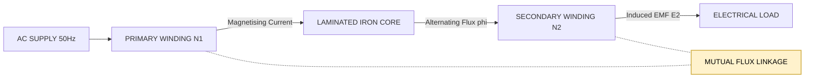
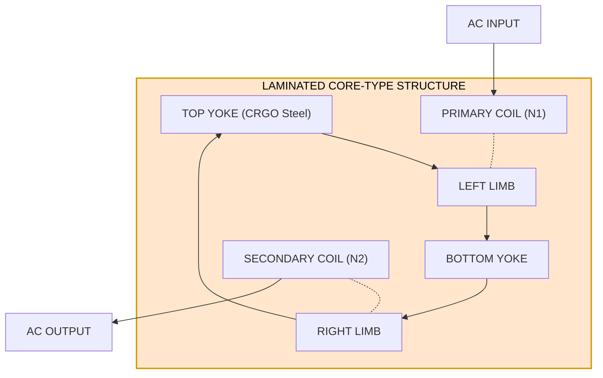
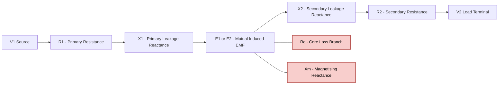

# Transformers. Principle of operation, step-up and step-down transformers

<!-- SECTION_1_START -->
# Transformers — Core Technical Definition & Intuitive Overview

## 1.1 Formal KTU 2024 Definition

> [!IMPORTANT]
> **Transformer (IEEE / KTU Standard Definition):**
> A **transformer** is a **static (stationary), passive electromagnetic device** that transfers electrical energy from one alternating-current (AC) circuit to another through the principle of **mutual electromagnetic induction**, **without any change in frequency**, while typically stepping the voltage level up or down based on the turns ratio of its windings.

In KTU 2024 Scheme terminology (GZEST204 — Basic Electrical & Electronics Engineering), the transformer is positioned as a *load-less, frequency-preserving, galvanically-isolated* power conversion apparatus. The word *static* is critical — it distinguishes the transformer from rotating machines (generators/motors).

## 1.2 Conceptual Analogy & Geometric Intuition

> [!NOTE]
> **Water-Pressure Analogy (Hydraulic Analogy):**
> Imagine two water tanks connected at the base through a shared pipe, with pistons of different cross-sectional areas pushing water. The narrow piston (high pressure, low flow) is analogous to a **step-up transformer side (high voltage, low current)**, while the wide piston (low pressure, high flow) is the **step-down side (low voltage, high current)**. The energy (water × pressure × flow) is roughly conserved on both sides — exactly as power (V × I) is conserved in an ideal transformer.

**Geometric Intuition:** Picture two coils of insulated copper wire wound around a common closed iron (silicon-steel) core. When alternating current enters coil-1 (Primary), it creates a *time-varying magnetic flux* $\Phi(t)$ in the core. Because the core is shared, this same flux links with coil-2 (Secondary) and — by **Faraday's Law of Electromagnetic Induction** — induces an EMF in it. The transformer is, in essence, a *flux-coupling device*.

## 1.3 Key Physical Constants & Standard Metrics

> [!IMPORTANT]
> **Syllabus-Highlighted Constants & Parameters:**
> - **Frequency ($f$):** Standard supply frequency in India = **$50\ \text{Hz}$** (power transformers).
> - **Maximum Flux Density ($B_m$):** For CRGO silicon-steel laminations ≈ **$1.1\ \text{T}$ to $1.4\ \text{T}$**.
> - **Permeability of Iron Core ($\mu$):** Typically $1000$ to $6000$ times that of free space ($\mu_0 = 4\pi \times 10^{-7}\ \text{H/m}$).
> - **Lamination Thickness:** $0.35\ \text{mm}$ to $0.5\ \text{mm}$ (silicon-coated) to reduce eddy-current losses.
> - **Transformer Rating Unit:** **kVA** (kilo-Volt-Ampere) — *apparent power*, not kW, because power factor of the load is unknown to the transformer manufacturer.

## 1.4 Visualization Callout

> [!VISUALIZATION CONTROL]
> **Concept:** Sinusoidal mutual flux linkage between primary and secondary windings on a common magnetic core.
> **GeoGebra / Desmos Input Equations:**
> * Primary EMF: $E_1(t) = N_1 \cdot \dfrac{d\Phi(t)}{dt}$
> * Flux function: $\Phi(t) = \Phi_m \cdot \sin(2\pi f t)$
> * Resultant $E_1(t) = 2\pi f N_1 \Phi_m \cos(2\pi f t)$ → Phase-shifted by $90^\circ$ from flux.
> **Visual Description:** Two sinusoidal curves plotted on a shared time-axis. The **flux curve (sine)** lags the **induced EMF curve (cosine)** by $90^\circ$. The peak of the EMF ($E_m = 2\pi f N \Phi_m$) corresponds to the steepest slope of the flux waveform, illustrating Faraday's Law directly.

---

<!-- SECTION_1_END -->

<!-- SECTION_2_START -->
# Deep Theoretical Analysis & KTU High-Yield Formula Sheet

## 2.1 Constructional Anatomy of a Transformer

A practical transformer consists of the following engineered sub-systems:

1. **Magnetic Core** — Built from laminated silicon steel (CRGO — Cold Rolled Grain Oriented). Lamination thickness = **$0.35\ \text{mm}$**, insulated by a thin varnish coat to suppress eddy currents.
2. **Primary Winding (P)** — The input coil, connected to the AC source. Number of turns = $N_1$.
3. **Secondary Winding (S)** — The output coil, connected to the load. Number of turns = $N_2$.
4. **Tank & Cooling System** — Oil-filled steel tank for distribution transformers; uses ONAN (Oil Natural Air Natural) or ONAF cooling.
5. **Bushings** — Porcelain insulators for high-voltage terminations.
6. **Tap Changer** — Off-load or on-load mechanism to vary $N_1/N_2$ marginally for voltage regulation.

## 2.2 Principle of Operation — Step-by-Step Logical Flow

> [!NOTE]
> **The "WHY → HOW" Reasoning Chain:**

- **WHY does a transformer need AC?** → Because only a *time-varying* magnetic flux can induce an EMF in a stationary coil (Faraday's Law). A DC input would create a *constant* flux → zero induced EMF in the secondary.
- **HOW is flux created?** → The primary current $I_1$ produces a magnetomotive force (MMF) $= N_1 I_1$ which drives flux $\Phi$ through the high-permeability iron core.
- **HOW is EMF induced in the secondary?** → The same alternating flux $\Phi(t)$ cuts the secondary turns $N_2$, inducing $E_2 = -N_2 \dfrac{d\Phi}{dt}$ (Lenz's Law sign convention).
- **WHY no electrical connection between windings?** → Energy transfers via the *magnetic field medium* (the core), giving **galvanic isolation** — a critical safety feature.

## 2.3 EMF Equation of a Transformer (The Crown Jewel Derivation)

Let the core flux vary sinusoidally as:
$$\Phi(t) = \Phi_m \sin(\omega t)$$

where $\Phi_m$ is the **maximum flux in Webers (Wb)** and $\omega = 2\pi f$.

By Faraday's Law, the instantaneous induced EMF in a coil of $N$ turns is:
$$e = -N \dfrac{d\Phi}{dt}$$

Differentiating:
$$e = -N \dfrac{d}{dt} \big[\Phi_m \sin(\omega t)\big] = -N \Phi_m \omega \cos(\omega t)$$

The **RMS value** of this sinusoidal EMF is:
$$E_{\text{rms}} = \dfrac{N \Phi_m \omega}{\sqrt{2}} = \dfrac{2\pi f N \Phi_m}{\sqrt{2}} = 4.44 \, f \, N \, \Phi_m$$

> [!IMPORTANT]
> **Master EMF Equation (KTU 2024 High-Yield):**
> $$\boxed{\,E = 4.44 \, f \, N \, \Phi_m\,}$$
> Applied to both windings:
> $E_1 = 4.44 \, f \, N_1 \, \Phi_m \quad \text{and} \quad E_2 = 4.44 \, f \, N_2 \, \Phi_m$

## 2.4 Step-Up vs Step-Down Transformer — Operational Logic

> [!NOTE]
> **Step-Up Transformer** ($N_2 > N_1$):
> - Secondary voltage $V_2 > V_1$.
> - Secondary current $I_2 < I_1$ (current inversely proportional to turns).
> - **Application:** Power-station output side (e.g., $11\ \text{kV} \rightarrow 220\ \text{kV}$) for *long-distance transmission* — high voltage ⇒ low $I^2R$ line losses.
>
> **Step-Down Transformer** ($N_2 < N_1$):
> - Secondary voltage $V_2 < V_1$.
> - Secondary current $I_2 > I_1$.
> - **Application:** Distribution transformers near localities (e.g., $11\ \text{kV} \rightarrow 230\ \text{V}$) for *safe domestic/industrial utilization*.

## 2.5 KTU Formula Sheet / Cheat Sheet

| # | Formula / Relation | Physical Meaning | Boundary / Notes |
|---|--------------------|------------------|-----------------|
| 1 | $E = 4.44 \, f \, N \, \Phi_m$ | RMS EMF induced per winding | Assumes sinusoidal flux |
| 2 | $\Phi_m = \dfrac{B_m \times A}{1}$ (with $A$ in $\text{m}^2$) | Maximum flux = $B_m \cdot A_c$ | $A_c$ = core cross-sectional area |
| 3 | $\dfrac{V_1}{V_2} = \dfrac{N_1}{N_2} = k$ (turns ratio) | Voltage transformation ratio | $k > 1 \Rightarrow$ step-down; $k < 1 \Rightarrow$ step-up |
| 4 | $\dfrac{I_1}{I_2} = \dfrac{N_2}{N_1} = \dfrac{1}{k}$ | Current transformation (inverse) | For *ideal* transformer |
| 5 | $V_1 \, I_1 = V_2 \, I_2$ | Power conservation (ideal) | Real: $\eta < 100\%$ |
| 6 | $\eta = \dfrac{V_2 I_2 \cos\phi_2}{V_1 I_1 \cos\phi_1} \times 100\%$ | Efficiency | $\eta_{\text{power-transformer}} \approx 95\text{–}99\%$ |
| 7 | Voltage Regulation $= \dfrac{V_{20} - V_2}{V_2} \times 100\%$ | Load-side voltage drop indication | $V_{20}$ = no-load secondary voltage |
| 8 | $X = 2\pi f L$ | Leakage reactance | Contributes to regulation drop |
| 9 | $Z_{02} = \left(\dfrac{N_2}{N_1}\right)^2 Z_L$ | Impedance reflection (referencing) | Used for audio/impedance matching |
| 10 | $N_1 I_1 = N_2 I_2$ | MMF balance (ideal) | Derives from $\Phi$ constancy |

## 2.6 Real-World Engineering Utility

> [!NOTE]
> **Where Transformers Are Used in Production Systems:**
> - **Power Grid (Generation → Transmission → Distribution):** Generator output $\sim 11\ \text{kV}$ → step-up to $400\ \text{kV}$/$\text{EHV}$ → step-down cascade to $230\ \text{V}$ household supply.
> - **Electronics:** SMPS (Switched-Mode Power Supplies) use high-frequency ferrite-core transformers ($f \sim 50\ \text{kHz} - 500\ \text{kHz}$).
> - **Instrumentation:** CT (Current Transformer) and PT (Potential Transformer) for metering & protection relays.
> - **Audio Engineering:** Impedance matching between amplifier output ($\sim 4\ \Omega$) and speaker voice coil via audio transformers.
> - **Electric Vehicle Charging:** Galvanic isolation between DC-link and grid via high-frequency isolation transformers.

---

<!-- SECTION_2_END -->

<!-- SECTION_3_START -->
# Step-by-Step Derivations & Symbolic Implementation

## 3.1 Exhaustive Derivation of the EMF Equation

**Given:**
- Core flux: $\Phi(t) = \Phi_m \sin(2\pi f t)$
- Number of turns: $N$
- Supply frequency: $f$

**Step 1 — Faraday's Law (differential form):**
$$e(t) = -N \cdot \dfrac{d\Phi(t)}{dt}$$

**Step 2 — Substituting the flux function:**
$$e(t) = -N \cdot \dfrac{d}{dt} \big[ \Phi_m \sin(2\pi f t) \big]$$

**Step 3 — Performing the differentiation:**
$$e(t) = -N \cdot \Phi_m \cdot (2\pi f) \cdot \cos(2\pi f t)$$

**Step 4 — Simplifying the amplitude:**
$$e(t) = -2\pi f N \Phi_m \cos(2\pi f t)$$

**Step 5 — Writing the peak (maximum) value:**
$$E_m = 2\pi f N \Phi_m$$

**Step 6 — Converting peak to RMS (factor $1/\sqrt{2}$ for sine):**
$$E_{\text{rms}} = \dfrac{E_m}{\sqrt{2}} = \dfrac{2\pi f N \Phi_m}{\sqrt{2}}$$

**Step 7 — Numerical evaluation of $2\pi / \sqrt{2}$:**
$$\dfrac{2\pi}{\sqrt{2}} = \sqrt{2}\,\pi \approx 4.4429$$

**Step 8 — Final compact form:**
$$E_{\text{rms}} = 4.44 \, f \, N \, \Phi_m$$

> **Verification units:** $\text{Hz} \times (\text{turns}) \times \text{Wb} = \text{Hz} \cdot \text{V·s} = \text{V}$ ✓

## 3.2 Exhaustive Derivation of Voltage & Current Transformation Ratios

**Step 1 — Apply EMF equation to each winding:**
$$E_1 = 4.44 \, f \, N_1 \, \Phi_m$$
$$E_2 = 4.44 \, f \, N_2 \, \Phi_m$$

**Step 2 — Form the ratio $E_1 / E_2$:**
$$\dfrac{E_1}{E_2} = \dfrac{4.44 \, f \, N_1 \, \Phi_m}{4.44 \, f \, N_2 \, \Phi_m} = \dfrac{N_1}{N_2}$$

**Step 3 — Assume ideal transformer ($V_1 = E_1$, $V_2 = E_2$):**
$$\dfrac{V_1}{V_2} = \dfrac{N_1}{N_2} = k$$

**Step 4 — Apply power conservation (ideal):**
$$V_1 I_1 = V_2 I_2 \quad \Rightarrow \quad \dfrac{I_1}{I_2} = \dfrac{V_2}{V_1} = \dfrac{1}{k}$$

**Step 5 — Combine the two results:**
$$\dfrac{V_1}{V_2} = \dfrac{N_1}{N_2} = \dfrac{I_2}{I_1}$$

This is the **fundamental transformer identity** that the KTU board examiners love to test.

## 3.3 Worked Numerical Problem (KTU Board Style)

**Problem:** A single-phase $50\ \text{Hz}$ transformer has $500$ turns on the primary and $100$ turns on the secondary. The net cross-sectional area of the core is $250\ \text{cm}^2$. If the primary is connected to a $3300\ \text{V}$, $50\ \text{Hz}$ supply, find:
(a) Maximum flux density $B_m$
(b) Secondary EMF $E_2$

**Solution:**

**Part (a):** Apply the primary EMF equation:
$$E_1 = 4.44 \, f \, N_1 \, \Phi_m \quad \Rightarrow \quad \Phi_m = \dfrac{E_1}{4.44 \, f \, N_1}$$

$$\Phi_m = \dfrac{3300}{4.44 \times 50 \times 500} = \dfrac{3300}{111000} = 0.02973\ \text{Wb}$$

Now $B_m = \Phi_m / A_c$, with $A_c = 250\ \text{cm}^2 = 250 \times 10^{-4}\ \text{m}^2 = 0.025\ \text{m}^2$:

$$B_m = \dfrac{0.02973}{0.025} = 1.189\ \text{T}$$

**Part (b):** Using turns ratio:
$$E_2 = E_1 \cdot \dfrac{N_2}{N_1} = 3300 \times \dfrac{100}{500} = 660\ \text{V}$$

> [!NOTE]
> **[Valuation Hint]:** Always retain **$A_c$ in $\text{m}^2$** when computing $B_m$. Using $\text{cm}^2$ directly without conversion is the most common KTU board mark-loss trap.

## 3.4 Symbolic Python Implementation (Verification of EMF Equation)

```python
import math
from typing import Tuple

def transformer_emf_calculator(
    frequency_hz: float,
    primary_turns: int,
    secondary_turns: int,
    core_area_cm2: float,
    primary_voltage: float,
) -> Tuple[float, float, float, float, str]:
    """
    Computes the maximum flux, flux density, secondary EMF, and identifies
    step-up vs step-down for a single-phase sinusoidal transformer.
    Returns (phi_m, B_m, E2, turns_ratio_k, type_string).
    Raises ValueError on invalid inputs.
    """
    # ---- Absolute boundary checks ----
    if frequency_hz <= 0:
        raise ValueError("Frequency must be a positive scalar (Hz).")
    if primary_turns <= 0 or secondary_turns <= 0:
        raise ValueError("Number of turns must be positive integers.")
    if core_area_cm2 <= 0:
        raise ValueError("Core cross-sectional area must be positive (cm^2).")
    if primary_voltage <= 0:
        raise ValueError("Primary voltage must be a positive scalar (V).")

    # ---- Unit conversion ----
    core_area_m2: float = core_area_cm2 * 1e-4  # cm^2 -> m^2

    # ---- Primary side flux computation ----
    phi_m: float = primary_voltage / (4.44 * frequency_hz * primary_turns)  # in Wb
    if phi_m < 0:
        raise ValueError("Computed flux is non-physical (negative).")

    # ---- Maximum flux density ----
    B_m: float = phi_m / core_area_m2  # in Tesla

    # ---- Turns ratio k = N1 / N2 ----
    turns_ratio_k: float = primary_turns / secondary_turns

    # ---- Secondary EMF ----
    E2: float = primary_voltage * (secondary_turns / primary_turns)

    # ---- Classification ----
    if secondary_turns > primary_turns:
        classification: str = "STEP-UP Transformer"
    elif secondary_turns < primary_turns:
        classification: str = "STEP-DOWN Transformer"
    else:
        classification: str = "ISOLATION (1:1) Transformer"

    return phi_m, B_m, E2, turns_ratio_k, classification


# ---- Demonstration run (matches the worked problem) ----
if __name__ == "__main__":
    try:
        phi, B, E2, k, kind = transformer_emf_calculator(
            frequency_hz=50.0,
            primary_turns=500,
            secondary_turns=100,
            core_area_cm2=250.0,
            primary_voltage=3300.0,
        )
        print(f"Maximum Flux          Phi_m = {phi:.5f} Wb")
        print(f"Maximum Flux Density  B_m   = {B:.4f} T")
        print(f"Secondary EMF         E2    = {E2:.2f} V")
        print(f"Turns Ratio (k = N1/N2)     = {k:.2f}")
        print(f"Transformer Type            = {kind}")
    except ValueError as err:
        # Strict error logging
        print(f"[INPUT ERROR] {err}")
```

**Expected Terminal Output:**
```
Maximum Flux          Phi_m = 0.02973 Wb
Maximum Flux Density  B_m   = 1.1892 T
Secondary EMF         E2    = 660.00 V
Turns Ratio (k = N1/N2)     = 5.00
Transformer Type            = STEP-DOWN Transformer
```

---

<!-- SECTION_3_END -->

<!-- SECTION_4_START -->
# Structural Diagrams & Schematics

## 4.1 Transformer Operational Block Diagram (Mermaid)



> **Reading the diagram:** The dashed yellow block represents the *invisible* magnetic medium through which energy is transferred without any physical conductor — this is the *galvanic isolation* property unique to transformers.

## 4.2 Step-Up vs Step-Down Functional Topology

```mermaid
flowchart TD
    subgraph SUB_STEP_UP["STEP-UP TRANSFORMER (N2 greater than N1)"]
        A1["Input 230V AC"] --> B1["Primary N1 = 100 turns"]
        B1 --> C1["Core: Shared Flux"]
        C1 --> D1["Secondary N2 = 1000 turns"]
        D1 --> E1["Output 2300V AC"]
    end

    subgraph SUB_STEP_DOWN["STEP-DOWN TRANSFORMER (N2 less than N1)"]
        A2["Input 11000V AC"] --> B2["Primary N1 = 2000 turns"]
        B2 --> C2["Core: Shared Flux"]
        C2 --> D2["Secondary N2 = 200 turns"]
        D2 --> E2["Output 1100V AC"]
    end

    classDef upStyle fill:#D5E8D4,stroke:#82B366,stroke-width:2px,color:#000000
    classDef downStyle fill:#DAE8FC,stroke:#6C8EBF,stroke-width:2px,color:#000000
    class SUB_STEP_UP upStyle
    class SUB_STEP_DOWN downStyle
```



## 4.3 Constructional Cross-Section — Core Type Transformer



> **Note on Mermaid safety:** All node IDs are alphanumeric (e.g., `LeftLimb`, `TopYoke`, `CORE`). No reserved keywords (`end`, `graph`, `subgraph`) are used as node names. All labels are wrapped in double-quotes and contain no markdown bold/italic markers.

## 4.4 Information Flow — Equivalent Circuit Mapping



This is the **referred-to-primary equivalent circuit** that KTU 2024 examiners often expect students to *describe*, even if a full phasor solution is not required.

---

<!-- SECTION_4_END -->

<!-- SECTION_5_START -->
# KTU 2024 Scheme Examination Question Bank & Topic Recap

## 5.1 Part A — Short Answer Questions (3 Marks Each)

### Q1. [KTU University Exam – July 2024] | CO1 | Remember
**Define a transformer and state the principle on which it works.**

**Model Answer (3 Marks):**
A transformer is a static electrical device that transfers AC electrical energy from one circuit to another at the same frequency but at a different voltage level, by means of **mutual electromagnetic induction** between two (or more) windings linked by a common magnetic core. The principle of operation is **Faraday's Law of Electromagnetic Induction** — a time-varying current in the primary winding produces a time-varying flux in the core, which links the secondary winding and induces an EMF across it.

> **[Valuation Key: 1 Mark for definition, 1 Mark for naming the principle, 1 Mark for linking Faraday's Law]**

### Q2. [KTU University Exam – Dec 2023] | CO1, CO2 | Understand
**Distinguish between step-up and step-down transformers (any four points).**

**Model Answer (3 Marks — Tabular Form Expected):**

| Parameter | Step-Up Transformer | Step-Down Transformer |
|-----------|---------------------|------------------------|
| Turns ratio $N_1/N_2$ | Less than 1 | Greater than 1 |
| Voltage $V_2$ vs $V_1$ | $V_2 > V_1$ | $V_2 < V_1$ |
| Current $I_2$ vs $I_1$ | $I_2 < I_1$ | $I_2 > I_1$ |
| Typical application | Power-station grid booster | Distribution to households |

> **[Valuation Key: 4 points × 0.75 = 3 Marks]**

---

## 5.2 Part B — 14-Mark Module-Internal Choice Questions

### Question A (14 Marks) — *EMF Equation, Flux Density & Numerical Analysis*

**[KTU University Exam – Dec 2024 Model Paper] | CO1, CO2 | Apply / Analyze**

**Q.A (a)** [7 Marks] State and derive the EMF equation of a single-phase transformer. Clearly define each variable and state the underlying assumption.

**Model Solution (Step-by-Step):**

- **Assumption:** The core flux is purely sinusoidal: $\Phi(t) = \Phi_m \sin(\omega t)$, where $\omega = 2\pi f$. [1 Mark]
- **Faraday's Law Statement:** The EMF induced in a coil of $N$ turns equals the negative rate of change of flux linkage: $e = -N \dfrac{d\Phi}{dt}$. [1 Mark]
- **Substitution:** $e = -N \dfrac{d}{dt}[\Phi_m \sin(\omega t)] = -N \omega \Phi_m \cos(\omega t)$. [1 Mark]
- **Peak EMF:** $E_m = 2\pi f N \Phi_m$. [1 Mark]
- **RMS Conversion:** $E_{\text{rms}} = E_m / \sqrt{2} = (2\pi f N \Phi_m)/\sqrt{2}$. [1 Mark]
- **Numerical evaluation:** $2\pi / \sqrt{2} \approx 4.44$. [1 Mark]
- **Final Result:** $\boxed{E = 4.44 \, f \, N \, \Phi_m}$. [1 Mark]

---

**Q.A (b)** [7 Marks] A $5\ \text{kVA}$, $230\ \text{V}$/$115\ \text{V}$, $50\ \text{Hz}$ single-phase transformer has $200$ turns on the low-voltage (LV) side. Find:
(i) Number of turns on the HV side
(ii) Maximum flux in the core
(iii) Full-load primary and secondary currents

**Model Solution:**

**(i) Turns on HV side** [2 Marks]:
$$\dfrac{N_{HV}}{N_{LV}} = \dfrac{V_{HV}}{V_{LV}} \quad \Rightarrow \quad N_{HV} = 200 \times \dfrac{230}{115} = 400\ \text{turns}$$

**(ii) Maximum flux in core** [2 Marks]:
Apply EMF equation to LV winding (since $V_{LV}$ is known):
$$E_{LV} = 4.44 \, f \, N_{LV} \, \Phi_m$$
$$\Phi_m = \dfrac{115}{4.44 \times 50 \times 200} = \dfrac{115}{44400} = 2.59 \times 10^{-3}\ \text{Wb} = 2.59\ \text{mWb}$$

**(iii) Full-load currents** [3 Marks]:
Apparent power $S = 5\ \text{kVA} = 5000\ \text{VA}$.

$$I_{LV} = \dfrac{S}{V_{LV}} = \dfrac{5000}{115} = 43.48\ \text{A}$$

$$I_{HV} = \dfrac{S}{V_{HV}} = \dfrac{5000}{230} = 21.74\ \text{A}$$

> **[Valuation Key: Sub-part (i): 1 Mark for formula + 1 Mark for final answer; Sub-part (ii): 1 Mark for formula + 1 Mark for value; Sub-part (iii): 1 Mark for each current + 1 Mark for showing the relation $I = S/V$]**

---

### Question B (14 Marks) — *Construction, Principle & Operational Analysis*

**[KTU University Exam – July 2024 Model Paper] | CO1, CO2 | Understand / Apply**

**Q.B (a)** [7 Marks] With the help of a neat diagram, explain the construction and working principle of a single-phase core-type transformer. Mention the role of the laminated core.

**Model Solution:**

**Construction (Diagram Expected — Refer Section 4.3):** [3 Marks]
- **Core:** Built from laminated CRGO silicon-steel sheets (thickness $0.35\ \text{mm}$), insulated by a thin varnish coating, assembled in the form of a rectangular frame.
- **Windings:** LV winding placed *inside* (closer to the core) and HV winding placed *outside* — this reduces insulation requirements for the inner coil.
- **Tank & Bushings:** Steel tank filled with transformer oil (ONAN cooling); porcelain bushings for HV terminals.

**Working Principle** [3 Marks]:
- When AC supply is applied to the primary, an alternating current $I_1$ flows and produces an alternating flux $\Phi$ in the laminated core.
- The flux is confined to the iron path (high $\mu$) and links the secondary winding.
- By Faraday's Law, EMF $E_2 = N_2 \dfrac{d\Phi}{dt}$ is induced in the secondary.
- A load connected across the secondary draws current $I_2$ and the primary draws an additional current to maintain flux (MMF balance: $N_1 I_1 \approx N_2 I_2$).

**Role of Lamination** [1 Mark]:
Lamination of the core into thin sheets, insulated from each other, drastically reduces **eddy-current losses** by increasing the resistance to circulating currents induced in the plane of the core. Without lamination, the core would overheat and the transformer efficiency would collapse.

---

**Q.B (b)** [7 Marks] A $10\ \text{kVA}$ transformer has $400$ turns on the primary and $80$ turns on the secondary. The primary is connected to a $2000\ \text{V}$, $50\ \text{Hz}$ supply. Determine:
(i) Secondary voltage
(ii) Secondary full-load current
(iii) Primary full-load current
(iv) Is the transformer step-up or step-down? Justify.

**Model Solution:**

**(i) Secondary voltage** [2 Marks]:
$$V_2 = V_1 \times \dfrac{N_2}{N_1} = 2000 \times \dfrac{80}{400} = 400\ \text{V}$$

**(ii) Secondary full-load current** [2 Marks]:
$$I_2 = \dfrac{S}{V_2} = \dfrac{10000}{400} = 25\ \text{A}$$

**(iii) Primary full-load current** [2 Marks]:
$$I_1 = \dfrac{S}{V_1} = \dfrac{10000}{2000} = 5\ \text{A}$$

**(iv) Classification** [1 Mark]:
Since $V_2 = 400\ \text{V} < V_1 = 2000\ \text{V}$ (equivalently $N_2 < N_1$), the transformer is a **STEP-DOWN** transformer.

> **[Valuation Key: Each sub-part carries 1.5–2 Marks based on the final numerical answer; Justification in (iv) is mandatory]**

---

## 5.3 KTU Examiner's Valuation Warning

> [!WARNING]
> **Common Pitfalls — Where Students Lose Marks:**
> 1. **Unit Conversion Error:** $A_c$ given in $\text{cm}^2$ must be converted to $\text{m}^2$ (multiply by $10^{-4}$) before using $B_m = \Phi_m / A_c$. Using $\text{cm}^2$ directly inflates $B_m$ by a factor of $10^4$ and yields garbage answers. **[Deduct 2 Marks]**
> 2. **Skipping the Assumption:** The EMF equation $E = 4.44 f N \Phi_m$ assumes a *sinusoidal flux waveform*. Failure to state this assumption costs 1 Mark in derivation-type questions.
> 3. **Wrong Ratio Inversion:** Conflating $N_1/N_2$ with $N_2/N_1$ — students often write $V_1/V_2 = N_2/N_1$ which is the *reciprocal* of the correct relation. This single sign-flash error can cost 3–4 Marks across a 14-Mark question.
> 4. **No Diagram in (a):** KTU 2024 valuation scheme explicitly awards 1–2 Marks for a *neat, labelled block diagram*. Skipping the diagram entirely is a guaranteed mark-loss.
> 5. **Power Factor Blindness:** A $10\ \text{kVA}$ transformer is NOT a $10\ \text{kW}$ transformer. Always use $I = S/V$ (kVA basis), not $I = P/V$ (kW basis), unless the power factor is given.

---

## 5.4 Topic Recap & Important Things to Remember

> **Rapid Revision Checklist — Module 2 / Topic: Transformers**

- **Definition:** A *static* device based on **mutual electromagnetic induction** that transfers AC power at the *same frequency* between galvanically isolated windings.
- **Two Absolute Necessities:** (1) AC supply (for time-varying flux), (2) Ferromagnetic core (for flux guidance & coupling).
- **Core Material:** Laminated CRGO silicon steel, $0.35\ \text{mm}$ lamination thickness, $B_m \approx 1.1\text{–}1.4\ \text{T}$.
- **Master EMF Equation:** $E = 4.44 \, f \, N \, \Phi_m$ — derived from Faraday's Law with sinusoidal flux assumption.
- **Turns Ratio Identity:** $\dfrac{V_1}{V_2} = \dfrac{N_1}{N_2} = \dfrac{I_2}{I_1} = k$.
- **Step-Up:** $N_2 > N_1$, $V_2 > V_1$, $I_2 < I_1$ — used at power stations (e.g., $11\ \text{kV} \rightarrow 220\ \text{kV}$).
- **Step-Down:** $N_2 < N_1$, $V_2 < V_1$, $I_2 > I_1$ — used at distribution end (e.g., $11\ \text{kV} \rightarrow 230\ \text{V}$).
- **Power Conservation (Ideal):** $V_1 I_1 = V_2 I_2$; **Real:** $\eta = 95\text{–}99\%$ for power transformers.
- **Key Constants:** $f = 50\ \text{Hz}$ (India), $\mu_0 = 4\pi \times 10^{-7}\ \text{H/m}$, $\sqrt{2} \approx 1.414$.
- **MMF Balance:** $N_1 I_1 = N_2 I_2$ (valid for ideal / no-load condition with constant $\Phi$).
- **Impedance Reflection:** $Z_{02} = (N_2/N_1)^2 \cdot Z_L$ — critical concept for impedance matching.
- **Practical Recall:** The transformer does NOT change frequency; it ONLY changes voltage/current. Any answer implying frequency change is *physically wrong*.
- **Common KTU Board Trap:** "Define EMF equation" requires both *derivation* AND *statement of assumption*; never skip the sinusoidal flux caveat.

<!-- SECTION_5_END -->
