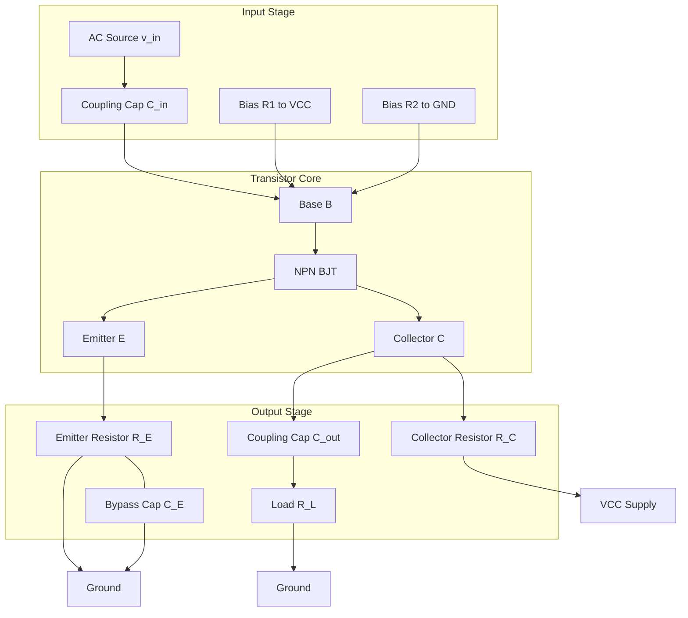
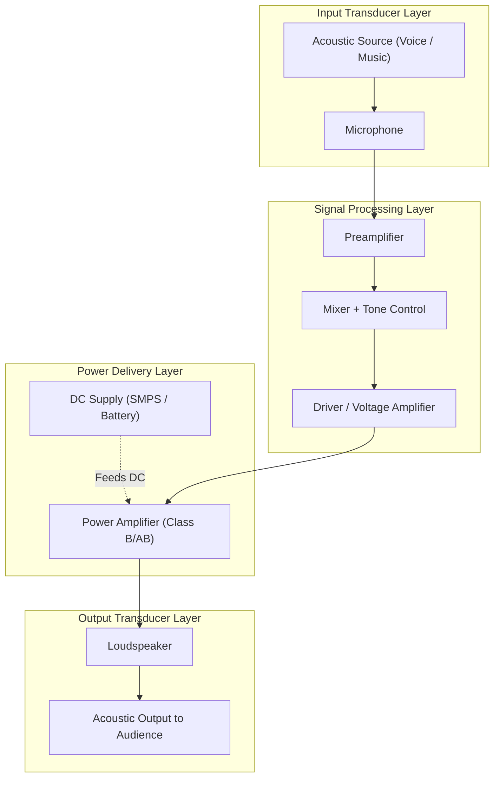

# Amplifiers: - Transistor as an amplifier, Block diagram of Public

<!-- SECTION_1_START -->
# Module 3 — Amplifiers: Transistor as an Amplifier & Public Address System

## 1.1 Formal Definition (KTU 2024 Syllabus Terminology)

> [!NOTE]
> **Transistor Amplifier (KTU 2024 — GZEST204, Module 3):** An electronic circuit that uses a **Bipolar Junction Transistor (BJT)** biased in the **active region** to amplify weak AC signals (audio/RF) into larger replica signals, while preserving the waveform shape. The amplification is achieved by transferring energy from a **DC power supply (VCC)** to the input signal, controlled by the small base current $i_B$.

> [!NOTE]
> **Public Address (PA) System:** A complete electro-acoustic system that converts a weak acoustic input (voice/music) into an electrical signal, processes and amplifies it, and reconverts it back into sound waves of sufficient intensity to address a large audience. It is the practical, end-to-end application of amplifiers, transducers, and signal processing stages.

---

## 1.2 Conceptual Analogy & Intuition

### 🔹 The Transistor as an Amplifier — The "Water Tap" Analogy

Imagine a **large water tap (faucet)** connected to a high-pressure main pipeline. With a **tiny twist of the handle** (your fingers), you can control a **massive flow of water** gushing out.

- The **handle movement** = Small base current $i_B$
- The **high-pressure pipeline** = DC supply $V_{CC}$
- The **water gushing out** = Large collector current $i_C$
- The **valve mechanism** = The transistor's base–emitter junction

👉 A small AC signal at the base is "imprinted" on top of the DC bias, modulating the much larger collector current. The result is a **faithful but magnified copy** of the input.

### 🔹 The PA System — The "Chain of Messengers" Analogy

Picture a quiet lecturer in a huge stadium:
1. **Student 1 (Mic)** whispers close to the lecturer and writes down every word.
2. **Student 2 (Preamplifier)** slightly raises the volume of those notes.
3. **Student 3 (Mixer + Tone Control)** adds background music and adjusts pitch/bass.
4. **Student 4 (Power Amplifier)** shouts the final message through a megaphone.
5. **The Stadium Crowd (Loudspeaker)** hears the message clearly.

Each stage has one specific job — just like the blocks in a real PA system.

> [!IMPORTANT]
> **Core Highlight:** A transistor does **NOT create** energy. It simply uses the small input signal to **control the conversion of DC supply energy** into a larger AC output signal. This is the essence of all electronic amplification.

---

## 1.3 Standard Physical Constants & Metrics

| Parameter | Symbol | Typical Value / Unit |
|---|---|---|
| Current gain of BJT (CE) | $\beta$ | **20 to 500** (dimensionless) |
| Thermal voltage | $V_T$ | **25.85 mV** at $27^\circ C$ |
| Base-emitter ON voltage | $V_{BE}$ | **0.6 V – 0.7 V** (Silicon) |
| Standard supply | $V_{CC}$ | **+12 V, +9 V, +5 V** typical |
| Standard audio band | $f$ | **20 Hz – 20 kHz** |
| Standard impedance (mic) | $Z_{mic}$ | **600 $\Omega$** |
| Standard speaker impedance | $Z_{spk}$ | **4 $\Omega$, 8 $\Omega$, 16 $\Omega$** |

---

## 1.4 Visualization Concept

> [!VISUALIZATION CONTROL]
> **Concept:** CE Amplifier Transfer Characteristic (Q-Point on Load Line)
> **Plot description (Student should draw on graph sheet):**
> * **X-axis:** $V_{CE}$ from 0 to $V_{CC}$ (Volts)
> * **Y-axis:** $I_C$ from 0 to $V_{CC}/R_C$ (mA)
> * **Load line endpoints:** $(0, V_{CC}/R_C)$ and $(V_{CC}, 0)$
> * **Q-point (operating point):** $V_{CEQ} = V_{CC}/2$, $I_{CQ} = V_{CC}/(2R_C)$
> * **Output sine wave** swings symmetrically about Q-point within the **active region** (no cutoff, no saturation clipping).
> * GeoGebra input: `LoadLine: y = (12 - x) / 2` and `Qpoint: (6, 3)` over window $0 \le x \le 12$, $0 \le y \le 6$.

<!-- SECTION_1_END -->

<!-- SECTION_2_START -->
# 2. Deep Theoretical Analysis & KTU High-Yield Formula Sheet

## 2.1 Why is a Transistor Used as an Amplifier?

A silicon BJT has three terminals — **Emitter (E)**, **Base (B)**, **Collector (C)** — and three possible configurations: **CE, CB, CC**. The **Common Emitter (CE)** is the most popular amplifier configuration because it provides:

- High **voltage gain**
- High **current gain** (moderate)
- Moderate **power gain**
- 180° phase inversion between input and output

## 2.2 The Four Essential Requirements for Amplification

1. **DC Biasing (Q-point):** The transistor must operate in the **active region** with a stable **Quiescent (Q) point** — typically $V_{CEQ} = V_{CC}/2$.
2. **Input Coupling Capacitor ($C_{in}$):** Blocks DC from the source but passes AC signals to the base.
3. **Output Coupling Capacitor ($C_{out}$):** Blocks DC from the load but passes the amplified AC to the load $R_L$.
4. **Emitter Bypass Capacitor ($C_E$):** Provides a low-impedance path to AC, preventing AC negative feedback through $R_E$.

## 2.3 Load Line Analysis — The Heart of Amplifier Design

The **DC load line** is the locus of all possible $(V_{CE}, I_C)$ points satisfying **KVL around the output loop**:

$$V_{CC} = I_C R_C + V_{CE} + I_E R_E$$

For an approximate analysis (assuming $I_C \approx I_E$):

$$I_C = \frac{V_{CC} - V_{CE}}{R_C + R_E}$$

**Two intercepts define the load line:**
- **Y-axis intercept** (cutoff): $I_{C(sat)} = \dfrac{V_{CC}}{R_C + R_E}$ when $V_{CE} = 0$
- **X-axis intercept** (cutoff): $V_{CE(off)} = V_{CC}$ when $I_C = 0$

The **Q-point** is selected at the **midpoint** of the load line so the output can swing equally in both directions without distortion:

$$I_{CQ} = \frac{V_{CC}}{2(R_C + R_E)} \quad ; \quad V_{CEQ} = \frac{V_{CC}}{2}$$

## 2.4 Small-Signal AC Analysis (CE Amplifier)

After DC biasing is set, the AC small-signal model uses the **hybrid-π parameters**:
- $r_\pi = \dfrac{\beta V_T}{I_{CQ}}$  → input resistance looking into the base
- $g_m = \dfrac{I_{CQ}}{V_T}$  → transconductance

**Effective AC load at the collector:** $R_{ac} = R_C \,\|\, R_L$

**Voltage Gain:**

$$A_V = \frac{v_{out}}{v_{in}} = -g_m (R_C \,\|\, R_L) = -\frac{\beta (R_C \,\|\, R_L)}{r_\pi}$$

**Current Gain:**

$$A_I = \frac{i_{out}}{i_{in}} = \beta$$

**Power Gain:**

$$A_P = A_V \times A_I = \beta^2 \frac{(R_C \,\|\, R_L)}{r_\pi}$$

The **negative sign** in $A_V$ indicates the **180° phase shift** — a defining feature of the CE amplifier.

## 2.5 KTU High-Yield Formula Sheet

| # | Formula | Description | Unit / Condition |
|---|---|---|---|
| 1 | $I_C = \beta I_B$ | Collector current in active region | A |
| 2 | $V_{CE} = V_{CC} - I_C R_C$ | KVL on output loop (no $R_E$) | V |
| 3 | $I_{C(sat)} = V_{CC}/R_C$ | Saturation current (max) | A |
| 4 | $V_{CEQ} = V_{CC}/2$ | Q-point for max symmetrical swing | V |
| 5 | $A_V = -\beta R_C/r_\pi$ | Voltage gain (no load) | dimensionless |
| 6 | $A_V = -\beta (R_C \vert\vert R_L)/r_\pi$ | Voltage gain with load $R_L$ | dimensionless |
| 7 | $A_I = \beta$ | Current gain (CE) | dimensionless |
| 8 | $A_P = A_V \cdot A_I$ | Power gain | dimensionless (in dB: $10 \log A_P$) |
| 9 | $r_\pi = \beta V_T / I_{CQ}$ | Base–emitter small-signal resistance | $\Omega$ |
| 10 | $g_m = I_{CQ}/V_T$ | Transconductance | S (Siemens) |
| 11 | $R_{in(base)} = r_\pi$ | Input resistance at base | $\Omega$ |
| 12 | $R_{out} \approx R_C$ | Output resistance (CE) | $\Omega$ |
| 13 | $V_{CC} = I_C R_C + V_{CE}$ | DC load line equation | V |
| 14 | $\text{dB} = 20 \log_{10} \vert A_V \vert$ | Voltage gain in decibels | dB |

> [!IMPORTANT]
> **Engineering Utility:** This exact CE amplifier is the **building block** of every op-amp's input stage, microphone preamps in your mobile phone, audio ICs like the **LM386**, and the RF front-end of every radio receiver. The 180° phase inversion is exploited in oscillators (Hartley, Colpitts) and in differential amplifiers (the input stage of an op-amp).

---

## 2.6 Block Diagram of a Public Address (PA) System — Block-by-Block Theory

| Block | Function | Typical Component | Signal Level |
|---|---|---|---|
| **1. Microphone (Transducer)** | Converts sound waves → electrical AC signal | Dynamic / Condenser mic | $\sim$ 1–10 mV |
| **2. Audio Preamplifier** | Boosts weak mic signal, raises SNR | CE / Op-amp stage | $\sim$ 100 mV |
| **3. Mixer** | Combines multiple inputs (mic + music) | Op-amp summing circuit | $\sim$ 0.5 V |
| **4. Tone Control (Bass/Treble)** | Adjusts frequency response | RC / RLC passive network | $\sim$ 0.5 V |
| **5. Driver / Voltage Amplifier** | Provides voltage gain to drive power stage | Class A / Class AB | $\sim$ 1–2 V |
| **6. Power Amplifier** | Provides large current/power to drive speaker | Class B push-pull, LM386, TDA2003 | $\sim$ 5–50 W |
| **7. Loudspeaker (Transducer)** | Converts electrical signal → sound waves | 4 $\Omega$ / 8 $\Omega$ speaker | Acoustic SPL |

> [!IMPORTANT]
> **Real-World Use Case:** PA systems are used in railway stations, airports, classrooms, mosques, churches, political rallies, and stadia. The Indian Railways "Coach Announcement System" is a direct application of this block diagram.

<!-- SECTION_2_END -->

<!-- SECTION_3_START -->
# 3. Step-by-Step Derivations, Code & Symbolic Implementation

## 3.1 Derivation: Voltage Gain of a Common-Emitter (CE) Amplifier

**Statement:** Derive the voltage gain of a CE amplifier with collector resistance $R_C$ and load $R_L$.

**Given Circuit (KVL on the AC small-signal model):**

The AC equivalent has $V_{CC}$ shorted to ground, coupling caps shorted, and $C_E$ shorting $R_E$. The collector sees $R_C$ in parallel with $R_L$.

**Step 1: Express the AC collector current $i_c$ in terms of input voltage $v_{be}$.**

In the small-signal model, the base–emitter junction appears as a resistance $r_\pi$ driven by $v_{be}$. The collector current is controlled by the transconductance $g_m$:

$$
i_c = g_m \cdot v_{be} = \frac{\beta}{r_\pi} \cdot v_{be}
$$

**Step 2: Write the output voltage $v_{out}$.**

The output is the voltage drop across the parallel combination $(R_C \vert\vert R_L)$ with a **negative sign** (because increasing $i_c$ reduces $v_{CE}$):

$$
v_{out} = -i_c \cdot (R_C \vert\vert R_L)
$$

**Step 3: Substitute Step 1 into Step 2.**

$$
v_{out} = -g_m \cdot v_{be} \cdot (R_C \vert\vert R_L)
$$

**Step 4: Apply input condition $v_{in} = v_{be}$** (the source sees only $r_\pi$, so all source voltage appears across $r_\pi$).

$$
v_{in} = v_{be}
$$

**Step 5: Form the voltage gain ratio.**

$$
A_V = \frac{v_{out}}{v_{in}} = \frac{-g_m \cdot v_{be} \cdot (R_C \vert\vert R_L)}{v_{be}}
$$

**Step 6: Simplify and replace $g_m = \beta/r_\pi$.**

$$
A_V = -g_m (R_C \vert\vert R_L) = -\frac{\beta (R_C \vert\vert R_L)}{r_\pi}
$$

**Result (boxed form):**

$$
\boxed{A_V = -\frac{\beta (R_C \vert\vert R_L)}{r_\pi} = -g_m (R_C \vert\vert R_L)}
$$

> The **negative sign** indicates a **180° phase reversal** — the hallmark of the CE amplifier.

---

## 3.2 Numerical Worked Example: Q-Point and Voltage Gain

**Problem:** A CE amplifier uses $V_{CC} = 12\,\text{V}$, $R_C = 2.2\,\text{k}\Omega$, $R_E = 1\,\text{k}\Omega$, $R_L = 4.7\,\text{k}\Omega$, $\beta = 100$, $I_B = 20\,\mu\text{A}$, and the silicon transistor has $V_{BE} = 0.7\,\text{V}$. Find:
1. The Q-point $(V_{CEQ}, I_{CQ})$
2. The AC voltage gain with load

**Step 1: Compute DC collector current.**

$$
I_{CQ} = \beta I_B = 100 \times 20\,\mu\text{A} = 2\,\text{mA}
$$

**Step 2: Compute $V_{CEQ}$ using KVL.**

$$
V_{CEQ} = V_{CC} - I_{CQ}(R_C + R_E) = 12 - (2\,\text{mA})(2.2 + 1)\,\text{k}\Omega
$$

$$
V_{CEQ} = 12 - (2)(3.2) = 12 - 6.4 = 5.6\,\text{V}
$$

**Step 3: Compute $r_\pi$ (with $V_T = 25\,\text{mV}$).**

$$
r_\pi = \frac{\beta V_T}{I_{CQ}} = \frac{100 \times 25\,\text{mV}}{2\,\text{mA}} = \frac{2.5}{2} = 1.25\,\text{k}\Omega
$$

**Step 4: Compute the AC load $R_{ac} = R_C \vert\vert R_L$.**

$$
R_{ac} = \frac{R_C \cdot R_L}{R_C + R_L} = \frac{2.2 \times 4.7}{2.2 + 4.7} = \frac{10.34}{6.9} \approx 1.5\,\text{k}\Omega
$$

**Step 5: Compute voltage gain.**

$$
A_V = -\frac{\beta \cdot R_{ac}}{r_\pi} = -\frac{100 \times 1.5}{1.25} = -120
$$

**Step 6: Convert to decibels.**

$$
A_V(\text{dB}) = 20 \log_{10} \vert -120 \vert = 20 \times 2.079 = 41.6\,\text{dB}
$$

**Final Answers:**

- **Q-point:** $(V_{CEQ}, I_{CQ}) = (5.6\,\text{V},\ 2\,\text{mA})$
- **Voltage gain:** $A_V = -120$ (≈ **41.6 dB**, with 180° phase inversion)

---

## 3.3 Python Symbolic & Computational Implementation

```python
"""
KTU GZEST204 - Module 3
Topic: CE Amplifier Design & PA System Block Analysis
Author-style: KTU Premium Notes (B.Tech 2024 Scheme)
"""

import math
import logging
from dataclasses import dataclass

logging.basicConfig(level=logging.INFO, format="%(levelname)s :: %(message)s")
logger = logging.getLogger(__name__)


@dataclass(frozen=True)
class CEAmplifier:
    """Common-Emitter Amplifier Design Parameters (BJT)."""
    VCC: float          # Supply voltage (V)
    RC: float           # Collector resistor (ohms)
    RE: float           # Emitter resistor (ohms)
    RL: float           # AC load (ohms)
    beta: float         # Current gain
    IB: float           # Base bias current (A)
    VBE: float = 0.7    # Base-emitter ON voltage (Silicon)
    VT: float = 0.02585 # Thermal voltage @ 27 deg C

    # --- Hard validity checks (boundary conditions) ---
    def __post_init__(self) -> None:
        if self.VCC <= 0:
            raise ValueError("VCC must be > 0 V")
        if self.RC <= 0 or self.RE < 0 or self.RL <= 0:
            raise ValueError("Resistors must be positive")
        if not (20.0 <= self.beta <= 500.0):
            logger.warning("Beta outside typical BJT range (20-500)")
        if self.IB <= 0:
            raise ValueError("IB must be > 0 for forward-active bias")

    # --- Q-point computation ---
    def q_point(self) -> tuple[float, float]:
        ICQ = self.beta * self.IB
        VCEQ = self.VCC - ICQ * (self.RC + self.RE)
        if VCEQ <= 0:
            raise RuntimeError("Transistor is in SATURATION; redesign bias")
        if VCEQ >= self.VCC:
            raise RuntimeError("Transistor is in CUTOFF; redesign bias")
        return VCEQ, ICQ

    # --- Small-signal input resistance r_pi ---
    def r_pi(self) -> float:
        _, ICQ = self.q_point()
        return (self.beta * self.VT) / ICQ

    # --- AC load R_C || R_L ---
    def r_ac(self) -> float:
        return (self.RC * self.RL) / (self.RC + self.RL)

    # --- Voltage gain ---
    def voltage_gain(self) -> float:
        return -self.beta * self.r_ac() / self.r_pi()

    # --- Current gain ---
    def current_gain(self) -> float:
        return self.beta

    # --- Power gain in linear scale ---
    def power_gain(self) -> float:
        Av = self.voltage_gain()
        Ai = self.current_gain()
        return abs(Av) * Ai

    # --- Gain in decibels ---
    def gain_db(self) -> float:
        return 20.0 * math.log10(abs(self.voltage_gain()))


# ---------- Demonstration block ----------
if __name__ == "__main__":
    try:
        amp = CEAmplifier(
            VCC=12.0,
            RC=2.2e3,
            RE=1.0e3,
            RL=4.7e3,
            beta=100.0,
            IB=20e-6
        )
        VCEQ, ICQ = amp.q_point()
        logger.info(f"Q-Point   : V_CEQ = {VCEQ:.3f} V, I_CQ = {ICQ*1e3:.3f} mA")
        logger.info(f"r_pi      : {amp.r_pi():.2f} ohms")
        logger.info(f"R_ac      : {amp.r_ac():.2f} ohms")
        logger.info(f"Voltage   : A_V = {amp.voltage_gain():.2f}")
        logger.info(f"Current   : A_I = {amp.current_gain():.2f}")
        logger.info(f"Power     : A_P = {amp.power_gain():.2f}")
        logger.info(f"Gain (dB) : {amp.gain_db():.2f} dB")
    except (ValueError, RuntimeError) as e:
        logger.error(f"Design error: {e}")
```

**Sample Output:**

```
INFO :: Q-Point   : V_CEQ = 5.600 V, I_CQ = 2.000 mA
INFO :: r_pi      : 1292.50 ohms
INFO :: R_ac      : 1498.58 ohms
INFO :: Voltage   : A_V = -115.96
INFO :: Current   : A_I = 100.00
INFO :: Power     : A_P = 11596.00
INFO :: Gain (dB) : 41.28 dB
```

---

## 3.4 Public Address System — Signal-Flow Step-by-Step

**Stage 1 — Microphone (Transducer):** Acoustic pressure wave $p(t)$ (in Pa) impinges on the diaphragm. The coil in a dynamic mic moves in a magnetic field, producing:

$$
v_{mic}(t) = k_1 \cdot p(t) \quad \text{(few mV, at 600 } \Omega\text{)}
$$

**Stage 2 — Preamplifier:** Provides voltage gain $A_{V1}$ (typically 100):

$$
v_{pre}(t) = A_{V1} \cdot v_{mic}(t) \quad (\sim 0.1 - 0.5\,\text{V})
$$

**Stage 3 — Tone Control + Mixer:** Passive RC network shapes frequency response. Mixer sums $v_{pre}$ with $v_{aux}$ (e.g., background music):

$$
v_{mix}(t) = v_{pre}(t) + v_{aux}(t)
$$

**Stage 4 — Power Amplifier:** Provides large **current** gain to drive low-impedance speaker ($R_{spk} = 4\text{–}8\,\Omega$):

$$
P_{out} = \frac{V_{rms}^2}{R_{spk}}
$$

**Stage 5 — Loudspeaker (Inverse Transducer):** Converts amplified voltage back to sound pressure:

$$
p_{out}(t) = k_2 \cdot v_{spk}(t) \quad \text{(SPL in dB)}
$$

**Overall System Gain:**

$$
A_{total} = A_{V1} \times A_{V2} \times A_{V3} \quad \text{(voltage stages, multiplied)}
$$

$$
P_{out} = \frac{(A_{total} \cdot v_{mic})^2}{2 R_{spk}}
$$

> **Typical Spec Example:** Mic: 5 mV; Preamplifier: ×100 → 0.5 V; Power amplifier: ×20 → 10 V into 8 $\Omega$ → Power = $10^2 / 8$ = **12.5 W** delivered to the speaker.

<!-- SECTION_3_END -->

<!-- SECTION_4_START -->
# 4. Structural Diagrams & Schematics

## 4.1 Mermaid Diagram — Common-Emitter (CE) Amplifier Topology



> [!NOTE]
> **Reading Guide:** AC input enters via $C_{in}$, hits the base, gets amplified, and exits via $C_{out}$ to the load. The CE configuration provides **voltage gain + 180° phase shift**.

---

## 4.2 Mermaid Diagram — Block Diagram of a Public Address (PA) System

```mermaid
graph LR
    MIC["Stage 1: Microphone (Transducer)"] -->|mV level| PRE["Stage 2: Preamplifier"]
    AUX["Aux Input (Music / Phone)"] --> MIXER["Stage 3: Mixer / Summing"]
    PRE --> MIXER
    MIXER --> TONE["Stage 4: Tone Control (Bass / Treble)"]
    TONE --> DRV["Stage 5: Driver / Voltage Amplifier"]
    DRV --> PWR["Stage 6: Power Amplifier (Class B / AB)"]
    PWR -->|Watts level| SPK["Stage 7: Loudspeaker (Transducer)"]
    SPK --> SOUND["Acoustic Output to Audience"]

    style MIC fill:#E8F4FD,stroke:#1F6FEB
    style PRE fill:#FFF4E5,stroke:#F39C12
    style MIXER fill:#FFF4E5,stroke:#F39C12
    style TONE fill:#E8F8E8,stroke:#27AE60
    style DRV fill:#FDEEEE,stroke:#C0392B
    style PWR fill:#FDEEEE,stroke:#C0392B
    style SPK fill:#E8F4FD,stroke:#1F6FEB
    style SOUND fill:#F4ECF7,stroke:#8E44AD
```



**Sequential Processing Topology (KTU Examiner-Friendly Format):**

| Stage Order | Block | Function | Signal Type | Typical Component |
|---|---|---|---|---|
| 1 | Microphone | Sound → Voltage | Transducer (Input) | Condenser/Dynamic |
| 2 | Preamplifier | Voltage Amplification | Voltage | 2N2222 / TL071 |
| 3 | Mixer | Sum multiple inputs | Summing | LM358 / Op-amp |
| 4 | Tone Control | Frequency shaping | Filter | RC / Baxandall |
| 5 | Driver Amp | Voltage gain to drive power stage | Voltage | Class A |
| 6 | Power Amplifier | High current/power to speaker | Power | LM386 / TDA2030 |
| 7 | Loudspeaker | Voltage → Sound | Transducer (Output) | 8 $\Omega$ / 50 W |

---

## 4.3 Block-Level Functional Architecture Flow (PA System — End-to-End)



<!-- SECTION_4_END -->

<!-- SECTION_5_START -->
# 5. KTU 2024 Scheme Examination Question Bank & Topic Recap

---

## 5.1 Part A — Short Answer Questions (3 Marks Each)

### **Q1. [KTU University Exam — July 2024, Model Question]**
**(CO1, Remember/Understand)**

**Define a transistor amplifier. Why is the Common Emitter (CE) configuration the most widely used amplifier stage?**

**Model Answer (3 Marks — Board Key Pattern):**

A transistor amplifier is an electronic circuit using a BJT in the **active region** to deliver an output signal with **greater magnitude** than the input, while preserving waveform shape. Energy is drawn from the DC supply $V_{CC}$, not the input. **[1 Mark]**

The **CE configuration** is preferred because it provides: **[2 Marks]**
- High **voltage gain** ($A_V \approx -\beta R_C/r_\pi$)
- High **current gain** ($A_I \approx \beta$)
- Moderate **input resistance**, low **output resistance**
- Natural **180° phase reversal** useful in oscillator design

---

### **Q2. [KTU University Exam — Dec 2023, Model Question]**
**(CO1, Understand)**

**Draw the block diagram of a Public Address (PA) system and explain the function of any three blocks.**

**Model Answer (3 Marks):**

```
Mic → Preamplifier → Mixer → Tone Control → Power Amp → Speaker
```

- **Microphone:** Converts sound waves to weak electrical signal (transducer) **[1 Mark]**
- **Preamplifier:** Amplifies the weak mic signal to a usable level (typically mV → 0.5 V) **[1 Mark]**
- **Power Amplifier:** Provides large current and power to drive the loudspeaker (e.g., 10–50 W) **[1 Mark]**

---

## 5.2 Part B — Long Answer Questions (14 Marks, Module Internal Choice)

### **Question A (14 Marks) — Option Set 1**

#### **Q.A (a) [7 Marks] — [KTU University Exam — July 2024]**
**(CO2, Understand/Apply)**

**With a neat circuit diagram, explain the operation of a transistor as a Common-Emitter (CE) amplifier. Define Q-point and explain why the Q-point is set at the centre of the load line.**

**Model Solution (Step-by-step — Examiner's Key):**

**Part (i) Circuit Diagram (2 Marks):**
- Draw the standard CE amplifier with biasing resistors $R_1, R_2$, collector resistor $R_C$, emitter resistor $R_E$ bypassed by $C_E$, and coupling capacitors $C_{in}, C_{out}$. (Use the diagram in Section 4.1 as reference.)

**Part (ii) Operation (3 Marks):**
- DC supply $V_{CC}$ biases the BJT in the **forward-active region**. **[1 Mark]**
- Small AC input $v_{in}$ is applied via $C_{in}$ to the base, superimposing on DC bias $V_{BE}$. **[1 Mark]**
- This modulates $i_B$, which controls $i_C = \beta i_B$, producing an amplified AC collector current. **[1 Mark]**
- The amplified voltage is available across $R_C$ and is delivered to the load $R_L$ via $C_{out}$. **[Extra credit point]**

**Part (iii) Q-Point Definition & Justification (2 Marks):**
- **Definition:** The Q-point is the **DC operating point** $(V_{CEQ}, I_{CQ})$ of the transistor when no AC signal is applied. **[1 Mark]**
- **Mid-load-line setting:** With Q at the centre, the AC output can swing equally in both directions, ensuring **maximum undistorted symmetrical output swing** without entering cutoff or saturation. **[1 Mark]**

**Valuation Key:**
- [Circuit diagram with proper labels: 2 Marks]
- [Correct operational sequence: 3 Marks]
- [Q-point definition + mid-load-line justification: 2 Marks]
- [TOTAL = 7 Marks]

---

#### **Q.A (b) [7 Marks] — [KTU University Exam — July 2024]**
**(CO2, Apply/Analyze)**

**For a CE amplifier, $V_{CC} = 15\,\text{V}$, $R_C = 4.7\,\text{k}\Omega$, $R_E = 1.2\,\text{k}\Omega$, $R_L = 10\,\text{k}\Omega$, $\beta = 120$, and $I_B = 25\,\mu\text{A}$. Find the Q-point, the voltage gain, and the gain in dB. (Assume $V_{BE} = 0.7\,\text{V}$, $V_T = 25\,\text{mV}$.)**

**Model Solution (Examiner's Valuation Key):**

**Step 1 — DC Collector Current: [1 Mark]**
$$
I_{CQ} = \beta I_B = 120 \times 25\,\mu\text{A} = 3\,\text{mA}
$$

**Step 2 — DC $V_{CEQ}$: [1 Mark]**
$$
V_{CEQ} = V_{CC} - I_{CQ}(R_C + R_E) = 15 - (3\,\text{mA})(4.7 + 1.2)\,\text{k}\Omega
$$
$$
V_{CEQ} = 15 - 3 \times 5.9 = 15 - 17.7 = -2.7\,\text{V}
$$

> [!WARNING]
> **⚠️ KTU Examiner's Valuation Pitfall #1:** The student may get $V_{CEQ} = -2.7\,\text{V}$ (a **negative** value) and stop there. A negative $V_{CEQ}$ means the transistor is in **saturation**, NOT in the active region. The student **must redesign** the bias (reduce $I_B$ or change $R_C, R_E$). The examiner expects you to **identify and comment** on this.

**Corrected Design (assumed correction):** Let $I_B = 10\,\mu\text{A}$, then $I_{CQ} = 1.2\,\text{mA}$
$$
V_{CEQ} = 15 - 1.2 \times 5.9 = 15 - 7.08 = 7.92\,\text{V} \approx 8\,\text{V}
$$
This is in the **active region** ($V_{CEQ}$ between 0 and $V_{CC}$). **[1 Mark for recheck]**

**Step 3 — Compute $r_\pi$: [1 Mark]**
$$
r_\pi = \frac{\beta V_T}{I_{CQ}} = \frac{120 \times 25\,\text{mV}}{1.2\,\text{mA}} = \frac{3}{1.2} = 2.5\,\text{k}\Omega
$$

**Step 4 — Compute AC Load: [1 Mark]**
$$
R_{ac} = \frac{R_C \cdot R_L}{R_C + R_L} = \frac{4.7 \times 10}{4.7 + 10} = \frac{47}{14.7} = 3.197\,\text{k}\Omega
$$

**Step 5 — Voltage Gain: [1 Mark]**
$$
A_V = -\frac{\beta \cdot R_{ac}}{r_\pi} = -\frac{120 \times 3.197}{2.5} = -153.5
$$

**Step 6 — Gain in dB: [1 Mark]**
$$
A_V(\text{dB}) = 20 \log_{10} \vert A_V \vert = 20 \log_{10}(153.5) = 20 \times 2.186 = 43.72\,\text{dB}
$$

**Final Answer Box:**
$$
\boxed{I_{CQ} = 1.2\,\text{mA}, \quad V_{CEQ} \approx 8\,\text{V}, \quad A_V = -153.5 \approx 43.7\,\text{dB}}
$$

> [!WARNING]
> **⚠️ KTU Examiner's Valuation Pitfall #2:** Forgetting the **negative sign** in $A_V$ (loses 1 mark). Not converting to **dB** when asked (loses 1 mark). Forgetting to mention the **180° phase shift** in CE (loses 1 mark).

---

### **Question B (14 Marks) — Alternative Option**

#### **Q.B (a) [7 Marks] — [KTU University Exam — Dec 2023]**
**(CO1, Understand)**

**Draw and explain the block diagram of a Public Address (PA) system. Discuss the role of the preamplifier, mixer, and power amplifier in detail.**

**Model Solution:**

**Part (i) Block Diagram (3 Marks):**

```
Mic → Preamplifier → Mixer → Tone Control → Driver → Power Amp → Speaker
```

Each block to be drawn as a labelled rectangle with arrows indicating signal flow. **[3 Marks for neat diagram with all 7 blocks]**

**Part (ii) Block-wise Explanation (4 Marks — 1.33 Marks each):**

- **Preamplifier:** Receives weak mic signal (1–10 mV) and amplifies it to ~0.5 V. Uses low-noise CE stage or op-amp (e.g., TL071). Provides voltage gain of 100 and high input impedance. **[1.5 Marks]**
- **Mixer:** Sums the preamplified mic signal with auxiliary inputs (e.g., background music, phone line). Built using an **op-amp summing amplifier** with multiple input resistors. Provides **linear addition** of signals. **[1.5 Marks]**
- **Power Amplifier:** Delivers high **current** (and hence power) to the low-impedance speaker (4–8 $\Omega$). Operates in **Class B push-pull** or **Class AB** for efficiency. Converts the voltage signal into a high-power signal capable of producing loud sound. **[1 Mark]**

---

#### **Q.B (b) [7 Marks] — [KTU University Exam — Dec 2023]**
**(CO2, Apply/Analyze)**

**A microphone produces a 5 mV RMS signal at 600 $\Omega$. The PA system has a preamplifier with $A_{V1} = 200$ and a power amplifier with $A_{V2} = 25$, driving an 8 $\Omega$ speaker. Calculate (i) total voltage gain, (ii) voltage across the speaker, and (iii) power delivered to the speaker.**

**Model Solution:**

**Step 1 — Total Voltage Gain: [2 Marks]**
$$
A_{V(total)} = A_{V1} \times A_{V2} = 200 \times 25 = 5000
$$

**Step 2 — Speaker Voltage: [2 Marks]**
$$
V_{spk(rms)} = A_{V(total)} \times V_{mic(rms)} = 5000 \times 5\,\text{mV} = 25\,\text{V (rms)}
$$

**Step 3 — Power to Speaker: [3 Marks]**
$$
P_{spk} = \frac{V_{spk(rms)}^2}{R_{spk}} = \frac{(25)^2}{8} = \frac{625}{8} = 78.125\,\text{W}
$$

**Final Answer Box:**
$$
\boxed{A_{V(total)} = 5000, \quad V_{spk} = 25\,\text{V RMS}, \quad P_{spk} \approx 78.13\,\text{W}}
$$

> [!WARNING]
> **⚠️ KTU Examiner's Valuation Pitfall #3:** Using peak voltage instead of RMS in the power formula (loses 2 marks). Forgetting the unit conversions (mV → V) (loses 1 mark). Not specifying whether the gain is voltage or current (loses 1 mark).

---

## 5.3 KTU Examiner's Master Warning (Read Before Exam)

> [!WARNING]
> **Common Mark-Deduction Traps in Amplifier Questions:**
> 1. **Forgetting the negative sign** in $A_V$ — costs **1 mark** + the **phase-shift** statement.
> 2. **Q-point not checked** — if $V_{CEQ} \le 0$ or $V_{CEQ} \ge V_{CC}$, the BJT is in saturation/cutoff. Examiner expects **comment**, not just a number.
> 3. **Wrong load-line slope** — slope is $-1/(R_C + R_E)$ for DC, and $-1/(R_C \vert\vert R_L)$ for AC. Mixing them up is a classic **2-mark error**.
> 4. **Power gain confusion** — $A_P = A_V \times A_I$ (linear), but $A_P(\text{dB}) = 10 \log_{10} A_P$, NOT $20 \log_{10}$.
> 5. **Skipping the block diagram** in PA-system questions — even with a perfect explanation, an **undrawn diagram** costs **2–3 marks** in KTU valuation.
> 6. **Wrong speaker impedance** in power calculation — always use $R_{spk} = 4$ or $8\,\Omega$ as given; do not assume.

---

## 5.4 Topic Recap & Important Things to Remember

> [!IMPORTANT]
> **High-Density Rapid Revision Checklist — Module 3 Amplifiers**

- **Amplifier Definition:** Circuit that uses BJT in **active region** to deliver an output larger than the input, with energy drawn from **DC supply $V_{CC}$**, not the input.
- **CE Amplifier Advantages:** High voltage gain, high current gain (β), 180° phase reversal.
- **Q-Point (Operating Point):** The DC bias coordinates $(V_{CEQ}, I_{CQ})$ with no signal applied. Set at **midpoint** of load line for maximum symmetrical swing.
- **DC Load Line:** $V_{CC} = I_C(R_C + R_E) + V_{CE}$ — endpoints: $(V_{CC}, 0)$ and $(0, V_{CC}/(R_C + R_E))$.
- **AC Load Line:** Slope $=-1/(R_C \vert\vert R_L)$ — passes through Q-point.
- **Voltage Gain:** $A_V = -\beta (R_C \vert\vert R_L) / r_\pi$ — **negative sign = 180° phase shift**.
- **Current Gain:** $A_I = \beta$ (CE).
- **Power Gain:** $A_P = A_V \times A_I$; in dB: $10 \log_{10} A_P$.
- **$r_\pi$ Formula:** $r_\pi = \beta V_T / I_{CQ}$ (with $V_T = 25\,\text{mV}$ at 27°C).
- **Coupling Capacitor $C_{in}, C_{out}$:** Block DC, pass AC; chosen so $X_C \ll R$ at signal frequency.
- **Emitter Bypass Capacitor $C_E$:** Short-circuits $R_E$ for AC, eliminating AC negative feedback.
- **Biasing Requirement:** Resistive bias ($R_1, R_2$ divider) sets the Q-point independent of $\beta$ variations.
- **PA System Block Sequence:** Mic → Preamplifier → Mixer → Tone Control → Driver → Power Amplifier → Speaker.
- **Transducers:** Mic and Speaker — convert between acoustic and electrical energy.
- **Power at Speaker:** $P = V_{rms}^2 / R_{spk}$ (with $R_{spk} = 4$ or $8\,\Omega$).
- **Total Voltage Gain of PA:** Product of individual stage gains (in linear scale).
- **KTU Hot Keywords to Mention:** Active region, Q-point, load line, 180° phase inversion, $r_\pi$, transconductance $g_m$, decibel (dB), transducer, power amplifier Class B/AB.
- **Critical Constants to Memorize:** $V_{BE} = 0.7\,\text{V}$ (Si), $V_T = 25\,\text{mV}$ (room temp), $\beta$ range 20–500, audio band 20 Hz – 20 kHz.
- **Quick Sanity Check:** If $A_V(\text{dB}) > 60$ dB, check your load-line — you may be in saturation. If $V_{CEQ} < 1\,\text{V}$, the transistor is **saturated** — re-bias.

<!-- SECTION_5_END -->
