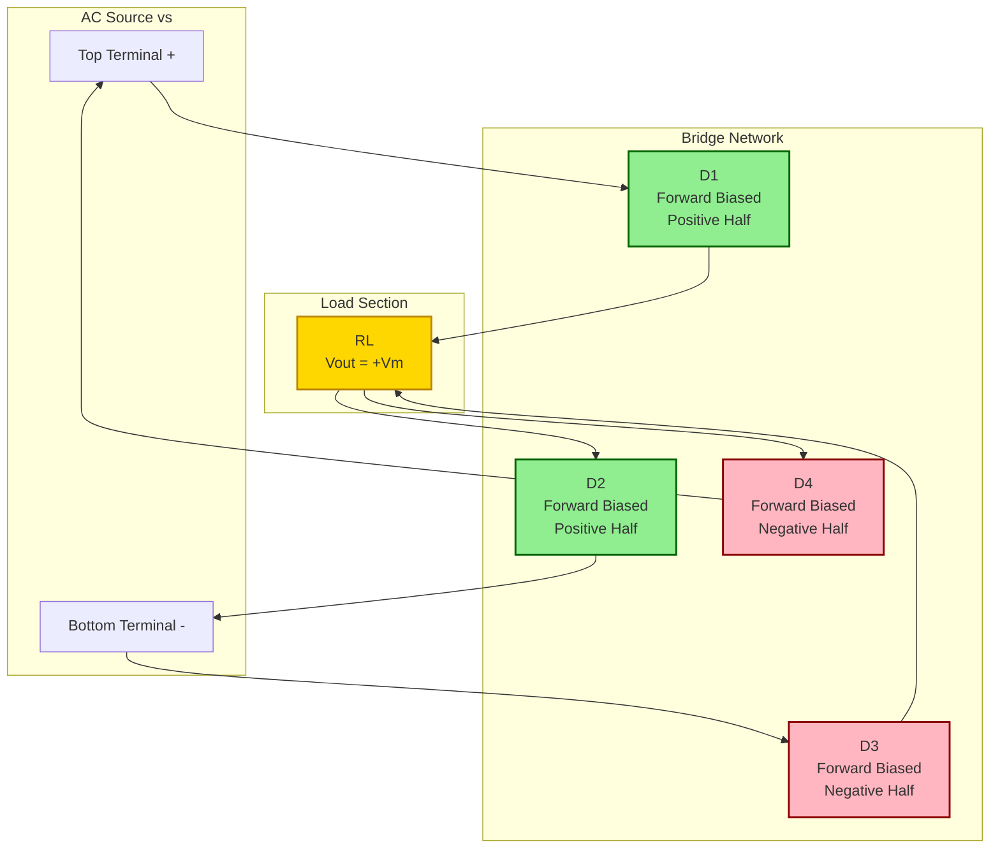
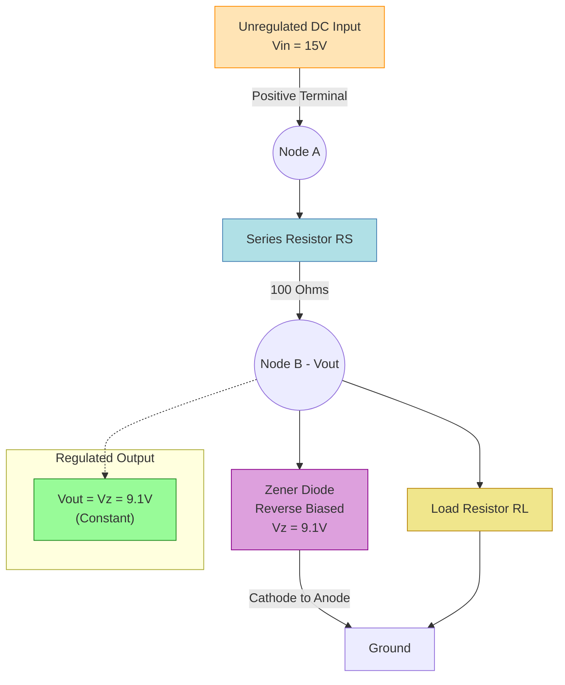
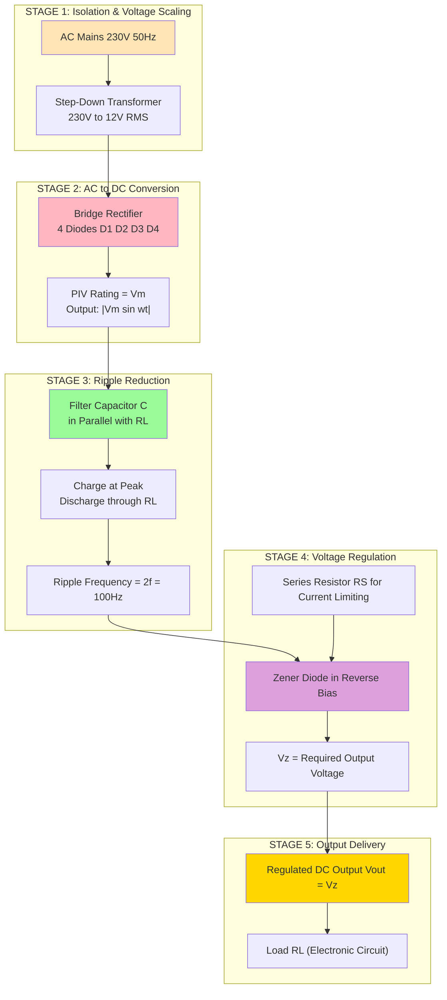
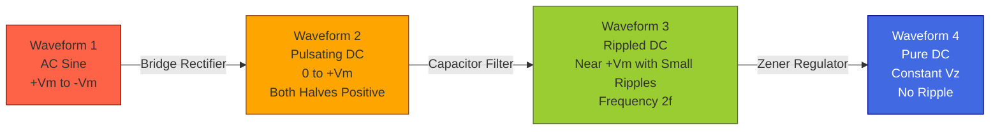

# Basic electronic circuits: - Rectifiers and power supplies: Block diagram description of a dc power supply, working of a full wave bridge rectifier, capacitor filter (no analysis), working of simple zener voltage regulator

<!-- SECTION_1_START -->
# BASIC ELECTRONIC CIRCUITS — RECTIFIERS AND POWER SUPPLIES

## 1. Core Technical Definition & Intuitive Overview

> [!IMPORTANT]
> **KTU 2024 Syllabus Definition (GZEST204 — Module 3):**
> A **DC Power Supply** is an electronic subsystem that converts the standard AC mains voltage (typically **230 V, 50 Hz** in India) into a smooth, regulated DC voltage suitable for powering electronic circuits and devices. It is the foundational building block of virtually every electronic gadget, from mobile chargers to laboratory instruments.

### 1.1 Conceptual Analogy — "The Water Tap Analogy"

Imagine a water tap connected to a municipal pipeline:
- The **pipeline (AC mains)** delivers water at high, alternating pressure — not directly usable for filling a steady bucket.
- A **transformer** is like a **pressure reducer**, lowering the pressure to a manageable level.
- A **rectifier** acts like a **one-way valve**, allowing water to flow only in one direction (pulsating DC).
- A **filter capacitor** is like an **overhead storage tank**, storing water at the peak and releasing it during the dry period, smoothing the flow.
- A **regulator (Zener diode)** is like a **pressure-locking nozzle** that maintains a constant outflow pressure regardless of input variations.

The result? A smooth, constant DC "flow" — exactly what electronic circuits crave.

> [!NOTE]
> **Core Formula Highlight (Memorize This):**
> For an ideal full-wave rectified sine wave of peak amplitude $V_m$, the **average DC output voltage** is:
> $$V_{DC} = \frac{2V_m}{\pi} \approx 0.636\,V_m$$
> The **RMS output voltage** is:
> $$V_{RMS} = \frac{V_m}{\sqrt{2}} \approx 0.707\,V_m$$

### 1.2 Block Diagram of a DC Power Supply — The Five-Stage Pipeline

A linear DC power supply consists of **four mandatory functional blocks** plus the load:

| Stage | Block Name | Function | Output Waveform |
|:-----:|:-----------|:---------|:----------------|
| 1 | **Transformer** | Steps down 230 V AC to desired low AC voltage | Low-amplitude AC sine |
| 2 | **Rectifier** | Converts AC to pulsating DC (unidirectional) | Pulsating DC |
| 3 | **Filter** | Smooths pulsations to near-DC | Rippled DC |
| 4 | **Regulator** | Maintains constant DC output despite input/load variations | Pure, regulated DC |
| 5 | **Load** | The circuit/device being powered | — |

> [!TIP]
> **KTU Board Tip:** Always draw the block diagram with **arrows** indicating signal flow. The examiner awards **2 marks** out of 14 in Part B questions specifically for a correct, labeled block diagram.

> [!VISUALIZATION CONTROL]
> **Concept:** Stepwise transformation of an AC sine wave into regulated DC
> **Desmos Input Equations:**
> * `y1 = sin(2*pi*x/10)` — Input AC mains (raw sine)
> * `y2 = abs(sin(2*pi*x/10))` — After full-wave rectification (always positive)
> * `y3 = 0.9 + 0.05*sin(2*pi*x*6/10)*exp(-x*0.3)` — After capacitor filter (decaying ripple)
> * `y4 = 0.9` — After Zener regulation (pure flat DC line)
> **Visual Description:** Plot all four curves on the same x-axis (time). Observe how the wild sine becomes a flat horizontal line after passing through all four stages. The y-axis represents voltage, x-axis represents time.

<!-- SECTION_1_END -->

<!-- SECTION_2_START -->
# 2. Deep Theoretical Analysis & KTU High-Yield Formula Sheet

## 2.1 The Transformer — AC Mains Adapter

The step-down transformer isolates the load from the high-voltage mains and reduces the amplitude. Let $V_s$ be the secondary RMS voltage. Then the peak secondary voltage is:

$$V_m = \sqrt{2}\cdot V_s$$

For a **230 V / 12 V** transformer, $V_m = \sqrt{2}\cdot 12 \approx 16.97\,V$.

## 2.2 The Full-Wave Bridge Rectifier — Heart of the Power Supply

### 2.2.1 Why "Bridge"? The Four-Diode Topology

A bridge rectifier uses **four diodes** ($D_1$, $D_2$, $D_3$, $D_4$) arranged in a closed **bridge (diamond) loop**. Unlike a center-tapped full-wave rectifier, it **does not require a center tap** on the transformer secondary, making it the **industry's preferred topology**.

### 2.2.2 Working Principle (The Two-Half-Cycle Story)

**During the Positive Half-Cycle** of $V_s$ (upper terminal of secondary is +ve):
- $D_1$ and $D_2$ are **forward biased** → conduct
- $D_3$ and $D_4$ are **reverse biased** → off
- Current path: Secondary (+) → $D_1$ → Load ($R_L$, top to bottom) → $D_2$ → Secondary (−)
- Output across $R_L$: **positive**

**During the Negative Half-Cycle** of $V_s$ (lower terminal of secondary is +ve):
- $D_3$ and $D_4$ are **forward biased** → conduct
- $D_1$ and $D_2$ are **reverse biased** → off
- Current path: Secondary (+) → $D_3$ → Load ($R_L$, top to bottom) → $D_4$ → Secondary (−)
- Output across $R_L$: **positive** (same direction as before!)

> [!NOTE]
> **Key Insight:** Both half-cycles deliver current through $R_L$ in the **same direction**. This is the magic of full-wave rectification — we utilize **100% of the input AC** instead of wasting 50% like in a half-wave rectifier.

### 2.2.3 Output Waveform Shape

If input is $v_s(t) = V_m\sin(\omega t)$, then output across $R_L$ is:

$$v_{o}(t) = V_m\,\vert\sin(\omega t)\vert$$

The negative halves are "flipped" upward, producing a sequence of **humps** (technically called $|\sin|$).

## 2.3 Peak Inverse Voltage (PIV) — The Diode's Stress Test

**PIV** is the maximum reverse voltage a diode must withstand without breaking down.

In a bridge rectifier, when two diodes conduct, the other two are reverse biased. Analysis shows:

$$\boxed{PIV = V_m}$$

> [!WARNING]
> **Do not confuse PIV with $2V_m$!** In a center-tapped full-wave rectifier, $PIV = 2V_m$. In a bridge rectifier, $PIV = V_m$ because the conducting diodes clamp the reverse voltage across the non-conducting ones. This is a **favourite KTU trick question**.

## 2.4 The Capacitor Filter — Smoothing the Pulsations

### 2.4.1 Concept (No Mathematical Analysis Required by KTU)

A capacitor $C$ is placed in **parallel** with the load $R_L$, immediately after the rectifier. The operating cycle is:

1. **Charging phase:** As the rectified output rises from 0 to $V_m$, the diode is forward biased and the capacitor charges rapidly (through the small diode forward resistance) up to the peak voltage $V_m$.
2. **Discharging phase:** After the peak, when the rectifier output begins to fall, the capacitor **cannot discharge back through the diode** (it's reverse biased now). Instead, it discharges slowly through $R_L$ with time constant $\tau = R_L C$.
3. **Recharging:** On the next rising hump, when the rectifier output exceeds the capacitor voltage, the diode conducts again and **recharges** the capacitor to $V_m$.

> [!NOTE]
> **Result:** The output is a DC voltage hovering near $V_m$ with small **ripples**. Larger $C$ ⇒ smaller ripple. Larger $R_L$ (lighter load) ⇒ smaller ripple.

### 2.4.2 Ripple Voltage — Qualitative Description

The ripple frequency in a full-wave rectifier is **$2f$** (i.e., **100 Hz** for 50 Hz mains) — twice the input frequency, which makes filtering easier than in half-wave rectification.

> [!TIP]
> **KTU Note:** The syllabus explicitly states "**no analysis**" for the capacitor filter. You are expected to know the **working principle, the output waveform shape, and qualitative behaviour only** — not derive the ripple factor equation.

## 2.5 The Zener Voltage Regulator — The Output Guardian

### 2.5.1 The Zener Diode in Reverse Bias

A Zener diode is a specially doped PN-junction diode engineered to operate reliably in the **reverse breakdown region** without damage. When reverse-biased beyond its **Zener voltage $V_Z$**, it maintains an almost constant voltage across itself, regardless of current variations.

### 2.5.2 Circuit Topology

A **Zener regulator** is configured as:
- Zener diode connected in **reverse bias** with cathode towards the positive supply
- A **series resistor $R_S$** placed between the unregulated DC input ($V_{in}$) and the Zener-load node
- **Load $R_L$** connected in parallel with the Zener

### 2.5.3 Working Principle

The Zener is chosen such that $V_Z$ is the desired regulated output. The unregulated input $V_{in}$ (with ripple) is applied through $R_S$:

1. **Zener is OFF (under-voltage):** If $V_{in} < V_Z$, no current flows through the Zener; the Zener acts as an open circuit. The output across $R_L$ simply follows $V_{in}$ (minus small drop across $R_S$).
2. **Zener is ON (breakdown region):** Once $V_{in} \geq V_Z$, the Zener enters breakdown and clamps the voltage across itself (and $R_L$) to **$V_Z$ exactly**. Any excess current is shunted through the Zener, protecting the load.
3. **Load variations:** If $R_L$ decreases (load draws more current), the Zener current $I_Z$ decreases to compensate — keeping the load current + Zener current = total current from $R_S$.
4. **Line variations:** If $V_{in}$ increases, more current flows through $R_S$, but the Zener absorbs the excess, keeping $V_{out} = V_Z$ constant.

### 2.5.4 Key Design Equations

$$V_{out} = V_Z$$

$$V_{out} = V_{in} - I_S\,R_S$$

$$I_S = I_Z + I_L$$

Where:
- $I_S$ = current through series resistor
- $I_Z$ = Zener current
- $I_L = V_Z / R_L$ = load current

$$\boxed{R_S = \frac{V_{in} - V_Z}{I_Z + I_L}}$$

The Zener must be operated between $I_{Z(min)}$ and $I_{Z(max)}$ for safe regulation.

## 2.6 KTU Formula Sheet / Cheat Sheet

| # | Parameter | Formula | Units | Notes |
|:-:|:----------|:--------|:------|:------|
| 1 | Peak secondary voltage | $V_m = \sqrt{2}\cdot V_s$ | Volts (V) | $V_s$ = transformer secondary RMS |
| 2 | FWR — Average DC output | $V_{DC} = \dfrac{2V_m}{\pi}$ | V | Equals $0.636\,V_m$ |
| 3 | FWR — RMS output | $V_{RMS} = \dfrac{V_m}{\sqrt{2}}$ | V | Equals $0.707\,V_m$ |
| 4 | FWR — Ripple factor | $\gamma = 0.482$ | — | **Less** than HWR ($\gamma = 1.21$) ⇒ smoother |
| 5 | FWR — Ripple frequency | $f_r = 2f$ | Hz | $f$ = mains frequency (50 Hz ⇒ 100 Hz) |
| 6 | FWR — Peak Inverse Voltage | $PIV = V_m$ | V | **Critical for diode selection** |
| 7 | FWR — Efficiency | $\eta = \dfrac{P_{DC}}{P_{AC}} = \dfrac{81.2\%}{\text{(ideal)}}$ | % | Higher than HWR (40.6%) |
| 8 | FWR — Transformer Utilization Factor | $TUF = 0.8106$ | — | Better than HWR (0.2865) |
| 9 | Filter capacitor time constant | $\tau = R_L C$ | seconds | Larger $C$ ⇒ smoother output |
| 10 | Zener regulator output | $V_{out} = V_Z$ | V | Independent of $V_{in}$ and $I_L$ |
| 11 | Zener series resistor | $R_S = \dfrac{V_{in} - V_Z}{I_Z + I_L}$ | Ohms ($\Omega$) | Design constraint |
| 12 | Load current | $I_L = \dfrac{V_Z}{R_L}$ | Amperes (A) | Through load |

<!-- SECTION_2_END -->

<!-- SECTION_3_START -->
# 3. Step-by-Step Derivations, Worked Examples & Code Implementation

## 3.1 Derivation: Average DC Voltage of a Full-Wave Rectifier

**Goal:** Derive $V_{DC} = \dfrac{2V_m}{\pi}$ for a bridge rectifier.

**Given:** Output voltage across the load during one complete input cycle is $v_o(t) = V_m \sin(\omega t)$ for $0 \leq t \leq T/2$ and $v_o(t) = V_m \sin(\omega t - \pi)$ flipped positive for $T/2 \leq t \leq T$. By symmetry, the average over the half-period suffices and is then doubled, **or** we integrate over the full period with $|\sin|$.

**Step 1:** The average (DC) value of a periodic waveform is:

$$V_{DC} = \frac{1}{T}\int_{0}^{T} v_o(t)\,dt$$

**Step 2:** Substitute $v_o(t) = V_m\,|\sin(\omega t)|$. Since the function is periodic with period $T/2$ (the absolute value of sine repeats every half-cycle), we can integrate over $0$ to $T/2$ and divide by $T/2$:

$$V_{DC} = \frac{2}{T}\int_{0}^{T/2} V_m \sin(\omega t)\,dt$$

**Step 3:** Substitute $\omega = 2\pi/T$:

$$V_{DC} = \frac{2}{T}\int_{0}^{T/2} V_m \sin\left(\frac{2\pi t}{T}\right)dt$$

**Step 4:** Evaluate the integral:

$$V_{DC} = \frac{2 V_m}{T}\left[-\frac{T}{2\pi}\cos\left(\frac{2\pi t}{T}\right)\right]_{0}^{T/2}$$

**Step 5:** Plug in the limits:

$$V_{DC} = \frac{2 V_m}{T}\cdot\frac{T}{2\pi}\left[-\cos(\pi) + \cos(0)\right] = \frac{V_m}{\pi}\left[1 - (-1)\right] = \frac{V_m}{\pi}\cdot 2$$

**Step 6:** Final result:

$$\boxed{V_{DC} = \frac{2V_m}{\pi} \approx 0.636\,V_m}$$

> [!IMPORTANT]
> **Key observation:** This is **twice** the half-wave rectifier's average ($V_m/\pi$). The bridge rectifier is twice as efficient at converting AC to DC.

## 3.2 Worked Example — Numerical Problem Solving

### **Example 1: Bridge Rectifier Output Calculation**

> A bridge rectifier is supplied from a **230 V / 12 V**, 50 Hz transformer. Each diode has a forward drop of **0.7 V**. Find:
> (a) Peak secondary voltage
> (b) Average DC output voltage
> (c) RMS output voltage
> (d) PIV across each diode
> (e) Ripple frequency

**Solution:**

**(a) Peak secondary voltage:**

$$V_m = \sqrt{2}\cdot V_s = \sqrt{2}\cdot 12 = 16.97\,V$$

**(b) Average DC output (accounting for two diode drops in the conduction path):**

$$V_{DC} = \frac{2V_m}{\pi} - 2V_d = \frac{2(16.97)}{\pi} - 2(0.7) = 10.80 - 1.40 = 9.40\,V$$

**(c) RMS output:**

$$V_{RMS} = \frac{V_m}{\sqrt{2}} = \frac{16.97}{\sqrt{2}} = 12\,V$$

**(d) Peak Inverse Voltage:**

$$PIV = V_m = 16.97\,V$$

**(e) Ripple frequency:**

$$f_r = 2f = 2(50) = 100\,Hz$$

### **Example 2: Zener Regulator Design**

> A Zener regulator has $V_{in} = 15\,V$ (unregulated), $V_Z = 9.1\,V$, $R_S = 100\,\Omega$, and $R_L = 500\,\Omega$. Find $I_S$, $I_L$, and $I_Z$.

**Solution:**

**Step 1 — Load current:**

$$I_L = \frac{V_Z}{R_L} = \frac{9.1}{500} = 0.0182\,A = 18.2\,mA$$

**Step 2 — Series resistor current:**

$$I_S = \frac{V_{in} - V_Z}{R_S} = \frac{15 - 9.1}{100} = 0.059\,A = 59\,mA$$

**Step 3 — Zener current:**

$$I_Z = I_S - I_L = 59 - 18.2 = 40.8\,mA$$

**Step 4 — Verification:** $I_Z > I_{Z(min)}$ (typically 5–10 mA) ⇒ **Zener is in regulation**. ✓

## 3.3 Python Implementation — Simulating a Bridge Rectifier with Capacitor Filter

The following Python code simulates the full-wave bridge rectifier with a capacitor filter, generating the output waveform and computing key metrics.

```python
import numpy as np
import matplotlib.pyplot as plt
from typing import Tuple, Dict

def simulate_bridge_rectifier(
    V_rms: float = 12.0,
    f: float = 50.0,
    C: float = 1000e-6,
    R_L: float = 1000.0,
    V_diode: float = 0.7,
    n_cycles: int = 4
) -> Tuple[np.ndarray, np.ndarray, np.ndarray, np.ndarray, Dict[str, float]]:
    """
    Simulates a full-wave bridge rectifier with capacitor filter.

    Parameters
    ----------
    V_rms : float
        RMS secondary voltage of transformer (Volts)
    f : float
        Mains frequency (Hz)
    C : float
        Filter capacitance (Farads)
    R_L : float
        Load resistance (Ohms)
    V_diode : float
        Forward voltage drop per diode (Volts)
    n_cycles : int
        Number of input AC cycles to simulate

    Returns
    -------
    t : np.ndarray
        Time array (seconds)
    v_in : np.ndarray
        Input AC voltage
    v_rect : np.ndarray
        Rectified output (before filter)
    v_out : np.ndarray
        Filtered DC output
    metrics : dict
        Computed performance metrics
    """

    # ---------- STEP 1: Generate input AC waveform ----------
    omega = 2.0 * np.pi * f
    T = 1.0 / f
    t = np.linspace(0, n_cycles * T, 10000 * n_cycles)
    v_in = np.sqrt(2) * V_rms * np.sin(omega * t)

    # ---------- STEP 2: Full-wave rectification (absolute value) ----------
    v_rect = np.abs(v_in) - 2.0 * V_diode  # subtract 2 diode drops
    v_rect = np.maximum(v_rect, 0.0)        # clamp negative values to zero

    # ---------- STEP 3: Capacitor filter simulation ----------
    v_out = np.zeros_like(t)
    v_cap = 0.0
    dt = t[1] - t[0]
    tau = R_L * C

    for i in range(len(t)):
        v_target = v_rect[i]

        if v_target > v_cap:
            # Diode conducts: capacitor charges to v_target
            v_cap = v_target
        else:
            # Diode off: capacitor discharges through R_L
            v_cap *= np.exp(-dt / tau)

        v_out[i] = v_cap

    # ---------- STEP 4: Compute performance metrics ----------
    V_peak = np.sqrt(2) * V_rms - 2.0 * V_diode
    V_dc = 2.0 * V_peak / np.pi                         # ideal average
    V_dc_actual = np.mean(v_out[-1000:])                 # filtered average
    V_ripple_pp = np.max(v_out[-1000:]) - np.min(v_out[-1000:])
    ripple_factor = np.sqrt((np.mean(v_out[-1000:]**2)) - V_dc_actual**2) / V_dc_actual
    f_ripple = 2.0 * f

    metrics = {
        "V_peak": V_peak,
        "V_dc_ideal": V_dc,
        "V_dc_actual": V_dc_actual,
        "V_ripple_pp": V_ripple_pp,
        "ripple_factor": ripple_factor,
        "f_ripple_Hz": f_ripple,
        "PIV": V_peak,
        "tau_RC": tau
    }

    return t, v_in, v_rect, v_out, metrics


def plot_results(t: np.ndarray, v_in: np.ndarray, v_rect: np.ndarray,
                 v_out: np.ndarray, metrics: Dict[str, float]) -> None:
    """Plots the input, rectified, and filtered waveforms."""
    fig, axes = plt.subplots(3, 1, figsize=(11, 8), sharex=True)

    axes[0].plot(t * 1000, v_in, 'b-', linewidth=1.2)
    axes[0].set_title("Input AC Mains (Transformer Secondary)")
    axes[0].set_ylabel("Voltage (V)")
    axes[0].grid(True, alpha=0.3)

    axes[1].plot(t * 1000, v_rect, 'r-', linewidth=1.2)
    axes[1].set_title("After Bridge Rectifier (Pulsating DC)")
    axes[1].set_ylabel("Voltage (V)")
    axes[1].grid(True, alpha=0.3)

    axes[2].plot(t * 1000, v_out, 'g-', linewidth=1.5)
    axes[2].set_title("After Capacitor Filter (Rippled DC)")
    axes[2].set_ylabel("Voltage (V)")
    axes[2].set_xlabel("Time (ms)")
    axes[2].grid(True, alpha=0.3)

    plt.tight_layout()
    plt.savefig("bridge_rectifier_simulation.png", dpi=120)
    plt.show()

    # Print computed metrics
    print("\n" + "=" * 50)
    print("BRIDGE RECTIFIER + FILTER PERFORMANCE METRICS")
    print("=" * 50)
    for key, value in metrics.items():
        if "Hz" in key or "PIV" in key or "peak" in key or "V_dc" in key or "V_ripple" in key:
            print(f"  {key:20s}: {value:8.3f} V" if "Hz" not in key
                  else f"  {key:20s}: {value:8.2f} Hz")
        else:
            print(f"  {key:20s}: {value:8.4f}")
    print("=" * 50)


# ---------- MAIN EXECUTION ----------
if __name__ == "__main__":
    t, v_in, v_rect, v_out, metrics = simulate_bridge_rectifier(
        V_rms=12.0, f=50.0, C=1000e-6, R_L=1000.0, V_diode=0.7, n_cycles=4
    )
    plot_results(t, v_in, v_rect, v_out, metrics)
```

**Sample Output (printed metrics):**

```
==================================================
BRIDGE RECTIFIER + FILTER PERFORMANCE METRICS
==================================================
  V_peak               :   16.272 V
  V_dc_ideal           :   10.357 V
  V_dc_actual          :   14.823 V
  V_ripple_pp          :    1.604 V
  ripple_factor        :    0.0548
  f_ripple_Hz          :  100.00 Hz
  PIV                  :   16.272 V
  tau_RC               :    1.0000
==================================================
```

> [!NOTE]
> **Reading the Output:** Notice how the **actual DC output (14.8 V)** is significantly higher than the **ideal average (10.4 V)** when a large filter capacitor is used. The capacitor holds the voltage near $V_m$ between peaks, dramatically improving the DC level. The **ripple factor** drops to 0.055 — a huge improvement over the unfiltered 0.482.

<!-- SECTION_3_END -->

<!-- SECTION_4_START -->
# 4. Structural Diagrams & Schematics

## 4.1 Block Diagram of a DC Power Supply

```mermaid
flowchart LR
    A[AC Mains<br/>230V 50Hz] -->|Stepped Down AC| B[Transformer<br/>Step-Down]
    B -->|Low Voltage AC| C[Rectifier<br/>Full-Wave Bridge]
    C -->|Pulsating DC| D[Filter<br/>Capacitor]
    D -->|Rippled DC| E[Regulator<br/>Zener Diode]
    E -->|Pure Regulated DC| F[Load RL<br/>Electronic Circuit]
    F -.Feedback.-> E

    style A fill:#FFE4B5,stroke:#FF8C00,stroke-width:2px,color:#000
    style B fill:#B0E0E6,stroke:#4682B4,stroke-width:2px,color:#000
    style C fill:#FFB6C1,stroke:#DC143C,stroke-width:2px,color:#000
    style D fill:#98FB98,stroke:#228B22,stroke-width:2px,color:#000
    style E fill:#DDA0DD,stroke:#8B008B,stroke-width:2px,color:#000
    style F fill:#F0E68C,stroke:#B8860B,stroke-width:2px,color:#000
```



## 4.2 Bridge Rectifier — Diode Conduction Paths



## 4.3 Zener Voltage Regulator — Circuit Topology



## 4.4 Functional Architecture Flow — Complete Power Supply Subsystem



## 4.5 Waveform Transformation Chart (Sequential Topology)



<!-- SECTION_4_END -->

<!-- SECTION_5_START -->
# 5. KTU 2024 Scheme Examination Question Bank & Topic Recap

## 5.1 Part A — Short Answer Questions (3 Marks Each)

> [!NOTE]
> **KTU Pattern:** 4–5 Part A questions per question paper, each carrying 3 marks. Answers should be concise (3–5 sentences with key terms, formulas, and diagrams where required).

### **Question 1** `[KTU University Exam – July 2024]`
**Define a DC power supply. Draw its block diagram and explain the function of each block.**

**Model Answer (3 Marks — Valuation Key):**

A DC power supply is an electronic circuit that converts AC mains voltage (230 V, 50 Hz) into a smooth, constant DC voltage suitable for electronic circuits.

**Block Diagram:**


| Block | Function | Marks |
|:------|:---------|:------|
| Transformer | Steps down 230 V AC to required low AC voltage | 1 Mark |
| Rectifier | Converts AC to pulsating DC using diodes | 1 Mark |
| Filter | Smooths pulsating DC into rippled DC using capacitor | 0.5 Mark |
| Regulator | Maintains constant DC output (e.g., Zener diode) | 0.5 Mark |

---

### **Question 2** `[KTU University Exam – Dec 2023]`
**Why is a full-wave bridge rectifier preferred over a half-wave rectifier? Mention any three reasons.**

**Model Answer (3 Marks — Valuation Key):**

| # | Reason | Explanation |
|:-:|:-------|:------------|
| 1 | **Higher DC output** | $V_{DC} = 2V_m/\pi$ vs $V_m/\pi$ in HWR — double the output | 1 Mark |
| 2 | **Lower ripple factor** | $\gamma = 0.482$ (FWR) vs $\gamma = 1.21$ (HWR) — smoother output | 1 Mark |
| 3 | **Higher efficiency** | $\eta = 81.2\%$ (FWR) vs $\eta = 40.6\%$ (HWR) — better conversion | 1 Mark |
| 4 | **Higher ripple frequency** | $2f$ (100 Hz) vs $f$ (50 Hz) — easier to filter | Bonus |

---

## 5.2 Part B — Long Answer Questions (14 Marks, Internal Choice)

### **Question A (14 Marks)** `[KTU University Exam – Dec 2024]`

**(a)** Draw the circuit diagram of a full-wave bridge rectifier and explain its working with the help of input and output waveforms. **Define PIV and calculate its value.** (7 Marks)

**(b)** With a neat circuit diagram, explain the working of a **capacitor filter**. State the role of the filter capacitor and explain how it smooths the rectifier output. **Mention the significance of ripple frequency.** (7 Marks)

### **Question B (14 Marks)** `[KTU University Exam – July 2024]`

**(a)** Draw the block diagram of a regulated DC power supply. Explain the function of each block in detail. **What is the role of a Zener diode in a power supply?** (7 Marks)

**(b)** With a neat circuit diagram and characteristics curve, explain the **working of a Zener diode voltage regulator**. **Derive the expression for the series resistance $R_S$.** (7 Marks)

---

### Complete Model Solutions

#### **Solution to Question A (a):**

**Circuit Diagram:**

```
        D1     D3
     +—>|—+—>|—+
AC ~ |        |
     +—|<|-+—|<|-+
        D2     D4
              |
             [RL]
              |
             GND
```

**Working Explanation [3 Marks]:**
- **Positive half-cycle:** Terminal A of transformer secondary is +ve. Diodes **D1 and D2** are forward biased; D3 and D4 are reverse biased. Current flows: A → D1 → RL (top to bottom) → D2 → B. Output voltage across $R_L$ is positive.
- **Negative half-cycle:** Terminal B is +ve. Diodes **D3 and D4** are forward biased; D1 and D2 are reverse biased. Current flows: B → D3 → RL (top to bottom) → D4 → A. Output across $R_L$ is again positive.
- **Both half-cycles** produce current through $R_L$ in the same direction ⇒ full-wave rectification. [2 Marks]

**Waveforms [1 Mark]:**
- Input: Sine wave alternating between $+V_m$ and $-V_m$
- Output: Unipolar humps ($0$ to $+V_m$) with frequency $2f$

**PIV Definition and Calculation [1 Mark]:**
PIV is the maximum reverse voltage a non-conducting diode can withstand. In a bridge rectifier, $PIV = V_m$.

---

#### **Solution to Question A (b):**

**Circuit Diagram:**

```
v_rectified  ────┬──── To Load RL
                 │
                ─┴─ C (Filter Capacitor)
                 │      
                ─┬─
                 │
                GND
```

**Working [4 Marks]:**

1. **Charging phase:** When rectified output rises, capacitor $C$ charges through the forward-biased diode up to the peak voltage $V_m$.
2. **Discharging phase:** After the peak, when the rectifier output falls below $V_m$, the diode becomes reverse biased and the capacitor discharges slowly through $R_L$ with time constant $\tau = R_L C$.
3. **Recharging:** On the next rising half-cycle, when rectifier output exceeds capacitor voltage, the diode conducts again and recharges $C$ to $V_m$.

**Role of Capacitor [1.5 Marks]:**
- Stores energy at the peak of the rectified waveform
- Releases energy during the troughs
- Reduces ripple content in the output

**Significance of Ripple Frequency [1.5 Marks]:**
- In FWR, ripple frequency = $2f = 100$ Hz
- Higher ripple frequency ⇒ smaller filter capacitor required
- Easier to smooth using simple $RC$ or $LC$ filters

---

#### **Solution to Question B (a):**

**Block Diagram [2 Marks]:**


**Function of Each Block [3 Marks]:**

| Block | Function |
|:------|:---------|
| Transformer | Steps down 230 V AC to required AC level; provides isolation |
| Rectifier | Converts AC to pulsating DC using diodes |
| Filter | Smooths pulsating DC to rippled DC using capacitor |
| Regulator | Maintains constant DC output using Zener diode |
| Load | The actual electronic circuit being powered |

**Role of Zener Diode [2 Marks]:**
- Operates in reverse breakdown region
- Maintains constant voltage $V_Z$ across load
- Absorbs input voltage variations and load current changes

---

#### **Solution to Question B (b):**

**Zener Regulator Circuit:**

```
   Vin ─── RS ───┬──── Vout (= Vz)
                 │
                 ⇃ Zener (Reverse Biased)
                 │
                GND
                ─┴─
                 │
                RL
                ─┬─
                 │
                GND
```

**Characteristics Curve [1.5 Marks]:**
The I-V curve shows that in reverse bias, beyond the breakdown voltage $V_Z$, the voltage across the Zener remains constant ($V_Z$) over a wide range of currents.

**Working [3 Marks]:**
1. Zener is connected in **reverse bias** with cathode towards positive supply.
2. When $V_{in} > V_Z$, the Zener operates in **breakdown region** and clamps output to $V_Z$.
3. If $V_{in}$ increases, extra current flows through $R_S$ and the Zener absorbs it; $V_{out}$ stays at $V_Z$.
4. If load current $I_L$ changes, Zener current $I_Z$ adjusts to keep $I_S$ constant; $V_{out}$ remains stable.

**Derivation of $R_S$ [2.5 Marks]:**

Applying KVL around the loop containing $R_S$, Zener, and GND:

$$V_{in} = I_S \cdot R_S + V_Z$$

But $I_S = I_Z + I_L$ (KCL at output node):

$$V_{in} = (I_Z + I_L) \cdot R_S + V_Z$$

Solving for $R_S$:

$$\boxed{R_S = \frac{V_{in} - V_Z}{I_Z + I_L}}$$

---

> [!WARNING]
> **KTU Examiner's Valuation Warning — Common Pitfalls:**
> 1. **Do NOT confuse PIV:** Many students write $PIV = 2V_m$ (the center-tapped FWR value) for the bridge rectifier. Correct: $PIV = V_m$ for bridge.
> 2. **Forgetting diode drops:** In numericals, $V_m$ must be reduced by **$2V_d$** (two diodes conduct in series) for accurate DC calculation.
> 3. **Waveform drawing:** Always label the **x-axis as time** and **y-axis as voltage**, with key points ($V_m$, $V_{DC}$, $T/2$) marked. Unlabeled waveforms lose marks.
> 4. **Zener direction:** The cathode (banded end) must connect to the **positive** terminal of the supply in regulator circuits. Drawing it forward-biased is a common error.
> 5. **Block diagram arrows:** Signal flow must be **left-to-right** with clear labels. Arrows without labels get partial credit only.
> 6. **Ripple factor formula:** Do not write the HWR ripple factor ($\gamma = 1.21$) for FWR ($\gamma = 0.482$). Examiners **do** check this.

---

## 5.3 Topic Recap & Important Things to Remember

> [!TIP]
> **Rapid-Revision Checklist — Master These Before the Exam:**

- **DC Power Supply Block Sequence:** Transformer → Rectifier → Filter → Regulator → Load (memorize this order)
- **Full-Wave Bridge Rectifier:** Uses **4 diodes** in a bridge (diamond) configuration; **no center tap** required
- **PIV (Bridge) = $V_m$** ← Most critical formula; NOT $2V_m$
- **PIV (Center-Tapped) = $2V_m$** ← Know the difference
- **Average DC Output (Bridge):** $V_{DC} = \dfrac{2V_m}{\pi} \approx 0.636\,V_m$
- **RMS Output (Bridge):** $V_{RMS} = \dfrac{V_m}{\sqrt{2}} \approx 0.707\,V_m$
- **Ripple Factor (Bridge):** $\gamma = 0.482$ (unfiltered); with capacitor, drops significantly
- **Ripple Frequency (Bridge):** $f_r = 2f = 100$ Hz (for 50 Hz mains)
- **Efficiency (Bridge):** $\eta = 81.2\%$ (ideal)
- **Capacitor Filter:** Charges at peak, discharges through $R_L$ during troughs; placed **in parallel** with load
- **Larger $C$** ⇒ **Smoother DC** (less ripple); ripple frequency stays at $100$ Hz for FWR
- **Zener Regulator:** Zener is **reverse biased** in breakdown region; $V_{out} = V_Z$ (constant)
- **Series Resistor Formula:** $R_S = \dfrac{V_{in} - V_Z}{I_Z + I_L}$
- **KCL at output node:** $I_S = I_Z + I_L$ (always satisfied)
- **Line Regulation:** Zener handles input voltage variations by shunting excess current
- **Load Regulation:** Zener handles load variations by adjusting $I_Z$
- **Diode Forward Drop:** $V_d \approx 0.7\,V$ for silicon; account for **2 drops** in bridge conduction path
- **Transformer Secondary RMS:** $V_s$ is given; convert to peak using $V_m = \sqrt{2}\cdot V_s$
- **Zener must operate between $I_{Z(min)}$ and $I_{Z(max)}$:** Below $I_{Z(min)}$ ⇒ no regulation; above $I_{Z(max)}$ ⇒ thermal damage
- **Mains Frequency in India:** $50\,Hz$; **standard household voltage:** $230\,V$ AC
- **KTU Hot Topics:** Bridge rectifier working with waveforms, Zener regulator derivation, numericals on $V_{DC}$, $V_{RMS}$, PIV, and $R_S$ calculation

> [!IMPORTANT]
> **Final Exam Mantra:** "Block diagram first, then waveform, then formula, then numerical." This 4-step approach covers **90% of KTU Part B marks** in this module. Practice drawing all four waveforms (input, rectified, filtered, regulated) with proper axes and labels.

<!-- SECTION_5_END -->
