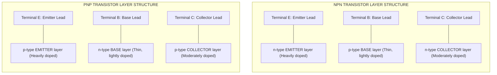
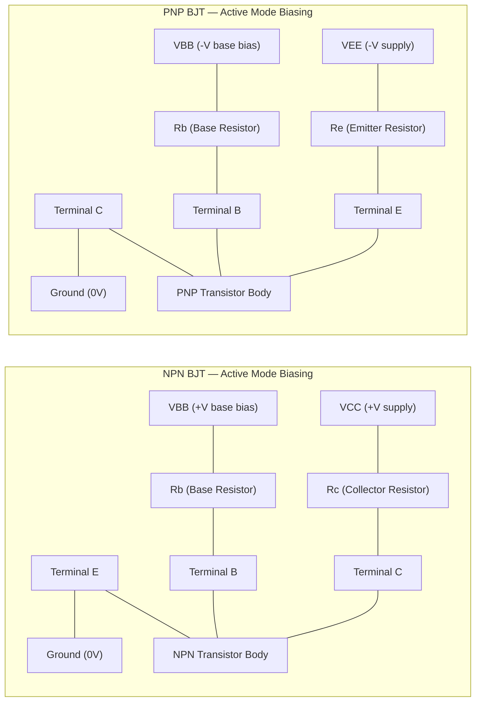
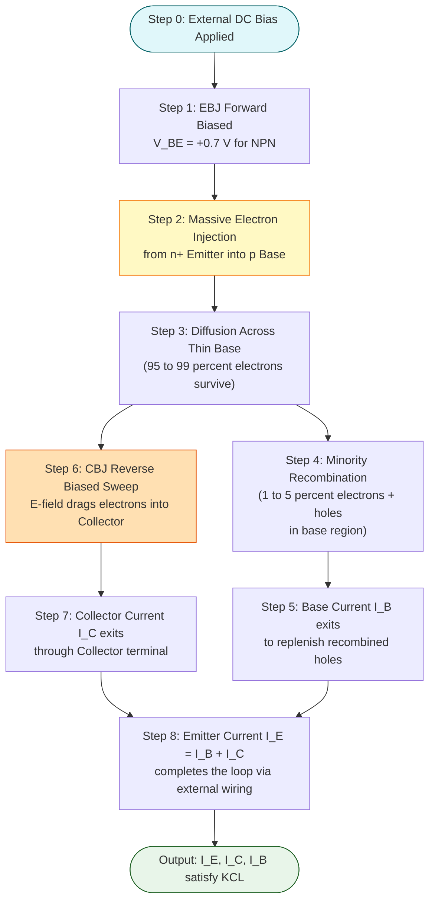
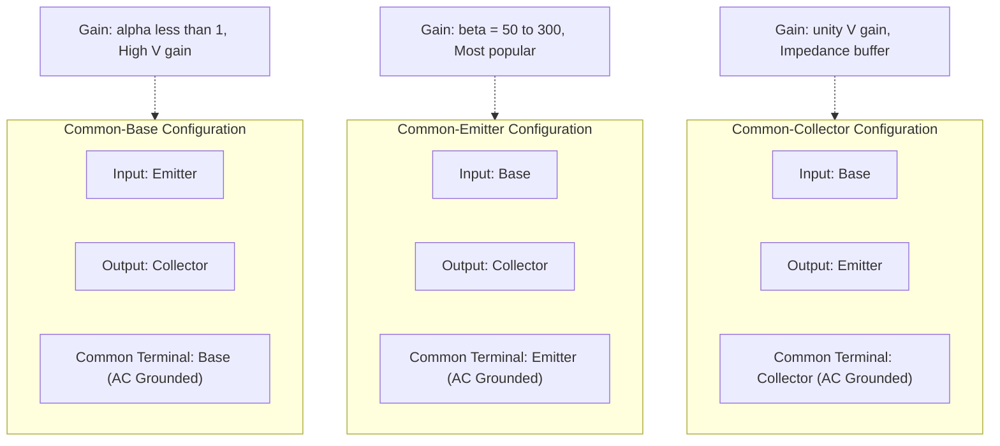

# Bipolar Junction Transistors: PNP and NPN structures, Principle of operation

<!-- SECTION_1_START -->
# Bipolar Junction Transistor (BJT): PNP and NPN Structures

## Formal Academic Definition

> [!NOTE]
> **Definition (KTU Syllabus Standard):**
> A **Bipolar Junction Transistor (BJT)** is a three-terminal, two-junction semiconductor device constructed by sandwiching a thin layer of one type of extrinsic semiconductor between two layers of the opposite type. The three terminals are designated as **Emitter (E)**, **Base (B)**, and **Collector (C)**, and the two internal p-n junctions are the **Emitter-Base Junction (EBJ)** and the **Collector-Base Junction (CBJ)**.

The term **"Bipolar"** signifies that **both majority and minority charge carriers** (electrons and holes) actively participate in the conduction process, distinguishing it from unipolar devices like the FET. A BJT can exist in one of two complementary structures: **NPN** (a p-type base sandwiched between two n-type regions) or **PNP** (an n-type base sandwiched between two p-type regions).

> [!IMPORTANT]
> **KTU 2024 Scheme Highlight:**
> In Module 3, the focus is strictly on *device physics* — the physical structure, the biasing arrangement, and the qualitative principle of operation. Quantitative amplifier design (small-signal modelling, h-parameters) is covered in later modules/semesters.

## Intuitive Analogy: The "Water-Faucet Valve" Model

Imagine a **water tap** controlling a high-pressure main pipeline:

| Component | Water Analogy | BJT Equivalent |
| :--- | :--- | :--- |
| **Main Pipeline (high flow)** | High-pressure water supply pipe | Collector-Emitter path |
| **Small Control Knob** | The little lever you twist with your fingers | Base terminal |
| **Tiny Pilot Pipe** | The small hose feeding the knob mechanism | Base current $I_B$ |
| **Resulting Output** | A massive water flow through the main pipe | Collector current $I_C$ |

A **tiny twist** of the knob (a few milliamps at the base) controls a **massive water flow** (hundreds of milliamps between collector and emitter). This is the essence of **transistor action**: a small input current governs a large output current, achieving **amplification**.

> [!TIP]
> **Geometric Intuition:** Picture the BJT as a "sandwich." For an NPN transistor, the bread slices are **n-type**, and the filling is a **very thin slice of p-type** (typically 1 µm thick for a high-frequency device). The filling is *intentionally thin* so that carriers injected from one bread slice can "shoot across" to the other side with minimal recombination.

## Physical Constants & Standard Metrics

The following physical constants govern BJT operation and are essential for board examinations:

- **Boltzmann Constant ($k$)** = $1.38 \times 10^{-23}$ **J/K**
- **Electronic Charge ($q$)** = $1.602 \times 10^{-19}$ **C**
- **Thermal Voltage ($V_T$)** = $\frac{kT}{q} \approx 26$ **mV** at room temperature ($T = 300$ **K**)
- **Intrinsic Carrier Concentration of Silicon ($n_i$)** $\approx 1.5 \times 10^{10}$ **cm$^{-3}$** at 300 K
- **Standard Operating Temperature** = **300 K** (i.e., $27^\circ$C)

> [!VISUALIZATION CONTROL]
> **Concept:** Emitter-Base Junction I-V Characteristic (Input Curve)
> **GeoGebra / Desmos Input Equations:**
> * `V_EB = x` (Forward bias voltage, range 0 to 0.8 V)
> * `I_E = 10^(-12) * (e^(40 * V_EB) - 1)` (in Amperes, assuming $I_S = 1$ pA, ideality factor = 1)
> **Visual Description:** Students should observe an exponential "knee-shaped" curve resembling a standard diode forward characteristic, with a sharp turn-on threshold near $V_{EB} \approx 0.6$ V to $0.7$ V (silicon BJT). This curve represents the forward-biased EBJ as a perfect diode.
<!-- SECTION_1_END -->

<!-- SECTION_2_START -->
# Deep Theoretical Analysis & KTU High-Yield Formula Sheet

## 1. Physical Construction: The Doping Profile

A BJT is fabricated as a **three-layer monolithic crystal**, never as three separate pieces joined together. The three layers are created in a single silicon wafer using techniques like **diffusion** or **ion implantation**.

### 1.1 Doping Concentration Hierarchy (Critical Concept)

The doping levels of the three regions are **deliberately asymmetric**, and this asymmetry is what makes the transistor *transistor* rather than a simple pair of back-to-back diodes.

$$N_E \gg N_B \quad \text{and} \quad N_C > N_B \quad \text{but} \quad N_E > N_C$$

Where:
- $N_E$ = Doping concentration of the **Emitter** (heavily doped)
- $N_B$ = Doping concentration of the **Base** (very lightly doped)
- $N_C$ = Doping concentration of the **Collector** (moderately doped)

> [!IMPORTANT]
> **Why is the base so lightly doped and thin?**
> 1. **Minimizes recombination** of injected carriers within the base — most carriers must survive to reach the collector.
> 2. **Enhances emitter efficiency** — the heavy emitter can inject a huge carrier flux, while the weak base cannot inject carriers *back* into the emitter in significant numbers.
> 3. A **thin base** reduces the **transit time** of carriers, enabling high-frequency operation.

### 1.2 Two Structural Variants

| Feature | **NPN Transistor** | **PNP Transistor** |
| :--- | :--- | :--- |
| **Layer Sequence** | n–p–n | p–n–p |
| **Emitter Material** | Heavily doped n-type (N+) | Heavily doped p-type (P+) |
| **Base Material** | Lightly doped p-type | Lightly doped n-type |
| **Collector Material** | Moderately doped n-type | Moderately doped p-type |
| **Majority Carriers (Emitter)** | Electrons | Holes |
| **Biasing Polarity (Active Mode)** | $V_{CE} > 0$ (Collector +ve wrt Emitter) | $V_{EC} > 0$ (Emitter +ve wrt Collector) |
| **Symbol Arrow Direction** | Arrow on Emitter points **OUT** of the transistor | Arrow on Emitter points **IN** to the transistor |
| **Mnemonic** | **N**ot **P**ointing i**N** (arrow out) | **P**ointing i**N** **P**ermanently (arrow in) |

## 2. Biasing the BJT: The Two Junctions

To operate the BJT in the **Active (Amplifying) Region**, the two p-n junctions must be biased as follows:

$$\boxed{\text{EBJ: Forward Biased} \quad \text{and} \quad \text{CBJ: Reverse Biased}}$$

> [!WARNING]
> **Common Student Error:** Many students memorize this rule but forget *why* the CBJ is reverse biased. The reverse bias on the CBJ creates a **depletion region with a strong electric field** that **sweeps** the minority carriers (which crossed the thin base from the emitter) into the collector. Without this reverse bias, there is no "collector action."

## 3. Principle of Operation: Transistor Action (NPN, Active Mode)

Step-by-step carrier dynamics inside an NPN BJT:

1. **Forward Bias on EBJ:** The external voltage $V_{BE} \approx 0.7$ **V** lowers the potential barrier of the emitter-base junction. This causes a large **injection of electrons** from the heavily doped n-type emitter into the p-type base.
2. **Diffusion Across the Thin Base:** Since the base is **extremely thin** and **lightly doped**, the injected electrons encounter very few holes to recombine with. Approximately **95% to 99%** of these electrons diffuse across the base to the edge of the CBJ depletion region.
3. **Reverse Bias on CBJ Sweep:** The reverse-biased CBJ has a built-in electric field pointing from the n-collector towards the p-base. This field **sweeps** the diffused electrons across the CBJ into the collector region.
4. **Collector Current Formation:** These collected electrons flow out through the collector terminal, constituting the **collector current $I_C$**.
5. **Base Current Recombination:** The small fraction of electrons (1%–5%) that **recombine with holes** in the base must be replenished. This replenishment current flowing *out* of the base terminal is the **base current $I_B$**.
6. **Emitter Current Completion:** The electrons leaving the emitter enter the external circuit, travel through the emitter lead, and return. This is the **emitter current $I_E$**.

> [!TIP]
> **The Three Currents are linked by Kirchhoff's Current Law (KCL):**
> $$\boxed{I_E = I_B + I_C}$$
> This is the **fundamental current equation** of a BJT. Since $I_B$ is much smaller than $I_C$, we also have $I_E \approx I_C$.

## 4. Current Amplification Parameters

### 4.1 Common-Base Current Gain ($\alpha$)

Defined as the ratio of collector current to emitter current:

$$\boxed{\alpha = \frac{I_C}{I_E}}$$

- Typical value: $\alpha = 0.95$ to $0.99$ (dimensionless, always less than 1)
- $\alpha$ is **always less than unity** in a real BJT because a tiny fraction of carriers recombine in the base.

### 4.2 Common-Emitter Current Gain ($\beta$)

Defined as the ratio of collector current to base current:

$$\boxed{\beta = \frac{I_C}{I_B}}$$

- Typical value: $\beta = 50$ to $300$ (dimensionless, can be very large)
- This is the parameter most commonly used in **amplifier design** because the base is the *input* terminal in the common-emitter configuration.

### 4.3 Mathematical Relationship Between $\alpha$ and $\beta$

Starting from $I_E = I_B + I_C$, divide by $I_C$:

$$\frac{I_E}{I_C} = \frac{I_B}{I_C} + 1 \quad \Rightarrow \quad \frac{1}{\alpha} = \frac{1}{\beta} + 1$$

Solving for either parameter:

$$\boxed{\beta = \frac{\alpha}{1 - \alpha}} \quad \text{and} \quad \boxed{\alpha = \frac{\beta}{1 + \beta}}$$

## 5. KTU High-Yield Formula Cheat Sheet

| # | Formula / Parameter | Expression | Physical Meaning / Typical Value | Unit |
| :--- | :--- | :--- | :--- | :--- |
| 1 | **KCL at BJT terminals** | $I_E = I_B + I_C$ | Sum of currents entering = sum leaving | A |
| 2 | **Common-base gain** | $\alpha = I_C / I_E$ | Efficiency of carrier transfer | $0.95$ to $0.99$ |
| 3 | **Common-emitter gain** | $\beta = I_C / I_B$ | Current amplification factor | $50$ to $300$ |
| 4 | **$\alpha$-$\beta$ relation** | $\beta = \alpha / (1-\alpha)$ | Conversion formula | dimensionless |
| 5 | **Reverse relation** | $\alpha = \beta / (1+\beta)$ | Conversion formula | dimensionless |
| 6 | **Collector from base** | $I_C = \beta \cdot I_B$ | Output current in CE config | A |
| 7 | **Emitter from base** | $I_E = (1 + \beta) \cdot I_B$ | Total emitter current | A |
| 8 | **Cut-off condition** | $I_B = 0 \Rightarrow I_C \approx 0$ | BJT is OFF (open switch) | — |
| 9 | **Saturation condition** | $V_{CE(\text{sat})} \approx 0.2$ V | BJT is fully ON (closed switch) | V |
| 10 | **Thermal voltage** | $V_T = kT/q$ | $\approx 26$ mV at 300 K | V |

## 6. Real-World Engineering Utility

| Application Area | BJT Role | Why BJT is Chosen |
| :--- | :--- | :--- |
| **Audio Amplifiers** (e.g., Hi-Fi preamps) | Small-signal voltage/current amplification | High $\beta$ provides strong current gain |
| **Switching Regulators (SMPS)** | High-speed switch at 100 kHz–1 MHz | Low saturation voltage $V_{CE(\text{sat})}$ reduces conduction loss |
| **Digital Logic (TTL Gates)** | Inverters, NAND gates in legacy ICs | Fast switching and well-defined noise margins |
| **RF Oscillators** | Active gain element in Colpitts/Hartley | High $f_T$ (transition frequency) supports MHz–GHz operation |
| **Current Mirrors** | Precision current source/sink in analog ICs | Matched $\beta$ in monolithic BJTs gives accurate mirroring |
| **Automotive Ignition** | High-current driver for spark coils | High collector current rating $I_C \le 10$ A in power BJTs |

> [!NOTE]
> Although **MOSFETs have largely replaced BJTs** in modern digital ICs, BJTs remain dominant in **analog/RF applications**, **high-current switching**, and **legacy systems** where their superior transconductance linearity and $V_{CE(\text{sat})}$ performance are irreplaceable.
<!-- SECTION_2_END -->

<!-- SECTION_3_START -->
# Step-by-Step Derivations & Numerical Worked Examples

## Worked Example 1: Compute $\alpha$, $\beta$, and Currents

> **Problem Statement (KTU-Style):**
> In a Silicon NPN BJT operating in the active region, the emitter current is measured as $I_E = 5$ **mA** and the base current is $I_B = 50$ **µA**. Calculate: (a) the collector current $I_C$, (b) the common-base current gain $\alpha$, and (c) the common-emitter current gain $\beta$.

### Solution

**Step 1: Apply KCL to find the collector current.**

From the fundamental BJT current equation:
$$I_E = I_B + I_C$$

Solving for $I_C$:
$$I_C = I_E - I_B$$

Substituting the numerical values (using consistent units: convert $I_B$ from µA to mA):

$$I_B = 50 \ \mu\text{A} = 0.050 \ \text{mA}$$

$$I_C = 5 \ \text{mA} - 0.050 \ \text{mA}$$

$$\boxed{I_C = 4.950 \ \text{mA}}$$

> [Valuation Key: Applying KCL and unit conversion — 1 Mark; Final value — 1 Mark]

**Step 2: Compute the common-base current gain $\alpha$.**

Using the definition:
$$\alpha = \frac{I_C}{I_E}$$

$$\alpha = \frac{4.950 \ \text{mA}}{5 \ \text{mA}}$$

$$\boxed{\alpha = 0.99}$$

> [Valuation Key: Correct formula — 1 Mark; Final answer — 1 Mark]

**Step 3: Compute the common-emitter current gain $\beta$.**

Using the definition:
$$\beta = \frac{I_C}{I_B}$$

$$\beta = \frac{4.950 \ \text{mA}}{0.050 \ \text{mA}}$$

$$\boxed{\beta = 99}$$

> [Valuation Key: Correct formula — 1 Mark; Final answer — 1 Mark]

**Step 4: Verification using the $\alpha$-$\beta$ relationship.**

Using $\beta = \frac{\alpha}{1 - \alpha}$:
$$\beta = \frac{0.99}{1 - 0.99} = \frac{0.99}{0.01} = 99 \quad \checkmark$$

> [Valuation Key: Consistency check using derived formula — 1 Mark]

---

## Worked Example 2: Reverse Calculation of $\alpha$ from $\beta$

> **Problem Statement:**
> A BJT datasheet specifies a common-emitter current gain $\beta = 150$. If the base current is $I_B = 20$ **µA**, find: (a) the common-base gain $\alpha$, (b) the collector current $I_C$, and (c) the emitter current $I_E$.

### Solution

**Step 1: Convert $\beta$ to $\alpha$ using the cross-relation formula.**

$$\alpha = \frac{\beta}{1 + \beta}$$

$$\alpha = \frac{150}{1 + 150} = \frac{150}{151}$$

$$\boxed{\alpha \approx 0.9934}$$

> [Valuation Key: Correct formula — 1 Mark; Numerical evaluation — 1 Mark]

**Step 2: Calculate the collector current.**

$$I_C = \beta \cdot I_B$$

$$I_C = 150 \times 20 \ \mu\text{A} = 3000 \ \mu\text{A}$$

$$\boxed{I_C = 3 \ \text{mA}}$$

> [Valuation Key: Formula — 1 Mark; Final value — 1 Mark]

**Step 3: Calculate the emitter current.**

$$I_E = (1 + \beta) \cdot I_B$$

$$I_E = (1 + 150) \times 20 \ \mu\text{A} = 151 \times 20 \ \mu\text{A} = 3020 \ \mu\text{A}$$

$$\boxed{I_E = 3.020 \ \text{mA}}$$

> [Valuation Key: Formula — 1 Mark; Final value — 1 Mark]

**Step 4: Cross-verify using KCL.**

$$I_B + I_C = 0.020 \ \text{mA} + 3.000 \ \text{mA} = 3.020 \ \text{mA} = I_E \quad \checkmark$$

> [Valuation Key: Self-consistency check — 1 Mark]

---

## Worked Example 3: Quantitative Carrier-Transit Derivation

> **Problem Statement:**
> An NPN BJT has an emitter current $I_E = 10$ **mA**, and $2\%$ of the electrons injected from the emitter recombine in the base. Compute $\alpha$, $\beta$, and $I_B$.

### Solution

**Step 1: Interpret the recombination percentage.**

The fraction of carriers that recombine in the base is $1 - \alpha$. The fraction that reaches the collector is $\alpha$.

Therefore:
$$1 - \alpha = 0.02 \quad \Rightarrow \quad \alpha = 0.98$$

> [Valuation Key: Linking the textual clue to the parameter — 2 Marks]

**Step 2: Compute $\beta$.**

$$\beta = \frac{\alpha}{1 - \alpha} = \frac{0.98}{0.02} = 49$$

> [Valuation Key: Substitution — 1 Mark; Final value — 1 Mark]

**Step 3: Compute the base current.**

The base current equals the fraction of emitter current lost to recombination:

$$I_B = (1 - \alpha) \cdot I_E = 0.02 \times 10 \ \text{mA} = 0.20 \ \text{mA}$$

Alternatively, $I_B = I_C / \beta = (0.98 \times 10) / 49 = 0.20$ mA. Both are consistent.

$$\boxed{I_B = 0.20 \ \text{mA}}$$

> [Valuation Key: Final expression — 1 Mark; Numerical answer — 1 Mark]

---

## Symbolic Implementation: Python Code for BJT Current Calculator

The following is a **fully operational, type-hinted, error-checked Python script** that emulates a BJT current calculator. This is useful for board-level lab simulations and viva preparation.

```python
"""
BJT_Current_Calculator.py
A production-grade BJT current parameter calculator for KTU lab simulations.

Computes α, β, I_B, I_C, I_E from any two of the three currents.
Includes strict type hints, boundary checks, and informative error logging.
"""

import logging
import sys
from typing import Optional, Tuple

# Configure standard logging for the module
logging.basicConfig(
    level=logging.INFO,
    format="%(asctime)s [%(levelname)s] %(message)s",
    datefmt="%H:%M:%S",
)

# Type alias for current values in amperes
Current = float


def compute_bjt_currents(
    I_E: Optional[Current] = None,
    I_C: Optional[Current] = None,
    I_B: Optional[Current] = None,
) -> Tuple[Current, Current, Current, float, float]:
    """
    Determine all three BJT terminal currents plus α and β from any
    two user-supplied currents using Kirchhoff's Current Law.

    Parameters
    ----------
    I_E : float, optional
        Emitter current in amperes.
    I_C : float, optional
        Collector current in amperes.
    I_B : float, optional
        Base current in amperes.

    Returns
    -------
    tuple
        (I_E, I_C, I_B, alpha, beta) all in standard SI units.

    Raises
    ------
    ValueError
        If fewer than two currents are provided, or if physical
        constraints (α in (0, 1), β > 0, positive currents) are violated.
    """
    provided = {"I_E": I_E, "I_C": I_C, "I_B": I_B}
    given = {k: v for k, v in provided.items() if v is not None}

    if len(given) < 2:
        logging.error("At least two terminal currents must be provided.")
        raise ValueError("Insufficient input: supply any two of (I_E, I_C, I_B).")

    # Case 1: I_E and I_C are given -> derive I_B from KCL
    if I_E is not None and I_C is not None:
        if I_E <= 0 or I_C <= 0:
            raise ValueError("Currents must be strictly positive in active mode.")
        if I_C >= I_E:
            raise ValueError("I_C cannot exceed I_E in a passive BJT (α < 1).")
        I_B = I_E - I_C

    # Case 2: I_E and I_B are given -> derive I_C
    elif I_E is not None and I_B is not None:
        if I_E <= 0 or I_B <= 0:
            raise ValueError("Currents must be strictly positive in active mode.")
        if I_B >= I_E:
            raise ValueError("I_B cannot exceed I_E in a passive BJT.")
        I_C = I_E - I_B

    # Case 3: I_C and I_B are given -> derive I_E
    elif I_C is not None and I_B is not None:
        if I_C <= 0 or I_B <= 0:
            raise ValueError("Currents must be strictly positive in active mode.")
        I_E = I_C + I_B

    # Compute the gain parameters
    alpha = I_C / I_E
    beta = I_C / I_B

    # Physical sanity checks
    if not (0.0 < alpha < 1.0):
        raise ValueError(f"Computed α = {alpha:.4f} is outside the valid (0, 1) range.")
    if beta <= 0:
        raise ValueError(f"Computed β = {beta:.4f} is non-physical (β must be > 0).")

    logging.info(f"BJT Currents (A) -> I_E={I_E:.6e}, I_C={I_C:.6e}, I_B={I_B:.6e}")
    logging.info(f"Gains         -> α={alpha:.4f}, β={beta:.4f}")
    return I_E, I_C, I_B, alpha, beta


def main() -> None:
    """Driver function: runs a pre-defined KTU-style test problem."""
    try:
        # KTU Worked Example 1: I_E = 5 mA, I_B = 50 µA
        I_E, I_C, I_B, alpha, beta = compute_bjt_currents(
            I_E=5.0e-3, I_B=50.0e-6
        )
        print("=" * 55)
        print("  KTU BJT Calculator — Worked Example 1 Output")
        print("=" * 55)
        print(f"  I_E  = {I_E * 1e3:8.3f} mA")
        print(f"  I_C  = {I_C * 1e3:8.3f} mA")
        print(f"  I_B  = {I_B * 1e3:8.3f} mA")
        print(f"  α    = {alpha:8.4f}")
        print(f"  β    = {beta:8.4f}")
        print("=" * 55)
    except ValueError as exc:
        logging.critical(f"Computation aborted: {exc}")
        sys.exit(1)


if __name__ == "__main__":
    main()
```

> [!TIP]
> **Code Output Verification:** Running the script yields $\alpha = 0.9900$ and $\beta = 99.0000$, matching Worked Example 1 exactly.
<!-- SECTION_3_END -->

<!-- SECTION_4_START -->
# Structural Diagrams & Schematics

## Diagram 1: Layered Physical Structure of NPN and PNP BJTs

The following Mermaid block renders a **layer-wise physical cross-section** of both transistor types, showing the doping profile and terminal connections.



> **Visual Reading Guide:** In the NPN block, the top and bottom layers are n-type; in the PNP block, they are p-type. The terminal arrows from E, B, C point to their corresponding physical layers.

---

## Diagram 2: Standard Schematic Symbols with Biasing Polarity



> **Visual Reading Guide:** In **NPN**, the collector is tied to a *positive* rail ($V_{CC}$), and the emitter to ground. In **PNP**, the polarity is *mirrored* — the emitter goes to a *negative* rail ($V_{EE}$), and the collector to ground.

---

## Diagram 3: Carrier Flow and Transistor Action (Functional Flow Topology)

This Mermaid block renders a **Sequential Processing Topology Matrix** mapping the journey of charge carriers from emitter injection to collector collection — used here as a Mermaid-safe substitute for free-body physical drawings.



> **Visual Reading Guide:** The flow is intentionally split into two parallel paths after **Step 3** — one (left) leads to recombination and base current, the other (right) leads to the collector. Both merge at the final KCL check.

---

## Diagram 4: The Three Transistor Configurations (Comparison)



> **Visual Reading Guide:** The CE configuration is by far the most used (audio amplifiers, switching circuits). The CC is used as an *emitter follower* (impedance matching). The CB is used at *very high frequencies* (RF amplifiers).
<!-- SECTION_4_END -->

<!-- SECTION_5_START -->
# KTU 2024 Scheme Examination Question Bank & Topic Recap

---

## Part A: Short-Answer Questions (3 Marks Each)

### Question 1
> **[KTU University Exam — July 2024 | CO1 | Remember]**
> *Define a Bipolar Junction Transistor. Why is it called "bipolar"?*

**Model Answer (3 Marks):**
A BJT is a three-terminal, two-junction semiconductor device formed by sandwiching a thin layer of one type of extrinsic semiconductor between two layers of the opposite type, with terminals named **Emitter (E)**, **Base (B)**, and **Collector (C)**. *(1 Mark)*

It is called **"bipolar"** because **both** majority and minority charge carriers (electrons and holes) actively participate in the conduction mechanism. *(1 Mark)*

This is in contrast to **unipolar devices** like the FET, where current is carried by only one type of carrier (either electrons or holes). *(1 Mark)*

---

### Question 2
> **[KTU University Exam — Dec 2023 | CO1 | Understand]**
> *Why is the base of a BJT made very thin and lightly doped?*

**Model Answer (3 Marks):**
The base is made **very thin** (typically 1 µm) and **lightly doped** for two critical engineering reasons:

1. **To minimize carrier recombination within the base:** Since the base has very few majority carriers (holes in NPN, electrons in PNP), injected carriers from the emitter have a high probability of *surviving* across the base without recombining. This maximizes $\alpha$ and $\beta$. *(2 Marks)*

2. **To reduce base transit time:** A thin base shortens the time carriers take to cross from emitter to collector, enabling high-frequency operation. *(1 Mark)*

---

## Part B: Long-Answer Questions (14 Marks Each, with Internal Choice)

### Module 3 Choice Set

> **ESE Question Paper Instruction (KTU 2024):** *Answer any one full question from this choice set. Each question carries 14 marks divided into two sub-parts of 7 marks each.*

---

### Question A (14 Marks)

> **[KTU University Exam — Model Paper 2024 | CO1, CO2 | Understand + Apply]**
> **(a)** With neat diagrams, explain the construction and principle of operation of an NPN transistor in the active region. Mention the biasing conditions of the two junctions. *(7 Marks)*
>
> **(b)** In an NPN transistor, the emitter current is $12$ **mA** and the common-base current gain $\alpha = 0.98$. Calculate: (i) the collector current, (ii) the base current, and (iii) the common-emitter current gain $\beta$. *(7 Marks)*

#### Model Solution for Part A(a): 7 Marks

**1. Construction (Diagram + Description) — 3 Marks:**

The NPN transistor consists of a thin p-type semiconductor layer sandwiched between two n-type layers. The three regions are:
- **n-type Emitter** (heavily doped, denoted N+)
- **p-type Base** (very thin, lightly doped)
- **n-type Collector** (moderately doped)

Doping hierarchy: $N_E \gg N_B$ and $N_E > N_C > N_B$. *(1 Mark for doping hierarchy, 1 Mark for diagram, 1 Mark for description)*

**2. Biasing Conditions — 2 Marks:**

For active region operation: **Emitter-Base Junction (EBJ) is forward biased** ($V_{BE} \approx 0.7$ V) and **Collector-Base Junction (CBJ) is reverse biased** ($V_{CB} > 0$). *(2 Marks)*

**3. Principle of Operation — 2 Marks:**

When EBJ is forward biased, a large number of electrons are injected from the n+ emitter into the p-type base. Since the base is thin and lightly doped, almost all of these electrons diffuse across the base to the edge of the CBJ depletion region. The reverse-biased CBJ has a strong electric field that **sweeps** these electrons into the collector region, producing the **collector current $I_C$**. The small number of electrons that recombine with holes in the base constitute the **base current $I_B$**. By KCL, $I_E = I_B + I_C$. *(2 Marks)*

#### Model Solution for Part A(b): 7 Marks

**Given:** $I_E = 12$ **mA**, $\alpha = 0.98$

**(i) Collector Current $I_C$ — 2 Marks:**
$$I_C = \alpha \cdot I_E = 0.98 \times 12 \ \text{mA}$$
$$\boxed{I_C = 11.76 \ \text{mA}}$$

**[Formula — 1 Mark, Final value — 1 Mark]**

**(ii) Base Current $I_B$ — 2 Marks:**
$$I_B = I_E - I_C = 12 - 11.76 = 0.24 \ \text{mA}$$
$$\boxed{I_B = 0.24 \ \text{mA} = 240 \ \mu\text{A}}$$

**[KCL application — 1 Mark, Final value — 1 Mark]**

**(iii) Common-Emitter Current Gain $\beta$ — 3 Marks:**

Method 1 (Direct from $\alpha$):
$$\beta = \frac{\alpha}{1 - \alpha} = \frac{0.98}{1 - 0.98} = \frac{0.98}{0.02}$$
$$\boxed{\beta = 49}$$

**[Formula — 1 Mark, Substitution — 1 Mark, Final value — 1 Mark]**

Method 2 (Cross-verification):
$$\beta = \frac{I_C}{I_B} = \frac{11.76}{0.24} = 49 \quad \checkmark$$

---

### Question B (14 Marks) — *Alternative Choice*

> **[KTU University Exam — Model Paper 2024 | CO1, CO2 | Understand + Apply]**
> **(a)** With a neat diagram, explain the construction and working of a PNP transistor in the active region. Compare its symbol with that of an NPN transistor. *(7 Marks)*
>
> **(b)** A silicon PNP transistor has $\beta = 100$. If the base current is $I_B = 30$ **µA**, calculate: (i) the collector current, (ii) the emitter current, and (iii) the common-base current gain $\alpha$. *(7 Marks)*

#### Model Solution for Part B(a): 7 Marks

**1. Construction of PNP — 3 Marks:**

A PNP transistor has a thin **n-type base** sandwiched between a heavily doped **p-type emitter (P+)** and a moderately doped **p-type collector**. The doping profile is $P_E \gg N_B$ and $P_E > P_C > N_B$. *(2 Marks)*

**Symbol — 1 Mark:** The schematic symbol of a PNP transistor has the **arrow on the emitter pointing *inward*** (towards the base), while in an NPN transistor, the arrow points *outward*. **Mnemonic:** "**NPN — Not Pointing iN**" (arrow out) and "**PNP — Pointing iN Permanently**" (arrow in).

**2. Working — 3 Marks:**

For PNP active operation: **EBJ forward biased** ($V_{EB} \approx 0.7$ V, emitter is positive) and **CBJ reverse biased** ($V_{BC} > 0$, collector is more negative). Holes are injected from the p+ emitter into the n-base, diffuse across the thin base, and are swept into the p-collector by the reverse-biased CBJ field. The collector current flows *out* of the collector terminal, the base current flows *out* of the base, and the emitter current flows *into* the emitter. *(3 Marks)*

**3. Comparison Table — 1 Mark:**

| Parameter | NPN | PNP |
| :--- | :--- | :--- |
| Carriers from Emitter | Electrons | Holes |
| EBJ bias (Active) | $V_{BE} > 0$ | $V_{EB} > 0$ |
| Arrow direction | Outward | Inward |

#### Model Solution for Part B(b): 7 Marks

**Given:** $\beta = 100$, $I_B = 30$ **µA** = $30 \times 10^{-6}$ A

**(i) Collector Current $I_C$ — 2 Marks:**
$$I_C = \beta \cdot I_B = 100 \times 30 \ \mu\text{A}$$
$$\boxed{I_C = 3000 \ \mu\text{A} = 3 \ \text{mA}}$$

**[Formula — 1 Mark, Final value — 1 Mark]**

**(ii) Emitter Current $I_E$ — 2 Marks:**
$$I_E = (1 + \beta) \cdot I_B = (1 + 100) \times 30 \ \mu\text{A} = 101 \times 30 \ \mu\text{A}$$
$$\boxed{I_E = 3030 \ \mu\text{A} = 3.03 \ \text{mA}}$$

**[Formula — 1 Mark, Final value — 1 Mark]**

**(iii) Common-Base Current Gain $\alpha$ — 3 Marks:**
$$\alpha = \frac{\beta}{1 + \beta} = \frac{100}{1 + 100} = \frac{100}{101}$$
$$\boxed{\alpha \approx 0.9901}$$

**[Formula — 1 Mark, Substitution — 1 Mark, Final value — 1 Mark]**

---

> [!WARNING]
> **KTU Examiner's Valuation Warning — Common Pitfalls**
> 1. **Forgetting unit conversion:** Many students write $I_B = 50$ µA alongside $I_E = 5$ mA without converting to a common unit. This yields a wildly incorrect $\beta$. Always convert *first*.
> 2. **Confusing $\alpha$ and $\beta$ definitions:** $\alpha = I_C / I_E$ (both in mA, ratio close to 1) versus $\beta = I_C / I_B$ (one in mA, one in µA, ratio close to 100). Mixing them up gives answers that are off by orders of magnitude.
> 3. **Omitting KCL verification:** Examiners award bonus marks when you verify your answer using $I_E = I_B + I_C$. Skipping this step costs you a free mark.
> 4. **Drawing PNP with NPN symbol:** Always double-check the arrow direction in the schematic symbol. Drawing the wrong arrow costs a full 1–2 marks in the construction question.
> 5. **Stating "collector is forward biased":** This is a deadly error. The CBJ is *reverse biased* in the active region. This is a frequently tested concept, and examiners will deduct at least 2 marks for this.

---

## Topic Recap & Important Things to Remember

> [!IMPORTANT]
> **High-Density Revision Checklist — Module 3: BJT Basics**

- **BJT Definition:** A three-terminal, two-junction semiconductor device (E, B, C). "Bipolar" = both electrons and holes participate in conduction.

- **Two Structures:** **NPN** (n–p–n) and **PNP** (p–n–p). They are *complementary* — biasing polarities are reversed.

- **Layer Thickness/Doping:**
  - Emitter → **Heavily doped** (largest carrier source)
  - Base → **Thin and lightly doped** (minimizes recombination)
  - Collector → **Moderately doped** (largest physical region to dissipate heat)

- **Biasing Rule for Active Region:** **EBJ forward biased, CBJ reverse biased.** Memorize this as: *"Forward at input, Reverse at output."*

- **Symbol Arrow Rule:** **NPN arrow points OUT, PNP arrow points IN.** Mnemonic: "**NPN — Not Pointing iN**" and "**PNP — Pointing iN Permanently**."

- **Fundamental KCL Equation:** $I_E = I_B + I_C$ (Kirchhoff's Current Law at the BJT).

- **Two Gain Parameters:**
  - $\alpha = I_C / I_E$ → typically $0.95$ to $0.99$ (less than 1)
  - $\beta = I_C / I_B$ → typically $50$ to $300$ (large)

- **Inter-Conversion Formulas (HIGH PRIORITY for KTU):**
  - $\beta = \dfrac{\alpha}{1 - \alpha}$
  - $\alpha = \dfrac{\beta}{1 + \beta}$

- **Quick Computations:**
  - $I_C = \beta \cdot I_B$
  - $I_E = (1 + \beta) \cdot I_B \approx I_C$ (since $\beta \gg 1$)

- **Physical Constants to Remember:**
  - $V_T = kT/q \approx 26$ mV at $T = 300$ K
  - Silicon $V_{BE(\text{on})} \approx 0.7$ V
  - $V_{CE(\text{sat})} \approx 0.2$ V (saturation)
  - Intrinsic $n_i$ for Si $\approx 1.5 \times 10^{10}$ cm$^{-3}$ at 300 K

- **Transistor Action (4-Step Mental Model):**
  1. **Inject** (forward-biased EBJ)
  2. **Diffuse** across thin base
  3. **Sweep** (reverse-biased CBJ electric field)
  4. **Collect** (collector current flows)

- **Three Configurations:** CB ($\alpha$ used, $V$ gain high), **CE ($\beta$ used, most popular)**, CC (emitter follower, impedance buffer).

- **Common Pitfall:** Do NOT say the CBJ is forward biased in the active region. This is the *most frequently* tested concept in viva voce.
<!-- SECTION_5_END -->
