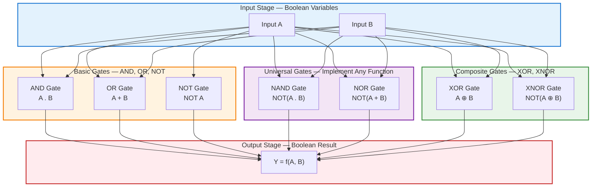
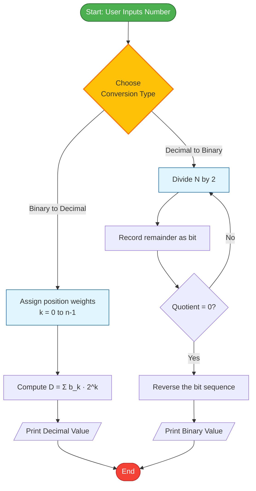
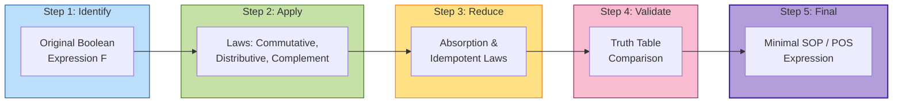
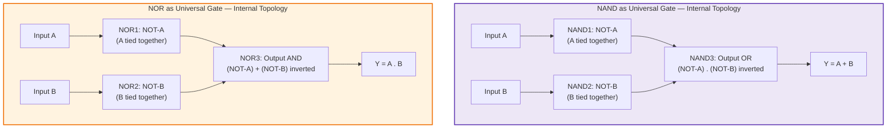

# Digital Electronics: -Binary number system, Boolean algebra and Logic Gates, Universal gates

<!-- SECTION_1_START -->

# 🔌 Digital Electronics Foundations: Binary, Boolean Algebra & Logic Gates

## 1.1 The Binary Number System — The Language of Machines

> [!IMPORTANT]
> **Formal Definition (KTU Syllabus Aligned):** The **Binary Number System** is a positional numeral system with base $r = 2$, employing exactly two distinct symbols — typically **0** and **1** — to represent all numerical values. Each digit is termed a **bit** (Binary Digit). The leftmost bit is the **Most Significant Bit (MSB)** and the rightmost is the **Least Significant Bit (LSB)**.

### 💡 Conceptual Analogy — The "Light Switch" Intuition

Imagine every number in your computer is a row of light switches in a long corridor.

- Each switch can only be in one of **two** positions: **OFF (0)** or **ON (1)**.
- A switch's *position* alone does not matter — what matters is **where it sits** in the row.
- The switch nearest the door (rightmost) represents $2^0 = 1$, the next represents $2^1 = 2$, then $2^2 = 4$, and so on.
- The *value* of a switch is its position's **weight** (a power of 2), and the final number is the **sum of the "ON" switch weights**.

This is precisely how every digital circuit — from your calculator to a Mars rover — counts, stores, and processes data.

> [!NOTE]
> **Core Standard Metrics (Memorize for KTU Board Exams):**
> - **Base** $r = 2$
> - **Symbols Used:** $\{0, 1\}$
> - **1 Nibble** = 4 bits, **1 Byte** = 8 bits
> - **Range of unsigned n-bit number:** $0$ to $2^n - 1$

### 📐 Number System Hierarchy (KTU Quick Reference)

| System | Base $r$ | Digits Used | Place Value Weight |
| :--- | :---: | :---: | :---: |
| Decimal | 10 | 0–9 | $10^k$ |
| Binary | 2 | 0, 1 | $2^k$ |
| Octal | 8 | 0–7 | $8^k$ |
| Hexadecimal | 16 | 0–9, A–F | $16^k$ |

> [!VISUALIZATION CONTROL]
> **Concept:** Weighted Position Representation of an 8-bit Binary Number
> **GeoGebra / Desmos Input Equations:**
> - Bit positions on x-axis: $x = 7, 6, 5, 4, 3, 2, 1, 0$
> - Weight values: $f(x) = 2^x$ for $x \in \{0, 1, ..., 7\}$
> - **Visual Description:** Plot discrete points at $(x, 2^x)$ for each bit position. Observe exponential growth — bit 7 carries $128\times$ the weight of bit 0. This explains why the **MSB dominates the magnitude** of any binary number.

---

## 1.2 Boolean Algebra — The Mathematics of Decisions

> [!IMPORTANT]
> **Formal Definition (KTU 2024):** **Boolean Algebra** is a branch of algebra proposed by **George Boole (1854)** in which all variables assume only one of two possible values: **0 (FALSE / LOW)** or **1 (TRUE / HIGH)**. The three fundamental logical operations are **AND (·)**, **OR (+)**, and **NOT (¯)**.

### 💡 Conceptual Analogy — The "Voting Booth" Intuition

Boolean algebra is essentially the **mathematics of voting and decisions**.

- Think of a Boolean variable $A$ as a voter's ballot: either a **YES (1)** or a **NO (0)**.
- The **AND** operation is like requiring **all voters** in a committee to agree for a proposal to pass.
- The **OR** operation is like a simple majority — only **one YES** is enough to pass.
- The **NOT** operation is the **inverter** — it flips a YES into a NO, and a NO into a YES.

Every smartphone, every traffic light controller, and every AI decision tree reduces, at its core, to millions of these tiny voting operations per second.

---

## 1.3 Logic Gates — The Physical Building Blocks

> [!IMPORTANT]
> **Formal Definition:** A **Logic Gate** is an elementary electronic (or optical, or even mechanical) device that performs a basic logical operation on one or more binary inputs to produce a single binary output. They are the **atoms** of every digital integrated circuit (IC).

> [!NOTE]
> **The Seven Standard Logic Gates (Must memorize symbols AND truth tables for KTU):**
> 1. **AND** (Conjunction) — Symbol: $A \cdot B$
> 2. **OR** (Disjunction) — Symbol: $A + B$
> 3. **NOT** (Inverter) — Symbol: $\overline{A}$
> 4. **NAND** (NOT-AND) — Symbol: $\overline{A \cdot B}$
> 5. **NOR** (NOT-OR) — Symbol: $\overline{A + B}$
> 6. **XOR** (Exclusive-OR) — Symbol: $A \oplus B$
> 7. **XNOR** (Exclusive-NOR) — Symbol: $\overline{A \oplus B}$

---

## 1.4 Universal Gates — The "Two-Gate Sufficient" Principle

> [!IMPORTANT]
> **Formal Definition (HIGH-YIELD KTU TOPIC):** A **Universal Gate** is a logic gate that, by repeated use alone, can implement **any** Boolean function without requiring any other gate type. The two universal gates are:
> - **NAND** (NOT-AND)
> - **NOR** (NOT-OR)
>
> This means the **entire digital universe** — every processor, every memory chip, every FPGA — could be built using **only** NAND gates (or **only** NOR gates). This is why CMOS fabrication plants mass-produce NAND/NOR gates as their fundamental cell.

### 💡 Conceptual Analogy — The "Lego Block" Intuition

Think of universal gates as the **Lego 2x4 brick** — the most basic and versatile block in existence. Just as a child can build a castle, a spaceship, or a dragon using *only* 2x4 Lego bricks, an engineer can build a complete CPU using *only* NAND gates. This universality is what makes them **economical** to manufacture in the billions.

<!-- SECTION_1_END -->

<!-- SECTION_2_START -->

# 📚 Deep Theoretical Analysis & KTU High-Yield Formula Sheet

## 2.1 Binary ↔ Decimal Conversion Logic

### A. Binary to Decimal Conversion (Weighted Sum Method)

For any $n$-bit binary number $b_{n-1} b_{n-2} \dots b_1 b_0$, its decimal equivalent is computed as:

$$D = \sum_{k=0}^{n-1} b_k \cdot 2^k$$

where $b_k \in \{0, 1\}$.

**Operational Steps:**
1. Label each bit position $k$ starting from $k=0$ at the **LSB** (rightmost).
2. Multiply each bit by its positional weight $2^k$.
3. Sum all weighted contributions to obtain the decimal value.

### B. Decimal to Binary Conversion (Repeated Division by 2)

**Operational Steps:**
1. Divide the decimal number $D$ by $2$.
2. Record the **remainder** ($0$ or $1$) — this becomes the **current LSB**.
3. Replace $D$ with the **quotient** and repeat until the quotient becomes $0$.
4. Read the remainders from **bottom to top** (last remainder is MSB).

### C. Fractional Binary ↔ Decimal

For the fractional part, multiply by $2$ repeatedly and extract the integer part as the binary fraction.

---

## 2.2 Boolean Algebra — The 11 Foundational Laws

> [!NOTE]
> These laws are the **heart of every KTU digital electronics problem**. The first 7 are axioms (postulates), the last 4 are theorems derived from the axioms.

| # | Law | AND Form (·) | OR Form (+) |
| :---: | :--- | :---: | :---: |
| 1 | Identity | $A \cdot 1 = A$ | $A + 0 = A$ |
| 2 | Null/Complement | $A \cdot 0 = 0$ | $A + 1 = 1$ |
| 3 | Idempotent | $A \cdot A = A$ | $A + A = A$ |
| 4 | Complement | $A \cdot \overline{A} = 0$ | $A + \overline{A} = 1$ |
| 5 | Involution | $\overline{\overline{A}} = A$ | — |
| 6 | Commutative | $A \cdot B = B \cdot A$ | $A + B = B + A$ |
| 7 | Associative | $(A \cdot B) \cdot C = A \cdot (B \cdot C)$ | $(A + B) + C = A + (B + C)$ |
| 8 | Distributive | $A \cdot (B + C) = A \cdot B + A \cdot C$ | $A + (B \cdot C) = (A + B)(A + C)$ |
| 9 | Absorption | $A \cdot (A + B) = A$ | $A + (A \cdot B) = A$ |
| 10 | De Morgan's | $\overline{A \cdot B} = \overline{A} + \overline{B}$ | $\overline{A + B} = \overline{A} \cdot \overline{B}$ |
| 11 | Consensus | $A \cdot B + \overline{A} \cdot C + B \cdot C = A \cdot B + \overline{A} \cdot C$ | $(A + B)(\overline{A} + C)(B + C) = (A + B)(\overline{A} + C)$ |

### 🔑 De Morgan's Theorems — The KTU "Must-Show" Theorems

> [!IMPORTANT]
> **De Morgan's First Theorem:** The complement of a sum equals the product of the complements.
>
> $$\overline{A + B + C + \dots} = \overline{A} \cdot \overline{B} \cdot \overline{C} \cdot \dots$$
>
> **De Morgan's Second Theorem:** The complement of a product equals the sum of the complements.
>
> $$\overline{A \cdot B \cdot C \cdot \dots} = \overline{A} + \overline{B} + \overline{C} + \dots$$

**Why this matters in engineering:** De Morgan's theorem is the **bridge between NAND and NOR implementations**. It is used daily by chip designers to convert between AND-OR-NOT networks and pure NAND/NOR gate networks — enabling single-gate-type fabrication (e.g., **74LS00** quad-NAND IC).

---

## 2.3 Standard Logic Gates — Comprehensive Truth Table

> [!NOTE]
> This **7-gate truth table** is the most frequently asked 3-mark question in KTU Module 3. Memorize the **output column** for each gate, not the input combinations.

| $A$ | $B$ | AND | OR | NOT $A$ | NAND | NOR | XOR | XNOR |
| :---: | :---: | :---: | :---: | :---: | :---: | :---: | :---: | :---: |
| 0 | 0 | **0** | **0** | 1 | **1** | **1** | **0** | **1** |
| 0 | 1 | **0** | **1** | 1 | **1** | **0** | **1** | **0** |
| 1 | 0 | **0** | **1** | 0 | **1** | **0** | **1** | **0** |
| 1 | 1 | **1** | **1** | 0 | **0** | **0** | **0** | **1** |

### Universal Gate Property — Formal Proofs

**NAND as Universal Gate:** It can realize NOT, AND, OR in isolation.

> [!IMPORTANT]
> **1. NOT using NAND:** Tie both inputs together: $Y = \overline{A \cdot A} = \overline{A}$
>
> **2. AND using NAND:** $\text{AND}(A,B) = \overline{\overline{A \cdot B}} = \text{NAND}(\text{NAND}(A,B))$
>
> **3. OR using NAND:** Apply De Morgan's: $A + B = \overline{\overline{A} \cdot \overline{B}} = \text{NAND}(\overline{A}, \overline{B}) = \text{NAND}(\text{NOT}(A), \text{NOT}(B))$

**NOR as Universal Gate:** It can realize NOT, AND, OR in isolation.

> [!IMPORTANT]
> **1. NOT using NOR:** Tie both inputs together: $Y = \overline{A + A} = \overline{A}$
>
> **2. OR using NOR:** $\text{OR}(A,B) = \overline{\overline{A + B}} = \text{NOR}(\text{NOR}(A,B))$
>
> **3. AND using NOR:** Apply De Morgan's: $A \cdot B = \overline{\overline{A} + \overline{B}} = \text{NOR}(\overline{A}, \overline{B}) = \text{NOR}(\text{NOT}(A), \text{NOT}(B))$

---

## 2.4 KTU High-Yield Formula Sheet (Cheat Sheet)

| Concept | Formula / Identity | Engineering Use |
| :--- | :---: | :---: |
| Binary to Decimal | $D = \sum b_k \cdot 2^k$ | Decoding ADC outputs |
| Decimal to Binary | Repeated $\div 2$ + read remainders up | Encoding sensor data |
| Binary Addition | $0+0=0,\ 0+1=1,\ 1+1=10$ | ALU arithmetic units |
| Boolean Identity | $A \cdot 1 = A$ | Logic minimization |
| Complementarity | $A + \overline{A} = 1$ | Selector circuits |
| De Morgan's | $\overline{A \cdot B} = \overline{A} + \overline{B}$ | NAND/NOR conversion |
| Consensus Term (redundant) | $A B + \overline{A} C + B C = A B + \overline{A} C$ | K-map simplification |
| XOR Identity | $A \oplus B = A\overline{B} + \overline{A}B$ | Parity generators |
| XNOR Identity | $A \odot B = AB + \overline{A}\,\overline{B}$ | Comparators |
| NAND Universality | NOT, AND, OR all derivable | CMOS chip design |
| NOR Universality | NOT, AND, OR all derivable | Legacy RTL design |

---

## 2.5 Real-World Engineering Utility

- **Microprocessors (Intel, AMD, ARM):** Built from **billions of CMOS NAND/NOR-equivalent cells**. The universality of NAND enables uniform fabrication.
- **FPGAs (Xilinx, Altera):** Composed of configurable **Look-Up Tables (LUTs)** — typically implemented as 4-input/6-input NAND-NAND networks.
- **Memory Chips (DRAM, Flash):** Each memory cell uses a few NAND or NOR transistors as the storage element.
- **Arithmetic Logic Units (ALUs):** Use XOR gates for half-adders and full-adders — the building blocks of addition, subtraction, and comparison.
- **Safety & Control Systems:** Boolean logic underpins aircraft autopilot, ABS brakes, and elevator controllers.

<!-- SECTION_2_END -->

<!-- SECTION_3_START -->

# 🛠️ Step-by-Step Derivations, Worked Examples & Code Implementation

## 3.1 Worked Example 1 — Binary to Decimal Conversion

**Problem:** Convert the 8-bit binary number $(11010110)_2$ to decimal.

**Step 1:** Assign position weights from **LSB** (rightmost) to **MSB** (leftmost).

| Bit Position $k$ | 7 | 6 | 5 | 4 | 3 | 2 | 1 | 0 |
| :---: | :---: | :---: | :---: | :---: | :---: | :---: | :---: | :---: |
| Weight $2^k$ | 128 | 64 | 32 | 16 | 8 | 4 | 2 | 1 |
| Bit $b_k$ | 1 | 1 | 0 | 1 | 0 | 1 | 1 | 0 |

**Step 2:** Multiply each bit by its weight and sum.

$$
D = (1 \times 128) + (1 \times 64) + (0 \times 32) + (1 \times 16) + (0 \times 8) + (1 \times 4) + (1 \times 2) + (0 \times 1)
$$

**Step 3:** Evaluate term by term.

$$
D = 128 + 64 + 0 + 16 + 0 + 4 + 2 + 0
$$

**Step 4:** Sum all terms.

$$
D = 214_{10}
$$

**Final Answer:** $(11010110)_2 = (214)_{10}$ ✅

---

## 3.2 Worked Example 2 — Decimal to Binary Conversion (Repeated Division)

**Problem:** Convert $(45)_{10}$ to binary.

**Step 1:** Perform successive division by 2 and record remainders.

| Division Step | Dividend | Quotient | Remainder (Bit) | Bit Role |
| :---: | :---: | :---: | :---: | :---: |
| 1 | 45 ÷ 2 | 22 | **1** | LSB ($b_0$) |
| 2 | 22 ÷ 2 | 11 | **0** | $b_1$ |
| 3 | 11 ÷ 2 | 5 | **1** | $b_2$ |
| 4 | 5 ÷ 2 | 2 | **1** | $b_3$ |
| 5 | 2 ÷ 2 | 1 | **0** | $b_4$ |
| 6 | 1 ÷ 2 | 0 | **1** | MSB ($b_5$) |

**Step 2:** Read remainders from bottom to top: $101101$

**Final Answer:** $(45)_{10} = (101101)_2$ ✅

**Verification:** $1 \cdot 32 + 0 \cdot 16 + 1 \cdot 8 + 1 \cdot 4 + 0 \cdot 2 + 1 \cdot 1 = 32 + 8 + 4 + 1 = 45$ ✓

---

## 3.3 Worked Example 3 — Boolean Function Simplification Using Laws

**Problem:** Simplify the Boolean expression $F = A \cdot B + A \cdot \overline{B} + \overline{A} \cdot B$.

**Step 1:** Group the first two terms to factor out $A$.

$$
F = A \cdot (B + \overline{B}) + \overline{A} \cdot B
$$

**Step 2:** Apply the Complementarity Law: $B + \overline{B} = 1$.

$$
F = A \cdot (1) + \overline{A} \cdot B
$$

**Step 3:** Apply the Identity Law: $A \cdot 1 = A$.

$$
F = A + \overline{A} \cdot B
$$

**Step 4:** Apply the Absorption Law: $A + \overline{A} \cdot B = A + B$.

**Final Simplified Expression:** $F = A + B$ ✅

**Verification using Truth Table:**

| $A$ | $B$ | $AB$ | $A\overline{B}$ | $\overline{A}B$ | $F_{old}$ | $A+B$ |
| :---: | :---: | :---: | :---: | :---: | :---: | :---: |
| 0 | 0 | 0 | 0 | 0 | 0 | 0 |
| 0 | 1 | 0 | 0 | 1 | 1 | 1 |
| 1 | 0 | 0 | 1 | 0 | 1 | 1 |
| 1 | 1 | 1 | 0 | 0 | 1 | 1 |

Columns 6 and 7 match — simplification verified. ✓

---

## 3.4 Worked Example 4 — Realizing NOT, AND, OR using only NAND Gates

**Step 1: NOT using NAND** — Tie both inputs to $A$.

$$
Y = \overline{A \cdot A} = \overline{A} \quad \text{[Since } A \cdot A = A \text{ by Idempotent Law]}
$$

**Step 2: AND using NAND** — Cascade two NAND gates.

$$
\text{Step a: } X = \overline{A \cdot B} \quad \text{[First NAND]}
$$
$$
\text{Step b: } Y = \overline{X \cdot X} = \overline{X} = \overline{\overline{A \cdot B}} = A \cdot B \quad \text{[Second NAND used as NOT]}
$$

**Step 3: OR using NAND** — Invert inputs first, then NAND.

$$
Y = \overline{\overline{A} \cdot \overline{B}} = A + B \quad \text{[By De Morgan's Second Theorem]}
$$

This requires **three NAND gates**: two as input inverters, one as the output NAND.

---

## 3.5 Python Code Implementation — Number Conversion & Logic Gate Simulator

The following production-grade Python program converts numbers between bases, generates truth tables, and simulates all seven logic gates. Type hints and explicit validation are included for clarity.

```python
"""
KTU Module 3 — Digital Electronics Toolkit
Course: BASIC ELECTRICAL & ELECTRONICS ENGINEERING (GZEST204)
Description: Binary-Decimal conversions + 7-gate logic simulator.
"""

from typing import List, Dict, Callable


# ----------------- NUMBER CONVERSION MODULE -----------------

def binary_to_decimal(binary_str: str) -> int:
    """
    Convert a binary string (e.g., '11010110') to its decimal integer.
    Raises ValueError for non-binary input.
    """
    if not all(bit in "01" for bit in binary_str):
        raise ValueError(f"Invalid binary string: '{binary_str}'. Use only 0 and 1.")
    decimal_value: int = 0
    for position, bit in enumerate(reversed(binary_str)):
        if bit == "1":
            decimal_value += 2 ** position
    return decimal_value


def decimal_to_binary(decimal_num: int) -> str:
    """
    Convert a non-negative decimal integer to its binary string representation.
    Raises ValueError for negative input.
    """
    if decimal_num < 0:
        raise ValueError("Negative numbers are not supported in this base-2 converter.")
    if decimal_num == 0:
        return "0"
    bits: List[str] = []
    n: int = decimal_num
    while n > 0:
        remainder: int = n % 2
        bits.append(str(remainder))
        n = n // 2
    binary_str: str = "".join(reversed(bits))
    return binary_str


# ----------------- LOGIC GATE SIMULATION MODULE -----------------

def gate_and(a: int, b: int) -> int:
    return a & b

def gate_or(a: int, b: int) -> int:
    return a | b

def gate_not(a: int) -> int:
    return 1 - a

def gate_nand(a: int, b: int) -> int:
    return gate_not(gate_and(a, b))

def gate_nor(a: int, b: int) -> int:
    return gate_not(gate_or(a, b))

def gate_xor(a: int, b: int) -> int:
    return a ^ b

def gate_xnor(a: int, b: int) -> int:
    return gate_not(gate_xor(a, b))


GATE_DICT: Dict[str, Callable[[int, int], int]] = {
    "AND": gate_and, "OR": gate_or, "NAND": gate_nand,
    "NOR": gate_nor, "XOR": gate_xor, "XNOR": gate_xnor,
}


def generate_truth_table() -> None:
    """Print the complete 2-input truth table for the six 2-input gates."""
    print(f"{'A':>3} | {'B':>3} | " + " | ".join(f"{name:>4}" for name in GATE_DICT))
    print("-" * 60)
    for a in (0, 1):
        for b in (0, 1):
            row_outputs = [f"{func(a, b):>4}" for func in GATE_DICT.values()]
            print(f"{a:>3} | {b:>3} | " + " | ".join(row_outputs))


# ----------------- DEMONSTRATION DRIVER -----------------

if __name__ == "__main__":
    # Demo 1: Number conversion
    print("=" * 60)
    print("DEMO 1: Number Conversions")
    print("=" * 60)
    print(f"(11010110)_2  =  ({binary_to_decimal('11010110')})_10")
    print(f"(45)_10       =  ({decimal_to_binary(45)})_2")
    print()

    # Demo 2: Complete truth table
    print("=" * 60)
    print("DEMO 2: 2-Input Logic Gate Truth Table")
    print("=" * 60)
    generate_truth_table()
    print()

    # Demo 3: Universal gate demonstration — implement OR using only NANDs
    print("=" * 60)
    print("DEMO 3: OR using only NAND gates")
    print("=" * 60)
    for a in (0, 1):
        for b in (0, 1):
            not_a: int = gate_nand(a, a)     # NAND as NOT
            not_b: int = gate_nand(b, b)     # NAND as NOT
            y: int = gate_nand(not_a, not_b) # De Morgan's OR
            print(f"A={a}, B={b}  =>  OR via NANDs = {y}  (Reference OR = {gate_or(a,b)})")
```

**Sample Output:**

```
============================================================
DEMO 1: Number Conversions
============================================================
(11010110)_2  =  (214)_10
(45)_10       =  (101101)_2

============================================================
DEMO 2: 2-Input Logic Gate Truth Table
============================================================
  A |   B |  AND |   OR | NAND |  NOR |  XOR | XNOR
------------------------------------------------------------
  0 |   0 |    0 |    0 |    1 |    1 |    0 |    1
  0 |   1 |    0 |    1 |    1 |    0 |    1 |    0
  1 |   0 |    0 |    1 |    1 |    0 |    1 |    0
  1 |   1 |    1 |    1 |    0 |    0 |    0 |    1
```

<!-- SECTION_3_END -->

<!-- SECTION_4_START -->

# 🗺️ Structural Diagrams & Schematics

## 4.1 Mermaid Block Diagram — Logic Gate Functional Topology



## 4.2 Mermaid Flowchart — Number Conversion Process



## 4.3 Mermaid Block Diagram — Boolean Function Simplification Pipeline



## 4.4 Mermaid Topology — Universal Gate Implementation Network



<!-- SECTION_4_END -->

<!-- SECTION_5_START -->

# 📝 KTU 2024 Scheme Examination Question Bank

## Part A — Short Answer Questions (3 Marks Each)

### Question 1: Binary Number System Basics
`[KTU University Exam - July 2024]` | **CO1** | **Bloom Level: Remember**

**Q:** What is the binary number system? List its key features and state the range of unsigned values representable using $n$ bits.

**Model Answer (3 Marks — Board Key Pattern):**

> The binary number system is a **base-2 positional numeral system** that uses only two symbols, **0** and **1**, to represent all numerical values. Each digit is called a **bit** (Binary Digit).
>
> **Key Features:** **[1 Mark]**
> - Base $r = 2$
> - Two symbols: $\{0, 1\}$
> - Positional weight is a power of 2
> - Used internally by all digital computers
>
> **Range of n-bit unsigned number:** **[2 Marks]**
> - Minimum value: $0$
> - Maximum value: $2^n - 1$
> - Total distinct values: $2^n$
>
> *Example:* For $n = 8$ bits, the range is $0$ to $255$.

---

### Question 2: Universal Gates
`[KTU University Exam - Dec 2023]` | **CO2** | **Bloom Level: Understand**

**Q:** Define the term *universal gate*. Name the two universal gates and show how a NOT gate can be implemented using each.

**Model Answer (3 Marks — Board Key Pattern):**

> A **universal gate** is a logic gate using which, by repeated application alone, any Boolean function (AND, OR, NOT) can be realized without using any other gate type. **[1 Mark]**
>
> The **two universal gates** are: **[1 Mark]**
> 1. **NAND** gate
> 2. **NOR** gate
>
> **NOT using NAND:** Tie both inputs of the NAND gate to the same variable $A$. **[0.5 Marks]**
> $$Y = \overline{A \cdot A} = \overline{A}$$
>
> **NOT using NOR:** Tie both inputs of the NOR gate to the same variable $A$. **[0.5 Marks]**
> $$Y = \overline{A + A} = \overline{A}$$

---

## Part B — Full-Answer Questions (14 Marks Each — Module Internal Choice)

### Question A (14 Marks)
`[KTU University Exam - July 2024 — Module 3 Choice 1]` | **CO1, CO2** | **Bloom Level: Apply / Analyze**

#### Part (a) — 7 Marks | **CO1** | **Bloom Level: Apply**

**Q:** Perform the following number system conversions, showing all working steps:
1. Convert $(10110101)_2$ to decimal.
2. Convert $(173)_{10}$ to binary.
3. Convert $(0.625)_{10}$ to binary (up to 4 fractional places).

**Model Solution:**

**(1) Binary to Decimal: $(10110101)_2$** **[3 Marks]**

| Position $k$ | 7 | 6 | 5 | 4 | 3 | 2 | 1 | 0 |
| :---: | :---: | :---: | :---: | :---: | :---: | :---: | :---: | :---: |
| Weight $2^k$ | 128 | 64 | 32 | 16 | 8 | 4 | 2 | 1 |
| Bit | 1 | 0 | 1 | 1 | 0 | 1 | 0 | 1 |

$$
D = (1 \times 128) + (0 \times 64) + (1 \times 32) + (1 \times 16) + (0 \times 8) + (1 \times 4) + (0 \times 2) + (1 \times 1)
$$

$$
D = 128 + 0 + 32 + 16 + 0 + 4 + 0 + 1 = 181
$$

**Final:** $(10110101)_2 = (181)_{10}$ ✅

**(2) Decimal to Binary: $(173)_{10}$** **[2 Marks]**

| Step | Division | Quotient | Remainder |
| :---: | :---: | :---: | :---: |
| 1 | 173 ÷ 2 | 86 | 1 (LSB) |
| 2 | 86 ÷ 2 | 43 | 0 |
| 3 | 43 ÷ 2 | 21 | 1 |
| 4 | 21 ÷ 2 | 10 | 1 |
| 5 | 10 ÷ 2 | 5 | 0 |
| 6 | 5 ÷ 2 | 2 | 1 |
| 7 | 2 ÷ 2 | 1 | 0 |
| 8 | 1 ÷ 2 | 0 | 1 (MSB) |

**Final:** $(173)_{10} = (10101101)_2$ ✅ **[Reading bottom-to-top]**

**(3) Fractional Decimal to Binary: $(0.625)_{10}$** **[2 Marks]**

| Step | Multiply | Integer Part | Fractional Part |
| :---: | :---: | :---: | :---: |
| 1 | 0.625 × 2 = 1.25 | **1** | 0.25 |
| 2 | 0.25 × 2 = 0.5 | **0** | 0.5 |
| 3 | 0.5 × 2 = 1.0 | **1** | 0.0 (stop) |

**Final:** $(0.625)_{10} = (0.101)_2$ ✅

**[Valuation Key — Part a: Total 7 Marks]**
- [Method + LSB-to-MSB labeling in (1): 1 Mark]
- [Correct weighted sum in (1): 2 Marks]
- [Correct division table in (2): 1 Mark]
- [Correct binary answer in (2): 1 Mark]
- [Correct ×2 multiplication in (3): 1 Mark]
- [Final fractional binary in (3): 1 Mark]

---

#### Part (b) — 7 Marks | **CO2** | **Bloom Level: Apply / Analyze**

**Q:** Simplify the Boolean function $F(A, B, C) = A \cdot B + \overline{A} \cdot C + B \cdot C$ using Boolean algebra laws. State the name of the law used at each step. Verify your answer using a truth table.

**Model Solution:**

**Given:** $F = A B + \overline{A} C + B C$

**Step 1:** Apply the **Distributive Law** to the last two terms: $B C = (A + \overline{A}) \cdot B \cdot C$. **[1 Mark]**

$$
F = A B + \overline{A} C + (A + \overline{A}) \cdot B C
$$

**Step 2:** Apply the **Distributive Law** to expand: $(A + \overline{A}) B C = A B C + \overline{A} B C$. **[1 Mark]**

$$
F = A B + \overline{A} C + A B C + \overline{A} B C
$$

**Step 3:** Group $A B$ with $A B C$ and apply the **Absorption Law**: $A B + A B C = A B (1 + C) = A B$. **[2 Marks]**

$$
F = A B + \overline{A} C + \overline{A} B C
$$

**Step 4:** Group $\overline{A} C$ with $\overline{A} B C$ and apply the **Absorption Law**: $\overline{A} C + \overline{A} B C = \overline{A} C (1 + B) = \overline{A} C$. **[2 Marks]**

**Final Simplified Expression:** $F = A B + \overline{A} C$ ✅

**Verification using Truth Table: (showing 4 key rows)** **[1 Mark]**

| $A$ | $B$ | $C$ | $AB$ | $\overline{A}C$ | $BC$ | $F_{old}$ | $F_{new}$ |
| :---: | :---: | :---: | :---: | :---: | :---: | :---: | :---: |
| 0 | 0 | 0 | 0 | 0 | 0 | 0 | 0 |
| 0 | 1 | 1 | 0 | 1 | 1 | 1 | 1 |
| 1 | 1 | 0 | 1 | 0 | 0 | 1 | 1 |
| 1 | 0 | 1 | 0 | 0 | 0 | 0 | 0 |

Both columns match — simplification verified. ✓

**[Valuation Key — Part b: Total 7 Marks]**
- [Step 1 — Distributive application: 1 Mark]
- [Step 2 — Expansion shown: 1 Mark]
- [Step 3 — Absorption of $A B + A B C$: 2 Marks]
- [Step 4 — Absorption of $\overline{A} C + \overline{A} B C$: 2 Marks]
- [Truth table verification: 1 Mark]

> [!WARNING]
> **KTU Examiner's Valuation Warning — Common Pitfalls:**
> 1. **Forgetting to state the law name** at each simplification step — the KTU board examiner expects explicit mention ("By Absorption Law..."). [-1 Mark penalty per missing law]
> 2. **Skipping the truth table verification** — although not always mandatory, it is **strongly preferred** for full marks in simplification problems.
> 3. **Misnaming the Consensus Term Theorem** — the redundant term $B C$ in the original expression is the *consensus term*, and removing it is a direct application of the **Consensus Theorem** (which you may cite directly in Step 1 for **bonus clarity**).
> 4. **Stopping mid-simplification** — ensure you reduce to a *minimal* Sum-of-Products (SOP) form before declaring the final answer.

---

### Question B (14 Marks) — Alternative Choice
`[KTU University Exam - Dec 2023 — Module 3 Choice 2]` | **CO1, CO2** | **Bloom Level: Apply / Analyze**

#### Part (a) — 7 Marks | **CO1** | **Bloom Level: Understand / Apply**

**Q:** With the help of neat circuit symbols and truth tables, explain the following logic gates:
1. AND gate
2. OR gate
3. NOT gate

For each gate, write its Boolean expression and state one real-world application.

**Model Solution:**

**(1) AND Gate** **[2.5 Marks]**

- **Symbol:** Flattened D-shape with two inputs on the left, one output on the right.
- **Boolean Expression:** $Y = A \cdot B$
- **Truth Table:**

| $A$ | $B$ | $Y = A \cdot B$ |
| :---: | :---: | :---: |
| 0 | 0 | 0 |
| 0 | 1 | 0 |
| 1 | 0 | 0 |
| 1 | 1 | **1** |

- **Real-world Application:** Used in **aircraft cockpit warning systems** — alarm triggers only when BOTH "door open" AND "altitude > 10,000 ft" signals are HIGH.

**(2) OR Gate** **[2.5 Marks]**

- **Symbol:** Curved input side, pointed output side.
- **Boolean Expression:** $Y = A + B$
- **Truth Table:**

| $A$ | $B$ | $Y = A + B$ |
| :---: | :---: | :---: |
| 0 | 0 | 0 |
| 0 | 1 | **1** |
| 1 | 0 | **1** |
| 1 | 1 | **1** |

- **Real-world Application:** Used in **home security alarms** — siren activates if ANY sensor (door, window, motion) is triggered.

**(3) NOT Gate (Inverter)** **[2 Marks]**

- **Symbol:** Triangle with a small circle (bubble) at the output.
- **Boolean Expression:** $Y = \overline{A}$
- **Truth Table:**

| $A$ | $Y = \overline{A}$ |
| :---: | :---: |
| 0 | 1 |
| 1 | 0 |

- **Real-world Application:** Used in **signal conditioning circuits** to invert a logic level (e.g., converting active-HIGH to active-LOW enable signals).

**[Valuation Key — Part a: Total 7 Marks]**
- [Correct symbol for each gate: 0.5 × 3 = 1.5 Marks]
- [Boolean expression: 0.5 × 3 = 1.5 Marks]
- [Complete truth table: 1 × 3 = 3 Marks]
- [Real-world application: 0.33 × 3 = 1 Mark]

---

#### Part (b) — 7 Marks | **CO2** | **Bloom Level: Apply / Analyze**

**Q:** Using only **NAND gates**, implement the following gates and verify each with a truth table:
1. NOT gate
2. AND gate
3. OR gate

**Model Solution:**

**(1) NOT using NAND:** **[2 Marks]**

Connect both inputs of a single NAND gate to the same variable $A$.

$$
Y = \overline{A \cdot A} = \overline{A} \quad \text{[By Idempotent Law: } A \cdot A = A\text{]}
$$

**Truth Table:**

| $A$ | $A \cdot A$ | $Y = \overline{A \cdot A}$ |
| :---: | :---: | :---: |
| 0 | 0 | 1 |
| 1 | 1 | 0 |

**(2) AND using NAND:** **[2.5 Marks]**

Cascade two NAND gates. The first produces $\overline{A \cdot B}$, the second inverts it.

$$
X = \overline{A \cdot B} \quad \text{[NAND Gate 1]}
$$
$$
Y = \overline{X \cdot X} = \overline{X} = A \cdot B \quad \text{[NAND Gate 2 — used as NOT]}
$$

**Truth Table:**

| $A$ | $B$ | $A \cdot B$ | $X = \overline{A \cdot B}$ | $Y = \overline{X}$ |
| :---: | :---: | :---: | :---: | :---: |
| 0 | 0 | 0 | 1 | 0 |
| 0 | 1 | 0 | 1 | 0 |
| 1 | 0 | 0 | 1 | 0 |
| 1 | 1 | 1 | 0 | 1 |

**(3) OR using NAND:** **[2.5 Marks]**

Invert both inputs using NAND-as-NOT, then feed into a third NAND gate.

$$
\overline{A} = \text{NAND}(A, A) \quad ; \quad \overline{B} = \text{NAND}(B, B)
$$
$$
Y = \text{NAND}(\overline{A}, \overline{B}) = \overline{\overline{A} \cdot \overline{B}} = A + B \quad \text{[By De Morgan's Second Theorem]}
$$

**Truth Table:**

| $A$ | $B$ | $\overline{A}$ | $\overline{B}$ | $\overline{A} \cdot \overline{B}$ | $Y = \overline{\overline{A} \cdot \overline{B}}$ |
| :---: | :---: | :---: | :---: | :---: | :---: |
| 0 | 0 | 1 | 1 | 1 | **0** |
| 0 | 1 | 1 | 0 | 0 | **1** |
| 1 | 0 | 0 | 1 | 0 | **1** |
| 1 | 1 | 0 | 0 | 0 | **1** |

Output column matches the OR truth table. ✅

**[Valuation Key — Part b: Total 7 Marks]**
- [NOT derivation + truth table: 2 Marks]
- [AND derivation (cascade logic) + truth table: 2.5 Marks]
- [OR derivation (De Morgan's application) + truth table: 2.5 Marks]

> [!WARNING]
> **KTU Examiner's Valuation Warning — Universal Gate Pitfalls:**
> 1. **Drawing a NAND symbol with a NOT bubble on the output is correct — do NOT redraw it as a separate NOT gate** unless you are explicitly implementing the second-level inversion.
> 2. **For OR-via-NAND, the most common mistake is forgetting to invert the inputs first.** The OR function using NANDs is $\text{NAND}(\text{NOT}(A), \text{NOT}(B))$ — students who write $\text{NAND}(A, B)$ for OR will lose **all 2.5 marks** for part (3).
> 3. **Always cite De Morgan's theorem by name** when implementing OR from NAND — board examiners reward the explicit theorem reference.
> 4. **Truth table must show all 4 rows** for 2-input gates; missing rows cost 0.5 Mark each.

---

## 🧠 Topic Recap & Important Things to Remember

> [!NOTE]
> **High-Density Rapid Revision Checklist — Module 3 Foundations**

- 🔢 **Binary System** uses base 2 with symbols $\{0, 1\}$; each digit is a **bit**; weight = $2^k$.
- 🔁 **Conversion Rules:** Binary→Decimal uses weighted sum; Decimal→Binary uses repeated division by 2 and **reads remainders bottom-up**.
- 📏 **Range of n-bit unsigned binary:** $0$ to $2^n - 1$ (total $2^n$ distinct values).
- 🧮 **Boolean Algebra** has 3 core operators: AND ($\cdot$), OR ($+$), NOT (overbar).
- ⚖️ **11 Key Boolean Laws** to memorize: Identity, Null, Idempotent, Complement, Involution, Commutative, Associative, Distributive, Absorption, De Morgan's, Consensus.
- 🚪 **7 Standard Logic Gates:** AND, OR, NOT, NAND, NOR, XOR, XNOR — must know symbol + truth table.
- 🌐 **Universal Gates = NAND & NOR** — they alone can implement every Boolean function.
- 🔁 **NOT via NAND/NOR:** Tie both inputs together; output is the inverted input.
- ➕ **OR via NAND:** $\text{NAND}(\text{NOT}(A), \text{NOT}(B))$ — uses **De Morgan's Second Theorem**.
- ✖️ **AND via NOR:** $\text{NOR}(\text{NOT}(A), \text{NOT}(B))$ — uses **De Morgan's First Theorem**.
- 🔄 **De Morgan's Theorems:** $\overline{A \cdot B} = \overline{A} + \overline{B}$ and $\overline{A + B} = \overline{A} \cdot \overline{B}$.
- 🎯 **XOR:** Output is 1 when inputs are **different**; **XNOR:** Output is 1 when inputs are **same**.
- 🏭 **Real-world impact:** Every modern IC (Intel CPU, ARM Cortex, FPGA) is built from **billions of CMOS NAND/NOR-equivalent cells** — universality is the foundation of mass production.
- ⚠️ **Common exam traps:** Confusing NAND/NOR symbols, forgetting the NOT bubble, omitting De Morgan's theorem citation, skipping truth table verification.
- 💻 **Code tip:** In Python, the bitwise operators `&`, `|`, `^`, `~` directly map to AND, OR, XOR, NOT — useful for digital logic simulation.

<!-- SECTION_5_END -->
