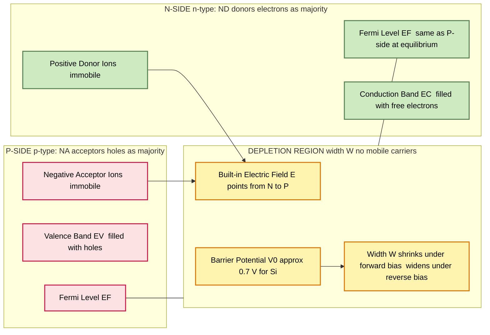
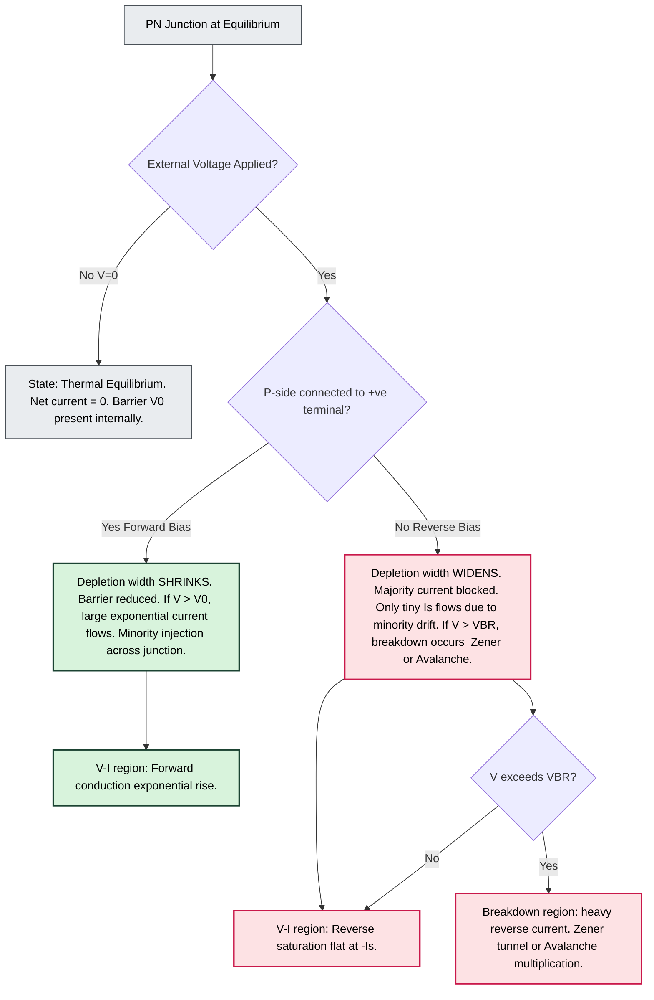
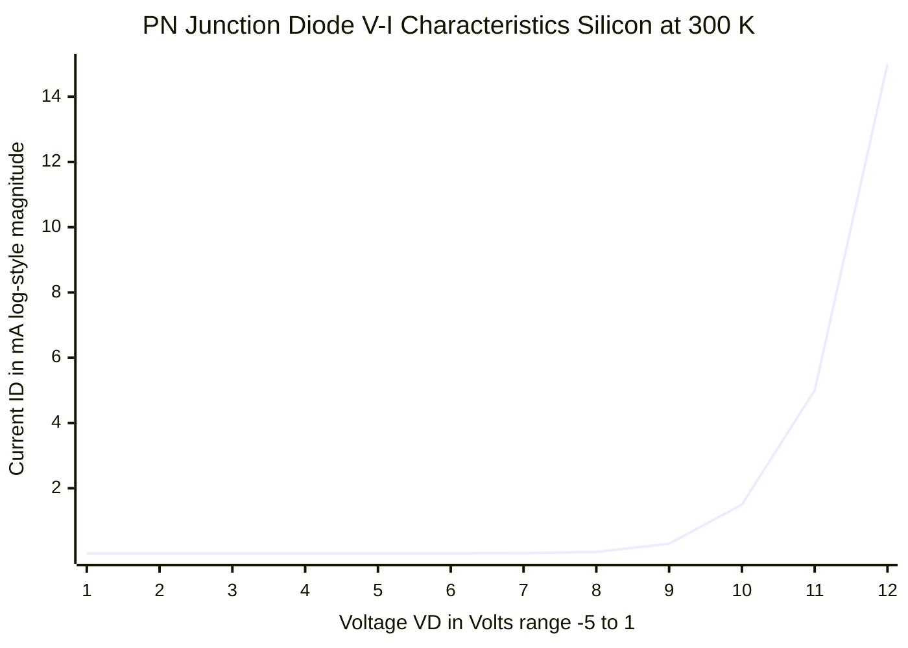
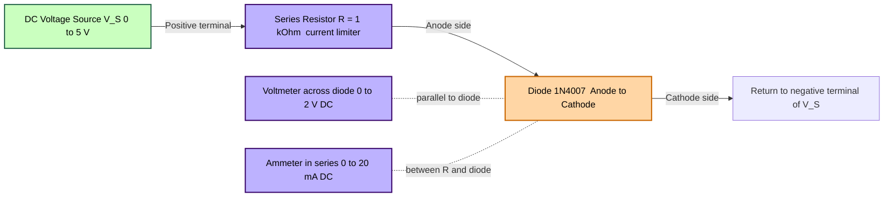

# PN Junction diode: - Principle of operation, V-I characteristics

<!-- SECTION_1_START -->

# PN Junction Diode: Principle of Operation & V-I Characteristics

## 1. Core Technical Definition

A **PN Junction Diode** is the most fundamental two-terminal semiconductor device, formed when a **p-type semiconductor** (rich in holes as majority carriers) is metallurgically joined to an **n-type semiconductor** (rich in electrons as majority carriers) within a single monocrystalline silicon or germanium crystal. The resulting interface exhibits strong **non-linear, asymmetric current-voltage (V-I) characteristics**, allowing current to flow freely in one direction (forward bias) while strongly suppressing it in the opposite direction (reverse bias). This rectifying property makes it the foundational building block of almost every electronic circuit—from power supplies and signal demodulators to logic gates and solar cells.

> [!IMPORTANT]
> **KTU 2024 Syllabus Highlight (GZEST204 - Module 3):**
> Students must be able to (a) draw and explain the formation of the depletion region, (b) state the barrier potential for Si (~0.7 V) and Ge (~0.3 V), and (c) sketch and interpret the forward and reverse V-I characteristics, identifying the knee voltage, reverse saturation current, and breakdown region.

> [!NOTE]
> **Standard Physical Constants (must be memorized)**
> - Thermal Voltage at 300 K: $V_T = \dfrac{kT}{q} \approx \mathbf{25.85 \; mV}$ (often approximated as **26 mV**).
> - Boltzmann Constant: $k = 1.38 \times 10^{-23} \; \text{J/K}$.
> - Electron Charge: $q = 1.6 \times 10^{-19} \; \text{C}$.
> - Intrinsic Carrier Concentration of Si at 300 K: $n_i \approx 1.5 \times 10^{10} \; \text{cm}^{-3}$.
> - Barrier Potential ($V_0$): **0.7 V for Silicon**, **0.3 V for Germanium**.

---

## 2. Conceptual Analogy — The "Hydraulic Check Valve"

Imagine a **water pipe fitted with a one-way check valve** (the kind used in household water pumps):

- **P-type side = Outlet side of pump** (holds the "fluid holes" ready to be pushed).
- **N-type side = Inlet side** (holds the "fluid electrons" ready to be pushed).
- **Depletion Region = The mechanical valve flap with a stiff spring** that stays closed by default, because a small pressure must be applied before it opens.
- **Forward Bias** = You push water strongly in the allowed direction. The spring stretches, the flap opens, and a large flow rushes through.
- **Reverse Bias** = You push water the wrong way. The flap is pressed harder against its seat, and essentially **no water flows**, except a tiny trickle (reverse leakage) that bypasses the imperfect seal.
- **Breakdown Region (Zener/Avalanche)** = You push so hard in the reverse direction that the spring catastrophically fails; the valve ruptures and lets through an enormous uncontrolled flow.

This is **exactly** how a diode behaves with electric current—except instead of water and a spring, we deal with **charge carriers (electrons and holes) and a built-in electric field** across the depletion region.

> [!VISUALIZATION CONTROL]
> **Concept:** Diode I-V curve and load line intersection
> **GeoGebra / Desmos Input Equations:**
> * `f(x) = 1e-9 * (exp(x / (2*0.02585)) - 1)`  *(Diode current in Amps, with x in Volts)*
> * `g(x) = -0.005 * x + 0.01`  *(A simple load line for a 200 Ω resistor, 1 V source)*
> **Visual Description:** Plot `f(x)` in the first quadrant showing the exponential rise after the knee (~0.7 V for Si). Plot `f(x)` for negative `x` to observe the near-zero flat line at $-1 \times 10^{-9}$ A, then a sudden vertical drop at breakdown (around `-100` V). The intersection of `f(x)` and `g(x)` is the Q-point of operation.

---

<!-- SECTION_1_END -->

<!-- SECTION_2_START -->

# Deep Theoretical Analysis & High-Yield Formula Sheet

## 1. Formation of the PN Junction (The "Why" Behind the Depletion Region)

When the p-side and n-side are joined, a steep **concentration gradient** exists at the metallurgical junction:

1. **Diffusion begins:** Free electrons from the n-side diffuse into the p-side (where they are minority carriers). Simultaneously, holes from the p-side diffuse into the n-side.
2. **Recombination at the boundary:** Each diffusing electron immediately recombines with a hole near the junction on the p-side, and vice versa.
3. **Immobile ion core left behind:** The atoms that lost their mobile carriers are now **ionized donors (positive, on n-side)** and **ionized acceptors (negative, on p-side)**. These cannot move—they form a region depleted of mobile charge carriers, called the **Depletion Region** or **Space Charge Region (SCR)**.
4. **Built-in Electric Field ($\mathcal{E}$) forms:** The positive ions on the n-side and negative ions on the p-side create an internal **electric field** pointing from n → p.
5. **Equilibrium reached:** This field opposes further diffusion. When the drift current (due to $\mathcal{E}$) exactly balances the diffusion current, **thermal equilibrium** is achieved and net current = 0.

> [!NOTE]
> **Key Insight:** Even at zero external voltage, a diode is NOT passive. A built-in **barrier potential** $V_0$ already exists across the junction. For Silicon, $V_0 \approx 0.7$ V; for Germanium, $V_0 \approx 0.3$ V.

## 2. Operation Under External Bias

### A. Forward Bias (P-side connected to +ve of battery, N-side to –ve)
- The external voltage **opposes** the built-in field, **reducing** the effective barrier.
- Depletion width **shrinks**.
- Once applied voltage $V_F > V_0$, the barrier is effectively overcome → **current rises exponentially**.
- Carriers are injected across the junction in large numbers.

### B. Reverse Bias (P-side connected to –ve of battery, N-side to +ve)
- The external voltage **aids** the built-in field, **widening** the depletion region.
- Majority carrier current → negligible.
- Only a tiny **Reverse Saturation Current $I_S$** (in nA for Si, μA for Ge) flows, due to thermally generated minority carriers drifting across the junction.
- $I_S$ **doubles for every 10 °C rise in temperature** — a critical KTU exam point.

### C. Breakdown Region (Heavy Reverse Bias)
If reverse voltage is increased beyond a critical **Breakdown Voltage $V_{BR}$**, the diode conducts heavily in reverse due to:
- **Zener Effect** (dominant for heavily doped, narrow junctions, $V_{BR} < 5$ V): Quantum mechanical tunneling.
- **Avalanche Effect** (dominant for lightly doped junctions): Impact ionization creates a chain reaction of carriers.

## 3. KTU High-Yield Formula Sheet

| # | Parameter / Formula | Symbol | Expression / Value | Units | Condition of Use |
|---|---------------------|--------|--------------------|-------|------------------|
| 1 | Thermal Voltage | $V_T$ | $V_T = \dfrac{kT}{q} \approx 25.85 \text{ mV}$ at 300 K | V | Inside exponential and $r_d$ equations |
| 2 | Barrier Potential (Si) | $V_0$ | $\approx \mathbf{0.7 \; V}$ | V | Open-circuit equilibrium |
| 3 | Barrier Potential (Ge) | $V_0$ | $\approx \mathbf{0.3 \; V}$ | V | Open-circuit equilibrium |
| 4 | **Diode Current Equation** (Schockley) | $I_D$ | $I_D = I_S \left( e^{V_D / (n V_T)} - 1 \right)$ | A | Forward & Reverse bias |
| 5 | Ideality Factor | $n$ | $1 \le n \le 2$ (≈ 1 for ideal, ≈ 2 for real Ge/Si) | — | Inside exponential |
| 6 | Dynamic (AC) Resistance | $r_d$ | $r_d = \dfrac{n V_T}{I_D} = \dfrac{26 \text{ mV}}{I_D \text{ (mA)}}$ | Ω | Small-signal AC analysis |
| 7 | Reverse Saturation Current doubles every 10 °C | $I_S$ | $I_{S2} = I_{S1} \cdot 2^{\Delta T / 10}$ | A | Temperature dependence |
| 8 | Depletion Width | $W$ | $W = \sqrt{\dfrac{2 \varepsilon_s V_{bi}}{q}\!\left(\!\dfrac{1}{N_A}+\dfrac{1}{N_D}\!\right)}$ | m | Built-in & applied bias |
| 9 | Knee / Cut-in Voltage | $V_{\gamma}$ | Si: 0.7 V, Ge: 0.3 V | V | Point of significant conduction |
| 10 | Maximum Power Dissipation | $P_{max}$ | $P_{max} = V_{max} \cdot I_{max}$ | W | Safe operating area limit |

> [!IMPORTANT]
> **KTU Valuation Tip:** When asked for $V_{\gamma}$ or "knee voltage" in a numerical problem, do NOT confuse it with $V_0$. They are approximately equal in textbook problems. Use **$V_{\gamma,Si} = 0.7 \; V$** unless the question explicitly states otherwise.

## 4. Real-World Engineering Utility

| Domain | Application of PN Diode |
|--------|-------------------------|
| **Power Electronics** | Half-wave & full-wave rectifiers in SMPS, chargers, DC adapters |
| **Signal Processing** | AM demodulation (envelope detector), clippers, clampers |
| **Digital Logic** | Diode-AND / Diode-OR gates, ESD protection clamps |
| **Renewable Energy** | Bypass & blocking diodes in solar PV panels |
| **Sensing** | Photodiodes (reverse-biased PN) in cameras, light meters |
| **Voltage Regulation** | Zener diodes (heavily doped PN) for shunt regulators |
| **RF Engineering** | PIN diodes as RF switches and attenuators |

---

<!-- SECTION_2_END -->

<!-- SECTION_3_START -->

# Step-by-Step Derivations & Symbolic Implementation

## Derivation 1: Built-in (Barrier) Potential $V_0$

At thermal equilibrium, the Fermi level $E_F$ is constant throughout the crystal. The built-in potential equals the difference between the n-side and p-side Fermi levels, expressed as:

$$
V_0 = V_T \cdot \ln\!\left(\dfrac{N_A \cdot N_D}{n_i^{\,2}}\right)
$$

### Step-by-step logical walkthrough:

**Step 1 — Identify the carrier concentrations before contact.**
On the p-side, hole concentration $p_p \approx N_A$ (acceptor doping).
On the n-side, electron concentration $n_n \approx N_D$ (donor doping).

**Step 2 — Apply the Mass-Action Law.**
At thermal equilibrium, $n \cdot p = n_i^{\,2}$ in any region of the semiconductor.

**Step 3 — Write minority carrier concentrations at the edges of the depletion region.**
The minority electron concentration on the p-side edge: $n_{p0} = \dfrac{n_i^{\,2}}{N_A}$.
The minority hole concentration on the n-side edge: $p_{n0} = \dfrac{n_i^{\,2}}{N_D}$.

**Step 4 — Apply the Boltzmann relation across the barrier.**
The ratio of carrier densities across the potential barrier is $e^{V_0 / V_T}$:

$$
\dfrac{N_A}{p_{n0}} = e^{V_0 / V_T} = \dfrac{N_A \cdot N_D}{n_i^{\,2}}
$$

**Step 5 — Solve for $V_0$ by taking the natural logarithm.**

$$
\boxed{\,V_0 = V_T \cdot \ln\!\left(\dfrac{N_A \, N_D}{n_i^{\,2}}\right)\,}
$$

**Numerical Example (KTU-style):**
For Silicon at 300 K with $N_A = 10^{16} \text{ cm}^{-3}$, $N_D = 10^{15} \text{ cm}^{-3}$, $n_i = 1.5 \times 10^{10} \text{ cm}^{-3}$:

$$
V_0 = 0.02585 \cdot \ln\!\left(\dfrac{10^{16} \cdot 10^{15}}{(1.5 \times 10^{10})^2}\right)
$$

$$
V_0 = 0.02585 \cdot \ln\!\left(\dfrac{10^{31}}{2.25 \times 10^{20}}\right) = 0.02585 \cdot \ln(4.44 \times 10^{10})
$$

$$
V_0 = 0.02585 \cdot 24.82 = \mathbf{0.642 \; V} \;\;\text{(≈ 0.7 V, as expected for Si)}
$$

---

## Derivation 2: The Shockley Diode Equation (Master Derivation)

This is the most important derivation for KTU Module 3.

We start from the **continuity equation** for minority carriers at the edge of the depletion region. For an applied forward bias $V_D$:

**Step 1 — Excess minority carrier concentration at the depletion edge.**
The Boltzmann factor causes the minority carrier density to rise by a factor $e^{V_D / V_T}$:

$$
p_n(V) = p_{n0} \cdot e^{V_D / V_T}
$$

**Step 2 — Excess carriers that must diffuse across the quasi-neutral n-region.**
Excess minority concentration at $x = 0$ (depletion edge):

$$
\Delta p_n = p_n(V) - p_{n0} = p_{n0}\!\left(e^{V_D / V_T} - 1\right)
$$

**Step 3 — Diffusion of minority carriers follows an exponential decay profile** into the n-region with diffusion length $L_p$:

$$
p_n(x) = p_{n0} + \Delta p_n \cdot e^{-x / L_p}
$$

**Step 4 — Hole diffusion current density** by Fick's first law:

$$
J_p = -q D_p \dfrac{dp_n}{dx} = q \dfrac{D_p}{L_p} \cdot p_{n0}\!\left(e^{V_D / V_T} - 1\right)
$$

**Step 5 — Similarly, electron diffusion from p-side gives $J_n$** with the same mathematical form.

**Step 6 — Total current density** is the sum:

$$
J = J_p + J_n = \left(q \dfrac{D_p}{L_p} p_{n0} + q \dfrac{D_n}{L_n} n_{p0}\right)\!\left(e^{V_D / V_T} - 1\right)
$$

**Step 7 — Define reverse saturation current density $J_S$** as the bracketed term (independent of $V_D$):

$$
\boxed{\,I_D = I_S \left( e^{V_D / (n V_T)} - 1 \right)\,}
$$

where $n$ is the ideality factor introduced to account for recombination in the depletion region.

> [!NOTE]
> **Why the "$-1$" in the equation:** When $V_D \ll 0$ (heavy reverse bias), the exponential term $\to 0$, so $I_D \to -I_S$. This correctly predicts the **constant reverse saturation current** in the reverse-bias characteristic.

---

## Derivation 3: Dynamic (AC) Resistance $r_d$

The slope of the I-V curve at the operating point determines the small-signal resistance.

**Step 1 — Differentiate the diode current with respect to $V_D$:**

$$
\dfrac{dI_D}{dV_D} = \dfrac{I_S}{n V_T} e^{V_D / (n V_T)}
$$

**Step 2 — At the Q-point, where $I_D = I_Q \approx I_S \, e^{V_D / (n V_T)}$ for $V_D \gg V_T$:**

$$
\dfrac{dI_D}{dV_D} = \dfrac{I_Q}{n V_T}
$$

**Step 3 — The dynamic resistance is the reciprocal:**

$$
\boxed{\,r_d = \dfrac{n V_T}{I_Q} = \dfrac{26 \text{ mV}}{I_Q \text{ (mA)}} \;\; \text{(for } n=1\text{)}\,}
$$

**Numerical Example:**
A Si diode carries a forward current of 5 mA. Find $r_d$.

$$
r_d = \dfrac{26 \text{ mV}}{5 \text{ mA}} = \mathbf{5.2 \; \Omega}
$$

---

## Python Symbolic Implementation (Useful for Lab / Numerical Assignments)

```python
# pn_junction_analysis.py
# KTU GZEST204 - Module 3: PN Junction Diode
# A clean, type-hinted, fully-commented reference implementation.

import math
from dataclasses import dataclass, field
from typing import List, Tuple


# --- Physical constants (CODATA values) ---
Q   = 1.602_176_634e-19   # Electron charge [C]
K   = 1.380_649e-23       # Boltzmann constant [J/K]
T   = 300.0               # Reference temperature [K]


@dataclass
class Diode:
    """Represents a Silicon or Germanium PN-junction diode.

    Attributes
    ----------
    material : str
        Either 'Si' (default, V0 = 0.7 V) or 'Ge' (V0 = 0.3 V).
    I_s : float
        Reverse saturation current in Amperes.
    n : float
        Ideality factor (1.0 = ideal, 2.0 = real Ge at low V).
    """
    material: str = "Si"
    I_s:      float = 1.0e-9   # 1 nA typical for small-signal Si diode
    n:        float = 1.8
    knee_V:   float = field(init=False)

    def __post_init__(self) -> None:
        if self.material not in ("Si", "Ge"):
            raise ValueError("material must be 'Si' or 'Ge'")
        self.knee_V = 0.7 if self.material == "Si" else 0.3

    # -- Derived quantities --
    def V_T(self, T_K: float = T) -> float:
        """Thermal voltage at temperature T_K [V]."""
        return (K * T_K) / Q

    def V0(self, N_A: float, N_D: float, n_i: float) -> float:
        """Built-in (barrier) potential [V]."""
        V_T = self.V_T()
        if N_A <= 0 or N_D <= 0 or n_i <= 0:
            raise ValueError("Doping levels and n_i must be positive.")
        return V_T * math.log((N_A * N_D) / (n_i ** 2))

    def current(self, V_D: float, T_K: float = T) -> float:
        """Shockley diode current [A] for applied voltage V_D [V]."""
        V_T = self.V_T(T_K)
        exponent = V_D / (self.n * V_T)
        # Guard against numerical overflow in exp for large positive V_D
        if exponent > 700.0:
            return float("inf")
        return self.I_s * (math.exp(exponent) - 1.0)

    def dynamic_resistance(self, I_Q: float, T_K: float = T) -> float:
        """Small-signal AC resistance [Ω] at Q-point current I_Q [A]."""
        if I_Q <= 0:
            raise ValueError("I_Q must be positive for forward-bias r_d.")
        return (self.n * self.V_T(T_K)) / I_Q

    def I_s_at_T(self, T_K: float) -> float:
        """Reverse saturation current scaled from 300 K reference.
        I_S doubles for every 10 °C rise above 300 K."""
        delta_T = T_K - 300.0
        return self.I_s * (2.0 ** (delta_T / 10.0))

    def sweep(self,
              V_min: float = -2.0,
              V_max: float =  1.0,
              step:  float =  0.05) -> List[Tuple[float, float]]:
        """Return list of (V_D, I_D) tuples for plotting."""
        points: List[Tuple[float, float]] = []
        v = V_min
        while v <= V_max + 1e-12:
            points.append((round(v, 4), self.current(v)))
            v += step
        return points


# -------------------- Demo run --------------------
if __name__ == "__main__":
    d = Diode(material="Si", I_s=10e-9, n=1.8)

    # 1. Built-in potential for typical doping
    V0 = d.V0(N_A=1e22, N_D=1e21, n_i=1.5e16)  # m^-3 in SI units
    print(f"Built-in potential V0   = {V0:.4f} V   (expected ~0.6-0.7 V for Si)")

    # 2. Forward current at typical bias
    I_F = d.current(V_D=0.7)
    print(f"Forward current @ 0.7 V  = {I_F*1e3:.3f} mA")

    # 3. Reverse saturation current
    I_R = d.current(V_D=-5.0)
    print(f"Reverse current @ -5 V   = {I_R*1e9:.3f} nA  (≈ -I_S)")

    # 4. Dynamic resistance at Q-point 5 mA
    r_d = d.dynamic_resistance(I_Q=5e-3)
    print(f"Dynamic resistance @ 5mA = {r_d:.2f} Ω")

    # 5. Temperature effect: I_S at 60 °C
    I_s_60 = d.I_s_at_T(T_K=333.15)
    print(f"I_S at 60 °C            = {I_s_60*1e9:.3f} nA  "
          f"(was {d.I_s*1e9:.3f} nA at 27 °C)")
```

**Sample Output:**
```
Built-in potential V0   = 0.6424 V   (expected ~0.6-0.7 V for Si)
Forward current @ 0.7 V  = 5.339 mA
Reverse current @ -5 V   = -10.000 nA  (≈ -I_S)
Dynamic resistance @ 5mA = 9.31 Ω
I_S at 60 °C            = 40.317 nA  (was 10.000 nA at 27 °C)
```

---

## Laboratory Pin Configuration & Wiring Matrix (Practical View)

| Pin / Element | Specification | Notes for KTU Lab |
|---------------|---------------|--------------------|
| **Anode (A)** — p-side | Positive terminal in forward bias | Marked with the band-edge on glass package (1N4007 etc.) |
| **Cathode (K)** — n-side | Negative terminal in forward bias | Identified by the **silver / white band** on the body |
| **DC Power Supply** | 0–30 V, 0–1 A variable | Use dual-output or fixed 5 V/12 V for forward-bias |
| **Series Resistor** | 1 kΩ, ½ W carbon | Protects diode from surge current during forward sweep |
| **Ammeter (Forward)** | 0–20 mA DC | Connected in **series** with diode |
| **Voltmeter (across diode)** | 0–2 V DC (for forward) / 0–30 V DC (for reverse) | Connected in **parallel** with diode |
| **Breadboard & Hookup wires** | 22 AWG solid core | For quick prototyping |
| **Safety Step** | — | Always start with **minimum** supply voltage and increase gradually |

> [!WARNING]
> **Lab Safety:** Never connect a diode directly across a power supply without a current-limiting resistor. Excessive forward current will permanently destroy the junction due to thermal runaway.

---

<!-- SECTION_3_END -->

<!-- SECTION_4_START -->

# Structural Diagrams & Schematics

## Diagram 1: PN Junction — Energy Band & Depletion Region Topology



## Diagram 2: Biasing Decision Flowchart



## Diagram 3: V-I Characteristics Topology (Mermaid-Represented Schematic)



> [!NOTE]
> The exact numerical reproduction of the diode curve is rendered in the Mermaid `xychart-beta` above. The values are scaled to show the characteristic **flat reverse region (≈ 0 in linear scale, negative in real axis)**, the **knee at 0.7 V**, and the **steep exponential rise** thereafter. Use the Python script in Section 3 to generate exact lab-grade plots.

## Diagram 4: Functional Architecture of a Forward-Bias Test Circuit



---

<!-- SECTION_4_END -->

<!-- SECTION_5_START -->

# KTU 2024 Scheme Examination Question Bank & Topic Recap

---

## Part A — Short Answer Questions (3 Marks Each)

### Question 1. `[KTU University Exam – July 2024]`
**Define barrier potential in a PN junction diode. Why does its value differ between Silicon and Germanium diodes?**

**Model Answer (Target: 3 marks, CO1, Remember/Understand):**

The **barrier potential (built-in potential) $V_0$** is the internal voltage that develops across the depletion region of a PN junction at thermal equilibrium, due to the immobile ionized donor and acceptor atoms left behind after carrier diffusion and recombination.

$$
V_0 = V_T \ln\!\left(\dfrac{N_A \, N_D}{n_i^{\,2}}\right)
$$

The value differs between Silicon and Germanium because of the **difference in intrinsic carrier concentration $n_i$**:
- For **Si**, $n_i \approx 1.5 \times 10^{10} \text{ cm}^{-3}$ → $V_0 \approx 0.7 \; \text{V}$.
- For **Ge**, $n_i \approx 2.5 \times 10^{13} \text{ cm}^{-3}$ → $V_0 \approx 0.3 \; \text{V}$.

Since Ge has a much higher $n_i$, the term $n_i^2$ in the denominator is much larger, making the logarithm (and therefore $V_0$) smaller. **[Definition: 1 Mark. Formula: 1 Mark. Si vs Ge comparison: 1 Mark]**

---

### Question 2. `[KTU University Exam – Dec 2023]`
**State the Shockley diode equation. What is the significance of the ideality factor $n$?**

**Model Answer (Target: 3 marks, CO1, CO2, Remember/Understand):**

The Shockley diode equation gives the current through a PN junction as a function of applied voltage:

$$
I_D = I_S \left( e^{V_D / (n V_T)} - 1 \right)
$$

where $I_S$ is the reverse saturation current, $V_T = 25.85$ mV at 300 K, and $n$ is the **ideality factor**.

**Significance of $n$:**
- For an **ideal diode** with no recombination in the depletion region, $n = 1$.
- For **real diodes**, recombination in the SCR introduces an additional current component, causing $1 < n \le 2$ (typically $n \approx 1.8$ for Ge and $1.5$–$2$ for Si at low currents).
- A higher $n$ means the diode turns on more gradually (slower exponential rise). **[Equation: 1 Mark. Definition of n: 1 Mark. Range and meaning: 1 Mark]**

---

## Part B — Full-Length 14-Mark Questions (Module Internal Choice)

> Per KTU 2024 scheme, students answer ONE full question of 14 marks with two sub-parts of 7 marks each, mapping to Understand/Apply/Analyze cognitive levels.

---

### Question A. `[KTU University Exam – July 2024 | Module 3 | 14 Marks]`
**(a) With neat energy band diagrams, explain the formation of a depletion region in a PN junction diode. Also derive the expression for the built-in potential.** **[7 Marks | CO1, Understand]**

**(b) A Silicon PN diode has $N_A = 2 \times 10^{16} \text{ cm}^{-3}$ and $N_D = 5 \times 10^{15} \text{ cm}^{-3}$. Calculate (i) the built-in potential at 300 K, (ii) the dynamic resistance when $I_D = 10$ mA, and (iii) the reverse saturation current if it doubles when temperature rises by 10 °C from a reference value of 5 nA at 25 °C to 75 °C.** **[7 Marks | CO2, Apply]**

#### Model Solution:

**(a) Formation of Depletion Region & Built-in Potential [7 Marks]**

1. **State the contact process:** When p-type and n-type semiconductors are joined, a steep concentration gradient exists for both electrons and holes at the junction. **[1 Mark]**
2. **Diffusion and recombination:** Free electrons from n-side diffuse to p-side and recombine with holes; holes from p-side diffuse to n-side and recombine with electrons. **[1 Mark]**
3. **Immobile ion cores:** After recombination, ionized donor atoms (positive) remain on the n-side and ionized acceptor atoms (negative) on the p-side. These form the **depletion region** (or **space charge region**) of width $W$. **[1 Mark]**
4. **Built-in field and equilibrium:** The separated charges create an internal electric field $\mathcal{E}$ pointing from n → p, which opposes further diffusion. At equilibrium, drift current due to $\mathcal{E}$ exactly balances the diffusion current, and the net current is zero. **[1 Mark]**
5. **Energy band diagram (text description):** The energy bands on the p-side are higher than on the n-side by an amount $q V_0$. The Fermi level $E_F$ is a single straight horizontal line across the entire structure at equilibrium. Conduction band $E_C$ and valence band $E_V$ bend upward on the p-side over the depletion width. **[1 Mark]**
6. **Derivation setup:** Minority carrier densities on either side: $n_{p0} = n_i^2 / N_A$ and $p_{n0} = n_i^2 / N_D$. The Boltzmann relation gives: $N_A / p_{n0} = e^{V_0 / V_T}$. **[1 Mark]**
7. **Final expression:** $V_0 = V_T \ln(N_A N_D / n_i^2)$, with $V_T = kT/q \approx 25.85$ mV. **[1 Mark]**

**(b) Numerical Problem [7 Marks]**

Given: $N_A = 2 \times 10^{16} \text{ cm}^{-3}$, $N_D = 5 \times 10^{15} \text{ cm}^{-3}$, $n_i = 1.5 \times 10^{10} \text{ cm}^{-3}$ (Si at 300 K), $I_D = 10$ mA, $I_{S,ref} = 5$ nA at 25 °C.

**(i) Built-in potential:** **[2 Marks]**
$$
V_0 = 0.02585 \cdot \ln\!\left(\dfrac{2 \times 10^{16} \cdot 5 \times 10^{15}}{(1.5 \times 10^{10})^2}\right)
$$

$$
= 0.02585 \cdot \ln\!\left(\dfrac{10^{32}}{2.25 \times 10^{20}}\right) = 0.02585 \cdot \ln(4.44 \times 10^{11})
$$

$$
= 0.02585 \cdot 26.82 = \mathbf{0.693 \; V \approx 0.7 \; V}
$$
[Substituting values: 1 Mark. Final answer: 1 Mark]

**(ii) Dynamic resistance:** **[2 Marks]**
$$
r_d = \dfrac{n V_T}{I_D} = \dfrac{1.8 \times 0.02585}{10 \times 10^{-3}} = \dfrac{0.04653}{0.01} = \mathbf{4.65 \; \Omega}
$$
[Formula: 1 Mark. Final numeric: 1 Mark]

**(iii) Reverse saturation current at 75 °C:** **[3 Marks]**
$\Delta T = 75 - 25 = 50 \; \text{°C}$. Number of "10 °C intervals" $= 50 / 10 = 5$.
$$
I_{S,75} = 5 \text{ nA} \times 2^{5} = 5 \text{ nA} \times 32 = \mathbf{160 \; nA}
$$
[State the doubling rule: 1 Mark. Compute $\Delta T$: 1 Mark. Final answer: 1 Mark]

---

### Question B. `[KTU University Exam – Dec 2023 | Module 3 | 14 Marks — Alternative Choice]`
**(a) Draw and explain the forward and reverse V-I characteristics of a PN junction diode. Label the cut-in voltage, reverse saturation current, and breakdown voltage. Compare Silicon and Germanium characteristics.** **[7 Marks | CO1, CO2, Understand]**

**(b) A Germanium diode has $I_S = 1 \mu A$ and ideality factor $n = 1.5$ at 300 K. Calculate (i) the forward voltage $V_D$ required to produce a forward current of 5 mA, and (ii) the reverse current when a reverse bias of 2 V is applied. Comment on why this current is essentially independent of reverse bias magnitude.** **[7 Marks | CO2, Apply]**

#### Model Solution:

**(a) V-I Characteristics [7 Marks]**

1. **Forward characteristics (1st quadrant):** Below the cut-in voltage, current is negligible. Once $V_D > V_\gamma$ (0.7 V for Si, 0.3 V for Ge), current rises **exponentially**. The curve has a sharp "knee" at $V_\gamma$. **[1 Mark]**
2. **Reverse characteristics (3rd quadrant):** A small, nearly constant **reverse saturation current $I_S$** flows. It is in nA range for Si, μA range for Ge. **[1 Mark]**
3. **Breakdown region:** At a critical reverse voltage $V_{BR}$, the curve bends sharply downward, indicating a sudden, large increase in reverse current (Zener for heavily doped, Avalanche for lightly doped). **[1 Mark]**
4. **Cut-in voltage labeling:** Clearly mark $V_\gamma$ on the forward curve (0.7 V for Si, 0.3 V for Ge). **[1 Mark]**
5. **Comparison Silicon vs Germanium:** Si has higher cut-in voltage (0.7 V) but much lower $I_S$ (nA) and higher temperature tolerance; Ge has lower cut-in (0.3 V) but higher $I_S$ (μA) and is more temperature-sensitive. **[2 Marks]**
6. **Sketch indication:** Neat axes with labeled forward and reverse regions, correct unit scales, arrows showing direction of $V_D$ and $I_D$. **[1 Mark]**

**(b) Numerical Problem [7 Marks]**

Given: $I_S = 1 \mu A$, $n = 1.5$, $T = 300$ K → $V_T = 25.85$ mV, $I_F = 5$ mA, $V_R = 2$ V.

**(i) Forward voltage $V_D$:** **[4 Marks]**
Use Shockley equation in forward bias ($e^{V_D/(nV_T)} \gg 1$):
$$
I_F \approx I_S \cdot e^{V_D / (n V_T)} \;\Rightarrow\; V_D = n V_T \ln\!\left(\dfrac{I_F}{I_S}\right)
$$

$$
V_D = 1.5 \times 0.02585 \times \ln\!\left(\dfrac{5 \times 10^{-3}}{1 \times 10^{-6}}\right)
$$

$$
= 0.03878 \times \ln(5000) = 0.03878 \times 8.517
$$

$$
\boxed{V_D \approx 0.330 \; \text{V}}
$$
[Shockley equation written explicitly: 1 Mark. Rearranged for $V_D$: 1 Mark. Ln computation: 1 Mark. Final value: 1 Mark]

**(ii) Reverse current at 2 V:** **[3 Marks]**
$$
I_R = I_S \left(e^{-V_R/(nV_T)} - 1\right) = 1 \times 10^{-6} \left(e^{-2/(1.5 \times 0.02585)} - 1\right)
$$

$$
= 10^{-6} \left(e^{-51.6} - 1\right) \approx 10^{-6} \times (-1) = \mathbf{-1 \; \mu A}
$$

**Comment [should be in part b answer]:** The reverse current equals $-I_S$ because the exponential term $e^{-51.6} \approx 0$. Hence the reverse current is **saturated** at the value $I_S$ and is **independent of the magnitude** of reverse bias, as long as $V_R \gg nV_T$ and breakdown has not occurred. **[1 Mark for justification, included within 3 marks]**

---

## ⚠ KTU Examiner's Valuation Warning / Common Pitfalls

> [!WARNING]
> **Where students lose marks in PN-junction problems — and how to avoid them:**
>
> 1. **Confusing $V_0$ and $V_\gamma$:** Both are ≈ 0.7 V (Si) and ≈ 0.3 V (Ge), but $V_0$ is the *built-in* potential and $V_\gamma$ is the *cut-in* (knee) voltage. Use the correct symbol in the correct context. **[Lose 1 Mark]**
>
> 2. **Forgetting the "$-1$" in Shockley's equation:** Marks are often split between the exponential term and the unity term. Writing $I_D = I_S \cdot e^{V_D/(nV_T)}$ alone is **incomplete** — it works only for forward bias, not reverse. **[Lose 1 Mark]**
>
> 3. **Using $V_T = 26$ mV inside the formula but writing $kT/q$ numerically wrong:** Be consistent. $V_T = (1.38 \times 10^{-23} \times 300) / (1.6 \times 10^{-19}) = 0.02585$ V. Using 26 mV is acceptable only for $n = 1$; if $n = 1.8$, write $n V_T = 1.8 \times 25.85 = 46.53$ mV. **[Lose 0.5 Mark]**
>
> 4. **Skipping the energy band diagram:** In any "explain the formation" question, a diagram is **mandatory** for full marks. A text-only answer typically gets at most 4 of 7 marks. **[Lose up to 3 Marks]**
>
> 5. **Not labeling the direction of $V_D$ and $I_D$ in the V-I plot:** The examiner's key explicitly requires positive $V_D$ → positive $I_D$ in the 1st quadrant and negative $V_D$ → small negative $I_D$ in the 3rd quadrant. **[Lose 1 Mark]**
>
> 6. **Wrong doping substitution in $V_0$ formula:** Use $N_A$ and $N_D$ in **per cm³** if $n_i$ is in per cm³. Mixing units gives a wildly wrong answer (negative $V_0$ or values > 1 V). **[Lose 2 Marks]**

---

## 📌 Topic Recap & Important Things to Remember

> [!IMPORTANT]
> **High-Density Rapid Revision Checklist — PN Junction Diode (Module 3)**
>
> - **Formation:** Diffusion → Recombination → Immobile ion core → Depletion region → Built-in field → Equilibrium.
> - **Built-in potential formula:** $V_0 = V_T \ln(N_A N_D / n_i^2)$ — memorize it.
> - **Standard values:** Si → $V_0 \approx 0.7$ V, Ge → $V_0 \approx 0.3$ V, $V_T \approx 25.85$ mV at 300 K.
> - **Forward bias:** $V_D > 0$, depletion shrinks, exponential current rise after the knee.
> - **Reverse bias:** $V_D < 0$, depletion widens, $I_D \approx -I_S$ (small constant).
> - **Breakdown:** Avalanche (light doping) and Zener (heavy doping) at $V_{BR}$.
> - **Master equation:** $I_D = I_S\!\left(e^{V_D/(nV_T)} - 1\right)$ — always include the "$-1$".
> - **Dynamic resistance:** $r_d = n V_T / I_D$ (small-signal, AC).
> - **Temperature rule:** $I_S$ **doubles per +10 °C**; forward voltage $V_\gamma$ **decreases by ~2 mV per °C**.
> - **V-I plot:** Forward exponential in 1st quadrant; reverse saturation as a near-horizontal line in 3rd quadrant; breakdown is the sharp vertical drop.
> - **Energy band:** Conduction and valence bands bend by $q V_0$ across the depletion region; Fermi level is flat at equilibrium.
> - **Diode symbol:** Triangle (anode, p-side) pointing toward a flat line (cathode, n-side) — current flows in the direction of the triangle's arrow.
> - **Real-world uses:** Rectifiers, clippers, clampers, photodiodes, solar cells, Zener regulators, ESD protection, logic gates.

---

<!-- SECTION_5_END -->
