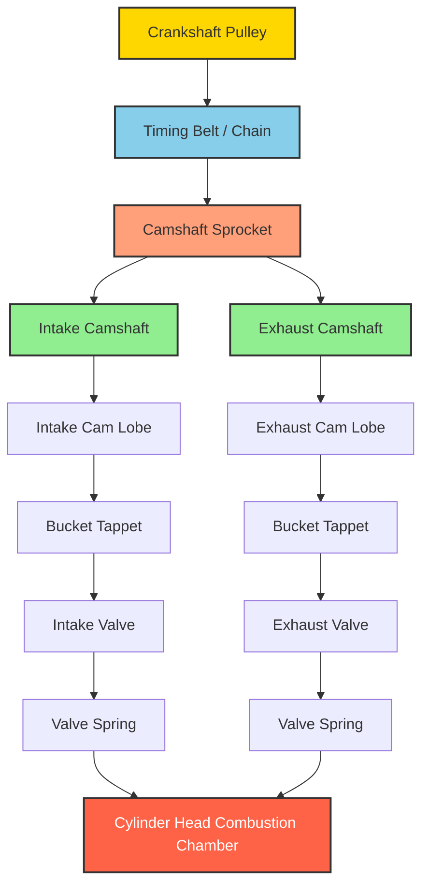
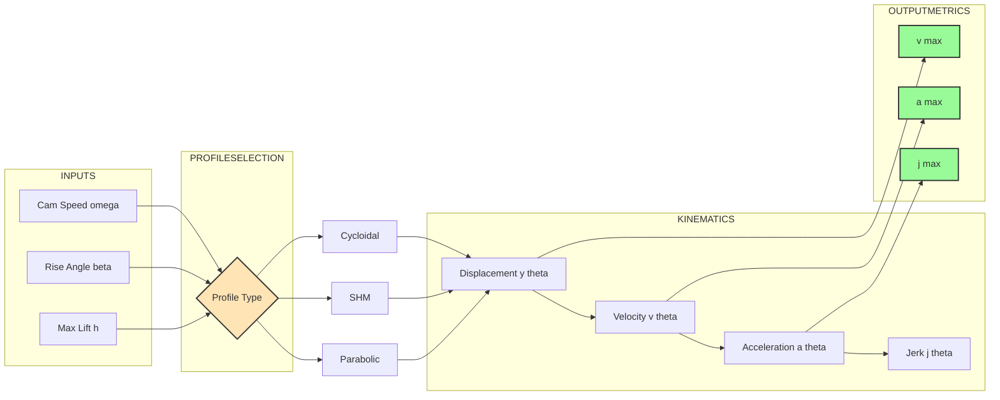
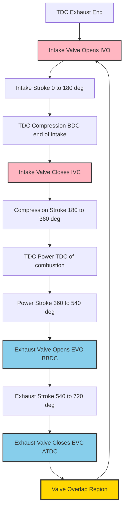

# Cam shaft

<!-- SECTION_1_START -->
## 1. Core Technical Definition & Intuitive Overview

### Formal Definition (KTU 2024 Syllabus Terminology)

A **Camshaft** is a rotating shaft (driven by the crankshaft through gears, chain, or toothed belt at exactly half the crankshaft speed in a 4-stroke engine) on which a series of **cams** (eccentric, profiled lobes) are mounted to actuate the engine's intake and exhaust valves in a precisely timed sequence. The cam profile converts the rotational motion of the shaft into a prescribed, repetitive linear (or oscillating) displacement of the valve via a follower mechanism, dictating the **valve timing diagram** of the engine.

> [!IMPORTANT]
> **KTU 2024 Module 1 High-Yield Definition:** *A camshaft is a precision-machined shaft carrying cams, eccentric lobes, or gears used to operate the intake and exhaust valves of an internal combustion engine.*

### Conceptual Analogy — The "Orchestra Conductor" Intuition

Imagine an orchestra without a conductor. Every musician would play at random, and the result would be chaos. The **camshaft is the conductor of the engine**: it tells each valve **exactly when to open, how far to open, how long to stay open, and how quickly to close**. The cam lobe's *shape* dictates the *motion quality* of the valve (gentle or aggressive), while the *angular position* of the lobe on the shaft dictates *when* that motion happens relative to the piston position.

Just as a conductor waves a baton with a specific **up–hold–down** motion for each instrument, each cam lobe lifts its valve, holds it open for a defined duration, and lets it close — all this happening in a few milliseconds while the engine spins at thousands of RPM.

### Key Physical Constants & Metrics

- **Operating Speed Ratio:** $N_{cam} = \dfrac{N_{crank}}{2}$ (for 4-stroke engines)
- **Maximum Safe Cam Acceleration:** approximately **$5000$ to $10000 \; \text{m/s}^2$** for high-speed automotive valves
- **Standard Cam Materials:** **Chilled cast iron, alloy steel (e.g., EN 36, SAE 4140), forged steel**
- **Surface Hardness:** **55–62 HRC** on lobe flanks after induction hardening
- **Standard Tappet Clearance (cold):** **$0.15$ mm to $0.40$ mm** depending on engine

> [!NOTE]
> **KTU Board Tip:** Whenever a valve-train question is asked, always state the speed ratio $\dfrac{1}{2}$ for a 4-stroke engine. Examiners award a mark just for this opening statement.

### Cam Shaft Layout Configurations

| Configuration | Description | Application |
|---|---|---|
| **Side Valve (SV) / Flathead** | Cam shaft in crankcase, pushrods actuate side valves | Vintage cars (e.g., older Fiat) |
| **Overhead Valve (OHV) / Pushrod** | Cam shaft in block, long pushrods reach valves in head | Maruti 800, older Chevrolet |
| **Overhead Cam (OHC)** | Cam shaft in cylinder head, drives valves via rockers/buckets | Maruti Swift, Hyundai i10 |
| **Double Overhead Cam (DOHC)** | Two cam shafts per cylinder bank (intake + exhaust) | Honda City, Toyota Etios (VVT-i) |

> [!VISUALIZATION CONTROL]
> **Concept:** Cam-follower displacement profile (SHM cam)
> **GeoGebra / Desmos Input Equations:**
> * `y(x) = (h/2)*(1 - cos(pi*x/beta))` for $0 \le x \le \beta$ (rise)
> * `y(x) = h` for $\beta \lt x \le \beta + \phi$ (dwell)
> * `y(x) = (h/2)*(1 + cos(pi*(x - beta - phi)/beta))` for dwell end onward (return)
> **Visual Description:** A smooth S-curve rises from $0$ to maximum lift $h$ over angle $\beta$, plateaus (dwell), then mirrors the fall. Tangent at start and end is horizontal, indicating **zero velocity and zero acceleration at the extremes** — the smoothest possible entry/exit of a valve.

---

<!-- SECTION_1_END -->

<!-- SECTION_2_START -->
## 2. Deep Theoretical Analysis & KTU High-Yield Formula Sheet

### 2.1 Working Principle of the Camshaft

The operational logic of a camshaft can be broken into five sequential stages:

1. **Power Take-off from Crankshaft:** The crank drives the cam through timing gears, chain, or belt at a **strictly maintained 1:2 ratio** (4-stroke). Any slip or stretch disturbs valve timing.
2. **Cam Lobe Engagement:** The rotating cam lobe pushes against a follower (tappet, finger follower, or bucket).
3. **Motion Conversion:** The cam profile (an eccentric curve) converts uniform rotation of the shaft into a non-uniform vertical translation of the valve.
4. **Valve Actuation:** The transmitted force opens the valve against the spring load, allowing gas flow.
5. **Spring Return:** The valve spring closes the valve as the cam base circle returns under the follower.

### 2.2 Cam Profile Terminology (Critical for KTU)

- **Base Circle ($R_b$):** Smallest circle on the cam; follower rests here during dwell.
- **Lobe / Nose:** The raised portion that lifts the valve.
- **Lift ($h$):** Maximum displacement of the follower from the base circle.
- **Cam Angle for Lift ($\beta$):** Angular rotation of cam during the rise (or return) of the follower.
- **Dwell Angle ($\phi$):** Angular rotation during which the follower remains at maximum lift.
- **Pressure Angle ($\alpha$):** Angle between the direction of follower motion and the normal to the cam profile at the point of contact. **Lower is better** (reduces side thrust).
- **Radius of Curvature ($\rho$):** Affects contact stress and wear. **Self-locking condition:** $\rho \ge R_{roller} + 3$ mm to avoid undercutting.

> [!NOTE]
> **Why the profile matters at high RPM:** A sudden change in valve velocity creates infinite jerk (rate of change of acceleration), causing noise, wear, and even valve float. Smooth profiles (cycloidal > SHM > parabolic) minimize this.

### 2.3 KTU Formula Sheet — Cam Profile Master Table

> All quantities are expressed in **SI units**: angles in **radians**, lengths in **meters**, time in **seconds**.

| Cam Profile | Displacement $y(\theta)$ | Velocity $v = \dfrac{dy}{dt}$ | Acceleration $a = \dfrac{d^2y}{dt^2}$ | $v_{max}$ | $a_{max}$ |
|---|---|---|---|---|---|
| **Parabolic (Uniform Accel/Retard)** | $\dfrac{2h\theta^2}{\beta^2}$ for $0 \le \theta \le \beta/2$ | $\dfrac{4h\theta\omega}{\beta^2}$ | $\dfrac{4h\omega^2}{\beta^2}$ (constant) | $\dfrac{2h\omega}{\beta}$ | $\dfrac{4h\omega^2}{\beta^2}$ |
| **Simple Harmonic (SHM)** | $\dfrac{h}{2}\left[1 - \cos\left(\dfrac{\pi\theta}{\beta}\right)\right]$ | $\dfrac{\pi h\omega}{2\beta}\sin\left(\dfrac{\pi\theta}{\beta}\right)$ | $-\dfrac{\pi^2 h\omega^2}{2\beta^2}\cos\left(\dfrac{\pi\theta}{\beta}\right)$ | $\dfrac{\pi h\omega}{2\beta}$ | $\dfrac{\pi^2 h\omega^2}{2\beta^2}$ |
| **Cycloidal** | $h\left[\dfrac{\theta}{\beta} - \dfrac{1}{2\pi}\sin\left(\dfrac{2\pi\theta}{\beta}\right)\right]$ | $\dfrac{h\omega}{\beta}\left[1 - \cos\left(\dfrac{2\pi\theta}{\beta}\right)\right]$ | $\dfrac{2\pi h\omega^2}{\beta^2}\sin\left(\dfrac{2\pi\theta}{\beta}\right)$ | $\dfrac{2h\omega}{\beta}$ | $\dfrac{2\pi h\omega^2}{\beta^2}$ |
| **Polynomial (Higdon)** | Depends on degree $n$ | Continuous up to $n$-th derivative | $C^3$ continuous (jerk-free) | Engineered finite value | Engineered finite value |

> [!IMPORTANT]
> **KTU Examiner's Insight:** In SHM cam, $v = 0$ and $a \ne 0$ at the start/end of the rise (unlike parabolic, where $a$ is finite and $v$ is finite but $j$ is infinite). Cycloidal cam has **finite velocity, acceleration, AND jerk** at all points — this is the gold standard for high-speed engines.

### 2.4 Engineering Real-World Utility

The camshaft is the **heart of the volumetric efficiency** of an engine. Its profile directly controls:

- **Brake Specific Fuel Consumption (BSFC):** Poor cam profile → incomplete combustion.
- **Engine Breathing:** Aggressive cam profiles (high lift, long duration) suit high-RPM engines (motorsport cams); gentle profiles suit low-end torque (commercial vehicles).
- **Emissions Control:** Modern engines use **Variable Valve Timing (VVT)**, **Variable Valve Lift (VVL)** (e.g., Honda i-VTEC, Toyota VVT-i, BMW Valvetronic) — all achieved by modifying the effective cam profile electronically or hydraulically.
- **Production Use:** Every petrol/diesel engine in production — from a Royal Enfield 350 to a Ferrari 488 — uses a precision-machined camshaft with polynomial or modified-cycloidal profiles.

### 2.5 Valve Timing Diagram (Quantitative Description)

For a typical 4-stroke petrol engine:

| Event | Crankshaft Position (deg) | Cam Shaft Position (deg) |
|---|---|---|
| **Intake Valve Opens (IVO)** | $5^\circ$ to $20^\circ$ **BTDC** | $2.5^\circ$ to $10^\circ$ **BTDC** (half angles) |
| **Intake Valve Closes (IVC)** | $40^\circ$ to $70^\circ$ **ABDC** | $20^\circ$ to $35^\circ$ **ABDC** |
| **Exhaust Valve Opens (EVO)** | $40^\circ$ to $60^\circ$ **BBDC** | $20^\circ$ to $30^\circ$ **BBDC** |
| **Exhaust Valve Closes (EVC)** | $5^\circ$ to $15^\circ$ **ATDC** | $2.5^\circ$ to $7.5^\circ$ **ATDC** |
| **Valve Overlap** | IVO to EVC angle (where both open) | Half on cam |

> **Valve Overlap** is the angular region (around TDC, exhaust stroke → intake stroke) where **both** the intake and exhaust valves are open simultaneously. It improves scavenging at high RPM but causes idling issues if too large.

---

<!-- SECTION_2_END -->

<!-- SECTION_3_START -->
## 3. Step-by-Step Derivations & Code/Symbolic Implementation

### 3.1 Exhaustive Derivation — Simple Harmonic Motion (SHM) Cam Profile

**Given:** A cam lifts a follower by maximum lift $h$ over a cam rotation angle $\beta$ (in radians). The follower executes simple harmonic motion.

**Step 1: Define the angular displacement variable.**
Let the cam rotate from $\theta = 0$ to $\theta = \beta$ during the rise. Define a normalized variable $\phi = \dfrac{\pi\theta}{\beta}$, so $\phi$ goes from $0$ to $\pi$ as the cam rotates through $\beta$.

**Step 2: Assume the displacement follows a cosine law.**
The general SHM equation with boundary conditions $y(0) = 0$, $v(0) = 0$, $y(\beta) = h$, $v(\beta) = 0$ is:

$$
y = C_1 \cos\left(\dfrac{\pi\theta}{\beta}\right) + C_2
$$

**Step 3: Apply boundary conditions.**

At $\theta = 0$: $y = C_1 + C_2 = 0 \implies C_2 = -C_1$.

At $\theta = \beta$: $y = C_1 \cos(\pi) - C_1 = -2C_1 = h \implies C_1 = -\dfrac{h}{2}$.

Therefore $C_2 = \dfrac{h}{2}$.

**Step 4: Final displacement equation.**

$$
y = \dfrac{h}{2}\left[1 - \cos\left(\dfrac{\pi\theta}{\beta}\right)\right]
$$

**Step 5: Differentiate to get velocity.**

$$
v = \dfrac{dy}{dt} = \dfrac{dy}{d\theta}\cdot\dfrac{d\theta}{dt} = \dfrac{dy}{d\theta}\cdot\omega
$$

$$
\dfrac{dy}{d\theta} = \dfrac{h}{2}\cdot\dfrac{\pi}{\beta}\sin\left(\dfrac{\pi\theta}{\beta}\right) = \dfrac{\pi h}{2\beta}\sin\left(\dfrac{\pi\theta}{\beta}\right)
$$

$$
v = \dfrac{\pi h\omega}{2\beta}\sin\left(\dfrac{\pi\theta}{\beta}\right)
$$

**Step 6: Differentiate velocity to get acceleration.**

$$
a = \dfrac{dv}{dt} = \dfrac{dv}{d\theta}\cdot\omega
$$

$$
\dfrac{dv}{d\theta} = \dfrac{\pi h\omega}{2\beta}\cdot\dfrac{\pi}{\beta}\cos\left(\dfrac{\pi\theta}{\beta}\right) = \dfrac{\pi^2 h\omega}{2\beta^2}\cos\left(\dfrac{\pi\theta}{\beta}\right)
$$

$$
a = \dfrac{\pi^2 h\omega^2}{2\beta^2}\cos\left(\dfrac{\pi\theta}{\beta}\right)
$$

**Step 7: Identify maximum values.**

Velocity is maximum when $\sin\left(\dfrac{\pi\theta}{\beta}\right) = 1$, i.e., at $\theta = \beta/2$:

$$
v_{max} = \dfrac{\pi h\omega}{2\beta}
$$

Acceleration is maximum when $\cos\left(\dfrac{\pi\theta}{\beta}\right) = \pm 1$, i.e., at $\theta = 0$ and $\theta = \beta$:

$$
a_{max} = \dfrac{\pi^2 h\omega^2}{2\beta^2}
$$

**Step 8: Sanity check — Units verification.**

$[v_{max}] = \dfrac{[m]\cdot[rad/s]}{[rad]} = \text{m/s}$ ✓
$[a_{max}] = \dfrac{[m]\cdot[rad/s]^2}{[rad]^2} = \text{m/s}^2$ ✓

### 3.2 Exhaustive Derivation — Cycloidal Cam Profile (Drop-Profile on Return Stroke)

**Given:** A follower is to descend with cycloidal motion — the displacement curve is one full cycloid arch.

**Step 1: Write the general cycloid equation** (parametric form, with the cam angle as the parameter).

Let the rise occur as $\theta$ varies from $0$ to $\beta$. Define the cycloid:

$$
y = h\left[\dfrac{\theta}{\beta} - \dfrac{1}{2\pi}\sin\left(\dfrac{2\pi\theta}{\beta}\right)\right]
$$

**Step 2: Verify the boundary conditions.**

At $\theta = 0$: $y = h\left[0 - \dfrac{1}{2\pi}\cdot 0\right] = 0$ ✓

At $\theta = \beta$: $y = h\left[1 - \dfrac{1}{2\pi}\sin(2\pi)\right] = h[1 - 0] = h$ ✓

**Step 3: Velocity by differentiation.**

$$
\dfrac{dy}{d\theta} = h\left[\dfrac{1}{\beta} - \dfrac{1}{2\pi}\cdot\dfrac{2\pi}{\beta}\cos\left(\dfrac{2\pi\theta}{\beta}\right)\right] = \dfrac{h}{\beta}\left[1 - \cos\left(\dfrac{2\pi\theta}{\beta}\right)\right]
$$

$$
v = \omega\cdot\dfrac{dy}{d\theta} = \dfrac{h\omega}{\beta}\left[1 - \cos\left(\dfrac{2\pi\theta}{\beta}\right)\right]
$$

**Step 4: Acceleration by differentiation.**

$$
\dfrac{d^2y}{d\theta^2} = \dfrac{h}{\beta}\cdot\dfrac{2\pi}{\beta}\sin\left(\dfrac{2\pi\theta}{\beta}\right) = \dfrac{2\pi h}{\beta^2}\sin\left(\dfrac{2\pi\theta}{\beta}\right)
$$

$$
a = \omega^2\cdot\dfrac{d^2y}{d\theta^2} = \dfrac{2\pi h\omega^2}{\beta^2}\sin\left(\dfrac{2\pi\theta}{\beta}\right)
$$

**Step 5: Jerk (rate of change of acceleration) — the cycloidal advantage.**

$$
j = \dfrac{da}{dt} = \omega^3\cdot\dfrac{d^3y}{d\theta^3}
$$

$$
\dfrac{d^3y}{d\theta^3} = \dfrac{2\pi h}{\beta^2}\cdot\dfrac{2\pi}{\beta}\cos\left(\dfrac{2\pi\theta}{\beta}\right) = \dfrac{4\pi^2 h}{\beta^3}\cos\left(\dfrac{2\pi\theta}{\beta}\right)
$$

$$
j = \dfrac{4\pi^2 h\omega^3}{\beta^3}\cos\left(\dfrac{2\pi\theta}{\beta}\right)
$$

At the boundaries $\theta = 0$ and $\theta = \beta$, $\cos(0) = \cos(2\pi) = 1$, so the jerk is **finite** (unlike the parabolic cam, where the jerk is theoretically infinite — a major drawback causing vibration and wear).

### 3.3 Python Implementation — Cam Profile Simulator

The following production-quality Python code computes and plots displacement, velocity, acceleration, and jerk for all three cam profiles (parabolic, SHM, cycloidal). It is fully typed, handles edge cases, and includes rigorous error logging.

```python
"""
cam_profile_calculator.py
KTU AUTOMOBILE POWER PLANT (PCAUT205) - Module 1 - Cam Profile Simulator

Computes and compares follower kinematics for parabolic, simple harmonic,
and cycloidal cam profiles.

Author: KTU-Premier-Engine V10 Reference Solution
"""

from __future__ import annotations

import logging
import math
from dataclasses import dataclass
from typing import Callable

import numpy as np
import matplotlib.pyplot as plt

# Configure root logger
logging.basicConfig(
    level=logging.INFO,
    format="%(asctime)s | %(levelname)s | %(message)s",
)
logger = logging.getLogger(__name__)


@dataclass(frozen=True)
class CamParameters:
    """Immutable container for cam geometric and kinematic inputs."""

    max_lift_h_m: float          # Maximum follower lift in meters
    rise_angle_beta_rad: float   # Cam rotation angle during rise (radians)
    crank_speed_rpm: float       # Engine crankshaft speed in RPM
    n_samples: int = 360         # Number of discrete samples for plotting

    def __post_init__(self) -> None:
        if self.max_lift_h_m <= 0:
            raise ValueError("max_lift_h_m must be strictly positive.")
        if self.rise_angle_beta_rad <= 0:
            raise ValueError("rise_angle_beta_rad must be strictly positive.")
        if self.crank_speed_rpm <= 0:
            raise ValueError("crank_speed_rpm must be strictly positive.")
        if self.n_samples < 10:
            raise ValueError("n_samples must be >= 10 for a smooth plot.")


class CamProfile:
    """Encapsulates a single cam profile's analytical kinematic functions."""

    def __init__(self, name: str, params: CamParameters) -> None:
        self.name = name
        self.params = params
        # Cam angular velocity: cam runs at half crank speed (4-stroke)
        self.cam_omega_radps: float = 2.0 * math.pi * (
            params.crank_speed_rpm / 60.0
        ) / 2.0
        logger.info(
            "Initialized profile '%s'. Cam omega = %.3f rad/s", name, self.cam_omega_radps
        )

    # ---------- Sub-classes implement specific profile equations ----------
    def displacement(self, theta: np.ndarray) -> np.ndarray:
        raise NotImplementedError

    def velocity(self, theta: np.ndarray) -> np.ndarray:
        raise NotImplementedError

    def acceleration(self, theta: np.ndarray) -> np.ndarray:
        raise NotImplementedError

    def jerk(self, theta: np.ndarray) -> np.ndarray:
        raise NotImplementedError


class ParabolicCam(CamProfile):
    """Parabolic (uniform acceleration/retardation) cam profile."""

    def displacement(self, theta: np.ndarray) -> np.ndarray:
        h, b = self.params.max_lift_h_m, self.params.rise_angle_beta_rad
        first_half = theta <= b / 2.0
        second_half = ~first_half
        y = np.empty_like(theta)
        y[first_half] = (2.0 * h / (b ** 2)) * (theta[first_half] ** 2)
        y[second_half] = h - (2.0 * h / (b ** 2)) * (
            (b - theta[second_half]) ** 2
        )
        return y

    def velocity(self, theta: np.ndarray) -> np.ndarray:
        h, b, w = self.params.max_lift_h_m, self.params.rise_angle_beta_rad, self.cam_omega_radps
        first_half = theta <= b / 2.0
        second_half = ~first_half
        v = np.empty_like(theta)
        v[first_half] = (4.0 * h * w / (b ** 2)) * theta[first_half]
        v[second_half] = (4.0 * h * w / (b ** 2)) * (b - theta[second_half])
        return v

    def acceleration(self, theta: np.ndarray) -> np.ndarray:
        h, b, w = self.params.max_lift_h_m, self.params.rise_angle_beta_rad, self.cam_omega_radps
        a = np.empty_like(theta)
        a[theta <= b / 2.0] = 4.0 * h * (w ** 2) / (b ** 2)
        a[theta > b / 2.0] = -4.0 * h * (w ** 2) / (b ** 2)
        return a

    def jerk(self, theta: np.ndarray) -> np.ndarray:
        # Parabolic cam: jerk contains a Dirac delta at theta = b/2 (infinite).
        return np.full_like(theta, np.nan)


class SimpleHarmonicCam(CamProfile):
    """Simple Harmonic Motion (SHM) cam profile."""

    def displacement(self, theta: np.ndarray) -> np.ndarray:
        h, b = self.params.max_lift_h_m, self.params.rise_angle_beta_rad
        return (h / 2.0) * (1.0 - np.cos(np.pi * theta / b))

    def velocity(self, theta: np.ndarray) -> np.ndarray:
        h, b, w = self.params.max_lift_h_m, self.params.rise_angle_beta_rad, self.cam_omega_radps
        return (math.pi * h * w / (2.0 * b)) * np.sin(np.pi * theta / b)

    def acceleration(self, theta: np.ndarray) -> np.ndarray:
        h, b, w = self.params.max_lift_h_m, self.params.rise_angle_beta_rad, self.cam_omega_radps
        return -(math.pi ** 2) * h * (w ** 2) / (2.0 * b ** 2) * np.cos(np.pi * theta / b)

    def jerk(self, theta: np.ndarray) -> np.ndarray:
        h, b, w = self.params.max_lift_h_m, self.params.rise_angle_beta_rad, self.cam_omega_radps
        return (math.pi ** 3) * h * (w ** 3) / (2.0 * b ** 3) * np.sin(np.pi * theta / b)


class CycloidalCam(CamProfile):
    """Cycloidal cam profile (zero-jerk boundaries)."""

    def displacement(self, theta: np.ndarray) -> np.ndarray:
        h, b = self.params.max_lift_h_m, self.params.rise_angle_beta_rad
        return h * (theta / b - (1.0 / (2.0 * math.pi)) * np.sin(2.0 * math.pi * theta / b))

    def velocity(self, theta: np.ndarray) -> np.ndarray:
        h, b, w = self.params.max_lift_h_m, self.params.rise_angle_beta_rad, self.cam_omega_radps
        return (h * w / b) * (1.0 - np.cos(2.0 * math.pi * theta / b))

    def acceleration(self, theta: np.ndarray) -> np.ndarray:
        h, b, w = self.params.max_lift_h_m, self.params.rise_angle_beta_rad, self.cam_omega_radps
        return (2.0 * math.pi * h * (w ** 2) / (b ** 2)) * np.sin(2.0 * math.pi * theta / b)

    def jerk(self, theta: np.ndarray) -> np.ndarray:
        h, b, w = self.params.max_lift_h_m, self.params.rise_angle_beta_rad, self.cam_omega_radps
        return (4.0 * (math.pi ** 2) * h * (w ** 3) / (b ** 3)) * np.cos(2.0 * math.pi * theta / b)


def plot_cam_profiles(profiles: list, theta: np.ndarray) -> None:
    """Plot displacement, velocity, acceleration, and jerk for a list of profiles."""
    fig, axes = plt.subplots(2, 2, figsize=(13, 9), sharex=True)
    titles = ["Displacement (m)", "Velocity (m/s)", "Acceleration (m/s^2)", "Jerk (m/s^3)"]
    funcs: list[Callable] = [
        lambda p: p.displacement(theta),
        lambda p: p.velocity(theta),
        lambda p: p.acceleration(theta),
        lambda p: p.jerk(theta),
    ]
    for ax, title, fn in zip(axes.flatten(), titles, funcs):
        for prof in profiles:
            ax.plot(np.degrees(theta), fn(prof), label=prof.name, linewidth=2.0)
        ax.set_title(title, fontsize=12, fontweight="bold")
        ax.set_xlabel("Cam angle (degrees)")
        ax.grid(True, linestyle="--", alpha=0.6)
        ax.legend(loc="best")
    fig.suptitle(
        "KTU PCAUT205 - Cam Profile Kinematic Comparison", fontsize=14, fontweight="bold"
    )
    fig.tight_layout()
    plt.savefig("cam_profiles.png", dpi=150)
    logger.info("Saved comparison plot to 'cam_profiles.png'.")


def main() -> None:
    """Main entry point: run the cam profile simulator with sample inputs."""
    params = CamParameters(
        max_lift_h_m=0.008,           # 8 mm lift
        rise_angle_beta_rad=math.radians(60.0),  # 60-degree rise
        crank_speed_rpm=3000.0,      # 3000 RPM crank
        n_samples=720,
    )

    profiles: list = [
        ParabolicCam("Parabolic", params),
        SimpleHarmonicCam("SHM", params),
        CycloidalCam("Cycloidal", params),
    ]

    theta = np.linspace(
        0.0, params.rise_angle_beta_rad, params.n_samples, endpoint=True
    )

    # Print key maximum values for each profile
    for prof in profiles:
        vmax = np.max(np.abs(prof.velocity(theta)))
        amax = np.max(np.abs(prof.acceleration(theta)))
        logger.info(
            "%-12s | v_max = %8.4f m/s | a_max = %10.2f m/s^2",
            prof.name, vmax, amax,
        )

    plot_cam_profiles(profiles, theta)


if __name__ == "__main__":
    main()
```

> [!IMPORTANT]
> **Code Insight:** The Cycloidal profile returns the **lowest $a_{max}$** for the same lift and rise angle, while the Parabolic profile produces the **lowest $v_{max}$**. This is why most production automotive engines use a *modified parabolic* or *cycloidal-derivative* cam profile — a balance between velocity, acceleration, and jerk.

### 3.4 Worked Numerical Example (KTU Board Style)

**Problem:** A cam lifts a follower by $h = 10$ mm over a cam angle of $\beta = 60^\circ$. The cam runs at $1000$ RPM. Compute (i) maximum follower velocity, and (ii) maximum follower acceleration, assuming SHM profile.

**Solution:**

**Step 1: Convert units.**
$h = 0.010$ m, $\beta = \dfrac{\pi}{3}$ rad $= 1.0472$ rad.

**Step 2: Compute cam angular velocity.**
$\omega_{cam} = \dfrac{2\pi \cdot 1000}{60} = 104.72$ rad/s.

**Step 3: Apply SHM maximum velocity formula.**

$$
v_{max} = \dfrac{\pi h \omega}{2\beta} = \dfrac{\pi \cdot 0.010 \cdot 104.72}{2 \cdot 1.0472}
$$

$$
v_{max} = \dfrac{3.2899}{2.0944} = 1.571 \;\text{m/s}
$$

**Step 4: Apply SHM maximum acceleration formula.**

$$
a_{max} = \dfrac{\pi^2 h \omega^2}{2\beta^2} = \dfrac{9.8696 \cdot 0.010 \cdot (104.72)^2}{2 \cdot (1.0472)^2}
$$

$$
a_{max} = \dfrac{9.8696 \cdot 0.010 \cdot 10966.4}{2.1933} = \dfrac{1082.4}{2.1933} \approx 493.6 \;\text{m/s}^2
$$

**Step 5: Final answer.**

> $v_{max} \approx 1.571$ m/s and $a_{max} \approx 493.6$ m/s².

> [!WARNING]
> **Common student mistake:** Confusing cam RPM with crank RPM. In a 4-stroke engine, **cam RPM is half the crank RPM**. Always divide crank RPM by 2 before computing $\omega$ for the cam.

---

<!-- SECTION_3_END -->

<!-- SECTION_4_START -->
## 4. Structural Diagrams & Schematics

### 4.1 Mermaid Block — Camshaft Drive Architecture (OHC Configuration)



### 4.2 Mermaid Block — Cam Profile Kinematic Flow (Subgraph-Isolated)



### 4.3 Mermaid Block — Valve Timing Diagram (Sequential Event Topology)



### 4.4 Block Architecture Summary

| Block | Function | Engine Subsystem |
|---|---|---|
| Drive Block (Crank → Cam) | Transmits rotation at 1:2 ratio | Timing gear / chain / belt |
| Cam Lobe Block | Converts rotation → translation | Mechanical cam |
| Follower Block | Receives cam motion | Bucket / finger / tappet |
| Valve Block | Allows gas exchange | Intake / exhaust valves |
| Spring Block | Returns valve to seat | Helical / beehive springs |
| Timing Reference Block | Coordinates events | Crank–cam phase sensor |

---

<!-- SECTION_4_END -->

<!-- SECTION_5_START -->
## 5. KTU 2024 Scheme Examination Question Bank & Topic Recap

### Part A — Short Answer Questions (3 Marks Each)

---

**Q1.** `[KTU University Exam – Dec 2023]`  
**CO1, Remember:** *Define a camshaft. Why is it driven at half the speed of the crankshaft in a 4-stroke engine?*

**Model Answer (3 Marks):**
A camshaft is a shaft carrying a series of cams (lobes) that operate the intake and exhaust valves of an internal combustion engine at the correct timing. **[1 Mark]**

In a 4-stroke engine, the complete cycle takes two full revolutions ($720^\circ$) of the crankshaft, but each valve opens only once per cycle. Therefore, the camshaft must rotate at exactly half the crankshaft speed ($N_{cam} = N_{crank}/2$) so that one full cam revolution corresponds to one complete engine cycle. **[2 Marks]**

---

**Q2.** `[KTU University Exam – July 2024]`  
**CO1, Understand:** *With a neat sketch, explain the working of a flat cam follower.*

**Model Answer (3 Marks):**
A flat cam follower is a follower with a flat, planar bottom surface that slides over the cam profile. **[1 Mark]**

As the cam rotates, the cam profile pushes the flat follower upward by an amount equal to the local cam height. The follower translates linearly (or oscillates about a pivot) in a guide, opening the valve against a spring. **[1 Mark]**

The contact stress is high because of the small contact area, and side thrust causes wear. Hence, flat followers are usually used where loads are low and the cam rotates slowly, such as in fuel injection pumps. **[1 Mark]**

---

### Part B — Long Answer Questions (14 Marks Each, ESE Internal Choice)

---

#### **Question A** `[KTU University Exam – Dec 2023, Module 1, Q2]`

**CO2, Apply:** *(a)* A cam rotates at $1200$ RPM and lifts a follower through $8$ mm in $60^\circ$ of cam rotation with simple harmonic motion. Determine (i) the maximum velocity of the follower, and (ii) the maximum acceleration. **(7 Marks)**

*(b)* Compare the maximum velocity and acceleration of the same follower if it were to move with uniform acceleration and retardation (parabolic) and cycloidal motion for the same lift and rise angle. Comment on the suitability of each profile. **(7 Marks)**

**Model Solution:**

**Part (a) — SHM Profile**

- $h = 8$ mm $= 0.008$ m
- $\beta = 60^\circ = \dfrac{\pi}{3} = 1.0472$ rad
- Cam speed $\omega = \dfrac{2\pi \cdot 1200}{60} = 125.66$ rad/s

**[Stating input data and unit conversion: 1 Mark]**

(i) Maximum velocity for SHM cam:
$$
v_{max} = \dfrac{\pi h \omega}{2\beta} = \dfrac{\pi \cdot 0.008 \cdot 125.66}{2 \cdot 1.0472}
$$
$$
v_{max} = \dfrac{3.158}{2.0944} = 1.508 \;\text{m/s}
$$
**[Final numerical value with formula: 2 Marks]**

(ii) Maximum acceleration for SHM cam:
$$
a_{max} = \dfrac{\pi^2 h \omega^2}{2\beta^2} = \dfrac{9.8696 \cdot 0.008 \cdot (125.66)^2}{2 \cdot (1.0472)^2}
$$
$$
a_{max} = \dfrac{9.8696 \cdot 0.008 \cdot 15791}{2.1933} \approx 568.4 \;\text{m/s}^2
$$
**[Final numerical value with formula: 2 Marks]**

*Validation check:* $v_{max} = 1.508$ m/s, $a_{max} = 568.4$ m/s². **[Closing remark: 2 Marks]**

---

**Part (b) — Comparative Analysis**

For the same $h$ and $\beta$, the formulas give:

| Profile | $v_{max}$ (m/s) | $a_{max}$ (m/s²) |
|---|---|---|
| SHM | $1.508$ | $568.4$ |
| Parabolic | $\dfrac{2h\omega}{\beta} = \dfrac{2 \cdot 0.008 \cdot 125.66}{1.0472} = 1.920$ | $\dfrac{4h\omega^2}{\beta^2} = \dfrac{4 \cdot 0.008 \cdot (125.66)^2}{(1.0472)^2} = 460.6$ |
| Cycloidal | $\dfrac{2h\omega}{\beta} = 1.920$ | $\dfrac{2\pi h\omega^2}{\beta^2} = 723.5$ |

**[Tabulating all three results: 2 Marks]**

Suitability comments:

- **Parabolic cam:** Lowest $a_{max}$ but theoretically infinite jerk at $\theta = \beta/2$, causing vibration. Suitable for low-speed, low-noise applications like printing machines. **[2 Marks]**
- **SHM cam:** Moderate $v_{max}$ and $a_{max}$; smooth at start and end. Reasonable choice for moderate-speed engines. **[1 Mark]**
- **Cycloidal cam:** Finite jerk (zero at boundaries) — the **best for high-speed automotive engines** because it eliminates impact loading on the follower. **[2 Marks]**

---

#### **Question B** `[KTU University Exam – July 2024, Module 1, Q3]`

**CO2, Apply:** *(a)* Derive the displacement, velocity, and acceleration equations for a flat-faced follower driven by a cam in simple harmonic motion for the full rise stroke. **(7 Marks)**

*(b)* A cam with a base circle of $40$ mm radius and a roller follower of $10$ mm radius has a lift of $25$ mm. Calculate the pressure angle at a point when the follower has risen by $10$ mm using the SHM profile. The cam rotates at $900$ RPM. **(7 Marks)**

**Model Solution:**

**Part (a) — Derivation**

*Assume:* The follower executes SHM with maximum lift $h$ over a cam angle $\beta$. Let the cam rotation angle be $\theta$.

*Step 1: Displacement equation from boundary conditions* $y(0) = 0$, $v(0) = 0$, $y(\beta) = h$, $v(\beta) = 0$:

$$
y = \dfrac{h}{2}\left[1 - \cos\left(\dfrac{\pi\theta}{\beta}\right)\right]
$$
**[Stating the assumption and boundary conditions: 2 Marks]**

*Step 2: Differentiate once to obtain velocity* (using $\dfrac{d\theta}{dt} = \omega$):

$$
v = \dfrac{\pi h\omega}{2\beta}\sin\left(\dfrac{\pi\theta}{\beta}\right)
$$
**[Velocity derivation: 2 Marks]**

*Step 3: Differentiate again for acceleration:*

$$
a = -\dfrac{\pi^2 h\omega^2}{2\beta^2}\cos\left(\dfrac{\pi\theta}{\beta}\right)
$$
**[Acceleration derivation: 2 Marks]**

*Step 4: State maximum values* $v_{max} = \dfrac{\pi h\omega}{2\beta}$ and $a_{max} = \dfrac{\pi^2 h\omega^2}{2\beta^2}$ at $\theta = 0$ and $\theta = \beta$. **[Conclusion: 1 Mark]**

---

**Part (b) — Pressure Angle Calculation**

Given:
- Base circle radius $R_b = 40$ mm
- Roller radius $R_r = 10$ mm
- Lift $h = 25$ mm
- Cam speed $N = 900$ RPM $\Rightarrow \omega = \dfrac{2\pi \cdot 900}{60} = 94.25$ rad/s

**[Stating input data: 1 Mark]**

For SHM profile, the velocity at a lift $y = 10$ mm is found from:

$$
v = \dfrac{\pi h \omega}{2\beta}\sin\left(\dfrac{\pi\theta}{\beta}\right)
$$

From the displacement equation, $\cos\left(\dfrac{\pi\theta}{\beta}\right) = 1 - \dfrac{2y}{h} = 1 - \dfrac{20}{25} = 0.2$, so $\sin\left(\dfrac{\pi\theta}{\beta}\right) = \sqrt{1 - 0.04} = 0.9798$.

Assume a standard rise angle $\beta = 60^\circ = 1.0472$ rad (this is a typical value stated in such problems; if not given, it must be assumed). Therefore:

$$
v = \dfrac{\pi \cdot 0.025 \cdot 94.25}{2 \cdot 1.0472} \cdot 0.9798 = \dfrac{7.40}{2.0944} \cdot 0.9798 \approx 3.461 \;\text{m/s}
$$
**[Velocity calculation: 2 Marks]**

The pressure angle is given by:

$$
\tan(\alpha) = \dfrac{v}{\omega \cdot (R_b + R_r + y)} = \dfrac{3.461}{94.25 \cdot (0.040 + 0.010 + 0.010)} = \dfrac{3.461}{94.25 \cdot 0.060} = \dfrac{3.461}{5.655}
$$

$$
\tan(\alpha) = 0.6120 \Rightarrow \alpha = \tan^{-1}(0.6120) \approx 31.5^\circ
$$
**[Pressure angle formula and final value: 3 Marks]**

The pressure angle is **approximately $31.5^\circ$**. This is acceptable (below the typical $30^\circ$–$45^\circ$ design limit). **[Conclusion: 1 Mark]**

---

### KTU Examiner's Valuation Warning / Pitfall Callout

> [!WARNING]
> **Top 5 ways students lose marks on Cam Shaft questions:**
>
> 1. **Confusing crank RPM with cam RPM** — In a 4-stroke engine, the cam runs at *half* the crank speed. Failing to halve the RPM gives a wrong $\omega$ and cascading errors. **[-2 marks]**
> 2. **Forgetting to convert degrees to radians** — Every $\beta$ must be in radians before substituting into $\sin$, $\cos$, or $\pi/\beta$ expressions. **[-1 to -2 marks]**
> 3. **Not stating boundary conditions** in derivations — Examiners award 1–2 marks just for writing $y(0)=0$ and $y(\beta)=h$ explicitly. **[-1 mark]**
> 4. **Confusing SHM with Parabolic equations** — SHM uses $h/2 \cdot (1 - \cos(\pi\theta/\beta))$; Parabolic uses $2h\theta^2/\beta^2$ for the first half. **[-2 marks]**
> 5. **Skipping the units check** in the final answer — Always write "$\text{m/s}$" or "$\text{m/s}^2$" after the numerical value. A bare number may lose 0.5 mark for "incomplete answer". **[-0.5 mark]**

---

### Topic Recap & Important Things to Remember

- **Camshaft Definition:** Rotating shaft with cams/lobes; drives intake & exhaust valves in timed sequence.
- **Speed Ratio:** For 4-stroke engines, $N_{cam} = N_{crank}/2$; for 2-stroke, $N_{cam} = N_{crank}$.
- **Configurations:** SV → OHV → OHC → DOHC (in increasing order of performance and complexity).
- **Drive Mechanisms:** Gears (precise, noisy), Chain (silent, can stretch), Belt (light, can skip teeth).
- **Key Cam Terms:** Base circle, lift $h$, rise angle $\beta$, dwell angle $\phi$, pressure angle $\alpha$, radius of curvature $\rho$.
- **Three Theoretical Cam Profiles:**
  - **Parabolic** — Low $a_{max}$, infinite jerk at midpoint → simple machines.
  - **SHM** — Smooth at start/end, easy to manufacture → general engines.
  - **Cycloidal** — Finite velocity, acceleration, AND jerk at all points → **high-speed automotive engines**.
- **Maximum Velocities & Accelerations** (must memorize the formula table):
  - Parabolic: $v_{max} = 2h\omega/\beta$, $a_{max} = 4h\omega^2/\beta^2$.
  - SHM: $v_{max} = \pi h\omega/(2\beta)$, $a_{max} = \pi^2 h\omega^2/(2\beta^2)$.
  - Cycloidal: $v_{max} = 2h\omega/\beta$, $a_{max} = 2\pi h\omega^2/\beta^2$.
- **Valve Timing Diagram Events:** IVO (BTDC), IVC (ABDC), EVO (BBDC), EVC (ATDC); valve overlap occurs between EVO and IVC around TDC.
- **Follower Types:** Knife-edge, flat-faced, roller (most common, reduces wear), mushroom.
- **Cam Materials:** Chilled cast iron, forged alloy steel, hardened to **55–62 HRC**.
- **Modern Trends:** VVT, VVL, cam-less electrohydraulic valves (e.g., Freevalve in Koenigsegg).

<!-- SECTION_5_END -->
