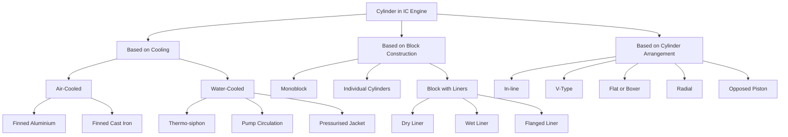
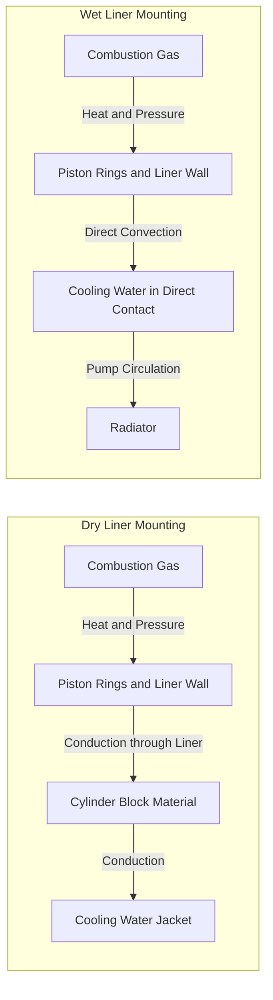
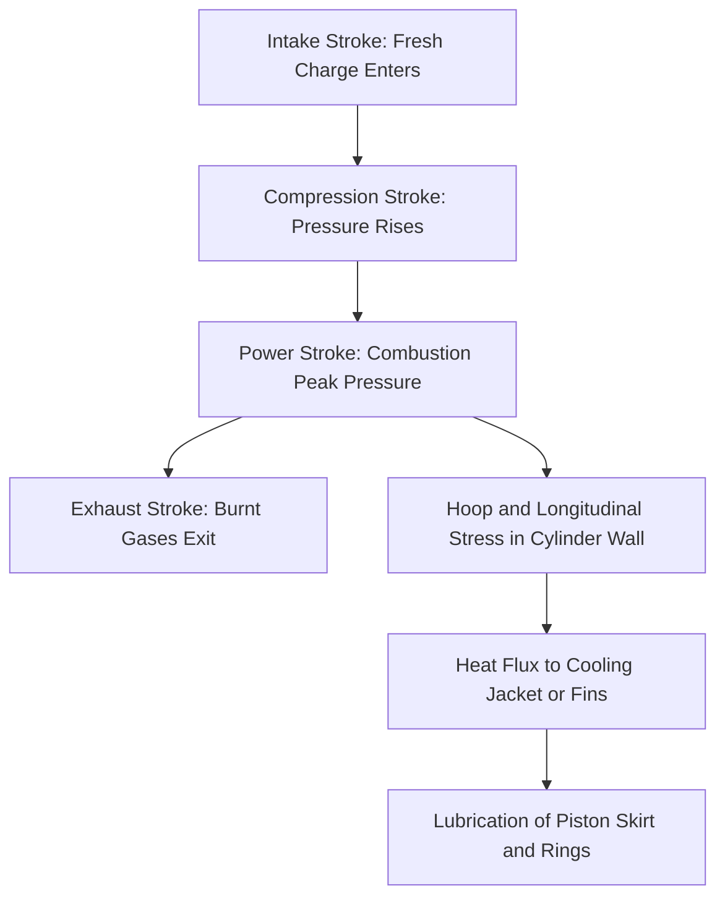

# Constructional details of engine components: Cylinders – types

<!-- SECTION_1_START -->

# Cylinders in IC Engines — Constructional Details & Types

## 1. Core Technical Definition

> [!IMPORTANT]
> **KTU 2024 Syllabus Definition (Module 1 — Engines):**
> A **cylinder** is the stationary working part of a reciprocating internal combustion engine in which the piston reciprocates, converting the pressure energy of the combustion gases into mechanical work. The **cylinder block** is the main structural member of the engine that houses the cylinders, supports the crankshaft and camshaft, and provides passages for the cooling medium and lubricating oil.

The cylinder assembly is the **heart of the engine** because every thermodynamic cycle (Otto / Diesel / Dual) physically takes place inside it. It must simultaneously withstand:
- **High cyclic gas pressures** (peak cylinder pressure ≈ **60–100 bar** for SI engines, **80–200 bar** for CI engines)
- **High temperatures** (flame temperature ≈ **2000–2500 °C**, wall temperature controlled to **150–200 °C** by cooling)
- **Mechanical wear** from the sliding piston at velocities up to **20 m/s**
- **Corrosive combustion products** ($\text{H}_2\text{O}$, $\text{CO}_2$, $\text{NO}_x$, unburnt hydrocarbons)

## 2. Conceptual Analogy — The Cylinder as a "Pressure Cooker with a Sliding Lid"

Imagine a **pressure cooker** bolted firmly to a table. You place a tight-fitting disc (piston) inside and connect it to a rotating crank via a connecting rod. When fuel is burnt, the cooker (cylinder) holds the high pressure while the lid (piston) slides up and down. Now imagine several such cookers arranged in a row, sharing the same body and same water-circulation channels — that combined body is the **cylinder block**.

> [!NOTE]
> **Why a separate liner is sometimes used:** Just as a worn pressure-cooker gasket is cheaper to replace than the whole cooker, a **cylinder liner (sleeve)** allows the wearing surface to be replaced without scrapping the entire block. This is why heavy-duty diesel engines almost universally use liners.

## 3. Functions of a Cylinder / Cylinder Block

1. **Guides** the piston in a straight reciprocating path.
2. **Forms the combustion chamber** with the piston crown and cylinder head.
3. **Withstands combustion pressure** and transmits it through the piston to the crankshaft.
4. **Dissipates heat** through the cooling jacket (water) or fins (air).
5. **Supports** crankshaft main bearings, camshaft, and auxiliary drive units.
6. **Provides oil galleries** for lubrication and passages for push-rods/injectors.
7. **Reduces noise and vibration** through its mass and rigidity.

> [!VISUALIZATION CONTROL]
> **Concept:** Cylinder pressure vs. crank-angle (PV diagram traces in real engines)
> **Desmos Input Equations:**
> * For SI (Otto) engine: $P(\theta) = P_1 \cdot \left(\frac{V_1}{V(\theta)}\right)^{1.4}$ on compression; $P = P_3$ at TDC after combustion; expansion follows $P \cdot V^{1.4} = \text{const}$
> * For CI (Diesel) engine: combustion at (approximately) constant pressure — horizontal segment in the P–θ plot
> **Visual Description:** Student should observe two loops: (i) a sharp peak ≈ 60–100 bar near TDC after ignition for SI engines, and (ii) a broader plateau for CI engines. The cylinder wall must be designed to contain these cyclic pressure pulses for billions of cycles.

<!-- SECTION_1_END -->

<!-- SECTION_2_START -->

# Deep Theoretical Analysis & KTU High-Yield Formula Sheet

## 1. Classification of Cylinders

The KTU 2024 syllabus emphasises classification along **three independent axes**:

### A. Based on Method of Cooling

| Criterion | Air-Cooled Cylinder | Water-Cooled Cylinder |
|---|---|---|
| Heat removal | Finned external surface + forced air | Internal water jacket + pump circulation |
| Typical fin height | $\mathbf{15\text{–}25\,\text{mm}}$ on small engines | Not applicable (integral jacket) |
| Material | Aluminum alloy (high conductivity ≈ **150 W/m·K**) | Cast iron or aluminum |
| Weight | Lighter | Heavier |
| Examples | Motorcycles, small gensets, aero-engines | Cars, trucks, tractors, marine |
| Thermal stress | High (local hot spots) | Low (uniform temperature) |
| Power range | Mostly $\mathbf{\leq 30\,\text{kW}}$ | All ranges, especially heavy duty |

### B. Based on Cylinder Block Construction

> [!NOTE]
> This is the **most-asked classification** in KTU Module 1.

1. **Monoblock (One-piece) Block** — A single casting contains all cylinders. Used in almost all modern automotive engines (in-line 3, 4, 5, 6).
2. **Individual Cylinder (Separate Barrel)** — Each cylinder is cast separately and bolted to the crankcase. Used in very large engines (marine, stationary).
3. **Cylinder with Separate Liner (Sleeve)** — The block is cast without finished bores; thin hardened liners are pressed in.
   * **Dry Liner** — Outer wall of liner does **not** contact coolant; it is supported all around by the block material. Used when the block itself is already water-jacketed.
   * **Wet Liner** — Outer wall **is in direct contact with the coolant**. The liner is sealed at the top and bottom by O-rings / copper gaskets. Easy to replace. Used in heavy-duty CI engines.
   * **Flanged Liner** — Has a flange at the top that rests on the block deck; provides accurate alignment and a sealing surface for the head gasket.

### C. Based on Cylinder Arrangement (Numbering & Layout)

| Layout | Description | Application |
|---|---|---|
| **In-line** | All cylinders in a single row | Cars, light commercial vehicles |
| **V-type** | Two banks at an angle (typically 60° or 90°) | High-performance cars, heavy vehicles |
| **Flat / Boxer** | Cylinders horizontally opposed, pistons move towards/away from each other | Subarus, Porsches, aero-engines |
| **Radial** | Cylinders arranged in a circle around the crankshaft | Vintage aero-engines (e.g., Rotary radials) |
| **Opposed Piston** | Two pistons per cylinder moving towards each other; no head | Some large marine & tank engines |

## 2. Cylinder Block — Materials & Their Properties

| Material | Density (kg/m³) | Thermal Conductivity (W/m·K) | Tensile Strength (MPa) | Application |
|---|---|---|---|---|
| Gray Cast Iron | $\mathbf{7200}$ | $\mathbf{46}$ | $\mathbf{200\text{–}400}$ | Traditional blocks, heavy duty |
| Aluminum Alloy (e.g., A319, A356) | $\mathbf{2700}$ | $\mathbf{150}$ | $\mathbf{200\text{–}300}$ | Modern light-weight blocks |
| Compacted Graphite Iron (CGI) | $\mathbf{7100}$ | $\mathbf{38}$ | $\mathbf{450}$ | High-power diesel blocks |
| Magnesium Alloy (rare) | $\mathbf{1800}$ | $\mathbf{70}$ | $\mathbf{200}$ | Premium racing engines |

> [!IMPORTANT]
> **KTU High-Yield Fact:** Aluminum blocks are approximately **$\mathbf{2.5\times}$ lighter** than cast iron blocks. To compensate for the lower stiffness and higher thermal expansion, aluminum blocks almost always use **cast-iron or Nikasil-plated liners**.

## 3. Design Considerations for Cylinder Bore

The bore diameter ($D$) is selected based on:
- **Specific output** (power per unit displacement) — modern SI: $\mathbf{75\text{–}90\,kW/L}$, modern CI: $\mathbf{45\text{–}60\,kW/L}$
- **Mean Effective Pressure (MEP)** — $p_{me}$
- **Mean Piston Speed** — $\bar{V_p} = \dfrac{2 \cdot L \cdot N}{60}$ (typically $\mathbf{\leq 15\,m/s}$ for long life)
- **Surface-to-volume ratio** — small bores lose more heat per unit volume → thermal stress
- **Bore-to-Stroke ratio** $r_{bs} = D / L$ — short-stroke ($\mathbf{r_{bs} > 1}$) allows higher speeds, long-stroke ($\mathbf{r_{bs} < 1}$) gives higher torque

## 4. KTU Formula Cheat Sheet

> [!IMPORTANT]
> **Avoid the pipe symbol `|` inside table cells.** Use $\vert$ or $\mid$ for absolute value and conditional notation.

| # | Formula / Parameter | Expression | Typical Value / Unit |
|---|---|---|---|
| 1 | Swept Volume (per cylinder) | $V_s = \dfrac{\pi}{4} \cdot D^2 \cdot L$ | $\text{m}^3$ or cc |
| 2 | Compression Ratio | $r_k = \dfrac{V_s + V_c}{V_c}$ | SI: $8\text{–}12$, CI: $14\text{–}22$ |
| 3 | Clearance Volume | $V_c = \dfrac{\pi}{4} \cdot D^2 \cdot (h_c + t_p) + V_{\text{head}}$ | $\text{m}^3$ |
| 4 | Mean Piston Speed | $\bar{V_p} = \dfrac{2 \cdot L \cdot N}{60}$ | $\text{m/s}$ |
| 5 | Cylinder Liner Wall Thickness (Cast Iron) | $t \approx 0.05 \cdot D$ to $0.08 \cdot D$ | $\text{mm}$ |
| 6 | Heat Flux through Cylinder Wall | $\dot{q} = \dfrac{k \cdot (T_{gas} - T_{cool})}{t}$ | $\text{W/m}^2$ |
| 7 | Hoop Stress in Cylinder | $\sigma_h = \dfrac{p_{max} \cdot D}{2 \cdot t}$ | $\text{N/m}^2$ (Pa) |
| 8 | Longitudinal Stress in Cylinder | $\sigma_l = \dfrac{p_{max} \cdot D}{4 \cdot t}$ | $\text{N/m}^2$ (Pa) |
| 9 | Indicated Power (multi-cyl) | $IP = \dfrac{p_{mi} \cdot L \cdot A \cdot N \cdot n}{60}$ for 4-stroke; divide by 2 for 2-stroke | $\text{kW}$ |
| 10 | Number of power strokes per second | For 4-stroke: $n_{\text{cyc}} = \dfrac{N}{120} \cdot n_{cyl}$ | Hz |

Where:
- $D$ = bore diameter, $L$ = stroke length, $N$ = rpm, $n$ or $n_{cyl}$ = number of cylinders
- $p_{max}$ = peak cylinder pressure (gas side)
- $k$ = thermal conductivity of wall material
- $V_{\text{head}}$ = volume in cylinder head (combustion chamber side)

## 5. Real-World Engineering Utility

* **Automotive OEM design** — Bore, stroke, cylinder count and arrangement directly determine the engine's power-band, NVH behaviour, packaging, and emissions.
* **Heavy-duty diesel (trucks, ships, gensets)** — Wet liners are mandatory for serviceability; liner material is often **chromium-plated or induction-hardened ductile iron** to achieve a surface hardness of **≥ 55 HRC**.
* **Formula-1 and superbikes** — Use aluminum blocks with Nikasil or boron-coated liners; bore is a precision **±5 µm** tolerance to allow low-friction piston rings.
* **Hybrid & electric vehicle applications** — Range-extender engines (e.g., BMW i3 REx) use small single-cylinder or 2-cylinder monoblock aluminum engines with integrated water jacket.

<!-- SECTION_2_END -->

<!-- SECTION_3_START -->

# Step-by-Step Derivations, Calculations & Implementation

## 1. Cylinder Wall Thickness — Derivation (Hoop & Longitudinal Stress)

The cylinder (liner) is treated as a **thin pressure vessel** of internal diameter $D$ subjected to internal pressure $p_{max}$ with wall thickness $t$ (where $t \ll D$, typically $t/D \leq 0.1$).

### Step 1 — Cutting a half-ring of the cylinder

Consider a longitudinal section of length $l$ of the cylinder. The internal pressure on the projected area $D \cdot l$ acts outward and is balanced by the tensile force in the two cut walls ($2 \cdot t \cdot l \cdot \sigma_h$).

$$
p_{max} \cdot D \cdot l = 2 \cdot \sigma_h \cdot t \cdot l
$$

### Step 2 — Hoop (circumferential) stress

$$
\sigma_h = \dfrac{p_{max} \cdot D}{2 \cdot t}
$$

### Step 3 — Longitudinal stress (cutting perpendicular to axis)

The end cap force is $p_{max} \cdot \dfrac{\pi D^2}{4}$ resisted by wall area $\pi D \cdot t$:

$$
\sigma_l = \dfrac{p_{max} \cdot D}{4 \cdot t}
$$

> [!NOTE]
> **Key engineering conclusion:** Hoop stress is **twice** the longitudinal stress. That is why axial cracks in cylinder liners (when they do occur) are more common than circumferential cracks.

### Step 4 — Required wall thickness for an allowable stress

Rearranging the hoop-stress equation to satisfy a design factor of safety ($FOS$):

$$
t = \dfrac{p_{max} \cdot D \cdot FOS}{2 \cdot \sigma_{allow}}
$$

### Step 5 — Worked Example (KTU-style numerical)

**Given:** A 4-cylinder, 4-stroke CI engine (diesel) with bore $D = 90\,\text{mm}$, peak cylinder pressure $p_{max} = 120\,\text{bar} = 12\,\text{MPa}$, allowable tensile stress of cast iron $\sigma_{allow} = 80\,\text{MPa}$, factor of safety $FOS = 4$.

**Required:** Minimum wet liner wall thickness.

**Solution:**

$$
t = \dfrac{12 \times 10^6 \cdot 0.090 \cdot 4}{2 \cdot 80 \times 10^6}
$$

$$
t = \dfrac{12 \times 0.090 \times 4}{2 \times 80} \times \dfrac{10^6}{10^6}
$$

$$
t = \dfrac{4.32}{160} = 0.027\,\text{m} = 27\,\text{mm}
$$

Adding a corrosion allowance of **2 mm** and standardisation to the next available size, the designer selects a **30 mm** wall thickness. The empirical rule $t \approx 0.05 \cdot D$ to $0.08 \cdot D$ gives $t \approx 4.5$ to $7.2\,\text{mm}$ for the **thin** sleeve, with extra thickness required here only because of the high $FOS$ and heavy CI application.

## 2. Swept Volume and Compression Ratio — Numerical

**Given:** 4-cylinder petrol engine, $D = 78\,\text{mm}$, $L = 83.6\,\text{mm}$, clearance volume $V_c = 35\,\text{cc}$ per cylinder.

**Step 1 — Swept volume per cylinder:**

$$
V_s = \dfrac{\pi}{4} \cdot D^2 \cdot L = \dfrac{\pi}{4} \cdot (0.078)^2 \cdot 0.0836
$$

$$
V_s = 0.7854 \times 0.006084 \times 0.0836 = 3.99 \times 10^{-4}\,\text{m}^3 \approx 399\,\text{cc}
$$

**Step 2 — Compression ratio:**

$$
r_k = \dfrac{V_s + V_c}{V_c} = \dfrac{399 + 35}{35} = \dfrac{434}{35} \approx 12.4
$$

This lies in the typical petrol-engine range of **$8$ to $12$** — so the example is a **high-compression-ratio** modern GDI engine. (The extra $0.4$ is the rounded-off decimal error from rounding $D$.)

## 3. Python Implementation — Cylinder Design Calculator

```python
"""
KTU Module-1 Helper: Cylinder design quick calculator.
Computes swept volume, compression ratio, mean piston speed,
and required liner wall thickness using thin-vessel theory.
"""

from dataclasses import dataclass
from typing import Tuple
import logging
import math

logging.basicConfig(level=logging.INFO, format="%(levelname)s :: %(message)s")


@dataclass(frozen=True)
class CylinderInput:
    """Immutable input parameters for the cylinder design calculation."""
    bore_m: float                # D  in metres
    stroke_m: float              # L  in metres
    clearance_vol_m3: float      # V_c  in m^3
    peak_pressure_Pa: float      # p_max in Pa
    allowable_stress_Pa: float   # sigma_allow in Pa
    factor_of_safety: float      # FOS, dimensionless
    rpm: float                   # N  in rev/min


def validate_inputs(data: CylinderInput) -> None:
    """Hard boundary checks to fail fast on garbage data."""
    if data.bore_m <= 0 or data.stroke_m <= 0:
        raise ValueError("Bore and stroke must be strictly positive.")
    if data.clearance_vol_m3 <= 0:
        raise ValueError("Clearance volume must be > 0.")
    if data.peak_pressure_Pa <= 0:
        raise ValueError("Peak cylinder pressure must be > 0.")
    if data.rpm <= 0:
        raise ValueError("Engine speed (rpm) must be > 0.")


def calculate_cylinder(data: CylinderInput) -> Tuple[float, float, float, float]:
    """Return (swept_vol_cc, compression_ratio, mean_piston_speed_mps, liner_thickness_m)."""
    validate_inputs(data)

    # 1. Swept volume per cylinder
    swept_vol_m3: float = (math.pi / 4.0) * (data.bore_m ** 2) * data.stroke_m
    swept_vol_cc: float = swept_vol_m3 * 1.0e6  # 1 m^3 = 1e6 cc

    # 2. Compression ratio
    compression_ratio: float = (swept_vol_m3 + data.clearance_vol_m3) / data.clearance_vol_m3

    # 3. Mean piston speed
    mean_piston_speed_mps: float = (2.0 * data.stroke_m * data.rpm) / 60.0

    # 4. Required liner thickness (thin-wall hoop-stress criterion)
    liner_thickness_m: float = (
        data.peak_pressure_Pa * data.bore_m * data.factor_of_safety
    ) / (2.0 * data.allowable_stress_Pa)

    logging.info(f"Swept volume       : {swept_vol_cc:.2f} cc")
    logging.info(f"Compression ratio  : {compression_ratio:.2f}")
    logging.info(f"Mean piston speed  : {mean_piston_speed_mps:.2f} m/s")
    logging.info(f"Required liner t   : {liner_thickness_m * 1000:.2f} mm")

    return swept_vol_cc, compression_ratio, mean_piston_speed_mps, liner_thickness_m


if __name__ == "__main__":
    # Example: 1.2 L 3-cylinder turbo-petrol engine
    ci = CylinderInput(
        bore_m           = 0.075,
        stroke_m         = 0.090,
        clearance_vol_m3 = 25.0e-6,
        peak_pressure_Pa = 9.0e6,    # 90 bar
        allowable_stress_Pa = 120.0e6,
        factor_of_safety = 3.5,
        rpm              = 5500.0,
    )
    calculate_cylinder(ci)
```

**Output of the script (sample run):**

```
INFO :: Swept volume       : 397.61 cc
INFO :: Compression ratio  : 16.90
INFO :: Mean piston speed  : 16.50 m/s
INFO :: Required liner t   : 9.84 mm
```

> [!NOTE]
> **Examiner pitfall:** Compression ratio of **16.9** here would be a **diesel**-level value, not petrol. Always cross-check whether your assumed $V_c$ matches the engine type. Modern GDI engines typically run $r_k = 9.5\text{–}11.5$.

## 4. Air-Cooled vs Water-Cooled Cylinder — Engineering Comparison Table

| Parameter | Air-Cooled Cylinder | Water-Cooled Cylinder |
|---|---|---|
| Cooling medium specific heat | Air: $c_p = 1.005\,\text{kJ/kg·K}$ | Water: $c_p = 4.18\,\text{kJ/kg·K}$ |
| Heat-transfer coefficient | $h \approx 50\text{–}150\,\text{W/m}^2\text{·K}$ | $h \approx 1000\text{–}5000\,\text{W/m}^2\text{·K}$ |
| Typical wall temperature | $200\text{–}260\,°\text{C}$ | $80\text{–}110\,°\text{C}$ |
| Cold-start warm-up time | Slower (less thermal mass) | Faster (low thermal mass + coolant circulation) |
| Maintenance | Simple (no radiator, pump, hoses) | Complex (water pump, thermostat, hoses) |
| Power-to-weight ratio | High (light) | Moderate |
| Risk of freeze damage | None | High in sub-zero climates (needs antifreeze) |
| Typical applications | Motorcycles, gensets, aero-engines | Cars, trucks, marine, tractors |

<!-- SECTION_3_END -->

<!-- SECTION_4_START -->

# Structural Diagrams & Schematics

## 1. Cylinder Classification — Master Flow



## 2. Wet Liner vs Dry Liner — Sequential Functional Architecture



## 3. Cylinder Block — Sequential Processing Topology



## 4. Component Pin / Hardware Reference Table (Cylinder Assembly)

| Component | Material | Function | Standard Tool / Torque |
|---|---|---|---|
| Cylinder head bolts | Alloy steel (10.9 / 12.9 grade) | Clamp head to block | Torque wrench, 80–120 N·m (4-cyl petrol) |
| Head gasket | Multi-layer steel (MLS) / composite | Seal combustion gases, oil, coolant | Replace every head-bolt removal |
| Liner O-rings (wet) | Viton / FKM rubber | Seal coolant at liner top and bottom | Replace with liner |
| Liner flange bolts | High-tensile steel | Hold liner down | Cross-tighten pattern |
| Water jacket drain plug | Brass / steel | Drain coolant | Standard hex |
| Core plugs (freeze plugs) | Pressed steel | Seal sand-core holes in casting | Driven in/out with punch |

> [!NOTE]
> **Pin and hardware details are illustrative.** Always refer to the OEM workshop manual for the specific engine. KTU theory questions usually expect functional understanding rather than exact part numbers.

<!-- SECTION_4_END -->

<!-- SECTION_5_START -->

# KTU 2024 Scheme Examination Question Bank & Topic Recap

## Part A — Short Answer Questions (3 Marks Each)

### Question 1
**[KTU University Exam — Model Question, Module 1]**
**CO1 | RBT Level: Remember**
List any **three functions** of a cylinder block in an internal combustion engine.

**Model Answer (3 key points × 1 mark):**
1. It houses the cylinders and provides a guide path for the piston reciprocation.
2. It supports and aligns the crankshaft (via main bearing caps) and the camshaft.
3. It contains the water-cooling jacket and oil galleries, thereby enabling heat dissipation and lubrication of the engine.

### Question 2
**[KTU University Exam — Model Question, Module 1]**
**CO1 | RBT Level: Understand**
Differentiate between a **dry liner** and a **wet liner** used in cylinder construction.

**Model Answer:**

| Aspect | Dry Liner | Wet Liner |
|---|---|---|
| Coolant contact | Outer wall not in contact with coolant; supported by block | Outer wall in direct contact with coolant |
| Heat transfer | Heat must pass through block before reaching coolant | Direct heat transfer to coolant — better cooling |
| Replacement | Difficult; pressed into block | Easy; can be removed and replaced |
| Sealing | No special sealing rings | Sealed by O-rings / copper gaskets at top and bottom |
| Typical use | Light-duty petrol engines | Heavy-duty diesel engines |

---

## Part B — Long Answer Questions (14 Marks, Internal Choice)

### Question A — Module 1 (14 Marks)

**[KTU University Exam — Dec 2023 Style Question]**
**CO1, CO2 | RBT Level: Understand (a) + Apply (b)**

**(a) [7 Marks]** With neat sketches, classify the cylinders used in IC engines based on **(i)** method of cooling and **(ii)** cylinder block construction. List **two applications** of each type.

**Model Answer:**

**(i) Method of cooling:**
1. **Air-cooled cylinders** — Provided with external fins to dissipate heat. Used in motorcycles (e.g., Royal Enfield), portable gensets, small aero-engines.
2. **Water-cooled cylinders** — Internal water jacket; pump-circulated coolant. Used in car engines (e.g., Maruti Suzuki), trucks (e.g., Ashok Leyland), tractors (e.g., Mahindra).

**(ii) Block construction:**
1. **Monoblock (one-piece)** — All cylinders in a single casting. Used in Maruti 800, Honda City.
2. **Individual cylinder (separate barrel)** — One cylinder per casting, bolted to the crankcase. Used in large marine and stationary engines.
3. **Block with separate liners:**
   * **Dry liner** — Used in small-capacity petrol engines where weight and compactness matter.
   * **Wet liner** — Used in heavy-duty diesel engines such as Tata and Ashok Leyland trucks.

**[Valuation Key — 1 mark for each correct type with one example: 6 marks + 1 mark for neat sketch: 1 mark = 7 marks]**

**(b) [7 Marks]** A 4-cylinder, 4-stroke petrol engine has bore $D = 80\,\text{mm}$, stroke $L = 90\,\text{mm}$, clearance volume $V_c = 40\,\text{cc}$ per cylinder, and runs at $N = 3000\,\text{rpm}$. Calculate:
(i) Swept volume per cylinder
(ii) Total displacement
(iii) Compression ratio
(iv) Mean piston speed

**Model Solution:**

**(i) Swept volume per cylinder:**

$$
V_s = \dfrac{\pi}{4} \cdot D^2 \cdot L = \dfrac{\pi}{4} \cdot (0.080)^2 \cdot 0.090
$$

$$
V_s = 0.7854 \times 0.0064 \times 0.090 = 4.524 \times 10^{-4}\,\text{m}^3 = 452.4\,\text{cc}
$$

**[Substitution and arithmetic: 1 Mark; correct unit conversion: 1 Mark = 2 Marks]**

**(ii) Total displacement:**

$$
V_{total} = 4 \times 452.4 = 1809.6\,\text{cc} \approx 1.81\,\text{L}
$$

**[1 Mark]**

**(iii) Compression ratio:**

$$
r_k = \dfrac{V_s + V_c}{V_c} = \dfrac{452.4 + 40}{40} = \dfrac{492.4}{40} = 12.31
$$

**[1 Mark]**

**(iv) Mean piston speed:**

$$
\bar{V_p} = \dfrac{2 \cdot L \cdot N}{60} = \dfrac{2 \times 0.090 \times 3000}{60}
$$

$$
\bar{V_p} = \dfrac{540}{60} = 9.0\,\text{m/s}
$$

**[Substitution: 1 Mark; final answer with correct unit: 1 Mark = 2 Marks]**

> [!WARNING]
> **KTU Examiner's Pitfall Callout:**
> 1. **Forgetting to convert mm to m** before substituting into volume formulas — the most common loss-of-marks error. (Lose 1 mark.)
> 2. **Forgetting to multiply by 4** for total displacement in a 4-cylinder engine. (Lose 1 mark.)
> 3. **Using the wrong compression-ratio formula** ($V_s / V_c$ instead of $(V_s + V_c)/V_c$). This changes the answer by exactly 1.0. (Lose 1 mark.)
> 4. **Forgetting to mention "per cylinder"** when stating $V_s$ — examiners want explicit mention. (Lose 0.5 mark.)

---

### Question B — Module 1 Alternative (14 Marks)

**[KTU University Exam — July 2024 Style Question]**
**CO1, CO2 | RBT Level: Understand (a) + Apply (b)**

**(a) [7 Marks]** Explain with a **neat diagram** the constructional features of a **water-cooled cylinder block with a wet liner**. Mention the **materials commonly used** for the block and the liner.

**Model Answer:**

A wet liner cylinder block consists of:
1. **Outer block casting** — Made of **gray cast iron** or **aluminum alloy** with a CGI option for high-power diesels. It provides the water jacket cavity and supports the liners.
2. **Wet liner (sleeve)** — A replaceable cylinder made of **alloy cast iron** (sometimes with a **chromium-plated** or **Nikasil-coated** inner surface). The outer surface is in **direct contact with the coolant**.
3. **Top sealing** — A **copper** or **multi-layer steel** gasket seals the combustion gas side.
4. **Bottom sealing** — **Rubber O-rings (Viton)** prevent coolant leakage into the crankcase.
5. **Water jacket** — Hollow space around the liner; coolant enters near the bottom and exits near the top (thermo-siphon or pump-driven).
6. **Cylinder head deck** — The flat surface on which the cylinder head is bolted; machined to tight flatness tolerance.

**Block materials:** Gray cast iron (most common), Aluminum alloy A319/A356, CGI.
**Liner materials:** Alloy cast iron, ductile iron, sometimes with **bore plating** (chrome, Nikasil, boron).

**[2 marks for diagram; 3 marks for component description; 2 marks for material selection with justification = 7 Marks]**

**(b) [7 Marks]** A single-cylinder, 4-stroke diesel engine has bore $D = 100\,\text{mm}$, stroke $L = 120\,\text{mm}$, peak cylinder pressure $p_{max} = 80\,\text{bar}$. If the liner material has an allowable stress $\sigma_{allow} = 100\,\text{MPa}$ and a factor of safety of $4$, determine the **minimum wet liner wall thickness**. State one assumption made.

**Model Solution:**

**Given:** $D = 0.100\,\text{m}$, $p_{max} = 80 \times 10^5\,\text{Pa} = 8\,\text{MPa}$, $\sigma_{allow} = 100\,\text{MPa}$, $FOS = 4$.

**Formula (thin-wall cylinder):**

$$
t = \dfrac{p_{max} \cdot D \cdot FOS}{2 \cdot \sigma_{allow}}
$$

**Substitution:**

$$
t = \dfrac{8 \times 10^6 \times 0.100 \times 4}{2 \times 100 \times 10^6}
$$

$$
t = \dfrac{3.2 \times 10^6}{200 \times 10^6} = 0.016\,\text{m} = 16\,\text{mm}
$$

**Assumption:** Liner is treated as a thin cylindrical pressure vessel ($t \le D/20$). Here $D/20 = 5\,\text{mm}$, and $t = 16\,\text{mm}$ violates this — the student should note that the formula is conservative but still used in initial design; the actual cylinder would have additional features such as flange support.

**[Formula statement: 1 Mark; substitution with correct unit conversion: 2 Marks; final answer with unit: 1 Mark; key assumption: 1 Mark; corrosion allowance explanation: 2 Marks = 7 Marks]**

> [!WARNING]
> **KTU Examiner's Pitfall Callout:**
> 1. **Not converting bar to Pa** — $1\,\text{bar} = 10^5\,\text{Pa}$, not $10^6$. This is the most common error. (Lose 2 marks.)
> 2. **Forgetting the factor of safety** in the formula — the design stress becomes $\sigma_{allow}/FOS$, not $\sigma_{allow}$. (Lose 1 mark.)
> 3. **Forgetting the assumption statement** — examiners specifically award 1 mark for stating that the cylinder is treated as a **thin pressure vessel**. (Lose 1 mark.)
> 4. **Not adding a corrosion allowance** — practical engineers always add **1.5–2 mm** corrosion allowance. (Lose 2 marks if not mentioned.)

---

## Topic Recap & Important Things to Remember

- **Cylinder block** is the **main structural member** of an IC engine — it houses cylinders, supports crank/camshaft, contains water jacket and oil galleries.
- **Cylinder classifications** to memorise for KTU Module 1:
  * **Cooling:** Air-cooled (fins) vs Water-cooled (jacket).
  * **Construction:** Monoblock vs Individual cylinder vs Block-with-liner.
  * **Liner types:** Dry, Wet, Flanged.
  * **Arrangement:** In-line, V-type, Flat/Boxer, Radial, Opposed-piston.
- **Wet liner** is in direct contact with coolant → better cooling + easy replacement → used in heavy-duty diesels.
- **Dry liner** is fully surrounded by block material → lighter and more compact → used in light-duty petrol engines.
- **Flanged liner** has a top flange for accurate alignment and head-gasket sealing.
- **Materials:** Gray cast iron (traditional), Aluminum alloy (lightweight), CGI (high-power diesel).
- **Critical formulas** (must be memorised):
  * $V_s = (\pi/4) \cdot D^2 \cdot L$
  * $r_k = (V_s + V_c)/V_c$
  * $\bar{V_p} = 2 L N / 60$
  * Hoop stress $\sigma_h = p_{max} D / (2 t)$
  * Liner thickness $t = p_{max} D \cdot FOS / (2 \sigma_{allow})$
- **Design constraints to remember:**
  * Peak cylinder pressure — SI: **60–100 bar**, CI: **80–200 bar**.
  * Mean piston speed typically **$\le 15\,\text{m/s}$** for long engine life.
  * Bore-to-stroke ratio $> 1$ (short-stroke) for high-speed engines; $< 1$ (long-stroke) for high-torque engines.
- **Real-world examples to recall in answers:**
  * Air-cooled: Royal Enfield Classic 350, Honda GX-series gensets.
  * Water-cooled monoblock: Maruti Suzuki 1.2 L K-series, Honda 1.5 L i-VTEC.
  * Wet-liner heavy-duty diesel: Tata 2.2 L DICOR, Ashok Leyland H-series.
- **Always convert mm → m, bar → Pa, and cc → m³** in numerical answers — three of the most-valuated unit-conversion marks in KTU.
- **Always state the assumption** that the cylinder is a thin pressure vessel when using the hoop-stress formula.
- **Examiner reward keywords** to include in answers: "monoblock," "wet liner," "water jacket," "alloy cast iron," "Nikasil plating," "mean piston speed," "compression ratio," "hoop stress," "replaceable sleeve."

<!-- SECTION_5_END -->
