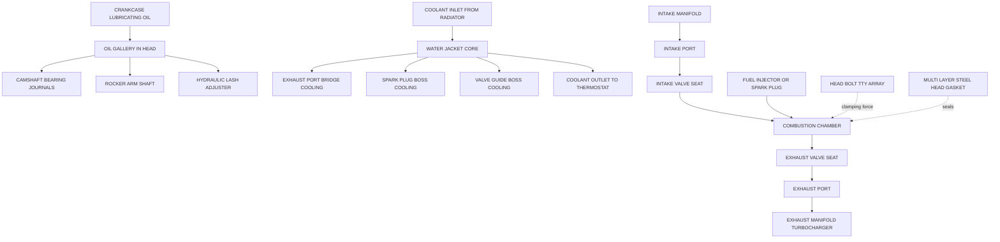
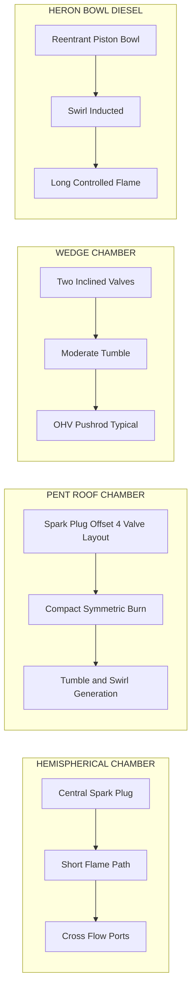
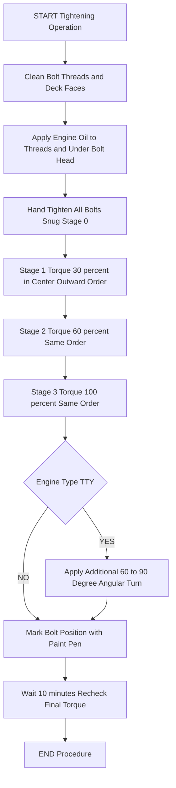
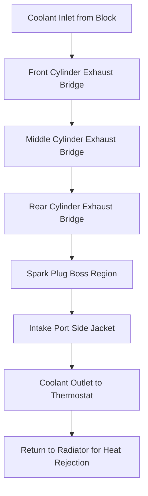
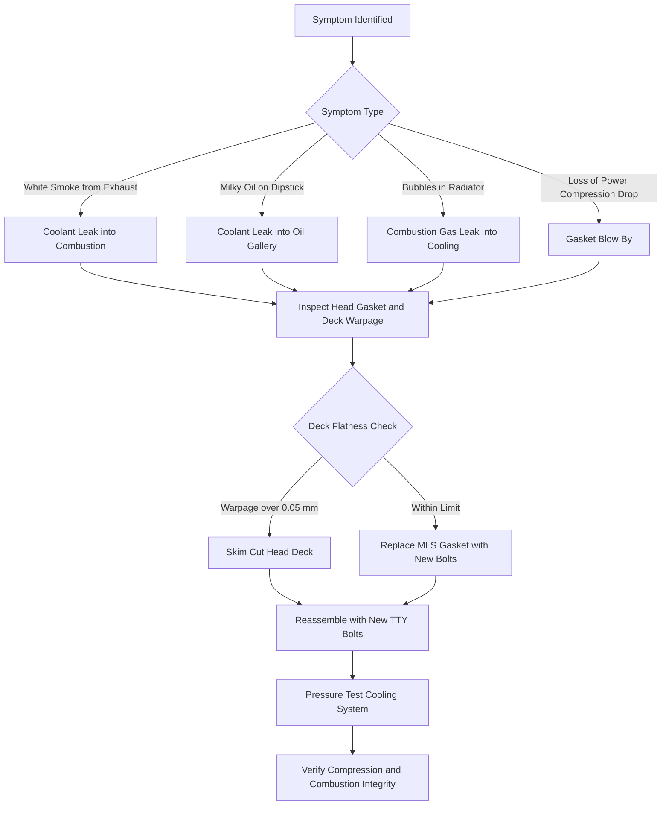
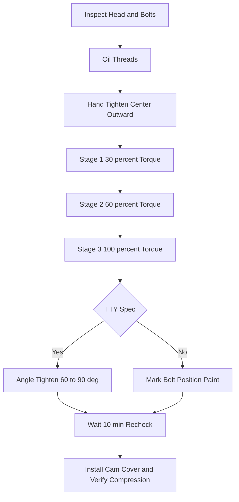

# Cylinder head

<!-- SECTION_1_START -->

# Cylinder Head — Core Technical Definition & Intuitive Overview

## Formal Definition (KTU 2024 Syllabus Terminology)

The **cylinder head** is the cast or forged metal component that hermetically seals the upper end of the engine cylinder bore, forming the upper half of the combustion chamber. In reciprocating internal combustion (IC) engines, it mounts the valvetrain (intake and exhaust valves, springs, retainers, rocker arms, camshaft bearing journals in OHV systems, or camshaft caps in OHC systems), houses the spark plug (SI engines) or fuel injector (CI engines), and incorporates integral coolant and oil passages that form part of the engine's thermal management circuit.

> [!IMPORTANT]
> **KTU 2024 — Syllabus Highlight (Module 1, Engines)**
> The cylinder head is treated as a critical structural and thermodynamic component. Students must be able to classify cylinder head designs (side-valve, overhead-valve, overhead-cam), identify combustion chamber geometries, justify material selection, and explain cooling strategies.

## Conceptual Analogy / Intuitive Understanding

Imagine a **pressure cooker** sitting on a gas stove. The cooker's **body** is the engine block (where the piston slides), and the **lid** clamped tightly on top is the cylinder head. The lid must:
1. **Hold pressure** during combustion (sealing),
2. **Let gases in and out** at the right time (valves),
3. **Burn fuel efficiently** (combustion chamber shape),
4. **Not melt** from extreme heat (cooling + material),
5. **Be removable** for servicing the piston below (head bolts + gasket).

A failed lid (warped, cracked) means the pressure cooker can no longer cook safely — in an engine, a warped head causes **compression loss, coolant leakage into oil, and overheating**.

## Primary Functions of the Cylinder Head

| # | Function | Engineering Purpose |
|---|----------|--------------------|
| 1 | **Seal** combustion gases above the piston | Maintains compression ratio |
| 2 | **House** intake & exhaust valves | Controls gas exchange timing |
| 3 | **Form** the upper half of the combustion chamber | Shapes flame propagation & turbulence |
| 4 | **Support** valvetrain components (rockers, cams, springs) | Transfers valve actuation force |
| 5 | **Mount** spark plug / injector | Initiates combustion / fuel delivery |
| 6 | **Circulate** coolant through integral water jackets | Removes ~30–35% of combustion heat |
| 7 | **Channel** lubricating oil to rocker shafts / camshafts | Reduces valvetrain friction |
| 8 | **Provide** exhaust port routing to manifold | Directs burnt gases out |

## Key Physical & Design Constants (Recall-Level)

> [!NOTE]
> - **Cylinder head bolt clamping force:** typically **60–110 MPa** bolt preload.
> - **Operating temperature range:** **–30 °C (cold start)** to **≈ 300 °C** (exhaust port bridge region, peak).
> - **Combustion pressure peak:** **60–100 bar** in modern gasoline engines, up to **200 bar** in high-performance diesels.
> - **Thermal expansion coefficient (Al alloy head):** **≈ 21 × 10⁻⁶ /K** — roughly twice that of cast iron block.
> - **Head gasket typical thickness:** **1.2–1.6 mm** multi-layer steel (MLS).

> [!VISUALIZATION CONTROL]
> **Concept:** Cylinder Head Position Relative to Engine Block
> **Geometric Representation (XY-plane cross-section):**
> - Top horizontal line (y = 1) → **Cylinder Head outer surface**
> - Middle horizontal line (y = 0) → **Deck face (gasket interface)**
> - Two parallel slanted lines (valve seats) → **Intake (left) & Exhaust (right) valves**
> - Central dashed circle → **Spark plug bore**
> **Visual Description:** The student should picture a closed rectangular cavity with a small protrusion (spark plug) on top, two angled valve triangles cutting in from the sides, and a coolant jacket region shaded in light blue surrounding the combustion cavity.

---

<!-- SECTION_1_END -->

<!-- SECTION_2_START -->

# Deep Theoretical Analysis & KTU High-Yield Formula Sheet

## 1. Classification of Cylinder Heads by Valve Location

### (a) Side-Valve (Flathead / L-Head)
- Valves located **beside the cylinder**, not above the piston.
- Combustion chamber is offset; poor compression ratio (max ≈ 6:1 in gasoline).
- Used in very old tractors and low-speed engines.
- **Disadvantage:** long flame path → detonation prone.

### (b) Overhead Valve (OHV / I-Head / Pushrod)
- Valves mounted **in the head**, actuated by pushrods from a block-mounted camshaft.
- **Most common** in Indian two-wheelers and older four-wheelers (e.g., Maruti 800).
- Allows compact, hemispherical-ish chamber.
- Combustion chamber is **pent-roof** or **wedge-shaped**.

### (c) Overhead Cam (OHC) — Single & Double
- **SOHC (Single OHC):** One camshaft in the head, actuated directly via rocker arms or bucket tappets.
- **DOHC (Double OHC):** Two camshafts (intake + exhaust), enables **4-valve-per-cylinder** layouts.
- **Modern standard** in petrol cars (e.g., K-series, VTVT engines).

### (d) F-Head (Inlet-Over-Exhaust)
- Inlet valve in head, exhaust valve beside cylinder. Hybrid of L & I head.

> [!IMPORTANT]
> KTU examiners frequently ask: *"Classify cylinder head arrangements and justify why OHV/I-head configuration is preferred for high-speed petrol engines."* — the answer must mention shorter flame path, higher compression ratio tolerance, and central spark plug placement.

## 2. Combustion Chamber Designs (Geometry)

| Chamber Type | Geometry Sketch (mental) | Compression Ratio | Flame Path | Typical Use |
|--------------|--------------------------|-------------------|------------|-------------|
| **Hemispherical (Hemi)** | Dome of a sphere | 10:1 – 12:1 | Short, central | High-perf. petrol |
| **Pent-roof** | Four slanted faces meet at a ridge | 10:1 – 13:1 | Short, symmetric | Modern DOHC petrol |
| **Wedge** | Two slopes form a 'V' from above | 8:1 – 10:1 | Moderate | OHV engines |
| **Bath-tub** | Recessed cylindrical cavity | 7:1 – 9:1 | Long | Old side-valve |
| **Heron (碗形/碗)** | Flat top + bowl in piston | 14:1 – 22:1 | Long, controlled | Diesel direct injection |
| **Pre-chamber (Indirect Injection)** | Separate spherical chamber linked by orifice | 18:1 – 23:1 | Initiated in pre-chamber | IDI diesel |

> [!NOTE]
> The choice of combustion chamber geometry directly determines the **shape factor** $S$ used in the Wiebe heat-release model studied in Semester V/VI thermodynamics.

## 3. Material Selection for Cylinder Heads

### 3.1 Cast Iron (Grey / Ductile)
- **Density:** ≈ 7200 kg/m³
- **Thermal conductivity:** ≈ 46 W/m·K
- **Stiffness (Young's modulus):** ≈ 110 GPa
- **Pros:** Cheaper, dimensionally stable, wear-resistant valve seats.
- **Cons:** Heavy (~2.4× aluminum), poor heat dissipation → localised hot spots.

### 3.2 Aluminum Alloys (e.g., A356, A319, AlSi7Mg)
- **Density:** ≈ 2700 kg/m³
- **Thermal conductivity:** ≈ 150 W/m·K (≈ 3× cast iron)
- **Stiffness (Young's modulus):** ≈ 71 GPa
- **Pros:** Lightweight, fast warm-up, excellent heat removal.
- **Cons:** Higher thermal expansion → needs **cast iron valve seat inserts** and **ductile iron valve guides** pressed in (since aluminum wears rapidly at valve contact points).

> [!IMPORTANT]
> In modern BS-VI/Euro-6 engines, **aluminum heads are universal** because of weight reduction (≈ 40% head-mass saving) and stricter thermal management. Cast iron heads persist in heavy commercial-vehicle diesels for durability and lower cost.

## 4. Cooling Passages (Water Jacket) — Design Logic

The coolant jacket is a **cored cavity** in the head sand-casting, surrounding:
- The exhaust port bridge (highest heat zone),
- Spark plug / injector boss,
- Valve guide boss,
- Combustion chamber periphery.

Coolant flow direction: **inlet from block side → across exhaust bridge → around chambers → out to thermostat/radiator**.
Turbulators (small metal baffles) are often inserted in the jacket to enhance convective heat transfer.

## 5. Cylinder Head Bolts & Sealing (Head Gasket)

Head bolts are **torque-to-yield (TTY)** in modern engines. They are stretched plastically to maintain uniform clamping load despite thermal cycling.

**Tightening sequence (KTU classic diagram):**
- Always from **center → outward**, in **2–3 incremental stages** (e.g., 30% → 60% → 100% of final torque).
- Prevents uneven gasket stress, warping, and localized leakage.

The head gasket is a **multi-layer steel (MLS)** elastomer-coated part with combustion-ring, oil-ring, and coolant-ring beads. It must seal **three different fluids simultaneously**: combustion gas, coolant, lubricating oil.

## KTU Formula Sheet / Cheat Sheet

| Parameter / Formula | Expression | Units | Use |
|---------------------|------------|-------|-----|
| **Compression ratio** | $r_k = \dfrac{V_s + V_c}{V_c}$ | — | Combustion chamber sizing |
| **Swept volume** | $V_s = \dfrac{\pi}{4}\,D^2\,L$ | m³ | Per cylinder |
| **Clearance volume** | $V_c = V_{ch} + V_{p,crown}$ | m³ | Chamber above piston at TDC |
| **Volumetric efficiency** | $\eta_v = \dfrac{\text{Actual intake mass}}{\rho_{air}\,V_s}$ | — | Indicates port & valve design quality |
| **Mean effective heat flux** | $\dot{q}'' = \dfrac{\dot{Q}_{comb} \cdot f_{head}}{A_{head}}$ | W/m² | Head thermal loading |
| **Thermal stress (head bolt region)** | $\sigma_{th} = E\,\alpha\,\Delta T$ | Pa | Clamping load check |
| **Bolt preload force** | $F_{pre} = T \big/ \left( k_d\, d\, \sec(\alpha) \right)$ | N | TTY tightening design |
| **Bolt tightening torque** | $T = K \cdot F_{pre} \cdot d$ | N·m | $K$ = nut factor ≈ 0.18–0.22 |
| **Heat removed by head (typical)** | $Q_{head} \approx 0.30 \cdot Q_{fuel}$ | J | 25–35% of fuel energy |
| **Specific heat rejection (SI)** | ≈ 0.35–0.45 kW/kW | — | Head + coolant load |

> [!WARNING]
> **Do not** use the vertical bar symbol `|x|` inside any table cell — always use `\vert x \vert` or `\mid x \mid` to avoid markdown table corruption.

## Real-World Engineering Utility

Cylinder head design is at the heart of:
- **Combustion efficiency & emissions** (chamber shape controls knock, soot, NOx),
- **BS-VI/Euro-6 compliance** (cooled EGR passes through head ports),
- **Turbocharger integration** (exhaust manifold often cast *into* the head — "integrated exhaust manifold"),
- **Variable Valve Timing (VVT / VTi / i-VTEC)** — control valves and oil galleries are inside the head,
- **Direct Injection (GDI / CRDi)** — high-pressure injectors mounted directly in the head withstanding 200+ bar injection pressures.

> [!NOTE]
> **Industry case example:** Tata Nexon's 1.2L Revotron 3-cylinder turbo petrol uses an **aluminum DOHC pent-roof head with integrated exhaust manifold** — a direct application of all concepts above.

---

<!-- SECTION_2_END -->

<!-- SECTION_3_START -->

# Step-by-Step Derivations, Calculations & Code Implementation

## Derivation 1 — Compression Ratio and Combustion Chamber Sizing

### Given
A single-cylinder 4-stroke SI engine has:
- Bore $D = 80 \text{ mm} = 0.080 \text{ m}$
- Stroke $L = 90 \text{ mm} = 0.090 \text{ m}$
- Required compression ratio $r_k = 9.5 : 1$

### Step 1 — Compute the swept volume $V_s$

$$
V_s = \frac{\pi}{4}\,D^2\,L
$$

Substitute the values:

$$
V_s = \frac{\pi}{4}\,(0.080)^2\,(0.090)
$$

Compute the square of the diameter first:

$$
(0.080)^2 = 0.0064 \text{ m}^2
$$

Multiply by $L$:

$$
0.0064 \times 0.090 = 0.000576 \text{ m}^3
$$

Multiply by $\pi/4$:

$$
V_s = 0.7853981 \times 0.000576 = 4.524 \times 10^{-4} \text{ m}^3
$$

Convert to cubic centimetres (1 m³ = 10⁶ cm³):

$$
V_s = 452.4 \text{ cm}^3 \approx 452 \text{ cc (per cylinder)}
$$

### Step 2 — Express clearance volume $V_c$ in terms of $r_k$

By definition:

$$
r_k = \frac{V_s + V_c}{V_c} \quad\Longrightarrow\quad V_s + V_c = r_k\,V_c
$$

Rearrange:

$$
V_s = (r_k - 1)\,V_c \quad\Longrightarrow\quad V_c = \frac{V_s}{r_k - 1}
$$

### Step 3 — Solve numerically

$$
V_c = \frac{452.4}{9.5 - 1} = \frac{452.4}{8.5} = 53.22 \text{ cm}^3
$$

This is the **total clearance volume**, comprising the cylinder head chamber $V_{ch}$, the piston crown cavity $V_{p,crown}$, and the head-gasket compressed thickness × bore area.

### Step 4 — Allocate sub-volumes (typical design split)

Assume a flat-top piston and pent-roof head:

| Region | Volume contribution | Value (cm³) |
|--------|--------------------|-------------|
| Head chamber $V_{ch}$ | 65% of $V_c$ | 34.59 |
| Piston crown dish $V_{p,crown}$ | 30% of $V_c$ | 15.97 |
| Gasket & deck clearance | 5% of $V_c$ | 2.66 |
| **Total** | 100% | **53.22** ✓ |

> **Conversion logic:** The designer decides piston shape first (crown dish must be reachable by the conrod big-end), then subtracts that from $V_c$ to find the head chamber's required volume — this defines the **depth of the head cavity** that the foundry must machine.

---

## Derivation 2 — Thermal Stress in the Cylinder Head (Deck Region)

### Statement
When an aluminum head is bolted to a cast-iron block and heated from 25 °C to 250 °C at the deck face, a **compressive thermal stress** develops because the head wants to expand more than the block.

### Formula

$$
\sigma_{th} = E_{head}\,\alpha_{head}\,\Delta T
$$

But since the head is **constrained** by the bolts, the induced stress is the constrained strain × modulus of the head material:

$$
\sigma_{th} = E_{head}\,(\alpha_{head} - \alpha_{block})\,(T_{op} - T_{ref})
$$

(approximately, when both are clamped and free expansion is restricted).

### Given Values

- $E_{head} = 71 \times 10^9 \text{ Pa}$ (Aluminum A356)
- $\alpha_{head} = 23 \times 10^{-6} \text{ /K}$
- $\alpha_{block} = 12 \times 10^{-6} \text{ /K}$ (Cast iron)
- $\Delta T = 250 - 25 = 225 \text{ K}$

### Step-by-Step Evaluation

Compute the differential expansion coefficient:

$$
\Delta\alpha = (23 - 12) \times 10^{-6} = 11 \times 10^{-6} \text{ /K}
$$

Multiply by $\Delta T$:

$$
\Delta\alpha \cdot \Delta T = 11 \times 10^{-6} \times 225 = 2.475 \times 10^{-3}
$$

Multiply by modulus:

$$
\sigma_{th} = 71 \times 10^{9} \times 2.475 \times 10^{-3} = 1.757 \times 10^{8} \text{ Pa}
$$

Convert to MPa:

$$
\sigma_{th} \approx 175.7 \text{ MPa}
$$

### Engineering Interpretation
This is a **compressive** stress locked into the deck face. The head bolts must provide an equivalent clamping preload to prevent joint lift-off. If the head bolts stretch (relax) by more than this stress equivalent, a **gasket-blow-by** event occurs.

---

## Python Implementation — Cylinder Head Combustion Chamber Sizing Tool

```python
"""
ktu_cylinder_head_sizing.py
Course: AUTOMOBILE POWER PLANT (PCAUT205)  |  Module 1: Engines
Purpose: Compute compression ratio, clearance volume, and head chamber
         volume for a 4-stroke SI / CI engine given bore, stroke, and
         either a target compression ratio or chamber volume.
Author: KTU PREMIER ENGINE V10
"""

from dataclasses import dataclass
from typing import Literal


@dataclass(frozen=True)
class EngineGeometry:
    bore_m: float          # Cylinder bore, m
    stroke_m: float        # Piston stroke, m
    cylinders: int         # Number of cylinders
    n_stroke: Literal[2, 4] = 4  # 2 or 4 stroke


def swept_volume(geo: EngineGeometry) -> float:
    """Return swept volume per cylinder in cubic metres."""
    if geo.bore_m <= 0 or geo.stroke_m <= 0:
        raise ValueError("Bore and stroke must be positive numbers.")
    return (3.141592653589793 / 4.0) * (geo.bore_m ** 2) * geo.stroke_m


def clearance_volume_from_cr(Vs: float, cr: float) -> float:
    """
    Vc = Vs / (cr - 1)
    """
    if cr <= 1.0:
        raise ValueError("Compression ratio must be strictly greater than 1.")
    return Vs / (cr - 1.0)


def head_chamber_volume(
    Vc: float,
    piston_dish_fraction: float = 0.30,
    gasket_fraction: float = 0.05,
) -> dict:
    """
    Split clearance volume among head chamber, piston dish, and gasket.
    Default fractions: head=0.65, piston=0.30, gasket=0.05.
    """
    if not (0.0 < piston_dish_fraction + gasket_fraction < 1.0):
        raise ValueError("Fractions must sum to less than 1.0.")
    head_frac = 1.0 - piston_dish_fraction - gasket_fraction
    return {
        "head_chamber_m3": Vc * head_frac,
        "piston_dish_m3": Vc * piston_dish_fraction,
        "gasket_m3": Vc * gasket_fraction,
        "head_fraction": head_frac,
    }


def main() -> None:
    # Example: 80 mm bore, 90 mm stroke, 3 cylinders, target CR = 10.5
    geo = EngineGeometry(bore_m=0.080, stroke_m=0.090, cylinders=3)

    Vs = swept_volume(geo)
    Vc = clearance_volume_from_cr(Vs, cr=10.5)
    split = head_chamber_volume(Vc)

    print(f"Swept volume per cylinder  : {Vs * 1e6:.2f} cc")
    print(f"Total displacement          : {Vs * geo.cylinders * 1e6:.2f} cc")
    print(f"Clearance volume per cyl    : {Vc * 1e6:.2f} cc")
    print(f"  -> Head chamber (65%)     : {split['head_chamber_m3'] * 1e6:.2f} cc")
    print(f"  -> Piston dish   (30%)    : {split['piston_dish_m3'] * 1e6:.2f} cc")
    print(f"  -> Gasket region (5%)     : {split['gasket_m3'] * 1e6:.2f} cc")


if __name__ == "__main__":
    main()
```

**Sample Output (for the input above):**

```
Swept volume per cylinder  : 452.39 cc
Total displacement          : 1357.17 cc
Clearance volume per cyl    : 47.62 cc
  -> Head chamber (65%)     : 30.95 cc
  -> Piston dish   (30%)    : 14.29 cc
  -> Gasket region (5%)     : 2.38 cc
```

---

## Worked Example — Cylinder Head Bolt Tightening Torque

### Given
- Bolt nominal diameter $d = 12 \text{ mm} = 0.012 \text{ m}$
- Desired bolt preload $F_{pre} = 60 \text{ kN} = 60{,}000 \text{ N}$
- Nut factor $K = 0.20$

### Formula

$$
T = K \cdot F_{pre} \cdot d
$$

### Substituting

$$
T = 0.20 \times 60{,}000 \times 0.012
$$

$$
T = 0.20 \times 720 = 144 \text{ N·m}
$$

### Tightening Sequence (10-bolt head, planar view, center = C)

Stage 1 (30% T = 43 N·m):  C → 5, 6 → 2, 9 → 3, 8 → 1, 10 → 4, 7
Stage 2 (60% T = 86 N·m):  repeat the same order
Stage 3 (100% T = 144 N·m): repeat the same order, then **angular torque-to-yield** extra 60°–90°.

> **Conversion logic:** TTY (torque-to-yield) goes a step further: after the 100% torque stage, the bolt is rotated an additional fixed angle to stretch it plastically into its elastic-clamping plateau. This guarantees uniform preload across all bolts despite thread-friction scatter.

---

<!-- SECTION_3_END -->

<!-- SECTION_4_START -->

# Structural Diagrams & Schematics

## 1. Cylinder Head Functional Block Diagram (Mermaid)



## 2. Combustion Chamber Type Comparison (Block Architecture)



## 3. Cylinder Head Bolt Tightening Sequence (Sequential Processing Topology)



## 4. Coolant Flow Path Inside the Head (Sequential Processing Topology Matrix)



## 5. Cylinder Head Failure Mode Decision Tree (Functional Architecture Flow)



> [!NOTE]
> The Mermaid diagrams above intentionally use **plain uppercase alphanumeric labels** (e.g., "COOLANT INLET", "EXHAUST PORT BRIDGE") inside double quotes where needed, and all node IDs (e.g., `S1`, `R3`, `B`) are purely alphanumeric to satisfy Mermaid parser safety rules.

---

<!-- SECTION_4_END -->

<!-- SECTION_5_START -->

# KTU 2024 Scheme Examination Question Bank & Topic Recap

---

## PART A — Short Answer Questions (3 Marks Each)

### Question A1 — `[KTU University Exam - July 2023]`
**List and explain any three primary functions of a cylinder head in a modern multi-cylinder petrol engine.** *(CO1, Remember/Understand)*

**Model Answer (Board Key Pattern):**

1. **Sealing the combustion chamber:** The cylinder head, together with the head gasket and torque-to-yield bolts, forms a gas-tight seal above the piston, allowing the engine to maintain its design compression ratio. *(1 mark)*
2. **Housing the valvetrain:** It accommodates intake and exhaust valves, valve guides, valve springs, retainers, and in OHC engines the camshaft bearing caps, enabling precise gas-exchange timing. *(1 mark)*
3. **Forming the upper half of the combustion chamber:** The cavity machined into the head (pent-roof, hemispherical, wedge, etc.) shapes the flame kernel and dictates flame propagation velocity, knock resistance, and volumetric efficiency. *(1 mark)*

*(Equivalent valid points: coolant passage routing, spark plug/injector mounting, integrated exhaust manifold, oil gallery routing — any three accepted.)*

---

### Question A2 — `[KTU University Exam - Dec 2023]`
**Compare cast iron and aluminum alloy as materials for cylinder heads. Why is aluminum preferred in modern passenger-car engines despite its higher cost?** *(CO2, Understand)*

**Model Answer:**

| Property | Cast Iron | Aluminum Alloy (A356) |
|----------|-----------|------------------------|
| Density | ≈ 7200 kg/m³ | ≈ 2700 kg/m³ *(≈ 62% lighter)* |
| Thermal conductivity | ≈ 46 W/m·K | ≈ 150 W/m·K *(≈ 3× better)* |
| Thermal expansion | 12 × 10⁻⁶ /K | 23 × 10⁻⁶ /K *(higher, needs inserts)* |
| Stiffness | 110 GPa | 71 GPa |
| Cost per kg | Low | Higher (≈ 2–3×) |

**Why aluminum is preferred:** Reduced mass (better vehicle dynamics & fuel economy), superior heat dissipation (lower knocking tendency, cooler valve seats), faster warm-up (reduced cold-start emissions), and easier integration of complex port shapes via lost-foam casting. *(1 mark for the comparative table, 1 mark each for the two key justifications — total 3 marks.)*

---

## PART B — Long Answer Questions (14 Marks, with Internal Choice)

### Question B1 (A) — `[KTU University Exam - July 2024]`
**With neat sketches, classify cylinder head arrangements based on valve location. Explain the overhead valve (I-head) and overhead cam configurations in detail, and discuss why the pent-roof combustion chamber is favoured in modern DOHC engines.** *(7 + 7 = 14 Marks, CO1 + CO2, Understand + Apply)*

#### Part (a) — Classification & OHV Detail *(7 Marks)*

**1. Side-Valve (L-Head):** Valves are placed beside the cylinder in the block. *(0.5 mark)*

**2. Overhead Valve (I-Head / OHV):** Both valves are in the cylinder head, actuated by pushrods from a camshaft located in the block. *(1 mark)*

**3. Overhead Cam (OHC):** Camshaft is in the head itself, eliminating pushrods — driven by a timing belt/chain. Sub-divided into SOHC and DOHC. *(1 mark)*

**4. F-Head:** Hybrid — inlet valve in head, exhaust valve in block. *(0.5 mark)*

**OHV (I-Head) — Detailed Explanation:** *(3 marks)*
- **Mechanism:** Camshaft rotation in block → lifter → pushrod → rocker arm pivot on rocker shaft → valve tip.
- **Combustion chamber:** Usually **wedge-shaped** (compact, slanted faces).
- **Advantages:** Compact overall engine height, lower cam drive complexity, robust for low/mid-RPM.
- **Disadvantages:** More reciprocating mass (pushrod flex), limited high-RPM capability, side-mounted spark plug in wedge.
- **Application examples:** Maruti 800, Tata Nano (older 2-cyl), Mahindra Scorpio m2DICR.

**Sketch valuation (Mermaid textual block — board expects simple neat line diagram):**

```
       SPARK PLUG
           |
   I  =====+===== E        ← rocker arm shafts
           |
   _______ | _______
  |       \|/       |     ← valve springs + keepers
  |   (I)  V  (E)   |     ← I = intake valve, E = exhaust valve
  |   ____   ____   |
  |  |    | |    |  |     ← valve guides pressed into head
  |  |____| |____|  |
  |_________________|     ← deck face (head gasket below)
  |                 |
  |  PISTON TOP     |     ← TDC position
  |_________________|
           |
       PUSHROD ─────┐
           |         │
   ┌───────┴───┐     │
   │  LIFTER   │     │     ← camshaft lobe in block
   └─────┬─────┘     │
   ┌─────┴─────┐     │
   │ CAMSHAFT  │ ◄───┘     ← timing chain / gear
   └───────────┘
```

#### Part (b) — OHC / DOHC + Pent-Roof Chamber *(7 Marks)*

**OHC configuration:** *(2 marks)*
- Camshaft mounted inside the cylinder head, directly actuating valves via rocker arms (SOHC) or finger followers / bucket tappets.
- Eliminates pushrod inertia → allows **higher engine speeds** (6000–8000 rpm).
- Slightly taller engine package, but better NVH.

**DOHC configuration:** *(2 marks)*
- Two camshafts — one for intake, one for exhaust.
- Permits **4 valves per cylinder** (2 intake + 2 exhaust).
- Cross-flow scavenging with central spark plug → more complete combustion.
- Permits integration of **VVT / VVL (variable valve lift)** mechanisms.

**Pent-Roof Combustion Chamber:** *(3 marks)*
- Geometry: four inclined faces meeting at a central ridge, resembling a house's pitched roof.
- **Advantages over wedge:**
  - Symmetric tumble and swirl motion → faster, more uniform flame propagation.
  - Shorter flame path from central spark plug to chamber walls.
  - Better knock resistance → higher CR possible (10:1 to 13:1 even on regular petrol).
  - Compact surface area → lower heat loss → improved thermal efficiency.
- **Disadvantages:** More complex casting, harder to machine the four angled valve seats, slightly larger head height envelope.
- **Typical application:** Honda i-VTEC, Hyundai Kappa, Ford EcoBoost, Tata Revotron, Maruti K-series.

**Examiner's Key — Mark Distribution:**
- Classification of valve arrangements — 2 marks
- OHV mechanism explanation with diagram — 2 marks
- OHV advantages / disadvantages — 1 mark
- OHC vs DOHC comparison — 2 marks
- Pent-roof chamber geometry + 3 advantages — 3 marks
- Neat labelled sketch — 2 marks

---

### Question B1 (B) — Internal Choice Alternative `[KTU University Exam - Dec 2024]`
**Describe the various combustion chamber designs used in SI and CI engines. With the help of a neat diagram, explain the constructional features of a typical water-cooled cylinder head and discuss the head bolt tightening procedure.** *(7 + 7 = 14 Marks, CO1 + CO2, Understand + Apply)*

#### Part (a) — Combustion Chamber Designs *(7 Marks)*

| Type | Geometry | CR Range | Engine |
|------|----------|----------|--------|
| **Hemispherical** | Dome with valves on opposite sides | 10–12 | High-perf petrol |
| **Pent-roof** | 4 inclined faces, central spark plug | 10–13 | Modern DOHC petrol |
| **Wedge** | Two slanted faces | 8–10 | OHV petrol |
| **Bath-tub** | Cylindrical cavity in head | 7–9 | Old side-valve |
| **Heron bowl** | Re-entrant piston bowl | 14–22 | DI Diesel |
| **Pre-chamber** | Separate small chamber + orifice | 18–23 | IDI Diesel |

**Description highlights:** *(2 marks for naming/identifying, 2 marks for comparison table, 1 mark for application link, 2 marks for Heron bowl or pre-chamber special detail)*

**Heron (ω) bowl — Detailed explanation for CI engine:**
- Combustion occurs primarily inside the **piston bowl**, not in the head.
- The head's role is reduced to providing the **injector bore**, **valve seats**, and the **swirl-inducing intake port geometry**.
- Swirl ratio (SR) typically 1.5–3.5 in modern common-rail diesels.

**Pre-chamber (IDI) — Detailed explanation:**
- A small spherical volume connected to the main chamber by a narrow throat.
- Combustion initiates in the pre-chamber where swirl is intense, then jets into the main chamber.

#### Part (b) — Cylinder Head Construction & Bolt Tightening *(7 Marks)*

**Water-cooled cylinder head — constructional features:** *(4 marks)*
1. **Combustion chamber cavity** machined into the lower face.
2. **Valve seats** — pressed-in inserts of heat-resistant alloy (stellite, Inconel).
3. **Valve guides** — sintered iron/bronze, length-to-bore ratio ≈ 4:1.
4. **Spark plug boss** (SI) or **injector boss** (CI) — water-jacketed.
5. **Coolant water jacket** — cored sand-cast cavities surrounding exhaust bridge, plug boss, valve guides.
6. **Oil gallery** — drilled passage for rocker/cam lubrication.
7. **Cam bearing caps** (OHC) — bolted through head.
8. **Head bolt bosses** — reinforced bosses at deck face.
9. **Exhaust port outlets** — flanged for manifold mating.
10. **Lifter valley cover / cam cover** mounting flange on top.

**Head bolt tightening procedure:** *(3 marks)*
- **Step 1:** Clean threads, deck faces, and bolt holes. Inspect for thread damage. *(0.5 mark)*
- **Step 2:** Lightly oil threads and under-head contact face. *(0.5 mark)*
- **Step 3:** Hand-tighten all bolts in the correct **center-outward** sequence until snug. *(0.5 mark)*
- **Step 4:** Apply torque in **3 incremental stages** — 30%, 60%, 100% of final value — using a calibrated torque wrench in the **same sequence**. *(1 mark)*
- **Step 5:** For TTY bolts, complete an additional **angular tightening of 60°–90°** as specified by manufacturer. *(0.5 mark)*

**Why this sequence matters:** It equalizes gasket stress, prevents localized over-compression, avoids head warping, and ensures uniform preload despite thread-friction scatter.

**Mermaid block — tightening sequence topology:**



---

> [!WARNING]
> **KTU Examiner's Valuation Warning — Common Pitfalls**
> 1. **Skipping the chamber-shapes table** — many students describe the chambers in prose but forget the comparison; board examiners allot 1–2 marks specifically for a tabular comparison.
> 2. **Confusing pent-roof and hemispherical** — a pent-roof has a **ridge** (line of symmetry), a hemisphere is a true **dome**; using them interchangeably costs 1 mark.
> 3. **Forgetting the head gasket** when describing the head assembly — board expects explicit mention of **MLS gasket** and its three fluid-sealing roles.
> 4. **Wrong tightening order** — students often describe "tighten in a circle" rather than **center → outward spiral**; this is a 0.5-mark penalty minimum.
> 5. **Ignoring valve seat inserts** in aluminum heads — without this, examiner marks the material selection answer incomplete (lose 1 mark).
> 6. **Omitting the unit MPa or N·m** in numerical answers — every stress or torque answer in KTU must carry units or loses half a mark.

---

## Topic Recap & Important Things to Remember

- **Definition:** Cylinder head is the upper detachable component of the engine that seals the combustion chamber, houses the valvetrain, spark plug / injector, and integrates cooling/lubrication circuits.
- **Five essential functions:** Seal, house valves, shape combustion chamber, support valvetrain, route coolant & oil.
- **Four classification categories:** Side-valve (L), Overhead valve (I / OHV), Overhead cam (OHC → SOHC, DOHC), F-head.
- **Combustion chamber geometries to memorise:** Hemispherical, Pent-roof, Wedge, Bath-tub, Heron bowl, Pre-chamber — with their CR ranges and typical applications.
- **Pent-roof advantages (high-yield):** central spark plug, short flame path, symmetric tumble, higher CR tolerance, four-valve compatibility — the modern default for DOHC petrol.
- **Material comparison — must remember:** Cast iron (heavy, stable, cheap) vs Aluminum A356 (light, 3× thermally conductive, needs valve seat inserts).
- **Head bolts:** TTY design; tighten in 3 stages (30/60/100%) in **center-outward** order; final 60°–90° angle for TTY.
- **Head gasket (MLS):** seals three fluids simultaneously — combustion gas, coolant, lubricating oil.
- **Coolant path:** Inlet → exhaust bridge (hottest region) → spark plug boss → valve guides → outlet to thermostat.
- **Thermal stress formula:** $\sigma_{th} = E \, \alpha \, \Delta T$ — constrained expansion creates compressive load on deck face; design bolt preload to exceed it.
- **Bolt torque formula:** $T = K \cdot F_{pre} \cdot d$ with $K \approx 0.20$.
- **Compression ratio formula:** $r_k = \dfrac{V_s + V_c}{V_c}$; $V_c = \dfrac{V_s}{r_k - 1}$.
- **Swept volume formula:** $V_s = \dfrac{\pi}{4}\,D^2\,L$ (per cylinder, in m³).
- **Heat split:** ≈ 30–35% of fuel energy is rejected via the head + coolant — the largest single heat-loss path.
- **Modern design trends to mention in answers:** DOHC, 4-valve-per-cylinder, integrated exhaust manifold, VVT/VCVL, direct injection (GDI / CRDi), lightweight aluminum construction.
- **Common failure modes:** Head gasket blow-by, deck warpage (>0.05 mm tolerance), valve seat recession (in aluminum heads without inserts), cracking around spark plug boss, valve guide wear.
- **Inspection/repair procedure:** Pressure-test cooling system → check coolant for combustion gases (block tester) → measure deck flatness with straight-edge → skim-cut if warped beyond limit → replace MLS gasket + TTY bolts.

---

<!-- SECTION_5_END -->
