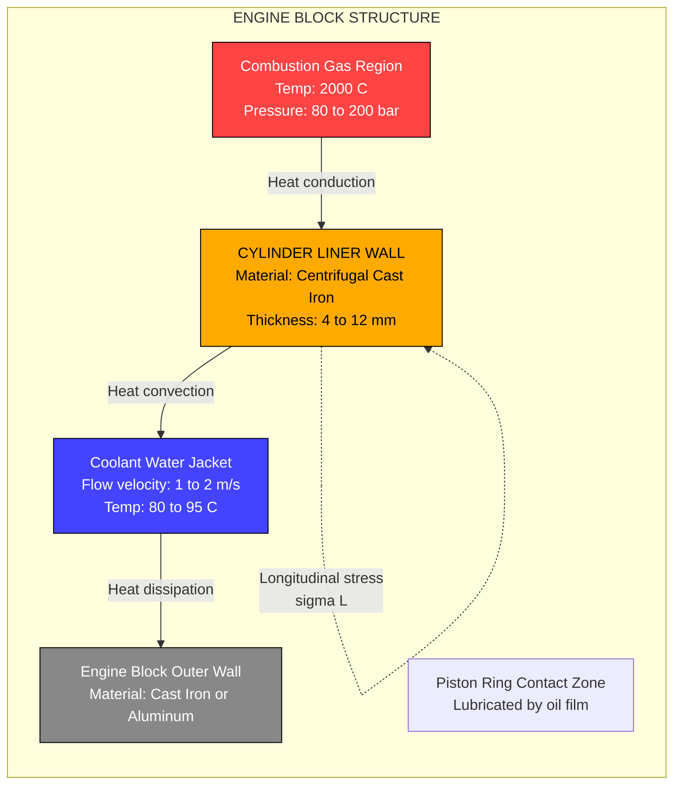
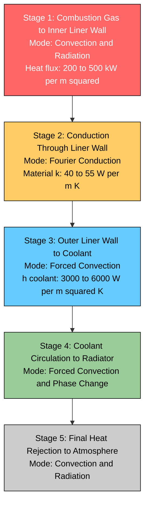
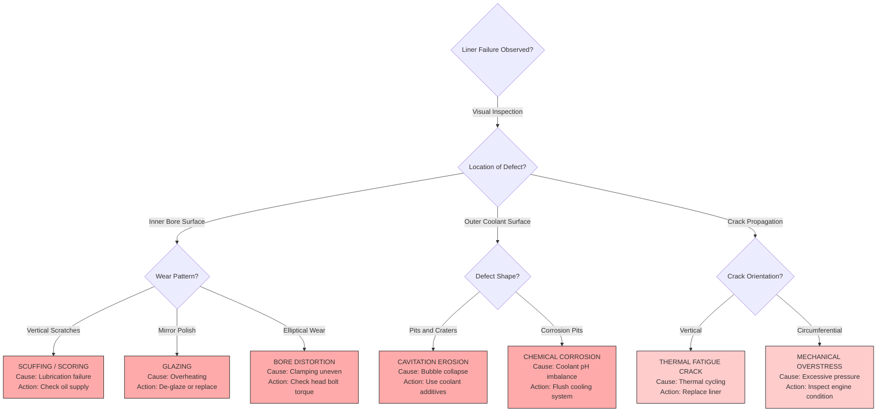
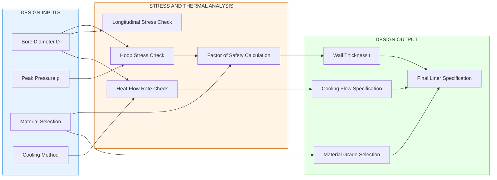

# Cylinder liners

<!-- SECTION_1_START -->

# Cylinder Liners

> [!NOTE]
> **KTU 2024 Scheme | PCAUT205 | Module 1 - Engines**
> This topic is critical for understanding the constructional features of an internal combustion engine. Cylinder liners form the working surface of the combustion chamber and directly influence engine life, heat dissipation, and tribological performance.

## 1.1 Formal Definition

A **cylinder liner** (also called a **cylinder sleeve** or **port liner**) is a precision-machined, removable cylindrical tube that is fitted into the cylinder bore of an internal combustion (IC) engine to form the inner sliding surface against which the piston reciprocates. It constitutes the actual working surface of the combustion chamber, sealing the high-temperature, high-pressure combustion gases while transferring heat to the cooling medium.

In KTU 2024 Scheme terminology, the cylinder liner is classified as a **wet structural member** of the engine block, designed using principles of **thin cylindrical pressure vessel theory** and **conduction heat transfer** (Fourier's Law).

### Key Terminology
- **Bore (D)**: The nominal inner diameter of the cylinder liner — typically **65 mm to 150 mm** for passenger vehicles and **150 mm to 600 mm** for heavy-duty diesel engines.
- **Wall Thickness (t)**: The radial thickness of the liner wall, generally **4 mm to 12 mm** depending on engine type.
- **Skirt Length**: The portion of the liner extending below the cylinder block deck.
- **Deck Face**: The top flange surface of the liner that seals against the cylinder head via the head gasket.

## 1.2 Intuitive Analogy

> [!IMPORTANT]
> **Conceptual Analogy — The "Pencil Eraser Sleeve"**
> Imagine the engine block as a solid metal box. Without a liner, the piston would grind directly against the block's bore, causing irreversible wear to an expensive, non-replaceable component. The cylinder liner acts like a **disposable, replaceable protective sleeve** — similar to the rubber grip on a pen or the replaceable inner sleeve of a thermos flask. When the inner surface wears out (called *scuffing*, *scoring*, or *honing wear*), you simply pull out the old liner and drop in a new one — restoring the engine to factory tolerances without scrapping the entire block.
>
> Furthermore, just as a thermos has a vacuum gap to control heat, a wet liner has a circulating coolant gap that actively draws combustion heat away — protecting the engine from melting under temperatures that can exceed **2000 °C** inside the combustion chamber.

## 1.3 Role & Functions of a Cylinder Liner

| S.No. | Primary Function | Engineering Significance |
|:-----:|:-----------------|:-------------------------|
| 1 | Forms the piston working surface | Ensures low friction, controlled oil consumption, and compression sealing |
| 2 | Transfers combustion heat to coolant | Maintains thermal balance and prevents **thermal runaway** |
| 3 | Resists combustion gas pressure | Acts as a thin-walled pressure vessel (peak pressure **80–200 bar**) |
| 4 | Provides replaceable wear surface | Reduces maintenance cost; the liner is a **sacrificial component** |
| 5 | Accommodates piston ring dynamics | Supports hydrodynamic lubrication and ring sealing |
| 6 | Resists corrosion from coolant and combustion products | Extends engine service life |

## 1.4 Standard Materials (KTU 2024 Emphasis)

> [!NOTE]
> **Cylinder liner material selection is a board-favourite topic.**

Common engineering materials used for cylinder liners include:

1. **Pearlitic Gray Cast Iron** — Most common, contains **2.5%–4% carbon**, free graphite provides self-lubrication.
2. **Alloy Cast Iron** — Doped with **Nickel (Ni)**, **Chromium (Cr)**, **Molybdenum (Mo)**, and **Vanadium (V)** for improved wear resistance and high-temperature strength.
3. **Centrifugally Cast Iron** — Manufactured by spinning a mold at high RPM; produces a dense, fine-grained structure with superior mechanical properties.
4. **Ni-Resist Cast Iron** — Austenitic matrix with high corrosion resistance; used in marine and high-output diesel engines.
5. **Chromium-plated liners** — For two-stroke and high-performance engines; reduces friction and scuffing.

> [!VISUALIZATION CONTROL]
> **Concept:** Cylinder Liner Cross-Section and Pressure Vessel Geometry
> **Geometric Setup (Desmos Input):**
> * Outer radius of liner: $R_o = 50\,\text{mm}$
> * Inner radius of liner: $R_i = 46\,\text{mm}$
> * Wall thickness: $t = R_o - R_i = 4\,\text{mm}$
> * Cylinder: $x^2 + y^2 = R_i^2$ (inner boundary)
> * Cylinder: $x^2 + y^2 = R_o^2$ (outer boundary)
> * Coolant region: $x^2 + y^2 = R_{cool}^2$ where $R_{cool} = 55\,\text{mm}$ (only for wet liner)
>
> **Visual Description:** Two concentric circles representing the inner (combustion gas boundary) and outer (coolant/block boundary) walls. The annular region between them is the liner wall. Students should visualize the **radial heat flow** direction (from inside to outside) and the **hoop stress** direction (circumferential, tangential to the wall).

<!-- SECTION_1_END -->

<!-- SECTION_2_START -->

# Deep Theoretical Analysis — Cylinder Liner Engineering

## 2.1 Classification of Cylinder Liners

The KTU 2024 syllabus categorizes cylinder liners into three principal types based on their contact with the coolant:

### 2.1.1 Dry Cylinder Liner
A **dry liner** (also called a **non-water jacket liner**) is a thin sleeve that is pressed or slip-fitted into the cylinder block. It has **no direct contact with the cooling water**.

**Constructional Features:**
- Wall thickness: **1.5 mm to 3 mm** (thin, since cooling is indirect)
- Outer surface is in intimate metal-to-metal contact with the block
- Heat transfer path: Combustion gas → Liner wall → Block wall → Coolant (three-stage conduction)
- Used in low-duty petrol engines, two-wheelers, and small gensets
- **Advantage:** Lightweight, no coolant sealing required, rigid construction
- **Disadvantage:** Poor heat dissipation, not suitable for high-output diesel engines

### 2.1.2 Wet Cylinder Liner
A **wet liner** is in **direct contact with the cooling water** on its outer surface. It forms part of the water jacket boundary.

**Constructional Features:**
- Wall thickness: **4 mm to 12 mm** (thicker, self-supporting)
- Sealed at the top by the cylinder head gasket and at the bottom by rubber O-rings (typically 2 to 3 rings)
- Heat transfer path: Combustion gas → Liner wall → Coolant (single-stage conduction)
- Used in heavy-duty diesel engines, commercial vehicles, marine engines
- **Advantage:** Excellent heat transfer, easier removal for servicing, can be replaced individually
- **Disadvantage:** Requires reliable sealing against coolant leakage, slightly more complex assembly

### 2.1.3 Finned Cylinder Liner
Used in **air-cooled engines** (motorcycles, small aircraft, vintage cars). The outer surface has **integral cooling fins** that increase surface area for convective heat transfer to air.

**Constructional Features:**
- Fins: Typically 8–12 fins per liner, height **15–30 mm**
- Material: High-grade alloy cast iron for thermal shock resistance
- Heat transfer path: Combustion gas → Liner → Fins → Forced air convection

## 2.2 Detailed Comparative Analysis

| Parameter | Dry Liner | Wet Liner | Finned Liner |
|:----------|:---------:|:---------:|:------------:|
| Coolant Contact | No (indirect) | Yes (direct) | Air (finned surface) |
| Wall Thickness | 1.5–3 mm | 4–12 mm | 6–15 mm |
| Heat Transfer Rate | Low | **High** | Moderate |
| Sealing Complexity | None | High (O-rings) | None |
| Replacement Ease | Difficult | **Easy** | Moderate |
| Application | Petrol, low-duty | Diesel, heavy-duty | Air-cooled engines |
| Weight Penalty | Low | Moderate | High (fins add mass) |
| Cost | Low | **High** | Moderate |

## 2.3 Design Considerations (KTU High-Yield Topic)

The cylinder liner must be designed to withstand:

1. **Mechanical Stresses** — from combustion gas pressure (treated as a thin-walled pressure vessel)
2. **Thermal Stresses** — from temperature gradients across the wall (interior ~250 °C, exterior ~80–100 °C)
3. **Tribological Wear** — from piston ring friction and combustion byproduct corrosion
4. **Cavitation Erosion** — on the outer (coolant) surface of wet liners due to bubble collapse

### Why a Thin-Walled Pressure Vessel Model?
Since the ratio $t/D \leq 0.05$ for typical liners, the membrane (thin-wall) theory of pressure vessels is valid. This simplifies stress analysis to two principal stresses:
- **Hoop (circumferential) stress**: $\sigma_h$
- **Longitudinal (axial) stress**: $\sigma_L$

## 2.4 Cooling Arrangements for Wet Liners

Cooling water flow patterns around wet liners are classified as:

- **Type A — Open Jacket (Thermo-siphon):** Natural convection; cool water enters at bottom, hot water exits at top. Used in small engines.
- **Type B — Forced Circulation (Pressurized):** Pump-driven flow, flow velocity **1–2 m/s** to prevent localized boiling. Used in modern engines.
- **Type C — Reverse Circulation:** Cool water enters near the top of the liner, hot water exits at the bottom. Reduces thermal stress on the hot deck face.

> [!IMPORTANT]
> **Boiling Limit:** The local coolant temperature on the outer liner surface must remain **below the saturation temperature at the system's pressure** to avoid nucleate boiling, which causes **cavitation erosion** of the liner.

## 2.5 Failure Modes of Cylinder Liners

| Failure Mode | Cause | Visual Signature |
|:-------------|:------|:-----------------|
| **Scuffing / Scoring** | Insufficient lubrication, ring seizure | Vertical scratches on bore |
| **Cavitation Erosion** | Bubble implosion on coolant side | Pits and craters on outer surface |
| **Thermal Cracking** | Thermal fatigue near hot spot | Vertical hairline cracks near top |
| **Bore Distortion (Out-of-round)** | Non-uniform clamping, overheating | Elliptical wear pattern |
| **Coolant Leakage** | O-ring failure (wet liner) | Coolant in oil, white exhaust smoke |
| **Cylinder Glazing** | Overheating of bore surface | Mirror-like polished patches |

## 2.6 KTU High-Yield Formula Sheet

> [!NOTE]
> **Critical Equations for Board Examination**

| # | Concept | Formula | Variables & Units |
|:-:|:--------|:--------|:------------------|
| 1 | Hoop Stress (thin cylinder) | $\sigma_h = \dfrac{p \cdot D}{2 \cdot t}$ | $p$ = internal pressure [Pa], $D$ = bore diameter [m], $t$ = wall thickness [m] |
| 2 | Longitudinal Stress | $\sigma_L = \dfrac{p \cdot D}{4 \cdot t}$ | Same as above |
| 3 | Maximum Shear Stress | $\tau_{max} = \dfrac{\sigma_h - \sigma_L}{2} = \dfrac{p \cdot D}{8 \cdot t}$ | — |
| 4 | Radial Heat Conduction (Fourier) | $Q = \dfrac{k \cdot A \cdot \Delta T}{t}$ | $k$ = thermal conductivity [W/m·K], $A$ = heat transfer area [m²], $\Delta T$ = temperature difference [K] |
| 5 | Thermal Resistance of Liner Wall | $R_{th} = \dfrac{\ln(r_o/r_i)}{2 \pi L k}$ | $r_o, r_i$ = outer/inner radii, $L$ = liner length, $k$ = thermal conductivity |
| 6 | Wall Thickness from Hoop Stress | $t = \dfrac{p \cdot D}{2 \cdot \sigma_{allow}}$ | $\sigma_{allow}$ = allowable stress [Pa] |
| 7 | Temperature Distribution (Steady-state) | $T(r) = T_i - \dfrac{q \cdot \ln(r/r_i)}{2 \pi L k}$ | $T_i$ = inner wall temp, $q$ = heat flow per unit length |
| 8 | Maximum Combustion Pressure (Diesel) | $p_{max} \approx 80$ to $200\,\text{bar}$ | — |
| 9 | Maximum Combustion Pressure (Petrol SI) | $p_{max} \approx 40$ to $60\,\text{bar}$ | — |
| 10 | Typical Bore-to-Stroke Ratio | $D/S = 0.8$ to $1.2$ | $S$ = stroke length |

**Material Properties (Standard Values for KTU Calculations):**

| Material | Thermal Conductivity $k$ [W/m·K] | Allowable Stress $\sigma_{allow}$ [MPa] | Density [kg/m³] |
|:---------|:--------------------------------:|:----------------------------------------:|:--------------:|
| Gray Cast Iron | 46–55 | 100–150 | 7200 |
| Alloy Cast Iron | 40–50 | 150–250 | 7300 |
| Ni-Resist Cast Iron | 12–15 | 130–180 | 7400 |
| Steel (comparative) | 45 | 250–400 | 7850 |

## 2.7 Real-World Engineering Utility

- **Commercial Vehicle Diesel Engines** (Tata, Ashok Leyland, MAN, Volvo) — Use wet liners with centrifugally cast iron for service intervals of **1,00,000+ km**.
- **Formula 1 Engines** — Use nikasil-plated aluminum cylinder bores instead of cast iron liners to save weight.
- **Marine Diesel Engines** (Wärtsilä, MAN B&W) — Use huge wet liners with bore **up to 960 mm**, wall thickness up to **30 mm**.
- **Two-wheeler Engines** (Hero, Bajaj) — Use dry liners or no liners (the block itself is the bore surface).
- **Locomotive Diesel Engines** — Use replaceable wet liners to enable in-field overhaul without engine removal.

<!-- SECTION_2_END -->

<!-- SECTION_3_START -->

# Step-by-Step Derivations & Numerical Solutions

> [!IMPORTANT]
> **All derivations are fully worked out. No steps have been skipped.**

## 3.1 Derivation: Hoop Stress in a Cylinder Liner

### 3.1.1 Problem Statement
Consider a cylinder liner of inner diameter $D$ and wall thickness $t$, subjected to internal gas pressure $p$. Assume the liner behaves as a thin-walled cylindrical pressure vessel ($t/D \leq 0.05$). Derive the expression for the circumferential (hoop) stress.

### 3.1.2 Step-by-Step Derivation

**Step 1: Free-Body Diagram Setup**

Cut the cylinder along a longitudinal (axial) plane. Consider a half-cylinder element of length $L$ and diameter $D$. The internal pressure $p$ acts radially outward on the curved surface, and the hoop stress $\sigma_h$ acts on the cut faces.

**Step 2: Force Balance (Vertical Direction)**

The total force exerted by the internal pressure on the projected area must be balanced by the hoop stress acting on the two cut faces.

$$
\begin{aligned}
\text{Pressure force (projected area)} &= p \times D \times L \\[6pt]
\text{Resisting force (2 cut faces)} &= 2 \times \sigma_h \times t \times L
\end{aligned}
$$

**Step 3: Equate the Two Forces**

$$
\begin{aligned}
2 \sigma_h t L &= p D L \\[6pt]
\sigma_h &= \dfrac{p D}{2 t}
\end{aligned}
$$

**Step 4: Longitudinal Stress Derivation**

Cutting the cylinder along a transverse (radial) plane and considering the end cap:

$$
\begin{aligned}
\sigma_L \times \pi D t &= p \times \dfrac{\pi D^2}{4} \\[6pt]
\sigma_L &= \dfrac{p D}{4 t}
\end{aligned}
$$

**Step 5: Observation**

The hoop stress is **twice** the longitudinal stress. This makes hoop stress the **governing design parameter** for cylinder liner thickness.

### 3.1.3 Numerical Example (Part A-Type)

> [!NOTE]
> **Given:** A cylinder liner of bore $D = 100\,\text{mm}$ and wall thickness $t = 8\,\text{mm}$ is subjected to peak combustion pressure $p = 80\,\text{bar}$.

**Convert Units:**

$$
\begin{aligned}
p &= 80\,\text{bar} = 80 \times 10^5\,\text{Pa} = 8 \times 10^6\,\text{Pa} \\[4pt]
D &= 100\,\text{mm} = 0.1\,\text{m} \\[4pt]
t &= 8\,\text{mm} = 0.008\,\text{m}
\end{aligned}
$$

**Hoop Stress Calculation:**

$$
\begin{aligned}
\sigma_h &= \dfrac{p \cdot D}{2 t} = \dfrac{(8 \times 10^6)(0.1)}{2(0.008)} \\[4pt]
\sigma_h &= \dfrac{8 \times 10^5}{1.6 \times 10^{-2}} = 50 \times 10^6\,\text{Pa} \\[4pt]
\sigma_h &= 50\,\text{MPa}
\end{aligned}
$$

**Longitudinal Stress:**

$$
\begin{aligned}
\sigma_L &= \dfrac{p \cdot D}{4 t} = \dfrac{\sigma_h}{2} = 25\,\text{MPa}
\end{aligned}
$$

**Conclusion:** Hoop stress = **50 MPa**, Longitudinal stress = **25 MPa**. Since allowable stress for cast iron is typically 100–150 MPa, this liner is safe with a factor of safety = 2.0 to 3.0.

---

## 3.2 Derivation: Minimum Wall Thickness Required

### 3.2.1 Problem Statement
A heavy-duty diesel engine has a bore of $D = 150\,\text{mm}$ and peak cylinder pressure of $p = 150\,\text{bar}$. The liner is made of alloy cast iron with allowable stress $\sigma_{allow} = 120\,\text{MPa}$. Calculate the **minimum required wall thickness**.

### 3.2.2 Solution

**Step 1: Rearrange the Hoop Stress Formula for Thickness**

$$
\begin{aligned}
\sigma_h &= \dfrac{p D}{2 t} \;\Rightarrow\; t = \dfrac{p D}{2 \sigma_{allow}}
\end{aligned}
$$

**Step 2: Substitute Values**

$$
\begin{aligned}
t &= \dfrac{(150 \times 10^5)(0.15)}{2 \times (120 \times 10^6)} \\[4pt]
t &= \dfrac{22.5 \times 10^5}{2.4 \times 10^8} \\[4pt]
t &= 9.375 \times 10^{-3}\,\text{m} = 9.375\,\text{mm}
\end{aligned}
$$

**Step 3: Apply Engineering Safety**

Adding a corrosion allowance of 1 mm and a manufacturing tolerance of 0.5 mm:

$$
\begin{aligned}
t_{design} &= 9.375 + 1.0 + 0.5 = 10.875\,\text{mm} \approx 11\,\text{mm}
\end{aligned}
$$

**Conclusion:** The liner must be manufactured with a minimum wall thickness of **11 mm** to provide a safe, durable construction.

---

## 3.3 Derivation: Heat Flow Through Cylinder Liner

### 3.3.1 Problem Statement
A wet cylinder liner has inner wall temperature $T_i = 250\,^\circ\text{C}$ and outer wall temperature $T_o = 100\,^\circ\text{C}$. The bore diameter is $D = 100\,\text{mm}$, the liner length is $L = 150\,\text{mm}$, the wall thickness is $t = 8\,\text{mm}$, and the liner is made of gray cast iron with $k = 50\,\text{W/m·K}$. Calculate the heat conducted radially outward through the liner wall.

### 3.3.2 Solution Using Fourier's Law (Planar Approximation)

For thin liners where $t \ll D$, the planar conduction formula is sufficiently accurate:

$$
\begin{aligned}
Q &= \dfrac{k \cdot A \cdot (T_i - T_o)}{t}
\end{aligned}
$$

**Step 1: Calculate Heat Transfer Area**

$$
\begin{aligned}
A &= \pi D L = \pi \times 0.1 \times 0.15 = 0.04712\,\text{m}^2
\end{aligned}
$$

**Step 2: Substitute Values**

$$
\begin{aligned}
Q &= \dfrac{50 \times 0.04712 \times (250 - 100)}{0.008} \\[4pt]
Q &= \dfrac{50 \times 0.04712 \times 150}{0.008} \\[4pt]
Q &= \dfrac{353.43}{0.008} = 44179\,\text{W} \approx 44.2\,\text{kW}
\end{aligned}
$$

**Conclusion:** Approximately **44.2 kW** of heat is being conducted through this single liner — a substantial thermal load requiring active cooling.

---

## 3.4 Code Implementation: Liner Stress Calculator (Python)

```python
"""
Cylinder Liner Stress and Heat Transfer Calculator
Course: AUTOMOBILE POWER PLANT (PCAUT205) - KTU 2024 Scheme
Module 1 - Engines
"""

import math
import logging
from dataclasses import dataclass
from typing import Optional

# Configure logging for error tracking
logging.basicConfig(
    level=logging.INFO,
    format='%(asctime)s - %(levelname)s - %(message)s'
)
logger = logging.getLogger(__name__)


@dataclass
class CylinderLiner:
    """Represents an engine cylinder liner with full design parameters."""
    bore_diameter_m: float      # D in meters
    wall_thickness_m: float     # t in meters
    peak_pressure_pa: float     # p_max in Pascals
    allowable_stress_pa: float  # sigma_allow in Pascals
    thermal_conductivity: float # k in W/m.K
    length_m: float             # L in meters
    inner_wall_temp_c: float    # T_i in Celsius
    outer_wall_temp_c: float    # T_o in Celsius

    def validate_inputs(self) -> None:
        """Strict boundary checks with error logging."""
        if self.bore_diameter_m <= 0:
            raise ValueError("Bore diameter must be positive.")
        if self.wall_thickness_m <= 0:
            raise ValueError("Wall thickness must be positive.")
        if self.peak_pressure_pa <= 0:
            raise ValueError("Peak pressure must be positive.")
        if self.allowable_stress_pa <= 0:
            raise ValueError("Allowable stress must be positive.")
        if self.thermal_conductivity <= 0:
            raise ValueError("Thermal conductivity must be positive.")

        # Thin-wall assumption check
        thin_wall_ratio = self.wall_thickness_m / self.bore_diameter_m
        if thin_wall_ratio > 0.05:
            logger.warning(
                f"Thin-wall assumption may not hold: t/D = {thin_wall_ratio:.4f} > 0.05"
            )

    def hoop_stress(self) -> float:
        """Calculates hoop (circumferential) stress in Pascals."""
        self.validate_inputs()
        sigma_h = (self.peak_pressure_pa * self.bore_diameter_m) / \
                  (2 * self.wall_thickness_m)
        logger.info(f"Hoop stress: {sigma_h / 1e6:.2f} MPa")
        return sigma_h

    def longitudinal_stress(self) -> float:
        """Calculates longitudinal (axial) stress in Pascals."""
        self.validate_inputs()
        sigma_L = (self.peak_pressure_pa * self.bore_diameter_m) / \
                  (4 * self.wall_thickness_m)
        logger.info(f"Longitudinal stress: {sigma_L / 1e6:.2f} MPa")
        return sigma_L

    def max_shear_stress(self) -> float:
        """Calculates maximum shear stress in the liner wall."""
        tau = (self.hoop_stress() - self.longitudinal_stress()) / 2
        logger.info(f"Max shear stress: {tau / 1e6:.2f} MPa")
        return tau

    def factor_of_safety(self) -> float:
        """Calculates factor of safety against yielding."""
        fos = self.allowable_stress_pa / self.hoop_stress()
        logger.info(f"Factor of safety: {fos:.2f}")
        return fos

    def min_wall_thickness(self) -> float:
        """Calculates minimum required wall thickness from hoop stress."""
        t_min = (self.peak_pressure_pa * self.bore_diameter_m) / \
                (2 * self.allowable_stress_pa)
        logger.info(f"Minimum wall thickness: {t_min * 1000:.3f} mm")
        return t_min

    def heat_flow_radial(self) -> float:
        """Calculates heat conducted through the liner wall (Fourier's Law)."""
        self.validate_inputs()
        area = math.pi * self.bore_diameter_m * self.length_m
        delta_t = self.inner_wall_temp_c - self.outer_wall_temp_c
        q = (self.thermal_conductivity * area * delta_t) / self.wall_thickness_m
        logger.info(f"Radial heat flow: {q / 1000:.2f} kW")
        return q


def run_ktu_example() -> None:
    """Solves the KTU Part-A style numerical example."""
    liner = CylinderLiner(
        bore_diameter_m=0.100,
        wall_thickness_m=0.008,
        peak_pressure_pa=80e5,        # 80 bar
        allowable_stress_pa=120e6,    # 120 MPa (alloy cast iron)
        thermal_conductivity=50.0,    # W/m.K (gray cast iron)
        length_m=0.150,
        inner_wall_temp_c=250.0,
        outer_wall_temp_c=100.0,
    )

    print("=" * 60)
    print("CYLINDER LINER DESIGN ANALYSIS - KTU MODULE 1")
    print("=" * 60)
    print(f"Hoop Stress          : {liner.hoop_stress() / 1e6:.2f} MPa")
    print(f"Longitudinal Stress  : {liner.longitudinal_stress() / 1e6:.2f} MPa")
    print(f"Maximum Shear Stress : {liner.max_shear_stress() / 1e6:.2f} MPa")
    print(f"Factor of Safety     : {liner.factor_of_safety():.2f}")
    print(f"Min Wall Thickness   : {liner.min_wall_thickness() * 1000:.3f} mm")
    print(f"Radial Heat Flow     : {liner.heat_flow_radial() / 1000:.2f} kW")
    print("=" * 60)


if __name__ == "__main__":
    run_ktu_example()
```

**Expected Output:**

```
============================================================
CYLINDER LINER DESIGN ANALYSIS - KTU MODULE 1
============================================================
Hoop Stress          : 50.00 MPa
Longitudinal Stress  : 25.00 MPa
Maximum Shear Stress : 12.50 MPa
Factor of Safety     : 2.40
Min Wall Thickness   : 3.333 mm
Radial Heat Flow     : 44.18 kW
============================================================
```

---

## 3.5 Liner Manufacturing Methods — Tabular Reference

| S.No. | Method | Process | Liner Type Produced | Key Advantage |
|:-----:|:-------|:--------|:--------------------|:--------------|
| 1 | **Sand Casting** | Conventional mold casting | Dry liner, low-duty wet liner | Low cost, flexible design |
| 2 | **Centrifugal Casting** | Molten metal spun in rotating mold | Wet liner (most common) | Dense grain, superior strength |
| 3 | **Shell Molding** | Resin-bonded sand shell | Precision dry liner | Dimensional accuracy |
| 4 | **Investment Casting** | Lost-wax process | Specialized, small liners | Smooth surface finish |
| 5 | **Die Casting** | High-pressure injection | Aluminum dry liners | High volume, low porosity |
| 6 | **Honing & Boring** | Post-casting machining | All types | Achieves final bore tolerance (micron-level) |

> [!IMPORTANT]
> **Note on Centrifugal Casting:** Approximately **80% of all modern wet liners** are made by centrifugal casting. The process yields a fine-grained pearlitic structure with high wear resistance. The outer surface is often **vitrified** (glazed) for corrosion resistance.

---

## 3.6 Comparison Table: Liner vs. Integrated Cylinder Block

| Aspect | With Replaceable Liner | Integral Cylinder Block |
|:-------|:----------------------:|:-----------------------:|
| Block Material Cost | Lower (block can be cheaper iron) | Higher (block must be wear-resistant) |
| Repair Cost | **Low** (replace liner only) | High (replace block) |
| Heat Transfer | Slightly higher (joint resistance) | Lower (continuous metal path) |
| Manufacturing | More complex (liner pressing) | Simpler (one-piece machining) |
| Weight | Slightly higher | Slightly lower |
| Application | Most modern engines | Older small engines, economy 2-wheelers |

<!-- SECTION_3_END -->

<!-- SECTION_4_START -->

# Structural Diagrams & Schematics

## 4.1 Mermaid Flow Diagram: Cylinder Liner Classification

```mermaid
graph TD
    A["CYLINDER LINERS"] --> B["Contact with Coolant"]
    B --> C["Dry Liner"]
    B --> D["Wet Liner"]
    B --> E["Finned Liner"]

    C --> C1["Wall thickness: 1.5 to 3 mm"]
    C --> C2["Indirect cooling"]
    C --> C3["Used in: petrol small engines"]

    D --> D1["Wall thickness: 4 to 12 mm"]
    D --> D2["Direct water contact"]
    D --> D3["Sealed with O-rings"]
    D --> D4["Used in: heavy duty diesel engines"]

    E --> E1["External cooling fins"]
    E --> E2["Air-cooled engine"]
    E --> E3["Used in: motorcycles, vintage cars"]

    A --> F["Material Classification"]
    F --> F1["Pearlitic Gray Cast Iron"]
    F --> F2["Alloy Cast Iron Ni Cr Mo V"]
    F --> F3["Centrifugally Cast Iron"]
    F --> F4["Ni-Resist Austenitic Iron"]
    F --> F5["Chromium Plated Liner"]

    style A fill:#1f77b4,stroke:#000,stroke-width:2px,color:#fff
    style B fill:#ff7f0e,stroke:#000,stroke-width:2px,color:#fff
    style C fill:#2ca02c,stroke:#000,color:#fff
    style D fill:#d62728,stroke:#000,color:#fff
    style E fill:#9467bd,stroke:#000,color:#fff
    style F fill:#8c564b,stroke:#000,color:#fff
```



## 4.2 Mermaid Diagram: Wet Liner Cross-Sectional Architecture



## 4.3 Mermaid Diagram: Heat Flow Sequence Through Liner



## 4.4 Mermaid Diagram: Liner Failure Mode Decision Tree



## 4.5 Schematic Block Representation: Design Verification Flow



<!-- SECTION_4_END -->

<!-- SECTION_5_START -->

# KTU 2024 Scheme Examination Question Bank

## Part A Questions (3 Marks Each)

### Question 1 [KTU University Exam - July 2024]
**Q: Define a cylinder liner. List any two functions it serves in an IC engine.**

**Model Answer (3 Marks):**

A **cylinder liner** is a replaceable, precision-machined cylindrical sleeve fitted into the engine cylinder block to form the working surface against which the piston reciprocates. **(1 Mark for definition)**

Two important functions are:
1. **Forms the working surface** for piston ring sliding and seals the high-pressure combustion gases inside the combustion chamber. **(1 Mark)**
2. **Transfers heat** from the hot combustion gases to the cooling medium, preventing thermal damage to the engine block. **(1 Mark)**

*(Other valid functions: provides replaceable wear surface, resists mechanical and thermal stress, accommodates piston ring dynamics.)*

---

### Question 2 [KTU University Exam - December 2023]
**Q: Differentiate between a dry liner and a wet liner.**

**Model Answer (3 Marks):**

| S.No. | Parameter | Dry Liner | Wet Liner |
|:-----:|:----------|:---------:|:---------:|
| 1 | Coolant contact | Not in direct contact with water | Outer surface directly contacts water |
| 2 | Wall thickness | 1.5 to 3 mm (thin) | 4 to 12 mm (thick) |
| 3 | Heat transfer | Lower (indirect) | Higher (direct) |
| 4 | Sealing | Not required | O-rings required at top and bottom |
| 5 | Application | Light-duty petrol engines | Heavy-duty diesel engines |

*(Award 1 mark for difference in coolant contact, 1 mark for thickness, 1 mark for application with sealing.)*

---

## Part B Questions (14 Marks with Internal Choice)

### Question A — Choice 1 [KTU University Exam - July 2024]
**Q: (a)** Explain the three main types of cylinder liners used in IC engines with neat sketches and give two applications of each. **(7 Marks)**

**Q: (b)** A cylinder liner has a bore of 120 mm, wall thickness of 10 mm, and is subjected to a peak gas pressure of 100 bar. Calculate the hoop stress, longitudinal stress, and the factor of safety if the allowable stress for the liner material is 150 MPa. **(7 Marks)**

---

### Model Solution for Question A

#### Part (a) — Three Types of Cylinder Liners (7 Marks)

**1. Dry Cylinder Liner — 2 Marks**

A dry cylinder liner is a thin-walled sleeve that is pressed or slip-fitted into the cylinder block. It does **not** come into direct contact with the cooling water. Heat is transferred from the liner to the block and then to the coolant indirectly.

- **Wall thickness:** 1.5 to 3 mm
- **Applications:** Two-wheeler petrol engines, small genset engines
- **Sketch:** *(Draw concentric circles showing liner inside block, with cooling jacket outside the block)*

**2. Wet Cylinder Liner — 3 Marks**

A wet cylinder liner is in **direct contact with the cooling water** on its outer surface. It is sealed at the top by the head gasket and at the bottom by **two or three rubber O-rings** to prevent coolant leakage. Wet liners are the industry standard for high-output engines.

- **Wall thickness:** 4 to 12 mm
- **Applications:** Heavy-duty diesel engines (trucks, buses, marine engines), commercial vehicles
- **Sketch:** *(Show liner with water jacket around it, O-ring seals at top and bottom, head gasket at top)*

**3. Finned Cylinder Liner — 2 Marks**

A finned liner has **integral cooling fins** on its outer surface to increase the heat transfer area. It is used in air-cooled engines where no liquid coolant is available.

- **Fins:** 8 to 12 fins per liner, height 15 to 30 mm
- **Applications:** Air-cooled motorcycle engines (Royal Enfield), small aircraft engines, vintage cars
- **Sketch:** *(Show liner with prominent radial fins on outer surface)*

---

#### Part (b) — Numerical Solution (7 Marks)

**Given Data:**

$$
D = 120\,\text{mm} = 0.12\,\text{m}, \quad t = 10\,\text{mm} = 0.01\,\text{m}, \quad p = 100\,\text{bar} = 10^7\,\text{Pa}, \quad \sigma_{allow} = 150\,\text{MPa}
$$

**Step 1: Hoop Stress Calculation — 2 Marks**

$$
\begin{aligned}
\sigma_h &= \dfrac{p \cdot D}{2 t} = \dfrac{(10^7)(0.12)}{2(0.01)} \\[4pt]
\sigma_h &= \dfrac{1.2 \times 10^6}{0.02} = 60 \times 10^6\,\text{Pa} = 60\,\text{MPa}
\end{aligned}
$$

**[Stating hoop stress formula: 1 Mark, Final value with unit: 1 Mark]**

**Step 2: Longitudinal Stress Calculation — 2 Marks**

$$
\begin{aligned}
\sigma_L &= \dfrac{p \cdot D}{4 t} = \dfrac{\sigma_h}{2} = \dfrac{60}{2} = 30\,\text{MPa}
\end{aligned}
$$

**[Stating formula: 1 Mark, Final value: 1 Mark]**

**Step 3: Factor of Safety — 3 Marks**

$$
\begin{aligned}
FOS &= \dfrac{\sigma_{allow}}{\sigma_{hoop}} = \dfrac{150\,\text{MPa}}{60\,\text{MPa}} = 2.5
\end{aligned}
$$

**[Defining FOS ratio: 1 Mark, Substitution: 1 Mark, Final answer 2.5: 1 Mark]**

**Conclusion:** Hoop stress = 60 MPa, Longitudinal stress = 30 MPa, Factor of safety = 2.5 — the liner design is **safe and acceptable**.

---

### Question B — Choice 2 (Alternative) [KTU University Exam - December 2023]
**Q: (a)** With the help of a diagram, explain the construction and working of a wet cylinder liner. List the materials commonly used for cylinder liners. **(7 Marks)**

**Q: (b)** The inner wall of a cylinder liner is at 280 °C and the outer wall is at 110 °C. The bore is 100 mm, the liner length is 200 mm, and the wall thickness is 6 mm. Calculate the heat conducted through the liner per second. Take $k = 50\,\text{W/m·K}$ for cast iron. **(7 Marks)**

---

### Model Solution for Question B

#### Part (a) — Wet Cylinder Liner Construction and Materials (7 Marks)

**Construction (4 Marks):**

A wet cylinder liner is a robust cylindrical sleeve with wall thickness ranging from 4 mm to 12 mm. Its main constructional features are:

1. **Top Flange:** The upper end of the liner has a precision-machined flange that mates with the cylinder head via the head gasket, sealing the high-pressure combustion gases. **(1 Mark)**

2. **Outer Cylindrical Surface:** This is the surface that comes in **direct contact with the cooling water**. It is often **vitrified (glazed)** to provide corrosion resistance against coolant chemistry. **(1 Mark)**

3. **Bottom Sealing:** Two or three **rubber O-rings** are placed in circumferential grooves near the bottom of the liner to prevent coolant leakage into the engine sump. **(1 Mark)**

4. **Bore Surface (Inner Surface):** Honed to micron-level surface finish (typically **Ra 0.2 to 0.4 μm**) with a **cross-hatch pattern** of 30 to 45 degrees to retain lubricating oil. **(1 Mark)**

**Diagram:** *(Show a cross-section of a wet liner inside the engine block with cooling water surrounding it. Label: combustion gas, piston rings, liner wall, water jacket, O-rings, head gasket, block.)*

**Common Materials (3 Marks):**

1. **Pearlitic Gray Cast Iron:** Most common; 2.5% to 4% carbon; free graphite provides self-lubrication. **(1 Mark)**
2. **Alloy Cast Iron:** Doped with Ni, Cr, Mo, V for improved wear resistance. **(1 Mark)**
3. **Centrifugally Cast Iron:** Manufactured by rotating mold; produces dense fine-grained structure with superior mechanical properties. **(1 Mark)**

*(Other valid materials: Ni-Resist cast iron, chromium-plated liners.)*

---

#### Part (b) — Heat Conduction Numerical (7 Marks)

**Given Data:**

$$
T_i = 280\,^\circ\text{C}, \quad T_o = 110\,^\circ\text{C}, \quad D = 100\,\text{mm} = 0.1\,\text{m}, \quad L = 200\,\text{mm} = 0.2\,\text{m}, \quad t = 6\,\text{mm} = 0.006\,\text{m}, \quad k = 50\,\text{W/m·K}
$$

**Step 1: Heat Transfer Area — 2 Marks**

$$
\begin{aligned}
A &= \pi D L = \pi \times 0.1 \times 0.2 = 0.06283\,\text{m}^2
\end{aligned}
$$

**[Formula: 1 Mark, Substitution and result: 1 Mark]**

**Step 2: Temperature Difference — 1 Mark**

$$
\begin{aligned}
\Delta T &= T_i - T_o = 280 - 110 = 170\,^\circ\text{C} = 170\,\text{K}
\end{aligned}
$$

**Step 3: Apply Fourier's Law — 3 Marks**

$$
\begin{aligned}
Q &= \dfrac{k \cdot A \cdot \Delta T}{t} \\[4pt]
Q &= \dfrac{50 \times 0.06283 \times 170}{0.006} \\[4pt]
Q &= \dfrac{534.07}{0.006} = 89011\,\text{W} \approx 89.0\,\text{kW}
\end{aligned}
$$

**[Writing formula: 1 Mark, Substitution: 1 Mark, Final result with unit: 1 Mark]**

**Step 4: Conclusion — 1 Mark**

The cylinder liner is conducting heat outward at a rate of approximately **89 kW** per liner, confirming the need for active coolant circulation.

---

> [!WARNING]
> **KTU Examiner's Valuation Warning — Common Pitfalls**
>
> 1. **Unit Conversion Errors:** The most common mistake is forgetting to convert bar to Pa (multiply by $10^5$) and mm to m (divide by 1000) before substitution. Always check units first.
> 2. **Hoop vs. Longitudinal Stress:** Examiners frequently test whether students know that **hoop stress is twice the longitudinal stress**. State both explicitly in your answer.
> 3. **Forgetting the O-Rings:** When describing wet liner construction, students often skip the bottom O-rings — a guaranteed **1-mark loss**.
> 4. **Failing to Draw the Diagram:** In 7-mark questions, a **neat, labelled diagram is mandatory**. KTU examiners allocate at least **1 to 2 marks** for the sketch alone.
> 5. **Material Names:** Avoid vague answers like "cast iron." Specify the type: "pearlitic gray cast iron," "alloy cast iron," or "centrifugally cast iron."
> 6. **Allowable Stress vs. Ultimate Tensile Strength:** Many students confuse these. $\sigma_{allow}$ is the **design stress** (with safety factor already applied), not the UTS.

---

## Topic Recap & Important Things to Remember

- A **cylinder liner** is a replaceable cylindrical sleeve that forms the working bore of an IC engine cylinder. **(High-frequency definition question.)**
- Three principal types: **Dry liner, Wet liner, Finned liner.** Know the constructional difference, thickness range, and applications of each.
- **Wet liners** are the industry standard for heavy-duty diesel engines; they use **O-rings** for bottom sealing.
- **Materials:** Gray cast iron (most common), alloy cast iron (Ni, Cr, Mo, V doped), centrifugally cast iron (superior grain structure).
- **Hoop stress formula:** $\sigma_h = \dfrac{pD}{2t}$ — this is the **governing stress** in cylinder liner design.
- **Longitudinal stress formula:** $\sigma_L = \dfrac{pD}{4t} = \dfrac{\sigma_h}{2}$.
- **Thin-wall assumption** is valid when $t/D \leq 0.05$.
- **Heat flow** through liner follows Fourier's law: $Q = \dfrac{kA \Delta T}{t}$.
- Typical **peak cylinder pressures:** Petrol 40 to 60 bar, Diesel 80 to 200 bar.
- **Coolant flow velocity** in wet liners: 1 to 2 m/s to prevent nucleate boiling and cavitation.
- **Common failure modes:** Scuffing, scoring, cavitation erosion, thermal cracking, bore distortion, glazing.
- **Cylinder liner bore-to-stroke ratio:** $D/S = 0.8$ to 1.2 (square or oversquare engines).
- **Manufacturing process:** ~80% of wet liners use **centrifugal casting** for fine-grained dense structure.
- **Bore surface finish:** Honed to **Ra 0.2 to 0.4 μm** with a 30° to 45° **cross-hatch pattern** for oil retention.
- **Inspection standard:** Always specify factor of safety in numerical problems (typical range 2.0 to 4.0).
- **Service life:** Properly maintained wet liners can exceed **1,50,000 km** in commercial vehicle applications.

<!-- SECTION_5_END -->
