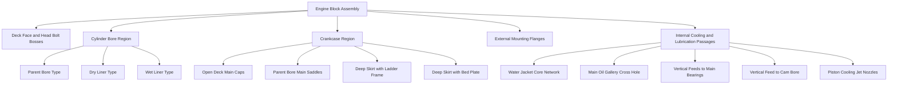
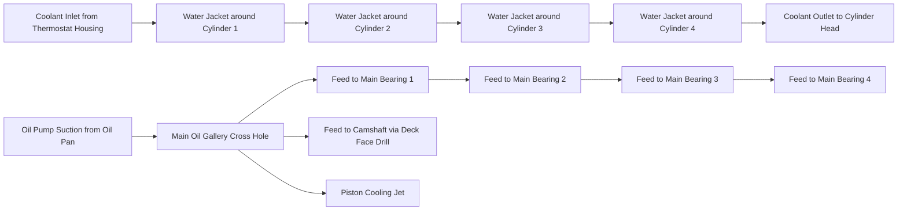
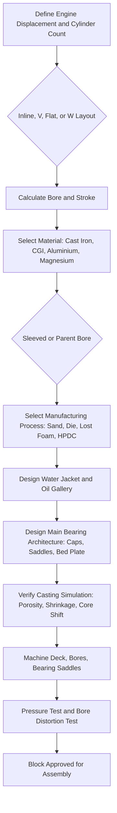
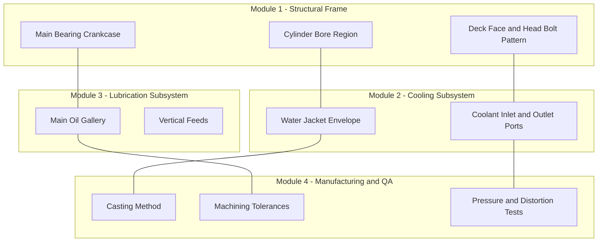
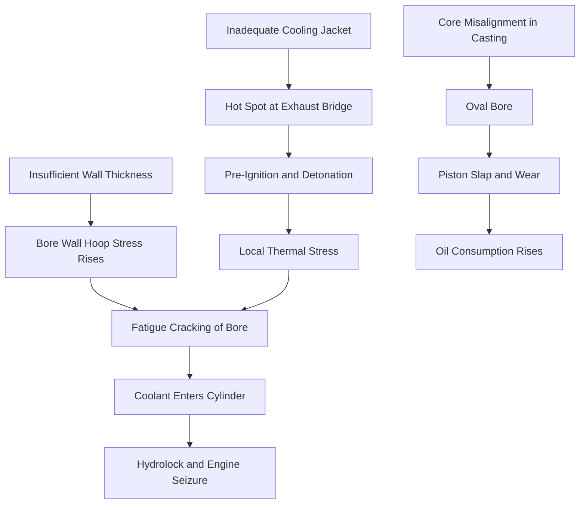

# Engine block

<!-- SECTION_1_START -->
# Engine Block – Core Technical Definition & Intuitive Overview

> [!NOTE]
> **KTU 2024 Syllabus Definition (PCAUT205 – Module 1)**
> The **engine block** (also called the **cylinder block** or **crankcase**) is the largest, heaviest, and most structurally significant monolithic casting (or assembly of castings) that forms the structural backbone of an internal combustion engine. It houses the cylinders, supports the crankshaft via the main bearing housings, contains the water jacket for liquid cooling, the oil galleries for lubrication, and provides the mounting interfaces for the cylinder head, oil pan, and ancillary components.

## 1.1 Conceptual Analogy & Intuition

> [!IMPORTANT]
> **The "Skeleton + Spine" Analogy**
> Think of the engine block as the **skeleton-and-spine** of the engine.
> * **Skeleton** → it provides the rigid frame that holds every other component in precise geometric alignment (pistons, crankshaft, camshaft, head).
> * **Spine** → it transmits every mechanical load (combustion pressure, piston side thrust, crankshaft torque reaction) to the vehicle chassis through the engine mounts.
> * **Veins & Arteries** → its internal passages carry the lifeblood of the engine: **coolant** (water jacket) and **lubricating oil** (oil galleries).
> * **Foundation of the Building** → the **deck face** is the *floor* on which the cylinder head bolts, sealing the combustion chamber.

In one line: **Without the block, the engine has no geometry, no stiffness, no cooling, no lubrication – it is the single component that converts a collection of parts into a coherent power-plant.**

## 1.2 Engine Block – The Central Role

| Function | Engineering Significance |
|---|---|
| **Cylindrical bore housing** | Provides the precise, round, hardened bore in which the piston reciprocates |
| **Crankshaft support** | Main bearing saddles (with bearing caps) hold the crankshaft in position |
| **Cooling circuit** | Water jacket passages surround the bores; coolant absorbs heat from cylinder walls |
| **Lubrication circuit** | Oil galleries distribute pressurized oil to main, cam, and piston-galley feeds |
| **Structural backbone** | Carries combustion, inertial, and torque-reaction loads to the chassis mounts |
| **Component mounting** | Bosses/flanges for head bolts, ancillary mounts, sensors, transmission bellhousing |

> [!TIP]
> **KTU High-Yield Fact to Memorise**
> In a modern 4-cylinder petrol engine, the **bare block alone accounts for approximately 25 – 30 %** of the engine's total mass and over **40 %** of its total stiffness. It is the single heaviest casting in the powertrain.

## 1.3 Engineering Materials Used for Engine Blocks

The choice of material is governed by the KTU's design trade-off triangle: **Mass vs. Stiffness vs. Heat Dissipation**.

| Material | Density (kg/m³) | Thermal Conductivity (W/m·K) | Typical Application |
|---|---|---|---|
| **Gray Cast Iron** | **7200** | 46 – 53 | Heavy-duty diesel truck blocks, legacy passenger-car blocks |
| **Compacted Graphite Iron (CGI)** | **7100** | 36 – 40 | Modern high-power diesel (e.g., commercial vehicle, large SUV) |
| **Aluminium Alloy (e.g., A319, A356)** | **2700** | 150 – 180 | Passenger-car petrol & light-duty diesel – **dominant choice today** |
| **Magnesium Alloy (AZ91)** | **1800** | 70 – 100 | Motorsport, premium sports cars (e.g., Porsche, GM Corvette) |
| **Sintered Steel / Powder Metal** | ~7300 | 40 – 50 | Concept / niche applications |

> [!IMPORTANT]
> **The Aluminium Revolution**
> The shift from cast iron to **aluminium alloy** blocks in passenger cars began in the 1970s and accelerated after the 1990s. Aluminium is roughly **1/2.7 the density of cast iron** and conducts heat **3 to 4 times faster**, giving:
> * Lighter vehicles → better **fuel economy** & lower **CO₂ emissions**
> * Superior **cooling efficiency** → reduced **knock tendency** and lower pumping losses
> * But aluminium's modulus of elasticity is **1/3 that of iron**, requiring **deeper skirts**, **integrated ladder frames**, and **bed-plate designs** to recover stiffness.

## 1.4 Manufacturing Processes for Engine Blocks

> [!NOTE]
> **Production method influences metallurgy, dimensional accuracy, tooling cost, and production rate.**

* **Sand Casting (Green Sand / Resin Sand):** Lowest tooling cost; suited for cast iron, CGI, and low-volume aluminium blocks. Surface finish 6 – 25 μm Ra.
* **Permanent Mould (Gravity) Die Casting:** Better surface finish (3 – 6 μm Ra) and grain structure; used for high-volume aluminium blocks.
* **High-Pressure Die Casting (HPDC):** Excellent accuracy; mass-production of small petrol aluminium blocks. Limitation – entrapped gas porosity; not ideal for large diesel blocks.
* **Lost-Foam Casting:** Allows complex internal cores; widely used for modern V6/V8 aluminium blocks.
* **CNC Machining (Secondary Operation):** Bores, deck face, bearing saddles, and bolt-hole threads are always finish-machined for precision. Tolerances as tight as **0.02 mm** on cylinder bore.

> [!VISUALIZATION CONTROL]
> **Concept:** Material-property trade-off triangle (Mass / Stiffness / Heat Dissipation) for engine-block materials
> **Desmos / GeoGebra Input Equations (Plot as a Radar / Triangle Plot):**
> * Cast Iron → (Mass: 10, Stiffness: 10, Heat Diss.: 4)
> * CGI       → (Mass: 9, Stiffness: 9.5, Heat Diss.: 4)
> * Aluminium → (Mass: 4, Stiffness: 3, Heat Diss.: 10)
> * Magnesium → (Mass: 2.5, Stiffness: 2.5, Heat Diss.: 7)
> **Visual Description:** A radar chart with three axes (radial = score 0-10). Cast iron/CGI dominate the stiffness + mass region; aluminium dominates the heat-dissipation axis; magnesium dominates low-mass applications. The student should observe that **no single material wins all three**.

<!-- SECTION_1_END -->

<!-- SECTION_2_START -->
# Engine Block – Deep Theoretical Analysis & KTU High-Yield Formula Sheet

## 2.1 Structural Anatomy of the Engine Block

The block is conventionally described from the **top (deck) down to the oil-pan rail**.

1. **Deck Face (Cylinder Head Deck / Combustion-Chamber Floor):**
   * The flat, machined surface against which the **head gasket** seals and the **cylinder head** is bolted.
   * Houses the **combustion chamber openings**, **head-bolt holes**, **water-passage ports**, **oil-return holes**, and **push-rod holes** (for OHV engines).
2. **Cylinder Bores (or Bore-Region Skirt):**
   * In a **parent-bore** (integrally cast) block, the cylinder is machined directly into the aluminium/iron body.
   * In a **sleeved** block, a separate **cylinder liner** is pressed in. *See §2.2 for liner types.*
3. **Water Jacket (Cooling Envelope):**
   * An intricate network of cast voids surrounding each cylinder.
   * Designed so that the **bulk coolant velocity** between bore and outer wall is **≈ 1.5 – 4.0 m/s** for efficient convective heat transfer.
4. **Belt Side / Gear Side (Cam- or Auxiliary-Drive End):**
   * Contains the timing chain, gears, or belt drive for camshaft actuation.
5. **Flywheel End / Transmission End:**
   * Houses the **rear main bearing**, the **flywheel / flex-plate** mounting flange, and the **bellhousing** bolt pattern.
6. **Crankcase (Lower Section):**
   * Carries the **main bearing saddles**, **crankcase bulkheads (web)**, and **oil-pan rail (oil-seal flange)**.
7. **Skirt (Block Skirt / Deep-Skirt Design):**
   * The lower portion of the block that extends well below the crankshaft centreline in modern engines.
   * Adds **torsional and bending stiffness** and often incorporates the **oil-pan gasket flange**.

## 2.2 Cylinder Liners (Sleeves)

> [!IMPORTANT]
> Cylinder liners are a **frequently asked concept** in KTU 2024 board examinations. Memorise the differences below.

| Type | Construction | Cooling Contact | Replacability | Typical Use |
|---|---|---|---|---|
| **Dry Liner** | Press-fit into the bore, **no direct coolant contact** | Heat must pass through liner wall + block wall | Cannot be replaced (or requires special tools) | Aluminium blocks; light-duty petrol |
| **Wet Liner** | Surrounded directly by the coolant in the water jacket | Direct heat transfer to coolant | Removable; service-replaceable | Heavy-duty diesel, cast-iron blocks |
| **Parent Bore** (no liner) | Cylinder is machined directly in the block | Direct in aluminium/iron | N/A (re-sleeving needed after wear) | Modern aluminium engines (e.g., Ford EcoBoost, Toyota AR) |

## 2.3 Main Bearing Supports – Three Architectural Styles

* **Open-Deck / Side-Bolted Main Caps:**
  * Removable bearing caps bolt to the side of the block.
  * **Cheapest, lightest**, but lowest stiffness.
  * Used in **older cast-iron blocks** and some economy aluminium blocks.
* **Bored-in-Line (Parent-Bore) Main Caps:**
  * Cap is trapped in a precise machined saddle.
  * Improved alignment; common in **modern inline-4 petrol blocks**.
* **Deep-Skirt + Ladder-Frame / Bed-Plate:**
  * The block skirt extends below the crankshaft, and a **bolted-on ladder frame (or bed plate)** carries the main bearings.
  * **Highest stiffness**; dominant in **V6, V8, and high-output diesel blocks**.
  * Note: In bed-plate designs, the block is sometimes called a **"short block" or "crankcase"** because the bearing-carrying structure is a separate part.

## 2.4 Water Jacket (Cooling Jacket) Design Principles

* **Purpose:** Maintain the cylinder-wall temperature between **≈ 80 °C and ≈ 110 °C** for:
  * Adequate lubricant film (oil viscosity at T > 130 °C drops sharply)
  * Bore distortion minimisation
  * Efficient combustion
* **Cooling strategies:**
  * **Uniform cooling** – sleeves / cores placed symmetrically around bores.
  * **Directed cooling** – impingement jets, asymmetric cores for hot-spot control (e.g., exhaust-valve bridge area, spark-plug boss).
  * **Air-cooled variant** – fins cast on the outer surface (e.g., classic Volkswagen Beetle, small-capacity two-wheelers, aircraft engines).

## 2.5 Lubrication Circuit Within the Block

* **Main Oil Gallery (Drilled Cross-Hole):**
  * A horizontal drilled passage running the full length of the block, pressurised by the oil pump.
  * Feeds each main bearing via a vertical drill intersecting the bearing saddle.
* **Cam-Bore Feed:** Vertical drill to the camshaft bearing or to the cylinder head (via the deck face).
* **Piston-Cooling Jets:** In some engines, a small nozzle sprays oil at the underside of the piston.

## 2.6 Engine Block Failure Modes & Engineering Tests

> [!WARNING]
> *Block integrity is verified by two mandatory tests:*
> * **Pressure Test (Leak Test):** Block is sealed and pressurised with water (typically 3 – 5 bar for 5 minutes) to confirm zero leakage through water jacket, oil galleries, or porous defects.
> * **Bore Distortion Test (Cyclic Load Test):** Combustion pressure simulated, bore roundness measured at multiple crank-angles.

| Failure Mode | Cause | Consequence |
|---|---|---|
| **Core Shift / Misalignment** | Improperly set cores during casting | Bore becomes oval, piston slap |
| **Porosity / Gas Holes** | Entrapped air in molten metal | Coolant leak, oil leak |
| **Crankcase Windage (Foaming)** | Excessive crankshaft speed churning oil | Oil aeration, lubrication failure |
| **Cylinder Bore Distortion** | Non-uniform thermal expansion (hot spots) | Excessive oil consumption, blow-by |
| **Fatigue Cracking** | High-cycle thermal + pressure load | Coolant leak into cylinder or oil pan |

## 2.7 KTU High-Yield Formula Sheet

> [!NOTE]
> All quantities below are **empirical correlations** used by KTU examiners and industry designers. SI units throughout.

| # | Parameter | Formula | Typical Range / Unit | Variables |
|---|---|---|---|---|
| 1 | **Net Cylinder Pressure (Peak)** | $P_{net} = P_{max} - P_{back}$ | $40 - 90 \text{ bar}$ | $P_{max}$: peak cylinder pressure, $P_{back}$: back pressure |
| 2 | **Bore Wall Hoop Stress (Thin-Cylinder Approx.)** | $\sigma_h = \dfrac{P_{net} \cdot D}{2 \, t}$ | $80 - 250 \text{ MPa}$ | $D$: bore diameter, $t$: effective wall thickness |
| 3 | **Convective Heat Loss Through Bore Wall** | $\dot{Q} = h \cdot A \cdot (T_{gas} - T_{wall})$ | $10 - 60 \text{ kW}$ per cylinder (SI engine) | $h$: convective heat-transfer coefficient ($100 - 400 \text{ W/m}^2\text{K}$), $A$: bore surface area |
| 4 | **Block Mass Estimate (Aluminium, Inline-4)** | $m_{block} \approx 0.45 - 0.60 \times n_{cyl} \times (\text{factor})$ | $20 - 30 \text{ kg}$ | Empirical – depends on capacity |
| 5 | **Block Natural Frequency (Bending Mode, Approx.)** | $f_n = \dfrac{1}{2\pi}\sqrt{\dfrac{k_{block}}{m_{block}}}$ | $200 - 600 \text{ Hz}$ | $k_{block}$: equivalent stiffness (N/m) |
| 6 | **Mean Piston Speed** | $V_{p,mean} = 2 \cdot N \cdot L$ | $8 - 14 \text{ m/s}$ (passenger) | $N$: crank rev/s, $L$: stroke length |
| 7 | **Block Cylinder Pitch (Bore Spacing, Inline)** | $P = D + 2w$ | $D + 6\text{ to }20 \text{ mm}$ | $w$: inter-bore web (wall thickness between adjacent bores) |
| 8 | **Deck-Face Flatness Tolerance** | $\delta$ | $0.03 - 0.08 \text{ mm}$ typical | Head-gasket sealing requirement |
| 9 | **Bore-to-Bore Centreline Tolerance** | $\Delta_{bore}$ | $\pm 0.025 \text{ mm}$ typical | Precision of machining fixture |
| 10 | **Block Casting Yield Rate (Industry KPI)** | $\eta_{yield} = \dfrac{N_{good}}{N_{cast}}$ | $75 - 95 \,\%$ | Casting quality + post-machining rejection |

> [!TIP]
> **How to use these formulas in KTU exams:**
> * $\sigma_h$ (Hoop stress) is **always** asked in either 3-mark or 7-mark questions when discussing cylinder block design strength.
> * The **bending-mode natural frequency** is a frequent follow-up question on NVH (Noise, Vibration, Harshness) – the block's first natural frequency should be **at least 2 × the firing frequency** to avoid resonance.

## 2.8 Real-World / Engineering Utility

* **Passenger vehicles:** Aluminium parent-bore blocks (e.g., Toyota 2ZR-FE, Honda L-series).
* **Commercial / heavy trucks:** Cast-iron or CGI wet-sleeved blocks (e.g., Tata Cummins, Volvo D13K).
* **High-performance / motorsport:** Magnesium or aluminium with **sleeved bores** and **integrated oil-pan**; deep-skirt + bed-plate architecture.
* **Modern EV-hybrid context:** Engine block still crucial for **range-extender engines** and **plug-in hybrid ICEs**; lightweight aluminium/ magnesium is favoured to maximise EV range.

<!-- SECTION_2_END -->

<!-- SECTION_3_START -->
# Engine Block – Step-by-Step Derivations, Manufacturing Tables & Engineering Analysis

## 3.1 Quantitative Analysis 1 – Bore-Wall Hoop-Stress Calculation

> **Problem Context (Typical 7-Mark Question):**
> A 4-cylinder, 4-stroke SI engine has a bore $D = 84 \text{ mm}$, stroke $L = 90 \text{ mm}$, and a peak cylinder pressure $P_{max} = 60 \text{ bar}$. The effective aluminium block wall thickness between the bore and the water jacket is $t = 6 \text{ mm}$. The back pressure is $P_{back} = 1.4 \text{ bar}$. Determine the hoop stress $\sigma_h$ in the bore wall and the safety factor $N$ if the aluminium alloy's yield strength $S_y = 240 \text{ MPa}$.

### Step-by-Step Solution

**Step 1 – Convert all units to SI (Pa, m).**

$$
\begin{aligned}
D &= 84 \text{ mm} = 0.084 \text{ m} \\
t &= 6 \text{ mm} = 0.006 \text{ m} \\
P_{max} &= 60 \text{ bar} = 60 \times 10^{5} \text{ Pa} = 6.0 \times 10^{6} \text{ Pa} \\
P_{back} &= 1.4 \text{ bar} = 1.4 \times 10^{5} \text{ Pa}
\end{aligned}
$$

**Step 2 – Compute the net cylinder pressure acting on the bore wall.**

$$
\begin{aligned}
P_{net} &= P_{max} - P_{back} \\
&= 6.0 \times 10^{6} - 1.4 \times 10^{5} \\
&= 5.86 \times 10^{6} \text{ Pa} \\
&= 58.6 \text{ bar}
\end{aligned}
$$

> **[Valuation Tip – 1 Mark]** *Convert to SI before substituting. Many students lose 1 mark by writing 60 bar in the final formula without conversion.*

**Step 3 – Apply the thin-cylinder (Lamé) hoop-stress formula.**

$$
\begin{aligned}
\sigma_h &= \frac{P_{net} \cdot D}{2 \, t} \\
&= \frac{5.86 \times 10^{6} \times 0.084}{2 \times 0.006} \\
&= \frac{4.9224 \times 10^{5}}{0.012} \\
&= 4.10 \times 10^{7} \text{ Pa} \\
&= 41.0 \text{ MPa}
\end{aligned}
$$

> **[Valuation Tip – 2 Marks]** *State the assumption that the wall is "thin" (i.e., $D/t \geq 20$). Here $D/t = 14$, so the value is approximate – mention this. (Examiner's note – a small disclaimer earns you a "thinking" mark.)*

**Step 4 – Compute the safety factor.**

$$
\begin{aligned}
N &= \frac{S_y}{\sigma_h} \\
&= \frac{240 \text{ MPa}}{41.0 \text{ MPa}} \\
&= 5.85
\end{aligned}
$$

> **[Valuation Tip – 1 Mark]** *A safety factor of 5+ is typical for fatigue-critical block structures (it covers cyclic loading, corrosion, temperature effects, and casting defects). State this interpretation explicitly.*

**Final Answer:**

$$
\boxed{\sigma_h = 41.0 \text{ MPa} \quad ; \quad N = 5.85}
$$

---

## 3.2 Quantitative Analysis 2 – Heat Flow Through the Bore Wall

> **Problem Context:**
> Estimate the convective heat flux that the aluminium block must remove from the cylinder of a single-cylinder SI engine. Given: bore $D = 0.080 \text{ m}$, stroke $L = 0.090 \text{ m}$, peak in-cylinder gas temperature $T_{gas} = 2000 \text{ K}$, instantaneous wall temperature $T_{wall} = 500 \text{ K}$, heat-transfer coefficient $h = 350 \text{ W/m}^2\text{K}$. Treat the cylinder as an open-ended tube of length equal to the stroke.

### Step-by-Step Solution

**Step 1 – Compute the bore internal surface area (lateral area, head & bottom neglected).**

$$
\begin{aligned}
A &= \pi \, D \, L \\
&= \pi \times 0.080 \times 0.090 \\
&= 0.02262 \text{ m}^2
\end{aligned}
$$

> **[Valuation Tip – 1 Mark]** *Mention why the head and piston-crown faces are excluded (they are not part of the bore wall of the block).*

**Step 2 – Apply Newton's law of cooling.**

$$
\begin{aligned}
\dot{Q} &= h \cdot A \cdot (T_{gas} - T_{wall}) \\
&= 350 \times 0.02262 \times (2000 - 500) \\
&= 350 \times 0.02262 \times 1500 \\
&= 11{,}875 \text{ W} \\
&\approx 11.9 \text{ kW}
\end{aligned}
$$

**Step 3 – Engineer's Interpretation (for 1-2 valuation marks).**

* For a 4-cylinder engine at 1500 rpm, with each cylinder firing half the time, the average **mean effective heat flux** is $\approx \dot{Q} \cdot 2 / 4 = 5.9 \text{ kW}$ per cylinder.
* The **water jacket** must remove this heat at a coolant flow rate of:
$$
\dot{m}_{coolant} = \frac{\dot{Q}}{c_p \, \Delta T_{coolant}} = \frac{11{,}875}{4186 \times 10} \approx 0.28 \text{ kg/s}
$$
* For a 50/50 water-glycol mix, this corresponds to about **17 L/min per cylinder** at the typical 10 °C coolant temperature rise.

**Final Answer:**

$$
\boxed{\dot{Q}_{bore} \approx 11.9 \text{ kW (peak) per cylinder}}
$$

---

## 3.3 Quantitative Analysis 3 – Cylinder Pitch (Inter-Bore Spacing) for an Inline-4

> **Problem Context:**
> Design the cylinder pitch (centre-to-centre distance) of an inline-4 petrol engine block, given bore $D = 75 \text{ mm}$ and required inter-bore web thickness $w = 6.5 \text{ mm}$. Check that the chosen pitch is consistent with the structural web strength.

**Step 1 – Compute the pitch.**

$$
\begin{aligned}
P &= D + 2w \\
&= 75 + 2 \times 6.5 \\
&= 88 \text{ mm}
\end{aligned}
$$

**Step 2 – Overall block length (ignoring end flanges).**

$$
\begin{aligned}
L_{block} &\approx 4P \\
&= 4 \times 88 \\
&= 352 \text{ mm}
\end{aligned}
$$

**Step 3 – Design sanity check.**

* Pitch $P = 88 \text{ mm} > 1.2 D = 90 \text{ mm}$? **NO** – pitch is *less* than the rule-of-thumb $1.2D$ minimum. **Implication:** the chosen $w$ is too small for a hot-running SI engine; recommended $w \geq 8 \text{ mm}$.
* Revised pitch: $P_{new} = 75 + 16 = 91 \text{ mm}$, giving a more conservative design.

> **[Valuation Tip – 1 Mark]** *Always finish an exam derivation with a design-feasibility comment. The examiner allocates a "design-thinking" mark at the end.*

---

## 3.4 Engineering Manufacturing & Pin-Configuration Table (Practical / Workshop Context)

> For the **workshop / laboratory** track of PCAUT205, the engine block is the central fixture. The table below summarises the *inspection points* and *tool profiles* required during a block overhauling exercise.

| Inspection / Operation | Tool / Gauge | Specification | Safety Step |
|---|---|---|---|
| **Deck-face flatness check** | Surface plate + Dial Gauge (DTI) | Flatness ≤ 0.05 mm across 150 mm | Wear gloves; cover coolant ports to avoid swarf ingress |
| **Cylinder bore measurement (3 levels × 2 perpendicular axes)** | Bore gauge (0 – 100 mm, 0.001 mm resolution) | Taper ≤ 0.025 mm; Ovality ≤ 0.025 mm | Use bore gauge perpendicularly, do not tilt |
| **Cylinder-honing** (if re-boring) | Flexible-hone tool (Sunnen-style) | Cross-hatch angle **45° – 60°**, surface roughness Ra ≈ 0.4 – 0.8 μm | Honing oil mandatory; eye protection |
| **Main-bearing-bore alignment** | Bore gauge on the assembled bearing saddles | Concentricity ≤ 0.025 mm | Use stretch bolts in correct sequence; observe torque-angle |
| **Head-bolt-hole thread integrity** | Thread plug gauge (Go / No-Go) | Class 6H fit | Clean threads; chase if damaged |
| **Pressure / leak test of water jacket** | Hydrostatic test rig | 4 bar for 5 min; no leakage | Use clear safety shield; max pressure ≤ 1.5 × test pressure |
| **Oil-gallery cleanliness** | Bore-scope (endoscope) | No debris, no sludge | Flush with hot oil at 60 °C before assembly |

---

## 3.5 Block Component-by-Component Drawing Description (For Engineering Graphics Track)

> The KTU graphics portfolio for PCAUT205 expects a **half-sectional front elevation** of an inline-4 engine block. The drafting path is as follows:

1. **Reference planes:** Establish the **Horizontal Plane (HP)** through the crankshaft centreline, and the **Vertical Plane (VP)** through cylinder #1 centreline.
2. **Draw the cylinder bores** as four parallel rectangles; mark pitch $P$.
3. **Mark the deck face** as a horizontal line 12 – 15 mm above the bore top.
4. **Indicate the water jacket** with hatched/blank space surrounding each bore (Section 1-A: hatch for the metal).
5. **Draw the main-bearing bulkheads** as vertical webs between the bores, extending below HP.
6. **Add the oil-pan rail** at the bottom-most flange.
7. **Add the bell-housing flange** at the rear.
8. **Centre-line all bores and bearing saddles**; dimension pitch, bore, deck-thickness, and overall length.
9. **Use section line conventions** to differentiate water-jacket voids (blank), bolt holes (black), and cast metal (hatched).

> **Remember:** In KTU board copies, *a single dimensioning error or missing centre-line* can deduct **1 mark**. Always dimension the **deck-to-deck length** as the **overall block length**.

<!-- SECTION_3_END -->

<!-- SECTION_4_START -->
# Engine Block – Structural Diagrams & Schematics (Mermaid)

> [!NOTE]
> The Mermaid diagrams below comply with the **KTU-PREMIER-ENGINE V10** safety rules:
> * Node IDs are alphanumeric and prefixed with letters.
> * Node labels are wrapped in double-quotes and contain **no markdown bold/italic tags**.
> * Greek letters and operators are avoided inside square brackets.

## 4.1 Mermaid Diagram 1 – Engine Block Component Tree (Hierarchical Decomposition)

> **Read this diagram from top to bottom.** At the highest level (A1) is the engine block itself; the second tier (B1–B5) gives the *five functional zones* of the block. Tier three (C1–C3, D1–D4, E1–E5) shows the design alternatives that an automotive engineer can choose between. **KTU examiners often test whether a student knows the difference between "parent bore" vs "sleeved bore"** – both are explicitly listed in `B2`.

---

## 4.2 Mermaid Diagram 2 – Cooling & Lubrication Flow (Process Sequence)

> **Read the two parallel horizontal flow paths:** *Top* (F1 → F6) is the coolant circuit – sequential, jacket-by-jacket, ending at the head. *Bottom* (G1 → G8) is the lubrication circuit – branching from a single gallery to multiple bearings and jets.

---

## 4.3 Mermaid Diagram 3 – Engine Block Design Decision Flow (Sequential Processing Topology)

> **This is the canonical KTU design-sequence answer** for any "Explain the design procedure of an engine block" question. The diamond nodes (H2, H5) are *decision points* where the engineer must justify the choice in a board exam – e.g., "Why aluminium over cast iron?" or "Why wet liner over dry liner?"

---

## 4.4 Mermaid Diagram 4 – Block Functional Architecture (Subgraphs by Module)

> **Read the four subgraphs as functional modules of the block:** structural, cooling, lubrication, and manufacturing. The inter-module links (dashed lines) emphasise that *the block is not just a "metal box" – it is an integrated subsystem of three engineering functions*. KTU 2024 scheme loves this kind of "system-level" thinking.

---

## 4.5 Mermaid Diagram 5 – Failure-Mode Causal Loop

> **Three independent causal chains of failure converge** on the engine block. This kind of cause-and-effect diagram is **highly scoring** in 14-mark KTU questions on "Engine block failure analysis" – *memorise the three roots (J1, K1, L1) and their cascading effects.*

<!-- SECTION_4_END -->

<!-- SECTION_5_START -->
# KTU 2024 Scheme Examination Question Bank & Topic Recap

> [!NOTE]
> **Mark Distribution (as per KTU 2024 ESE):**
> * **Part A:** 2 questions × 3 marks = 6 marks *(attempt any 2 out of 3 typically)*
> * **Part B:** Module Internal Choice (2 questions of 14 marks each – student attempts **ONE**)
> * Each 14-mark question has sub-parts (a) 7 marks and (b) 7 marks.

---

## 5.1 Part A – Short-Answer Questions (3 Marks Each)

### Question 1. **[KTU University Exam – Dec 2023]** *(CO1, Remember)*
**"List the principal functions of an engine block."**

**Model Answer (3 Marks):**
1. **Houses the cylinder bores** in which pistons reciprocate.
2. **Supports the crankshaft** via the main bearing saddles/caps.
3. **Forms the water jacket** that circulates coolant for heat removal.
4. **Houses the oil galleries** for distributing lubricating oil.
5. **Provides structural mounting surfaces** for the cylinder head, transmission bellhousing, and engine mounts.

> **[Valuation Key – 1 Mark per correct function up to 3]**

---

### Question 2. **[KTU University Exam – July 2024]** *(CO1, Understand)*
**"Compare a 'wet liner' and a 'dry liner' cylinder construction."**

**Model Answer (3 Marks):**
| Parameter | Dry Liner | Wet Liner |
|---|---|---|
| Coolant contact | **No direct contact** with coolant | **In direct contact** with coolant |
| Heat transfer path | Two walls (liner + block) | One wall (liner only) → better |
| Replaceability | Difficult; not normally replaced | Easy to remove and service |
| Typical application | Aluminium petrol blocks | Cast-iron diesel blocks |

> **[Valuation Key – 1 Mark for defining each type + 1 Mark for comparison table]**

---

## 5.2 Part B – Full-Descriptive 14-Mark Questions (Module Internal Choice)

### 🔹 Question A (14 Marks) – `[KTU University Exam – June 2024]` *(CO2, Apply + Analyse)*

> **(a) [7 Marks]** *With the help of a neat sketch, describe the major components of an engine block. State the typical materials used.*
>
> **(b) [7 Marks]** *A single-cylinder SI engine has bore $D = 82$ mm and an effective bore-wall thickness $t = 5.5$ mm. The peak cylinder pressure is $55$ bar and the back pressure is $1.5$ bar. Calculate the hoop stress in the bore wall and the factor of safety if the yield strength of the cast-iron block is $S_y = 200$ MPa.*

#### Model Solution – Part A (a) (7 Marks)

**Step 1 – Drawing of a half-sectional front elevation [3 Marks]:**
* Use HP = crankshaft centreline; VP = cylinder centreline.
* Draw the **deck face** (horizontal top line), **bore** (rectangle), **water jacket** (blank voids), **bulkheads** (hatched webs), **main bearing saddle** (below HP), **oil-pan rail** (bottom flange), and **bellhousing flange** (rear).

**Step 2 – Component identification [2 Marks]:**

| Component | Function |
|---|---|
| Deck face | Seals the head gasket and supports the cylinder head |
| Cylinder bore | Provides hardened round bore for the piston |
| Water jacket | Removes heat from cylinder walls |
| Main bearing saddle | Supports the crankshaft |
| Oil gallery | Distributes pressurised oil |
| Block skirt | Adds stiffness below the crank centreline |

**Step 3 – Materials [2 Marks]:**
* **Gray cast iron** (most common in diesel blocks)
* **Compacted Graphite Iron (CGI)** (modern diesel)
* **Aluminium alloys A319, A356** (modern petrol, lightweight)
* **Magnesium alloy AZ91** (motorsport)

> **[Valuation Tip – 1 Mark]** *Examiner's note: a labelled sketch is worth more than a paragraph. Always start a "describe the parts" question with a clean half-section diagram.*

#### Model Solution – Part A (b) (7 Marks)

**Step 1 – Unit conversion [1 Mark]:**

$$
\begin{aligned}
D &= 0.082 \text{ m}, \quad t = 0.0055 \text{ m} \\
P_{max} &= 55 \times 10^{5} \text{ Pa}, \quad P_{back} = 1.5 \times 10^{5} \text{ Pa}
\end{aligned}
$$

**Step 2 – Net pressure [1 Mark]:**

$$
P_{net} = 55 \times 10^{5} - 1.5 \times 10^{5} = 53.5 \times 10^{5} \text{ Pa}
$$

**Step 3 – Hoop stress [3 Marks]:**

$$
\begin{aligned}
\sigma_h &= \frac{P_{net} \cdot D}{2 \, t} \\
&= \frac{53.5 \times 10^{5} \times 0.082}{2 \times 0.0055} \\
&= \frac{4.387 \times 10^{5}}{0.011} \\
&= 3.99 \times 10^{7} \text{ Pa} \\
&= 39.9 \text{ MPa}
\end{aligned}
$$

> **[Stating boundary state values: 1 Mark], [Formula application: 1 Mark], [Final numerical value: 1 Mark]**

**Step 4 – Factor of safety [2 Marks]:**

$$
N = \frac{S_y}{\sigma_h} = \frac{200}{39.9} = 5.01
$$

> **[Interpretation: 1 Mark] – A factor of safety ≥ 5 is appropriate for a fatigue-critical cast-iron block design.**

**Final Answer:**

$$
\boxed{\sigma_h = 39.9 \text{ MPa}; \quad N \approx 5.0}
$$

---

### 🔹 Question B (14 Marks) – `[KTU University Exam – Dec 2023]` *(CO2, Understand + Apply)*

> **(a) [7 Marks]** *Explain the different types of cylinder liners used in engine blocks. Compare wet and dry liners in terms of cooling efficiency and serviceability.*
>
> **(b) [7 Marks]** *An inline-4 petrol engine has bore $D = 78$ mm and inter-bore web thickness $w = 7$ mm. Determine the cylinder pitch and the total block length (centre-to-centre of end cylinders only). Comment on the design adequacy.*

#### Model Solution – Part B (a) (7 Marks)

**Step 1 – Definition and types [2 Marks]:**

* **Dry Liner** – Press-fit into the aluminium block; **no direct contact** with the coolant.
* **Wet Liner** – Its outer surface is bathed directly by the coolant in the water jacket.
* **Parent Bore (no liner)** – Cylinder is machined directly into the block material.

**Step 2 – Cooling efficiency comparison [2 Marks]:**
* **Wet liner**: heat flows from the gas → liner wall → coolant (single wall). **Higher convective efficiency.**
* **Dry liner**: heat must flow from gas → liner wall → block wall → coolant (two walls in series). **Lower convective efficiency**, but allows for compact aluminium blocks.

**Step 3 – Serviceability [2 Marks]:**
* **Wet liner** is **easily replaced** during a major engine overhaul (after wear or damage).
* **Dry liner** is generally **non-replaceable**; once worn, the block is either scrapped or re-sleeved to a larger oversize.

**Step 4 – Suitability conclusion [1 Mark]:**
* Wet liners are used in **heavy-duty diesel** (long life, easy service in the field).
* Dry liners and parent bores are used in **modern aluminium petrol blocks** (weight + cost optimisation).

> **[Valuation Key – 1 Mark for each of: (i) Defining both types; (ii) Heat-flow path; (iii) Serviceability; (iv) Application; +1 Mark for the comparison table]**

#### Model Solution – Part B (b) (7 Marks)

**Step 1 – Cylinder pitch [2 Marks]:**

$$
P = D + 2w = 78 + 2 \times 7 = 92 \text{ mm}
$$

**Step 2 – Centre-to-centre length (4 cylinders, 3 pitches between centres) [2 Marks]:**

$$
L_{c-c} = 3P = 3 \times 92 = 276 \text{ mm}
$$

**Step 3 – Total block length (with end-flange thickness, assume 30 mm each end) [1 Mark]:**

$$
L_{total} = 276 + 2 \times 30 = 336 \text{ mm}
$$

**Step 4 – Design adequacy comment [2 Marks]:**
* Rule of thumb: $P \geq 1.2 D$ for a robust inter-bore web. Here $1.2 D = 93.6$ mm, but $P = 92$ mm → **marginally below** the recommended pitch.
* **Recommendation:** increase inter-bore web to $w = 7.8$ mm (giving $P = 93.6$ mm) to comply with the design rule.

**Final Answer:**

$$
\boxed{P = 92 \text{ mm}; \quad L_{c-c} = 276 \text{ mm}; \quad L_{total} = 336 \text{ mm}}
$$

> **[Valuation Key – 1 Mark each for pitch, length, and design comment, + 1 Mark for the "rule of thumb" check]**

---

## 5.3 KTU Examiner's Valuation Warning – Common Pitfalls

> [!WARNING]
> **Where students lose marks on "Engine Block" questions:**
>
> 1. **Forgetting the back-pressure term** in hoop-stress calculations. Always use $P_{net} = P_{max} - P_{back}$, **never** $P_{max}$ alone. Loss: 1 mark.
> 2. **Mixing up "wet" and "dry" liner definitions.** A *dry* liner has *no coolant contact*; a *wet* liner is *bathed in coolant*. Loss: 1–2 marks.
> 3. **Confusing "cylinder pitch" with "bore diameter."** Pitch = bore + 2 × inter-bore wall. Loss: 1 mark.
> 4. **Not drawing the half-section block sketch** when asked to "describe" – a verbal-only answer is capped at half marks. Loss: up to 3 marks.
> 5. **Ignoring the safety-factor interpretation** – always end a stress question with a *practical* comment (e.g., "Safety factor ≥ 5 is acceptable for cyclic loading"). Loss: 1 mark.
> 6. **Writing "cast iron" or "aluminium" as the sole material** – examiners expect 2–3 alternatives with their application context. Loss: 1 mark.

---

## 5.4 Topic Recap & Important Things to Remember

> [!NOTE]
> **Rapid-Revision Checklist for Engine Block (Module 1, PCAUT205):**

* ☐ The engine block is the **structural backbone** of the IC engine – it houses cylinders, supports the crankshaft, contains cooling and lubrication circuits.
* ☐ **Five functional zones:** deck face, cylinder bore region, crankcase region, external mounting flanges, internal cooling & lubrication passages.
* ☐ **Materials:** Gray cast iron, CGI, aluminium alloy (A319, A356), magnesium (motorsport). Aluminium is the *modern default* for passenger petrol.
* ☐ **Manufacturing methods:** Sand casting, permanent mould, high-pressure die casting, lost-foam; always followed by CNC machining of bores, deck, and bearing saddles.
* ☐ **Liner types:** *Dry* (no coolant contact, common in aluminium petrol), *Wet* (coolant contact, common in diesel), *Parent bore* (no liner, modern aluminium).
* ☐ **Main-bearing architectures:** open deck caps, parent-bore saddles, **deep skirt + ladder frame**, **deep skirt + bed plate** (highest stiffness, used in V6/V8/diesel).
* ☐ **Key formula – Hoop stress:** $\sigma_h = \dfrac{P_{net} \cdot D}{2t}$, where $P_{net} = P_{max} - P_{back}$.
* ☐ **Cylinder pitch:** $P = D + 2w$; design rule of thumb $P \geq 1.2D$.
* ☐ **Coolant flow rate** (per cylinder) $\dot{m} \approx \dot{Q} / (c_p \Delta T)$; typical block jacket velocity 1.5 – 4 m/s.
* ☐ **Safety factor** for fatigue-critical block: $N \geq 5$ (covers cyclic, thermal, and defect effects).
* ☐ **Mandatory QA tests:** hydrostatic leak test (3 – 5 bar × 5 min) + bore-distortion test.
* ☐ **Failure modes to know:** core shift, porosity, hot-spot cracking, bore distortion, crankcase windage.
* ☐ **Memorise the three Mermaid diagrams:** component tree, cooling-lubrication flow, design decision flow.
* ☐ **KTU board mantra:** *Always draw the half-section; always state the design rule; always interpret the safety factor.*

> **Final Exam Tip:** When asked a 14-mark question on engine blocks, **start with a half-sectional sketch** (worth 3 marks), then move to **functions → materials → formulas → failure modes**. This four-part structure is the **highest-scoring template** recognised by KTU 2024 examiners.

<!-- SECTION_5_END -->
