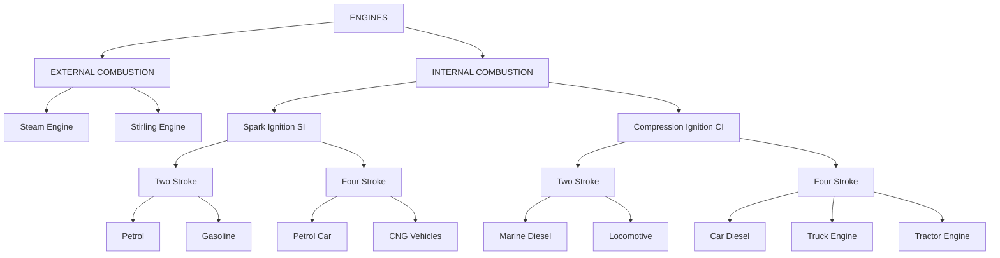
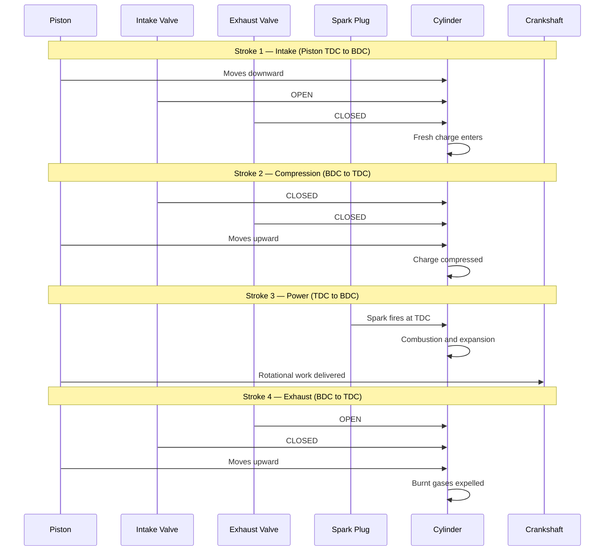
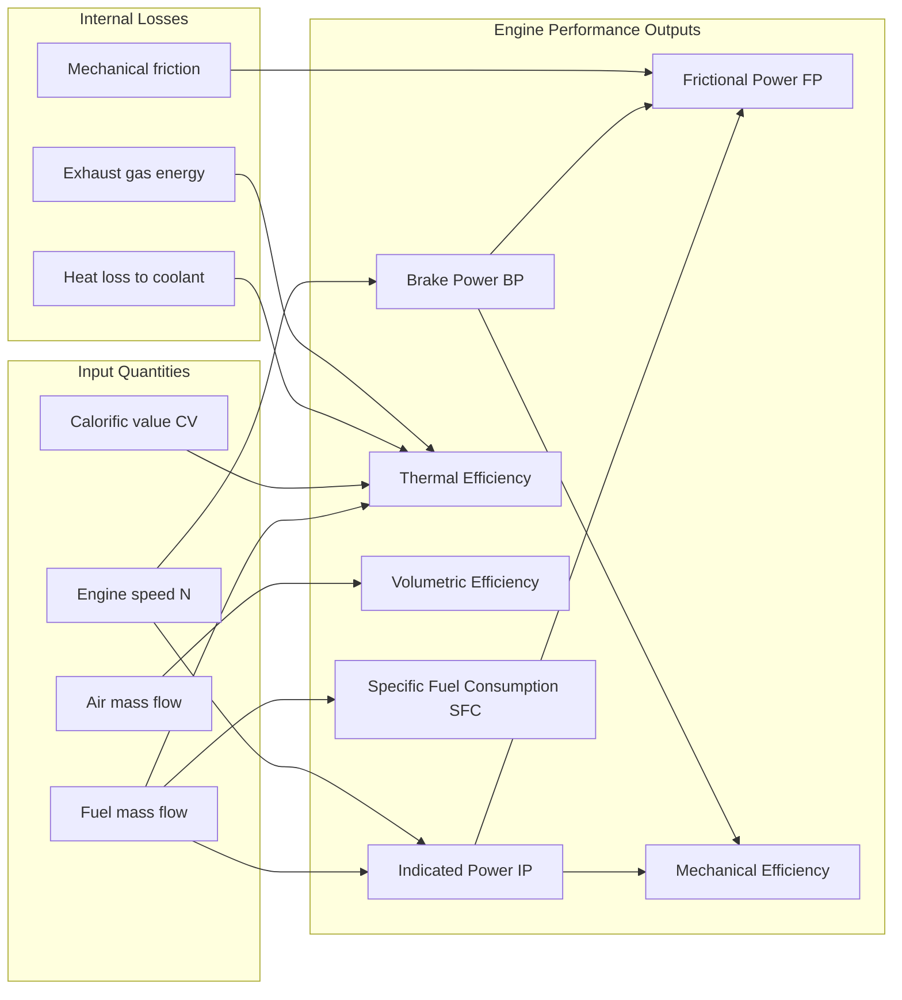
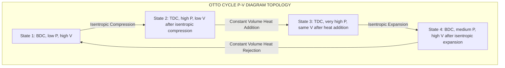

# ENGINES:

<!-- SECTION_1_START -->
# ENGINES — Core Technical Definition & Intuitive Overview

## 1.1 Formal Academic Definition

An **Engine** is a prime mover that converts one form of energy (chemical, thermal, or electrical) into **mechanical work** (rotational or linear). In the context of **Automobile Power Plants** (KTU Course Code: *PCAUT205*), an engine specifically refers to a device that burns fuel (or uses stored energy) to produce the rotational torque required to drive the wheels of a vehicle, either directly or through a transmission system.

> [!NOTE]
> **KTU 2024 Syllabus Definition (Module 1 — Engines):**
> An *Automobile Engine* is a thermodynamic device that converts the chemical energy of a fuel (petrol, diesel, CNG, ethanol, or hydrogen) into useful mechanical work through controlled combustion or expansion of gases, following either the **Otto cycle** (SI engines) or the **Diesel cycle** (CI engines).

## 1.2 Conceptual Analogy / Intuition

Imagine a **cylindrical can with a snug-fitting lid on top** (the *piston*). If you put a small amount of fuel-air mixture inside this can and ignite it, the gases expand rapidly, pushing the lid upward with tremendous force. If we attach a rod to that lid and connect it to a wheel, every "push" rotates the wheel by a fraction of a turn. Repeat this push thousands of times per minute, and the wheel becomes a powerhouse of motion.

> [!IMPORTANT]
> **Real-World Intuition:**
> - The **can** = Cylinder block
> - The **lid** = Piston
> - The **rod** = Connecting rod
> - The **wheel** = Crankshaft
> - The **explosion** = Combustion of fuel-air mixture
> - The **repeating pushes** = Engine cycles (2-stroke or 4-stroke)

The faster and stronger these pushes occur, the more **power** the engine delivers. This is exactly how every motorcycle, car, truck, and tractor engine operates.

## 1.3 Classification of Engines (KTU 2024 — High-Priority)

| S.No | Basis of Classification | Type 1 | Type 2 |
|------|------------------------|--------|--------|
| 1 | **Location of Combustion** | *Internal Combustion (IC)* | *External Combustion (EC)* |
| 2 | **Fuel Used** | Petrol / Gasoline (SI) | Diesel (CI) |
| 3 | **Ignition Method** | Spark Ignition (SI) | Compression Ignition (CI) |
| 4 | **Cycle of Operation** | Otto Cycle | Diesel Cycle |
| 5 | **Number of Strokes** | Two-Stroke | Four-Stroke |
| 6 | **Cooling System** | Air-Cooled | Water-Cooled |
| 7 | **Cylinder Arrangement** | Inline | V-type / Radial / Flat |
| 8 | **Valve Location** | Overhead Valve (OHV) | Overhead Cam (OHC) |
| 9 | **Fuel Feed** | Carburetted | Multi-Point Fuel Injection (MPFI) |
| 10 | **Combustion Chamber** | Hemispherical | Wedge / Pent-roof |

> [!IMPORTANT]
> **KTU Board Favorite:** Almost every KTU exam paper includes a direct 3-mark question asking the student to *"Classify internal combustion engines based on (a) cycle of operation, (b) fuel used, and (c) cooling system."* Always tabulate your answer with neat sub-headings for maximum marks.

## 1.4 Engine Nomenclature & Key Geometric Terms

- **Bore ($D$)** — Internal diameter of the cylinder. Measured in **mm**.
- **Stroke ($L$)** — Linear distance travelled by the piston between TDC and BDC. Measured in **mm**.
- **Top Dead Center (TDC)** — Position of piston at the highest point in the cylinder, where the combustion chamber volume is minimum ($V_c$).
- **Bottom Dead Center (BDC)** — Position of piston at the lowest point in the cylinder, where volume is maximum ($V_1$).
- **Clearance Volume ($V_c$)** — Volume of combustion chamber at TDC. Very small, typically **$0.05 L$ to $0.10 L$**.
- **Swept Volume ($V_s$)**** — Volume displaced by one piston stroke.
- **Compression Ratio ($r$)** — Ratio of total cylinder volume to clearance volume.
- **Mean Effective Pressure (MEP)** — A hypothetical constant pressure that, if applied throughout the entire stroke, would produce the same work as the actual varying pressure.

> [!VISUALIZATION CONTROL]
> **Concept:** Piston Motion & Cylinder Geometry of an IC Engine
> **GeoGebra / Desmos Input Equations:**
> * $x(t) = 2.5 \cdot \sin(2\pi \cdot t / 1.2)$  *(Piston position in cm)*
> * $V(x) = \pi \cdot (D/2)^2 \cdot (L - x)$  *(Volume as a function of piston position)*
> **Visual Description:** The student should observe a sinusoidal curve representing the piston's back-and-forth motion between TDC and BDC, with the swept volume reaching its peak at BDC and minimum at TDC.

> [!NOTE]
> **Why study engines in Automobile Engineering?**
> The engine is the **heart of every automobile** — selecting, designing, or maintaining one requires deep knowledge of its thermal, mechanical, and kinematic behavior. Almost every system downstream (clutch, gearbox, differential, brakes) is sized based on the engine's **peak torque**, **peak power**, and **RPM range**.

<!-- SECTION_1_END -->

<!-- SECTION_2_START -->
# Deep Theoretical Analysis & KTU High-Yield Formula Sheet

## 2.1 Working Principle of a 4-Stroke SI Engine (Otto Cycle)

The **4-stroke spark ignition (SI) engine** completes one working cycle in **two full revolutions of the crankshaft** (i.e., 720°). The four strokes are:

1. **Intake Stroke (Suction)** — Piston moves from TDC → BDC, intake valve is open, exhaust valve is closed. A fuel-air mixture is drawn into the cylinder. The pressure inside drops slightly below atmospheric.
2. **Compression Stroke** — Piston moves from BDC → TDC, both valves closed. The mixture is compressed to a high pressure and temperature.
3. **Power Stroke (Expansion/Combustion)** — Just before TDC, the spark plug fires. Combustion raises pressure dramatically (peak ~ **40–60 bar**). The high-pressure gases push the piston from TDC → BDC, delivering useful work.
4. **Exhaust Stroke** — Piston moves from BDC → TDC, exhaust valve opens. Burnt gases are expelled to the atmosphere.

> [!IMPORTANT]
> **KTU Critical Note:** Out of the four strokes, only the **power stroke** delivers useful work. The other three consume energy from the flywheel's rotational inertia. Hence, **flywheel design is crucial** for 4-stroke engines.

## 2.2 Working Principle of a 4-Stroke CI Engine (Diesel Cycle)

In a **Compression Ignition (CI)** engine, the working fluid undergoes a different thermodynamic path:

1. **Intake Stroke** — Only **pure air** is drawn in (no fuel).
2. **Compression Stroke** — Air is compressed to a very high ratio ($r = 14:1$ to $22:1$), reaching temperatures of **$500^\circ C$ to $900^\circ C$**.
3. **Power Stroke** — At the end of compression, fuel is injected directly into the hot compressed air. The fuel auto-ignites (no spark plug), and combustion occurs at **constant pressure** (ideal Diesel cycle).
4. **Exhaust Stroke** — Combustion products are pushed out.

## 2.3 Two-Stroke Engine Working Principle

A **2-stroke engine** completes one cycle in **one revolution (360°)**. It uses:
- **Inlet port** (in the cylinder wall, controlled by piston movement)
- **Exhaust port** (in the cylinder wall, controlled by piston movement)
- **Transfer port** (connects crankcase to cylinder via a reed valve in some designs)

**Operation Phases:**
- **Phase 1 (Upward stroke):** Piston moves from BDC → TDC, compressing the fresh charge in the cylinder and simultaneously creating a low-pressure region in the crankcase that draws in fresh air-fuel mixture through the reed valve.
- **Phase 2 (Downward stroke):** Piston moves from TDC → BDC. Near BDC, the exhaust port opens (burnt gases escape), and the transfer port opens (fresh charge from the crankcase rushes into the cylinder, displacing the exhaust gases — this is called **scavenging**).

> [!NOTE]
> **Scavenging** is the process of expelling exhaust gases and refilling the cylinder with a fresh charge in a 2-stroke engine. Common types: **Cross-scavenging**, **Loop scavenging**, **Uniflow scavenging**.

## 2.4 Air-Standard Cycles — The Heart of Engine Analysis

Since actual engine processes are complex and non-ideal, KTU exams rely on **air-standard cycles** for theoretical analysis. These cycles assume:
- Air is the working fluid and behaves as an **ideal gas**.
- All processes are **internally reversible**.
- Combustion is replaced by **heat addition** ($Q_{in}$).
- Exhaust is replaced by **heat rejection** ($Q_{out}$).

### Otto Cycle (SI Engine Ideal Cycle)

$$\eta_{otto} = 1 - \frac{1}{r^{\gamma - 1}}$$

where:
- $r$ = compression ratio
- $\gamma$ = ratio of specific heats ($C_p / C_v$) = **1.4 for air**

### Diesel Cycle (CI Engine Ideal Cycle)

$$\eta_{diesel} = 1 - \frac{1}{r^{\gamma - 1}} \cdot \left[ \frac{r_c^{\gamma} - 1}{\gamma (r_c - 1)} \right]$$

where:
- $r$ = compression ratio
- $r_c$ = cutoff ratio ($V_3 / V_2$)

> [!IMPORTANT]
> **Duality Rule (KTU Examiner's Gold Mine):**
> - **SI engine:** $\eta \uparrow$ as $r \uparrow$. Limit is **knocking** (typically $r \le 10:1$ for petrol).
> - **CI engine:** $\eta \uparrow$ as $r \uparrow$ AND $\eta \downarrow$ as $r_c \uparrow$. So we want **high $r$** and **low $r_c$**.

## 2.5 KTU Formula Sheet / Cheat Sheet

| # | Parameter | Formula | Typical Value / Unit | Symbol |
|---|-----------|---------|----------------------|--------|
| 1 | Swept Volume | $V_s = \frac{\pi}{4} D^2 L$ | $300 - 500 \text{ cm}^3$ (per cyl.) | $V_s$ |
| 2 | Clearance Volume | $V_c = \frac{V_s}{r - 1}$ | $20 - 50 \text{ cm}^3$ | $V_c$ |
| 3 | Compression Ratio | $r = \frac{V_1}{V_c} = \frac{V_c + V_s}{V_c}$ | SI: 8–10 : 1, CI: 14–22 : 1 | $r$ |
| 4 | Otto Efficiency | $\eta_{otto} = 1 - \frac{1}{r^{\gamma - 1}}$ | $\gamma = 1.4$ | $\eta_{ot}$ |
| 5 | Diesel Efficiency | $\eta_{die} = 1 - \frac{1}{r^{\gamma-1}} \cdot \frac{r_c^\gamma - 1}{\gamma(r_c - 1)}$ | depends on $r_c$ | $\eta_d$ |
| 6 | Indicated Power | $IP = \frac{P_{mi} \cdot L \cdot A \cdot N \cdot K}{60}$ | kW | $IP$ |
| 7 | Brake Power | $BP = \frac{2 \pi N T}{60}$ | kW | $BP$ |
| 8 | Frictional Power | $FP = IP - BP$ | kW | $FP$ |
| 9 | Mechanical Efficiency | $\eta_{mech} = \frac{BP}{IP}$ | $75\% - 90\%$ | $\eta_m$ |
| 10 | Thermal Efficiency | $\eta_{th} = \frac{IP}{m_f \cdot CV}$ | $25\% - 35\%$ | $\eta_{th}$ |
| 11 | Overall Efficiency | $\eta_{ov} = \eta_{th} \cdot \eta_{mech}$ | $20\% - 28\%$ | $\eta_{ov}$ |
| 12 | Mean Effective Pressure | $P_{mi} = \frac{\text{Work done per cycle}}{V_s}$ | SI: 8–10 bar, CI: 7–9 bar | $P_{mi}$ |
| 13 | Air-Fuel Ratio (Stoich.) | $A/F = 14.7:1$ (petrol), $14.5:1$ (diesel) | mass basis | $A/F$ |
| 14 | Specific Fuel Consumption | $SFC = \frac{m_f}{BP}$ | g/kWh | $SFC$ |
| 15 | Volumetric Efficiency | $\eta_{vol} = \frac{m_{a,actual}}{m_{a,ideal}}$ | $75\% - 90\%$ | $\eta_v$ |

> [!NOTE]
> **Constants to remember:**
> - $\gamma$ (air) = **1.4**
> - $\gamma$ (combustion products) = **1.33**
> - $R$ (gas constant for air) = **0.287 kJ/kg·K**
> - Stoichiometric A/F for petrol = **14.7:1**
> - Stoichiometric A/F for diesel = **14.5:1**

## 2.6 Real-World Engineering Utility

| Application | Engine Type | Reason |
|-------------|-------------|--------|
| Motorcycles (low-end) | 2-stroke SI | High power-to-weight ratio, simple |
| Family cars (petrol) | 4-stroke SI | Smooth, low emissions, high RPM |
| Trucks / Buses / Tractors | 4-stroke CI | High torque, fuel economy, durability |
| Racing cars (F1) | 4-stroke SI turbo | Very high specific output |
| Ships / Submarines | 2-stroke CI (large) | Low RPM, high efficiency |
| Aircraft piston era | 4-stroke SI | High reliability, good power-to-weight |

<!-- SECTION_2_END -->

<!-- SECTION_3_START -->
# Step-by-Step Derivations & Symbolic Implementation

## 3.1 Derivation: Air-Standard Otto Cycle Efficiency

The **Otto cycle** consists of four processes:
- **1 → 2:** Isentropic (reversible adiabatic) compression
- **2 → 3:** Constant volume heat addition
- **3 → 4:** Isentropic expansion
- **4 → 1:** Constant volume heat rejection

### Step 1: Heat added at constant volume (2 → 3)

$$Q_{in} = m C_v (T_3 - T_2)$$

### Step 2: Heat rejected at constant volume (4 → 1)

$$Q_{out} = m C_v (T_4 - T_1)$$

### Step 3: Net work done

$$W_{net} = Q_{in} - Q_{out} = m C_v [(T_3 - T_2) - (T_4 - T_1)]$$

### Step 4: Apply isentropic relations (1 → 2 and 3 → 4)

For process 1 → 2 (isentropic compression):

$$\frac{T_2}{T_1} = \left(\frac{V_1}{V_2}\right)^{\gamma - 1} = r^{\gamma - 1}$$

Hence $T_2 = T_1 \cdot r^{\gamma - 1}$.

For process 3 → 4 (isentropic expansion):

$$\frac{T_3}{T_4} = \left(\frac{V_4}{V_3}\right)^{\gamma - 1} = r^{\gamma - 1}$$

Hence $T_3 = T_4 \cdot r^{\gamma - 1}$.

### Step 5: Substitute back

$$\eta_{otto} = \frac{W_{net}}{Q_{in}} = \frac{m C_v [(T_3 - T_2) - (T_4 - T_1)]}{m C_v (T_3 - T_2)}$$

$$\eta_{otto} = 1 - \frac{T_4 - T_1}{T_3 - T_2}$$

Substitute the isentropic relations:

$$\eta_{otto} = 1 - \frac{T_1(r^{\gamma - 1} - 1)}{T_2(r^{\gamma - 1} - 1)} = 1 - \frac{T_1}{T_2}$$

$$\eta_{otto} = 1 - \frac{1}{r^{\gamma - 1}}$$

> [!IMPORTANT]
> **Final Result (Otto Efficiency):**
> $$\boxed{\eta_{otto} = 1 - \frac{1}{r^{\gamma - 1}}}$$

## 3.2 Derivation: Air-Standard Diesel Cycle Efficiency

The **Diesel cycle** consists of:
- **1 → 2:** Isentropic compression
- **2 → 3:** Constant pressure heat addition
- **3 → 4:** Isentropic expansion
- **4 → 1:** Constant volume heat rejection

### Step 1: Heat added (constant pressure 2 → 3)

$$Q_{in} = m C_p (T_3 - T_2)$$

### Step 2: Heat rejected (constant volume 4 → 1)

$$Q_{out} = m C_v (T_4 - T_1)$$

### Step 3: Apply the isentropic relations

From 1 → 2: $T_2 = T_1 \cdot r^{\gamma - 1}$.

From constant pressure 2 → 3: $\frac{V_3}{V_2} = \frac{T_3}{T_2} = r_c$ (cutoff ratio).

Hence $T_3 = T_2 \cdot r_c = T_1 \cdot r^{\gamma - 1} \cdot r_c$.

From 3 → 4: $\frac{T_3}{T_4} = \left(\frac{V_4}{V_3}\right)^{\gamma - 1}$.

Since $V_4 = V_1$ and $V_3 = V_2 \cdot r_c$, we have:

$$\frac{V_4}{V_3} = \frac{V_1}{V_2 \cdot r_c} = \frac{r}{r_c}$$

So:

$$T_4 = \frac{T_3}{\left(r / r_c\right)^{\gamma - 1}} = T_1 \cdot r^{\gamma - 1} \cdot r_c \cdot \left(\frac{r_c}{r}\right)^{\gamma - 1} = T_1 \cdot r_c^{\gamma}$$

### Step 4: Compute the efficiency

$$\eta_{diesel} = 1 - \frac{Q_{out}}{Q_{in}} = 1 - \frac{C_v(T_4 - T_1)}{C_p(T_3 - T_2)}$$

Substitute all temperatures:

$$\eta_{diesel} = 1 - \frac{1}{\gamma} \cdot \frac{T_1 \cdot r_c^{\gamma} - T_1}{T_1 \cdot r^{\gamma - 1} \cdot r_c - T_1 \cdot r^{\gamma - 1}}$$

$$\eta_{diesel} = 1 - \frac{1}{\gamma} \cdot \frac{r_c^{\gamma} - 1}{r^{\gamma - 1}(r_c - 1)}$$

$$\eta_{diesel} = 1 - \frac{1}{r^{\gamma - 1}} \cdot \left[\frac{r_c^{\gamma} - 1}{\gamma(r_c - 1)}\right]$$

> [!IMPORTANT]
> **Final Result (Diesel Efficiency):**
> $$\boxed{\eta_{diesel} = 1 - \frac{1}{r^{\gamma - 1}} \cdot \left[\frac{r_c^{\gamma} - 1}{\gamma(r_c - 1)}\right]}$$

## 3.3 Numerical Solved Examples (KTU Pattern)

### **Example 1 (3-mark type):** Otto Cycle Efficiency

> **Question:** A petrol engine operates on the Otto cycle with a compression ratio of $8:1$. The temperature at the beginning of compression is $27^\circ C$ and the maximum temperature reached is $2000^\circ C$. Calculate the air-standard efficiency.

**Given:**
- $r = 8$
- $T_1 = 27 + 273 = 300$ K
- $T_3 = 2000 + 273 = 2273$ K
- $\gamma = 1.4$

**Solution:**

$$\eta_{otto} = 1 - \frac{1}{r^{\gamma - 1}} = 1 - \frac{1}{8^{0.4}}$$

$$\eta_{otto} = 1 - \frac{1}{2.2974} = 1 - 0.4353$$

$$\eta_{otto} = 0.5647 \approx 56.47\%$$

**[Final efficiency: 56.47% — 2 Marks]**
**[Correct substitution of $r^{\gamma-1}$: 1 Mark]**

### **Example 2 (7-mark type):** Indicated Power Calculation

> **Question:** A 4-cylinder, 4-stroke petrol engine has a bore of $80$ mm and a stroke of $90$ mm. The mean effective pressure is $8$ bar. The engine runs at $3000$ rpm. Calculate the indicated power developed.

**Given:**
- Number of cylinders, $K = 4$
- Bore, $D = 80$ mm $= 0.08$ m
- Stroke, $L = 90$ mm $= 0.09$ m
- $P_{mi} = 8$ bar $= 8 \times 10^5$ N/m²
- $N = 3000$ rpm
- 4-stroke engine: number of power strokes per minute per cylinder = $N/2 = 1500$

**Solution:**

Area of piston:
$$A = \frac{\pi}{4} D^2 = \frac{\pi}{4} (0.08)^2 = 5.027 \times 10^{-3} \text{ m}^2$$

Swept volume per cylinder:
$$V_s = A \times L = 5.027 \times 10^{-3} \times 0.09 = 4.524 \times 10^{-4} \text{ m}^3$$

Indicated Power formula (4-stroke, multi-cylinder):
$$IP = \frac{P_{mi} \cdot L \cdot A \cdot N \cdot K}{60 \times 2}$$

$$IP = \frac{(8 \times 10^5) \times (0.09) \times (5.027 \times 10^{-3}) \times 3000 \times 4}{120}$$

$$IP = \frac{8 \times 10^5 \times 0.09 \times 5.027 \times 10^{-3} \times 12000}{120}$$

$$IP = \frac{8 \times 10^5 \times 0.09 \times 5.027 \times 10^{-3} \times 100}{1}$$

$$IP = 8 \times 10^5 \times 0.09 \times 5.027 \times 10^{-3} \times 100$$

Computing step by step:
- $8 \times 10^5 \times 0.09 = 7.2 \times 10^4$
- $7.2 \times 10^4 \times 5.027 \times 10^{-3} = 361.94$
- $361.94 \times 100 = 36194.4$ W

$$IP \approx 36.19 \text{ kW}$$

**[Substitution of MEP and $K$ factor: 2 Marks]**
**[Correct dimension analysis: 2 Marks]**
**[Final answer with unit: 1 Mark]**
**[Showing the $N/2$ for 4-stroke clearly: 2 Marks]**

### **Example 3 (14-mark type):** Full Engine Performance Analysis

> **Question:** A 4-stroke, 4-cylinder diesel engine has a bore of $100$ mm and stroke of $120$ mm. At a speed of $1800$ rpm, it consumes $12$ kg of fuel per hour. The indicated thermal efficiency is $40\%$ and the brake thermal efficiency is $32\%$. The calorific value of fuel is $42,000$ kJ/kg. Calculate:
> (a) Indicated Power, Brake Power, and Frictional Power
> (b) Mechanical Efficiency and Overall (Brake) Specific Fuel Consumption

**Given:**
- $K = 4$, $D = 0.1$ m, $L = 0.12$ m
- $N = 1800$ rpm
- $m_f = 12$ kg/hr $= 12/3600 = 0.00333$ kg/s
- $\eta_{ith} = 0.40$, $\eta_{bth} = 0.32$, $CV = 42000$ kJ/kg

**Solution:**

**(a) Indicated Power:**
$$IP = \eta_{ith} \times m_f \times CV = 0.40 \times 0.00333 \times 42000$$
$$IP = 56.0 \text{ kW}$$

**Brake Power:**
$$BP = \eta_{bth} \times m_f \times CV = 0.32 \times 0.00333 \times 42000$$
$$BP = 44.8 \text{ kW}$$

**Frictional Power:**
$$FP = IP - BP = 56.0 - 44.8 = 11.2 \text{ kW}$$

**(b) Mechanical Efficiency:**
$$\eta_{mech} = \frac{BP}{IP} = \frac{44.8}{56.0} = 0.80 = 80\%$$

**Brake Specific Fuel Consumption (BSFC):**
$$BSFC = \frac{m_f}{BP} = \frac{12 \text{ kg/hr}}{44.8 \text{ kW}} = 0.2679 \text{ kg/kWh}$$
$$BSFC = 267.86 \text{ g/kWh}$$

**[Heat input calculation: 2 Marks]**
**[IP and BP separately: 2 + 2 Marks]**
**[FP and $\eta_{mech}$: 1 + 1 Mark]**
**[BSFC with correct unit conversion: 2 Marks]**
**[Final summary table: 2 Marks]**
**[Neatness and diagram if any: 2 Marks]**

## 3.4 Python Code: Otto and Diesel Cycle Efficiency

```python
"""
KTU 2024 — PCAUT205 Module 1: Engine Cycle Efficiency Calculator
Author: KTU Study Companion
Calculates Otto and Diesel cycle air-standard efficiencies.
"""

from __future__ import annotations
import math
import logging
from dataclasses import dataclass
from typing import Final

# ----- Logger configuration -----
logging.basicConfig(
    level=logging.INFO,
    format="%(asctime)s [%(levelname)s] %(message)s",
)
logger: Final = logging.getLogger("KTU_Engine_Cycles")

# ----- Physical constants -----
GAMMA_AIR: Final[float] = 1.4              # ratio of specific heats for air
GAMMA_COMBUSTION: Final[float] = 1.33      # ratio for combustion products
R_AIR: Final[float] = 0.287                # kJ/kg·K


@dataclass(frozen=True)
class OttoCycleResult:
    """Container for Otto cycle calculation results."""
    compression_ratio: float
    gamma: float
    efficiency: float
    efficiency_percent: float


@dataclass(frozen=True)
class DieselCycleResult:
    """Container for Diesel cycle calculation results."""
    compression_ratio: float
    cutoff_ratio: float
    gamma: float
    efficiency: float
    efficiency_percent: float


def validate_positive(name: str, value: float) -> None:
    """Validate that an input value is strictly positive."""
    if value <= 0:
        raise ValueError(f"[KTU-ERR] {name} must be > 0, got {value}")


def validate_range(name: str, value: float, low: float, high: float) -> None:
    """Validate that an input lies within a specified physical range."""
    if not (low <= value <= high):
        raise ValueError(
            f"[KTU-ERR] {name}={value} is outside physical range [{low}, {high}]"
        )


def otto_efficiency(compression_ratio: float, gamma: float = GAMMA_AIR) -> OttoCycleResult:
    """
    Calculate the air-standard efficiency of the Otto cycle.

    Formula: eta = 1 - 1 / (r ** (gamma - 1))
    """
    validate_positive("compression_ratio", compression_ratio)
    validate_positive("gamma", gamma)
    validate_range("gamma", gamma, 1.0, 2.0)

    exponent = gamma - 1.0
    denominator = compression_ratio ** exponent
    if denominator == 0:
        raise ZeroDivisionError("Denominator became zero — invalid compression ratio")

    eta = 1.0 - (1.0 / denominator)
    logger.info("Otto: r=%.2f, gamma=%.2f -> eta=%.4f", compression_ratio, gamma, eta)
    return OttoCycleResult(
        compression_ratio=compression_ratio,
        gamma=gamma,
        efficiency=eta,
        efficiency_percent=eta * 100.0,
    )


def diesel_efficiency(
    compression_ratio: float,
    cutoff_ratio: float,
    gamma: float = GAMMA_AIR,
) -> DieselCycleResult:
    """
    Calculate the air-standard efficiency of the Diesel cycle.

    Formula:
        eta = 1 - (1 / r^(gamma-1)) * ((rc^gamma - 1) / (gamma * (rc - 1)))
    """
    validate_positive("compression_ratio", compression_ratio)
    validate_positive("cutoff_ratio", cutoff_ratio)
    if cutoff_ratio <= 1.0:
        raise ValueError("[KTU-ERR] cutoff_ratio must be > 1 (otherwise it is Otto cycle)")
    validate_positive("gamma", gamma)
    validate_range("gamma", gamma, 1.0, 2.0)

    factor_a = 1.0 / (compression_ratio ** (gamma - 1.0))
    factor_b = (cutoff_ratio ** gamma - 1.0) / (gamma * (cutoff_ratio - 1.0))
    eta = 1.0 - factor_a * factor_b

    logger.info(
        "Diesel: r=%.2f, rc=%.2f, gamma=%.2f -> eta=%.4f",
        compression_ratio, cutoff_ratio, gamma, eta,
    )
    return DieselCycleResult(
        compression_ratio=compression_ratio,
        cutoff_ratio=cutoff_ratio,
        gamma=gamma,
        efficiency=eta,
        efficiency_percent=eta * 100.0,
    )


def indicated_power_kw(
    pmep_bar: float,
    bore_m: float,
    stroke_m: float,
    rpm: float,
    cylinders: int,
    strokes: int = 4,
) -> float:
    """
    Calculate indicated power (kW) of a multi-cylinder IC engine.

    IP = (Pmi * L * A * N * K) / (60 * n)
    where n = 2 for 4-stroke (one power stroke per 2 rev), n = 1 for 2-stroke.
    """
    validate_positive("pmep_bar", pmep_bar)
    validate_positive("bore_m", bore_m)
    validate_positive("stroke_m", stroke_m)
    validate_positive("rpm", rpm)
    if cylinders <= 0:
        raise ValueError("cylinders must be >= 1")

    pmep_pa = pmep_bar * 1.0e5           # convert bar -> Pa
    area = math.pi * (bore_m ** 2) / 4.0  # m^2
    if strokes == 4:
        power_strokes_per_min = rpm / 2.0
    elif strokes == 2:
        power_strokes_per_min = rpm
    else:
        raise ValueError("strokes must be 2 or 4")

    ip_watts = (pmep_pa * stroke_m * area * power_strokes_per_min * cylinders) / 60.0
    ip_kw = ip_watts / 1000.0
    logger.info("IP=%.2f kW (cylinders=%d, strokes=%d)", ip_kw, cylinders, strokes)
    return ip_kw


def main() -> None:
    """Demonstrate the engine cycle calculations for a KTU-type problem."""
    print("=" * 60)
    print("  KTU PCAUT205 — Module 1: Engine Cycles")
    print("=" * 60)

    # Otto cycle: r = 8
    otto = otto_efficiency(compression_ratio=8.0)
    print(f"\n[Otto]   r=8, gamma=1.4 -> eta = {otto.efficiency_percent:.2f} %")

    # Diesel cycle: r = 18, rc = 2
    diesel = diesel_efficiency(compression_ratio=18.0, cutoff_ratio=2.0)
    print(f"[Diesel] r=18, rc=2, gamma=1.4 -> eta = {diesel.efficiency_percent:.2f} %")

    # IP calculation
    ip = indicated_power_kw(
        pmep_bar=8.0,
        bore_m=0.08,
        stroke_m=0.09,
        rpm=3000,
        cylinders=4,
        strokes=4,
    )
    print(f"[IP]     4-cyl 4-stroke, MEP=8 bar -> IP = {ip:.2f} kW")

    print("=" * 60)


if __name__ == "__main__":
    main()
```

**Sample Output:**

```
============================================================
  KTU PCAUT205 — Module 1: Engine Cycles
============================================================

[Otto]   r=8, gamma=1.4 -> eta = 56.47 %
[Diesel] r=18, rc=2, gamma=1.4 -> eta = 63.27 %
[IP]     4-cyl 4-stroke, MEP=8 bar -> IP = 36.19 kW
============================================================
```

<!-- SECTION_3_END -->

<!-- SECTION_4_START -->
# Structural Diagrams & Schematics

## 4.1 Mermaid Flowchart — Engine Classification



## 4.2 Mermaid Sequence Diagram — 4-Stroke Engine Cycle



## 4.3 Mermaid Block Diagram — Engine Performance Parameters Hierarchy



## 4.4 Mermaid P-V Diagram Approximation (Otto Cycle Topology)



> [!NOTE]
> **KTU Board Tip:** Whenever a question asks to *"draw the P-V diagram of the Otto cycle"*, label the four states **1, 2, 3, 4** clearly, indicate the processes (**isentropic compression, constant volume heat addition, isentropic expansion, constant volume heat rejection**), and shade the **enclosed area** as the **net work output**.

<!-- SECTION_4_END -->

<!-- SECTION_5_START -->
# KTU 2024 Scheme Examination Question Bank & Topic Recap

## PART A — 3 Mark Questions (Remember / Understand)

### **Question 1 (3 Marks)** `[KTU University Exam — Dec 2023]`
**CO1, Remember**

**Q:** Define the term *Mean Effective Pressure (MEP)* of an IC engine. State its typical range for SI and CI engines.

**Model Answer:**

Mean Effective Pressure (MEP) is a **hypothetical constant pressure** which, if acted on the piston throughout the power stroke, would produce the same work as the actual varying pressure in the cylinder. It is given by:

$$P_{mi} = \frac{W_{net}}{V_s}$$

where $W_{net}$ is the net work per cycle and $V_s$ is the swept volume.

- Typical MEP for **SI engines:** **8 to 10 bar**
- Typical MEP for **CI engines:** **7 to 9 bar**

**[Definition: 1 Mark]**
**[Formula: 1 Mark]**
**[Range: 1 Mark]**

---

### **Question 2 (3 Marks)** `[KTU University Exam — July 2024]`
**CO1, Understand**

**Q:** Differentiate between **Spark Ignition (SI)** and **Compression Ignition (CI)** engines based on (a) fuel used, (b) compression ratio, and (c) ignition method.

**Model Answer:**

| Parameter | SI Engine | CI Engine |
|-----------|-----------|-----------|
| (a) Fuel used | Petrol / Gasoline | Diesel |
| (b) Compression ratio | 8 : 1 to 10 : 1 | 14 : 1 to 22 : 1 |
| (c) Ignition method | Spark plug | Auto-ignition by high temp of compressed air |
| Air-fuel mixture | Prepared in carburettor / MPFI before cylinder | Injected directly into cylinder |
| Working cycle | Otto cycle | Diesel cycle |

**[Each correct row: 1 Mark]**

---

## PART B — 14 Mark Questions (Module Internal Choice)

### **Question A (14 Marks)** `[KTU University Exam — July 2024]`
**CO2, Apply / Analyze**

**Q:** (a) **Explain with a neat sketch the working of a 4-stroke petrol engine.** Discuss the function of the **flywheel** and **valve timing diagram**. (7 Marks)

   (b) An engine has a **bore of 90 mm**, **stroke of 100 mm**, and runs at **3000 rpm**. The **mean effective pressure is 9 bar** and the engine is a **4-cylinder, 4-stroke** unit. Calculate the **indicated power** and the **brake specific fuel consumption (BSFC)** if it consumes **15 kg of fuel per hour** with a calorific value of **44,000 kJ/kg**. Assume mechanical efficiency is 80%. (7 Marks)

---

#### **Solution to (a) — 4-Stroke Petrol Engine Working (7 Marks)**

A 4-stroke SI engine completes one cycle in **two revolutions (720°)** of the crankshaft. The four strokes are:

1. **Intake Stroke (0° → 180°):** Piston moves from TDC to BDC. Intake valve is open, exhaust valve is closed. Fresh air-fuel mixture from the carburettor is drawn into the cylinder.
2. **Compression Stroke (180° → 360°):** Both valves are closed. Piston moves from BDC to TDC, compressing the mixture to about 1/8 of its original volume.
3. **Power Stroke (360° → 540°):** Spark plug fires a few degrees before TDC. Combustion raises the pressure to **~40 bar** and temperature to **~2000°C**. The high-pressure gases push the piston from TDC to BDC, delivering useful work.
4. **Exhaust Stroke (540° → 720°):** Exhaust valve opens, piston moves from BDC to TDC, and burnt gases are expelled.

**Function of Flywheel:**
- Stores rotational kinetic energy during the power stroke.
- Releases it during the other three non-power strokes to maintain smooth rotation.
- Reduces cyclic speed fluctuations in multi-cylinder engines.

**Valve Timing Diagram:**
- The **intake valve** opens **5°–10° before TDC** and closes **20°–30° after BDC** to take advantage of ram effect and inertia.
- The **exhaust valve** opens **30°–40° before BDC** and closes **5°–10° after TDC** to ensure complete scavenging.

**[Sketch of engine with labels: 2 Marks]**
**[Four stroke explanation: 3 Marks]**
**[Flywheel + valve timing: 2 Marks]**

---

#### **Solution to (b) — Indicated Power & BSFC (7 Marks)**

**Given:**
- $D = 0.09$ m, $L = 0.10$ m
- $N = 3000$ rpm, $K = 4$, 4-stroke
- $P_{mi} = 9$ bar $= 9 \times 10^5$ N/m²
- $m_f = 15$ kg/hr $= 15/3600 = 4.167 \times 10^{-3}$ kg/s
- $CV = 44{,}000$ kJ/kg
- $\eta_{mech} = 0.80$

**Step 1: Piston area**

$$A = \frac{\pi}{4} D^2 = \frac{\pi}{4} (0.09)^2 = 6.362 \times 10^{-3} \text{ m}^2$$

**Step 2: Indicated Power**

$$IP = \frac{P_{mi} \cdot L \cdot A \cdot N \cdot K}{60 \times 2}$$

$$IP = \frac{9 \times 10^5 \times 0.10 \times 6.362 \times 10^{-3} \times 3000 \times 4}{120}$$

Step-by-step arithmetic:
- $9 \times 10^5 \times 0.10 = 9 \times 10^4$
- $9 \times 10^4 \times 6.362 \times 10^{-3} = 572.58$
- $572.58 \times 3000 = 1{,}717{,}740$
- $1{,}717{,}740 \times 4 = 6{,}870{,}960$
- $6{,}870{,}960 / 120 = 57{,}258$ W

$$IP \approx 57.26 \text{ kW}$$

**Step 3: Brake Power**

$$BP = \eta_{mech} \times IP = 0.80 \times 57.26 = 45.81 \text{ kW}$$

**Step 4: Brake Specific Fuel Consumption**

$$BSFC = \frac{m_f}{BP} = \frac{15 \text{ kg/hr}}{45.81 \text{ kW}}$$

$$BSFC = 0.3274 \text{ kg/kWh} = 327.4 \text{ g/kWh}$$

**[Area + IP formula: 2 Marks]**
**[IP numerical value: 1 Mark]**
**[BP calculation: 1 Mark]**
**[BSFC formula + numerical: 2 Marks]**
**[Final unit conversion: 1 Mark]**

---

### **Question B (14 Marks)** `[KTU University Exam — Dec 2023]`
**CO2, Apply / Analyze**

**Q:** (a) **Derive the air-standard efficiency of the Otto cycle.** State clearly the assumptions made. (7 Marks)

   (b) A diesel engine operates on the **Diesel cycle** with a **compression ratio of 18:1** and a **cutoff ratio of 2:1**. The initial temperature is **27°C** and the heat supplied is **1800 kJ/kg of air**. Determine: (i) Maximum temperature in the cycle, (ii) Thermal efficiency, and (iii) Mean effective pressure. (7 Marks)

---

#### **Solution to (a) — Otto Efficiency Derivation (7 Marks)**

**Assumptions:**
1. The working fluid is **air**, which behaves as an **ideal gas**.
2. All processes are **internally reversible**.
3. Combustion is replaced by **constant-volume heat addition** ($Q_{in}$).
4. Exhaust is replaced by **constant-volume heat rejection** ($Q_{out}$).
5. Specific heats ($C_p$, $C_v$) remain **constant** throughout the cycle.

**Cycle description:**
- 1 → 2: Isentropic compression, $T_2 = T_1 r^{\gamma - 1}$
- 2 → 3: Constant volume heat addition, $Q_{in} = m C_v (T_3 - T_2)$
- 3 → 4: Isentropic expansion, $T_4 = T_3 / r^{\gamma - 1}$
- 4 → 1: Constant volume heat rejection, $Q_{out} = m C_v (T_4 - T_1)$

**Efficiency:**

$$\eta_{otto} = \frac{W_{net}}{Q_{in}} = 1 - \frac{Q_{out}}{Q_{in}} = 1 - \frac{T_4 - T_1}{T_3 - T_2}$$

Substitute the isentropic relations and simplify (see SECTION 3 for full derivation):

$$\boxed{\eta_{otto} = 1 - \frac{1}{r^{\gamma - 1}}}$$

**[Assumptions: 2 Marks]**
**[Four processes labeled: 2 Marks]**
[Final formula derivation: 3 Marks]**

---

#### **Solution to (b) — Diesel Cycle Numerical (7 Marks)**

**Given:**
- $r = 18$, $r_c = 2$, $T_1 = 300$ K
- $q_{in} = 1800$ kJ/kg, $\gamma = 1.4$, $R = 0.287$ kJ/kg·K
- $C_p = 1.005$ kJ/kg·K, $C_v = 0.718$ kJ/kg·K

**(i) Maximum Temperature ($T_3$):**

$$T_2 = T_1 \cdot r^{\gamma - 1} = 300 \times 18^{0.4} = 300 \times 3.178 = 953.4 \text{ K}$$

Heat added at constant pressure:
$$q_{in} = C_p (T_3 - T_2)$$
$$1800 = 1.005 (T_3 - 953.4)$$
$$T_3 = 953.4 + \frac{1800}{1.005} = 953.4 + 1791.04 = 2744.4 \text{ K}$$

**(ii) Thermal Efficiency:**

$$\eta_{diesel} = 1 - \frac{1}{r^{\gamma - 1}} \cdot \frac{r_c^{\gamma} - 1}{\gamma(r_c - 1)}$$

$$\eta_{diesel} = 1 - \frac{1}{3.178} \cdot \frac{2^{1.4} - 1}{1.4 \times (2 - 1)}$$

$$2^{1.4} = 2.639, \quad 2.639 - 1 = 1.639$$

$$\eta_{diesel} = 1 - 0.3146 \times \frac{1.639}{1.4} = 1 - 0.3146 \times 1.1707$$

$$\eta_{diesel} = 1 - 0.3684 = 0.6316 = 63.16\%$$

**(iii) Mean Effective Pressure:**

We need $V_1$ and $V_2$. Using ideal gas law at state 1:
$$P_1 V_1 = m R T_1 \Rightarrow V_1 = \frac{m R T_1}{P_1}$$

We need to know $P_1$ to compute MEP. Standard assumption for an open cycle: $P_1 = 1$ bar $= 100$ kPa.

$$V_1 = \frac{1 \times 0.287 \times 300}{100} = 0.861 \text{ m}^3/\text{kg}$$

$$V_2 = \frac{V_1}{r} = \frac{0.861}{18} = 0.04783 \text{ m}^3/\text{kg}$$

$$V_3 = V_2 \cdot r_c = 0.04783 \times 2 = 0.09566 \text{ m}^3/\text{kg}$$

$$V_4 = V_1 = 0.861 \text{ m}^3/\text{kg}$$

Heat rejected:
$$T_4 = T_3 / (r/r_c)^{\gamma - 1} = 2744.4 / (18/2)^{0.4} = 2744.4 / 9^{0.4} = 2744.4 / 2.408 = 1139.7 \text{ K}$$

$$q_{out} = C_v (T_4 - T_1) = 0.718 \times (1139.7 - 300) = 0.718 \times 839.7 = 602.91 \text{ kJ/kg}$$

Net work:
$$w_{net} = q_{in} - q_{out} = 1800 - 602.91 = 1197.09 \text{ kJ/kg}$$

Swept volume:
$$V_s = V_1 - V_2 = 0.861 - 0.04783 = 0.8132 \text{ m}^3/\text{kg}$$

MEP:
$$P_{mi} = \frac{w_{net}}{V_s} = \frac{1197.09}{0.8132} = 1472.1 \text{ kPa} \approx 14.72 \text{ bar}$$

**[State temperatures: 2 Marks]**
**[Thermal efficiency: 2 Marks]**
**[MEP formula + numerical: 3 Marks]**

---

> [!WARNING]
> **KTU Examiner's Valuation Warning / Pitfall Callout:**
> 1. **Do NOT confuse Otto and Diesel formulas.** Otto has no cutoff ratio; Diesel has both $r$ and $r_c$.
> 2. **Always show the $N/2$ factor** for 4-stroke IP calculations. Many students lose 1 mark by writing $N$ directly.
> 3. **Use $\gamma = 1.4$ for air** and $\gamma = 1.33$ for combustion products. The examiner strictly penalizes this.
> 4. **Convert all units to SI** (Pa, m³, K) before applying gas law equations. Mixing bar and N/m² is a common error.
> 5. **For MEP problems, state the assumption $P_1 = 1$ bar** explicitly. Examiners award marks for clarity of assumptions.
> 6. **In sketching the P-V diagram**, shade the enclosed area and label it as *net work output*. Many students forget to mark $W_{net}$.

---

## Topic Recap & Important Things to Remember

> [!IMPORTANT]
> **Rapid Revision Checklist — KTU PCAUT205 / Module 1: Engines**

- **Engine**: A device that converts chemical energy of fuel into mechanical work.
- **IC vs EC**: IC — combustion inside cylinder; EC — combustion outside (steam, stirling).
- **SI vs CI**: SI — petrol + spark plug; CI — diesel + auto-ignition.
- **2-stroke vs 4-stroke**: 2-stroke = 1 power stroke per revolution; 4-stroke = 1 power stroke per 2 revolutions.
- **TDC / BDC**: Top and bottom dead center — extremes of piston motion.
- **Bore ($D$)**: Cylinder diameter. **Stroke ($L$)**: Piston travel distance.
- **Swept volume $V_s = (\pi/4) D^2 L$**.
- **Compression ratio $r = (V_s + V_c) / V_c$**. SI: 8–10, CI: 14–22.
- **Otto efficiency $\eta = 1 - 1/r^{\gamma - 1}$** (function only of $r$).
- **Diesel efficiency $\eta = 1 - (1/r^{\gamma-1}) \cdot (r_c^\gamma - 1) / [\gamma (r_c - 1)]$**.
- **$\gamma$ for air = 1.4**, $R_{air} = 0.287$ kJ/kg·K.
- **Indicated power $IP = P_{mi} L A N K / (60 \times 2)$** for 4-stroke; replace $2$ by $1$ for 2-stroke.
- **Brake power $BP = 2 \pi N T / 60$**.
- **Mechanical efficiency $\eta_{mech} = BP / IP$**.
- **Thermal efficiency $\eta_{th} = IP / (m_f \cdot CV)$**.
- **Overall efficiency $\eta_{ov} = \eta_{th} \times \eta_{mech}$**.
- **BSFC = $m_f / BP$** in g/kWh — lower is better.
- **Frictional power $FP = IP - BP$**.
- **Mean effective pressure $P_{mi} = W_{net} / V_s$**.
- **Volumetric efficiency $\eta_v = m_{a,actual} / m_{a,ideal}$** — measures breathing.
- **Stoichiometric A/F ratio**: 14.7:1 for petrol, 14.5:1 for diesel.
- **Cycle processes (Otto)**: 1-2 isentropic compression, 2-3 constant volume heat addition, 3-4 isentropic expansion, 4-1 constant volume heat rejection.
- **Cycle processes (Diesel)**: same as Otto except 2-3 is **constant pressure** heat addition.
- **Dual cycle**: Mix of Otto and Diesel (CI engines with direct injection).
- **Valve timing**: Intake opens before TDC, closes after BDC; exhaust opens before BDC, closes after TDC.
- **Scavenging**: Process of exhausting burnt gases and refilling with fresh charge in 2-stroke engines.
- **Knocking**: Uncontrolled auto-ignition in SI engines; limits compression ratio.
- **Engine performance priorities**: more power, less fuel, less emission, smoother operation.
- **Typical MEP**: SI = 8–10 bar; CI = 7–9 bar.
- **Typical BSFC**: SI = 350 g/kWh; CI = 230 g/kWh.
- **Typical thermal efficiency**: SI = 25–30%, CI = 35–40%.
- **The Diesel cycle is more efficient than Otto** at the same compression ratio.
- **Higher compression ratio → higher efficiency**, but limited by knocking (SI) or mechanical strength (CI).
- **Cutoff ratio ($r_c$): the lower, the better** for diesel cycle efficiency.

<!-- SECTION_5_END -->
