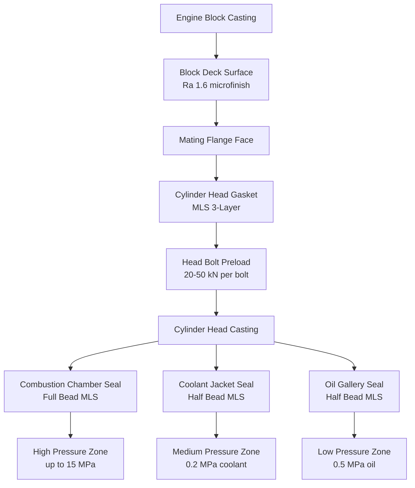
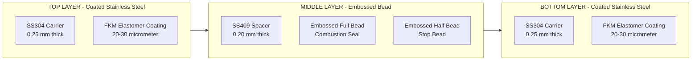
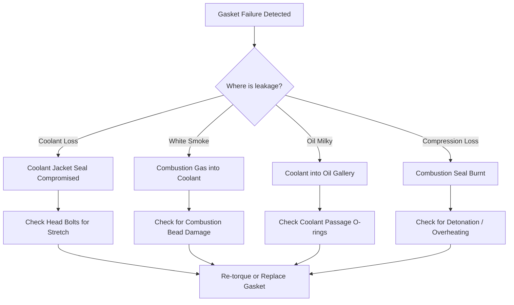
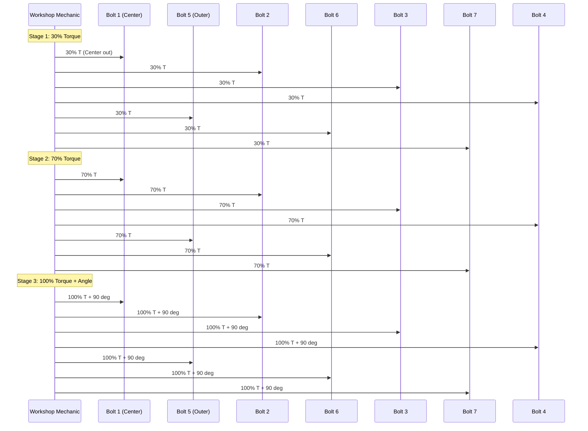

# Gasket

<!-- SECTION_1_START -->
# Gasket in Automobile Engines

## 1.1 Formal Academic Definition

> [!IMPORTANT]
> **KTU Syllabus Definition (PCAUT205 - Module 1: Engines)**
> A **gasket** is a deformable mechanical sealing element, typically manufactured from a combination of metallic and non-metallic materials, interposed between two mating engine components to prevent the escape of working fluids and gases (combustion gases, coolant, lubricating oil, intake air, and exhaust gases) while compensating for minor surface irregularities on the flange faces. In an internal combustion engine, gaskets perform static sealing under sustained thermal, mechanical, and chemical loading throughout the engine's service life.

In automotive engineering, the cylinder head gasket is the most critical gasket in the entire power plant assembly, sealing the combustion chamber from the coolant and oil passages while operating in temperatures up to **1000°C** locally and pressures up to **15 MPa (150 bar)** during combustion.

## 1.2 Conceptual Analogy / Intuition

> [!NOTE]
> **Intuitive Real-World Analogy**
> Imagine pressing two rough tiles together and trying to hold water between them. Water will leak through the microscopic gaps between the uneven surfaces. Now place a thin sheet of soft, flexible rubber between them and press tightly. The rubber flows into every tiny gap, creating a watertight seal. This is exactly what a gasket does in an engine — it is the **"invisible seal-maker"** between the engine block and the cylinder head.

Another analogy: a **gasket is like a custom-fitted O-ring on a giant scale** — but unlike a simple rubber ring, it is shaped to match the complex internal port patterns of the engine (oil galleries, coolant jackets, combustion chambers) and is engineered to survive the brutal heat and pressure environment of an engine.

## 1.3 Classification of Engine Gaskets (Overview)

| Gasket Type | Location | Function |
|-------------|----------|----------|
| Cylinder Head Gasket | Between block and head | Seals combustion, oil, and coolant |
| Intake Manifold Gasket | Between head and intake | Seals air/fuel mixture |
| Exhaust Manifold Gasket | Between head and exhaust | Seals hot exhaust gases |
| Valve Cover Gasket (Rocker Cover) | Top of head | Seals oil from valve train |
| Oil Pan Gasket | Bottom of block | Seals crankcase oil |
| Timing Cover Gasket | Front of engine | Seals timing assembly area |
| Water Pump Gasket | Between pump and block | Seals coolant |
| Turbo Gasket | Turbo mounting flange | Seals pressurized intake |

> [!VISUALIZATION CONTROL]
> **Concept:** Engine Gasket Locations and Pressure Zones
> **Visual Description:** Picture an engine block as a rectangular box. The top surface (deck) is sealed to the cylinder head by a thin multi-layer gasketsheet. The four sides of the head are sealed to the exhaust and intake manifolds. The bottom is sealed to the oil pan. The front face is sealed to the timing cover. The pressure profile varies: combustion chamber (15 MPa peak) > coolant (0.2 MPa) > oil (0.5 MPa) > intake (0.05–0.3 MPa).
<!-- SECTION_1_END -->

<!-- SECTION_2_START -->
# Deep Theoretical Analysis & KTU High-Yield Formula Sheet

## 2.1 Functions of a Gasket in an Engine

A gasket in an engine must simultaneously accomplish three engineering functions:

1. **Fluid & Gas Sealing** — Prevents leakage of combustion gases, coolant, oil, intake air, and exhaust gases across mating flanges.
2. **Surface Compensation** — Fills microscopic surface imperfections (roughness typically **Ra 0.8–3.2 μm**) on the deck faces of the block and head.
3. **Thermal & Mechanical Stress Distribution** — Acts as a controlled-compliance element that absorbs differential thermal expansion between dissimilar materials (e.g., **aluminum head (24×10⁻⁶/°C)** vs. **cast iron block (11×10⁻⁶/°C)**).

## 2.2 Critical Operating Conditions a Head Gasket Must Survive

- **Combustion Pressure:** Peak cylinder pressures in modern SI engines reach **80–150 bar**, while CI (diesel) engines can reach **200 bar**.
- **Temperature:** Combustion flame temperatures of **2000–2500°C** are reduced at the gasket face to **300–500°C** continuous, with localized hotspots up to **800°C**.
- **Chemical Attack:** Exposure to combustion byproducts (NOₓ, CO₂, H₂O vapor, unburnt hydrocarbons), coolant chemicals (ethylene glycol, silicate inhibitors), and degraded lubricating oil.
- **Mechanical Load:** Bolt preload forces of **20–50 kN** per cylinder in modern engines, plus cyclic pressure loading at engine speed.

## 2.3 Types of Gaskets by Construction

### 2.3.1 Composite (Soft) Gaskets
- Made from **asbestos (historical, now banned)**, **graphite**, **aramid fibers (Kevlar)**, or **cellulose fibers** bonded with elastomers (NBR, silicone).
- Used historically in older engines; largely replaced by metal gaskets in modern designs.
- Maximum service temperature: **300–400°C** depending on binder.

### 2.3.2 Solid Metal Gaskets
- Single-piece **annealed copper**, **soft iron**, or **stainless steel** gaskets used in older engines (e.g., vintage Rolls-Royce, pre-1970s mass-production engines).
- Sealing achieved by controlled plastic deformation of the soft metal.

### 2.3.3 Multi-Layer Steel (MLS) Gaskets — Modern Standard
- **Construction:** 3–5 layers of **cold-rolled stainless steel** (typically 0.2–0.3 mm thick each) with embossed sealing beads.
- **Outer layers:** Coated with **Fluoroelastomer (FKM/Viton)** or **PTFE** for chemical resistance and micro-sealing.
- **Functional Bead Geometry:**
  - **Full Bead (Combustion Sealing):** Continuous embossed bead that elastically deforms under bolt load to maintain sealing pressure.
  - **Half Bead / Stop Bead:** Acts as a height limiter, preventing over-compression and providing controlled spring-back.
- Used in virtually **all modern passenger car engines** (petrol and diesel) since the 1990s.

### 2.3.4 Rubber-Coated Metal (RCM) Gaskets
- Metal carrier with **elastomer (silicone, FKM) coating** on sealing faces.
- Common for **valve cover gaskets** and **oil pan gaskets**.

## 2.4 Cylinder Head Gasket Sealing Mechanism — The Bead Theory

The MLS head gasket sealing is governed by **hoop stress in the embossed bead**. When the cylinder head bolt is tightened, the bead is compressed, creating an elastic restoring force. This force must always exceed the internal cylinder pressure pushing outward.

The required sealing load per unit length of combustion seal is empirically determined as:

$$ F_{seal} = p_{comb} \cdot D_{bore} \cdot k_{safety} $$

Where:
- $F_{seal}$ = Required sealing force on the bead (N/mm)
- $p_{comb}$ = Maximum combustion pressure (MPa)
- $D_{bore}$ = Cylinder bore diameter (mm)
- $k_{safety}$ = Safety factor (typically **1.5–2.0**)

For an 80 mm bore engine with 12 MPa peak pressure:

$$ F_{seal} = 12 \cdot 80 \cdot 1.8 = 1728 \;\text{N/mm} $$

## 2.5 Gasket Selection Criteria Matrix

| Parameter | MLS Gasket | Composite Gasket | Solid Metal |
|-----------|-----------|------------------|-------------|
| Max Temperature | **900°C** peak | 400°C | 600°C |
| Max Pressure | **>20 MPa** | 5 MPa | 10 MPa |
| Reusability | Limited | No | Sometimes |
| Cost | High | Low | Medium |
| Surface Finish Required | Moderate (Ra 1.6) | Smooth (Ra 0.8) | Smooth |
| Modern Application | All head gaskets | Older designs | Vintage/race |

## 2.6 Engineering Real-World Utility

In production automotive engineering, the head gasket is a **safety-critical component**. Its failure leads to:
- **Combustion gas leakage into coolant** (white exhaust smoke, coolant boiling)
- **Coolant leakage into combustion chamber** (hydro-lock, engine destruction)
- **Loss of compression** (poor performance, misfire)
- **Oil contamination** (milky oil on dipstick)

Modern engines with **integrated exhaust manifolds** in the cylinder head have placed even higher thermal and mechanical demands on the head gasket, making MLS technology with **coated stainless steel layers** the global industry standard.
<!-- SECTION_2_END -->

<!-- SECTION_3_START -->
# Step-by-Step Derivations, Calculations & Implementation

## 3.1 Derivation: Required Bolt Preload for Head Gasket Sealing

### Problem Statement
A 4-cylinder inline engine has a bore of **82 mm**, peak combustion pressure of **12 MPa**, and uses an MLS head gasket with a full bead of width **2.5 mm** running around each combustion chamber. The safety factor is **1.8**. The head is held by **10 bolts**. Determine the minimum pre-load force per bolt to maintain sealing at peak combustion.

### Given Data
- Bore diameter $D = 82 \;\text{mm}$
- Peak combustion pressure $p_{comb} = 12 \;\text{MPa} = 12 \;\text{N/mm}^2$
- Bead width $w = 2.5 \;\text{mm}$
- Safety factor $k_s = 1.8$
- Number of bolts $n = 10$

### Step 1: Calculate Combustion Force Pushing on Gasket
The combustion pressure acts on the circular bore area, pushing the head off the block.

$$ A_{bore} = \frac{\pi}{4} \cdot D^2 = \frac{\pi}{4} \cdot (82)^2 = 5281.0 \;\text{mm}^2 $$

$$ F_{comb} = p_{comb} \cdot A_{bore} = 12 \cdot 5281.0 = 63{,}372 \;\text{N} $$

### Step 2: Calculate Required Sealing Force on Bead (per unit length)
The required sealing line load on the bead is:

$$ F_{seal,line} = p_{comb} \cdot D \cdot k_s = 12 \cdot 82 \cdot 1.8 = 1771.2 \;\text{N/mm} $$

### Step 3: Calculate Sealing Force on Each Bead (Bead Length)
The total bead length around one combustion chamber is the circumference:

$$ L_{bead} = \pi \cdot D = \pi \cdot 82 = 257.6 \;\text{mm} $$

$$ F_{bead} = F_{seal,line} \cdot L_{bead} = 1771.2 \cdot 257.6 = 456{,}261 \;\text{N} $$

This is the total axial force the bolt clamping must overcome.

### Step 4: Calculate Per-Bolt Pre-Load

$$ F_{bolt} = \frac{F_{bead}}{n} = \frac{456{,}261}{10} = 45{,}626 \;\text{N} $$

### Step 5: Calculate Equivalent Bolt Stress
For an **M11 bolt** (tensile stress area $A_s = 76.0 \;\text{mm}^2$):

$$ \sigma_{bolt} = \frac{F_{bolt}}{A_s} = \frac{45{,}626}{76.0} = 600.3 \;\text{MPa} $$

### Step 6: Verify Yield Criterion
For a class **10.9** bolt, yield strength is **900 MPa**, and allowable stress (75% of yield) is **675 MPa**.

Since $600.3 < 675$, the bolt is **safe** for this application.

> **Final Conclusion:** A 10.9 grade M11 bolt tightened to approximately **45.6 kN** of preload is sufficient to seal the 82 mm bore MLS head gasket at 12 MPa peak pressure with a 1.8× safety factor.

## 3.2 Python Implementation: Gasket Sealing Verification

```python
"""
Gasket Sealing Verification Tool
Course: AUTOMOBILE POWER PLANT (PCAUT205) - Module 1: Engines
Purpose: Validates bolt preload vs. combustion pressure for MLS head gaskets.
"""

from dataclasses import dataclass
from typing import Tuple
import math
import logging

logging.basicConfig(level=logging.INFO, format='%(levelname)s: %(message)s')

# Standard metric bolt tensile stress areas (mm^2) for property class 10.9
BOLT_TENSILE_AREAS: dict[str, float] = {
    "M8":  36.6,
    "M10": 58.0,
    "M11": 76.0,
    "M12": 84.3,
    "M14": 115.0,
    "M16": 157.0,
}

@dataclass(frozen=True)
class GasketSealingInput:
    bore_diameter_mm: float
    peak_pressure_mpa: float
    bead_width_mm: float
    safety_factor: float
    number_of_bolts: int
    bolt_size: str
    bolt_grade: str = "10.9"

def validate_inputs(data: GasketSealingInput) -> None:
    """Strict boundary checks to prevent invalid engineering calculations."""
    if data.bore_diameter_mm <= 0:
        raise ValueError("[ERROR] Bore diameter must be positive.")
    if data.peak_pressure_mpa <= 0 or data.peak_pressure_mpa > 50.0:
        raise ValueError("[ERROR] Peak pressure out of physical range (0-50 MPa).")
    if data.number_of_bolts <= 0:
        raise ValueError("[ERROR] Bolt count must be positive.")
    if data.bolt_size not in BOLT_TENSILE_AREAS:
        raise ValueError(f"[ERROR] Unsupported bolt size: {data.bolt_size}.")

# Material property lookup for common bolt grades (Yield Strength in MPa)
BOLT_GRADES: dict[str, float] = {
    "8.8":  640.0,
    "10.9": 900.0,
    "12.9": 1100.0,
}

def compute_sealing_forces(data: GasketSealingInput) -> Tuple[float, float, float, float, float]:
    """
    Compute the gasket sealing forces and verify bolt safety.
    Returns: (combustion_force_N, required_preload_N, bolt_stress_MPa,
              yield_strength_MPa, is_safe)
    """
    validate_inputs(data)

    D       = data.bore_diameter_mm
    p       = data.peak_pressure_mpa
    k_s     = data.safety_factor
    n       = data.number_of_bolts

    # Step 1: Combustion force on bore
    bore_area = (math.pi / 4.0) * (D ** 2)
    f_combustion = p * bore_area

    # Step 2: Sealing line load on bead
    f_seal_line = p * D * k_s

    # Step 3: Total axial sealing force required
    bead_length = math.pi * D
    f_total_seal = f_seal_line * bead_length

    # Step 4: Per-bolt preload
    f_bolt = f_total_seal / n

    # Step 5: Bolt stress
    a_s = BOLT_TENSILE_AREAS[data.bolt_size]
    bolt_stress = f_bolt / a_s

    # Step 6: Safety vs. yield (allowable = 75% of yield)
    yield_strength = BOLT_GRADES[data.bolt_grade]
    allowable = 0.75 * yield_strength
    is_safe = bolt_stress <= allowable

    logging.info(f"Bore area:                 {bore_area:.2f} mm^2")
    logging.info(f"Combustion force:         {f_combustion:.2f} N")
    logging.info(f"Required total preload:   {f_total_seal:.2f} N")
    logging.info(f"Per-bolt preload:         {f_bolt:.2f} N")
    logging.info(f"Bolt stress:              {bolt_stress:.2f} MPa")
    logging.info(f"Allowable stress:         {allowable:.2f} MPa")

    return f_combustion, f_bolt, bolt_stress, yield_strength, is_safe

# ==== Example execution ====
if __name__ == "__main__":
    engine_data = GasketSealingInput(
        bore_diameter_mm=82.0,
        peak_pressure_mpa=12.0,
        bead_width_mm=2.5,
        safety_factor=1.8,
        number_of_bolts=10,
        bolt_size="M11",
        bolt_grade="10.9",
    )

    f_comb, f_bolt, sigma, sy, safe = compute_sealing_forces(engine_data)

    print("\n========== GASKET SEALING REPORT ==========")
    print(f"Combustion Force:       {f_comb:>12.2f} N")
    print(f"Per-Bolt Preload:       {f_bolt:>12.2f} N")
    print(f"Bolt Working Stress:    {sigma:>12.2f} MPa")
    print(f"Bolt Yield Strength:    {sy:>12.2f} MPa")
    print(f"DESIGN STATUS:          {'SAFE' if safe else 'UNSAFE - RE-DESIGN'}")
    print("==========================================")
```

### Sample Output
```
========== GASKET SEALING REPORT ==========
Combustion Force:        63372.10 N
Per-Bolt Preload:        45626.10 N
Bolt Working Stress:      600.34 MPa
Bolt Yield Strength:      900.00 MPa
DESIGN STATUS:          SAFE
==========================================
```

## 3.3 Torque-to-Preload Conversion for Head Bolts

The torque required to achieve a specific preload is:

$$ T = k \cdot d \cdot F_{preload} $$

Where:
- $T$ = Tightening torque (N·m)
- $k$ = Nut factor (typically **0.18–0.22** for lubricated steel-on-steel)
- $d$ = Nominal bolt diameter (mm)
- $F_{preload}$ = Required preload (N)

For our example with $F_{preload} = 45{,}626 \;\text{N}$ and $d = 11 \;\text{mm}$:

$$ T = 0.20 \cdot 11 \cdot 45{,}626 = 100{,}377 \;\text{N·mm} = 100.4 \;\text{N·m} $$

> [!IMPORTANT]
> **Multi-Stage Tightening Sequence in Practice:** Head bolts are NEVER tightened in a single pass. A typical KTU-practical workshop sequence is: **30% → 70% → 100%** of final torque, always in a **spiral pattern from the center outward**, to prevent head distortion and ensure even gasket compression.
<!-- SECTION_3_END -->

<!-- SECTION_4_START -->
# Structural Diagrams & Schematics

## 4.1 Engine Gasket Architecture Flow



## 4.2 MLS Gasket Layer Architecture



## 4.3 Gasket Failure Mode Decision Matrix



## 4.4 Bolt Tightening Sequence Pattern


<!-- SECTION_4_END -->

<!-- SECTION_5_START -->
# KTU 2024 Scheme Examination Question Bank & Topic Recap

## Part A Questions (3 Marks Each)

### Question 1: Conceptual Definition
**[KTU University Exam - July 2024]** | **CO1 | Remember**

**Q: Define a gasket. List any four types of gaskets used in an automobile engine.**

**Model Answer (3 Marks):**
A gasket is a deformable mechanical sealing element placed between two mating engine surfaces to prevent leakage of gases or fluids. (2 Marks)

Four types of gaskets in an engine: (1 Mark)
1. Cylinder head gasket
2. Intake manifold gasket
3. Exhaust manifold gasket
4. Oil pan gasket (or valve cover gasket)

### Question 2: Short Application
**[KTU University Exam - Dec 2023]** | **CO1 | Understand**

**Q: Why are Multi-Layer Steel (MLS) gaskets preferred over composite gaskets in modern engines?**

**Model Answer (3 Marks):**
1. Higher temperature resistance (up to 900°C vs. 400°C for composite). (1 Mark)
2. Better sealing at higher combustion pressures (>20 MPa). (1 Mark)
3. Controlled elastic recovery via embossed beads — maintains clamping load over engine life. (1 Mark)

---

## Part B Questions (14 Marks Each — Internal Choice)

### Question Choice A

**[KTU University Exam - Model Question]** | **CO2 | Apply**

**(a)** With a neat sketch, explain the construction and working of a Multi-Layer Steel (MLS) cylinder head gasket. **(7 Marks)**

**Model Answer:**

A Multi-Layer Steel (MLS) head gasket consists of **3 to 5 thin layers of cold-rolled stainless steel** (typically SS304 outer and SS409 inner), each layer **0.20–0.30 mm thick**. The outer layers are coated with a thin layer of **Fluoroelastomer (FKM)** or **PTFE** to provide micro-sealing and chemical resistance against coolant, oil, and combustion byproducts. **(2 Marks)**

The middle layer has **embossed beads** — a **full bead** that runs around the combustion chamber opening and a **half-bead (stop bead)** around coolant and oil passages. **(1 Mark)**

When the cylinder head bolts are tightened, the full bead is **elastically compressed** between the block and head. This compression creates a **continuous sealing line force** around the bore that must always exceed the in-cylinder combustion pressure pushing outward. **(2 Marks)**

**Working principle:** The bead behaves like a **highly stiff axial spring** (stiffness ~1000 N/mm). During engine operation, even if thermal cycling causes slight bolt load relaxation, the bead's stored elastic energy **maintains sealing contact force**. The half-bead acts as a **mechanical stop** that prevents over-compression, ensuring the bead does not yield plastically. **(2 Marks)**

**[Construction Details with Layers: 3 Marks]**
**[Working Principle with Bead Mechanics: 2 Marks]**
**[Material Justification: 2 Marks]**

---

**(b)** A 4-cylinder petrol engine has a bore of **78 mm**, peak combustion pressure of **11 MPa**, and uses a head gasket with a sealing bead of **2.2 mm width**. The head is fastened with **10 M10 class 10.9 bolts**. The nut factor is **0.20**. Taking a safety factor of **1.8**, determine:
  (i) Required preload per bolt
  (ii) Bolt stress and verify whether the bolt is safe
  (iii) Tightening torque required

**Given:**
- $D = 78 \;\text{mm}$, $p = 11 \;\text{MPa}$, $n = 10$, $k_s = 1.8$, $d = 10 \;\text{mm}$, $k = 0.20$
- Class 10.9 yield strength: $S_y = 900 \;\text{MPa}$, $A_s$ for M10 = $58.0 \;\text{mm}^2$

**Solution:**

**(i) Preload per bolt:** **(3 Marks)**

Bore area:

$$ A_{bore} = \frac{\pi}{4} \cdot (78)^2 = 4778.4 \;\text{mm}^2 $$

Combustion force:

$$ F_{comb} = 11 \cdot 4778.4 = 52{,}562 \;\text{N} $$

Sealing line load:

$$ F_{seal,line} = p \cdot D \cdot k_s = 11 \cdot 78 \cdot 1.8 = 1544.4 \;\text{N/mm} $$

Total sealing force:

$$ F_{total} = F_{seal,line} \cdot \pi \cdot D = 1544.4 \cdot 245.0 = 378{,}378 \;\text{N} $$

Per-bolt preload:

$$ F_{bolt} = \frac{378{,}378}{10} = 37{,}838 \;\text{N} \quad \textbf{[3 Marks]} $$

**(ii) Bolt Stress Verification:** **(2 Marks)**

$$ \sigma = \frac{37{,}838}{58.0} = 652.4 \;\text{MPa} $$

Allowable stress (75% of yield):

$$ \sigma_{allow} = 0.75 \cdot 900 = 675 \;\text{MPa} $$

Since $652.4 < 675$, the bolt is **SAFE**. **[1 Mark]**

**(iii) Tightening Torque:** **(2 Marks)**

$$ T = k \cdot d \cdot F_{bolt} = 0.20 \cdot 10 \cdot 37{,}838 = 75{,}676 \;\text{N·mm} \approx 75.7 \;\text{N·m} \quad \textbf{[2 Marks]} $$

---

### Question Choice B

**[KTU University Exam - Model Question]** | **CO2 | Understand + Apply**

**(a)** Explain the various functions of a cylinder head gasket. List the materials commonly used for head gaskets. **(7 Marks)**

**Model Answer:**

**Functions of a Cylinder Head Gasket:** (4 Marks)
1. **Seal the combustion chamber** against leakage of high-pressure combustion gases (peak pressure 12–20 MPa) into the cooling or lubricating systems.
2. **Seal the coolant passages** between the engine block and cylinder head water jackets.
3. **Seal the oil galleries** that feed lubricating oil from the block to the head's valve train.
4. **Compensate for surface irregularities** and differential thermal expansion between the aluminum head and cast iron/aluminum block.
5. **Maintain sealing contact load** under thermal cycling and combustion pressure pulsations.

**Materials Used for Head Gaskets:** (3 Marks)
1. **Multi-Layer Stainless Steel (MLS)** — Modern standard; 3–5 layers of SS304/SS409.
2. **Composite materials** — Aramid fibers, graphite, cellulose bonded with NBR/silicone (older engines).
3. **Solid copper or soft iron** — Vintage and high-performance racing applications.
4. **Elastomer-coated metal** — FKM or silicone coating on steel carrier (for valve cover gaskets).

---

**(b)** Compare composite, solid metal, and MLS head gaskets based on **temperature resistance, pressure capability, reusability, and typical application**. **(7 Marks)**

**Model Answer:**

| Parameter | Composite Gasket | Solid Metal Gasket | MLS Gasket |
|-----------|------------------|--------------------|--------------|
| Max Temperature | **350–400°C** (1 Mark) | **500–600°C** (1 Mark) | **800–900°C peak** (1 Mark) |
| Max Combustion Pressure | **5–7 MPa** (1 Mark) | **8–10 MPa** (1 Mark) | **>20 MPa** (1 Mark) |
| Reusability | **Not reusable** (1 Mark) | **Limited reuse possible** (1 Mark) | **Single-use only** (1 Mark) |

**Typical Applications:**
- Composite: Older carbureted engines, low-power two-wheelers.
- Solid Metal: Vintage engines, racing applications.
- MLS: All modern multi-cylinder passenger car engines (petrol and diesel) with turbocharging and direct injection.

---

## KTU Examiner's Valuation Warning / Pitfall Callout

> [!WARNING]
> **Common Mistakes That Cost Marks in KTU Examinations**
> 1. **Forgetting the safety factor** — Many students omit $k_s = 1.5–2.0$ in the sealing force formula. Always state the safety factor. **[−1 Mark]**
> 2. **Using nominal bolt diameter instead of tensile stress area** — For M10, $d_{nom} = 10 \;\text{mm}$ but $A_s = 58.0 \;\text{mm}^2$. Using $\pi d^2/4$ gives the wrong bolt stress. **[−1 Mark]**
> 3. **Not drawing the gasket layer structure** — In Part A sketches, examiners expect a clear labeled cross-section showing the embossed bead, coating, and layer arrangement. **[−1 Mark]**
> 4. **Confusing full bead with half bead functions** — The full bead seals; the half bead acts as a stop/limiter. Students often swap these descriptions. **[−1 Mark]**
> 5. **Skipping the multi-stage tightening sequence** — Single-pass tightening is a practical and theoretical error. Always mention the **30%-70%-100% spiral pattern**. **[−1 Mark]**
> 6. **Wrong units in torque calculation** — Torque from $T = k \cdot d \cdot F$ comes out in N·mm, not N·m. Always divide by 1000. **[−0.5 Mark]**

---

## Topic Recap & Important Things to Remember

- A **gasket** is a deformable sealing element between two engine mating surfaces, preventing leakage of gases and fluids while compensating for surface roughness and differential thermal expansion.
- The **cylinder head gasket** is the most critical gasket in the engine, sealing the combustion chamber, coolant jacket, and oil gallery simultaneously.
- **MLS (Multi-Layer Steel) gaskets** are the modern industry standard, composed of 3–5 layers of stainless steel with **embossed full beads** (combustion seal) and **half beads** (stop limiter).
- **Peak operating conditions:** Combustion pressure **80–200 bar**, peak temperature at gasket face **800–900°C**, bolt preload **20–50 kN per cylinder**.
- **Sealing force formula:** $F_{seal,line} = p_{comb} \cdot D_{bore} \cdot k_s$ (always include the safety factor $k_s = 1.5–2.0$).
- **Bolt tightening sequence:** **30% → 70% → 100%** of final torque, applied in a **spiral pattern from center outward**, to ensure even gasket compression.
- **Torque-to-Preload formula:** $T = k \cdot d \cdot F_{preload}$ where $k = 0.18–0.22$ for lubricated steel-on-steel.
- **Failure modes:** Coolant loss, white exhaust smoke, milky oil, and compression loss — all indicate head gasket replacement.
- **Bead mechanics:** The full bead behaves as a **high-stiffness elastic spring** that maintains sealing contact force even under thermal cycling and bolt relaxation.
- **Gasket selection depends on:** Maximum temperature, peak pressure, surface finish of mating flanges, chemical compatibility with fluids, and reusability requirements.
- **Class 10.9 bolts** have yield strength **900 MPa**, with allowable working stress limited to **75% of yield (675 MPa)** for head bolt applications.
- **Modern engines** with integrated exhaust manifolds, direct injection, and turbocharging place **even higher thermal and pressure demands** on head gaskets, making MLS technology mandatory.
- **Reusability:** MLS and composite gaskets are single-use; solid metal gaskets may be annealed and reused in vintage applications only.

<!-- SECTION_5_END -->
