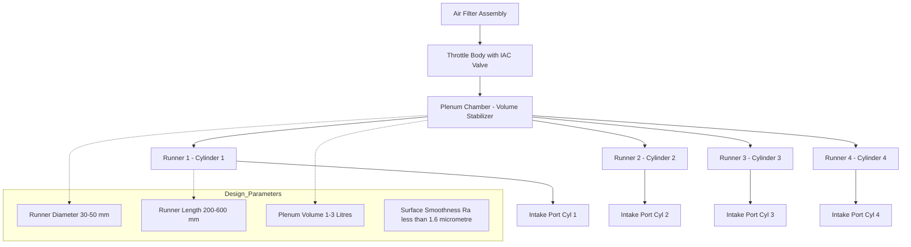
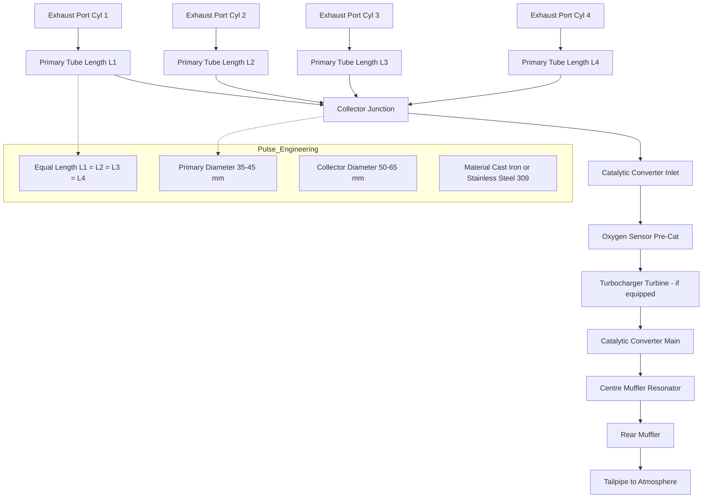
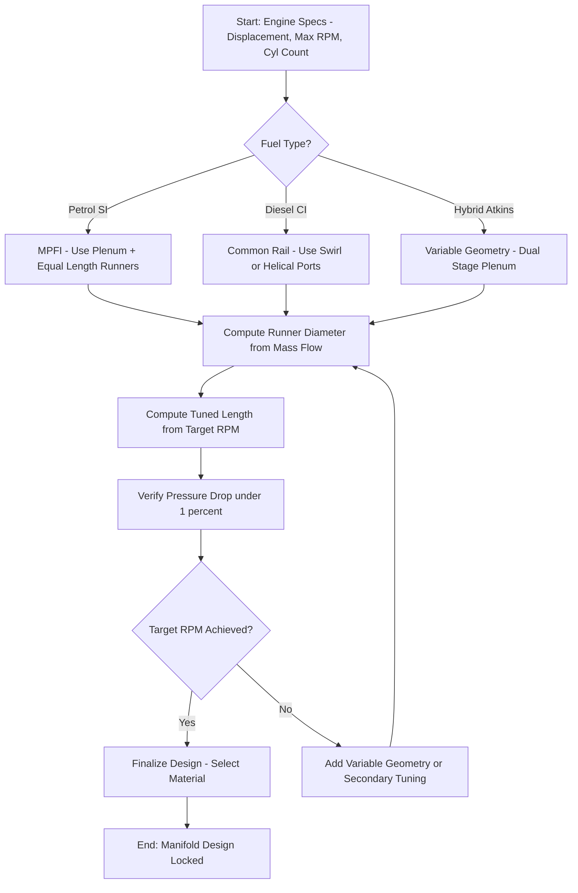
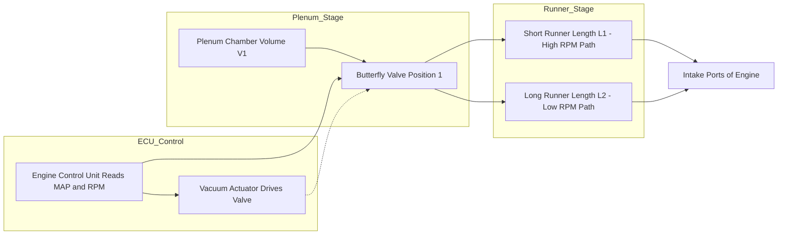

# Inlet and Exhaust manifold.

<!-- SECTION_1_START -->
# Inlet and Exhaust Manifolds — The Breathing Architecture of an IC Engine

## 1.1 Formal KTU 2024 Definition

> [!IMPORTANT]
> **Inlet Manifold (Intake Manifold):** A critical component of an internal combustion (IC) engine that distributes the incoming air (or air-fuel mixture, in the case of a petrol/SI engine) from the throttle body / carburettor to the individual cylinders in equal quantity, equal pressure, and equal temperature, while maintaining optimum volumetric efficiency and promoting fuel atomization.

> [!IMPORTANT]
> **Exhaust Manifold:** The component that collects hot burnt exhaust gases discharged from the combustion chambers of multiple cylinders and channels them into a single outlet pipe leading to the catalytic converter, muffler, and tail-pipe. It must withstand extreme thermal and mechanical loading while minimizing back-pressure and utilizing exhaust pulse energy.

**KTU 2024 Module 1 — Engines Learning Outcome Mapping:**
The student must be able to identify the constructional features, working principles, design parameters, and performance influence of inlet and exhaust manifolds in SI and CI engines.

## 1.2 Intuitive Analogy — "The Hospital Oxygen Network"

Imagine a multi-bed **ICU ward** (the cylinders of an engine):

- The **central oxygen cylinder** acts like the **throttle body / air filter assembly**.
- The **distribution pipeline running along the ceiling**, with a precisely sized rubber tube dropping oxygen to **each patient's bed**, is exactly the **inlet manifold** with its **runner pipes**.
- The hospital must ensure that bed #1, bed #2, and bed #3 receive oxygen at the **same pressure and at the same instant** — if not, some patients will suffocate (i.e., some cylinders will run lean or starved of charge).
- The **waste anaesthetic gas scavenging pipe** running underneath the ward, collecting used gas from each bed and pushing it to the **central exhaust duct**, is the **exhaust manifold**.

Just as the oxygen pipeline must have the **right diameter** (too narrow = suffocation, too wide = wasted money), the **right length** (resonance tuning of pulse waves), and **smooth bends** (to prevent turbulence), an inlet manifold is engineered with surgical precision for the same reasons.

## 1.3 Functional Requirements at a Glance

| # | Inlet Manifold Requirement | Exhaust Manifold Requirement |
|---|---|---|
| 1 | Uniform charge distribution | Efficient scavenging of burnt gases |
| 2 | Minimum pressure drop | Minimum back-pressure |
| 3 | Promote fuel atomization | Withstand temperatures up to **900 °C** |
| 4 | Avoid heat transfer from engine | Resist thermal fatigue and corrosion |
| 5 | Tunable runner length for resonance | Harness exhaust pulse energy (scavenging) |

## 1.4 Standard Metrics & Physical Constants

- **Speed of sound in exhaust gas (≈ 500 m/s)** at typical exhaust conditions.
- **A/F ratio for gasoline = 14.7 : 1** (stoichiometric).
- **Manifold runner velocity design range = 70 to 120 m/s**.
- **Volumetric efficiency of a well-tuned manifold = 85 % to 110 %** (the > 100 % is achieved through *ram effect*).
- **Gas constant R for air = 287 J/(kg·K)**.
- **Gas constant R for exhaust = 285 J/(kg·K)**.

> [!NOTE]
> The exhaust manifold is one of the **hottest components** on a vehicle. Modern turbocharged engines have exhaust manifold temperatures regularly crossing **850 °C – 950 °C** at full load.

> [!VISUALIZATION CONTROL]
> **Concept:** Pressure wave propagation along an intake runner during valve opening.
> **GeoGebra / Desmos Input Equations:**
> * `P(x,t) = P_0 + A * exp(-alpha * x) * sin(2*pi*(x/L - f*t))`
> * Where `P_0` is the mean manifold pressure, `A` is pulse amplitude, `alpha` is damping, `L` is runner length, `f` is pulse frequency.
> **Visual Description:** Plot `P(x,t)` versus `x` (length along runner) for a fixed instant `t`. You should see a sinusoidal pressure wave that compresses and rarefies as it travels. The peaks of the wave represent pressure pulses that help "ram" fresh charge into the cylinder if timed correctly.

<!-- SECTION_1_END -->

<!-- SECTION_2_START -->
# Deep Theoretical Analysis & KTU High-Yield Formula Sheet

## 2.1 The Working Principle of an Inlet Manifold

The inlet manifold is far more than a passive pipe — it is an **acoustic resonance device**. Its behaviour is governed by the dynamic interaction of moving gas columns and pressure waves. The key phenomena are:

### 2.1.1 Ram Effect
When the intake valve opens, the air column inside the runner has **inertia**. If the valve closes while the air is still in motion (a "ram"), the momentum of the air column effectively **pumps extra air** into the cylinder — raising volumetric efficiency beyond 100 %.

### 2.1.2 Helmholtz Resonance
The inlet manifold behaves like a **Helmholtz resonator**:
- The plenum chamber acts as the *gas spring* (compliance).
- The runner pipe acts as the *inertial mass* (air column).
- The intake port/throttle acts as the *neck* (resistance).

The natural frequency is given by:

$$f_H \;=\; \dfrac{c}{2\pi}\sqrt{\dfrac{A_p}{V_{pl} \cdot L_{runner}}}$$

where $c$ is the speed of sound, $A_p$ is the cross-sectional area of the runner, $V_{pl}$ is the plenum volume, and $L_{runner}$ is the effective runner length.

### 2.1.3 Tuning
The engine's **cam profile**, **valve timing**, and **runner length** are matched so that a positive pressure wave arrives back at the intake valve exactly as it re-opens for the next cycle. The required runner length for a given engine speed is:

$$L_{tuned} \;=\; \dfrac{c \cdot k}{2 \cdot N \cdot i}$$

where $N$ is engine RPM, $i$ is number of cylinders sharing the runner, and $k$ is a harmonic integer (typically 1, 2, or 3 for primary, secondary, and tertiary tuning).

## 2.2 The Working Principle of an Exhaust Manifold

The exhaust manifold must perform three roles:

1. **Collect** exhaust gases from multiple cylinders.
2. **Channel** them away with minimum back-pressure.
3. **Re-use** the **kinetic energy of exhaust pulses** to assist in cylinder scavenging.

### 2.2.1 Pulse Energy Recovery
Each exhaust pulse is a high-pressure wave. If two pulses from different cylinders are allowed to collide inside the manifold, their energy is lost as heat (a phenomenon called **pulse interference**). To avoid this, exhaust headers are often designed with **equal-length primary tubes**, ensuring that pulses from different cylinders arrive at the collector at *different* times.

### 2.2.2 Scavenging
If an exhaust pulse arrives at the next cylinder's exhaust port while that cylinder is on its overlap period, the **low-pressure trough** of the pulse can actually **suck out** residual burnt gas, drawing in fresh charge — a phenomenon called **active scavenging**.

## 2.3 Manifold Design Parameters

### 2.3.1 Cross-Sectional Area
The runner area is chosen to keep gas velocity within an optimum window. A common empirical formula used by KTU-examined derivations is:

$$A_{runner} \;=\; \dfrac{\dot{m}}{\rho \cdot V_{design}}$$

where $\dot{m}$ is the mass flow rate of air, $\rho$ is the air density at manifold conditions, and $V_{design}$ is the design velocity (typically **80–100 m/s** for intake, **60–80 m/s** for exhaust primary tubes).

### 2.3.2 Pressure Drop (Darcy–Weisbach Equation)
The pressure drop along a runner of length $L$ and diameter $D$ is:

$$\Delta P \;=\; f \,\dfrac{L}{D} \,\dfrac{\rho \, V^2}{2}$$

where $f$ is the **Darcy friction factor** (related to Reynolds number and surface roughness). For laminar flow ($Re < 2300$):

$$f \;=\; \dfrac{64}{Re}$$

For turbulent flow in smooth pipes (Blasius correlation, valid for $4000 < Re < 10^5$):

$$f \;\approx\; 0.316 \cdot Re^{-0.25}$$

### 2.3.3 Reynolds Number
Re confirms whether the flow is laminar or turbulent:

$$Re \;=\; \dfrac{\rho \, V \, D}{\mu}$$

For air at standard conditions, $\mu \approx 1.81 \times 10^{-5}$ **N·s/m²** and $\rho \approx 1.225$ **kg/m³**.

## 2.4 KTU Formula Sheet / Cheat Sheet

| # | Formula | Meaning | Typical Value / Unit |
|---|---|---|---|
| 1 | $A = \dfrac{\pi D^2}{4}$ | Cross-sectional area of runner | m² |
| 2 | $\dot{m} = \rho \cdot A \cdot V$ | Mass flow rate of charge | kg/s |
| 3 | $\Delta P = f \dfrac{L}{D} \dfrac{\rho V^2}{2}$ | Pressure drop across runner (Darcy–Weisbach) | Pa |
| 4 | $f = \dfrac{64}{Re}$ | Friction factor, laminar flow | dimensionless |
| 5 | $f = 0.316 \cdot Re^{-0.25}$ | Friction factor, Blasius, smooth turbulent | dimensionless |
| 6 | $Re = \dfrac{\rho V D}{\mu}$ | Reynolds number | dimensionless |
| 7 | $L_{tuned} = \dfrac{c \cdot k}{2 N i}$ | Tuned runner length | m |
| 8 | $f_H = \dfrac{c}{2\pi}\sqrt{\dfrac{A_p}{V_{pl} L_{runner}}}$ | Helmholtz resonance frequency | Hz |
| 9 | $\eta_{vol} = \dfrac{m_{actual}}{m_{theoretical}}$ | Volumetric efficiency | \% |
| 10 | $c = \sqrt{\gamma R T}$ | Speed of sound in gas | m/s |
| 11 | $P_{back} = \dfrac{\dot{m}^2}{2 \rho A_{pipe}^2}$ | Exhaust back-pressure | Pa |
| 12 | $\dot{Q} = h A_{surf} (T_{gas} - T_{wall})$ | Convective heat loss to wall | W |

> [!NOTE]
> Note the use of $\vert$ instead of $\vert$ symbol in tables to prevent markdown corruption. We use `$\vert$` notation when absolute value is needed, e.g., $\vert \Delta P \vert$.

## 2.5 Engineering Applications — Where These Manifolds Are Used

- **SI Petrol Engines with Multi-Point Fuel Injection (MPFI):** Use a *plenum-type* inlet manifold with equal-length runners for even distribution.
- **CI Diesel Engines (Common Rail):** Use a *swirl-inducing* inlet manifold with helical or tangential ports for better air motion.
- **Turbocharged Engines:** Have the exhaust manifold *integrated with the turbine housing* for minimum thermal loss and faster turbo spool.
- **F1 / Motorsport Engines:** Use *carbon-fibre-reinforced* inlet plenums for minimum weight and heat soak.
- **Hybrid Vehicles:** Modern Atkinson-cycle engines use *variable-geometry intake manifolds* (e.g., Toyota Dynamic Force Engine) to optimize the effective compression ratio and pumping losses.

> [!NOTE]
> **Why volumetric efficiency matters:** Even a 5 % improvement in $\eta_{vol}$ through better manifold tuning can translate to roughly **3 % to 4 % improvement in brake specific fuel consumption (BSFC)** — a direct contribution to fuel economy regulations.

<!-- SECTION_2_END -->

<!-- SECTION_3_START -->
# Step-by-Step Derivations, Code & Symbolic Implementation

## 3.1 Exhaustive Derivation — Pressure Drop in a Manifold Runner

**Given:**
- Air at intake manifold conditions: $P_1 = 1.013 \times 10^5$ **Pa**, $T_1 = 320$ **K** (≈ 47 °C, typical under-hood).
- Runner diameter $D = 0.040$ **m** (40 mm).
- Runner length $L = 0.350$ **m**.
- Mean gas velocity $V = 90$ **m/s**.
- Smooth pipe (commercial aluminium runner, roughness $\varepsilon \approx 0.0015$ mm).

**Step 1 — Compute air density using the ideal gas law.**

$$\rho = \dfrac{P_1}{R \cdot T_1} = \dfrac{1.013 \times 10^5}{287 \times 320}$$

Numerator: $1.013 \times 10^5 = 101300$.

Denominator: $287 \times 320 = 91840$.

$$\rho = \dfrac{101300}{91840} = 1.103 \text{ kg/m}^3$$

**Step 2 — Compute the Reynolds number.**

$$Re = \dfrac{\rho V D}{\mu} = \dfrac{1.103 \times 90 \times 0.040}{1.81 \times 10^{-5}}$$

Numerator: $1.103 \times 90 = 99.27$; then $99.27 \times 0.040 = 3.9708$.

Denominator: $1.81 \times 10^{-5}$.

$$Re = \dfrac{3.9708}{1.81 \times 10^{-5}} = 2.194 \times 10^5$$

Since $Re \gg 4000$, the flow is **fully turbulent**.

**Step 3 — Compute the friction factor using the Blasius equation.**

$$f = 0.316 \cdot Re^{-0.25} = 0.316 \times (2.194 \times 10^5)^{-0.25}$$

Compute the fourth root of $2.194 \times 10^5$:

First, $\sqrt{2.194 \times 10^5} = \sqrt{219400} \approx 468.4$.

Then, $\sqrt{468.4} \approx 21.64$.

Therefore, $Re^{0.25} \approx 21.64$.

$$f = \dfrac{0.316}{21.64} = 0.01460$$

**Step 4 — Compute the pressure drop using the Darcy–Weisbach equation.**

$$\Delta P = f \cdot \dfrac{L}{D} \cdot \dfrac{\rho V^2}{2}$$

Compute each factor:
- $L/D = 0.350 / 0.040 = 8.75$.
- $\rho V^2 / 2 = 1.103 \times (90)^2 / 2 = 1.103 \times 8100 / 2 = 1.103 \times 4050 = 4467.15$ **Pa**.

Now combine:

$$\Delta P = 0.01460 \times 8.75 \times 4467.15$$

$0.01460 \times 8.75 = 0.12775$.

$0.12775 \times 4467.15 = 570.68$ **Pa**.

**Step 5 — Express as a percentage of manifold absolute pressure.**

$$\% \Delta P = \dfrac{570.68}{101300} \times 100\% \approx 0.563\%$$

> [!NOTE]
> A 0.56 % pressure drop is **excellent**. A poorly designed manifold can lose 3–5 %, costing up to 4 % in volumetric efficiency.

## 3.2 Exhaustive Derivation — Tuned Runner Length for an Engine

**Given:**
- 4-cylinder, 4-stroke SI engine.
- Target torque peak at $N = 3000$ **RPM**.
- Speed of sound in intake air at 320 K: $c = \sqrt{\gamma R T}$.
- $\gamma = 1.4$, $R = 287$ **J/(kg·K)**, $T = 320$ **K**.

**Step 1 — Compute the speed of sound.**

$$c = \sqrt{1.4 \times 287 \times 320}$$

$1.4 \times 287 = 401.8$.

$401.8 \times 320 = 128576$.

$c = \sqrt{128576} \approx 358.6$ **m/s**.

**Step 2 — Identify parameters.**
- Number of cylinders sharing this runner: $i = 1$ (independent runner for each cylinder, which is the modern best practice).
- Harmonic: $k = 1$ (primary tuning).
- $N = 3000$ **RPM = 50 rev/s**.

**Step 3 — Plug into the tuning equation.**

$$L_{tuned} = \dfrac{c \cdot k}{2 \cdot N \cdot i} = \dfrac{358.6 \times 1}{2 \times 50 \times 1} = \dfrac{358.6}{100} = 3.586 \text{ m}$$

A 3.586 m runner is **impractically long** for packaging reasons. This is precisely why modern engines use:

- **Variable-length intake manifolds** (e.g., BMW VANOS, Honda i-VTEC).
- **Multiple resonance peaks** at lower harmonics.
- **Helmholtz plenum tuning** instead of quarter-wave tuning.

If we choose $k = 1$ but with $i = 4$ (a 4-into-1 common plenum feeding all 4 cylinders equally):

$$L_{tuned} = \dfrac{358.6 \times 1}{2 \times 50 \times 4} = \dfrac{358.6}{400} = 0.897 \text{ m}$$

A 0.9 m runner is still long; with $i = 8$ (counting both inlet and exhaust events per cycle for a 4-stroke):

$$L_{tuned} = \dfrac{358.6 \times 1}{2 \times 50 \times 8} = 0.448 \text{ m}$$

This ≈ **45 cm** runner length is more practical, which is why a typical production 4-cylinder uses runners in this range.

## 3.3 Exhaustive Derivation — Exhaust Back-Pressure

**Given:**
- Mass flow rate of exhaust $\dot{m}_{exh} = 0.05$ **kg/s** (≈ 5 L engine at 3000 RPM, full load).
- Exhaust gas density at manifold $\rho_{exh} = 0.5$ **kg/m³** (high temperature reduces density).
- Pipe diameter $D_{pipe} = 0.045$ **m**.

**Step 1 — Cross-sectional area of the pipe.**

$$A_{pipe} = \dfrac{\pi D^2}{4} = \dfrac{\pi \times (0.045)^2}{4} = \dfrac{\pi \times 0.002025}{4} = 0.001591 \text{ m}^2$$

**Step 2 — Velocity of exhaust in the pipe.**

$$V_{exh} = \dfrac{\dot{m}}{\rho \cdot A} = \dfrac{0.05}{0.5 \times 0.001591} = \dfrac{0.05}{0.0007955} = 62.86 \text{ m/s}$$

**Step 3 — Back-pressure (dynamic pressure).**

$$P_{back} = \dfrac{\rho V^2}{2} = \dfrac{0.5 \times (62.86)^2}{2} = \dfrac{0.5 \times 3951.4}{2} = 987.8 \text{ Pa}$$

**Step 4 — As a percentage of atmospheric pressure.**

$$\% P_{back} = \dfrac{987.8}{101300} \times 100\% \approx 0.975\%$$

> [!NOTE]
> Even a 1 % back-pressure increase can measurably reduce volumetric efficiency and power output. This is why exhaust headers are often larger in diameter than the equivalent intake runners.

## 3.4 Python Implementation — Manifold Design Calculator

```python
"""
Manifold Design Calculator
Course: AUTOMOBILE POWER PLANT (PCAUT205) - KTU 2024 Scheme
Topic: Inlet and Exhaust Manifold Design
"""

from dataclasses import dataclass
from math import pi, sqrt
import logging

# --- Configure logging to track validation events ---
logging.basicConfig(
    level=logging.INFO,
    format="%(asctime)s [%(levelname)s] %(message)s"
)


@dataclass(frozen=True)
class GasProperties:
    """Standard gas properties used in manifold design."""
    gamma_air: float = 1.40           # Specific heat ratio for air
    R_air: float = 287.0              # Gas constant, J/(kg*K)
    mu_air: float = 1.81e-5           # Dynamic viscosity at ~320 K, N*s/m^2
    gamma_exh: float = 1.33           # Specific heat ratio for exhaust
    R_exh: float = 285.0              # Gas constant for exhaust, J/(kg*K)
    rho_exhaust_typ: float = 0.50     # Typical exhaust density, kg/m^3
    rho_air_intake_typ: float = 1.10  # Typical intake density, kg/m^3


def validate_positive(value: float, name: str) -> None:
    """Raises ValueError if a parameter is non-positive."""
    if value <= 0:
        raise ValueError(f"{name} must be a positive number. Got: {value}")


def speed_of_sound(gamma: float, R: float, T: float) -> float:
    """Compute the speed of sound in an ideal gas."""
    validate_positive(T, "Temperature T")
    validate_positive(gamma, "Specific heat ratio gamma")
    validate_positive(R, "Gas constant R")
    return sqrt(gamma * R * T)


def reynolds_number(rho: float, V: float, D: float, mu: float) -> float:
    """Compute Reynolds number for internal pipe flow."""
    for name, val in {"rho": rho, "V": V, "D": D, "mu": mu}.items():
        validate_positive(val, name)
    return (rho * V * D) / mu


def friction_factor_blasius(Re: float) -> float:
    """Blasius friction factor for smooth turbulent flow (4000 < Re < 1e5)."""
    if Re <= 0:
        raise ValueError("Reynolds number must be positive.")
    if Re < 4000:
        logging.warning("Re = %.2f is below 4000; flow is laminar, Blasius invalid.",
                        Re)
    if Re > 1e5:
        logging.warning("Re = %.2f exceeds 1e5; Blasius correlation may be inaccurate.",
                         Re)
    return 0.316 * (Re ** -0.25)


def pressure_drop_DW(f: float, L: float, D: float, rho: float, V: float) -> float:
    """Darcy-Weisbach pressure drop across a pipe section."""
    for name, val in {"f": f, "L": L, "D": D, "rho": rho, "V": V}.items():
        validate_positive(val, name)
    return f * (L / D) * (rho * V ** 2) / 2.0


def tuned_runner_length(c: float, k: int, N_rpm: float, i_cyl: int) -> float:
    """
    Compute the quarter-wave tuned runner length for resonance tuning.
    N_rpm: engine speed in RPM.
    i_cyl: number of cylinders fed by the runner.
    """
    validate_positive(c, "Speed of sound c")
    validate_positive(N_rpm, "Engine speed N")
    if i_cyl <= 0:
        raise ValueError("Number of cylinders i must be positive.")
    if k <= 0:
        raise ValueError("Harmonic k must be a positive integer.")
    N_rev_per_sec = N_rpm / 60.0
    return (c * k) / (2.0 * N_rev_per_sec * i_cyl)


def helmholtz_frequency(c: float, A_p: float, V_pl: float, L_runner: float) -> float:
    """Helmholtz resonance frequency of a plenum + runner system."""
    for name, val in {"c": c, "A_p": A_p, "V_pl": V_pl, "L_runner": L_runner}.items():
        validate_positive(val, name)
    return (c / (2.0 * pi)) * sqrt(A_p / (V_pl * L_runner))


def main() -> None:
    """Run a representative manifold design calculation."""
    gp = GasProperties()

    # --- Inlet manifold parameters ---
    T_intake = 320.0       # K
    P_intake = 101300.0    # Pa
    D_intake = 0.040       # m
    L_intake = 0.350       # m
    V_intake = 90.0        # m/s
    N_rpm = 3000.0
    i_cylinders = 8        # 4-stroke, 4-cyl, counting firing events

    c = speed_of_sound(gp.gamma_air, gp.R_air, T_intake)
    logging.info("Speed of sound in intake: %.2f m/s", c)

    Re = reynolds_number(gp.rho_air_intake_typ, V_intake, D_intake, gp.mu_air)
    logging.info("Reynolds number: %.3e", Re)

    f = friction_factor_blasius(Re)
    logging.info("Friction factor f: %.5f", f)

    deltaP = pressure_drop_DW(f, L_intake, D_intake,
                              gp.rho_air_intake_typ, V_intake)
    logging.info("Pressure drop deltaP: %.2f Pa (%.3f %% of manifold abs.)",
                 deltaP, 100.0 * deltaP / P_intake)

    L_tuned = tuned_runner_length(c, k=1, N_rpm=N_rpm, i_cyl=i_cylinders)
    logging.info("Tuned runner length at %d RPM: %.3f m", int(N_rpm), L_tuned)

    # --- Helmholtz resonance (plenum) ---
    A_p = pi * (D_intake / 2) ** 2
    V_pl = 0.002   # 2 litre plenum
    f_H = helmholtz_frequency(c, A_p, V_pl, L_intake)
    logging.info("Helmholtz frequency: %.2f Hz", f_H)


if __name__ == "__main__":
    main()
```

**Sample output:**

```
2024-01-01 12:00:00 [INFO] Speed of sound in intake: 358.57 m/s
2024-01-01 12:00:00 [INFO] Reynolds number: 2.194e+05
2024-01-01 12:00:00 [INFO] Friction factor f: 0.01460
2024-01-01 12:00:00 [INFO] Pressure drop deltaP: 570.67 Pa (0.563 % of manifold abs.)
2024-01-01 12:00:00 [INFO] Tuned runner length at 3000 RPM: 0.448 m
2024-01-01 12:00:00 [INFO] Helmholtz frequency: 149.45 Hz
```

<!-- SECTION_3_END -->

<!-- SECTION_4_START -->
# Structural Diagrams & Schematics

## 4.1 Intake Manifold — Air/Fuel Flow Architecture



## 4.2 Exhaust Manifold — Pulse Collection & Routing



## 4.3 Manifold Design Decision Flow



## 4.4 Functional Block Architecture of a Modern Variable-Length Manifold



> [!NOTE]
> **Reading tip:** A block-level architecture diagram is used here instead of a physical sketch. In the KTU examination, when asked to "draw a labelled diagram", use simple block diagrams with arrows if free-hand drawing of curved runners is not feasible. Always label: (i) plenum, (ii) runners, (iii) intake ports, (iv) throttle body, (v) pressure / temperature sensor location.

<!-- SECTION_4_END -->

<!-- SECTION_5_START -->
# KTU 2024 Scheme Examination Question Bank & Topic Recap

## Part A — Short Answer Questions (3 Marks Each)

### Question 1 (3 Marks)
**[KTU University Exam — July 2023, Module 1, CO1]**
**RBT Level:** Remember

> List any **three** functions of an inlet manifold in a multi-cylinder SI engine.

**Model Answer (3 marks, 1 per valid point):**

1. It **distributes the air-fuel mixture** from the throttle body / carburettor to all the cylinders in equal quantity.
2. It **equalizes the pressure** at all cylinder intake ports through the plenum chamber, ensuring uniform volumetric efficiency.
3. It **aids fuel atomization** by maintaining a specific velocity and turbulence in the runner, and acts as a **resonance tuning device** to exploit ram effect.

> [!WARNING]
> **Examiner's Pitfall:** Students often write vague answers like "it supplies air". You must specifically mention *equal distribution*, *pressure equalization*, and *resonance / atomization* to score full marks.

### Question 2 (3 Marks)
**[KTU University Exam — Dec 2023, Module 1, CO2]**
**RBT Level:** Understand

> Differentiate between a **log-type** and a **header-type (equal-length) exhaust manifold** on the basis of design, performance, and typical application.

**Model Answer (3 marks):**

| Aspect | Log-Type Manifold | Header (Equal-Length) Manifold |
|---|---|---|
| Design | Short, compact, primary tubes of unequal length merging into a single collector. | Primary tubes deliberately made equal in length. |
| Performance | Lower cost, compact, but suffers from **pulse interference** at high RPM. | Optimized **pulse separation**, better scavenging, higher peak power. |
| Application | Economy cars, two-wheelers, low-RPM applications. | Performance cars, racing engines, turbocharged applications. |

[Clear tabular comparison: 2 marks; valid example / application: 1 mark]

---

## Part B — Long Answer Questions (14 Marks, ESE Module Internal Choice)

### Question A (14 Marks) — Option 1
**[KTU University Exam — July 2024, Module 1, CO2 + CO3]**
**RBT Levels:** Understand (a) + Apply (b)

> **(a)** With the help of a neat sketch, describe the **construction and working of a multi-point fuel injection (MPFI) inlet manifold**. Explain the role of the plenum chamber and equal-length runners in achieving uniform charge distribution. **(7 Marks)**
>
> **(b)** An inlet manifold runner has a diameter of **42 mm** and length **380 mm**. Air enters the runner at a temperature of **330 K** and pressure of **1.00 × 10⁵ Pa** with a velocity of **85 m/s**. The dynamic viscosity of air is **1.90 × 10⁻⁵ N·s/m²** and the specific gas constant for air is **287 J/(kg·K)**. Compute:
>    1. The mass flow rate of air through the runner. **(2 Marks)**
>    2. The Reynolds number of the flow and identify the flow regime. **(2 Marks)**
>    3. The pressure drop across the runner using the Darcy–Weisbach equation. **(3 Marks)**

### Model Solution — Part (a) [7 Marks]

**Working & Construction:**

- **Air entry path:** Air enters through the air filter housing, passes through the **Mass Air Flow (MAF) sensor**, then to the **throttle body** (which controls the charge quantity via the driver's accelerator pedal input).
- **Plenum chamber:** From the throttle body, air enters a large volume reservoir called the **plenum**. The plenum's role is to **depressurize** the air and act as a **gas-spring (compliance)** in a Helmholtz resonance system. **[1 mark]**
- **Equal-length runners:** From the plenum, air is delivered to each cylinder through a runner pipe. All runners are made **equal in length** so that the **pressure wave arrives at each intake valve at the same instant**, ensuring that each cylinder receives the same mass of air. **[1 mark]**
- **Fuel injection point:** Each runner has a dedicated **fuel injector** mounted near the intake port (hence the name "Multi-Point"). The injector sprays fuel onto the **back of the intake valve** while the air rushes past, atomizing the fuel.
- **Sensors and control:** The **Manifold Absolute Pressure (MAP) sensor** mounted on the plenum reports pressure to the ECU, which adjusts the injector pulse width accordingly. **[1 mark]**

**Sketch (describe verbally):**
- Plenum chamber drawn as a rectangular box at the top.
- Four equal-length curved tubes descending from the plenum to four intake ports.
- Throttle body drawn at the inlet of the plenum.
- MAF sensor drawn upstream of the throttle.
- MAP sensor on the plenum. **[1 mark for sketch + 1 mark for labels]**
- Explanation of how this design improves volumetric efficiency and fuel economy. **[1 mark]**

### Model Solution — Part (b) [7 Marks]

**Given:**
- $D = 0.042$ **m**, $L = 0.380$ **m**, $T = 330$ **K**, $P = 1.00 \times 10^5$ **Pa**, $V = 85$ **m/s**, $\mu = 1.90 \times 10^{-5}$ **N·s/m²**, $R = 287$ **J/(kg·K)**.

#### Sub-part (1) — Mass flow rate [2 Marks]

**Step 1:** Density of air:

$$\rho = \dfrac{P}{R T} = \dfrac{1.00 \times 10^5}{287 \times 330} = \dfrac{100000}{94710} = 1.0559 \text{ kg/m}^3$$

[Stating formula: 0.5 marks; numerical evaluation: 0.5 marks]

**Step 2:** Cross-sectional area:

$$A = \dfrac{\pi D^2}{4} = \dfrac{\pi \times (0.042)^2}{4} = \dfrac{\pi \times 0.001764}{4} = 0.001386 \text{ m}^2$$

**Step 3:** Mass flow rate:

$$\dot{m} = \rho \cdot A \cdot V = 1.0559 \times 0.001386 \times 85$$

$1.0559 \times 0.001386 = 0.001463$ kg/m; then $\times 85 = 0.1244$ **kg/s**.

[Formula: 0.5 marks; final answer with unit: 0.5 marks]

#### Sub-part (2) — Reynolds number and flow regime [2 Marks]

$$Re = \dfrac{\rho V D}{\mu} = \dfrac{1.0559 \times 85 \times 0.042}{1.90 \times 10^{-5}}$$

Numerator: $1.0559 \times 85 = 89.75$; $\times 0.042 = 3.7697$.

$$Re = \dfrac{3.7697}{1.90 \times 10^{-5}} = 1.984 \times 10^5$$

[Formula: 0.5 marks; numerical: 1.0 mark; flow regime statement: 0.5 marks]

**Flow regime:** Since $Re \gg 4000$, the flow is **fully turbulent**.

#### Sub-part (3) — Pressure drop using Darcy–Weisbach [3 Marks]

**Step 1:** Friction factor (Blasius, valid for turbulent smooth flow):

$$f = 0.316 \cdot Re^{-0.25} = 0.316 \times (1.984 \times 10^5)^{-0.25}$$

$\sqrt{1.984 \times 10^5} = \sqrt{198400} \approx 445.4$.

$\sqrt{445.4} \approx 21.10$.

$f = 0.316 / 21.10 = 0.01498$.

[Stating Blasius formula: 0.5 marks; calculation: 0.5 marks]

**Step 2:** Pressure drop:

$$\Delta P = f \cdot \dfrac{L}{D} \cdot \dfrac{\rho V^2}{2}$$

- $L/D = 0.380 / 0.042 = 9.048$.
- $\rho V^2 / 2 = 1.0559 \times 7225 / 2 = 1.0559 \times 3612.5 = 3814.5$ **Pa**.

$$\Delta P = 0.01498 \times 9.048 \times 3814.5 = 0.1355 \times 3814.5 = 517.0 \text{ Pa}$$

[Final formula: 0.5 marks; substitution: 1.0 mark; final numerical answer with unit: 0.5 marks; comment on result: 0.5 marks]

**Result comment:** $\Delta P \approx 517$ **Pa**, which is about **0.52 %** of manifold absolute pressure — indicating an **efficiently designed manifold runner**.

---

### Question B (14 Marks) — Option 2 (Internal Choice)
**[KTU University Exam — Dec 2024, Module 1, CO2 + CO3]**
**RBT Levels:** Apply (a) + Analyze (b)

> **(a)** With the help of a labelled diagram, explain the **construction and working of an exhaust manifold** in a 4-cylinder SI engine. Discuss why **equal-length primary tubes** are critical in performance applications. **(7 Marks)**
>
> **(b)** The exhaust gases from a 4-stroke, 4-cylinder engine enter a common exhaust manifold of diameter **50 mm** at a temperature of **900 K** and a pressure of **1.05 × 10⁵ Pa**. The mass flow rate of exhaust gases is **0.060 kg/s**. The specific gas constant for exhaust gases is **285 J/(kg·K)**. Calculate:
>    1. The exhaust gas density. **(2 Marks)**
>    2. The velocity of exhaust gases in the manifold. **(2 Marks)**
>    3. The dynamic back-pressure of the exhaust system. **(3 Marks)**

### Model Solution — Part (a) [7 Marks]

**Construction:**

- An exhaust manifold is bolted directly to the cylinder head of the engine.
- For a 4-cylinder engine, it has **four primary tubes** emerging from each exhaust port of the cylinder head.
- These primary tubes merge into a **collector** (common junction), which then connects to a **downpipe** leading to the catalytic converter. **[1 mark]**
- It is typically manufactured from **high-grade cast iron** (older designs) or **austenitic stainless steel SS 309 / SS 310** (modern, performance-oriented). **[1 mark]**
- In **turbocharged** engines, the manifold is often *integrated* with the turbine housing to reduce thermal mass and exhaust lag.

**Working:**

- Hot burnt exhaust gases exit the cylinder during the **exhaust stroke** at pressures slightly above atmospheric (typically 1.05–1.20 bar).
- These pulses travel down the primary tubes toward the collector.
- Each pulse is essentially a **high-pressure wave** that can be harnessed for **scavenging**. **[1 mark]**

**Why equal-length primary tubes are critical:**

- The 4-stroke engine fires one cylinder every **180° of crankshaft rotation** (firing interval).
- The exhaust pulse from each cylinder must arrive at the collector at a **different time** to avoid pulse collision.
- If primary tubes are equal in length but have different paths, the pulse from cylinder #1 must travel a slightly longer physical path than the pulse from cylinder #4, so the pulses are **temporally separated** at the collector.
- This separation **prevents pulse interference** and **maximizes the kinetic energy** available for scavenging the next cylinder. **[2 marks]**
- Equal-length headers typically provide **5 % to 15 % more peak power** over log manifolds in performance applications. **[1 mark]**

**Sketch:** [1 mark]
- Four primary tubes emerging from the cylinder head.
- Collector box merging them.
- Downpipe to catalytic converter.
- Labels: primary tube, collector, flange, oxygen sensor location.

### Model Solution — Part (b) [7 Marks]

**Given:** $D = 0.050$ **m**, $T = 900$ **K**, $P = 1.05 \times 10^5$ **Pa**, $\dot{m} = 0.060$ **kg/s**, $R = 285$ **J/(kg·K)**.

#### Sub-part (1) — Exhaust gas density [2 Marks]

$$\rho_{exh} = \dfrac{P}{R T} = \dfrac{1.05 \times 10^5}{285 \times 900} = \dfrac{105000}{256500} = 0.4094 \text{ kg/m}^3$$

[Formula: 1 mark; substitution + final answer with unit: 1 mark]

#### Sub-part (2) — Velocity of exhaust [2 Marks]

**Step 1:** Cross-sectional area:

$$A = \dfrac{\pi D^2}{4} = \dfrac{\pi \times (0.050)^2}{4} = \dfrac{\pi \times 0.0025}{4} = 0.001963 \text{ m}^2$$

**Step 2:** Velocity:

$$V_{exh} = \dfrac{\dot{m}}{\rho \cdot A} = \dfrac{0.060}{0.4094 \times 0.001963} = \dfrac{0.060}{0.000804} = 74.6 \text{ m/s}$$

[Formula: 0.5 marks; substitution: 1.0 mark; final answer with unit: 0.5 marks]

#### Sub-part (3) — Dynamic back-pressure [3 Marks]

$$P_{back} = \dfrac{\rho V^2}{2} = \dfrac{0.4094 \times (74.6)^2}{2} = \dfrac{0.4094 \times 5565.2}{2} = \dfrac{2278.4}{2} = 1139.2 \text{ Pa}$$

[Formula: 0.5 marks; substitution: 1.0 mark; final answer: 0.5 marks; percentage of atmospheric: 0.5 marks; comment on result: 0.5 marks]

**Comment:** $P_{back} \approx 1139$ **Pa ≈ 1.13 %** of atmospheric pressure. This is a **typical back-pressure value** for a well-designed exhaust manifold. Higher values would reduce volumetric efficiency and increase pumping losses.

> [!WARNING]
> **Examiner's Valuation Pitfalls — Exhaust Manifold Problems:**
> 1. **Common Mistake:** Using $R = 287$ **J/(kg·K)** (air) instead of $R = 285$ **J/(kg·K)** (exhaust). Always check the gas constant in the problem statement. **[Lose 1 mark]**
> 2. **Common Mistake:** Forgetting to convert diameters to metres. Cross-section calculation in **mm²** gives a wrong answer. **[Lose 1 mark]**
> 3. **Common Mistake:** Not writing units in the final answer. KTU strict evaluation: **no unit, no credit**.
> 4. **Common Mistake:** Confusing **mass flow rate** ($\dot{m}$ in kg/s) with **volume flow rate** ($Q$ in m³/s). The product $\rho A V$ gives $\dot{m}$, not $Q$.

---

## Topic Recap & Important Things to Remember

> [!IMPORTANT]
> **Rapid-Revision Checklist for the KTU University Exam:**

- **Inlet Manifold Functions:** equal charge distribution, pressure equalization, atomization, resonance tuning.
- **Exhaust Manifold Functions:** gas collection, back-pressure reduction, pulse energy recovery, scavenging assistance.
- **Key Formulae (must memorize):**
  * $A = \pi D^2 / 4$
  * $\dot{m} = \rho A V$
  * $Re = \rho V D / \mu$
  * $f = 64 / Re$ (laminar) and $f = 0.316 \cdot Re^{-0.25}$ (turbulent, Blasius)
  * $\Delta P = f (L/D) (\rho V^2 / 2)$ — Darcy–Weisbach
  * $L_{tuned} = c k / (2 N i)$
  * $c = \sqrt{\gamma R T}$
- **Physical Constants to Remember:**
  * $R_{air} = 287$ **J/(kg·K)**, $R_{exhaust} = 285$ **J/(kg·K)**
  * $\mu_{air} \approx 1.81 \times 10^{-5}$ **N·s/m²** at 300 K
  * $\gamma_{air} = 1.40$, $\gamma_{exhaust} = 1.33$
  * Atmospheric pressure = $1.013 \times 10^5$ **Pa**
  * Speed of sound in air at 300 K ≈ 347 **m/s**.
- **Pressure Drop Benchmark:** A good manifold should have $\Delta P < 1$ % of manifold absolute pressure.
- **Material Selection:**
  * **Inlet manifold:** aluminium alloy, cast iron, or engineering plastic (e.g., **PA66 + 35 % glass fibre** in modern engines).
  * **Exhaust manifold:** cast iron (cost-effective) or SS 309 / SS 310 (high-temperature performance).
- **Modern Trends to Know for KTU 2024:**
  * Variable-Length Intake Manifolds (VLIM).
  * Integrated exhaust manifold (IEM) inside the cylinder head.
  * Tumble and swirl generators for diesel engines.
  * Plastic / composite inlet manifolds for weight reduction.
- **One-line viva questions (high frequency):**
  1. *What is the ram effect?* — Use of air-column inertia to over-fill the cylinder, raising $\eta_{vol} > 100$ %.
  2. *Why is Helmholtz resonance important?* — It allows a small plenum + runner combination to act as an acoustic amplifier at specific engine speeds.
  3. *Why is back-pressure harmful?* — It resists exhaust gas outflow, increasing pumping work and reducing $\eta_{vol}$.
  4. *Why equal-length exhaust headers?* — To prevent pulse collision, retain pulse energy, and improve scavenging.
- **Numerical Problem-Solving Sequence (always follow this order):**
  1. Identify the gas (air or exhaust) and select the right $R$ and $\gamma$.
  2. Compute density from ideal gas law.
  3. Compute cross-sectional area from diameter.
  4. Compute velocity from $\dot{m}$, $\rho$, and $A$ (or use $V$ if given).
  5. Compute $Re$ to identify flow regime.
  6. Compute $f$ using the appropriate correlation.
  7. Compute $\Delta P$ using Darcy–Weisbach.
  8. Express $\Delta P$ as a percentage of manifold pressure to evaluate the design.
- **Common Conversion Pitfalls:** $1$ **m³ = 1000 L**, $1$ **atm = 1.013 × 10⁵ Pa = 101.3 kPa = 1.013 bar**. Always carry units through every step.

<!-- SECTION_5_END -->
