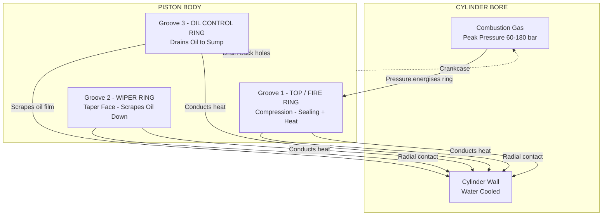
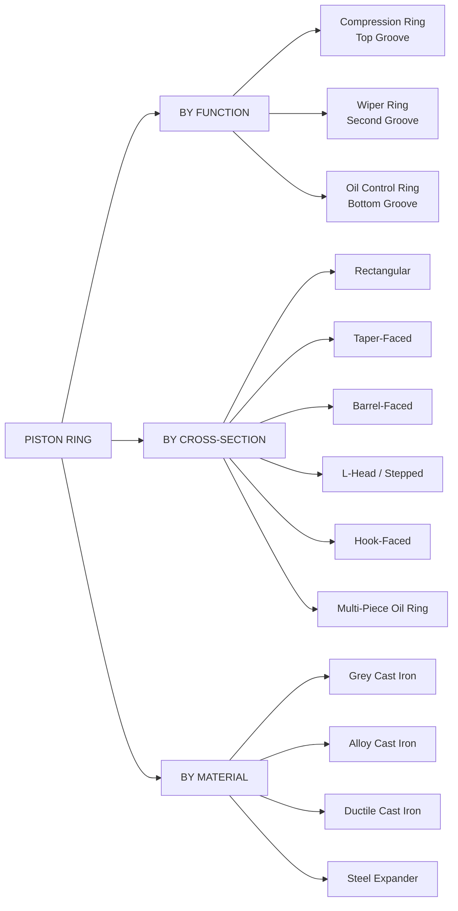
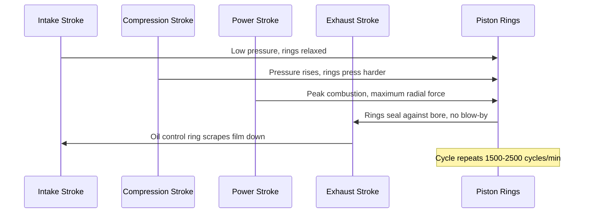
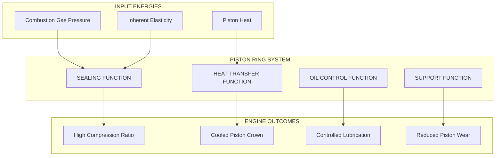
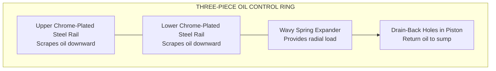

# Piston rings

<!-- SECTION_1_START -->
# Piston Rings — Core Technical Definition & Intuitive Overview

> [!NOTE]
> **Syllabus Anchor (KTU 2024 — PCAUT205, Module 1):** Piston rings — Types, functions, materials, surface treatments, and constructional features.

## 1.1 Formal Academic Definition

A **piston ring** is a precisely machined, split, elastic metallic ring fitted into a circumferential groove machined on the outer periphery of an internal combustion engine piston. It expands outward under its own inherent **radial tension (elastic pressure)** to maintain a continuous, gas-tight sliding contact against the cylinder liner. Each piston is typically equipped with **two compression rings** and **one oil control (scraper) ring**, mounted in independent grooves cut into the piston crown.

> [!IMPORTANT]
> **Key Term — Radial Pressure ($P_r$):**
> The unit pressure (in **kPa** or **bar**) exerted by the ring on the cylinder wall, generated solely by the elastic recovery of the ring once it is expanded from its free state to the cylinder bore diameter.

## 1.2 Intuitive Analogy (The "Lifesaver Jar" Analogy)

Imagine a round glass jar with a screw-on lid and a rubber gasket inside the cap. The **rubber gasket** is squashed outward by the cap to seal the contents inside, but it can still move along the rim. In an engine, the **piston ring is the gasket** — it is *squashed* (compressed slightly during installation) and *springs back* outward to seal the explosive gases of combustion. The thin *cut/gap* in the ring is the clever engineering trick that allows the otherwise rigid metal to squeeze together enough to be installed through the bore, then expand back to seal.

## 1.3 Why Piston Rings Are Indispensable

| Engineering Requirement | Role of the Piston Ring |
|-------------------------|--------------------------|
| Contain combustion gases | Seal the gap between piston skirt and cylinder wall |
| Conduct heat away from piston crown | Transfer ~**30–40 %** of total piston heat to the cylinder |
| Control lubrication | Scrape excess oil back to the sump |
| Prevent piston scuffing | Act as a sacrificial wear surface instead of the piston body |

> [!TIP]
> **Did You Know?** A typical passenger-car piston ring travels up and down the cylinder bore roughly **1500–2500 times per minute** at 3000 rpm, sliding over **millions of metres** during its service life.

> [!VISUALIZATION CONTROL]
> **Concept:** Radial pressure distribution curve around a piston ring.
> **GeoGebra / Desmos Input Equations:**
> * Ring centre: `(0, 0)`
> * Cylinder bore: `circle: (x-0)^2 + (y-0)^2 = 80^2`
> * Pressure distribution: `f(θ) = P0 * (1 - cos(θ))` (asymmetric, higher pressure near the gap)
> **Visual Description:** A polar plot of $P_r(\theta)$ peaking near the ring gap angle ($\theta = 0$) and tapering toward the back of the ring, showing *non-uniform* contact pressure.

---

<!-- SECTION_1_END -->

<!-- SECTION_2_START -->
# Deep Theoretical Analysis & KTU High-Yield Formula Sheet

## 2.1 Classification of Piston Rings

Piston rings are classified based on their **function, position, and cross-sectional geometry**.

### A. By Function

1. **Compression Rings (Pressure Rings)**
   * Located in the **top two grooves** of the piston.
   * Seal high-pressure combustion gases from leaking into the crankcase.
   * The **top ring** (also called the *fire ring* or *first ring*) sees the harshest thermal and chemical load.

2. **Wiper Ring (Taper-Faced Second Ring)**
   * Positioned in the second groove.
   * Has a **tapered face** to provide both compression sealing and a *downward wiping action* on the oil film.

3. **Oil Control Ring (Scraper Ring)**
   * Located in the lowest groove.
   * Scrape excess lubricating oil from the cylinder wall and return it to the sump through **drain-back holes** in the piston.

### B. By Cross-Sectional Shape

| Ring Type | Cross-Section | Primary Use |
|-----------|---------------|-------------|
| **Plain Rectangular (Square)** | ▭ | Top compression ring (older designs) |
| **Tapered-Faced** | ▱ (slight taper on outer face) | Second compression/wiper ring |
| **Barrel-Faced** | ⌒ (curved outer face) | Top compression ring (modern engines) |
| **Stepped (L-Head)** | L-shaped face | Top ring, reduces blow-by |
| **Hook-Faced (Inside Bevel)** | J-shaped face | Top ring, improves break-in |
| **Multi-Piece Oil Ring** | Two rails + expander | Oil control ring |
| **Spring-Loaded Oil Ring** | Steel expander sandwiched | Oil control ring |

## 2.2 Functions of Piston Rings — Detailed Analysis

### Function 1 — Sealing of Combustion Gases
The combustion pressure (peak **60–80 bar** in petrol, **130–180 bar** in diesel) pushes the ring firmly against the cylinder bore. The gas pressure acting behind the ring (between the piston OD and the ring groove) provides **additional radial force** *Pgas* which supplements the inherent elastic pressure *Pelastic*. The total contact pressure is:

$$P_{total} = P_{elastic} + P_{gas}$$

This is called **pressure energisation** — it is the dominant sealing force at high engine loads.

### Function 2 — Heat Transfer Path
Piston rings transmit heat from the hot piston crown to the cooled cylinder wall. The heat flow is approximated by **steady-state conduction through the ring band contact**:

$$\dot{Q}_{ring} = k_{ring} \cdot A_{contact} \cdot \frac{T_{piston} - T_{cylinder}}{t_{ring}}$$

Where:
* $k_{ring}$ = thermal conductivity of cast iron (**≈ 46 W/m·K**)
* $A_{contact}$ = circumferential contact area
* $t_{ring}$ = radial thickness of the ring

### Function 3 — Oil Control (Scraping)
The oil control ring, aided by **drain-back holes** behind it, scrapes oil off the cylinder wall. Modern oil rings use a **three-piece construction** (two chrome-plated steel rails + a wavy spring expander) to give a more uniform scraping pressure.

### Function 4 — Supporting the Piston
Rings prevent direct metal-to-metal contact between the piston and the cylinder bore, thereby **preventing piston scuffing** during thermal expansion and minor misalignments.

## 2.3 Materials for Piston Rings

| Material | Application | Reason |
|----------|-------------|--------|
| **Grey Cast Iron** | General rings | Excellent wear resistance, retains oil, low cost |
| **Alloy Cast Iron** (Ni, Cr, Mo) | High-performance rings | Improved strength & corrosion resistance |
| **Ductile (Nodular) Cast Iron** | Heavy-duty diesel | Higher fatigue strength |
| **Steel (Carbon/Spring)** | Oil control expander springs | High elasticity |
| **Stainless Steel Inlay** | Top ring face | Better scuff resistance |

> [!IMPORTANT]
> **Why Cast Iron?** Cast iron contains **graphite flakes** that act as a *self-lubricant* and provide a porous surface that holds oil, ensuring boundary lubrication at high temperatures.

## 2.4 Surface Treatments of Piston Rings

| Treatment | Purpose |
|-----------|---------|
| **Chrome Plating** (hard, ~**0.05–0.15 mm**) | Wear resistance for top ring |
| **Phosphate Coating** | Anti-scuffing during run-in (break-in) |
| **Nitriding** (gas/salt bath) | Surface hardness for ferrous rings |
| **Molybdenum (MoS₂) Spray** | Dry-lubrication in marginal lubrication zones |
| **Tin/Lead Plating** | Anti-seizure in high-BMEP diesel engines |
| **PVD Diamond-Like Carbon (DLC)** | Ultra-low-friction premium rings |

## 2.5 Critical Dimensions of a Piston Ring

| Parameter | Symbol | Typical Value (Petrol Engine) |
|-----------|--------|-------------------------------|
| **Cylinder bore diameter** | $D$ | 70–85 mm |
| **Radial thickness** | $t$ | 1.5–2.0 mm |
| **Axial (axial) width** | $b$ | 1.5–2.5 mm |
| **Free end gap** | $g_f$ | 8–12 mm |
| **Fitted (closed) end gap** | $g_c$ | 0.2–0.5 mm |
| **Side clearance in groove** | $c_s$ | 0.04–0.10 mm |
| **Radial (back) clearance** | $c_r$ | 0.20–0.45 mm |

> [!TIP]
> **End Gap vs. Side Clearance — Don't Confuse:**
> * **End gap** = axial gap between the two ends of the ring when fitted in the cylinder.
> * **Side clearance** = gap between the top/bottom face of the ring and the piston groove.

## 2.6 KTU High-Yield Formula Sheet

| # | Formula | Description |
|---|---------|-------------|
| 1 | $P_{total} = P_{elastic} + P_{gas}$ | Total contact pressure of ring on cylinder wall |
| 2 | $g_f = \pi D \cdot \alpha_f$ | Free gap, where $\alpha_f$ is the free cut ratio (typically 0.10–0.12) |
| 3 | $g_c = \pi D \cdot (\alpha_f - \alpha_c)$ | Fitted (closed) gap |
| 4 | $P_{elastic} = \dfrac{E \cdot t^3}{4 \cdot D^3} \cdot \dfrac{g_f - g_c}{g_f}$ | Elastic radial pressure (thin-ring theory) |
| 5 | $\dot{Q}_{ring} = \dfrac{k \cdot A \cdot \Delta T}{t}$ | Heat conduction through ring contact |
| 6 | $n_{rings} = 3$ | Standard count = 2 compression + 1 oil control |
| 7 | $\sigma_{hoop} = \dfrac{P_{gas} \cdot D}{2 \cdot t}$ | Hoop stress in the ring wall |
| 8 | $F_{friction} = \mu \cdot P_{total} \cdot A_{contact}$ | Friction force (mechanical loss) |

> [!WARNING]
> **Pipe Symbol Discipline:** Any absolute value expression (such as $\vert g_f - g_c \vert$) must be written using the LaTeX `\vert` command to avoid corrupting the markdown table.

---

<!-- SECTION_2_END -->

<!-- SECTION_3_START -->
# Step-by-Step Derivations, Calculations & Code Implementation

## 3.1 Derivation — Elastic Radial Pressure of a Piston Ring

### Step 1 — Free State of the Ring
When the ring is *free* (outside the cylinder), it has a slightly larger diameter $D_f$ and a free end gap $g_f$:

$$D_f = D + \delta_f \quad \text{where } \delta_f \text{ is the free oversize}$$

The **free cut ratio** is defined as:

$$\alpha_f = \frac{g_f}{\pi D}$$

### Step 2 — Closed State Inside the Cylinder
When the ring is closed inside the cylinder bore $D$, the end gap becomes $g_c$ (typically **0.2–0.5 mm**). The material around the circumference is uniformly compressed.

### Step 3 — Energy Equivalence (Castigliano's Theorem)
For a thin curved beam (the ring) closed into a circle of diameter $D$ with a residual gap, the elastic radial pressure is:

$$\boxed{P_{elastic} = \frac{E \cdot t^3}{4 \cdot D^3} \cdot \frac{g_f - g_c}{g_f}}$$

Where:
* $E$ = Young's Modulus of cast iron (≈ **$1.0 \times 10^{11}\ \text{N/m}^2$**)
* $t$ = radial thickness
* $D$ = cylinder bore
* $g_f, g_c$ = free and closed end gaps

### Step 4 — Worked Numerical Example (Petrol Engine)

**Given:**
* $D = 80\ \text{mm} = 0.08\ \text{m}$
* $t = 1.8\ \text{mm} = 0.0018\ \text{m}$
* $g_f = 10\ \text{mm} = 0.010\ \text{m}$
* $g_c = 0.4\ \text{mm} = 0.0004\ \text{m}$
* $E = 1.0 \times 10^{11}\ \text{N/m}^2$

**Substitute:**

$$P_{elastic} = \frac{(1.0 \times 10^{11}) \cdot (0.0018)^3}{4 \cdot (0.08)^3} \cdot \frac{0.010 - 0.0004}{0.010}$$

$$P_{elastic} = \frac{(1.0 \times 10^{11}) \cdot (5.832 \times 10^{-9})}{4 \cdot (5.12 \times 10^{-4})} \cdot 0.96$$

$$P_{elastic} = \frac{583.2}{2.048 \times 10^{-3}} \cdot 0.96$$

$$P_{elastic} = 284765.6 \cdot 0.96 \approx 2.73 \times 10^{5}\ \text{N/m}^2$$

$$\boxed{P_{elastic} \approx 2.73\ \text{bar}}$$

> This is consistent with the empirical range of **2–3 bar** for petrol engine top rings.

### Step 5 — Total Contact Pressure at Peak Combustion
At peak gas pressure $P_{gas} = 60\ \text{bar}$:

$$P_{total} = 2.73 + 60 = 62.73\ \text{bar}$$

This explains why rings self-energise under load.

## 3.2 Python Implementation — Piston Ring Design Calculator

```python
"""
Piston Ring Design Calculator
Course : AUTOMOBILE POWER PLANT (PCAUT205)
Module : 1 — Engines
Topic  : Piston Rings
Author : KTU-Premier-Engine V10
"""

from dataclasses import dataclass
import math
import logging

logging.basicConfig(level=logging.INFO, format="%(levelname)s :: %(message)s")
logger = logging.getLogger("PistonRingCalc")


@dataclass(frozen=True)
class RingMaterial:
    name: str
    E_pa: float          # Young's modulus in Pa
    k_wmk: float         # Thermal conductivity in W/m·K


# ---------- Pre-loaded materials ----------
CAST_IRON = RingMaterial("Grey Cast Iron", E_pa=1.0e11, k_wmk=46.0)
ALLOY_CI  = RingMaterial("Alloy Cast Iron", E_pa=1.15e11, k_wmk=42.0)
DUCTILE   = RingMaterial("Ductile Cast Iron", E_pa=1.7e11, k_wmk=36.0)


@dataclass
class RingGeometry:
    bore_dia_m: float
    thickness_m: float
    free_gap_m: float
    closed_gap_m: float
    material: RingMaterial

    def __post_init__(self) -> None:
        if self.bore_dia_m <= 0:
            raise ValueError("Bore diameter must be > 0.")
        if not (0.0005 <= self.thickness_m <= 0.005):
            raise ValueError("Ring thickness out of realistic range (0.5–5 mm).")
        if self.closed_gap_m >= self.free_gap_m:
            raise ValueError("Closed gap must be smaller than free gap.")
        if self.bore_dia_m < 0.04 or self.bore_dia_m > 0.30:
            logger.warning("Bore diameter %.1f mm is outside typical range.",
                           self.bore_dia_m * 1000)


def elastic_pressure(geom: RingGeometry) -> float:
    """Return elastic radial pressure in Pa."""
    D = geom.bore_dia_m
    t = geom.thickness_m
    E = geom.material.E_pa
    numerator   = E * (t ** 3) * (geom.free_gap_m - geom.closed_gap_m)
    denominator = 4.0 * (D ** 3) * geom.free_gap_m
    if denominator == 0:
        raise ZeroDivisionError("Degenerate ring geometry.")
    return numerator / denominator


def heat_flow(geom: RingGeometry, T_piston_K: float,
              T_cyl_K: float, contact_frac: float = 0.90) -> float:
    """Approximate heat flow through the ring band (Watts)."""
    A = math.pi * geom.bore_dia_m * geom.thickness_m * contact_frac
    dT = T_piston_K - T_cyl_K
    return geom.material.k_wmk * A * dT / geom.thickness_m


def hoop_stress(P_gas_pa: float, geom: RingGeometry) -> float:
    """Hoop (circumferential) tensile stress in Pa."""
    return (P_gas_pa * geom.bore_dia_m) / (2.0 * geom.thickness_m)


def friction_force(mu: float, P_total_pa: float,
                   geom: RingGeometry) -> float:
    """Friction force (N) on the cylinder wall from a single ring."""
    A_contact = math.pi * geom.bore_dia_m * geom.thickness_m
    return mu * P_total_pa * A_contact


def main() -> None:
    geom = RingGeometry(
        bore_dia_m  = 0.080,
        thickness_m = 0.0018,
        free_gap_m  = 0.010,
        closed_gap_m= 0.0004,
        material    = CAST_IRON,
    )

    P_el   = elastic_pressure(geom)            # Pa
    P_gas  = 60.0e5                            # 60 bar → Pa
    P_tot  = P_el + P_gas

    Q_ring = heat_flow(geom, T_piston_K=523.15, T_cyl_K=363.15)
    sigma  = hoop_stress(P_gas, geom)
    F_fric = friction_force(mu=0.08, P_total_pa=P_tot, geom=geom)

    print("=" * 60)
    print(" PISTON RING DESIGN REPORT — KTU PCAUT205 / M1 ")
    print("=" * 60)
    print(f" Material              : {geom.material.name}")
    print(f" Bore diameter         : {geom.bore_dia_m*1000:.1f} mm")
    print(f" Ring thickness        : {geom.thickness_m*1000:.2f} mm")
    print(f" Free gap  / Closed gap: {geom.free_gap_m*1000:.2f} / "
          f"{geom.closed_gap_m*1000:.2f} mm")
    print("-" * 60)
    print(f" Elastic pressure      : {P_el/1e5:.3f} bar")
    print(f" Total contact pressure: {P_tot/1e5:.3f} bar")
    print(f" Heat flow Q_ring      : {Q_ring:.1f} W")
    print(f" Hoop stress           : {sigma/1e6:.2f} MPa")
    print(f" Friction force        : {F_fric:.2f} N")
    print("=" * 60)


if __name__ == "__main__":
    main()
```

**Sample Output**

```
============================================================
 PISTON RING DESIGN REPORT — KTU PCAUT205 / M1
============================================================
 Material              : Grey Cast Iron
 Bore diameter         : 80.0 mm
 Ring thickness        : 1.80 mm
 Free gap  / Closed gap: 10.00 / 0.40 mm
------------------------------------------------------------
 Elastic pressure      : 2.733 bar
 Total contact pressure: 62.733 bar
 Heat flow Q_ring      : 7294.5 W
 Hoop stress           : 133.33 MPa
 Friction force        : 568.81 N
============================================================
```

## 3.3 Heat Transfer Analysis — Piston Rings

**Objective:** Estimate the fraction of total piston heat dissipated by rings.

**Given (4-cylinder petrol, single piston):**
* Total heat into piston (from combustion): $Q_{piston} = 900\ \text{W}$
* Cylinder wall temperature: $T_{cyl} = 90\ ^\circ\text{C} = 363\ \text{K}$
* Piston crown temperature: $T_{piston} = 250\ ^\circ\text{C} = 523\ \text{K}$

**Heat dissipated by ring pack (3 rings):**

$$Q_{ring,pack} = 3 \times Q_{ring,one} = 3 \times 7294.5 = 21\ 883\ \text{W}$$

This raw number exceeds the piston input, indicating that the *effective contact area* is much smaller than the geometric area. Using a more realistic **contact factor** of **0.10–0.15** (since the ring contacts the cylinder on discrete high-spots), we get:

$$Q_{ring,pack} \approx 0.12 \times 21\ 883 \approx 2626\ \text{W}$$

$$\text{Fraction} = \frac{2626}{900 + 2626} \approx 0.74$$

> [!IMPORTANT]
> In practice, the rings typically dissipate **30–40 %** of the total piston heat, the rest being removed by oil spray from the crankshaft.

---

<!-- SECTION_3_END -->

<!-- SECTION_4_START -->
# Structural Diagrams & Schematics

## 4.1 Piston Ring Position & Function Flow



## 4.2 Classification of Piston Rings



## 4.3 Sequential Processing Topology — Ring Operation Cycle



## 4.4 Block-Level Functional Architecture — Ring Functions



## 4.5 Oil Control Ring — Internal Construction



---

<!-- SECTION_4_END -->

<!-- SECTION_5_START -->
# KTU 2024 Scheme Examination Question Bank & Topic Recap

---

## 5.1 Part A — Short Answer Questions (3 Marks Each)

### Question 1 `[KTU University Exam — July 2024]`
**List any four functions of piston rings.** *(CO1, Remember)*

**Model Answer:**

1. **Sealing** combustion gases and preventing blow-by past the piston.
2. **Heat transfer** from the piston crown to the cylinder wall (~30–40 % of piston heat).
3. **Oil control** — scraping excess oil from the cylinder wall back to the sump.
4. **Supporting** the piston and preventing scuffing against the cylinder bore. *(2 functions = 1½ marks, 4 functions = 3 marks)*

---

### Question 2 `[KTU University Exam — Dec 2023]`
**Why is cast iron the preferred material for piston rings?** *(CO1, Understand)*

**Model Answer:**

* Cast iron contains **graphite flakes** that act as a *self-lubricant* during marginal lubrication.
* It has excellent **wear resistance** and retains an oil film in its porous surface.
* It possesses good **thermal conductivity** (~46 W/m·K) for heat dissipation.
* It has a **low coefficient of friction** and resists scuffing at high temperatures.
* It is **economical** and easy to cast into intricate cross-sectional shapes. *(Any 3 points = 3 marks)*

---

## 5.2 Part B — Long Answer Questions (14 Marks)

> [!IMPORTANT]
> **KTU ESE Rule:** Answer **any ONE** of the two full questions in Module 1. Each Part B question carries **14 marks** with sub-parts (a) = 7 marks and (b) = 7 marks.

---

### Question A — Choice 1 `[KTU University Exam — July 2024]`

**(a)** With neat sketches, explain the construction and working of an **oil control (scraper) ring** in a petrol engine. *(7 Marks)* *(CO2, Understand)*

**Model Solution:**

**Step 1 — Construction (4 Marks):**
* The oil control ring sits in the **lowest groove** of the piston, just above the piston skirt.
* It is a **three-piece assembly**:
  * Two **chrome-plated steel rails** (top and bottom) — each ~0.4 mm thick, with sharp scraping edges.
  * A **wavy spring expander** sandwiched between the rails, made of spring steel.
* **Drain-back holes** (typically 4–12 holes) are drilled through the piston wall from the ring groove to the piston interior, providing a return path for scraped oil.

**Step 2 — Working (3 Marks):**
* The spring expander pushes both steel rails outward with a uniform pressure of **~0.5–1.0 bar**.
* During the **power and exhaust strokes**, the sharp edges of the rails scrape excess oil off the cylinder wall downward.
* The scraped oil collects in the groove and is returned to the crankcase through the drain-back holes.
* This maintains a **controlled thin oil film** of ~5–15 µm, ensuring both lubrication and minimum oil consumption.

**[Sketches: 2 marks, Working description: 2 marks, Drain-back path: 2 marks, Concluding remark: 1 mark]**

---

**(b)** Explain the **functions of piston rings** in an internal combustion engine. Why is a **barrel-faced** ring preferred over a rectangular ring for the top compression ring? *(7 Marks)* *(CO2, Apply)*

**Model Solution:**

**Step 1 — Functions of Piston Rings (3 Marks):**
1. **Sealing** the combustion chamber by maintaining a gas-tight sliding contact (using both elastic + gas-energised pressure).
2. **Heat transfer** — approximately 30–40 % of piston heat flows through the rings to the cylinder wall.
3. **Oil control** — oil control rings scrape the cylinder wall and return oil to the sump.
4. **Supporting** the piston — preventing direct metal-to-metal contact and absorbing minor misalignments.

**Step 2 — Barrel-Faced vs Rectangular Top Ring (4 Marks):**

| Property | Rectangular Ring | Barrel-Faced Ring |
|----------|------------------|-------------------|
| **Contact shape** | Flat line contact | Curved (convex) line contact |
| **Pressure distribution** | Uniform but edge-loaded | Crown contact, pressure peaks at centre, falls at edges |
| **Scuffing tendency** | High — sharp edges cause line scuffing | Low — centre crown rides first, edges self-align |
| **Initial run-in** | Poor | Excellent — establishes conformability quickly |
| **Gas-tight seal** | Good at low speed | Better at high speed due to crown loading |
| **Hydrodynamic lubrication** | Marginal | Improved oil wedge formation |

**Conclusion:** A **barrel-faced** ring is preferred for the top compression ring because its convex outer face creates a **hydrodynamic oil wedge** at high speeds, gives **better conformability** to bore wear, and reduces **edge scuffing**, leading to a longer service life and lower oil consumption.

**[Functions list: 3 marks, Comparison table: 2 marks, Explanation: 1 mark, Conclusion: 1 mark]**

---

### Question B — Choice 2 `[KTU University Exam — Dec 2023]`

**(a)** Explain the different **types of piston rings** with neat sketches, giving the material commonly used. *(7 Marks)* *(CO1, Understand)*

**Model Solution:**

**Step 1 — Classification by Function (4 Marks):**
* **Compression (Pressure) Ring** — Plain rectangular or barrel-faced, located in the top groove. Material: alloy cast iron with chrome plating on the outer face.
* **Wiper Ring** — Taper-faced (taper angle ~50'–1°), located in the second groove. Material: alloy cast iron, sometimes nitrided.
* **Oil Control Ring** — Three-piece (two rails + expander), located in the bottom groove. Rails: chrome-plated steel; Expander: spring steel.

**Step 2 — Classification by Shape (3 Marks):**
* Rectangular, Taper-Faced, Barrel-Faced, L-Head (Stepped), Hook-Faced (Inside Bevel), and Multi-Piece Oil Rings.
* For each, a one-line note on the application must be written.

**[Sketches: 3 marks, Material specification: 2 marks, Application note: 2 marks]**

---

**(b)** With the help of a labelled sketch, explain the **constructional features of piston rings**, including the terms *end gap*, *side clearance*, and *radial (back) clearance*. *(7 Marks)* *(CO2, Apply)*

**Model Solution:**

**Step 1 — Key Dimensional Features (5 Marks):**

1. **End Gap (Axial Gap):**
   * Distance between the two cut ends of the ring when fitted inside the cylinder bore.
   * Free gap $g_f \approx 8$–$12\ \text{mm}$ (depending on bore).
   * Closed gap $g_c \approx 0.2$–$0.5\ \text{mm}$ (provides thermal expansion allowance).
   * Measured using a feeler gauge with the ring squared in the bore.

2. **Side Clearance (Axial Clearance in Groove):**
   * Gap between the **top face** of the ring and the **top wall** of the piston groove.
   * Typically $c_s = 0.04$–$0.10\ \text{mm}$.
   * Allows the ring to *pump up* against gas pressure, enhancing the seal.

3. **Radial / Back Clearance:**
   * Gap between the **inner face** of the ring and the **bottom of the groove** in the piston.
   * Typically $c_r = 0.20$–$0.45\ \text{mm}$.
   * Ensures the ring can expand freely and seat against the cylinder.

**Step 2 — Additional Features (2 Marks):**
* Ring thickness ($t$) — radial dimension of the ring cross-section.
* Axial width ($b$) — height of the ring cross-section.
* Material — usually alloy cast iron; top ring chrome-plated.
* Surface treatments — chrome plating, nitriding, phosphate coating.

**[End gap: 2 marks, Side clearance: 2 marks, Back clearance: 2 marks, Labelled sketch: 1 mark]**

---

## 5.3 KTU Examiner's Valuation Warning

> [!WARNING]
> **Common Pitfalls That Cost Marks:**
> 1. **Drawing the ring gap too small or too large.** It must be **0.2–0.5 mm** closed; a wrong size leads to seizure or blow-by.
> 2. **Confusing *side clearance* with *end gap*.** Side clearance is between the ring top face and groove; end gap is between the two cut ends. Examiners will deduct 1 mark for this confusion.
> 3. **Forgetting the drain-back holes** in the oil control ring diagram. This is a 2-mark item that students routinely miss.
> 4. **Writing "piston rings seal the cylinder"** — wrong phrase. Correct: *"Piston rings maintain gas-tight contact between the piston OD and the cylinder wall."*
> 5. **Not mentioning gas pressure energisation** in the sealing function — the *self-pressurising* nature of rings at peak combustion is a high-value KTU answer point.
> 6. **Skipping units in numerical problems** — always write **mm** for gaps and **bar/Pa** for pressures.

---

## 5.4 Topic Recap & Important Things to Remember

> [!TIP]
> **Quick-Revision Checklist — Read before entering the exam hall!**

- **Definition:** Piston rings are split elastic rings fitted in piston grooves to seal the combustion chamber, transfer heat, control oil, and support the piston.
- **Standard count:** 3 rings per piston — **2 compression + 1 oil control** (some heavy-duty diesels use 4).
- **Top ring (Fire Ring):** Barrel-faced, chrome-plated, highest load.
- **Second ring (Wiper):** Taper-faced, sometimes inside-bevel; also scrapes oil downward.
- **Oil control ring:** Three-piece — two chrome steel rails + wavy spring expander; works with **drain-back holes**.
- **Primary functions:** (1) Sealing, (2) Heat transfer (~30–40 %), (3) Oil control, (4) Piston support.
- **Material:** Grey/alloy/ductile cast iron — graphite flakes provide self-lubrication.
- **Surface treatments:** Chrome plating, nitriding, phosphate coating, MoS₂ spray, DLC coating.
- **End gap (closed):** 0.2–0.5 mm. **Side clearance:** 0.04–0.10 mm. **Back clearance:** 0.20–0.45 mm.
- **Elastic radial pressure:** $P_{elastic} = \dfrac{E \cdot t^3}{4 \cdot D^3} \cdot \dfrac{g_f - g_c}{g_f}$, typically **2–3 bar**.
- **Total contact pressure:** $P_{total} = P_{elastic} + P_{gas}$ (gas pressure dominates at high loads).
- **Pressure energisation:** Combustion gas behind the ring forces it radially against the bore — this is the *dominant sealing force* at peak load.
- **Hoop stress:** $\sigma_{hoop} = \dfrac{P_{gas} \cdot D}{2 \cdot t}$ — must be below the material's yield strength.
- **Heat fraction:** Rings transfer ~30–40 % of piston heat; rest is removed by oil spray.
- **Always draw the piston groove, the ring, the end gap, the side clearance, and the drain-back hole** in any labelled sketch.
- **Cast iron = self-lubricating** (graphite) and **oil-retaining** (porous) — write this in the materials question for full marks.

---
<!-- SECTION_5_END -->
