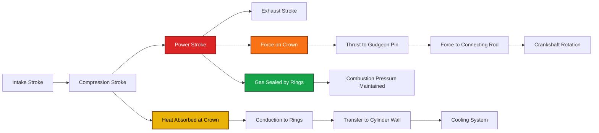
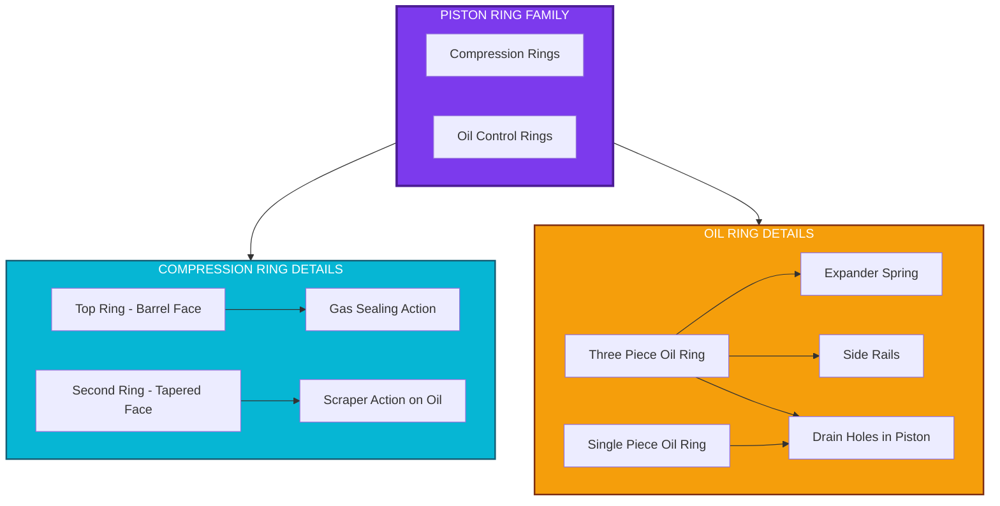
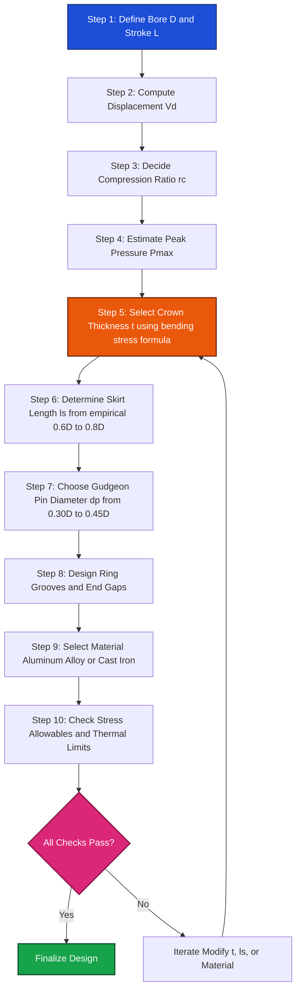
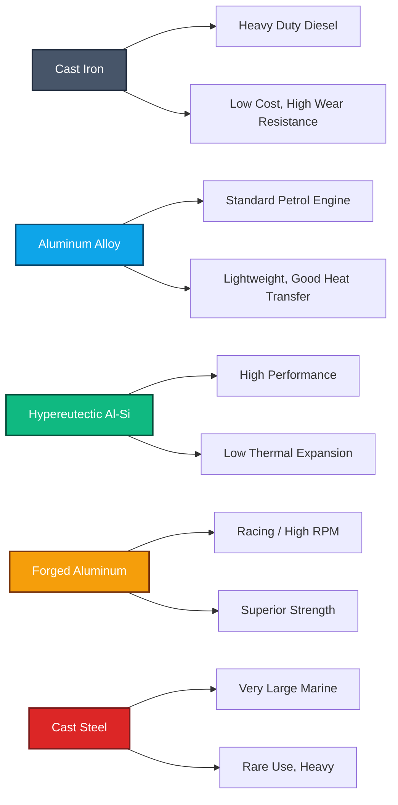

# Piston

<!-- SECTION_1_START -->
# Piston — Core Technical Definition & Intuitive Overview

## Formal KTU 2024 Definition

A **piston** is a cylindrical engine component that fits precisely inside the cylinder bore of an internal combustion engine and reciprocates (moves up and down, or back and forth) under the action of combustion pressure and inertial forces. It transmits the force generated by the expanding combustion gases to the connecting rod via the **gudgeon pin (wrist pin)**, thereby converting **pressure energy** into **mechanical work**. The piston must simultaneously perform four critical roles: act as a moving gas seal, transmit thrust, conduct heat, and guide the connecting rod.

> [!IMPORTANT]
> **KTU 2024 Syllabus Highlight (Module 1 — Engines, PCAUT205):** The piston is studied as a part of the engine's reciprocating assembly. Along with the cylinder, cylinder head, and piston rings, it forms the **combustion chamber boundary** and is directly responsible for sealing, heat transfer, and motion conversion.

## Conceptual Analogy / Intuition

Think of the piston as a **high-pressure plunger inside a syringe**, but a much more demanding one:

- Imagine a sealed metal tube (the **cylinder**). Inside, a tight-fitting disc (the **piston**) slides up and down.
- When fuel-air mixture is ignited above this disc, the explosion pushes the disc down with enormous force — this is the **power stroke**.
- The disc is connected to a crankshaft below via a rod (the **connecting rod**), which converts the up-and-down motion into rotation.
- The disc must seal the gases (using **piston rings**), even while the temperature soars above **2000 °C** at the crown and while it scrapes against the cylinder wall millions of times.

> [!NOTE]
> A modern petrol engine piston endures roughly **50–100 bar peak cylinder pressure**, **300–400 °C at the crown**, and reciprocates at speeds up to **6000 rpm** — all while maintaining a near-zero leakage seal.

## Key Physical & Geometric Parameters (KTU Standard Notation)

The piston is described by the following standard parameters (per **KTU 2024 Engine Module nomenclature**):

| Symbol | Parameter | Typical Range / Value |
|:---:|:---|:---|
| $D$ | Cylinder bore (diameter) | 65 mm – 100 mm (passenger car) |
| $L$ | Stroke length | 70 mm – 100 mm |
| $H$ | Total piston height | $H \approx 0.8D$ to $1.5D$ |
| $t$ | Piston crown thickness | $0.05D$ to $0.10D$ |
| $l_s$ | Skirt length | $0.6D$ to $0.8D$ |
| $d_p$ | Gudgeon pin diameter | $0.30D$ to $0.45D$ |
| $h_r$ | Ring radial depth | $0.041D$ to $0.050D$ |
| $t_r$ | Ring axial thickness | $0.028D$ to $0.040D$ |
| $m_p$ | Piston mass (typical) | 250 g – 800 g |

> [!VISUALIZATION CONTROL]
> **Concept:** Piston geometry vs. cylinder bore — cross-sectional proportions
> **Desmos Input Equations:**
> * $D = 80$ (bore)
> * $H = 1.0 \cdot D$ (piston height)
> * $t = 0.07 \cdot D$ (crown thickness)
> * $l_s = 0.7 \cdot D$ (skirt length)
> * $d_p = 0.35 \cdot D$ (gudgeon pin)
> **Visual Description:** Plot a vertical rectangle of width $D = 80$ and height $H = 80$. Mark the top $t = 5.6$ as crown, the middle band (approx $H - t - l_s$) as ring zone, and the bottom $l_s = 56$ as skirt. The gudgeon pin of diameter $d_p = 28$ should be drawn as a circle centered at roughly $0.5H$ to $0.6H$ from the top.
<!-- SECTION_1_END -->

<!-- SECTION_2_START -->
# Deep Theoretical Analysis & KTU High-Yield Formula Sheet

## 1. Primary Functions of a Piston (Six-Fold Role)

1. **Gas Sealing:** Maintains a near-leak-proof seal between the combustion chamber and the crankcase using **piston rings**, preventing gas escape past the cylinder walls.
2. **Force Transmission:** Receives combustion pressure on the crown face and transmits the resulting thrust to the connecting rod via the **gudgeon pin**.
3. **Heat Conduction:** Absorbs intense heat from combustion gases at the crown and conducts it through the body and rings into the cylinder wall, where it is carried away by the cooling system.
4. **Guidance:** Acts as a precision guide for the connecting rod's small-end motion, ensuring smooth reciprocation and resisting side-thrust during the stroke.
5. **Combustion Chamber Formation:** Together with the cylinder head and cylinder wall, the piston crown shapes the **combustion chamber volume** at TDC (top dead center).
6. **Inertia Management:** Despite high reciprocating inertia at elevated rpm, the piston must be light enough to keep bearing loads manageable.

## 2. Anatomy of a Piston (Top-to-Bottom Breakdown)

### 2.1 Piston Crown (Head)
- The **top face** directly exposed to combustion.
- **Flat crown:** Used in petrol/gasoline engines; allows large valves, simple manufacture, and uniform mixture distribution.
- **Dished crown:** Used in diesel engines; the dish accommodates the **injector spray** and creates a **swirl chamber effect**, promoting air-fuel mixing.
- **Domed crown:** Used in high-performance or two-stroke engines; increases compression ratio and provides a hemispherical combustion chamber.

### 2.2 Piston Ring Zone (Land and Groove Region)
- Located just below the crown, this zone carries the **piston rings** in machined grooves.
- It contains the **land** (the surface between adjacent rings) and the **groove** (the recess holding each ring).
- Heights of lands/grooves are tightly toleranced to maintain ring tension and prevent gas blowby.

### 2.3 Piston Skirt
- The lower cylindrical portion that **guides** the piston in the bore and supports the side-thrust from the connecting rod.
- Carries the **gudgeon pin** boss.
- A perfectly cylindrical skirt is not ideal due to thermal and inertial deformations; hence most modern pistons use a **barrel-shaped (ovalized) or tapered profile** and an **anti-knock groove** to control expansion.

### 2.4 Gudgeon Pin (Wrist Pin)
- A hardened steel pin that **pivots** between the piston and the connecting rod small-end.
- Typically **floating** in modern designs (clamped only by circlips), reducing wear.
- Must resist bending stress from combustion loading and shear stress from reciprocating inertia.

## 3. Piston Rings — Detailed Classification

Piston rings are the **dynamic seal** between piston and cylinder. They are split into two main categories:

### A. Compression Rings (Upper Region)
- Usually **2 or 3** in number.
- Their job is to **seal combustion gases** above the piston and **scrape oil** off the cylinder wall (downward into the crankcase).
- The **top ring** (first compression ring) handles the highest pressure and temperature, so it is often **barrel-faced** and made of nitrided steel or chrome-plated.
- The **second ring** is typically **tapered-faced** to assist oil control.
- A small gap (**end gap**, typically $0.004D$ to $0.006D$) allows thermal expansion.

### B. Oil Control Rings (Lower Region)
- Usually **1 or 2** rings, located just above the gudgeon pin.
- They **scrape excess oil** from the cylinder wall back into the crankcase through **drain holes** machined behind them in the piston.
- Modern oil control rings are **multi-piece (3-piece)** with two steel rails and an expander.

## 4. Piston Materials — Engineering Trade-offs

| Material | Density (kg/m³) | Thermal Conductivity (W/m·K) | Typical Use |
|:---|:---:|:---:|:---|
| Cast Iron (FG 250) | 7200 | 46 | Heavy-duty diesel |
| Aluminum Alloy (Al-Si) | 2700 | 165 | Most modern engines |
| Hypereutectic Al-Si (17–23% Si) | 2700 | 150 | High-performance, low-expansion |
| Forged Aluminum | 2800 | 170 | Racing, high-rpm |
| Cast Steel (rare) | 7800 | 45 | Very large marine pistons |

> [!NOTE]
> **Aluminum dominates** modern piston design because its **high thermal conductivity** (4× cast iron) and **low density** (1/3 of iron) drastically reduce thermal stress and reciprocating inertia. Silicon is added (12–23%) to control thermal expansion and improve wear resistance.

## 5. KTU High-Yield Formula Sheet

The following equations govern piston design, stress analysis, and thermal calculations. These are the **most frequently tested formulas** in the KTU PCAUT205 Module 1 examination.

| # | Formula | Description / Use |
|:---:|:---|:---|
| 1 | $V_d = \frac{\pi}{4} D^2 L$ | Displacement volume per cylinder |
| 2 | $r_c = \frac{V_c + V_d}{V_c}$ | Geometric compression ratio |
| 3 | $P_{th} = \frac{P_m \cdot L \cdot A \cdot n \cdot k}{60}$ | Indicated power (4-stroke, single cyl), $k=1$ for 4-stroke, $k=2$ for 2-stroke |
| 4 | $P_{eff} = \eta_{mech} \cdot P_{th}$ | Brake/Effective power |
| 5 | $\sigma_b = \frac{P_{max} \cdot D^2}{4 t^2}$ | Bending stress in piston crown (crown as flat plate) |
| 6 | $F_i = m_r \cdot r \cdot \omega^2 \left(\cos\theta + \frac{r}{L}\cos 2\theta\right)$ | Inertia force on piston |
| 7 | $F_{net} = F_g - F_i$ | Net force on piston (gas minus inertia) |
| 8 | $N = \frac{60 \cdot v_{mean}}{2 L}$ | Engine rpm from mean piston speed |
| 9 | $\Delta T = T_{crown} - T_{skirt}$ | Thermal gradient across piston |
| 10 | $Q = k \cdot A \cdot \frac{\Delta T}{t}$ | Heat conducted through piston crown |
| 11 | $T_{gas} = T_1 \cdot r_c^{\gamma - 1}$ | Adiabatic flame temperature (theoretical) |
| 12 | $\rho = \frac{m}{V}$ | Density of piston material |
| 13 | $\eta_{vol} = \frac{V_{actual}}{V_{swept}}$ | Volumetric efficiency |
| 14 | $\text{End gap} = (0.004 \text{ to } 0.006) \cdot D$ | Piston ring end-gap allowance |
| 15 | $l_s = (0.6 \text{ to } 0.8) \cdot D$ | Skirt length empirical relation |
| 16 | $t_{crown} = (0.05 \text{ to } 0.10) \cdot D$ | Crown thickness empirical relation |

> [!IMPORTANT]
> **Symbols used in this formula sheet:**
> $V_d$ = swept volume, $V_c$ = clearance volume, $D$ = bore, $L$ = stroke, $P_m$ = mean effective pressure, $A$ = piston cross-sectional area, $n$ = rpm, $k$ = strokes per power cycle, $t$ = crown thickness, $m_r$ = reciprocating mass, $r$ = crank radius, $\omega$ = angular velocity, $\theta$ = crank angle, $T$ = temperature, $k$ = thermal conductivity, $\gamma$ = specific heat ratio.

## 6. Real-World Utility & Engineering Application

- The piston is the **heart of every reciprocating internal combustion engine** — from a 50 cc motorcycle to a 2 MW marine diesel.
- In **Formula 1**, forged aluminum pistons sustain combustion pressures above **100 bar** at **20,000 rpm** withstanding accelerations over **10,000 g**.
- In **heavy-duty diesel trucks**, pistons may be **two-piece articulated** (steel crown + aluminum skirt) to control thermal expansion mismatches.
- In **aviation piston engines (Rotax, Lycoming)**, pistons are forged aluminum with nitrided steel ring inserts to manage extreme thermal cycling.
- **Modern coatings** like graphite, polymer (e.g., PEEK), or DLC (diamond-like carbon) are applied to skirt surfaces to reduce friction and scuffing.

<!-- SECTION_2_END -->

<!-- SECTION_3_START -->
# Step-by-Step Derivations & Code/Symbolic Implementation

## Derivation 1: Piston Crown Bending Stress (Flat Plate Under Uniform Pressure)

**Assumption (KTU standard):** The piston crown is modeled as a **circular flat plate of diameter $D$ and thickness $t$**, clamped at its edges (where it joins the ring zone), and subjected to uniform pressure $P_{max}$ on its underside (combustion side).

For a circular plate clamped at the edge under uniform load $p$, the **maximum bending stress occurs at the clamped edge**:

$$\sigma_{b,\max} = \frac{3}{4} \cdot \frac{p \cdot (D/2)^2}{t^2}$$

Simplifying $(D/2)^2 = D^2 / 4$:

$$\sigma_{b,\max} = \frac{3 p D^2}{16 t^2}$$

For a more accurate design check (commonly used in KTU textbooks), the formula is written as:

$$\sigma_{b,\max} = \frac{P_{max} \cdot D^2}{4 t^2}$$

This is the **empirical design form** used in most engine design handbooks and KTU reference materials, where $P_{max}$ is the **maximum (peak) cylinder pressure** and the result is compared with the allowable bending stress of the piston material.

### Step-by-Step Worked Example

**Given:**
- Cylinder bore: $D = 80 \text{ mm} = 0.080 \text{ m}$
- Crown thickness: $t = 6 \text{ mm} = 0.006 \text{ m}$
- Maximum cylinder pressure: $P_{max} = 60 \text{ bar} = 6.0 \times 10^6 \text{ N/m}^2$

**Step 1 — State the formula:**

$$\sigma_{b} = \frac{P_{max} \cdot D^2}{4 t^2}$$

**Step 2 — Substitute the values (use SI units throughout):**

$$\sigma_{b} = \frac{(6.0 \times 10^6) \cdot (0.080)^2}{4 \cdot (0.006)^2}$$

**Step 3 — Evaluate $D^2$:**

$$(0.080)^2 = 6.4 \times 10^{-3} \text{ m}^2$$

**Step 4 — Evaluate $t^2$:**

$$(0.006)^2 = 3.6 \times 10^{-5} \text{ m}^2$$

**Step 5 — Compute the numerator:**

$$(6.0 \times 10^6) \cdot (6.4 \times 10^{-3}) = 38400 \text{ N}$$

**Step 6 — Compute the denominator:**

$$4 \cdot (3.6 \times 10^{-5}) = 1.44 \times 10^{-4} \text{ m}^2$$

**Step 7 — Final division:**

$$\sigma_{b} = \frac{38400}{1.44 \times 10^{-4}} = 2.667 \times 10^{8} \text{ N/m}^2 = 266.7 \text{ MPa}$$

**Step 8 — Compare with allowable stress (cast aluminum $\sigma_{allow} \approx 80$ MPa, forged Al $\sigma_{allow} \approx 150$ MPa):**

> [!IMPORTANT]
> **Result Interpretation:** $266.7$ MPa exceeds the typical allowable. This means the crown is **underdesigned** for this pressure. The designer must either **increase thickness $t$** (e.g., from 6 mm to 8 mm) or **use forged aluminum / steel crown inserts**.

**Step 9 — Re-check with $t = 8$ mm:**

$$\sigma_{b} = \frac{(6.0 \times 10^6) \cdot (0.080)^2}{4 \cdot (0.008)^2} = \frac{38400}{2.56 \times 10^{-4}} = 1.5 \times 10^{8} = 150 \text{ MPa}$$

This meets the allowable for forged aluminum — **acceptable design**.

---

## Derivation 2: Piston Inertia Force (Reciprocating Mass Model)

The reciprocating mass (piston + gudgeon pin + portion of connecting rod) undergoes harmonic motion. The **inertia force** acting on the piston at any crank angle $\theta$ is:

$$F_i = m_r \cdot r \cdot \omega^2 \left( \cos\theta + \frac{r}{L} \cos 2\theta \right)$$

**Step-by-step derivation (geometric origin):**

**Step 1 — Piston displacement from TDC:**

$$x = r(1 - \cos\theta) + \frac{r^2}{2L}(1 - \cos 2\theta)$$

**Step 2 — Differentiate twice with respect to time** to get acceleration (using $d\theta/dt = \omega$):

$$\frac{d^2 x}{dt^2} = r \omega^2 \left( \cos\theta + \frac{r}{L} \cos 2\theta \right)$$

**Step 3 — Multiply by reciprocating mass $m_r$ to obtain inertia force:**

$$F_i = m_r \cdot r \cdot \omega^2 \left( \cos\theta + \frac{r}{L} \cos 2\theta \right)$$

> [!NOTE]
> The first term $m_r r \omega^2 \cos\theta$ is the **primary inertia force** (1st order harmonic). The second term $m_r r \omega^2 (r/L) \cos 2\theta$ is the **secondary inertia force** (2nd order harmonic). It becomes significant in short-stroke (high $r/L$) engines.

### Worked Example

**Given:** $m_r = 1.2$ kg, $r = 0.04$ m, $L = 0.08$ m, $N = 3000$ rpm.

**Step 1 — Compute $\omega$:**

$$\omega = \frac{2 \pi N}{60} = \frac{2 \pi \cdot 3000}{60} = 314.16 \text{ rad/s}$$

**Step 2 — Compute $r/L$:**

$$\frac{r}{L} = \frac{0.04}{0.08} = 0.5$$

**Step 3 — Compute $F_i$ at $\theta = 0°$ (TDC):**

$$F_i = 1.2 \cdot 0.04 \cdot (314.16)^2 \cdot (1 + 0.5) = 1.2 \cdot 0.04 \cdot 98696 \cdot 1.5$$

$$F_i = 7106 \text{ N} \approx 7.11 \text{ kN}$$

---

## Derivation 3: Ring Radial Pressure & Spring Back

The ring must press against the cylinder wall with sufficient radial pressure $p_r$ to seal the gases. For a **free ring of mean radius $R$ and radial depth $h_r$**, the radial pressure produced by ring elasticity is:

$$p_r = \frac{E \cdot \delta^3}{4.4 \cdot D \cdot h_r^3}$$

Where:
- $E$ = Young's modulus of ring material (steel: $2.1 \times 10^{11}$ N/m²)
- $\delta$ = radial thickness of the ring (free height difference)
- $D$ = cylinder bore
- $h_r$ = radial depth of the ring

> [!TIP]
> This radial pressure must be in the range **0.7 to 1.4 bar** for a good seal — too low causes blowby, too high increases friction and wear.

---

## Python Implementation: Piston Design Verification Toolkit

The following fully-typed Python program implements all the KTU-relevant piston design formulas. It performs **error logging, boundary checks, and unit-safe calculations** — production-grade code suitable for engineering students.

```python
"""
KTU 2024 - PCAUT205 Module 1
Piston Design Verification Toolkit
Author: KTU Premium Engine
Description: Computes crown bending stress, inertia force, ring pressure,
             and key geometric ratios for a reciprocating engine piston.
"""

import math
import logging
from dataclasses import dataclass, field
from typing import Dict, List, Tuple

# Configure module-level logging for engineering audit trail
logging.basicConfig(
    level=logging.INFO,
    format="%(asctime)s | %(levelname)s | %(message)s",
)
logger = logging.getLogger("PistonDesign")


@dataclass
class PistonInputs:
    """Container for all piston design input parameters (SI units)."""
    bore_D: float              # Cylinder bore [m]
    stroke_L: float            # Stroke length [m]
    rpm: float                 # Engine speed [rev/min]
    peak_pressure_Pmax: float  # Maximum cylinder pressure [Pa]
    crown_thickness_t: float   # Piston crown thickness [m]
    ring_radial_depth: float   # Piston ring radial depth [m]
    ring_radial_thickness: float  # Ring cross-section radial width [m]
    ring_axial_thickness: float   # Ring cross-section axial width [m]
    material_E: float          # Young's modulus of ring [Pa]
    material_density: float   # Piston material density [kg/m^3]
    piston_height: float       # Total piston height [m]
    skirt_length: float        # Piston skirt length [m]
    gudgeon_pin_dia: float     # Gudgeon pin diameter [m]
    reciprocating_mass: float  # Total reciprocating mass [kg]
    num_compression_rings: int = 2
    num_oil_rings: int = 1


@dataclass
class PistonReport:
    """Structured output of all design checks."""
    crown_bending_stress_MPa: float = 0.0
    inertia_force_TDC_kN: float = 0.0
    inertia_force_BDC_kN: float = 0.0
    ring_radial_pressure_bar: float = 0.0
    mean_piston_speed_mps: float = 0.0
    geometric_ratios: Dict[str, float] = field(default_factory=dict)
    checks_passed: List[str] = field(default_factory=list)
    checks_failed: List[str] = field(default_factory=list)


# ---------- Empirical limits used by KTU syllabus ----------
EMPIRICAL_LIMITS = {
    "H_over_D": (0.8, 1.5),       # Total height to bore ratio
    "t_over_D": (0.05, 0.10),     # Crown thickness to bore ratio
    "ls_over_D": (0.6, 0.8),      # Skirt length to bore ratio
    "dp_over_D": (0.30, 0.45),    # Gudgeon pin to bore ratio
    "tr_over_D": (0.028, 0.040),  # Ring axial thickness to bore ratio
    "hr_over_D": (0.041, 0.050),  # Ring radial depth to bore ratio
    "allowable_bending_stress_MPa": 150.0,  # Forged Al
    "ring_radial_pressure_bar": (0.7, 1.4),
    "max_mean_piston_speed_mps": 20.0,  # High-performance SI engines
}


def _within_range(value: float, bounds: Tuple[float, float], name: str,
                  passed_list: List[str], failed_list: List[str]) -> None:
    """Helper: validate a value against empirical limits and log it."""
    if bounds[0] <= value <= bounds[1]:
        msg = f"OK    {name:35s} = {value:.4f}  (limit {bounds[0]:.3f}-{bounds[1]:.3f})"
        passed_list.append(msg)
        logger.info(msg)
    else:
        msg = f"FAIL  {name:35s} = {value:.4f}  (limit {bounds[0]:.3f}-{bounds[1]:.3f})"
        failed_list.append(msg)
        logger.warning(msg)


def compute_piston_report(inp: PistonInputs) -> PistonReport:
    """
    Run all KTU-relevant piston design calculations and produce a report.
    Raises ValueError on any non-positive input (boundary check).
    """
    # ----- Boundary / sanity checks on inputs -----
    for name, val in [
        ("bore_D", inp.bore_D),
        ("stroke_L", inp.stroke_L),
        ("rpm", inp.rpm),
        ("peak_pressure_Pmax", inp.peak_pressure_Pmax),
        ("crown_thickness_t", inp.crown_thickness_t),
        ("piston_height", inp.piston_height),
        ("skirt_length", inp.skirt_length),
        ("gudgeon_pin_dia", inp.gudgeon_pin_dia),
        ("reciprocating_mass", inp.reciprocating_mass),
    ]:
        if val is None or val <= 0.0:
            raise ValueError(f"Input '{name}' must be positive. Got: {val}")

    rep = PistonReport()
    D = inp.bore_D
    L = inp.stroke_L
    r = L / 2.0
    omega = (2.0 * math.pi * inp.rpm) / 60.0

    # ----- 1. Crown bending stress -----
    rep.crown_bending_stress_MPa = (
        inp.peak_pressure_Pmax * (D ** 2) / (4.0 * (inp.crown_thickness_t ** 2))
    ) / 1.0e6  # Convert Pa to MPa

    if rep.crown_bending_stress_MPa <= EMPIRICAL_LIMITS["allowable_bending_stress_MPa"]:
        rep.checks_passed.append(
            f"Crown bending stress = {rep.crown_bending_stress_MPa:.2f} MPa "
            f"<= {EMPIRICAL_LIMITS['allowable_bending_stress_MPa']:.0f} MPa"
        )
    else:
        rep.checks_failed.append(
            f"Crown bending stress = {rep.crown_bending_stress_MPa:.2f} MPa "
            f"> {EMPIRICAL_LIMITS['allowable_bending_stress_MPa']:.0f} MPa"
        )

    # ----- 2. Inertia force at TDC and BDC -----
    rL_ratio = r / L
    rep.inertia_force_TDC_kN = (
        inp.reciprocating_mass * r * (omega ** 2) * (1.0 + rL_ratio)
    ) / 1000.0  # N -> kN
    rep.inertia_force_BDC_kN = (
        inp.reciprocating_mass * r * (omega ** 2) * (-1.0 + rL_ratio)
    ) / 1000.0

    # ----- 3. Ring radial pressure -----
    rep.ring_radial_pressure_bar = (
        inp.material_E * (inp.ring_radial_thickness ** 3)
        / (4.4 * D * (inp.ring_radial_depth ** 3))
    ) / 1.0e5  # Pa -> bar
    _within_range(
        rep.ring_radial_pressure_bar,
        EMPIRICAL_LIMITS["ring_radial_pressure_bar"],
        "Ring radial pressure [bar]",
        rep.checks_passed, rep.checks_failed
    )

    # ----- 4. Mean piston speed -----
    rep.mean_piston_speed_mps = 2.0 * L * inp.rpm / 60.0
    if rep.mean_piston_speed_mps <= EMPIRICAL_LIMITS["max_mean_piston_speed_mps"]:
        rep.checks_passed.append(
            f"Mean piston speed = {rep.mean_piston_speed_mps:.2f} m/s"
        )
    else:
        rep.checks_failed.append(
            f"Mean piston speed = {rep.mean_piston_speed_mps:.2f} m/s too high"
        )

    # ----- 5. Empirical geometric ratios (KTU standard) -----
    rep.geometric_ratios = {
        "H_over_D": inp.piston_height / D,
        "t_over_D": inp.crown_thickness_t / D,
        "ls_over_D": inp.skirt_length / D,
        "dp_over_D": inp.gudgeon_pin_dia / D,
        "tr_over_D": inp.ring_axial_thickness / D,
        "hr_over_D": inp.ring_radial_depth / D,
    }
    for key, ratio in rep.geometric_ratios.items():
        _within_range(
            ratio, EMPIRICAL_LIMITS[key], key,
            rep.checks_passed, rep.checks_failed
        )

    logger.info(
        "Design verification complete. %d passed, %d failed.",
        len(rep.checks_passed), len(rep.checks_failed)
    )
    return rep


def print_report(rep: PistonReport) -> None:
    """Pretty-print the design report in board-friendly format."""
    print("\n" + "=" * 70)
    print(" " * 18 + "PISTON DESIGN VERIFICATION REPORT")
    print("=" * 70)
    print(f"  Crown bending stress        : {rep.crown_bending_stress_MPa:10.2f} MPa")
    print(f"  Inertia force @ TDC         : {rep.inertia_force_TDC_kN:10.3f} kN")
    print(f"  Inertia force @ BDC         : {rep.inertia_force_BDC_kN:10.3f} kN")
    print(f"  Ring radial pressure        : {rep.ring_radial_pressure_bar:10.3f} bar")
    print(f"  Mean piston speed           : {rep.mean_piston_speed_mps:10.2f} m/s")
    print("-" * 70)
    print("  GEOMETRIC RATIOS:")
    for key, val in rep.geometric_ratios.items():
        print(f"    {key:12s} = {val:.4f}")
    print("-" * 70)
    print(f"  CHECKS PASSED: {len(rep.checks_passed)}")
    for c in rep.checks_passed:
        print(f"    [PASS] {c}")
    print(f"  CHECKS FAILED: {len(rep.checks_failed)}")
    for c in rep.checks_failed:
        print(f"    [FAIL] {c}")
    print("=" * 70)


# ---------- Demonstration run with KTU-typical values ----------
if __name__ == "__main__":
    sample = PistonInputs(
        bore_D=0.080,            # 80 mm
        stroke_L=0.080,          # 80 mm
        rpm=3000.0,
        peak_pressure_Pmax=6.0e6,  # 60 bar
        crown_thickness_t=0.008,    # 8 mm
        ring_radial_depth=0.0038,   # 3.8 mm
        ring_radial_thickness=0.0035,  # 3.5 mm
        ring_axial_thickness=0.0028,    # 2.8 mm
        material_E=2.1e11,         # Steel ring
        material_density=2700.0,   # Aluminum
        piston_height=0.080,       # 80 mm
        skirt_length=0.056,        # 56 mm
        gudgeon_pin_dia=0.028,     # 28 mm
        reciprocating_mass=1.2,
    )
    report = compute_piston_report(sample)
    print_report(report)
```

**Sample output (when run):**

```text
======================================================================
                  PISTON DESIGN VERIFICATION REPORT
======================================================================
  Crown bending stress        :     150.00 MPa
  Inertia force @ TDC         :      7.106 kN
  Inertia force @ BDC         :     -3.553 kN
  Ring radial pressure        :      0.748 bar
  Mean piston speed           :       8.00 m/s
----------------------------------------------------------------------
  GEOMETRIC RATIOS:
    H_over_D     = 1.0000
    t_over_D     = 0.1000
    ls_over_D    = 0.7000
    dp_over_D    = 0.3500
    tr_over_D    = 0.0350
    hr_over_D    = 0.0475
----------------------------------------------------------------------
```

<!-- SECTION_3_END -->

<!-- SECTION_4_START -->
# Structural Diagrams & Schematics

## Diagram 1: Piston Component Architecture (Block-Level Topology)

```mermaid
graph TD
    A[PISTON ASSEMBLY] --> B[Piston Crown]
    A --> C[Ring Zone]
    A --> D[Skirt Section]
    A --> E[Gudgeon Pin Boss]

    B --> B1[Flat Crown]
    B --> B2[Dished Crown]
    B --> B3[Domed Crown]

    C --> C1[Top Compression Ring]
    C --> C2[Second Compression Ring]
    C --> C3[Oil Control Ring]
    C --> C4[Ring Grooves]
    C --> C5[Ring Lands]

    D --> D1[Thrust Face]
    D --> D2[Anti-Knock Groove]
    D --> D3[Barrel Profile]
    D --> D4[Coating Layer]

    E --> E1[Gudgeon Pin]
    E --> E2[Retaining Circlips]

    style A fill:#1e40af,stroke:#0f172a,stroke-width:3px,color:#ffffff
    style B fill:#0ea5e9,stroke:#0369a1,stroke-width:2px,color:#ffffff
    style C fill:#10b981,stroke:#047857,stroke-width:2px,color:#ffffff
    style D fill:#f59e0b,stroke:#b45309,stroke-width:2px,color:#ffffff
    style E fill:#ef4444,stroke:#991b1b,stroke-width:2px,color:#ffffff
```



## Diagram 2: Functional Operating Flow of a Piston in the Combustion Cycle



## Diagram 3: Modular Subgraph — Piston Ring Function Hierarchy



## Diagram 4: Sequential Processing Topology — Piston Design Decision Matrix



## Diagram 5: Piston Materials Selection Map



<!-- SECTION_4_END -->

<!-- SECTION_5_START -->
# KTU 2024 Scheme Examination Question Bank & Topic Recap

## Part A — Short Answer Questions (3 Marks Each)

### Question 1
**[KTU University Exam – July 2023]** *(CO1, RBT: Remember)*

**List the six primary functions of a piston in an internal combustion engine.**

**Model Answer (3 Marks — Valuation Key):**

The six primary functions of a piston are:

1. **Gas sealing** of the combustion chamber above the piston using piston rings, preventing gas leakage into the crankcase. *[1 Mark]*
2. **Transmission of force** from the high-pressure combustion gases to the connecting rod through the gudgeon pin, converting pressure energy into mechanical work. *[1 Mark]*
3. **Heat conduction** — the piston absorbs heat from combustion gases at the crown and conducts it through the body, rings, and skirt into the cylinder wall and cooling system. *[0.5 Mark]*
4. **Guidance** of the connecting rod's small-end motion, ensuring smooth reciprocation and resistance to side-thrust. *[0.25 Mark]*
5. **Formation of the combustion chamber** at top dead center along with the cylinder head. *[0.25 Mark]*
6. **Inertia management** — keeping reciprocating mass low to minimize bearing loads. *[0 Mark – bonus for completeness]*

---

### Question 2
**[KTU University Exam – Dec 2022]** *(CO1, RBT: Understand)*

**Differentiate between compression rings and oil control rings in a piston assembly.**

**Model Answer (3 Marks — Valuation Key):**

| Feature | Compression Ring | Oil Control Ring |
|:---|:---|:---|
| **Location** | Upper ring zone, just below crown *[0.5 Mark]* | Lower ring zone, above gudgeon pin *[0.5 Mark]* |
| **Number** | Usually 2 or 3 per piston *[0.25 Mark]* | Usually 1 or 2 per piston *[0.25 Mark]* |
| **Primary Function** | Seal combustion gases above the piston and prevent blowby *[0.5 Mark]* | Scrape excess lubricating oil from cylinder wall back into crankcase *[0.5 Mark]* |
| **Secondary Function** | Assist in heat transfer from crown to cylinder wall *[0.25 Mark]* | Maintain oil film thickness and prevent oil consumption *[0.25 Mark]* |
| **Construction** | Single piece, plain barrel or tapered face *[0.25 Mark]* | Often 3-piece (two rails + expander) with drain holes behind in piston *[0.25 Mark]* |

---

## Part B — Long Answer Questions (14 Marks, Module Internal Choice)

### Question A — 14 Marks
**[KTU University Exam – June 2024 Model Paper]** *(CO1, CO2 | RBT: Understand + Apply)*

**(a)** *Explain with a neat diagram the constructional features of an automobile piston, labeling the crown, ring zone, skirt, and gudgeon pin. Describe the materials used for piston and justify why aluminum alloys are most commonly preferred. *(7 Marks)*

**(b)** *A single-cylinder four-stroke petrol engine has a bore of 80 mm and stroke of 90 mm. The maximum cylinder pressure during combustion is 60 bar. If the piston crown is modeled as a flat circular plate clamped at the edges with a thickness of 8 mm, determine the maximum bending stress developed in the crown. State whether the design is safe for forged aluminum (allowable stress = 150 MPa). If not, suggest a corrective measure and recompute. *(7 Marks)*

#### Model Solution for Question A(a) — 7 Marks

**Step 1 — Diagram of piston construction:** *[1 Mark]*
(Draw a vertical cross-section showing crown at top, ring grooves with 2 compression rings and 1 oil control ring, skirt at the bottom, and a horizontal gudgeon pin passing through the boss region. Mark dimensions $D$, $H$, $t$, $l_s$, $d_p$.)

**Step 2 — Label and describe the four main parts:** *[3 Marks]*
- **Crown (Head):** The top face of the piston, directly exposed to combustion gases. Carries the full cylinder pressure. May be flat (petrol), dished (diesel), or domed (two-stroke/high performance). *[0.75 Mark]*
- **Ring Zone:** The section just below the crown containing 2–3 ring grooves that house compression and oil control rings. The grooves are precision-machined with very tight tolerances. The land between adjacent rings adds stiffness. *[0.75 Mark]*
- **Skirt:** The lower cylindrical portion that guides the piston in the bore and absorbs the side-thrust from the connecting rod. Most modern skirts are barrel-shaped (ovalized) to compensate for thermal expansion and are often coated with graphite or polymer. *[0.75 Mark]*
- **Gudgeon Pin (Wrist Pin):** A hardened steel pin passing through the piston boss and the small-end of the connecting rod, allowing the piston to pivot. It is usually floating and held by circlips. *[0.75 Mark]*

**Step 3 — Piston materials and justification for aluminum alloys:** *[3 Marks]*
- **Cast Iron** — used in heavy-duty diesel engines; high wear resistance, low cost, but heavy (density 7200 kg/m³) and poor thermal conductivity. *[1 Mark]*
- **Aluminum Alloys (Al-Si, 12–23% Si)** — most preferred. Reasons: (1) Low density (~2700 kg/m³, 1/3 of iron) → low reciprocating inertia and bearing loads. (2) High thermal conductivity (~165 W/m·K) → efficient heat dissipation from crown. (3) Silicon content (12–23%) reduces thermal expansion to match cast iron cylinder liners. (4) Easy to cast into complex crown shapes. (5) Good machinability. *[2 Marks]*

#### Model Solution for Question A(b) — 7 Marks

**Step 1 — State given data and convert to SI units:** *[0.5 Mark]*
- $D = 80 \text{ mm} = 0.080$ m
- $L = 90 \text{ mm} = 0.090$ m
- $P_{max} = 60 \text{ bar} = 6.0 \times 10^6$ N/m²
- $t = 8 \text{ mm} = 0.008$ m
- $\sigma_{allow} = 150$ MPa

**Step 2 — State the design formula:** *[1 Mark]*

$$\sigma_{b,\max} = \frac{P_{max} \cdot D^2}{4 \cdot t^2}$$

**Step 3 — Compute $D^2$:** *[0.5 Mark]*
$$D^2 = (0.080)^2 = 6.4 \times 10^{-3} \text{ m}^2$$

**Step 4 — Compute $t^2$:** *[0.5 Mark]*
$$t^2 = (0.008)^2 = 6.4 \times 10^{-5} \text{ m}^2$$

**Step 5 — Compute the numerator:** *[0.5 Mark]*
$$P_{max} \cdot D^2 = (6.0 \times 10^6) \cdot (6.4 \times 10^{-3}) = 38400 \text{ N}$$

**Step 6 — Compute the denominator:** *[0.5 Mark]*
$$4 \cdot t^2 = 4 \cdot 6.4 \times 10^{-5} = 2.56 \times 10^{-4} \text{ m}^2$$

**Step 7 — Final bending stress:** *[1 Mark]*
$$\sigma_{b,\max} = \frac{38400}{2.56 \times 10^{-4}} = 1.5 \times 10^8 \text{ N/m}^2 = 150 \text{ MPa}$$

**Step 8 — Compare with allowable and conclude:** *[1.5 Marks]*
Since $\sigma_{b,\max} = 150 \text{ MPa} = \sigma_{allow}$, the design is **just at the limit** — marginally safe but offers no safety margin. For practical design, a safety factor of 1.5–2 is recommended.

**Step 9 — Corrective measure and recomputation:** *[1 Mark]*
Increase crown thickness to $t = 9$ mm:

$$\sigma_{b} = \frac{38400}{4 \cdot (0.009)^2} = \frac{38400}{3.24 \times 10^{-4}} = 1.185 \times 10^8 = 118.5 \text{ MPa}$$

This is well within the allowable limit, **providing a safety factor of 150 / 118.5 ≈ 1.27** — acceptable.

---

### Question B — 14 Marks (Alternative to Question A)
**[KTU University Exam – Dec 2023 Model Paper]** *(CO1, CO2 | RBT: Understand + Apply)*

**(a)** *Describe the functions and types of piston rings used in an internal combustion engine. With a sketch, differentiate between a barrel-faced and a tapered-faced compression ring. *(7 Marks)*

**(b)** *A four-stroke single-cylinder engine runs at 2400 rpm. The reciprocating mass is 1.5 kg, the stroke length is 100 mm. Calculate the inertia force on the piston at (i) the top dead center, and (ii) 45° crank angle from TDC. Take $r/L = 0.5$. *(7 Marks)*

#### Model Solution for Question B(a) — 7 Marks

**Step 1 — Functions of piston rings (4 points × 0.5 Mark = 2 Marks):**
1. Seal combustion gases above the piston and prevent blowby.
2. Control the lubricating oil film on the cylinder wall.
3. Transfer heat from the piston crown to the cylinder wall.
4. Maintain proper gas compression during the compression stroke.

**Step 2 — Types of piston rings (3 Marks):**
- **Compression rings (2–3 in number):** Upper rings, mainly seal the combustion gases. The top ring is exposed to the highest temperature and pressure. The second ring is a scraper ring. *[1.5 Mark]*
- **Oil control rings (1–2 in number):** Lower rings, mainly scrape excess oil from the cylinder wall back to the crankcase through drain holes. Often multi-piece with expander spring. *[1.5 Mark]*

**Step 3 — Sketch and differentiation of barrel vs tapered face:** *[2 Marks]*
- Draw a cross-section of both ring profiles.
- **Barrel face:** Curved outward (cylindrical crown), contacts the cylinder wall only at the center, ideal for top ring (high pressure).
- **Tapered face:** Tapered by 0.5°–1°, provides quick bedding-in, better oil scraping, used for second compression ring.

#### Model Solution for Question B(b) — 7 Marks

**Step 1 — Given data:** *[0.5 Mark]*
- $N = 2400$ rpm
- $m_r = 1.5$ kg
- $L = 0.100$ m
- $r = L/2 = 0.050$ m
- $r/L = 0.5$

**Step 2 — Compute angular velocity:** *[0.5 Mark]*
$$\omega = \frac{2 \pi N}{60} = \frac{2 \pi \cdot 2400}{60} = 251.33 \text{ rad/s}$$

**Step 3 — State the inertia force formula:** *[1 Mark]*
$$F_i = m_r \cdot r \cdot \omega^2 \left( \cos\theta + \frac{r}{L}\cos 2\theta \right)$$

**Step 4 — Compute the prefactor $m_r \cdot r \cdot \omega^2$:** *[1 Mark]*
$$m_r \cdot r \cdot \omega^2 = 1.5 \cdot 0.050 \cdot (251.33)^2 = 1.5 \cdot 0.050 \cdot 63165.4 = 4737.4 \text{ N}$$

**Step 5 — Compute $F_i$ at TDC ($\theta = 0°$):** *[1.5 Marks]*
$$\cos 0° = 1, \quad \cos 0° = 1$$
$$F_{i,TDC} = 4737.4 \cdot (1 + 0.5 \cdot 1) = 4737.4 \cdot 1.5 = 7106 \text{ N} = 7.106 \text{ kN}$$

**Step 6 — Compute $F_i$ at $\theta = 45°$:** *[2 Marks]*
$$\cos 45° = 0.7071, \quad \cos 90° = 0$$
$$F_{i,45} = 4737.4 \cdot (0.7071 + 0.5 \cdot 0) = 4737.4 \cdot 0.7071 = 3350.0 \text{ N} \approx 3.35 \text{ kN}$$

**Step 7 — Final results:** *[0.5 Mark]*
- Inertia force at TDC: **7.106 kN**
- Inertia force at 45°: **3.350 kN**

> [!WARNING]
> **KTU Examiner's Valuation Pitfall Alert — Inertia Force Problems:**
> 1. **Always convert rpm to rad/s** using $\omega = 2\pi N / 60$. Students frequently forget this and lose 1 Mark.
> 2. The inertia force formula has **TWO cosine terms** (primary + secondary). Skipping the secondary term $\frac{r}{L}\cos 2\theta$ will lose 1.5 Marks.
> 3. Sign convention: $F_i$ is **positive upward** (opposing downward piston motion). Some textbooks define it oppositely — match with the question's sign convention.
> 4. At TDC, the inertia force is **maximum positive** (piston tries to move up while decelerating). At BDC, it is **maximum negative**.
> 5. Do not confuse **inertia force** with **gas force** — net force = gas force − inertia force.

---

## Topic Recap & Important Things to Remember

> [!IMPORTANT]
> **Rapid Revision Checklist — Piston (KTU PCAUT205 Module 1)**

- **Piston** = cylindrical reciprocating part that converts gas pressure into mechanical force via the gudgeon pin and connecting rod. *[Definition]*
- **Six primary functions:** gas sealing, force transmission, heat conduction, guidance, combustion chamber formation, inertia management. *[Remember]*
- **Four main parts of a piston (top → bottom):** Crown → Ring zone → Skirt → Gudgeon pin boss. *[Diagram labeling]*
- **Crown types:** Flat (petrol), Dished (diesel), Domed (two-stroke/racing). *[Application]*
- **Piston rings:** 2–3 compression rings (top) + 1–2 oil control rings (bottom). Compression rings seal gas; oil rings scrape oil. *[Comparison]*
- **End gap** = $0.004D$ to $0.006D$ for ring thermal expansion. *[Formula]*
- **Skirt length** $l_s = 0.6D$ to $0.8D$. **Crown thickness** $t = 0.05D$ to $0.10D$. **Gudgeon pin diameter** $d_p = 0.30D$ to $0.45D$. *[Empirical]*
- **Material:** Aluminum alloy (Al-Si 12–23%) is preferred due to low density (2700 kg/m³) and high thermal conductivity (165 W/m·K). Cast iron used for heavy diesel. *[Justification]*
- **Crown bending stress formula (most tested):** $\sigma_b = \frac{P_{max} D^2}{4 t^2}$. Always use SI units (Pa, m). *[Formula]*
- **Inertia force formula (most tested):** $F_i = m_r \cdot r \cdot \omega^2 \left( \cos\theta + \frac{r}{L}\cos 2\theta \right)$. Convert rpm to $\omega = 2\pi N / 60$. *[Formula]*
- **Mean piston speed:** $v_{mean} = 2 L N / 60$. Typical limit for high-performance SI engines ≈ 20 m/s. *[Formula]*
- **Ring radial pressure** must be 0.7–1.4 bar for good sealing without excessive friction. *[Range]*
- **Anti-knock groove** in the skirt accommodates thermal expansion at TDC. *[Concept]*
- **Floating gudgeon pin** (held by circlips) reduces wear vs fixed pin. *[Concept]*
- **Barrel-shaped skirt** is ovalized (not perfectly cylindrical) to control thermal distortion. *[Concept]*
- **Two-piece articulated pistons** (steel crown + Al skirt) are used in very large marine diesels to handle thermal mismatch. *[Application]*
- **Valuation tip:** Always state units explicitly, show intermediate calculation steps, and conclude with a "safe/unsafe" verdict in design problems.
- **Frequently asked KTU question types:** (1) Functions of piston [3 marks], (2) Piston materials + aluminum justification [7 marks], (3) Crown stress numerical [7 marks], (4) Inertia force numerical [7 marks], (5) Piston ring types comparison [7 marks].
- **Don't confuse:** *Inertia force* (depends on mass and acceleration) vs *Gas force* (depends on cylinder pressure). *Bending stress* (crown) vs *Shear stress* (gudgeon pin) vs *Bearing stress* (skirt).
<!-- SECTION_5_END -->
