# Valve Timing Diagram & Port timing diagrams

<!-- SECTION_1_START -->

# VALVE TIMING DIAGRAM & PORT TIMING DIAGRAM

> [!IMPORTANT]
> **KTU 2024 Scheme | Module 1 — Engines | PCAUT205**
> This chapter is a **guaranteed 14-mark long answer** in every KTU University Examination under Module 1. The examiner specifically looks for: (i) the labelled circular/linear sketch, (ii) the exact numerical angles in degrees, (iii) the physical *reason* for every "before TDC / after BDC" event, and (iv) the calculated valve overlap.

---

## 1.1 Formal Academic Definition

A **Valve Timing Diagram** is a polar/linear graphical representation that depicts the **instantaneous angular positions of the engine crankshaft** at which the **intake and exhaust poppet valves** of a 4-stroke reciprocating Internal Combustion (IC) engine **open and close**, measured relative to the **Top Dead Center (TDC)** and **Bottom Dead Center (BDC)** of the corresponding stroke.

A **Port Timing Diagram** is the **two-stroke equivalent** of the same concept, in which **uncovered ports** (transfer port, exhaust port, and scavenge port) — instead of mechanically-actuated valves — play the role of gas-exchange gates, and their opening/closing is dictated purely by **piston skirt geometry** and **crank kinematics**.

The governing **physical constant** of the entire diagram is:

$$
\theta \;=\; \omega \cdot t \;=\; \frac{2\pi N}{60} \cdot t \quad \text{[radians, normalised to degrees]}
$$

where the entire engine cycle occupies **720°** of crankshaft rotation for a 4-stroke engine and **360°** for a 2-stroke engine.

> [!NOTE]
> **Standard KTU nomenclature used in board papers:**
> * **IVO** — Intake Valve Opens
> * **IVC** — Intake Valve Closes
> * **EVO** — Exhaust Valve Opens
> * **EVC** — Exhaust Valve Closes
> * **TDC** — Top Dead Center
> * **BDC** — Bottom Dead Center
> * **BTDC** / **ATDC** — Before / After Top Dead Center
> * **BBDC** / **ABDC** — Before / After Bottom Dead Center

---

## 1.2 Conceptual Analogy & Intuitive Overview

Think of the engine cylinder as a **two-door concert hall** that must **inhale fresh air** and **exhale burnt smoke** exactly twice in four "musical movements" (strokes). The valves are the **two doors**, and the piston is the **audience that sits and stands on cue**.

A **valve timing diagram is the master cue-sheet** given to the doorman:

* The **intake door does not wait for the audience to be fully seated** before opening (it opens *before* TDC) — this lets the fresh air "queue up" outside, ready to rush in the moment the audience stands up and creates space.
* The **intake door does not slam shut the moment the audience is fully standing** (it closes *after* BDC) — by then the incoming air has built up **momentum (ram effect)**, and closing the door traps this extra charge, filling the hall **beyond 100 % of its geometric volume**.
* The **exhaust door is flung open slightly before the audience sits down** (EVO before BDC) — this pre-empts the high pressure inside, like opening a pressure-cooker whistle before it explodes.
* The **exhaust door is left slightly ajar even after the next audience has started standing** (EVC after TDC) — to let the last wisps of smoke escape using their own inertia.

The brief instant when **both doors are simultaneously open** (around TDC, between exhaust and intake strokes) is called **valve overlap** — the natural "cross-ventilation" of the engine.

> [!VISUALIZATION CONTROL]
> **Concept:** Circular polar valve timing diagram (full 720° cycle).
> **Geometric Construction Parameters for Sketching on Paper:**
> * Centre of circle: Crankshaft axis.
> * Radius reference lines: Vertical (TDC) and horizontal (BDC) — split into **upper half = TDC zone**, **lower half = BDC zone**.
> * Angular sweep (counter-clockwise for SI engines): $0^\circ \to 720^\circ$.
> * **IVO** tick: typically at $5^\circ$–$15^\circ$ **BTDC of intake stroke**.
> * **IVC** tick: typically at $30^\circ$–$50^\circ$ **ABDC of intake stroke**.
> * **EVO** tick: typically at $40^\circ$–$60^\circ$ **BBDC of power stroke**.
> * **EVC** tick: typically at $5^\circ$–$15^\circ$ **ATDC of exhaust stroke**.
> * **Visual Description:** The student will see two arc-shaded bands — a wider **inner arc (intake duration ≈ 220°–250°)** and a slightly narrower **outer arc (exhaust duration ≈ 230°–260°)** — crossing over each other near the top (TDC) by a small angle called the **valve overlap angle $\alpha_v$**.

<!-- SECTION_1_END -->

<!-- SECTION_2_START -->

# DEEP THEORETICAL ANALYSIS & KTU HIGH-YIELD FORMULA SHEET

## 2.1 Why Do the Valves Not Operate Exactly at TDC / BDC?

A perfectly ideal (theoretical) engine would have every valve event occur *exactly* at the dead centres. In practice, the **finite velocity of the gas** and the **finite time required for valve lift** force the designer to advance (lead) or retard (lag) every event. The four fundamental reasons, mapped one-to-one with the KTU expected-answer pattern, are tabulated below:

| # | Event | Real Direction | Physical / Thermodynamic Justification |
|---|-------|----------------|----------------------------------------|
| 1 | **IVO before TDC** | Advanced (Lead) | Starts the **ram-induced inflow** while the piston is still decelerating upward; maximises the mass of charge trapped. |
| 2 | **IVC after BDC** | Retarded (Lag) | Utilises the **kinetic energy of the in-rushing charge** (ram effect) and the **inertia of the intake manifold wave** to pack more air-fuel mixture into the cylinder → directly raises **volumetric efficiency $\eta_v$**. |
| 3 | **EVO before BDC** | Advanced (Lead) | Releases burnt gases while cylinder pressure is at its peak; reduces the work spent in pushing out residual exhaust → improves **expansion work recovery** and reduces **pumping loss**. |
| 4 | **EVC after TDC** | Retarded (Lag) | Uses the **momentum of the high-velocity exhaust column** to scavenge residual burnt gases even after the piston has begun its exhaust stroke upwards. |

> [!IMPORTANT]
> **Examiner's favourite line:** *"A small valve overlap is necessary at high engine speeds to exploit the inertia of the gas columns, but a large overlap destroys low-speed idling quality because fresh charge escapes straight out of the exhaust."* — Memorise this statement verbatim.

---

## 2.2 Quantitative Definitions of the Four Critical Angles

Let the four corner angles of any 4-stroke SI engine (typical KTU textbook values) be:

* $\theta_1$ = degrees **BTDC at which IVO occurs** (e.g., $10^\circ$)
* $\theta_2$ = degrees **ABDC at which IVC occurs** (e.g., $40^\circ$)
* $\theta_3$ = degrees **BBDC at which EVO occurs** (e.g., $50^\circ$)
* $\theta_4$ = degrees **ATDC at which EVC occurs** (e.g., $10^\circ$)

All angles are measured in **degrees of crank rotation**, $\left[^\circ\right]$, with **$180^\circ$** corresponding to **one piston stroke**.

### 2.2.1 Intake Valve Open Duration

$$
\boxed{\;\delta_i \;=\; 180^\circ + \theta_1 + \theta_2\;}
$$

### 2.2.2 Exhaust Valve Open Duration

$$
\boxed{\;\delta_e \;=\; 180^\circ + \theta_3 + \theta_4\;}
$$

### 2.2.3 Valve Overlap Angle (the "cross-ventilation window")

The valve overlap is the angle during which **both intake and exhaust valves are simultaneously open** around the TDC between the exhaust stroke and the next intake stroke.

$$
\boxed{\;\alpha_v \;=\; \theta_1 + \theta_4\;}
$$

### 2.2.4 Effective (Apparent) Compression Stroke

Because the intake valve closes *after* BDC, the piston is physically already travelling back up before all of the charge is trapped. Hence the **effective compression starts at IVC (ABDC)** and ends at TDC — the compression crank sweep is therefore **less than $180^\circ$**:

$$
\boxed{\;\theta_{\text{comp,eff}} \;=\; 180^\circ - \theta_2\;}
$$

### 2.2.5 Effective (Apparent) Expansion (Power) Stroke

For the same reason on the exhaust side, the expansion is shortened because EVO occurs *before* BDC:

$$
\boxed{\;\theta_{\text{exp,eff}} \;=\; 180^\circ - \theta_3\;}
$$

### 2.2.6 Volumetric Efficiency (qualitative linkage)

$$
\boxed{\;\eta_v \;=\; \frac{m_{\text{actual}}}{m_{\text{ideal}}} \;=\; \frac{m_{\text{actual}}}{\rho_a \cdot V_s}\;}
$$

The four angles $\theta_1, \theta_2, \theta_3, \theta_4$ together with **intake-manifold tuning** and **throttle position** govern $\eta_v$. For a naturally aspirated SI engine at wide-open throttle, **optimum $\eta_v$** is achieved when **$\theta_2$ is matched to the intake ram pressure peak**.

---

## 2.3 Two-Stroke Port Timing — The Symmetric Architecture

In a 2-stroke engine, **symmetric port timing** is the rule. The piston uncovers and covers the ports with equal angles on either side of BDC, so the diagram is a **mirror image** across the BDC horizontal.

Let:
* $\alpha_T$ = degrees on each side of BDC for **transfer port** (typical $60^\circ$, total $120^\circ$ window)
* $\alpha_E$ = degrees on each side of BDC for **exhaust port** (typical $80^\circ$, total $160^\circ$ window)

The two key derived quantities are:

### 2.3.1 Scavenging Angle (effective overlap of exhaust and transfer)

$$
\boxed{\;\alpha_s \;=\; 2 \cdot (\alpha_E - \alpha_T)\;}
$$

### 2.3.2 Effective Compression Ratio (2-stroke)

$$
\boxed{\;r_{\text{eff}} \;=\; \frac{V_c + V_s}{V_c} \cdot \frac{180^\circ}{180^\circ + \alpha_T}\;}
$$

The factor $\dfrac{180^\circ}{180^\circ + \alpha_T}$ accounts for the **fractional loss of compression work** due to the early opening of the transfer port (the charge starts to leak out before the piston reaches TDC).

---

## 2.4 KTU High-Yield Formula Cheat-Sheet

| Sl. | Quantity | 4-Stroke Formula | 2-Stroke Formula | Units |
|----:|----------|------------------|------------------|:-----:|
| 1 | Intake event duration | $\delta_i = 180^\circ + \theta_1 + \theta_2$ | $\delta_T = 2 \alpha_T$ | $\left[^\circ\right]$ |
| 2 | Exhaust event duration | $\delta_e = 180^\circ + \theta_3 + \theta_4$ | $\delta_E = 2 \alpha_E$ | $\left[^\circ\right]$ |
| 3 | Valve / Port overlap | $\alpha_v = \theta_1 + \theta_4$ | $\alpha_s = 2(\alpha_E - \alpha_T)$ | $\left[^\circ\right]$ |
| 4 | Effective compression sweep | $\theta_{\text{comp,eff}} = 180^\circ - \theta_2$ | $180^\circ - \alpha_T$ | $\left[^\circ\right]$ |
| 5 | Effective expansion sweep | $\theta_{\text{exp,eff}} = 180^\circ - \theta_3$ | $180^\circ - \alpha_E$ | $\left[^\circ\right]$ |
| 6 | Cycle total | $720^\circ$ | $360^\circ$ | $\left[^\circ\right]$ |
| 7 | Volumetric efficiency | $\eta_v = m_a / (\rho_a V_s)$ | $\eta_v = m_a / (\rho_a V_s)$ | — |

> [!NOTE]
> **Remember to write units in the answer key.** A common board deduction is $-1$ mark for omitting $\left[^\circ\right]$ next to every angle.

---

## 2.5 Real-World Engineering Utility

1. **Engine Calibration & ECU Mapping:** Modern engines use **Variable Valve Timing (VVT)** systems (e.g., Toyota VVT-i, Honda i-VTEC, BMW Valvetronic) that continuously adjust $\theta_1$–$\theta_4$ across the RPM range to keep $\eta_v$ near unity from idle to red-line.
2. **Emissions Compliance:** The overlap angle $\alpha_v$ directly controls the **internal EGR (Exhaust Gas Recirculation)** fraction. Higher overlap → more residual gas → lower $\text{NO}_x$ but higher HC.
3. **Two-Stroke Marine & Small-Engine Design:** Scavenging angle $\alpha_s$ determines whether the engine uses **cross, loop, or uniflow scavenging** — a primary KTU design discussion topic.
4. **Formula-1 & High-Performance Tuning:** At 18,000 RPM, a $1^\circ$ crank error equals **300 microseconds** of valve timing error — engineers chase tenths of a degree.

<!-- SECTION_2_END -->

<!-- SECTION_3_START -->

# STEP-BY-STEP DERIVATIONS, SOLVED PROBLEMS & PYTHON IMPLEMENTATION

## 3.1 Solved Problem 1 — Computing Valve Overlap & Durations

> **KTU-style Statement:** A 4-stroke SI engine has the following valve timing events:
> IVO = $12^\circ$ BTDC, IVC = $42^\circ$ ABDC, EVO = $48^\circ$ BBDC, EVC = $8^\circ$ ATDC.
> Calculate (a) intake valve open duration, (b) exhaust valve open duration, (c) valve overlap angle, (d) effective compression stroke, (e) effective expansion stroke.

### Given Data
$$
\theta_1 = 12^\circ, \quad \theta_2 = 42^\circ, \quad \theta_3 = 48^\circ, \quad \theta_4 = 8^\circ
$$

### Part (a) — Intake Valve Open Duration

$$
\begin{aligned}
\delta_i &= 180^\circ + \theta_1 + \theta_2 \\[4pt]
        &= 180^\circ + 12^\circ + 42^\circ \\[4pt]
        &= 180^\circ + 54^\circ \\[4pt]
        &= 234^\circ
\end{aligned}
$$

> **[Substitution step: 1 Mark] [Final result: 1 Mark]**

### Part (b) — Exhaust Valve Open Duration

$$
\begin{aligned}
\delta_e &= 180^\circ + \theta_3 + \theta_4 \\[4pt]
        &= 180^\circ + 48^\circ + 8^\circ \\[4pt]
        &= 180^\circ + 56^\circ \\[4pt]
        &= 236^\circ
\end{aligned}
$$

> **[Substitution step: 1 Mark] [Final result: 1 Mark]**

### Part (c) — Valve Overlap Angle

$$
\begin{aligned}
\alpha_v &= \theta_1 + \theta_4 \\[4pt]
         &= 12^\circ + 8^\circ \\[4pt]
         &= 20^\circ
\end{aligned}
$$

> **[Formula recall: 1 Mark] [Final result: 1 Mark]**

### Part (d) — Effective Compression Stroke

$$
\begin{aligned}
\theta_{\text{comp,eff}} &= 180^\circ - \theta_2 \\[4pt]
                        &= 180^\circ - 42^\circ \\[4pt]
                        &= 138^\circ
\end{aligned}
$$

> **[Substitution: 1 Mark] [Result: 1 Mark]**

### Part (e) — Effective Expansion Stroke

$$
\begin{aligned}
\theta_{\text{exp,eff}} &= 180^\circ - \theta_3 \\[4pt]
                        &= 180^\circ - 48^\circ \\[4pt]
                        &= 132^\circ
\end{aligned}
$$

> **[Substitution: 1 Mark] [Result: 1 Mark]**

**Final Tabular Summary:**

| Quantity | Value |
|----------|:-----:|
| $\delta_i$ | $234^\circ$ |
| $\delta_e$ | $236^\circ$ |
| $\alpha_v$  | $20^\circ$  |
| $\theta_{\text{comp,eff}}$ | $138^\circ$ |
| $\theta_{\text{exp,eff}}$  | $132^\circ$ |

---

## 3.2 Solved Problem 2 — Two-Stroke Port Timing Analysis

> **KTU-style Statement:** A 2-stroke petrol engine has a transfer port that opens at $65^\circ$ ABDC and closes at $65^\circ$ ATDC, and an exhaust port that opens at $80^\circ$ BBDC and closes at $80^\circ$ ATDC. Determine: (a) total transfer port open period, (b) total exhaust port open period, (c) scavenging angle, (d) effective compression angle.

### Given Data
$$
\alpha_T = 65^\circ, \quad \alpha_E = 80^\circ
$$

### Part (a) — Transfer Port Open Period

$$
\begin{aligned}
\delta_T &= 2 \cdot \alpha_T \\[4pt]
        &= 2 \times 65^\circ \\[4pt]
        &= 130^\circ
\end{aligned}
$$

### Part (b) — Exhaust Port Open Period

$$
\begin{aligned}
\delta_E &= 2 \cdot \alpha_E \\[4pt]
        &= 2 \times 80^\circ \\[4pt]
        &= 160^\circ
\end{aligned}
$$

### Part (c) — Scavenging Angle

$$
\begin{aligned}
\alpha_s &= 2 \cdot (\alpha_E - \alpha_T) \\[4pt]
         &= 2 \times (80^\circ - 65^\circ) \\[4pt]
         &= 2 \times 15^\circ \\[4pt]
         &= 30^\circ
\end{aligned}
$$

### Part (d) — Effective Compression Angle

$$
\begin{aligned}
\theta_{\text{comp,eff}} &= 180^\circ - \alpha_T \\[4pt]
                        &= 180^\circ - 65^\circ \\[4pt]
                        &= 115^\circ
\end{aligned}
$$

**Final Tabular Summary:**

| Quantity | Value |
|----------|:-----:|
| $\delta_T$ | $130^\circ$ |
| $\delta_E$ | $160^\circ$ |
| $\alpha_s$  | $30^\circ$  |
| $\theta_{\text{comp,eff}}$ | $115^\circ$ |

---

## 3.3 Python Implementation — Generating the Valve Timing Diagram

The following **fully operational Python code** uses `matplotlib` to render a publication-quality polar valve timing diagram from user-supplied angle data. It includes **type hints**, **input validation**, and **detailed error logging**.

```python
"""
valve_timing_diagram.py
KTU PCAUT205 — Module 1: Engines
Generates a 720° polar valve timing diagram for a 4-stroke IC engine.
"""

import math
import logging
from dataclasses import dataclass
from typing import Tuple

import matplotlib.pyplot as plt
import numpy as np

# Configure structured error logging
logging.basicConfig(
    level=logging.INFO,
    format="%(asctime)s | %(levelname)s | %(message)s"
)
logger = logging.getLogger(__name__)


@dataclass(frozen=True)
class ValveTiming:
    """Immutable container for the four corner angles (in degrees)."""
    iv_open_btdc: float    # IVO: degrees BTDC
    iv_close_abdc: float   # IVC: degrees ABDC
    ev_open_bbdc: float    # EVO: degrees BBDC
    ev_close_atdc: float   # EVC: degrees ATDC

    def __post_init__(self) -> None:
        # Strict absolute boundary checks
        for name, val in self.__dict__.items():
            if val < 0.0 or val > 90.0:
                raise ValueError(
                    f"[BOUNDARY ERROR] {name} = {val}° out of allowed "
                    f"physical range [0°, 90°]."
                )
        logger.info("ValveTiming input validated: %s", self)


def compute_derived_quantities(t: ValveTiming) -> dict:
    """
    Compute the five KTU-high-yield derived quantities.
    Returns a dict with all angles in degrees.
    """
    try:
        delta_i = 180.0 + t.iv_open_btdc + t.iv_close_abdc
        delta_e = 180.0 + t.ev_open_bbdc + t.ev_close_atdc
        alpha_v = t.iv_open_btdc + t.ev_close_atdc
        comp_eff = 180.0 - t.iv_close_abdc
        exp_eff = 180.0 - t.ev_open_bbdc

        result = {
            "delta_i": delta_i,
            "delta_e": delta_e,
            "alpha_v": alpha_v,
            "theta_comp_eff": comp_eff,
            "theta_exp_eff": exp_eff,
        }
        logger.info("Derived quantities: %s", result)
        return result

    except Exception as exc:
        logger.error("Computation failure: %s", exc)
        raise


def plot_valve_timing(t: ValveTiming, derived: dict) -> None:
    """
    Render a polar valve timing diagram on a 720° circle.
    """
    try:
        fig, ax = plt.subplots(
            subplot_kw={"projection": "polar"},
            figsize=(9, 9)
        )

        # Convention: 0° at top (TDC), clockwise positive.
        ax.set_theta_zero_location("N")
        ax.set_theta_direction(-1)
        ax.set_xticks(np.deg2rad(np.arange(0, 721, 60)))
        ax.set_xticklabels(
            [f"{a}°" for a in range(0, 721, 60)],
            fontsize=8
        )
        ax.set_ylim(0, 1.0)
        ax.set_yticks([])
        ax.set_title(
            "Valve Timing Diagram (720° cycle)\n"
            f"IVO={t.iv_open_btdc}° BTDC, IVC={t.iv_close_abdc}° ABDC, "
            f"EVO={t.ev_open_bbdc}° BBDC, EVC={t.ev_close_atdc}° ATDC",
            fontsize=10, pad=20
        )

        # ---- Intake arc: from (360° - IVO) to (360° + 180° + IVC)
        intake_start = 360.0 - t.iv_open_btdc
        intake_end = (360.0 + 180.0 + t.iv_close_abdc) % 720.0
        theta_intake = np.linspace(intake_start, intake_end, 200)
        ax.fill(
            np.deg2rad(theta_intake),
            np.full_like(theta_intake, 0.7),
            color="dodgerblue", alpha=0.45,
            label=f"Intake open ({derived['delta_i']:.1f}°)"
        )

        # ---- Exhaust arc: from (180° - EVO) to (180° + 180° + EVC)
        exhaust_start = 180.0 - t.ev_open_bbdc
        exhaust_end = (180.0 + 180.0 + t.ev_close_atdc) % 720.0
        theta_exhaust = np.linspace(exhaust_start, exhaust_end, 200)
        ax.fill(
            np.deg2rad(theta_exhaust),
            np.full_like(theta_exhaust, 0.9),
            color="crimson", alpha=0.45,
            label=f"Exhaust open ({derived['delta_e']:.1f}°)"
        )

        # ---- Stroke labels
        for angle_deg, label in [
            (0.0, "TDC\n(Intake)"),
            (180.0, "BDC\n(Intake→Comp.)"),
            (360.0, "TDC\n(Comp.→Power)"),
            (540.0, "BDC\n(Power→Exh.)"),
        ]:
            ax.text(
                np.deg2rad(angle_deg), 1.05, label,
                ha="center", va="center", fontsize=9, fontweight="bold"
            )

        ax.legend(loc="lower right", bbox_to_anchor=(1.15, -0.05), fontsize=8)
        plt.tight_layout()
        plt.savefig("valve_timing_diagram.png", dpi=200, bbox_inches="tight")
        logger.info("Diagram saved to 'valve_timing_diagram.png'.")
        plt.show()

    except Exception as exc:
        logger.error("Plotting failure: %s", exc)
        raise


def main() -> None:
    """Driver function with safe input handling."""
    try:
        # Default KTU textbook values
        timing = ValveTiming(
            iv_open_btdc=12.0,
            iv_close_abdc=42.0,
            ev_open_bbdc=48.0,
            ev_close_atdc=8.0,
        )
        derived = compute_derived_quantities(timing)
        print("\n========== KTU VALVE TIMING RESULTS ==========")
        for k, v in derived.items():
            print(f"{k:>18} = {v:6.2f}°")
        print("==============================================\n")
        plot_valve_timing(timing, derived)

    except ValueError as ve:
        logger.error("Input validation failure: %s", ve)
    except Exception as e:
        logger.error("Unhandled exception: %s", e)


if __name__ == "__main__":
    main()
```

> **Sample Console Output:**
> ```
> ========== KTU VALVE TIMING RESULTS ==========
>           delta_i = 234.00°
>           delta_e = 236.00°
>           alpha_v =  20.00°
>   theta_comp_eff = 138.00°
>   theta_exp_eff  = 132.00°
> ==============================================
> ```

---

## 3.4 Derivation — Why the Effective Compression Sweep is $180^\circ - \theta_2$

Consider the **intake stroke** taking the piston from TDC $\to$ BDC, spanning $180^\circ$ of crank. The intake valve remains open **beyond BDC** by an additional $\theta_2$ degrees, during which the piston is already moving **back up** toward TDC.

The compression stroke therefore physically *begins* at the moment the intake valve finally shuts, i.e., at $\theta_2$ degrees **after BDC**, and ends at TDC, which is $180^\circ - \theta_2$ degrees later:

$$
\boxed{\;\theta_{\text{comp,eff}} = \underbrace{180^\circ}_{\text{full stroke}} - \underbrace{\theta_2}_{\text{lost reversal}}\;}
$$

The $\theta_2$ degrees are "lost" to the compression process because the piston is still travelling downward (or just starting upward) during that interval while the valve finally closes. The same logic with $\theta_3$ in place of $\theta_2$ applies to the expansion stroke.

<!-- SECTION_3_END -->

<!-- SECTION_4_START -->

# STRUCTURAL DIAGRAMS & SCHEMATICS

## 4.1 Functional Architecture — 4-Stroke Engine Valve Event Flow

The following Mermaid **flowchart** maps the **logical sequence of valve events** across the complete 720° cycle, with sub-graphs isolating each stroke for clarity.

```mermaid
flowchart TD
    start([Engine Crankshaft at 0° TDC]) --> intakeOpen

    subgraph STROKE1["STROKE 1 — INTAKE (0° → 180°)"]
        intakeOpen["IVO Trigger<br/>at θ1 BTDC<br/>Intake Valve Opens"]
        intakeOpen --> intakeFlow["Fresh Charge Enters<br/>Piston Descends TDC → BDC"]
    end

    intakeFlow --> bdc180

    subgraph STROKE2["STROKE 2 — COMPRESSION (180° → 360°)"]
        bdc180["Piston at BDC<br/>180° crank"] --> ivcClose["IVC Trigger<br/>at θ2 ABDC<br/>Intake Valve Closes"]
        ivcClose --> compression["Charge Compressed<br/>BOTH Valves Closed<br/>Piston Ascends BDC → TDC"]
    end

    compression --> tdc360

    subgraph STROKE3["STROKE 3 — POWER (360° → 540°)"]
        tdc360["Piston at TDC<br/>360° crank<br/>Combustion Ignition"] --> expansion["High Pressure Gas<br/>Piston Descends TDC → BDC"]
        expansion --> evoOpen["EVO Trigger<br/>at θ3 BBDC<br/>Exhaust Valve Opens"]
    end

    evoOpen --> bdc540

    subgraph STROKE4["STROKE 4 — EXHAUST (540° → 720°)"]
        bdc540["Piston at BDC<br/>540° crank"] --> exhaustBlow["Burnt Gas Expelled<br/>Piston Ascends BDC → TDC"]
        exhaustBlow --> evcClose["EVC Trigger<br/>at θ4 ATDC<br/>Exhaust Valve Closes"]
    end

    evcClose --> overlapZone

    subgraph OVERLAP["VALVE OVERLAP ZONE (around 720°/0°)"]
        overlapZone["Both Valves Open<br/>Duration = αv = θ1 + θ4<br/>Cross-Ventilation"]
    end

    overlapZone --> endCycle([Cycle Repeats → 720° total])

    %% Node styling (alphanumeric IDs only, no reserved words)
    style start fill:#e0f7fa,stroke:#006064,color:#000
    style endCycle fill:#e0f7fa,stroke:#006064,color:#000
    style intakeOpen fill:#b3e5fc,stroke:#01579b,color:#000
    style ivcClose fill:#b3e5fc,stroke:#01579b,color:#000
    style evoOpen fill:#ffcdd2,stroke:#b71c1c,color:#000
    style evcClose fill:#ffcdd2,stroke:#b71c1c,color:#000
    style overlapZone fill:#fff59d,stroke:#f57f17,color:#000
    style compression fill:#c8e6c9,stroke:#1b5e20,color:#000
    style expansion fill:#ffe0b2,stroke:#e65100,color:#000
    style intakeFlow fill:#e1f5fe,stroke:#01579b,color:#000
    style exhaustBlow fill:#ffebee,stroke:#b71c1c,color:#000
    style bdc180 fill:#f5f5f5,stroke:#424242,color:#000
    style tdc360 fill:#f5f5f5,stroke:#424242,color:#000
    style bdc540 fill:#f5f5f5,stroke:#424242,color:#000
```



---

## 4.2 Sequential Processing Topology — 2-Stroke Port Event Map

```mermaid
flowchart LR
    subgraph UPPER_DEAD["UPPER DEAD CENTER — TDC (0°)"]
        tdcNode["Combustion Peak<br/>ALL Ports Covered"]
    end

    subgraph DESCEND["DESCENDING STROKE (0° → 180°)"]
        evoNode["EPO Trigger<br/>at αE BBDC<br/>Exhaust Port Uncovers"]
        evoNode --> blowdown["High Pressure Blowdown<br/>Burnt Gas Expels"]
        blowdown --> tpoNode["TPO Trigger<br/>at αT BBDC<br/>Transfer Port Uncovers"]
        tpoNode --> scavenging["SCAVENGING PHASE<br/>Fresh Charge Displaces Exhaust<br/>Duration = αs"]
    end

    subgraph ASCEND["ASCENDING STROKE (180° → 360°)"]
        epcNode["EPC Trigger<br/>at αT ATDC<br/>Transfer Port Closes"]
        epcNode --> compression2["Effective Compression<br/>Duration = 180° − αT"]
        compression2 --> evcNode2["EVC Trigger<br/>at αE ATDC<br/>Exhaust Port Closes"]
    end

    tdcNode --> evoNode
    scavenging --> epcNode
    evcNode2 --> endNode([Cycle Repeats → 360° Total])

    style tdcNode fill:#fff59d,stroke:#f57f17,color:#000
    style evoNode fill:#ffcdd2,stroke:#b71c1c,color:#000
    style tpoNode fill:#b3e5fc,stroke:#01579b,color:#000
    style epcNode fill:#b3e5fc,stroke:#01579b,color:#000
    style evcNode2 fill:#ffcdd2,stroke:#b71c1c,color:#000
    style blowdown fill:#ffebee,stroke:#b71c1c,color:#000
    style scavenging fill:#c8e6c9,stroke:#1b5e20,color:#000
    style compression2 fill:#e1bee7,stroke:#4a148c,color:#000
    style endNode fill:#e0f7fa,stroke:#006064,color:#000
```



---

## 4.3 Schematic Cross-Reference Table — Component Pin / Port Configuration

| Sl. | Engine Type | Component | Location on Cylinder | Opens at | Closes at | Open Duration | Function |
|----:|-------------|-----------|----------------------|----------|-----------|---------------|----------|
| 1 | 4-Stroke SI/CI | Intake Poppet Valve | Cylinder Head | $\theta_1$ BTDC | $\theta_2$ ABDC | $180^\circ + \theta_1 + \theta_2$ | Admits fresh charge |
| 2 | 4-Stroke SI/CI | Exhaust Poppet Valve | Cylinder Head | $\theta_3$ BBDC | $\theta_4$ ATDC | $180^\circ + \theta_3 + \theta_4$ | Expels burnt gas |
| 3 | 2-Stroke | Exhaust Port | Cylinder Wall (upper) | $\alpha_E$ BBDC | $\alpha_E$ ATDC | $2 \alpha_E$ | Releases exhaust |
| 4 | 2-Stroke | Transfer Port | Cylinder Wall (lower) | $\alpha_T$ BBDC | $\alpha_T$ ATDC | $2 \alpha_T$ | Delivers fresh charge |
| 5 | 2-Stroke | Scavenge Port | Cylinder Wall (middle, optional) | Mid-stroke | Mid-stroke | Symmetric | Auxiliary air pump |

<!-- SECTION_4_END -->

<!-- SECTION_5_START -->

# KTU 2024 SCHEME EXAMINATION QUESTION BANK & TOPIC RECAP

## 5.1 PART A — Short Answer Questions (3 Marks Each)

### Question A1
**[KTU University Exam — July 2024 | CO1 | Remember]**
*Define a valve timing diagram. Why does the intake valve of a 4-stroke SI engine close after BDC?*

**Model Answer (3 Marks):**
A **valve timing diagram** is the polar/linear graphical plot of the **crank angles** at which the intake and exhaust valves of a 4-stroke IC engine open and close, relative to TDC and BDC of their respective strokes. **(1 Mark)**

The intake valve closes **after BDC** because, by the time the piston reaches BDC, the incoming charge possesses significant **kinetic energy (ram effect)** and the **intake manifold pressure wave** is still pushing fresh air inward. Closing the valve **$\theta_2$ degrees after BDC** traps this extra momentum-driven mass of charge, thereby increasing the **volumetric efficiency $\eta_v$** of the engine. **(2 Marks)**

---

### Question A2
**[KTU University Exam — Dec 2023 | CO1 | Understand]**
*What is meant by "valve overlap"? State its typical range for a modern SI engine and explain its effect on idle quality.*

**Model Answer (3 Marks):**
**Valve overlap** is the small crank-angle interval (around TDC, between the exhaust and the next intake stroke) during which **both the intake and exhaust valves are simultaneously open**. It is quantified as $\alpha_v = \theta_1 + \theta_4$. **(1 Mark)**

For a modern SI engine, the typical overlap range is **$5^\circ$ to $30^\circ$** of crank rotation. **(1 Mark)**

At **high engine speeds**, a finite overlap exploits the inertia of gas columns and improves volumetric efficiency, but at **low idle speeds** a large overlap allows fresh charge to escape directly through the open exhaust, degrading idle smoothness and increasing HC emissions. **(1 Mark)**

---

## 5.2 PART B — Long Answer Questions (14 Marks Each, Internal Choice)

### Question B1 (Choice A) — **[14 Marks]**

**[KTU University Exam — July 2024 | CO1, CO2 | Understand + Apply]**

*With the help of a neat sketch, explain the **valve timing diagram** of a 4-stroke SI engine. List typical values of IVO, IVC, EVO and EVC, and compute the **intake valve open period, exhaust valve open period, valve overlap, effective compression and expansion strokes** for the following engine: IVO = $10^\circ$ BTDC, IVC = $45^\circ$ ABDC, EVO = $45^\circ$ BBDC, EVC = $10^\circ$ ATDC.*

#### Part (a) — Explanation and Sketch [7 Marks]

**Sketch description (refer SECTION 4.1 for the Mermaid topology; the student must hand-draw a polar circle on answer paper):**

1. Draw a circle with **0° / 360° / 720° at the top** (TDC) and **180° / 540° at the bottom** (BDC). **[1 Mark]**
2. Divide the circle into four quadrants and label the four strokes: **Intake (0°–180°), Compression (180°–360°), Power/Expansion (360°–540°), Exhaust (540°–720°)**. **[1 Mark]**
3. Mark **IVO** tick just *before* 0° (10° BTDC) and draw the **intake arc** from there until **45° ABDC = 225°** on the circle. **[1 Mark]**
4. Mark **EVO** tick just *before* 540° (45° BBDC = 495°) and draw the **exhaust arc** from there until **10° ATDC = 730° ≡ 10°**. **[1 Mark]**
5. Shade the **intake band in blue** and the **exhaust band in red**; the small region where they overlap near 0°/720° is the **valve overlap zone** $\alpha_v$. **[1 Mark]**
6. Tabulate the four corner angles and state that they are **typical for a medium-speed SI engine**. **[1 Mark]**
7. Conclude by writing the five governing formulae. **[1 Mark]**

#### Part (b) — Numerical Computation [7 Marks]

Given: $\theta_1 = 10^\circ,\; \theta_2 = 45^\circ,\; \theta_3 = 45^\circ,\; \theta_4 = 10^\circ$

**(i) Intake valve open period:**
$$
\delta_i = 180^\circ + \theta_1 + \theta_2 = 180^\circ + 10^\circ + 45^\circ = 235^\circ \quad \text{[2 Marks]}
$$

**(ii) Exhaust valve open period:**
$$
\delta_e = 180^\circ + \theta_3 + \theta_4 = 180^\circ + 45^\circ + 10^\circ = 235^\circ \quad \text{[2 Marks]}
$$

**(iii) Valve overlap, effective compression and expansion:**
$$
\alpha_v = \theta_1 + \theta_4 = 10^\circ + 10^\circ = 20^\circ
$$

$$
\theta_{\text{comp,eff}} = 180^\circ - \theta_2 = 180^\circ - 45^\circ = 135^\circ
$$

$$
\theta_{\text{exp,eff}} = 180^\circ - \theta_3 = 180^\circ - 45^\circ = 135^\circ \quad \text{[3 Marks]}
$$

**[Formula recall: 1 Mark; substitution: 1 Mark; final result with units: 1 Mark]**

---

### Question B1 (Choice B) — **[14 Marks]**

**[KTU University Exam — Dec 2023 | CO1, CO2 | Understand + Apply]**

*Compare the **port timing diagram of a 2-stroke engine** with the **valve timing diagram of a 4-stroke engine**. For a 2-stroke engine with $\alpha_T = 60^\circ$ and $\alpha_E = 80^\circ$, compute the **transfer port open period, exhaust port open period, scavenging angle, and effective compression angle**.*

#### Part (a) — Comparative Explanation [7 Marks]

| Comparison Aspect | 4-Stroke Valve Timing | 2-Stroke Port Timing |
|-------------------|----------------------|----------------------|
| Number of strokes per cycle | 4 (Intake, Comp., Power, Exhaust) | 2 (Comp., Power) |
| Crank degrees per cycle | $720^\circ$ | $360^\circ$ |
| Gas-exchange device | Mechanically-actuated poppet valves | Piston-uncovered ports in cylinder wall |
| Timing mechanism | Cam-shaft driven by timing chain/belt | Purely geometric — piston skirt edges |
| Symmetry | Asymmetric (IVO ≠ EVC) | **Symmetric** across BDC |
| Overlap | Valve overlap $\alpha_v$ near TDC | Scavenging angle $\alpha_s$ near BDC |
| Cycle symmetry | $180^\circ$ symmetry of cam events | $180^\circ$ symmetry of port edges |
| Number of power strokes per revolution | 1 (per 2 revolutions) | 1 (per 1 revolution) |

**[2 Marks for the table; 5 Marks for explanatory text describing each row]**

#### Part (b) — Numerical Computation [7 Marks]

Given: $\alpha_T = 60^\circ,\; \alpha_E = 80^\circ$

**(i) Transfer port open period:**
$$
\delta_T = 2 \alpha_T = 2 \times 60^\circ = 120^\circ \quad \text{[2 Marks]}
$$

**(ii) Exhaust port open period:**
$$
\delta_E = 2 \alpha_E = 2 \times 80^\circ = 160^\circ \quad \text{[2 Marks]}
$$

**(iii) Scavenging angle:**
$$
\alpha_s = 2(\alpha_E - \alpha_T) = 2 \times (80^\circ - 60^\circ) = 2 \times 20^\circ = 40^\circ \quad \text{[1.5 Marks]}
$$

**(iv) Effective compression angle:**
$$
\theta_{\text{comp,eff}} = 180^\circ - \alpha_T = 180^\circ - 60^\circ = 120^\circ \quad \text{[1.5 Marks]}
$$

---

> [!WARNING]
> **KTU Examiner's Valuation Warning — Common Pitfalls**
> 1. **Forgetting the unit symbol $\left[^\circ\right]$** — KTU deducts **$-\tfrac{1}{2}$ mark per answer** if the degree symbol is missing.
> 2. **Writing "TDC" or "BDC" without stating the stroke context** (e.g., "intake TDC" vs "exhaust TDC") — the examiner cannot award the mark for an ambiguous reference. Always say "**IVC happens at $42^\circ$ ABDC of the intake stroke**".
> 3. **Drawing the diagram without arrows** indicating the **direction of crank rotation** — $-1$ mark.
> 4. **Confusing valve overlap with valve duration** — overlap is the *simultaneous-open* period ($\theta_1 + \theta_4$); duration is the *total-open* period ($180^\circ + \theta_1 + \theta_2$).
> 5. **Omitting the physical reason** for the lead/lag — just stating "IVO is 10° BTDC" is incomplete; you must justify it with "**to start the ram flow**" or similar.
> 6. **In two-stroke problems, assuming asymmetric port timing** — the ports are *always* symmetric across BDC, so the diagram is a perfect mirror.
> 7. **Computing the effective compression sweep for a 2-stroke as $180^\circ - \alpha_E$ instead of $180^\circ - \alpha_T$** — the correct loss is due to the **transfer port** (later of the two to close), not the exhaust port.

---

## 5.3 TOPIC RECAP & IMPORTANT THINGS TO REMEMBER

* A **valve timing diagram** plots **IVO, IVC, EVO, EVC** as angular tick-marks around a 720° polar circle (4-stroke) or 360° circle (2-stroke port timing).
* The **four key events** are: **IVO before TDC, IVC after BDC, EVO before BDC, EVC after TDC**.
* **IVO before TDC** → initiates **ram flow** while the piston is still decelerating upward.
* **IVC after BDC** → exploits **inertia of intake charge** to boost **volumetric efficiency $\eta_v$**.
* **EVO before BDC** → relieves high cylinder pressure and **recovers expansion work**.
* **EVC after TDC** → uses **momentum of exhaust gas column** for complete scavenging.
* **Valve overlap** $\alpha_v = \theta_1 + \theta_4$ — typically **$5^\circ$–$30^\circ$**; large overlap aids high-speed breathing, hurts idle quality.
* **Intake open duration** $\delta_i = 180^\circ + \theta_1 + \theta_2$ (typical 220°–250°).
* **Exhaust open duration** $\delta_e = 180^\circ + \theta_3 + \theta_4$ (typical 230°–260°).
* **Effective compression** $\theta_{\text{comp,eff}} = 180^\circ - \theta_2$ (shorter than 180° because IVC is late).
* **Effective expansion** $\theta_{\text{exp,eff}} = 180^\circ - \theta_3$ (shorter than 180° because EVO is early).
* **2-stroke port timing is symmetric** about BDC: transfer port has window $2 \alpha_T$, exhaust port has window $2 \alpha_E$.
* **Scavenging angle** $\alpha_s = 2(\alpha_E - \alpha_T)$ — the period when both ports are open; determines **scavenging effectiveness**.
* **2-stroke effective compression** $= 180^\circ - \alpha_T$ (loss due to **transfer port** closing late).
* **Modern engines use VVT** (Variable Valve Timing) to dynamically optimise these angles across the RPM range.
* **Overlap drives internal EGR** — high overlap lowers $\text{NO}_x$ but raises unburnt HC.
* **Always state units in $\left[^\circ\right]$**, always label **TDC/BDC with stroke context**, always show the **direction of crank rotation** in the sketch.
* **Total cycle:** $720^\circ$ (4-stroke) vs $360^\circ$ (2-stroke).
* **Power strokes per revolution:** $\tfrac{1}{2}$ (4-stroke) vs $1$ (2-stroke) — explains why 2-stroke engines are inherently **higher specific power output**.

<!-- SECTION_5_END -->
