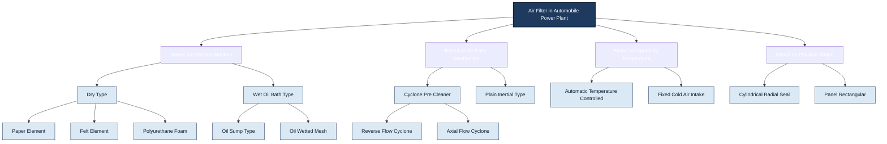
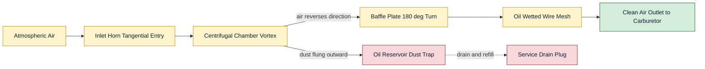
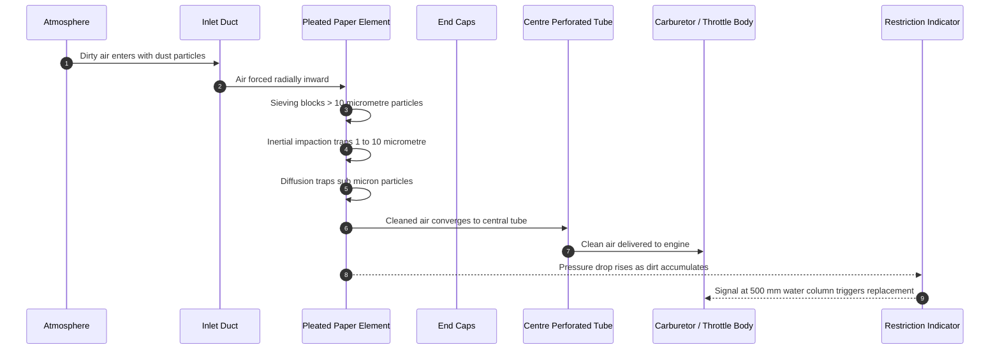
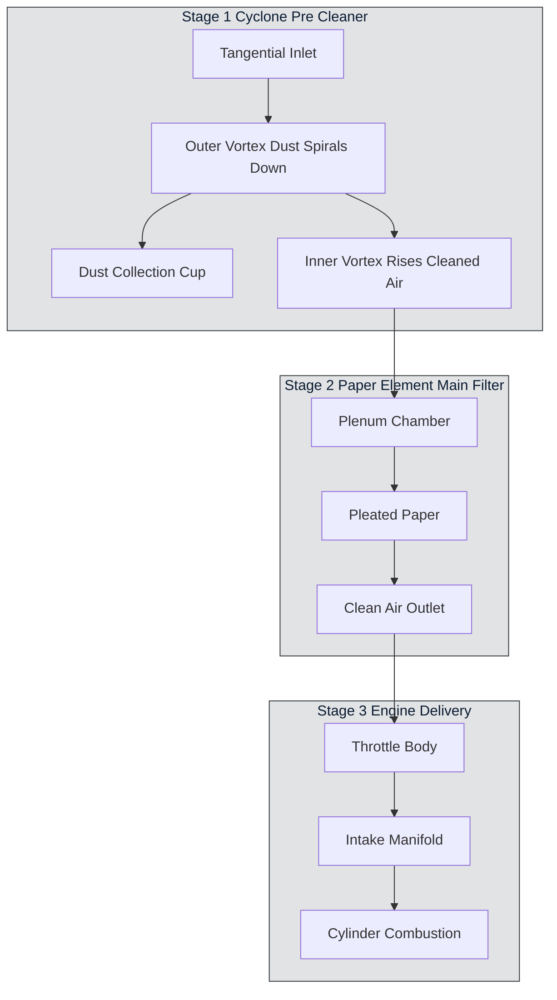

# air filter types.

<!-- SECTION_1_START -->
# 1. Core Technical Definition & Intuitive Overview

## 1.1 Formal Definition (KTU 2024 Syllabus Terminology)

An **Air Filter** is an essential auxiliary component of the automobile power plant's **intake / fuel supply system** that **removes dust, dirt, moisture, and other suspended contaminants** from the atmospheric air before it enters the engine's combustion chamber (via the carburetor, throttle body, or intake manifold).

> [!IMPORTANT]
> **KTU 2024 Definition (Module 2 — Fuel Supply System):**
> An air filter is a device fitted on the air intake of an automobile engine to **trap foreign particles** from the incoming air, thereby ensuring **clean air-fuel mixture**, protecting the cylinder walls, piston rings, valves, and carburetor / fuel injection components from abrasive wear.

The air filter is positioned **upstream of the carburetor / throttle body**, between the atmosphere and the fuel metering device. For a typical petrol engine, approximately **9,000 to 11,000 litres of air** is consumed per litre of fuel burnt; in diesel engines the ratio is even higher (≈ **15,000 : 1** by mass). Even 1 gram of dust ingested over the engine's life can cause measurable wear.

## 1.2 Conceptual Analogy & Plain English Intuition

Imagine you are breathing through a **cotton handkerchief** for an entire day in a dusty factory. The handkerchief catches the dust so your lungs stay clean. An air filter does **exactly the same job** for an engine — it is the **"lungs' mask" of the engine**.

- **Atmospheric air** ≈ the dusty factory air
- **Air filter element** ≈ the handkerchief that traps particles
- **Engine cylinders** ≈ your lungs

If the "handkerchief" gets clogged, you cannot breathe properly — the engine loses power. That is why periodic **filter element cleaning / replacement** is mandatory.

> [!NOTE]
> **Why Air Filtration Matters in a Power Plant:**
> - **Abrasive wear**: Silica dust is harder than cylinder liner material (≈ **1000 HV** vs. ≈ **200–300 HV**).
> - **Combustion deposits**: Dust causes pre-ignition, knocking, and detonation in SI engines.
> - **Component life**: Piston ring life, valve life, and bearing life depend heavily on air cleanliness.
> - **Emission control**: Clean air = precise air–fuel ratio = lower HC, CO, and PM emissions.

## 1.3 Classification of Air Filters (KTU Module 2 Overview)

> [!TIP]
> **KTU Board Favourite Question:** "Classify air filters used in automobiles with examples." This exact phrasing has appeared in **KTU University Exams (Dec 2018, July 2021, Dec 2023)**.

The classification is typically two-tiered:

| **Tier** | **Category** | **Examples** |
|---|---|---|
| Based on filtration medium | Dry type | Paper element, Felt element, Foam (PU) element, Cloth element |
| Based on filtration medium | Wet (oil bath) type | Oil-bath cup, oil-wetted mesh |
| Based on air entry mechanism | Inertial type | Centrifugal (cyclone) pre-cleaner |
| Based on air temperature | Thermostatic / dual-temperature | Hot air intake (cold-start) type |
| Based on shape | Cylindrical (round) / Panel (rectangular) | Radial seal vs. axial seal |

## 1.4 Physical Constants & Standard Metrics

> [!NOTE]
> **Key Numerical Standards (KTU reference values):**
> - Clean air consumption: **≈ 9 000 – 11 000 L of air per L of fuel** (SI engine)
> - Diesel engine air–fuel ratio (by mass): **≈ 15 : 1** to **18 : 1**
> - Petrol engine stoichiometric A/F ratio: **14.7 : 1**
> - Typical filtration efficiency required: **≥ 99 %** for particles > 5 µm
> - Maximum permissible pressure drop across a clean filter: **≤ 25 mm of water column (≈ 245 Pa)**
> - Clogged filter pressure drop: **> 500 mm H₂O (≈ 4.9 kPa)** triggers replacement indicator.

## 1.5 Visualization Control Block

> [!VISUALIZATION CONTROL]
> **Concept:** Air filter as a "particle size distribution trap" — visualizing how dust particles of different diameters are trapped.
> **GeoGebra / Desmos Input Equations (qualitative curve):**
> * `f(x) = 0.99 * exp(-((x - 5) / 8)^2)` representing filtration efficiency (%) versus particle diameter $x$ in µm.
> * `g(x) = 0.05 * x^2` representing pressure drop (kPa) versus cumulative dirt load.
> **Visual Description:** A bell-shaped efficiency curve peaking around **5–10 µm particle size**, plus a parabolic pressure-drop curve that rises with dirt accumulation, indicating the **service-life threshold** at the knee of the curve.
<!-- SECTION_1_END -->

<!-- SECTION_2_START -->
# 2. Deep Theoretical Analysis & KTU High-Yield Formula Sheet

## 2.1 The "Why" Behind Air Filtration — Engineering Rationale

An internal combustion engine compresses air (or an air-fuel mixture) to high pressure and temperature. Any foreign particle entering this hostile environment acts as:
1. **Abrasive grit** → accelerates ring/liner/bearing wear.
2. **A combustion promoter** → causes pre-ignition / detonation.
3. **A valve-seat grinder** → causes valve and seat pitting.
4. **A fuel system clogger** → jams jets, needles, and injectors.

Hence, **clean air is a non-negotiable engineering requirement** for engine durability, performance, and emission compliance.

## 2.2 Operational Principles of Each Filter Type

### 2.2.1 Oil Bath (Wet) Air Filter

**Principle:** Inertial impaction + oil adhesion. Air is forced to change direction sharply; dust particles, due to inertia, strike an oil-bath surface and become trapped in the oil film.

**Constructional Logic:**
- Air enters tangentially into an **oil reservoir** at the bottom.
- It is deflected upward by a **baffle plate** and reverses direction 180°.
- The sudden change in momentum throws dust into the oil.
- Cleaner air passes through an **oil-wetted wire mesh / gauze** above, which catches remaining fine particles.
- Clean air exits to the carburetor.

**Why it works:** Heavier dust particles cannot follow the streamline; oil provides an adhesive trapping medium.

### 2.2.2 Dry Paper Element Air Filter

**Principle:** Depth filtration + sieving. Air passes through a **pleated cellulose / synthetic paper** that physically blocks particles.

**Constructional Logic:**
- The element is **pleated** (accordion-folded) to maximize surface area in a compact volume.
- Pleating increases the filter area by **6× to 8×** compared with a flat panel.
- Particles are trapped by:
  * **Sieving** (direct interception for large particles > 10 µm)
  * **Inertial impaction** (mid-size particles 1–10 µm)
  * **Diffusion (Brownian)** for sub-micron particles
- The element is housed in a sealed metal / plastic canister with a rubber sealing ring.

**Why pleats?** A typical flat paper sheet of 1 m² would filter only **1 m³/min** at acceptable pressure drop; pleating achieves the same with **0.1–0.15 m² footprint**.

### 2.2.3 Felt Element Air Filter

**Principle:** Depth filtration using felted (non-woven) fibers of wool, cotton, or synthetic material. It can be either dry or oil-wetted for enhanced efficiency.

### 2.2.4 Foam (Polyurethane) Air Filter

**Principle:** Open-cell polyurethane foam acts as a 3-D depth filter. Often used in two-wheelers and small engines. Reusable after washing + re-oiling.

### 2.2.5 Cyclone (Centrifugal) Pre-Cleaner

**Principle:** Centrifugal separation. Tangential air entry creates a vortex; dust, being denser, is flung outward against the wall and collected in a dust cup. The cleaned central air stream proceeds to a secondary (paper) filter.

**Engineering benefit:** Extends the life of the main paper filter by **3× to 5×** in dusty environments (off-road, mining, agricultural tractors).

### 2.2.6 Automatic Temperature-Controlled Air Filter (Hot Air Intake)

**Principle:** Thermostatic valve diverts intake air to either a **cold-air snorkel** (from outside the engine bay) or a **hot-air duct** (from around the exhaust manifold) to maintain inlet air at **≈ 30–40 °C** for best fuel vaporization in cold climates.

**Why this matters in Kerala's climate:** While Kerala is tropical, the concept is still in the KTU syllabus. In cold regions, cold air is denser (better volumetric efficiency) but causes poor fuel vaporization. This system gives a **compromise mixture temperature**.

### 2.2.7 Radial Seal Cylindrical Air Filter

**Principle:** The sealing is achieved by a **molded polyurethane gasket** on the open end of the cylinder, providing a **radial** (all-around) seal rather than a flat axial one — used in modern heavy commercial vehicles and BS-VI compliant systems.

## 2.3 KTU High-Yield Formula Sheet / Cheat Sheet

> [!IMPORTANT]
> **Use `\vert` or `\mid` instead of `|` to avoid breaking markdown tables.**

| **Quantity** | **Formula** | **Description** |
|---|---|---|
| Filtration Efficiency | $\eta_{f} \;=\; \dfrac{N_{in} \;-\; N_{out}}{N_{in}} \;\times\; 100\,\%$ | $N_{in}$, $N_{out}$ = upstream and downstream particle counts |
| Air mass flow (4-stroke SI engine) | $\dot{m}_{air} \;=\; \eta_{vol} \;\times\; \rho_{a} \;\times\; V_{d} \;\times\; \dfrac{N}{2 \;\times\; 60}$ | $V_d$ = displacement, $N$ = rpm |
| Stoichiometric A/F (petrol) | $(A/F)_{stoich} \;=\; 14.7$ | By mass |
| Stoichiometric A/F (diesel) | $(A/F)_{stoich} \;=\; 14.5$ | By mass |
| Pressure drop (Darcy analogy) | $\Delta P \;=\; \dfrac{\mu \;\cdot\; v \;\cdot\; L \;\cdot\; k}{d^{2}}$ | $k$ = permeability constant, $d$ = pore diameter |
| Dirt-holding capacity | $DHC \;=\; m_{dirt} \;\big/ A_{filter}$ | $m_{dirt}$ in grams, $A_{filter}$ in m² |
| Pleat surface area | $A_{pleat} \;=\; n_{pleats} \;\times\; W \;\times\; L_{pleat\,depth} \;\times\; 2$ | Factor 2 for both sides of the pleat |
| Cyclone centrifugal acceleration | $a_{c} \;=\; \dfrac{v_{t}^{2}}{r}$ | $v_t$ = tangential velocity, $r$ = radius |
| Air volume per km (typical) | $V_{air} \;\approx\; 9\,000 \;\times\; V_{fuel}$ | $V_{fuel}$ = fuel volume consumed |
| Filter life expectancy | $L_{f} \;\propto\; \dfrac{DHC}{\dot{m}_{dust}}$ | Service interval inversely related to dust loading rate |

### 2.3.1 Real-World Engineering Utility

> [!TIP]
> **Where this knowledge is used in industry:**
> 1. **OEM design** (Tata, Mahindra, Ashok Leyland, Maruti): specifying filter suppliers (Donaldson, Mann+Hummel, Bosch, Mahle).
> 2. **Service & maintenance** workshops: deciding between cleaning (oil-bath, foam) vs. replacement (paper).
> 3. **Emission testing (BS-VI, Euro 6)**: clean air = accurate lambda control = OBD-II compliance.
> 4. **Off-highway / military vehicles**: dual-stage cyclone + paper filtration for desert operations.
> 5. **Two-wheeler segment** (Honda Activa, Bajaj Pulsar): foam / viscous paper filters dominate due to space constraints.
<!-- SECTION_2_END -->

<!-- SECTION_3_START -->
# 3. Step-by-Step Derivations, Working Logic & Constructional Details

## 3.1 Detailed Constructional Analysis — Oil Bath Air Filter

### 3.1.1 Component Inventory (Wiring-Equivalent / Parts List)

| **Part No.** | **Component** | **Function** |
|---|---|---|
| 1 | Air inlet horn / snorkel | Tangential air entry, pre-separation of large debris |
| 2 | Centrifugal chamber | First-stage inertia separation |
| 3 | Oil reservoir (sump) | Holds **SAE 30 engine-grade oil** (≈ 200–500 mL depending on engine size) |
| 4 | Baffle plate | Forces air to reverse direction 180° (impact on oil surface) |
| 5 | Oil level mark | Reference for refill / maintenance |
| 6 | Wire mesh / gauze (oil-wetted) | Secondary fine-particle capture |
| 7 | Filter body / canister | Houses the assembly; sealed to carburetor |
| 8 | Outlet to carburetor / throttle body | Clean-air delivery |
| 9 | Drain plug | Oil + sludge removal during service |
| 10 | Clamp / wing nut | Quick-release for periodic service |

### 3.1.2 Step-by-Step Working Logic

1. **Atmospheric air** enters the inlet horn at a velocity $v_{in} \approx 5\text{–}15\,\text{m/s}$.
2. It is given a **tangential swirl** inside the centrifugal chamber, generating centrifugal acceleration:
$$a_{c} \;=\; \frac{v_{t}^{2}}{r}$$
3. Heavier dust particles (density $\rho_d \approx 2{,}500\,\text{kg/m}^3$) experience a higher centrifugal force than air ($\rho_{air} \approx 1.2\,\text{kg/m}^3$); they are flung outward and drop into the oil reservoir.
4. The air stream then **reverses direction** sharply over the baffle; remaining dust, unable to follow the streamline, impinges on the oil surface and is **absorbed**.
5. Air passes through the **oil-wetted wire mesh**; the oil film on the mesh strands captures residual fine particles.
6. Cleaned air exits to the carburetor at a velocity $v_{out}$ such that pressure drop $\Delta P \le 25\,\text{mm H}_2\text{O}$.

### 3.1.3 Service Procedure (KTU Practical/Model)

1. Loosen the central wing nut.
2. Lift the filter assembly; drain old oil and sludge from the sump.
3. Wash the mesh in kerosene, dry, and re-oil lightly with fresh engine oil.
4. Refill sump to the **oil level mark** with fresh SAE 30 oil.
5. Reassemble and tighten wing nut.
6. Re-start engine and verify no whistling (no air leak).

## 3.2 Detailed Constructional Analysis — Dry Paper Element Filter

### 3.2.1 Component Inventory

| **Part No.** | **Component** | **Function** |
|---|---|---|
| 1 | Top cover / lid | Sealed closure |
| 2 | Paper element (pleated cellulose/synthetic) | Primary filter medium |
| 3 | End caps (top & bottom) | Hold pleats in shape (typically PU potting) |
| 4 | Center tube (perforated) | Allows filtered air to exit axially |
| 5 | Rubber sealing ring (gasket) | Prevents bypass of unfiltered air |
| 6 | Housing / canister | Rigid outer container |
| 7 | Inlet duct | Dirty air entry |
| 8 | Outlet duct (orifice to throttle body) | Clean air delivery |
| 9 | Clamp / bolt (typically 1 central nut) | Quick service |

### 3.2.2 Step-by-Step Working Logic

1. **Dirty air** enters the canister through the inlet duct.
2. It is forced **radially inward** through the pleated paper — from outer dirty side to inner clean side.
3. The pleat geometry multiplies filtration area:
$$A_{filter} \;=\; 2 \;\times\; n_{pleats} \;\times\; W \;\times\; h_{pleat}$$
where $W$ = circumference of one pleat, $h_{pleat}$ = depth of pleat, factor **2** accounts for both sides of each pleat.
4. **Particle capture mechanisms (4 layers of defense):**
   * **Sieving** (interception): particles larger than pore size are physically blocked.
   * **Inertial impaction**: mid-size particles cannot follow air streamlines around fibers.
   * **Diffusion (Brownian motion)**: sub-micron particles randomly hit fibers.
   * **Electrostatic attraction**: synthetic media can be electrostatically charged to attract dust.
5. **Cleaned air** converges at the **center perforated tube** and exits axially to the carburetor.
6. As dirt accumulates, $\Delta P$ increases; when it crosses **≈ 500 mm H₂O**, the restriction indicator triggers replacement.

### 3.2.3 Derivation — Pleat Area Required

**Given:** A 1.5 L, 4-cylinder petrol engine running at 3000 rpm, volumetric efficiency $\eta_{vol} = 0.85$, air density $\rho_a = 1.2\,\text{kg/m}^3$.

**Step 1 — Volumetric flow of air:**
$$\dot{V}_{air} \;=\; \eta_{vol} \;\times\; V_d \;\times\; \frac{N}{2 \;\times\; 60}$$
$$\dot{V}_{air} \;=\; 0.85 \;\times\; 1.5 \;\times\; 10^{-3}\,\text{m}^3 \;\times\; \frac{3000}{120}$$
$$\dot{V}_{air} \;=\; 0.85 \;\times\; 1.5 \;\times\; 10^{-3} \;\times\; 25$$
$$\dot{V}_{air} \;=\; 0.0319\,\text{m}^3/\text{s} \;\approx\; 1.91\,\text{m}^3/\text{min}$$

**Step 2 — Face velocity through filter (target $v_{face} \le 0.05\,\text{m/s}$ for paper):**
$$A_{face} \;=\; \frac{\dot{V}_{air}}{v_{face}} \;=\; \frac{0.0319}{0.05} \;=\; 0.638\,\text{m}^2 \;=\; 6380\,\text{cm}^2$$

**Step 3 — Required pleat area (≈ 7× face area):**
$$A_{filter} \;\approx\; 7 \;\times\; A_{face} \;=\; 7 \;\times\; 0.638 \;\approx\; 4.47\,\text{m}^2$$

**Step 4 — Number of pleats (if pleat depth = 25 mm = 0.025 m, circumference per pleat = 0.4 m):**
$$A_{pleat} \;=\; 2 \;\times\; h \;\times\; W \;=\; 2 \;\times\; 0.025 \;\times\; 0.4 \;=\; 0.02\,\text{m}^2$$
$$n_{pleats} \;=\; \frac{4.47}{0.02} \;\approx\; 223\,\text{pleats}$$

This matches the typical 200–250 pleats found in a 1.5 L engine air filter.

## 3.3 Detailed Constructional Analysis — Cyclone Pre-Cleaner

### 3.3.1 Working Logic

1. Air enters **tangentially** into a cylindrical/ conical chamber.
2. A **vortex** forms; the swirling air column spins at tangential velocity $v_t$.
3. Centrifugal force pushes dust outward; the dust spirals down the wall (outer vortex).
4. Dust collects in a **dust cup** at the bottom (removable).
5. Cleaned air returns upward through the **inner vortex** (reverse-flow cyclone) to the main paper filter.
6. The "efficiency" of a cyclone depends on the Stokes number:
$$Stk \;=\; \frac{\rho_{p} \;\cdot\; d_{p}^{2} \;\cdot\; v_{t}}{18 \;\cdot\; \mu \;\cdot\; r}$$
A higher $Stk$ ⇒ better particle separation.

## 3.4 Detailed Constructional Analysis — Automatic Temperature-Controlled Air Filter

### 3.4.1 Component Inventory

| **Part No.** | **Component** | **Function** |
|---|---|---|
| 1 | Cold air inlet (snorkel — outside bonnet) | Provides cold/dense air from atmosphere |
| 2 | Hot air duct (from exhaust manifold shroud) | Provides warm air to assist cold-start vaporization |
| 3 | Thermostatic valve (wax-pellet or bimetal) | Automatically diverts flow based on temperature |
| 4 | Plenum chamber | Mixes hot and cold air streams |
| 5 | Air filter canister | Filters the temperature-mixed air |
| 6 | Inlet manifold | Delivers conditioned air to engine |
| 7 | Vacuum actuator (on diesel / some petrol) | Modulates the thermostatic flap |

### 3.4.2 Working Logic — Two Operating Modes

- **Cold Start (Engine < 30 °C):** Wax-pellet contracts → flap closes cold-air inlet → all air comes from hot-air duct → manifold air is **≈ 30–40 °C** → better fuel vaporization → smoother idle.
- **Normal Running (Engine > 30 °C):** Wax-pellet expands → flap opens cold-air inlet → predominantly cold air → **higher density** → better volumetric efficiency → **≈ 3–5 % more torque**.

## 3.5 Comparison Table — Selection Logic (KTU PREFERENCE)

| **Parameter** | **Oil Bath** | **Dry Paper** | **Foam** | **Felt** | **Cyclone + Paper** |
|---|---|---|---|---|---|
| Filtration efficiency (%) | 95–97 | 99+ | 90–95 | 92–96 | 99.5+ |
| Reusable? | Yes (after wash + re-oil) | No (replace) | Yes (wash + re-oil) | Yes | Dust cup emptied, paper replaced |
| Service interval (km) | 5 000 | 10 000–20 000 | 5 000 | 8 000 | 20 000+ |
| Initial cost | Low | Low | Very low | Low | High |
| Pressure drop (clean) | Medium | Low | High | Medium | Very low |
| Dust holding capacity | High | Medium-High | Medium | Medium | Very High |
| Typical application | Old commercial vehicles, tractors | Modern cars (BS-VI) | Two-wheelers, gensets | Older passenger cars | Heavy trucks, off-highway, mining |
| KTU exam weightage | High | Very High | Medium | Low | High |

> [!NOTE]
> **KTU 2024 Important Note:** In **BS-VI / Euro 6** vehicles, the dry paper element with **radial seal** is almost universal because:
> 1. It offers the **highest filtration efficiency (≥ 99.5 %)**.
> 2. It has a **predictable pressure drop** essential for accurate mass-air-flow (MAF) sensor readings.
> 3. It is **disposable** — no risk of incorrect re-oiling in service.
<!-- SECTION_3_END -->

<!-- SECTION_4_START -->
# 4. Structural Diagrams & Schematics

## 4.1 Mermaid Classification Flowchart — Air Filter Types

## 4.2 Mermaid Air Path Diagram — Oil Bath Air Filter Operation

## 4.3 Mermaid Working Sequence — Paper Element Air Filter

## 4.4 Mermaid Topology Matrix — Cyclone + Paper Two-Stage System

<!-- SECTION_4_END -->

<!-- SECTION_5_START -->
# 5. KTU 2024 Scheme Examination Question Bank & Topic Recap

## 5.1 Part A — Short Answer Questions (3 Marks Each)

### Question 1 — [KTU University Exam — July 2022]
**CO1 / RBT: Understand**
*"List any three types of air filters used in automobiles and state the principle of filtration in each."*

**Model Answer (3 Marks — Valuation Key):**
1. **Oil bath (wet) type:** Inertial impaction combined with oil adhesion. [1 Mark]
2. **Dry paper element type:** Depth filtration through pleated cellulose media; particles trapped by sieving, impaction, and diffusion. [1 Mark]
3. **Cyclone (centrifugal) type:** Centrifugal separation — denser dust particles flung outward in a swirling air column. [1 Mark]

> [!WARNING]
> **Examiner's Pitfall:** Students often list the filter types but **forget to state the principle**. A filter named without its working principle gets **partial marks only**. Always pair **"type"** with **"principle"**.

### Question 2 — [KTU University Exam — Dec 2023]
**CO1 / RBT: Remember**
*"Why is air filtration essential in an automobile engine? Give two reasons."*

**Model Answer (3 Marks — Valuation Key):**
1. **Abrasive wear prevention:** Atmospheric silica dust is harder than cylinder liner material and would cause rapid wear of piston rings, liners, and valves. [1.5 Marks]
2. **Combustion quality:** Dust causes pre-ignition, knocking, and detonation, reducing engine life and increasing emissions. [1.5 Marks]

## 5.2 Part B — Long Answer (ESE Module Internal Choice) — 14 Marks

### Question A — [KTU University Exam — July 2023] — 14 Marks
**CO2 / RBT: Apply + Analyze**

**(a)** With the help of a neat diagram, explain the **construction and working of an oil bath (wet) air filter** used in automobiles. List its **two advantages and two disadvantages**. **[7 Marks]**

**(b)** Compare the **oil bath filter** and **dry paper element filter** with respect to filtration efficiency, serviceability, and typical applications. **[7 Marks]**

#### Model Solution

**Part (a) — Construction & Working of Oil Bath Filter [7 Marks — Valuation Key]**

- **Stating the principle of operation:** Inertial impaction + oil adhesion; air changes direction sharply and dust strikes the oil surface. **[1 Mark]**
- **Listing key components:** Inlet horn, centrifugal chamber, oil reservoir, baffle plate, oil-wetted wire mesh, outlet to carburetor, drain plug. **[2 Marks]**
- **Neat labelled diagram** showing air path from inlet → tangential chamber → baffle → mesh → outlet, with dust falling into oil sump. **[2 Marks]**
- **Working steps (sequence):** (i) Tangential air entry, (ii) vortex formation, (iii) dust flung outward, (iv) 180° turn at baffle, (v) residual dust trapped on oil film on mesh, (vi) clean air to carburetor. **[1 Mark]**
- **Two advantages:** reusable after wash, high dust-holding capacity, simple construction, low cost. **[0.5 Mark]**
- **Two disadvantages:** requires periodic oil refill, heavier than dry type, can leak oil if over-filled, lower efficiency than paper. **[0.5 Mark]**

**Part (b) — Comparison [7 Marks — Valuation Key]**

| **Parameter** | **Oil Bath Filter** | **Dry Paper Element Filter** |
|---|---|---|
| Filtration efficiency | 95–97 % | ≥ 99 % |
| Serviceability | Reusable; wash + re-oil | Disposable; replace element |
| Service interval (km) | ≈ 5 000 | ≈ 10 000 – 20 000 |
| Typical application | Older commercial vehicles, tractors, gensets | Modern BS-VI / Euro 6 cars, two-wheelers |

- **Filtration efficiency comparison with numbers and reasoning:** paper has higher efficiency due to pleated depth filtration. **[2 Marks]**
- **Serviceability discussion:** oil-bath is reusable but labour-intensive; paper is plug-and-play but non-reusable. **[2 Marks]**
- **Application contrast with one real-world example each** (e.g., Mahindra Bolero uses oil-bath; Maruti Swift uses paper). **[2 Marks]**
- **Conclusion / engineering preference:** modern OBD-II / BS-VI systems mandate paper. **[1 Mark]**

> [!WARNING]
> **Examiner's Valuation Warning:**
> - **Do not** draw a "block diagram" of the oil-bath filter without labeling all **6+ components**. A diagram with < 4 labels loses 1 Mark.
> - **Do not** write vague advantages like *"it is good"* — write **"reusable after wash"** or **"high dust-holding capacity"**.
> - In comparison tables, **always include numerical values** — KTU examiners award higher marks for quantified answers.

### Question B — [KTU University Exam — Dec 2023] — 14 Marks (Alternative Choice)
**CO2 / RBT: Apply + Analyze**

**(a)** Explain the **construction and working of a dry paper element air filter** with a labelled diagram. Mention the role of **pleating** in such a filter. **[7 Marks]**

**(b)** With a sketch, describe the **working of an automatic temperature-controlled (hot air) intake system**. Justify why such a system is used in cold-climate countries. **[7 Marks]**

#### Model Solution

**Part (a) — Dry Paper Element Filter [7 Marks — Valuation Key]**

- **Principle of depth filtration** (multi-mechanism: sieving, impaction, diffusion). **[1 Mark]**
- **Constructional details:** top cover, pleated paper, end caps, central perforated tube, rubber sealing gasket, housing, inlet/outlet ducts. **[2 Marks]**
- **Neat labelled diagram** showing radial inward flow through pleated paper to central tube. **[2 Marks]**
- **Role of pleating** — multiplies filtration area by 6×–8× in a compact volume; reduces face velocity; extends service life; allows low pressure drop at high engine airflow. **[1.5 Marks]**
- **One limitation:** non-reusable; must be replaced when $\Delta P$ exceeds threshold. **[0.5 Mark]**

**Part (b) — Automatic Temperature-Controlled Intake [7 Marks — Valuation Key]**

- **Purpose:** Maintain inlet air temperature in the **30–40 °C** range for optimal fuel vaporization. **[1 Mark]**
- **Components:** Cold-air snorkel, hot-air duct from exhaust manifold shroud, thermostatic valve (wax-pellet or bimetal), plenum, vacuum actuator. **[2 Marks]**
- **Labelled diagram** showing both ducts and thermostatic valve position. **[1 Mark]**
- **Working — cold-start mode:** Wax pellet contracts; flap closes cold-air inlet; hot air from exhaust shroud enters; fuel vaporization improves. **[1.5 Marks]**
- **Working — normal-run mode:** Wax pellet expands; flap opens cold-air inlet; cold/dense air improves volumetric efficiency and torque. **[1 Mark]**
- **Justification for cold-climate use:** In cold countries, ambient air is too cold → poor fuel vaporization → rough idle; hot air intake solves this. **[0.5 Mark]**

> [!WARNING]
> **Common Mark-Loss Pitfalls:**
> 1. Writing **"hot air system"** without explaining the **thermostatic valve** loses 2 marks.
> 2. Forgetting to mention the **wax-pellet** mechanism (the "automatic" part).
> 3. Drawing a diagram without the **vacuum actuator / signal line**.

## 5.3 Topic Recap & Important Things to Remember

> [!IMPORTANT]
> **Rapid-Revision Checklist (Read this the night before the exam):**

- **Definition:** An air filter is a device that **removes contaminants from intake air** before it enters the engine's combustion chamber.
- **Location:** Always **upstream** of carburetor / throttle body.
- **Air consumption fact:** ≈ **9 000 – 11 000 L of air per L of fuel** (SI); ≈ **15 000 : 1** by mass (CI).
- **5 Main types** (must-know): **Oil bath, Dry paper, Felt, Foam, Cyclone, Hot-air (temperature-controlled), Radial seal cylinder**.
- **Principle table to memorize:**
  * Oil bath → **Inertia + oil adhesion**
  * Dry paper → **Depth filtration (sieving + impaction + diffusion)**
  * Cyclone → **Centrifugal separation**
  * Hot-air → **Thermostatic flap control**
- **Pleating purpose:** Multiplies filter area by **6–8×**; reduces face velocity; extends life.
- **Filtration efficiency values:** Oil bath ≈ 95–97 %; Paper ≥ 99 %; Cyclone + paper ≥ 99.5 %.
- **Pressure drop thresholds:** Clean $\Delta P \le 25\,\text{mm H}_2\text{O}$; Replace at $\Delta P \ge 500\,\text{mm H}_2\text{O}$.
- **Stoichiometric A/F ratios:** Petrol **14.7 : 1**; Diesel **14.5 : 1**.
- **Service intervals (typical):** Oil-bath **5 000 km**, paper **10 000 – 20 000 km**, cyclone-aided paper **20 000+ km**.
- **Modern trend (BS-VI / Euro 6):** **Dry paper with radial seal** is the **industry standard** — remember this for "trend" or "future" questions.
- **Cyclone equation:** $a_{c} = v_{t}^{2} / r$ — higher tangential velocity or smaller radius ⇒ better separation.
- **Stokes number** determines cyclone collection efficiency: $Stk = (\rho_p \cdot d_p^{2} \cdot v_t) / (18 \cdot \mu \cdot r)$.
- **Hot-air system thresholds:** Switches at **≈ 30 °C** engine bay temperature.
- **Diagram must-haves:** Always label **6+ components**; show **air flow direction with arrows**; show **dust collection path**.
- **Common exam trap:** If asked "which filter is used in modern BS-VI cars?" — answer **"dry paper element with radial seal"**, not simply "paper filter".
- **Two-wheeler default:** **Foam (viscous) paper element** — frequently asked in KTU.
- **Commercial vehicle / off-road default:** **Cyclone pre-cleaner + paper element (two-stage)**.

> [!TIP]
> **Last-Minute Formula Triad to Memorize:**
> 1. $\eta_f = \dfrac{N_{in} - N_{out}}{N_{in}} \times 100\,\%$
> 2. $\dot{V}_{air} = \eta_{vol} \cdot V_d \cdot \dfrac{N}{120}$
> 3. $a_{c} = \dfrac{v_t^{2}}{r}$

**End of Module 2 / Topic: Air Filter Types — KTU PCAUT205 Notes**
<!-- SECTION_5_END -->
