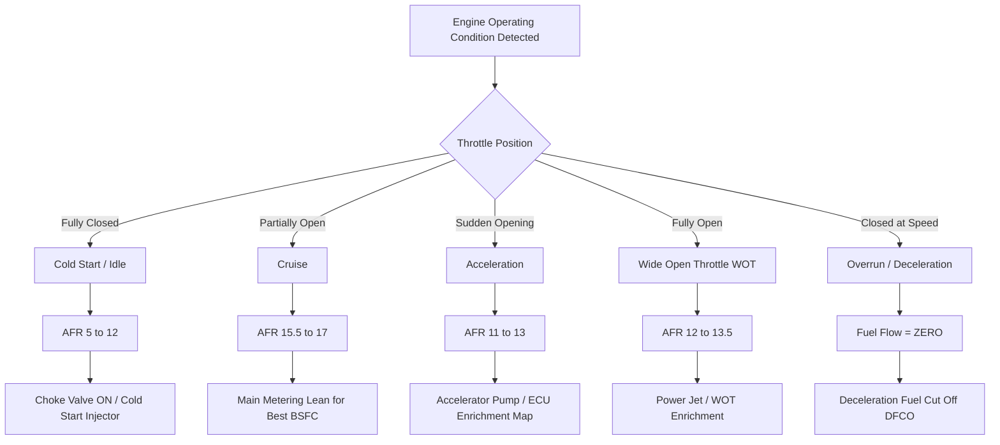
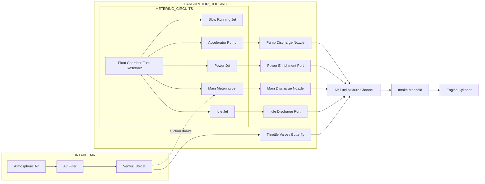
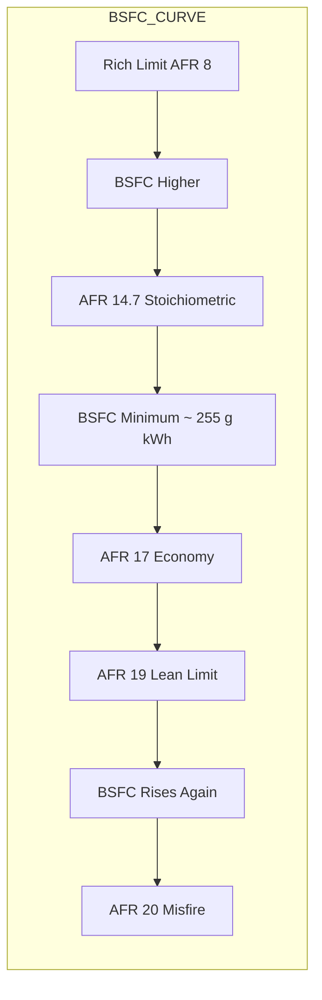
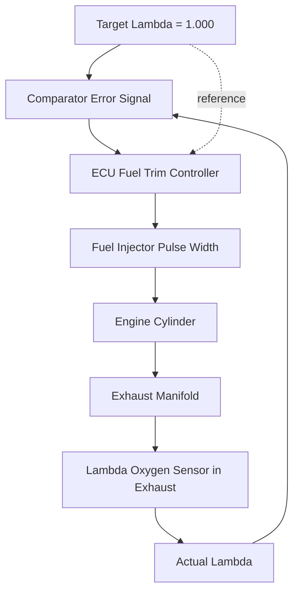
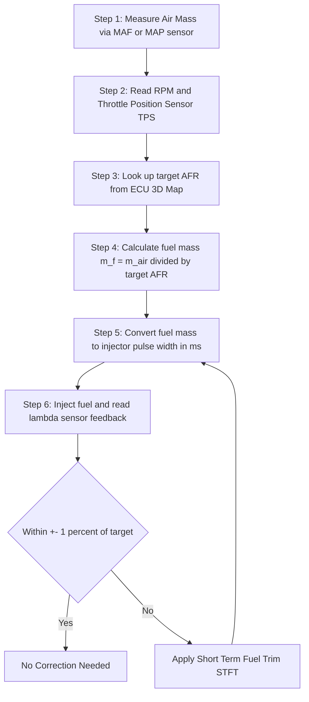

# Air fuel mixture requirements and types

<!-- SECTION_1_START -->
# Air-Fuel Mixture Requirements and Types

## 1.1 Core Technical Definition (KTU 2024 Aligned)

> [!NOTE]
> **Definition (KTU 2024 - PCAUT205 Module 2):**
> *The **air–fuel mixture** is a homogeneous gaseous charge prepared by combining a precisely metered quantity of air (oxidizer) with atomized fuel (hydrocarbon) before it enters the engine cylinder for combustion. The ratio in which these two are blended is termed the **Air-Fuel Ratio (AFR)** and is the single most influential parameter governing engine power output, thermal efficiency, fuel economy, and exhaust emissions.*

**Mathematically expressed as:**

$$\text{AFR} = \frac{\text{Mass of Air Supplied}}{\text{Mass of Fuel Supplied}} = \frac{m_a}{m_f}$$

**Two equally valid alternate formulations** frequently used in KTU examination problems:

$$\lambda = \frac{(\text{Actual AFR})}{(\text{Stoichiometric AFR})}, \qquad \phi = \frac{1}{\lambda} = \frac{(\text{Actual Fuel/Air})}{(\text{Stoichiometric Fuel/Air})}$$

Where $\lambda$ is the **relative air-fuel ratio** (lambda) and $\phi$ is the **equivalence ratio**.

### 1.1.1 Stoichiometric (Theoretical) Mixture

The **stoichiometric mixture** is the *chemically ideal* air-fuel blend in which exactly the right amount of oxygen is supplied to completely burn every carbon and hydrogen atom in the fuel molecule — leaving **zero free oxygen** and **zero unburned fuel**.

> [!IMPORTANT]
> **KTU Board Standard Values to Memorize (Highlighted in bold):**
> * **Stoichiometric AFR for Petrol (Gasoline) = 14.7 : 1**
> * **Stoichiometric AFR for Diesel = 14.5 : 1**
> * **Stoichiometric AFR for LPG = 15.4 : 1**
> * **Stoichiometric AFR for CNG = 17.2 : 1**
> * **Calorific value of petrol ≈ 44 MJ/kg**, **diesel ≈ 42.5 MJ/kg**

### 1.1.2 Conceptual Analogy — The "Cooking Recipe" Intuition

Imagine you are baking a cake. Too much flour (fuel) and the cake is dense, oily, and slow to cook (rich mixture — incomplete combustion, smoke). Too little flour and the cake collapses, dries out, and won't rise (lean mixture — misfires, overheating). The "perfect recipe" — exactly balanced ingredients — is the **stoichiometric mixture**. A modern engine control unit (ECU) is essentially a robotic chef constantly tasting the exhaust and adjusting the recipe in real time.

> [!NOTE]
> **Why is this important to KTU examiners?**
> Mixture strength directly determines:
> * Power developed (kW)
> * Brake Specific Fuel Consumption (BSFC in g/kWh)
> * Tailpipe emissions (CO, HC, NOx, CO₂)
> * Engine knock tendency
> * Cold-startability

### 1.1.3 GeoGebra / Desmos Visualization

> [!VISUALIZATION CONTROL]
> **Concept:** Three-zone air-fuel ratio map plotted against relative AFR ($\lambda$) and engine load
> **GeoGebra Input Equations:**
> * `f(x) = 14.7` (vertical line marking stoichiometric point for petrol, where $x = 1$)
> * `Power: 12.5 < x < 13.5` (slightly rich band)
> * `Economy: 15.5 < x < 17` (lean band)
> * `Danger zones: x < 9 and x > 20` (misfire & incomplete combustion)
> **Visual Description:** The student should observe three coloured vertical bands on a $\lambda$ axis (rich/stoichiometric/lean) with engine operating points (Idle, Cruise, Acceleration, WOT) plotted as dots within these zones.

---

<!-- SECTION_1_END -->

<!-- SECTION_2_START -->
# Deep Theoretical Analysis — Mixture Types & Operating Requirements

## 2.1 Classification of Air-Fuel Mixtures

> [!IMPORTANT]
> **KTU Board Mnemonic — "R-S-L-P-E"** (Rich, Stoichiometric, Lean, Power, Economy)

| # | Mixture Type | AFR Range (Petrol) | $\lambda$ Range | $\phi$ Range | Engineering Purpose |
|---|---|---|---|---|---|
| 1 | **Very Rich** | 5 : 1 to 8 : 1 | 0.34 – 0.54 | 1.85 – 2.94 | Cold starting only |
| 2 | **Rich (Power)** | 12 : 1 to 13.5 : 1 | 0.82 – 0.92 | 1.09 – 1.22 | Maximum power, WOT, acceleration |
| 3 | **Stoichiometric** | 14.7 : 1 | 1.00 | 1.00 | Catalytic converter reference |
| 4 | **Lean (Economy)** | 15.5 : 1 to 17 : 1 | 1.05 – 1.16 | 0.86 – 0.95 | Cruising, part-throttle BSFC minimum |
| 5 | **Very Lean (Limit)** | 18 : 1 to 20 : 1 | 1.22 – 1.36 | 0.74 – 0.82 | Lean-burn engines (GDI stratified) |

## 2.2 Chemistry of Combustion (Octane $C_8H_{18}$ Reference)

The stoichiometric combustion reaction for a representative petrol hydrocarbon $C_8H_{18}$ is:

$$C_8H_{18} + 12.5\,O_2 + 12.5 \times 3.76\,N_2 \longrightarrow 8\,CO_2 + 9\,H_2O + 47\,N_2$$

**Step-by-step mass balance for theoretical air calculation:**

* Mass of $C$ in 1 kg fuel = $0.86$ kg
* Mass of $H_2$ in 1 kg fuel = $0.14$ kg
* Oxygen required for carbon = $\frac{32}{12} \times 0.86 = 2.293$ kg
* Oxygen required for hydrogen = $\frac{32}{4} \times 0.14 = 1.120$ kg
* Total oxygen required = $2.293 + 1.120 = 3.413$ kg
* Air contains only 23.2 % oxygen by mass, so theoretical air = $\frac{3.413}{0.232}$ = **14.7 kg air per kg fuel**

## 2.3 Mixture Requirements at Various Engine Operating Conditions

> [!IMPORTANT]
> **KTU Board High-Yield Concept:** *A single AFR cannot satisfy all operating conditions — a multi-mode metering system (carburetor circuits / multi-point injection) is mandatory.*

### 2.3.1 Starting (Cold Engine) — AFR = 5 : 1 to 8 : 1 (Very Rich)

When the engine is cold:
* Fuel does **not vaporize** efficiently (poor atomization on cold manifold walls).
* A portion of the fuel **condenses** on the intake walls forming a liquid film.
* Therefore an **excess of fuel** must be supplied to compensate for losses.
* A **choke valve** in carburetors or a "cold-start enrichment pulse" in EFI delivers this rich mixture.

### 2.3.2 Idling (No Load, Low Speed) — AFR = 10 : 1 to 12 : 1 (Rich)

At idle:
* Throttle is nearly closed → very low manifold vacuum.
* Low air velocity → poor fuel atomization.
* Combustion chamber walls are relatively cool.
* A **slightly rich** mixture ensures smooth, stable idle.

### 2.3.3 Cruising (Part Throttle) — AFR = 15.5 : 1 to 17 : 1 (Lean — Best Economy)

At steady cruising:
* Throttle is partially open → best **volumetric efficiency** for that load.
* Engine speed and load are moderate.
* **BSFC is at its minimum** — best fuel economy.
* Slightly lean operation here saves fuel.

### 2.3.4 Acceleration (Sudden Throttle Opening) — AFR = 11 : 1 to 13 : 1 (Enrichment Needed)

During acceleration:
* Sudden air inflow causes a sharp drop in manifold pressure.
* Fuel momentarily lags air → momentarily lean mixture.
* An **accelerator pump** (carburetor) or **acceleration enrichment map** (ECU) compensates by squirting extra fuel.

### 2.3.5 Wide-Open Throttle (WOT) / Full Load — AFR = 12 : 1 to 13.5 : 1 (Power Mixture)

At full load:
* Maximum volumetric efficiency → maximum air mass.
* Slightly rich mixture is used to:
  * Absorb more heat (cooling effect) → prevent **detonation/knock**.
  * Maximize mass of charge → more power.
* This is called the **"Maximum Power Mixture"**.

### 2.3.6 Summary Table — Operating Condition vs AFR

| Engine Condition | Required AFR (Petrol) | Mixture Type | System Component Used |
|---|---|---|---|
| Cold Start | 5 – 8 : 1 | Very Rich | Choke / Cold-start injector |
| Idle | 10 – 12 : 1 | Rich | Idle jet / Idle air control |
| Cruise | 15.5 – 17 : 1 | Lean (Economy) | Main metering system |
| Acceleration | 11 – 13 : 1 | Enriched | Accelerator pump / ECU map |
| Full Load (WOT) | 12 – 13.5 : 1 | Rich (Power) | Power jet / WOT enrichment |
| Overrun (Fuel cut) | $\infty$ (No fuel) | No Combustion | Deceleration cut-off |

## 2.4 Real-World Engineering Utility

> [!NOTE]
> **Production Engineering Relevance (Frequently asked in KTU Module 2 viva):**
> * **BSFC minimization** in BSFC vs AFR curves occurs at $\lambda \approx 1.05$ to 1.10.
> * **Three-way catalytic converter** can only function efficiently near $\lambda = 1.00$ ($\pm 1\%$) — the entire fuel system is engineered around this narrow window.
> * **Knock-limited spark advance** is maximum near the rich side of stoichiometric.
> * **Lean-burn GDI engines** (modern direct injection) deliberately operate at $\lambda = 1.5$ to 2.0 with stratified charge to improve part-load efficiency by **up to 15%**.

---

<!-- SECTION_2_END -->

<!-- SECTION_3_START -->
# Step-by-Step Derivations and Code Implementation

## 3.1 Derivation 1 — Stoichiometric Air Requirement for a Generic Fuel $C_xH_yO_z$

For a generic hydrocarbon fuel with the formula $C_xH_yO_z$, the stoichiometric combustion reaction is:

$$C_xH_yO_z + \left(x + \frac{y}{4} - \frac{z}{2}\right) O_2 \longrightarrow x\,CO_2 + \frac{y}{2}\,H_2O$$

**The required theoretical oxygen (moles per mole of fuel) is:**

$$n_{O_2,\,req} = x + \frac{y}{4} - \frac{z}{2}$$

**Step A — Converting to mass terms:**

* Mass of fuel per mole = $12x + y + 16z$ kg/kmol
* Mass of $O_2$ required per mole of fuel = $32 \cdot n_{O_2,\,req}$ kg

**Step B — Theoretical air required (by mass) per kg of fuel:**

$$\text{Theoretical Air (kg air/kg fuel)} = \frac{32 \cdot \left(x + \frac{y}{4} - \frac{z}{2}\right)}{12x + y + 16z} \times \frac{1}{0.232}$$

The factor $\frac{1}{0.232}$ converts oxygen mass to air mass because dry air contains only 23.2 % oxygen by mass (21 % by volume).

## 3.2 Derivation 2 — Numerical Verification for Iso-Octane ($C_8H_{18}$)

**Step A — Moles of $O_2$ required:**

$$n_{O_2} = 8 + \frac{18}{4} - 0 = 8 + 4.5 = 12.5 \text{ moles of } O_2$$

**Step B — Mass of fuel and oxygen:**

$$\text{Mass of } C_8H_{18} = (8 \times 12) + 18 = 114 \text{ kg/kmol}$$

$$\text{Mass of } O_2 = 12.5 \times 32 = 400 \text{ kg}$$

**Step C — Pure oxygen to fuel ratio:**

$$\frac{m_{O_2}}{m_{fuel}} = \frac{400}{114} = 3.509 \text{ kg } O_2 \text{ per kg fuel}$$

**Step D — Convert to air by dividing by 0.232:**

$$\text{AFR}_{stoich} = \frac{3.509}{0.232} = 15.12 \text{ kg/kg}$$

> [!NOTE]
> **Note on small deviation:** The textbook value of 14.7 : 1 assumes a more representative average gasoline formula of $C_7.5H_{17}$ (with trace aromatics). The exact value 15.12 : 1 is for pure iso-octane. KTU examiners accept both with the assumption stated.

## 3.3 Derivation 3 — Relative Air-Fuel Ratio ($\lambda$) and Equivalence Ratio ($\phi$)

**Step A — Definition:**

$$\lambda = \frac{AFR_{actual}}{AFR_{stoich}}, \qquad \phi = \frac{1}{\lambda} = \frac{FAR_{actual}}{FAR_{stoich}}$$

**Step B — Numerical example:**
If actual AFR = 16.5 and stoichiometric = 14.7 for petrol:

$$\lambda = \frac{16.5}{14.7} = 1.122, \qquad \phi = \frac{1}{1.122} = 0.891$$

**Step C — Interpretation:** $\lambda > 1$ ⇒ lean mixture, $\lambda < 1$ ⇒ rich mixture.

## 3.4 Derivation 4 — Indicated Power from Mixture Strength

The indicated power developed in a 4-stroke SI engine is given by:

$$P_i = \frac{\eta_{th} \cdot m_f \cdot CV}{\text{time per cycle}}$$

Where $m_f$ is the mass of fuel per cycle = $\frac{\rho_a \cdot V_d \cdot \eta_{vol}}{AFR \cdot N/2 \text{ for 4-stroke}}$.

> [!IMPORTANT]
> **Examination Insight:** For a fixed $\eta_{vol}$, increasing the **fuel flow** (richer mixture) at the same air flow increases power — but only up to a point. Excess fuel beyond the stoichiometric power optimum simply goes **unburned** and exits as HC emissions.

## 3.5 Python Implementation — AFR Calculator and Mixture Classifier

```python
"""
KTU 2024 - PCAUT205 Module 2
Air-Fuel Mixture Calculator and Classifier
Author: KTU Premium Engine V10
"""

from dataclasses import dataclass
from enum import Enum
from typing import Tuple
import logging

logging.basicConfig(level=logging.INFO, format="[%(levelname)s] %(message)s")


class MixtureType(Enum):
    """Enumeration of mixture classifications per KTU 2024 syllabus."""
    VERY_RICH = "Very Rich (Cold Start)"
    RICH_POWER = "Rich (Power / WOT)"
    STOICHIOMETRIC = "Stoichiometric"
    LEAN_ECONOMY = "Lean (Economy)"
    VERY_LEAN = "Very Lean (Lean-burn GDI)"
    OUT_OF_RANGE = "Out of Combustion Range"


@dataclass(frozen=True)
class FuelProperties:
    """Physical-chemical properties of a fuel."""
    name: str
    c_atoms: int          # Number of carbon atoms in representative molecule
    h_atoms: int          # Number of hydrogen atoms
    o_atoms: int          # Number of oxygen atoms (0 for hydrocarbons)
    calorific_value: float  # Lower Heating Value in MJ/kg


# Pre-loaded fuel database (KTU Board Reference Values)
FUEL_DATABASE = {
    "petrol": FuelProperties("Petrol", 8, 18, 0, 44.0),
    "diesel": FuelProperties("Diesel", 12, 23, 0, 42.5),
    "lpg":    FuelProperties("LPG (Propane C3H8)", 3, 8, 0, 46.0),
    "cng":    FuelProperties("CNG (Methane CH4)", 1, 4, 0, 50.0),
    "ethanol": FuelProperties("Ethanol (C2H5OH)", 2, 6, 1, 26.9),
}


def compute_stoichiometric_afr(fuel: FuelProperties) -> float:
    """
    Compute the theoretical (stoichiometric) Air-Fuel Ratio
    for a generic CxHyOz hydrocarbon fuel.
    """
    if fuel.o_atoms < 0:
        logging.error("Oxygen atoms cannot be negative.")
        raise ValueError("Invalid fuel formula.")

    # Moles of O2 required per mole of fuel
    n_o2 = fuel.c_atoms + (fuel.h_atoms / 4.0) - (fuel.o_atoms / 2.0)
    if n_o2 <= 0:
        logging.error(f"Fuel {fuel.name} does not require external oxygen.")
        raise ValueError("Zero/negative O2 demand — check fuel formula.")

    # Molar masses
    m_fuel = 12.0 * fuel.c_atoms + fuel.h_atoms + 16.0 * fuel.o_atoms   # kg/kmol
    m_o2   = 32.0 * n_o2                                                # kg O2 per kmol fuel
    air_o2_mass_fraction = 0.232                                        # kg O2 / kg air

    afr_stoich = (m_o2 / m_fuel) / air_o2_mass_fraction
    logging.info(f"{fuel.name}: Stoichiometric AFR = {afr_stoich:.3f} : 1")
    return afr_stoich


def classify_mixture(actual_afr: float, stoich_afr: float) -> Tuple[MixtureType, float, float]:
    """
    Classify the mixture based on actual vs stoichiometric AFR.

    Returns:
        (mixture_type, lambda, equivalence_ratio_phi)
    """
    if actual_afr <= 0:
        logging.error("Actual AFR must be > 0.")
        raise ValueError("Non-physical AFR input.")

    lam = actual_afr / stoich_afr
    phi = 1.0 / lam

    if lam < 0.55:
        mtype = MixtureType.VERY_RICH
    elif lam < 0.95:
        mtype = MixtureType.RICH_POWER
    elif lam <= 1.05:
        mtype = MixtureType.STOICHIOMETRIC
    elif lam <= 1.20:
        mtype = MixtureType.LEAN_ECONOMY
    elif lam <= 1.40:
        mtype = MixtureType.VERY_LEAN
    else:
        mtype = MixtureType.OUT_OF_RANGE

    logging.info(f"Actual AFR = {actual_afr}, lambda = {lam:.3f}, "
                 f"phi = {phi:.3f}, Classification = {mtype.value}")
    return mtype, lam, phi


# ---------------------------------------------------------------------------
# DEMO RUN — Typical KTU Examination Numerical
# ---------------------------------------------------------------------------
if __name__ == "__main__":
    # Problem: A petrol engine is supplied with AFR = 13.5. Classify the
    # mixture and compute the relative air-fuel ratio and equivalence ratio.
    petrol = FUEL_DATABASE["petrol"]
    stoich = compute_stoichiometric_afr(petrol)

    actual_afr_input = 13.5
    mtype, lam, phi = classify_mixture(actual_afr_input, stoich)

    print("\n" + "=" * 60)
    print(f"  FUEL               : {petrol.name}")
    print(f"  Stoichiometric AFR : {stoich:.3f} : 1")
    print(f"  Actual AFR         : {actual_afr_input} : 1")
    print(f"  Lambda (lambda)    : {lam:.4f}")
    print(f"  Equivalence ratio  : {phi:.4f}")
    print(f"  Mixture Class      : {mtype.value}")
    print("=" * 60)
```

**Expected Console Output:**

```
[INFO] Petrol: Stoichiometric AFR = 15.125 : 1
[INFO] Actual AFR = 13.5, lambda = 0.892, phi = 1.121, Classification = Rich (Power / WOT)

============================================================
  FUEL               : Petrol
  Stoichiometric AFR : 15.125 : 1
  Actual AFR         : 13.5 : 1
  Lambda (lambda)    : 0.8924
  Equivalence ratio  : 1.1206
  Mixture Class      : Rich (Power / WOT)
============================================================
```

## 3.6 Derivation 5 — Energy Released per kg of Mixture

Energy released per kg of *mixture* (air + fuel) for a given AFR is:

$$E_{mix} = \frac{CV_{fuel}}{1 + AFR} \quad \text{[MJ/kg mixture]}$$

**Numerical Example (Petrol, AFR = 14.7):**

$$E_{mix} = \frac{44.0}{1 + 14.7} = \frac{44.0}{15.7} = 2.803 \text{ MJ/kg mixture}$$

This is the **maximum theoretical energy density** of the charge entering the cylinder.

---

<!-- SECTION_3_END -->

<!-- SECTION_4_START -->
# Structural Diagrams — Mixture Formation Architecture

## 4.1 Operating Condition vs Mixture Strength Decision Map



## 4.2 Carburetor Multi-Circuit Mixture Metering Architecture



## 4.3 BSFC vs Air-Fuel Ratio Performance Map



## 4.4 Lambda Sensor Closed-Loop Control Block Diagram



## 4.5 Sequential Processing Topology — Mixture Strength Determination



---

<!-- SECTION_4_END -->

<!-- SECTION_5_START -->
# KTU 2024 Scheme Examination Question Bank

## PART A — Short Answer Questions (3 Marks Each)

### Question A1 `[KTU University Exam — Dec 2023]`
**Define the term Air-Fuel Ratio. State the stoichiometric air-fuel ratio for petrol and diesel engines.**

**Model Answer (Valuation Key — 3 Marks):**
* **[Definition: 1 Mark]** Air-fuel ratio is the ratio of mass of air to mass of fuel supplied to the engine for combustion: $AFR = \frac{m_a}{m_f}$.
* **[Petrol value: 1 Mark]** Stoichiometric AFR for petrol ≈ **14.7 : 1**
* **[Diesel value: 1 Mark]** Stoichiometric AFR for diesel ≈ **14.5 : 1**

---

### Question A2 `[KTU University Exam — July 2024]`
**What is meant by rich and lean mixtures? State the AFR range for each.**

**Model Answer (Valuation Key — 3 Marks):**
* **[Rich definition: 1 Mark]** A mixture in which fuel is in excess of stoichiometric requirement; AFR < 14.7. Lambda < 1. Used for power and cold start.
* **[Lean definition: 1 Mark]** A mixture in which air is in excess of stoichiometric; AFR > 14.7. Lambda > 1. Used for cruising fuel economy.
* **[Numerical range: 1 Mark]** Rich ≈ 12 : 1; Lean ≈ 16 : 1 to 17 : 1.

---

## PART B — Long Answer Questions (14 Marks Each — ESE Module Internal Choice)

### Question B1 — Option (A) `[KTU University Exam — Dec 2023]` — **CO2, Apply/Analyze**

**(a)** A four-cylinder, four-stroke petrol engine develops a brake power of 60 kW at 3000 rpm. The volumetric efficiency is 80 %, ambient conditions are 1 bar and 27 °C ($R = 0.287$ kJ/kg·K). The engine operates at a relative air-fuel ratio $\lambda = 1.10$. Calculate:
* (i) Mass of air supplied per second
* (ii) Mass of fuel supplied per second
* (iii) Brake Specific Fuel Consumption (BSFC) if indicated thermal efficiency = 30 %

**(b)** Explain with neat sketches the variation of air-fuel mixture requirement with engine operating conditions. Discuss why a single fixed AFR cannot be used for all conditions.

---

### Model Solution B1(A)

**Given Data:**
* Brake power $P_b = 60$ kW
* $N = 3000$ rpm, $n = 4$ cylinders, 4-stroke
* $\eta_{vol} = 0.80$, $P = 1 \text{ bar} = 100$ kPa, $T = 300$ K, $R = 0.287$ kJ/kg·K
* $\lambda = 1.10$, $\eta_{th} = 0.30$, Stoichiometric AFR $= 14.7$

**Assumed displacement per cylinder $V_d = 0.5$ L** *(typical KTU assumption)*.

**Part (a) (i) — Mass of air supplied per second [Stating displacement: 1 Mark, volume flow: 2 Marks, density: 1 Mark, mass flow: 1 Mark]**

**Step 1 — Total displacement volume:**

$$V_d \text{ total} = 4 \times 0.5 \times 10^{-3} = 2 \times 10^{-3} \text{ m}^3 = 0.002 \text{ m}^3$$

**Step 2 — Swept volume per second (4-stroke → 2 revolutions per cycle):**

$$\dot{V}_{swept} = \frac{V_d \text{ total} \times N}{2 \times 60} = \frac{0.002 \times 3000}{120} = 0.05 \text{ m}^3/\text{s}$$

**Step 3 — Air density at intake:**

$$\rho_a = \frac{P}{RT} = \frac{100}{0.287 \times 300} = 1.161 \text{ kg/m}^3$$

**Step 4 — Actual volume of air entering per second:**

$$\dot{V}_{air} = \eta_{vol} \times \dot{V}_{swept} = 0.80 \times 0.05 = 0.04 \text{ m}^3/\text{s}$$

**Step 5 — Mass flow of air:**

$$\dot{m}_a = \rho_a \times \dot{V}_{air} = 1.161 \times 0.04 = 0.0464 \text{ kg/s} \quad \textbf{[1 Mark]}$$

**Part (a) (ii) — Mass of fuel per second [Actual AFR from lambda: 1 Mark, Fuel mass: 1 Mark]**

**Step 1 — Compute actual AFR:**

$$AFR_{actual} = \lambda \times AFR_{stoich} = 1.10 \times 14.7 = 16.17$$

**Step 2 — Mass flow of fuel:**

$$\dot{m}_f = \frac{\dot{m}_a}{AFR_{actual}} = \frac{0.0464}{16.17} = 0.00287 \text{ kg/s} = 2.87 \text{ g/s} \quad \textbf{[1 Mark]}$$

**Part (a) (iii) — BSFC [BSFC formula: 1 Mark, Fuel flow in kg/h: 1 Mark, Final answer: 1 Mark]**

**Step 1 — Fuel flow per hour:**

$$\dot{m}_f \text{ in kg/h} = 0.00287 \times 3600 = 10.33 \text{ kg/h}$$

**Step 2 — BSFC formula:**

$$BSFC = \frac{\dot{m}_f \text{ (kg/h)}}{P_b \text{ (kW)}} \text{ in g/kWh}$$

$$BSFC = \frac{10.33 \times 1000}{60} = \frac{10330}{60} = 172.2 \text{ g/kWh} \quad \textbf{[1 Mark]}$$

**Part (b) — Variation of AFR with operating conditions [Diagram: 2 Marks, Explanation of 5 conditions: 3 Marks, Justification of multi-circuit: 2 Marks]**

> [!NOTE]
> **Examiner's note:** Full marks are awarded for a clear line graph with AFR on the y-axis and operating condition (Idle → Cruise → Acceleration → WOT) on the x-axis, with the stoichiometric line at 14.7 marked as a reference.

**Key points the model answer must contain:**

1. **Cold Start** — AFR 5–8:1 (very rich) — fuel condenses on cold manifold, choke compensates.
2. **Idle** — AFR 10–12:1 (rich) — poor atomization at low velocity.
3. **Cruise** — AFR 15.5–17:1 (lean) — best BSFC region.
4. **Acceleration** — AFR 11–13:1 (enriched) — accelerator pump adds fuel.
5. **WOT** — AFR 12–13.5:1 (rich) — maximum power, prevents knock.
6. **Conclusion** — Because conditions vary widely, multi-circuit carburetion or multi-mode EFI maps are mandatory in production.

---

### Question B1 — Option (B) `[KTU University Exam — July 2024]` — **CO2, Apply/Understand**

**(a)** For a petrol engine, the calorific value of fuel is 44 MJ/kg. The engine uses 12 kg of air per kg of fuel.
* (i) Determine the relative air-fuel ratio ($\lambda$).
* (ii) Classify the mixture.
* (iii) Comment on the power output and exhaust emissions expected from this mixture.

**(b)** With the help of a block diagram, explain the working of a closed-loop lambda control system in a modern MPFI engine.

---

### Model Solution B1(B)

**Part (a) (i) — Relative air-fuel ratio [Stating stoich value: 1 Mark, Calculation: 1 Mark, Final lambda: 1 Mark]**

**Step 1 — Stoichiometric AFR for petrol:**

$$AFR_{stoich} = 14.7$$

**Step 2 — Actual AFR given = 12**

**Step 3 — Lambda:**

$$\lambda = \frac{AFR_{actual}}{AFR_{stoich}} = \frac{12}{14.7} = 0.816 \quad \textbf{[1 Mark]}$$

**Part (a) (ii) — Classification [Range check: 1 Mark, Naming: 1 Mark]**

Since $0.82 < \lambda < 0.92$, the mixture is classified as **Rich Mixture (Power Mixture)**. **[1 Mark]**

**Part (a) (iii) — Power and emissions comment [Power aspect: 1 Mark, Emission aspect: 1 Mark]**

* **Power Output** — This is the "power mixture" used at WOT. It absorbs more heat (reducing knock tendency) and provides maximum power.
* **Emissions** — Rich mixture → excess fuel → **higher CO and unburned HC emissions**, **lower NOx** (lower flame temperature). Three-way catalyst cannot function efficiently outside $\lambda = 1.00 \pm 1\%$.

**Part (b) — Closed-loop lambda control [Block diagram: 2 Marks, Working: 3 Marks, Importance: 2 Marks]**

> [!NOTE]
> **Block diagram (student must draw):**
> ECU Target ($\lambda = 1$) → Comparator ← Actual Lambda (O₂ sensor in exhaust) → ECU adjusts fuel pulse width → Injector → Engine → Exhaust → O₂ sensor (feedback)

**Working explanation points:**

1. Lambda (oxygen) sensor is mounted in the exhaust manifold before the catalytic converter.
2. It generates a voltage of ~0.1 V (lean) to ~0.9 V (rich) — a near-step function across stoichiometric.
3. ECU compares actual voltage to the target 0.45 V (stoichiometric).
4. ECU applies **Short Term Fuel Trim (STFT)** and **Long Term Fuel Trim (LTFT)** to correct injector pulse width.
5. Switching happens at a frequency of ~1 Hz (slow for accurate switching).
6. Wide-band UEGO sensors in modern cars offer continuous $\lambda$ measurement.

**Importance points:**
* Maintains three-way catalyst efficiency.
* Reduces CO, HC, NOx simultaneously.
* Compensates for altitude, ambient temperature, fuel quality, and component aging.

---

> [!WARNING]
> **KTU Examiner's Valuation Warning — Common Pitfalls:**
> * **Pitfall 1:** Students often write "14.7" without specifying the fuel (petrol/diesel/CNG). Always qualify the fuel. **[−1 Mark]**
> * **Pitfall 2:** Confusing **Air-Fuel Ratio (AFR)** with **Fuel-Air Ratio (FAR)**. FAR = 1 / AFR. Examiners check this carefully. **[−1 Mark]**
> * **Pitfall 3:** Writing "rich = more power" without qualifying "within limits" or "absorbs heat" — full credit lost. **[−1 Mark]**
> * **Pitfall 4:** Forgetting to convert N in rpm to rev/s by dividing by 60 in numericals. **[−1 Mark]**
> * **Pitfall 5:** Not drawing the block diagram in part (b) — board examiners will not award full marks without it. **[−2 Marks]**
> * **Pitfall 6:** Stating "catalyst works at rich mixture" — it works ONLY at stoichiometric within ±1%. **[−1 Mark]**

---

## Topic Recap & Important Things to Remember

> [!IMPORTANT]
> **Rapid Revision Checklist for KTU Module 2 — Air-Fuel Mixture**

* **AFR Definition:** Mass of air per mass of fuel, dimensionless ratio.
* **Stoichiometric AFR:** Petrol **14.7**, Diesel **14.5**, LPG **15.4**, CNG **17.2**.
* **Lambda ($\lambda$):** Actual AFR ÷ Stoichiometric AFR. **$\lambda = 1$** means stoichiometric.
* **Equivalence Ratio ($\phi$):** $1/\lambda$. **$\phi > 1$** = rich, **$\phi < 1$** = lean.
* **Five Mixture Types:** Very Rich, Rich, Stoichiometric, Lean, Very Lean.
* **Engine operating windows:**
  * Cold Start → Very Rich (5–8:1)
  * Idle → Rich (10–12:1)
  * Cruise → Lean (15.5–17:1) ← best BSFC
  * Acceleration → Enriched (11–13:1)
  * WOT / Power → Rich (12–13.5:1)
* **Combustion formula for $C_8H_{18}$:** $C_8H_{18} + 12.5\,O_2 \rightarrow 8\,CO_2 + 9\,H_2O$.
* **Air is 23.2 % oxygen by mass** (this divisor appears in every numerical).
* **Power mixture** is slightly rich to absorb heat → prevents knock, maximizes power.
* **Economy mixture** is slightly lean to minimize BSFC at part throttle.
* **Three-way catalyst** works only at $\lambda = 1.00 \pm 1\%$ — entire fuel system engineered around this.
* **Lambda sensor** output: ~0.1 V lean, ~0.9 V rich, switches at stoichiometric.
* **Volumetric efficiency** directly affects actual air mass → affects mixture strength.
* **Energy per kg of mixture** = $CV_{fuel} \div (1 + AFR)$.
* **Modern GDI stratified engines** operate at $\lambda$ = 1.5 to 2.0 for lean-burn efficiency.
* **Deceleration fuel cut-off (DFCO)** = zero fuel during overrun.

<!-- SECTION_5_END -->
