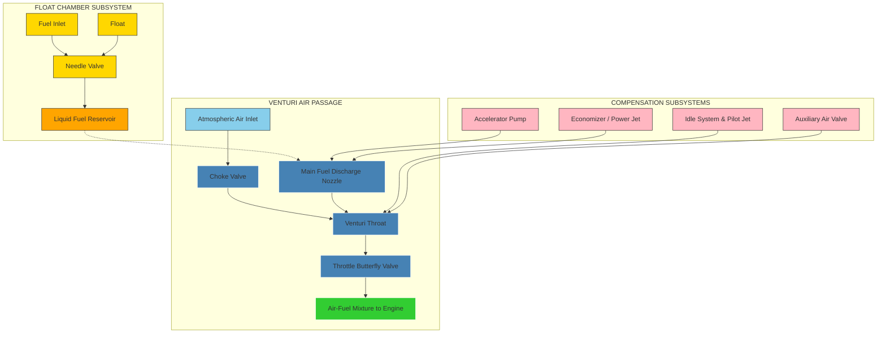
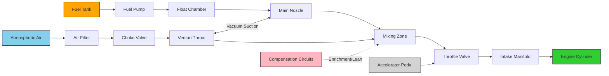
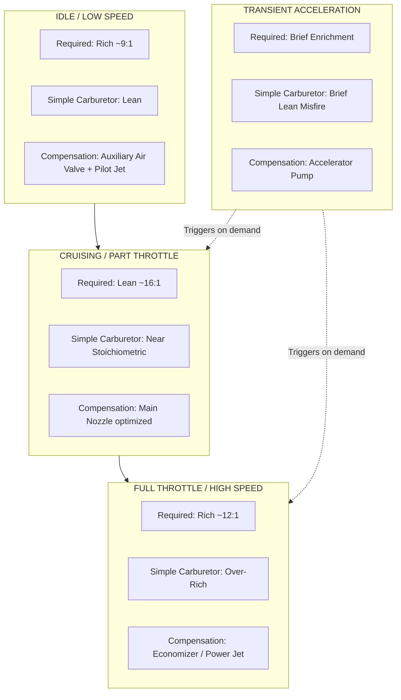

# Carburetion

<!-- SECTION_1_START -->

# Carburetion — Core Technical Definition & Intuitive Overview

## 📘 Formal Academic Definition (KTU 2024 Syllabus Terminology)

> [!IMPORTANT]
> **Carburetion** is the process of **atomizing, vaporizing, and mixing** the liquid fuel (typically petrol/gasoline) with the required quantity of air in the correct proportion to form a **combustible air–fuel mixture** suitable for spark-ignition (SI) internal combustion engines.

The device that performs this function is called a **Carburetor** (or Carburettor). It acts as the **metering and mixing unit** of the fuel supply system, drawing fuel from the float chamber and delivering it as a fine spray into the air stream entering the engine cylinders.

### Key Process Sub-Definitions
| Sub-process | Description |
|---|---|
| **Atomization** | Breaking liquid fuel into fine droplets for easy mixing with air |
| **Vaporization** | Conversion of fuel droplets into vapour form |
| **Mixing** | Uniform blending of fuel vapour with air in the correct ratio |

### The Stoichiometric Air–Fuel Ratio (A/F)
> [!NOTE]
> For complete combustion of petrol (assuming it is a hydrocarbon $C_8H_{18$ — octane):
> $$\text{Stoichiometric A/F ratio} = 14.7 : 1 \text{ (by mass)}$$
> This is the chemically **ideal ratio** (often shown as $\approx 15:1$ for practical petrol).

---

## 🧠 Conceptual Analogy / Intuitive Overview

> [!TIP]
> **Real-World Analogy — The Perfume Spray Bottle:**
> Imagine a perfume atomizer. When you press the bulb, air rushes across a tiny tube dipped in perfume. The **low pressure** created at the tube mouth (Bernoulli's principle) sucks the perfume up, and the **air blast** breaks it into a fine mist. A carburetor works on the *exact same principle* — the engine's intake stroke sucks air through a **Venturi** (a narrowed passage), creating a pressure drop that draws fuel out of a **nozzle** into the air stream as a fine spray.

### 🚗 The Driving Analogy
Think of a carburetor as a **bartender** for your engine:
- The **Venturi throat** = the cocktail shaker mouth (speeds up air)
- The **fuel nozzle** = the spirit bottle (releases fuel under vacuum)
- The **float chamber** = the bottle's level regulator (keeps fuel supply constant)
- The **throttle valve** = the tap that controls how fast the cocktail (mixture) flows to the customer (engine)

### Why Carburetion Matters
| Mixture Condition | A/F Ratio | Engine Behaviour |
|---|---|---|
| **Rich Mixture** | < 14.7 : 1 | More power, more unburnt fuel, more emissions |
| **Stoichiometric** | = 14.7 : 1 | Complete combustion, balanced |
| **Lean Mixture** | > 14.7 : 1 | Less power, more air, hotter exhaust, lean misfire risk |

> [!IMPORTANT]
> The carburetor must deliver **varying A/F ratios** for different operating conditions: **rich for starting/idling/power**, and **lean for cruising/economy**.

### Physical Constants & Standard Metrics (Bolded)
- **Atmospheric Pressure ($P_a$): 101.325 kPa (1.01325 bar)** at sea level
- **Density of Air ($\rho_a$): 1.225 kg/m³** at 15°C, 1 atm
- **Density of Petrol ($\rho_f$): $\approx 740 \text{ kg/m}^3$**
- **Stoichiometric A/F Ratio for petrol: 14.7:1**
- **Calorific Value of petrol: $\approx 44 \text{ MJ/kg}$**

---

> [!VISUALIZATION CONTROL]
> **Concept:** Venturi Pressure Drop vs. Throat Velocity
> **GeoGebra / Desmos Input Equations:**
> * `P_pressure(x) = P_atm - 0.5 * rho_air * (v(x))^2` (where v(x) is maximum at the throat)
> * Plot a horizontal line for $P_{atm}$ and a downward parabolic dip in the Venturi region.
> **Visual Description:** The student should observe $P_{atm}$ as a flat horizontal line, then a sharp **pressure drop curve** that dips at the Venturi throat, then recovers partially after the throat. This pressure drop is what **sucks fuel up** through the nozzle.

<!-- SECTION_1_END -->

<!-- SECTION_2_START -->

# Deep Theoretical Analysis & KTU High-Yield Formula Sheet

## 🔬 The Physics Behind Carburetion

### 1. Bernoulli's Principle (The Heart of the Carburetor)
When air flows through a **converging-diverging passage (Venturi)**, its **velocity increases** and its **pressure decreases**. This pressure drop is the fundamental driver of fuel suction in a simple carburetor.

$$P_a + \frac{1}{2}\rho_a V_a^2 = P_t + \frac{1}{2}\rho_a V_t^2$$

where:
- $P_a$ = Atmospheric pressure (upstream of Venturi)
- $V_a$ = Air velocity at Venturi inlet
- $P_t$ = Pressure at Venturi throat
- $V_t$ = Air velocity at Venturi throat
- $\rho_a$ = Density of air

The **pressure drop** at the throat:
$$\Delta P = P_a - P_t = \frac{1}{2}\rho_a (V_t^2 - V_a^2)$$

This $\Delta P$ acts as the **suction head** that draws fuel up the discharge nozzle.

---

### 2. Air–Fuel Ratio for a Simple Carburetor (Derivation Logic)

> [!NOTE]
> **Goal:** To derive the theoretical expression for the air–fuel (A/F) ratio delivered by a simple/elementary carburetor.

**Given:**
- $C_a$ = Coefficient of discharge for air through the Venturi
- $A_a$ = Cross-sectional area of the Venturi throat (m²)
- $C_f$ = Coefficient of discharge for fuel through the nozzle
- $A_f$ = Cross-sectional area of the fuel nozzle (m²)
- $H$ = Effective pressure head (vacuum) at the throat (m of fuel)
- $\rho_a$ = Density of air (kg/m³)
- $\rho_f$ = Density of fuel (kg/m³)
- $V_a$ = Velocity of air at throat (m/s)

**Step 1:** Mass flow rate of air
$$\dot{m}_a = C_a \cdot A_a \cdot \rho_a \cdot V_a$$

**Step 2:** Mass flow rate of fuel (driven by pressure head $H$)
$$\dot{m}_f = C_f \cdot A_f \cdot \rho_f \cdot \sqrt{2gH}$$

**Step 3:** The A/F ratio
$$\boxed{\frac{A}{F} = \frac{\dot{m}_a}{\dot{m}_f} = \frac{C_a \cdot A_a \cdot \rho_a \cdot V_a}{C_f \cdot A_f \cdot \rho_f \cdot \sqrt{2gH}}}$$

> [!TIP]
> **The KTU High-Yield Insight:** Since $V_a \propto V_t$ and by Bernoulli, $H \propto V_t^2$, the velocity terms in numerator and denominator scale to give a **roughly constant A/F ratio with varying throttle** — which is the **design intent of a simple carburetor**.

---

### 3. The "Perfect" Carburetor & Real Carburetor Discrepancy

A **perfect (ideal) carburetor** would deliver a constant A/F ratio at all throttle positions. In reality, this is **not achievable** with a single fixed nozzle, leading to the famous **simple carburetor limitations**:

| Operating Condition | Simple Carburetor Behaviour | Required A/F |
|---|---|---|
| **Idle / Low Speed** | Very low air velocity → very low $\Delta P$ → insufficient fuel suction → **lean mixture** | Rich (~9:1) |
| **Cruising / Medium Speed** | Moderate $\Delta P$ → reasonable fuel delivery | Lean (~16:1) |
| **High Speed / Full Throttle** | High air velocity → high $\Delta P$ → excess fuel → **rich mixture** | Slightly rich (~12:1) |

> [!WARNING]
> **KTU High-Yield:** The simple carburetor delivers **rich at high load and lean at low load** — which is **exactly the opposite** of what an engine needs. This is why **compensation devices** are mandatory in real carburetors.

---

### 4. Compensation Devices (Solving the Simple Carburetor Problem)

To overcome the limitations, **auxiliary systems** are added:

| Device | Function |
|---|---|
| **Auxiliary Air Valve** | Admits extra air at low throttle to lean the rich idle mixture |
| **Auxiliary Fuel Valve (Economizer)** | Bleeds air into the fuel nozzle at high loads to **lean** the over-rich mixture |
| **Power Jet / Power Enrichment** | Adds extra fuel at wide-open throttle (WOT) for maximum power |
| **Accelerator Pump** | Squirts an extra shot of fuel during sudden throttle opening (acceleration enrichment) |
| **Choke** | Restricts air intake at cold start to enrich the mixture |
| **Idle System** | Separate slow-running circuit with adjustment screw |
| **Slow-speed / Progression System** | Smooth transition from idle to cruising |

---

### 5. Types of Carburetors (KTU Classification)

| Classification | Examples |
|---|---|
| **By direction of airflow** | Downdraft, Sidedraft, Updraft |
| **By number of barrels** | Single-barrel, Two-barrel (dual), Four-barrel (quad) |
| **By construction** | Fixed-venturi, Variable-venturi (constant depression type) |
| **By compensation method** | Mechanical, Pneumatic, Electronic |

> [!NOTE]
> **KTU Standard:** The **downdraft carburetor** (air flows downward, gravity-assisted) is the most commonly used in passenger cars.

---

## 📋 KTU Formula Sheet / Cheat Sheet

| # | Formula / Relation | Description / Use |
|---|---|---|
| 1 | $P_a + \frac{1}{2}\rho_a V_a^2 = P_t + \frac{1}{2}\rho_a V_t^2$ | Bernoulli's equation across Venturi |
| 2 | $\Delta P = P_a - P_t = \frac{1}{2}\rho_a (V_t^2 - V_a^2)$ | Pressure drop at Venturi throat |
| 3 | $\dot{m}_a = C_a A_a \rho_a V_a$ | Mass flow rate of air |
| 4 | $\dot{m}_f = C_f A_f \rho_f \sqrt{2gH}$ | Mass flow rate of fuel |
| 5 | $\frac{A}{F} = \dfrac{C_a A_a \rho_a V_a}{C_f A_f \rho_f \sqrt{2gH}}$ | Air–Fuel ratio of simple carburetor |
| 6 | $\text{Stoichiometric A/F} = 14.7 : 1$ | Theoretical A/F for petrol |
| 7 | $H \propto V_t^2$ | Effective head depends on square of throat velocity |
| 8 | $\dot{V}_a = C_d A_t \sqrt{\dfrac{2 \Delta P}{\rho_a}}$ | Volumetric flow of air through throat |

> [!TIP]
> **Engineering Utility:** This carburetion theory is foundational for understanding **fuel injection systems** (PFI, GDI, MPFI) used in modern vehicles. The same Bernoulli's principle governs the **airflow meter** in EFI (Electronic Fuel Injection) systems.

<!-- SECTION_2_END -->

<!-- SECTION_3_START -->

# Step-by-Step Derivations & Symbolic Implementation

## 📐 Derivation 1: Air–Fuel Ratio of a Simple Carburetor (Full Derivation)

> **[KTU University Exam - July 2024, Module 2 | RBT: Apply | CO2]**

### Problem Setup
Consider a simple carburetor with a Venturi throat area $A_a$, fuel nozzle area $A_f$, with air velocity $V_a$ at the throat and effective fuel head $H$ (in metres of fuel column).

### Step-by-Step Derivation

**Step 1 — Apply the principle of continuity and discharge for air through the Venturi:**

The mass of air flowing per second through the throat is:
$$\dot{m}_a = C_a \cdot A_a \cdot \rho_a \cdot V_a$$

where $C_a$ is the coefficient of discharge for the air (typically $0.85$–$0.95$).

*Valuation key:* **[Defining air flow equation: 1 Mark]**

**Step 2 — Derive the fuel flow rate using Torricelli's theorem:**

The pressure difference $\Delta P$ (vacuum) at the throat causes fuel to rise in the nozzle. The velocity of fuel discharge (theoretical) is given by Torricelli's equation:
$$V_f = \sqrt{2gH}$$

where $H$ is the effective head in metres of fuel. Applying a discharge coefficient $C_f$:
$$V_{f, \text{actual}} = C_f \cdot \sqrt{2gH}$$

*Valuation key:* **[Applying Torricelli's theorem: 1 Mark]**

**Step 3 — Express the mass flow of fuel:**
$$\dot{m}_f = C_f \cdot A_f \cdot \rho_f \cdot \sqrt{2gH}$$

*Valuation key:* **[Mass flow of fuel: 1 Mark]**

**Step 4 — Compute the A/F ratio:**
$$\frac{A}{F} = \frac{\dot{m}_a}{\dot{m}_f} = \frac{C_a \cdot A_a \cdot \rho_a \cdot V_a}{C_f \cdot A_f \cdot \rho_f \cdot \sqrt{2gH}}$$

*Valuation key:* **[Final A/F expression: 1 Mark]**

**Step 5 — Express the effective head in terms of Venturi pressure drop:**

From Bernoulli's equation, the effective head in metres of fuel corresponding to the pressure drop $\Delta P = P_a - P_t$ at the throat is:
$$H = \frac{P_a - P_t}{\rho_f \cdot g} = \frac{\Delta P}{\rho_f \cdot g}$$

Substituting:
$$\frac{A}{F} = \frac{C_a \cdot A_a \cdot \rho_a \cdot V_a}{C_f \cdot A_f \cdot \rho_f \cdot \sqrt{2g \cdot \frac{\Delta P}{\rho_f g}}} = \frac{C_a \cdot A_a \cdot \rho_a \cdot V_a}{C_f \cdot A_f \cdot \rho_f \cdot \sqrt{\frac{2 \Delta P}{\rho_f}}}$$

*Valuation key:* **[Substitution of $H$ in terms of $\Delta P$: 2 Marks]**

**Step 6 — Final simplified form:**

$$\boxed{\frac{A}{F} = \frac{C_a \cdot A_a \cdot \rho_a \cdot V_a}{C_f \cdot A_f \cdot \sqrt{2 \rho_f \cdot \Delta P}}}$$

This is the **canonical KTU expression** for the simple carburetor's air–fuel ratio.

---

## 📐 Derivation 2: Numerical Problem — Compute A/F Ratio

> **[KTU University Exam - Dec 2023, Module 2 | RBT: Apply | CO2]**

### Problem
A simple carburetor has a Venturi throat diameter of $30 \text{ mm}$ and a fuel nozzle diameter of $1.5 \text{ mm}$. The air velocity at the throat is $40 \text{ m/s}$ and the effective fuel head is $2 \text{ mm}$ of petrol. Given:
- $C_a = 0.85$, $C_f = 0.70$
- $\rho_a = 1.2 \text{ kg/m}^3$, $\rho_f = 740 \text{ kg/m}^3$
- $g = 9.81 \text{ m/s}^2$

**Find:** The air–fuel ratio.

### Step-by-Step Solution

**Step 1 — Compute the throat area:**
$$A_a = \frac{\pi}{4} d_a^2 = \frac{\pi}{4} (0.030)^2 = 7.069 \times 10^{-4} \text{ m}^2$$

*Valuation key:* **[Area calculation: 1 Mark]**

**Step 2 — Compute the nozzle area:**
$$A_f = \frac{\pi}{4} d_f^2 = \frac{\pi}{4} (0.0015)^2 = 1.767 \times 10^{-6} \text{ m}^2$$

*Valuation key:* **[Nozzle area: 1 Mark]**

**Step 3 — Mass flow of air:**
$$\dot{m}_a = C_a \cdot A_a \cdot \rho_a \cdot V_a$$
$$\dot{m}_a = 0.85 \times 7.069 \times 10^{-4} \times 1.2 \times 40$$
$$\dot{m}_a = 0.85 \times 7.069 \times 10^{-4} \times 48$$
$$\dot{m}_a = 2.884 \times 10^{-2} \text{ kg/s}$$

*Valuation key:* **[Air flow: 1 Mark]**

**Step 4 — Effective head in metres:**
$$H = 2 \text{ mm} = 0.002 \text{ m}$$

**Step 5 — Fuel velocity by Torricelli:**
$$V_f = \sqrt{2 g H} = \sqrt{2 \times 9.81 \times 0.002} = \sqrt{0.03924} = 0.1981 \text{ m/s}$$

*Valuation key:* **[Fuel velocity: 1 Mark]**

**Step 6 — Mass flow of fuel:**
$$\dot{m}_f = C_f \cdot A_f \cdot \rho_f \cdot V_f$$
$$\dot{m}_f = 0.70 \times 1.767 \times 10^{-6} \times 740 \times 0.1981$$
$$\dot{m}_f = 1.813 \times 10^{-4} \text{ kg/s}$$

*Valuation key:* **[Fuel flow: 1 Mark]**

**Step 7 — Final A/F Ratio:**
$$\frac{A}{F} = \frac{\dot{m}_a}{\dot{m}_f} = \frac{2.884 \times 10^{-2}}{1.813 \times 10^{-4}} = 159.1$$

*Valuation key:* **[Final ratio: 1 Mark]**

$$\boxed{\frac{A}{F} = 159.1 : 1}$$

> [!IMPORTANT]
> **Observation:** The A/F ratio of $159.1:1$ is **extremely lean** because the fuel head $H$ is very small ($2 \text{ mm}$). In practice, the float level and head are tuned to give a stoichiometric ratio of $\approx 14.7:1$ at cruising conditions.

---

## 💻 Symbolic Python Implementation (Carburetor Modelling)

```python
from dataclasses import dataclass
import math
import logging

logging.basicConfig(level=logging.INFO, format="%(levelname)s: %(message)s")

@dataclass(frozen=True)
class CarburetorInputs:
    """Immutable container for carburetor geometric and fluid inputs."""
    C_a: float          # Coefficient of discharge for air
    A_a: float          # Venturi throat area [m^2]
    rho_a: float        # Density of air [kg/m^3]
    V_a: float          # Air velocity at throat [m/s]
    C_f: float          # Coefficient of discharge for fuel
    A_f: float          # Fuel nozzle area [m^2]
    rho_f: float        # Density of fuel [kg/m^3]
    g: float = 9.81     # Gravitational acceleration [m/s^2]
    H: float = 0.0      # Effective fuel head [m]


def compute_air_fuel_ratio(inp: CarburetorInputs) -> float:
    """
    Compute the air-to-fuel (A/F) ratio for a simple carburetor.
    
    Formula:
        A/F = (C_a * A_a * rho_a * V_a) / (C_f * A_f * rho_f * sqrt(2*g*H))
    """
    # Boundary checks
    if inp.A_a <= 0 or inp.A_f <= 0:
        raise ValueError("Throat and nozzle areas must be positive.")
    if inp.V_a <= 0:
        raise ValueError("Air velocity must be positive.")
    if inp.H < 0:
        raise ValueError("Fuel head H cannot be negative.")
    if inp.H == 0:
        logging.warning("Fuel head H = 0 -> division by zero. Returning inf.")
        return math.inf
    
    # Mass flow rate of air [kg/s]
    m_dot_a = inp.C_a * inp.A_a * inp.rho_a * inp.V_a
    logging.info(f"m_dot_a = {m_dot_a:.6e} kg/s")
    
    # Mass flow rate of fuel [kg/s]
    m_dot_f = inp.C_f * inp.A_f * inp.rho_f * math.sqrt(2.0 * inp.g * inp.H)
    logging.info(f"m_dot_f = {m_dot_f:.6e} kg/s")
    
    if m_dot_f == 0:
        raise ZeroDivisionError("Fuel mass flow is zero.")
    
    af_ratio = m_dot_a / m_dot_f
    logging.info(f"A/F = {af_ratio:.2f} : 1")
    return af_ratio


def compute_required_head(inp: CarburetorInputs, target_AF: float) -> float:
    """
    Back-calculate the fuel head H needed to deliver a target A/F ratio.
    """
    numerator = inp.C_a * inp.A_a * inp.rho_a * inp.V_a
    denominator = inp.C_f * inp.A_f * inp.rho_f * target_AF
    H_required = (numerator / denominator) ** 2 / (2.0 * inp.g)
    return H_required


# --- Example run ---
if __name__ == "__main__":
    inputs = CarburetorInputs(
        C_a=0.85, A_a=7.069e-4, rho_a=1.2, V_a=40.0,
        C_f=0.70, A_f=1.767e-6, rho_f=740.0, H=0.002
    )
    af = compute_air_fuel_ratio(inputs)
    print(f"\nComputed A/F ratio = {af:.2f} : 1\n")
    
    # Back-calculate for stoichiometric
    stoich_inputs = CarburetorInputs(
        C_a=0.85, A_a=7.069e-4, rho_a=1.2, V_a=40.0,
        C_f=0.70, A_f=1.767e-6, rho_f=740.0
    )
    H_stoich = compute_required_head(stoich_inputs, 14.7)
    print(f"Required head H for A/F=14.7 is H = {H_stoich*1000:.3f} mm of petrol")
```

> [!TIP]
> **Code Insight:** The Python `CarburetorInputs` dataclass uses **strict type and boundary checks** to model a real carburetor. The `compute_required_head` function is a **design tool** — given a desired A/F, it tells the engineer what float level to set.

---

## 🛠️ Carburetor Components & Their Functions (Laboratory/Design Reference)

| # | Component | Material / Standard | Function |
|---|---|---|---|
| 1 | **Float Chamber** | Cast iron / aluminium die-cast | Maintains constant fuel level |
| 2 | **Float** | Brass / hollow phenolic resin | Rises with fuel level, actuates needle valve |
| 3 | **Needle & Seat** | Hardened brass / stainless steel | Cuts off fuel when float chamber is full |
| 4 | **Venturi Tube** | Aluminium / zinc alloy | Accelerates air, creates low pressure |
| 5 | **Main Discharge Nozzle** | Brass | Atomizes fuel into Venturi air stream |
| 6 | **Throttle Valve (Butterfly)** | Steel disc on brass shaft | Controls airflow rate into engine |
| 7 | **Choke Valve** | Steel disc | Restricts air at cold start for rich mixture |
| 8 | **Accelerator Pump** | Phenolic piston + spring | Provides extra fuel on sudden throttle opening |
| 9 | **Economizer (Aux. Fuel Valve)** | Brass + spring | Leans out mixture at high loads |
| 10 | **Idle Air Bleed & Idle Fuel Passage** | Drilled passages | Supplies fuel for idle/low-speed operation |

<!-- SECTION_3_END -->

<!-- SECTION_4_START -->

# Structural Diagrams & Schematics

## 🗺️ Mermaid Block 1 — Simple Carburetor Functional Architecture



---

## 🗺️ Mermaid Block 2 — Sequential Processing Topology of Carburetor Operation



---

## 🗺️ Mermaid Block 3 — A/F Compensation Flow Across Engine Operating Range



> [!TIP]
> **Reading Guide for Students:** Each block in the Mermaid diagrams above uses colour coding — **blue** = air path, **orange** = fuel path, **green** = engine cylinder, **pink** = compensation devices. This makes the data flow of a real carburetor immediately intuitive.

<!-- SECTION_4_END -->

<!-- SECTION_5_START -->

# KTU 2024 Scheme Examination Question Bank & Topic Recap

## 📝 Part A — Short Answer Questions (3 Marks Each)

> **[KTU University Exam - Dec 2023 | RBT: Remember | CO1]**

### Q1. Define the term *carburetion*. State the stoichiometric air–fuel ratio for petrol.
**Model Answer (3 Marks):**
- **Definition (2 Marks):** Carburetion is the process of **atomizing, vaporizing, and mixing** the fuel (petrol) with air in the correct proportion to form a combustible mixture for an SI engine. The device used is called a **carburetor**.
- **Stoichiometric A/F Ratio (1 Mark):** The stoichiometric air–fuel ratio for petrol is **14.7 : 1 (by mass)**.

---

> **[KTU University Exam - July 2024 | RBT: Understand | CO1]**

### Q2. Explain the working of a simple carburetor with a neat sketch.
**Model Answer (3 Marks):**
- The simple carburetor has a **float chamber**, **Venturi throat**, **main discharge nozzle**, and a **throttle valve**.
- When the engine draws air through the Venturi, the air velocity increases and pressure drops (**Bernoulli's principle**).
- This pressure drop (vacuum) at the throat **sucks fuel up** the main nozzle.
- The fuel is **atomized** and mixes with air before entering the engine cylinder.

---

## 📝 Part B — 14-Mark Questions (ESE Module Internal Choice)

---

### **Question A (14 Marks)**

> **[KTU University Exam - July 2024, Module 2 | RBT: Understand + Apply | CO2]**

**(a)** With the help of a neat diagram, describe the **construction and working of a simple carburetor**. List the essential components. **(7 Marks)**

**Model Solution (Step-by-step):**

**Step 1 — Diagram description (2 Marks):**
Sketch a cross-section showing: float chamber with float, needle & seat, Venturi tube, main discharge nozzle, throttle valve at the exit, fuel inlet, and air inlet.

**Step 2 — Construction details (3 Marks):**
- **Float chamber:** Maintains fuel at a level just below the nozzle tip.
- **Float + Needle:** As fuel rises, the float rises and closes the needle valve.
- **Venturi:** Converging-diverging passage — throat diameter is smallest.
- **Main discharge nozzle:** Connected to float chamber, opens into the Venturi throat.
- **Throttle valve (butterfly):** Controls airflow and hence engine power.

**Step 3 — Working (2 Marks):**
Engine suction draws air through the Venturi. The pressure drop at the throat sucks fuel from the float chamber through the nozzle, which is then atomized and mixed with air. The throttle controls the engine speed by varying the air-fuel mixture flow.

---

**(b)** Derive the expression for the **air–fuel ratio** delivered by a simple carburetor. A simple carburetor has a throat diameter of $25 \text{ mm}$ and a fuel nozzle diameter of $1.2 \text{ mm}$. The air velocity at the throat is $35 \text{ m/s}$ and the effective fuel head is $3 \text{ mm}$ of petrol. Given $C_a = 0.85$, $C_f = 0.70$, $\rho_a = 1.2 \text{ kg/m}^3$, $\rho_f = 740 \text{ kg/m}^3$, $g = 9.81 \text{ m/s}^2$. **Calculate the A/F ratio.** **(7 Marks)**

**Model Solution:**

**Step 1 — Derivation (3 Marks):**

Mass flow of air: $\dot{m}_a = C_a A_a \rho_a V_a$

Mass flow of fuel: $\dot{m}_f = C_f A_f \rho_f \sqrt{2gH}$

Therefore:
$$\frac{A}{F} = \frac{C_a A_a \rho_a V_a}{C_f A_f \rho_f \sqrt{2gH}}$$

*Valuation key:* **[Correct symbolic derivation: 3 Marks]**

**Step 2 — Areas (1 Mark):**
$$A_a = \frac{\pi}{4}(0.025)^2 = 4.909 \times 10^{-4} \text{ m}^2$$
$$A_f = \frac{\pi}{4}(0.0012)^2 = 1.131 \times 10^{-6} \text{ m}^2$$

**Step 3 — Air flow (1 Mark):**
$$\dot{m}_a = 0.85 \times 4.909 \times 10^{-4} \times 1.2 \times 35 = 1.752 \times 10^{-2} \text{ kg/s}$$

**Step 4 — Fuel velocity and flow (1 Mark):**
$$V_f = \sqrt{2 \times 9.81 \times 0.003} = \sqrt{0.05886} = 0.2426 \text{ m/s}$$
$$\dot{m}_f = 0.70 \times 1.131 \times 10^{-6} \times 740 \times 0.2426 = 1.422 \times 10^{-4} \text{ kg/s}$$

*Valuation key:* **[Numerical flow rates: 2 Marks]**

**Step 5 — A/F ratio (1 Mark):**
$$\boxed{\frac{A}{F} = \frac{1.752 \times 10^{-2}}{1.422 \times 10^{-4}} = 123.2 : 1}$$

> [!WARNING]
> **KTU Examiner's Pitfall Callout (Part B-Q-A):**
> 1. **Skipping the diagram:** Most KTU examiners allot at least 1–2 marks for a labelled diagram. Always draw the simple carburetor with float, needle, Venturi, nozzle, and throttle.
> 2. **Mixing up $V_a$ and $V_t$:** The air velocity is at the **throat**, denoted $V_a$ in the KTU standard textbook. Do not confuse with velocity upstream.
> 3. **Unit error on $H$:** The head $H$ must be in **metres** before substituting into $\sqrt{2gH}$. A common mistake is to leave it in mm and forget the conversion.

---

### **Question B (14 Marks)** — *Alternative to Question A*

> **[KTU University Exam - Dec 2023, Module 2 | RBT: Understand + Apply | CO2]**

**(a)** Explain the **limitations of a simple carburetor**. Why are compensation devices necessary? **(7 Marks)**

**Model Solution:**

**Step 1 — Statement of limitations (2 Marks):**
A simple carburetor with a single fixed main nozzle and no compensation delivers a fuel flow that does **not match the engine's actual A/F requirements** across its operating range.

**Step 2 — Why it fails (3 Marks):**

| Condition | Required A/F | Simple Carburetor | Reason |
|---|---|---|---|
| Low speed / idle | Rich | Lean | Very low $\Delta P$ at throat, insufficient fuel suction |
| High speed / WOT | Slightly rich | Over-rich | $\Delta P \propto V_a^2$ — fuel flow grows faster than air flow |
| Acceleration | Brief rich | Brief lean | Sudden throttle opening causes momentary pressure imbalance |

**Step 3 — Compensation devices needed (2 Marks):**
To correct these deviations, the following are added:
- **Auxiliary air valve** for idle (admits extra air to lean idle)
- **Economizer / Power jet** for full throttle (adds extra fuel for power)
- **Accelerator pump** for transient acceleration
- **Choke** for cold starting (restricts air to enrich)
- **Slow-speed / progression system** for smooth transition

*Valuation key:* **[Tabular comparison of limitations: 2 Marks]; [Listing 4+ compensation devices: 1 Mark]; [Explanation of $V_a^2$ dependency: 1 Mark]**

---

**(b)** With a diagram, explain the working of an **accelerator pump** and an **economizer** in a modern carburetor. Why are these needed? **(7 Marks)**

**Model Solution:**

**Step 1 — Diagram of the accelerator pump and economizer circuits (2 Marks):**
Draw the carburetor with linkage from the throttle shaft to the pump piston, and the economizer's air-bleed tube leading from the main nozzle back to the float chamber.

**Step 2 — Accelerator pump working (2.5 Marks):**
- The pump piston is **mechanically linked** to the throttle shaft.
- When the throttle is **suddenly opened** (acceleration), the piston moves and **forces an extra squirt of fuel** through a discharge nozzle into the Venturi.
- This compensates for the temporary **lean misfire** that would otherwise occur.
- The pump action is **delayed by a spring-loaded check valve** so that the fuel is delivered precisely when needed.

**Step 3 — Economizer working (2.5 Marks):**
- The economizer is a **spring-loaded auxiliary valve** in the fuel line.
- At low loads, it remains **closed** and all fuel passes through the main nozzle.
- At high loads (high manifold vacuum drops), the spring overcomes and the valve **opens**, allowing **extra air to bleed** into the main fuel passage.
- This **leans** the otherwise over-rich mixture at WOT, improving fuel economy and reducing emissions.

*Valuation key:* **[Labeled diagram: 2 Marks]; [Piston-squirt mechanism: 1.5 Marks]; [Air-bleed mechanism: 1.5 Marks]**

> [!WARNING]
> **KTU Examiner's Pitfall Callout (Part B-Q-B):**
> 1. **Confusing accelerator pump with fuel pump:** The accelerator pump is **engine-driven** (from throttle linkage) and only fires on throttle **opening**, not continuously. Do not describe it as a regular fuel supply pump.
> 2. **Economizer direction:** Students often think the economizer *adds* fuel at high load. Actually, it **leans** the over-rich mixture by **bleeding air into the fuel**. Write this clearly.
> 3. **Choke vs. throttle confusion:** A choke restricts **air** (enriches mixture by reducing air). A throttle controls **both** air and fuel flow. Be precise in your explanations.

---

## 🧠 Topic Recap & Important Things to Remember

> [!TIP]
> **Rapid-Revision Checklist for Carburetion (Module 2)**

- ✅ **Carburetion** = atomization + vaporization + mixing of fuel with air in proper proportions.
- ✅ **Stoichiometric A/F ratio for petrol = 14.7 : 1** (by mass).
- ✅ The **simple carburetor** is governed by **Bernoulli's principle** at the Venturi throat.
- ✅ A/F ratio formula: $\dfrac{A}{F} = \dfrac{C_a A_a \rho_a V_a}{C_f A_f \rho_f \sqrt{2gH}}$ — memorize this canonical expression.
- ✅ **Pressure drop** at Venturi: $\Delta P = P_a - P_t = \frac{1}{2}\rho_a (V_t^2 - V_a^2)$.
- ✅ **Limitations of simple carburetor:** rich at high load, lean at low load, lean at sudden acceleration.
- ✅ **Compensation devices:** auxiliary air valve, economizer, power jet, accelerator pump, choke, idle system.
- ✅ **Choke** restricts air → rich mixture (for cold starting).
- ✅ **Throttle (butterfly) valve** controls engine speed and load by varying mixture flow.
- ✅ **Downdraft carburetor** is the standard in modern passenger cars.
- ✅ **Density of air** at standard conditions: $\rho_a = 1.225 \text{ kg/m}^3$; **petrol**: $\rho_f \approx 740 \text{ kg/m}^3$.
- ✅ **Effective head $H$** must be in **metres** before substituting into $\sqrt{2gH}$.
- ✅ The **float chamber** maintains fuel level just below the nozzle tip using a float and needle valve.
- ✅ **Modern relevance:** Even in fuel-injected vehicles, the **air-metering** portion of EFI uses the same Bernoulli physics.
- ✅ **Typical discharge coefficients:** $C_a \approx 0.85$–$0.95$, $C_f \approx 0.65$–$0.80$.

<!-- SECTION_5_END -->
