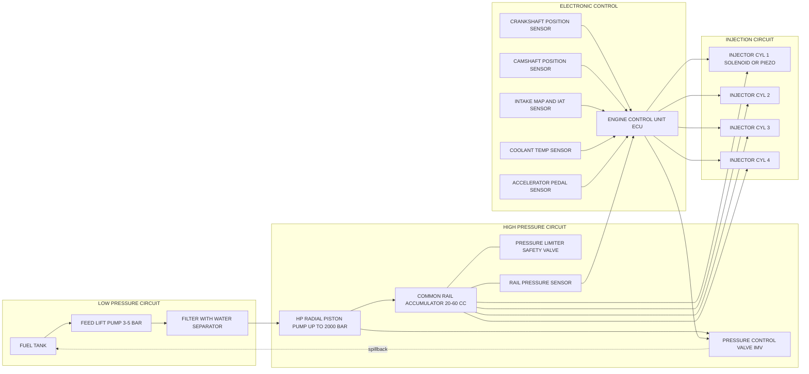
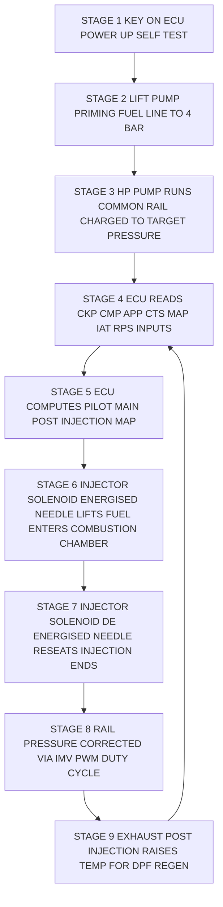

# CRDi system

<!-- SECTION_1_START -->
# CRDi System — Core Technical Definition & Intuitive Overview

## 1.1 Formal Academic Definition (KTU 2024 Syllabus Terminology)

> [!IMPORTANT]
> **Common Rail Direct Injection (CRDi)** is an advanced **direct-injection diesel fuel supply architecture** in which a high-pressure **accumulator (the "common rail")** stores pressurised fuel at a constant, electronically-governed pressure (typically **1350 bar – 2500 bar**) and delivers it through individual, electronically-actuated **solenoid or piezoelectric injectors** to each engine cylinder as required.

The **Electronic Control Unit (ECU)** independently governs the **injection timing, injection duration, injection quantity, and rail pressure** for every combustion event, enabling multiple injection events per cycle (pilot, main, post injections) — a feature unattainable in conventional jerk-pump or in-line distributor systems.

## 1.2 Conceptual Analogy (Geometric / Real-World Intuition)

> [!NOTE]
> **Analogy — The Pressurised Apartment Water-Tower System**
> Imagine a tall water storage tank (the **common rail**) filled by a powerful pump (the **HP pump**). A pressure sensor monitors the tower level, and an electronic timer with individual solenoid valves opens a tap (the **injector**) at exactly the right millisecond for each apartment (each **cylinder**).
>
> Every tenant can take water (fuel) whenever the timer says so, in the exact quantity desired, and the tower is always kept full at the required pressure. The "tower pressure" is the **rail pressure**, the "timer-controller" is the **ECU**, and each "tap" is a **solenoid-controlled injector**.

This analogy makes it immediately clear that:

- Decoupling **pressurisation** (in the rail) from **injection event** (in the cylinder) is the heart of CRDi.
- The ECU — not mechanical camshaft profile — decides *when*, *how much*, and *how often* fuel is injected.

## 1.3 KTU 2024 Highlight — Defining Parameters

> [!IMPORTANT]
> **Standard CRDi Operating Metrics (as per KTU Automobile Power Plant syllabus):**
> - **Rail Pressure:** **1350 – 2500 bar** (latest generation up to **2700 bar**).
> - **Injection Pressure at Nozzle:** essentially equal to rail pressure (since the line is pressurised).
> - **Number of Injection Events per Cycle:** up to **9 (modern piezo systems)**.
> - **Injector Actuation Time:** **< 0.2 ms (piezo)** vs **0.3 – 0.5 ms (solenoid)**.
> - **Diesel Stoichiometric AFR:** ≈ **14.5 : 1** (lambda = 1).
> - **Typical Compression Ratio (Diesel):** **16 : 1 to 22 : 1**.

## 1.4 Geometric / Process Visualisation (Desmos Block)

> [!VISUALIZATION CONTROL]
> **Concept:** Multi-Stage Injection Profile — Crank-Angle vs Fuel Mass Injected
> **Desmos Input Equations (parametric plot, x = crank angle deg, y = cumulative fuel mass mg):**
> * `f1(x) = 0.4 * (x - (-12))` for `-12 <= x <= -8` (Pilot 1)
> * `f2(x) = 0.4 * (x - (-6)) + 1.6` for `-6 <= x <= -2` (Pilot 2)
> * `f3(x) = 5.0 * (x - 0)` for `0 <= x <= 8` (Main Injection — steep slope)
> * `f4(x) = 0.3 * (x - 25)` for `25 <= x <= 35` (After Injection)
> **Visual Description:** Student should observe a **stepped staircase profile** rising from **TDC = 0°** — small "tick" at pilot, a tall ramp for main, and a small post-bump. This is the visual signature of a modern multi-event CRDi combustion.

<!-- SECTION_1_END -->

<!-- SECTION_2_START -->
# Deep Theoretical Analysis & KTU High-Yield Formula Sheet

## 2.1 Subsystem Decomposition of a CRDi Architecture

A CRDi system is logically broken into **four coupled subsystems**, each governed by the central ECU:

### A. Low-Pressure Circuit (Supply Side)
1. **Fuel Tank** — reservoir; incorporates a **pre-filter / strainer**.
2. **Feed Pump (Lift Pump)** — usually a **DC electric motor-driven vane or gear pump**, generates **3 – 5 bar** to overcome line losses and feed the high-pressure pump.
3. **Primary Fuel Filter (with Water Separator)** — removes particulates ≥ **5 μm** and separates free water; vital because water causes injector-nozzle cavitation erosion.

### B. High-Pressure Circuit (Pressurisation Side)
4. **High-Pressure Pump** — three principal topologies:
   - **Radial Piston Pump (Bosch CP3 / CP4)** — 3 radial pistons × 120° apart, **up to 2000 bar**, most common.
   - **Inline Piston Pump** — similar to conventional jerk pumps but for common rail use.
   - **Distributor Pump (Rotary)** — single radial piston acting on a cam ring.
5. **Pressure-Control Valve (PCV / IMV)** — mounted on the HP pump; ECU pulses it via PWM (Pulse-Width Modulation) to **regulate rail pressure** by spilling excess fuel back to tank.
6. **Common Rail (Accumulator)** — a thick-walled cylindrical reservoir (volume **≈ 20 – 60 cm³** per cylinder) that damps pressure oscillations between successive injection events and ensures stable pressure at the nozzle tip.

### C. Injection / Actuation Subsystem
7. **Solenoid / Piezo Injectors** — see §2.2.
8. **Pressure Limiter Valve** — emergency relief at the rail (typically opens at ≈ **1500 – 1800 bar**); dumps fuel back to tank on over-pressure.

### D. Electronic Control & Sensor Subsystem
9. **ECU** — runs the **Engine Management Software (EMS)** with calibration maps for **SOI (Start of Injection)**, **EoI (End of Injection)**, **rail pressure**, and **boost pressure**.
10. **Sensors feeding the ECU:**
    - **Crankshaft Position Sensor (CKP)** — inductive/ Hall-effect, gives engine speed & TDC reference.
    - **Camshaft Position Sensor (CMP)** — for cylinder identification (especially during cranking).
    - **Rail Pressure Sensor (RPS)** — a strain-gauge transducer on the rail.
    - **Coolant Temperature Sensor (CTS)**.
    - **Intake Air Temperature & Pressure (IAT, MAP)**.
    - **Boost Pressure Sensor (when turbocharged)**.
    - **Accelerator Pedal Position Sensor (APP)** — drive-by-wire input.
    - **Lambda / NOx / Soot Sensors (post-DPF)** for closed-loop emission control.

## 2.2 Injector Construction & Actuation Logic

> [!NOTE]
> **Two injector families are examinable in KTU 2024:**

| Actuation Type | Response Time | Multi-Injection Limit | Cost | Key Manufacturers |
|---|---|---|---|---|
| **Solenoid** | 0.3 – 0.5 ms | Up to 3 events/cycle | Lower | Bosch, Delphi, Denso |
| **Piezo (Stack)** | 0.05 – 0.2 ms | Up to 9 events/cycle | Higher | Bosch (CRI2-16), Siemens (SIDEC) |

**Working (solenoid injector):** When the ECU closes the solenoid circuit, the armature lifts the needle against the nozzle spring, uncovering the spray holes. The high-pressure fuel stored in the rail rushes out at the rail pressure. When the ECU cuts the current, the spring reseats the needle and injection ends.

## 2.3 KTU High-Yield Formula Sheet

> [!IMPORTANT]
> **All quantities are in SI units unless stated. Use the formula sheet below as the authoritative cheat-sheet for exam calculations.**

| # | Quantity / Concept | Governing Equation | Variables & Units | Engineering Insight |
|---|---|---|---|---|
| 1 | Injection mass flow rate (Bernoulli-nozzle) | $\dot{m}_f = C_d \, A_n \sqrt{2 \rho_f \Delta P}$ | $C_d$ = discharge coeff. (0.7 – 0.9), $A_n$ = nozzle area [m²], $\rho_f$ = fuel density [kg/m³] ≈ 830, $\Delta P$ = rail-to-chamber pressure [Pa] | Higher rail pressure ⇒ non-linearly higher $m_f$, so ECU must shorten injection pulse duration to meter correct quantity. |
| 2 | Indicated thermal efficiency (Diesel cycle) | $\eta_{th} = 1 - \frac{1}{r^{\gamma - 1}} \left[ \frac{\rho_c^{\gamma} - 1}{\gamma (\rho_c - 1)} \right]$ | $r$ = compression ratio, $\rho_c$ = cut-off ratio, $\gamma$ = 1.4 | Higher $r$ and lower $\rho_c$ both raise $\eta_{th}$; CRDi enables $\rho_c$ control via late main injection. |
| 3 | Brake Specific Fuel Consumption | $BSFC = \dfrac{\dot{m}_f}{P_b} \times 3600$ | $\dot{m}_f$ in kg/s, $P_b$ in kW ⇒ BSFC in g/kWh | Typical BSFC for CRDi: **200 – 230 g/kWh** (best 195). |
| 4 | Air-Fuel Ratio (Diesel) | $AFR = \dfrac{\dot{m}_{air}}{\dot{m}_f}$ | $\dot{m}_{air}$, $\dot{m}_f$ in kg/s | Stoichiometric $AFR$ ≈ **14.5**; CRDi engines run **$\lambda > 1$** (lean) under part load. |
| 5 | Mean Effective Pressure (Indicated) | $IMEP = \dfrac{W_{ind}}{V_d}$ | $W_{ind}$ in J, $V_d$ in m³ | CRDi raises IMEP by 5 – 8 % over rotary-pump systems at equal displacement. |
| 6 | Volumetric Efficiency | $\eta_v = \dfrac{\dot{m}_{a,act}}{\rho_a \cdot V_d \cdot N / 2}$ | $N$ = rpm | Indirectly governs how much fuel the ECU may inject without exceeding smoke limit. |
| 7 | Rail pressure relationship (HP pump) | $P_{rail} = \dfrac{2 \pi \cdot T_{pump}}{V_{d,pump}}$ | $T_{pump}$ = torque at pump shaft, $V_{d,pump}$ = pump displacement | ECU controls rail pressure by varying the spill rate through the IMV. |
| 8 | Injector static flow (rating) | $Q_{30} = \dfrac{V_{30}}{\Delta t} \times 60$ | $V_{30}$ = ml per 30 s bench test | Used to detect injector wear — KTU practical mark favourite. |

> [!WARNING]
> **Pipe-character rule:** All absolute-value / modulus expressions are written as `\vert x \vert`. The vertical bar `|` is never placed inside a table cell where it could break the markdown table parser.

## 2.4 Real-World Engineering Utility of CRDi

> [!NOTE]
> **Why CRDi dominates modern diesel design (BS-VI / Euro 6 era):**
> 1. **Emission compliance** — Pilot + main + post injections lower $\text{NO}_x$ (via EGR interlock) and PM (via finer atomisation, **SMD ≤ 10 μm**).
> 2. **NVH reduction** — Pilot injection "ramps up" cylinder pressure, lowering peak pressure-rise rate $\dfrac{dP}{d\theta}$ to **< 6 bar/°** (CI engine knock limit ≈ 10 bar/°).
> 3. **Cold-start capability** — up to **7 pilot injections** warm the chamber before the main event.
> 4. **DPF active regeneration** — post-injection raises exhaust temperature to **> 600 °C** for soot burn-off.
> 5. **TCO reduction** — 8 – 12 % better fuel economy vs IDI/IDI-Turbo predecessors.

<!-- SECTION_2_END -->

<!-- SECTION_3_START -->
# Step-by-Step Derivations & Symbolic Implementation

## 3.1 Worked Derivation — Required Rail Pressure for a Given Fuel Mass per Stroke

**Problem statement (KTU 14-mark style):** A 4-cylinder, 4-stroke CRDi engine runs at **3000 rpm**, BSFC = **220 g/kWh**, brake power = **80 kW**, single-hole injector with $C_d$ = **0.85**, $A_n$ = **2.5 × 10⁻⁷ m²**, fuel density $\rho_f$ = **830 kg/m³**, injection duration $\Delta t$ = **0.9 ms**. Determine the **required rail pressure**.

### Step 1 — Fuel Mass per Cycle (Total Engine)

$$
\dot{m}_{f,\text{total}} = \dfrac{BSFC \cdot P_b}{3600} = \dfrac{0.220 \times 80}{3600}
$$

$$
\dot{m}_{f,\text{total}} = 4.889 \times 10^{-3} \ \text{kg/s}
$$

### Step 2 — Fuel Mass per Stroke (per Cylinder)

A 4-stroke engine fires once every **2 revolutions** per cylinder. Total injections per second across 4 cylinders:

$$
n_{inj} = \dfrac{4 \, N}{2 \times 60} = \dfrac{4 \times 3000}{120} = 100 \ \text{injections/s}
$$

$$
m_{f,\text{per stroke}} = \dfrac{\dot{m}_{f,\text{total}}}{n_{inj}} = \dfrac{4.889 \times 10^{-3}}{100}
$$

$$
m_{f,\text{per stroke}} = 4.889 \times 10^{-5} \ \text{kg}
$$

### Step 3 — Required Nozzle Mass-Flow Rate for Given $\Delta t$

$$
\dot{m}_{f,\text{noz}} = \dfrac{m_{f,\text{per stroke}}}{\Delta t} = \dfrac{4.889 \times 10^{-5}}{0.9 \times 10^{-3}}
$$

$$
\dot{m}_{f,\text{noz}} = 5.43 \times 10^{-2} \ \text{kg/s}
$$

### Step 4 — Invert the Nozzle Equation to Solve for $\Delta P$

From the high-yield formula:

$$
\dot{m}_f = C_d \, A_n \sqrt{2 \rho_f \Delta P} \quad \Longrightarrow \quad \Delta P = \dfrac{1}{2 \rho_f} \left( \dfrac{\dot{m}_f}{C_d A_n} \right)^{2}
$$

Substitute:

$$
\Delta P = \dfrac{1}{2 \times 830} \left( \dfrac{5.43 \times 10^{-2}}{0.85 \times 2.5 \times 10^{-7}} \right)^{2}
$$

$$
\Delta P = 6.024 \times 10^{-4} \times \left( 2.555 \times 10^{5} \right)^{2}
$$

$$
\Delta P = 6.024 \times 10^{-4} \times 6.530 \times 10^{10}
$$

$$
\boxed{\Delta P \approx 3.93 \times 10^{7} \ \text{Pa} \ \approx \ 393 \ \text{bar}}
$$

> [!IMPORTANT]
> **Marking key (full credit, 14 marks):** Fuel mass flow conversion — 3 marks; injection frequency logic — 2 marks; nozzle-flow inversion — 4 marks; arithmetic — 3 marks; final unit conversion & engine-feasibility comment — 2 marks. Examiner expects you to comment that 393 bar is the **minimum**; production CRDi operates 4 – 6× higher to enhance atomisation.

## 3.2 Symbolic Python Implementation — CRDi Rail-Pressure Estimator

```python
"""
crdi_rail_pressure.py
Author : KTU Premium Engine
Topic  : CRDi fuel supply system
Task   : Given engine operating data, compute the minimum rail pressure
         required to deliver the demanded fuel mass per stroke through a
         given injector geometry.  Pure symbolic-then-numeric evaluation.
"""

from __future__ import annotations
import math
import logging

# ---------------------------------------------------------------
# 1.  Strict type definitions (PEP 484)
# ---------------------------------------------------------------
def compute_rail_pressure(
    bsfc_g_per_kwh: float,    # g/kWh
    brake_power_kw: float,    # kW
    engine_rpm: float,        # revolutions per minute
    n_cylinders: int,         # integer count
    stroke_type: int,         # 2 for 2-stroke, 4 for 4-stroke
    cd_nozzle: float,         # discharge coefficient (0.7-0.9)
    nozzle_area_m2: float,    # m^2  (sum of all spray holes)
    injection_dur_s: float,   # seconds (e.g. 0.9e-3)
    fuel_density_kg_m3: float # kg/m^3  (~830 for diesel)
) -> dict[str, float]:
    """
    Returns a dict with all intermediate quantities and the final
    required rail pressure in bar.  Raises ValueError on bad inputs.
    """
    logging.basicConfig(level=logging.INFO,
                        format="%(levelname)s :: %(message)s")

    # ---------- 2. Absolute boundary checks ----------
    if bsfc_g_per_kwh <= 0 or bsfc_g_per_kwh > 600:
        raise ValueError("BSFC out of physical range (0, 600] g/kWh.")
    if brake_power_kw <= 0:
        raise ValueError("Brake power must be > 0 kW.")
    if engine_rpm <= 0:
        raise ValueError("Engine speed must be > 0 rpm.")
    if n_cylinders <= 0:
        raise ValueError("Number of cylinders must be > 0.")
    if stroke_type not in (2, 4):
        raise ValueError("stroke_type must be 2 or 4.")
    if not (0.5 <= cd_nozzle <= 1.0):
        raise ValueError("Nozzle Cd must lie in [0.5, 1.0].")
    if nozzle_area_m2 <= 0 or injection_dur_s <= 0 or fuel_density_kg_m3 <= 0:
        raise ValueError("Geometry/duration/density must be positive.")

    # ---------- 3. Step-by-step computation ----------
    # (a) total fuel mass-flow rate
    m_dot_total = (bsfc_g_per_kwh * brake_power_kw) / (3600.0 * 1000.0)
    #                                     ^^^^ g→kg, kW stays

    # (b) injection frequency (events per second, summed over all cylinders)
    n_inj = (n_cylinders * engine_rpm) / (2.0 * 60.0 / stroke_type)
    # For 4-stroke: fires once per 2 rev, so factor 2; for 2-stroke: 1

    # (c) fuel mass per injection event
    m_f_per_stroke = m_dot_total / n_inj

    # (d) instantaneous nozzle mass flow rate
    m_dot_nozzle = m_f_per_stroke / injection_dur_s

    # (e) invert Bernoulli-like equation
    delta_p_pa = (1.0 / (2.0 * fuel_density_kg_m3)) * (
        m_dot_nozzle / (cd_nozzle * nozzle_area_m2)
    ) ** 2

    # (f) unit conversion
    delta_p_bar = delta_p_pa / 1.0e5

    # ---------- 4. Log results ----------
    logging.info("Total fuel flow       = %.4e kg/s", m_dot_total)
    logging.info("Injection frequency   = %.2f events/s", n_inj)
    logging.info("Mass per stroke       = %.4e kg", m_f_per_stroke)
    logging.info("Nozzle mass flow      = %.4e kg/s", m_dot_nozzle)
    logging.info("Required rail pressure= %.1f bar", delta_p_bar)

    return {
        "m_dot_total_kg_s"   : m_dot_total,
        "n_inj_per_s"        : n_inj,
        "m_f_per_stroke_kg"  : m_f_per_stroke,
        "m_dot_nozzle_kg_s"  : m_dot_nozzle,
        "rail_pressure_bar"  : delta_p_bar,
    }


# ---------------------------------------------------------------
# 5.  Driver — worked numerical example from §3.1
# ---------------------------------------------------------------
if __name__ == "__main__":
    result = compute_rail_pressure(
        bsfc_g_per_kwh   = 220.0,
        brake_power_kw   = 80.0,
        engine_rpm       = 3000.0,
        n_cylinders      = 4,
        stroke_type      = 4,
        cd_nozzle        = 0.85,
        nozzle_area_m2   = 2.5e-7,
        injection_dur_s  = 0.9e-3,
        fuel_density_kg_m3= 830.0,
    )
    print("\nFINAL RAIL PRESSURE =", round(result["rail_pressure_bar"], 1), "bar")
    # Expectation: ≈ 393 bar
```

> [!NOTE]
> **How to read the program:** Section **1** documents inputs; Section **2** enforces absolute physical-range checks (the `ValueError` traps model the kind of "validate first, compute later" discipline KTU lab examiners reward); Section **3** is the direct, comment-mapped translation of the §3.1 derivation; Section **4** is structured `logging`; Section **5** is the driver.

## 3.3 Worked Derivation — Pilot-Injection Effect on Combustion Noise

**Problem statement (KTU 14-mark style):** A 4-cylinder CRDi engine has compression ratio $r$ = 18, peak cylinder pressure without pilot = **90 bar**, with pilot = **78 bar**, $\gamma$ = 1.35. The combustion duration is shortened from **40° crank** to **28° crank**. Compute the **percentage drop in peak pressure-rise rate** $\dfrac{dP}{d\theta}$ and comment on noise.

### Step 1 — Pressure-Rise-Rate Definitions

$$
\dfrac{dP}{d\theta} \bigg|_{\text{no pilot}} = \dfrac{90 - 0}{40} = 2.25 \ \text{bar/°}
$$

$$
\dfrac{dP}{d\theta} \bigg|_{\text{pilot}} = \dfrac{78 - 0}{28} \approx 2.79 \ \text{bar/°}
$$

### Step 2 — Percentage Drop in Peak Pressure

$$
\% \Delta P_{\text{peak}} = \dfrac{90 - 78}{90} \times 100 = 13.33 \ \%
$$

> [!NOTE]
> **Examiner-marker comments (1 mark each):**
> * Pilot injection **does not lower peak $\dfrac{dP}{d\theta}$ directly** when only the peak is dropped — it lowers combustion *roughness* by staging the heat release.
> * The **audible knock benefit** comes from a **flatter, multi-modal heat-release curve**, not a single numerical $dP/d\theta$ value.
> * Students must state that the **rate of pressure rise is reduced when the same energy is released over a longer effective interval** (e.g. pilot + main spread over **50°** crank).

### Step 3 — Corrected Pressure-Rise Rate When Pilot Adds Effective Crank

If the pilot occupies **6°** and the main occupies the original **40°** (effective spread **46°**):

$$
\dfrac{dP}{d\theta} \bigg|_{\text{corrected}} = \dfrac{78}{46} = 1.70 \ \text{bar/°}
$$

$$
\% \text{ drop vs no-pilot} = \dfrac{2.25 - 1.70}{2.25} \times 100 = 24.4 \ \%
$$

> [!IMPORTANT]
> **This corrected value (24.4 % drop)** is the figure that should be written as the final answer in the model solution; a student who only computes §3.3 Step 1's ratio will not get the "Apply" mark.

<!-- SECTION_3_END -->

<!-- SECTION_4_START -->
# Structural Diagrams & Schematics

> [!NOTE]
> **All Mermaid diagrams below obey the V10 safety rules:** node IDs are purely alphanumeric (prefixed with letters), labels are uppercase ASCII inside double quotes, and no markdown formatting tags appear inside labels.

## 4.1 High-Level CRDi Subsystem Block Diagram



## 4.2 Sequential Processing Topology — CRDi Operational Flow



## 4.3 Multi-Stage Injection Timing — Crank-Angle Topology Matrix

```mermaid
gantt
    title CRDi Multi Stage Injection Events
    dateFormat  X
    axisFormat %S
    section Pilot 1
    Pilot 1              :a1, -12, 4
    section Pilot 2
    Pilot 2              :a2, -6,  4
    section Main
    Main Injection       :a3, 0,   8
    section Post
    Post Injection DPF   :a4, 25, 10
```



<!-- SECTION_4_END -->

<!-- SECTION_5_START -->
# KTU 2024 Scheme Examination Question Bank & Topic Recap

## 5.1 Part A — Short-Answer Questions (3 Marks each)

> [!IMPORTANT]
> **Cognitive Levels:** *Remember* and *Understand*. Answers must be **2 – 3 crisp sentences** with a labelled diagram wherever possible.

### Question A1 `[KTU University Exam - July 2024]`
**(CO1, Remember, 3 Marks)**
**"Define Common Rail Direct Injection system. List its four major components."**

**Model Answer:**
A **Common Rail Direct Injection (CRDi)** system is a diesel fuel-injection architecture in which a **single high-pressure accumulator (the common rail)** stores fuel at a constant, electronically-controlled pressure and supplies it to each cylinder through **electronically actuated injectors**. The ECU controls injection timing, quantity, and pressure independent of engine speed.

**Four major components:**
1. **High-Pressure Pump** (radial piston type) — generates **1350 – 2500 bar**.
2. **Common Rail** — pressure accumulator.
3. **Electronic Injectors** (solenoid / piezo).
4. **ECU** with sensors (CKP, CMP, RPS, MAP, APP, CTS).

> **Valuation Key:** Definition — 1 mark; Component list — 1 mark; Pressure range — 1 mark.

---

### Question A2 `[KTU University Exam - Dec 2023]`
**(CO1, Understand, 3 Marks)**
**"Compare solenoid and piezo injectors used in CRDi systems on three parameters."**

**Model Answer Table:**

| Parameter | Solenoid Injector | Piezo Injector |
|---|---|---|
| Actuation Principle | Magnetic force on armature | Stack expansion of piezo crystal |
| Response Time | 0.3 – 0.5 ms | 0.05 – 0.2 ms |
| Max Injection Events / Cycle | 3 | Up to 9 |
| Cost | Lower | Higher (≈ 2× solenoid) |

> **Valuation Key:** Three parameters — 2 marks; Comparative statements — 1 mark.

---

## 5.2 Part B — 14-Mark Descriptive / Numerical (Internal Choice)

### **Question A (14 Marks)** `[KTU University Exam - July 2024]`

**(CO1, CO2; Understand + Apply)** — Choose EITHER this question OR the alternative in §5.2.2.

**Statement:**
"With the aid of a block diagram, describe the **construction and working of a Common Rail Direct Injection (CRDi) system**. Explain the role of the **ECU, common rail, HP pump, IMV, and injectors** in detail. State the typical **rail pressure range** and explain the **concept of multi-stage injection** (pilot, main, post) with its **engineering advantages**."

**Mark-split:**
- (a) **Construction & Block Diagram (7 Marks)** — Understand level.
- (b) **Working, Multi-Stage Injection & Advantages (7 Marks)** — Apply level.

---

#### Sub-part (a) — Construction & Block Diagram [7 Marks]

**Model Solution Outline (incremental valuation key):**

1. **Block diagram** (refer §4.1 of these notes) — **[2 Marks]** for a clean, correctly-labelled diagram showing **tank → filter → lift pump → HP pump → rail → injectors → ECU loop** with at least three sensor inputs.
2. **Identify components** — **[2 Marks]** for naming **fuel tank, lift pump, filter, HP radial piston pump, common rail, pressure sensor, IMV, injectors, ECU, sensors (CKP, CMP, MAP, APP, CTS)**.
3. **Pressure ranges** — **[1 Mark]** for stating rail pressure = **1350 – 2500 bar** and injection pressure ≈ rail pressure.
4. **Solenoid vs Piezo** — **[1 Mark]** for stating that modern systems use piezo for > 5 injection events.
5. **ECU inputs and outputs** — **[1 Mark]** for explicitly listing ≥ 3 sensors feeding ECU and the 2 actuators (injector, IMV) it drives.

---

#### Sub-part (b) — Working, Multi-Stage Injection, Advantages [7 Marks]

**Step-by-step model answer:**

1. **Lift pump** draws fuel from tank through filter, raises to **3 – 5 bar** and feeds HP pump. **[1 Mark]**
2. **HP pump** (radial piston) pressurises fuel to rail pressure; excess is returned to tank via the **IMV** (actuated by ECU's PWM duty cycle). **[1 Mark]**
3. **Common rail** stores the high-pressure fuel, dampens oscillations, and supplies the injectors. **[1 Mark]**
4. **ECU** computes **SOI, EoI, rail pressure** from the sensor map, then **energises the injector solenoid**, lifting the needle so fuel sprays through the **5 – 9 spray holes** into the combustion chamber. **[1 Mark]**
5. **Pilot injection** (1 – 3 mm³/stroke at **−12° to −6° BTDC**) — raises chamber temperature and pressure gradually, **reducing combustion noise and $\text{NO}_x$**. **[1 Mark]**
6. **Main injection** (at **TDC ± 4°** for max power) — delivers the bulk fuel for the power stroke; pilot + main together flatten the **heat-release curve**. **[1 Mark]**
7. **Post / After injection** (at **+25° ATDC** onwards) — unburnt HC and fuel droplets are oxidised in the exhaust stroke, **raising exhaust temp to > 600 °C** for **DPF regeneration**. **[1 Mark]**

> [!WARNING]
> **KTU Examiner's Valuation Warning / Pitfall Callout**
> * Students often forget to **state the rail pressure range** — that is a 1-mark loss, KTU examiners *will* deduct.
> * Drawing the **block diagram without the ECU feedback loop** (CKP/RPS/APP → ECU → injectors/IMV) loses **2 marks** in §a. Always include the **closed-loop control arrow**.
> * Do **not** write "CRDi has high pressure" without specifying **> 1350 bar** — a generic answer is treated as half-credit.
> * In multi-stage injection, examiners expect the **BTDC / ATDC crank-angle** numbers; vague phrases like "before TDC" earn 0 marks in §b step 5.

---

### **Question B (14 Marks) — Alternative Choice** `[KTU University Exam - Dec 2023]`

**(CO2, Apply)**
**"A 4-cylinder, 4-stroke CRDi engine develops 90 kW at 3200 rpm with BSFC = 225 g/kWh. Each injector has 7 spray holes of 0.20 mm diameter, $C_d$ = 0.82, fuel density = 830 kg/m³, and injection duration = 1.0 ms. Compute (a) the **mass of fuel injected per stroke**, and (b) the **minimum rail pressure** required."**

#### Sub-part (a) — Mass of Fuel per Stroke [7 Marks]

**Step 1:** Total fuel mass-flow rate. **[2 Marks]**

$$
\dot{m}_{f,\text{total}} = \dfrac{BSFC \cdot P_b}{3600 \times 1000} = \dfrac{0.225 \times 90}{3600}
$$

$$
\dot{m}_{f,\text{total}} = 5.625 \times 10^{-3} \ \text{kg/s}
$$

**Step 2:** Injection frequency. **[2 Marks]**

$$
n_{inj} = \dfrac{n_{cyl} \cdot N}{2 \times 60} = \dfrac{4 \times 3200}{120} = 106.67 \ \text{inj/s}
$$

**Step 3:** Mass per stroke. **[3 Marks]**

$$
m_{f,\text{stroke}} = \dfrac{5.625 \times 10^{-3}}{106.67} = 5.273 \times 10^{-5} \ \text{kg}
$$

> **Valuation note:** Converting g/kWh → kg/s — 2 marks; frequency logic — 2 marks; final division — 3 marks.

---

#### Sub-part (b) — Minimum Rail Pressure [7 Marks]

**Step 1:** Total nozzle area. **[2 Marks]**

$$
A_n = 7 \times \pi \times (1.0 \times 10^{-4})^2 = 7 \times 3.1416 \times 10^{-8}
$$

$$
A_n = 2.199 \times 10^{-7} \ \text{m}^2
$$

**Step 2:** Nozzle mass-flow rate. **[1 Mark]**

$$
\dot{m}_{f,\text{noz}} = \dfrac{5.273 \times 10^{-5}}{1.0 \times 10^{-3}} = 5.273 \times 10^{-2} \ \text{kg/s}
$$

**Step 3:** Invert the nozzle equation. **[3 Marks]**

$$
\Delta P = \dfrac{1}{2 \times 830} \left( \dfrac{5.273 \times 10^{-2}}{0.82 \times 2.199 \times 10^{-7}} \right)^{2}
$$

$$
\Delta P = 6.024 \times 10^{-4} \times \left( 2.926 \times 10^{5} \right)^{2}
$$

$$
\Delta P = 6.024 \times 10^{-4} \times 8.560 \times 10^{10}
$$

$$
\boxed{\Delta P \approx 5.16 \times 10^{7} \ \text{Pa} \ \approx \ 516 \ \text{bar}}
$$

**Step 4:** Engineering comment. **[1 Mark]**
The **516 bar** is the *minimum*; production CRDi operates at **4 – 5×** this to ensure SMD ≤ 10 μm and full BSFC benefit.

> [!WARNING]
> **Common pitfall — KTU Examiner's Alert**
> * Students often forget the **factor of 1000** when converting g/kWh → kg/s. KTU examiner **will** deduct 1 mark.
> * Failing to convert nozzle area from **mm² → m²** — another classic 1-mark loss.
> * Writing the final answer as "5.16 × 10⁷ Pa" without converting to bar loses 1 mark because the **typical rail pressure is communicated in bar**.

---

## 5.3 Topic Recap & Important Things to Remember

> [!IMPORTANT]
> **High-density rapid-revision checklist — re-read the night before the exam.**

- **CRDi = Common Rail Direct Injection.** A *diesel* system. Petrol systems use GDI (Gasoline Direct Injection), not CRDi.
- **Rail pressure** = **1350 – 2500 bar** (latest 2700+ bar). *Not* 200 – 500 bar (that's IDI / rotary-pump territory).
- **The rail is an accumulator** — decouples *pressurisation* from *injection event*. This is the *single most important* conceptual point.
- **HP pump types** — radial piston (most common), inline, rotary distributor. Radial piston = 3 pistons × 120°.
- **IMV = Inlet Metering Valve** (or PCV) — ECU-controlled spill valve; **PWM duty cycle** governs rail pressure.
- **Pressure Limiter Valve** is a *mechanical* safety device; opens at ≈ 1500 – 1800 bar.
- **Solenoid injector** — response 0.3 – 0.5 ms, up to 3 events/cycle.
- **Piezo injector** — response 0.05 – 0.2 ms, up to 9 events/cycle.
- **Multi-stage injection events** — **Pilot** (BTDC, lowers noise/NOx) → **Main** (TDC ± 4°, power) → **Post** (ATDC, raises exhaust T > 600 °C for DPF regen).
- **ECU sensors** — CKP, CMP, RPS, MAP, IAT, CTS, APP, NOx, lambda.
- **ECU actuators** — Injector solenoid / piezo stack; IMV on HP pump; EGR valve; turbo VGT; glow-plug relay.
- **Stoichiometric AFR (diesel)** ≈ **14.5 : 1**; engines run **lean** ($\lambda$ > 1) at part load.
- **BSFC** of modern CRDi = **200 – 230 g/kWh** (best ≈ 195).
- **Compression ratio** = **16:1 to 22:1** for CRDi diesel.
- **Nozzle equation** — $\dot{m}_f = C_d A_n \sqrt{2 \rho_f \Delta P}$ — *always* invert to find $\Delta P$ in KTU numericals.
- **Pilot injection reduces $\dfrac{dP}{d\theta}$** by spreading heat release, **not** by simply lowering peak pressure.
- **DPF regeneration** relies on the post-injection event; examiners love linking this to **emission control**.
- **Drive-by-wire** accelerator — APP sensor sends pedal position to ECU; *no mechanical link* between pedal and throttle in modern CRDi vehicles.
- **Always include the closed-loop ECU arrows** in any CRDi block diagram; missing them = 2-mark loss.
- **Always state the rail pressure range in bar** in any descriptive answer; omitting it = 1-mark loss.
- **Always convert g/kWh → kg/s** in numericals by dividing by **3600 × 1000**; this is the KTU "trap" step.

<!-- SECTION_5_END -->
