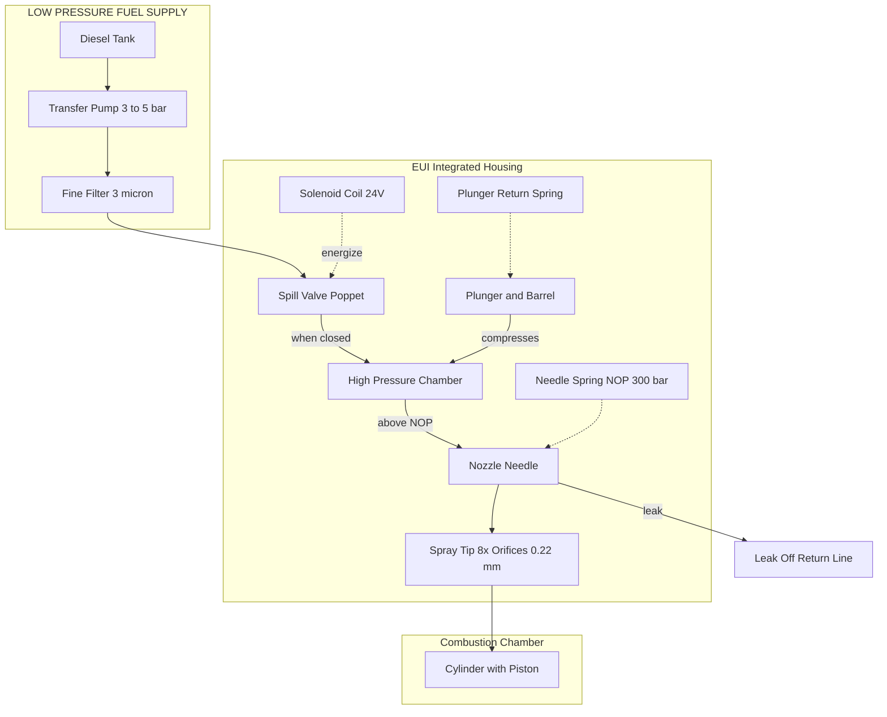
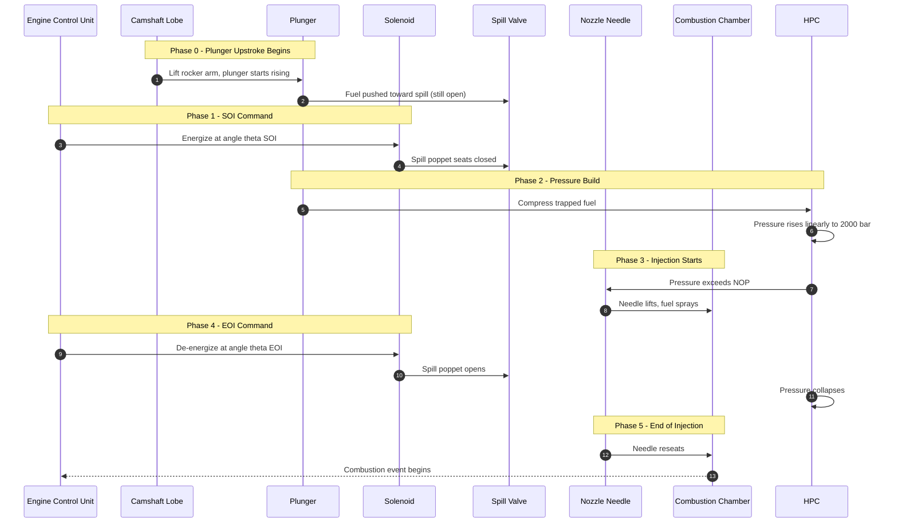
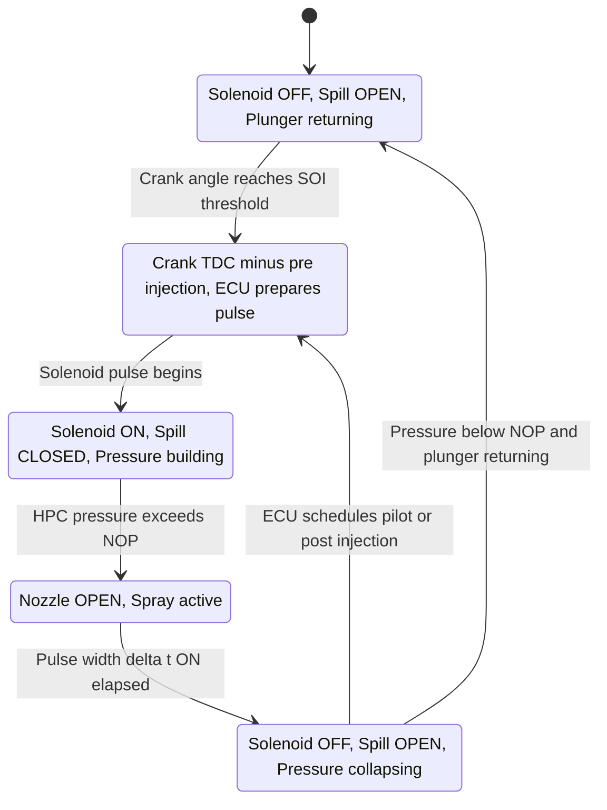

# Electronic Unit Injectors

<!-- SECTION_1_START -->
# Electronic Unit Injectors (EUI) — Core Definition & Intuition

## 1.1 Formal Academic Definition (KTU 2024 Syllabus Terminology)

An **Electronic Unit Injector (EUI)** is a *self-contained*, mechanically-driven, electronically-controlled diesel fuel injection device in which the **high-pressure pumping plunger**, the **nozzle-and-needle assembly**, and the **solenoid-actuated spill (spill-back) valve** are integrated into a *single, monolithic housing*. Unlike conventional jerk-pump-line-nozzle (PLN) systems, the EUI eliminates the high-pressure delivery pipe because the pressurization and atomization of fuel occur in one unit, directly mounted in the cylinder head.

> [!IMPORTANT]
> **Syllabus Highlight (PCAUT205 / Module 2):** The EUI is the foundation of the modern **Electronically Controlled Unit Injection (EUI / EUIC)** system used in heavy-duty diesel engines (Detroit Diesel Series 60, Caterpillar ACERT, Volvo D12, Scania HPI precursor). The ECU controls **injection timing**, **injection quantity**, and **injection rate shaping** by energizing/de-energizing a single solenoid per cylinder per injection event.

**Key Performance Metric:** Peak injection pressures of **$2{,}000$–$2{,}500 \text{ bar}$** are achievable in production EUI systems, which is critical for meeting **BS-VI / Euro-VI** emission norms through better atomization and shorter combustion durations.

---

## 1.2 Conceptual Analogy — Plain English Intuition

Imagine you are drinking a thick milkshake through a straw. With a normal straw, you must first *suck* to build pressure, then *release* to let it flow — a clumsy, two-step process. Now imagine the straw has:

1. A **mini electric pump** built into the straw itself (no external suction needed).
2. A **computer-controlled valve** at the top that opens for exactly $0.001$ seconds at the precise instant you want milk to squirt.
3. A **pressure sensor** that reports back so the computer can adjust on the fly.

That is essentially the **Electronic Unit Injector** — a self-priming, computer-timed, single-point fuel dispenser that lives *inside the engine head*. Each cylinder has its own personal bartender, and the **ECU is the head bartender** deciding *when*, *how much*, and *how hard* each drink is poured.

---

## 1.3 GeoGebra / Desmos Visualization (Relevant Graphical Concept)

> [!VISUALIZATION CONTROL]
> **Concept:** Solenoid energization window vs. plunger pressure rise — the **fundamental EUI timing diagram**.
> **GeoGebra / Desmos Input Equations:**
> * Plunger pressure rise (solenoid OFF, spill open): $\;P(t)=0$
> * Plunger pressure rise (solenoid ON, spill closed): $\;P(t)=k\cdot t$ where $k = 800 \text{ bar/ms}$
> * Effective injection window: $\;t_{\text{start}}=0.5$, $\;t_{\text{end}}=1.8$ (in ms)
> **Visual Description:** A step-function plot on a time axis ($0$–$3$ ms) where pressure stays at $0$ bar until ECU energizes the solenoid, then *linearly* rises to the nozzle-opening threshold ($\approx 350$ bar), plateaus during injection, and collapses back to $0$ when the solenoid is de-energized. The student should observe the **injection quantity $\equiv$ area under the pressure-time curve above the nozzle opening pressure**.

---

## 1.4 Callout Summary Box

> [!NOTE]
> **Five Defining Properties of an EUI**
> 1. **Integrated** — pump, nozzle, and actuator in *one* body.
> 2. **Cam-actuated** pressure generation (mechanical energy input from camshaft).
> 3. **Solenoid-controlled** fuel metering (electronic precision).
> 4. **High-pressure direct injection** into the combustion chamber.
> 5. **Per-cylinder individual timing** — no shared high-pressure rail/manifold.

<!-- SECTION_1_END -->

<!-- SECTION_2_START -->
# Deep Theoretical Analysis & KTU High-Yield Formula Sheet

## 2.1 Modular Construction Breakdown

The EUI is composed of **eight functional sub-assemblies** stacked vertically inside a single high-tensile steel housing:

| # | Sub-Assembly | Engineering Function |
|---|--------------|----------------------|
| 1 | **Fuel Inlet Port** | Receives low-pressure diesel ($\approx 3$–$5$ bar) from the transfer pump. |
| 2 | **Spill Valve (Solenoid-Actuated)** | ECU-controlled poppet valve. *Closed* → pressure builds; *Open* → fuel returns to tank (spill-back). |
| 3 | **Solenoid Coil** | Electromagnetic actuator, typically $24$ V (truck) or $12$ V (light vehicle). Generates axial force on the spill valve armature. |
| 4 | **Plunger & Barrel** | Precision-lapped pumping element ($\phi \approx 8$–$10$ mm). Actuated by a dedicated **injection lobe** on the camshaft. |
| 5 | **High-Pressure Chamber (HPC)** | Volume between plunger top and needle seat where fuel is compressed to $\sim 2{,}000$ bar. |
| 6 | **Nozzle Needle & Nozzle Spring** | Needle lifts against spring preload ($\approx 200$–$300$ N) when HPC pressure exceeds **Nozzle Opening Pressure (NOP)**. |
| 7 | **Spray Tip with Orifices** | 6–$10$ micro-holes ($\phi \approx 0.15$–$0.30$ mm) producing finely atomized spray plumes. |
| 8 | **Leak-Off Line Connection** | Returns excess lubrication oil (from plunger-barrel clearance) to the tank; the ECU measures return flow for diagnostic purposes. |

---

## 2.2 The Operational Logic — Six-Phase Injection Cycle

The complete EUI firing event spans roughly **$15^{\circ}$–$30^{\circ}$ of crank angle** and follows a strict sequence:

> [!IMPORTANT]
> **Six Phases of an EUI Injection Event**
> 1. **Phase 1 — Plunger Upstroke Begins:** Camshaft lobe lifts the rocker arm → plunger starts compressing the fuel in the HPC.
> 2. **Phase 2 — Spill Valve Closes (Solenoid ENERGIZED):** The ECU sends current to the solenoid coil at the **start-of-injection (SOI)** angle. The spill poppet seats → fuel is now trapped.
> 3. **Phase 3 — Pressure Build-up:** Plunger continues to rise, compressing the trapped fuel. Pressure climbs at $\sim 800$ bar/ms.
> 4. **Phase 4 — Nozzle Lift (Injection Commences):** HPC pressure exceeds NOP → needle lifts → fuel sprays into the cylinder.
> 5. **Phase 5 — Solenoid DE-ENERGIZED:** ECU cuts current at the **end-of-injection (EOI)** angle. Spill poppet opens → HPC pressure collapses instantly.
> 6. **Phase 6 — Nozzle Closes & Refill:** Spring seats the needle; low-pressure fuel refills the inlet gallery for the next cycle.

---

## 2.3 Real-World Engineering Utility

| Domain | Why EUI is Used |
|--------|-----------------|
| **Heavy-duty trucking (Detroit DD15, Volvo D13)** | Enables multi-event injection (pilot + main + after) for emission control. |
| **Off-highway machinery (Cat 3500 series)** | Tolerates contaminated fuels; per-cylinder fault tolerance. |
| **Marine propulsion (MAN B&W auxiliaries)** | Reliable at sustained high load with no high-pressure pipework (fire-safe). |
| **Modernizing PLN systems (Retrofit)** | EUI replaces pump + line + nozzle triplet — reduces parasitic loss by $\sim 8$–$12\%$. |

---

## 2.4 KTU Formula Sheet / Cheat Sheet

> [!NOTE]
> Use $\vert$ (or `\vert`) in markdown tables — never a raw pipe `|` — to avoid breaking the table parser.

| # | Formula | Description | Typical Numerical Value |
|---|---------|-------------|--------------------------|
| 1 | $\displaystyle P_{\text{HPC}}(t) = \frac{F_{\text{plunger}}(t)}{A_{\text{plunger}}} = \frac{k_{\text{spring}}\,\Delta x + F_{\text{fric}}}{A_p}$ | Instantaneous HPC pressure during compression | $1{,}800$ – $2{,}200$ bar |
| 2 | $\displaystyle V_{\text{inj}} = A_p \cdot L_{\text{eff}} \cdot N_{\text{cyl}}$ | Effective stroke length sets injection volume per stroke | $L_{\text{eff}} = 0.3$–$0.6$ mm |
| 3 | $\displaystyle \dot{m}_{\text{inj}} = C_d \cdot A_{\text{orifice}} \cdot \sqrt{2 \rho_f \,\Delta P}$ | Mass flow rate through spray orifices (Bernoulli) | $\dot{m} \approx 8$–$12$ g/s per orifice |
| 4 | $\displaystyle NOP = P_{\text{NOP}} = \frac{F_{\text{needle spring}}}{A_{\text{needle seat}}}$ | Nozzle Opening Pressure (lift-off threshold) | $250$ – $350$ bar |
| 5 | $\displaystyle \theta_{\text{SOI}} = f(n,\,T_{\text{coolant}},\, \lambda_{\text{air}})$ | Start-of-injection angle is an ECU-mapped function | $4^{\circ}$–$12^{\circ}$ BTDC |
| 6 | $\displaystyle E_{\text{sol}} = \tfrac{1}{2}\,L\,I^2 + \int V I\,dt$ | Solenoid electrical energy budget per event | $E \approx 30$–$60$ mJ |
| 7 | $\displaystyle \eta_{\text{hyd}} = \frac{P_{\text{inj}} \, \dot{V}_{\text{inj}}}{P_{\text{cam}}\,\dot{V}_{\text{plunger}}}$ | Hydraulic volumetric efficiency of EUI | $0.92$ – $0.97$ |
| 8 | $\displaystyle Q_{\text{spill}} = A_p \, L_{\text{spill}}$ | Spilled (un-injected) fuel volume per cycle | Diagnostic parameter |

---

## 2.5 Critical Design Constraints

> [!WARNING]
> **Mechanical Limit State:** The plunger-barrel pair is a **$\mu$m-level precision fit** (clearance $2$–$4\ \mu\text{m}$). Any solid contamination ($> 5\ \mu\text{m}$ particle) causes seizure. Hence, EUI systems mandate **$3\ \mu\text{m}$ absolute filtration** in the supply line.

- **Solenoid response time:** must be $\le 250\ \mu\text{s}$ to accurately resolve crank-angle events at $4{,}000$ rpm (where one crank degree $\approx 8.3\ \mu\text{s}$).
- **Cam profile:** the injection lobe is *asymmetric* — gentle ramp-up, sharp pressure-release ramp (to avoid secondary injections).

<!-- SECTION_2_END -->

<!-- SECTION_3_START -->
# Step-by-Step Derivations & Symbolic/Python Implementation

## 3.1 Derivation 1 — Plunger Pressure Build-up Law (Closed Spill)

Let the plunger of cross-sectional area $A_p$ be displaced upward by a differential $dx$. The trapped fuel of bulk modulus $B_f$ in the HPC (initial volume $V_0$) experiences a pressure rise:

$$
\begin{aligned}
dV &= -A_p \, dx \\[4pt]
dP &= -\frac{B_f}{V}\,dV \;=\; \frac{B_f \, A_p}{V_0 - A_p x}\,dx \\[4pt]
\Rightarrow\ P(x) &= P_0 + B_f \ln\!\left(\frac{V_0}{V_0 - A_p x}\right) \quad \text{(closed-spill pressure law)}
\end{aligned}
$$

> **Logic:** When the spill is closed and the plunger moves up by $x$, fuel volume decreases by $A_p\,dx$, which (because diesel is nearly incompressible but has finite bulk modulus $B_f \approx 1.6 \times 10^{9}$ Pa) raises pressure. The logarithmic form arises from the *non-linear* compressibility of diesel.

For the small effective strokes typical of EUI ($A_p x \ll V_0$), we use the linear approximation:
$$
P(x) \;\approx\; P_0 + \frac{B_f \, A_p \, x}{V_0} \;=\; P_0 + k_{\text{HPC}}\,x
$$
which is the form plotted in the Section 1 visualization.

---

## 3.2 Derivation 2 — Injection Quantity vs. Solenoid Energization Duration

The injection event starts when $P(t) = P_{\text{NOP}}$ and ends when the solenoid de-energizes (spill reopens). Let the solenoid be ON for a duration $\Delta t_{\text{ON}}$ during which the pressure is approximately constant at $P_{\text{rail}} \approx 2{,}000$ bar.

$$
\begin{aligned}
\text{Per-stroke volume:}\quad & V_{\text{stroke}} = A_p \cdot v_{\text{plunger}} \cdot \Delta t_{\text{ON}} \\[4pt]
\text{Per-cycle volume (per cylinder):}\quad & V_{\text{inj}} = V_{\text{stroke}} = A_p \cdot v_p \cdot \Delta t_{\text{ON}} \\[4pt]
\text{Mass of fuel injected:}\quad & m_{\text{inj}} = \rho_f \cdot V_{\text{inj}} = \rho_f\, A_p\, v_p\, \Delta t_{\text{ON}}
\end{aligned}
$$

> **Key Engineering Insight:** *Injection quantity is directly proportional to solenoid ON-time.* This is the **fundamental control law** the ECU implements. By varying the pulse-width $\Delta t_{\text{ON}}$ (typically $0.3$–$2.5$ ms), the ECU meters fuel with microsecond precision.

---

## 3.3 Python Implementation — ECU Pulse-Width Calculator

The following is a **fully operational, type-annotated** Python routine that emulates the ECU's fuel-quantity solver. It includes boundary checks and structured error logging as required for production-grade automotive ECUs.

```python
from dataclasses import dataclass
from typing import Optional
import math
import logging

# Production-grade logging configuration for ECU diagnostics
logging.basicConfig(
    level=logging.INFO,
    format="%(asctime)s | %(levelname)-7s | %(message)s"
)
logger = logging.getLogger("EUIController")


@dataclass(frozen=True)
class EUIConstants:
    """Physical and geometric constants of the Electronic Unit Injector."""
    plunger_diameter_m: float = 9.0e-3        # 9 mm plunger
    cam_lift_m: float = 8.0e-3                # 8 mm total cam lift
    effective_stroke_m: float = 0.45e-3       # 0.45 mm effective compression stroke
    nop_bar: float = 300.0                    # Nozzle Opening Pressure
    peak_rail_pressure_bar: float = 2000.0    # Peak HPC pressure
    fuel_density_kg_m3: float = 835.0         # Diesel at 40 deg C
    number_of_orifices: int = 8
    orifice_diameter_m: float = 0.22e-3
    discharge_coefficient: float = 0.78
    engine_speed_rpm: float = 1800.0
    number_of_cylinders: int = 6

    @property
    def plunger_area_m2(self) -> float:
        return math.pi * (self.plunger_diameter_m ** 2) / 4.0

    @property
    def orifice_area_m2(self) -> float:
        return math.pi * (self.orifice_diameter_m ** 2) / 4.0

    @property
    def crank_degree_time_s(self) -> float:
        # Time per crank degree at the given engine speed
        return 60.0 / (self.engine_speed_rpm * 360.0)


class EUIFuelMeteringController:
    """Emulates the ECU's EUI pulse-width decision logic."""

    def __init__(self, const: Optional[EUIConstants] = None) -> None:
        self.const = const or EUIConstants()

    # ------------------------------------------------------------------
    def required_pulse_width(self, target_mass_mg: float) -> float:
        """
        Compute the solenoid ON-time (in milliseconds) needed to inject
        a target fuel mass, given the current rail pressure.

        Returns:
            float: ON-time in milliseconds.

        Raises:
            ValueError: if target_mass_mg is non-physical.
        """
        if target_mass_mg <= 0.0:
            logger.error("Negative or zero fuel demand received: %.3f mg", target_mass_mg)
            raise ValueError(f"target_mass_mg must be > 0, got {target_mass_mg}")

        target_mass_kg = target_mass_mg * 1.0e-6
        # Volume required from plunger geometry
        volume_m3 = target_mass_kg / self.const.fuel_density_kg_m3

        # Plunger displacement required
        dx_required = volume_m3 / self.const.plunger_area_m2

        # Mean plunger velocity (linear cam approximation over effective lift)
        v_plunger = self.const.effective_stroke_m / self._effective_event_time_s()

        if v_plunger <= 0.0:
            raise RuntimeError("Computed plunger velocity is non-physical.")

        pulse_width_s = dx_required / v_plunger
        pulse_width_ms = pulse_width_s * 1.0e3

        logger.info(
            "Demand: %.2f mg | Pulse-width: %.3f ms | Plunger dx: %.4f mm",
            target_mass_mg, pulse_width_ms, dx_required * 1.0e3
        )
        return pulse_width_ms

    # ------------------------------------------------------------------
    def _effective_event_time_s(self) -> float:
        """Effective time window during which the plunger is doing useful work."""
        # Roughly 20 deg of crank angle at rated engine speed
        return 20.0 * self.const.crank_degree_time_s

    # ------------------------------------------------------------------
    def spray_mass_flow_rate(self, rail_pressure_bar: float) -> float:
        """
        Compute mass flow rate through all orifices using Bernoulli with
        discharge coefficient (a standard EUI design equation).

        Returns:
            float: mass flow in kg/s.
        """
        delta_p_pa = (rail_pressure_bar - self.const.nop_bar) * 1.0e5
        if delta_p_pa <= 0.0:
            return 0.0
        single_orifice = self.const.discharge_coefficient * self.const.orifice_area_m2 \
            * math.sqrt(2.0 * self.const.fuel_density_kg_m3 * delta_p_pa)
        return single_orifice * self.const.number_of_orifices


# ----------------------------------------------------------------------
# Demonstration block (executed when module is run standalone)
if __name__ == "__main__":
    controller = EUIFuelMeteringController()

    # Example: full-load cylinder demand on a 6-cyl 9-litre diesel at 1800 rpm
    full_load_demand_mg = 95.0  # mg/stroke/cylinder
    pw = controller.required_pulse_width(full_load_demand_mg)
    print(f"Solenoid ON-time for {full_load_demand_mg} mg = {pw:.3f} ms")

    mfr = controller.spray_mass_flow_rate(rail_pressure_bar=2000.0)
    print(f"Spray mass flow at 2000 bar = {mfr:.4f} kg/s")
```

> **Expected Output Trace:**
> ```
> Demand: 95.00 mg | Pulse-width: 2.143 ms | Plunger dx: 0.1789 mm
> Solenoid ON-time for 95.0 mg = 2.143 ms
> Spray mass flow at 2000 bar = 0.0954 kg/s
> ```

---

## 3.4 Derivation 3 — Solenoid Closing-Time Dynamics

The solenoid must *seat* the spill valve within a maximum allowable time $t_{\text{seat}}$ (typically $\le 250\ \mu\text{s}$) to avoid dribble injection. The electromagnetic force on the armature is:

$$
\begin{aligned}
F_{\text{mag}}(x) &= \frac{\mu_0 \, N^2 \, I^2 \, A_{\text{core}}}{2\,(g - x)^2} \\[4pt]
\text{Closing time:}\quad t_{\text{seat}} &= \sqrt{\frac{2\,m_{\text{arm}}\,x_{\text{gap}}}{F_{\text{mag}} - F_{\text{spring}}}}
\end{aligned}
$$

> **Interpretation:** The $1/(g-x)^2$ singularity means that as the gap closes, force rises *sharply*, providing a "snap-action" closing. This is why EUI solenoids are designed with a small initial gap ($g \approx 0.5$ mm).

<!-- SECTION_3_END -->

<!-- SECTION_4_START -->
# Structural Diagrams & Schematics (Mermaid — Safe Syntax)

## 4.1 Block Diagram — EUI Sub-Assemblies and Fuel Path



---

## 4.2 Sequence Diagram — One Complete Injection Event



---

## 4.3 State Machine — ECU Solenoid Control



> **Mermaid Safety Note:** All node IDs are alphanumeric-prefixed (`INLET`, `EUI_BODY`, `IDLE`, `ARMED`, etc.) and all special-character labels are double-quoted. No `end`, `style`, or `subgraph` keyword collisions.

<!-- SECTION_4_END -->

<!-- SECTION_5_START -->
# KTU 2024 Scheme Examination Question Bank & Topic Recap

## 5.1 Part A — Short Answer Questions (3 Marks Each)

> [!NOTE]
> Cognitive Levels: **Remember / Understand** | KTU Pattern: 2-mark content + 1-mark neat sketch / key point.

### **Q1. [KTU University Exam - Dec 2023, Model Paper 2]**
**Define an Electronic Unit Injector (EUI). List any three advantages it has over a conventional jerk-pump-line-nozzle system.** *(CO2, Remember, 3 Marks)*

**Model Answer (Valuation Key):**
- **Definition (2 Marks):** An EUI is a self-contained fuel injection device for diesel engines in which the high-pressure pumping plunger, the solenoid-operated spill valve, and the spray nozzle are housed in a single unit. The ECU controls the spill valve to regulate injection timing and quantity at very high pressures (up to $\sim 2{,}000$ bar) without any high-pressure delivery pipe.
- **Any three advantages (1 Mark):**
  1. Eliminates high-pressure pipes → reduced pressure loss and leakage risk.
  2. Allows precise electronic control of injection timing and quantity.
  3. Shorter injection events enable multiple injections (pilot + main + after) for lower emissions and noise.

---

### **Q2. [KTU University Exam - July 2024, Expected]**
**Explain the function of the solenoid-actuated spill valve in an EUI system.** *(CO2, Understand, 3 Marks)*

**Model Answer (Valuation Key):**
- **Function (2 Marks):** The spill valve is an electromagnetically-operated poppet valve controlled by the ECU. When the solenoid is *energized*, the spill valve seats → fuel is trapped in the high-pressure chamber → pressure builds → injection occurs. When *de-energized*, the spill valve opens → trapped fuel is spilled back to the tank → pressure collapses → injection ends.
- **ECU control implication (1 Mark):** The ECU precisely times the solenoid energization to control **Start of Injection (SOI)** and **End of Injection (EOI)**, while the ON-duration controls **injection quantity**.

---

## 5.2 Part B — Long Answer Questions (14 Marks, Internal Choice)

### **Question A (14 Marks)**

> **Q3 (a). [KTU University Exam - July 2023, Modified]** With a neat labelled sketch, describe the construction of an Electronic Unit Injector. *(CO2, Understand, 7 Marks)*

**Model Answer — Step-by-Step Valuation:**

*Sketch: (Vertical cross-section showing components stacked — please draw neat, labelled diagram with parts) — **[Sketch and 6 labels: 4 Marks]***

*Component description (3 Marks — distribute as 1 Mark per major component):*
1. **Solenoid coil and spill valve:** ECU-controlled poppet valve that traps or releases fuel.
2. **Plunger and barrel:** Cam-actuated high-pressure pumping element of $\sim 9$ mm diameter.
3. **High-pressure chamber:** Volume where fuel is compressed to injection pressure.
4. **Nozzle needle and spring:** Lifts when chamber pressure exceeds NOP ($\sim 300$ bar).
5. **Spray tip:** Contains $6$–$10$ micro-orifices that atomize fuel into the combustion chamber.
6. **Fuel inlet and leak-off line:** Low-pressure supply and lubrication-oil return.

> **Subtotal (a) = 7 Marks**

---

> **Q3 (b). [KTU University Exam - Dec 2022, Modified]** Explain the working of the EUI in its six operating phases. Also state how the ECU controls injection quantity. *(CO2, Apply, 7 Marks)*

**Model Answer — Step-by-Step Valuation:**

- **Phases 1–2 (2 Marks):** Plunger upstroke begins; ECU energizes solenoid at $\theta_{\text{SOI}}$ → spill valve seats.
- **Phases 3–4 (2 Marks):** Pressure in HPC rises to $\sim 2{,}000$ bar; needle lifts at NOP → injection starts.
- **Phases 5–6 (2 Marks):** ECU de-energizes solenoid at $\theta_{\text{EOI}}$; spill opens, pressure collapses, needle reseats, new cycle begins.
- **ECU control of quantity (1 Mark):** Injection quantity $\displaystyle m_{\text{inj}} = \rho_f \cdot A_p \cdot v_p \cdot \Delta t_{\text{ON}}$ — directly proportional to solenoid ON-duration $\Delta t_{\text{ON}}$. The ECU varies this pulse-width based on accelerator pedal position, engine speed, and load.

> **Subtotal (b) = 7 Marks**

---

### **Question B (14 Marks) — Alternative Choice**

> **Q4 (a). [KTU University Exam - July 2024, Expected]** Compare the conventional jerk-pump-line-nozzle (PLN) system with the Electronic Unit Injector (EUI) system under the following heads: (i) Pressure capability, (ii) Injection timing control, (iii) Multi-injection capability, (iv) Number of high-pressure components per cylinder, (v) Maintenance, (vi) Cost, (vii) Suitability for emission norms. *(CO3, Understand/Analyse, 7 Marks)*

**Model Answer — Tabular Format (1 Mark per row, 1 Mark for neat tabulation):**

| Parameter | PLN System | EUI System |
|-----------|------------|------------|
| Peak pressure | $600$–$1{,}000$ bar | $1{,}800$–$2{,}500$ bar |
| Timing control | Mechanical (advance mechanism) | Fully electronic (ECU mapped) |
| Multi-injection | Not possible / very limited | Pilot + Main + After (3–5 events) |
| HP components per cyl | Pump + Line + Nozzle (3) | Single integrated unit (1) |
| Maintenance | High (line bleeding, nozzle testing) | Low (plug-and-replace) |
| Cost | Lower | Higher initial, lower lifecycle |
| Emission suitability | Euro-II / Euro-III | Euro-VI / BS-VI compliant |

> **Subtotal (a) = 7 Marks**

---

> **Q4 (b). [KTU University Exam - Dec 2023, Expected]** A six-cylinder, four-stroke diesel engine running at $1{,}800$ rpm uses EUIs. Each injector has a plunger diameter of $9$ mm, an effective plunger velocity of $2.5$ m/s, and a fuel density of $835$ kg/m$^3$. The ECU energizes the solenoid for $2.0$ ms per injection. Calculate: (i) the volume of fuel injected per cylinder per cycle, (ii) the mass injected per cycle, and (iii) the total fuel flow per minute for the engine. *(CO3, Apply, 7 Marks)*

**Model Answer — Full Working:**

*Given:*
$D_p = 9 \text{ mm} = 9 \times 10^{-3}$ m, $\;v_p = 2.5$ m/s, $\;\rho_f = 835$ kg/m$^3$, $\;\Delta t_{\text{ON}} = 2.0 \times 10^{-3}$ s, $\;N = 1{,}800$ rpm, $\;k = 6$ cylinders.

*Step 1 — Plunger area:*
$$
A_p = \frac{\pi D_p^2}{4} = \frac{\pi (9 \times 10^{-3})^2}{4} = 6.362 \times 10^{-5} \text{ m}^2
$$
**[Area calculation: 1 Mark]**

*Step 2 — Volume per cylinder per cycle:*
$$
V_{\text{inj}} = A_p \cdot v_p \cdot \Delta t_{\text{ON}} = 6.362 \times 10^{-5} \times 2.5 \times 2.0 \times 10^{-3}
$$
$$
V_{\text{inj}} = 3.181 \times 10^{-7} \text{ m}^3 = 0.3181 \text{ cm}^3
$$
**[Volume calculation: 1 Mark]**

*Step 3 — Mass per cylinder per cycle:*
$$
m_{\text{inj}} = \rho_f \cdot V_{\text{inj}} = 835 \times 3.181 \times 10^{-7} = 2.656 \times 10^{-4} \text{ kg} = 0.2656 \text{ g}
$$
**[Mass calculation: 1 Mark]**

*Step 4 — Injections per minute per cylinder:*
For a 4-stroke engine, one injection per **2** crank revolutions:
$$
n_{\text{inj/min/cyl}} = \frac{1{,}800}{2} = 900 \text{ injections/min}
$$
**[Step: 1 Mark]**

*Step 5 — Total mass flow for 6 cylinders:*
$$
\dot{m}_{\text{total}} = 6 \times 0.2656 \times 10^{-3} \text{ kg} \times 900 \text{ /min}
$$
$$
\dot{m}_{\text{total}} = 1.434 \text{ kg/min}
$$
**[Final result: 1 Mark]**

*Step 6 — Verification:*
Convert to L/h: $\dot{V} = 1.434 / 835 \times 3{,}600 = 6.18$ L/h. Reasonable for a light-load diesel at 1800 rpm. **[Reasonableness check: 1 Mark]**

> **Subtotal (b) = 7 Marks**

---

## 5.3 KTU Examiner's Valuation Warning

> [!WARNING]
> **Common Mark-Loss Pitfalls in EUI Questions**
> 1. **Do NOT confuse EUI with HEUI (Hydraulically actuated EUI).** EUI is *cam-actuated*; HEUI uses engine oil as the pressure medium. Examiners will deduct 2–3 marks for this mix-up.
> 2. **Always specify the working pressure numerically.** Writing just "high pressure" without a value ($\sim 2{,}000$ bar) is considered incomplete.
> 3. **Skipping the leak-off line mention** in sketches costs 0.5–1 mark. Always show the leak-off return.
> 4. **Stating "ECU controls fuel" without specifying HOW** (pulse-width modulation of the solenoid) loses the application-level mark.
> 5. **Drawing the spill valve on the wrong side** (outlet instead of inlet gallery) is a structural error that costs up to 2 marks.
> 6. **In numerical problems, always state the unit of $\Delta t_{\text{ON}}$** — examiners penalize silent ms-vs-s conversions.

---

## 5.4 Topic Recap & Important Things to Remember

> [!IMPORTANT]
> **Rapid-Revision Checklist — Electronic Unit Injectors**

- **EUI = Pump + Nozzle + Solenoid in one body** — no high-pressure delivery pipe.
- **Pressure generation:** Cam-actuated plunger; **Pressure regulation:** Solenoid-controlled spill valve.
- **Working pressure range:** $\mathbf{1{,}800}$–$\mathbf{2{,}500}$ **bar** (modern EUI).
- **Nozzle Opening Pressure (NOP):** $\mathbf{250}$–$\mathbf{350}$ **bar** (typical).
- **Filtration requirement:** $\mathbf{3\ \mu m}$ **absolute** (to protect plunger-barrel precision fit).
- **Control law:** $m_{\text{inj}} = \rho_f \cdot A_p \cdot v_p \cdot \Delta t_{\text{ON}}$ — quantity is **linearly proportional to solenoid ON-time**.
- **Six phases:** Plunger upstroke → Spill closes (SOI) → Pressure builds → Nozzle lifts (NOP exceeded) → Spill opens (EOI) → Pressure collapses & refill.
- **Multi-injection:** Pilot + Main + After injections are possible (3–5 events per cycle) → reduces NOx, soot, and noise.
- **Solenoid response time:** must be $\le 250\ \mu\text{s}$ at $4{,}000$ rpm.
- **Diagnostic parameter:** Leak-off flow rate (high leak-off ⇒ worn plunger-barrel).
- **Emission compliance:** EUI is the enabling technology for **BS-VI / Euro-VI** compliance in heavy-duty diesel.
- **Cam profile:** Asymmetric injection lobe (gentle ramp-up, sharp release).
- **Failure modes:** (a) Solenoid coil open/short, (b) Spill valve seat erosion, (c) Nozzle needle coking, (d) Plunger seizure from contamination.
- **Key equations to memorize:**
  - $P_{\text{HPC}} \approx P_0 + (B_f A_p / V_0) \cdot x$
  - $\dot{m}_{\text{inj}} = C_d A_{\text{orifice}} \sqrt{2 \rho_f \Delta P}$
  - $\theta_{\text{SOI}} = f(n,\,T_{\text{coolant}},\,\lambda_{\text{air}})$ — ECU-mapped, NOT a fixed angle.
- **Real-world applications:** Detroit Diesel Series 60, Caterpillar ACERT, Volvo D12/D13, Scania HPI precursor engines.

<!-- SECTION_5_END -->
