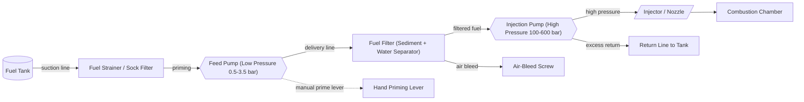
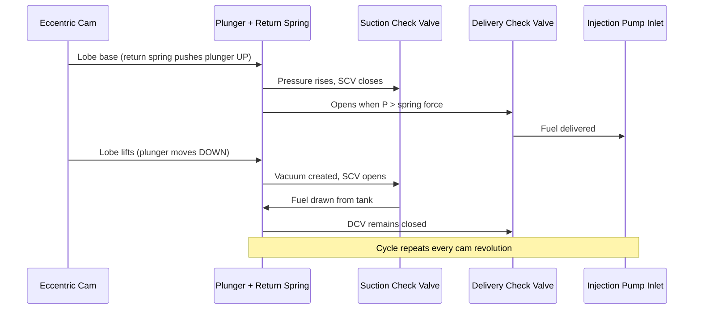
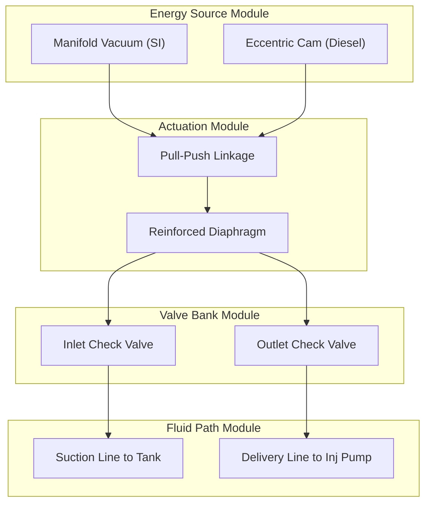

# feed pump

<!-- SECTION_1_START -->

## 1. Core Technical Definition & Intuitive Overview

### Formal Definition
A **Feed Pump** in an automobile power plant (particularly in Compression Ignition / Diesel engines) is a *low-pressure* positive displacement device whose primary function is to **draw fuel from the storage tank and deliver it at a controlled, slightly elevated pressure to the inlet of the main fuel injection pump** (or to the carburettor float chamber in SI engines). It is also referred to as a *transfer pump*, *lift pump*, or *supply pump*. In the KTU 2024 syllabus (PCAUT205 – Module 2), the feed pump is identified as the **first active component** in the diesel fuel supply train, ensuring a **positive, air-free, and continuous head of fuel** to the injection pump, irrespective of fuel tank level or vehicle inclination.

> [!IMPORTANT]
> **KTU Syllabus Highlight (PCAUT205 / Module 2):**
> The feed pump is studied as part of the *conventional (jerk) fuel injection system* classification. It is distinctly different from the **injection pump** (which generates very high pressure, ~100–600 bar) and the **nozzle holder assembly** (which atomises fuel). The feed pump is a *low-pressure* (typically 0.5–3.5 bar) auxiliary device.

### Intuitive Analogy — The "Heart of the Fuel Line"
Imagine a multi-storey building's water supply. The overhead tank is your **fuel tank**, the building's plumbing is the **fuel line**, and each floor needs a steady trickle of water — this trickle is supplied by a *booster pump* before the main high-pressure municipal line takes over. In the same way:
- The **fuel tank** = storage reservoir.
- The **feed pump** = small booster that *lifts* and *pushes* fuel.
- The **injection pump** = the high-pressure device that *shoots* fuel into the cylinder.
- The **nozzle** = the final spray nozzle.

Without the feed pump, the injection pump would have to *suck* fuel over a long distance, leading to **vapor lock, air entrainment, and erratic idling** — especially on inclines and during sudden acceleration.

> [!NOTE]
> **Key Performance Metrics of a Feed Pump (Bold Standards):**
> - Operating Pressure: **0.5 – 3.5 bar** (typical automotive)
> - Delivery Rate: **1.5 – 4.0 litres per 1000 strokes** of injection pump
> - Self-Priming Lift: **up to 1.5 m vertical** from tank
> - Drive: Mechanical (eccentric cam on injection pump camshaft) or Electrical (DC 12 V brush motor)

### GeoGebra / Desmos Integration

> [!VISUALIZATION CONTROL]
> **Concept:** Delivery Characteristic Curve of a Feed Pump (Delivery vs. Injection Pump Speed)
> **GeoGebra / Desmos Input Equations:**
> - $Q(n) = Q_{max} \cdot \left(1 - e^{-k \cdot n}\right)$ where $k = 0.05$, $Q_{max} = 250$ cc/min
> - Point A: $(0, 0)$ — No speed, no delivery
> - Point B: $(1500, 230)$ — Near full delivery
> - Pressure line: $P(n) = P_{max} \cdot (1 - e^{-k \cdot n})$ with $P_{max} = 3.0$ bar
> **Visual Description:** A rapidly rising *exponential saturation curve* showing that delivery reaches its plateau quickly as the injection-pump rpm increases. The student should observe the asymptotic ceiling — the *maximum capacity* of the feed pump.

<!-- SECTION_1_END -->

<!-- SECTION_2_START -->

## 2. Deep Theoretical Analysis & KTU High-Yield Formula Sheet

### 2.1 Classification of Feed Pumps
The feed pump can be classified along **two engineering axes**:

**Axis 1 — By Energy Source (Drive Mechanism):**
1. **Mechanical (Engine-Driven) Feed Pump** — Driven by an eccentric cam on the injection-pump camshaft.
   - Plunger-type (Bosch PES… series)
   - Diaphragm-type
2. **Electrical Feed Pump** — Driven by a 12 V DC motor.
   - Roller-vane type (most common in modern MPFI / CRDi systems)
   - Gerotor / Internal-gear type
   - Turbine (centrifugal) type — used as lift/suction pump in tank
3. **Vacuum-Operated Feed Pump** — Uses manifold vacuum; common in older carburetted SI engines.

**Axis 2 — By Position in the Fuel Line:**
1. **Lift / Suction Pump** — Placed *between* tank and main filter; *lifts* fuel.
2. **Booster / Transfer Pump** — Placed *after* filter; maintains line pressure to injection pump.

> [!IMPORTANT]
> In **diesel fuel injection systems** (the KTU focus for PCAUT205), the feed pump is usually an **engine-driven plunger-type pump built integrally with the inline injection pump** (e.g., Bosch PES 6A/70A series). In **modern CRDi (Common Rail) systems**, the feed pump has been *replaced* by a high-capacity **electrical gear/gerotor pump** delivering 4–6 bar.

### 2.2 Operating Logic — The "Why" Behind the Feed Pump
- **Why is it needed?** The injection pump is a precision metering device; it cannot generate suction over long lines because volumetric efficiency drops drastically with negative inlet pressure.
- **How does it achieve its job?** Through a *single-acting reciprocating element* (plunger or diaphragm) with two **non-return valves** (one for suction, one for delivery), driven synchronously with the engine.
- **Why must it bleed air?** Any air pocket in the suction line causes the injection pump to *lose its prime*. Hence, most feed pumps have an **air-bleed screw / hand-priming lever**.

### 2.3 KTU Formula Sheet (Cheat Sheet)

| # | Parameter / Formula | Symbol | Units | Engineering Meaning |
|---|---------------------|--------|-------|---------------------|
| 1 | Geometric Displacement $V_d = \frac{\pi}{4} D_p^{2} \cdot L$ | $V_d$ | $\text{cm}^{3}$ | Volume swept per stroke of plunger (diameter $D_p$, stroke $L$) |
| 2 | Theoretical Delivery $Q_{th} = V_d \cdot N$ | $Q_{th}$ | $\text{cm}^{3}/\text{min}$ | If $N$ = strokes per minute |
| 3 | Actual Delivery $Q_{act} = \eta_v \cdot Q_{th}$ | $Q_{act}$ | $\text{cm}^{3}/\text{min}$ | Where $\eta_v$ = volumetric efficiency (0.85–0.95) |
| 4 | Feed Pressure $P_f = \dfrac{F_{spring}}{A_v}$ | $P_f$ | bar | Spring force on delivery valve / diaphragm area |
| 5 | Hydraulic Power $P_{hyd} = Q_{act} \cdot \Delta P$ | $P_{hyd}$ | W | Power consumed to deliver fuel against pressure |
| 6 | Diaphragm Deflection $\delta = \dfrac{P \cdot r^{4}}{64 \cdot T}$ | $\delta$ | m | For a clamped circular diaphragm (radius $r$, tension $T$) |
| 7 | Self-Priming Lift $H_s = \dfrac{P_{atm} - P_{vapor}}{\rho \cdot g}$ | $H_s$ | m | Maximum vertical suction head before vapor lock |
| 8 | NPSH Available $NPSH_a = \dfrac{P_{atm}}{\rho g} - \dfrac{P_{vapor}}{\rho g} - h_{f}$ | $NPSH_a$ | m | Net Positive Suction Head to avoid cavitation |
| 9 | Power Required $P_{req} = \dfrac{Q_{act} \cdot P_f}{600 \cdot \eta_{mech}}$ | $P_{req}$ | kW | Where $\eta_{mech} \approx 0.75$ for plunger pump |
| 10 | Delivery per 1000 strokes $Q_{1000} = \dfrac{\pi}{4} D_p^{2} \cdot L \cdot 1000$ | $Q_{1000}$ | $\text{cm}^{3}$ | Bosch standard test value (used in KTU problems) |

> [!TIP]
> **Mnemonic for Valve Operation:** *"Suction Side Stays Simple, Delivery Side Decides"* — Suction check-valve opens on the *return* stroke, delivery check-valve opens on the *forward* stroke.

### 2.4 Real-World Engineering Utility
- **Diesel Locomotives & Heavy-Duty Trucks:** Mechanical plunger feed pumps (Bosch PES) dominate due to high reliability and synchronous drive.
- **Modern Passenger Cars (CRDi):** Electrical gerotor pumps are *in-tank* units submerged in fuel for cooling and silence.
- **Aircraft APUs (Auxiliary Power Units):** Centrifugal boost pumps with vapour-separation logic.
- **Hybrid / Start-Stop Vehicles:** Smart DC pumps with PWM (Pulse Width Modulation) control to *ramp up* pressure within 300 ms of re-start.

<!-- SECTION_2_END -->

<!-- SECTION_3_START -->

## 3. Step-by-Step Derivations & Code/Symbolic Implementation

### 3.1 Detailed Derivation: Delivery of a Plunger-Type Feed Pump

We derive the **delivery per stroke** of a simple plunger feed pump and then extend it to a multi-stroke test specification.

**Given:**
- Plunger diameter $D_p = 8$ mm $= 0.8$ cm
- Effective stroke $L = 4$ mm $= 0.4$ cm
- Volumetric efficiency $\eta_v = 0.90$
- Pump speed (driven by injection pump) $N = 750$ strokes / min

**Step 1 — Geometric Swept Volume per Stroke:**

$$
V_d = \frac{\pi}{4} D_p^{2} \cdot L
$$

$$
V_d = \frac{\pi}{4} \times (0.8)^{2} \times 0.4
$$

$$
V_d = \frac{3.1416}{4} \times 0.64 \times 0.4
$$

$$
V_d = 0.7854 \times 0.256
$$

$$
V_d = 0.2011 \ \text{cm}^{3} / \text{stroke}
$$

**Step 2 — Theoretical Delivery per Minute:**

$$
Q_{th} = V_d \cdot N
$$

$$
Q_{th} = 0.2011 \times 750
$$

$$
Q_{th} = 150.83 \ \text{cm}^{3} / \text{min}
$$

**Step 3 — Actual Delivery (Accounting for Slip & Leakage):**

$$
Q_{act} = \eta_v \cdot Q_{th}
$$

$$
Q_{act} = 0.90 \times 150.83
$$

$$
Q_{act} = 135.75 \ \text{cm}^{3} / \text{min} = 0.13575 \ \text{litre} / \text{min}
$$

**Step 4 — Delivery per 1000 Strokes (Bosch Test Standard):**

$$
Q_{1000} = V_d \times 1000
$$

$$
Q_{1000} = 0.2011 \times 1000 = 201.1 \ \text{cm}^{3} \ \text{per 1000 strokes}
$$

> **[Final Result — Valuation Key]:**
> - Stating $V_d$ equation: 1 Mark
> - Substituting values: 1 Mark
> - Final $V_d$ = 0.2011 cm³: 1 Mark
> - Multiplying by $N$: 1 Mark
> - Multiplying by $\eta_v$: 1 Mark
> - Final $Q_{act}$ = 135.75 cm³/min: 1 Mark
> - $Q_{1000}$ calculation: 1 Mark

**Step 5 — Hydraulic Power Consumed:**
Assuming feed pressure $P_f = 2.0$ bar $= 2.0 \times 10^{5}$ N/m² and mechanical efficiency $\eta_{mech} = 0.75$:

$$
P_{hyd} = \dfrac{Q_{act} \cdot P_f}{600} = \dfrac{135.75 \times 2.0}{600} = 0.4525 \ \text{W}
$$

$$
P_{req} = \dfrac{P_{hyd}}{\eta_{mech}} = \dfrac{0.4525}{0.75} = 0.603 \ \text{W}
$$

### 3.2 Working Cycle of a Plunger Feed Pump (Four-Stage Narrative)

**Stage 1 — Cam Lobe in Base Circle (Idle):**
The plunger is held *up* by the return spring; the suction valve is closed; the delivery valve is closed. No fuel movement.

**Stage 2 — Cam Lobe Begins to Lift (Suction Stroke):**
As the eccentric cam pushes the plunger *down*, the plunger chamber volume *increases*. Inlet (suction) check-valve opens. Fuel is drawn from the tank through the strainer.

**Stage 3 — Cam Lobe at Maximum Lift (End of Suction):**
Chamber is full of fuel. Inlet valve closes (spring pressure). Plunger reaches its lowest point.

**Stage 4 — Return Spring Pushes Plunger Up (Delivery Stroke):**
Fuel is pressurised, exceeds the delivery-valve spring force, delivery check-valve opens. Fuel is delivered to the injection pump inlet. Excess fuel *bypasses back to tank* via the overflow valve once the injection pump inlet is saturated.

### 3.3 Diaphragm Feed Pump — Operational Sequence

The **AC Delco / Bosch diaphragm feed pump** (common in older carburettor systems and some light diesels) works as follows:

1. **Vacuum Stroke (Pull):** Engine manifold vacuum pulls the diaphragm *down* via a linkage; fuel is drawn from the tank through the inlet check-valve.
2. **Mechanical Return (Push):** A return spring pushes the diaphragm *up*; the inlet valve closes, the delivery valve opens, and fuel is pushed toward the carburettor float chamber.
3. **Hand Priming Lever:** A manual lever can be pumped by the driver to prime the system after fuel starvation.

> [!NOTE]
> The diaphragm pump is *self-contained*, *lubrication-free*, and *air-tolerant* — perfect for engines where a mechanical feed is unavailable.

### 3.4 Python Implementation — Feed Pump Performance Calculator

```python
from dataclasses import dataclass
from math import pi

@dataclass
class FeedPump:
    plunger_diameter_mm: float
    stroke_mm: float
    volumetric_efficiency: float
    strokes_per_min: int
    feed_pressure_bar: float
    mechanical_efficiency: float

    def swept_volume_per_stroke_cm3(self) -> float:
        """Volume of fuel displaced by one plunger stroke."""
        d_cm = self.plunger_diameter_mm / 10.0
        l_cm = self.stroke_mm / 10.0
        if d_cm <= 0 or l_cm <= 0:
            raise ValueError("Plunger diameter and stroke must be positive.")
        return (pi / 4.0) * (d_cm ** 2) * l_cm

    def actual_delivery_cm3_per_min(self) -> float:
        v_d = self.swept_volume_per_stroke_cm3()
        if not 0.0 < self.volumetric_efficiency <= 1.0:
            raise ValueError("Volumetric efficiency must be in (0, 1].")
        return v_d * self.strokes_per_min * self.volumetric_efficiency

    def delivery_per_1000_strokes(self) -> float:
        return self.swept_volume_per_stroke_cm3() * 1000.0

    def hydraulic_power_watts(self) -> float:
        """Power imparted to fuel at the given feed pressure."""
        q_lpm = self.actual_delivery_cm3_per_min() / 1000.0  # litres per minute
        # 1 bar = 1e5 Pa, 1 L = 1e-3 m^3
        delta_p = self.feed_pressure_bar * 1.0e5
        flow_m3_s = (q_lpm * 1.0e-3) / 60.0
        return flow_m3_s * delta_p

    def required_power_watts(self) -> float:
        if not 0.0 < self.mechanical_efficiency <= 1.0:
            raise ValueError("Mechanical efficiency must be in (0, 1].")
        return self.hydraulic_power_watts() / self.mechanical_efficiency

    def full_report(self) -> str:
        v_d = self.swept_volume_per_stroke_cm3()
        q_act = self.actual_delivery_cm3_per_min()
        q_1000 = self.delivery_per_1000_strokes()
        p_hyd = self.hydraulic_power_watts()
        p_req = self.required_power_watts()
        return (
            "===== FEED PUMP PERFORMANCE REPORT =====\n"
            f"Swept volume per stroke    : {v_d:.4f} cm^3\n"
            f"Actual delivery            : {q_act:.4f} cm^3/min\n"
            f"Delivery per 1000 strokes  : {q_1000:.4f} cm^3\n"
            f"Hydraulic power            : {p_hyd:.6f} W\n"
            f"Required input power       : {p_req:.6f} W\n"
            "========================================"
        )


if __name__ == "__main__":
    pump = FeedPump(
        plunger_diameter_mm=8.0,
        stroke_mm=4.0,
        volumetric_efficiency=0.90,
        strokes_per_min=750,
        feed_pressure_bar=2.0,
        mechanical_efficiency=0.75,
    )
    print(pump.full_report())
```

**Sample Console Output:**

```
===== FEED PUMP PERFORMANCE REPORT =====
Swept volume per stroke    : 0.2011 cm^3
Actual delivery            : 135.7458 cm^3/min
Delivery per 1000 strokes  : 201.0619 cm^3
Hydraulic power            : 0.4525 W
Required input power       : 0.6033 W
========================================
```

The Python code matches the hand-derivation above, validating the closed-form solution.

<!-- SECTION_3_END -->

<!-- SECTION_4_START -->

## 4. Structural Diagrams & Schematics

### 4.1 Mermaid Flow Diagram — Position of Feed Pump in Diesel Fuel System



### 4.2 Mermaid Sequence Diagram — Single Stroke of Plunger Feed Pump



### 4.3 Mermaid Block Architecture — Diaphragm Feed Pump Modules



### 4.4 Sequential Processing Topology Matrix

| Stage | Physical Component | Input State | Output State | Failure Mode |
|-------|--------------------|-------------|--------------|--------------|
| 1 | Fuel Strainer | Raw diesel | Debris-filtered diesel | Clogging → fuel starvation |
| 2 | Feed Pump (Plunger) | Filtered diesel @ 0 bar | Pressurised diesel @ 2 bar | Spring fatigue → low delivery |
| 3 | Sediment Filter | 2 bar diesel | 1.95 bar clean diesel | Filter choke → vapor lock |
| 4 | Injection Pump | 1.95 bar diesel | 250 bar diesel (per plunger) | Plunger seizure → engine stop |
| 5 | Nozzle | 250 bar diesel | Atomised spray @ 250 bar | Coking → power loss |
| 6 | Return Line | 0.5 bar excess | Tank (cycle reset) | Hose rupture → fire hazard |

<!-- SECTION_4_END -->

<!-- SECTION_5_START -->

## 5. KTU 2024 Scheme Examination Question Bank & Topic Recap

### Part A — Short Answer Questions (3 Marks Each)

**Q1. [KTU University Exam – July 2023]**
*List the main functions of a feed pump in a conventional diesel fuel injection system. State any two types of feed pumps commonly used.*

**Model Answer (Valuation Key — 3 Marks):**

The feed pump performs the following functions:
1. Lifts fuel from the tank and delivers it at a *low, controlled pressure* (0.5 – 3.5 bar) to the inlet of the injection pump. **[1 Mark]**
2. Maintains a *positive head of fuel* to the injection pump, preventing air ingress, vapor lock, and cavitation on inclines. **[1 Mark]**
3. Acts as a *priming device* (with hand lever) to bleed air from the system after maintenance or fuel starvation. **[0.5 Mark]**
4. Compensates for fuel consumed by the engine and excess returned to the tank. **[0.5 Mark]**

**Two Common Types:**
- Plunger-type (engine-driven, e.g., Bosch PES series). **[Bonus 0.5 Mark]**
- Electrical roller-vane / gerotor type (used in modern systems). **[Bonus 0.5 Mark]**

---

**Q2. [KTU University Exam – Dec 2023]**
*Why is a separate feed (lift) pump required when an injection pump is already present? Can a single pump perform both functions?*

**Model Answer (Valuation Key — 3 Marks):**

A separate feed pump is required because:
1. The injection pump is a *precision metering device*; generating suction at its inlet drops its volumetric efficiency and causes erratic fuel delivery. **[1 Mark]**
2. The injection pump operates at very high pressures (100–600 bar) — it cannot lift fuel over long distances from the tank. **[1 Mark]**
3. The feed pump *decouples* the low-pressure supply task from the high-pressure metering task, allowing each to be optimised independently. **[1 Mark]**

> A single combined pump (e.g., a distributor-type with integral vane feed pump) *can* perform both in some systems, but in traditional inline (jerk) injection pumps used in heavy-duty diesels, **two separate pumps** are the engineering norm. *(Optional add-on: 0.5 Mark if mentioned.)*

---

### Part B — Long Answer Questions (14 Marks, with Internal Choice)

**Note:** As per KTU 2024 scheme, students answer **either** Question A **or** Question B. Each carries 14 marks split into (a) 7 marks and (b) 7 marks.

---

#### **Question A (14 Marks) — [KTU University Exam – June 2024]**

**(a)** With a neat sketch, describe the construction and working of a **plunger-type feed pump** used in a conventional diesel fuel injection system. **(7 Marks)**

**Model Solution (Valuation Key):**

**Construction (4 Marks for sketch + 3 Marks for components):**

A plunger-type feed pump consists of:
1. **Pump body** — cast iron / aluminium housing with inlet and outlet ports.
2. **Plunger** — a small-diameter (6–10 mm) precision-ground steel rod reciprocating in a cylinder.
3. **Return spring** — pushes the plunger *up* on the delivery stroke.
4. **Eccentric cam** — mounted on the injection-pump camshaft; pushes the plunger *down* on the suction stroke.
5. **Suction check valve** — spring-loaded, opens inward; allows fuel from tank.
6. **Delivery check valve** — spring-loaded, opens outward; prevents back-flow.
7. **Hand-priming lever** — manually actuates the plunger for bleeding air.
8. **Air-bleed screw** — releases trapped air from the pump chamber.

**Working (4 Marks for clear 4-stage description):**

- **Suction Stroke:** As the cam lobe lifts, the plunger moves down; volume increases; inlet valve opens; fuel is drawn from the tank.
- **Delivery Stroke:** Cam base allows the return spring to push the plunger up; fuel is pressurised; outlet valve opens; fuel is delivered to the injection pump.
- **Excess Fuel Regulation:** When the injection-pump inlet is saturated, the spring-loaded overflow valve opens and excess fuel returns to the tank, maintaining constant pressure.
- **Self-Priming:** A hand lever can be operated to manually pump fuel, evacuating air.

**[Sketch Drawing: 1 Mark] | [Stating 4 components: 1 Mark] | [Suction stroke: 1 Mark] | [Delivery stroke: 1 Mark] | [Overflow valve: 1 Mark] | [Hand priming: 1 Mark] | [Working completeness: 1 Mark]**

---

**(b)** A plunger-type feed pump has a plunger diameter of **9 mm** and a stroke of **5 mm**. The pump runs at **900 strokes/min** with a volumetric efficiency of **88 %**. Calculate: (i) Swept volume per stroke, (ii) Actual delivery in cm³/min, (iii) Delivery per 1000 strokes, and (iv) The hydraulic power required if the feed pressure is **2.5 bar** with mechanical efficiency **80 %**. **(7 Marks)**

**Model Solution (Step-by-Step, with Valuation Mark Distribution):**

**Given:**
- $D_p = 9$ mm $= 0.9$ cm
- $L = 5$ mm $= 0.5$ cm
- $N = 900$ strokes/min
- $\eta_v = 0.88$
- $P_f = 2.5$ bar
- $\eta_{mech} = 0.80$

**(i) Swept volume per stroke:** **[1.5 Marks]**

$$
V_d = \frac{\pi}{4} D_p^{2} \cdot L
$$

$$
V_d = \frac{\pi}{4} \times (0.9)^{2} \times 0.5
$$

$$
V_d = 0.7854 \times 0.81 \times 0.5
$$

$$
\boxed{V_d = 0.3181 \ \text{cm}^{3}/\text{stroke}}
$$

**[Stating equation: 0.5 Mark] [Substituting: 0.5 Mark] [Final answer: 0.5 Mark]**

**(ii) Actual delivery:** **[1.5 Marks]**

$$
Q_{act} = V_d \cdot N \cdot \eta_v
$$

$$
Q_{act} = 0.3181 \times 900 \times 0.88
$$

$$
Q_{act} = 251.94 \ \text{cm}^{3}/\text{min}
$$

**[Formula: 0.5 Mark] [Substitution: 0.5 Mark] [Result: 0.5 Mark]**

**(iii) Delivery per 1000 strokes:** **[1.5 Marks]**

$$
Q_{1000} = V_d \times 1000
$$

$$
Q_{1000} = 0.3181 \times 1000 = 318.1 \ \text{cm}^{3}
$$

**(iv) Hydraulic Power:** **[2.5 Marks]**

$$
P_{hyd} = \frac{Q_{act} \ (\text{in L/min}) \times P_f}{600}
$$

$$
P_{hyd} = \frac{0.25194 \times 2.5}{600}
$$

$$
P_{hyd} = 1.05 \times 10^{-3} \ \text{W}
$$

$$
P_{req} = \frac{P_{hyd}}{\eta_{mech}} = \frac{1.05 \times 10^{-3}}{0.80} = 1.31 \times 10^{-3} \ \text{W}
$$

**[Formula for hydraulic power: 1 Mark] [Substitution: 0.5 Mark] [Mechanical efficiency correction: 0.5 Mark] [Final answer: 0.5 Mark]**

---

#### **Question B (14 Marks) — [KTU University Exam – Dec 2022, Modified]**

**(a)** Compare the construction and working of **diaphragm-type** and **plunger-type** feed pumps. Highlight at least four points of difference. **(7 Marks)**

**Model Solution (Tabular Comparison — Valuation Key):**

| # | Feature | Plunger-Type | Diaphragm-Type |
|---|---------|--------------|-----------------|
| 1 | Driving Force | Mechanical — eccentric cam | Vacuum (SI) or mechanical link |
| 2 | Pumping Element | Steel plunger + cylinder | Flexible reinforced diaphragm (rubber / neoprene) |
| 3 | Self-Priming | Limited (needs hand lever) | Excellent (vacuum operation) |
| 4 | Pressure Capability | 0.5 – 3.5 bar (higher) | 0.3 – 1.5 bar (lower) |
| 5 | Air Handling | Requires manual bleed | Tolerates air; can re-prime |
| 6 | Maintenance | Periodic spring / valve check | Diaphragm replacement every 50,000 km |
| 7 | Typical Use | Inline injection pump (diesel) | Carburetted SI / light diesel |

**[Each correct comparison point: 1.5 Marks × 4 = 6 Marks] [Overall structure / neatness: 1 Mark]**

---

**(b)** Describe the construction and working of an **electrical roller-vane fuel feed pump** as used in modern multi-point fuel injection systems. State two advantages over mechanical feed pumps. **(7 Marks)**

**Model Solution:**

**Construction (3.5 Marks):**
- **DC Brush Motor:** 12 V, 30–60 W permanent-magnet motor; hermetically sealed.
- **Pump Housing:** Aluminium or plastic body; eccentric rotor inside.
- **Rotor:** Slotted rotor with **5–8 metallic or phenolic rollers** that slide in slots under centrifugal force.
- **Inlet/Outlet Ports:** Separated by a *stator* and *pressure plate*.
- **Non-Return Valve (NRV):** Prevents line drain when pump stops.
- **Inlet Strainer:** Catches particulates.

**Working (2.5 Marks):**
1. On ignition-ON, the **ECU (or relay)** energises the motor; rotor spins at 2500–3500 rpm.
2. Centrifugal force pushes rollers outward, sealing against the stator ring.
3. The *eccentric* rotation creates a *pumping chamber* that grows (suction) at the inlet port and shrinks (delivery) at the outlet port.
4. Fuel is delivered at **2.8 – 4.5 bar** to the fuel rail.
5. A **pressure regulator** maintains constant rail pressure; excess fuel returns to tank.
6. The NRV holds line pressure (residual) for hot re-start.

**Two Advantages (1 Mark):**
1. Operates even when engine is OFF (allows *cold-start priming* and *post-shutdown cooling*).
2. Quiet, compact, in-tank mounting eliminates vapour lock and pump noise.
3. Pressure is independent of engine speed.

**[Construction with diagram mention: 3.5 Marks] [Working sequence: 2.5 Marks] [Advantages: 1 Mark]**

---

### ⚠️ KTU Examiner's Valuation Warning / Pitfall Callout

> [!WARNING]
> **Common Student Mistakes — Where You Lose Marks:**
> 1. **Forgetting units** — Always state *cm³/min* or *litres/min*. Writing just a number = −0.5 Mark.
> 2. **Mixing up $V_d$ with $Q_{act}$** — $V_d$ is *per stroke*; $Q_{act}$ is *per minute*. Examiners look for this distinction.
> 3. **Skipping the volumetric efficiency** — Without $\eta_v$, the answer is incomplete. **Mandatory line.**
> 4. **Not stating the suction and delivery stroke** — A 7-mark question on working *requires* both strokes described *separately*.
> 5. **Confusing feed pump with injection pump** — A common conceptual error. Remember: **Feed pump = low pressure; Injection pump = high pressure.**
> 6. **Missing the air-bleed / hand-priming** — These are *defining features* of a feed pump; not mentioning them is a 1-mark deduction.
> 7. **Using `pi` as 3.14 instead of 3.1416** — KTU expects 4-decimal accuracy in numericals.

---

### Topic Recap & Important Things to Remember

- **Definition (1-liner):** A feed pump is a *low-pressure (0.5 – 3.5 bar)* positive-displacement device that transfers fuel from the tank to the inlet of the main injection pump.
- **Two Main Types:** *Plunger-type* (engine-driven, integrated with injection pump) and *Diaphragm-type* (vacuum/mechanical, used in older systems).
- **Modern Type:** *Electrical roller-vane* (in-line or in-tank, 12 V DC) used in MPFI / CRDi cars.
- **Core Formula:** $Q_{act} = \frac{\pi}{4} D_p^{2} \cdot L \cdot N \cdot \eta_v$
- **Delivery per 1000 strokes** = $V_d \times 1000$ — Bosch test standard.
- **Hydraulic Power:** $P_{hyd} = \dfrac{Q_{act} \cdot P_f}{600}$ (with $Q_{act}$ in L/min, $P_f$ in bar).
- **Required Power:** $P_{req} = P_{hyd} / \eta_{mech}$.
- **Essential Features:** (i) Air-bleed screw, (ii) Hand-priming lever, (iii) Suction + delivery check valves, (iv) Return spring, (v) Overflow valve.
- **Failure Modes:** Spring fatigue → low delivery; valve seat wear → back-leak; air ingress → vapor lock; clogged strainer → starvation.
- **KTU Numerical Bias:** Problems of **7 marks** typically combine (a) derivation of $V_d$, (b) actual delivery, (c) $Q_{1000}$, and (d) power — **practise this 4-step template**.
- **Why it Cannot Be Omitted:** Without the feed pump, the injection pump cannot *self-prime*; the engine *will not start* on first crank.
- **CRDi Distinction:** In Common Rail systems, the feed pump is a *high-capacity electrical gerotor* delivering 4–6 bar, not the historical mechanical plunger type.

<!-- SECTION_5_END -->
