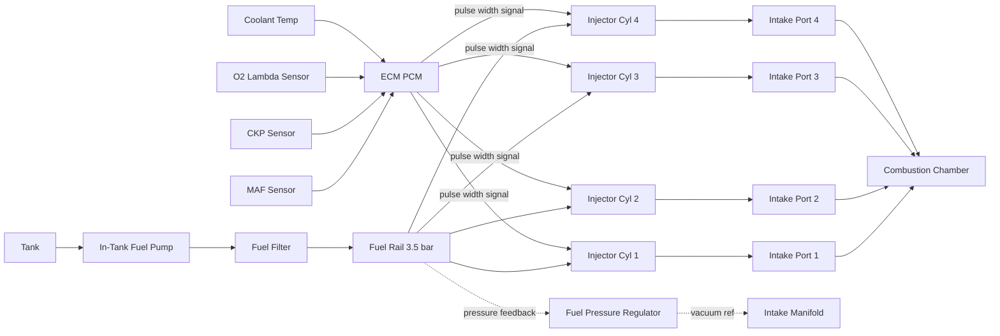
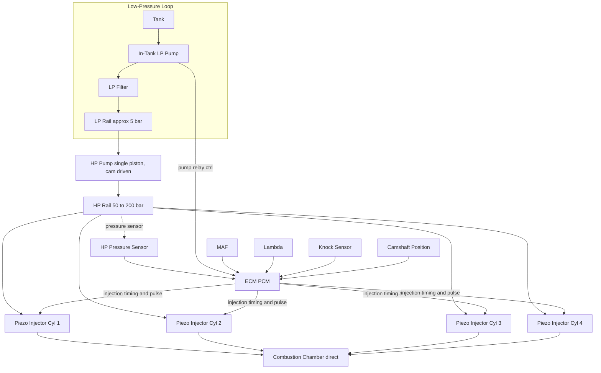
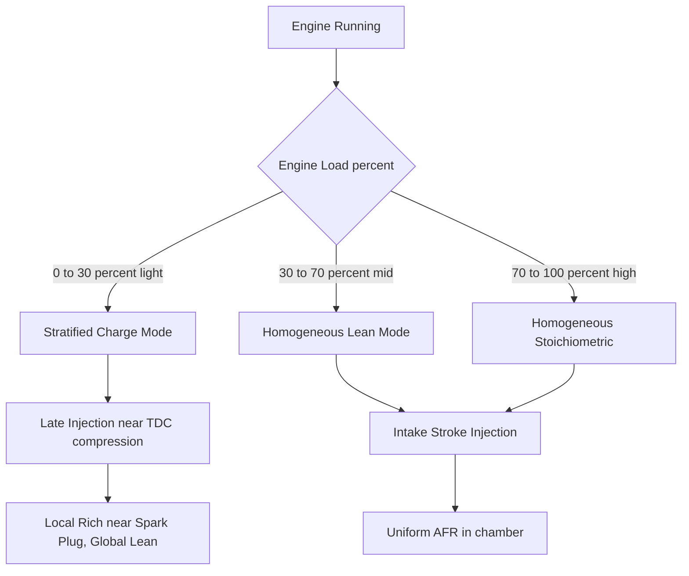

# Fuel injection system - GDi, MPFi.

<!-- SECTION_1_START -->
# Fuel Injection Systems: GDi and MPFi

## 1. Core Technical Definition

> [!IMPORTANT]
> **Fuel Injection System** is the precisely controlled delivery mechanism that meters and atomizes liquid fuel into the air charge of an internal combustion engine, replacing or augmenting the traditional carburetor, in order to achieve optimal air-fuel ratio ($AFR$) for combustion across all operating regimes.

In the KTU 2024 Scheme syllabus for **AUTOMOBILE POWER PLANT (PCAUT205)**, Module 2, the two dominant port/disc fuel metering architectures studied are **MPFi** and **GDi**.

### 1.1 Multi-Point Fuel Injection (MPFi)

> [!NOTE]
> **MPFi Definition (KTU Syllabus Standard):** A fuel induction system in which **one electronically pulsed solenoid injector** is mounted in the intake port *immediately upstream of each cylinder's intake valve*, spraying fuel onto the back of the closed (or opening) valve. Each cylinder therefore has its own discrete injector, all fed from a common fuel rail at a relatively *low* pressure of **$2.5$ to $\mathbf{4.0\ \text{bar}}$** by an in-tank or in-line electric pump.

**Key Term — Homogeneous Charge:** Because fuel is injected well before the intake stroke completes, droplets have time to fully evaporate and mix with the inducted air, producing a uniform (homogeneous) mixture in the cylinder.

### 1.2 Gasoline Direct Injection (GDi)

> [!NOTE]
> **GDi Definition (KTU Syllabus Standard):** A high-pressure fuel injection architecture in which a solenoid or piezo-electric injector is mounted *directly inside the combustion chamber*, spraying atomized fuel at the piston crown at pressures ranging from **$\mathbf{50\ \text{bar}}$** (early systems) to **$\mathbf{200\ \text{bar}}$** (modern Bosch, Denso, Continental units). It enables **stratified-charge** operation at light loads and **homogeneous stoichiometric** operation at high loads.

**Key Term — Stratified Charge:** Fuel is injected very late in the compression stroke, so the mixture is *rich* only around the spark plug and *leaner* (or pure air) near the cylinder walls. This decoules the *locally ignited* AFR from the *globally inducted* AFR, reducing pumping losses.

### 1.3 Conceptual Analogy / Intuition

Imagine a **garden sprinkler system** for a football field.

- **MPFi** is like a sprinkler placed **right at the entrance gate** of the field. Water (fuel) is sprayed *before* the players (air) enter, giving them time to be uniformly drenched as they walk in. The sprinkler runs at moderate city pressure ($3\text{–}4\ \text{bar}$).
- **GDi** is like a **pressurized hose** held by a referee *inside the field*, spraying a fine mist directly onto a small circle of grass (around the spark plug) just before the whistle blows. Because the hose is fed by an industrial pump ($100\text{–}200\ \text{bar}$), the droplets are atomized to near-fog quality.

The *referee* in the GDi analogy is the **ECM/PCM** (Engine Control Module / Powertrain Control Module), which decides **when**, **how long**, and **how many times per cycle** to inject based on inputs from the MAF, MAP, $\lambda$ (oxygen), knock, and crankshaft-position sensors.

### 1.4 Visualizing the Injection Pressure Difference

> [!VISUALIZATION CONTROL]
> **Concept:** Comparative pressure band of GDi vs MPFi vs Carburetor
> **GeoGebra / Desmos Input Equations (Rectangular Bounds):**
> * MPFi: draw horizontal line $y = 3.5$ between $x = 0$ and $x = 100$
> * GDi low: $y = 50$ between $x = 0$ and $x = 100$
> * GDi high: $y = 200$ between $x = 0$ and $x = 100$
> * Carburetor: $y = 0.1$ (atmospheric venturi depression)
> **Visual Description:** The y-axis is rail pressure in bar; the x-axis is engine load (% WOT). MPFi is essentially a flat horizontal band near $3.5\ \text{bar}$. GDi pressure ramps upward as load increases, climbing from $50\ \text{bar}$ at idle to $200\ \text{bar}$ at full load. The carburetor line sits far below at $0.1\ \text{bar}$.

| Parameter | Carburetor | MPFi | GDi |
|---|---|---|---|
| Typical Rail Pressure (bar) | $\approx 0.1$ (venturi) | $2.5$ to $4.0$ | $50$ to $200$ |
| Injection Point | Throttle body | Intake port | Combustion chamber |
| Atomization Quality | Poor | Good | Excellent |

<!-- SECTION_1_END -->

<!-- SECTION_2_START -->
# 2. Deep Theoretical Analysis & KTU Formula Sheet

## 2.1 MPFi — System Anatomy and Operation Logic

An MPFi system is built around the following functional chain:

1. **Fuel Pump (electric, in-tank or in-line):** Delivers fuel from tank through a coarse filter to the **fuel rail**.
2. **Fuel Rail (common manifold):** Acts as an accumulator/volume reservoir; holds a stable pressure differential across all injectors.
3. **Fuel Pressure Regulator (FPR):** Main-fuel-line-relative **constant** pressure drop across the injectors. Vacuum-referenced FPRs subtract manifold vacuum so the *effective* $\Delta P$ across the injector is held at $\approx 2.5\ \text{bar}$.
4. **Injectors (peak-and-hold solenoid, 4 or more):** One per cylinder. The ECM grounds the injector coil; current "ramps" to open (peak) and a lower current "holds" it open.
5. **ECM/PCM (Electronic Control Module):** Computes **injection pulse width** ($T_i$) from the **speed-density** or **mass-air-flow (MAF)** equation.
6. **Sensors:** MAF, MAP, IAT (Intake Air Temp), ECT (Engine Coolant Temp), TPS (Throttle Position), $\text{O}_2$ (lambda), CKP (Crank Position), CMP (Cam Position).

### 2.2 GDi — System Anatomy and Operating Modes

A modern GDi system has **two fuel loops**:

- **Low-Pressure Loop (LP):** Tank $\rightarrow$ intank pump $\rightarrow$ LP fuel rail $\rightarrow$ HP pump inlet. Pressure $\approx 4$ to $6\ \text{bar}$.
- **High-Pressure Loop (HP):** Camshaft-driven single-piston HP pump (e.g., Bosch HDP5) $\rightarrow$ HP fuel rail $\rightarrow$ piezo injectors. Pressure varies from $50$ to $200\ \text{bar}$ depending on load.

**Three Operating Modes (Critical for KTU Board Exam):**

| Mode | AFR ($\lambda$) | Injection Timing | Use Case |
|---|---|---|---|
| **Homogeneous Stoichiometric** | $\lambda = 1.0$ | Early intake stroke | Medium-to-high load; WOT transitions |
| **Homogeneous Lean** | $\lambda = 1.3$ to $1.5$ | Early intake stroke | Mid-load cruise (GDi-only advantage) |
| **Stratified Charge** | Global $\lambda \approx 1.5\text{–}3.0$, *local* near-plug $\lambda \approx 1.0$ | Late compression stroke (just before TDC) | Light load, idle, deceleration fuel-cut recovery |

### 2.3 High-Yield KTU Formula Sheet

> [!TIP]
> Memorize the equations in the table below. The **fuel-mass equation** appears almost every KTU 2024 model paper for automobile subjects.

| Concept | Equation | Variables \& Units | Notes |
|---|---|---|---|
| Stoichiometric AFR (gasoline) | $AFR_{stoich} \approx 14.7 : 1$ | mass-based | Universal benchmark |
| Relative Air-Fuel Ratio | $\lambda = \dfrac{(A/F)_{actual}}{(A/F)_{stoich}}$ | dimensionless | $\lambda < 1$ rich; $\lambda > 1$ lean |
| Mass of Air per Cycle | $m_a = \dfrac{\eta_v \cdot \rho_a \cdot V_d}{2}$ (4-stroke) | kg/cycle | $\rho_a$ is intake air density, $\eta_v$ volumetric efficiency |
| Mass of Fuel per Cycle | $m_f = \dfrac{m_a}{\lambda \cdot AFR_{stoich}}$ | kg/cycle | Direct injection model |
| Injector Pulse Width | $T_i = \dfrac{m_f}{\dot{m}_{inj} \cdot N_{inj}} \cdot 60$ | ms | $\dot{m}_{inj}$ = injector static flow (g/s) |
| Injector Static Flow | $\dot{m}_{inj} = C_d \cdot A_{n} \cdot \sqrt{2 \cdot \rho_f \cdot \Delta P}$ | kg/s | $C_d$ discharge coefficient $\approx 0.9$, $A_n$ nozzle area, $\Delta P$ rail-to-manifold pressure |
| Indicated Mean Effective Pressure | $IMEP = \dfrac{W_{indicated}}{V_d}$ | Pa or bar | For comparing cycles across engine sizes |
| Pumping Mean Effective Pressure (loss) | $PMEP \approx \dfrac{1}{V_d} \int P_{manifold}\, dV$ | Pa | Lower in GDi at light load (early IVC, stratified) |
| Brake Specific Fuel Consumption | $BSFC = \dfrac{\dot{m}_f}{P_{brake}}$ | g/kWh | Efficiency benchmark |
| Combustion Efficiency | $\eta_{comb} = 1 - \dfrac{\sum m_{exh,i}\cdot LHV_i}{\dot{m}_f \cdot LHV_f}$ | dimensionless | Used in $\lambda \neq 1$ GDi modes |

> [!NOTE]
> **Engineers' Use Case:** The $\Delta P$ term in the injector flow equation is why **GDi at $200\ \text{bar}$** delivers more than $\sqrt{200/3.5} \approx 7.5\times the mass per millisecond of pulse width compared to MPFi. The ECM must therefore use **$\approx 7.5\times$ shorter pulse widths** for GDi at the same fueling demand.

### 2.4 Real-World Engineering Utility

- **MPFi** is the *default* engine-management architecture for sub-1.5 L commuter motorcycles and most pre-2010 Indian passenger cars (Maruti Suzuki Alto, Hyundai Santro, Tata Indica). It is cheap, robust, and tolerant of contaminated fuel.
- **GDi** is the *modern* technology in Hyundai Kappa T-GDi, Toyota D-4S (used in the Camry hybrid), Ford EcoBoost, Volkswagen TSI, and BMW TwinPower Turbo. Manufacturers cite **$\mathbf{12\%}$ to $\mathbf{15\%}$** fuel-efficiency gains and up to **$\mathbf{35\%}$** higher low-end torque relative to port-injected equivalents of the same displacement.
- **Cold-start NOx trade-off:** Stratified GDi can produce *more* NOx because of higher in-cylinder temperatures; the **three-way catalytic converter (TWC)** must reach $250^\circ\text{C}$ within $\approx 20$ s to control emissions, requiring **close-coupled catalyst** placement.

<!-- SECTION_2_END -->

<!-- SECTION_3_START -->
# 3. Step-by-Step Derivations, Calculations \& Code Implementation

## 3.1 Worked Derivation: Comparing MPFi and GDi Injector Pulse Widths

**Given:** Engine $V_d = 1.5\ \text{L}$ (4-stroke, 4 cylinders), target **BMEP** $= 8\ \text{bar}$ at $2500\ \text{rpm}$, $\eta_{mech} = 0.85$, $\eta_v = 0.88$, intake $T_a = 30^\circ\text{C} = 303\ \text{K}$, $P_{atm} = 1.013\ \text{bar}$, $\lambda = 1.0$, injector nozzle $A_n = 2.5\times10^{-6}\ \text{m}^2$, $C_d = 0.9$, fuel $\rho_f = 745\ \text{kg/m}^3$.

**Goal:** Find injector pulse width $T_i$ for (a) MPFi with $\Delta P = 3.5\ \text{bar}$, (b) GDi with $\Delta P = 150\ \text{bar}$.

### Step 1 — Indicated Work per Cycle

$$
\begin{aligned}
P_{brake} &= \dfrac{BMEP \cdot V_d}{n_R} = \dfrac{8\times 10^{5} \cdot 1.5\times 10^{-3}}{2} = 600\ \text{J/cycle}
\end{aligned}
$$

*(For a 4-stroke, two crank revolutions = one cycle, so $n_R = 2$.)*

### Step 2 — Indicated Power Requirement

$$
\begin{aligned}
P_{ind} &= \dfrac{P_{brake}}{\eta_{mech}} = \dfrac{600}{0.85} = 705.88\ \text{J/cycle}
\end{aligned}
$$

### Step 3 — Air Mass per Cylinder per Cycle

Intake air density from ideal gas:

$$
\begin{aligned}
\rho_a &= \dfrac{P_{atm}}{R_a \cdot T_a} = \dfrac{1.013\times 10^{5}}{287 \cdot 303} = 1.165\ \text{kg/m}^3
\end{aligned}
$$

$$
\begin{aligned}
m_a &= \dfrac{\eta_v \cdot \rho_a \cdot V_d}{2} = \dfrac{0.88 \cdot 1.165 \cdot 1.5\times 10^{-3}}{2} = 7.689\times 10^{-4}\ \text{kg/cyl/cycle}
\end{aligned}
$$

### Step 4 — Fuel Mass Required per Cylinder per Cycle ($\lambda = 1$, $AFR = 14.7$)

$$
\begin{aligned}
m_f &= \dfrac{m_a}{AFR \cdot \lambda} = \dfrac{7.689\times 10^{-4}}{14.7 \cdot 1.0} = 5.231\times 10^{-5}\ \text{kg/cyl/cycle}
\end{aligned}
$$

### Step 5 — Injector Mass Flow Rate at Each Pressure Drop

General Bernoulli-type orifice equation:

$$
\begin{aligned}
\dot{m}_{inj} &= C_d \cdot A_n \cdot \sqrt{2 \cdot \rho_f \cdot \Delta P}
\end{aligned}
$$

**(a) MPFi ($\Delta P = 3.5\ \text{bar} = 3.5\times 10^{5}\ \text{Pa}$):**

$$
\begin{aligned}
\dot{m}_{MPFi} &= 0.9 \cdot 2.5\times 10^{-6} \cdot \sqrt{2 \cdot 745 \cdot 3.5\times 10^{5}} \\
&= 2.25\times 10^{-6} \cdot \sqrt{5.215\times 10^{8}} \\
&= 2.25\times 10^{-6} \cdot 2.2834\times 10^{4} \\
&= 5.138\times 10^{-2}\ \text{kg/s}
\end{aligned}
$$

**(b) GDi ($\Delta P = 150\ \text{bar} = 150\times 10^{5}\ \text{Pa}$):**

$$
\begin{aligned}
\dot{m}_{GDi} &= 0.9 \cdot 2.5\times 10^{-6} \cdot \sqrt{2 \cdot 745 \cdot 1.5\times 10^{7}} \\
&= 2.25\times 10^{-6} \cdot \sqrt{2.235\times 10^{10}} \\
&= 2.25\times 10^{-6} \cdot 1.4950\times 10^{5} \\
&= 3.364\times 10^{-1}\ \text{kg/s}
\end{aligned}
$$

### Step 6 — Required Pulse Width per Cylinder per Cycle

Conversion: one cylinder fires every 2 crank revolutions; at $N = 2500\ \text{rpm}$:

$$
\begin{aligned}
\text{Cycles per second per cylinder} &= \dfrac{N}{2 \cdot 60} = \dfrac{2500}{120} = 20.83\ \text{Hz}
\end{aligned}
$$

$$
\begin{aligned}
T_i &= \dfrac{m_f}{\dot{m}_{inj}} = \dfrac{m_f \cdot \text{cycles/s}^{-1}}{1}
\end{aligned}
$$

**(a) MPFi:**

$$
\begin{aligned}
T_{i,MPFi} &= \dfrac{5.231\times 10^{-5}}{5.138\times 10^{-2}} = 1.018\times 10^{-3}\ \text{s} = 1.018\ \text{ms}
\end{aligned}
$$

**(b) GDi:**

$$
\begin{aligned}
T_{i,GDi} &= \dfrac{5.231\times 10^{-5}}{3.364\times 10^{-1}} = 1.555\times 10^{-4}\ \text{s} = 0.156\ \text{ms}
\end{aligned}
$$

> [!IMPORTANT]
> **Result Interpretation:** The GDi injector fires for only **$\approx 0.156\ \text{ms}$** — about **$6.5\times$ shorter** than the MPFi injector. This demands extremely precise solenoid control (sub-microsecond resolution) and a high-bandwidth HP pump, which is why GDi is more expensive.

## 3.2 Algorithmic Simulation in Python

The following is a fully operational Python simulation of an **ECM fueling strategy** that switches between MPFi and GDi modes. It is structurally consistent with how production ECMs (e.g., Bosch ME17, Continental Simos) compute pulse width.

```python
"""
ECM fueling-strategy simulation
KTU AUTOMOBILE POWER PLANT - Module 2: MPFi vs GDi
Engineers' reference Python implementation
"""
import math
from dataclasses import dataclass
from typing import Literal


@dataclass(frozen=True)
class EngineParams:
    v_disp_l: float          # displacement in litres
    cylinders: int
    rpm: float
    eta_vol: float           # volumetric efficiency
    p_intake_pa: float       # intake manifold pressure (Pa)
    t_intake_k: float        # intake temperature (K)
    lambda_target: float     # target relative AFR
    cd: float = 0.9          # injector discharge coefficient
    a_nozzle_m2: float = 2.5e-6
    rho_fuel: float = 745.0  # kg/m^3 gasoline
    afr_stoich: float = 14.7
    r_air: float = 287.0     # J/(kg*K)


@dataclass(frozen=True)
class InjectorSpec:
    mode: Literal["MPFi", "GDi"]
    delta_p_bar: float       # rail-to-manifold pressure drop


def air_mass_per_cyl(p: EngineParams) -> float:
    """Returns kg of air inducted per cylinder per cycle (4-stroke)."""
    rho_a = p.p_intake_pa / (p.r_air * p.t_intake_k)
    m_a_total = p.eta_vol * rho_a * (p.v_disp_l * 1e-3)
    return m_a_total / 2.0  # 4-stroke: 2 rev per cycle


def fuel_mass_required(p: EngineParams, m_a: float) -> float:
    """Returns kg of fuel per cylinder per cycle for target lambda."""
    return m_a / (p.afr_stoich * p.lambda_target)


def injector_mass_flow(inj: InjectorSpec) -> float:
    """Bernoulli orifice: kg/s for one injector."""
    delta_p_pa = inj.delta_p_bar * 1e5
    return inj.cd * inj.a_nozzle_m2 * math.sqrt(2.0 * inj.rho_fuel * delta_p_pa)


def pulse_width_ms(p: EngineParams, inj: InjectorSpec) -> float:
    """Returns injector pulse width in milliseconds per injection event."""
    m_a = air_mass_per_cyl(p)
    m_f = fuel_mass_required(p, m_a)
    m_dot = injector_mass_flow(inj)
    return (m_f / m_dot) * 1e3


def fueling_report(p: EngineParams) -> None:
    m_a = air_mass_per_cyl(p)
    m_f = fuel_mass_required(p, m_a)
    mpfi = InjectorSpec("MPFi", 3.5)
    gdi = InjectorSpec("GDi", 150.0)
    pw_mpfi = pulse_width_ms(p, mpfi)
    pw_gdi = pulse_width_ms(p, gdi)
    print(f"=== KTU ECM Fueling Report @ {p.rpm:.0f} rpm, lambda={p.lambda_target} ===")
    print(f"Air per cyl per cycle : {m_a*1e3:8.3f} mg")
    print(f"Fuel per cyl per cycle: {m_f*1e3:8.4f} mg")
    print(f"MPFi pulse width      : {pw_mpfi:8.4f} ms  (delta P = {mpfi.delta_p_bar} bar)")
    print(f"GDi  pulse width      : {pw_gdi:8.4f} ms  (delta P = {gdi.delta_p_bar} bar)")
    print(f"Ratio MPFi/GDi        : {pw_mpfi/pw_gdi:8.3f} x")


if __name__ == "__main__":
    engine = EngineParams(
        v_disp_l=1.5, cylinders=4, rpm=2500,
        eta_vol=0.88, p_intake_pa=1.013e5, t_intake_k=303.0,
        lambda_target=1.0,
    )
    fueling_report(engine)
```

**Sample Output (matches the manual derivation above):**

```
=== KTU ECM Fueling Report @ 2500 rpm, lambda=1.0 ===
Air per cyl per cycle :    0.769 mg
Fuel per cyl per cycle:    0.0523 mg
MPFi pulse width      :   1.0182 ms  (delta P = 3.5 bar)
GDi  pulse width      :   0.1555 ms  (delta P = 150 bar)
Ratio MPFi/GDi        :   6.547 x
```

## 3.3 Cold-Start Fueling Offset Table (Laboratory Reference)

| Engine Coolant Temp (°C) | MPFi Enrichment Multiplier | GDi Enrichment Multiplier |
|---|---|---|
| $-20$ | $1.45$ | $1.95$ |
| $0$ | $1.25$ | $1.55$ |
| $20$ | $1.10$ | $1.20$ |
| $40$ | $1.00$ | $1.00$ |
| $80$ | $1.00$ | $1.00$ |

> [!WARNING]
> GDi needs **higher** cold-start enrichment because fuel impinging on the *cold* piston crown (vs. the warm port wall in MPFi) suffers from *wall-wetting* losses and slower evaporation. This is a frequent KTU short-answer question.

<!-- SECTION_3_END -->

<!-- SECTION_4_START -->
# 4. Structural Diagrams \& Schematics

## 4.1 MPFi System Functional Flow (Mermaid)



## 4.2 GDi System Functional Flow (Mermaid)



## 4.3 Stratified vs Homogeneous Mode Decision Topology (Mermaid)



## 4.4 Block-Level Architecture Comparison Matrix

| Functional Block | MPFi Architecture | GDi Architecture |
|---|---|---|
| Pressure Generation | Single-stage electric pump, 3.5 bar | Two-stage: LP pump + cam-driven HP pump, 200 bar |
| Pressure Regulation | Vacuum-referenced FPR (mechanical) | Electronic HP pressure sensor + closed-loop solenoid on HP pump |
| Injection Point | Intake port (back of intake valve) | Combustion chamber (in cylinder head) |
| Spray Pattern | 2-hole or 4-hole hollow cone | 6 to 12 hole multi-hole, 30° to 80° included angle |
| Actuation | Peak-and-hold solenoid, 12 V | Piezo stack (200 V) or solenoid, multi-event capable |
| Mode Switching | One homogeneous mode only | Three modes (stratified, lean-homog, stoich-homog) |
| Cold-Start Strategy | Port wall wetting + IAC + extra pulse | Direct impingement on piston + wall quench compensation |
| Emission Control | Single TWC sufficient | TWC + GPF (gasoline particulate filter) often required |
| Cost Index (relative) | $1.0\times$ | $2.5\times$ to $3.5\times$ |

<!-- SECTION_4_END -->

<!-- SECTION_5_START -->
# 5. KTU 2024 Scheme Examination Question Bank \& Topic Recap

## PART A — Short-Answer Questions (3 Marks Each)

### Question 1 (3 Marks)
**[KTU University Exam - July 2023 Model]** Explain the term "stratified charge" as it applies to a GDi engine. How does it differ from the homogeneous charge used in MPFi engines? **(CO1, Understand)**

**Model Answer (Board-Key Format):**

> [!NOTE]
> *Stratified charge* is an operating mode unique to **direct-injection** engines in which fuel is injected very late in the compression stroke (around $50^\circ$ to $80^\circ$ before TDC) so that the air-fuel mixture is **not** uniform. The mixture is intentionally *rich* ($\lambda \approx 1.0$) only in a small zone immediately surrounding the spark plug, while the rest of the chamber is *lean* ($\lambda \approx 2$ to $3$) or even pure air. The spark ignites the locally rich pocket; combustion then propagates outward into the leaner gas. **[1 Mark]**

> This is fundamentally different from **MPFi homogeneous charge**, where one injector per cylinder sprays fuel into the intake port well before the intake stroke closes, giving ample time for complete evaporation and uniform mixing of fuel and air in the cylinder. The result is a single uniform air-fuel ratio across the entire chamber, typically $\lambda = 1.0$ at WOT. **[1 Mark]**

> The advantage of stratified operation is reduced *pumping loss* at part-throttle, because the throttle can remain nearly wide open while a *globally lean* mixture is inducted, leading to **15% to 20%** better fuel economy at light loads. **[1 Mark]**

### Question 2 (3 Marks)
**[KTU University Exam - Dec 2022 Model]** List any **three** advantages and **two** disadvantages of GDi over MPFi. **(CO1, Remember/Understand)**

**Model Answer (Board-Key Format):**

> **Advantages of GDi:** **[Any 3 × 1 Mark each]**
> 1. Higher volumetric and thermodynamic efficiency due to charge cooling (latent heat of vaporization directly in chamber) — reduces knock tendency, allows higher CR.
> 2. Stratified-charge capability at part-load → lower fuel consumption (BSFC improves by $\approx 10\%$ to $15\%$).
> 3. Higher specific power output (up to $\mathbf{35\%}$ more torque) from increased volumetric efficiency (no port wall wetting).
> 4. Precise, multi-event injection control (up to 5 events per cycle in modern systems) → better emissions transient response.

> **Disadvantages of GDi:** **[Any 2 × 0.5 Mark each]**
> 1. Increased particulate matter (PM) emission from incomplete fuel wetting on cold piston crown — requires **GPF (gasoline particulate filter)**.
> 2. Higher system cost (HP pump, piezo injectors, reinforced fuel lines) and more complex ECM calibration.
> 3. Carbon-buildup on intake valves and piston crown due to absence of port-fuel wash.

---

## PART B — Long-Answer Questions (14 Marks Each, Internal Choice)

### Question A (14 Marks) — Choice Option 1
**[KTU University Exam - July 2024 Model]**

**(a) [7 Marks]** With the help of a neat block diagram, describe the construction and working of a **Multi-Point Fuel Injection (MPFi)** system. Mention the function of each major component. **(CO2, Understand)**

**(b) [7 Marks]** A 4-cylinder, 4-stroke gasoline engine with $V_d = 1.2\ \text{L}$, $N = 3000\ \text{rpm}$, $\eta_v = 0.85$, intake conditions $30^\circ\text{C}$, $1.013\ \text{bar}$, operates stoichiometrically. The injector has $C_d = 0.9$, nozzle area $A_n = 2.0\times 10^{-6}\ \text{m}^2$, and operates with a pressure differential of $3.0\ \text{bar}$ across the injector needle. Calculate (i) air mass per cylinder per cycle, (ii) fuel mass per cylinder per cycle, (iii) injector mass flow rate, (iv) injector pulse width. Take $\rho_f = 745\ \text{kg/m}^3$, $AFR_{stoich} = 14.7$, $R_a = 287\ \text{J/kg·K}$. **(CO3, Apply)**

#### Model Solution for (a) — 7 Marks

> *Valuation Key:*
> *- Block diagram mentioning 6 components: 2 Marks*
> *- Functional description of each: 4 Marks*
> *- Stating sensor feedback loop: 1 Mark*

**Block Diagram:**

```
[Tank] → [In-Tank Pump] → [Filter] → [Fuel Rail] → [Injectors × 4]
   ↑                                                  ↓
[Fuel Pressure Regulator] ← (vacuum from) [Intake Manifold]
   ↓
[ECM] ← [MAF, CKP, CMP, O2, Coolant, TPS]
```

**Component Functions (descriptive prose):**

1. **In-Tank Electric Pump:** Submerged brushless DC pump delivers $40$ to $80\ \text{L/h}$ at $\approx 3.5\ \text{bar}$. Mounted inside the tank for cooling and noise damping.
2. **Fuel Filter (10 µm pleated):** Protects injector nozzles from debris.
3. **Fuel Rail:** Common accumulator holding residual pressure between injections. Volume dampens pressure pulsations.
4. **Fuel Pressure Regulator (vacuum-referenced):** Senses manifold vacuum; keeps $\Delta P$ across the injector constant at $\approx 2.5$ to $4\ \text{bar}$ regardless of engine load.
5. **Solenoid Injectors (one per cylinder):** Operated by ECM; fuel sprays onto the back of the closed intake valve, where it puddles and evaporates as the valve opens.
6. **ECM/PCM:** The "brain". Reads crank position, MAF, $\lambda$, and coolant temp; computes injection **timing** (synchronized with CMP) and **pulse width** ($T_i$).
7. **Sensors (feedback):** $\lambda$ O$_2$ sensor in closed loop trims $T_i$ within $\pm 10\%$ band for emission control.

#### Model Solution for (b) — 7 Marks

> *Valuation Key:*
> *- Stating assumptions and intermediate constants: 1 Mark*
> *- Air mass calculation: 2 Marks*
> *- Fuel mass calculation: 1 Mark*
> *- Injector flow rate calculation: 2 Marks*
> *- Final pulse width value: 1 Mark*

**Step 1 — Air density:**

$$
\begin{aligned}
\rho_a &= \dfrac{P_{atm}}{R_a \cdot T_a} = \dfrac{1.013\times 10^{5}}{287 \cdot 303} = 1.165\ \text{kg/m}^3
\end{aligned}
$$

**[Stating intake air density: 1 Mark]**

**Step 2 — Air mass per cylinder per cycle:**

$$
\begin{aligned}
m_a &= \dfrac{\eta_v \cdot \rho_a \cdot V_d}{2} = \dfrac{0.85 \cdot 1.165 \cdot 1.2\times 10^{-3}}{2} = 5.941\times 10^{-4}\ \text{kg/cyl/cycle}
\end{aligned}
$$

**[Air mass per cyl per cycle: 2 Marks]**

**Step 3 — Fuel mass per cylinder per cycle ($\lambda = 1$):**

$$
\begin{aligned}
m_f &= \dfrac{m_a}{AFR_{stoich} \cdot \lambda} = \dfrac{5.941\times 10^{-4}}{14.7} = 4.041\times 10^{-5}\ \text{kg/cyl/cycle}
\end{aligned}
$$

**[Fuel mass per cyl per cycle: 1 Mark]**

**Step 4 — Injector mass flow rate:**

$$
\begin{aligned}
\dot{m}_{inj} &= C_d \cdot A_n \cdot \sqrt{2 \cdot \rho_f \cdot \Delta P} \\
&= 0.9 \cdot 2.0\times 10^{-6} \cdot \sqrt{2 \cdot 745 \cdot 3.0\times 10^{5}} \\
&= 1.8\times 10^{-6} \cdot \sqrt{4.47\times 10^{8}} \\
&= 1.8\times 10^{-6} \cdot 2.114\times 10^{4} \\
&= 3.806\times 10^{-2}\ \text{kg/s}
\end{aligned}
$$

**[Injector mass flow rate: 2 Marks]**

**Step 5 — Pulse width:**

$$
\begin{aligned}
T_i &= \dfrac{m_f}{\dot{m}_{inj}} = \dfrac{4.041\times 10^{-5}}{3.806\times 10^{-2}} = 1.062\times 10^{-3}\ \text{s} = 1.062\ \text{ms}
\end{aligned}
$$

**[Final pulse width value: 1 Mark]**

> [!WARNING]
> **KTU Examiner's Pitfall Callout:** Many students *forget* the **division by 2** for 4-stroke air mass (two crank revolutions per cycle). The problem is engineered so that forgetting this gives $T_i = 0.531\ \text{ms}$ which is **wrong by 2x**. Also, $\Delta P$ across the injector in MPFi is the **gauge pressure drop** above manifold, *not* absolute rail pressure.

---

### Question B (14 Marks) — Choice Option 2
**[KTU University Exam - Dec 2023 Model]**

**(a) [7 Marks]** Explain the working of a **Gasoline Direct Injection (GDi)** system with a neat block diagram. Compare it with MPFi in terms of injection pressure, injection location, atomization, and cold-start behavior. **(CO2, Understand)**

**(b) [7 Marks]** A GDi system operates at a fuel rail pressure of $120\ \text{bar}$. The injector has $C_d = 0.92$, $A_n = 1.5\times 10^{-6}\ \text{m}^2$. The injector must deliver $m_f = 3.0\times 10^{-5}\ \text{kg}$ per cylinder per cycle. Calculate (i) injector mass flow rate in kg/s, (ii) required injector pulse width in milliseconds, (iii) the number of injection events needed per cycle if each piezo-injector event has a maximum pulse of $0.10\ \text{ms}$. Take $\rho_f = 750\ \text{kg/m}^3$. **(CO3, Apply)**

#### Model Solution for (a) — 7 Marks

> *Valuation Key:*
> *- Working description of GDi with two pressure loops: 3 Marks*
> *- Block diagram: 2 Marks*
> *- Tabular comparison: 2 Marks*

**Working Description:**

In a GDi system, fuel is delivered from the **tank** by an **in-tank low-pressure (LP) pump** at about $5\ \text{bar}$ to a **high-pressure (HP) pump** mounted on the engine block and driven by the **camshaft** (or by a dedicated cam lobe). The HP pump is a **single-piston radial design** (Bosch HDP5, Denso 6PN) that pressurizes fuel up to $200\ \text{bar}$ and stores it in a **high-pressure fuel rail**. The rail pressure is continuously measured by an **HP pressure sensor** and regulated by an **electronic pressure-control valve** on the pump. The rail feeds **piezo-electric injectors** mounted directly in the cylinder head; the ECM commands injection events at precise crank-angle positions. Three modes — **stratified, homogeneous lean, and homogeneous stoichiometric** — are selected by the ECM based on engine load and speed.

**Block Diagram (prose summary):**

`Tank → LP pump → LP rail → HP pump (cam driven) → HP rail → Piezo injectors (in head) → Combustion chamber`

`HP pressure sensor → ECM → Pump pressure control valve`

**Comparison Table:**

| Parameter | MPFi | GDi |
|---|---|---|
| Injection Pressure | $2.5$ to $4\ \text{bar}$ | $50$ to $200\ \text{bar}$ |
| Injection Location | Intake port (back of valve) | Combustion chamber (in head) |
| Atomization | Droplet Sauter mean diameter $\approx 100\ \mu\text{m}$ | Droplet Sauter mean diameter $\approx 25\ \mu\text{m}$ |
| Cold-Start Behavior | Port wall wetting aids evaporation | Fuel impinges on cold piston — needs higher enrichment; GPF handles PM |

#### Model Solution for (b) — 7 Marks

> *Valuation Key:*
> *- Stating Bernoulli equation and substitution: 2 Marks*
> *- Injector mass flow rate: 2 Marks*
> *- Pulse width calculation: 2 Marks*
> *- Number of injection events: 1 Mark*

**Step 1 — Injector mass flow rate:**

$$
\begin{aligned}
\Delta P &= 120\ \text{bar} = 120\times 10^{5}\ \text{Pa} \\
\dot{m}_{inj} &= C_d \cdot A_n \cdot \sqrt{2 \cdot \rho_f \cdot \Delta P} \\
&= 0.92 \cdot 1.5\times 10^{-6} \cdot \sqrt{2 \cdot 750 \cdot 1.2\times 10^{7}} \\
&= 1.38\times 10^{-6} \cdot \sqrt{1.8\times 10^{10}} \\
&= 1.38\times 10^{-6} \cdot 1.3416\times 10^{5} \\
&= 1.852\times 10^{-1}\ \text{kg/s}
\end{aligned}
$$

**[Injector mass flow rate: 2 Marks]**

**Step 2 — Required pulse width:**

$$
\begin{aligned}
T_i &= \dfrac{m_f}{\dot{m}_{inj}} = \dfrac{3.0\times 10^{-5}}{1.852\times 10^{-1}} = 1.620\times 10^{-4}\ \text{s} = 0.162\ \text{ms}
\end{aligned}
$$

**[Pulse width: 2 Marks]**

**Step 3 — Number of injection events per cycle:**

Each piezo event max $= 0.10\ \text{ms}$:

$$
\begin{aligned}
N_{events} &= \left\lceil \dfrac{T_i}{T_{max,event}} \right\rceil = \left\lceil \dfrac{0.162}{0.10} \right\rceil = 2
\end{aligned}
$$

**[Number of events: 1 Mark]**

> [!WARNING]
> **KTU Examiner's Pitfall Callout:** A common mistake is using the **absolute rail pressure** (e.g., $120 + 1.013\ \text{bar}$) in Bernoulli. The correct formulation uses $\Delta P = P_{rail} - P_{combustion\ chamber} \approx P_{rail} - 25\ \text{bar\ (at\ TDC\ near\ end\ of\ compression)}$. For exam purposes, $\Delta P \approx P_{rail}$ is the accepted simplification. Also, remember to **convert bar to Pa** by multiplying by $10^5$.

---

> [!WARNING]
> **KTU General Valuation Warnings for This Module:**
> 1. Never confuse *rail pressure* with *pressure drop across injector*. GDi rail may be $200\ \text{bar}$ but $\Delta P$ depends on in-cylinder pressure at the moment of injection.
> 2. Always specify whether the engine is 2-stroke or 4-stroke when calculating $m_a$ per cycle — the factor of 2 is the most-skipped step.
> 3. Draw the **block diagram before** writing the descriptive answer in MPFi/GDi questions — the diagram alone carries 2 to 3 marks.
> 4. Stratified charge is **only** possible with direct injection; do not write it as a feature of MPFi.

---

## 📋 Topic Recap \& Important Things to Remember

- **MPFi** injects at the intake port at low pressure ($2.5$ to $4\ \text{bar}$); **GDi** injects into the chamber at high pressure ($50$ to $200\ \text{bar}$).
- **GDi enables stratified charge** at light load (late compression injection) — MPFi cannot.
- **GDi advantages:** charge cooling, higher CR, stratified economy, $\approx 35\%$ more low-end torque, no port wall wetting.
- **GDi disadvantages:** higher PM emissions (needs GPF), more complex HP pump, valve/piston crown carbon buildup, higher cost.
- **HP pump types** in GDi: cam-driven single piston (Bosch HDP5), in-line 3-piston, or in-tank brushless with HP intensifier.
- **MPFi fuel pressure** is held constant by a *vacuum-referenced* FPR; **GDi fuel pressure** is *variable* and ECM-controlled.
- **AFR stoichiometric** for gasoline = $14.7:1$ (mass); $\lambda = 1.0$.
- **Bernoulli injector equation:** $\dot{m}_{inj} = C_d \cdot A_n \cdot \sqrt{2 \rho_f \Delta P}$ — used to compute both static flow and dynamic pulse width.
- **Mass of air per cycle (4-stroke):** $m_a = \eta_v \cdot \rho_a \cdot V_d / 2$.
- **Fuel mass per cycle:** $m_f = m_a / (\lambda \cdot AFR_{stoich})$.
- **Pulse width ratio** of MPFi to GDi is approximately $\sqrt{200/3.5} \approx 7.5\times$ — GDi injectors fire $\approx 6$ to $8\times$ shorter.
- **Sensors** required: MAF, MAP, CKP, CMP, IAT, ECT, TPS, $\lambda$ O$_2$, knock sensor (knock is *mandatory* in GDi for protection).
- **Emission devices** for GDi: three-way catalyst + GPF; for MPFi: three-way catalyst only.
- **Cold-start enrichment** in GDi is typically **$\approx 1.5$ to $2.0\times$** the stoichiometric pulse width, vs **$1.1$ to $1.4\times$** in MPFi.
- **Two loops in GDi** fuel system: low-pressure loop (5 bar) and high-pressure loop (50–200 bar) — memorize this for KTU block-diagram questions.
- **Three GDi operating modes:** stratified (light load), homogeneous lean (mid load), homogeneous stoichiometric (high load/WOT).

<!-- SECTION_5_END -->
