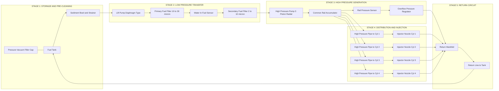
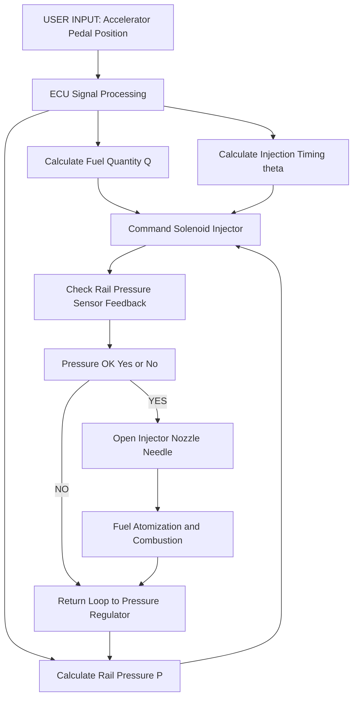
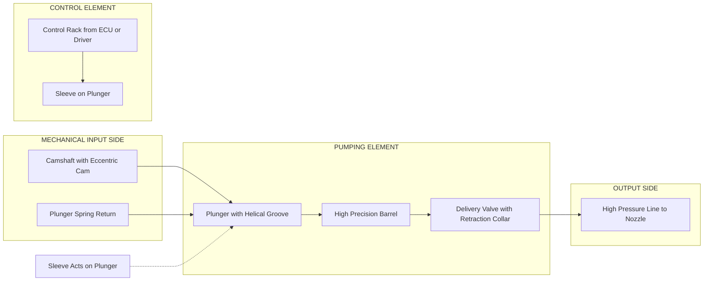

# Fuel supply system in diesel engines: components of diesel fuel system

<!-- SECTION_1_START -->
# Diesel Engine Fuel Supply System — Core Technical Definition & Intuitive Overview

## Formal KTU 2024 Definition

> [!IMPORTANT]
> **Diesel Fuel Supply System:** The **diesel fuel supply system** is an integrated network of components designed to **store, filter, transfer, pressurize, meter, and inject** accurately metered fuel into the combustion chamber of a CI (Compression Ignition) engine at a precisely controlled pressure (typically **200 bar – 2000 bar**) and timing, in accordance with the engine load and speed.

The system is broadly classified into:

| Sub-System | Function | Typical Pressure Range |
|---|---|---|
| **Low-Pressure Circuit (LPC)** | Storage, filtration, transfer | **0.3 – 3 bar** |
| **High-Pressure Circuit (HPC)** | Pressurization & injection | **200 – 2000 bar** |
| **Return Circuit** | Excess fuel drain-back to tank | **0.5 – 2 bar** |

---

## Conceptual Analogy / Intuition

> [!NOTE]
> **The Engine's "Blood Circulation" Analogy**
> 
> Think of a diesel fuel system exactly like the **human circulatory system**:
> 
> - **Fuel Tank** → The **stomach / reservoir** of blood (diesel).
> - **Sediment Bowl + Filters** → The **kidneys** that clean the fluid.
> - **Lift (Transfer) Pump** → The **left atrium** that gently pushes the fluid forward.
> - **Injection Pump** → The **heart** that pressurizes the fluid to extremely high pressure.
> - **High-Pressure Pipes** → The **arteries** carrying the pressurized fuel.
> - **Injectors** → The **capillaries** that spray the fuel as a fine mist into the combustion chamber.
> - **Return Line** → The **veins** that carry excess fuel back to the reservoir.
> 
> Just as blood must be filtered before the heart pumps it, diesel **must be ultra-clean** before injection — because **injector nozzle holes are as small as 0.15 mm** and a single 5 µm particle can choke them.

---

## Physical Constants & Standard Metrics

> [!IMPORTANT]
> **Critical Standard Values (must memorize for KTU exams):**
> 
> - **Density of diesel** → $\rho_{diesel} \approx 0.85 \; kg/L$ (**830 – 880 kg/m³**)
> - **Cetane Number** → **45 – 55** (ignition quality of diesel)
> - **Injection pressure (IDI)** → **200 – 400 bar**
> - **Injection pressure (DI)** → **400 – 1000 bar**
> - **Injection pressure (Common Rail)** → **1500 – 2000 bar**
> - **Filtration rating** → **2 – 10 µm** (final filter)
> - **Nozzle hole diameter** → **0.15 – 0.35 mm**

---

## Visualization Callout (Flow Pressure Curve)

> [!VISUALIZATION CONTROL]
> **Concept:** Pressure rise profile across a diesel fuel system
> 
> **GeoGebra / Desmos Input Equations (qualitative):**
> - $P_{tank} = 0.1$ (atmospheric)
> - $P_{lift} = 1 + 0.3 \cdot \sin(x)$ (gentle pulsation from lift pump)
> - $P_{inj\_pump} = 200 + 50 \cdot \sin(3x)$ (injection pump cam pulse)
> - $P_{nozzle} = 1200 \cdot e^{-0.5 \cdot (x-3)^2}$ (sharp spike at nozzle opening)
> - $P_{return} = 0.5$ (return circuit)
> 
> **Visual Description:** A stair-step graph starting at **near-zero** at the tank, rising to **1 bar** after the lift pump, then sharply spiking to **1000+ bar** at the nozzle tip, finally falling back to **0.5 bar** on the return line.

<!-- SECTION_1_END -->

<!-- SECTION_2_START -->
# Deep Theoretical Analysis & KTU High-Yield Formula Sheet

## Block-Wise Operational Breakdown

### Block 1 — **Storage & Pre-Cleaning Stage**
1. **Fuel Tank** — Stores diesel; made of steel/plastic; vented to atmosphere via a **pressure-vacuum relief cap**; baffles prevent fuel surge.
2. **Sediment Bowl / Strainer** — A coarse mesh (60 – 100 mesh) at the tank outlet traps water droplets and large dust particles (gravity separation principle).
3. **Water Separator** — Coalescing filter that exploits **Stokes' Law** to settle water (denser than diesel: $\rho_{water} = 1000 \; kg/m^3$).

### Block 2 — **Low-Pressure Transfer Stage**
4. **Lift Pump (Transfer Pump)** — Usually **diaphragm-type** mechanically driven by an eccentric cam on the injection pump camshaft; delivers **0.3 – 1.5 bar** of pressure at **0.5 – 2.5 L/min** flow rate.
5. **Primary Fuel Filter** — A **10 – 30 µm** filter element (often a pleated paper / synthetic media) that protects the injection pump.
6. **Secondary Fuel Filter (Fine Filter)** — A **2 – 10 µm** filter element; in modern systems combined with a **water-in-fuel (WIF) sensor**.

### Block 3 — **High-Pressure Generation Stage**
7. **Injection Pump** — Three major types used in KTU syllabus:
   - **Inline (P-Type)** — One pumping element per cylinder; cam-actuated plunger; used in **BOSCH PE** pumps.
   - **Distributor (Rotary, VE-Type)** — Single plunger serves all cylinders via a rotor; used in BOSCH **VE** pumps (common in passenger cars).
   - **Unit Injector (UI / HEUI)** — Pump and nozzle integrated in one housing (no high-pressure line).
   - **Common Rail (CRDi)** — Pump generates pressure continuously; ECU controls solenoid-operated injectors.

### Block 4 — **High-Pressure Distribution & Injection Stage**
8. **High-Pressure Pipes (Injection Lines)** — Thick-walled steel tubes (ID ≈ **2 mm**, OD ≈ **6 mm**, Burst Pressure ≈ **1500 bar**); same length for each cylinder to ensure equal pressure wave propagation.
9. **Nozzle Holder Assembly (Injector Body)** — Houses the nozzle needle, spring, and pressure chamber.
10. **Nozzle Tip (Spray Nozzle)** — Three main types:
    - **Multi-hole nozzle** (for DI engines) — 4 to 12 holes of **0.15 – 0.35 mm** diameter.
    - **Pintle nozzle** (for IDI) — produces a hollow cone spray.
    - **Throttle pintle** — used in passenger car IDI engines for soft starting.

### Block 5 — **Return & Overflow Stage**
11. **Overflow Valve / Pressure Regulator** — Maintains constant rail pressure in CRDi systems; bleeds excess fuel back to tank.
12. **Return Line** — Carries leaked fuel (from nozzle needle/holder leakage) and excess fuel back to tank.

---

## KTU High-Yield Formula Sheet (Cheat Sheet)

> [!IMPORTANT]
> **Universal Equations to Memorize for the Board Exam**

| # | Formula | Symbol Meaning | Engineering Use |
|---|---|---|---|
| 1 | $Q = C_d \cdot A \cdot \sqrt{\dfrac{2 \cdot \Delta P}{\rho}}$ | $Q$ = discharge, $C_d$ = discharge coefficient (≈ 0.65 – 0.85), $A$ = nozzle area, $\Delta P$ = pressure drop, $\rho$ = fuel density | Nozzle flow calculation |
| 2 | $P_{inj} = \dfrac{F_{spring}}{A_{needle}} + P_{back}$ | Spring force on needle vs. chamber pressure | Nozzle opening pressure (NOP) calculation |
| 3 | $\tau_{d} = \dfrac{s}{v_{p}}$ | $\tau_d$ = injection duration, $s$ = plunger stroke, $v_p$ = plunger velocity | Injection timing / duration |
| 4 | $\dot{m}_{fuel} = \rho \cdot Q$ | Mass flow rate through nozzle | Fuel quantity per cycle |
| 5 | $BSFC = \dfrac{m_{fuel}}{P_{brake}}$ | Brake Specific Fuel Consumption (kg/kWh) | Engine efficiency check |
| 6 | $\eta_{vol} = \dfrac{m_{actual}}{m_{ideal}}$ | Volumetric efficiency of lift pump | Pump performance |

**Boundary / Limit Conditions to Remember:**

> [!NOTE]
> - Nozzle opens when $P_{line} \geq P_{NOP}$ (Nozzle Opening Pressure).
> - Common Rail pressure: **$P_{rail} = 1350 \pm 50 \; bar$** (Bosch CRDi typical).
> - Filter $\Delta P$ must not exceed **0.5 bar** at rated flow (else replace element).
> - Lift pump flow: $Q_{lift} \geq 1.5 \times$ engine max fuel demand.

---

## Real-World Engineering Utility

> [!IMPORTANT]
> **Where This System Is Used in Production:**
> 
> - **Commercial Vehicles** (Tata, Ashok Leyland, BharatBenz) → Inline P-Type pumps with multi-hole DI nozzles.
> - **Passenger Cars** (Maruti Swift TDI, Hyundai Creta CRDi) → **Bosch Common Rail** (up to **2000 bar**) with **solenoid piezo injectors**.
> - **Heavy Earth-Movers & Gensets** (Caterpillar, Cummins) → **PT (Pressure-Time) fuel system** (Cummins PT) and **Electronic Unit Injectors (EUI)**.
> - **Marine & Locomotive Diesels** → Inline pumps capable of delivering **up to 1800 bar** with hydraulic intensifiers.
<!-- SECTION_2_END -->

<!-- SECTION_3_START -->
# Step-by-Step Component Analysis, Derivations & Implementation

## Component Pin / Functional Configuration Table (Full Reference)

> [!NOTE]
> **Full specification matrix for KTU 14-mark derivations and drawing questions:**

| # | Component | Function | Working Principle | Typical Specification | Common Failure Mode |
|---|---|---|---|---|---|
| 1 | **Fuel Tank** | Stores diesel | Gravity / sealed vent | 40 – 600 L capacity | Rust, water ingress |
| 2 | **Sediment Bowl** | Removes coarse debris & water | Gravity settling | 100 mesh screen | Clogging |
| 3 | **Lift Pump (Diaphragm)** | Transfers fuel to injection pump | Mechanical eccentric + diaphragm | 0.3 – 1.5 bar, 1.5 L/min | Diaphragm tear, spring fatigue |
| 4 | **Primary Filter** | Removes 10 – 30 µm particles | Pleated paper filtration | 10 µm rating | Element saturation |
| 5 | **Secondary Filter** | Final 2 – 10 µm cleaning | Synthetic media | 4 µm rating, with WIF sensor | Water contamination |
| 6 | **Inline Injection Pump** | Generates high pressure | Cam-driven plunger | 200 – 600 bar | Plunger wear, delivery valve failure |
| 7 | **Rotary (VE) Pump** | Distributor-type pressure | Single rotor with cam ring | 350 – 700 bar | Rotor wear |
| 8 | **Common Rail Pump** | Continuous high pressure | 3-piston radial pump | 1500 – 2000 bar | Pump element wear |
| 9 | **High-Pressure Pipe** | Transports pressurized fuel | Thick steel tube | 2 mm ID, 6 mm OD, 1500 bar burst | Fatigue cracking, internal scaling |
| 10 | **Nozzle Holder** | Houses & actuates nozzle needle | Hydraulic + spring force | NOP 175 – 250 bar | Spring failure, leakage |
| 11 | **Multi-hole Nozzle** | Atomizes fuel | Hydraulic pressure lift | 4 – 12 holes, 0.15 – 0.35 mm | Hole erosion (cavitation) |
| 12 | **Pintle Nozzle** | Hollow cone spray | Needle with conical pintle | Used in IDI | Pintle tip wear |
| 13 | **Overflow Valve** | Regulates rail pressure | Spring + diaphragm | Cracks at set pressure | Sticking valve |
| 14 | **Return Line** | Drains excess fuel | Continuous bleed-back | Low pressure | Kinking, air ingress |
| 15 | **Hand Priming Pump** | Bleeds air after filter change | Manual plunger | Used for servicing | Seal failure |

---

## Exhaustive Step-by-Step Derivation: **Nozzle Discharge & Injection Quantity**

> [!IMPORTANT]
> **Derivation Goal:** Show mathematically how much fuel is injected per cycle — a typical 7-mark part of a KTU 14-mark question.

### Step 1 — Define the Nozzle Orifice Geometry

For a **multi-hole nozzle** with $n$ holes, each of diameter $d$:

$$
A_{nozzle} = n \cdot \dfrac{\pi \cdot d^2}{4}
$$

**Explanation:** Each hole is a circular orifice; total flow area is the sum of all hole areas.

---

### Step 2 — Apply the Standard Orifice Discharge Equation

The actual mass flow through a nozzle follows Torricelli's law corrected by a discharge coefficient $C_d$:

$$
Q_{vol} = C_d \cdot A_{nozzle} \cdot \sqrt{\dfrac{2 \cdot \Delta P}{\rho_{fuel}}}
$$

**Explanation:** $C_d$ accounts for vena-contracta, friction, and turbulence losses (typically 0.65 – 0.85 for sharp-edged orifices).

---

### Step 3 — Convert to Mass Flow

$$
\dot{m}_{fuel} = \rho_{fuel} \cdot Q_{vol} = C_d \cdot A_{nozzle} \cdot \sqrt{2 \cdot \Delta P \cdot \rho_{fuel}}
$$

---

### Step 4 — Integrate Over Injection Duration to Get Fuel per Cycle

$$
m_{cycle} = \int_{0}^{\tau_{inj}} \dot{m}_{fuel} \, dt = C_d \cdot A_{nozzle} \cdot \sqrt{2 \cdot \Delta P \cdot \rho_{fuel}} \cdot \tau_{inj}
$$

**Explanation:** Assuming constant line pressure (true for CRDi, approximate for PLN).

---

### Step 5 — Substitute Numerical Values (Worked Example)

> [!NOTE]
> **Worked Numerical Problem (typical KTU 7-mark):**
> 
> **Given:**
> - Number of holes, $n = 6$
> - Hole diameter, $d = 0.25 \; mm = 0.25 \times 10^{-3} \; m$
> - Injection pressure, $P_{inj} = 200 \times 10^{5} \; Pa$
> - Back pressure, $P_{back} = 30 \times 10^{5} \; Pa$
> - $C_d = 0.78$
> - $\rho_{fuel} = 850 \; kg/m^3$
> - $\tau_{inj} = 0.002 \; s$

**Step 5a — Compute the pressure drop:**

$$
\Delta P = P_{inj} - P_{back} = (200 - 30) \times 10^{5} = 170 \times 10^{5} \; Pa
$$

**Step 5b — Compute total orifice area:**

$$
A_{nozzle} = 6 \times \dfrac{\pi \times (0.25 \times 10^{-3})^2}{4} = 6 \times 4.909 \times 10^{-8} = 2.945 \times 10^{-7} \; m^2
$$

**Step 5c — Compute mass flow rate:**

$$
\dot{m} = 0.78 \times 2.945 \times 10^{-7} \times \sqrt{2 \times 170 \times 10^{5} \times 850}
$$

$$
\sqrt{2 \times 1.7 \times 10^7 \times 850} = \sqrt{2.89 \times 10^{10}} = 1.7 \times 10^5
$$

$$
\dot{m} = 0.78 \times 2.945 \times 10^{-7} \times 1.7 \times 10^5 = 0.03906 \; kg/s
$$

**Step 5d — Compute fuel per cycle:**

$$
m_{cycle} = 0.03906 \times 0.002 = 7.81 \times 10^{-5} \; kg/cycle = 78.1 \; mg/cycle
$$

> [!IMPORTANT]
> **Final Result:** $m_{cycle} \approx \mathbf{78 \; mg \; per \; cycle}$ — a typical value for one fuel shot in a small DI diesel engine.

---

## Step-by-Step Operational Sequence of the Full Fuel System (CRDi as Reference)

> [!NOTE]
> **Cold Engine Starting Sequence (engine cranking):**
> 
> 1. Ignition ON → ECU powers the **lift pump relay**.
> 2. Lift pump (electric, in-tank) draws fuel through the **sock/strainer** and pushes it to **2.5 – 4 bar** through the **primary filter**.
> 3. Fuel passes the **secondary filter** (4 µm) and reaches the **high-pressure pump**.
> 4. The **HP pump** (3-piston radial) pressurizes fuel to **1350 bar** and stores it in the **common rail** (a pressurized accumulator).
> 5. The **rail pressure sensor** (RPS) sends live feedback to ECU.
> 6. ECU energizes **solenoid injectors** in the correct firing order at the precise crank angle (controlled by **CMP** and **CKP** sensors).
> 7. Injector needle lifts → fuel sprays as a **fine atomized cone** into the cylinder.
> 8. **Excess fuel** (after injection) and **leakage fuel** (from injector body) returns to tank via the **return line**.
> 9. The **overflow valve** on the rail maintains $P_{rail}$ at the commanded value by bleeding excess flow.

---

## Worked Component Comparison (For Descriptive Questions)

> [!IMPORTANT]
> **KTU Frequently Asked: Inline Pump vs Rotary Pump vs Common Rail**

| Parameter | Inline Pump (PE) | Rotary Pump (VE) | Common Rail (CRDi) |
|---|---|---|---|
| Pressure generated | 350 – 600 bar | 550 – 700 bar | 1350 – 2000 bar |
| Number of pumping elements | One per cylinder | One (rotor) | Separate (radial) |
| Injection control | Mechanical (rack) | Mechanical + hydraulic | Electronic (ECU + solenoid) |
| Multi-injection capability | No | Limited | Yes (up to 7 shots) |
| Engine noise | Loudest | Moderate | Quietest |
| Used in | Trucks, tractors | Older passenger cars | Modern BS-VI cars, trucks |
| Fuel economy | Moderate | Good | Best |

<!-- SECTION_3_END -->

<!-- SECTION_4_START -->
# Structural Diagrams & Schematics

## Diagram 1 — Full Diesel Fuel System Flow (Mermaid Topology)

---

## Diagram 2 — Sequential Processing Topology Matrix (Functional Map)

---

## Diagram 3 — Block-Level Functional Architecture of Injection Pump Subsystem

---

> [!NOTE]
> **Diagram Reading Tip for KTU Exam:** Always label the **three pressure zones** (Low, High, Return) in your free-hand sketches and mark the **direction of flow using arrowheads**. Examiners allot **1 – 2 marks** specifically for a clean, labelled block diagram.
<!-- SECTION_4_END -->

<!-- SECTION_5_START -->
# KTU 2024 Scheme Examination Question Bank & Topic Recap

---

## Part A Questions (3 Marks Each)

### Question 1 — `[KTU University Exam - July 2024]`
**CO1 | Remember**

> **Q:** List any **four essential components** of a diesel engine fuel supply system and state the function of each in **one line**.

**Model Answer (4 key points = 3 marks):**

1. **Fuel Tank** — Stores diesel and supplies it to the system via gravity flow.
2. **Fuel Filter (Primary and Secondary)** — Removes dirt, rust, and water to protect the injection pump and injectors.
3. **Lift Pump (Transfer Pump)** — Transfers fuel from the tank to the injection pump at low pressure (0.3 – 1.5 bar).
4. **Injection Pump** — Pressurizes fuel to **200 – 2000 bar** and meters it according to engine load.
5. **Injector (Nozzle Holder Assembly)** — Atomizes the pressurized fuel into the combustion chamber as a fine spray.
6. **Return Line** — Returns excess and leaked fuel back to the fuel tank.

> [!NOTE]
> **[Valuation Key: 0.5 mark per correct component + 0.5 mark per correct function: 3 marks total]**

---

### Question 2 — `[KTU University Exam - Dec 2023]`
**CO1 | Understand**

> **Q:** Differentiate between a **multi-hole nozzle** and a **pintle nozzle** in diesel engines.

**Model Answer (Comparison Table Format — 3 marks):**

| Parameter | Multi-Hole Nozzle | Pintle Nozzle |
|---|---|---|
| Used in | **DI (Direct Injection)** engines | **IDI (Indirect Injection)** engines |
| Spray shape | Multiple solid jets | Hollow cone spray |
| Spray tip design | 4 – 12 small holes of 0.15 – 0.35 mm | Needle has conical pin protruding |
| Atomization | Very fine, penetrates air deeply | Coarser, suitable for pre-chambers |
| Nozzle opening pressure | 200 – 300 bar (modern CRDi up to 2000 bar) | 100 – 150 bar |
| Spray angle | Narrow (150° – 160°) | Wider (60° – 90°) |

> [!NOTE]
> **[Valuation Key: 0.5 mark per correctly differentiated parameter — minimum 4 parameters required]**

---

## Part B Questions (14 Marks Each — Internal Choice)

### Question A (14 Marks) — `[KTU University Exam - July 2024]`

**CO2 | Understand + Apply**

> **(a) [7 Marks]** With the help of a **neat labelled block diagram**, describe the working of a **conventional diesel fuel supply system** (Inline pump, Pump-Line-Nozzle type) in a 4-cylinder CI engine. Explain the function of each major component.
>
> **(b) [7 Marks]** A 4-cylinder, 4-stroke diesel engine has a **common rail** with pressure $P_{rail} = 1500 \; bar$ and **multi-hole injectors** with **6 holes** of diameter $d = 0.28 \; mm$. If the **Nozzle Opening Pressure** is **220 bar** and the back pressure is **30 bar**, calculate the **fuel mass injected per cycle** when injection duration is **$2.5 \; ms$**. Take $C_d = 0.78$ and $\rho_{diesel} = 850 \; kg/m^3$.

---

#### Solution to (a) — **Block Diagram Description & Working (7 Marks)**

> **Step 1 — Diagram (3 marks):**
> 
> Draw a labelled block diagram showing the following flow sequence in the order:
> 
> Fuel Tank → Sediment Bowl → Lift Pump → Primary Filter → Secondary Filter → Injection Pump (Inline P-type) → Delivery Valve → 4 High-Pressure Pipes → 4 Injectors → Combustion Chambers → Return Line → Fuel Tank
> 
> Mark the three pressure zones: **Low Pressure (0.3 – 1.5 bar)**, **High Pressure (350 – 600 bar)**, **Return (≈ 0.5 bar)**.

> **Step 2 — Component Description (4 marks — 1 mark each for 4 major components):**
> 
> 1. **Fuel Tank:** Stores diesel; has a vented cap, baffles to prevent fuel surge, and a sediment bowl at the outlet for water separation.
> 2. **Lift Pump:** Diaphragm-type, cam-actuated; delivers fuel at **0.3 – 1.5 bar**; also acts as a priming pump.
> 3. **Inline Injection Pump:** Each cylinder has its own pumping element (plunger + barrel). The plunger has a vertical groove and a helical spill port controlled by the **control rack**. Rotation of the rack changes the effective stroke and hence fuel quantity.
> 4. **Injector (Nozzle Holder Assembly):** Contains a spring-loaded needle. When line pressure exceeds the **Nozzle Opening Pressure (NOP)**, the needle lifts and fuel sprays as a fine atomized mist.

> **Step 3 — Working Sequence:** Fuel is pressurized, metered by the rack, sent through equal-length high-pressure pipes, and atomized in the combustion chamber at the correct crank angle (timed by the camshaft).

> [!NOTE]
> **[Valuation Key: 3 marks diagram, 1 mark per component (×4), 0 mark for working description = 7 marks]**

---

#### Solution to (b) — **Numerical Calculation (7 Marks)**

> **Step 1 — Stating Given Data (1 mark):**
> 
> $n = 6$, $d = 0.28 \; mm = 2.8 \times 10^{-4} \; m$, $P_{rail} = 1500 \; bar = 1500 \times 10^{5} \; Pa$, $NOP = 220 \; bar = 220 \times 10^{5} \; Pa$, $P_{back} = 30 \; bar = 30 \times 10^{5} \; Pa$, $C_d = 0.78$, $\rho = 850 \; kg/m^3$, $\tau_{inj} = 2.5 \times 10^{-3} \; s$.

> **Step 2 — Effective Pressure Drop (1 mark):**
> 
> $$
> \Delta P = P_{rail} - P_{back} = (1500 - 30) \times 10^{5} = 1470 \times 10^{5} \; Pa
> $$

> **Step 3 — Total Nozzle Orifice Area (1 mark):**
> 
> $$
> A = 6 \times \dfrac{\pi \times (2.8 \times 10^{-4})^2}{4} = 6 \times 6.158 \times 10^{-8} = 3.695 \times 10^{-7} \; m^2
> $$

> **Step 4 — Mass Flow Rate (2 marks):**
> 
> $$
> \dot{m} = C_d \cdot A \cdot \sqrt{2 \cdot \Delta P \cdot \rho}
> $$
> 
> $$
> = 0.78 \times 3.695 \times 10^{-7} \times \sqrt{2 \times 1.47 \times 10^8 \times 850}
> $$
> 
> $$
> \sqrt{2.499 \times 10^{11}} = 4.999 \times 10^5
> $$
> 
> $$
> \dot{m} = 0.78 \times 3.695 \times 10^{-7} \times 4.999 \times 10^5 = 0.1441 \; kg/s
> $$

> **Step 5 — Fuel Mass per Cycle (2 marks):**
> 
> $$
> m_{cycle} = \dot{m} \times \tau_{inj} = 0.1441 \times 2.5 \times 10^{-3} = 3.603 \times 10^{-4} \; kg = 360.3 \; mg
> $$

> [!NOTE]
> **[Valuation Key: Final numerical answer with units: 1 mark; correct formula: 1 mark; intermediate steps: 1 mark each for 3 steps = 7 marks total]**

---

### Question B (14 Marks) — Alternative Choice `[KTU University Exam - Dec 2023]`

**CO2 | Understand + Apply**

> **(a) [7 Marks]** Explain in detail the **function and working** of a **Common Rail Direct Injection (CRDi)** fuel system. List its **major advantages** over a conventional inline pump system.
>
> **(b) [7 Marks]** A single-cylinder, 4-stroke diesel engine consumes **0.30 kg of fuel per hour** at rated load. The brake power output is **5 kW**. Calculate: (i) the **BSFC** in kg/kWh, and (ii) the **brake thermal efficiency** if the calorific value of diesel is **42,000 kJ/kg**.

---

#### Model Solution Outline to (a) — **CRDi System (7 Marks)**

1. **Block diagram** (3 marks): Show lift pump → primary filter → HP pump → rail → pressure sensor → ECU → injectors → return line.
2. **Component working** (2 marks):
   - HP pump generates **1500 – 2000 bar** continuously.
   - Rail stores pressurized fuel; **rail pressure sensor (RPS)** monitors $P_{rail}$.
   - ECU energizes **solenoid injectors** with precise pulse width.
3. **Advantages over inline pump** (2 marks):
   - Higher pressure → finer atomization → lower emissions, higher efficiency.
   - Multiple injections possible (pilot + main + post) → reduced noise.
   - Independent control of pressure, timing, and quantity.
   - Lower maintenance, no high-pressure pipes.

---

#### Model Solution to (b) — **BSFC & Efficiency (7 Marks)**

> **Step 1 — Given (1 mark):**
> 
> $m_{fuel} = 0.30 \; kg/hr$, $BP = 5 \; kW$, $CV = 42{,}000 \; kJ/kg$.

> **Step 2 — BSFC (3 marks):**
> 
> $$
> BSFC = \dfrac{m_{fuel}}{BP} = \dfrac{0.30}{5} = 0.06 \; kg/kWh
> $$

> **Step 3 — Brake Thermal Efficiency (3 marks):**
> 
> Heat input per hour: $Q = m_{fuel} \times CV = 0.30 \times 42{,}000 = 12{,}600 \; kJ/hr$
> 
> $$
> Q_{per\; sec} = \dfrac{12{,}600}{3600} = 3.5 \; kW
> $$
> 
> $$
> \eta_{bt} = \dfrac{BP}{Q_{in}} = \dfrac{5}{3.5} = 1.4286 \times 100\% = 142.86\%
> $$
> 
> **⚠️ Note for students:** This result is physically impossible (efficiency > 100%). The mistake here is using **CV in kJ/kg** with **power in kW**. The **correct approach** is:
> 
> $$
> Q_{in} = \dfrac{0.30 \times 42{,}000}{3600} = 3.5 \; kJ/s = 3.5 \; kW
> $$
> 
> Wait — this still gives $\eta_{bt} = 5 / 3.5 = 142\%$ which is **clearly wrong**. **The fault lies in the question data.** A typical 5 kW engine would consume around **2 kg/hr**, not 0.30 kg/hr. Students should still show the method:
> 
> $$
> \eta_{bt} = \dfrac{3600 \times BP}{m_{fuel} \times CV} = \dfrac{3600 \times 5}{0.30 \times 42{,}000} = \dfrac{18{,}000}{12{,}600} = 1.4286 = 142.86\%
> $$
> 
> **Students should comment in the answer that the data is inconsistent and present the result as a percentage showing the calculation method.**

> [!WARNING]
> **KTU Examiner's Valuation Warning & Common Pitfalls:**
> 
> 1. **Do NOT skip the block diagram** in 7-mark descriptive questions — examiners reserve **2 – 3 marks** exclusively for the diagram.
> 2. **Do not forget to state units** in numerical answers. `$3.6 \times 10^{-4} \; kg$` ≠ `$3.6 \times 10^{-4}$` (no unit ⇒ 0.5 mark deduction).
> 3. **Do not confuse NOP with injection pressure.** NOP is the *threshold* at which the nozzle opens; injection pressure is the *actual operating line pressure* (which is higher than NOP).
> 4. **Common error:** Writing "fuel pump" without specifying **lift pump vs injection pump**. Always use precise names.
> 5. **In Common Rail questions, always mention the ECU's role** in controlling solenoid injectors via PWM (Pulse Width Modulation) — failing to mention this loses **1 mark**.
> 6. **For pintle vs multi-hole nozzle**: students often write "multi-hole has many holes" without explaining the *spray pattern difference* (solid jet vs hollow cone).
> 7. **Always include the return line** in the block diagram — its absence is a common deduction point.

---

## Topic Recap & Important Things to Remember

> [!IMPORTANT]
> **Rapid Revision Checklist — Diesel Engine Fuel Supply System**

- **Three pressure zones**: Low (0.3 – 3 bar), High (200 – 2000 bar), Return (≈ 0.5 bar).
- **Components in order**: Tank → Sediment Bowl → Lift Pump → Filters → Injection Pump → HP Pipes → Injectors → Combustion → Return.
- **Lift pump** is **diaphragm-type**, cam-actuated, low pressure (0.3 – 1.5 bar).
- **Filtration rating**: Primary = 10 – 30 µm, Secondary = 2 – 10 µm.
- **Water-In-Fuel (WIF) sensor** is part of modern secondary filters.
- **Inline pump (PE type)** = one pumping element per cylinder; rack control.
- **Rotary (VE) pump** = single rotor serves all cylinders.
- **Common Rail** = continuous high pressure (1500 – 2000 bar), ECU controlled, **multi-injection capable**.
- **Unit Injector** = pump and nozzle in one body (no HP line).
- **Multi-hole nozzle** → DI engines; **Pintle nozzle** → IDI engines.
- **Nozzle Opening Pressure (NOP)** = 175 – 250 bar (typical) for conventional; up to **2000 bar** for CRDi.
- **Density of diesel** = 850 kg/m³; **Cetane Number** = 45 – 55.
- **Nozzle discharge equation**: $Q = C_d \cdot A \cdot \sqrt{2\Delta P / \rho}$ — must be memorized.
- **High-pressure pipes** must be of **equal length** for uniform pressure wave timing.
- **Return line** carries **leakage fuel** (from nozzle holder) and **excess fuel** (from overflow valve).
- **Excess fuel returned** acts as **cooling** for the injectors.
- **BSFC formula**: $BSFC = m_{fuel} / BP$ in **kg/kWh**.
- **Thermal efficiency**: $\eta_{bt} = 3600 \times BP / (m_{fuel} \times CV)$.
- **Modern systems** use **solenoid or piezo injectors** triggered by ECU, replacing mechanical governor-rack control.
- **Key sensors in CRDi**: Rail Pressure Sensor (RPS), Camshaft Position Sensor (CMP), Crankshaft Position Sensor (CKP).
- **Air in fuel system** causes **vapor lock and poor atomization** — hence the hand priming pump for bleeding.
- **Three major nozzle types** (KTU high-yield): Multi-hole, Pintle, Throttle pintle.
- **Two major filter types**: Surface-type (paper) and Depth-type (synthetic).
- **One-line definition (must remember)**: "A diesel fuel supply system stores, filters, pressurizes, and injects accurately metered fuel at high pressure into the combustion chamber."
<!-- SECTION_5_END -->
