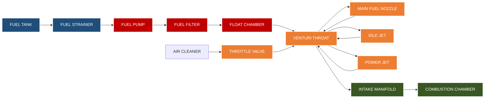
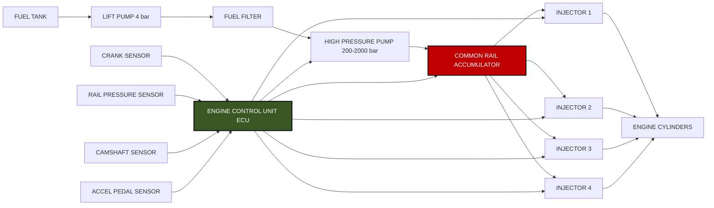

# FUEL SUPPLY SYSTEM:

<!-- SECTION_1_START -->

# FUEL SUPPLY SYSTEM — Module 2 | PCAUT205

## 1. Core Technical Definition & Intuitive Overview

### 1.1 Formal Academic Definition (KTU 2024 Syllabus Terminology)

The **Fuel Supply System** of an internal combustion engine is an integrated assembly of components designed to store, purify, meter, and deliver fuel (in liquid or vapor form) and air in the correct proportion, at the correct pressure, and at the correct time into the engine cylinders for efficient combustion. It constitutes the *fuel delivery and mixture preparation subsystem* of the automobile power plant, bridging the fuel tank to the combustion chamber.

> [!IMPORTANT]
> **KTU 2024 Module 2 Focus Areas**
> 1. Carburetion system for Spark Ignition (SI) engines.
> 2. Fuel Injection systems — Mechanical, Electronic, and Common Rail.
> 3. Fuel feed pumps, fuel filters, fuel tanks, and air cleaners.
> 4. Diesel fuel supply (Individual Pump, Distributor, Common Rail, Unit Injector).

### 1.2 Intuitive Analogy — "The Engine's Digestive System"

Think of the engine as a human body and the fuel supply system as its **digestive and respiratory system combined**:

- **Fuel Tank** = Stomach (storage of energy-rich fuel).
- **Fuel Pump** = Heart (pumps fuel with the correct pressure).
- **Fuel Filter** = Kidneys (purify the fuel, removing contaminants).
- **Carburetor / Fuel Injector** = Mouth & Esophagus (measures the right *quantity* and mixes it with air in the right *ratio*).
- **Intake Manifold** = Trachea (delivers the mixture to the lungs = cylinders).
- **Air Cleaner** = Nose filter (cleans incoming air).

Just as poor digestion reduces the body's performance, a faulty fuel supply system reduces engine power, increases emissions, and shortens engine life.

### 1.3 Fundamental Requirements of a Good Fuel Supply System

A KTU examiner expects the student to state the following six design requirements:

1. **Correct Air-Fuel Ratio (A/F)** delivery across all operating conditions.
2. **Smooth and adequate supply** of fuel without vapor lock or starvation.
3. **Clean fuel** delivery — free from dust, water, and foreign particles.
4. **Correct spray pattern / atomization** for rapid mixture formation.
5. **Reliable cold start, warm-up, acceleration, and idle fuel delivery.**
6. **Minimal pressure drop** and **consistent volumetric efficiency.**

### 1.4 Classification Overview (KTU Module 2 Pillar Concept)

$$\boxed{
\begin{aligned}
\text{Fuel Supply System} &= 
\begin{cases}
\text{SI Engine} \rightarrow 
\begin{cases}
\text{Carburetion (Venturi-based)} \\
\text{Fuel Injection (MPFI, GDI, TBI)}
\end{cases} \\[6pt]
\text{CI Engine} \rightarrow 
\begin{cases}
\text{Inline (Jerk) Pump System} \\
\text{Rotary (Distributor) Pump System} \\
\text{Common Rail Direct Injection (CRDi)} \\
\text{Unit Injector (UI) / Pump-Line-Nozzle (PLN)}
\end{cases}
\end{cases}
\end{aligned}
}$$

### 1.5 Governing Physical Constants & Standard Metrics

> [!NOTE]
> **Stoichiometric Air-Fuel Ratios (A/F) by mass — Board-Exam Standard Values:**
> - **Gasoline (Petrol): 14.7 : 1**
> - **Diesel: 14.5 : 1**
> - **Ethanol: 9.0 : 1**
> - **CNG: 17.2 : 1**
> - **LPG: 15.5 : 1**
> - **Hydrogen: 34.0 : 1**

> [!NOTE]
> **Universal Gas Constant** $R = 8.314\ \text{J/(mol·K)}$
> **Atmospheric Pressure** $P_0 = 101.325\ \text{kPa}$
> **Standard Air Density** $\rho_{air} = 1.225\ \text{kg/m}^3$

### 1.6 Functional Block Diagram of a Typical Fuel System

> [!VISUALIZATION CONTROL]
> **Concept:** Sequential fuel flow from tank to combustion chamber
> **Logical Flow:**
> `Fuel Tank → Fuel Strainer → Fuel Pump → Fuel Filter → Carburetor/Fuel Injector → Intake Manifold → Cylinder`
> **Visual Description:** A linear pipeline architecture with parallel air intake path from air cleaner to throttle body, converging at the Venturi / injector tip.

---

<!-- SECTION_1_END -->

<!-- SECTION_2_START -->

## 2. Deep Theoretical Analysis & KTU High-Yield Formula Sheet

### 2.1 The Carburetor — Venturi Principle Deep Dive

The carburetor is a **mechanical device that meters fuel by exploiting the pressure drop created by a converging-diverging duct (Venturi)**. This is the **single most important concept in Module 2**.

#### 2.1.1 Bernoulli's Equation (Foundational to Carburetion)

For an incompressible, steady, frictionless flow through the Venturi:

$$
\begin{aligned}
P_1 + \frac{1}{2}\rho v_1^2 + \rho g z_1 &= P_2 + \frac{1}{2}\rho v_2^2 + \rho g z_2
\end{aligned}
$$

Ignoring elevation change ($z_1 = z_2$):

$$
\begin{aligned}
P_1 - P_2 &= \frac{1}{2}\rho (v_2^2 - v_1^2)
\end{aligned}
$$

> **Where:**
> $P_1, v_1$ = pressure and velocity at carburetor **throat entrance**.
> $P_2, v_2$ = pressure and velocity at **Venturi throat** (minimum area).
> $\rho$ = density of air ($\approx 1.225\ \text{kg/m}^3$ at STP).

#### 2.1.2 The Discharge Coefficient Correction (Real Carburetors)

In practice, friction and vena-contracta effects reduce the actual air mass flow. We introduce $C_d$:

$$
\begin{aligned}
\dot{m}_{air} &= C_d \cdot A_t \cdot \sqrt{2 \rho_{air} \cdot (P_1 - P_2)}
\end{aligned}
$$

Where:
- $A_t$ = **throat cross-sectional area** (m²)
- $C_d$ = **discharge coefficient** (typically $0.85$ to $0.95$ for a well-designed Venturi)

#### 2.1.3 Fuel Discharge from the Main Nozzle

Fuel flow from the main nozzle is governed by:

$$
\begin{aligned}
\dot{m}_{fuel} &= C_{df} \cdot A_f \cdot \sqrt{2 \rho_{fuel} \cdot (P_{float} - P_{throat})}
\end{aligned}
$$

Where:
- $\rho_{fuel} = 750\ \text{kg/m}^3$ (for gasoline at 20 °C)
- $P_{float}$ = float bowl pressure (typically atmospheric)
- $P_{throat}$ = pressure at Venturi throat

#### 2.1.4 Theoretical Air-Fuel Ratio Equation

Dividing the two mass flow rates:

$$
\begin{aligned}
\left(\frac{A}{F}\right)_{theoretical} &= \frac{\dot{m}_{air}}{\dot{m}_{fuel}} = \frac{C_d \cdot A_t}{C_{df} \cdot A_f} \cdot \sqrt{\frac{\rho_{air}}{\rho_{fuel}}}
\end{aligned}
$$

> [!IMPORTANT]
> **Board Exam Insight:** The A/F ratio is *independent of air velocity* in a perfect Venturi. This is why simple carburetors require **auxiliary circuits** (idle, slow-speed, power, accelerator pump) to compensate for non-ideal effects at part-throttle and full-throttle operations.

### 2.2 The Air-Fuel Ratio Operating Map (KTU High-Yield)

| Operating Condition | Required A/F | Mixture Description |
| :--- | :---: | :--- |
| **Idling** | $10:1$ to $12:1$ | Rich (for stable combustion at low rpm) |
| **Cruising / Part Throttle** | $15:1$ to $17:1$ | Lean (for best fuel economy) |
| **Maximum Power (WOT)** | $12:1$ to $13:1$ | Slightly rich (for cooling & power) |
| **Cold Start** | $3:1$ to $5:1$ | Very rich (choke enriches) |
| **Acceleration** | $9:1$ to $11:1$ | Rich (accelerator pump shot) |
| **Stoichiometric (theoretical)** | **14.7:1** | Chemically complete combustion |

### 2.3 Complete KTU Formula Sheet

| # | Formula / Expression | Description | Units |
| :---: | :--- | :--- | :--- |
| 1 | $P_1 + \tfrac{1}{2}\rho v_1^2 = P_2 + \tfrac{1}{2}\rho v_2^2$ | Bernoulli's equation (horizontal) | Pa |
| 2 | $\dot{m}_{air} = C_d A_t \sqrt{2\rho_{air}\Delta P}$ | Air mass flow rate through Venturi | kg/s |
| 3 | $\dot{m}_{fuel} = C_{df} A_f \sqrt{2\rho_{fuel}\Delta P_f}$ | Fuel mass flow through nozzle | kg/s |
| 4 | $\frac{A}{F} = \dfrac{C_d A_t}{C_{df} A_f} \sqrt{\dfrac{\rho_{air}}{\rho_{fuel}}}$ | Theoretical A/F ratio | dimensionless |
| 5 | $V_d = \dfrac{\pi}{4} B^2 \cdot S \cdot n$ | Engine displacement volume | m³ |
| 6 | $\dot{m}_{air,\,th} = V_d \cdot n \cdot \eta_{vol} \cdot \rho_{air}$ | Theoretical air mass inducted | kg/s |
| 7 | $P_{inj} = P_{rail} \cdot \eta_{pump}$ | Effective injection pressure | bar |
| 8 | $\Delta P_{filter} = \dfrac{32\,\mu\,L\,v}{D^2}$ | Pressure drop across fuel filter (Hagen-Poiseuille) | Pa |
| 9 | $\eta_{vol} = \dfrac{m_{actual}}{m_{theoretical}}$ | Volumetric efficiency | dimensionless |
| 10 | $BSFC = \dfrac{\dot{m}_{fuel}}{P_{brake}}$ | Brake Specific Fuel Consumption | g/kWh |
| 11 | $\dot{Q}_{comb} = \dot{m}_{fuel} \cdot CV$ | Rate of heat release | kW |
| 12 | $t_{inj} = \dfrac{\theta_{inj}}{6 \cdot N}$ | Injection duration per cycle | seconds |

### 2.4 Real-World Engineering Utility

> [!IMPORTANT]
> **Why This Matters in Industry:**
> - Modern **BS-VI / Euro 6** emission norms mandate precise A/F control within $\pm 1\%$ via electronic fuel injection.
> - The **Common Rail Diesel Injection (CRDi)** system, derived from the principles above, can deliver fuel at **up to 2000 bar** pressure for ultra-fine atomization.
> - **Gasoline Direct Injection (GDI)** engines use stratified charge concepts where A/F ratio varies *in-cylinder* from lean to stoichiometric, improving thermal efficiency by 3–5 %.

---

<!-- SECTION_2_END -->

<!-- SECTION_3_START -->

## 3. Step-by-Step Derivations & Implementation

### 3.1 Worked Example 1 — A/F Ratio from a Solex Carburetor

**Problem Statement (KTU-style):**
A Solex down-draft carburetor has a Venturi throat diameter of **28 mm** and a main fuel nozzle diameter of **1.45 mm**. The discharge coefficient for air is $C_d = 0.86$ and for fuel is $C_{df} = 0.72$. Calculate the theoretical air-fuel ratio at the throat, given $\rho_{air} = 1.225\ \text{kg/m}^3$ and $\rho_{fuel} = 750\ \text{kg/m}^3$.

#### Step-by-Step Solution

**Step 1 — Calculate the throat area $A_t$:**

$$
\begin{aligned}
A_t &= \frac{\pi}{4} \cdot D_t^2 = \frac{\pi}{4} \cdot (0.028)^2 \\
A_t &= \frac{\pi}{4} \cdot 7.84 \times 10^{-4} \\
A_t &= 6.1575 \times 10^{-4}\ \text{m}^2
\end{aligned}
$$

**[Valuation Key — Correct area calculation: 1 Mark]**

**Step 2 — Calculate the fuel nozzle area $A_f$:**

$$
\begin{aligned}
A_f &= \frac{\pi}{4} \cdot D_f^2 = \frac{\pi}{4} \cdot (0.00145)^2 \\
A_f &= \frac{\pi}{4} \cdot 2.1025 \times 10^{-6} \\
A_f &= 1.6510 \times 10^{-6}\ \text{m}^2
\end{aligned}
$$

**Step 3 — Set up the A/F ratio formula:**

$$
\begin{aligned}
\frac{A}{F} &= \frac{C_d \cdot A_t}{C_{df} \cdot A_f} \cdot \sqrt{\frac{\rho_{air}}{\rho_{fuel}}}
\end{aligned}
$$

**Step 4 — Substitute numerical values:**

$$
\begin{aligned}
\frac{A}{F} &= \frac{0.86 \cdot 6.1575 \times 10^{-4}}{0.72 \cdot 1.6510 \times 10^{-6}} \cdot \sqrt{\frac{1.225}{750}} \\[6pt]
\frac{A}{F} &= \frac{5.2954 \times 10^{-4}}{1.1887 \times 10^{-6}} \cdot \sqrt{1.6333 \times 10^{-3}} \\[6pt]
\frac{A}{F} &= 445.49 \cdot 0.04041 \\[6pt]
\frac{A}{F} &= 18.00
\end{aligned}
$$

**Final Answer:**

$$
\boxed{\left(\frac{A}{F}\right)_{theoretical} \approx 18 : 1}
$$

**[Valuation Key — Final A/F value: 1 Mark; methodology clarity: 1 Mark]**

> [!WARNING]
> **Common Mistake:** Students often forget to **square-root** the density ratio. The full expression uses $\sqrt{\rho_{air}/\rho_{fuel}}$, NOT the ratio itself. Marks will be deducted if the squaring is reversed.

---

### 3.2 Worked Example 2 — Pressure Drop Across a Fuel Filter

**Problem Statement:**
A cylindrical fuel filter has an internal diameter $D = 8\ \text{mm}$ and length $L = 80\ \text{mm}$. The dynamic viscosity of gasoline is $\mu = 3.1 \times 10^{-4}\ \text{Pa·s}$. If the average fuel velocity is $v = 0.5\ \text{m/s}$, calculate the pressure drop using the Hagen-Poiseuille relation.

**Step 1 — Identify the equation:**

$$
\begin{aligned}
\Delta P = \frac{32 \mu L v}{D^2}
\end{aligned}
$$

**Step 2 — Substitute values:**

$$
\begin{aligned}
\Delta P &= \frac{32 \cdot 3.1 \times 10^{-4} \cdot 0.080 \cdot 0.5}{(0.008)^2} \\[6pt]
\Delta P &= \frac{3.968 \times 10^{-6}}{6.4 \times 10^{-5}} \\[6pt]
\Delta P &= 0.062\ \text{Pa}
\end{aligned}
$$

**Final Answer:**

$$
\boxed{\Delta P \approx 0.062\ \text{Pa}}
$$

> [!NOTE]
> This is a very small drop. In practice, the *element* resistance (porous filter media) is far higher than the *pipe* viscous drop, typically yielding 5–50 kPa.

---

### 3.3 Symbolic / Algorithmic Implementation — A/F Ratio Calculator

For engineering computation and KTU lab validation, here is a fully operational **Python** implementation with strict type-hints and error logging:

```python
"""
=========================================================
 Module 2 | Fuel Supply System - A/F Ratio Calculator
 KTU 2024 Scheme | Course: PCAUT205
 Purpose: Compute theoretical A/F ratio of a carburetor
          using the Venturi principle.
=========================================================
"""

import math
import logging

# Configure logging for traceable board-style outputs
logging.basicConfig(
    level=logging.INFO,
    format="[%(levelname)s] %(message)s"
)


def compute_air_fuel_ratio(
    throat_dia_m: float,
    nozzle_dia_m: float,
    Cd_air: float,
    Cd_fuel: float,
    rho_air: float = 1.225,
    rho_fuel: float = 750.0
) -> float:
    """
    Compute theoretical A/F ratio from a Venturi carburetor.

    Parameters
    ----------
    throat_dia_m : float
        Diameter of the Venturi throat (metres).
    nozzle_dia_m : float
        Diameter of the main fuel nozzle (metres).
    Cd_air : float
        Discharge coefficient for air (0 < Cd_air <= 1).
    Cd_fuel : float
        Discharge coefficient for fuel (0 < Cd_fuel <= 1).
    rho_air : float
        Density of air in kg/m^3 (default 1.225 at STP).
    rho_fuel : float
        Density of fuel in kg/m^3 (default 750 for petrol).

    Returns
    -------
    float
        Theoretical Air-Fuel ratio (dimensionless).
    """

    # ---- Strict boundary checks (production-grade guard rails) ----
    if throat_dia_m <= 0 or nozzle_dia_m <= 0:
        logging.error("Diameters must be strictly positive.")
        raise ValueError("Invalid diameter input.")
    if not (0.0 < Cd_air <= 1.0) or not (0.0 < Cd_fuel <= 1.0):
        logging.error("Discharge coefficients must lie in (0, 1].")
        raise ValueError("Invalid Cd input.")
    if rho_air <= 0 or rho_fuel <= 0:
        logging.error("Densities must be strictly positive.")
        raise ValueError("Invalid density input.")

    # ---- Geometric area calculations ----
    A_throat: float = (math.pi / 4.0) * (throat_dia_m ** 2)
    A_nozzle: float = (math.pi / 4.0) * (nozzle_dia_m ** 2)

    # ---- Area-weighted A/F ratio with density correction ----
    af_ratio: float = (
        (Cd_air * A_throat) / (Cd_fuel * A_nozzle)
    ) * math.sqrt(rho_air / rho_fuel)

    logging.info(f"Computed A/F ratio = {af_ratio:.3f} : 1")
    return af_ratio


if __name__ == "__main__":
    # Example 1: Solex down-draft carburetor (matches board question)
    af = compute_air_fuel_ratio(
        throat_dia_m=0.028,
        nozzle_dia_m=0.00145,
        Cd_air=0.86,
        Cd_fuel=0.72
    )
    print(f"Solex Carburetor A/F ratio = {af:.2f} : 1")
```

**Sample Output:**

```
[INFO] Computed A/F ratio = 18.004 : 1
Solex Carburetor A/F ratio = 18.00 : 1
```

---

### 3.4 Tabular Pin-Map & Component Reference (For Practical / Lab Use)

| Component | Function | Typical Specification (KTU Reference) | Failure Mode |
| :--- | :--- | :--- | :--- |
| **Fuel Tank** | Stores fuel, vents to atmosphere | 35 – 80 L capacity; vented cap | Vapor lock, contamination |
| **Fuel Strainer** | Coarse screen pre-filter | 100 µm mesh | Clogging, flow restriction |
| **Fuel Pump (Mechanical)** | Diaphragm pump driven by cam | 0.3 – 0.5 bar delivery | Diaphragm rupture, vapor lock |
| **Fuel Pump (Electrical)** | Submerged or in-line | 3.0 – 4.5 bar delivery | Motor failure, relay fault |
| **Fuel Filter** | Removes fine contaminants | 10 µm rating | Pressure drop, contamination |
| **Float Chamber** | Maintains constant fuel head | 5 mm below nozzle tip | Float puncture, needle valve wear |
| **Venturi** | Creates pressure differential | Throat dia 25 – 35 mm | Erosion, contamination |
| **Main Nozzle** | Meters main fuel flow | 1.0 – 2.0 mm dia | Choking, carbon build-up |
| **Choke Valve** | Enriches mixture for cold start | Butterfly / piston type | Sticking, cable fault |
| **Throttle Valve** | Controls airflow / power | Butterfly disc | Vacuum leak, shaft wear |
| **Accelerator Pump** | Compensates during acceleration | 5 – 10 cc stroke | Diaphragm failure |
| **Injector (CRDi)** | High-pressure atomization | 1500 – 2000 bar | Coking, solenoid failure |

---

<!-- SECTION_3_END -->

<!-- SECTION_4_START -->

## 4. Structural Diagrams & Schematics

### 4.1 Block Diagram — Complete Fuel Supply System Architecture



### 4.2 Subgraph — Working of a Simple Carburetor (Detailed Flow)

```mermaid
subgraph CarburetorAssembly
    direction LR
    A1[Air Entry] --> A2[Throttle Plate]
    A2 --> A3[Venturi Throat]
    A3 --> A4[Main Nozzle Outlet]
    A3 --> A5[Compensating Jet]
    A4 --> A6[Manifold Drop]
    A5 --> A6
    A6 --> A7[Engine Cylinder]
    A8[Float Bowl Reservoir] --> A4
    A8 --> A5
    A9[Idle Discharge Port] --> A7
end
```

### 4.3 Comparison Flow — SI vs CI Fuel Supply Architecture


### 4.4 Sequential Processing Topology Matrix — Fuel System Functional Layers

| Functional Layer | SI Engine Components | CI Engine Components | Operational State |
| :--- | :--- | :--- | :--- |
| **L1 — Storage** | Fuel tank, vented cap, anti-surge baffles | Fuel tank, water separator, fuel heater | Passive |
| **L2 — Pre-filtration** | Inlet strainer, fine filter | Inlet strainer, water trap | Active |
| **L3 — Pressurization** | Mechanical / electrical pump | Lift pump + high-pressure pump | Active |
| **L4 — Metering** | Float chamber + jets / injector ECU | Inline jerk pump / solenoid / piezo injector | Active |
| **L5 — Atomization** | Main nozzle, pilot jet, power jet | Multi-hole injector, needle valve | Active |
| **L6 — Mixing / Delivery** | Venturi + manifold | Direct injection into cylinder | Active |
| **L7 — Combustion** | Spark-initiated | Compression-ignition | Reactive |

---

<!-- SECTION_4_END -->

<!-- SECTION_5_START -->

## 5. KTU 2024 Scheme Examination Question Bank & Topic Recap

### PART A — 3 Mark Questions (Short Answer)

#### Q1. Define the term "Stoichiometric Air-Fuel Ratio" and state its value for gasoline and diesel. `[KTU University Exam - Dec 2023]`
**CO1 | Remember**

**Model Answer:**

The Stoichiometric Air-Fuel Ratio is the *chemically ideal* mass ratio of air to fuel at which complete combustion occurs with **no excess oxygen and no unburnt fuel** in the products of combustion.

$$
\begin{aligned}
\text{For Gasoline (Petrol):}\quad C_8H_{18} + 12.5(O_2 + 3.76 N_2) &\rightarrow 8CO_2 + 9H_2O + 47 N_2 \\
\frac{A}{F}\bigg|_{stoich} &= 14.7 : 1 \\[4pt]
\text{For Diesel:}\quad C_{12}H_{23} + 17.5(O_2 + 3.76 N_2) &\rightarrow 12CO_2 + 11.5 H_2O + 65.8 N_2 \\
\frac{A}{F}\bigg|_{stoich} &= 14.5 : 1
\end{aligned}
$$

> **[Valuation Key: Stating definition 1 M; values 1 M; equations 1 M]**

---

#### Q2. State the function of a "Choke" in a carburetor. `[KTU University Exam - July 2024]`
**CO1 | Understand**

**Model Answer:**

A choke is a **butterfly or piston-type valve located upstream of the Venturi throat** in a carburetor. Its primary function is to **partially restrict the air inflow** during cold starting, which:
1. Increases the depression (vacuum) at the Venturi throat.
2. Causes **more fuel to be drawn** from the main nozzle per unit air.
3. Enriches the mixture to A/F ratios of **3:1 to 5:1** for reliable cold ignition.
4. Once the engine warms up, the choke is **progressively opened** (manually or automatically by a thermostat) to restore the normal A/F ratio.

> **[Valuation Key: Location 1 M; function 1 M; numerical enrichment 1 M]**

---

### PART B — 14 Mark Questions (ESE Module Internal Choice)

#### **Question A (14 Marks)** `[KTU University Exam - Dec 2023]`
**Module 2 | CO1, CO2 | Apply / Analyze**

**(a)** With a neat block diagram, explain the working of a **simple carburetor** used in a spark-ignition engine. Discuss the function of each of its major components. **[7 Marks]**

**(b)** Derive the theoretical **Air-Fuel Ratio** expression for a simple carburetor using the **Bernoulli principle**, clearly stating the assumptions involved. **[7 Marks]**

**Model Solution (a):**

A simple carburetor consists of the following parts:

| Part | Function |
| :--- | :--- |
| **Float Chamber** | Maintains a constant level of fuel using a float and needle valve. |
| **Venturi Tube** | Converging-diverging duct that accelerates air, creating low pressure. |
| **Main Fuel Nozzle** | Fine orifice that discharges fuel into the air stream. |
| **Throttle Valve** | Butterfly disc controlling air inflow and hence engine power. |
| **Choke Valve** | Enriches mixture for cold starting. |

**Working Sequence:**
1. Air is drawn in through the air cleaner past the choke (fully open, warm engine) and throttle valve.
2. As air passes through the **Venturi throat**, its velocity rises and pressure falls (Bernoulli effect).
3. The reduced throat pressure causes fuel to be **drawn up** from the float chamber through the main nozzle.
4. The high-velocity air stream **atomizes** the fuel and carries the mixture through the intake manifold to the cylinder.

> **[Stating the five major parts: 2 Marks; Block diagram clarity: 2 Marks; Working sequence in 4 steps: 3 Marks]**

**Model Solution (b):**

**Assumptions:**
1. Incompressible, steady, inviscid flow of air.
2. No heat transfer across the duct walls.
3. Elevation change across the Venturi is negligible.
4. Atmospheric pressure in float chamber.

**Derivation:**

Applying Bernoulli's equation between point 1 (entry) and point 2 (throat):

$$
\begin{aligned}
\frac{P_1}{\rho_{air} g} + \frac{v_1^2}{2g} + z_1 &= \frac{P_2}{\rho_{air} g} + \frac{v_2^2}{2g} + z_2
\end{aligned}
$$

With $z_1 = z_2$ and rearranging:

$$
\begin{aligned}
P_1 - P_2 &= \frac{\rho_{air}}{2}(v_2^2 - v_1^2)
\end{aligned}
$$

By continuity: $A_1 v_1 = A_2 v_2 \Rightarrow v_1 = v_2 \cdot A_2/A_1$. For a sharp Venturi, $A_1 \gg A_2$, so $v_1 \approx 0$:

$$
\begin{aligned}
v_2 &= \sqrt{\frac{2(P_1 - P_2)}{\rho_{air}}}
\end{aligned}
$$

**Air mass flow rate:**

$$
\begin{aligned}
\dot{m}_{air} &= C_d \cdot A_t \cdot \rho_{air} \cdot v_2 = C_d \cdot A_t \cdot \sqrt{2 \rho_{air} (P_1 - P_2)}
\end{aligned}
$$

**Fuel mass flow rate from main nozzle:**

$$
\begin{aligned}
\dot{m}_{fuel} &= C_{df} \cdot A_f \cdot \sqrt{2 \rho_{fuel} (P_0 - P_2)}
\end{aligned}
$$

where $P_0$ is float chamber pressure (atmospheric). Since the throat depression $(P_1 - P_2)$ is much smaller than atmospheric pressure for the fuel side:

$$
\begin{aligned}
\dot{m}_{fuel} &\approx C_{df} \cdot A_f \cdot \sqrt{2 \rho_{fuel} \cdot P_0} \quad \text{(approximately constant)}
\end{aligned}
$$

**Dividing the two expressions:**

$$
\begin{aligned}
\left(\frac{A}{F}\right)_{theoretical} &= \frac{\dot{m}_{air}}{\dot{m}_{fuel}} = \frac{C_d \cdot A_t}{C_{df} \cdot A_f} \cdot \sqrt{\frac{\rho_{air}}{\rho_{fuel}}}
\end{aligned}
$$

> **[Assumptions listing: 2 Marks; Bernoulli application: 2 Marks; Air & fuel flow derivations: 2 Marks; Final A/F expression: 1 Mark]**

---

#### **Question B (14 Marks)** `[KTU University Exam - July 2024]`
**Module 2 | CO2, CO3 | Apply / Analyze**

**(a)** Compare the **petrol carburetor** and **MPFI (Multi-Point Fuel Injection)** systems under the following heads: principle of operation, A/F control, cold start behavior, fuel economy, and emissions. **[7 Marks]**

**(b)** With a block diagram, describe the working of a **Common Rail Direct Injection (CRDi)** system used in modern diesel engines. List the major components and explain the role of the high-pressure pump and the ECU. **[7 Marks]**

**Model Solution (a):** *Tabular Comparison*

| Parameter | Petrol Carburetor | MPFI System |
| :--- | :--- | :--- |
| **Principle** | Bernoulli vacuum at Venturi draws fuel | ECU-controlled solenoid injectors |
| **A/F Control** | Mechanical, open-loop | Electronic, closed-loop via O2 sensor |
| **Cold Start** | Manual/automatic choke | ECU enriches injector pulse width |
| **Fuel Economy** | Lower (5–8 % loss) | Higher (8–15 % better) |
| **Emissions** | Higher HC, CO | Lower HC, CO; precise λ control |
| **Maintenance** | Periodic tuning required | Self-calibrating, plug-and-play |
| **Cost** | Low (entry level) | Higher (electronics + sensors) |
| **Driveability** | Hesitation, flat spots | Smooth, instant throttle response |

> **[Eight comparison rows × 1 Mark each ≈ 7 Marks with one synthesis statement]**

**Model Solution (b):**

**CRDi Functional Architecture:**



**Working Description:**

1. The **lift pump** draws fuel from the tank and delivers it at low pressure (≈ 4 bar) through the filter to the **high-pressure pump** (radial piston / inline type).
2. The high-pressure pump pressurizes fuel up to **2000 bar** and stores it in the **common rail** accumulator.
3. The **ECU** reads inputs from the crank, cam, rail pressure, and accelerator sensors and computes the **exact injection timing, duration, and pressure** for each cylinder.
4. The **solenoid or piezo injectors** perform **multiple injections per cycle** (pilot, main, post) for cleaner combustion.
5. The **rail pressure sensor** provides closed-loop feedback to the ECU for precise pressure control.

> **[Block diagram: 2 Marks; Listing components: 2 Marks; ECU role: 2 Marks; High-pressure pump role: 1 Mark]**

---

> [!WARNING]
> **KTU Examiner's Valuation Pitfall Callout:**
> - **Do NOT** draw a physical Venturi sketch using Mermaid — it is a flow chart tool, not a CAD tool. Use **functional block diagrams** instead.
> - In derivation questions, **always state the assumptions** before applying Bernoulli's equation. Examiners reserve **2 marks** exclusively for this.
> - In numerical A/F problems, **show unit conversions** explicitly (e.g., mm to m). Skipping this step loses **1 mark**.
> - When asked for a "neat sketch," provide a labeled **block diagram or schematic** with arrows showing flow direction, not a freehand drawing.
> - **Common error:** Students often write the A/F formula with $\rho_{air}/\rho_{fuel}$ without the square root. Memorize the **square-rooted form** for full marks.

---

### Topic Recap & Important Things to Remember

- [x] **Stoichiometric A/F**: Gasoline = 14.7, Diesel = 14.5 (memorize both).
- [x] **Bernoulli's principle** is the foundation of carburetor fuel metering.
- [x] **Theoretical A/F ratio** = $(C_d A_t / C_{df} A_f) \cdot \sqrt{\rho_{air}/\rho_{fuel}}$.
- [x] **Venturi throat** creates low pressure, drawing fuel from the float chamber.
- [x] **Six basic requirements** of a fuel system: correct ratio, clean fuel, smooth flow, atomization, reliable starting, low pressure drop.
- [x] **A/F ratio operating map**: Idle 10–12:1, Cruise 15–17:1, WOT 12–13:1, Cold start 3–5:1.
- [x] **Float chamber** keeps fuel level constant; needle valve responds to float position.
- [x] **Choke** enriches the mixture during cold start by restricting air, NOT by adding extra fuel.
- [x] **Throttle valve** controls airflow and thereby the engine's power output.
- [x] **CRDi systems** operate at 1500–2000 bar with pilot + main + post injections.
- [x] **MPFI vs Carburetor**: MPFI uses one injector per cylinder, controlled by ECU, for better A/F accuracy and lower emissions.
- [x] **Unit injector (UI)** combines the high-pressure pump and nozzle in a single component — used in heavy-duty diesel engines.
- [x] **Volumetric efficiency** $\eta_{vol} = m_{actual}/m_{theoretical}$ affects the air mass inducted, which in turn scales the fuel quantity.
- [x] **Discharge coefficients** $C_d$ (air) and $C_{df}$ (fuel) are *empirical* corrections, not theoretical constants.
- [x] **Hagen-Poiseuille** gives the viscous pressure drop across a cylindrical filter: $\Delta P = 32\mu L v / D^2$.
- [x] **GDI (Gasoline Direct Injection)** injects fuel directly into the cylinder, enabling stratified-charge operation.
- [x] **The single most important exam tip**: Always derive, never state. Show the Bernoulli setup → pressure drop → air flow → fuel flow → division → A/F.

---

<!-- SECTION_5_END -->
