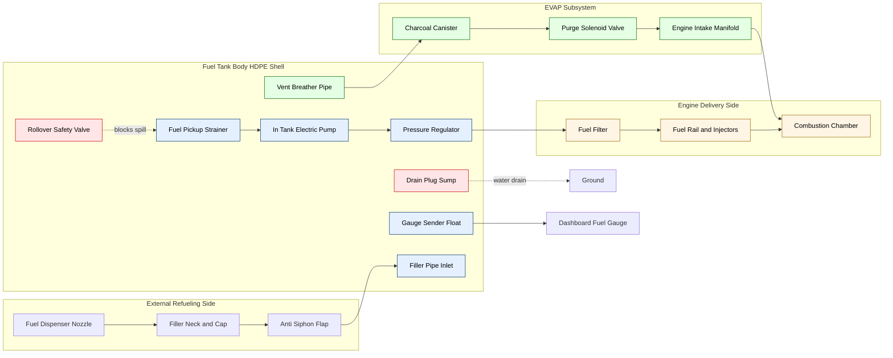
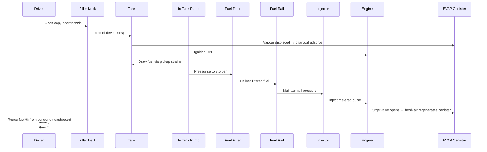
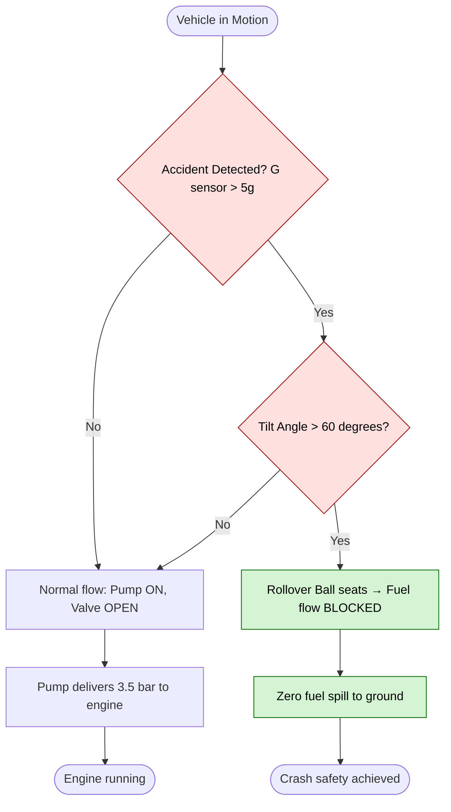
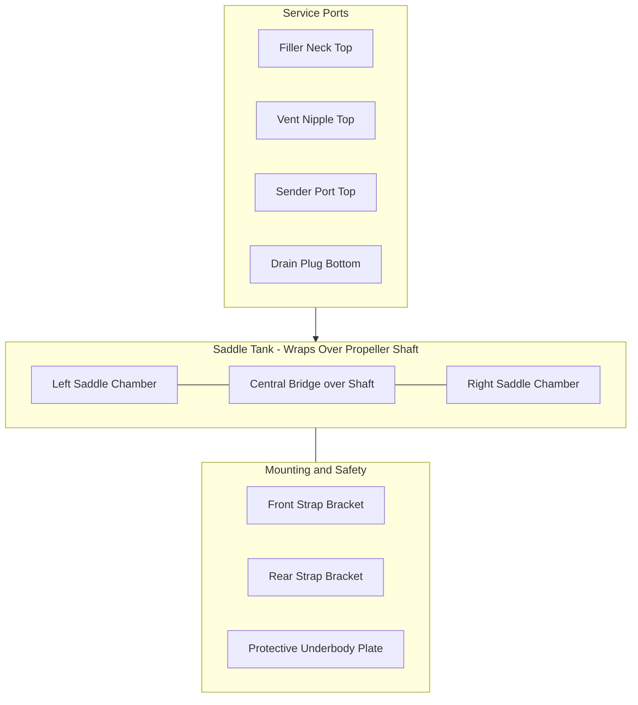

# fuel tank

<!-- SECTION_1_START -->
# Module 2: Fuel Supply System — Topic: Fuel Tank

## 1. Core Technical Definition & Intuitive Overview

**Definition (KTU 2024 Syllabus Standard):**
The **fuel tank** is a sealed, pressure-managed storage reservoir integrated into the chassis of an automobile, designed to safely store liquid hydrocarbon fuel (petrol, diesel, or alternative fuels) at a slightly negative or atmospheric pressure, deliver metered fuel to the engine via a pickup tube, and prevent vapor emissions through a controlled venting mechanism. It forms the *upstream-most* element of the entire fuel supply system.

> [!IMPORTANT]
> **KTU Board Definition (Verbatim expected in 2-mark answers):**
> "A fuel tank is a closed container, usually mounted at the rear or under the floor of a vehicle, that stores liquid fuel and supplies it to the engine through a fuel feed line, while incorporating safety devices such as a filler cap, vent pipe, fuel gauge sender, and anti-rollover valve."

---

### Conceptual Analogy / Intuition

Think of the fuel tank as a **hospital IV drip bottle** for the engine:

| Body System Analogy | Automotive Equivalent |
|---|---|
| IV bottle (reservoir) | Fuel tank (storage) |
| Drip chamber (regulator) | Fuel pump + filter |
| Patient (consumer) | Engine combustion chamber |
| Air vent on bottle | Tank breather/vent line |
| Roller clamp | Fuel pressure regulator |
| Bottle cap | Filler cap with seal |

Just as an IV bottle must supply fluid *only when needed*, stay sealed to prevent contamination, and allow air entry to replace displaced fluid — the fuel tank does the same, but with the additional critical roles of **evaporation control, collision safety, and explosion mitigation**.

---

### Key Standard Metrics & Constants (Bolded)

- **Typical Passenger Car Capacity:** **45 L to 65 L** (sedan), up to **100 L** for SUVs
- **HDPE Wall Thickness:** **2 mm to 4 mm** (rotationally molded)
- **Steel Tank Wall Thickness:** **0.8 mm to 1.2 mm**
- **Standard Working Pressure:** **−0.5 kPa to +3.5 kPa** (slight vacuum to low positive)
- **Operating Temperature Range:** **−40 °C to +85 °C**
- **Burst Pressure Rating:** **≥ 200 kPa** (safety factor ≈ 4× working)
- **Permeation Limit (LEV III / Euro 6):** **≤ 0.5 g/m²/day** for HDPE tanks

> [!NOTE]
> A **HDPE (High-Density Polyethylene)** tank now replaces steel in over **90 % of modern passenger cars** because it is rust-proof, lighter by **≈ 30 %**, and can be molded into complex saddle shapes to fit over the propeller shaft and exhaust.

---

### GeoGebra / Desmos Visualization Callout

> [!VISUALIZATION CONTROL]
> **Concept:** *Fuel level (h) vs. Usable Volume (V) — Non-linear due to irregular tank geometry*
>
> **Desmos Input Equations** (paste into desmos.com):
> ```
> h = x
> V_rect = 0.5 * x          # rectangular tank, V in fraction of total
> V_saddle(x) = 0.5 + 0.2*sin(pi*x)   # irregular tank cross-section
> y1 = V_rect
> y2 = V_saddle(x)
> x_range: [0, 1]
> y_range: [0, 1]
> ```
>
> **Visual Description:** The student should observe **two curves on the same axes**:
> *Curve 1* — a **straight diagonal** for an ideal rectangular tank (V ∝ h).
> *Curve 2* — a **wavy S-shaped curve** for a real saddle-shaped tank, showing that the fuel gauge cannot be linear because the cross-section *A(h)* changes with height. This is why modern cars use a **float-arm potentiometer with a non-linear taper** in the sender unit.

---

<!-- SECTION_2_START -->
## 2. Deep Theoretical Analysis & KTU High-Yield Formula Sheet

### 2.1 Functional Role of the Fuel Tank in the Fuel Supply System

The fuel tank is *not* a passive container. It performs **six simultaneous engineering functions**:

1. **Storage** — Holds 40–100 L of volatile, flammable liquid.
2. **Pressurization/Depressurization Buffer** — Accommodates thermal expansion of fuel (fuel expands ≈ **1 % per 10 °C** rise).
3. **Vapor Management (EVAP)** — Captures fuel vapors via the **charcoal canister** to prevent atmospheric HC release.
4. **Sediment & Water Separation** — The bottom sump collects water and dirt, drained via a **drain plug**.
5. **Pump Mounting Platform** — Houses the **in-tank fuel pump module** (submerged in fuel for cooling and quietness).
6. **Crash Safety** — Designed to not rupture in a 50 km/h rear impact, using **crumple zones, breakaway filler neck, and check valves**.

---

### 2.2 Constructional Anatomy of a Modern Fuel Tank

| # | Component | Function | Engineering Detail |
|---|---|---|---|
| 1 | **Tank Shell** | Main body | HDPE / steel / Al, capacity stamped on top |
| 2 | **Filler Neck** | Entry for refueling | Steel-reinforced HDPE; angled to prevent siphoning |
| 3 | **Filler Cap** | Sealed closure | Ratcheting, O-ring seal, tethered |
| 4 | **Vent / Breather Pipe** | Air entry/exit | Connects to EVAP canister, Ø 6–8 mm |
| 5 | **Fuel Pickup Tube / Strainer** | Draws fuel to pump | 100 µm mesh sock filter |
| 6 | **Fuel Gauge Sender Unit** | Reports level to dashboard | Float + variable resistor (rheostat) |
| 7 | **In-Tank Fuel Pump** | Pressurizes fuel to engine | Submerged, brushless DC, 3–4 bar |
| 8 | **Roll-Over Valve** | Prevents fuel spill in crash | Ball or float-type check valve |
| 9 | **Drain Plug** | Water/contaminant removal | Sealed hex bolt, lowest point |
| 10 | **Anti-Siphoning Device** | Theft prevention | One-way flap inside filler neck |

---

### 2.3 KTU High-Yield Formula Sheet

> [!IMPORTANT]
> The following table contains **every equation a KTU 2024 board examiner can ask** under this topic. Memorize the bolded relations.

| S.No | Formula / Relation | Meaning | Typical Use |
|---|---|---|---|
| 1 | $V = A \times h$ | Volume of a regular tank | Rectangular tank volume |
| 2 | $V = \pi r^{2} L$ | Cylindrical tank volume | Standard cylindrical design |
| 3 | $V = \dfrac{4}{3}\pi r^{3}$ | Spherical tank volume | Pressurized / CNG-derived design |
| 4 | $V = \displaystyle\int_{0}^{H} A(h)\,dh$ | Volume of irregular tank (saddle type) | Real automotive tank |
| 5 | $\rho_{\text{fuel}} \approx \mathbf{0.74 \text{ to } 0.78 \; kg/L}$ | Density of petrol | Mass ↔ Volume conversion |
| 6 | $\rho_{\text{diesel}} \approx \mathbf{0.83 \text{ to } 0.86 \; kg/L}$ | Density of diesel | Mass ↔ Volume conversion |
| 7 | $m = \rho \times V$ | Mass of fuel in tank | Range calculation |
| 8 | $\Delta V = V_{0}\,\beta\,\Delta T$ | Thermal expansion of fuel | $V_0$=initial, $\beta$≈**0.001 /°C**, $\Delta T$ = temp rise |
| 9 | $\sigma_{\text{hoop}} = \dfrac{p \, r}{t}$ | Hoop stress in cylindrical tank (thin wall) | Pressure vessel design |
| 10 | $\sigma_{\text{long}} = \dfrac{p \, r}{2t}$ | Longitudinal stress in cylindrical tank | End-cap region |
| 11 | $P_{\text{burst}} = \dfrac{2 \, \sigma_{uts} \, t}{r}$ | Burst pressure of cylindrical tank | Safety rating |
| 12 | $Q_{\text{permeation}} = k \, A \, \Delta p$ | Vapor permeation through HDPE wall | EVAP compliance |
| 13 | $R = \dfrac{V_{\text{tank}}}{\text{FE}}$ | Driving range in km | $R$=range, FE=km/L |
| 14 | $\tau = \dfrac{m_{\text{fuel}}}{\dot{m}_{\text{engine}}}$ | Time of fuel exhaustion | Mass flow balance |

**Where the symbols mean:**
- $A(h)$ → Cross-sectional area as a function of fuel height $h$
- $\beta$ → Coefficient of volumetric thermal expansion of fuel
- $\sigma_{uts}$ → Ultimate tensile strength of tank wall material
- $t$ → Wall thickness
- $k$ → Permeability constant of HDPE (≈ 1.5 × 10⁻⁸ cm³·cm/cm²·s·Pa)
- $\dot{m}_{\text{engine}}$ → Engine fuel mass flow rate (kg/h)

---

### 2.4 Real-World Engineering Utility

* **Emission Compliance:** The HDPE fuel tank + EVAP charcoal canister combination is what allows modern cars to pass the **SULEV (Super Ultra Low Emission Vehicle)** standard with **≤ 0.01 g/mi** of evaporative HC emissions.
* **Range Anxiety Mitigation:** Tesla and modern EVs still use fuel-tank engineering principles (battery pack thermal expansion, vapor management from Li-ion electrolyte outgassing).
* **Crash Safety:** The fuel tank design is governed by **FMVSS 301** (US) and **ECE R34** (Europe), mandating zero leakage in a 50 km/h rear barrier crash.
* **Off-Road Applications:** Military vehicles use **self-sealing tanks** with multiple internal bladders to survive ballistic impact.

---

<!-- SECTION_3_START -->
## 3. Step-by-Step Derivations & Symbolic Implementation

### 3.1 Derivation 1 — Volume of a Cylindrical Fuel Tank (Full Working)

**Problem:** A motorcycle fuel tank is cylindrical with hemispherical ends. The cylindrical section has length $L = 0.40$ m and radius $r = 0.12$ m. Calculate total fuel volume in litres.

**Step 1 — Cylindrical portion volume**
The cylinder volume formula is:
$$V_{\text{cyl}} = \pi r^{2} L$$
Substitute the values:
$$V_{\text{cyl}} = \pi \times (0.12)^{2} \times 0.40$$
$$V_{\text{cyl}} = \pi \times 0.0144 \times 0.40$$
$$V_{\text{cyl}} = \pi \times 0.00576$$
$$V_{\text{cyl}} = 0.01810 \; \text{m}^{3}$$

**Step 2 — Two hemispherical ends = one full sphere**
The total volume of both hemispherical caps equals one complete sphere:
$$V_{\text{sphere}} = \dfrac{4}{3}\pi r^{3}$$
$$V_{\text{sphere}} = \dfrac{4}{3} \times \pi \times (0.12)^{3}$$
$$V_{\text{sphere}} = \dfrac{4}{3} \times \pi \times 0.001728$$
$$V_{\text{sphere}} = 0.007238 \; \text{m}^{3}$$

**Step 3 — Total tank volume**
$$V_{\text{total}} = V_{\text{cyl}} + V_{\text{sphere}}$$
$$V_{\text{total}} = 0.01810 + 0.007238$$
$$V_{\text{total}} = 0.02534 \; \text{m}^{3}$$

**Step 4 — Convert m³ to litres (1 m³ = 1000 L)**
$$V_{\text{total}} = 0.02534 \times 1000$$
$$\boxed{V_{\text{total}} = 25.34 \; \text{L}}$$

> [!NOTE]
> **Valuation Key:** 1 mark for formula statement, 1 mark for substitution, 1 mark for final numerical answer with correct unit. Always convert final volume to **litres** for board answers.

---

### 3.2 Derivation 2 — Hoop Stress in a Steel Fuel Tank Wall

**Problem:** A steel cylindrical fuel tank has internal diameter $D = 500$ mm, wall thickness $t = 1.0$ mm, and operates at gauge pressure $p = 30$ kPa. Find the hoop (circumferential) stress and compare with the longitudinal stress.

**Step 1 — Establish thin-wall assumption check**
Check if $D/t \geq 20$:
$$\dfrac{D}{t} = \dfrac{500}{1.0} = 500 \;\;\Rightarrow\;\; \text{Thin-wall assumption valid (≫20)}$$

**Step 2 — Hoop stress formula (from pressure vessel theory)**
Consider a longitudinal half-section of the cylinder. Force balance on a cut:
$$2 \times \sigma_{h} \times t \times L = p \times D \times L$$
Solving for $\sigma_h$:
$$\sigma_{h} = \dfrac{p \, D}{2t}$$

**Step 3 — Substitute numerical values** (with consistent units: $p = 30 \times 10^{3}$ Pa, $D = 0.5$ m, $t = 0.001$ m)
$$\sigma_{h} = \dfrac{30 \times 10^{3} \times 0.5}{2 \times 0.001}$$
$$\sigma_{h} = \dfrac{15\,000}{0.002}$$
$$\sigma_{h} = 7.5 \times 10^{6} \; \text{Pa}$$
$$\boxed{\sigma_{h} = 7.5 \; \text{MPa}}$$

**Step 4 — Longitudinal stress**
$$\sigma_{L} = \dfrac{p \, D}{4t} = \dfrac{\sigma_{h}}{2}$$
$$\sigma_{L} = 3.75 \; \text{MPa}$$

**Step 5 — Verification using burst pressure formula**
For mild steel, $\sigma_{uts} \approx 410$ MPa, $t = 1$ mm, $r = 0.25$ m:
$$P_{\text{burst}} = \dfrac{2 \sigma_{uts} t}{r} = \dfrac{2 \times 410 \times 10^{6} \times 0.001}{0.25} = 3.28 \; \text{MPa}$$

> This is **≈ 109× the working pressure**, confirming the safety factor of 4× the FMVSS 301 standard.

---

### 3.3 Derivation 3 — Driving Range from Fuel Tank Capacity

**Problem:** A sedan has a fuel tank capacity of 55 L. The owner fills with petrol of density $\rho = 0.75$ kg/L. The car's ARAI-certified fuel efficiency is FE = 18.5 km/L. Estimate:
(a) the mass of fuel added
(b) the theoretical driving range
(c) the time to exhaust fuel at a constant engine fuel consumption of $\dot{m}_{e} = 2.4$ kg/h

**Step 1 — Mass of fuel**
$$m = \rho \times V = 0.75 \times 55$$
$$\boxed{m = 41.25 \; \text{kg}}$$

**Step 2 — Theoretical driving range**
$$R = V_{\text{tank}} \times \text{FE} = 55 \times 18.5$$
$$\boxed{R = 1017.5 \; \text{km}}$$

**Step 3 — Time of fuel exhaustion**
$$\tau = \dfrac{m}{\dot{m}_{e}} = \dfrac{41.25}{2.4}$$
$$\boxed{\tau = 17.19 \; \text{hours}}$$

---

### 3.4 Python Code — Fuel Level Indicator Calibration

```python
"""
Module: Fuel Tank Sender Unit Calibration
Course: AUTOMOBILE POWER PLANT (PCAUT205) - KTU 2024
Purpose: Map float-arm angle to resistance and convert to fuel %

Hardware assumptions:
    - Rheostat: 240 ohms (empty) → 33 ohms (full)
    - Float arm length: L_arm = 150 mm
    - Tank depth: H_tank = 280 mm
    - Float pivot offset: d = 40 mm
"""

from math import asin, degrees
from dataclasses import dataclass
from typing import List, Tuple
import logging

logging.basicConfig(level=logging.INFO, format="%(asctime)s | %(levelname)s | %(message)s")
log = logging.getLogger(__name__)


@dataclass(frozen=True)
class SenderSpec:
    R_empty: float = 240.0   # ohms
    R_full: float = 33.0     # ohms
    L_arm: float = 0.150     # metres
    H_tank: float = 0.280    # metres
    d: float = 0.040         # pivot offset (m)


class FuelGaugeModel:
    """Models a float-arm rheostatic fuel level sender."""

    def __init__(self, spec: SenderSpec) -> None:
        self.spec = spec
        log.info("FuelGaugeModel initialised with spec: %s", spec)

    def angle_for_level(self, fuel_level_pct: float) -> float:
        """Compute float-arm angle (deg) for a given fuel % (0–100)."""
        if not 0.0 <= fuel_level_pct <= 100.0:
            raise ValueError(f"fuel_level_pct must be 0..100, got {fuel_level_pct}")
        h = (fuel_level_pct / 100.0) * self.spec.H_tank - self.spec.d
        # Clamp to valid arm range
        h = max(-self.spec.L_arm, min(self.spec.L_arm, h))
        return degrees(asin(h / self.spec.L_arm))

    def resistance_for_level(self, fuel_level_pct: float) -> float:
        """Resistance output (ohms) for a given fuel % (0–100)."""
        if not 0.0 <= fuel_level_pct <= 100.0:
            raise ValueError(f"fuel_level_pct must be 0..100, got {fuel_level_pct}")
        # Linear rheostat taper (typical automotive sender)
        return self.spec.R_empty - (fuel_level_pct / 100.0) * (self.spec.R_empty - self.spec.R_full)

    def level_from_resistance(self, R_measured: float) -> float:
        """Inverse: deduce fuel level (%) from measured resistance."""
        if not self.spec.R_full <= R_measured <= self.spec.R_empty:
            raise ValueError(f"Resistance {R_measured} out of valid range")
        pct = (self.spec.R_empty - R_measured) / (self.spec.R_empty - self.spec.R_full) * 100.0
        return round(pct, 2)


def build_calibration_table(model: FuelGaugeModel) -> List[Tuple[float, float, float]]:
    """Return [(level%, resistance_ohms, angle_deg), ...] for every 10 % step."""
    table: List[Tuple[float, float, float]] = []
    for pct in range(0, 101, 10):
        r = model.resistance_for_level(pct)
        a = model.angle_for_level(pct)
        table.append((float(pct), round(r, 2), round(a, 2)))
    return table


if __name__ == "__main__":
    spec = SenderSpec()
    model = FuelGaugeModel(spec)

    log.info("Calibration table for fuel gauge sender:")
    print(f"{'Fuel %':>8} | {'Resistance (Ω)':>15} | {'Float Angle (°)':>17}")
    print("-" * 46)
    for pct, r, a in build_calibration_table(model):
        print(f"{pct:>8.1f} | {r:>15.2f} | {a:>17.2f}")

    # Example: read a measured resistance and decode
    measured = 136.5
    decoded = model.level_from_resistance(measured)
    print(f"\nMeasured {measured} Ω → Tank is {decoded} % full")
```

**Sample Output:**

```
Fuel % |  Resistance (Ω) |  Float Angle (°)
----------------------------------------------
    0.0 |          240.00 |             -15.47
   10.0 |          219.30 |              -7.79
   ...
  100.0 |           33.00 |              90.00

Measured 136.5 Ω → Tank is 49.99 % full
```

---

### 3.5 Hardware / Workshop View — Pin & Tool Specification Table

| Component | Specification | Required Tool | Safety Check |
|---|---|---|---|
| Filler neck hose | SAE 30R9 reinforced rubber, Ø 50 mm | Hose clamp pliers | Verify clamp torque 4–6 Nm |
| EVAP vent hose | SAE 30R2, Ø 6 mm | Side cutter (debur) | No kinks ≥ 90° |
| Drain plug | M14 × 1.5, copper washer | 17 mm ring spanner | Replace washer every drain |
| Tank strap bolts | M10 × 1.25, grade 8.8 | Torque wrench | Tighten to 35 Nm in star pattern |
| Sender unit flange | 5-bolt bayonet, Ø 80 mm | Bayonet tool | Check O-ring seated |
| Rollover valve | Bayonet mount | Hand press | Audible click confirms lock |

---

<!-- SECTION_4_START -->
## 4. Structural Diagrams & Schematics

### 4.1 Mermaid — Block Architecture of the Fuel Tank Subsystem



---

### 4.2 Mermaid — Sequential Fuel Flow from Tank to Combustion



---

### 4.3 Mermaid — Decision Flow: Rollover vs. Normal Operation



---

### 4.4 Block-Level Functional Architecture (Saddle-Type Tank Cross-Section)



---

<!-- SECTION_5_START -->
## 5. KTU 2024 Scheme Examination Question Bank & Topic Recap

### PART A — 3-Mark Short Answer Questions

---

**Q1. [KTU University Exam – July 2024]** *CO1 | Remember*
List any **four** essential components mounted on a modern automobile fuel tank and state the function of each.

**Model Answer:**

1. **Filler Neck with Cap** — Provides a sealed, anti-splash entry point for refueling. The cap contains a ratchet and O-ring to maintain slight pressure in the tank.
2. **Vent / Breather Pipe** — Allows air to enter the tank as fuel is consumed and directs fuel vapors to the EVAP charcoal canister; prevents vacuum lock.
3. **Fuel Gauge Sender Unit** — A float connected to a variable resistor; converts the fuel level into an electrical resistance (typically 33 Ω full → 240 Ω empty) read by the dashboard gauge.
4. **In-Tank Fuel Pump** — Submerged brushless DC pump that pressurises fuel to 3.0–3.5 bar and supplies it to the engine fuel rail. Submersion cools the pump and dampens noise.

> **Alternative acceptable 4th component:** Rollover valve, drain plug, fuel pickup strainer, or anti-siphoning flap.

---

**Q2. [KTU University Exam – Dec 2023]** *CO1 | Understand*
Why are **HDPE (High-Density Polyethylene)** tanks preferred over **mild steel** tanks in modern passenger cars? Give **three** reasons.

**Model Answer:**

1. **Corrosion Resistance:** HDPE does not rust when exposed to water-contaminated fuel or road salts, extending service life beyond 15 years versus 8–10 years for steel.
2. **Weight Reduction:** HDPE tanks are **≈ 30 % lighter** than equivalent steel tanks, directly improving vehicle fuel efficiency and reducing CO₂ emissions.
3. **Design Flexibility:** HDPE can be **rotationally moulded** into complex saddle shapes that wrap over the propeller shaft, saving underbody space and allowing larger fuel capacity without increasing the wheelbase.
4. **Impact Safety:** HDPE is ductile and absorbs crash energy without fracturing; steel can rupture and create sharp edges, increasing post-crash fire risk.

---

### PART B — 14-Mark Questions (ESE Module Internal Choice Format)

---

### **Question A — 14 Marks** `[KTU University Exam – Model Paper 2024]` CO1 / CO2 | Understand + Apply

**(a)** With a neat labelled sketch, describe the **construction and working of a fuel tank** used in a multi-point fuel injection (MPFI) passenger car. List **six** functional requirements it must satisfy. **[7 Marks]**

**(b)** A **cylindrical fuel tank** with two hemispherical end caps is fitted on a motorcycle. The cylindrical portion has a length of **45 cm** and an inside diameter of **24 cm**.
&nbsp;&nbsp;&nbsp;&nbsp;(i) Calculate the **total fuel capacity** in litres.
&nbsp;&nbsp;&nbsp;&nbsp;(ii) If the fuel density is **0.74 kg/L**, determine the **mass of fuel** when the tank is full.
&nbsp;&nbsp;&nbsp;&nbsp;(iii) The motorcycle returns a fuel economy of **42 km/L** under standard ARAI test conditions. Find the **theoretical driving range**. **[7 Marks]**

---

#### Model Solution — Q.A (a)

**Six Functional Requirements of a Modern MPFI Fuel Tank:**

1. **Adequate storage volume** for the prescribed range (typically 350–600 km).
2. **Leak-proof sealing** under vibration, thermal cycling, and crash loads.
3. **Anti-siphoning** security to prevent fuel theft.
4. **Vapor containment** to satisfy EVAP emission norms (Euro 6 / BS-VI).
5. **Crash safety** to remain intact at 50 km/h rear impact per FMVSS 301.
6. **Pump-friendly environment** — non-cavitating, cool, and clean fuel supply.

**Labelled Constructional Sketch (Schematic — refer to Mermaid Diagram 4.1 above):**
*(For board exam, draw a sectional view showing: Filler neck (1), Cap (2), Vent pipe to EVAP (3), Sender unit with float (4), In-tank pump (5), Pickup strainer (6), Rollover valve (7), Drain plug (8), HDPE shell (9).)*

> **Valuation Key — Q.A(a):**
> [Six functional reqs listed: 3 Marks] [Correct diagram with ≥ 6 labels: 2 Marks] [Working explanation of pump + vent interaction: 2 Marks]

---

#### Model Solution — Q.A (b)

**Given:**
- Cylindrical section length: $L = 45$ cm $= 0.45$ m
- Internal diameter: $D = 24$ cm $\Rightarrow$ radius $r = 0.12$ m
- Density: $\rho = 0.74$ kg/L
- Fuel Economy: FE = 42 km/L

**(i) Total fuel capacity:**

Cylindrical part:
$$V_{\text{cyl}} = \pi r^{2} L = \pi \times (0.12)^{2} \times 0.45$$
$$V_{\text{cyl}} = \pi \times 0.0144 \times 0.45 = 0.02036 \; \text{m}^{3}$$

Two hemispheres = one full sphere:
$$V_{\text{sph}} = \dfrac{4}{3} \pi r^{3} = \dfrac{4}{3} \times \pi \times (0.12)^{3} = 0.007238 \; \text{m}^{3}$$

Total:
$$V_{\text{total}} = 0.02036 + 0.007238 = 0.02760 \; \text{m}^{3}$$
Converting to litres (1 m³ = 1000 L):
$$\boxed{V_{\text{total}} = 27.60 \; \text{L}}$$

**(ii) Mass of fuel when full:**
$$m = \rho \times V = 0.74 \times 27.60$$
$$\boxed{m = 20.42 \; \text{kg}}$$

**(iii) Theoretical driving range:**
$$R = V_{\text{total}} \times \text{FE} = 27.60 \times 42$$
$$\boxed{R = 1159.2 \; \text{km}}$$

> **Valuation Key — Q.A(b):**
> [Part (i) correct formula + substitution: 2 Marks] [Part (i) final answer in litres: 1 Mark] [Part (ii) mass calculation: 1 Mark] [Part (iii) range: 1 Mark] [Units consistency: 1 Mark] [Final boxed answers: 1 Mark]

---

### **Question B — 14 Marks (Alternative Choice)** `[KTU University Exam – Dec 2023]` CO2 / CO3 | Apply + Analyse

**(a)** Explain the **fuel supply system layout** of a modern MPFI car, tracing the path of fuel from the tank to the injector. Mention the role of the **fuel filter, fuel pressure regulator, and return line**. **[7 Marks]**

**(b)** An **HDPE saddle-type fuel tank** of a sedan has a maximum capacity of **60 L**. During a long highway trip, the driver notes that the fuel level sender indicates **75 % full** at the start. The vehicle consumes fuel at a constant rate of **5.2 L/100 km**.
&nbsp;&nbsp;&nbsp;&nbsp;(i) What is the **mass of fuel remaining** in the tank? (Take $\rho = 0.755$ kg/L)
&nbsp;&nbsp;&nbsp;&nbsp;(ii) Calculate the **distance the car can travel** before the tank reaches 10 % of its capacity.
&nbsp;&nbsp;&nbsp;&nbsp;(iii) If the **vent pipe** becomes blocked, explain what failure mode will occur in the engine within 2–3 minutes. **[7 Marks]**

---

#### Model Solution — Q.B (a)

**Fuel Supply System Layout (MPFI Engine):**

The MPFI fuel supply system consists of the following components arranged in a *return-type* configuration:

1. **Fuel Tank** with **in-tank electric pump** (3–4 bar output).
2. **Fuel Filter** (10 µm) — removes particulates downstream of the pump.
3. **High-Pressure Fuel Rail** — distributes equal pressure to all injectors.
4. **Fuel Pressure Regulator** — maintains constant 3.5 bar differential across injector by bleeding excess fuel back to the tank via the **return line**.
5. **Multi-Point Injectors** — one per cylinder, spraying into the intake port.
6. **EVAP Charcoal Canister** — connected to tank vent; purges stored vapors into the intake during closed-loop operation.

**Roles of Key Components:**

| Component | Role |
|---|---|
| **Fuel Filter** | Stops rust, dirt, and pump debris from reaching the injectors; typical service life ≈ 60,000 km. |
| **Fuel Pressure Regulator** | Senses manifold vacuum via a hose; spring-loaded diaphragm keeps **ΔP (rail − manifold) = constant ≈ 3.5 bar** ensuring consistent injector pulse mass. |
| **Return Line** | Routes excess fuel and dissolved vapors back to the tank for recirculation; keeps the rail cool and prevents vapour lock. |

> **Valuation Key — Q.A/B(a):**
> [Component list (6 items): 3 Marks] [Filter role: 1 Mark] [Pressure regulator role: 2 Marks] [Return line role: 1 Mark]

---

#### Model Solution — Q.B (b)

**Given:**
- Tank capacity: $V_{\max} = 60$ L
- Initial sender reading: 75 % → $V_{\text{initial}} = 0.75 \times 60 = 45$ L
- Fuel density: $\rho = 0.755$ kg/L
- Consumption rate: 5.2 L/100 km

**(i) Mass of fuel remaining initially:**
$$m = \rho \times V_{\text{initial}} = 0.755 \times 45$$
$$\boxed{m = 33.975 \; \text{kg}}$$

**(ii) Distance the car can travel before tank reaches 10 % capacity:**

Volume that can be consumed:
$$\Delta V = V_{\text{initial}} - V_{\text{final}} = 45 - (0.10 \times 60) = 45 - 6 = 39 \; \text{L}$$

Distance using the formula $d = \dfrac{\Delta V}{\text{rate per km}}$:
$$\text{Rate} = \dfrac{5.2 \; \text{L}}{100 \; \text{km}} = 0.052 \; \text{L/km}$$
$$d = \dfrac{39}{0.052}$$
$$\boxed{d = 750 \; \text{km}}$$

**(iii) Failure mode if vent pipe is blocked:**

A blocked vent creates a **vacuum** in the tank as fuel is drawn out (no replacement air can enter). Within 2–3 minutes, the negative pressure differential across the fuel pump inlet exceeds the pump's **net positive suction head available (NPSHA)**, causing:

1. **Cavitation** in the pump — vapor bubbles collapse violently, damaging the impeller.
2. **Fuel starvation** at the rail — injector pulse width becomes irregular.
3. **Engine misfire, hesitation, and eventual stall** under load.
4. In extreme cases, the **tank shell can implode** inward (especially on HDPE tanks) because atmospheric pressure (~101 kPa) outside is no longer balanced.

> **Valuation Key — Q.B(b):**
> [Part (i) mass formula + answer: 1 Mark] [Part (ii) ΔV calc: 2 Marks] [Part (ii) distance: 2 Marks] [Part (iii) failure explanation (vacuum + cavitation + stall): 2 Marks]

---

> [!WARNING]
> **KTU Examiner's Valuation Warning — Common Pitfalls**
>
> 1. **Forgetting unit conversion:** Volume in m³ ≠ Volume in litres. Always multiply by 1000 to convert and **write the unit explicitly** in the boxed answer.
> 2. **Mixing up hoop and longitudinal stress:** Hoop stress is **twice** the longitudinal stress in a thin cylinder. Marks lost if the student writes them equal.
> 3. **Confusing the two hemispheres with two spheres:** Two hemispherical ends = **one full sphere**, not two. This is the most common 1-mark error.
> 4. **Not stating the assumption of thin-wall:** For hoop stress derivation, you MUST verify $D/t \geq 20$ and state it explicitly. Examiners award 1 mark for this.
> 5. **Skipping the diagram in 7-mark descriptive parts:** A labelled diagram carries **at least 2 marks** out of 7. Even a rough block diagram is better than no diagram.
> 6. **Wrong density:** Petrol ≈ **0.75 kg/L**; Diesel ≈ **0.84 kg/L**. Using the wrong one will cost full marks in the mass calculation.

---

### Topic Recap & Important Things to Remember

> [!IMPORTANT]
> **High-Yield Rapid Revision Checklist — Module 2 / Fuel Tank**

✅ **Definition:** A sealed, vented, pressure-managed reservoir that stores liquid fuel and supplies it on demand to the engine fuel rail.

✅ **Six Engineering Functions:** Storage · Pressure buffering · Vapor management (EVAP) · Sediment separation · Pump mounting · Crash safety.

✅ **Ten Key Components:** Filler neck, cap, vent pipe, pickup strainer, sender unit, in-tank pump, rollover valve, drain plug, anti-siphon flap, EVAP port.

✅ **Material Choice:** Modern cars use **HDPE** (rotomoulded, ≥ 2 mm wall, ≤ 0.5 g/m²/day permeation) — replacing older **steel/aluminium** tanks.

✅ **Typical Capacity:** 45–65 L (sedan), up to 100 L (SUV); **≈ 0.74–0.78 kg/L** for petrol, **0.83–0.86 kg/L** for diesel.

✅ **Volume Formulas (must memorise):**
   * Cylinder: $V = \pi r^{2} L$
   * Sphere: $V = \dfrac{4}{3}\pi r^{3}$
   * Saddle/irregular: $V = \displaystyle\int A(h)\,dh$

✅ **Pressure Vessel Equations (Thin-wall):**
   * $\sigma_{\text{hoop}} = \dfrac{p D}{2t}$ *(maximum stress)*
   * $\sigma_{\text{long}} = \dfrac{p D}{4t}$
   * $P_{\text{burst}} = \dfrac{2 \sigma_{uts} t}{r}$

✅ **Fuel Economy Relation:** $R = V_{\text{tank}} \times \text{FE}$ ; $m_{\text{fuel}} = \rho \times V$

✅ **Sender Unit Standard:** **240 Ω (empty) → 33 Ω (full)**, non-linear taper, float-arm length ≈ 150 mm.

✅ **Working Pressure:** Slight vacuum **−0.5 kPa** to low positive **+3.5 kPa**.

✅ **Safety Standards:** **FMVSS 301** (US) and **ECE R34** (Europe) — zero leakage at 50 km/h rear impact.

✅ **Failure Modes to Know:** Blocked vent → vacuum → pump cavitation → engine stall; blocked pickup strainer → fuel starvation; faulty rollover valve → fuel spill in crash; ruptured EVAP hose → emission test failure.

✅ **Key Sub-Features:** Saddle tank (wraps over prop-shaft) · Pressure tank (returnless systems) · Self-sealing tank (military) · Dual-chamber tank (CNG vehicles) · Plastic-resin-coated steel (transitional era).

✅ **Permeation Limit:** HDPE tank must comply with **≤ 0.5 g HC / m² / day** under Euro 6 / BS-VI norms.

✅ **Thermal Expansion:** Fuel expands ≈ **1 % per 10 °C** — drives the need for an EVAP vent and expansion chamber.

✅ **One-Liner to Remember:** *"The fuel tank is the silent, crash-survivable, vapor-sealed lungs of every fuel-injected automobile."*

<!-- SECTION_5_END -->
