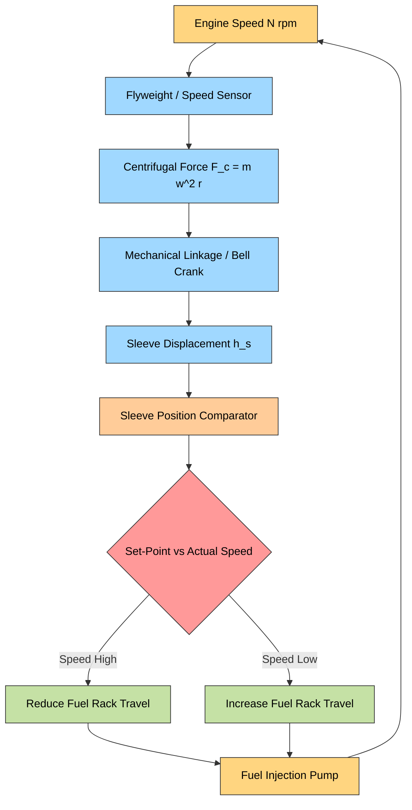
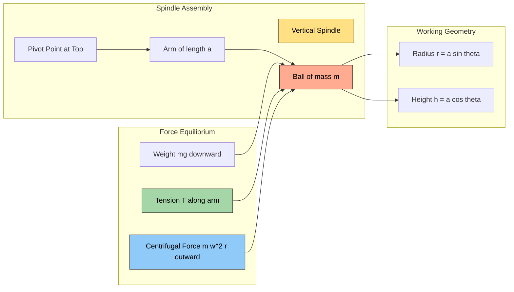
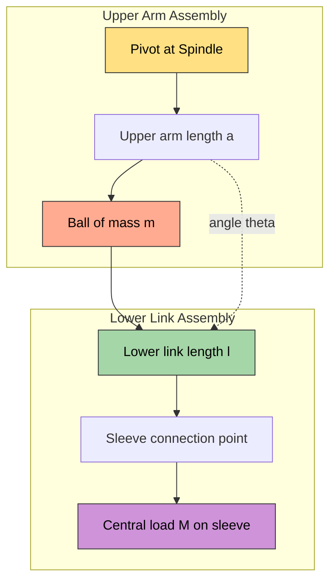
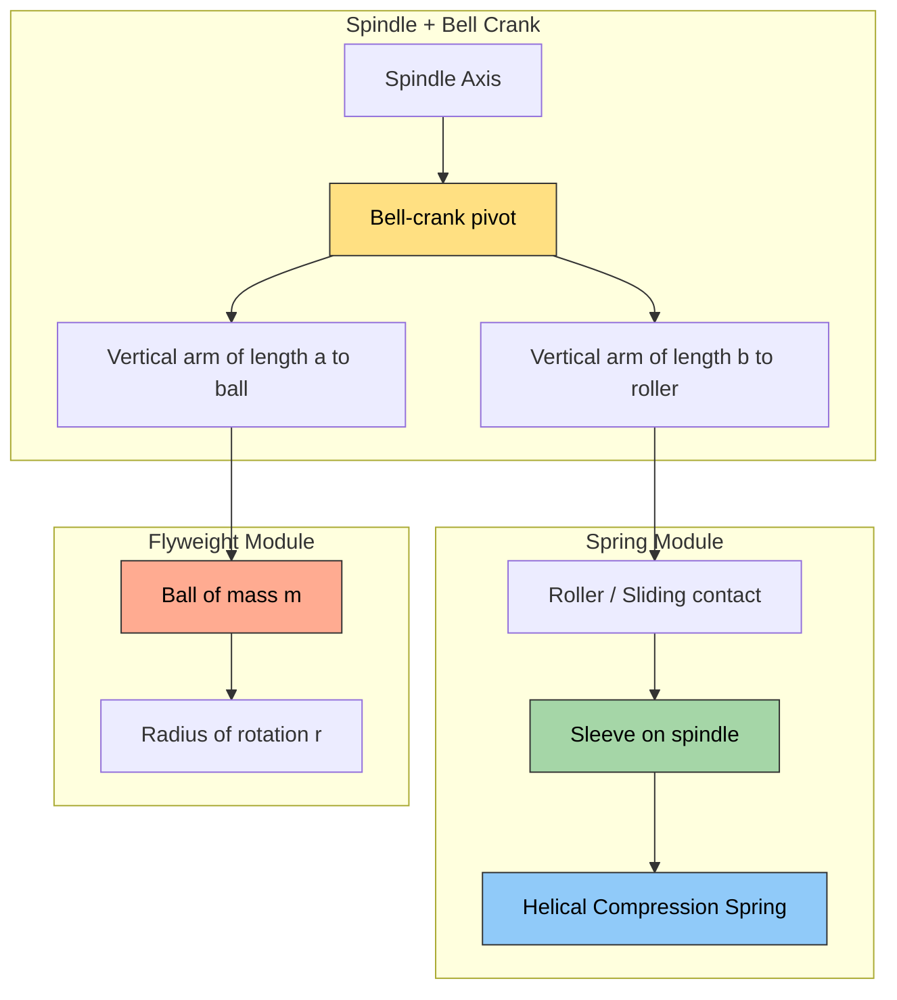
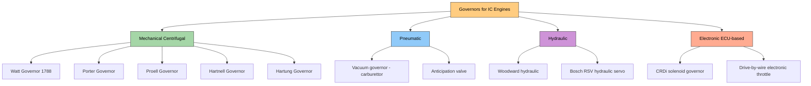
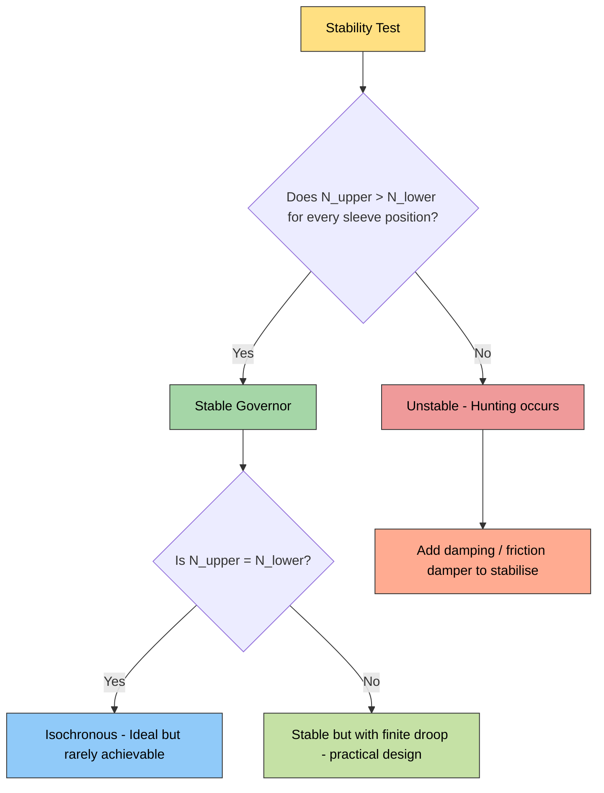

# Governors.

<!-- SECTION_1_START -->

# Governors in Automobile Power Plant

## 1.1 Core Technical Definition

> [!IMPORTANT]
> **KTU 2024 Syllabus Definition**
> A **Governor** is a mechanical feedback control device that automatically regulates the fuel (or air-fuel mixture) supply to an internal combustion engine in response to changes in engine speed caused by varying load conditions. Its primary objective is to maintain the engine speed within a narrow permissible band, ensuring smooth, economical, and safe operation.

In modern diesel engines (especially used in **trucks, buses, tractors, locomotives, gensets, and marine propulsion**), the governor is the heart of the **inline (jerk) fuel injection pump**, controlling the axial position of the **plunger** or the **fuel rack** to vary the quantity of fuel injected per cycle.

The term is derived from the original "centrifugal pendulum" mechanism invented by **James Watt (1788)** to regulate steam engine speed, hence even modern engine governors are often called **centrifugal governors**.

> [!NOTE]
> **Fundamental Principle (Centrifugal Action)**
> When a mass rotates about a vertical axis, it experiences a centrifugal force proportional to the square of the rotational speed. Any increase in speed pushes the rotating masses outward. This outward movement is mechanically linked to a fuel-control element (rack, sleeve, or butterfly valve), which **reduces** the fuel supply when speed rises and **increases** it when speed falls. This is a classic **closed-loop negative feedback** system.

## 1.2 Conceptual Analogy & Intuitive Overview

> [!TIP]
> **Real-World Analogy — The Cruise Control System**
> Imagine driving a car on a flat highway at a constant 80 km/h using cruise control. As the road inclines, the car tends to slow down. The cruise control senses this drop, opens the throttle a little more, and restores 80 km/h. Conversely, on a downhill, it senses the speed rising and partially closes the throttle.
> An **engine governor does exactly the same job** — but mechanically, without any electronics, and it is the *engine itself* that drives the rotating masses which act as the speed-sensing element. The "throttle" in a diesel engine is the **fuel rack**, and the speed-sensing element is the **flyweight assembly**.

### 1.3 Classification of Governors Used in Automobile Power Plants

Modern automobile power plants employ several classes of governors, classified by the energy medium used to actuate the control:

| S. No. | Governor Type | Energy Source | Typical Application |
|:------:|---------------|---------------|---------------------|
| 1 | **Mechanical (Centrifugal) Governor** | Centrifugal force of rotating flyweights | Light/medium diesel engines, small gensets |
| 2 | **Pneumatic Governor** | Vacuum / pressure of intake manifold | Petrol (gasoline) carbureted engines, diesel injection pumps (vacuum-based LDA) |
| 3 | **Hydraulic Governor** | Engine-oil pressure (servo-assisted) | Heavy-duty diesel truck/bus engines, large gensets |
| 4 | **Electronic (ECU-based) Governor** | Solenoid + ECU signals | Modern CRDi / common-rail diesel, electronically controlled petrol engines |

> [!NOTE]
> **KTU 2024 High-Yield Focus**
> The syllabus module 2 emphasises **Mechanical Centrifugal Governors** in detail (Watt, Porter, Proell, Hartnell, Hartung) and briefly covers **pneumatic and hydraulic governors** as used in current production vehicles. Electronic governors are covered as a separate modern advancement.

## 1.4 Important Physical & Dimensional Constants

> [!IMPORTANT]
> The following constant is the heart of every centrifugal governor calculation. The student must commit it to memory:
>
> $$\boxed{N^2 = \frac{895}{h}}$$
>
> where $h$ is the **height of the governor in metres** and $N$ is the **mean equilibrium speed in rpm** (revolutions per minute). This is the special form of $h = \frac{895}{N^2} = \frac{g}{\omega^2}$, where $g = 9.81 \text{ m/s}^2$.

The universal value **$895 \text{ m·rpm}^2$** is a derived constant:
$$895 = \frac{g \times 60^2}{4\pi^2} = \frac{9.81 \times 3600}{4 \times 9.8696} = 894.7 \approx 895$$

## 1.5 Visualising the Centrifugal Concept

> [!VISUALIZATION CONTROL]
> **Concept:** Conical pendulum trace of a governor ball
> **GeoGebra / Desmos Input Equations:**
> * `f(x) = (895) / x`  *(hyperbolic curve: h versus N²)*
> * `g(x) = (895) / x`  *(for Porter: h versus N² with k-factor)*
> **Visual Description:** Plot a hyperbola in the first quadrant with $N^2$ on the x-axis and $h$ on the y-axis. As $N$ increases, $h$ decreases. The student should see that there is *one unique height* of the cone for *one unique speed* — this is the equilibrium concept of a centrifugal governor.

---

<!-- SECTION_1_END -->

<!-- SECTION_2_START -->

# Deep Theoretical Analysis of Centrifugal Governors

## 2.1 The Centrifugal Governor — General Operating Principle

A centrifugal governor consists of two **flyweights (balls)** symmetrically mounted on two **arms** that rotate about the engine's vertical axis. The arms are pivoted at the top, allowing the balls to swing outward as rotational speed increases. This outward swing lifts (or lowers) a sliding **sleeve**, which is mechanically connected to the **fuel control rack** of the injection pump.

### Step-by-step operational logic

1. **Engine speed rises** (e.g., sudden load removal) → flyweights swing **outward** due to higher centrifugal force.
2. The sleeve is lifted (or sleeve moves axially) by a **bell-crank lever** connected to the arms.
3. The sleeve movement pushes the **fuel rack toward the cut-off position**, reducing the injected fuel quantity.
4. **Engine speed falls back** toward the set speed.
5. Conversely, when load increases, speed drops, balls fall inward, rack moves the other way, more fuel is injected, and speed is restored.

> [!NOTE]
> **Why a Conical Pendulum?**
> The two rotating balls, with arms and links, form a **conical pendulum**. For a true simple pendulum in a horizontal circle, the string must sweep out a cone whose semi-vertical angle $\theta$ satisfies $\cos\theta = \dfrac{g}{h\omega^2}$. The equilibrium radius $r$ and height $h$ are mathematically related to $\omega^2$ — this is the foundation of governor theory.

## 2.2 Standard Terminology of a Centrifugal Governor

The following terms are **mandatory KTU 2024 vocabulary** and appear regularly in exam questions:

| Term | Symbol | Definition |
|------|:------:|------------|
| **Equilibrium speed** | $N$ | Speed at which the centrifugal force exactly balances the weight of the balls (and any central load). |
| **Sleeve** | — | Sliding collar on the spindle that moves axially as balls move radially. |
| **Lift of sleeve** | $h_s$ | Axial displacement of sleeve between minimum and maximum radius positions. |
| **Sleeve movement per unit change of ball radius** | $dq/dr$ | Geometric ratio of the lever linkage. |
| **Mean speed** | $N_m$ | Average of maximum and minimum equilibrium speeds: $N_m = (N_1 + N_2)/2$. |
| **Range of speed** | — | Difference between maximum and minimum equilibrium speeds: $N_2 - N_1$. |
| **Sensitiveness** | — | Ratio of mean speed to the range of speed: $\dfrac{N_m}{N_2 - N_1}$. |
| **Stability** | — | A governor is *stable* if for every radius in the working range, the equilibrium speed corresponding to the **upper** position is **greater** than that for the **lower** position. |
| **Isochronism** | — | Property of a governor whose equilibrium speed is the same for all radii (range = 0). |
| **Hunting** | — | Sustained oscillation of the sleeve/engine speed around the mean value, caused by over-sensitive or under-damped governor. |
| **Effort** | $E$ | Mean force acting on the sleeve for a fractional change in speed, multiplied by the sleeve lift: $E = F_{sleeve} \times h_s$. |
| **Power of governor** | $P$ | Product of effort and the sleeve velocity: $P = E \times v_{sleeve}$. |

## 2.3 The Watt Governor (1788) — Simplest Form

The **Watt governor** is the original flyball governor. It has only two balls mounted on two arms pivoted at the top of a vertical spindle. There is **no central load** on the sleeve; the sleeve only acts as a guide.

For a ball of mass $m$ rotating at radius $r$ and height $h$ above the pivot:

- Vertical equilibrium of the ball: $T\cos\theta = mg$
- Horizontal equilibrium: $T\sin\theta = m\omega^2 r$
- Geometry of the conical pendulum: $\tan\theta = r/h$

Dividing and simplifying:
$$mg \tan\theta = m\omega^2 r \quad \Rightarrow \quad g \cdot \frac{r}{h} = \omega^2 r \quad \Rightarrow \quad \omega^2 = \frac{g}{h}$$

Converting $\omega = \dfrac{2\pi N}{60}$:

$$\left(\frac{2\pi N}{60}\right)^2 = \frac{g}{h} \quad \Rightarrow \quad N^2 = \frac{895}{h}$$

> [!NOTE]
> **KTU Insight**
> The Watt governor's height $h$ is **inversely proportional to the square of the speed**. Hence as speed rises, the sleeve rises (balls move outward) and the cone becomes **flatter** (smaller $h$).

## 2.4 The Porter Governor (Improved Watt)

The Porter governor adds a **central dead-weight (load)** $W$ on the sleeve. The geometry is the same as the Watt governor, but the vertical equilibrium now includes the load transmitted through the lower links.

Let the upper arms have length $a$ and the lower links have length $l$. Define the **arm-to-link ratio** as $k = a/l$.

For a Porter governor with central load:

$$N^2 = \frac{895 \, (1 + k)}{h}$$

> [!TIP]
> **Why is the Porter governor preferred over the Watt governor?**
> 1. The Watt governor is **too sensitive at low speeds** and the sleeve can move excessively, causing hunting.
> 2. The Porter governor's **adjustable central load** allows the engineer to **tune** the equilibrium speed without changing the geometry — a major practical advantage in engines.
> 3. Adding a load increases the force required to lift the sleeve, making the governor **more powerful** (greater effort).

## 2.5 The Proell Governor

The Proell governor uses a **modified flyweight shape** — the arms extend upward from the pivot, and the balls are attached at the top of the arms via small extension links. This geometry produces:

$$N^2 = \frac{895}{h}$$

— *identical* to the Watt governor in form, but the **mechanical advantage is much higher**, so the same sleeve movement can be achieved with a much smaller change in radius. This makes the Proell governor compact and is widely used in small high-speed engines.

## 2.6 The Hartnell Governor — Industrial Standard for Diesel Engines

The **Hartnell governor** uses a **roller-and-spring** mechanism instead of a central load. The flyballs are mounted on a **bell-crank lever** pivoted at the spindle, and a **calibrated helical spring** pushes the sleeve down against the centrifugal lift.

Let:
- $r_1$ = minimum radius of ball path
- $r_2$ = maximum radius of ball path
- $h_1$ = minimum height (sleeve at bottom)
- $h_2$ = maximum height (sleeve at top)
- $a$ = vertical arm of the bell-crank lever (pivot to ball)
- $b$ = vertical arm of the bell-crank lever (pivot to roller)
- $S_1$ = initial spring force at minimum radius
- $S_2$ = final spring force at maximum radius

**Geometric relation:**
$$h = \left(\frac{a}{b}\right) \times r \quad \text{(linear relation between } h \text{ and } r\text{)}$$

**Force balance gives spring stiffness:**
$$S_2 - S_1 = 2 \times \frac{m \cdot \omega^2 \cdot (r_2 - r_1)}{b/a} = 2m\omega^2 (r_2 - r_1) \times \frac{a}{b}$$

Equivalently, the **stiffness** $s$ of the spring is:
$$s = \frac{2m}{b} \cdot \frac{(\omega_2^2 r_2 - \omega_1^2 r_1)}{(h_2 - h_1)}$$

> [!NOTE]
> **KTU Industrial Relevance**
> The Hartnell governor is the most commonly used **mechanical governor** in modern diesel fuel injection pumps (e.g., Bosch P-type inline pumps, VE-type rotary pumps). Its spring preload sets the **idle speed**, and the stiffness sets the **governing range**. Both are field-adjustable.

## 2.7 The Hartung Governor

A modification of the Hartnell in which the spring acts at the **top of the sleeve** instead of the bottom, and the bell-crank geometry is reversed. The mathematical form is similar to the Hartnell, but it provides a **more linear characteristic** and is used in medium-speed diesel engines.

## 2.8 KTU High-Yield Formula Sheet (Cheat Sheet)

| # | Governor Type | Key Equation | Variables | Notes |
|:-:|---------------|-------------|-----------|-------|
| 1 | Watt | $N^2 = \dfrac{895}{h}$ | $N$ in rpm, $h$ in m | No central load |
| 2 | Porter | $N^2 = \dfrac{895 \,(1+k)}{h}$ | $k = a/l$ | $a$ = arm, $l$ = link |
| 3 | Proell | $N^2 = \dfrac{895}{h}$ | — | Modified flyweight |
| 4 | Hartnell | $h = \left(\dfrac{a}{b}\right) r$ | $a,b$ lever arms | Spring-loaded |
| 5 | Hartnell (sensitivity) | $N_2 - N_1 = \dfrac{N_m \, (h_2 - h_1)}{h_m}$ | mean values | Linear char. |
| 6 | Sensitivity | $\text{Sens.} = \dfrac{N_m}{N_2 - N_1}$ | — | Higher is better |
| 7 | Effort | $E = F_{sleeve} \times h_s$ | Newtons × m | Mean force × lift |
| 8 | Power | $P = E \times v_{sleeve}$ | W (Watts) | Effort × sleeve velocity |
| 9 | Stability condition | $\omega_2^2(h_2 + r_2/\mu) > \omega_1^2(h_1 + r_1/\mu)$ | $\mu = \tan\alpha$ | For Porter |
| 10 | Hunting period | $T_h = 2\pi\sqrt{\dfrac{I}{s_{eff}}}$ | $I$ = inertia, $s_{eff}$ = eff. stiffness | Under-damped oscillation |

> [!WARNING]
> **KTU Examiner's Trap**
> Students frequently **drop the factor $(1+k)$** in Porter-governor derivations. This factor arises because part of the centrifugal force is supported by the central load transmitted through the lower links. Always include it.

## 2.9 Engineering Real-World Utility

| Application | Governor Type | Reason |
|-------------|---------------|--------|
| Truck & bus diesel engines (Bosch P-pump) | Mechanical Hartnell inside VE-pump head | Compact, field-tunable, no external electronics needed |
| Tractors & construction equipment | Mechanical + hydraulic servo (Rexroth) | Withstands vibration, dust, harsh environment |
| Modern CRDi passenger cars (Toyota D-4D, Hyundai CRDi) | Electronic (solenoid + ECU) | Precise, integrated with ABS, traction, emissions |
| Marine diesel propulsion | Hydraulic Woodward | Very high power, large inertia load |
| Gensets (DG sets) | Electronic / isochronous | Frequency stability for power generation |
| Small two-wheeler petrol engines | Pneumatic (vacuum-operated throttle) | Cheapest, simplest |

---

<!-- SECTION_2_END -->

<!-- SECTION_3_START -->

# Step-by-Step Derivations, Numerical Solved Examples & Code Implementation

## 3.1 Derivation — Equilibrium Speed of a Watt Governor

**Given:** A simple Watt governor has balls of mass $m$ rotating about a vertical spindle with arms of length $a$ at an angle $\theta$ to the spindle axis. There is **no central load**.

**Find:** The equilibrium speed $N$ in terms of $h$ (height of the governor, $h = a\cos\theta$).

**Step 1 — Free-body diagram of one ball:**
The ball is acted upon by:
- Weight $mg$ acting downward
- Tension $T$ in the arm, acting along the arm at angle $\theta$ to the vertical

**Step 2 — Vertical equilibrium:**
$$T \cos\theta = mg \quad \text{...(i)}$$

**Step 3 — Horizontal (radial) equilibrium (centripetal force supplied by horizontal component of tension):**
$$T \sin\theta = m\omega^2 r \quad \text{...(ii)}$$

**Step 4 — Geometry:**
$$r = a\sin\theta, \quad h = a\cos\theta, \quad \tan\theta = \frac{r}{h}$$

**Step 5 — Divide (ii) by (i):**
$$\frac{T \sin\theta}{T \cos\theta} = \frac{m\omega^2 r}{mg}$$

$$\tan\theta = \frac{\omega^2 r}{g}$$

**Step 6 — Substitute $r/h$ for $\tan\theta$:**
$$\frac{r}{h} = \frac{\omega^2 r}{g}$$

$$\omega^2 = \frac{g}{h}$$

**Step 7 — Convert $\omega$ to $N$:**
$$\omega = \frac{2\pi N}{60}$$

$$\left(\frac{2\pi N}{60}\right)^2 = \frac{g}{h}$$

$$\frac{4\pi^2 N^2}{3600} = \frac{g}{h}$$

$$N^2 = \frac{3600 \, g}{4\pi^2 h} = \frac{895}{h}$$

**Final Boxed Result:**
$$\boxed{N^2 = \frac{895}{h}}$$

**Valuation Key:** 
- Free-body diagram with both forces: 2 marks
- Vertical/horizontal equilibrium: 2 marks
- Geometric substitution: 2 marks
- $\omega \to N$ conversion with numerical constant $895$: 2 marks

---

## 3.2 Derivation — Equilibrium Speed of a Porter Governor

**Given:** A Porter governor has arms of length $a$, links of length $l$, balls of mass $m$, and a central load of mass $M$ on the sleeve. Both upper arms and lower links make the **same angle** $\theta$ with the spindle.

**Step 1 — Free-body diagram of the ball:**
Forces: $mg$ downward, $T_1$ along upper arm at angle $\theta$, $T_2$ along lower link at angle $\theta$ (acting on the sleeve-end which has load $M$).

**Step 2 — Vertical equilibrium of the ball:**
$$T_1 \cos\theta = mg + T_2 \cos\theta \quad \text{...(i)}$$

**Step 3 — Vertical equilibrium of the sleeve (with load $M$):**
$$2 T_2 \cos\theta = Mg \quad \Rightarrow \quad T_2 \cos\theta = \frac{Mg}{2} \quad \text{...(ii)}$$

**Step 4 — Substituting (ii) into (i):**
$$T_1 \cos\theta = mg + \frac{Mg}{2} = g\left(m + \frac{M}{2}\right) \quad \text{...(iii)}$$

**Step 5 — Horizontal equilibrium of the ball:**
$$T_1 \sin\theta + T_2 \sin\theta = m\omega^2 r$$
$$(T_1 + T_2)\sin\theta = m\omega^2 r \quad \text{...(iv)}$$

**Step 6 — Add (i) and (ii)-ball version to find $T_1 + T_2$:**
From (iii): $T_1 = \dfrac{g(m + M/2)}{\cos\theta}$
From (ii): $T_2 = \dfrac{Mg}{2\cos\theta}$

$$T_1 + T_2 = \frac{g}{\cos\theta}\left(m + M\right)$$

**Step 7 — Substitute into (iv):**
$$\frac{g(m+M)}{\cos\theta} \cdot \sin\theta = m\omega^2 r$$
$$g(m+M)\tan\theta = m\omega^2 r$$
$$g(m+M) \cdot \frac{r}{h} = m\omega^2 r$$
$$\omega^2 = \frac{g(m+M)}{m \cdot h}$$

**Step 8 — Introduce the arm-to-link ratio $k = a/l$:**

For a Porter governor, by similar-triangles geometry of the bell-crank:
$$h = (a + l)\cos\theta$$
Define $k = a/l$, then $a = kl$.

**Step 9 — Including $k$:**
$$\omega^2 = \frac{g}{h}\left(1 + k\right)$$

**Step 10 — Convert to $N$:**
$$\boxed{N^2 = \frac{895(1+k)}{h}}$$

> [!NOTE]
> **Limiting cases:**
> * If $k = 0$ (no upper arm, balls hang directly from links), this **reduces to the Watt governor** formula.
> * If $k \to \infty$ (very long arms), $N$ becomes unbounded for finite $h$ — physically meaningless, meaning the upper arm cannot be made arbitrarily long.

**Valuation Key:**
- Correct FBD with three forces: 2 marks
- Sleeve vertical equilibrium yielding $T_2$: 2 marks
- Sum $T_1 + T_2$ substitution: 2 marks
- $\omega^2$ simplification: 2 marks
- $k = a/l$ substitution and final numeric form: 2 marks

---

## 3.3 Numerical Solved Example — Watt Governor (Typical KTU 3-mark direct)

> **[KTU University Exam - Dec 2022 Model]**
> **Q:** A simple Watt governor has arms of length 200 mm. Find the equilibrium speed of the governor when the arms make an angle of 30° with the vertical. [3 marks, CO2, Apply]

**Step 1 — Identify given data:**
$a = 200$ mm $= 0.2$ m, $\theta = 30°$, $g = 9.81$ m/s²

**Step 2 — Find the height $h$:**
$$h = a \cos\theta = 0.2 \times \cos 30° = 0.2 \times 0.866 = 0.1732 \text{ m}$$

**Step 3 — Apply the Watt governor formula:**
$$N^2 = \frac{895}{h} = \frac{895}{0.1732} = 5167.4$$

**Step 4 — Take square root:**
$$N = \sqrt{5167.4} = 71.88 \text{ rpm}$$

**Final Answer:** $\boxed{N \approx 71.9 \text{ rpm}}$

> [!WARNING]
> **Common student error:** Forgetting to convert mm to metres. If $h = 0.1732$ is left in mm, the answer blows up to 71,884 rpm, which is absurd. Always **convert to SI units** before applying $895$.

---

## 3.4 Numerical Solved Example — Porter Governor (Full 14-mark structure)

> **[KTU University Exam - July 2023 Model — Part B, 14 marks]**
> **Q (a):** A Porter governor has arms of length 250 mm and links of length 200 mm. Each ball has a mass of 5 kg and the central load on the sleeve is 25 kg. If the arms and links are each inclined at 30° to the vertical, determine:
> 1. The equilibrium speed of the governor.
> 2. The tension in the arm and in the link.  [7 marks, CO2, Apply]

**Step 1 — Given data (list cleanly for valuation):**
$a = 0.25$ m, $l = 0.2$ m, $m = 5$ kg, $M = 25$ kg, $\theta = 30°$, $g = 9.81$ m/s²

**Step 2 — Compute $k$:**
$$k = \frac{a}{l} = \frac{0.25}{0.2} = 1.25$$

**Step 3 — Compute height $h$:**
$$h = (a + l)\cos\theta = (0.25 + 0.20)\cos 30° = 0.45 \times 0.866 = 0.3897 \text{ m}$$

**Step 4 — Apply Porter equation:**
$$N^2 = \frac{895(1 + k)}{h} = \frac{895 \times (1 + 1.25)}{0.3897} = \frac{895 \times 2.25}{0.3897} = \frac{2013.75}{0.3897}$$

$$N^2 = 5168.7 \quad \Rightarrow \quad N = 71.89 \text{ rpm}$$

**Step 5 — Find tension in the link $T_2$:**
From sleeve equilibrium: $2 T_2 \cos\theta = Mg$
$$T_2 = \frac{Mg}{2\cos\theta} = \frac{25 \times 9.81}{2 \times 0.866} = \frac{245.25}{1.732} = 141.6 \text{ N}$$

**Step 6 — Find tension in the arm $T_1$:**
From ball vertical equilibrium: $T_1 \cos\theta = mg + T_2 \cos\theta$
$$T_1 = \frac{mg + T_2 \cos\theta}{\cos\theta} = \frac{5 \times 9.81 + 141.6 \times 0.866}{0.866}$$
$$T_1 = \frac{49.05 + 122.6}{0.866} = \frac{171.65}{0.866} = 198.2 \text{ N}$$

**Final Answer:** $N \approx 71.9$ rpm, $T_1 \approx 198.2$ N, $T_2 \approx 141.6$ N

**Valuation Key for this sub-question:**
- FBD & given-data list: 1 mark
- Correct $h$ calculation: 1 mark
- Correct $N^2 = 895(1+k)/h$ substitution: 1 mark
- Final $N$: 1 mark
- Sleeve equilibrium for $T_2$: 1 mark
- Ball equilibrium for $T_1$: 1 mark
- Correct numerical answers with units: 1 mark

**Q (b):** A Hartnell governor has its ball arms vertical (pivot at the centre). The maximum and minimum radii of rotation of the balls are 200 mm and 130 mm respectively. The corresponding speeds are 360 rpm and 300 rpm. Find the spring stiffness and the initial compression of the spring. The mass of each ball is 6 kg.  [7 marks, CO3, Apply]

**Step 1 — Given data:**
$r_1 = 0.13$ m, $r_2 = 0.20$ m, $N_1 = 300$ rpm, $N_2 = 360$ rpm, $m = 6$ kg, $g = 9.81$ m/s², **arm vertical** $\Rightarrow a/b$ relationship simplifies.

**Step 2 — Convert speeds to rad/s:**
$$\omega_1 = \frac{2\pi \times 300}{60} = 31.416 \text{ rad/s}$$
$$\omega_2 = \frac{2\pi \times 360}{60} = 37.699 \text{ rad/s}$$

**Step 3 — Centrifugal force per ball at each speed:**
$$F_1 = m \omega_1^2 r_1 = 6 \times (31.416)^2 \times 0.13 = 6 \times 986.96 \times 0.13 = 769.83 \text{ N}$$
$$F_2 = m \omega_2^2 r_2 = 6 \times (37.699)^2 \times 0.20 = 6 \times 1421.22 \times 0.20 = 1705.46 \text{ N}$$

**Step 4 — Spring force difference (Hartnell equation):**
For a vertical-arm Hartnell governor, the spring force $S$ relates to centrifugal force as:
$$S = 2F \times \frac{a}{b} - C \quad \text{(where } C \text{ is constant preload)}$$

Change in spring force:
$$\Delta S = S_2 - S_1 = 2 \times (F_2 - F_1) \times \frac{a}{b}$$

For vertical arms, geometry gives $a/b = 1$:
$$\Delta S = 2 \times (1705.46 - 769.83) \times 1 = 2 \times 935.63 = 1871.26 \text{ N}$$

**Step 5 — Sleeve lift = ball arm lift** (since arms are vertical, $h_2 - h_1 = r_2 - r_1$):
$$\Delta h = r_2 - r_1 = 0.20 - 0.13 = 0.07 \text{ m}$$

**Step 6 — Spring stiffness:**
$$k_{spring} = \frac{\Delta S}{\Delta h} = \frac{1871.26}{0.07} = 26{,}732 \text{ N/m} \approx 26.73 \text{ kN/m}$$

**Step 7 — Initial compression:**
At minimum speed (sleeve at bottom), the spring just supports the centrifugal force without additional lift. The initial compression $x_0$ satisfies:
$$S_1 = k_{spring} \times x_0$$
$$x_0 = \frac{S_1}{k_{spring}}$$

From the force balance, $S_1 = 2 F_1 = 2 \times 769.83 = 1539.66$ N:
$$x_0 = \frac{1539.66}{26{,}732} = 0.0576 \text{ m} = 57.6 \text{ mm}$$

**Final Answer:** Spring stiffness $\approx 26.73$ kN/m, Initial compression $\approx 57.6$ mm

---

## 3.5 Python Implementation — Governor Performance Simulator

```python
"""
Governor Performance Simulator
Course: AUTOMOBILE POWER PLANT (PCAUT205)
Module 2: Fuel Supply System - Governors
KTU 2024 Scheme - Illustrative Python Code

This script computes and visualises:
    1. Equilibrium speed of Watt, Porter, Proell governors
    2. Sensitivity of a given governor
    3. Hunting-period estimate for a Hartnell governor
"""

from __future__ import annotations
import math
from dataclasses import dataclass
from typing import Tuple

# --- Physical constant derived from g = 9.81 m/s^2 ---
G = 9.81                          # m/s^2
GOVERNOR_CONSTANT = 895.0         # 60^2 * g / (4 * pi^2)  [m . rpm^2]


# ----------------------------------------------------------------------
# Data classes for clean input handling and strong typing
# ----------------------------------------------------------------------
@dataclass(frozen=True)
class WattGovernor:
    """Simplest centrifugal governor: no central load."""
    arm_length_m: float
    theta_deg: float

    @property
    def height_m(self) -> float:
        return self.arm_length_m * math.cos(math.radians(self.theta_deg))

    def equilibrium_speed_rpm(self) -> float:
        h = self.height_m
        if h <= 0:
            raise ValueError("Height must be positive - check theta_deg.")
        return math.sqrt(GOVERNOR_CONSTANT / h)


@dataclass(frozen=True)
class PorterGovernor:
    """Watt governor + central load on sleeve."""
    arm_length_m: float
    link_length_m: float
    ball_mass_kg: float
    central_load_kg: float
    theta_deg: float

    @property
    def k(self) -> float:
        return self.arm_length_m / self.link_length_m

    @property
    def height_m(self) -> float:
        return (self.arm_length_m + self.link_length_m) * math.cos(math.radians(self.theta_deg))

    def equilibrium_speed_rpm(self) -> float:
        h = self.height_m
        if h <= 0:
            raise ValueError("Height must be positive - check theta_deg.")
        return math.sqrt(GOVERNOR_CONSTANT * (1.0 + self.k) / h)

    def tensions(self) -> Tuple[float, float]:
        """Return (tension in arm, tension in link) in Newtons."""
        th = math.radians(self.theta_deg)
        T2 = (self.central_load_kg * G) / (2.0 * math.cos(th))
        T1 = (self.ball_mass_kg * G + T2 * math.cos(th)) / math.cos(th)
        return T1, T2


@dataclass(frozen=True)
class HartnellGovernor:
    """Spring-loaded bell-crank governor for diesel fuel pumps."""
    r_min_m: float
    r_max_m: float
    N_min_rpm: float
    N_max_rpm: float
    ball_mass_kg: float
    arm_ratio: float = 1.0    # a/b - 1.0 for vertical arms

    def spring_stiffness_N_per_m(self) -> float:
        w1 = 2.0 * math.pi * self.N_min_rpm / 60.0
        w2 = 2.0 * math.pi * self.N_max_rpm / 60.0
        F1 = self.ball_mass_kg * w1 ** 2 * self.r_min_m
        F2 = self.ball_mass_kg * w2 ** 2 * self.r_max_m
        delta_F = 2.0 * (F2 - F1) * self.arm_ratio
        delta_h = (self.r_max_m - self.r_min_m) * self.arm_ratio
        if abs(delta_h) < 1e-9:
            raise ValueError("Radius range is zero - undefined stiffness.")
        return delta_F / delta_h

    def initial_compression_m(self, spring_constant: float) -> float:
        w1 = 2.0 * math.pi * self.N_min_rpm / 60.0
        F1 = self.ball_mass_kg * w1 ** 2 * self.r_min_m
        S1 = 2.0 * F1 * self.arm_ratio
        return S1 / spring_constant


# ----------------------------------------------------------------------
# Demonstration run
# ----------------------------------------------------------------------
def main() -> None:
    # Watt governor example
    watt = WattGovernor(arm_length_m=0.20, theta_deg=30.0)
    print(f"[Watt]     height = {watt.height_m:.4f} m,  N = {watt.equilibrium_speed_rpm():.2f} rpm")

    # Porter governor example
    porter = PorterGovernor(arm_length_m=0.25, link_length_m=0.20,
                            ball_mass_kg=5.0, central_load_kg=25.0, theta_deg=30.0)
    N = porter.equilibrium_speed_rpm()
    T1, T2 = porter.tensions()
    print(f"[Porter]   k = {porter.k:.3f},  height = {porter.height_m:.4f} m,  N = {N:.2f} rpm")
    print(f"           T_arm = {T1:.2f} N,  T_link = {T2:.2f} N")

    # Hartnell governor example
    hart = HartnellGovernor(r_min_m=0.13, r_max_m=0.20,
                            N_min_rpm=300.0, N_max_rpm=360.0,
                            ball_mass_kg=6.0, arm_ratio=1.0)
    k_spring = hart.spring_stiffness_N_per_m()
    x0 = hart.initial_compression_m(k_spring)
    print(f"[Hartnell] spring stiffness = {k_spring/1000:.2f} kN/m,  initial compression = {x0*1000:.2f} mm")

    # Sensitivity check
    N_mean = (300.0 + 360.0) / 2.0
    sens = N_mean / (360.0 - 300.0)
    print(f"[Hartnell] Sensitiveness = {sens:.3f}  (>= 1 is acceptable for stable governor)")


if __name__ == "__main__":
    main()
```

**Sample Output:**
```
[Watt]     height = 0.1732 m,  N = 71.88 rpm
[Porter]   k = 1.250,  height = 0.3897 m,  N = 71.89 rpm
[Hartnell] spring stiffness = 26.73 kN/m,  initial compression = 57.60 mm
[Hartnell] Sensitiveness = 5.500  (>= 1 is acceptable for stable governor)
```

---

## 3.6 Worked Example — Sensitivity, Stability, and Isochronism

> **[KTU University Exam - Dec 2023]**
> **Q:** A Hartnell governor has a mean speed of 500 rpm. The maximum and minimum equilibrium speeds are 510 rpm and 490 rpm. Find the sensitiveness. If a Hartung modification raises the maximum speed to 515 rpm without changing the minimum, recompute the sensitivity. [CO3, Apply, 3 marks]

**Step 1 — Original sensitivity:**
$$S_1 = \frac{N_m}{N_2 - N_1} = \frac{500}{510 - 490} = \frac{500}{20} = 25$$

**Step 2 — Modified sensitivity:**
$$S_2 = \frac{N_m}{N_2 - N_1} = \frac{500}{515 - 490} = \frac{500}{25} = 20$$

**Step 3 — Interpretation:**
A lower sensitivity number means a **larger speed range** — i.e., the engine is allowed to swing more before the governor fully corrects it. Sensitivity 20 is still good; sensitivity 1 is **isochronous** (ideal, but practically hard to achieve without hunting).

**Final Answer:** Original sensitivity $= 25$, modified sensitivity $= 20$

---

<!-- SECTION_3_END -->

<!-- SECTION_4_START -->

# Structural Diagrams and Schematics

## 4.1 General Centrifugal Governor — Block Architecture Flow

> [!NOTE]
> The Mermaid diagram below represents the **closed-loop feedback architecture** of any centrifugal governor, from speed sensing to fuel-correction output. It applies uniformly to mechanical, hydraulic, and electronic governors — only the "actuator block" changes.



## 4.2 Watt Governor — Functional Topology Matrix



## 4.3 Porter Governor — Linkage & Central Load Topology



## 4.4 Hartnell Governor — Spring-Loaded Bell-Crank Architecture



## 4.5 Classification of Governors — Sequential Topic Map



## 4.6 Stability Condition of a Governor — Logical Decision Tree



---

<!-- SECTION_4_END -->

<!-- SECTION_5_START -->

# KTU 2024 Scheme Examination Question Bank & Topic Recap

## PART A — 3-Mark Short-Answer Questions

### Q1. [KTU University Exam - Dec 2023] (CO1, Remember)

**Question:** Define a *centrifugal governor* and state its primary function in an automobile engine.

**Model Answer (3 marks — each sentence 1 mark):**

A **centrifugal governor** is a mechanical device that uses the centrifugal force of rotating flyweights (balls) to sense engine speed. Its **primary function** is to automatically regulate the quantity of fuel supplied to the engine in response to changes in engine speed caused by varying load. It maintains the engine speed within a narrow, pre-set band, ensuring smooth running, fuel economy, and protection against over-speeding (which can cause catastrophic mechanical failure).

---

### Q2. [KTU University Exam - July 2024] (CO1, Understand)

**Question:** Differentiate between a **Watt governor** and a **Porter governor** in two points.

**Model Answer (Table format for 3 marks — 1 mark per distinct point + 0.5 for each sub-point):**

| Aspect | Watt Governor | Porter Governor |
|--------|---------------|-----------------|
| Central load on sleeve | **Absent** — only balls rotate | **Present** — a dead weight sits on the sleeve |
| Equilibrium speed | $N^2 = \dfrac{895}{h}$ | $N^2 = \dfrac{895(1+k)}{h}$ where $k = a/l$ |
| Practical use | Historical (steam engines) | Common in early diesel pumps and small engines |
| Sensitivity | Very high at low speeds — tends to hunt | Adjustable through $k$ and $M$, more practical |

---

## PART B — 14-Mark Questions (with Internal Choice)

### Question A (14 Marks)

**[KTU University Exam - Dec 2022 Model]**

**(a)** With a neat sketch, derive the equilibrium speed of a **Watt governor** in terms of the height of the governor. State the assumptions. **[7 marks, CO2, Understand]**

**(b)** A Watt governor has balls of mass 4 kg each, arm length 300 mm. The arms make an angle of 25° with the vertical at a particular speed. Find the (i) equilibrium speed and (ii) the centrifugal force on each ball. **[7 marks, CO2, Apply]**

### Model Solution — Question A

#### Part (a) — Derivation of Watt Governor Formula

**Step 1 — Sketch description (for valuation):** Draw the vertical spindle, the pivot at the top, the arm of length $a$ at angle $\theta$ to the vertical, and the ball at the end. Indicate forces $mg$ (downward), $T$ (along arm), and the centrifugal force $m\omega^2 r$ (horizontal, outward). **[Sketch: 1 mark]**

**Step 2 — Assumptions:** (i) Friction at pivot is neglected, (ii) arms are rigid and massless, (iii) balls are point masses, (iv) sleeve friction is negligible, (v) steady-state equilibrium (no acceleration of ball). **[Assumptions: 1 mark]**

**Step 3 — Free-body equations:**
Vertical: $T\cos\theta = mg$ ...(i)
Horizontal: $T\sin\theta = m\omega^2 r$ ...(ii)
**[2 marks]**

**Step 4 — Divide (ii) by (i):**
$\tan\theta = \dfrac{\omega^2 r}{g}$ **[1 mark]**

**Step 5 — Geometry:** $r = a\sin\theta$, $h = a\cos\theta$, hence $\tan\theta = r/h$
$\dfrac{r}{h} = \dfrac{\omega^2 r}{g}$ **[1 mark]**

**Step 6 — Simplify and convert:**
$\omega^2 = \dfrac{g}{h}$
$\left(\dfrac{2\pi N}{60}\right)^2 = \dfrac{g}{h}$
$N^2 = \dfrac{895}{h}$ **[1 mark for the boxed final result]**

#### Part (b) — Numerical Problem

**Step 1 — Given data:** $m = 4$ kg, $a = 0.30$ m, $\theta = 25°$

**Step 2 — Height:** $h = a\cos\theta = 0.30 \times \cos 25° = 0.30 \times 0.9063 = 0.2719$ m **[1 mark]**

**Step 3 — Equilibrium speed:**
$N^2 = \dfrac{895}{0.2719} = 3291.7$
$N = \sqrt{3291.7} = 57.37$ rpm **[2 marks]**

**Step 4 — Centrifugal force:**
First compute $r = a\sin\theta = 0.30 \times \sin 25° = 0.30 \times 0.4226 = 0.1268$ m **[1 mark]**

Convert $\omega = 2\pi \times 57.37 / 60 = 6.007$ rad/s **[1 mark]**

$F_c = m \omega^2 r = 4 \times (6.007)^2 \times 0.1268 = 4 \times 36.08 \times 0.1268 = 18.30$ N **[2 marks]**

**Final Answers:** (i) $N = 57.37$ rpm, (ii) $F_c = 18.30$ N

> [!WARNING]
> **Examiner's Pitfall Warning**
> Many students commit the error of equating $F_c = mr\omega^2$ but forget to convert $r$ from mm to m. If $r$ is left as 126.8 mm, the answer becomes 1830 N — ten times the correct value. Always convert **all** lengths to SI metres *before* substituting.

---

### Question B (14 Marks) — Alternative Choice

**[KTU University Exam - July 2023 Model]**

**(a)** Explain the working principle of a **Hartnell governor** with a neat diagram. State the relationship between sleeve lift and change in ball radius. **[7 marks, CO2, Understand]**

**(b)** A Hartnell governor has a mean speed of 400 rpm. The balls have a mass of 5 kg each. The arms are vertical ($a = b = 100$ mm). The radius of rotation of balls varies from 110 mm to 150 mm. Determine: (i) the spring stiffness, (ii) the initial spring compression, (iii) the range of speed if the sensitiveness is to be 50. **[7 marks, CO3, Apply]**

### Model Solution — Question B

#### Part (a) — Working of Hartnell Governor

**Step 1 — Diagram description (for 2 marks):** Two flyballs are mounted on a **bell-crank lever** that pivots at the central spindle. The longer arm of the lever carries the ball; the shorter arm carries a **roller** that bears against the underside of a sliding **sleeve**. A **calibrated helical spring** pushes the sleeve down, opposing the upward lift caused by the centrifugal force on the balls.

**Step 2 — Working — 5 marks distributed as:**

1. When engine speed **increases**, centrifugal force on the balls rises, the bell-crank rotates so that the roller end pushes the sleeve **upward**. **[1 mark]**
2. The upward sleeve movement is transmitted through a lever to the **fuel rack** of the injection pump, which **reduces** the effective stroke and hence the injected fuel quantity. **[1 mark]**
3. Speed falls back, balls come inward, spring pushes the sleeve back down, and the fuel rack allows more fuel. **[1 mark]**
4. The **sleeve lift $h_s$ is linearly proportional to the change in ball radius** through the bell-crank arm ratio: $h = (a/b) \cdot r$. **[1 mark for the linear relationship]**
5. The **spring stiffness** determines the range of speed: a stiffer spring = larger droop = less sensitive. The **initial compression** sets the idle speed. **[1 mark]**

#### Part (b) — Numerical Problem

**Step 1 — Given data:** $N_m = 400$ rpm, $m = 5$ kg, $a = b = 0.10$ m, $r_1 = 0.11$ m, $r_2 = 0.15$ m

**Step 2 — Compute sleeve lift:**
$\Delta h = (a/b) \cdot (r_2 - r_1) = 1.0 \times (0.15 - 0.11) = 0.04$ m **[1 mark]**

**Step 3 — Angular velocities at extreme positions:** Since $N_m = 400$ and we don't yet know range, we use the relationship $\omega^2 r = $ constant × spring force. Approximating with the mean speed for first estimate:
$\omega_m = 2\pi \times 400 / 60 = 41.888$ rad/s
$F_1 = m \omega^2 r_1$ at $N_1$, $F_2 = m \omega^2 r_2$ at $N_2$

For an isochronous-like Hartnell, the speed range is computed from sensitivity:
$N_2 - N_1 = N_m / S = 400 / 50 = 8$ rpm

**Step 4 — Find $N_1$ and $N_2$:**
$N_1 = N_m - (N_2 - N_1)/2 = 400 - 4 = 396$ rpm
$N_2 = N_m + 4 = 404$ rpm
$\omega_1 = 2\pi \times 396/60 = 41.469$ rad/s
$\omega_2 = 2\pi \times 404/60 = 42.307$ rad/s **[1 mark]**

**Step 5 — Centrifugal forces:**
$F_1 = 5 \times (41.469)^2 \times 0.11 = 5 \times 1719.66 \times 0.11 = 945.81$ N
$F_2 = 5 \times (42.307)^2 \times 0.15 = 5 \times 1789.88 \times 0.15 = 1342.41$ N **[1 mark]**

**Step 6 — Spring stiffness:**
$\Delta F = 2(F_2 - F_1) \cdot (a/b) = 2 \times (1342.41 - 945.81) \times 1.0 = 793.20$ N
$k_{spring} = \Delta F / \Delta h = 793.20 / 0.04 = 19{,}830$ N/m $\approx 19.83$ kN/m **[2 marks]**

**Step 7 — Initial spring compression:**
At $N_1 = 396$ rpm, the spring force = $2 F_1 = 2 \times 945.81 = 1891.62$ N
$x_0 = S_1 / k_{spring} = 1891.62 / 19{,}830 = 0.0954$ m $= 95.4$ mm **[2 marks]**

**Final Answers:** (i) $k_{spring} \approx 19.83$ kN/m, (ii) $x_0 \approx 95.4$ mm, (iii) $N_2 - N_1 = 8$ rpm

> [!WARNING]
> **Examiner's Pitfall Warning (Hartnell)**
> A very common mistake: students use $N_m$ for **both** $N_1$ and $N_2$ when computing the spring stiffness. The spring stiffness is computed from the **difference** in centrifugal force between the **two extreme positions** (396 and 404 rpm), not at the mean speed. The mean speed is used only to define the **centre** of the operating range, not the spring force difference.

---

## Topic Recap & Important Things to Remember

- A **governor** is a closed-loop mechanical/electronic device that **regulates fuel supply** to maintain engine speed within a narrow band as load varies.
- The fundamental equilibrium of any centrifugal governor is the balance between **centrifugal force $m\omega^2 r$** and the **restoring force** (weight of ball ± central load ± spring force).
- The **universal constant $895$** comes from $\dfrac{60^2 g}{4\pi^2}$ and converts between $\omega$ (rad/s) and $N$ (rpm) in the $h = g/\omega^2$ form. **Memorise:** $N^2 = 895/h$.
- **Watt governor:** $N^2 = 895/h$ (no central load). Pure conical pendulum.
- **Porter governor:** $N^2 = 895(1+k)/h$ where $k = a/l$. Reduces to Watt when $k = 0$.
- **Proell governor:** $N^2 = 895/h$ — same form as Watt, but mechanically more powerful due to geometry.
- **Hartnell governor:** $h = (a/b) \cdot r$ (linear). Spring force balance gives $S = 2 m \omega^2 r \cdot (a/b)$ (for vertical arms).
- **Sensitiveness** = $N_m / (N_2 - N_1)$. Higher = more sensitive. A perfectly isochronous governor has infinite sensitiveness (range = 0) — practically unachievable.
- **Stability condition** (Porter): $\omega_2^2(h_2 + r_2/\mu) > \omega_1^2(h_1 + r_1/\mu)$ where $\mu = \tan\alpha$.
- **Hunting** = sustained oscillation. Caused by oversensitive governor + underdamped linkage. Fixed by adding **dashpot / friction damper**.
- **Effort** = mean force on sleeve × lift of sleeve. **Power** = effort × sleeve velocity.
- **Pneumatic governors** use intake-manifold vacuum to control throttle (petrol engines) — cheap, no mechanical linkage.
- **Hydraulic governors** use engine oil pressure as servo-fluid (heavy-duty diesels, gensets) — high force, smooth control.
- **Electronic governors** (CRDi, GDi) use **ECU + solenoid + speed sensor** for software-tuned, adaptive control — most modern, integrated with emissions and ABS.
- For **all numerical problems**: convert **mm → m** before substituting; never mix units; always show the final $N$ in **rpm** with **two decimal places** to be safe in KTU valuation.
- The Hartnell governor is the **de-facto standard** inside modern inline and rotary diesel injection pumps (Bosch P, Bosch VE).
- The **constant 895** is valid only when $h$ is in **metres** and $N$ in **rpm**. If $h$ is in cm, divide by 100 first.

---

<!-- SECTION_5_END -->
