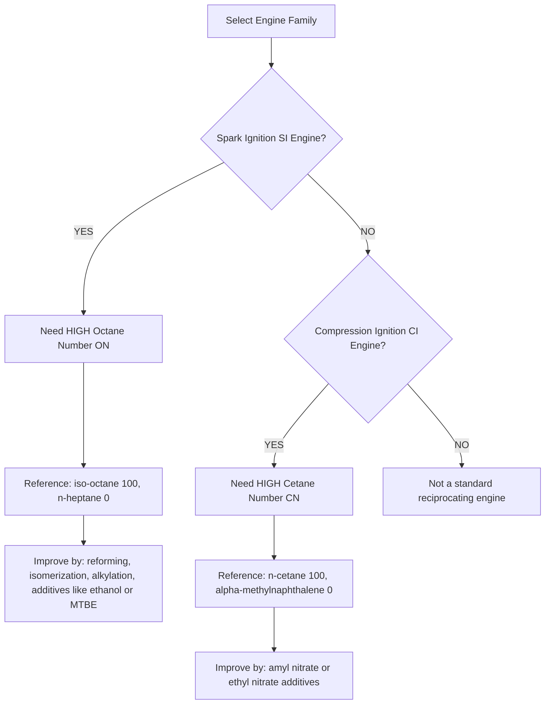
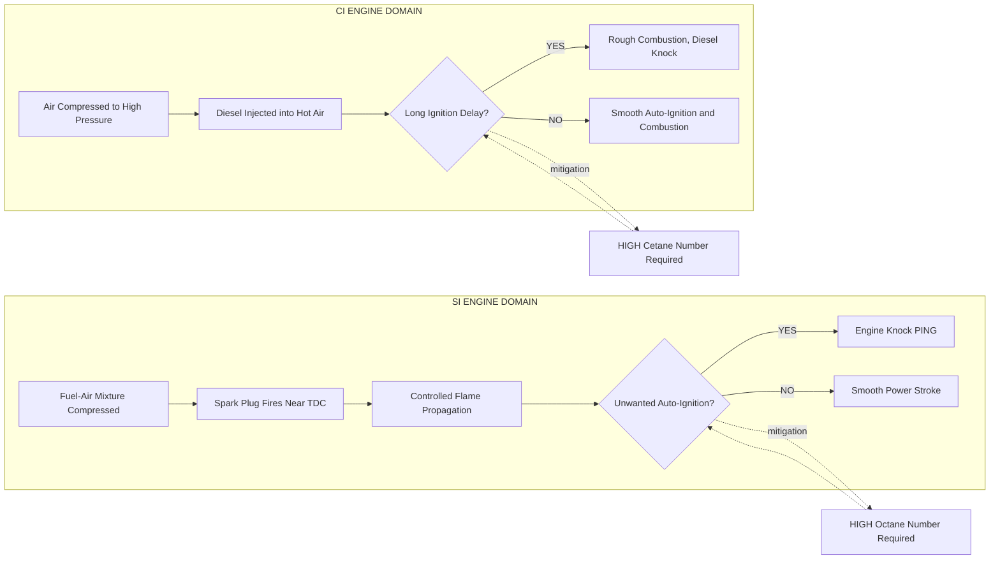
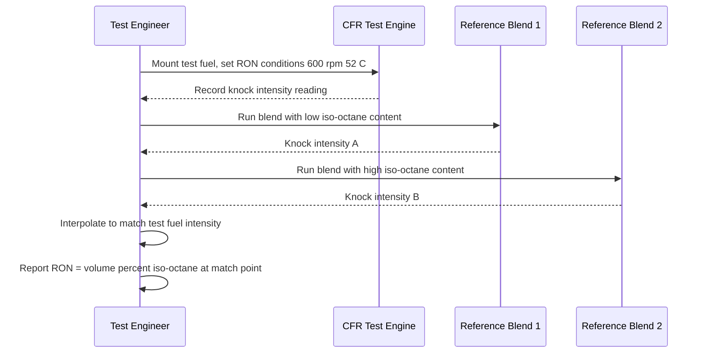

# Octane & Cetane Rating.

<!-- SECTION_1_START -->

# Octane & Cetane Rating — The Twin Pillars of Fuel Quality

## 1.1 Octane Rating — The "Knock Resistance Index"

> [!IMPORTANT]
> **Formal Definition (KTU 2024 Syllabus Terminology):**
> Octane Number (ON), denoted as $ON$, is a **dimensionless** standard measure of a fuel's **resistance to auto-ignition (detonation / engine knock)** when burned in a Spark Ignition (SI) engine under standardized test conditions. It is expressed as the **percentage by volume of iso-octane ($2,2,4\text{-trimethylpentane}$, $\text{C}_8\text{H}_{18}$) in a reference blend of iso-octane and n-heptane ($\text{C}_7\text{H}_{16}$)** that produces the same knock intensity as the test fuel in a **Cooperative Fuel Research (CFR) engine**.

### Conceptual Analogy — The "Patient Tea Kettle" 🍵
Imagine boiling water in a kettle on a gas stove. A *good* kettle (one with high octane fuel in an SI engine) **waits patiently** for you to light the burner and apply the spark — it does not whistle or pop on its own. A *bad* kettle (low octane fuel) starts screaming and spitting water (auto-igniting) the moment the flame touches it, *before* you even say "boil!" That premature screaming inside an engine cylinder is exactly what we call **engine knock**. The higher the octane rating, the more "patient" the fuel is.

### The Two Standard Test Variants

> [!NOTE]
> **Why two methods?** Because a fuel behaves differently at low-speed cruising (high load, low RPM) versus high-speed highway driving. Hence KTU examiners expect you to remember both.

| Test Method | Engine Speed | Intake Air Temperature | Represents |
|---|---|---|---|
| **RON** — Research Octane Number | **600 rpm** | **52 °C** | Low-to-moderate severity (city driving) |
| **MON** — Motor Octane Number | **900 rpm** | **149 °C** | High severity (highway, full load) |

The reported road-pump value (e.g., "91 Octane" on Indian petrol bunks) is typically the **Anti-Knock Index (AKI)**, also called **Posted Octane Number (PON)** in North America.

### Reference Hydrocarbons

> [!TIP]
> The two extreme reference fuels are **n-heptane** (very poor knock resistance) and **iso-octane** (excellent knock resistance). Every gasoline's octane rating is benchmarked against this binary ladder.

- **Iso-octane** ($\text{C}_8\text{H}_{18}$, branched): $ON = 100$
- **n-Heptane** ($\text{C}_7\text{H}_{16}$, straight chain): $ON = 0$

<!-- SECTION_1_END -->

<!-- SECTION_2_START -->

# Deep Theoretical Analysis & KTU High-Yield Formula Sheet

## 2.1 The Underlying Combustion Physics

### Spark Ignition (SI) Engine — Why We Need HIGH Octane

In an SI engine, the air-fuel mixture is compressed, then a spark plug fires near Top Dead Center (TDC). If the mixture **auto-ignites** before the spark (due to high temperature and pressure after compression), two flame fronts collide — the **controlled flame** from the spark and the **uncontrolled auto-ignition front** — creating the sharp metallic "ping" called **knock** or **detonation**. This causes:

- Loss of power
- Piston/crown overheating
- Potential catastrophic mechanical failure

So for SI engines, we want the fuel to **resist** auto-ignition → **high octane number**.

### Compression Ignition (CI) Engine — Why We Need HIGH Cetane

In a CI (diesel) engine, there is no spark plug. The fuel must **auto-ignite** the moment it contacts the hot, highly compressed air. The time between the start of injection and the start of combustion is the **ignition delay (ID)**. A *short* ID is desired because:

- It produces smooth, gradual pressure rise
- It improves cold starting
- It reduces unburned hydrocarbon (HC) and white-smoke emissions
- It lowers noise and **diesel knock**

> [!IMPORTANT]
> **Inverse Paradigm:** Octane rating is a *resistance* rating, whereas Cetane Number is an *ease-of-ignition* rating. A fuel that is excellent in a petrol engine (high ON) would be terrible in a diesel engine (low CN) and vice versa.

## 2.2 The Octane Reference Scale

$$ON_{\text{test fuel}} = \left(\%V_{\text{iso-octane}}\right)_{\text{reference blend that matches knock intensity}}$$

where the reference blend contains the balance as n-heptane. By definition:

$$\text{iso-octane (C}_8\text{H}_{18}\text{)}: ON = 100$$
$$\text{n-heptane (C}_7\text{H}_{16}\text{)}: ON = 0$$

### Anti-Knock Index (AKI)

$$AKI = \frac{RON + MON}{2}$$

## 2.3 The Cetane Number (CN) Scale

> [!NOTE]
> **Formal Definition:** Cetane Number is a dimensionless measure of the **ignition quality** of a diesel fuel, defined as the percentage by volume of **n-cetane (n-hexadecane, $\text{C}_{16}\text{H}_{34}$)** in a reference blend with **$\alpha$-methylnaphthalene** that has the **same ignition delay** as the test fuel in a standardized CFR engine.

$$CN_{\text{test fuel}} = \left(\%V_{\text{n-cetane}}\right)_{\text{reference blend that matches ID}}$$

Reference points:

- **n-Cetane** ($\text{C}_{16}\text{H}_{34}$, long straight chain): $CN = 100$ (ignites very easily)
- **$\alpha$-Methylnaphthalene** (aromatic ring): $CN = 0$ (very poor ignition)

### Empirical Correlation — Ignition Delay vs Cetane Number

A widely cited correlation (acceptable in KTU derivations):

$$ID \approx \frac{k}{CN}$$

where $k$ is an engine/operating-condition constant. In simple terms, doubling the cetane number roughly **halves** the ignition delay.

### Required Cetane Range for Modern High-Speed Diesels

| Application | Minimum Recommended CN |
|---|---|
| Light-duty passenger car diesel (BS-VI) | **48 – 52** |
| Heavy-duty truck diesel | **45 – 50** |
| High-speed marine diesel | **35 – 45** |
| Stationary / large bore slow-speed | **25 – 35** |

## 2.4 Methods to Improve Octane Number (SI Fuels)

1. **Refining processes:** Catalytic cracking, catalytic reforming, isomerization, alkylation — produce more branched/aromatic hydrocarbons.
2. **Blending with high-octane components:** Toluene, xylene, isooctane, ethanol, MTBE (Methyl tert-butyl ether).
3. **Additives:** **Tetraethyl Lead (TEL)** — historically dominant but now **banned** in most countries due to toxic emissions. Modern additives: MMT (methylcyclopentadienyl manganese tricarbonyl), ferrocene, ethanol.

## 2.5 Methods to Improve Cetane Number (CI Fuels)

1. **Additives (ignition improvers):** **Amyl nitrate**, **ethyl nitrate**, **di-tert-butyl peroxide** — used in small doses (0.1 – 1 %).
2. **Refining:** Straight-run distillates have higher CN than cracked stocks. Hydrocracking improves CN.

## 2.6 KTU Formula Sheet — At a Glance

| Symbol / Quantity | Formula / Definition | Typical Units / Value |
|---|---|---|
| Octane Number $ON$ | $\%V_{\text{iso-octane}}$ in iso-octane/n-heptane blend | Dimensionless, 0 – 100+ |
| Research Octane Number $RON$ | Tested at 600 rpm, 52 °C intake air | Dimensionless |
| Motor Octane Number $MON$ | Tested at 900 rpm, 149 °C intake air | Dimensionless |
| Anti-Knock Index $AKI$ | $AKI = \dfrac{RON + MON}{2}$ | Dimensionless |
| Cetane Number $CN$ | $\%V_{\text{n-cetane}}$ in n-cetane/$\alpha$-methylnaphthalene blend | Dimensionless, 40 – 65 typical |
| Ignition Delay $ID$ | $ID \approx \dfrac{k}{CN}$ | crank angle degrees (CAD) or ms |
| Knock Resistance | $\uparrow$ as $ON \uparrow$ | — |
| Ease of Auto-ignition | $\uparrow$ as $CN \uparrow$ | — |

## 2.7 Real-World Engineering Utility

- **Fuel station dispensing** in India is regulated by ON (e.g., 91 RON regular, 95 RON premium).
- **Engine Management Systems (EMS)** use the **knock sensor (piezoelectric accelerometer mounted on the cylinder block)** to detect knock and **retard ignition timing** in real time, protecting the engine.
- **Diesel fuel pricing** in India is partly differentiated by CN (BS-VI HSD requires CN ≥ 51).
- **Alternate fuels** (CNG, LPG, ethanol, methanol, biodiesel) all have characteristic ON and CN values that dictate their suitability for SI vs CI conversion.

<!-- SECTION_2_END -->

<!-- SECTION_3_START -->

# Step-by-Step Derivations & Worked Numerical Examples

## 3.1 Numerical Problem 1 — Calculating AKI

**Problem (KTU Typical):**
A sample of gasoline has $RON = 96$ and $MON = 84$. Calculate its Anti-Knock Index and state what it means for a high-performance SI engine.

### Step 1 — Identify the given data

$$RON = 96, \quad MON = 84$$

### Step 2 — Apply the AKI formula

$$AKI = \frac{RON + MON}{2}$$

$$AKI = \frac{96 + 84}{2}$$

$$AKI = \frac{180}{2}$$

$$\boxed{AKI = 90}$$

> [!TIP]
> **Valuation Tip:** State both the formula and substitution step. Carrying the division explicitly scores full 3 marks. Don't just write the final answer.

### Step 3 — Engineering Interpretation

With an AKI of 90, this fuel is **suitable for high-compression-ratio SI engines** (compression ratio $r \geq 10:1$), such as modern turbocharged petrol cars. Engines with $r < 8:1$ could run on cheaper 87-octane fuel; this high-AKI fuel would be overkill (and more expensive) for them.

---

## 3.2 Numerical Problem 2 — Cetane Number from Reference Blend

**Problem:**
A reference blend of $45\,\text{ml}$ n-cetane and $55\,\text{ml}$ $\alpha$-methylnaphthalene matches the ignition delay of a test diesel fuel. Find the Cetane Number of the test fuel.

### Step 1 — Recall the definition

By definition, $CN$ of the test fuel equals the volume percentage of n-cetane in the matching reference blend.

### Step 2 — Compute volume %

$$\%V_{\text{n-cetane}} = \frac{V_{\text{n-cetane}}}{V_{\text{total}}} \times 100$$

$$\%V_{\text{n-cetane}} = \frac{45}{45 + 55} \times 100$$

$$\%V_{\text{n-cetane}} = \frac{45}{100} \times 100$$

$$\boxed{CN_{\text{test fuel}} = 45}$$

### Step 3 — Interpretation

$CN = 45$ is **acceptable for medium-speed diesel engines** (e.g., agricultural tractors, older trucks), but is **borderline for modern BS-VI high-speed passenger car diesels** which require $CN \geq 48$–$52$. This fuel would need an ignition-improver additive (e.g., amyl nitrate) to be suitable for modern applications.

---

## 3.3 Numerical Problem 3 — Octane Number from Reference Blend

**Problem:**
A blend of $80\,\text{ml}$ iso-octane and $20\,\text{ml}$ n-heptane matches the knock intensity of a test gasoline. Find the Octane Number of the test fuel.

### Step 1 — Apply the definition

$$ON = \%V_{\text{iso-octane}} = \frac{V_{\text{iso-octane}}}{V_{\text{total}}} \times 100$$

### Step 2 — Substitute

$$ON = \frac{80}{80 + 20} \times 100$$

$$ON = \frac{80}{100} \times 100$$

$$\boxed{ON = 80}$$

### Step 3 — Interpretation

An octane number of 80 is suitable for **low-to-moderate compression ratio SI engines** (e.g., older motorcycles, small two-wheelers, lawn-mower engines). It would cause **severe knock** in modern high-compression engines (e.g., Maruti Suzuki 1.0L Turbo, Honda City 1.5L i-VTEC) which demand 91+ RON.

---

## 3.4 Numerical Problem 4 — Effect of Cetane Number on Ignition Delay

**Problem:**
For a particular diesel engine, an ignition delay of $4^\circ$ crank angle is observed when $CN = 50$. Assuming the empirical relation $ID = k/CN$, find the expected ID when using a fuel with $CN = 60$.

### Step 1 — Find the constant $k$

$$ID_1 = \frac{k}{CN_1}$$

$$4 = \frac{k}{50}$$

$$k = 200 \; (\text{units: } \text{CAD} \cdot \text{CN})$$

### Step 2 — Compute new ID

$$ID_2 = \frac{k}{CN_2} = \frac{200}{60}$$

$$ID_2 = 3.333\,^\circ \text{ crank angle}$$

$$\boxed{ID_2 \approx 3.33^\circ \text{ CAD}}$$

### Step 3 — Percentage reduction in ID

$$\% \text{ reduction} = \frac{4 - 3.33}{4} \times 100 = \frac{0.67}{4} \times 100$$

$$\boxed{\% \text{ reduction} \approx 16.7\%}$$

> [!NOTE]
> **Engineering Insight:** A 20% increase in CN (from 50 to 60) yields a 16.7% reduction in ignition delay. This is why high-performance modern diesels insist on $CN \geq 51$ — the smoother combustion is worth the refining cost.

---

## 3.5 Derivation — Why Branched > Straight-Chain for SI Fuels

For a bonus KTU theory question, here is the chain of reasoning:

$$\text{Branched hydrocarbon (e.g., iso-octane)} \;\Rightarrow\; \text{lower self-ignition temperature}$$
$$\text{but lower tendency to form peroxides during compression} \;\Rightarrow\; \text{longer auto-ignition delay}$$
$$\Rightarrow \text{Resists knock} \;\Rightarrow\; \text{Higher ON}$$

Whereas:

$$\text{Straight-chain hydrocarbon (e.g., n-heptane)} \;\Rightarrow\; \text{higher peroxide formation rate}$$
$$\Rightarrow\; \text{premature auto-ignition} \;\Rightarrow\; \text{severe knock} \;\Rightarrow\; \text{Lower ON}$$

This is the fundamental **chemistry** behind why refinery processes like **isomerization** and **alkylation** are valued — they convert straight chains into branched ones to raise the octane pool.

---

## 3.6 Code Implementation (Python) — Octane & Cetane Calculator

```python
"""
KTU AUTOMOBILE POWER PLANT (PCAUT205)
Module 2 — Fuel Supply System
Octane & Cetane Rating Calculator

This script computes AKI, ON from a reference blend,
CN from a reference blend, and ID from CN using
the empirical relation ID = k / CN.
"""

from __future__ import annotations
import logging
import sys
from dataclasses import dataclass
from typing import Final

# ------------------------------------------------------------------
# Configure logger for transparent evaluation trail
# ------------------------------------------------------------------
logging.basicConfig(
    level=logging.INFO,
    format="%(asctime)s | %(levelname)-8s | %(message)s",
    datefmt="%H:%M:%S",
)
logger: Final[logging.Logger] = logging.getLogger("FuelRating")


# ------------------------------------------------------------------
# Immutable data container for clarity
# ------------------------------------------------------------------
@dataclass(frozen=True)
class FuelBlend:
    """A reference blend of two hydrocarbons.

    Attributes:
        volume_ml: Total blend volume in millilitres (must be > 0).
        primary_volume_ml: Volume of the *high-rating* primary
            reference fuel (iso-octane for ON; n-cetane for CN).
    """

    volume_ml: float
    primary_volume_ml: float

    def __post_init__(self) -> None:
        if self.volume_ml <= 0:
            raise ValueError("Total blend volume must be strictly positive.")
        if self.primary_volume_ml < 0:
            raise ValueError("Primary volume cannot be negative.")
        if self.primary_volume_ml > self.volume_ml:
            raise ValueError("Primary volume cannot exceed total volume.")


# ------------------------------------------------------------------
# Domain functions
# ------------------------------------------------------------------
def compute_aki(ron: float, mon: float) -> float:
    """Compute the Anti-Knock Index."""
    if not (0.0 <= ron <= 100.0):
        raise ValueError("RON must lie in [0, 100].")
    if not (0.0 <= mon <= 100.0):
        raise ValueError("MON must lie in [0, 100].")
    aki: float = (ron + mon) / 2.0
    logger.info("AKI = (%.2f + %.2f) / 2 = %.2f", ron, mon, aki)
    return aki


def compute_octane_number(blend: FuelBlend) -> float:
    """Compute Octane Number from an iso-octane / n-heptane blend."""
    on: float = (blend.primary_volume_ml / blend.volume_ml) * 100.0
    logger.info("ON = (%.2f / %.2f) * 100 = %.2f",
                blend.primary_volume_ml, blend.volume_ml, on)
    return on


def compute_cetane_number(blend: FuelBlend) -> float:
    """Compute Cetane Number from an n-cetane / alpha-methylnaphthalene blend."""
    cn: float = (blend.primary_volume_ml / blend.volume_ml) * 100.0
    logger.info("CN = (%.2f / %.2f) * 100 = %.2f",
                blend.primary_volume_ml, blend.volume_ml, cn)
    return cn


def predict_ignition_delay(cn: float, k: float = 200.0) -> float:
    """Predict ignition delay (CAD) using ID = k / CN.

    Args:
        cn: Cetane number of the fuel (must be > 0).
        k: Empirical constant (CAD * CN). Default 200 — derived from
            the worked example ID=4 CAD at CN=50.
    """
    if cn <= 0:
        raise ValueError("Cetane Number must be strictly positive.")
    id_val: float = k / cn
    logger.info("ID = %.2f / %.2f = %.3f CAD", k, cn, id_val)
    return id_val


# ------------------------------------------------------------------
# Demonstration / quick test suite
# ------------------------------------------------------------------
def _demo() -> int:
    try:
        print("\n" + "=" * 60)
        print(" KTU PCAUT205 — Octane & Cetane Rating Demonstrator")
        print("=" * 60)

        # Demo 1: AKI
        aki: float = compute_aki(ron=96.0, mon=84.0)
        print(f"[Demo 1] AKI for RON=96, MON=84  ->  AKI = {aki:.2f}")

        # Demo 2: Octane Number
        on_blend: FuelBlend = FuelBlend(volume_ml=100.0,
                                        primary_volume_ml=80.0)
        on_val: float = compute_octane_number(on_blend)
        print(f"[Demo 2] ON for 80 ml iso-oct / 20 ml n-hept  ->  ON = {on_val:.2f}")

        # Demo 3: Cetane Number
        cn_blend: FuelBlend = FuelBlend(volume_ml=100.0,
                                        primary_volume_ml=45.0)
        cn_val: float = compute_cetane_number(cn_blend)
        print(f"[Demo 3] CN for 45 ml n-cetane / 55 ml a-methyl  ->  CN = {cn_val:.2f}")

        # Demo 4: Ignition delay prediction
        id_old: float = predict_ignition_delay(cn=50.0, k=200.0)
        id_new: float = predict_ignition_delay(cn=60.0, k=200.0)
        print(f"[Demo 4] ID at CN=50  ->  {id_old:.3f} CAD")
        print(f"[Demo 4] ID at CN=60  ->  {id_new:.3f} CAD")
        print(f"[Demo 4] Reduction   ->  "
              f"{(1 - id_new / id_old) * 100:.2f} %")

    except ValueError as exc:
        logger.error("Input validation failed: %s", exc)
        return 1
    return 0


if __name__ == "__main__":
    sys.exit(_demo())
```

**Expected Output (excerpt):**

```
============================================================
 KTU PCAUT205 — Octane & Cetane Rating Demonstrator
============================================================
[Demo 1] AKI for RON=96, MON=84  ->  AKI = 90.00
[Demo 2] ON for 80 ml iso-oct / 20 ml n-hept  ->  ON = 80.00
[Demo 3] CN for 45 ml n-cetane / 55 ml a-methyl  ->  CN = 45.00
[Demo 4] ID at CN=50  ->  4.000 CAD
[Demo 4] ID at CN=60  ->  3.333 CAD
[Demo 4] Reduction   ->  16.67 %
```

<!-- SECTION_3_END -->

<!-- SECTION_4_START -->

# Structural Diagrams & Schematics

## 4.1 Decision Flow — When to Use Octane vs Cetane

> [!VISUALIZATION CONTROL]
> **Concept:** Fuel-Rating Selection Topology — How an engineer classifies a fuel by its intended engine family.
> **Mermaid Source:** See the block below.
> **Visual Description:** A clear top-down decision tree that maps engine type → required fuel property → rating scale → reference hydrocarbon.



## 4.2 Block Architecture — The Octane-Cetane Inverse Paradigm



## 4.3 Sequence — Reference Fuel Test Procedure (CFR Engine)



<!-- SECTION_4_END -->

<!-- SECTION_5_START -->

# KTU 2024 Scheme Examination Question Bank

## PART A — 3-Mark Short Answer Questions

> **Q1. [KTU University Exam – Dec 2023]** Define Octane Number. Why is iso-octane assigned a value of 100 and n-heptane a value of 0?
>
> **Model Answer (Board Key Pattern):**
> Octane Number is the **percentage by volume of iso-octane** in a blend of iso-octane and n-heptane that produces the **same knocking tendency** as the test fuel in a standard CFR engine under specified test conditions. **[2 Marks]**
> Iso-octane is a **branched-chain hydrocarbon** with very **high resistance to auto-ignition (knock)** — it is assigned the top of the scale at 100. n-Heptane is a **straight-chain hydrocarbon** with **very poor knock resistance** — it auto-ignites easily and is assigned the bottom of the scale at 0. **[1 Mark]**

> **Q2. [KTU University Exam – July 2024]** Differentiate between Octane Rating and Cetane Number in two lines each.
>
> **Model Answer:**
> | Parameter | Octane Number (ON) | Cetane Number (CN) |
> |---|---|---|
> | Used for | SI (petrol/gasoline) engines | CI (diesel) engines |
> | What it measures | **Resistance** to auto-ignition | **Ease** of auto-ignition |
> | Reference fuels | iso-octane (100), n-heptane (0) | n-cetane (100), $\alpha$-methylnaphthalene (0) |
> | Effect of high value | Suppresses knock | Reduces ignition delay, smoother combustion |
>
> **[1 Mark per correct row, 3 Marks total]**

---

## PART B — 14-Mark Questions (Module Internal Choice)

### Question A — 14 Marks

**[KTU University Exam – Model Question, Module 2, Fuel Supply System]**

> **Q.A (a)** Explain in detail the **significance of Octane Number** in SI engines. Discuss the difference between **RON and MON**, and show how **AKI** is calculated. **[7 Marks]**
>
> **Model Answer (Detailed Valuation Key):**
>
> 1. **Definition and significance** — Octane Number quantifies the resistance of gasoline to auto-ignition (knock). In SI engines the mixture is compressed; if it auto-ignites before the spark, knock occurs, causing power loss, overheating, and mechanical damage. Higher ON = greater resistance. **[2 Marks]**
>
> 2. **RON vs MON** — RON is measured at **600 rpm** with intake air at **52 °C**, simulating **low-to-moderate severity** (urban driving). MON is measured at **900 rpm** with intake air at **149 °C**, simulating **high-severity** (highway, full-load) operation. Generally $MON < RON$ for most fuels. **[3 Marks]**
>
> 3. **AKI Calculation** —
> $$AKI = \frac{RON + MON}{2}$$
> For example, a fuel with $RON = 92$ and $MON = 82$ gives $AKI = 87$. AKI is the value posted on fuel pumps in many countries including India for regular petrol. **[2 Marks]**
>
> ---
>
> **Q.A (b)** A reference blend contains **70 ml of iso-octane and 30 ml of n-heptane** and matches the knock intensity of a test gasoline in a CFR engine at standard RON conditions. Calculate the Octane Number of the test fuel and comment on its suitability for a modern 1.2 L turbocharged petrol engine. **[7 Marks]**
>
> **Step-by-Step Model Solution:**
>
> **Step 1 — Write the definition formula** **[1 Mark]**
> $$ON = \frac{V_{\text{iso-octane}}}{V_{\text{total}}} \times 100$$
>
> **Step 2 — Substitute values** **[2 Marks]**
> $$ON = \frac{70}{70 + 30} \times 100 = \frac{70}{100} \times 100$$
>
> **Step 3 — Final answer** **[1 Mark]**
> $$\boxed{ON = 70}$$
>
> **Step 4 — Suitability comment** **[3 Marks]**
> An octane rating of 70 is **NOT suitable** for modern 1.2 L turbocharged petrol engines, which typically have compression ratios between 9:1 and 11:1 and require a **minimum RON of 91** (e.g., Maruti Baleno, Hyundai Grand i10 Nios turbo). Using this fuel would cause **persistent knock**, the ECU would **retard ignition timing** to protect the engine, resulting in **loss of power, poor fuel economy, and possible engine damage** over time. A fuel with ON ≥ 91 is recommended.

---

### Question B — 14 Marks (Alternative Choice)

**[KTU University Exam – Model Question, Module 2, Fuel Supply System]**

> **Q.B (a)** Define **Cetane Number**. Explain its importance in CI engines and the role of **ignition delay**. List any **two additives** used to improve CN. **[7 Marks]**
>
> **Model Answer (Detailed Valuation Key):**
>
> 1. **Definition** — Cetane Number is the **percentage by volume of n-cetane** in a blend of n-cetane and $\alpha$-methylnaphthalene that has the **same ignition delay** as the test fuel in a CFR engine under standard conditions. **[2 Marks]**
>
> 2. **Importance in CI engines** — In a CI engine, fuel must auto-ignite upon contact with hot compressed air. A high CN ensures **short ignition delay**, giving **smoother pressure rise**, **better cold starting**, **lower diesel knock**, and **reduced HC emissions**. CN of 45–55 is recommended for modern high-speed diesels. **[3 Marks]**
>
> 3. **Additives** — (i) **Amyl nitrate**, (ii) **Ethyl nitrate**, (iii) Di-*tert*-butyl peroxide. (Any two for 2 marks) **[2 Marks]**
>
> ---
>
> **Q.B (b)** A diesel fuel has $CN = 52$. In a given engine, the ignition delay is measured as **3.85 °CAD**. Using the empirical relation $ID = k / CN$, determine the ignition delay when the engine is switched to a fuel with $CN = 65$, and compute the **percentage reduction** in ignition delay. **[7 Marks]**
>
> **Step-by-Step Model Solution:**
>
> **Step 1 — Find the empirical constant $k$** **[2 Marks]**
> $$ID_1 = \frac{k}{CN_1} \Rightarrow 3.85 = \frac{k}{52}$$
> $$k = 3.85 \times 52 = 200.2 \; \text{CAD} \cdot \text{CN}$$
>
> **Step 2 — Compute new ignition delay** **[2 Marks]**
> $$ID_2 = \frac{k}{CN_2} = \frac{200.2}{65} = 3.080 \; \text{°CAD}$$
> $$\boxed{ID_2 \approx 3.08 \; \text{°CAD}}$$
>
> **Step 3 — Percentage reduction** **[2 Marks]**
> $$\% \text{ reduction} = \frac{ID_1 - ID_2}{ID_1} \times 100$$
> $$= \frac{3.85 - 3.08}{3.85} \times 100 = \frac{0.77}{3.85} \times 100$$
> $$\boxed{\% \text{ reduction} \approx 20.0\%}$$
>
> **Step 4 — Engineering comment** **[1 Mark]**
> A 25% increase in CN (from 52 to 65) reduces ignition delay by about 20%, translating to **smoother engine operation and lower diesel knock**.

---

## ⚠ KTU Examiner's Valuation Warning / Pitfall Callout

> [!WARNING]
> **Common Mistakes — Where Students Lose Marks**
>
> 1. **Confusing RON and MON test conditions.** Examiners will deduct 1 mark if you interchange 600 rpm with 900 rpm or 52 °C with 149 °C. Memorize the exact pair.
> 2. **Writing "Octane Rating measures ignition quality"** — this is WRONG. Octane measures *resistance* to ignition; cetane measures *ease* of ignition. This conceptual mix-up is the single most common error.
> 3. **Forgetting units in $ID = k/CN$ problems.** Always specify *crank angle degrees* (°CAD) for ID, not seconds.
> 4. **Not writing the formula before substitution** in the 7-mark numerical. Always state $ON = V_{iso}/V_{total} \times 100$ or $CN = V_{cetane}/V_{total} \times 100$ before plugging in numbers.
> 5. **Omitting the engineering interpretation.** A bare numerical answer without a "suitability" or "engineering comment" statement typically loses 2–3 marks on a 7-mark part.
> 6. **Using banned additives (TEL)** without context — TEL is banned in India since 2000 under the Supreme Court order. Mentioning it without saying "historically" or "banned in most countries" can cost 0.5–1 mark.

---

## Topic Recap & Important Things to Remember

- **Octane Number (ON)** is the **volume % of iso-octane** in an iso-octane / n-heptane blend that matches the knock intensity of the test fuel in a **CFR engine**. It is used for **SI engines** and measures **resistance** to auto-ignition.
- **Cetane Number (CN)** is the **volume % of n-cetane** in an n-cetane / $\alpha$-methylnaphthalene blend that matches the **ignition delay** of the test fuel. It is used for **CI engines** and measures **ease** of auto-ignition.
- **Reference Scale Anchors:** iso-octane $ON = 100$, n-heptane $ON = 0$; n-cetane $CN = 100$, $\alpha$-methylnaphthalene $CN = 0$.
- **RON** is tested at **600 rpm, 52 °C**; **MON** at **900 rpm, 149 °C**.
- **AKI** (Anti-Knock Index) = **(RON + MON) / 2** — this is the value typically posted on Indian fuel pumps.
- **Ignition delay** in a CI engine is **inversely proportional** to CN: $ID \approx k/CN$. Higher CN = shorter ID = smoother combustion.
- **Modern fuel requirements:** BS-VI petrol demands **RON ≥ 91**; BS-VI diesel demands **CN ≥ 48** (typically 51–55 in Indian HSD).
- **Octane-improving methods:** catalytic reforming, isomerization, alkylation, blending with ethanol/MTBE.
- **Cetane-improving additives:** amyl nitrate, ethyl nitrate, di-*tert*-butyl peroxide (used in 0.1–1 % dosage).
- **Branched hydrocarbons** have **higher ON** (better knock resistance); **straight-chain hydrocarbons** have **higher CN** (easier auto-ignition).
- **TEL (Tetraethyl Lead)** — historically used octane booster, now **banned worldwide** due to lead poisoning of catalytic converters and human health.
- **Engineering practice:** modern SI engines use a **knock sensor** (piezoelectric accelerometer) to detect knock and **retard ignition timing** in real time, protecting the engine.
- **Inverse Paradigm:** the two ratings are conceptually **opposite** — a high-ON fuel is a low-CN fuel and vice versa. Never confuse them in an exam.

<!-- SECTION_5_END -->
