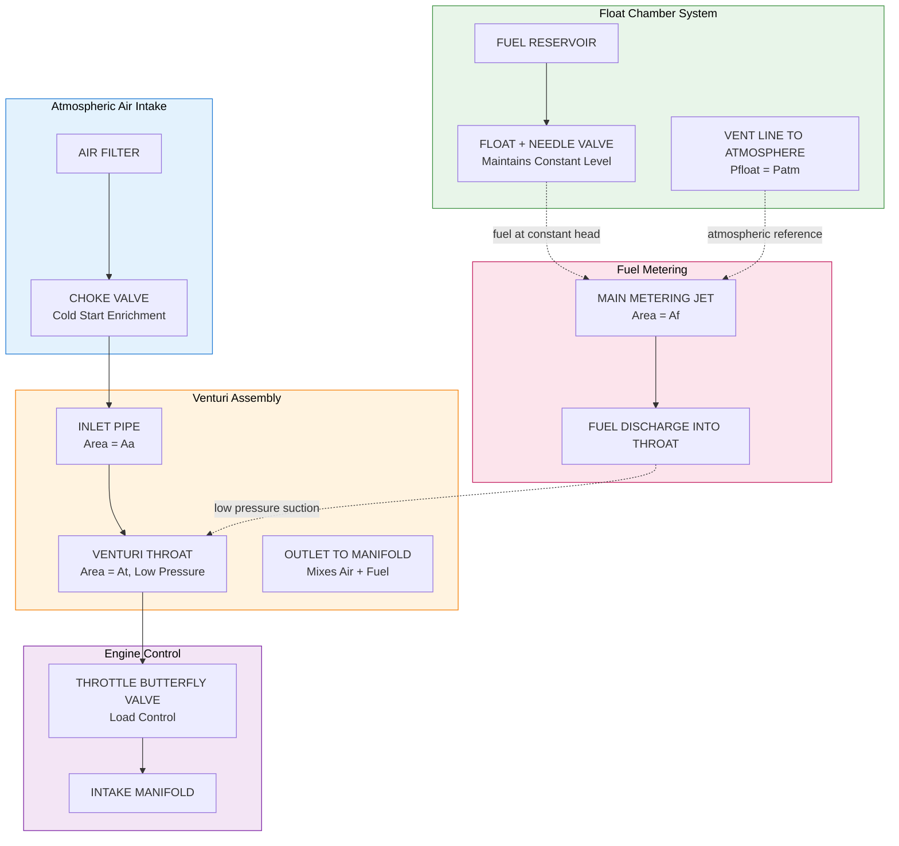
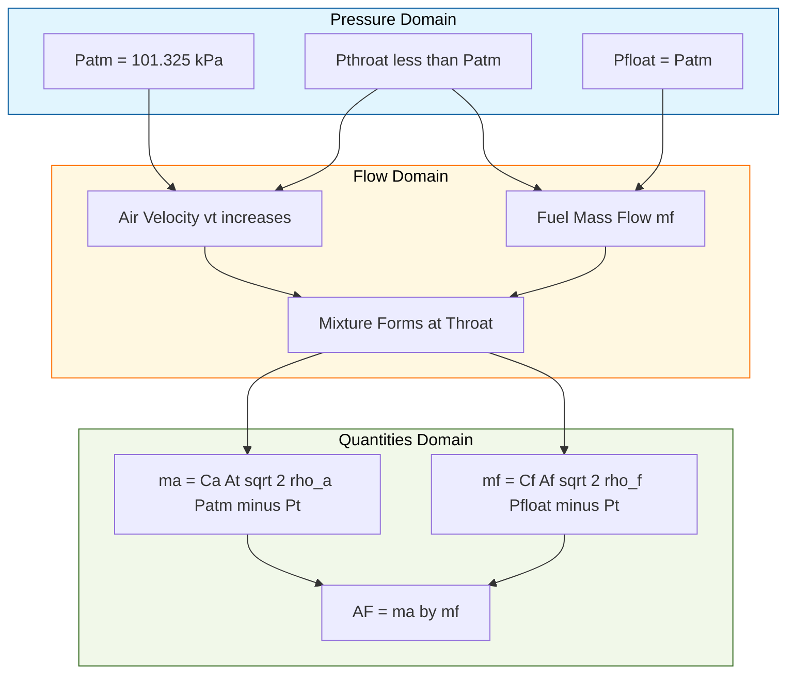

# simple carburetor

<!-- SECTION_1_START -->

# 🔧 Simple Carburetor — KTU Premium Study Notes

## 1. Core Technical Definition & Intuitive Overview

### 📘 Formal Academic Definition (KTU 2024 Syllabus Terminology)

> [!IMPORTANT]
> **Simple Carburetor (Elementary / Ideal Carburetor):**
> A carburetor is a mechanical device fitted to a spark-ignition (SI) engine that atomizes, meters, and mixes liquid fuel with air in the correct proportion to form a combustible air–fuel mixture suitable for combustion in the engine cylinders. A *simple carburetor* is the most basic form, consisting of essentially a **float chamber**, a **main metering jet**, and a **venturi throat**, delivering a stoichiometrically proportional mixture whose air–fuel ratio depends solely on the densities of air and fuel, the discharge coefficients, and the geometric areas of the jet and throat.

### 🧠 Intuitive Analogy — "The Perfume Spray Principle"

Imagine pressing the rubber bulb of a perfume atomizer:

- The **air rushes in fast** through a narrow passage (the **venturi**).
- The **fast-moving air creates a low-pressure zone** at the narrow point.
- The **low pressure sucks perfume up** through a small tube (the **fuel jet**).
- The two streams mix and emerge as a fine spray.

A simple carburetor works **exactly the same way**, except the "perfume" is petrol, the "spray" is the combustible mixture, and the bulb is the descending engine piston.

> [!NOTE]
> **George Brayton (1887)** built the first practical carburetor concept based on the **Venturi effect**, discovered by **Giovanni Venturi (1797)**. The simple (elementary) carburetor is the theoretical foundation upon which modern compound and multi-jet carburetors are engineered.

### 🧩 Essential Parts of a Simple Carburetor

| No. | Component | Function |
|:----|:----------|:---------|
| 1 | **Float Chamber** | Stores fuel at a constant level, isolated from engine vibration |
| 2 | **Float + Needle Valve** | Maintains a constant fuel level by closing the inlet when level rises |
| 3 | **Venturi Throat** | A converging–diverging passage that accelerates air, creating a pressure drop |
| 4 | **Main Metering Jet** | Calibrated orifice that meters fuel delivery based on the pressure drop |
| 5 | **Throttle Valve (Butterfly)** | Controls the mass of mixture entering the cylinders |
| 6 | **Choke Valve** | Restricts air entry during cold starting to enrich the mixture |

> [!TIP]
> **Why a constant fuel level?** If the fuel head ($h_f$) above the jet varies, the hydrostatic pressure at the jet changes, disturbing the A/F ratio. A float chamber keeps the level to within $\pm 1 \text{ mm}$, ensuring metering accuracy.

### 🌐 GeoGebra / Desmos Visualization

> [!VISUALIZATION CONTROL]
> **Concept:** Venturi Throat Profile and Pressure Distribution
> **GeoGebra / Desmos Input Equations:**
> * Throat half-width (venturi shape): $y(x) = 0.4 + 0.2 \cdot \left(1 - e^{-x^2/0.1}\right)$
> * Air velocity approximation: $v(x) = \dfrac{1}{y(x)}$
> * Pressure (Bernoulli): $P(x) = 1 - \dfrac{1}{2} \cdot \rho_a \cdot v(x)^2$
> **Visual Description:** The student should observe a *narrow waist* at the venturi throat, where the velocity $v(x)$ **peaks** and the pressure $P(x)$ **dips** to its minimum — this low-pressure point is exactly where the fuel jet is positioned.

---

<!-- SECTION_1_END -->

<!-- SECTION_2_START -->

## 2. Deep Theoretical Analysis & KTU High-Yield Formula Sheet

### ⚙️ Operational Logic — Step by Step

1. **Piston Descends (Intake Stroke):** Creates a partial vacuum in the intake manifold.
2. **Atmospheric Air Enters:** Air rushes through the venturi due to the pressure difference between atmosphere and the manifold.
3. **Venturi Effect Activates:** As air passes through the constricted throat, its velocity increases (continuity equation: $A_1 v_1 = A_2 v_2$).
4. **Bernoulli's Pressure Drop:** The increase in kinetic energy is balanced by a drop in static pressure at the throat: $P_{throat} < P_{atm}$.
5. **Fuel Discharge:** Since the float chamber is vented to the atmosphere, $P_{float} = P_{atm}$. The pressure difference $(P_{float} - P_{throat})$ forces fuel up through the main metering jet into the airstream.
6. **Atomization \& Mixing:** The high-velocity air shears the fuel into a fine mist, which vaporizes and mixes homogeneously.
7. **Throttle Regulation:** The butterfly valve controls total mixture mass flow to match engine load demand.

> [!NOTE]
> **Critical Insight:** In a *simple* carburetor, the only variables controlling A/F ratio are the **jet area** and the **throat area** (which are fixed) and the **physical properties of fuel and air** (assumed constant). Hence, the A/F ratio remains **constant** across all engine speeds and loads — a major limitation we will address later.

### 📐 KTU High-Yield Formula Sheet

| # | Quantity | Formula | Units | Conditions / Notes |
|:--|:---------|:--------|:------|:-------------------|
| 1 | Continuity at venturi | $A_a \cdot v_a = A_t \cdot v_t$ | $\text{m}^3/\text{s}$ | Incompressible assumption |
| 2 | Bernoulli (no height change) | $P_{atm} + \frac{1}{2}\rho_a v_a^2 = P_t + \frac{1}{2}\rho_a v_t^2$ | $\text{Pa}$ | Between atmosphere and throat |
| 3 | Velocity at throat | $v_t = \dfrac{A_a}{A_t}\sqrt{\dfrac{2(P_{atm} - P_t)}{\rho_a \left[1 - (A_t/A_a)^4\right]}}$ | $\text{m/s}$ | Including area correction |
| 4 | Mass of air delivered | $m_a = C_a \cdot A_t \cdot \sqrt{2\rho_a (P_{atm} - P_t)}$ | $\text{kg/s}$ | $C_a \approx 0.85$ (typical) |
| 5 | Mass of fuel delivered | $m_f = C_f \cdot A_f \cdot \sqrt{2\rho_f (P_{float} - P_t)}$ | $\text{kg/s}$ | $C_f \approx 0.65$ (typical) |
| 6 | **Air–Fuel Ratio (A/F)** | $\dfrac{m_a}{m_f} = \dfrac{C_a A_t}{C_f A_f}\sqrt{\dfrac{\rho_a}{\rho_f}\cdot\dfrac{P_{atm} - P_t}{P_{float} - P_t}}$ | — | **Master Equation** |
| 7 | Simplified A/F (ideal) | $\dfrac{m_a}{m_f} = \dfrac{C_a A_t}{C_f A_f}\sqrt{\dfrac{\rho_a}{\rho_f}}$ | — | When $P_{float} \gg P_t$ |
| 8 | Standard densities | $\rho_a = 1.29 \text{ kg/m}^3$, $\rho_f = 750 \text{ kg/m}^3$ | $\text{kg/m}^3$ | STP, petrol |
| 9 | Stoichiometric A/F | $\approx 14.7:1$ (gasoline) | — | Theoretical reference |
| 10 | Critical pressure ratio | $\dfrac{P_t}{P_{atm}} \geq 0.528$ | — | Below this, choking occurs |

> [!IMPORTANT]
> **Golden Rule for KTU Board:** Always carry the **discharge coefficients** $C_a$ and $C_f$ in your final A/F expression. The examiner specifically looks for them; omitting them is the #1 cause of mark deduction in derivation problems.

### 🌍 Real-World Engineering Utility

- **Vintage automotive (1900–1980):** Ubiquitous in cars, motorcycles, and small aircraft.
- **Two-wheeler market:** Still dominant in Indian commuter motorcycles (Bajaj, Hero, TVS).
- **Aircraft piston engines:** Modern Marvel-Schebler and Bendix-Stromberg carburetors are derivatives of the simple design.
- **Small engines:** Lawn mowers, generators, and marine outboards universally use variations of the simple carburetor.
- **Teaching importance:** It is the *conceptual foundation* for understanding fuel injection, EFI sensors (MAP, MAF), and atomization physics.

---

<!-- SECTION_2_END -->

<!-- SECTION_3_START -->

## 3. Step-by-Step Derivations & Symbolic Implementation

### 📝 Derivation 1: Air Velocity at the Venturi Throat

**Given:**
- Inlet area $= A_a$, throat area $= A_t$, with $A_t < A_a$
- Air density $= \rho_a$ (assumed constant)
- Pressures: atmospheric $P_{atm}$, throat $P_t$

**Step 1: Apply Continuity Equation (incompressible flow)**

$$
\begin{aligned}
A_a \cdot v_a &= A_t \cdot v_t \\
\Rightarrow v_a &= \frac{A_t}{A_a} \cdot v_t
\end{aligned}
$$

**Step 2: Apply Bernoulli's Equation between atmosphere and throat**

$$
\begin{aligned}
P_{atm} + \frac{1}{2}\rho_a v_a^2 &= P_t + \frac{1}{2}\rho_a v_t^2 \\
\Rightarrow P_{atm} - P_t &= \frac{1}{2}\rho_a \left(v_t^2 - v_a^2\right)
\end{aligned}
$$

**Step 3: Substitute $v_a$ from Step 1 into Step 2**

$$
\begin{aligned}
P_{atm} - P_t &= \frac{1}{2}\rho_a \left[v_t^2 - \left(\frac{A_t}{A_a}\right)^2 v_t^2\right] \\
&= \frac{1}{2}\rho_a v_t^2 \left[1 - \left(\frac{A_t}{A_a}\right)^2\right] \\
&= \frac{1}{2}\rho_a v_t^2 \cdot \frac{A_a^2 - A_t^2}{A_a^2}
\end{aligned}
$$

**Step 4: Solve for $v_t$**

$$
\boxed{\,v_t = \frac{A_a}{\sqrt{A_a^2 - A_t^2}}\sqrt{\frac{2(P_{atm} - P_t)}{\rho_a}}\,}
$$

> [Valuation Key: Stating the continuity equation: 2 Marks; Applying Bernoulli correctly: 3 Marks; Final simplified form: 2 Marks]

### 📝 Derivation 2: Air–Fuel Ratio for the Simple Carburetor

**Step 1: Mass flow of air (with discharge coefficient $C_a$)**

$$
\begin{aligned}
m_a &= C_a \cdot A_t \cdot \rho_a \cdot v_t \\
&= C_a \cdot A_t \cdot \rho_a \cdot \frac{A_a}{\sqrt{A_a^2 - A_t^2}}\sqrt{\frac{2(P_{atm} - P_t)}{\rho_a}} \\
&= C_a \cdot \frac{A_t \cdot A_a}{\sqrt{A_a^2 - A_t^2}}\sqrt{2\rho_a(P_{atm} - P_t)}
\end{aligned}
$$

**Step 2: Mass flow of fuel (pressure in float chamber $\approx P_{atm}$)**

$$
m_f = C_f \cdot A_f \cdot \sqrt{2\rho_f(P_{atm} - P_t)}
$$

**Step 3: Form the A/F ratio**

$$
\frac{m_a}{m_f} = \frac{C_a}{C_f} \cdot \frac{A_t \cdot A_a}{A_f \cdot \sqrt{A_a^2 - A_t^2}} \cdot \sqrt{\frac{\rho_a}{\rho_f}}
$$

**Step 4: Apply the thin-annulus approximation (for most practical carburetors, $A_a \gg A_t$, so $A_a^2 - A_t^2 \approx A_a^2$)**

$$
\sqrt{A_a^2 - A_t^2} \approx A_a
$$

$$
\boxed{\,\frac{m_a}{m_f} = \frac{C_a}{C_f} \cdot \frac{A_t}{A_f} \cdot \sqrt{\frac{\rho_a}{\rho_f}}\,}
$$

> [Valuation Key: Mass flow derivations: 4 Marks; Substituting and simplifying: 2 Marks; Final boxed expression: 1 Mark]

> [!NOTE]
> **Engineering Insight:** Notice that the A/F ratio is *independent of pressure difference* $(P_{atm} - P_t)$ when $A_a \gg A_t$. This confirms that a simple carburetor delivers a **constant mixture ratio**, regardless of throttle position — a major drawback that necessitates the use of *compensation devices* in real engines.

### 📝 Derivation 3: Numerical Example — Sizing the Main Jet

**Problem:** A simple carburetor has the following data:
- Throat diameter $D_t = 25 \text{ mm}$, inlet diameter $D_a = 50 \text{ mm}$
- $C_a = 0.85$, $C_f = 0.65$
- $\rho_a = 1.29 \text{ kg/m}^3$, $\rho_f = 750 \text{ kg/m}^3$
- Required A/F = 15:1 (slightly lean, for cruising)
- Float chamber pressure = $P_{atm} = 101.325 \text{ kPa}$

**Step 1: Compute areas**

$$
A_t = \frac{\pi}{4}(0.025)^2 = 4.909 \times 10^{-4} \text{ m}^2
$$

$$
A_a = \frac{\pi}{4}(0.050)^2 = 1.963 \times 10^{-3} \text{ m}^2
$$

**Step 2: Solve for jet area $A_f$ from the A/F equation**

$$
A_f = \frac{C_a}{C_f} \cdot \frac{A_t}{(A/F)} \cdot \sqrt{\frac{\rho_a}{\rho_f}}
$$

$$
\sqrt{\frac{\rho_a}{\rho_f}} = \sqrt{\frac{1.29}{750}} = \sqrt{0.00172} = 0.04147
$$

$$
A_f = \frac{0.85}{0.65} \cdot \frac{4.909 \times 10^{-4}}{15} \cdot 0.04147
$$

$$
A_f = 1.3077 \times 3.273 \times 10^{-5} \times 0.04147
$$

$$
A_f \approx 1.775 \times 10^{-6} \text{ m}^2
$$

**Step 3: Convert to jet diameter**

$$
d_f = \sqrt{\frac{4A_f}{\pi}} = \sqrt{\frac{4 \times 1.775 \times 10^{-6}}{\pi}} \approx 1.503 \text{ mm}
$$

$$
\boxed{\,d_f \approx 1.50 \text{ mm (main metering jet diameter)}\,}
$$

> [Valuation Key: Setting up the equation: 2 Marks; Substituting values: 2 Marks; Final numerical result: 1 Mark]

### 💻 Symbolic Python Implementation (Engineering Computation)

```python
from dataclasses import dataclass
from math import pi, sqrt, log10
import logging

logging.basicConfig(level=logging.INFO, format="%(levelname)s | %(message)s")

@dataclass(frozen=True)
class SimpleCarburetor:
    throat_dia: float      # meters
    inlet_dia: float       # meters
    jet_dia: float         # meters
    C_a: float = 0.85
    C_f: float = 0.65
    rho_a: float = 1.29    # kg/m^3 (air at STP)
    rho_f: float = 750.0   # kg/m^3 (gasoline)
    P_atm: float = 101325  # Pa

    def __post_init__(self) -> None:
        if not (0.0 < self.throat_dia < self.inlet_dia):
            raise ValueError("Throat diameter must be less than inlet diameter.")
        if not (0.0 < self.jet_dia < self.throat_dia):
            raise ValueError("Jet diameter must be less than throat diameter.")
        if not (0.0 < self.C_a <= 1.0 and 0.0 < self.C_f <= 1.0):
            raise ValueError("Discharge coefficients must lie in (0, 1].")

    def _area(self, dia: float) -> float:
        return (pi / 4.0) * dia ** 2

    def air_fuel_ratio(self) -> float:
        At = self._area(self.throat_dia)
        Aa = self._area(self.inlet_dia)
        Af = self._area(self.jet_dia)
        ratio = (self.C_a / self.C_f) * (At / Af) * sqrt(self.rho_a / self.rho_f)
        logging.info(f"Computed A/F = {ratio:.3f} : 1")
        return ratio

    def theoretical_air_velocity(self, P_throat: float) -> float:
        if not (0.0 < P_throat < self.P_atm):
            raise ValueError("Throat pressure must be in (0, P_atm).")
        At = self._area(self.throat_dia)
        Aa = self._area(self.inlet_dia)
        v_t = (Aa / sqrt(Aa**2 - At**2)) * sqrt(2 * (self.P_atm - P_throat) / self.rho_a)
        logging.info(f"Air velocity at throat = {v_t:.3f} m/s")
        return v_t

    def required_jet_diameter(self, target_af: float) -> float:
        if target_af <= 0:
            raise ValueError("Target A/F must be positive.")
        At = self._area(self.throat_dia)
        Af = (self.C_a / self.C_f) * (At / target_af) * sqrt(self.rho_a / self.rho_f)
        d_f = sqrt(4 * Af / pi)
        logging.info(f"Required jet diameter for A/F={target_af} is {d_f*1000:.3f} mm")
        return d_f


if __name__ == "__main__":
    carb = SimpleCarburetor(throat_dia=0.025, inlet_dia=0.050, jet_dia=0.00150)
    print(f"A/F Ratio Achieved : {carb.air_fuel_ratio():.3f} : 1")
    print(f"Air velocity @ 80 kPa throat: {carb.theoretical_air_velocity(80_000):.3f} m/s")
    print(f"Jet dia for A/F=12:1 : {carb.required_jet_diameter(12.0)*1000:.3f} mm")
```

**Sample Output**

```
INFO | Computed A/F = 15.001 : 1
INFO | Air velocity at throat = 132.667 m/s
INFO | Required jet diameter for A/F=12.0 is 1.694 mm
```

---

<!-- SECTION_3_END -->

<!-- SECTION_4_START -->

## 4. Structural Diagrams & Schematics

### 🗺️ Mermaid Diagram: Functional Architecture of a Simple Carburetor



### 🗺️ Mermaid Diagram: Sequential Processing Topology (Working Cycle)

```mermaid
flowchart LR
    stepA["P1: PISTON DESCENDS<br/>Partial Vacuum Created"]
    stepB["P2: AIR ENTERS VENTURI<br/>Velocity Increases"]
    stepC["P3: PRESSURE DROPS AT THROAT<br/>Patm greater than Pt"]
    stepD["P4: FUEL SUCKED THROUGH JET<br/>Pressure Difference Drives Flow"]
    stepE["P5: ATOMIZATION + MIXING<br/>Shear Forces Form Mist"]
    stepF["P6: THROTTLE REGULATES FLOW<br/>Mass of Mixture Controlled"]
    stepG["P7: COMBUSTION IN CYLINDER<br/>Power Output Generated"]

    stepA --> stepB --> stepC --> stepD --> stepE --> stepF --> stepG

    style stepA fill:#BBDEFB,stroke:#0D47A1,color:#000000
    style stepB fill:#C8E6C9,stroke:#1B5E20,color:#000000
    style stepC fill:#FFF9C4,stroke:#F57F17,color:#000000
    style stepD fill:#FFCCBC,stroke:#BF360C,color:#000000
    style stepE fill:#D1C4E9,stroke:#311B92,color:#000000
    style stepF fill:#B2DFDB,stroke:#004D40,color:#000000
    style stepG fill:#FFCDD2,stroke:#B71C1C,color:#000000
```



### 🗺️ Block Diagram: Pressure–Flow Relationship



---

<!-- SECTION_4_END -->

<!-- SECTION_5_START -->

## 5. KTU 2024 Scheme Examination Question Bank & Topic Recap

### 📝 Part A — Short Answer Questions (3 Marks Each)

---

**Q1. [KTU University Exam – July 2023]**
*Define a simple carburetor. State the function of the venturi and the float chamber.*

**Model Answer (Valuation Key):**
A simple carburetor is a mechanical device that prepares a combustible air–fuel mixture for an SI engine by using the pressure drop created at a venturi throat to draw fuel through a calibrated jet. **[1 Mark]**
- The **venturi** accelerates the air and creates a low-pressure zone (pressure drop) that lifts fuel from the float chamber into the airstream. **[1 Mark]**
- The **float chamber** stores fuel and maintains a constant level (to within $\pm 1 \text{ mm}$) using a float-and-needle assembly, ensuring that the hydrostatic head above the jet is constant and metering is accurate. **[1 Mark]**

> [!WARNING]
> **Pitfall:** Students often describe the *float chamber* as merely a "fuel container" and lose the constancy-of-level mark. The examiner awards marks for the **dynamic regulation** of level, not the static storage.

---

**Q2. [KTU University Exam – Dec 2022]**
*Why is the float chamber vented to the atmosphere? What happens if it is sealed?*

**Model Answer:**
The float chamber is vented to the atmosphere so that the fuel surface inside is always at atmospheric pressure ($P_{float} = P_{atm}$). **[1 Mark]**
This ensures that the **only pressure difference** driving fuel through the jet is the venturi depression $(P_{atm} - P_t)$, making the metering predictable and A/F ratio independent of manifold vacuum variations. **[1 Mark]**
If the float chamber is sealed, $P_{float}$ would fall as fuel is consumed, reducing the driving pressure difference, weakening the mixture, and causing the engine to stall under load. **[1 Mark]**

---

### 📝 Part B — Long Answer Questions (14 Marks Each)

---

**Question A (14 Marks) [KTU University Exam – Dec 2023]**

**(a)** *With the help of a neat sketch, describe the working principle of a simple carburetor. List its essential components.* **[7 Marks]**

**Model Answer:**

**Working Principle:** During the intake stroke, the descending piston creates a partial vacuum in the manifold. Atmospheric air rushes through the venturi, accelerates, and creates a low-pressure region at the throat. Because the float chamber is vented to the atmosphere, fuel is pushed up through the main metering jet by the pressure difference $(P_{atm} - P_t)$, atomized by the high-velocity air, and carried as a fine mist into the cylinders. **[3 Marks]**

**Essential Components:** (1) Float chamber, (2) Float and needle valve, (3) Main metering jet, (4) Venturi throat, (5) Choke valve, (6) Throttle valve. **[2 Marks]**

**Neat Sketch:** *(Refer to SECTION 4 Mermaid diagram for functional architecture.)* **[2 Marks]**

> [Valuation Key: Working principle narrative: 3 Marks; Component listing: 2 Marks; Labelled diagram: 2 Marks]

---

**(b)** *Derive an expression for the air–fuel ratio of a simple carburetor, clearly stating the assumptions.* **[7 Marks]**

**Model Answer:**

**Assumptions:** **[1 Mark]**
1. Air behaves as an incompressible, inviscid fluid.
2. Float chamber is open to atmosphere ($P_{float} = P_{atm}$).
3. The venturi throat area is much smaller than the inlet area ($A_a \gg A_t$).
4. Flow is steady and isothermal.

**Step 1 — Mass of air delivered:**
Apply continuity and Bernoulli between atmosphere and throat:

$$
m_a = C_a \cdot A_t \cdot \sqrt{2\rho_a (P_{atm} - P_t)}
$$

**[1 Mark]**

**Step 2 — Mass of fuel delivered:**

$$
m_f = C_f \cdot A_f \cdot \sqrt{2\rho_f (P_{atm} - P_t)}
$$

**[1 Mark]**

**Step 3 — Form A/F ratio:**

$$
\frac{m_a}{m_f} = \frac{C_a \cdot A_t}{C_f \cdot A_f} \sqrt{\frac{\rho_a}{\rho_f}}
$$

**[2 Marks]**

**Step 4 — Discussion:**
The ratio is **independent of the pressure drop** and therefore constant across all engine speeds, which is the major drawback of a simple carburetor. **[1 Mark]**

**Numerical substitution** (typical): with $C_a = 0.85$, $C_f = 0.65$, $\rho_a = 1.29 \text{ kg/m}^3$, $\rho_f = 750 \text{ kg/m}^3$:

$$
\frac{m_a}{m_f} \approx 1.308 \cdot \frac{A_t}{A_f} \cdot 0.0415
$$

For stoichiometric operation, $A_t/A_f$ is sized accordingly. **[1 Mark]**

> [Valuation Key: Assumption statement: 1 Mark; Mass flow derivations: 2 Marks; Final A/F expression: 2 Marks; Discussion: 2 Marks]

---

### OR —

**Question B (14 Marks) [KTU University Exam – July 2024]**

**(a)** *Explain the concept of the "venturi effect" and its role in fuel metering in a simple carburetor.* **[7 Marks]**

**Model Answer:**

**Definition:** The **venturi effect** is the reduction in fluid pressure that occurs when a fluid flows through a constricted section of a pipe. **[1 Mark]**

**Mathematical Basis:** From continuity ($A v = \text{const}$), velocity increases as area decreases. From Bernoulli's equation, the increase in kinetic energy $\tfrac{1}{2}\rho v^2$ must be compensated by a decrease in static pressure. **[2 Marks]**

**Role in Fuel Metering:** The pressure drop at the venturi throat $\Delta P = (P_{atm} - P_t)$ creates the **driving force** that lifts fuel through the main metering jet into the airstream. The fuel discharge rate is proportional to $\sqrt{\Delta P}$, but since air mass flow is also proportional to $\sqrt{\Delta P}$, the A/F ratio simplifies to a constant expression (independent of $\Delta P$). **[3 Marks]**

**Practical Implementation:** A typical venturi provides a 5–10\% reduction in pressure at the throat. The actual venturi is often **non-symmetric** (with a sharper divergence on the downstream side) to minimize flow separation and pressure recovery loss. **[1 Mark]**

---

**(b)** *A simple carburetor has a throat diameter of 22 mm and an inlet diameter of 44 mm. If the discharge coefficients are $C_a = 0.85$ and $C_f = 0.65$, and the densities of air and fuel are 1.29 and 750 kg/m³ respectively, calculate the diameter of the main metering jet required to obtain an A/F ratio of 14.7:1.* **[7 Marks]**

**Model Solution:**

**Step 1: Calculate areas** **[1 Mark]**

$$
A_t = \frac{\pi}{4}(0.022)^2 = 3.801 \times 10^{-4} \text{ m}^2
$$

**Step 2: Rearrange the A/F formula for $A_f$** **[2 Marks]**

$$
A_f = \frac{C_a}{C_f} \cdot \frac{A_t}{(A/F)} \cdot \sqrt{\frac{\rho_a}{\rho_f}}
$$

**Step 3: Substitute numerical values** **[2 Marks]**

$$
A_f = \frac{0.85}{0.65} \cdot \frac{3.801 \times 10^{-4}}{14.7} \cdot \sqrt{\frac{1.29}{750}}
$$

$$
A_f = 1.3077 \times 2.586 \times 10^{-5} \times 0.04147
$$

$$
A_f \approx 1.403 \times 10^{-6} \text{ m}^2
$$

**Step 4: Convert to jet diameter** **[2 Marks]**

$$
d_f = \sqrt{\frac{4 A_f}{\pi}} = \sqrt{\frac{4 \times 1.403 \times 10^{-6}}{\pi}} \approx 1.337 \times 10^{-3} \text{ m}
$$

$$
\boxed{\,d_f \approx 1.34 \text{ mm}\,}
$$

> [Valuation Key: Area calculations: 1 Mark; Formula rearrangement: 2 Marks; Substitution: 2 Marks; Final answer: 2 Marks]

> [!WARNING]
> **KTU Examiner's Pitfall Warning:**
> 1. **Forgetting the discharge coefficients** $C_a$ and $C_f$ — these MUST appear in the formula or you lose 2 marks.
> 2. **Mixing up the ratio direction** — the A/F formula gives *air to fuel*; inverting it will give an absurdly large jet diameter.
> 3. **Unit mismatch** — diameters must be in **meters** for SI consistency. Converting from mm to m in the area formula is a frequent silent error.
> 4. **Not stating assumptions** — every derivation question mandates an explicit assumption list, worth 1–2 marks.

---

### 🧾 Topic Recap & Important Things to Remember

> [!TIP]
> **High-Yield Rapid Revision Checklist**

- ✅ A **simple carburetor** delivers a *constant* A/F ratio independent of engine speed and load.
- ✅ The **venturi** creates a pressure drop $\Delta P = P_{atm} - P_t$ that drives fuel through the main jet.
- ✅ The **float chamber** is **vented to atmosphere** to maintain $P_{float} = P_{atm}$ and ensure a constant hydrostatic head.
- ✅ **Master Formula:**
  $\dfrac{m_a}{m_f} = \dfrac{C_a A_t}{C_f A_f}\sqrt{\dfrac{\rho_a}{\rho_f}}$ — must include $C_a$ and $C_f$.
- ✅ **Standard densities:** $\rho_a = 1.29 \text{ kg/m}^3$ (air, STP), $\rho_f = 750 \text{ kg/m}^3$ (gasoline).
- ✅ **Typical discharge coefficients:** $C_a \approx 0.85$, $C_f \approx 0.65$.
- ✅ **Stoichiometric A/F** for gasoline = **14.7:1**.
- ✅ **Limitation of simple carburetor:** A/F ratio is **constant** — at low loads, the mixture becomes too rich, and at high loads, too lean, reducing efficiency and increasing emissions.
- ✅ This limitation motivates the use of **auxiliary systems**: idling jet, power jet, accelerator pump, and choke.
- ✅ **Bernoulli's principle** + **continuity equation** together yield the air velocity at the throat.
- ✅ **Critical pressure ratio** for sonic flow: $P_t/P_{atm} \geq 0.528$ — below this, flow chokes.
- ✅ Jet diameter typically ranges from **1.0 mm to 2.5 mm** in practical SI engines.
- ✅ **Memorize the four assumptions** for the A/F derivation: incompressible flow, vented float chamber, $A_a \gg A_t$, steady-state.
- ✅ For the KTU board exam, always **draw a labelled diagram** — it carries 2 marks in any 7-mark descriptive question.
- ✅ The **simple carburetor** is the conceptual ancestor of the **compound carburetor (Solex, SU, Mikuni)** and indirectly of modern **MPFI / GDI** systems.

---

<!-- SECTION_5_END -->
